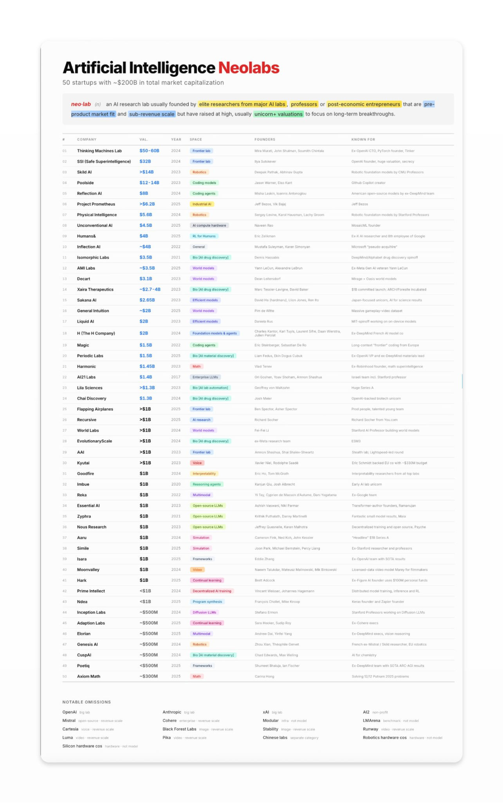

# Resource 1 · Neolab list

| # | Company | Val. | Year | Space | Founders | Known for |
| ---: | --- | --- | ---: | --- | --- | --- |
| 01 | Thinking Machines Lab | $50–60B | 2024 | Frontier lab | Mira Murati, John Schulman, Soumith Chintala | Ex-OpenAI CTO, PyTorch founder, Tinker |
| 02 | SSI (Safe Superintelligence) | $32B | 2024 | Frontier lab | Ilya Sutskever | OpenAI founder, huge valuation, secrecy |
| 03 | Skild AI | >$14B | 2023 | Robotics | Deepak Pathak, Abhinav Gupta | Robotic foundation models by CMU professors |
| 04 | Poolside | $12–14B | 2023 | Coding models | Jason Warner, Eiso Kant | GitHub Copilot creator |
| 05 | Reflection AI | $8B | 2024 | Coding agents | Misha Laskin, Ioannis Antonoglou | American open-source models by ex-DeepMind team |
| 06 | Project Prometheus | >$6.2B | 2025 | Industrial AI | Jeff Bezos, Vik Bajaj | Jeff Bezos |
| 07 | Physical Intelligence | $5.6B | 2024 | Robotics | Sergey Levine, Karol Hausman, Lachy Groom | Robotic foundation models by Stanford professors |
| 08 | Unconventional AI | $4.5B | 2025 | AI compute hardware | Naveen Rao | MosaicML founder |
| 09 | Humans& | $4B | 2025 | RL for Humans | Eric Zelikman | Ex-xAI researcher |
| 10 | Inflection AI | ~$4B | 2022 | General | Mustafa Suleyman, Karen Simonyan | Microsoft “pseudo-acquire” |
| 11 | Isomorphic Labs | $3.5B | 2021 | Bio (AI drug discovery) | Demis Hassabis | DeepMind / Alphabet drug-discovery spinoff |
| 12 | AMI Labs | ~$3.5B | 2025 | World models | Yann LeCun, Alexandre Lebrun | Ex-Meta GenAI; Yann LeCun |
| 13 | Decart | $3.1B | 2023 | World models | Dean Leitersdorf | Mirage = Oasis world models |
| 14 | Xaira Therapeutics | ~$2.7–4B | 2023 | Bio (AI drug discovery) | Marc Tessier-Lavigne, David Baker | $1B committed launch; ARCH / Foresite incubated |
| 15 | Sakana AI | $2.65B | 2023 | Efficient models | David Ha, Llion Jones, Ren Ito | Japan-focused, science, efficient models |
| 16 | General Intuition | ~$2B | 2025 | World models | Fin de Witte | Massive gameplay-video dataset |
| 17 | Liquid AI | $2B | 2023 | Efficient models | Daniela Rus | MIT spinoff; on-device models |
| 18 | H (The H Company) | $2B | 2024 | Foundation models & agents | Charles Kantor, Karl Tuyls, Laurent Sifre, Daan Wierstra, Julien Perolat | Ex-DeepMind French AI model co |
| 19 | Magic | $1.5B | 2022 | Coding agents | Eric Steinberger, Sebastian De Ro | Long-context “frontier” coding from Europe |
| 20 | Periodic Labs | $1.5B | 2025 | Bio (AI material discovery) | Liam Fedus, Ekin Dogus Cubuk | Ex-OpenAI VP and ex-DeepMind materials lead |
| 21 | Harmonic | $1.45B | 2023 | Math | Vlad Tenev | Ex-Robinhood founder; math superintelligence |
| 22 | AI21 Labs | $1.4B | 2017 | Enterprise LLMs | Ori Goshen, Yoav Shoham, Amnon Shashua | Israeli team + Stanford professor |
| 23 | Lila Sciences | >$1.3B | 2023 | Bio (AI lab automation) | Geoffrey von Maltzahn | Large Series A |
| 24 | Chai Discovery | $1.3B | 2024 | Bio (AI drug discovery) | Josh Meier | OpenAI-backed biotech unicorn |
| 25 | Flapping Airplanes | >$1B | 2025 | Frontier lab | Ben Spector, Asher Spector | Prod people; talented young team |
| 26 | Recursive | >$1B | 2025 | AI research | Richard Socher | Richard Socher from You.com |
| 27 | World Labs | >$1B | 2024 | World models | Fei-Fei Li | Stanford professor building world models |
| 28 | EvolutionaryScale | >$1B | 2024 | Bio (AI drug discovery) | ex-Meta research team | ESM3 |
| 29 | AAI | >$1B | 2023 | Frontier lab | Amnon Shashua, Shai Shalev-Shwartz | Stealth lab; Lightspeed-led round |
| 30 | Kyutai | >$1B | 2023 | Voice | Xavier Niel, Rodolphe Saadé | Eric Schmidt–backed EU lab; ~$330M budget |
| 31 | Goodfire | $1B | 2024 | Interpretability | Eric Ho, Tom McGrath | Interpretability researchers from top labs |
| 32 | Imbue | $1B | 2020 | Reasoning agents | Kanjun Qiu, Josh Albrecht | Early AI lab unicorn |
| 33 | Reka | $1B | 2022 | Multimodal | Yi Tay, Cyprien de Masson d'Autume, Dani Yogatama | Ex-Google team |
| 34 | Essential AI | $1B | 2023 | Open-source LLMs | Ashish Vaswani, Niki Parmar | Transformer-author founders; Ramanujan |
| 35 | Zyphra | $1B | 2021 | Open-source LLMs | Krithik Puthalath, Danny Martinelli | Strong small-model results; Maia |
| 36 | Nous Research | $1B | 2023 | Open-source LLMs | Jeffrey Quesnelle, Karan Malhotra | Decentralized training and open source; Psyche |
| 37 | Aaru | $1B | 2024 | Simulation | Cameron Fink, Ned Koh, John Kessler | “Headline” $1B Series A |
| 38 | Simile | $1B | 2025 | Simulation | Joon Park, Michael Bernstein, Percy Liang | Ex-Stanford researchers and professors |
| 39 | Isara | $1B | 2025 | Frameworks | Eddie Zhang | Ex-OpenAI team with SOTA results |
| 40 | Moonvalley | $1B | 2024 | Video | Naeem Talukdar, Mateusz Malinowski, Mik Binkowski | Licensed-data video model Marey for filmmakers |
| 41 | Hark | $1B | 2025 | Continual learning | Brett Adcock | Ex-Figure AI founder; ~$100M personal funds |
| 42 | Prime Intellect | <$1B | 2024 | Decentralized AI training | Vincent Weisser, Johannes Hagemann | Distributed model training, inference, and RL |
| 43 | Ndea | <$1B | 2025 | Program synthesis | François Chollet, Mike Knoop | Keras founder and Zapier founder |
| 44 | Inception Labs | ~$500M | 2024 | Diffusion LLMs | Stefano Ermon | Stanford professors working on diffusion LLMs |
| 45 | Adaption Labs | ~$500M | 2025 | Continual learning | Sara Hooker, Sudip Roy | Ex-Cohere execs |
| 46 | Elorian | ~$500M | 2025 | Multimodal | Andrew Dai, Yinfe Feng | Ex-DeepMind execs; vision reasoning |
| 47 | Genesis AI | ~$500M | 2024 | Robotics | Zhou Xian, Théophile Gervet | French; ex-Mistral / Skild; EU robotics |
| 48 | CuspAI | ~$500M | 2024 | Bio (AI material discovery) | Chad Edwards, Max Welling | AI for chemistry |
| 49 | Poetiq | <$500M | 2025 | Frameworks | Shumeet Bhakija, Ian Fischer | Ex-DeepMind team with SOTA ARC-AGI results |
| 50 | Axiom Math | ~$300M | 2025 | Math | Carina Hong | Solving 12/12 Putnam 2025 problems |

## Notable omissions

| | |
| --- | --- |
| OpenAI | big lab |
| Anthropic | big lab |
| xAI | big lab |
| AI2 | non-profit |
| Mistral | open-source · revenue scale |
| Cohere | enterprise · revenue scale |
| Modular | infra · not model |
| LMArena | benchmark · not model |
| Cartesia | voice · revenue scale |
| Black Forest Labs | image · revenue scale |
| Stability | image · revenue scale |
| Runway | video · revenue scale |
| Luma | video · revenue scale |
| Pika | video · revenue scale |
| Chinese labs | separate category |
| Robotics hardware cos | hardware · not model |
| Silicon hardware cos | hardware · not model |

