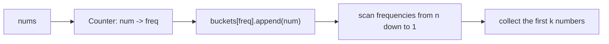
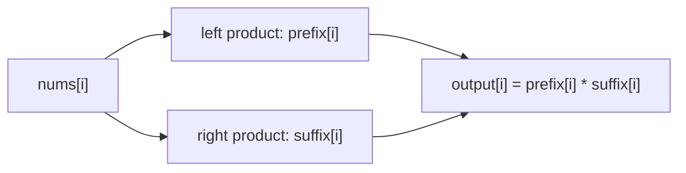

# Design Dynamic Array (Resizable Array)

## Interview Goal

Implement a resizable array, with the focus on understanding contiguous memory, `capacity`, `size`, resize-copying, and amortized complexity.

## Core Design

- `size` represents the current number of elements, and `capacity` represents the capacity of the underlying array.
- `get(i)` and `set(i, val)` must first check `0 <= i < size`.
- If `size == capacity` in `pushback(val)`, first grow to `capacity * 2`, then write the value.
- `popback()` only needs to decrease `size`; in practice, shrinking is usually not forced.

## Complexity

- Random access: `O(1)`
- A single resize: `O(n)`
- Amortized complexity of consecutive `pushback` operations: `O(1)`

## Common Pitfalls

- Forgetting to copy the old elements after resizing.
- Using `capacity` as if it were `size`.
- The initial capacity of an empty array cannot be 0, otherwise doubling it still gives 0.

## Reference Solution

<details class="solution">
<summary>Expand Solution</summary>

The core idea is to maintain three fields: `data / size / capacity`. If the array is full during insertion, allocate a new array with double the capacity, copy the old elements over, and then write the new element.

```text
pushback(x):
  if size == capacity:
    resize(max(1, capacity * 2))
  data[size] = x
  size += 1

resize(new_cap):
  new_data = array(new_cap)
  for i in [0, size):
    new_data[i] = data[i]
  data = new_data
  capacity = new_cap
```

`get` and `set` only access positions where `0 <= i < size`; `popback` returns `data[size - 1]` and then does `size -= 1`.

</details>

<details class="solution">
<summary>Python Implementation and Memory Aids</summary>

The two variables most easily confused in this problem are:

```text
n:
  The current number of valid elements, i.e. the logical length

capacity:
  The actual space allocated in the underlying array
```

`capacity` can be greater than `n`. Positions after `n` in the array are only reserved space and are not part of the current valid array.

```python
class DynamicArray:
    def __init__(self, capacity: int):
        self.capacity = capacity
        self.array = [0 for _ in range(self.capacity)]
        self.n = 0

    def get(self, i: int) -> int:
        return self.array[i]

    def set(self, i: int, n: int) -> None:
        self.array[i] = n

    def pushback(self, n: int) -> None:
        if self.n == self.capacity:
            self.resize()
        self.array[self.n] = n
        self.n += 1

    def popback(self) -> int:
        self.n -= 1
        return self.array[self.n]

    def resize(self) -> None:
        self.capacity *= 2
        new_array = [0 for _ in range(self.capacity)]
        for i in range(self.n):
            new_array[i] = self.array[i]
        self.array = new_array

    def getSize(self) -> int:
        return self.n

    def getCapacity(self) -> int:
        return self.capacity
```

`popback` is lazy: you do not need to actually clear the value in the underlying array back to `0`. As soon as `self.n -= 1`, that position no longer belongs to the valid array; the next `pushback` will overwrite it directly.

Remember it in one sentence:

```text
capacity manages physical space, n manages logical length; popback only moves n and does not clear the array.
```

</details>

## NeetCode Example: Top K Frequent Elements

The problem gives an integer array `nums` and an integer `k`, and asks you to return the `k` elements with the highest frequencies. The output order does not matter.

There are usually two routes for this problem:

1. First use `Counter` to count frequencies, then use a heap to extract the top k.
2. First use `Counter` to count frequencies, then place numbers into "frequency buckets" and collect the answer from high-frequency buckets down to low-frequency buckets.

The heap solution is very natural:

```python
from collections import Counter
import heapq
from typing import List

class Solution:
    def topKFrequent(self, nums: List[int], k: int) -> List[int]:
        count = Counter(nums)
        return heapq.nlargest(k, count.keys(), key=count.get)
```

This is more direct than `nsmallest(..., key=lambda x: -x[1])`: `nlargest` directly expresses "take the k keys with the highest frequencies."

But in interviews, a common follow-up is: can you do it in linear time?

The key observation is that the frequency of any number cannot exceed `len(nums)`. So we can allocate a list of length `n + 1`:

```text
buckets[f] = all numbers that appear f times
```

For example:

```text
nums = [1, 1, 1, 2, 2, 3], k = 2

count:
  1 -> 3
  2 -> 2
  3 -> 1

buckets:
  index 0: []
  index 1: [3]
  index 2: [2]
  index 3: [1]
```

Scanning the buckets from back to front means collecting numbers from highest frequency to lowest:



## Why Bucket Sort Is Better Than a Heap Here

The bottleneck of a heap is that every insert or pop operation must maintain the heap structure, which introduces a `log k` or `log m` factor. Here `m` is the number of distinct values.

Bucket sort takes advantage of the special boundary in this problem: frequencies can only fall in `1..n`. We are not comparing element values. Instead, we directly throw each element into the bucket indexed by its frequency.

```text
heap:
  Need comparisons to maintain the top k
  Time complexity O(n log k) or O(m log k)

bucket:
  The frequency itself is the array index
  Building buckets O(n), reverse scan O(n)
  Total time complexity O(n)
```

The tradeoff is space: bucket sort needs `n + 1` lists, so the space complexity is `O(n)`. If the data is streaming, `n` is very large, and you only want to maintain a live top k, a heap is more suitable. If the problem gives the full array, bucket sort is the theoretically optimal solution here.

## Bucket Sort Solution

<details class="solution" open>
<summary>Expand Solution</summary>

```python
from collections import Counter
from typing import List

class Solution:
    def topKFrequent(self, nums: List[int], k: int) -> List[int]:
        count = Counter(nums)
        buckets = [[] for _ in range(len(nums) + 1)]

        for num, freq in count.items():
            buckets[freq].append(num)

        result = []
        for freq in range(len(buckets) - 1, 0, -1):
            for num in buckets[freq]:
                result.append(num)
                if len(result) == k:
                    return result

        return result
```

Complexity:

- Time complexity: `O(n)`. Counting frequencies is `O(n)`, building buckets is `O(m)`, and the reverse scan is at most `O(n + m)`.
- Space complexity: `O(n)`. Both `Counter` and the buckets require extra space.

</details>

## NeetCode Example: Product of Array Except Self

The problem gives an array `nums` and asks you to return `output`, where:

```text
output[i] = the product of all elements in nums except nums[i]
```

For example:

```text
nums   = [1, 2, 4, 6]
output = [48, 24, 12, 8]
```

The key constraints in this problem are:

```text
O(n) time
No division
```

If division were allowed, the most intuitive method would be to compute the total product first and then divide by `nums[i]`. But that method runs into two issues:

- The follow-up explicitly requires not using division.
- The array may contain `0`, which makes total-product division much more troublesome.

So the standard approach is to split the "product except self" into two sides:

```text
output[i] = product of all numbers to the left * product of all numbers to the right
```

That is:

```text
prefix[i] = nums[0] * nums[1] * ... * nums[i - 1]
suffix[i] = nums[i + 1] * nums[i + 2] * ... * nums[n - 1]
output[i] = prefix[i] * suffix[i]
```

Note that neither `prefix[i]` nor `suffix[i]` includes `nums[i]` itself.

## Why Must `append` Come Before Multiplication?

This is the easiest part of the problem to get wrong.

Suppose:

```text
nums = [1, 2, 4, 6]
```

When scanning from left to right, `pre_cum` means "the product of all numbers to the left of the current `i`." So when we arrive at position `i`:

```python
prefix.append(pre_cum)
pre_cum *= nums[i]
```

The `append` must happen before multiplying by the current element.

Because `prefix[i]` is supposed to be:

```text
nums[0] * ... * nums[i - 1]
```

not:

```text
nums[0] * ... * nums[i]
```

For `nums = [1, 2, 4, 6]`:

```text
i = 0:
  prefix[0] = 1           # there are no elements on the left, so the empty product is 1
  pre_cum *= nums[0] -> 1

i = 1:
  prefix[1] = 1           # nums[0]
  pre_cum *= nums[1] -> 2

i = 2:
  prefix[2] = 2           # nums[0] * nums[1]
  pre_cum *= nums[2] -> 8

i = 3:
  prefix[3] = 8           # nums[0] * nums[1] * nums[2]
```

So:

```text
prefix = [1, 1, 2, 8]
```

The same idea applies to `suffix`, except that it scans from right to left. In your version, `nums[-1 - i]` is used to read from the end, and then `suffix` is reversed at the end:

```text
nums   = [1, 2, 4, 6]
suffix = [48, 24, 6, 1]
```

Finally, multiply position by position:

```text
prefix = [1, 1, 2, 8]
suffix = [48, 24, 6, 1]
output = [48, 24, 12, 8]
```



## Prefix / Suffix Solution

<details class="solution" open>
<summary>Expand Solution</summary>

```python
from typing import List

class Solution:
    def productExceptSelf(self, nums: List[int]) -> List[int]:
        prefix = []
        suffix = []
        pre_cum = 1
        suff_cum = 1

        for i in range(len(nums)):
            prefix.append(pre_cum)
            pre_cum *= nums[i]

            suffix.append(suff_cum)
            suff_cum *= nums[-1 - i]

        suffix = suffix[::-1]

        output = []
        for i in range(len(nums)):
            output.append(prefix[i] * suffix[i])

        return output
```

Complexity:

- Time complexity: `O(n)`, with only a few linear scans.
- Space complexity: `O(n)`, using `prefix`, `suffix`, and `output`.

</details>

## Space-Optimized Version

You can also write the prefix products directly into `output`, then scan from right to left with a variable `suffix` to incorporate the right-side products.

If the return array itself is not counted, this version uses `O(1)` extra space:

```python
from typing import List

class Solution:
    def productExceptSelf(self, nums: List[int]) -> List[int]:
        n = len(nums)
        output = [1] * n

        prefix = 1
        for i in range(n):
            output[i] = prefix
            prefix *= nums[i]

        suffix = 1
        for i in range(n - 1, -1, -1):
            output[i] *= suffix
            suffix *= nums[i]

        return output
```

The meaning of the two scans:

```text
First pass from left to right:
  output[i] first stores the product to the left of i

Second pass from right to left:
  suffix stores the product to the right of i
  output[i] *= suffix
```

This is also the version most recommended for interviews: `O(n)` time, no division, and it naturally handles `0`.
