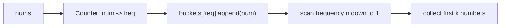
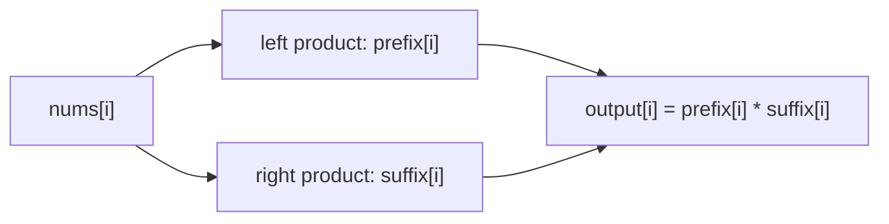

# Design Dynamic Array (Resizable Array)

## 面试目标

实现一个可扩容数组，重点是理解连续内存、容量 capacity、长度 size、扩容复制和摊还复杂度。

## 核心设计

- `size` 表示当前元素个数，`capacity` 表示底层数组容量。
- `get(i)` 和 `set(i, val)` 需要先检查 `0 <= i < size`。
- `pushback(val)` 如果 `size == capacity`，先扩容到 `capacity * 2`，再写入。
- `popback()` 只需要减少 `size`，通常不强制缩容。

## 复杂度

- 随机访问：`O(1)`
- 单次扩容：`O(n)`
- 连续 `pushback` 的摊还复杂度：`O(1)`

## 常见坑

- 扩容后忘记复制旧元素。
- 把 `capacity` 当成 `size` 使用。
- 空数组初始容量不能是 0，否则翻倍仍然是 0。

## 参考解法

<details class="solution">
<summary>展开解法</summary>

核心是维护 `data / size / capacity` 三个字段。插入时如果满了，就申请两倍容量的新数组，把旧元素复制过去，再写入新元素。

```text
pushback(x):
  if size == capacity:
    resize(max(1, capacity * 2))
  data[size] = x
  size += 1

resize(new_cap):
  new_data = array(new_cap)
  for i in [0, size):
    new_data[i] = data[i]
  data = new_data
  capacity = new_cap
```

`get`、`set` 只访问 `0 <= i < size` 的位置；`popback` 返回 `data[size - 1]` 后把 `size -= 1`。

</details>

<details class="solution">
<summary>Python 写法与记忆点</summary>

这题最容易混的是两个变量：

```text
n:
  当前有效元素个数，也就是逻辑长度

capacity:
  底层数组真实分配的空间
```

`capacity` 可以大于 `n`。数组里 `n` 之后的位置只是预留空间，不属于当前有效数组。

```python
class DynamicArray:
    def __init__(self, capacity: int):
        self.capacity = capacity
        self.array = [0 for _ in range(self.capacity)]
        self.n = 0

    def get(self, i: int) -> int:
        return self.array[i]

    def set(self, i: int, n: int) -> None:
        self.array[i] = n

    def pushback(self, n: int) -> None:
        if self.n == self.capacity:
            self.resize()
        self.array[self.n] = n
        self.n += 1

    def popback(self) -> int:
        self.n -= 1
        return self.array[self.n]

    def resize(self) -> None:
        self.capacity *= 2
        new_array = [0 for _ in range(self.capacity)]
        for i in range(self.n):
            new_array[i] = self.array[i]
        self.array = new_array

    def getSize(self) -> int:
        return self.n

    def getCapacity(self) -> int:
        return self.capacity
```

`popback` 是 lazy 的：不需要真的把底层数组里的值清成 `0`。只要 `self.n -= 1`，那个位置就已经不属于有效数组；下一次 `pushback` 会直接覆盖它。

一句话记：

```text
capacity 管物理空间，n 管逻辑长度；popback 只移动 n，不清数组。
```

</details>

## NeetCode 例题：Top K Frequent Elements

题目给定一个整数数组 `nums` 和整数 `k`，返回出现频率最高的 `k` 个元素。输出顺序不限。

这题通常有两条路线：

1. 先用 `Counter` 统计频率，再用堆取出 top k。
2. 先用 `Counter` 统计频率，再把数字放进“频率桶”，从高频桶往低频桶收集答案。

堆解法很自然：

```python
from collections import Counter
import heapq
from typing import List

class Solution:
    def topKFrequent(self, nums: List[int], k: int) -> List[int]:
        count = Counter(nums)
        return heapq.nlargest(k, count.keys(), key=count.get)
```

这个写法比 `nsmallest(..., key=lambda x: -x[1])` 更直接：`nlargest` 就是在表达“取频率最大的 k 个 key”。

但面试里这题经常会追问：能不能做到线性时间？

关键观察是：一个数的出现频率不可能超过 `len(nums)`。所以我们可以开一个长度为 `n + 1` 的列表：

```text
buckets[f] = 所有出现了 f 次的数字
```

例如：

```text
nums = [1, 1, 1, 2, 2, 3], k = 2

count:
  1 -> 3
  2 -> 2
  3 -> 1

buckets:
  index 0: []
  index 1: [3]
  index 2: [2]
  index 3: [1]
```

从后往前扫 bucket，就是从最高频到最低频收集数字：



## 为什么 bucket sort 比堆更好

堆的瓶颈在于：每放入或弹出一个元素，都要维护堆结构，所以会产生 `log k` 或 `log m` 的因子。这里 `m` 是不同数字的数量。

bucket sort 利用了这道题的特殊边界：频率只能落在 `1..n`。我们不是比较元素大小，而是直接把元素丢到“频率下标”对应的桶里。

```text
heap:
  需要通过比较维护 top k
  时间复杂度 O(n log k) 或 O(m log k)

bucket:
  频率本身就是数组下标
  建桶 O(n)，倒序扫描 O(n)
  总时间复杂度 O(n)
```

代价是空间：bucket 需要 `n + 1` 个列表，所以空间是 `O(n)`。如果是流式数据、`n` 很大且只想维护实时 top k，堆更合适；如果题目给的是完整数组，bucket sort 是这题的理论最优解。

## Bucket Sort 解法

<details class="solution" open>
<summary>展开解法</summary>

```python
from collections import Counter
from typing import List

class Solution:
    def topKFrequent(self, nums: List[int], k: int) -> List[int]:
        count = Counter(nums)
        buckets = [[] for _ in range(len(nums) + 1)]

        for num, freq in count.items():
            buckets[freq].append(num)

        result = []
        for freq in range(len(buckets) - 1, 0, -1):
            for num in buckets[freq]:
                result.append(num)
                if len(result) == k:
                    return result

        return result
```

复杂度：

- 时间复杂度：`O(n)`。统计频率 `O(n)`，建桶 `O(m)`，倒序扫描最多 `O(n + m)`。
- 空间复杂度：`O(n)`。`Counter` 和 bucket 都需要额外空间。

</details>

## NeetCode 例题：Product of Array Except Self

题目给定数组 `nums`，要求返回 `output`，其中：

```text
output[i] = nums 中除了 nums[i] 以外所有元素的乘积
```

例如：

```text
nums   = [1, 2, 4, 6]
output = [48, 24, 12, 8]
```

这题的关键限制是：

```text
O(n) time
不能用除法
```

如果可以用除法，最直觉的做法是先算总乘积，再除以 `nums[i]`。但这个方法会被两个问题卡住：

- 题目 follow-up 明确要求不用除法。
- 数组里可能有 `0`，总乘积除法会变得很麻烦。

所以标准做法是把“除了自己以外的乘积”拆成两边：

```text
output[i] = 左边所有数的乘积 * 右边所有数的乘积
```

也就是：

```text
prefix[i] = nums[0] * nums[1] * ... * nums[i - 1]
suffix[i] = nums[i + 1] * nums[i + 2] * ... * nums[n - 1]
output[i] = prefix[i] * suffix[i]
```

注意 `prefix[i]` 和 `suffix[i]` 都不包含 `nums[i]` 自己。

## 为什么 append 要放在乘法前面？

这是这题最容易写错的点。

假设：

```text
nums = [1, 2, 4, 6]
```

从左往右扫时，`pre_cum` 表示“当前 i 左边所有数的乘积”。所以进入位置 `i` 时：

```python
prefix.append(pre_cum)
pre_cum *= nums[i]
```

append 必须在乘当前元素之前。

因为 `prefix[i]` 要的是：

```text
nums[0] * ... * nums[i - 1]
```

而不是：

```text
nums[0] * ... * nums[i]
```

对 `nums = [1, 2, 4, 6]` 来说：

```text
i = 0:
  prefix[0] = 1           # 左边没有元素，空乘积是 1
  pre_cum *= nums[0] -> 1

i = 1:
  prefix[1] = 1           # nums[0]
  pre_cum *= nums[1] -> 2

i = 2:
  prefix[2] = 2           # nums[0] * nums[1]
  pre_cum *= nums[2] -> 8

i = 3:
  prefix[3] = 8           # nums[0] * nums[1] * nums[2]
```

所以：

```text
prefix = [1, 1, 2, 8]
```

suffix 同理，只是从右往左扫。你的写法里用 `nums[-1 - i]` 从末尾开始读，然后最后把 suffix 反转回来：

```text
nums   = [1, 2, 4, 6]
suffix = [48, 24, 6, 1]
```

最后逐位相乘：

```text
prefix = [1, 1, 2, 8]
suffix = [48, 24, 6, 1]
output = [48, 24, 12, 8]
```



## Prefix / Suffix 解法

<details class="solution" open>
<summary>展开解法</summary>

```python
from typing import List

class Solution:
    def productExceptSelf(self, nums: List[int]) -> List[int]:
        prefix = []
        suffix = []
        pre_cum = 1
        suff_cum = 1

        for i in range(len(nums)):
            prefix.append(pre_cum)
            pre_cum *= nums[i]

            suffix.append(suff_cum)
            suff_cum *= nums[-1 - i]

        suffix = suffix[::-1]

        output = []
        for i in range(len(nums)):
            output.append(prefix[i] * suffix[i])

        return output
```

复杂度：

- 时间复杂度：`O(n)`，只做几次线性扫描。
- 空间复杂度：`O(n)`，用了 `prefix`、`suffix` 和 `output`。

</details>

## 空间优化版本

还可以把 `prefix` 直接写进 `output`，再从右往左用一个变量 `suffix` 补右侧乘积。

这个版本不算返回数组的话，额外空间是 `O(1)`：

```python
from typing import List

class Solution:
    def productExceptSelf(self, nums: List[int]) -> List[int]:
        n = len(nums)
        output = [1] * n

        prefix = 1
        for i in range(n):
            output[i] = prefix
            prefix *= nums[i]

        suffix = 1
        for i in range(n - 1, -1, -1):
            output[i] *= suffix
            suffix *= nums[i]

        return output
```

两次扫描的含义：

```text
第一次从左到右:
  output[i] 先保存 i 左边的乘积

第二次从右到左:
  suffix 保存 i 右边的乘积
  output[i] *= suffix
```

这也是面试里最推荐写的版本：`O(n)` 时间，不用除法，能自然处理 `0`。
