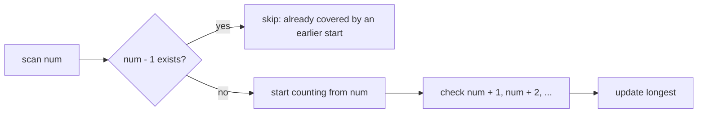
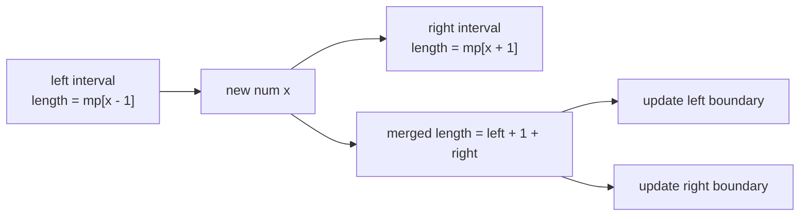
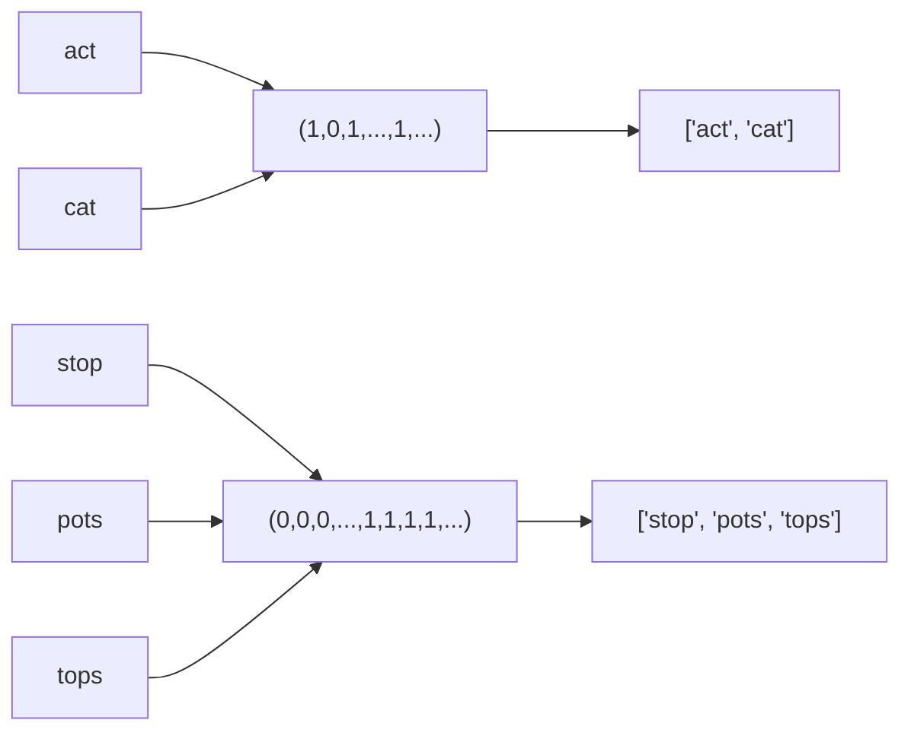

# Design Hash Table

## Interview Goal

Implement a hash table, with emphasis on hash functions, bucket arrays, collision handling, resizing, and load factor.

## Core Design

- Use `hash(key) % capacity` to locate the bucket.
- Resolve collisions with separate chaining: each bucket stores a group of key-value pairs.
- `put` must distinguish between updating an existing key and inserting a new key.
- When the load factor gets too high, resize and rehash.

## Complexity

- Average search/insertion/deletion: `O(1)`
- `O(n)` when collisions become severe
- Resize rehash: `O(n)`.

## Common Pitfalls

- Copying buckets during resize without recomputing indices.
- Forgetting to maintain `size` when deleting a key.
- Lacking a stable hashing strategy when object references are used as keys.

## Hash Table Reference Solution

<details class="solution">
<summary>Expand Solution</summary>

Separate chaining is the most direct approach: each position in the bucket array stores a small list, and each list contains `(key, value)` pairs.

```text
put(key, value):
  bucket = buckets[hash(key) % capacity]
  for pair in bucket:
    if pair.key == key:
      pair.value = value
      return
  bucket.append((key, value))
  size += 1
  if size / capacity > 0.75: resize()
```

When resizing, you cannot copy buckets as-is. You must recompute the new bucket index for every key.

</details>

## General Pattern: Use Storage to Eliminate Repeated Scans

In many Hash Table / Hash Set problems, you are not really being tested on "how to write a dict." What is actually being tested is a more general pattern:

```text
Naive approach:
  Start from each position and scan outward once
  Many intervals, chains, and states get recomputed repeatedly

Hash-based approach:
  Store queryable information in advance
  Start only from positions that are truly necessary
  Or record boundary states and merge directly later
```

A classic example is Longest Consecutive Sequence.

Given a set of integers, find the length of the longest consecutive sequence. For example:

```text
nums = [100, 4, 200, 1, 3, 2]

The longest consecutive sequence is:
1, 2, 3, 4

The answer is 4
```

The brute-force method scans `1,2,3,4` starting from `1`, then scans `2,3,4` starting from `2`, then scans `3,4` starting from `3`. This work is repeated.

The following two `O(n)` solutions both eliminate that repetition:

- Hash Set: scan only from "sequence starting points."
- Hash Map: record the boundary lengths of sequences and merge the left and right segments directly when a new number arrives.

## NeetCode Example: Longest Consecutive Sequence

### Solution 1: Hash Set, Start Only from Sequence Starts

A number `x` is the start of a consecutive sequence if and only if:

```text
x - 1 is not in the set
```

If `x - 1` exists, then `x` is not a starting point. It is already covered by the earlier sequence, so there is no need to count from here again.

```text
numSet = {1, 2, 3, 4, 100, 200}

1:
  0 is not in the set
  so 1 is a starting point
  count rightward: 1,2,3,4

2:
  1 is in the set
  not a starting point, skip

3:
  2 is in the set
  not a starting point, skip

4:
  3 is in the set
  not a starting point, skip
```



That is why the total time is still `O(n)` even though there is a `while` loop inside: each consecutive chain is fully scanned only once, starting from its first element.

<details class="solution" open>
<summary>Hash Set Solution</summary>

```python
from typing import List

class Solution:
    def longestConsecutive(self, nums: List[int]) -> int:
        num_set = set(nums)
        longest = 0

        for num in num_set:
            if num - 1 not in num_set:
                length = 1

                while num + length in num_set:
                    length += 1

                longest = max(longest, length)

        return longest
```

Complexity:

- Time complexity: `O(n)` average.
- Space complexity: `O(n)`.

Key points:

- Iterate over `num_set`, not the original array, which naturally removes duplicates.
- Enter the `while` loop only when `num - 1 not in num_set`.
- Do not assume a nested loop means `O(n^2)`; here each consecutive segment is scanned only once.

</details>

### Solution 2: Hash Map, Record Boundary Lengths

The Hash Set solution is "find a starting point, then scan rightward." The Hash Map solution is more like merging intervals online.

When processing a new number `x`, it may:

- Form a new sequence of length 1 by itself.
- Attach to the end of the left sequence.
- Attach to the front of the right sequence.
- Connect the left and right sequences into one.

You only need to inspect two neighbors:

```text
left = mp[x - 1]
right = mp[x + 1]
length = left + 1 + right
```

Then update the left and right boundaries of the new interval:

```text
left boundary  = x - left
right boundary = x + right

mp[left boundary] = length
mp[right boundary] = length
mp[x] = length
```

The values at the interior points do not need to be fully updated, because only boundary information is truly useful for later merges.

Example:

```text
Already have:
1,2    boundary length 2
4      boundary length 1

Insert 3:
left = mp[2] = 2
right = mp[4] = 1
length = 2 + 1 + 1 = 4

New interval:
1,2,3,4

Update:
mp[1] = 4
mp[4] = 4
mp[3] = 4
```



The essence of this method is to store, in advance, "how far can I scan to the left?" and "how far can I scan to the right?" at the boundaries. When a new number arrives, you do not scan; you only inspect the left and right neighbors and update the boundaries.

<details class="solution" open>
<summary>Hash Map Boundary-Merging Solution</summary>

```python
from collections import defaultdict
from typing import List

class Solution:
    def longestConsecutive(self, nums: List[int]) -> int:
        length_at = defaultdict(int)
        longest = 0

        for num in nums:
            if length_at[num] != 0:
                continue

            left = length_at[num - 1]
            right = length_at[num + 1]
            length = left + 1 + right

            length_at[num] = length
            length_at[num - left] = length
            length_at[num + right] = length

            longest = max(longest, length)

        return longest
```

Complexity:

- Time complexity: `O(n)` average.
- Space complexity: `O(n)`.

Key points:

- `if length_at[num] != 0: continue` is used to skip duplicate numbers.
- `left` is the length of the left consecutive segment, and `right` is the length of the right consecutive segment.
- Updating only the left and right boundaries of the new interval is enough; boundary lengths are the information needed for later merges.

</details>

### How to Choose Between the Two Approaches

| Method | Idea | Advantage | Watch Out For |
| --- | --- | --- | --- |
| Hash Set | Count only from numbers with no predecessor | Most intuitive; recommended as the first interview solution | You must clearly explain why the total time is still `O(n)` |
| Hash Map boundary merge | Record the boundary lengths of each consecutive segment | More general, similar to interval merging / union-find | Easy to make mistakes in boundary updates and duplicate-number handling |

The more commonly used method is the Hash Set starting-point approach. The Hash Map boundary approach is still worth remembering because it demonstrates a general technique:

```text
If the repeated scan is over a continuous structure,
you can consider storing summary information for that structure at the boundaries,
then merge directly through the boundaries next time.
```

## NeetCode Example: Group Anagrams

The goal of this problem is to group all anagrams together. Whether two strings belong to the same group does not depend on character order, only on how many times each letter appears.

The most direct key is the sorted string:

```text
"act"  -> "act"
"cat"  -> "act"
"stop" -> "opst"
```

This works, but each string must be sorted, which costs `O(k log k)` when the string length is `k`.

A key that fits hash tables better is a fixed-length frequency array of size 26:

```text
"act"
  a b c d ... t ...
  1 0 1 0 ... 1 ...

"cat"
  a b c d ... t ...
  1 0 1 0 ... 1 ...
```

These two frequency arrays are exactly the same, so they fall into the same hash-table bucket.



Key points:

- `freq[ord(char) - ord('a')] += 1` maps a character to slot `0..25`.
- Python `list` cannot be used as a dict key because a list is mutable and unhashable.
- So you must use `tuple(freq)` as the key.
- Scanning each string still takes `O(k)`, but the key length is fixed at 26; compared with the sorting method, this avoids the `O(k log k)` sorting cost.

## Group Anagrams Solution

<details class="solution" open>
<summary>Expand Solution</summary>

```python
from collections import defaultdict
from typing import List

class Solution:
    def groupAnagrams(self, strs: List[str]) -> List[List[str]]:
        result = defaultdict(list)

        for s in strs:
            freq = [0 for _ in range(26)]
            for char in s:
                freq[ord(char) - ord('a')] += 1

            result[tuple(freq)].append(s)

        return list(result.values())
```

If `n` is the number of strings and `k` is the average string length:

- Time complexity: `O(n * (k + 26))`, usually written as `O(nk)`.
- Space complexity: `O(n * k)`, because the output itself must store all strings; the extra hash-table key cost is one 26-dimensional tuple per group.

</details>
