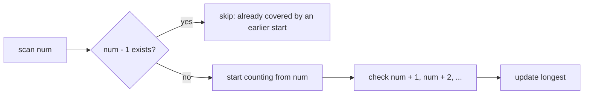
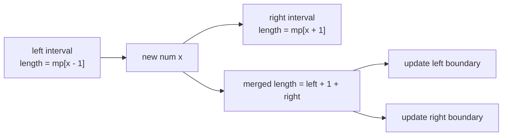
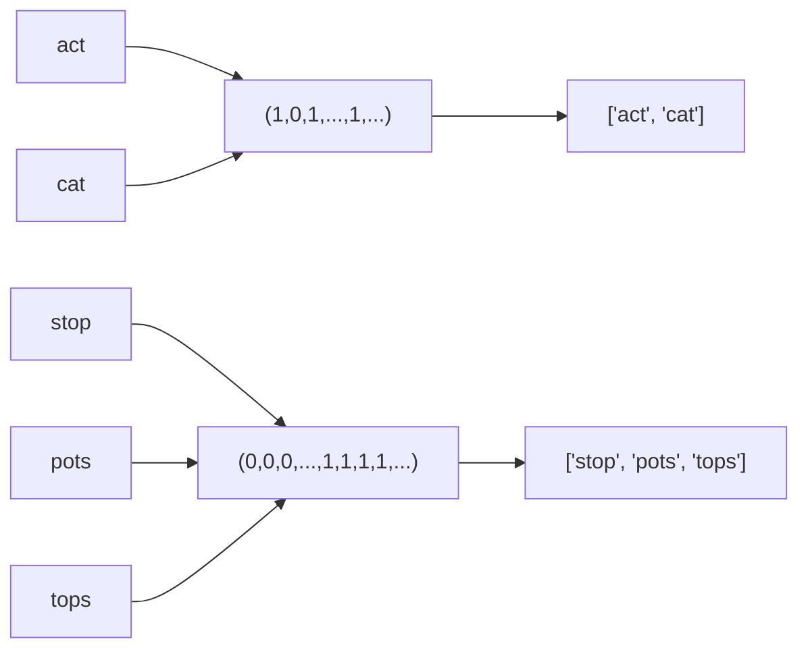

# Design Hash Table

## 面试目标

实现哈希表，重点是哈希函数、桶数组、冲突处理、扩容和负载因子。

## 核心设计

- 用 `hash(key) % capacity` 定位桶。
- 冲突可用链地址法：每个桶保存一组 key-value。
- `put` 需要区分更新已有 key 和插入新 key。
- 当负载因子过高时扩容并 rehash。

## 复杂度

- 平均查找/插入/删除：`O(1)`
- 冲突严重时：`O(n)`
- 扩容 rehash：`O(n)`。

## 常见坑

- 扩容后只复制桶，没有重新计算下标。
- 删除 key 时忘记维护 size。
- 用对象引用做 key 时没有稳定哈希策略。

## Hash Table 参考解法

<details class="solution">
<summary>展开解法</summary>

链地址法最直接：桶数组中每个位置保存一个小列表，列表里是 `(key, value)`。

```text
put(key, value):
  bucket = buckets[hash(key) % capacity]
  for pair in bucket:
    if pair.key == key:
      pair.value = value
      return
  bucket.append((key, value))
  size += 1
  if size / capacity > 0.75: resize()
```

扩容时不能原样复制桶，要重新对每个 key 计算新桶下标。

</details>

## 通用思路：用存储换掉重复扫描

Hash Table / Hash Set 很多题不是在考“怎么写一个 dict”，而是在考一个更 general 的思路：

```text
朴素做法:
  从每个位置出发，向外扫一遍
  很多区间、链条、状态会被重复计算

哈希做法:
  先把可查询信息存起来
  每次只在真正必要的位置开始
  或者把边界状态记录下来，后面直接合并
```

典型问题是 Longest Consecutive Sequence。

给定一组整数，求最长连续序列长度。例如：

```text
nums = [100, 4, 200, 1, 3, 2]

最长连续序列是:
1, 2, 3, 4

答案是 4
```

暴力法会从 `1` 开始扫 `1,2,3,4`，又从 `2` 开始扫 `2,3,4`，又从 `3` 开始扫 `3,4`。这些工作是重复的。

下面两种 `O(n)` 解法都在消掉这个重复：

- Hash Set：只从“序列起点”开始扫。
- Hash Map：记录序列边界长度，新数字进来时直接合并左右两段。

## NeetCode 例题：Longest Consecutive Sequence

### 解法一：Hash Set，只从起点开始

一个数 `x` 是连续序列的起点，当且仅当：

```text
x - 1 不在集合里
```

如果 `x - 1` 存在，说明 `x` 不是起点。它会被前面的序列覆盖，不需要从这里重新数。

```text
numSet = {1, 2, 3, 4, 100, 200}

1:
  0 不在 set
  所以 1 是起点
  向右数 1,2,3,4

2:
  1 在 set
  不是起点，跳过

3:
  2 在 set
  不是起点，跳过

4:
  3 在 set
  不是起点，跳过
```



这就是为什么虽然里面有 `while`，总时间仍然是 `O(n)`：每条连续链只会从起点完整扫一次。

<details class="solution" open>
<summary>Hash Set 解法</summary>

```python
from typing import List

class Solution:
    def longestConsecutive(self, nums: List[int]) -> int:
        num_set = set(nums)
        longest = 0

        for num in num_set:
            if num - 1 not in num_set:
                length = 1

                while num + length in num_set:
                    length += 1

                longest = max(longest, length)

        return longest
```

复杂度：

- 时间复杂度：`O(n)` average。
- 空间复杂度：`O(n)`。

关键点：

- 遍历 `num_set`，不是原数组，可以自然去重。
- 只有 `num - 1 not in num_set` 时才进入 `while`。
- 不要误以为有嵌套循环就是 `O(n^2)`；这里每个连续段只被扫描一次。

</details>

### 解法二：Hash Map，记录边界长度

Hash Set 解法是“找到起点再向右扫”。Hash Map 解法更像在线合并区间。

处理一个新数字 `x` 时，它可能：

- 自己形成长度为 1 的新序列。
- 接到左边序列后面。
- 接到右边序列前面。
- 把左边和右边两段连成一段。

只需要看两个邻居：

```text
left = mp[x - 1]
right = mp[x + 1]
length = left + 1 + right
```

然后更新新区间的左右边界：

```text
left boundary  = x - left
right boundary = x + right

mp[left boundary] = length
mp[right boundary] = length
mp[x] = length
```

中间点的值可以不完全更新，因为之后真正有用的是边界。

例子：

```text
已经有:
1,2    边界长度 2
4      边界长度 1

插入 3:
left = mp[2] = 2
right = mp[4] = 1
length = 2 + 1 + 1 = 4

新区间:
1,2,3,4

更新:
mp[1] = 4
mp[4] = 4
mp[3] = 4
```



这个方法的本质是：把“向左扫有多长、向右扫有多长”提前存在边界上。新数字进来时不用扫描，只查左右邻居并更新边界。

<details class="solution" open>
<summary>Hash Map 边界合并解法</summary>

```python
from collections import defaultdict
from typing import List

class Solution:
    def longestConsecutive(self, nums: List[int]) -> int:
        length_at = defaultdict(int)
        longest = 0

        for num in nums:
            if length_at[num] != 0:
                continue

            left = length_at[num - 1]
            right = length_at[num + 1]
            length = left + 1 + right

            length_at[num] = length
            length_at[num - left] = length
            length_at[num + right] = length

            longest = max(longest, length)

        return longest
```

复杂度：

- 时间复杂度：`O(n)` average。
- 空间复杂度：`O(n)`。

关键点：

- `if length_at[num] != 0: continue` 用来跳过重复数字。
- `left` 是左侧连续段长度，`right` 是右侧连续段长度。
- 只更新新区间的左右边界就够了；边界长度才是后续合并时需要的信息。

</details>

### 两种写法怎么选

| 方法 | 思路 | 优点 | 注意点 |
| --- | --- | --- | --- |
| Hash Set | 只从没有前驱的数开始数 | 最直观，面试推荐优先写 | 要讲清楚为什么整体是 `O(n)` |
| Hash Map 边界合并 | 记录每个连续段的边界长度 | 更 general，像区间合并 / union-find | 容易写错边界更新和重复数字处理 |

更常用的是 Hash Set 起点法。Hash Map 边界法值得记住，因为它体现了一类通用技巧：

```text
如果重复扫描的是一段连续结构，
可以考虑把这段结构的摘要信息存在边界上，
下一次通过边界直接合并。
```

## NeetCode 例题：Group Anagrams

这道题的目标是把所有字母异位词放到同一组。两个字符串是否属于同一组，不取决于字符顺序，只取决于每个字母出现了多少次。

最直接的 key 是排序后的字符串：

```text
"act"  -> "act"
"cat"  -> "act"
"stop" -> "opst"
```

这个方法能过，但每个字符串都要排序，单个字符串长度为 `k` 时是 `O(k log k)`。

更适合哈希表的 key 是一个长度固定为 26 的字符频率数组：

```text
"act"
  a b c d ... t ...
  1 0 1 0 ... 1 ...

"cat"
  a b c d ... t ...
  1 0 1 0 ... 1 ...
```

这两个频率数组完全相同，所以它们会落到同一个哈希表 bucket 里。



关键点：

- `freq[ord(char) - ord('a')] += 1` 把字符映射到 `0..25` 的槽位。
- Python 的 `list` 不能作为 dict key，因为 list 可变、不可哈希。
- 所以要用 `tuple(freq)` 作为 key。
- 扫描字符串仍然需要 `O(k)`，但 key 的长度固定为 26；相比排序法，省掉了 `O(k log k)` 的排序成本。

## Group Anagrams 解法

<details class="solution" open>
<summary>展开解法</summary>

```python
from collections import defaultdict
from typing import List

class Solution:
    def groupAnagrams(self, strs: List[str]) -> List[List[str]]:
        result = defaultdict(list)

        for s in strs:
            freq = [0 for _ in range(26)]
            for char in s:
                freq[ord(char) - ord('a')] += 1

            result[tuple(freq)].append(s)

        return list(result.values())
```

如果 `n` 是字符串数量，`k` 是平均字符串长度：

- 时间复杂度：`O(n * (k + 26))`，通常写成 `O(nk)`。
- 空间复杂度：`O(n * k)`，输出本身需要保存所有字符串；哈希表 key 额外是每组一个 26 维 tuple。

</details>
