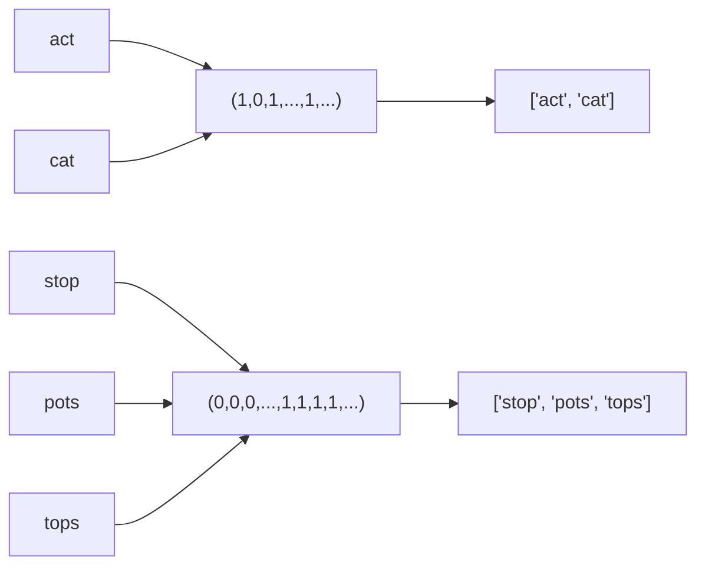
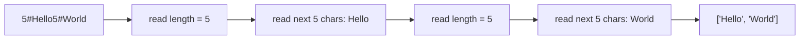

# Design Hash Table

## 面试目标

实现哈希表，重点是哈希函数、桶数组、冲突处理、扩容和负载因子。

## 核心设计

- 用 `hash(key) % capacity` 定位桶。
- 冲突可用链地址法：每个桶保存一组 key-value。
- `put` 需要区分更新已有 key 和插入新 key。
- 当负载因子过高时扩容并 rehash。

## 复杂度

- 平均查找/插入/删除：`O(1)`
- 冲突严重时：`O(n)`
- 扩容 rehash：`O(n)`。

## 常见坑

- 扩容后只复制桶，没有重新计算下标。
- 删除 key 时忘记维护 size。
- 用对象引用做 key 时没有稳定哈希策略。

## 参考解法

<details class="solution">
<summary>展开解法</summary>

链地址法最直接：桶数组中每个位置保存一个小列表，列表里是 `(key, value)`。

```text
put(key, value):
  bucket = buckets[hash(key) % capacity]
  for pair in bucket:
    if pair.key == key:
      pair.value = value
      return
  bucket.append((key, value))
  size += 1
  if size / capacity > 0.75: resize()
```

扩容时不能原样复制桶，要重新对每个 key 计算新桶下标。

</details>

```quiz
title: 练习 1
question: 哈希表扩容后为什么需要 rehash？
answer: B
A. 为了让值变大
B. capacity 改变后 key 对应的桶下标可能改变
C. 为了把所有 key 排序
explanation: 桶下标依赖 `hash(key) % capacity`，容量变化会改变映射。
```

```quiz
title: 练习 2
question: 链地址法如何处理哈希冲突？
answer: A
A. 同一个桶里保存多个 key-value
B. 直接丢弃新 key
C. 把数组改成二叉堆
explanation: 链地址法让冲突元素共存于同一个桶。
```

## NeetCode 例题：Group Anagrams

这道题的目标是把所有字母异位词放到同一组。两个字符串是否属于同一组，不取决于字符顺序，只取决于每个字母出现了多少次。

最直接的 key 是排序后的字符串：

```text
"act"  -> "act"
"cat"  -> "act"
"stop" -> "opst"
```

这个方法能过，但每个字符串都要排序，单个字符串长度为 `k` 时是 `O(k log k)`。

更适合哈希表的 key 是一个长度固定为 26 的字符频率数组：

```text
"act"
  a b c d ... t ...
  1 0 1 0 ... 1 ...

"cat"
  a b c d ... t ...
  1 0 1 0 ... 1 ...
```

这两个频率数组完全相同，所以它们会落到同一个哈希表 bucket 里。



关键点：

- `freq[ord(char) - ord('a')] += 1` 把字符映射到 `0..25` 的槽位。
- Python 的 `list` 不能作为 dict key，因为 list 可变、不可哈希。
- 所以要用 `tuple(freq)` 作为 key。
- 扫描字符串仍然需要 `O(k)`，但 key 的长度固定为 26；相比排序法，省掉了 `O(k log k)` 的排序成本。

## Group Anagrams 解法

<details class="solution" open>
<summary>展开解法</summary>

```python
from collections import defaultdict
from typing import List


class Solution:
    def groupAnagrams(self, strs: List[str]) -> List[List[str]]:
        result = defaultdict(list)

        for s in strs:
            freq = [0 for _ in range(26)]
            for char in s:
                freq[ord(char) - ord('a')] += 1

            result[tuple(freq)].append(s)

        return list(result.values())
```

如果 `n` 是字符串数量，`k` 是平均字符串长度：

- 时间复杂度：`O(n * (k + 26))`，通常写成 `O(nk)`。
- 空间复杂度：`O(n * k)`，输出本身需要保存所有字符串；哈希表 key 额外是每组一个 26 维 tuple。

</details>

```quiz
title: 练习 3
question: Group Anagrams 为什么可以用 26 维字符频率 tuple 作为哈希表 key？
answer: B
A. 因为异位词排序后长度一定不同
B. 因为小写英文字母表固定，频率向量能唯一表示每个字符串的字符 multiset
C. 因为 tuple 会自动忽略字符出现次数
explanation: 异位词拥有完全相同的字符计数。把 26 个字母的出现次数组成 tuple，就得到一个可哈希且固定长度的签名。
```

## NeetCode 例题：Encode and Decode Strings

这题更准确地说是一个**字符串序列化协议**问题。输入是一个字符串列表：

```text
["Hello", "World"]
```

要把它编码成一个字符串，跨机器传输后再完整解码回来。难点在于：每个字符串里可以出现任意 ASCII 字符，所以不能假设某个普通字符一定不会出现在原字符串里。

### 为什么不能直接用逗号分隔？

如果直接写：

```text
["ab", "cd"]      -> "ab,cd"
["ab,cd"]         -> "ab,cd"
```

解码器看到 `"ab,cd"` 时，不知道它原来是一个字符串，还是两个字符串。

同样，不能随便选 `#`、`|`、空格、换行做分隔符，因为题目允许字符串包含任意 256 个 ASCII 字符。只要分隔符可能出现在原字符串里，协议就会有歧义。

### 长度前缀：先告诉我接下来读几个字符

稳定做法是给每个字符串加一个长度前缀：

```text
len + "#" + string
```

例如：

```text
["Hello", "World"]
  -> "5#Hello5#World"

["", "a#b", "x,y"]
  -> "0#3#a#b3#x,y"
```

解码时不需要猜分隔符：

```text
读数字直到 #
  -> 得到当前字符串长度 n
跳过 #
读取接下来的 n 个字符
  -> 得到原字符串
继续读下一个 length prefix
```



### 为什么这种方式接近最优？

这里的“最优”不是说信息论上编码长度绝对最短，而是说它在面试和工程实现里满足几个关键性质：

| 性质 | 为什么重要 |
| --- | --- |
| 无歧义 | 每段数据都有明确长度，不依赖特殊分隔符 |
| 支持任意字符 | 原字符串里可以出现逗号、`#`、换行、空字符等 |
| 线性时间 | encode 和 decode 都只扫描总字符数一次 |
| 不需要 escaping | 不用把 `,` 变成 `\,`，也不用处理反斜杠连锁转义 |
| 流式友好 | 解码器知道长度后，可以直接读取固定字节数 |

对比 escaping 方案：

```text
comma delimiter + escape comma
```

看起来可行，但你还要处理：

```text
原字符串里有逗号怎么办？
原字符串里有反斜杠怎么办？
连续转义怎么解析？
空字符串怎么表示？
```

长度前缀把这些问题全部绕开。协议只依赖两个事实：

1. 长度前缀由数字组成。
2. 第一个 `#` 只用来结束长度字段，不属于 payload。

就算 payload 里有 `#`，也没关系，因为解码器已经知道应该读几个字符。

## Encode and Decode Strings 解法

<details class="solution" open>
<summary>展开解法</summary>

```python
from typing import List


class Solution:
    def encode(self, strs: List[str]) -> str:
        encoded = []
        for s in strs:
            encoded.append(str(len(s)))
            encoded.append("#")
            encoded.append(s)
        return "".join(encoded)

    def decode(self, s: str) -> List[str]:
        result = []
        i = 0

        while i < len(s):
            j = i
            while s[j] != "#":
                j += 1

            length = int(s[i:j])
            start = j + 1
            result.append(s[start:start + length])
            i = start + length

        return result
```

复杂度：

- 设所有字符串总长度为 `N`。
- encode 时间复杂度：`O(N)`。
- decode 时间复杂度：`O(N)`。
- 额外空间：`O(N)`，输出和编码字符串本身需要空间。

</details>

```quiz
title: 练习 4
question: Encode and Decode Strings 为什么不能直接用逗号连接所有字符串？
answer: B
A. 因为逗号在 Python 里不能出现在字符串中
B. 因为原字符串本身可能包含逗号，解码时会产生歧义
C. 因为逗号会让时间复杂度变成 O(n^2)
explanation: 如果 payload 里也可能出现逗号，那么 `"ab,cd"` 无法判断原来是 `["ab", "cd"]` 还是 `["ab,cd"]`。
```

```quiz
title: 练习 5
question: `len#string` 这种长度前缀编码的核心优势是什么？
answer: C
A. 它让字符串排序更快
B. 它要求原字符串不能包含 `#`
C. 它让解码器先知道 payload 长度，因此 payload 中可以包含任意字符
explanation: `#` 只分隔长度字段和 payload。payload 读多少字符由 length 决定，所以 payload 里出现 `#`、逗号或换行都不会破坏解码。
```
