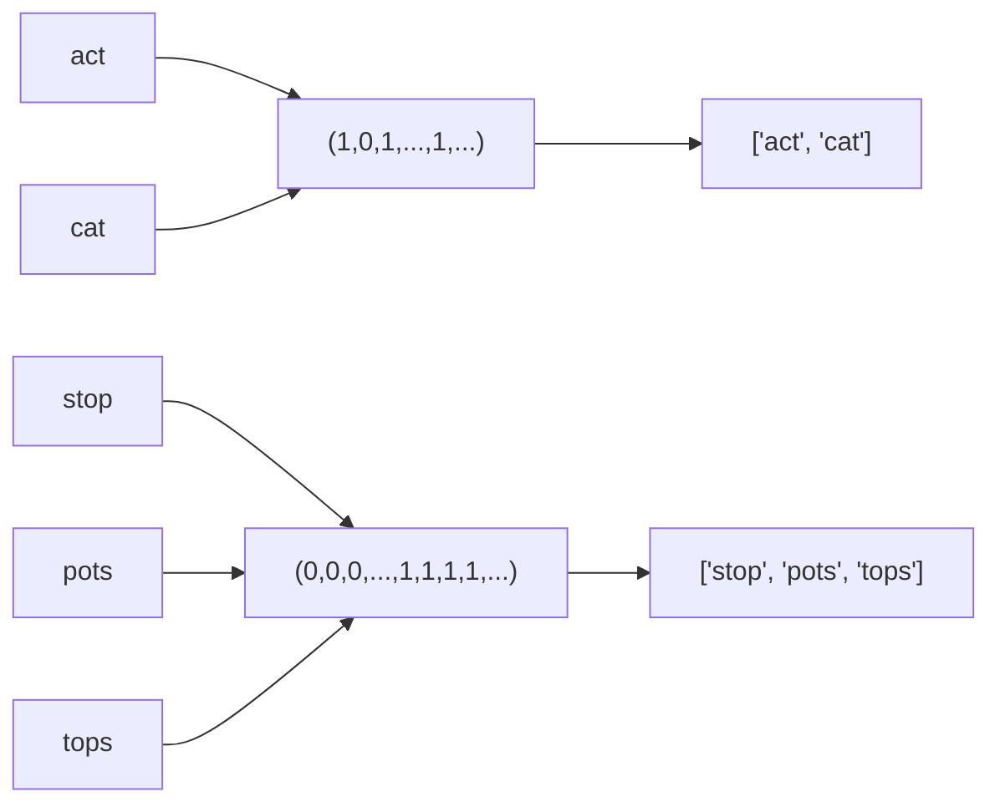

# Design Hash Table

## 面试目标

实现哈希表，重点是哈希函数、桶数组、冲突处理、扩容和负载因子。

## 核心设计

- 用 `hash(key) % capacity` 定位桶。
- 冲突可用链地址法：每个桶保存一组 key-value。
- `put` 需要区分更新已有 key 和插入新 key。
- 当负载因子过高时扩容并 rehash。

## 复杂度

- 平均查找/插入/删除：`O(1)`
- 冲突严重时：`O(n)`
- 扩容 rehash：`O(n)`。

## 常见坑

- 扩容后只复制桶，没有重新计算下标。
- 删除 key 时忘记维护 size。
- 用对象引用做 key 时没有稳定哈希策略。

## NeetCode 例题：Group Anagrams

这道题的目标是把所有字母异位词放到同一组。两个字符串是否属于同一组，不取决于字符顺序，只取决于每个字母出现了多少次。

最直接的 key 是排序后的字符串：

```text
"act"  -> "act"
"cat"  -> "act"
"stop" -> "opst"
```

这个方法能过，但每个字符串都要排序，单个字符串长度为 `k` 时是 `O(k log k)`。

更适合哈希表的 key 是一个长度固定为 26 的字符频率数组：

```text
"act"
  a b c d ... t ...
  1 0 1 0 ... 1 ...

"cat"
  a b c d ... t ...
  1 0 1 0 ... 1 ...
```

这两个频率数组完全相同，所以它们会落到同一个哈希表 bucket 里。



关键点：

- `freq[ord(char) - ord('a')] += 1` 把字符映射到 `0..25` 的槽位。
- Python 的 `list` 不能作为 dict key，因为 list 可变、不可哈希。
- 所以要用 `tuple(freq)` 作为 key。
- 扫描字符串仍然需要 `O(k)`，但 key 的长度固定为 26；相比排序法，省掉了 `O(k log k)` 的排序成本。

## Group Anagrams 解法

<details class="solution" open>
<summary>展开解法</summary>

```python
from collections import defaultdict
from typing import List


class Solution:
    def groupAnagrams(self, strs: List[str]) -> List[List[str]]:
        result = defaultdict(list)

        for s in strs:
            freq = [0 for _ in range(26)]
            for char in s:
                freq[ord(char) - ord('a')] += 1

            result[tuple(freq)].append(s)

        return list(result.values())
```

如果 `n` 是字符串数量，`k` 是平均字符串长度：

- 时间复杂度：`O(n * (k + 26))`，通常写成 `O(nk)`。
- 空间复杂度：`O(n * k)`，输出本身需要保存所有字符串；哈希表 key 额外是每组一个 26 维 tuple。

</details>

## 参考解法

<details class="solution">
<summary>展开解法</summary>

链地址法最直接：桶数组中每个位置保存一个小列表，列表里是 `(key, value)`。

```text
put(key, value):
  bucket = buckets[hash(key) % capacity]
  for pair in bucket:
    if pair.key == key:
      pair.value = value
      return
  bucket.append((key, value))
  size += 1
  if size / capacity > 0.75: resize()
```

扩容时不能原样复制桶，要重新对每个 key 计算新桶下标。

</details>

```quiz
title: 练习 1
question: 哈希表扩容后为什么需要 rehash？
answer: B
A. 为了让值变大
B. capacity 改变后 key 对应的桶下标可能改变
C. 为了把所有 key 排序
explanation: 桶下标依赖 `hash(key) % capacity`，容量变化会改变映射。
```

```quiz
title: 练习 2
question: 链地址法如何处理哈希冲突？
answer: A
A. 同一个桶里保存多个 key-value
B. 直接丢弃新 key
C. 把数组改成二叉堆
explanation: 链地址法让冲突元素共存于同一个桶。
```

```quiz
title: 练习 3
question: Group Anagrams 为什么可以用 26 维字符频率 tuple 作为哈希表 key？
answer: B
A. 因为异位词排序后长度一定不同
B. 因为小写英文字母表固定，频率向量能唯一表示每个字符串的字符 multiset
C. 因为 tuple 会自动忽略字符出现次数
explanation: 异位词拥有完全相同的字符计数。把 26 个字母的出现次数组成 tuple，就得到一个可哈希且固定长度的签名。
```
