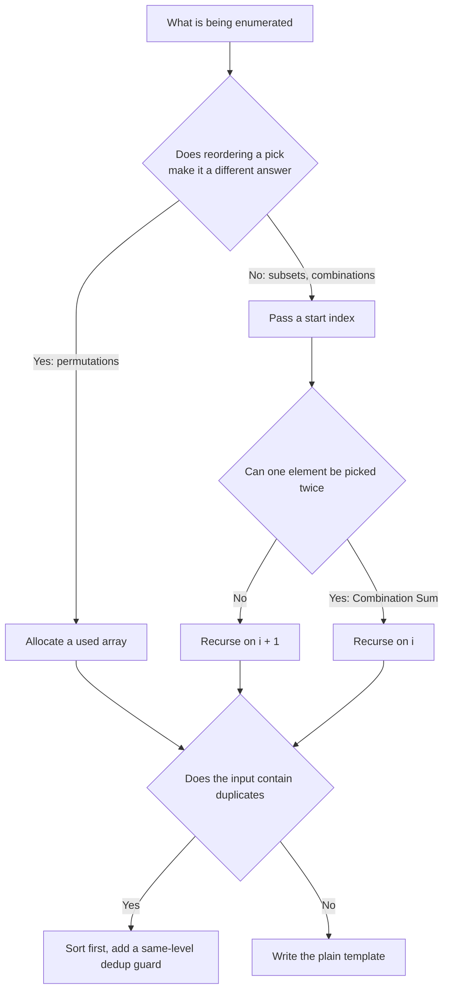

# Backtracking · One Template for Ten Problems

Backtracking is not a separate algorithm. It is DFS over a decision tree, with the state restored on the way out of every node.

Every backtracking problem shares the same skeleton, and each individual problem only fills in three slots:

```text
choices:   standing at this node, what can be picked at this level
path:      the choices already made from the root down to here
base case: when to copy path into the answer
```

The hard part is never the recursion. It is these three things: what the decision tree looks like, where to prune, and how duplicate answers get eliminated. These notes are organized around those three.

## Problems and Study Order

Each statement below is a condensed restatement of the original LeetCode problem.

| Order | Problem | Decision pattern | What this one adds |
|---:|---|---|---|
| 1 | [78. Subsets](https://leetcode.com/problems/subsets/description/) | Subset | Every node is an answer; no base case |
| 2 | [46. Permutations](https://leetcode.com/problems/permutations/description/) | Permutation | A `used` array replaces `start` |
| 3 | [39. Combination Sum](https://leetcode.com/problems/combination-sum/description/) | Combination with reuse | Recurse on `i`, not `i + 1` |
| 4 | [90. Subsets II](https://leetcode.com/problems/subsets-ii/description/) | Subset + dedup | Sort, then skip duplicates at the same level |
| 5 | [40. Combination Sum II](https://leetcode.com/problems/combination-sum-ii/description/) | Combination + dedup | Same-level dedup vs element reuse |
| 6 | [22. Generate Parentheses](https://leetcode.com/problems/generate-parentheses/description/) | Constrained construction | Maintain prefix balance via `open < n` and `close < open` |
| 7 | [17. Letter Combinations of a Phone Number](https://leetcode.com/problems/letter-combinations-of-a-phone-number/description/) | Cartesian product | The level number is the index; no `start` |
| 8 | [131. Palindrome Partitioning](https://leetcode.com/problems/palindrome-partitioning/description/) | Partition | A cut point is the same thing as a combination index |
| 9 | [79. Word Search](https://leetcode.com/problems/word-search/description/) | Grid | Mark cells in place, restore on the way out |
| 10 | [51. N-Queens](https://leetcode.com/problems/n-queens/description/) | Board | Three sets bring conflict checking down to O(1) |

Here is how all ten land on the same skeleton:

```backtracking-patterns
```

## The Template

```python
def backtrack(path, state):
    if is_solution(state):
        result.append(path[:])      # must copy
        return                      # subset problems have no such block

    for choice in choices(state):
        if not is_valid(choice, state):
            continue                # prune: never enter this branch
        make(choice, path, state)   # choose
        backtrack(path, next(state))
        undo(choice, path, state)   # un-choose
```

Only three lines actually need to be memorized:

```text
make(choice)      modify the state before entering the subtree
backtrack(...)    explore that subtree
undo(choice)      restore the state after leaving it
```

`make` and `undo` have to be strict inverses. Write `path.pop()` immediately after `path.append(x)`, and `used[i] = False` immediately after `used[i] = True`, then fill the recursion in between. Nothing gets forgotten that way.

### Why the Undo Is Mandatory

Because `path`, `used`, and the board are one shared object across every branch. When a recursive call returns, control is back at the parent node, but the state in memory is still whatever the child left behind. Skip the undo and sibling branches inherit that garbage.

```text
path = [1]
  explore the [1, 2] branch  ......  path becomes [1, 2]
  return to the parent       ......  path is still [1, 2]   ← wrong
  explore the [1, 3] branch  ......  path becomes [1, 2, 3] ← wrong answer
```

The alternative is passing a fresh list down each level with `backtrack(path + [x])`, which needs no undo but copies at every level and carries a larger constant. It also does not extend to a `used` array or a board. Interviews expect `append` / `pop`.

### Why the Answer Is Copied with `path[:]`

`result.append(path)` stores a reference to the list, not its contents at that moment. Later `pop` calls mutate `path`, the entry inside `result` changes along with it, and the final output is a pile of empty lists.

```python
result.append(path)        # wrong: result holds the same object many times
result.append(path[:])     # right: a snapshot of the current contents
result.append(list(path))  # same thing
```

Strings are immutable, so `"".join(path)` is already a snapshot and needs no extra copy.

## What the Decision Tree Looks Like

The demo below walks the complete decision tree for Subsets. Watch three things: how `path` changes with depth, the exact moment an answer is collected, and what each `pop` undoes on the way back to the parent.

```backtracking-tree-demo
```

The tree maps onto the code one to one:

- Tree depth = recursion depth = length of `path`.
- Branching factor = number of iterations of the `for` loop at that level.
- One root-to-leaf path = one candidate solution.
- The act of backtracking = the `undo` that runs when control returns from a child to its parent.

So the way to estimate complexity is to draw the tree first: node count times work per node is the total time.

## Two Skeletons: `start` Index vs `used` Array

Across all nine problems `choices` only takes two forms, and the difference is whether order matters.

### Combinations and Subsets: Use `start`, Order Does Not Matter

`{1,2}` and `{2,1}` are the same subset, so an element may only be reconsidered at positions after its own. Passing `start` says "look forward, never turn back."

```python
def backtrack(start):
    result.append(path[:])
    for i in range(start, len(nums)):
        path.append(nums[i])
        backtrack(i + 1)      # next level starts after i, no turning back
        path.pop()
```

`backtrack(i + 1)` and `backtrack(start + 1)` mean completely different things, and confusing them produces wrong answers. `i + 1` means "keep picking from after the element I just chose"; `start + 1` means "pick from after the previous level's starting point," which lets the same element be selected repeatedly.

### Permutations: Use `used`, Order Matters

`[1,2]` and `[2,1]` are two different permutations, so every level scans the whole array and only skips elements already sitting in `path`.

```python
def backtrack():
    if len(path) == len(nums):
        result.append(path[:])
        return
    for i in range(len(nums)):
        if used[i]:
            continue
        used[i] = True
        path.append(nums[i])
        backtrack()
        path.pop()
        used[i] = False
```

In one line:

> Order does not matter, pass `start`. Order matters, allocate `used`.



## 1. Subsets

### Statement

Given an array `nums` of distinct integers (length at most 10), return all possible subsets. The answer may come back in any order but must contain no duplicate subsets.

### Filling the Template

| Slot | This problem |
|---|---|
| `choices` | `nums[start:]` |
| `path` | Elements currently selected |
| Base case | None; the `for` loop simply runs out |
| When to collect | Once on entering every node |

The classic mistake here is putting `result.append(path[:])` inside an `if len(path) == k` guard. The answers to a subset problem are not the leaves, they are every node in the tree: the empty set is the root, the full set is the deepest leaf, and every level in between is a valid answer.

```python
from typing import List


class Solution:
    def subsets(self, nums: List[int]) -> List[List[int]]:
        result, path = [], []

        def backtrack(start: int) -> None:
            result.append(path[:])
            for i in range(start, len(nums)):
                path.append(nums[i])
                backtrack(i + 1)
                path.pop()

        backtrack(0)
        return result
```

For `nums = [1,2,3]` the tree has exactly 8 nodes, matching the $2^3$ subsets. There is no explicit `return` because once `start == len(nums)` the loop body never executes and the function returns on its own.

Complexity: $2^n$ subsets, each copied at a cost of $O(n)$, so time is $O(n \cdot 2^n)$. Excluding the output itself, the extra space is the $O(n)$ recursion stack.

## 2. Permutations

### Statement

Given an array `nums` of distinct integers (length 1 to 6), return all possible permutations.

### Filling the Template

| Slot | This problem |
|---|---|
| `choices` | Every index where `used[i] == False` |
| `path` | The current prefix of the permutation |
| Base case | `len(path) == len(nums)` |
| When to collect | Only at leaves |

The following interactive walkthrough steps through the complete Permutations decision tree on `nums = [1, 2, 3]`. Watch three key dynamics: how the `used` array dynamically locks/unlocks elements, why every level loops from 0 and skips with `continue`, and how solutions are only collected at the deepest leaf nodes (`len(path) == 3`):

```permutations-demo
```

```python
from typing import List


class Solution:
    def permute(self, nums: List[int]) -> List[List[int]]:
        result, path = [], []
        used = [False] * len(nums)

        def backtrack() -> None:
            if len(path) == len(nums):
                result.append(path[:])
                return

            for i in range(len(nums)):
                if used[i]:
                    continue
                used[i] = True
                path.append(nums[i])
                backtrack()
                path.pop()
                used[i] = False

        backtrack()
        return result
```

Put side by side with the subset version, exactly three things differ: the loop starts at 0 instead of `start`, there is a `used` array, and answers are collected only at leaves.

The first level of this tree has `n` branches, each second-level node has `n-1`, and so on, giving $n!$ leaves. Time is $O(n \cdot n!)$ and extra space is $O(n)$.

An alternative that avoids the `used` array is the swap method: swap `nums[start]` with each later element in turn and swap back after recursing. It saves the array but makes deduplication harder when the input has repeats, so `used` is the safer interview answer.

## 3. Combination Sum

### Statement

Given an array `candidates` of distinct positive integers and a target, find every combination summing to `target`. The same number may be chosen an unlimited number of times, and two combinations differ as long as their multisets of numbers differ. Fewer than 150 results are guaranteed.

### Filling the Template

| Slot | This problem |
|---|---|
| `choices` | `candidates[start:]` |
| `path` | Numbers currently chosen |
| Base case | Collect at `remain == 0`, prune at `remain < 0` |
| Pruning | After sorting, `candidates[i] > remain` allows an immediate `break` |

The following interactive walkthrough steps through the complete Combination Sum decision tree on `candidates = [2, 3, 6, 7]` with `target = 7`. Watch how `remain` decreases toward 0, how passing `i` enables repeating the same number (e.g. `[2, 2, 3]`), and how sorting enables instant `break` pruning on oversize branches:

```combination-sum-demo
```

Because the same number can be reused, the recursion passes `i` rather than `i + 1`:

```python
from typing import List


class Solution:
    def combinationSum(self, candidates: List[int], target: int) -> List[List[int]]:
        candidates.sort()
        result, path = [], []

        def backtrack(start: int, remain: int) -> None:
            if remain == 0:
                result.append(path[:])
                return

            for i in range(start, len(candidates)):
                if candidates[i] > remain:
                    break
                path.append(candidates[i])
                backtrack(i, remain - candidates[i])
                path.pop()

        backtrack(0, target)
        return result
```

Two points deserve to be spelled out.

Why `i` and not `i + 1`? Passing `i` lets the next level pick the same index again, which is exactly what "unlimited reuse" means. It still forbids going back to elements before `i`, so `[2,2,3]` is generated once and never reappears as `[3,2,2]`.

Why `break` rather than `continue`? The array is sorted, so `candidates[i] > remain` means every later element is larger still and none of them fit. This is pruning, not an optional optimization: without it, an input like `candidates = [2], target = 500` drives the recursion very deep.

A tight bound is awkward to state; the usual one is $O(n^{T/m})$ where `T` is the target and `m` is the smallest candidate, meaning a tree at most `T/m` deep with at most `n` branches per level.

## 4. Subsets II

### Statement

Given an integer array `nums` that may contain duplicates (length at most 10), return all distinct subsets.

### Where the Duplicates Come From

For `nums = [1,2,2]`, the two `2`s at the first level each expand a subtree, and those two subtrees are identical, so `[2]` and `[2,2]` each get produced twice.

The key is separating two different ways of "picking the same value twice":

```text
Two equal values at the same level    -> identical subtrees, must be skipped
Two equal values at different levels  -> that is "I picked two 2s", a valid answer
```

After sorting, equal values at the same level are necessarily adjacent, so the guard becomes:

```python
if i > start and nums[i] == nums[i - 1]:
    continue
```

The `i > start` condition is what distinguishes the two cases above. `i == start` is the first candidate at this level, representing "the parent picks this value for the first time," and must be kept. Only `i > start` is a second or third equal value at the same level, and that gets skipped.

Writing `i > 0` instead is the most common bug: it skips the second `2` of `[1,2,2]` at every level, so `[2,2]` can never be produced.

The demo below draws the full decision tree for `[1,2,2]`, with the two pruned branches marked as dashed:

```backtracking-dedup-demo
```

```python
from typing import List


class Solution:
    def subsetsWithDup(self, nums: List[int]) -> List[List[int]]:
        nums.sort()
        result, path = [], []

        def backtrack(start: int) -> None:
            result.append(path[:])
            for i in range(start, len(nums)):
                if i > start and nums[i] == nums[i - 1]:
                    continue
                path.append(nums[i])
                backtrack(i + 1)
                path.pop()

        backtrack(0)
        return result
```

`nums.sort()` is not there to order the output. It is there to make equal values adjacent; without it the `nums[i] == nums[i - 1]` check catches nothing. Forgetting the sort is the most frequent error in this family.

### Why the Permutation Dedup Guard Is Different

Permutations II (LC 47) also needs deduplication, but it uses the `used` skeleton and has no `start`, so the guard reads:

```python
if i > 0 and nums[i] == nums[i - 1] and not used[i - 1]:
    continue
```

`not used[i - 1]` says: the previous equal value is not on this path, so I am picking this value for the second time at the same level and should skip. Conversely, if `used[i - 1]` is true, the previous equal value is already in `path` and I am picking the second copy at a deeper level, which is legitimate.

In one line: the `start` skeleton detects "same level" with `i > start`, and the `used` skeleton detects it with `not used[i - 1]`.

## 5. Combination Sum II

### Statement

Given an array `candidates` of positive integers that may contain duplicates and a target, find every combination summing to `target`. Each index may be used at most once, and the result set must not contain duplicate combinations.

This problem is the previous two fused: the dedup guard comes from Subsets II, and `i + 1` comes from "each element used at most once."

```python
from typing import List


class Solution:
    def combinationSum2(self, candidates: List[int], target: int) -> List[List[int]]:
        candidates.sort()
        result, path = [], []

        def backtrack(start: int, remain: int) -> None:
            if remain == 0:
                result.append(path[:])
                return

            for i in range(start, len(candidates)):
                if candidates[i] > remain:
                    break
                if i > start and candidates[i] == candidates[i - 1]:
                    continue
                path.append(candidates[i])
                backtrack(i + 1, remain - candidates[i])
                path.pop()

        backtrack(0, target)
        return result
```

Placed next to Combination Sum, exactly two lines differ: a same-level dedup guard was added, and `backtrack(i, ...)` became `backtrack(i + 1, ...)`.

What gets confused most often here is that "same-level dedup" and "elements cannot be reused" are two independent mechanisms:

| Purpose | Mechanism | Effect |
|---|---|---|
| One index cannot be used twice | `backtrack(i + 1, ...)` | Controls repetition down the tree |
| One value cannot expand twice at a level | `if i > start and values equal: continue` | Controls repetition across the tree |

With `candidates = [1,1,6], target = 8`, the answer `[1,1,6]` is valid because it uses two different indices holding 1, while letting both `1`s expand at the same level produces two copies of `[1,1,6]`. So the vertical direction stays and the horizontal direction gets cut.

## 6. Generate Parentheses

### Statement

Given $n$ pairs of parentheses ($1 \le n \le 8$), write a function to generate all combinations of well-formed parentheses.

### Filling the Template

This problem represents the **constrained string construction / prefix balance** pattern. Unlike combination or permutation problems, each step offers only two fixed choices: adding `'('` or adding `')'`. There is no need for a `for` loop; two separate `if` branches form the binary decision tree:

| Slot | This problem |
|---|---|
| `choices` | Append `'('` or append `')'` |
| `path` | The list of parentheses characters appended so far |
| Base case | `len(path) == 2 * n` (or `open_count == n and close_count == n`) |
| Prefix validity (Pruning) | 1. Can only add `'('` when `open_count < n`<br>2. Can only add `')'` when `close_count < open_count` (closing count never exceeds opening count) |

```python
from typing import List


class Solution:
    def generateParenthesis(self, n: int) -> List[str]:
        result, path = [], []

        def backtrack(open_count: int, close_count: int) -> None:
            if len(path) == 2 * n:
                result.append("".join(path))
                return

            if open_count < n:
                path.append("(")
                backtrack(open_count + 1, close_count)
                path.pop()

            if close_count < open_count:
                path.append(")")
                backtrack(open_count, close_count + 1)
                path.pop()

        backtrack(0, 0)
        return result
```

### Core Invariants and Catalan Numbers

1. **Prefix Balance Invariant**:
   Why is there no need to validate strings with a stack at the end? Because throughout the search tree, enforcing `close_count <= open_count` prevents any locally illegal prefix (such as `")("`) from ever being constructed. Pruning eliminates all invalid branches at creation time.
2. **Why No `for` Loop**:
   A `for` loop iterates over variable choices at the same depth. When the choice is binary with distinct admission guards, two explicit `if` statements are cleaner and have lower overhead.
3. **Complexity & Catalan Numbers**:
   The number of valid parentheses combinations for $n$ pairs is given by the $n$-th **Catalan Number**:
   $$
   C_n = \frac{1}{n + 1} \binom{2n}{n} = \Theta\left( \frac{4^n}{n^{1.5}} \r\right)
   $$
   Materializing each valid solution takes $O(n)$ string concatenation time, so total time complexity is $O\left( \frac{4^n}{\sqrt{n}} \r\right)$, and space complexity is $O(n)$ for the recursion call stack of depth $2n$.

## 7. Letter Combinations of a Phone Number

### Statement

Given a string `digits` containing only `2-9` (length 0 to 4), return all letter combinations the number could spell on a phone keypad. An empty `digits` returns an empty list.

### Filling the Template

This one has neither `start` nor `used`, because the level number is the index: level `k` handles digit `k`, and the choices are that digit's three or four letters.

| Slot | This problem |
|---|---|
| `choices` | `keypad[digits[index]]` |
| `path` | The letter prefix built so far |
| Base case | `index == len(digits)` |

```python
from typing import List


class Solution:
    def letterCombinations(self, digits: str) -> List[str]:
        if not digits:
            return []

        keypad = {
            "2": "abc", "3": "def", "4": "ghi", "5": "jkl",
            "6": "mno", "7": "pqrs", "8": "tuv", "9": "wxyz",
        }
        result, path = [], []

        def backtrack(index: int) -> None:
            if index == len(digits):
                result.append("".join(path))
                return

            for letter in keypad[digits[index]]:
                path.append(letter)
                backtrack(index + 1)
                path.pop()

        backtrack(0)
        return result
```

The leading `if not digits: return []` cannot be dropped. Without it, `backtrack(0)` immediately hits the base case and collects the empty string, returning `[""]` instead of `[]`.

This tree is a full Cartesian product with no pruning at all: `n` digits with at most 4 letters each give at most $4^n$ leaves, so time is $O(n \cdot 4^n)$.

## 8. Palindrome Partitioning

### Statement

Given a string `s` (length at most 16), cut it into pieces so that every piece is a palindrome, and return every possible way of cutting.

### The Mapping That Makes Partitioning a Combination Problem

Partitioning looks unlike a combination problem but is the same tree. Read `start` as the position just before the next cut:

```text
s = "aab"

start = 0, the possible pieces are "a" / "aa" / "aab"
   pick "a"   -> start = 1
   pick "aa"  -> start = 2
   pick "aab" -> start = 3 (but "aab" is not a palindrome, so it is pruned)
```

`for end in range(start, len(s))` enumerates where this cut lands, and `s[start:end+1]` is the piece it produces. `start == len(s)` means the whole string has been consumed exactly, so the answer is collected.

| Slot | This problem |
|---|---|
| `choices` | Every substring starting at `start` |
| `path` | The pieces cut so far |
| Base case | `start == len(s)` |
| Pruning | A non-palindromic piece is never recursed into |

```python
from typing import List


class Solution:
    def partition(self, s: str) -> List[List[str]]:
        result, path = [], []

        def is_palindrome(left: int, right: int) -> bool:
            while left < right:
                if s[left] != s[r\right]:
                    return False
                left += 1
                right -= 1
            return True

        def backtrack(start: int) -> None:
            if start == len(s):
                result.append(path[:])
                return

            for end in range(start, len(s)):
                if not is_palindrome(start, end):
                    continue
                path.append(s[start:end + 1])
                backtrack(end + 1)
                path.pop()

        backtrack(0)
        return result
```

The palindrome check takes indices rather than doing `s[start:end+1] == s[start:end+1][::-1]` to avoid materializing a new string on every check. If an interviewer pushes for more, precompute `is_pal[i][j]` with an $O(n^2)$ DP and each check drops to $O(1)$.

There are `n-1` positions between `n` characters where a cut may or may not happen, so the worst case has $2^{n-1}$ partitions and time is $O(n \cdot 2^n)$.

## 9. Word Search

### Statement

Given an `m × n` grid of characters and a string `word`, decide whether `word` can be spelled out by adjacent cells (up, down, left, r\right). A cell may not be reused within one path. The grid is at most 6 × 6 and `word` is at most 15 characters.

### Where the Backtracking Happens on a Grid

Grid DFS differs from the earlier problems in that the "state" is not `path` but which cells this path currently occupies. The thing being undone is therefore the cell.

The standard trick is to overwrite in place: temporarily set a visited cell to a character that cannot appear in `word`, then restore it after the recursion returns. That removes the need for a separate `visited` matrix.

```python
from typing import List


class Solution:
    def exist(self, board: List[List[str]], word: str) -> bool:
        rows, cols = len(board), len(board[0])

        def backtrack(r: int, c: int, index: int) -> bool:
            if index == len(word):
                return True
            if r < 0 or r >= rows or c < 0 or c >= cols:
                return False
            if board[r][c] != word[index]:
                return False

            board[r][c] = "#"
            found = (
                backtrack(r + 1, c, index + 1)
                or backtrack(r - 1, c, index + 1)
                or backtrack(r, c + 1, index + 1)
                or backtrack(r, c - 1, index + 1)
            )
            board[r][c] = word[index]
            return found

        for r in range(rows):
            for c in range(cols):
                if backtrack(r, c, 0):
                    return True
        return False
```

Several places invite mistakes:

- `index == len(word)` has to come before the bounds check: After the final character matches, the recursion enters with `index == len(word)` and an `(r, c)` that may be out of bounds; checking bounds first would report failure on a correct answer.
- Restore with `board[r][c] = word[index]`, not `"."` or some other constant: The cell's original character is necessarily equal to `word[index]`, since that was just checked above.
- `"#"` must be a character `word` cannot contain: The problem guarantees letters only, so `#` is safe.
- The short-circuit in `or` is the pruning: As soon as one of the four directions returns `True`, the rest are never evaluated.

The general grid-traversal pattern appears in the Graphs chapter; the only addition here is restoring on the way out. A DFS looking for connected components never restores, because a visited cell never needs revisiting. Here a different path may well need the same cell again.

The upper bound is $O(m \cdot n \cdot 4^L)$ where `L` is the length of `word`: each starting cell expands at most one 4-ary tree of depth `L`.

## 10. N-Queens

### Statement

Place `n` queens on an `n × n` board so that no two share a row, column, or diagonal, and return every distinct solution. `n` is at most 9.

### Designing the Decision Tree

The first decision is to go row by row: since each row holds exactly one queen, level `row` handles row `row` and the choices are the `n` columns. Row conflicts then become impossible by construction, leaving only columns and the two diagonals to check.

The second decision is how to check conflicts in O(1). Look at the coordinates:

```text
Same column                      col is equal
Same main diagonal (NW to SE)    row - col is equal
Same anti-diagonal (NE to SW)    row + col is equal
```

```text
row - col                    row + col
  0  -1  -2  -3                0   1   2   3
  1   0  -1  -2                1   2   3   4
  2   1   0  -1                2   3   4   5
  3   2   1   0                3   4   5   6
```

So three sets `cols`, `diag`, and `anti` make both checking and updating $O(1)$. Those three sets are the `state` from the template: `make` is three `add` calls and `undo` is three `remove` calls.

The demo below runs the complete 4-queens search, with the contents of all three sets shown alongside:

```n-queens-demo
```

```python
from typing import List


class Solution:
    def solveNQueens(self, n: int) -> List[List[str]]:
        result = []
        cols, diag, anti = set(), set(), set()
        board = [["."] * n for _ in range(n)]

        def backtrack(row: int) -> None:
            if row == n:
                result.append(["".join(line) for line in board])
                return

            for col in range(n):
                if col in cols or (row - col) in diag or (row + col) in anti:
                    continue

                cols.add(col)
                diag.add(row - col)
                anti.add(row + col)
                board[row][col] = "Q"

                backtrack(row + 1)

                board[row][col] = "."
                cols.remove(col)
                diag.remove(row - col)
                anti.remove(row + col)

        backtrack(0)
        return result
```

At `n = 4` the search tree has four first-level branches, but only `col = 1` and `col = 2` reach the bottom, giving 2 solutions. At `n = 8` there are 92, which makes a good self-check.

No tight time bound exists; the commonly quoted one is $O(n!)$, from `n` placements in the first row, at most `n-1` in the second, and so on. Conflict checking pushes the real branching factor far below that. Space is $O(n)$, since each of the three sets holds at most `n` elements.

## Cheatsheet

Given a backtracking problem, ask these four questions in order.

### 1. Which Decision Pattern Is This

| Pattern | How to recognize it | `choices` | When to collect | Examples |
|---|---|---|---|---|
| Subset | All subsets wanted, any length | `nums[start:]` | Every node | 78, 90 |
| Combination | Fixed condition, order irrelevant | `nums[start:]` | When the condition holds | 39, 40, 77 |
| Permutation | Different order is a different answer | Every unused element | `len(path) == n` | 46, 47 |
| Constrained construction | Generate valid string with prefix balance invariant | `(` or `)` | `len(path) == 2n` | 22 |
| Partition | Cut a sequence into valid pieces | Every prefix starting at `start` | `start == len(s)` | 131, 93 |
| Cartesian product | Level `k`'s choices come from input `k` | `options[index]` | `index == len(input)` | 17 |
| Grid | Find a path in a matrix | Four directions | The whole target matched | 79, 212 |
| Board | Fill row by row under a global constraint | Every column of that row | Last row filled | 51, 37 |

### 2. What the Recursive Call Passes

| Situation | Call | Meaning |
|---|---|---|
| Order irrelevant, no reuse | `backtrack(i + 1)` | Look forward, and not at myself |
| Order irrelevant, reuse allowed | `backtrack(i)` | Look forward, myself included |
| Order matters | `backtrack()` plus `used[i]` | Scan everything, skip what is taken |
| Parentheses construction | `backtrack(open + 1, close)` / `backtrack(open, close + 1)` | Two if branches maintain balance |
| Partitioning | `backtrack(end + 1)` | The next cut starts after this piece |
| Consuming input per level | `backtrack(index + 1)` | Each level handles one input |

### 3. Is Deduplication Needed, and How

Deduplication always requires sorting first.

| Skeleton | Guard | Why |
|---|---|---|
| `start` skeleton | `if i > start and nums[i] == nums[i-1]: continue` | `i == start` is this level's first pick of the value and must stay |
| `used` skeleton | `if i > 0 and nums[i] == nums[i-1] and not used[i-1]: continue` | The previous equal value is unused, so this is a same-level repeat |

Whether a problem needs deduplication depends on whether the input contains duplicates, not on whether the statement uses the word "unique." With distinct inputs, neither line is needed.

### 4. What Can Be Pruned

| Technique | Code | Applies to |
|---|---|---|
| Sort plus early `break` | `if nums[i] > remain: break` | Sorted candidates draining a monotone budget |
| Feasibility check | `if not is_valid(choice): continue` | N-Queens, Sudoku, palindrome partitioning, prefix balance |
| Not enough left | `if len(nums) - i < need: break` | Combinations of a fixed length |
| Memoization | `if state in seen: return` | Word Break and other overlapping subproblems |

Sorting is both the prerequisite for deduplication and the prerequisite for `break` pruning, so in many problems a single sort does both jobs.

### Complexity Reference

| Problem type | Tree size | Time |
|---|---|---|
| Subsets | $2^n$ nodes | $O(n \cdot 2^n)$ |
| Permutations | $n!$ leaves | $O(n \cdot n!)$ |
| Combinations of length k | $\binom{n}{k}$ leaves | $O(k \cdot \binom{n}{k})$ |
| Generate parentheses | Catalan number $C_n = \frac{1}{n+1}\binom{2n}{n}$ | $O(\frac{4^n}{\sqrt{n}})$ |
| Phone keypad | $4^n$ leaves | $O(n \cdot 4^n)$ |
| Palindrome partitioning | $2^{n-1}$ partitions | $O(n \cdot 2^n)$ |
| Grid search | One 4-ary tree per start cell | $O(mn \cdot 4^L)$ |
| N-Queens | Bounded by $n!$ | $O(n!)$ |

That leading factor is almost always the cost of copying one answer. Explaining the "node count times work per node" structure carries more weight in an interview than reciting the formulas.

## Common Pitfalls

- Forgetting to copy when collecting: `result.append(path)` stores a reference, and after the `pop` calls the entire `result` turns into a pile of empty lists.
- `make` and `undo` are asymmetric: Setting `used[i]` but only popping `path`, or an early `return` that skips the undo. Write the `undo` on the line right after the recursive call and put no `return` in between.
- An extra `return` in a subset problem: Every node is an answer there, so collecting one still has to continue downward.
- Writing `backtrack(start + 1)` for `backtrack(i + 1)`: The former means "continue after what I just picked"; the latter lets the same element be picked repeatedly.
- Deduplicating without sorting: `nums[i] == nums[i-1]` only means anything when equal values are adjacent.
- Writing the same-level guard as `i > 0`: That also cuts the legitimate case of picking two equal values.
- Marking a grid cell without restoring it: After a failed path the cell still holds `#`, later paths cannot cross it, and the result comes out too small.
- Putting the grid base case in the wrong place: `index == len(word)` belongs before the bounds check.
- Mixing `path + [x]` concatenation with `pop` inside the same loop: The two styles cannot be combined; pick one and stay with it.
- Not handling empty input: Empty strings and empty arrays often turn on whether the answer is `[]` or `[[]]`; check the statement's own examples once the code is written.

## Interview Answer Template

When a backtracking problem comes up, walking through it in this order scores better than jumping straight to code:

1. Describe the decision tree first: "I read this as a tree where level k decides what goes in position k, the choices are …, and one root-to-leaf path is one candidate solution."
2. Name the three slots: What `choices` is, what `path` holds, and when an answer is collected.
3. State whether order matters: That determines `start` versus `used`, and whether the recursion passes `i` or `i + 1`.
4. Point out the pruning: Whether sorting enables a `break`, whether there is a feasibility check, whether deduplication is needed.
5. Write the code: Write the `make` / `undo` pair first, then fill in the loop condition.
6. Give the complexity: Phrase it as node count times work per node, and say how much pruning removes on realistic inputs.
7. Raise the edge cases yourself: Empty input, all-equal elements, an unreachable target.
