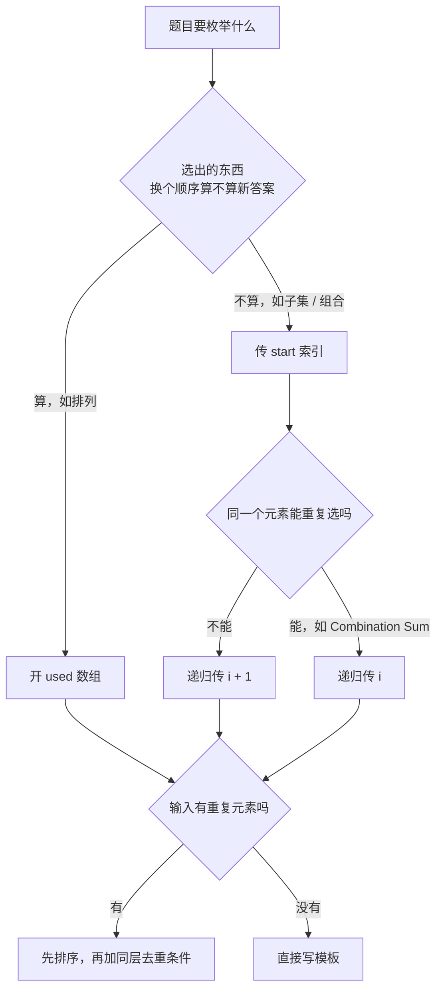

# Backtracking · 10 题一套模板

回溯不是一种新算法，它就是在决策树上做 DFS，并且在离开一个节点时把状态改回去。

所有回溯题的骨架完全一样，每道题只需要填三个槽位：

```text
choices：站在当前节点，这一层有哪些可选项
path：从根走到当前节点，已经做过的选择
base case：什么时候把 path 收进答案
```

难点从来不在递归本身，而在于三件事：决策树长什么样、什么时候剪枝、重复解怎么去掉。这份笔记按这三件事组织。

## 原题与学习顺序

以下题意和约束均按 LeetCode 原题压缩复述。

| 顺序 | 原题 | 决策模式 | 这题新增的东西 |
|---:|---|---|---|
| 1 | [78. Subsets](https://leetcode.com/problems/subsets/description/) | 子集型 | 每个节点都是答案，没有 base case |
| 2 | [46. Permutations](https://leetcode.com/problems/permutations/description/) | 排列型 | 用 `used` 数组代替 `start` |
| 3 | [39. Combination Sum](https://leetcode.com/problems/combination-sum/description/) | 组合型（可重复） | 递归传 `i` 而不是 `i + 1` |
| 4 | [90. Subsets II](https://leetcode.com/problems/subsets-ii/description/) | 子集型 + 去重 | 排序后跳过同层重复 |
| 5 | [40. Combination Sum II](https://leetcode.com/problems/combination-sum-ii/description/) | 组合型 + 去重 | 同层去重与元素复用的区别 |
| 6 | [22. Generate Parentheses](https://leetcode.com/problems/generate-parentheses/description/) | 约束构造型 | 用 `open < n` 与 `close < open` 保持前缀合法 |
| 7 | [17. Letter Combinations of a Phone Number](https://leetcode.com/problems/letter-combinations-of-a-phone-number/description/) | 多叉笛卡尔积 | 层号就是下标，没有 `start` |
| 8 | [131. Palindrome Partitioning](https://leetcode.com/problems/palindrome-partitioning/description/) | 切割型 | 切点等价于组合里的下标 |
| 9 | [79. Word Search](https://leetcode.com/problems/word-search/description/) | 网格型 | 原地标记访问，回溯时还原 |
| 10 | [51. N-Queens](https://leetcode.com/problems/n-queens/description/) | 棋盘型 | 用三个集合把冲突检查降到 O(1) |

先看这十题怎么落到同一个骨架上：

```backtracking-patterns
```

## 通用模板

```python
def backtrack(path, state):
    if is_solution(state):
        result.append(path[:])      # 必须拷贝
        return                      # 子集型没有这一段

    for choice in choices(state):
        if not is_valid(choice, state):
            continue                # 剪枝：这条分支不用进
        make(choice, path, state)   # 选择
        backtrack(path, next(state))
        undo(choice, path, state)   # 撤销
```

真正需要记住的只有三行：

```text
make(choice)      进入子树前修改状态
backtrack(...)    递归探索这棵子树
undo(choice)      离开子树后把状态改回去
```

`make` 和 `undo` 必须严格互逆。写完 `path.append(x)` 就立刻写 `path.pop()`，写完 `used[i] = True` 就立刻写 `used[i] = False`，中间再填递归，这样不容易漏。

### 为什么必须撤销

因为 `path`、`used`、棋盘这些状态是所有分支共用的同一个对象。递归调用返回时，程序控制权回到了父节点，但内存里的状态还停留在子节点。不撤销，兄弟分支就会看到上一个分支留下的垃圾。

```text
path = [1]
  探索 [1, 2] 分支 ......  path 变成 [1, 2]
  返回父节点            ......  path 仍然是 [1, 2]   ← 错
  探索 [1, 3] 分支      ......  path 变成 [1, 2, 3]  ← 答案错了
```

另一种写法是每层传一个新列表 `backtrack(path + [x])`，这样不需要撤销，但每层都要复制一次，常数更大，而且 `used` 数组、棋盘这类状态没法这么传。面试里默认写 `append` / `pop`。

### 为什么收答案时要写 `path[:]`

`result.append(path)` 存进去的是 `path` 这个列表的引用，不是它当时的内容。后面 `path` 被 `pop` 改掉，`result` 里那一项跟着变，最后你会得到一堆空列表。

```python
result.append(path)      # 错：result 里全是同一个对象
result.append(path[:])   # 对：拷贝一份当前快照
result.append(list(path))  # 同上
```

字符串是不可变的，所以 `"".join(path)` 天然就是快照，不需要再拷贝。

## 决策树长什么样

下面这个演示走的是 Subsets 的完整决策树。注意看三件事：`path` 怎么随着深度变化、答案是在哪一刻被收走的、以及每次返回父节点时 `pop` 撤销了什么。

```backtracking-tree-demo
```

树的形状和代码是一一对应的：

- 树的深度 = 递归的层数 = `path` 的长度。
- 树的分叉数 = 那一层 `for` 循环的迭代次数。
- 一条根到叶的路径 = 一个候选解。
- 回溯这个动作 = 从子节点返回父节点时的那一次 `undo`。

所以估复杂度时，先画出这棵树：节点数乘以每个节点的工作量，就是总时间。

## 两种骨架：`start` 索引 vs `used` 数组

九道题里的 `choices` 只有两种写法，区别在于顺序重不重要。

### 组合 / 子集：用 `start`，顺序不重要

`{1,2}` 和 `{2,1}` 是同一个子集，所以每个元素只能在它自己之后的位置被再次考虑。传 `start` 就是在说“往后看，不要回头”。

```python
def backtrack(start):
    result.append(path[:])
    for i in range(start, len(nums)):
        path.append(nums[i])
        backtrack(i + 1)      # 下一层从 i + 1 开始，不回头
        path.pop()
```

`backtrack(i + 1)` 和 `backtrack(start + 1)` 是两个完全不同的意思，写错会直接错。`i + 1` 表示“从我刚选的这个元素后面接着挑”，`start + 1` 表示“从上一层的起点后面挑”，后者会让同一个元素被重复选中。

### 排列：用 `used`，顺序重要

`[1,2]` 和 `[2,1]` 是两个不同的排列，所以每一层都要把整个数组扫一遍，只跳过已经在 `path` 里的元素。

```python
def backtrack():
    if len(path) == len(nums):
        result.append(path[:])
        return
    for i in range(len(nums)):
        if used[i]:
            continue
        used[i] = True
        path.append(nums[i])
        backtrack()
        path.pop()
        used[i] = False
```

一句话区分：

> 顺序不重要就传 `start`，顺序重要就开 `used`。



## 1. Subsets

### 题意

给定互不相同的整数数组 `nums`（长度不超过 10），返回所有可能的子集，答案可以按任意顺序返回，但不能有重复子集。

### 填模板

| 槽位 | 本题内容 |
|---|---|
| `choices` | `nums[start:]` |
| `path` | 当前已选中的元素 |
| base case | 没有，`for` 循环自然走完就结束 |
| 收答案时机 | 每进入一个节点就收一次 |

子集型最容易出错的地方是把 `result.append(path[:])` 写进了 `if len(path) == k` 里面。子集问题的答案不是叶子节点，而是树上的每一个节点：空集是根，全集是最深的叶子，中间每一层都是合法答案。

```python
from typing import List


class Solution:
    def subsets(self, nums: List[int]) -> List[List[int]]:
        result, path = [], []

        def backtrack(start: int) -> None:
            result.append(path[:])
            for i in range(start, len(nums)):
                path.append(nums[i])
                backtrack(i + 1)
                path.pop()

        backtrack(0)
        return result
```

`nums = [1,2,3]` 时树上正好 8 个节点，对应 $2^3$ 个子集。递归没有显式的 `return`，因为 `start == len(nums)` 时 `for` 循环体一次都不执行，函数自己就返回了。

复杂度：一共 $2^n$ 个子集，每个子集拷贝一次的代价是 $O(n)$，所以时间 $O(n \cdot 2^n)$；除去答案本身，额外空间是递归栈的 $O(n)$。

## 2. Permutations

### 题意

给定互不相同的整数数组 `nums`（长度 1 到 6），返回所有可能的全排列。

### 填模板

| 槽位 | 本题内容 |
|---|---|
| `choices` | 所有 `used[i] == False` 的下标 |
| `path` | 当前排列的前缀 |
| base case | `len(path) == len(nums)` |
| 收答案时机 | 只在叶子节点收 |

下面这个演示走的是 Permutations 的完整决策树（`nums = [1, 2, 3]`）。注意观察三件事：`used` 数组如何动态锁定已被选中的元素、为什么每一层都从 0 扫起且遇到已使用的元素直接 `continue`、以及答案只在最深处的叶子节点（`len(path) == 3`）收集：

```permutations-demo
```

```python
from typing import List


class Solution:
    def permute(self, nums: List[int]) -> List[List[int]]:
        result, path = [], []
        used = [False] * len(nums)

        def backtrack() -> None:
            if len(path) == len(nums):
                result.append(path[:])
                return

            for i in range(len(nums)):
                if used[i]:
                    continue
                used[i] = True
                path.append(nums[i])
                backtrack()
                path.pop()
                used[i] = False

        backtrack()
        return result
```

和子集型对照着看，差别就三处：`for` 从 0 开始而不是从 `start` 开始、多了一个 `used` 数组、答案只在叶子收。

这棵树第一层有 `n` 个分支，第二层每个节点有 `n-1` 个分支，以此类推，叶子数是 $n!$。时间 $O(n \cdot n!)$，额外空间 $O(n)$。

如果不想开 `used` 数组，也可以用交换法：把 `nums[start]` 依次和后面每个元素交换，递归后换回来。交换法省掉了 `used`，但在有重复元素时去重更麻烦，面试里 `used` 更稳。

## 3. Combination Sum

### 题意

给定互不相同的正整数数组 `candidates` 和目标 `target`，找出所有和为 `target` 的组合。同一个数字可以被无限次选取，两个组合只要数字的多重集不同就算不同的组合。保证结果少于 150 个。

### 填模板

| 槽位 | 本题内容 |
|---|---|
| `choices` | `candidates[start:]` |
| `path` | 当前已选的数字 |
| base case | `remain == 0` 收答案，`remain < 0` 剪掉 |
| 剪枝 | 排序后 `candidates[i] > remain` 直接 `break` |

下面这个演示走的是 Combination Sum 的完整决策树（`candidates = [2, 3, 6, 7], target = 7`）。注意观察 `remain` 预算如何递减、递归传 `i` 带来的同元素重复选取（如 `[2, 2, 3]`）、以及排序后 `candidates[i] > remain` 一击致命的剪枝（`break`）：

```combination-sum-demo
```

因为同一个数字可以重复选，递归时传的是 `i` 而不是 `i + 1`：

```python
from typing import List


class Solution:
    def combinationSum(self, candidates: List[int], target: int) -> List[List[int]]:
        candidates.sort()
        result, path = [], []

        def backtrack(start: int, remain: int) -> None:
            if remain == 0:
                result.append(path[:])
                return

            for i in range(start, len(candidates)):
                if candidates[i] > remain:
                    break
                path.append(candidates[i])
                backtrack(i, remain - candidates[i])
                path.pop()

        backtrack(0, target)
        return result
```

这里有两个值得说清楚的点。

为什么传 `i` 而不是 `i + 1`？传 `i` 允许下一层再次选中同一个下标，这正是“可以重复使用”的含义。但它仍然不允许回头去选 `i` 之前的元素，所以 `[2,2,3]` 只会被生成一次，不会再生成 `[3,2,2]`。

为什么可以 `break` 而不是 `continue`？数组已经排好序，`candidates[i] > remain` 意味着它后面的元素只会更大，全都放不下。这是剪枝，不是可选优化：没有它，`candidates = [2], target = 500` 这种输入会把递归栈拉得很深。

复杂度不好写紧，常用的上界是 $O(n^{T/m})$，其中 `T` 是 target、`m` 是最小的候选值，也就是树最深 `T/m` 层、每层最多 `n` 个分支。

## 4. Subsets II

### 题意

给定可能包含重复元素的整数数组 `nums`（长度不超过 10），返回所有不重复的子集。

### 重复是怎么产生的

`nums = [1,2,2]` 时，第一层的两个 `2` 会各自展开一棵子树，而这两棵子树长得一模一样，于是 `[2]` 和 `[2,2]` 各被生成了两次。

关键在于分清两种“重复选中同一个值”：

```text
同一层的两个相同值   -> 会产生完全相同的子树，必须跳过
不同层的两个相同值   -> 是"选了两个 2"，是合法答案，不能跳过
```

排序之后，同一层的相同值必然相邻，于是判断条件是：

```python
if i > start and nums[i] == nums[i - 1]:
    continue
```

`i > start` 这个条件就是在区分上面两种情况。`i == start` 是这一层的第一个候选，它代表“从父节点第一次选这个值”，必须保留；`i > start` 才是同一层里的第二个、第三个相同值，跳过。

写成 `i > 0` 是最常见的错误：那会把 `[1,2,2]` 里第二个 `2` 在所有层都跳掉，`[2,2]` 就再也生不出来了。

下面这个演示把 `[1,2,2]` 的完整决策树画了出来，被剪掉的两条分支用虚线标出：

```backtracking-dedup-demo
```

```python
from typing import List


class Solution:
    def subsetsWithDup(self, nums: List[int]) -> List[List[int]]:
        nums.sort()
        result, path = [], []

        def backtrack(start: int) -> None:
            result.append(path[:])
            for i in range(start, len(nums)):
                if i > start and nums[i] == nums[i - 1]:
                    continue
                path.append(nums[i])
                backtrack(i + 1)
                path.pop()

        backtrack(0)
        return result
```

`nums.sort()` 不是为了让答案有序，而是为了让相同的值相邻，否则 `nums[i] == nums[i - 1]` 这个判断根本抓不到重复。忘记排序是这类题最高频的错误。

### 排列的去重条件为什么不一样

Permutations II（LC 47）也要去重，但它用的是 `used` 骨架，没有 `start`，条件写成：

```python
if i > 0 and nums[i] == nums[i - 1] and not used[i - 1]:
    continue
```

`not used[i - 1]` 的意思是：前一个相同的值在这条路径上还没被用过，说明我现在是在同一层里第二次挑这个值，应该跳过。反过来，如果 `used[i - 1]` 为真，说明前一个相同值已经在 `path` 里了，我现在是在更深的一层选第二个相同值，这是合法的。

一句话：`start` 骨架用 `i > start` 判同层，`used` 骨架用 `not used[i - 1]` 判同层。

## 5. Combination Sum II

### 题意

给定可能包含重复元素的正整数数组 `candidates` 和目标 `target`，找出所有和为 `target` 的组合。每个下标最多用一次，且结果集不能包含重复组合。

这题是前两题的合体：去重条件来自 Subsets II，`i + 1` 来自“每个元素只能用一次”。

```python
from typing import List


class Solution:
    def combinationSum2(self, candidates: List[int], target: int) -> List[List[int]]:
        candidates.sort()
        result, path = [], []

        def backtrack(start: int, remain: int) -> None:
            if remain == 0:
                result.append(path[:])
                return

            for i in range(start, len(candidates)):
                if candidates[i] > remain:
                    break
                if i > start and candidates[i] == candidates[i - 1]:
                    continue
                path.append(candidates[i])
                backtrack(i + 1, remain - candidates[i])
                path.pop()

        backtrack(0, target)
        return result
```

和 Combination Sum 并排放，只有两行不同：多了一行同层去重，`backtrack(i, ...)` 变成 `backtrack(i + 1, ...)`。

这里最容易搞混的是“同层去重”和“元素不可重复使用”是两件独立的事：

| 目的 | 手段 | 影响 |
|---|---|---|
| 同一个下标不能用两次 | `backtrack(i + 1, ...)` | 决定纵向能不能重复 |
| 相同值不能在同层展开两次 | `if i > start and 值相同: continue` | 决定横向能不能重复 |

`candidates = [1,1,6], target = 8` 时，`[1,1,6]` 是合法答案（用了两个不同下标的 1），而两个 `1` 在同一层各展开一次会得到两份 `[1,1,6]`，所以纵向要留、横向要剪。

## 6. Generate Parentheses

### 题意

数字 $n$ 代表生成括号的对数（$1 \le n \le 8$），设计一个函数，用于能够生成所有可能的并且**有效**的括号组合。

### 填模板

这道题是**约束构造型（前缀平衡）**的经典代表。与组合/排列问题不同，它每一层只有两个固定选项：`'('` 或 `')'`，因此不需要写 `for` 循环，直接用两个独立的 `if` 分支代表二叉决策树：

| 槽位 | 本题内容 |
|---|---|
| `choices` | 追加 `'('` 或追加 `')'` |
| `path` | 当前已拼接的括号字符列表 |
| base case | `len(path) == 2 * n`（或者 `open_count == n and close_count == n`） |
| 前缀合法性（剪枝） | 1. `open_count < n` 时才能放 `'('`<br>2. `close_count < open_count` 时才能放 `')'`（右括号数量绝不能超过左括号） |

```python
from typing import List


class Solution:
    def generateParenthesis(self, n: int) -> List[str]:
        result, path = [], []

        def backtrack(open_count: int, close_count: int) -> None:
            if len(path) == 2 * n:
                result.append("".join(path))
                return

            if open_count < n:
                path.append("(")
                backtrack(open_count + 1, close_count)
                path.pop()

            if close_count < open_count:
                path.append(")")
                backtrack(open_count, close_count + 1)
                path.pop()

        backtrack(0, 0)
        return result
```

### 核心认知与卡特兰数

1. **前缀合法性不变式（Prefix Balance Invariant）**：
   为什么不需要在生成完整字符串后再用栈去验证括号串是否合法？因为在构造的每一步，只要保证 `close_count <= open_count`，就绝对不可能出现 `")("` 这样在局部非法的情况。剪枝直接在生成过程中消灭了所有非法前缀。
2. **为什么没有 `for` 循环**：
   `for` 循环本质是在同层枚举所有可能的选项。当选项只有固定的 2 个（加左括号、加右括号）且每个选项有各自独立的准入条件时，展开写成两个 `if` 结构更清晰、常数更小。
3. **复杂度与卡特兰数**：
   $n$ 对括号生成的合法组合数恰好等于第 $n$ 个**卡特兰数（Catalan Number）**：
   $$
   C_n = \frac{1}{n + 1} \binom{2n}{n} = \Theta\left(\frac{4^n}{n^{1.5}}\right)
   $$
   生成每个答案需要 $O(n)$ 的字符串拼接时间，因此总时间复杂度为 $O\left(\frac{4^n}{\sqrt{n}}\right)$，空间复杂度为 $O(n)$（递归栈深为 $2n$）。

## 7. Letter Combinations of a Phone Number

### 题意

给定只含 `2-9` 的数字串 `digits`（长度 0 到 4），按九宫格键盘返回所有可能的字母组合，`digits` 为空时返回空列表。

### 填模板

这题没有 `start` 也没有 `used`，因为层号就是下标：第 `k` 层负责第 `k` 个数字，选项是那个数字对应的 3 到 4 个字母。

| 槽位 | 本题内容 |
|---|---|
| `choices` | `keypad[digits[index]]` |
| `path` | 已经拼出的字母前缀 |
| base case | `index == len(digits)` |

```python
from typing import List


class Solution:
    def letterCombinations(self, digits: str) -> List[str]:
        if not digits:
            return []

        keypad = {
            "2": "abc", "3": "def", "4": "ghi", "5": "jkl",
            "6": "mno", "7": "pqrs", "8": "tuv", "9": "wxyz",
        }
        result, path = [], []

        def backtrack(index: int) -> None:
            if index == len(digits):
                result.append("".join(path))
                return

            for letter in keypad[digits[index]]:
                path.append(letter)
                backtrack(index + 1)
                path.pop()

        backtrack(0)
        return result
```

开头的 `if not digits: return []` 不能省。少了它，`backtrack(0)` 会立刻命中 base case 并把空串收进答案，返回 `[""]` 而不是 `[]`。

这棵树是完全的笛卡尔积，没有任何剪枝：`n` 个数字、每个最多 4 个字母，叶子数最多 $4^n$，时间 $O(n \cdot 4^n)$。

## 8. Palindrome Partitioning

### 题意

给定字符串 `s`（长度不超过 16），把它切成若干段，要求每一段都是回文串，返回所有可能的切法。

### 切割型的关键映射

切割问题看着和组合问题不像，其实是同一棵树。把 `start` 理解成下一刀之前的位置：

```text
s = "aab"

start = 0，可以切出 "a" / "aa" / "aab"
   选 "a"   -> start = 1
   选 "aa"  -> start = 2
   选 "aab" -> start = 3（但 "aab" 不是回文，剪掉）
```

`for end in range(start, len(s))` 枚举的是这一刀切在哪里，`s[start:end+1]` 就是切下来的这一段。`start == len(s)` 表示整个串刚好被切完，收答案。

| 槽位 | 本题内容 |
|---|---|
| `choices` | 所有以 `start` 开头的子串 |
| `path` | 已经切好的若干段 |
| base case | `start == len(s)` |
| 剪枝 | 这一段不是回文就不往下递归 |

```python
from typing import List


class Solution:
    def partition(self, s: str) -> List[List[str]]:
        result, path = [], []

        def is_palindrome(left: int, right: int) -> bool:
            while left < right:
                if s[left] != s[right]:
                    return False
                left += 1
                right -= 1
            return True

        def backtrack(start: int) -> None:
            if start == len(s):
                result.append(path[:])
                return

            for end in range(start, len(s)):
                if not is_palindrome(start, end):
                    continue
                path.append(s[start:end + 1])
                backtrack(end + 1)
                path.pop()

        backtrack(0)
        return result
```

回文判断写成 `is_palindrome(left, right)` 而不是 `s[start:end+1] == s[start:end+1][::-1]`，是为了避免每次判断都切出一个新字符串。如果面试官追问优化，可以先用 $O(n^2)$ 的 DP 预处理出 `is_pal[i][j]`，把每次判断降到 $O(1)$。

`n` 个字符之间有 `n-1` 个位置可以选择切或不切，所以最坏情况下有 $2^{n-1}$ 种切法，时间 $O(n \cdot 2^n)$。

## 9. Word Search

### 题意

给定 `m × n` 的字符网格 `board` 和字符串 `word`，判断 `word` 是否能由网格中相邻（上下左右）的格子拼出。同一个格子在一条路径里不能重复使用。网格最大 6 × 6，`word` 最长 15。

### 网格型的回溯点

网格 DFS 和前面几题的区别在于，“状态”不是 `path`，而是哪些格子已经被这条路径占用了。撤销的对象也就变成了那个格子。

标准做法是原地改写：把走过的格子临时改成一个不可能出现在 `word` 里的字符，递归返回后再改回来。这样省掉了一个 `visited` 矩阵。

```python
from typing import List


class Solution:
    def exist(self, board: List[List[str]], word: str) -> bool:
        rows, cols = len(board), len(board[0])

        def backtrack(r: int, c: int, index: int) -> bool:
            if index == len(word):
                return True
            if r < 0 or r >= rows or c < 0 or c >= cols:
                return False
            if board[r][c] != word[index]:
                return False

            board[r][c] = "#"
            found = (
                backtrack(r + 1, c, index + 1)
                or backtrack(r - 1, c, index + 1)
                or backtrack(r, c + 1, index + 1)
                or backtrack(r, c - 1, index + 1)
            )
            board[r][c] = word[index]
            return found

        for r in range(rows):
            for c in range(cols):
                if backtrack(r, c, 0):
                    return True
        return False
```

几个容易写错的地方：

- `index == len(word)` 必须放在越界检查之前：最后一个字符匹配成功后递归会带着 `index == len(word)` 进来，此时的 `(r, c)` 可能已经越界，如果先查越界就会把正确答案判成失败。
- 还原时写 `board[r][c] = word[index]`，不是写 `"."` 或者别的常量：这个格子原本的字符一定等于 `word[index]`，因为上面刚判断过。
- `"#"` 要选一个 `word` 里不可能出现的字符：题目保证只有大小写字母，所以 `#` 安全。
- `or` 的短路正是剪枝：四个方向里只要有一个返回 `True`，剩下的方向就不会再算。

网格遍历的通用写法在 Graphs 那一章讲过，这里只多了“回溯时还原”这一步：DFS 找连通块时不需要还原，因为一个格子被访问过就永远不需要再访问；而这里换一条路径可能还要用到同一个格子。

时间上界是 $O(m \cdot n \cdot 4^L)$，`L` 是 `word` 的长度：每个起点最多展开一棵四叉树，深度 `L`。

## 10. N-Queens

### 题意

在 `n × n` 的棋盘上放 `n` 个皇后，使得任意两个皇后不在同一行、同一列、同一条对角线上，返回所有不同的解。`n` 最大为 9。

### 决策树怎么设计

第一个决定是按行放：既然每行必须恰好一个皇后，就让第 `row` 层负责第 `row` 行，选项是 `n` 个列。这样行冲突自动不可能发生，只需要检查列和两条对角线。

第二个决定是怎么 O(1) 检查冲突。观察坐标：

```text
同一列        col 相同
同一条主对角线（左上到右下）   row - col 相同
同一条副对角线（右上到左下）   row + col 相同
```

```text
row - col                    row + col
  0  -1  -2  -3                0   1   2   3
  1   0  -1  -2                1   2   3   4
  2   1   0  -1                2   3   4   5
  3   2   1   0                3   4   5   6
```

于是维护三个集合 `cols`、`diag`、`anti`，检查和更新都是 $O(1)$。这三个集合就是标准模板里的 `state`，`make` 是三个 `add`，`undo` 是三个 `remove`。

下面的演示走完 4 皇后的完整搜索过程，右侧同步显示三个集合的内容：

```n-queens-demo
```

```python
from typing import List


class Solution:
    def solveNQueens(self, n: int) -> List[List[str]]:
        result = []
        cols, diag, anti = set(), set(), set()
        board = [["."] * n for _ in range(n)]

        def backtrack(row: int) -> None:
            if row == n:
                result.append(["".join(line) for line in board])
                return

            for col in range(n):
                if col in cols or (row - col) in diag or (row + col) in anti:
                    continue

                cols.add(col)
                diag.add(row - col)
                anti.add(row + col)
                board[row][col] = "Q"

                backtrack(row + 1)

                board[row][col] = "."
                cols.remove(col)
                diag.remove(row - col)
                anti.remove(row + col)

        backtrack(0)
        return result
```

`n = 4` 时搜索树里有 4 个第一层分支，但只有 `col = 1` 和 `col = 2` 能走到底，答案是 2 个。`n = 8` 时是 92 个，可以拿来自测。

时间没有紧的上界，常引用的是 $O(n!)$：第一行 `n` 种放法，第二行至多 `n-1` 种，依此类推，冲突检查把实际分支数压得比这个小很多。空间是 $O(n)$，三个集合各存至多 `n` 个元素。

## Cheatsheet

拿到一道回溯题，按这个顺序问自己四个问题。

### 一、这是哪种决策模式

| 模式 | 判断依据 | `choices` | 收答案时机 | 代表题 |
|---|---|---|---|---|
| 子集型 | 要所有子集，长度不限 | `nums[start:]` | 每个节点 | 78, 90 |
| 组合型 | 要固定条件的组合，顺序无关 | `nums[start:]` | 满足条件时 | 39, 40, 77 |
| 排列型 | 顺序不同算不同答案 | 所有未使用的元素 | `len(path) == n` | 46, 47 |
| 约束构造型 | 按规则生成有效串，带前缀平衡不变式 | `(` 或 `)` 两个选项 | `len(path) == 2n` | 22 |
| 切割型 | 把序列切成若干合法段 | 以 `start` 开头的所有前缀 | `start == len(s)` | 131, 93 |
| 笛卡尔积型 | 第 `k` 层的选项由第 `k` 个输入决定 | `options[index]` | `index == len(input)` | 17 |
| 网格型 | 在矩阵里找路径 | 四个方向 | 匹配完整个目标 | 79, 212 |
| 棋盘型 | 逐行/逐格填，带全局约束 | 该行所有列 | 填满最后一行 | 51, 37 |

### 二、递归参数传什么

| 情况 | 递归调用 | 含义 |
|---|---|---|
| 顺序无关，元素不可复用 | `backtrack(i + 1)` | 往后看，且不回头选自己 |
| 顺序无关，元素可复用 | `backtrack(i)` | 往后看，但可以再选自己 |
| 顺序相关 | `backtrack()` + `used[i]` | 每层看全部，跳过用过的 |
| 括号约束生成 | `backtrack(open + 1, close)` / `backtrack(open, close + 1)` | 两个 if 分支维持平衡 |
| 切割 | `backtrack(end + 1)` | 下一刀从这一段之后开始 |
| 按层消费输入 | `backtrack(index + 1)` | 每层固定处理一个输入 |

### 三、要不要去重，怎么去重

去重的前提永远是先排序。

| 骨架 | 去重条件 | 为什么 |
|---|---|---|
| `start` 骨架 | `if i > start and nums[i] == nums[i-1]: continue` | `i == start` 是这层第一次选这个值，要留 |
| `used` 骨架 | `if i > 0 and nums[i] == nums[i-1] and not used[i-1]: continue` | 前一个相同值没被用过，说明是同层重复 |

判断题目要不要去重，看的是输入有没有重复元素，不是看题面有没有写“不重复”。输入互不相同时这两行都不用写。

### 四、能剪哪些枝

| 剪枝手段 | 写法 | 适用 |
|---|---|---|
| 排序 + 提前 `break` | `if nums[i] > remain: break` | 候选有序且单调消耗预算 |
| 可行性检查 | `if not is_valid(choice): continue` | N-Queens、数独、回文切割、括号前缀 |
| 剩余量不足 | `if len(nums) - i < need: break` | 组合题要求固定长度 |
| 记忆化 | `if state in seen: return` | Word Break、可重叠子问题 |

排序既是去重的前提，也是 `break` 剪枝的前提，很多题里这一次排序同时干了两件事。

### 复杂度速查

| 题型 | 树的规模 | 时间 |
|---|---|---|
| 子集 | $2^n$ 个节点 | $O(n \cdot 2^n)$ |
| 排列 | $n!$ 个叶子 | $O(n \cdot n!)$ |
| 长度为 k 的组合 | $\binom{n}{k}$ 个叶子 | $O(k \cdot \binom{n}{k})$ |
| 括号生成 | 卡特兰数 $C_n = \frac{1}{n+1}\binom{2n}{n}$ | $O(\frac{4^n}{\sqrt{n}})$ |
| 电话键盘 | $4^n$ 个叶子 | $O(n \cdot 4^n)$ |
| 回文切割 | $2^{n-1}$ 种切法 | $O(n \cdot 2^n)$ |
| 网格搜索 | 每个起点一棵四叉树 | $O(mn \cdot 4^L)$ |
| N 皇后 | 上界 $n!$ | $O(n!)$ |
| N 皇后 | 上界 $n!$ | $O(n!)$ |

那个乘在前面的因子基本都是“拷贝一份答案”的代价。面试里说清楚“节点数 × 每节点工作量”这个结构，比背下具体式子更有用。

## 常见坑

- 收答案时忘记拷贝：`result.append(path)` 存的是引用，回溯 `pop` 之后整个 `result` 会变成一堆空列表。
- `make` 和 `undo` 不对称：改了 `used[i]` 却只 `pop` 了 `path`，或者提前 `return` 跳过了 `undo`。把 `undo` 写在递归调用的下一行，中间不要插 `return`。
- 子集型加了多余的 `return`：子集型每个节点都是答案，收完答案还要继续往下走。
- `backtrack(i + 1)` 写成 `backtrack(start + 1)`：前者是“接着我刚选的往后挑”，后者会让同一个元素被反复选中。
- 去重前忘记排序：`nums[i] == nums[i-1]` 只在相同值相邻时才有意义。
- 同层去重写成 `i > 0`：会把合法的“选两个相同值”一起剪掉。
- 网格题只标记不还原：一条路径失败后格子还留着 `#`，后面的路径再也走不过去，结果偏小。
- 网格题的 base case 放错位置：`index == len(word)` 要放在越界检查前面。
- 在 `for` 里对 `path` 做 `+` 拼接又同时 `pop`：两种风格混用必然错，选一种写到底。
- 忘记处理空输入：空串、空数组的返回值经常是 `[]` 还是 `[[]]` 的区别，写完对着题目样例确认一遍。

## 面试回答模板

被问到回溯题时，按这个顺序讲，比直接写代码更容易拿分：

1. 先描述决策树：“我把它看成一棵树，第 k 层决定第 k 个位置放什么，选项是 ……，一条根到叶的路径就是一个候选解。”
2. 说清三个槽位：`choices` 是什么、`path` 存什么、什么时候收答案。
3. 说明顺序是否重要：由此决定传 `start` 还是开 `used`，以及递归传 `i` 还是 `i + 1`。
4. 指出剪枝点：排序后能不能 `break`、有没有可行性检查、要不要去重。
5. 写代码：先写 `make` / `undo` 这对，再填循环条件。
6. 报复杂度：用“节点数 × 每节点工作量”来说，并说明剪枝在实际输入上能砍掉多少。
7. 主动提边界：空输入、全相同元素、`target` 取不到这些情况怎么走。
