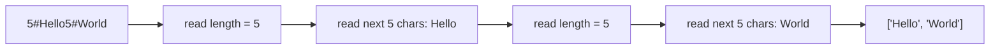

# String Basics: Encoding and Parsing

## Interview Goal

String problems are often difficult not because of some API, but because of edge cases:

- Python slices are left-closed and right-open.
- Strings are immutable, so be careful with frequent concatenation.
- When parsing strings, the meaning of each pointer must be clear.
- If you want to encode multiple strings into one string, you must design unambiguous boundaries.

`Encode and Decode Strings` belongs in the string section, not Hash Table. Its core is serialization / parsing, and it does not require a hash table.

## Python String Basics

### 1. Indexing: a single position

```python
s = "abcdef"

s[0]   # "a"
s[1]   # "b"
s[-1]  # "f"
s[-2]  # "e"
```

Positive indices go from left to right, and negative indices go from right to left.

```text
 s:   a  b  c  d  e  f
idx:  0  1  2  3  4  5
neg: -6 -5 -4 -3 -2 -1
```

### 2. Slice: left-closed, right-open

In Python, `s[l:r]` means:

```text
Start at l, and take characters up to but not including r
Include l, exclude r
```

That is the interval `[l, r)` in mathematics.

```python
s = "abcdef"

s[0:3]  # "abc"
s[2:5]  # "cde"
s[:3]   # "abc"
s[3:]   # "def"
s[2:2]  # ""
```

Remember this sentence:

```text
The length of s[l:r] = r - l
```

So if you want to take `length` characters starting from `start`, the right boundary should be:

```python
s[start:start + length]
```

This is the key to decoding in this problem.

### 3. Strings are immutable: use list + join for concatenation

Python strings are immutable. Repeatedly doing this inside a loop:

```python
encoded += piece
```

may create many intermediate strings. A more reliable approach is:

```python
parts = []
parts.append("5")
parts.append("#")
parts.append("Hello")
encoded = "".join(parts)
```

In interviews, writing `+=` will usually still pass, but `list + join` is closer to standard engineering style.

### 4. Pointer scanning: define the meaning of each pointer first

When parsing a string, assign a meaning to each pointer first:

```text
i: the start position of the current field
j: scan to the right to find the delimiter
start: the start position of the payload
```

For example:

```python
j = i
while s[j] != "#":
    j += 1

length = int(s[i:j])
start = j + 1
payload = s[start:start + length]
```

This is more reliable than hard-coding `i + 2`, because the length field may have multiple digits.

## NeetCode Example: Encode and Decode Strings

The problem asks you to design two functions:

```python
encode(List[str]) -> str
decode(str) -> List[str]
```

The sender encodes a list of strings into one string, and the receiver reconstructs the exact same list from it.

For example:

```text
["Hello", "World"] -> encoded string -> ["Hello", "World"]
```

The difficulty is that each string may contain any ASCII character, so you cannot assume some ordinary character will definitely not appear in the original strings.

### Why can't we just separate them with commas?

If you write it directly as:

```text
["ab", "cd"]      -> "ab,cd"
["ab,cd"]         -> "ab,cd"
```

When the decoder sees `"ab,cd"`, it cannot tell whether it was originally one string or two strings.

Likewise, you cannot casually choose `#`, `|`, spaces, or newlines as separators, because the problem allows strings to contain any of the 256 ASCII characters. As long as the separator may appear in the original strings, the protocol becomes ambiguous.

### Length prefix: first tell me how many characters to read next

A stable approach is to add a length prefix to each string:

```text
len + "#" + string
```

For example:

```text
["Hello", "World"]
  -> "5#Hello5#World"

["", "a#b", "x,y"]
  -> "0#3#a#b3#x,y"
```

When decoding, there is no need to guess the delimiter:

```text
Read digits until #
  -> get the current string length n
Skip #
Read the next n characters
  -> get the original string
Continue reading the next length prefix
```



### Why is this approach close to optimal?

Here, "optimal" does not mean the encoding is absolutely shortest in the information-theoretic sense. It means the approach satisfies several key properties in interviews and engineering practice:

| Property | Why it matters |
| --- | --- |
| Unambiguous | Every data segment has an explicit length and does not rely on special delimiters |
| Supports arbitrary characters | The original strings may contain commas, `#`, newlines, null characters, and so on |
| Linear time | Both encode and decode scan the total number of characters only once |
| No escaping needed | No need to turn `,` into `\,`, and no need to handle chains of backslash escapes |
| Stream-friendly | Once the decoder knows the length, it can directly read a fixed number of bytes |

The length prefix avoids the complexity of escaping. The protocol relies on only two facts:

1. The length prefix consists of digits.
2. The first `#` is used only to terminate the length field and is not part of the payload.

Even if the payload contains `#`, that is fine, because the decoder already knows how many characters it should read.

## Encode and Decode Strings Solution

<details class="solution" open>
<summary>Expand Solution</summary>

```python
from typing import List

class Solution:
    def encode(self, strs: List[str]) -> str:
        encoded = []
        for s in strs:
            encoded.append(str(len(s)))
            encoded.append("#")
            encoded.append(s)
        return "".join(encoded)

    def decode(self, s: str) -> List[str]:
        result = []
        i = 0

        while i < len(s):
            j = i
            while s[j] != "#":
                j += 1

            length = int(s[i:j])
            start = j + 1
            result.append(s[start:start + length])
            i = start + length

        return result
```

Complexity:

- Let the total length of all strings be `N`.
- Encode time complexity: `O(N)`.
- Decode time complexity: `O(N)`.
- Extra space: `O(N)`, because the output and the encoded string itself require space.

</details>

## Common Mistake: Reading Only One Digit of the Length

One easy-to-get-wrong version is:

```python
def decode(self, s: str) -> List[str]:
    i = 0
    res = []
    while i < len(s):
        length = int(s[i])
        c_str = s[i + 2:i + length + 2]
        res.append(c_str)
        i = i + length + 2
    return res
```

This code assumes the length field has only one digit by default, so it can only handle strings with lengths `0..9`. As soon as a string length has two digits, it breaks.

For example:

```text
Original list:
["abcdefghij"]

Correct encoding:
"10#abcdefghij"
```

The incorrect code reads it like this:

```text
i = 0
length = int(s[0]) = 1
c_str = s[2:3] = "#"
```

It reads the length `10` as only `1`, and even reads `#` as part of the payload. The later pointers then all become misaligned.

So when decoding, you must find `#` first:

```text
i points to the start of the length
j moves right from i until s[j] == "#"
length = int(s[i:j])
payload starts at j + 1, and read length characters
```

The core difference:

| Style | Problem |
| --- | --- |
| `length = int(s[i])` | Supports only one-digit lengths |
| `while s[j] != "#": j += 1` | Supports lengths with any number of digits |
