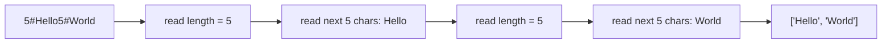

# String Basics: Encoding and Parsing

## 面试目标

字符串题经常不是难在某个 API，而是难在边界：

- Python slice 是左闭右开。
- 字符串不可变，频繁拼接要小心。
- 解析字符串时，指针含义必须清楚。
- 如果要把多个字符串编码成一个字符串，必须设计无歧义的边界。

`Encode and Decode Strings` 应该放在字符串章节，而不是 Hash Table。它的核心是 serialization / parsing，不需要哈希表。

## Python 字符串基础

### 1. 索引：单个位置

```python
s = "abcdef"

s[0]   # "a"
s[1]   # "b"
s[-1]  # "f"
s[-2]  # "e"
```

正索引从左往右，负索引从右往左。

```text
 s:   a  b  c  d  e  f
idx:  0  1  2  3  4  5
neg: -6 -5 -4 -3 -2 -1
```

### 2. Slice：左闭右开

Python 的 `s[l:r]` 表示：

```text
从 l 开始，取到 r 之前
包含 l，不包含 r
```

也就是数学里的区间 `[l, r)`。

```python
s = "abcdef"

s[0:3]  # "abc"
s[2:5]  # "cde"
s[:3]   # "abc"
s[3:]   # "def"
s[2:2]  # ""
```

记住这一句：

```text
s[l:r] 的长度 = r - l
```

所以如果你要从 `start` 开始取 `length` 个字符，右边界应该是：

```python
s[start:start + length]
```

这就是本题 decode 的关键。

### 3. 字符串不可变：拼接用 list + join

Python 字符串是 immutable。循环里不断做：

```python
encoded += piece
```

可能会制造很多中间字符串。更稳的写法是：

```python
parts = []
parts.append("5")
parts.append("#")
parts.append("Hello")
encoded = "".join(parts)
```

面试里写 `+=` 通常也能过，但 `list + join` 更像标准工程写法。

### 4. 指针扫描：先定义每个指针的含义

解析字符串时，先给指针一个语义：

```text
i: 当前字段的开始位置
j: 向右扫描，找到分隔符
start: payload 的开始位置
```

比如：

```python
j = i
while s[j] != "#":
    j += 1

length = int(s[i:j])
start = j + 1
payload = s[start:start + length]
```

这个写法比硬背 `i + 2` 更可靠，因为长度字段可能有多位。

## NeetCode 例题：Encode and Decode Strings

题目要求设计两个函数：

```python
encode(List[str]) -> str
decode(str) -> List[str]
```

发送端把字符串列表编码成一个字符串，接收端再还原成完全相同的列表。

例如：

```text
["Hello", "World"] -> encoded string -> ["Hello", "World"]
```

难点是每个字符串里可以出现任意 ASCII 字符，所以不能假设某个普通字符一定不会出现在原字符串里。

### 为什么不能直接用逗号分隔？

如果直接写：

```text
["ab", "cd"]      -> "ab,cd"
["ab,cd"]         -> "ab,cd"
```

解码器看到 `"ab,cd"` 时，不知道它原来是一个字符串，还是两个字符串。

同样，不能随便选 `#`、`|`、空格、换行做分隔符，因为题目允许字符串包含任意 256 个 ASCII 字符。只要分隔符可能出现在原字符串里，协议就会有歧义。

### 长度前缀：先告诉我接下来读几个字符

稳定做法是给每个字符串加一个长度前缀：

```text
len + "#" + string
```

例如：

```text
["Hello", "World"]
  -> "5#Hello5#World"

["", "a#b", "x,y"]
  -> "0#3#a#b3#x,y"
```

解码时不需要猜分隔符：

```text
读数字直到 #
  -> 得到当前字符串长度 n
跳过 #
读取接下来的 n 个字符
  -> 得到原字符串
继续读下一个 length prefix
```



### 为什么这种方式接近最优？

这里的“最优”不是说信息论上编码长度绝对最短，而是说它在面试和工程实现里满足几个关键性质：

| 性质 | 为什么重要 |
| --- | --- |
| 无歧义 | 每段数据都有明确长度，不依赖特殊分隔符 |
| 支持任意字符 | 原字符串里可以出现逗号、`#`、换行、空字符等 |
| 线性时间 | encode 和 decode 都只扫描总字符数一次 |
| 不需要 escaping | 不用把 `,` 变成 `\,`，也不用处理反斜杠连锁转义 |
| 流式友好 | 解码器知道长度后，可以直接读取固定字节数 |

长度前缀把 escaping 的复杂度绕开。协议只依赖两个事实：

1. 长度前缀由数字组成。
2. 第一个 `#` 只用来结束长度字段，不属于 payload。

就算 payload 里有 `#`，也没关系，因为解码器已经知道应该读几个字符。

## Encode and Decode Strings 解法

<details class="solution" open>
<summary>展开解法</summary>

```python
from typing import List

class Solution:
    def encode(self, strs: List[str]) -> str:
        encoded = []
        for s in strs:
            encoded.append(str(len(s)))
            encoded.append("#")
            encoded.append(s)
        return "".join(encoded)

    def decode(self, s: str) -> List[str]:
        result = []
        i = 0

        while i < len(s):
            j = i
            while s[j] != "#":
                j += 1

            length = int(s[i:j])
            start = j + 1
            result.append(s[start:start + length])
            i = start + length

        return result
```

复杂度：

- 设所有字符串总长度为 `N`。
- encode 时间复杂度：`O(N)`。
- decode 时间复杂度：`O(N)`。
- 额外空间：`O(N)`，输出和编码字符串本身需要空间。

</details>

## 常见错误：只读取一位长度

一个很容易写错的版本是：

```python
def decode(self, s: str) -> List[str]:
    i = 0
    res = []
    while i < len(s):
        length = int(s[i])
        c_str = s[i + 2:i + length + 2]
        res.append(c_str)
        i = i + length + 2
    return res
```

这个代码默认长度字段只有一位数，所以只能处理长度 `0..9` 的字符串。一旦字符串长度是两位数，就会错。

例如：

```text
原始列表:
["abcdefghij"]

正确编码:
"10#abcdefghij"
```

错误代码会这样读：

```text
i = 0
length = int(s[0]) = 1
c_str = s[2:3] = "#"
```

它把长度 `10` 只读成了 `1`，而且还把 `#` 当成 payload 的一部分读出来。后面的指针也会全部错位。

所以 decode 时必须先找到 `#`：

```text
i 指向 length 的开始
j 从 i 往右走，直到 s[j] == "#"
length = int(s[i:j])
payload 从 j + 1 开始，读 length 个字符
```

核心区别：

| 写法 | 问题 |
| --- | --- |
| `length = int(s[i])` | 只支持一位长度 |
| `while s[j] != "#": j += 1` | 支持任意位数长度 |
