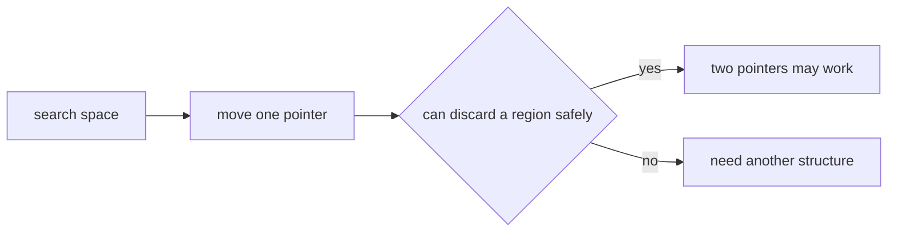
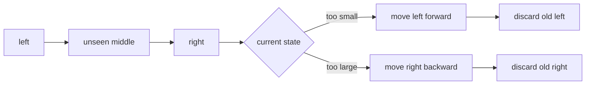
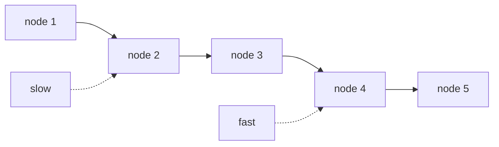

# Two Pointers

## What Problems Does This Topic Solve?

The two-pointer technique is not just about "writing two variables." Its core is: using two pointers that only move in one direction to replace a loop that would otherwise repeatedly enumerate states.

The most common brute-force approach is:

```python
for i in range(n):
    for j in range(i + 1, n):
        check(i, j)
```

This enumerates many pairs, typically resulting in `O(n^2)` complexity. What the two-pointer technique aims to do is: every time a pointer moves, it safely eliminates a batch of impossible states.

```text
Brute-force enumeration:
  Each i re-scans many j's

Two pointers:
  left / right move monotonically
  Each position is visited by a pointer at most a constant number of times
```

Therefore, when determining if a problem can be solved with two pointers, the key is not whether the problem contains "two indices," but whether you can answer:

```text
When I move a certain pointer, why are the skipped states guaranteed to be unnecessary to check?
```

If you cannot answer this question clearly, the two-pointer approach is likely just code written by coincidence, not a reliable solution.

## Core Condition: Monotonicity

Two pointers usually rely on some monotonic structure:

```text
The array is already sorted
After the right end of the window expands, a condition changes monotonically (either better or worse)
The linked list next pointer naturally only moves forward
During in-place overwriting, both the read and write pointers only move forward
```

As long as the pointers can move monotonically, the complexity is easy to control. Conversely, if after moving a pointer, the discarded region could potentially become the answer in the future, then you cannot directly use the two-pointer technique.



## Pattern 1: Opposite Direction Two Pointers

Opposite direction two pointers usually start from both ends:

```python
left, right = 0, len(nums) - 1

while left < right:
    if should_move_left(nums[left], nums[right]):
        left += 1
    else:
        right -= 1
```

It is suitable for problems where "two endpoints jointly determine the answer," especially when the array is already sorted.

A sorted array has an advantage: you know in which direction a value will change if you move the left or right end. For example, if the current value is too small, move the left pointer; if the current value is too large, move the right pointer. This step is not a guess, but utilizes the monotonicity brought by sorting.



You can think of opposite direction two pointers as continuously compressing an interval:

```text
[ left ................. right ]
   ↑                      ↑

Each round does only two things:
1. Use the current two ends to determine if the answer should be updated
2. Discard the left or right end based on monotonicity
```

It does not check all pairs; instead, it eliminates an entire boundary at each step.

## Pattern 2: Fast and Slow Pointers

Fast and slow pointers are common in linked lists, cycle detection, and in-place array processing.

```python
slow = head
fast = head

while fast and fast.next:
    slow = slow.next
    fast = fast.next.next
```

The fast pointer is responsible for exploring the structure faster, while the slow pointer maintains a relative position. Linked lists do not support random access and cannot jump to the midpoint like arrays, so fast and slow pointers are a natural fit.



Fast and slow pointers can also be used in in-place overwriting, though they are more commonly called read and write pointers in that context.

## Pattern 3: Read and Write Pointers

Read and write pointers are suitable for modifying arrays in-place:

```python
write = 0

for read in range(len(nums)):
    if keep(nums[read]):
        nums[write] = nums[read]
        write += 1
```

`read` scans the original array, and `write` points to the next position to be written.

```text
read:  responsible for looking at each element
write: responsible for maintaining the compressed result interval
```

The key to this pattern is:

```text
nums[:write] is always the processed result
nums[read] is the element currently being evaluated
```

It does not require an extra array, and the space complexity is usually `O(1)`.

## Why Complexity is Usually O(n)

The basic explanation for the complexity of two pointers is:

```text
Each pointer moves monotonically and never looks back.
```

Taking opposite direction two pointers as an example:

```text
left only moves to the right
right only moves to the left
Together, they move at most n times
```

Fast and slow pointers follow the same amortized analysis: even if `fast` moves two steps per round, neither pointer looks back, so the total number of moves remains $O(n)$.

If the problem requires sorting first, the total complexity is usually:

```text
Sorting: O(n log n)
Two-pointer scan: O(n)
Total complexity: O(n log n)
```

If it is something like `3Sum`, which involves one layer of enumeration plus one layer of two pointers:

```text
Outer layer fixes one number: O(n)
Inner layer two-pointer scan: O(n)
Total complexity: O(n^2)
```

This is one layer less than the `O(n^3)` of a triple loop.

## Example: 3Sum = Fix One Number + Two Sum

The problem asks to find all unique triplets in the array that satisfy the following equation:

$$
a+b+c=0.
$$

The brute-force method enumerates three indices, requiring $O(n^3)$. A better approach is to sort the array, fix the first number `nums[i]`, and then search in the remaining interval to the right:

$$
nums[left]+nums[right]=-nums[i].
$$

This reduces 3Sum to a Two Sum problem on a sorted array.

```three-sum-demo
```

### 3Sum Code

```python
class Solution:
    def threeSum(self, nums: List[int]) -> List[List[int]]:
        nums.sort()
        if len(nums) < 3:
            return []

        result = []

        for i in range(len(nums) - 2):
            # target is 0; if the fixed value is already > 0, it's impossible to sum to 0 later.
            if nums[i] > 0:
                break

            # Use the same value as an anchor only once to avoid duplicate triplets.
            if i > 0 and nums[i] == nums[i - 1]:
                continue

            left = i + 1
            right = len(nums) - 1

            while left < right:
                total = nums[i] + nums[left] + nums[right]

                if total == 0:
                    result.append([nums[i], nums[left], nums[right]])

                    # After a match, skip duplicate values on the left and right.
                    while left < right and nums[left] == nums[left + 1]:
                        left += 1
                    while left < right and nums[right] == nums[right - 1]:
                        right -= 1

                    left += 1
                    right -= 1
                elif total < 0:
                    left += 1
                else:
                    right -= 1

        return result
```

### Why Pointer Movement Doesn't Miss Answers

The array is already sorted. After fixing `i`:

```text
total < 0:
  The current sum is too small.
  right is already the maximum value in the current interval; if we keep the old left, switching to a smaller right will only make the sum smaller.
  Therefore, the old left cannot be part of the answer, and we can safely execute left += 1.

total > 0:
  The current sum is too large.
  left is already the minimum value in the current interval; if we keep the old right, switching to a larger left will only make the sum larger.
  Therefore, the old right cannot be part of the answer, and we can safely execute right -= 1.
```

This is the proof of monotonicity required for the two-pointer technique.

### 3Sum Has Three Layers of Deduplication

```text
Anchor i deduplication:
  Skip when nums[i] == nums[i - 1] to avoid fixing the same first number repeatedly.

left deduplication:
  Skip consecutive identical left values after a match.

right deduplication:
  Skip consecutive identical right values after a match.
```

Deduplication must be performed **after a match**. If `total < 0` or `total > 0`, simply move the corresponding pointer; duplicate values will at most cause one extra comparison and will not affect correctness.

Complexity:

$$
\text{time}=O(n^2),\qquad \text{extra space}=O(1)
$$

The extra space here does not include the sorting implementation or the output array.

## 4Sum: Fix Two Numbers + Two Sum

4Sum asks to find:

$$
a+b+c+d=target.
$$

Its structure is exactly the same as 3Sum, just with one more layer fixed:

```text
First layer fixes i
  Second layer fixes j
    left / right perform Two Sum to the right of j
```

### 4Sum Code

```python
class Solution:
    def fourSum(self, nums: List[int], target: int) -> List[List[int]]:
        nums.sort()
        n = len(nums)
        result = []

        for i in range(n - 3):
            if i > 0 and nums[i] == nums[i - 1]:
                continue

            # The minimum sum after fixing i is already too large; subsequent i's will be even larger.
            if nums[i] + nums[i + 1] + nums[i + 2] + nums[i + 3] > target:
                break

            # Even the largest three numbers after fixing i are not enough; current i cannot have an answer.
            if nums[i] + nums[-1] + nums[-2] + nums[-3] < target:
                continue

            for j in range(i + 1, n - 2):
                if j > i + 1 and nums[j] == nums[j - 1]:
                    continue

                if nums[i] + nums[j] + nums[j + 1] + nums[j + 2] > target:
                    break

                if nums[i] + nums[j] + nums[-1] + nums[-2] < target:
                    continue

                left = j + 1
                right = n - 1

                while left < right:
                    total = nums[i] + nums[j] + nums[left] + nums[right]

                    if total == target:
                        result.append([
                            nums[i], nums[j], nums[left], nums[right]
                        ])

                        while left < right and nums[left] == nums[left + 1]:
                            left += 1
                        while left < right and nums[right] == nums[right - 1]:
                            right -= 1

                        left += 1
                        right -= 1
                    elif total < target:
                        left += 1
                    else:
                        right -= 1

        return result
```

Complexity is:

$$
O(n^3)
$$

Two fixed layers each contribute an $n$, and the innermost two-pointer scan moves linearly. Excluding the sorting implementation and output array, the extra space is $O(1)$.

In languages with fixed-width integers like C++ or Java, adding four `int`s might overflow; you should convert to `long long` or `long` when calculating `total`. Python integers do not overflow.

## KSum: Recursive Dimensionality Reduction, Ending in Two Sum

You don't need to memorize 3Sum and 4Sum separately. The unified structure is:

```text
KSum(start, k, target)
  Fix nums[i]
  -> Solve (k - 1)Sum(i + 1, target - nums[i])
  -> Reduce until 2Sum
  -> Solve 2Sum using opposite direction two pointers
```

### General KSum Code

```python
class Solution:
    def kSum(self, nums: List[int], k: int, target: int) -> List[List[int]]:
        nums.sort()

        def solve(start: int, k: int, target: int) -> List[List[int]]:
            result = []
            n = len(nums)

            if k < 2 or n - start < k:
                return result

            # Minimum and maximum sums possible in the current interval, used for pruning.
            min_sum = sum(nums[start:start + k])
            max_sum = sum(nums[-k:])
            if target < min_sum or target > max_sum:
                return result

            # Base case: Two Sum on a sorted array.
            if k == 2:
                left, right = start, n - 1

                while left < right:
                    total = nums[left] + nums[right]

                    if total == target:
                        result.append([nums[left], nums[right]])

                        left_value = nums[left]
                        right_value = nums[right]
                        while left < right and nums[left] == left_value:
                            left += 1
                        while left < right and nums[right] == right_value:
                            right -= 1
                    elif total < target:
                        left += 1
                    else:
                        right -= 1

                return result

            # Fix one number, reducing kSum to (k - 1)Sum.
            for i in range(start, n - k + 1):
                if i > start and nums[i] == nums[i - 1]:
                    continue

                # Minimum possible sum of the remaining k-1 numbers after fixing nums[i].
                smallest = nums[i] + sum(nums[i + 1:i + k])
                if smallest > target:
                    break

                # Maximum possible sum of the remaining k-1 numbers after fixing nums[i].
                largest = nums[i] + sum(nums[-(k - 1):])
                if largest < target:
                    continue

                tails = solve(i + 1, k - 1, target - nums[i])
                for tail in tails:
                    result.append([nums[i]] + tail)

            return result

        return solve(0, k, target)
```

Usage:

```python
# 3Sum
answer = Solution().kSum(nums, 3, 0)

# 4Sum
answer = Solution().kSum(nums, 4, target)
```

### Why KSum Doesn't Produce Duplicates

Each level of recursion does only one thing: the same value is fixed only the first time it appears at that level.

```python
if i > start and nums[i] == nums[i - 1]:
    continue
```

Note that the condition is `i > start`, not `i > 0`. This is because each level of recursion has its own starting point; we only skip duplicate candidates adjacent at the **current level**.

The base case 2Sum also skips identical values on both sides after a match, so no duplicates are produced from any level down to the final pair.

### KSum Complexity

For a fixed $k$, the worst-case time complexity is:

$$
O(n^{k-1}).
$$

The reason is that the first $k-2$ levels of recursion each fix one number, and the final 2Sum is $O(n)$. For example:

| Problem | Structure | Worst-case Time |
|---|---|---:|
| 2Sum (sorted) | Two pointers | $O(n)$ |
| 3Sum | Fix 1 layer + 2Sum | $O(n^2)$ |
| 4Sum | Fix 2 layers + 2Sum | $O(n^3)$ |
| KSum | Fix $k-2$ layers + 2Sum | $O(n^{k-1})$ |

The recursion stack depth is $O(k)$, excluding the output result. Pruning based on upper and lower bounds makes the actual execution faster, but does not change the worst-case complexity.

### Should You Write General KSum in an Interview?

If the problem only asks for 3Sum, writing the version that fixes one layer is clearer; if it only asks for 4Sum, writing two loops is also easier to check for boundary conditions. Only write the recursive template if the problem explicitly asks for a generalization, follows up with KSum, or if you want to demonstrate abstraction skills.

The correct order of explanation is usually:

```text
Write 3Sum correctly first
  -> Explain that 4Sum is just fixing one more layer
  -> Finally abstract it into KSum recursion
```

## Example: Trapping Rain Water = Settle the Shorter Max First

### Problem Translation

Given a non-negative integer array `height` representing a topographical map of columns. `height[i]` is the height of the $i$-th column, and the width of each column is 1.

Return how many units of rainwater can be trapped between these columns.

Classic example:

```text
height = [0,1,0,2,1,0,1,3,2,1,2,1]
answer = 6
```

### First, Write Out the Water Volume at Each Cell

How much water can be trapped at position $i$ depends only on the tallest wall to its left and the tallest wall to its right:

$$
water[i]
=
\min(leftMax[i],rightMax[i])-height[i].
$$

Where:

$$
leftMax[i]=\max(height[0],\ldots,height[i]),
$$

$$
rightMax[i]=\max(height[i],\ldots,height[n-1]).
$$

The `min` is because the water level is determined by the shorter boundary. The taller wall will not cause water to float above the shorter wall.

You can pre-calculate all `leftMax` and `rightMax` using two arrays, which takes $O(n)$ time and $O(n)$ extra space. The goal of the two-pointer technique is: instead of saving the entire prefix and suffix tables, only maintain the tallest walls at the current two ends.

```rain-water-demo
```

### Core Logic of Two Pointers

Maintain:

```text
left, right
leftMax  = tallest column from the left end of the array to left
rightMax = tallest column from the right end of the array to right
```

If:

$$
leftMax\le rightMax,
$$

Then it is already determined that there exists a wall on the right with a height of at least `rightMax`, which is not lower than `leftMax`. Therefore, the shorter boundary at the `left` position must be `leftMax`, and we don't need to know about the columns in between that haven't been scanned yet:

$$
water[left]=leftMax-height[left].
$$

At this point, we can safely settle `left` and then set `left += 1`.

Conversely, if:

$$
rightMax<leftMax,
$$

There is already a sufficiently tall wall on the left, and the `right` position can be settled immediately:

$$
water[right]=rightMax-height[right],
$$

Then set `right -= 1`.

The most important mnemonic is:

```text
Compare not "which current column is shorter," but "which side's historical tallest wall is shorter."
The shorter max is settled first, while the taller max continues to wait.
```

### Two-Pointer Code

```python
class Solution:
    def trap(self, height: List[int]) -> int:
        if not height:
            return 0

        left = 0
        right = len(height) - 1
        left_max = 0
        right_max = 0
        water = 0

        while left <= right:
            left_max = max(left_max, height[left])
            right_max = max(right_max, height[right])

            if left_max <= right_max:
                water += left_max - height[left]
                left += 1
            else:
                water += right_max - height[right]
                right -= 1

        return water
```

Here, `left_max` and `right_max` are updated first, so:

$$
leftMax-height[left]\ge0,
\qquad
rightMax-height[right]\ge0.
$$

When encountering a new, taller column, it updates the boundary, and the water volume at that cell naturally becomes 0.

### Where Do the 6 Units of Water in the Example Come From?

For:

```text
[0,1,0,2,1,0,1,3,2,1,2,1]
```

The positions that actually trap water are:

| index | height | Final Water Level | Water Volume |
|---:|---:|---:|---:|
| 2 | 0 | 1 | 1 |
| 4 | 1 | 2 | 1 |
| 5 | 0 | 2 | 2 |
| 6 | 1 | 2 | 1 |
| 9 | 1 | 2 | 1 |

Therefore:

$$
1+1+2+1+1=6.
$$

### Correctness Invariant

During the loop, the following is always maintained:

```text
[0, left) and (right, n-1] have been correctly settled;
leftMax is the tallest wall in the scanned region on the left;
rightMax is the tallest wall in the scanned region on the right;
[left, right] is the unsettled region.
```

Each round selects the side with the smaller `max`. The other side has already provided a boundary not lower than it, so the water volume at this cell will not be changed by unknown regions. After processing, the interval shrinks by at least one cell, and eventually, all positions are settled.

### Complexity

Both pointers only move toward the middle, and each position is processed at most once:

$$
\text{time}=O(n),\qquad \text{extra space}=O(1).
$$

### Common Mistakes in Trapping Rain Water

#### 1. Calculating using adjacent columns

Water can span many columns; the water level is determined by the tallest boundaries on the left and right, not necessarily adjacent columns.

#### 2. Settling the taller max first

For the taller side, we don't yet know if there is a wall of equal height on the other side, so its water level is not yet determined. Only the side with the shorter `max` has been "contained" by the opposite side.

#### 3. Mixing two templates

Some correct implementations compare `height[left]` and `height[right]`, while others compare `leftMax` and `rightMax`. The update order and proofs for both are slightly different. This guide uses the `max` template; do not replace the condition while keeping the other update order.

#### 4. Forgetting to subtract the column itself

The water volume is:

$$
\text{Water Level}-\text{Column Height},
$$

not the water level itself.

## Common Mistakes

### 1. Forcing it without monotonicity

If the array is not sorted and there is no window condition, moving a pointer does not necessarily eliminate any states. In this case, two pointers will not automatically be correct.

### 2. Moving both sides simultaneously in opposite direction pointers

Some problems only allow moving one side based on a condition per round. Writing:

```python
left += 1
right -= 1
```

might skip the answer. Unless you can prove that both sides can be safely discarded.

### 3. Forgetting to handle duplicate values

In problems involving sorting + two pointers, duplicate values often affect deduplication. Deduplication logic should be thought through alongside pointer movement.

### 4. Infinite loops due to stationary pointers

In `while left < right`, you must ensure at least one pointer moves in each round; otherwise, the loop state will never change.

## Mnemonic Version

```text
Sorted array, look for opposite direction two pointers.
Linked list structure, look for fast and slow pointers.
In-place compression, look for read and write pointers.
Trapping rain water, look for the shorter leftMax / rightMax, settle the shorter side first.

The essence of two pointers:
  Every step moved, a part of the search space is safely discarded.
```
