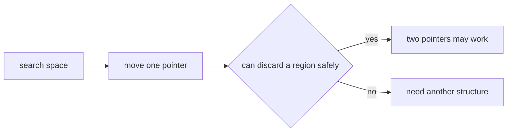
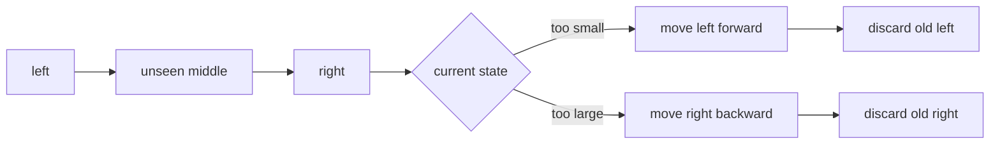
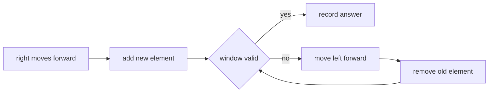
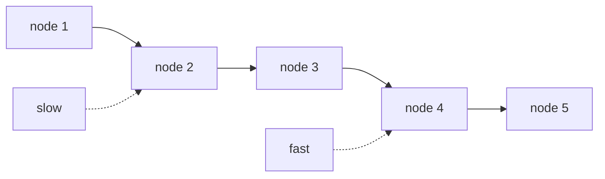

# Two Pointers

## 这个专题解决什么问题

双指针不是“写两个变量”这么简单。它的核心是：用两个只往一个方向移动的指针，替代原本会反复枚举的循环。

最常见的暴力写法是：

```python
for i in range(n):
    for j in range(i + 1, n):
        check(i, j)
```

这会枚举很多 pair，复杂度通常是 `O(n^2)`。双指针想做的是：每移动一次指针，都能安全排除一批不可能的状态。

```text
暴力枚举:
  每个 i 都重新扫很多 j

双指针:
  left / right 单调移动
  每个位置最多被一个指针经过常数次
```

所以判断一道题能不能用双指针，重点不是题目里有没有“两个下标”，而是能不能回答：

```text
当我移动某个指针时，被跳过的那些状态为什么一定不用再看？
```

如果这个问题答不清楚，双指针很可能只是碰巧写出来的代码，不是可靠解法。

## 核心条件：单调性

双指针通常依赖某种单调结构：

```text
数组已经排序
窗口右端扩大后，某个条件只会单调变坏或变好
链表 next 指针天然只能往前
原地覆盖时，读指针和写指针都只前进
```

只要指针可以单调移动，复杂度就容易控制。反过来，如果移动一个指针以后，前面被丢掉的区域未来又可能变成答案，那就不能直接用双指针。



## 模式一：相向双指针

相向双指针通常从两端开始：

```python
left, right = 0, len(nums) - 1

while left < right:
    if should_move_left(nums[left], nums[right]):
        left += 1
    else:
        right -= 1
```

它适合处理“两个端点共同决定答案”的问题，尤其是数组已经排序时。

排序后的数组有一个好处：你能知道移动左端或右端会让某个值往哪个方向变化。比如当前值太小，就移动左指针；当前值太大，就移动右指针。这一步不是猜，而是利用了排序带来的单调性。



可以把相向双指针理解成不断压缩区间：

```text
[ left ................. right ]
   ↑                      ↑

每一轮只做两件事：
1. 用当前两端判断是否更新答案
2. 根据单调性丢掉左端或右端
```

它不是把所有 pair 都检查一遍，而是在每一步排除一整条边界。

## 模式二：同向双指针，也就是滑动窗口

滑动窗口通常有两个边界：

```python
left = 0

for right in range(len(nums)):
    add(nums[right])

    while window_is_invalid():
        remove(nums[left])
        left += 1

    update_answer()
```

这里 `right` 负责扩大窗口，`left` 负责在窗口不合法时收缩窗口。

```text
nums:  a  b  c  d  e  f  g
             [ window ]
              left  right
```

这种模式适合“连续子数组 / 子串”问题，因为窗口本身就是一个连续区间。



滑动窗口里最重要的是写清楚 invariant，也就是窗口始终代表什么：

```text
window = nums[left:right + 1]
窗口内维护哪些统计量？
窗口什么时候合法？
合法时更新答案，还是非法时更新答案？
```

很多错误不是指针错了，而是窗口含义没写清楚。

## 模式三：快慢指针

快慢指针常见于链表、环检测、原地数组处理。

```python
slow = head
fast = head

while fast and fast.next:
    slow = slow.next
    fast = fast.next.next
```

快指针负责更快地探索结构，慢指针保留某个相对位置。链表没有随机访问，不能像数组一样直接跳到中点，所以快慢指针很自然。



快慢指针也可以用在原地覆盖里，不过那时更常叫读写指针。

## 模式四：读写指针

读写指针适合原地修改数组：

```python
write = 0

for read in range(len(nums)):
    if keep(nums[read]):
        nums[write] = nums[read]
        write += 1
```

`read` 扫描原数组，`write` 指向下一个要写入的位置。

```text
read:  负责看每个元素
write: 负责维护压缩后的结果区间
```

这个模式的关键是：

```text
nums[:write] 永远是已经处理好的结果
nums[read] 是当前正在判断的元素
```

它不需要额外数组，空间通常是 `O(1)`。

## 为什么复杂度通常是 O(n)

双指针复杂度的基本解释是：

```text
每个指针只单调移动，不回头。
```

以滑动窗口为例：

```text
right 从 0 走到 n - 1，最多走 n 次。
left 也从 0 走到 n - 1，最多走 n 次。
```

所以总移动次数最多是：

```text
n + n = 2n
```

去掉常数，就是 `O(n)`。

这也是为什么有些代码看起来像嵌套循环，实际不是 `O(n^2)`：

```python
left = 0
for right in range(n):
    while need_shrink():
        left += 1
```

虽然 `while` 写在 `for` 里面，但 `left` 不会每轮从头开始。它整个算法期间最多移动 `n` 次。

相向双指针也一样：

```text
left 只向右走
right 只向左走
两者最多合计移动 n 次
```

如果题目需要先排序，那么总复杂度通常是：

```text
排序: O(n log n)
双指针扫描: O(n)
总复杂度: O(n log n)
```

如果是 `3Sum` 这种一层枚举加一层双指针：

```text
外层固定一个数: O(n)
内层双指针扫描: O(n)
总复杂度: O(n^2)
```

它比三重循环的 `O(n^3)` 少了一层。

## 常见错误

### 1. 没有单调性就硬用

如果数组没有排序，也没有窗口条件，移动一个指针未必能排除任何状态。这时双指针不会自动正确。

### 2. 相向指针里同时移动两边

有些题每轮只能根据条件移动一边。随手写：

```python
left += 1
right -= 1
```

可能会跳过答案。除非你能证明两边都可以安全丢掉。

### 3. 滑动窗口没有维护统计量

窗口题通常需要维护计数、sum、frequency map 或 distinct count。只移动指针但不更新这些状态，窗口合法性就会变脏。

### 4. 忘记处理重复值

排序 + 双指针的题里，重复值经常影响去重。去重逻辑应该和指针移动放在一起想清楚。

### 5. 指针不动导致死循环

`while left < right` 里每一轮必须保证至少一个指针移动。滑动窗口里，`while window_is_invalid()` 也必须让窗口逐渐接近合法状态。

## 记忆版

```text
排序数组，看相向双指针。
连续区间，看滑动窗口。
链表结构，看快慢指针。
原地压缩，看读写指针。

双指针的本质：
  每移动一步，都能安全丢掉一部分搜索空间。
```
