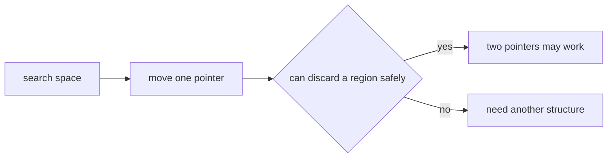
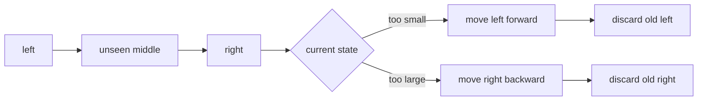
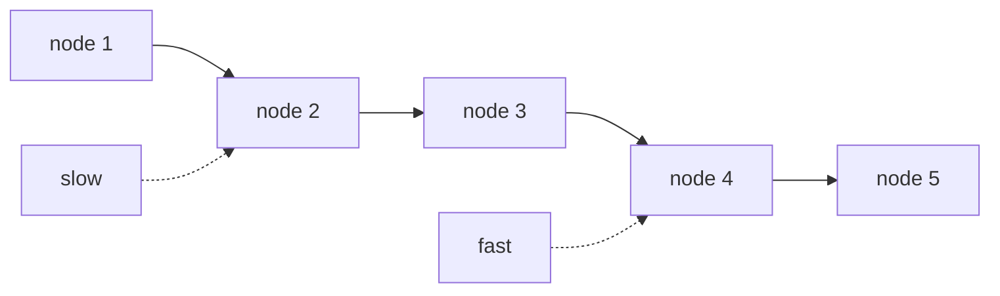

# Two Pointers

## 这个专题解决什么问题

双指针不是“写两个变量”这么简单。它的核心是：用两个只往一个方向移动的指针，替代原本会反复枚举的循环。

最常见的暴力写法是：

```python
for i in range(n):
    for j in range(i + 1, n):
        check(i, j)
```

这会枚举很多 pair，复杂度通常是 `O(n^2)`。双指针想做的是：每移动一次指针，都能安全排除一批不可能的状态。

```text
暴力枚举:
  每个 i 都重新扫很多 j

双指针:
  left / right 单调移动
  每个位置最多被一个指针经过常数次
```

所以判断一道题能不能用双指针，重点不是题目里有没有“两个下标”，而是能不能回答：

```text
当我移动某个指针时，被跳过的那些状态为什么一定不用再看？
```

如果这个问题答不清楚，双指针很可能只是碰巧写出来的代码，不是可靠解法。

## 核心条件：单调性

双指针通常依赖某种单调结构：

```text
数组已经排序
窗口右端扩大后，某个条件只会单调变坏或变好
链表 next 指针天然只能往前
原地覆盖时，读指针和写指针都只前进
```

只要指针可以单调移动，复杂度就容易控制。反过来，如果移动一个指针以后，前面被丢掉的区域未来又可能变成答案，那就不能直接用双指针。



## 模式一：相向双指针

相向双指针通常从两端开始：

```python
left, right = 0, len(nums) - 1

while left < right:
    if should_move_left(nums[left], nums[right]):
        left += 1
    else:
        right -= 1
```

它适合处理“两个端点共同决定答案”的问题，尤其是数组已经排序时。

排序后的数组有一个好处：你能知道移动左端或右端会让某个值往哪个方向变化。比如当前值太小，就移动左指针；当前值太大，就移动右指针。这一步不是猜，而是利用了排序带来的单调性。



可以把相向双指针理解成不断压缩区间：

```text
[ left ................. right ]
   ↑                      ↑

每一轮只做两件事：
1. 用当前两端判断是否更新答案
2. 根据单调性丢掉左端或右端
```

它不是把所有 pair 都检查一遍，而是在每一步排除一整条边界。

## 模式二：快慢指针

快慢指针常见于链表、环检测、原地数组处理。

```python
slow = head
fast = head

while fast and fast.next:
    slow = slow.next
    fast = fast.next.next
```

快指针负责更快地探索结构，慢指针保留某个相对位置。链表没有随机访问，不能像数组一样直接跳到中点，所以快慢指针很自然。



快慢指针也可以用在原地覆盖里，不过那时更常叫读写指针。

## 模式三：读写指针

读写指针适合原地修改数组：

```python
write = 0

for read in range(len(nums)):
    if keep(nums[read]):
        nums[write] = nums[read]
        write += 1
```

`read` 扫描原数组，`write` 指向下一个要写入的位置。

```text
read:  负责看每个元素
write: 负责维护压缩后的结果区间
```

这个模式的关键是：

```text
nums[:write] 永远是已经处理好的结果
nums[read] 是当前正在判断的元素
```

它不需要额外数组，空间通常是 `O(1)`。

## 为什么复杂度通常是 O(n)

双指针复杂度的基本解释是：

```text
每个指针只单调移动，不回头。
```

以相向双指针为例：

```text
left 只向右走
right 只向左走
两者最多合计移动 n 次
```

快慢指针也是同样的摊还分析：即使 `fast` 每轮走两步，两个指针都不会回头，总移动次数仍然只是 $O(n)$。

如果题目需要先排序，那么总复杂度通常是：

```text
排序: O(n log n)
双指针扫描: O(n)
总复杂度: O(n log n)
```

如果是 `3Sum` 这种一层枚举加一层双指针：

```text
外层固定一个数: O(n)
内层双指针扫描: O(n)
总复杂度: O(n^2)
```

它比三重循环的 `O(n^3)` 少了一层。

## 例题：3Sum = 固定一个数 + Two Sum

题目要求找出数组中所有满足下式且互不重复的三元组：

$$
a+b+c=0.
$$

暴力法枚举三个下标，需要 $O(n^3)$。更好的做法是先排序，固定第一个数 `nums[i]`，再在右侧区间寻找：

$$
nums[left]+nums[right]=-nums[i].
$$

这就把 3Sum 降成了一个排序数组上的 Two Sum。

```three-sum-demo
```

### 3Sum 代码

```python
class Solution:
    def threeSum(self, nums: List[int]) -> List[List[int]]:
        nums.sort()
        if len(nums) < 3:
            return []

        result = []

        for i in range(len(nums) - 2):
            # target 是 0；固定值已经大于 0 时，后面不可能再凑出 0。
            if nums[i] > 0:
                break

            # 同一个值只做一次锚点，避免重复三元组。
            if i > 0 and nums[i] == nums[i - 1]:
                continue

            left = i + 1
            right = len(nums) - 1

            while left < right:
                total = nums[i] + nums[left] + nums[right]

                if total == 0:
                    result.append([nums[i], nums[left], nums[right]])

                    # 命中后跳过左右两边的重复值。
                    while left < right and nums[left] == nums[left + 1]:
                        left += 1
                    while left < right and nums[right] == nums[right - 1]:
                        right -= 1

                    left += 1
                    right -= 1
                elif total < 0:
                    left += 1
                else:
                    right -= 1

        return result
```

### 为什么指针移动不会漏答案

数组已经排序。固定 `i` 后：

```text
total < 0:
  当前和太小。
  right 已经是当前区间最大值；如果还保留旧 left，换成更小的 right 只会更小。
  所以旧 left 不可能参与答案，可以安全执行 left += 1。

total > 0:
  当前和太大。
  left 已经是当前区间最小值；如果还保留旧 right，换成更大的 left 只会更大。
  所以旧 right 不可能参与答案，可以安全执行 right -= 1。
```

这就是双指针需要的单调性证明。

### 3Sum 有三层去重

```text
锚点 i 去重：
  nums[i] == nums[i - 1] 时跳过，避免重复固定相同的第一个数。

left 去重：
  命中后跳过连续相同的左值。

right 去重：
  命中后跳过连续相同的右值。
```

去重必须在**命中以后**进行。如果 `total < 0` 或 `total > 0`，直接移动对应指针即可；重复值最多造成一次额外比较，不影响正确性。

复杂度：

$$
\text{time}=O(n^2),\qquad \text{extra space}=O(1)
$$

这里的额外空间不计算排序实现和输出数组。

## 4Sum：固定两个数 + Two Sum

4Sum 要找的是：

$$
a+b+c+d=target.
$$

它和 3Sum 的结构完全一致，只是多固定一层：

```text
第一层固定 i
  第二层固定 j
    left / right 在 j 右侧做 Two Sum
```

### 4Sum 代码

```python
class Solution:
    def fourSum(self, nums: List[int], target: int) -> List[List[int]]:
        nums.sort()
        n = len(nums)
        result = []

        for i in range(n - 3):
            if i > 0 and nums[i] == nums[i - 1]:
                continue

            # 固定 i 后的最小和已经太大，后续 i 只会更大。
            if nums[i] + nums[i + 1] + nums[i + 2] + nums[i + 3] > target:
                break

            # 固定 i 后连最大的三个数都不够，当前 i 不可能有答案。
            if nums[i] + nums[-1] + nums[-2] + nums[-3] < target:
                continue

            for j in range(i + 1, n - 2):
                if j > i + 1 and nums[j] == nums[j - 1]:
                    continue

                if nums[i] + nums[j] + nums[j + 1] + nums[j + 2] > target:
                    break

                if nums[i] + nums[j] + nums[-1] + nums[-2] < target:
                    continue

                left = j + 1
                right = n - 1

                while left < right:
                    total = nums[i] + nums[j] + nums[left] + nums[right]

                    if total == target:
                        result.append([
                            nums[i], nums[j], nums[left], nums[right]
                        ])

                        while left < right and nums[left] == nums[left + 1]:
                            left += 1
                        while left < right and nums[right] == nums[right - 1]:
                            right -= 1

                        left += 1
                        right -= 1
                    elif total < target:
                        left += 1
                    else:
                        right -= 1

        return result
```

复杂度是：

$$
O(n^3)
$$

两层固定各贡献一个 $n$，最内层双指针总共线性移动。不计算排序实现和输出数组时，额外空间是 $O(1)$。

在 C++、Java 等固定宽度整数语言中，四个 `int` 相加可能溢出，计算 `total` 时应转成 `long long` 或 `long`。Python 整数不会溢出。

## KSum：递归降维，最终落到 Two Sum

3Sum 和 4Sum 不需要分别背。统一结构是：

```text
KSum(start, k, target)
  固定 nums[i]
  -> 求 (k - 1)Sum(i + 1, target - nums[i])
  -> 一直降到 2Sum
  -> 2Sum 用相向双指针解决
```

### 通用 KSum 代码

```python
class Solution:
    def kSum(self, nums: List[int], k: int, target: int) -> List[List[int]]:
        nums.sort()

        def solve(start: int, k: int, target: int) -> List[List[int]]:
            result = []
            n = len(nums)

            if k < 2 or n - start < k:
                return result

            # 当前区间能取得的最小和、最大和，用于整层剪枝。
            min_sum = sum(nums[start:start + k])
            max_sum = sum(nums[-k:])
            if target < min_sum or target > max_sum:
                return result

            # 递归基：排序数组上的 Two Sum。
            if k == 2:
                left, right = start, n - 1

                while left < right:
                    total = nums[left] + nums[right]

                    if total == target:
                        result.append([nums[left], nums[right]])

                        left_value = nums[left]
                        right_value = nums[right]
                        while left < right and nums[left] == left_value:
                            left += 1
                        while left < right and nums[right] == right_value:
                            right -= 1
                    elif total < target:
                        left += 1
                    else:
                        right -= 1

                return result

            # 固定一个数，把 kSum 降成 (k - 1)Sum。
            for i in range(start, n - k + 1):
                if i > start and nums[i] == nums[i - 1]:
                    continue

                # 固定 nums[i] 后，剩余 k-1 个数的最小可能和。
                smallest = nums[i] + sum(nums[i + 1:i + k])
                if smallest > target:
                    break

                # 固定 nums[i] 后，剩余 k-1 个数的最大可能和。
                largest = nums[i] + sum(nums[-(k - 1):])
                if largest < target:
                    continue

                tails = solve(i + 1, k - 1, target - nums[i])
                for tail in tails:
                    result.append([nums[i]] + tail)

            return result

        return solve(0, k, target)
```

调用方式：

```python
# 3Sum
answer = Solution().kSum(nums, 3, 0)

# 4Sum
answer = Solution().kSum(nums, 4, target)
```

### KSum 为什么不会重复

每一层递归都只做一件事：相同的值只在该层第一次出现时被固定。

```python
if i > start and nums[i] == nums[i - 1]:
    continue
```

注意条件是 `i > start`，不是 `i > 0`。因为每一层递归都有自己的起点；我们只跳过**当前层**相邻的重复候选。

递归基 2Sum 在命中后也会一次性跳过左右两侧的相同值，因此从每一层到最终 pair 都不会重复。

### KSum 复杂度

对固定的 $k$，最坏时间复杂度是：

$$
O(n^{k-1}).
$$

原因是前 $k-2$ 层递归各固定一个数，最后的 2Sum 是 $O(n)$。例如：

| 问题 | 结构 | 最坏时间 |
|---|---|---:|
| 2Sum（已排序） | 双指针 | $O(n)$ |
| 3Sum | 固定 1 层 + 2Sum | $O(n^2)$ |
| 4Sum | 固定 2 层 + 2Sum | $O(n^3)$ |
| KSum | 固定 $k-2$ 层 + 2Sum | $O(n^{k-1})$ |

递归栈深度是 $O(k)$，不计算输出结果。上下界剪枝会让实际运行更快，但不改变最坏复杂度。

### 面试时应该写通用 KSum 吗

如果题目只问 3Sum，直接写固定一层的版本更清楚；只问 4Sum，写两层循环也更容易检查边界。只有题目明确要求推广、追问 KSum，或者希望展示抽象能力时，再写递归模板。

正确的讲解顺序通常是：

```text
先把 3Sum 写对
  -> 说明 4Sum 只是再固定一层
  -> 最后抽象为 KSum 递归
```

## 例题：Trapping Rain Water = 较矮的 max 先结算

### 题目中文翻译

给定一个非负整数数组 `height`，它表示一张柱状的地形图。`height[i]` 是第 $i$ 根柱子的高度，每根柱子的宽度都是 1。

返回这些柱子之间最多能够接住多少单位的雨水。

经典示例：

```text
height = [0,1,0,2,1,0,1,3,2,1,2,1]
answer = 6
```

### 先写出每一格的水量

位置 $i$ 能装多少水，只取决于它左边最高的墙和右边最高的墙：

$$
water[i]
=
\min(leftMax[i],rightMax[i])-height[i].
$$

其中：

$$
leftMax[i]=\max(height[0],\ldots,height[i]),
$$

$$
rightMax[i]=\max(height[i],\ldots,height[n-1]).
$$

`min` 是因为水位由较矮的边界决定。更高的那面墙不会让水悬浮到矮墙上方。

可以先用两个数组预计算所有 `leftMax` 和 `rightMax`，时间是 $O(n)$，额外空间也是 $O(n)$。双指针的目标是：不保存整张前缀、后缀表，只维护当前两端的最高墙。

```rain-water-demo
```

### 双指针的核心判断

维护：

```text
left, right
leftMax  = 从数组左端到 left 的最高柱子
rightMax = 从数组右端到 right 的最高柱子
```

如果：

$$
leftMax\le rightMax,
$$

那么右边已经确定存在一堵高度至少为 `rightMax` 的墙，而它不低于 `leftMax`。因此 `left` 位置的较矮边界一定是 `leftMax`，不需要知道中间尚未扫描的柱子：

$$
water[left]=leftMax-height[left].
$$

这时可以安全结算 `left`，然后令 `left += 1`。

反过来，如果：

$$
rightMax<leftMax,
$$

左边已经有足够高的墙，`right` 位置可以立即结算：

$$
water[right]=rightMax-height[right],
$$

然后令 `right -= 1`。

最重要的记忆句是：

```text
比较的不是“当前哪根柱子矮”，而是“哪一侧的历史最高墙更矮”。
较矮的 max 先结算，较高的 max 继续等。
```

### 双指针代码

```python
class Solution:
    def trap(self, height: List[int]) -> int:
        if not height:
            return 0

        left = 0
        right = len(height) - 1
        left_max = 0
        right_max = 0
        water = 0

        while left <= right:
            left_max = max(left_max, height[left])
            right_max = max(right_max, height[right])

            if left_max <= right_max:
                water += left_max - height[left]
                left += 1
            else:
                water += right_max - height[right]
                right -= 1

        return water
```

这里先更新 `left_max` 和 `right_max`，所以：

$$
leftMax-height[left]\ge0,
\qquad
rightMax-height[right]\ge0.
$$

遇到一根更高的新柱子时，它会更新边界，本格水量自然就是 0。

### 示例中的 6 单位水来自哪里

对于：

```text
[0,1,0,2,1,0,1,3,2,1,2,1]
```

真正装到水的位置是：

| index | height | 最终水位 | 本格水量 |
|---:|---:|---:|---:|
| 2 | 0 | 1 | 1 |
| 4 | 1 | 2 | 1 |
| 5 | 0 | 2 | 2 |
| 6 | 1 | 2 | 1 |
| 9 | 1 | 2 | 1 |

所以：

$$
1+1+2+1+1=6.
$$

### 正确性不变量

循环过程中始终保持：

```text
[0, left) 和 (right, n-1] 已经被正确结算；
leftMax 是左侧已扫描区域的最高墙；
rightMax 是右侧已扫描区域的最高墙；
[left, right] 是尚未结算的区域。
```

每一轮选择较小的 `max` 那一侧。另一侧已经提供了不低于它的边界，所以这一格的水量不会再被未知区域改变。处理后区间至少缩小一格，最终所有位置都会被结算。

### 复杂度

两个指针都只向中间移动，每个位置最多处理一次：

$$
\text{time}=O(n),\qquad \text{extra space}=O(1).
$$

### 接雨水常见错误

#### 1. 用左右相邻柱子计算

水可能跨越很多根柱子，决定水位的是左右两侧的最高边界，不一定是相邻柱子。

#### 2. 把较高的 max 先结算

较高的一侧还不知道另一边是否存在同样高的墙，它的水位尚未确定。只有较矮 `max` 的一侧已经被对面兜住。

#### 3. 混用两种模板

有些正确写法比较 `height[left]` 和 `height[right]`，另一些写法比较 `leftMax` 和 `rightMax`。两者的更新顺序和证明略有不同。这里使用的是 `max` 模板，不要只替换判断条件而保留另一套更新顺序。

#### 4. 忘记减去柱子本身

水量是：

$$
\text{水位}-\text{柱高},
$$

不是水位本身。

## 常见错误

### 1. 没有单调性就硬用

如果数组没有排序，也没有窗口条件，移动一个指针未必能排除任何状态。这时双指针不会自动正确。

### 2. 相向指针里同时移动两边

有些题每轮只能根据条件移动一边。随手写：

```python
left += 1
right -= 1
```

可能会跳过答案。除非你能证明两边都可以安全丢掉。

### 3. 忘记处理重复值

排序 + 双指针的题里，重复值经常影响去重。去重逻辑应该和指针移动放在一起想清楚。

### 4. 指针不动导致死循环

`while left < right` 里每一轮必须保证至少一个指针移动，否则循环状态不会发生变化。

## 记忆版

```text
排序数组，看相向双指针。
链表结构，看快慢指针。
原地压缩，看读写指针。
接雨水，看较矮的 leftMax / rightMax，先结算较矮侧。

双指针的本质：
  每移动一步，都能安全丢掉一部分搜索空间。
```
