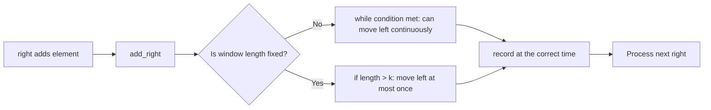
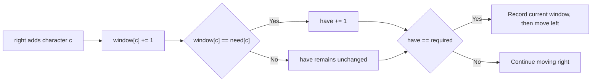
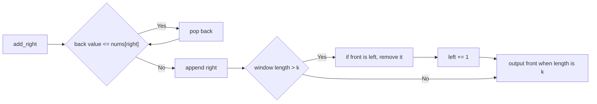

# Sliding Window · Master the Template in 5 Problems

Sliding window problems share a common loop skeleton. For each problem, you need to fill in three slots:

```text
state: what to maintain within the window
shrink: when to move the left pointer
record: when to update the answer
```

These five problems cover the longest valid window, shortest satisfying window, fixed-length window, and monotonic queue. Each problem follows the same order to fill the slots.

## Original Problems and Learning Order

The problem descriptions and constraints below are summarized from the original LeetCode problems.

| Order | Original Problem | Window Type | Core State |
|---:|---|---|---|
| 1 | [3. Longest Substring Without Repeating Characters](https://leetcode.com/problems/longest-substring-without-repeating-characters/description/) | Longest Valid Window | Frequency Table |
| 2 | [424. Longest Repeating Character Replacement](https://leetcode.com/problems/longest-repeating-character-replacement/description/) | Longest Valid Window | Frequency Table + `max_freq` |
| 3 | [567. Permutation in String](https://leetcode.com/problems/permutation-in-string/description/) | Fixed-Length Window | Two 26-bit Frequency Tables |
| 4 | [76. Minimum Window Substring](https://leetcode.com/problems/minimum-window-substring/description/) | Shortest Satisfying Window | `need/window` + `have` |
| 5 | [239. Sliding Window Maximum](https://leetcode.com/problems/sliding-window-maximum/description/) | Fixed-Length Window | Monotonic Decreasing Queue |

Let's see how these five problems fit into the same skeleton:

```sliding-window-patterns
```

## First, Fix the Window Invariant

The window uses a closed interval:

$$
[left,right], \qquad \text{length}=right-left+1.
$$

### Why the Window Length is `+ 1`

Both `left` and `right` point to elements within the window, so this is a **closed interval including both ends**. `right - left` calculates the number of steps between two indices, but the number of elements must include the starting point `left` itself, hence the `+ 1`.

```text
Index:     2   3   4
Window:    [A   B   C]
left = 2, right = 4
Index gap: 4 - 2 = 2
Element count: 4 - 2 + 1 = 3
```

The easiest way to verify is to look at a window with only one element: when `left == right`, the length should be 1; `right - left + 1` equals 1, whereas omitting the `+ 1` would incorrectly result in 0.

This also depends on the interval notation:

| Window Convention | Includes `right`? | Length |
|---|---:|---:|
| Closed interval `[left, right]` | Yes | `right - left + 1` |
| Half-open interval `[left, right)` | No | `right - left` |

In the code for this note, `right` is the index of the character currently visited by `enumerate(s)` and added to the window, so `answer = max(answer, right - left + 1)` records the number of characters in the current valid closed interval.

Each round performs only three things:

```text
Move right to the right and add a new element
Move left to the right and remove the old element
Record the answer at the correct time
```

The state must be synchronized with the interval. The removal order is:

```python
remove(items[left])
left += 1
```

If you move `left` before removing, you will remove the wrong element.

The interactive demo below uses "Longest Valid Window," showing the variable-length window branch that requires a `while` loop.

```sliding-window-demo
```

## Common Skeleton: Distinguish Fixed vs. Variable Length

What "sliding window" truly shares is not a specific `while` line, but these three actions:

```text
1. right adds a new element
2. Move left to restore the invariant required by the problem
3. Record the answer when the window is in the correct state
```

For step 2, you must first look at the window type to decide whether to write a `while` or an `if`.

### Variable-Length Window: Use `while`

The lengths of the longest valid window and shortest satisfying window vary. After adding an element, you might need to move `left` multiple times, so use `while`:

```python
left = 0
state = initialize_state()
answer = initialize_answer()

for right, item in enumerate(items):
    add_right(state, item)

    while should_shrink(state, left, right):
        record_before_shrink(answer, state, left, right)  # Optional
        remove_left(state, items[left])
        left += 1

    record_after_shrink(answer, state, left, right)       # Optional

return answer
```

### Fixed-Length Window: Use `if`

A fixed-length window adds only one element per round. If the previous window length was at most `k`, this round it becomes at most `k + 1`, so you only need to remove the left-end element at most once:

```python
left = 0
state = initialize_state()

for right, item in enumerate(items):
    add_right(state, item)

    if right - left + 1 > k:
        remove_left(state, items[left])
        left += 1

    if right - left + 1 == k:
        record_window(state, left, right)
```

Therefore, `Permutation in String` and `Sliding Window Maximum` do not need to force a `while` loop. Writing it as a `while` would yield the correct result, but `if` more directly expresses "the window slides one step to the right each round."

The recording timing for the two types of templates is:

| Problem Type | Way to Adjust `left` | Before moving `left` | After window adjustment |
|---|---|---|---|
| Longest Valid Window | `while` window is invalid | Do not record | Update max value |
| Shortest Satisfying Window | `while` window still satisfies | Update min value | Do not record |
| Fixed-Length Window | `if` window length > `k` | Do not record | Record when length == `k` |



## 1. Longest Substring Without Repeating Characters

### Problem Description

Given a string `s`, return the length of the longest continuous substring without repeating characters. `s` is at most $5\times10^4$ long; characters can be letters, numbers, symbols, or spaces.

`substring` must be continuous. The answer for `"pwwkew"` is 3, e.g., `"wke"`; `"pwke"` is not continuous and does not count.

### Filling the Template

| Slot | Content for this problem |
|---|---|
| `state` | `count[char]`, stores character frequency in the current window |
| `add_right` | `count[s[right]] += 1` |
| `should_shrink` | `count[s[right]] > 1` |
| `remove_left` | `count[s[left]] -= 1` |
| Record after adjustment | Update longest length |

```python
from collections import defaultdict


class Solution:
    def lengthOfLongestSubstring(self, s: str) -> int:
        count = defaultdict(int)
        left = 0
        answer = 0

        for right, char in enumerate(s):
            count[char] += 1

            while count[char] > 1:
                count[s[left]] -= 1
                left += 1

            answer = max(answer, right - left + 1)

        return answer
```

This problem executes `add_right` first, then enters `while should_shrink`, and finally records after the window is valid again. When recording the answer, all character frequencies within the window are at most 1.

```longest-substring-demo
```

### Why is it O(n)?

The outer loop makes `right` traverse $n$ times, and `left` also only moves to the right throughout the entire function, at most $n$ times. The total execution count of the nested `while` is not $n^2$, but at most $n$.

## 2. Longest Repeating Character Replacement

### Problem Description

Given a string `s` containing only uppercase English letters and an integer `k`. You can replace at most `k` characters; find the length of the longest substring that can become the same character. `s` is at most $10^5$ long.

Whether a window can become the same character depends only on the window length and the frequency of the most frequent character:

$$
\text{replacements}
=
\text{window length}-\text{max frequency}.
$$

Keep the most frequent character and replace all other characters.

```text
window = A A B A C
length = 5
max_freq(A) = 3
Need to replace B, C, total 5 - 3 = 2 times
```

### Filling the Template

| Slot | Content for this problem |
|---|---|
| `state` | `count[char]` and window `max_freq` |
| `add_right` | Update right-end character frequency and `max_freq` |
| `should_shrink` | `window_len - max_freq > k` |
| `remove_left` | Left-end character frequency minus 1 |
| Record after adjustment | Update longest length |

```python
from collections import defaultdict


class Solution:
    def characterReplacement(self, s: str, k: int) -> int:
        count = defaultdict(int)
        left = 0
        max_freq = 0
        answer = 0

        for right, char in enumerate(s):
            count[char] += 1
            max_freq = max(max_freq, count[char])

            while right - left + 1 - max_freq > k:
                count[s[left]] -= 1
                left += 1

            answer = max(answer, right - left + 1)

        return answer
```

### Why `max_freq` doesn't need to decrease

The `max_freq` here is the highest frequency any candidate window has reached so far. It only increases.

After shrinking, it might be larger than the true `max_freq` of the current window, but it won't inflate the answer to a length that was never feasible. The window length is always limited by the `max_freq + k` that has appeared historically. The old `max_freq` is just telling the algorithm: windows with lengths less than or equal to this have already been proven feasible, so there's no need to continue shrinking to maintain an exact state.

If you don't want to explain this optimization during an interview, you can calculate it every round:

```python
max_freq = max(count.values())
```

The alphabet is fixed at 26 characters, so the complexity remains $O(26n)=O(n)$. The code is more intuitive, but the constant is larger.

## 3. Permutation in String

### Problem Description

Given lowercase strings `s1` and `s2`, determine if `s2` contains a permutation of `s1`. Both strings are at most $10^4$ long.

A permutation has two necessary conditions:

```text
Same length
Same frequency for each character
```

Therefore, you only need to check all windows of length `len(s1)` in `s2`.

### Filling the Template

| Slot | Content for this problem |
|---|---|
| `state` | `need[26]` and `window[26]` |
| `add_right` | Window frequency of the right-end character + 1 |
| Fixed window adjustment | `if` window length > `len(s1)` |
| `remove_left` | Window frequency of the left-end character - 1 |
| Record when window is full | Compare frequency tables when length is `len(s1)` |

### Why use `if` instead of `while` here?

Let `k = len(s1)`. Before each round starts, the window length is definitely no more than `k`; after adding `s2[right]`, the length is at most `k + 1`. If it exceeds the length, removing one `s2[left]` will immediately return it to `k`, so it's impossible to need to remove multiple elements continuously.

```text
Previous round: length k
Add right: length k + 1
Remove left: length k
Compare window and need
```

So this problem shares the `add → adjust → record` skeleton with variable-length windows, but the adjustment step should be written as a single `if`. Forcing a `while` loop would yield the correct result but obscure the structure of a fixed-length window "sliding one step to the right each round."

```python
class Solution:
    def checkInclusion(self, s1: str, s2: str) -> bool:
        if len(s1) > len(s2):
            return False

        need = [0] * 26
        window = [0] * 26

        for char in s1:
            need[ord(char) - ord('a')] += 1

        k = len(s1)
        left = 0

        for right, char in enumerate(s2):
            window[ord(char) - ord('a')] += 1

            if right - left + 1 > k:
                old = s2[left]
                window[ord(old) - ord('a')] -= 1
                left += 1

            if right - left + 1 == k and window == need:
                return True

        return False
```

The last `if` contains two equality checks: `right - left + 1 == k` indicates the window is full, and `window == need` indicates the frequencies of all 26 characters are identical; `and` requires both to be true. The `==` here is the Python equality operator.

Taking `s1 = "ab"`, `s2 = "eidbaooo"` as an example:

| Window of length 2 | Is frequency equal to `a:1, b:1`? |
|---|---|
| `ei` | No |
| `id` | No |
| `db` | No |
| `ba` | Yes, return `True` immediately |

Comparing two 26-bit arrays takes $O(26)$, and 26 is a constant, so the total time is $O(n)$. Write this version correctly first, then consider using `matches` to compress the comparison to strictly $O(1)$.

## 4. Minimum Window Substring

### Problem Description

Given strings `s` and `t`, return the shortest substring in `s` that covers all characters in `t` including duplicates. If it doesn't exist, return an empty string. Both are at most $10^5$ long; the original problem guarantees a unique answer.

When `t = "AABC"`, the window must contain at least two `A`s. Just checking if a character appears is not enough; you must maintain frequencies.

### Using `have` to Compress Validity Checks

```text
need[c]   = how many c's t needs
window[c] = how many c's the current window has
required  = number of distinct characters in need
have      = number of character types that have met the requirement
```

The window is valid if and only if:

$$
have=required.
$$

`have` counts the number of character types that meet the requirement, not the total number of characters that meet the requirement.



### Filling the Template

| Slot | Content for this problem |
|---|---|
| `state` | `need`, `window`, `have`, `required` |
| `add_right` | Update right-end character frequency; `have += 1` when exactly met |
| `should_shrink` | `have == required` |
| Record before moving `left` | Update shortest window |
| `remove_left` | If left-end character exactly met, `have -= 1` first, then decrease frequency |

```python
from collections import Counter, defaultdict


class Solution:
    def minWindow(self, s: str, t: str) -> str:
        if len(t) > len(s):
            return ""

        need = Counter(t)
        window = defaultdict(int)
        required = len(need)
        have = 0

        left = 0
        best_start = 0
        best_len = float('inf')

        for right, char in enumerate(s):
            window[char] += 1
            if char in need and window[char] == need[char]:
                have += 1

            while have == required:
                length = right - left + 1
                if length < best_len:
                    best_start = left
                    best_len = length

                old = s[left]
                if old in need and window[old] == need[old]:
                    have -= 1
                window[old] -= 1
                left += 1

        if best_len == float('inf'):
            return ""
        return s[best_start:best_start + best_len]
```

When removing, you must check `window[old] == need[old]` before decreasing the frequency. This order accurately expresses "after removal, it will change from exactly satisfied to insufficient."

For `s = "ADOBECODEBANC"`, `t = "ABC"`:

```text
Expand right to ADOBEC: first time satisfied, start shrinking left
Invalid after removing A at the start, continue expanding right
Expand right to ...BANC: satisfied again
Continuously shrink left to get the shortest window BANC
```

## 5. Sliding Window Maximum

### Problem Description

Given an array `nums` and a fixed window length `k`, the window slides one step to the right each time; return the maximum value of each window. `nums` is at most $10^5$ long.

Recalling `max` for each window takes $O(nk)$. A heap can achieve $O(n\log k)$, and a monotonic queue can achieve $O(n)$.

### Who to store in the queue?

The queue stores indices and maintains:

```text
Indices are increasing from front to back
Corresponding nums values are decreasing from front to back
The front index corresponds to the current window maximum
```

When a new value arrives, you can remove all values from the back that are less than or equal to it:

```text
Old value is smaller
Old value leaves the window earlier
```

The old value can never beat the new value in the future, so it is no longer a candidate maximum.



### Filling the Template

| Slot | Content for this problem |
|---|---|
| `state` | Monotonic decreasing index deque |
| `add_right` | Remove weak back, then add `right` |
| Fixed window adjustment | `if` window length > `k` |
| `remove_left` | If front equals `left`, remove front |
| Record when window is full | Output value corresponding to front when length is `k` |

```python
from collections import deque
from typing import List


class Solution:
    def maxSlidingWindow(self, nums: List[int], k: int) -> List[int]:
        candidates = deque()
        answer = []
        left = 0

        for right, value in enumerate(nums):
            while candidates and nums[candidates[-1]] <= value:
                candidates.pop()

            candidates.append(right)

            if right - left + 1 > k:
                if candidates[0] == left:
                    candidates.popleft()
                left += 1

            if right - left + 1 == k:
                answer.append(nums[candidates[0]])

        return answer
```

### Why must we check `candidates[0] == left`?

`candidates` does not store all indices in the window, only those that still have a chance to be the maximum. The `while` loop above might have already eliminated some non-maximum values from the back:

```python
while candidates and nums[candidates[-1]] <= value:
    candidates.pop()
```

Therefore, there are two cases when `left` is about to leave the window:

1. `left` is still in the queue. Because indices in the queue are increasing and `left` is the smallest index in the window, it must be at the front. You must execute `popleft()`, otherwise, an expired element might continue to be treated as the maximum.
2. `left` has already been eliminated by the `while` loop above. At this point `candidates[0] > left`, so do nothing; if you unconditionally execute `popleft()`, you would mistakenly delete a valid candidate that is still in the window.

For example, `nums = [1, 3, -1, -3]`, `k = 3`. When adding `3`, the `1` at index `0` has already been popped. After adding `-3`:

```text
left = 0
candidates = [1, 2, 3]   # Corresponding values [3, -1, -3]
```

At this point, index `0` is about to expire, but it is no longer in the queue, so you cannot delete the front. If you unconditionally `popleft()`, you would mistakenly delete the `3` at index `1`, which is still in the new window `[1, 3]` and is indeed the maximum.

So this check expresses:

```text
If the left-end element about to leave the window is still in the candidate queue, delete it;
If it was already eliminated because it couldn't be the maximum, do nothing.
```

This is checked before executing `left += 1`, so the expired index is exactly equal to `left`; and because queue indices are increasing, you only need to check the front.

Taking `nums = [1, 3, -1, -3, 5]`, `k = 3` as an example:

| `right` | New value | Values in queue | Output |
|---:|---:|---|---:|
| 0 | 1 | `[1]` | Not full |
| 1 | 3 | `[3]`, 3 eliminates 1 | Not full |
| 2 | -1 | `[3, -1]` | 3 |
| 3 | -3 | `[3, -1, -3]` | 3 |
| 4 | 5 | `[5]`, 5 eliminates all old candidates at the back | 5 |

### Why is the nested `while` still $O(n)$?

Don't just look at the `while` of a single round; look at the lifecycle of an index throughout the entire algorithm. For any index `i`:

```text
Enqueue: candidates.append(i), exactly once
Dequeue: eliminated from the back by a larger new element, or removed from the front after expiring, at most once
```

Once an index leaves the queue via `pop()` or `popleft()`, it will never be enqueued again. Therefore, even if many indices are popped continuously in one round, the total number of pops across all rounds still does not exceed $n$:

$$
\underbrace{n}_{\text{outer loop}}
+\underbrace{n}_{\text{total enqueues}}
+\underbrace{n}_{\text{total dequeues}}
=O(n).
$$

For example, in a strictly increasing array `[1, 2, 3, 4]`, each new value pops the previous one, but each old value is popped only once. `[9, 7, 5, 3, 10]` pops four values at once when processing `10`, but these four values will never be processed again. This analysis of amortizing expensive operations across elements is called **amortized analysis**.

So the time complexity is $O(n)$; the monotonic queue stores at most the candidate indices in the current window, and the auxiliary space complexity is $O(k)$. If the returned array is also counted as space, the total space is $O(n)$.

## Five Problems into Two Templates

| Problem | Window Type | `state` | Adjustment | Record Timing |
|---|---|---|---|---|
| Longest Substring | Variable | Char frequency | `while` new char freq `> 1` | Update `max` after valid |
| Character Replacement | Variable | Freq + `max_freq` | `while len - max_freq > k` | Update `max` after valid |
| Permutation in String | Fixed | Two freq tables | `if` length `> len(s1)` | Compare when length is `len(s1)` |
| Minimum Window | Variable | Freq + `have` | `while have == required` | Update `min` before shrinking |
| Sliding Window Maximum | Fixed | Decreasing index deque | `if` length `> k` | Output front when length is `k` |

During an interview, write the common skeleton first, then choose the adjustment branch:

```python
for right, item in enumerate(items):
    add_right(state, item)

    adjust_left()      # Use while for variable-length; if for fixed-length
    record_if_ready() # Record when valid, satisfied, or window is full k
```

Don't memorize `while` first. Ask if the window is fixed, then decide whether `adjust_left` is continuous adjustment or at most one adjustment.

## Common Mistakes

| Mistake | Correction |
|---|---|
| Writing variable-length window as `if` | A new element might require continuously removing multiple left-end elements; variable-length windows usually use `while` |
| Mechanically applying `while` to fixed-length window | Each round exceeds length by at most 1, using `if` to remove one element is clearer |
| Writing window length as `right - left` | Closed interval length is `right - left + 1` |
| Recording longest window before shrinking | Restore validity first, then update `max` |
| Recording shortest window after shrinking | Record the current valid window first, then remove the left end |
| Minimum Window only checking if character appears | Duplicate characters require comparing frequencies |
| Storing values in monotonic queue | Storing indices is necessary to determine when elements expire |
| Rebuilding state every round | Only perform incremental updates for boundary elements entering/leaving the window |

## How to Apply the Template to New Problems

First, confirm that the problem requires a continuous substring or subarray. Then answer in order:

```text
1. Is the window length fixed?
2. When right adds an element, which states can be updated incrementally?
3. What expression indicates the window is invalid or has met the requirement?
4. When left removes an element, how is the state restored?
5. Should the answer be recorded before moving `left`, after window adjustment, or when the window is full `k`?
```

If question 3 has no monotonic direction, a standard sliding window might not apply. For example, when an array contains negative numbers, expanding the window doesn't necessarily increase the interval sum, and shrinking doesn't necessarily decrease it.

Fill out this small table before writing code:

| Slot | Content to be clear about |
|---|---|
| window | Accurate meaning of `[left, right]` |
| state | Frequency, sum, satisfied count, or monotonic queue |
| add | How to update state after `right` enters the window |
| adjust | `while` for variable-length, or `if length > k` for fixed-length |
| remove | How to update state before `left` leaves the window |
| record | Update `max`, update `min`, or output current window result |

## Template Cheat Sheet

```text
Common skeleton: add → adjust → record

Variable-length window: while condition met, may move left continuously
Fixed-length window: if length > k, move left at most once

Longest valid: record max after adjustment
Shortest satisfying: record min before moving left
Fixed-length: record when window length == k
```

Determine if it's fixed or variable length first, then fill in the state, adjustment condition, and recording timing.
