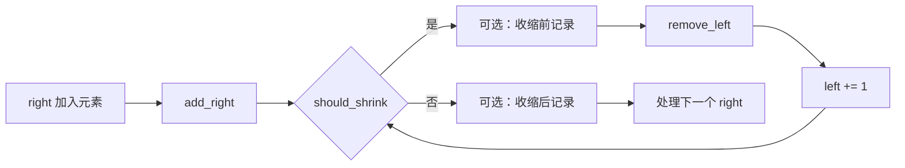
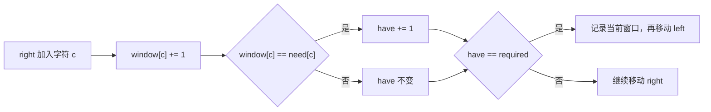
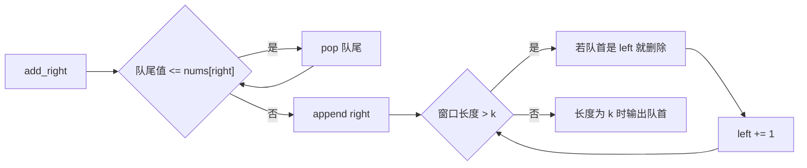

# Sliding Window · 5 题掌握模板

滑动窗口共用一个循环骨架。每道题需要填三个槽位：

```text
state：窗口里维护什么
shrink：什么时候移动 left
record：什么时候更新答案
```

这五题覆盖最长合法窗口、最短满足窗口、固定长度窗口和单调队列。每题都按同样的顺序填槽位。

## 原题与学习顺序

以下题意和约束均按 LeetCode 原题压缩复述。

| 顺序 | 原题 | 窗口类型 | 核心状态 |
|---:|---|---|---|
| 1 | [3. Longest Substring Without Repeating Characters](https://leetcode.com/problems/longest-substring-without-repeating-characters/description/) | 最长合法窗口 | 频次表 |
| 2 | [424. Longest Repeating Character Replacement](https://leetcode.com/problems/longest-repeating-character-replacement/description/) | 最长合法窗口 | 频次表 + `max_freq` |
| 3 | [567. Permutation in String](https://leetcode.com/problems/permutation-in-string/description/) | 固定长度窗口 | 两张 26 位频次表 |
| 4 | [76. Minimum Window Substring](https://leetcode.com/problems/minimum-window-substring/description/) | 最短满足窗口 | `need/window` + `have` |
| 5 | [239. Sliding Window Maximum](https://leetcode.com/problems/sliding-window-maximum/description/) | 固定长度窗口 | 单调递减队列 |

先看五题怎样填入同一骨架：

```sliding-window-patterns
```

## 先固定窗口不变量

窗口使用闭区间：

$$
[left,right], \qquad \text{length}=right-left+1.
$$

每轮只做三件事：

```text
right 右移并加入新元素
left 右移并删除旧元素
在正确时机记录答案
```

状态必须与区间同步。删除顺序是：

```python
remove(items[left])
left += 1
```

先移动 `left` 再删除，会删错元素。

```sliding-window-demo
```

## 一个万能模板

五题共用这一个循环。各题只替换 `state`、`should_shrink` 和记录位置。

```python
left = 0
state = initialize_state()
answer = initialize_answer()

for right, item in enumerate(items):
    add_right(state, item)

    while should_shrink(state, left, right):
        record_before_shrink(answer, state, left, right)  # 可选
        remove_left(state, items[left])
        left += 1

    record_after_shrink(answer, state, left, right)       # 可选

return answer
```

两个 `record` 槽位按题意二选一，也可以都不执行：

| 题型 | `should_shrink` | 收缩前记录 | 收缩后记录 |
|---|---|---|---|
| 最长合法窗口 | 窗口不合法 | 不记录 | 更新最长值 |
| 最短满足窗口 | 窗口仍满足要求 | 更新最短值 | 不记录 |
| 固定长度窗口 | 窗口长度大于 `k` | 不记录 | 长度等于 `k` 时记录 |

固定窗口每轮只加入一个元素，所以这里的 `while` 最多执行一次。实际代码常写成 `if`，仍是同一循环的特例。



## 1. Longest Substring Without Repeating Characters

### 题意

给定字符串 `s`，返回无重复字符的最长连续子串长度。`s` 最长为 $5\times10^4$，字符可能是字母、数字、符号或空格。

`substring` 必须连续。`"pwwkew"` 的答案长度是 3，例如 `"wke"`；`"pwke"` 不连续，不能算。

### 填模板

| 槽位 | 本题内容 |
|---|---|
| `state` | `count[char]`，保存当前窗口的字符频次 |
| `add_right` | `count[s[right]] += 1` |
| `should_shrink` | `count[s[right]] > 1` |
| `remove_left` | `count[s[left]] -= 1` |
| 收缩后记录 | 更新最长长度 |

```python
from collections import defaultdict


class Solution:
    def lengthOfLongestSubstring(self, s: str) -> int:
        count = defaultdict(int)
        left = 0
        answer = 0

        for right, char in enumerate(s):
            count[char] += 1

            while count[char] > 1:
                count[s[left]] -= 1
                left += 1

            answer = max(answer, right - left + 1)

        return answer
```

本题先执行 `add_right`，再进入 `while should_shrink`，最后在收缩后记录。记录答案时，窗口内所有字符频次都不超过 1。

```longest-substring-demo
```

### 为什么是 O(n)

外层循环让 `right` 走 $n$ 次，`left` 在整个函数中也只向右走，最多走 $n$ 次。嵌套 `while` 的总执行次数不是 $n^2$，而是至多 $n$。

## 2. Longest Repeating Character Replacement

### 题意

给定只含大写英文字母的字符串 `s` 和整数 `k`。最多替换 `k` 个字符，求能变成同一字符的最长子串长度。`s` 最长为 $10^5$。

一个窗口能否变成同一字符，只取决于窗口长度和最高频字符：

$$
\text{replacements}
=
\text{window length}-\text{max frequency}.
$$

保留最高频字符，把其余字符全部替换即可。

```text
window = A A B A C
length = 5
max_freq(A) = 3
需要替换 B、C，共 5 - 3 = 2 次
```

### 填模板

| 槽位 | 本题内容 |
|---|---|
| `state` | `count[char]` 和窗口最高频次 `max_freq` |
| `add_right` | 更新右端字符频次和 `max_freq` |
| `should_shrink` | `window_len - max_freq > k` |
| `remove_left` | 左端字符频次减 1 |
| 收缩后记录 | 更新最长长度 |

```python
from collections import defaultdict


class Solution:
    def characterReplacement(self, s: str, k: int) -> int:
        count = defaultdict(int)
        left = 0
        max_freq = 0
        answer = 0

        for right, char in enumerate(s):
            count[char] += 1
            max_freq = max(max_freq, count[char])

            while right - left + 1 - max_freq > k:
                count[s[left]] -= 1
                left += 1

            answer = max(answer, right - left + 1)

        return answer
```

### 为什么 `max_freq` 不用减

这里的 `max_freq` 是扫描到当前位置为止，某个候选窗口曾达到的最高频次。它只增不减。

收缩后它可能比当前窗口的真实最高频次大，但不会把答案抬高到一个从未可行的长度。窗口长度始终受历史上已经出现过的 `max_freq + k` 限制。旧最高频次只是在告诉算法：小于等于这个长度的窗口已经有过可行证据，不必为了维持精确状态而继续收缩。

如果面试时不想解释这个优化，可以每轮计算：

```python
max_freq = max(count.values())
```

字母表固定为 26 个字符，所以复杂度仍是 $O(26n)=O(n)$。代码更直观，但常数更大。

## 3. Permutation in String

### 题意

给定小写字符串 `s1` 和 `s2`，判断 `s2` 是否包含 `s1` 的某个排列。两个字符串最长为 $10^4$。

排列有两个必要条件：

```text
长度相同
每个字符的频次相同
```

因此只需要检查 `s2` 中所有长度为 `len(s1)` 的窗口。

### 填模板

| 槽位 | 本题内容 |
|---|---|
| `state` | `need[26]` 和 `window[26]` |
| `add_right` | 右端字符的窗口频次加 1 |
| `should_shrink` | 窗口长度大于 `len(s1)` |
| `remove_left` | 左端字符的窗口频次减 1 |
| 收缩后记录 | 长度为 `len(s1)` 时比较频次表 |

```python
class Solution:
    def checkInclusion(self, s1: str, s2: str) -> bool:
        if len(s1) > len(s2):
            return False

        need = [0] * 26
        window = [0] * 26

        for char in s1:
            need[ord(char) - ord('a')] += 1

        k = len(s1)
        left = 0

        for right, char in enumerate(s2):
            window[ord(char) - ord('a')] += 1

            if right - left + 1 > k:
                old = s2[left]
                window[ord(old) - ord('a')] -= 1
                left += 1

            if right - left + 1 == k and window == need:
                return True

        return False
```

以 `s1 = "ab"`、`s2 = "eidbaooo"` 为例：

| 长度为 2 的窗口 | 频次是否等于 `a:1, b:1` |
|---|---|
| `ei` | 否 |
| `id` | 否 |
| `db` | 否 |
| `ba` | 是，立即返回 `True` |

比较两个 26 位数组需要 $O(26)$，26 是常数，所以总时间是 $O(n)$。先写对这个版本，再考虑用 `matches` 把比较压成严格的 $O(1)$。

## 4. Minimum Window Substring

### 题意

给定字符串 `s` 和 `t`，返回 `s` 中覆盖 `t` 全部字符及其重复次数的最短子串。若不存在则返回空串。两者最长为 $10^5$，原题保证答案唯一。

`t = "AABC"` 时，窗口必须至少含两个 `A`。只看字符是否出现不够，必须维护频次。

### 用 `have` 压缩合法性检查

```text
need[c]   = t 需要多少个 c
window[c] = 当前窗口有多少个 c
required  = need 中不同字符的数量
have      = 已达到所需频次的字符种类数
```

窗口合法当且仅当：

$$
have=required.
$$

`have` 数的是满足要求的字符种类，不是满足要求的字符总数。



### 填模板

| 槽位 | 本题内容 |
|---|---|
| `state` | `need`、`window`、`have`、`required` |
| `add_right` | 更新右端字符频次；刚好达标时 `have += 1` |
| `should_shrink` | `have == required` |
| 收缩前记录 | 更新最短窗口 |
| `remove_left` | 若左端字符刚好达标，先让 `have -= 1`，再减频次 |

```python
from collections import Counter, defaultdict


class Solution:
    def minWindow(self, s: str, t: str) -> str:
        if len(t) > len(s):
            return ""

        need = Counter(t)
        window = defaultdict(int)
        required = len(need)
        have = 0

        left = 0
        best_start = 0
        best_len = float('inf')

        for right, char in enumerate(s):
            window[char] += 1
            if char in need and window[char] == need[char]:
                have += 1

            while have == required:
                length = right - left + 1
                if length < best_len:
                    best_start = left
                    best_len = length

                old = s[left]
                if old in need and window[old] == need[old]:
                    have -= 1
                window[old] -= 1
                left += 1

        if best_len == float('inf'):
            return ""
        return s[best_start:best_start + best_len]
```

删除时必须先判断 `window[old] == need[old]`，再把频次减 1。这个顺序准确表达了“删除后将从刚好满足变成不足”。

对 `s = "ADOBECODEBANC"`、`t = "ABC"`：

```text
右扩到 ADOBEC：第一次满足，开始左缩
删掉开头 A 后失效，继续右扩
右扩到 ...BANC：再次满足
连续左缩得到最短窗口 BANC
```

## 5. Sliding Window Maximum

### 题意

给定数组 `nums` 和固定窗口长度 `k`，窗口每次右移一格，返回每个窗口的最大值。`nums` 最长为 $10^5$。

每个窗口重新调用 `max` 需要 $O(nk)$。堆可以做到 $O(n\log k)$，单调队列可以做到 $O(n)$。

### 队列里保存谁

队列存下标，并保持：

```text
下标从队首到队尾递增
对应的 nums 值从队首到队尾递减
队首下标对应当前窗口最大值
```

新值到来时，可以删除队尾所有小于等于它的值：

```text
旧值更小
旧值更早离开窗口
```

旧值以后不可能赢过新值，因此不再是候选最大值。



### 填模板

| 槽位 | 本题内容 |
|---|---|
| `state` | 值单调递减的下标 deque |
| `add_right` | 删除弱势队尾，再加入 `right` |
| `should_shrink` | 窗口长度大于 `k` |
| `remove_left` | 若队首等于 `left` 就删除队首 |
| 收缩后记录 | 窗口长度为 `k` 时输出队首对应值 |

```python
from collections import deque
from typing import List


class Solution:
    def maxSlidingWindow(self, nums: List[int], k: int) -> List[int]:
        candidates = deque()
        answer = []
        left = 0

        for right, value in enumerate(nums):
            while candidates and nums[candidates[-1]] <= value:
                candidates.pop()

            candidates.append(right)

            while right - left + 1 > k:
                if candidates[0] == left:
                    candidates.popleft()
                left += 1

            if right - left + 1 == k:
                answer.append(nums[candidates[0]])

        return answer
```

以 `nums = [1, 3, -1, -3, 5]`、`k = 3` 为例：

| `right` | 新值 | 队列中的值 | 输出 |
|---:|---:|---|---:|
| 0 | 1 | `[1]` | 未满 |
| 1 | 3 | `[3]`，3 淘汰 1 | 未满 |
| 2 | -1 | `[3, -1]` | 3 |
| 3 | -3 | `[3, -1, -3]` | 3 |
| 4 | 5 | `[5]`，5 淘汰队尾全部旧候选 | 5 |

每个下标只入队一次、出队一次，总队列操作次数是 $O(n)$。

## 五题填入同一个模板

| 题目 | `state` | `should_shrink` | 收缩前记录 | 收缩后记录 |
|---|---|---|---|---|
| Longest Substring | 字符频次 | 新字符频次 `> 1` | 无 | 更新 `max` |
| Character Replacement | 频次 + `max_freq` | `len - max_freq > k` | 无 | 更新 `max` |
| Permutation in String | 两张频次表 | 窗口长度 `> len(s1)` | 无 | 长度正确时比较 |
| Minimum Window | 频次 + `have` | `have == required` | 更新 `min` | 无 |
| Sliding Window Maximum | 递减下标 deque | 窗口长度 `> k` | 无 | 长度为 `k` 时输出队首 |

面试时先写同一个骨架，再填空：

```python
for right, item in enumerate(items):
    add_right(state, item)

    while should_shrink(state, left, right):
        record_before_shrink()   # 可选
        remove_left(state, items[left])
        left += 1

    record_after_shrink()        # 可选
```

`record_before_shrink` 和 `record_after_shrink` 是同一循环里的两个插槽。每道题只填需要的部分。

## 常见错误

| 错误 | 修正 |
|---|---|
| 把 `while` 写成 `if` | 一个新元素可能要求连续移出多个左端元素 |
| 窗口长度写成 `right - left` | 闭区间长度是 `right - left + 1` |
| 最长窗口在收缩前记录 | 先恢复合法，再更新 `max` |
| 最短窗口在收缩后记录 | 当前合法窗口要先记录，再删除左端 |
| Minimum Window 只看字符是否出现 | 重复字符要求比较频次 |
| 单调队列存值 | 存下标才能判断元素何时过期 |
| 每轮重建状态 | 只对进入和离开窗口的边界元素做增量更新 |

## 拿到新题怎么套模板

先确认题目要求的是连续子串或连续子数组。然后按顺序回答：

```text
1. 窗口长度固定吗？
2. right 加入一个元素时，哪些状态可以增量更新？
3. 什么表达式表示窗口非法或已经满足要求？
4. left 删除一个元素时，状态如何恢复？
5. 答案应在收缩前、收缩后，还是窗口满 k 时记录？
```

如果第 3 问没有单调方向，普通滑窗可能不适用。例如数组含负数时，扩大窗口不一定让区间和变大，收缩也不一定让区间和变小。

写代码前先填这张小表：

| 槽位 | 要写清楚的内容 |
|---|---|
| window | `[left, right]` 的准确含义 |
| state | 频次、和、满足种类数，或单调队列 |
| add | `right` 进入窗口后怎样更新状态 |
| shrink | `while invalid`、`while valid`，还是长度超出 `k` |
| remove | `left` 离开窗口前怎样更新状态 |
| record | 更新 `max`、更新 `min`，或输出当前窗口结果 |

## 模板速记

```text
right 进入：add_right

while should_shrink:
    收缩前需要答案，就先 record
    remove_left
    left += 1

收缩后需要答案，就 record
```

只记这一份。题目变化时，替换状态、收缩条件和记录槽位。
