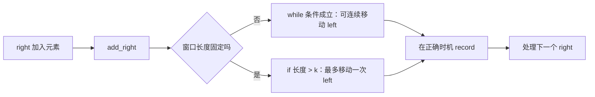
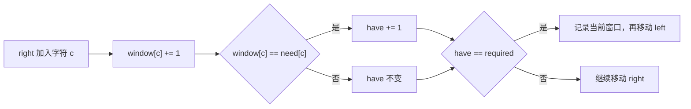
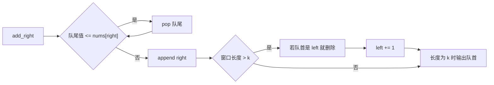

# Sliding Window · 5 题掌握模板

滑动窗口共用一个循环骨架。每道题需要填三个槽位：

```text
state：窗口里维护什么
shrink：什么时候移动 left
record：什么时候更新答案
```

这五题覆盖最长合法窗口、最短满足窗口、固定长度窗口和单调队列。每题都按同样的顺序填槽位。

## 原题与学习顺序

以下题意和约束均按 LeetCode 原题压缩复述。

| 顺序 | 原题 | 窗口类型 | 核心状态 |
|---:|---|---|---|
| 1 | [3. Longest Substring Without Repeating Characters](https://leetcode.com/problems/longest-substring-without-repeating-characters/description/) | 最长合法窗口 | 频次表 |
| 2 | [424. Longest Repeating Character Replacement](https://leetcode.com/problems/longest-repeating-character-replacement/description/) | 最长合法窗口 | 频次表 + `max_freq` |
| 3 | [567. Permutation in String](https://leetcode.com/problems/permutation-in-string/description/) | 固定长度窗口 | 两张 26 位频次表 |
| 4 | [76. Minimum Window Substring](https://leetcode.com/problems/minimum-window-substring/description/) | 最短满足窗口 | `need/window` + `have` |
| 5 | [239. Sliding Window Maximum](https://leetcode.com/problems/sliding-window-maximum/description/) | 固定长度窗口 | 单调递减队列 |

先看五题怎样填入同一骨架：

```sliding-window-patterns
```

## 先固定窗口不变量

窗口使用闭区间：

$$
[left,right], \qquad \text{length}=right-left+1.
$$

### 为什么窗口长度要 `+ 1`

`left` 和 `right` 都指向窗口内的元素，所以这里是**两端都包含**的闭区间。`right - left` 计算的是两个下标之间隔了多少步，而元素个数还要把起点 `left` 自己算进去，因此要再加 1。

```text
下标：     2   3   4
窗口：    [A   B   C]
left = 2, right = 4
下标间隔：4 - 2 = 2
元素个数：4 - 2 + 1 = 3
```

最容易检查的方法是看只有一个元素的窗口：当 `left == right` 时，长度应该是 1；`right - left + 1` 正好等于 1，而不加 1 会错误地得到 0。

这也取决于区间写法：

| 窗口约定 | 是否包含 `right` | 长度 |
|---|---:|---:|
| 闭区间 `[left, right]` | 是 | `right - left + 1` |
| 左闭右开 `[left, right)` | 否 | `right - left` |

本笔记的代码中，`right` 是 `enumerate(s)` 当前访问并已加入窗口的字符下标，因此 `answer = max(answer, right - left + 1)` 记录的就是当前合法闭区间中的字符数。

每轮只做三件事：

```text
right 右移并加入新元素
left 右移并删除旧元素
在正确时机记录答案
```

状态必须与区间同步。删除顺序是：

```python
remove(items[left])
left += 1
```

先移动 `left` 再删除，会删错元素。

下面的交互演示使用“最长合法窗口”，展示的是需要 `while` 的变长窗口分支。

```sliding-window-demo
```

## 共同骨架：先分定长和变长

“滑动窗口”真正共用的不是某一行 `while`，而是这三个动作：

```text
1. right 加入一个新元素
2. 移动 left，让窗口恢复题目要求的不变量
3. 窗口处在正确状态时记录答案
```

第 2 步要先看窗口类型，再决定写 `while` 还是 `if`。

### 变长窗口：用 `while`

最长合法窗口和最短满足窗口的长度会变化。加入一个元素后，可能要连续移动多次 `left`，因此使用 `while`：

```python
left = 0
state = initialize_state()
answer = initialize_answer()

for right, item in enumerate(items):
    add_right(state, item)

    while should_shrink(state, left, right):
        record_before_shrink(answer, state, left, right)  # 可选
        remove_left(state, items[left])
        left += 1

    record_after_shrink(answer, state, left, right)       # 可选

return answer
```

### 固定长度窗口：用 `if`

固定窗口每轮只加入一个元素。上一轮窗口长度不超过 `k`，这一轮最多变成 `k + 1`，所以最多只需移出一个左端元素：

```python
left = 0
state = initialize_state()

for right, item in enumerate(items):
    add_right(state, item)

    if right - left + 1 > k:
        remove_left(state, items[left])
        left += 1

    if right - left + 1 == k:
        record_window(state, left, right)
```

因此 `Permutation in String` 和 `Sliding Window Maximum` 不需要硬套 `while`。写成 `while` 结果也对，但 `if` 更直接地表达“窗口每次向右滑一格”。

两类模板的记录时机是：

| 题型 | 调整 `left` 的方式 | 移动 `left` 前 | 窗口调整后 |
|---|---|---|---|
| 最长合法窗口 | `while` 窗口不合法 | 不记录 | 更新最长值 |
| 最短满足窗口 | `while` 窗口仍满足要求 | 更新最短值 | 不记录 |
| 固定长度窗口 | `if` 窗口长度大于 `k` | 不记录 | 长度等于 `k` 时记录 |



## 1. Longest Substring Without Repeating Characters

### 题意

给定字符串 `s`，返回无重复字符的最长连续子串长度。`s` 最长为 $5\times10^4$，字符可能是字母、数字、符号或空格。

`substring` 必须连续。`"pwwkew"` 的答案长度是 3，例如 `"wke"`；`"pwke"` 不连续，不能算。

### 填模板

| 槽位 | 本题内容 |
|---|---|
| `state` | `count[char]`，保存当前窗口的字符频次 |
| `add_right` | `count[s[right]] += 1` |
| `should_shrink` | `count[s[right]] > 1` |
| `remove_left` | `count[s[left]] -= 1` |
| 窗口调整后记录 | 更新最长长度 |

```python
from collections import defaultdict


class Solution:
    def lengthOfLongestSubstring(self, s: str) -> int:
        count = defaultdict(int)
        left = 0
        answer = 0

        for right, char in enumerate(s):
            count[char] += 1

            while count[char] > 1:
                count[s[left]] -= 1
                left += 1

            answer = max(answer, right - left + 1)

        return answer
```

本题先执行 `add_right`，再进入 `while should_shrink`，最后在窗口重新合法后记录。记录答案时，窗口内所有字符频次都不超过 1。

```longest-substring-demo
```

### 为什么是 O(n)

外层循环让 `right` 走 $n$ 次，`left` 在整个函数中也只向右走，最多走 $n$ 次。嵌套 `while` 的总执行次数不是 $n^2$，而是至多 $n$。

## 2. Longest Repeating Character Replacement

### 题意

给定只含大写英文字母的字符串 `s` 和整数 `k`。最多替换 `k` 个字符，求能变成同一字符的最长子串长度。`s` 最长为 $10^5$。

一个窗口能否变成同一字符，只取决于窗口长度和最高频字符：

$$
\text{replacements}
=
\text{window length}-\text{max frequency}.
$$

保留最高频字符，把其余字符全部替换即可。

```text
window = A A B A C
length = 5
max_freq(A) = 3
需要替换 B、C，共 5 - 3 = 2 次
```

### 填模板

| 槽位 | 本题内容 |
|---|---|
| `state` | `count[char]` 和窗口最高频次 `max_freq` |
| `add_right` | 更新右端字符频次和 `max_freq` |
| `should_shrink` | `window_len - max_freq > k` |
| `remove_left` | 左端字符频次减 1 |
| 窗口调整后记录 | 更新最长长度 |

```python
from collections import defaultdict


class Solution:
    def characterReplacement(self, s: str, k: int) -> int:
        count = defaultdict(int)
        left = 0
        max_freq = 0
        answer = 0

        for right, char in enumerate(s):
            count[char] += 1
            max_freq = max(max_freq, count[char])

            while right - left + 1 - max_freq > k:
                count[s[left]] -= 1
                left += 1

            answer = max(answer, right - left + 1)

        return answer
```

### 为什么 `max_freq` 不用减

这里的 `max_freq` 是扫描到当前位置为止，某个候选窗口曾达到的最高频次。它只增不减。

收缩后它可能比当前窗口的真实最高频次大，但不会把答案抬高到一个从未可行的长度。窗口长度始终受历史上已经出现过的 `max_freq + k` 限制。旧最高频次只是在告诉算法：小于等于这个长度的窗口已经有过可行证据，不必为了维持精确状态而继续收缩。

如果面试时不想解释这个优化，可以每轮计算：

```python
max_freq = max(count.values())
```

字母表固定为 26 个字符，所以复杂度仍是 $O(26n)=O(n)$。代码更直观，但常数更大。

## 3. Permutation in String

### 题意

给定小写字符串 `s1` 和 `s2`，判断 `s2` 是否包含 `s1` 的某个排列。两个字符串最长为 $10^4$。

排列有两个必要条件：

```text
长度相同
每个字符的频次相同
```

因此只需要检查 `s2` 中所有长度为 `len(s1)` 的窗口。

### 填模板

| 槽位 | 本题内容 |
|---|---|
| `state` | `need[26]` 和 `window[26]` |
| `add_right` | 右端字符的窗口频次加 1 |
| 固定窗口调整 | `if` 窗口长度大于 `len(s1)` |
| `remove_left` | 左端字符的窗口频次减 1 |
| 窗口满时记录 | 长度为 `len(s1)` 时比较频次表 |

### 为什么本题用 `if`，不是 `while`

设 `k = len(s1)`。每轮开始前，窗口长度一定不超过 `k`；加入 `s2[right]` 后，长度最多是 `k + 1`。如果超长，移出一个 `s2[left]` 就会立刻回到 `k`，不可能需要连续移出多个元素。

```text
上一轮：长度 k
加入 right：长度 k + 1
移出 left：长度 k
比较 window 和 need
```

所以这题和变长窗口共享 `add → adjust → record` 的骨架，但调整步骤应写成一次 `if`。强行写 `while` 虽然结果正确，却掩盖了固定窗口“每轮右移一格”的结构。

```python
class Solution:
    def checkInclusion(self, s1: str, s2: str) -> bool:
        if len(s1) > len(s2):
            return False

        need = [0] * 26
        window = [0] * 26

        for char in s1:
            need[ord(char) - ord('a')] += 1

        k = len(s1)
        left = 0

        for right, char in enumerate(s2):
            window[ord(char) - ord('a')] += 1

            if right - left + 1 > k:
                old = s2[left]
                window[ord(old) - ord('a')] -= 1
                left += 1

            if right - left + 1 == k and window == need:
                return True

        return False
```

最后一个 `if` 中有两次相等判断：`right - left + 1 == k` 表示窗口已经装满，`window == need` 表示 26 个字符的频次全部相同；`and` 要求两者同时成立。这里的 `==` 是 Python 相等运算符。

以 `s1 = "ab"`、`s2 = "eidbaooo"` 为例：

| 长度为 2 的窗口 | 频次是否等于 `a:1, b:1` |
|---|---|
| `ei` | 否 |
| `id` | 否 |
| `db` | 否 |
| `ba` | 是，立即返回 `True` |

比较两个 26 位数组需要 $O(26)$，26 是常数，所以总时间是 $O(n)$。先写对这个版本，再考虑用 `matches` 把比较压成严格的 $O(1)$。

## 4. Minimum Window Substring

### 题意

给定字符串 `s` 和 `t`，返回 `s` 中覆盖 `t` 全部字符及其重复次数的最短子串。若不存在则返回空串。两者最长为 $10^5$，原题保证答案唯一。

`t = "AABC"` 时，窗口必须至少含两个 `A`。只看字符是否出现不够，必须维护频次。

### 用 `have` 压缩合法性检查

```text
need[c]   = t 需要多少个 c
window[c] = 当前窗口有多少个 c
required  = need 中不同字符的数量
have      = 已达到所需频次的字符种类数
```

窗口合法当且仅当：

$$
have=required.
$$

`have` 数的是满足要求的字符种类，不是满足要求的字符总数。



### 填模板

| 槽位 | 本题内容 |
|---|---|
| `state` | `need`、`window`、`have`、`required` |
| `add_right` | 更新右端字符频次；刚好达标时 `have += 1` |
| `should_shrink` | `have == required` |
| 移动 `left` 前记录 | 更新最短窗口 |
| `remove_left` | 若左端字符刚好达标，先让 `have -= 1`，再减频次 |

```python
from collections import Counter, defaultdict


class Solution:
    def minWindow(self, s: str, t: str) -> str:
        if len(t) > len(s):
            return ""

        need = Counter(t)
        window = defaultdict(int)
        required = len(need)
        have = 0

        left = 0
        best_start = 0
        best_len = float('inf')

        for right, char in enumerate(s):
            window[char] += 1
            if char in need and window[char] == need[char]:
                have += 1

            while have == required:
                length = right - left + 1
                if length < best_len:
                    best_start = left
                    best_len = length

                old = s[left]
                if old in need and window[old] == need[old]:
                    have -= 1
                window[old] -= 1
                left += 1

        if best_len == float('inf'):
            return ""
        return s[best_start:best_start + best_len]
```

删除时必须先判断 `window[old] == need[old]`，再把频次减 1。这个顺序准确表达了“删除后将从刚好满足变成不足”。

对 `s = "ADOBECODEBANC"`、`t = "ABC"`：

```text
右扩到 ADOBEC：第一次满足，开始左缩
删掉开头 A 后失效，继续右扩
右扩到 ...BANC：再次满足
连续左缩得到最短窗口 BANC
```

## 5. Sliding Window Maximum

### 题意

给定数组 `nums` 和固定窗口长度 `k`，窗口每次右移一格，返回每个窗口的最大值。`nums` 最长为 $10^5$。

每个窗口重新调用 `max` 需要 $O(nk)$。堆可以做到 $O(n\log k)$，单调队列可以做到 $O(n)$。

### 队列里保存谁

队列存下标，并保持：

```text
下标从队首到队尾递增
对应的 nums 值从队首到队尾递减
队首下标对应当前窗口最大值
```

新值到来时，可以删除队尾所有小于等于它的值：

```text
旧值更小
旧值更早离开窗口
```

旧值以后不可能赢过新值，因此不再是候选最大值。



### 填模板

| 槽位 | 本题内容 |
|---|---|
| `state` | 值单调递减的下标 deque |
| `add_right` | 删除弱势队尾，再加入 `right` |
| 固定窗口调整 | `if` 窗口长度大于 `k` |
| `remove_left` | 若队首等于 `left` 就删除队首 |
| 窗口满时记录 | 窗口长度为 `k` 时输出队首对应值 |

```python
from collections import deque
from typing import List


class Solution:
    def maxSlidingWindow(self, nums: List[int], k: int) -> List[int]:
        candidates = deque()
        answer = []
        left = 0

        for right, value in enumerate(nums):
            while candidates and nums[candidates[-1]] <= value:
                candidates.pop()

            candidates.append(right)

            if right - left + 1 > k:
                if candidates[0] == left:
                    candidates.popleft()
                left += 1

            if right - left + 1 == k:
                answer.append(nums[candidates[0]])

        return answer
```

### 为什么必须判断 `candidates[0] == left`

`candidates` 不保存窗口里的所有下标，只保存仍有机会成为最大值的候选下标。前面的 `while` 可能已经从队尾提前淘汰了一些非最大值：

```python
while candidates and nums[candidates[-1]] <= value:
    candidates.pop()
```

因此，当 `left` 即将离开窗口时有两种情况：

1. `left` 仍在队列中。因为队列中的下标递增，而 `left` 是窗口中最小的下标，所以它一定在队首，必须执行 `popleft()`，否则过期元素可能继续被当作最大值。
2. `left` 已被前面的 `while` 淘汰。此时 `candidates[0] > left`，应该什么也不做；如果无条件执行 `popleft()`，反而会误删一个仍在窗口中的有效候选。

例如 `nums = [1, 3, -1, -3]`、`k = 3`。加入 `3` 时，下标 `0` 对应的 `1` 已被提前弹出。加入 `-3` 后：

```text
left = 0
candidates = [1, 2, 3]   # 对应值 [3, -1, -3]
```

此时下标 `0` 即将过期，但它已经不在队列里，所以不能删除队首。若无条件 `popleft()`，就会错误删除下标 `1` 对应的 `3`，而它仍在新窗口 `[1, 3]` 中并且正是最大值。

所以这句判断表达的是：

```text
即将离开窗口的左端元素，如果仍在候选队列中，就删除它；
如果早已因为不可能成为最大值而被淘汰，就什么也不做。
```

这里在执行 `left += 1` 之前检查，所以过期下标恰好等于 `left`；又因为队列下标递增，只需要检查队首。

以 `nums = [1, 3, -1, -3, 5]`、`k = 3` 为例：

| `right` | 新值 | 队列中的值 | 输出 |
|---:|---:|---|---:|
| 0 | 1 | `[1]` | 未满 |
| 1 | 3 | `[3]`，3 淘汰 1 | 未满 |
| 2 | -1 | `[3, -1]` | 3 |
| 3 | -3 | `[3, -1, -3]` | 3 |
| 4 | 5 | `[5]`，5 淘汰队尾全部旧候选 | 5 |

### 为什么嵌套 `while` 仍然是 $O(n)$

不能只看某一轮的 `while`，而要看一个下标在整个算法中的生命周期。对任意下标 `i`：

```text
入队：candidates.append(i)，恰好一次
出队：被更大的新元素从队尾淘汰，或过期后从队首移除，至多一次
```

一个下标一旦通过 `pop()` 或 `popleft()` 离开队列，就不会再次入队。因此即使某一轮可能连续弹出很多下标，所有轮次的弹出次数加起来仍然不超过 $n$：

$$
\underbrace{n}_{\text{外层循环}}
+\underbrace{n}_{\text{入队总次数}}
+\underbrace{n}_{\text{出队总次数}}
=O(n).
$$

例如严格递增数组 `[1, 2, 3, 4]` 中，每个新值都会弹出前一个值，但每个旧值只被弹出一次。`[9, 7, 5, 3, 10]` 在处理 `10` 时会一次弹出四个值，但这四个值以后都不会再被处理。这种把昂贵操作分摊到各个元素上的分析叫作**摊还分析**（amortized analysis）。

所以时间复杂度是 $O(n)$；单调队列最多保存当前窗口中的候选下标，辅助空间复杂度是 $O(k)$。若把返回数组也计入空间，则总空间是 $O(n)$。

## 五题填入两类模板

| 题目 | 窗口类型 | `state` | 调整方式 | 记录时机 |
|---|---|---|---|---|
| Longest Substring | 变长 | 字符频次 | `while` 新字符频次 `> 1` | 合法后更新 `max` |
| Character Replacement | 变长 | 频次 + `max_freq` | `while len - max_freq > k` | 合法后更新 `max` |
| Permutation in String | 定长 | 两张频次表 | `if` 长度 `> len(s1)` | 长度为 `len(s1)` 时比较 |
| Minimum Window | 变长 | 频次 + `have` | `while have == required` | 每次左缩前更新 `min` |
| Sliding Window Maximum | 定长 | 递减下标 deque | `if` 长度 `> k` | 长度为 `k` 时输出队首 |

面试时先写共同骨架，再选择调整分支：

```python
for right, item in enumerate(items):
    add_right(state, item)

    adjust_left()      # 变长窗口用 while；定长窗口用 if
    record_if_ready() # 合法、满足或窗口满 k 时记录
```

不要先背 `while`。先问窗口是否固定，再决定 `adjust_left` 是连续调整还是最多调整一次。

## 常见错误

| 错误 | 修正 |
|---|---|
| 变长窗口误写成 `if` | 一个新元素可能要求连续移出多个左端元素；变长窗口通常用 `while` |
| 固定窗口机械套 `while` | 每轮最多超长 1，直接用 `if` 移出一个元素更清楚 |
| 窗口长度写成 `right - left` | 闭区间长度是 `right - left + 1` |
| 最长窗口在收缩前记录 | 先恢复合法，再更新 `max` |
| 最短窗口在收缩后记录 | 当前合法窗口要先记录，再删除左端 |
| Minimum Window 只看字符是否出现 | 重复字符要求比较频次 |
| 单调队列存值 | 存下标才能判断元素何时过期 |
| 每轮重建状态 | 只对进入和离开窗口的边界元素做增量更新 |

## 拿到新题怎么套模板

先确认题目要求的是连续子串或连续子数组。然后按顺序回答：

```text
1. 窗口长度固定吗？
2. right 加入一个元素时，哪些状态可以增量更新？
3. 什么表达式表示窗口非法或已经满足要求？
4. left 删除一个元素时，状态如何恢复？
5. 答案应在移动 `left` 前、窗口调整后，还是窗口满 `k` 时记录？
```

如果第 3 问没有单调方向，普通滑窗可能不适用。例如数组含负数时，扩大窗口不一定让区间和变大，收缩也不一定让区间和变小。

写代码前先填这张小表：

| 槽位 | 要写清楚的内容 |
|---|---|
| window | `[left, right]` 的准确含义 |
| state | 频次、和、满足种类数，或单调队列 |
| add | `right` 进入窗口后怎样更新状态 |
| adjust | 变长窗口的 `while`，还是定长窗口的 `if length > k` |
| remove | `left` 离开窗口前怎样更新状态 |
| record | 更新 `max`、更新 `min`，或输出当前窗口结果 |

## 模板速记

```text
共同骨架：add → adjust → record

变长窗口：while 条件成立，可能连续移动 left
固定窗口：if 长度 > k，只移动一次 left

最长合法：调整完成后 record max
最短满足：每次移动 left 前 record min
固定长度：窗口长度 == k 时 record
```

先判断定长还是变长，再填状态、调整条件和记录时机。
