# ML Coding · CS336 Assignment 1 Roadmap

Source: Stanford CS336 Spring 2026 Assignment 1, `assignment1-basics`.

这组练习把 assignment 的 tokenizer、Transformer、optimizer、training loop 和 experiment sections 拆成独立 coding drills。顺序按依赖关系排列：先把文本变成 token ids，再搭建模型和训练组件，最后做完整训练与消融。

## 总路线

```mermaid
flowchart LR
  RAW["raw text"] --> BPE["BPE tokenizer"]
  BPE --> TOK["encode / decode"]
  TOK --> IDS["token ids"]
  IDS --> DL["batch sampler"]
  DL --> LM["Transformer LM"]
  LM --> LOSS["cross entropy"]
  LOSS --> OPT["AdamW / LR / clipping"]
  OPT --> TRAIN["training loop"]
  TRAIN --> GEN["decoding"]
  GEN --> EXP["experiments"]
```



## 页面拆分

| 页面 | 覆盖内容 | PDF 对应 |
|---|---|---|
| Unicode & Pretokenization | Unicode、UTF-8、regex pre-tokenizer | 2.1-2.4 |
| BPE Training | toy BPE、full trainer、TinyStories/OWT training | 2.4-2.5 |
| Tokenizer Runtime | encode、decode、streaming、compression experiments | 2.6-2.7 |
| Tensor Modules | einsum、Linear、Embedding、RMSNorm、SwiGLU、RoPE | 3.2-3.4.3 |
| Attention & Transformer | softmax、SDPA、MHA、block、LM、resource accounting | 3.4.4-3.5 |
| Training Components | CE、AdamW、LR schedule、gradient clipping | 4 |
| Training Loop & Generation | data loader、checkpoint、training script、decode | 5-6 |
| Experiments & Ablations | TinyStories/OWT runs, ablations, leaderboard | 7 |

## 练习原则

```text
先写小张量 sanity test。
再接 assignment adapters。
最后跑官方 tests。
```

每个练习都要记录：

- input / output shape
- dtype 和 device 行为
- numerical stability 处理
- edge cases
- 官方 test 命令

## Reference

- [stanford-cs336/assignment1-basics](https://github.com/stanford-cs336/assignment1-basics)
- `cs336_assignment1_basics.pdf`
- `tests/adapters.py`
- `tests/test_*.py`
