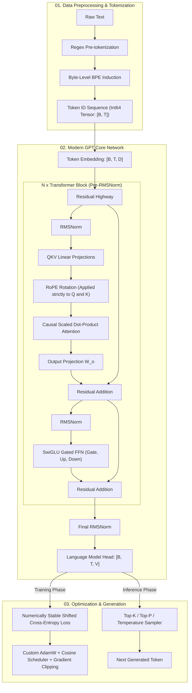

# Transformer Basics · Build a Modern GPT from Scratch: Tokenizer, RoPE & Autoregressive Loop

> **Overview**: Inspired by Stanford's **CS336: Language Modeling from Scratch** curriculum and modern foundation model architectures (such as LLaMA 3 and Mistral), this tutorial builds a complete, modern Decoder-Only Transformer language model line-by-line from raw byte streams.
>
> We do not use HuggingFace `transformers` or high-level abstraction wrappers. Using only standard Python and core PyTorch primitives, we assemble eight foundational subsystems:
> 1. **Tokenization Pipeline**: Byte-Level BPE Tokenizer (UTF-8 byte mapping, GPT-2 regex pre-tokenization, vocabulary induction, robust encode/decode)
> 2. **Tensor Foundations**: RMSNorm, SwiGLU Gated Feed-Forward Network, and Rotary Position Embeddings (RoPE)
> 3. **Attention Engine**: Causal Multi-Head Attention (MHA) and Grouped-Query Attention (GQA)
> 4. **Model Architecture**: Pre-RMSNorm Residual Transformer Block and the full end-to-end GPT model with Weight Tying
> 5. **Numerically Stable Loss**: Custom Shifted Cross-Entropy with the Log-Sum-Exp trick and Perplexity (PPL) tracking
> 6. **Optimization & Dynamics**: Custom AdamW Optimizer (decoupled weight decay, 1D/2D parameter group partitioning), Cosine Decay with linear warmup, and global gradient clipping
> 7. **Training & Evaluation Pipeline**: High-throughput 1D token batch sampler, training loop, validation loss evaluation, and stateful checkpointing
> 8. **Autoregressive Generation**: Greedy decoding, Temperature scaling, Top-K and Top-P (Nucleus) sampling, plus a deep dive into KV Caching

---

## 00. Modern GPT Architectural Blueprint

### Evolution of Decoder-Only Architectures

Since the release of *Attention Is All You Need* (2017) and *GPT-2* (2019), the Decoder-Only Transformer has undergone multiple critical architectural upgrades. Contemporary foundation models (such as LLaMA 3, Mistral, and Gemma) establish four standard design paradigms over vanilla GPT-2:

| Component | Vanilla GPT-2 (2019) | Modern Base LLMs (LLaMA 3 / Mistral) | Algorithmic & Systems Advantages |
| :--- | :--- | :--- | :--- |
| **Normalization** | Post-LayerNorm / Pre-LayerNorm | **Pre-RMSNorm** | Omits mean centering; reduces normalization overhead by ~7% and improves mixed-precision stability |
| **Position Encoding** | Absolute Learned Position Embeddings | **Rotary Position Embeddings (RoPE)** | Encodes relative distance into complex inner products; natural distance decay and length extrapolation |
| **FFN & Activation** | GELU Multi-Layer Perceptron ($4D$) | **SwiGLU Gated FFN ($\frac{8}{3}D$)** | Introduces multiplicative gating; achieves noticeably lower perplexity at strictly matched parameter counts |
| **Attention** | Standard Multi-Head Attention (MHA) | **Grouped-Query Attention (GQA)** | Multiple Query heads share Key/Value heads; dramatically shrinks KV Cache footprint during autoregressive inference |
| **Weight Tying** | Optional Weight Tying | **Tied Embedding & LM Head Weights** | Saves $V \times D$ parameters; provides regularizing benefits and lowers VRAM requirements for small-to-medium models |



### Global Tensor Shape Flow

Let batch size be $B$, context window length be $T$, hidden dimension be $D$, number of query attention heads be $H$, number of Key/Value heads be $H_{kv}$, per-head dimension be $D_h = D / H$, intermediate FFN dimension be $D_{\text{ff}}$, and vocabulary size be $V$:

| Stage / Operator | Input Shape | Output Shape | Tensor Dimensions Description |
| :--- | :--- | :--- | :--- |
| **Token Inputs** | List of raw strings | `(B, T)` | `dtype=torch.long`, integer token IDs in $[0, V-1]$ |
| **Token Embedding** | `(B, T)` | `(B, T, D)` | Matrix lookup mapping discrete IDs to continuous representations |
| **RMSNorm** | `(..., D)` | `(..., D)` | Normalizes along the final feature dimension; preserves shape |
| **Q Projection** | `(B, T, D)` | `(B, H, T, Dh)` | Linearly maps to $D$ dimensions and rearranges into multi-head format |
| **K, V Projections (GQA)**| `(B, T, D)` | `(B, H_kv, T, Dh)` | Linearly maps to $H_{kv} \times D_h$ dimensions and splits heads |
| **RoPE Application** | `(B, H, T, Dh)` | `(B, H, T, Dh)` | Rotates pairs of feature dimensions on 2D planes according to position $m$ |
| **Causal Attention Scores**| $Q \in (B, H, T, D_h)$, $K \in (B, H, T, D_h)$ | `(B, H, T, T)` | Computes $Q K^\top / \sqrt{D_h}$, injects causal $-\infty$ mask, applies Softmax |
| **Value Aggregation** | $\text{Scores} \in (B, H, T, T)$, $V \in (B, H, T, D_h)$ | `(B, T, D)` | Matrix product with $V$, permutes back to sequence dimension, projects via $W_o$ |
| **SwiGLU FFN** | `(B, T, D)` | `(B, T, D)` | Evaluates $( \text{SiLU}(x W_{\text{gate}}) \odot x W_{\text{up}} ) W_{\text{down}}$ with inner width $D_{\text{ff}}$ |
| **LM Head Output** | `(B, T, D)` | `(B, T, V)` | Produces unnormalized vocabulary scores (Logits) |
| **Training Shift Loss** | `Logits[:, :-1, :]`, `Targets[:, 1:]` | Scalar | Computes cross-entropy between predictions at step $t$ and ground truth at $t+1$ |

---

## 01. Tokenization: Byte-Level BPE Tokenizer

### Why Modern LLMs Rely on Byte-Level Encoding

In early NLP pipelines, tokenizers were either word-level or character-level. Word-level tokenizers require massive vocabularies and inevitably encounter out-of-vocabulary terms. Character-level tokenizers result in excessively long sequences that bloat attention memory.

Modern base LLMs employ **Byte-Level Byte-Pair Encoding (BPE)**:
1. **Guaranteed Zero `<unk>` Tokens**: In digital systems, all human languages, mathematical symbols, source code, and emojis decompose into UTF-8 byte streams. The base vocabulary starts with 256 individual bytes (`0x00` through `0xFF`). Consequently, any arbitrary byte sequence can be processed without failure.
2. **Frequency-Driven Compression**: On top of the 256 base bytes, the algorithm iteratively merges the most frequently co-occurring adjacent byte pairs into unified tokens.

### Regex Pre-tokenization Engine

If BPE merges were trained directly across raw text without boundaries, the algorithm would merge across natural punctuation or whitespace boundaries (e.g., merging punctuation with following words like `",and"` or blending digits across sentences).

GPT-2 and modern LLMs use a **pre-tokenization regular expression** to segment text into semantic atomic chunks before BPE induction:

```python
import re

# Standard GPT-2 pre-tokenization regex pattern
# 1. Contractions and suffixes ('s, 't, 're, 've, 'm, 'll, 'd)
# 2. Letter sequences (supporting Unicode letters)
# 3. Numeric sequences
# 4. Non-whitespace, non-letter, non-numeric punctuation clusters
# 5. Consecutive whitespace sequences (tabs, newlines, spaces)
GPT2_PRETOKEN_PATTERN = re.compile(
    r"""'s|'t|'re|'ve|'m|'ll|'d| ?[^\W\d_]+| ?\d+| ?[^\s\w]+|\s+(?!\S)|\s+"""
)
```

Each chunk is decomposed into individual byte tuples. BPE merge operations are **strictly prohibited from crossing chunk boundaries**.

### Full Implementation: `ByteLevelBPETokenizer`

```python
import re
from collections import Counter
from typing import Dict, List, Tuple, Optional

class ByteLevelBPETokenizer:
    def __init__(self):
        # Base vocabulary of 256 bytes, where token ID equals the raw byte value (0 to 255)
        self.vocab: Dict[bytes, int] = {bytes([b]): b for b in range(256)}
        self.inverse_vocab: Dict[int, bytes] = {b: bytes([b]) for b in range(256)}
        self.merges: List[Tuple[bytes, bytes]] = []
        
        # Special tokens: allocated starting at index 256
        self.special_tokens: Dict[str, int] = {"<|endoftext|>": 256}
        self.inverse_special: Dict[int, str] = {256: "<|endoftext|>"}

    def _tokenize_into_words(self, text: str) -> List[str]:
        return [match.group(0) for match in GPT2_PRETOKEN_PATTERN.finditer(text)]

    def train(self, text: str, vocab_size: int):
        """
        Trains BPE merges on the input text until target vocab_size is reached.
        """
        assert vocab_size >= 256 + len(self.special_tokens), "vocab_size must fit 256 base bytes and special tokens"
        
        words = self._tokenize_into_words(text)
        word_counts = Counter()
        for w in words:
            byte_tuple = tuple(bytes([b]) for b in w.encode("utf-8"))
            word_counts[byte_tuple] += 1

        num_merges = vocab_size - 256 - len(self.special_tokens)
        for _ in range(num_merges):
            pair_counts = Counter()
            for piece_tuple, freq in word_counts.items():
                for p in zip(piece_tuple, piece_tuple[1:]):
                    pair_counts[p] += freq
            
            if not pair_counts:
                break
            
            # Deterministic tie-breaking: highest frequency, then lexicographically greater pair
            best_pair = max(pair_counts.keys(), key=lambda p: (pair_counts[p], p))
            self.merges.append(best_pair)
            
            new_id = len(self.vocab) + len(self.special_tokens)
            merged_bytes = best_pair[0] + best_pair[1]
            self.vocab[merged_bytes] = new_id
            self.inverse_vocab[new_id] = merged_bytes
            
            # Apply merge across word frequency dictionary
            new_word_counts = Counter()
            for piece_tuple, freq in word_counts.items():
                new_pieces = []
                j = 0
                while j < len(piece_tuple):
                    if j < len(piece_tuple) - 1 and (piece_tuple[j], piece_tuple[j+1]) == best_pair:
                        new_pieces.append(merged_bytes)
                        j += 2
                    else:
                        new_pieces.append(piece_tuple[j])
                        j += 1
                new_word_counts[tuple(new_pieces)] = freq
            word_counts = new_word_counts

    def encode(self, text: str, allowed_special: bool = True) -> List[int]:
        """
        Encodes a string into a list of integer token IDs.
        """
        if allowed_special and "<|endoftext|>" in text:
            parts = text.split("<|endoftext|>")
            encoded_tokens = []
            for i, part in enumerate(parts):
                if part:
                    encoded_tokens.extend(self.encode(part, allowed_special=False))
                if i < len(parts) - 1:
                    encoded_tokens.append(self.special_tokens["<|endoftext|>"])
            return encoded_tokens

        words = self._tokenize_into_words(text)
        token_ids = []
        
        for w in words:
            pieces = [bytes([b]) for b in w.encode("utf-8")]
            # Apply merges in the exact order discovered during training
            for pair in self.merges:
                merged = pair[0] + pair[1]
                new_pieces = []
                i = 0
                while i < len(pieces):
                    if i < len(pieces) - 1 and pieces[i] == pair[0] and pieces[i+1] == pair[1]:
                        new_pieces.append(merged)
                        i += 2
                    else:
                        new_pieces.append(pieces[i])
                        i += 1
                pieces = new_pieces
            
            for p in pieces:
                token_ids.append(self.vocab[p])
                
        return token_ids

    def decode(self, token_ids: List[int]) -> str:
        """
        Decodes a list of token IDs back into text.
        Concatenates bytes first and applies utf-8 decode with fallback replacement.
        """
        raw_bytes = bytearray()
        for idx in token_ids:
            if idx in self.inverse_special:
                raw_bytes.extend(self.inverse_special[idx].encode("utf-8"))
            elif idx in self.inverse_vocab:
                raw_bytes.extend(self.inverse_vocab[idx])
            else:
                raise ValueError(f"Unrecognized Token ID: {idx}")
        return raw_bytes.decode("utf-8", errors="replace")
```

---

## 02. Core Tensor Modules

### 1. Token Embedding

Token Embedding functions as a direct lookup table mapping discrete token index $i \in [0, V-1]$ to a dense vector space $\mathbf{x}_i \in \mathbb{R}^D$.
Standard initialization samples weights from $\mathcal{N}(0, \sigma^2)$ with $\sigma = 0.02$ or $1 / \sqrt{D}$ to keep input activation variance near $1.0$.

### 2. RMSNorm (Root Mean Square Layer Normalization)

#### Why Modern Architectures Dropped Standard LayerNorm

Standard LayerNorm performs mean-centering followed by variance scaling:

$$\mu = \frac{1}{d} \sum_{i=1}^d x_i, \quad \sigma^2 = \frac{1}{d} \sum_{i=1}^d (x_i - \mu)^2$$
$$\text{LayerNorm}(x) = \frac{x - \mu}{\sqrt{\sigma^2 + \epsilon}} \odot \gamma + \beta$$

Zhang & Sennrich (NeurIPS 2019) demonstrated in *Root Mean Square Layer Normalization* that **the primary driver of LayerNorm's training stabilization is scale invariance induced by variance normalization, while the mean-centering step $\mu$ is superfluous**.

RMSNorm eliminates mean calculation and bias parameter $\beta$:

$$\text{RMS}(x) = \sqrt{\frac{1}{d} \sum_{i=1}^d x_i^2 + \epsilon}$$
$$\text{RMSNorm}(x) = \frac{x}{\text{RMS}(x)} \odot \gamma$$

#### Numerical Precision Guard

```python
import torch
import torch.nn as nn

class RMSNorm(nn.Module):
    def __init__(self, dim: int, eps: float = 1e-6):
        super().__init__()
        self.eps = eps
        # Learned scale parameter gamma, initialized to ones
        self.weight = nn.Parameter(torch.ones(dim))

    def forward(self, x: torch.Tensor) -> torch.Tensor:
        # Precision guard: x^2 can easily overflow or underflow in float16/bfloat16.
        # Compute sum-of-squares and reciprocal square root in float32.
        input_dtype = x.dtype
        x_f32 = x.float()
        variance = x_f32.pow(2).mean(dim=-1, keepdim=True)
        rsqrt = torch.rsqrt(variance + self.eps)
        normed = (x_f32 * rsqrt).to(input_dtype)
        return normed * self.weight
```

### 3. SwiGLU Gated Feed-Forward Network

#### Multiplicative Gating and Parameter Budget Matching

Modern architectures replace standard MLPs with **SwiGLU** (Shazeer, 2020):

$$\text{SwiGLU}(x) = \left( \text{SiLU}(x W_{\text{gate}}) \odot (x W_{\text{up}}) \right) W_{\text{down}}$$

where $\text{SiLU}(z) = z \cdot \sigma(z) = \frac{z}{1 + e^{-z}}$.

#### Why Set $d_{\text{ff}} \approx \frac{8}{3} D$?

A standard Transformer MLP uses two weight matrices: $W_1 \in \mathbb{R}^{D \times 4D}$ and $W_2 \in \mathbb{R}^{4D \times D}$, totaling:

$$\text{Params}_{\text{MLP}} = 2 \times D \times 4D = 8 D^2$$

SwiGLU has three matrices ($W_{\text{gate}}, W_{\text{up}}, W_{\text{down}}$), totaling:

$$\text{Params}_{\text{SwiGLU}} = 3 \times D \times d_{\text{ff}}$$

To maintain identical FLOPs and parameter budgets across architectures:

$$3 D \cdot d_{\text{ff}} \approx 8 D^2 \implies d_{\text{ff}} = \frac{8}{3} D \approx 2.67 D$$

In production systems, $d_{\text{ff}}$ is rounded to a multiple of 64 or 256 for GPU Tensor Core memory alignment.

```python
import torch.nn.functional as F

class SwiGLU(nn.Module):
    def __init__(self, d_model: int, d_ff: int):
        super().__init__()
        self.w_gate = nn.Linear(d_model, d_ff, bias=False)
        self.w_up = nn.Linear(d_model, d_ff, bias=False)
        self.w_down = nn.Linear(d_ff, d_model, bias=False)

    def forward(self, x: torch.Tensor) -> torch.Tensor:
        return self.w_down(F.silu(self.w_gate(x)) * self.w_up(x))
```

### 4. Rotary Position Embeddings (RoPE)

#### Absolute PE Limitations vs RoPE Geometry

Absolute position embeddings add vectors directly to token representations: $x_t = e_t + p_t$. This pollutes semantic vectors and struggles to extrapolate to longer sequences.

Su et al. (2021) introduced **RoPE (Rotary Position Embedding)**:
**An orthogonal rotation matrix $R_{\Theta, m}^d$ rotates Query and Key vectors by an angle proportional to position $m$, such that their dot product depends solely on relative distance $m - n$**:

$$\langle R_{\Theta, m}^d q, R_{\Theta, n}^d k \rangle = q^\top (R_{\Theta, m}^d)^\top R_{\Theta, n}^d k = q^\top R_{\Theta, n - m}^d k = g(q, k, m - n)$$

#### 2D Plane Decomposition and Rotary Frequencies

The $d$-dimensional space decomposes into $d / 2$ orthogonal 2D planes. On plane $i$, the vector at position $m$ rotates by $m \theta_i$:

$$\theta_i = b^{-2i / d}, \quad i \in [0, d/2), \quad b = 10000.0$$

The 2D rotation operator is:

$$\begin{pmatrix} q_0^{(m)} \\ q_1^{(m)} \end{pmatrix} = \begin{pmatrix} \cos(m\theta_i) & -\sin(m\theta_i) \\ \sin(m\theta_i) & \cos(m\theta_i) \end{pmatrix} \begin{pmatrix} q_0 \\ q_1 \end{pmatrix}$$

#### Vectorized Implementation

Splitting $x$ into halves $x_1$ and $x_2$ with $\text{rotate\_half}(x) = [-x_2, x_1]$ allows vectorized computation:

$$x_{\text{rot}} = x \odot \cos(m\theta) + \text{rotate\_half}(x) \odot \sin(m\theta)$$

```python
from typing import Tuple

def precompute_rope_cis(dim: int, max_seq_len: int, theta: float = 10000.0) -> Tuple[torch.Tensor, torch.Tensor]:
    assert dim % 2 == 0, "head_dim must be even for pairwise 2D rotation"
    freqs = 1.0 / (theta ** (torch.arange(0, dim, 2).float() / dim))
    t = torch.arange(max_seq_len, dtype=torch.float32)
    freqs_matrix = torch.outer(t, freqs)
    return torch.cos(freqs_matrix), torch.sin(freqs_matrix)

def apply_rotary_emb(x: torch.Tensor, cos: torch.Tensor, sin: torch.Tensor) -> torch.Tensor:
    # x shape: (B, H, T, Dh)
    B, H, T, Dh = x.shape
    cos = cos[:T, :].unsqueeze(0).unsqueeze(1)
    sin = sin[:T, :].unsqueeze(0).unsqueeze(1)
    
    half_dim = Dh // 2
    x1 = x[..., :half_dim]
    x2 = x[..., half_dim:]
    
    rotated_half = torch.cat((-x2, x1), dim=-1)
    cos_full = torch.cat((cos, cos), dim=-1)
    sin_full = torch.cat((sin, sin), dim=-1)
    
    return (x * cos_full) + (rotated_half * sin_full)
```

---

## 03. Attention Engine: Causal Self-Attention & GQA

### 1. Mathematical Formulation

Scaled Dot-Product Attention computes:

$$\text{Attention}(Q, K, V) = \text{Softmax}\left( \frac{Q K^\top}{\sqrt{d_k}} + M \right) V$$

#### Why Scale by $\sqrt{d_k}$?

If elements of $Q$ and $K$ are independent $\mathcal{N}(0, 1)$ random variables, their dot product has variance:

$$\text{Var}\left(\sum_{i=1}^{d_k} q_i k_i\right) = d_k$$

When $d_k = 128$, the standard deviation reaches $\sqrt{128} \approx 11.3$. Without scaling, large dot products saturate the Softmax function into regions of near-zero gradients. Dividing by $\sqrt{d_k}$ preserves a variance of $1.0$.

#### Causal Masking

To prevent token $t$ from attending to future tokens $t+1 \dots T$, positions where $j > i$ are masked with $-\infty$, guaranteeing zero Softmax attention weight.

### 2. Grouped-Query Attention (GQA)

Standard Multi-Head Attention (MHA) allocates identical head counts for Queries, Keys, and Values ($H_q = H_{kv}$). During autoregressive inference, caching Keys and Values (KV Cache) becomes the primary VRAM bottleneck.

GQA shares Key/Value heads across groups of Query heads (e.g., 32 Query heads sharing 8 KV heads), **reducing KV Cache memory by $4\times$ to $8\times$ with virtually zero degradation in task performance**.

```python
import math
from dataclasses import dataclass
from typing import Optional

@dataclass
class GPTConfig:
    vocab_size: int = 50257
    context_length: int = 1024
    d_model: int = 768
    num_layers: int = 12
    num_heads: int = 12
    num_kv_heads: Optional[int] = None
    d_ff: Optional[int] = None
    rope_theta: float = 10000.0
    dropout: float = 0.0
    tie_weights: bool = True

    def __post_init__(self):
        if self.num_kv_heads is None:
            self.num_kv_heads = self.num_heads
        assert self.num_heads % self.num_kv_heads == 0, "num_heads must be divisible by num_kv_heads"
        if self.d_ff is None:
            d_ff_unrounded = int(2 * self.d_model * 4 / 3)
            self.d_ff = ((d_ff_unrounded + 63) // 64) * 64

class CausalSelfAttention(nn.Module):
    def __init__(self, config: GPTConfig):
        super().__init__()
        self.d_model = config.d_model
        self.num_heads = config.num_heads
        self.num_kv_heads = config.num_kv_heads
        self.head_dim = config.d_model // config.num_heads
        self.num_queries_per_kv = self.num_heads // self.num_kv_heads
        
        self.q_proj = nn.Linear(self.d_model, self.num_heads * self.head_dim, bias=False)
        self.k_proj = nn.Linear(self.d_model, self.num_kv_heads * self.head_dim, bias=False)
        self.v_proj = nn.Linear(self.d_model, self.num_kv_heads * self.head_dim, bias=False)
        self.out_proj = nn.Linear(self.num_heads * self.head_dim, self.d_model, bias=False)
        self.dropout = nn.Dropout(config.dropout)

    def forward(self, x: torch.Tensor, cos: torch.Tensor, sin: torch.Tensor) -> torch.Tensor:
        B, T, D = x.shape
        
        q = self.q_proj(x).view(B, T, self.num_heads, self.head_dim).transpose(1, 2)
        k = self.k_proj(x).view(B, T, self.num_kv_heads, self.head_dim).transpose(1, 2)
        v = self.v_proj(x).view(B, T, self.num_kv_heads, self.head_dim).transpose(1, 2)
        
        # RoPE applies strictly to Q and K (never V)
        q = apply_rotary_emb(q, cos, sin)
        k = apply_rotary_emb(k, cos, sin)
        
        # GQA broadcasting across Query heads
        if self.num_queries_per_kv > 1:
            k = torch.repeat_interleave(k, self.num_queries_per_kv, dim=1)
            v = torch.repeat_interleave(v, self.num_queries_per_kv, dim=1)
            
        scale = 1.0 / math.sqrt(self.head_dim)
        scores = torch.matmul(q, k.transpose(-2, -1)) * scale
        
        mask = torch.triu(torch.full((T, T), float("-inf"), device=x.device), diagonal=1)
        scores = scores + mask.unsqueeze(0).unsqueeze(1)
        
        probs = F.softmax(scores, dim=-1)
        probs = self.dropout(probs)
        
        context = torch.matmul(probs, v)
        context = context.transpose(1, 2).contiguous().view(B, T, -1)
        return self.out_proj(context)
```

---

## 04. Transformer Block & Full Model Architecture

### Pre-LayerNorm Residual Dynamics

In **Post-LN**:

$$x_{t+1} = \text{Norm}(x_t + \text{SubLayer}(x_t))$$

Repeated normalization across deep stacks causes gradients to decay exponentially toward the input layer.

In **Pre-LN (Pre-RMSNorm)**:

$$x_{t+1} = x_t + \text{SubLayer}(\text{RMSNorm}(x_t))$$

Expanding $L$ layers yields an unobstructed **Identity Highway**:

$$x_L = x_0 + \sum_{l=0}^{L-1} \text{SubLayer}_l(\text{RMSNorm}(x_l))$$

Gradients flow directly from output to input, enabling rock-solid convergence:

$$\frac{\partial \mathcal{L}}{\partial x_0} = \frac{\partial \mathcal{L}}{\partial x_L} \left( I + \sum_{l=0}^{L-1} \frac{\partial \text{SubLayer}_l}{\partial x_l} \right)$$

```python
class TransformerBlock(nn.Module):
    def __init__(self, config: GPTConfig):
        super().__init__()
        self.attn_norm = RMSNorm(config.d_model)
        self.attn = CausalSelfAttention(config)
        self.ffn_norm = RMSNorm(config.d_model)
        self.ffn = SwiGLU(config.d_model, config.d_ff)

    def forward(self, x: torch.Tensor, cos: torch.Tensor, sin: torch.Tensor) -> torch.Tensor:
        x = x + self.attn(self.attn_norm(x), cos, sin)
        x = x + self.ffn(self.ffn_norm(x))
        return x
```

### Complete `GPT` Model Implementation

```python
class GPT(nn.Module):
    def __init__(self, config: GPTConfig):
        super().__init__()
        self.config = config
        
        self.token_embedding = nn.Embedding(config.vocab_size, config.d_model)
        self.layers = nn.ModuleList([
            TransformerBlock(config) for _ in range(config.num_layers)
        ])
        self.final_norm = RMSNorm(config.d_model)
        self.lm_head = nn.Linear(config.d_model, config.vocab_size, bias=False)
        
        # Weight tying: share parameters between token embeddings and output projections
        if config.tie_weights:
            self.lm_head.weight = self.token_embedding.weight
            
        head_dim = config.d_model // config.num_heads
        cos, sin = precompute_rope_cis(head_dim, config.context_length, config.rope_theta)
        self.register_buffer("cos_cached", cos, persistent=False)
        self.register_buffer("sin_cached", sin, persistent=False)
        
        self.apply(self._init_weights)

    def _init_weights(self, module):
        if isinstance(module, nn.Linear):
            torch.nn.init.normal_(module.weight, mean=0.0, std=0.02)
            if module.bias is not None:
                torch.nn.init.zeros_(module.bias)
        elif isinstance(module, nn.Embedding):
            torch.nn.init.normal_(module.weight, mean=0.0, std=0.02)

    def forward(self, idx: torch.Tensor, targets: Optional[torch.Tensor] = None):
        B, T = idx.shape
        assert T <= self.config.context_length, f"Sequence length {T} exceeds maximum {self.config.context_length}"
        
        x = self.token_embedding(idx)
        cos = self.cos_cached.to(device=x.device, dtype=x.dtype)
        sin = self.sin_cached.to(device=x.device, dtype=x.dtype)
        
        for layer in self.layers:
            x = layer(x, cos, sin)
            
        x = self.final_norm(x)
        logits = self.lm_head(x)
        
        loss = None
        if targets is not None:
            loss = F.cross_entropy(logits.view(-1, logits.size(-1)), targets.view(-1))
            
        return logits, loss
```

---

## 05. Numerically Stable Loss & Objectives

### Shifted Cross-Entropy Formulation

For an autoregressive sequence $[t_0, t_1, \dots, t_{K-1}]$, the logit at index $i$ predicts the ground truth token at index $i+1$:

$$\text{Inputs} = x_{[:, :T-1]}, \quad \text{Targets} = x_{[:, 1:]}$$

### Log-Sum-Exp Trick

Directly calculating $\log \sum_j e^{z_j}$ overflows for logits $\ge 88$ in 32-bit floating point.
The mathematically equivalent **Log-Sum-Exp** transformation prevents overflow:

$$\log \sum_j e^{z_j} = m + \log \sum_j e^{z_j - m}, \quad \text{where } m = \max_j z_j$$

```python
def stable_cross_entropy(logits: torch.Tensor, targets: torch.Tensor) -> torch.Tensor:
    max_logits, _ = torch.max(logits, dim=-1, keepdim=True)
    shifted_logits = logits - max_logits
    log_sum_exp = torch.log(torch.sum(torch.exp(shifted_logits), dim=-1)) + max_logits.squeeze(-1)
    target_logits = logits.gather(dim=-1, index=targets.unsqueeze(-1)).squeeze(-1)
    return (log_sum_exp - target_logits).mean()
```

### Perplexity (PPL)

$$\text{PPL} = \exp(\mathcal{L})$$

Perplexity quantifies the effective branching factor: an untrained model over $V=50,000$ tokens exhibits $\text{Loss} \approx \ln(50000) \approx 10.82$ and $\text{PPL} \approx 50000$. A loss of $2.0$ yields $\text{PPL} \approx 7.39$.

---

## 06. Optimization & Dynamics

### 1. Custom AdamW with Decoupled Weight Decay

In classical Adam, standard $L_2$ regularization scales gradient additions by $1 / \sqrt{v_t}$, penalizing frequently updated weights less than inactive weights.
AdamW (Loshchilov & Hutter, 2019) decouples weight decay directly from gradient momentum updates:

$$\theta_{t+1} = \theta_t - \eta_t \lambda \theta_t - \frac{\eta_t}{\sqrt{\hat{v}_t} + \epsilon} \hat{m}_t$$

**Parameter Grouping Rule**: Apply weight decay to 2D matrices (`Linear.weight`, `Embedding.weight`). Never apply decay to 1D vectors (`RMSNorm.weight` or biases).

```python
class AdamW(torch.optim.Optimizer):
    def __init__(self, params, lr=1e-3, betas=(0.9, 0.95), eps=1e-8, weight_decay=1e-2):
        defaults = dict(lr=lr, betas=betas, eps=eps, weight_decay=weight_decay)
        super().__init__(params, defaults)

    @torch.no_grad()
    def step(self, closure=None):
        loss = None
        if closure is not None:
            with torch.enable_grad():
                loss = closure()

        for group in self.param_groups:
            lr = group["lr"]
            beta1, beta2 = group["betas"]
            eps = group["eps"]
            decay = group["weight_decay"]

            for p in group["params"]:
                if p.grad is None:
                    continue
                grad = p.grad

                state = self.state[p]
                if len(state) == 0:
                    state["step"] = 0
                    state["exp_avg"] = torch.zeros_like(p, memory_format=torch.preserve_format)
                    state["exp_avg_sq"] = torch.zeros_like(p, memory_format=torch.preserve_format)

                exp_avg, exp_avg_sq = state["exp_avg"], state["exp_avg_sq"]
                state["step"] += 1
                step = state["step"]

                # Decoupled weight decay
                if decay != 0:
                    p.mul_(1.0 - lr * decay)

                # Momentum updates
                exp_avg.mul_(beta1).add_(grad, alpha=1.0 - beta1)
                exp_avg_sq.mul_(beta2).addcmul_(grad, grad, value=1.0 - beta2)

                # Analytical bias corrections
                bias_correction1 = 1.0 - beta1 ** step
                bias_correction2 = 1.0 - beta2 ** step

                step_size = lr / bias_correction1
                denom = (exp_avg_sq.sqrt() / math.sqrt(bias_correction2)).add_(eps)
                p.addcdiv_(exp_avg, denom, value=-step_size)

        return loss
```

### 2. Cosine Decay with Linear Warmup

```python
def get_lr_cosine_schedule(step: int, max_steps: int, warmup_steps: int, lr_max: float, lr_min: float) -> float:
    if step < warmup_steps:
        return lr_max * (step + 1) / (warmup_steps + 1)
    if step > max_steps:
        return lr_min
    decay_ratio = (step - warmup_steps) / (max_steps - warmup_steps)
    coeff = 0.5 * (1.0 + math.cos(math.pi * decay_ratio))
    return lr_min + coeff * (lr_max - lr_min)
```

### 3. Global Gradient Clipping

```python
def clip_grad_norm(parameters, max_norm: float, eps: float = 1e-6) -> float:
    params = [p for p in parameters if p.grad is not None]
    if not params:
        return 0.0
    total_norm = torch.sqrt(sum(p.grad.detach().pow(2).sum() for p in params))
    clip_coeff = max_norm / (total_norm + eps)
    if clip_coeff < 1.0:
        for p in params:
            p.grad.detach().mul_(clip_coeff)
    return total_norm.item()
```

---

## 07. Data Loading & Training Pipeline

```python
import numpy as np

def get_batch(tokens_data: np.ndarray, batch_size: int, context_length: int, device: str):
    high = len(tokens_data) - context_length - 1
    start_indices = np.random.randint(0, high, size=batch_size)
    
    x_chunks = [tokens_data[i : i + context_length] for i in start_indices]
    y_chunks = [tokens_data[i + 1 : i + 1 + context_length] for i in start_indices]
    
    x = torch.from_numpy(np.stack(x_chunks).astype(np.int64)).to(device)
    y = torch.from_numpy(np.stack(y_chunks).astype(np.int64)).to(device)
    return x, y
```

---

## 08. Autoregressive Sampling & KV Cache

```python
def sample_next_token(
    logits: torch.Tensor,
    temperature: float = 1.0,
    top_k: int = 0,
    top_p: float = 0.9,
) -> int:
    if temperature == 0.0:
        return torch.argmax(logits, dim=-1).item()
    
    scaled_logits = logits / temperature
    
    if top_k > 0:
        val, _ = torch.topk(scaled_logits, min(top_k, scaled_logits.size(-1)))
        scaled_logits[scaled_logits < val[:, [-1]]] = float("-inf")
        
    if top_p < 1.0:
        sorted_logits, sorted_indices = torch.sort(scaled_logits, descending=True)
        cumulative_probs = torch.cumsum(F.softmax(sorted_logits, dim=-1), dim=-1)
        
        sorted_indices_to_remove = cumulative_probs > top_p
        sorted_indices_to_remove[..., 1:] = sorted_indices_to_remove[..., :-1].clone()
        sorted_indices_to_remove[..., 0] = False
        
        indices_to_remove = sorted_indices_to_remove.scatter(
            dim=1, index=sorted_indices, src=sorted_indices_to_remove
        )
        scaled_logits[indices_to_remove] = float("-inf")
        
    probs = F.softmax(scaled_logits, dim=-1)
    next_token = torch.multinomial(probs, num_samples=1)
    return next_token.item()
```

### KV Caching: $O(N^2) \to O(N)$ Complexity Reduction

In naïve autoregressive decoding, generating token $t$ feeds all $t-1$ previous tokens back through the model, recalculating Keys and Values repeatedly: $\sum_{t=1}^N t \cdot D = O(N^2 \cdot D)$.

With a Key-Value Cache, historical Keys and Values are retained in memory. Each step computes only the single new token Query $Q_t$, performs dot-product attention against the cached Keys and Values, and appends $K_t, V_t$. Step complexity drops from $O(t)$ to $O(1)$, reducing total generation time from $O(N^2)$ to $O(N)$.

---

## 09. Self-Contained Complete Executable Script

This standalone Python script trains a complete GPT model from scratch on sample text and generates new tokens:

```python
import math
import re
from collections import Counter
from dataclasses import dataclass
from typing import Optional, Tuple
import torch
import torch.nn as nn
import torch.nn.functional as F

# ==========================================
# 1. Byte-Level BPE Tokenizer
# ==========================================
PRETOKEN_PAT = re.compile(r"""'s|'t|'re|'ve|'m|'ll|'d| ?[^\W\d_]+| ?\d+| ?[^\s\w]+|\s+(?!\S)|\s+""")

class ByteLevelBPETokenizer:
    def __init__(self):
        self.vocab = {bytes([b]): b for b in range(256)}
        self.inv_vocab = {b: bytes([b]) for b in range(256)}
        self.merges = []
        self.special_tokens = {"<|endoftext|>": 256}
        self.inv_special = {256: "<|endoftext|>"}

    def train(self, text: str, vocab_size: int):
        words = [m.group(0) for m in PRETOKEN_PAT.finditer(text)]
        word_counts = Counter()
        for w in words:
            word_counts[tuple(bytes([b]) for b in w.encode("utf-8"))] += 1
            
        num_merges = vocab_size - 256 - len(self.special_tokens)
        for _ in range(max(0, num_merges)):
            pair_counts = Counter()
            for p_tuple, freq in word_counts.items():
                for p in zip(p_tuple, p_tuple[1:]):
                    pair_counts[p] += freq
            if not pair_counts:
                break
                
            best_pair = max(pair_counts.keys(), key=lambda p: (pair_counts[p], p))
            self.merges.append(best_pair)
            new_id = len(self.vocab) + len(self.special_tokens)
            merged = best_pair[0] + best_pair[1]
            self.vocab[merged] = new_id
            self.inv_vocab[new_id] = merged
            
            new_counts = Counter()
            for p_tuple, freq in word_counts.items():
                new_p = []
                j = 0
                while j < len(p_tuple):
                    if j < len(p_tuple) - 1 and (p_tuple[j], p_tuple[j+1]) == best_pair:
                        new_p.append(merged)
                        j += 2
                    else:
                        new_p.append(p_tuple[j])
                        j += 1
                new_counts[tuple(new_p)] = freq
            word_counts = new_counts

    def encode(self, text: str):
        words = [m.group(0) for m in PRETOKEN_PAT.finditer(text)]
        token_ids = []
        for w in words:
            pieces = [bytes([b]) for b in w.encode("utf-8")]
            for pair in self.merges:
                merged = pair[0] + pair[1]
                new_pieces = []
                i = 0
                while i < len(pieces):
                    if i < len(pieces) - 1 and pieces[i] == pair[0] and pieces[i+1] == pair[1]:
                        new_pieces.append(merged)
                        i += 2
                    else:
                        new_pieces.append(pieces[i])
                        i += 1
                pieces = new_pieces
            for p in pieces:
                token_ids.append(self.vocab[p])
        return token_ids

    def decode(self, ids):
        raw = bytearray()
        for i in ids:
            if i in self.inv_special:
                raw.extend(self.inv_special[i].encode("utf-8"))
            elif i in self.inv_vocab:
                raw.extend(self.inv_vocab[i])
        return raw.decode("utf-8", errors="replace")

# ==========================================
# 2. Modern GPT Model Architecture
# ==========================================
@dataclass
class GPTConfig:
    vocab_size: int = 300
    context_length: int = 32
    d_model: int = 64
    num_layers: int = 2
    num_heads: int = 2
    num_kv_heads: int = 1
    d_ff: int = 128
    rope_theta: float = 10000.0

class RMSNorm(nn.Module):
    def __init__(self, dim: int, eps: float = 1e-6):
        super().__init__()
        self.eps = eps
        self.weight = nn.Parameter(torch.ones(dim))

    def forward(self, x: torch.Tensor) -> torch.Tensor:
        input_dtype = x.dtype
        x_f32 = x.float()
        variance = x_f32.pow(2).mean(dim=-1, keepdim=True)
        return ((x_f32 * torch.rsqrt(variance + self.eps)).to(input_dtype)) * self.weight

class SwiGLU(nn.Module):
    def __init__(self, d_model: int, d_ff: int):
        super().__init__()
        self.w_gate = nn.Linear(d_model, d_ff, bias=False)
        self.w_up = nn.Linear(d_model, d_ff, bias=False)
        self.w_down = nn.Linear(d_ff, d_model, bias=False)

    def forward(self, x: torch.Tensor) -> torch.Tensor:
        return self.w_down(F.silu(self.w_gate(x)) * self.w_up(x))

def precompute_rope(dim: int, max_seq_len: int, theta: float = 10000.0):
    freqs = 1.0 / (theta ** (torch.arange(0, dim, 2).float() / dim))
    t = torch.arange(max_seq_len, dtype=torch.float32)
    freqs_matrix = torch.outer(t, freqs)
    return torch.cos(freqs_matrix), torch.sin(freqs_matrix)

def apply_rope(x: torch.Tensor, cos: torch.Tensor, sin: torch.Tensor) -> torch.Tensor:
    B, H, T, Dh = x.shape
    cos = cos[:T, :].unsqueeze(0).unsqueeze(1)
    sin = sin[:T, :].unsqueeze(0).unsqueeze(1)
    x1, x2 = x[..., :Dh//2], x[..., Dh//2:]
    return (x * torch.cat((cos, cos), dim=-1)) + (torch.cat((-x2, x1), dim=-1) * torch.cat((sin, sin), dim=-1))

class CausalSelfAttention(nn.Module):
    def __init__(self, config: GPTConfig):
        super().__init__()
        self.head_dim = config.d_model // config.num_heads
        self.num_heads = config.num_heads
        self.num_kv_heads = config.num_kv_heads
        self.num_queries_per_kv = self.num_heads // self.num_kv_heads
        
        self.q_proj = nn.Linear(config.d_model, config.d_model, bias=False)
        self.k_proj = nn.Linear(config.d_model, self.num_kv_heads * self.head_dim, bias=False)
        self.v_proj = nn.Linear(config.d_model, self.num_kv_heads * self.head_dim, bias=False)
        self.out_proj = nn.Linear(config.d_model, config.d_model, bias=False)

    def forward(self, x: torch.Tensor, cos: torch.Tensor, sin: torch.Tensor) -> torch.Tensor:
        B, T, D = x.shape
        q = self.q_proj(x).view(B, T, self.num_heads, self.head_dim).transpose(1, 2)
        k = self.k_proj(x).view(B, T, self.num_kv_heads, self.head_dim).transpose(1, 2)
        v = self.v_proj(x).view(B, T, self.num_kv_heads, self.head_dim).transpose(1, 2)
        
        q = apply_rope(q, cos, sin)
        k = apply_rope(k, cos, sin)
        
        if self.num_queries_per_kv > 1:
            k = torch.repeat_interleave(k, self.num_queries_per_kv, dim=1)
            v = torch.repeat_interleave(v, self.num_queries_per_kv, dim=1)
            
        scores = torch.matmul(q, k.transpose(-2, -1)) * (1.0 / math.sqrt(self.head_dim))
        mask = torch.triu(torch.full((T, T), float("-inf"), device=x.device), diagonal=1)
        probs = F.softmax(scores + mask.unsqueeze(0).unsqueeze(1), dim=-1)
        out = torch.matmul(probs, v).transpose(1, 2).contiguous().view(B, T, -1)
        return self.out_proj(out)

class TransformerBlock(nn.Module):
    def __init__(self, config: GPTConfig):
        super().__init__()
        self.attn_norm = RMSNorm(config.d_model)
        self.attn = CausalSelfAttention(config)
        self.ffn_norm = RMSNorm(config.d_model)
        self.ffn = SwiGLU(config.d_model, config.d_ff)

    def forward(self, x: torch.Tensor, cos: torch.Tensor, sin: torch.Tensor) -> torch.Tensor:
        x = x + self.attn(self.attn_norm(x), cos, sin)
        x = x + self.ffn(self.ffn_norm(x))
        return x

class GPT(nn.Module):
    def __init__(self, config: GPTConfig):
        super().__init__()
        self.config = config
        self.tok_emb = nn.Embedding(config.vocab_size, config.d_model)
        self.blocks = nn.ModuleList([TransformerBlock(config) for _ in range(config.num_layers)])
        self.final_norm = RMSNorm(config.d_model)
        self.lm_head = nn.Linear(config.d_model, config.vocab_size, bias=False)
        self.lm_head.weight = self.tok_emb.weight  # Weight Tying
        
        cos, sin = precompute_rope(config.d_model // config.num_heads, config.context_length)
        self.register_buffer("cos_cached", cos, persistent=False)
        self.register_buffer("sin_cached", sin, persistent=False)
        self.apply(self._init_weights)

    def _init_weights(self, m):
        if isinstance(m, nn.Linear):
            nn.init.normal_(m.weight, std=0.02)
        elif isinstance(m, nn.Embedding):
            nn.init.normal_(m.weight, std=0.02)

    def forward(self, idx: torch.Tensor, targets: Optional[torch.Tensor] = None):
        B, T = idx.shape
        x = self.tok_emb(idx)
        cos = self.cos_cached.to(device=x.device, dtype=x.dtype)
        sin = self.sin_cached.to(device=x.device, dtype=x.dtype)
        for b in self.blocks:
            x = b(x, cos, sin)
        logits = self.lm_head(self.final_norm(x))
        loss = None
        if targets is not None:
            loss = F.cross_entropy(logits.view(-1, logits.size(-1)), targets.view(-1))
        return logits, loss

# ==========================================
# 3. Execution & Verification Loop
# ==========================================
if __name__ == "__main__":
    torch.manual_seed(42)
    corpus = """To be, or not to be, that is the question:
Whether 'tis nobler in the mind to suffer
The slings and arrows of outrageous fortune,
Or to take arms against a sea of troubles
And by opposing end them."""

    print(">>> Training Byte-Level BPE Tokenizer...")
    tok = ByteLevelBPETokenizer()
    tok.train(corpus, vocab_size=280)
    tokens = tok.encode(corpus)
    print(f"Corpus tokens: {len(tokens)}, vocabulary size: {len(tok.vocab)}")
    assert tok.decode(tokens) == corpus, "Tokenizer roundtrip verification failed!"

    print(">>> Initializing GPT Model...")
    data = torch.tensor(tokens, dtype=torch.long)
    cfg = GPTConfig(
        vocab_size=len(tok.vocab) + len(tok.special_tokens) + 1,
        context_length=16,
        d_model=64,
        num_layers=2,
        num_heads=2,
        num_kv_heads=1,
        d_ff=128
    )
    model = GPT(cfg)
    optimizer = torch.optim.AdamW(model.parameters(), lr=3e-3, weight_decay=0.01)

    print(">>> Running End-to-End Training...")
    for step in range(80):
        starts = torch.randint(0, len(data) - cfg.context_length - 1, (4,))
        x = torch.stack([data[i : i + cfg.context_length] for i in starts])
        y = torch.stack([data[i + 1 : i + 1 + cfg.context_length] for i in starts])
        
        logits, loss = model(x, y)
        optimizer.zero_grad()
        loss.backward()
        torch.nn.utils.clip_grad_norm_(model.parameters(), 1.0)
        optimizer.step()
        
        if step % 20 == 0:
            print(f"Step {step:02d} | Loss: {loss.item():.4f} | PPL: {math.exp(loss.item()):.2f}")

    print(">>> Running Autoregressive Sampling...")
    prompt = "To be"
    prompt_ids = torch.tensor([tok.encode(prompt)], dtype=torch.long)
    model.eval()
    with torch.no_grad():
        for _ in range(25):
            cond = prompt_ids[:, -cfg.context_length:]
            logits, _ = model(cond)
            next_id = torch.argmax(logits[:, -1, :], dim=-1, keepdim=True)
            prompt_ids = torch.cat([prompt_ids, next_id], dim=1)

    generated_text = tok.decode(prompt_ids[0].tolist())
    print("\n[Generated Output]:\n" + generated_text)
```

---

## 10. Architectural Ablations & Debugging Checklist

### Core Architectural Ablations

| Experiment Axis | Baseline vs Comparison | Key Findings & Mechanism |
| :--- | :--- | :--- |
| **Pre-LN vs Post-LN** | Pre-RMSNorm vs Post-LayerNorm across identical depth | Post-LN suffers from exponential gradient attenuation across layers, demanding conservative learning rates and warmups; Pre-LN forms an identity highway with stable convergence. |
| **RoPE vs NoPE (No Positional Encoding)** | Removing RoPE; relying solely on causal masking | In short contexts, causal masking provides rudimentary directional cues, but across longer contexts, the model degrades into syntactic collapse without relative distance perception. |
| **SwiGLU vs GELU MLP** | Matched parameter budget ($d_{\text{ff}} = \frac{8}{3}D$ vs $4D$) | Multiplicative gating enables adaptive feature filtering, yielding lower perplexity on validation sets at identical FLOP budgets. |
| **Weight Tying** | Shared embedding and LM head weights vs separate projections | In small models (100M–1B), weight tying regularizes representations and saves memory; in very large models (>70B), decoupled projections offer greater capacity. |
| **FlashAttention Kernel Fusion** | Naïve MatMul + Softmax vs fused SRAM tiling | Mathematically identical; tiling operations in GPU SRAM avoids repeated HBM round-trips for the $O(T^2)$ attention matrix, cutting memory to $O(T)$ and speeding up training $2\times$ to $4\times$. |

### Eight Silent Bugs Checklist

1. **Inverted Causal Masking**: Inadvertently setting the mask to `torch.tril` allows tokens to attend to future tokens. Training loss drops to near zero rapidly, but inference outputs gibberish.
2. **Applying RoPE to Value Tensors**: RoPE should strictly rotate Query and Key representations. Rotating Value vectors corrupts semantic content as a function of position.
3. **Weight Decay on RMSNorm Scales**: Applying weight decay to the 1D $\gamma$ parameter decays normalization scales toward zero, collapsing residual stream signal amplitude.
4. **Target Shift Off-by-One**: Failing to shift targets by one step causes the model to memorize the identity mapping rather than next-token prediction.
5. **Premature UTF-8 Decoding in Tokenizers**: Calling `.decode('utf-8')` on individual token chunks before full byte concatenation throws `UnicodeDecodeError` on multi-byte characters.
6. **Missing `model.eval()` or `torch.no_grad()` in Validation**: Leaving dropout active during evaluation inflates validation loss, while missing `no_grad()` accumulates computation graphs until Out-Of-Memory errors occur.
7. **Unscaled Loss in Gradient Accumulation**: When accumulating gradients over $M$ steps, failing to divide loss by $M$ implicitly scales the effective learning rate by $M\times$.
8. **Unbounded Context Window in Autoregressive Generation**: Failing to clamp context sequences to `tokens[:, -context_length:]` triggers out-of-bounds indexing in RoPE cache buffers.
