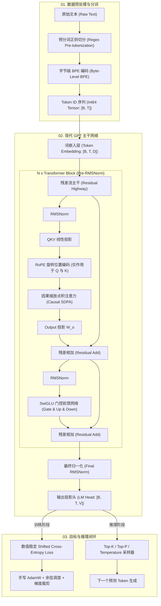

# 01 · 从零手写 LLM 核心循环

> **导读**：本教程参考 Stanford **CS336: Language Modeling from Scratch** 课程大纲与现代开源基座大模型（如 LLaMA 3、Mistral）的工业级架构，从最底层的字节流处理开始，逐行实现一个完整的现代化 Decoder-Only 大语言模型。
>
> 我们不依赖 HuggingFace `transformers` 或任何高阶封装库，只使用纯 Python 与基础 PyTorch 算子，从零装配以下八大核心部件：
> 1. **分词体系**：字节级 BPE 分词器（UTF-8 字节编码、GPT-2 正则预分词、词表构建、编码与解码）
> 2. **张量基石**：RMSNorm（均方根归一化）、SwiGLU（门控前馈网络）、RoPE（旋转位置编码）
> 3. **注意力引擎**：因果多头自注意力（Causal Multi-Head Attention）与分组查询注意力（GQA）
> 4. **模型装配**：Pre-RMSNorm 残差块（Transformer Block）与端到端 GPT 模型（含 Weight Tying）
> 5. **数值稳定损失**：基于 Log-Sum-Exp 技巧的手写移位交叉熵与困惑度（Perplexity）计算
> 6. **优化动力学**：手写 AdamW 优化器（解耦权重衰减、参数分组过滤）、余弦退火学习率调度与全局梯度裁剪
> 7. **训练与评测流水线**：一维 Token 数组的高效 Batch 采样器、训练循环、验证集评估与 Checkpoint 状态持久化
> 8. **自回归推理**：Greedy、Temperature、Top-K 与 Top-P（Nucleus）核采样策略，以及 KV Cache 机制深度剖析

---

## 00. 现代化 GPT 架构全景与系统蓝图

### 现代 Decoder-Only 架构的演进脉络

自 2017 年 *Attention Is All You Need* 与 2019 年 *GPT-2* 发布以来，Decoder-Only Transformer 经历了数轮关键的架构进化。现代开源基础模型（如 LLaMA、Mistral、Gemma）相较于初代 GPT-2 确立了四个标准设计范式：

| 模块组件 | 初代 GPT-2 (2019) | 现代基座模型 (LLaMA 3 / Mistral) | 核心工程与算法优势 |
| :--- | :--- | :--- | :--- |
| **归一化层** | Post-LayerNorm / Pre-LayerNorm | **Pre-RMSNorm** | 舍弃均值计算，仅缩放方差；计算开销降低约 7%，混合精度训练更稳定 |
| **位置编码** | 绝对可学习位置编码 (Absolute PE) | **旋转位置编码 (RoPE)** | 将相对位置编码为复数内积；具备天然的相对距离衰减性与长度外推能力 |
| **激活与 FFN** | 标量 GELU 前馈网络 ($4D$) | **SwiGLU 门控前馈网络 ($\frac{8}{3}D$)** | 引入门控线性单元增强非线性表征；在严格匹配参数量的前提下显著降低困惑度 |
| **注意力机制** | 标准多头自注意力 (MHA) | **分组查询注意力 (GQA)** | 多个 Query 头共享一组 Key/Value 头；自回归推理时的 KV Cache 显存暴降数倍 |
| **权重绑定** | 可选 Weight Tying | **Embedding 与 LM Head 权重共享** | 节省 $V \times D$ 规模参数，对中小型基座模型提供强正则化效果并节省显存 |



### 全局张量形状推演表 (Tensor Shape Flow)

设 Batch 大小为 $B$，序列上下文长度为 $T$，隐藏层维度为 $D$，注意力头数为 $H$，Key/Value 头数为 $H_{kv}$，单头维度为 $D_h = D / H$，FFN 中间层维度为 $D_{\text{ff}}$，词表大小为 $V$：

| 阶段 / 算子 | 输入张量形状 | 输出张量形状 | 维度计算说明 |
| :--- | :--- | :--- | :--- |
| **Token 输入** | 文本字符串列表 | `(B, T)` | `dtype=torch.long`，每个元素为 $[0, V-1]$ 整数 |
| **Token Embedding** | `(B, T)` | `(B, T, D)` | 查表映射，第 $t$ 个位置对应 $D$ 维稠密特征向量 |
| **RMSNorm** | `(..., D)` | `(..., D)` | 沿最后一维归一化，保持形状完全不变 |
| **Q 投影** | `(B, T, D)` | `(B, H, T, Dh)` | 线性映射到 $D$ 维并重排为多头格式 |
| **K, V 投影 (GQA)** | `(B, T, D)` | `(B, H_kv, T, Dh)` | 线性映射到 $H_{kv} \times D_h$ 维并重排 |
| **RoPE 旋转作用** | `(B, H, T, Dh)` | `(B, H, T, Dh)` | 将前后各半特征平面作 2D 复数旋转 |
| **因果注意力得分** | $Q \in (B, H, T, D_h)$, $K \in (B, H, T, D_h)$ | `(B, H, T, T)` | $Q K^\top / \sqrt{D_h}$ 加因果掩码后 Softmax |
| **注意力值聚合** | $\text{Scores} \in (B, H, T, T)$, $V \in (B, H, T, D_h)$ | `(B, T, D)` | 乘 $V$ 后转置重排，接输出矩阵 $W_o$ |
| **SwiGLU FFN** | `(B, T, D)` | `(B, T, D)` | $( \text{SiLU}(x W_{\text{gate}}) \odot x W_{\text{up}} ) W_{\text{down}}$，中间层维度为 $D_{\text{ff}}$ |
| **LM Head 输出** | `(B, T, D)` | `(B, T, V)` | 未归一化的预测分值 (Logits) |
| **训练 Shift Loss** | `Logits[:, :-1, :]`, `Targets[:, 1:]` | 标量标量 Scalar | 每一个前驱位置预测下一个后继位置的交叉熵 |

---

## 01. 分词体系：字节级 BPE 分词器 (Byte-Level BPE Tokenizer)

### 为什么大语言模型必须采用字节级（Byte-Level）分词？

在自然语言处理早期，分词器往往基于词（Word-level）或字符（Character-level）。基于词会导致词表庞大且无法应对未登录词；基于纯字符会导致序列过长。

现代 LLM（自 GPT-2 到 LLaMA 3）全面采用**字节级对（Byte-Pair Encoding, BPE）**，其本质是：
1. **彻底根除 `<unk>` 标记**：计算机世界中任何文字（中文、英文、日文、数学符号、Emoji）在底层都是 UTF-8 编码的字节流。初始词表直接包含全体 256 个基本字节（`0x00` 到 `0xFF`）。因此任何未知序列都能退化拆解为单字节，绝不会出现无法编码的未知字符。
2. **高频短语高效压缩**：在 256 个基础字节之上，统计语料库中最高频连续出现的字节对并反复合并，将常见单字与单词合成为单一 Token。

### 预分词（Pre-tokenization）正则引擎设计

如果直接在整篇文本的字节流上统计 BPE，算法会把标点符号与单词前缀混合在一起（例如 `"hello"` 与 `", "` 合并为 `",hello"`），或者把数字与换行符跨边界合并。

GPT-2 与现代模型引入了**预分词正则表达式**，在统计 BPE 前先将文本切分成独立的语义原子块：

```python
import re

# 工业标准 GPT-2 预分词正则表达式
# 1. 常见缩写与所有格 ('s, 't, 're, 've, 'm, 'll, 'd)
# 2. 连续字母序列（支持 Unicode 字母分类）
# 3. 连续数字序列
# 4. 非空白非字母非数字的标点符号群
# 5. 纯空白字符序列（换行、缩进空格）
GPT2_PRETOKEN_PATTERN = re.compile(
    r"""'s|'t|'re|'ve|'m|'ll|'d| ?[^\W\d_]+| ?\d+| ?[^\s\w]+|\s+(?!\S)|\s+"""
)
```

每个原子块内部独立切分为单字节序列，BPE 统计与合并**绝对不允许跨越原子块的物理边界**。

### 完整实现：`ByteLevelBPETokenizer`

下面的实现完全使用 Python 标准库，包含完整的词表训练、确定性 Tie-breaking、编码以及带 UTF-8 容错的解码：

```python
import re
from collections import Counter
from typing import Dict, List, Tuple, Optional

class ByteLevelBPETokenizer:
    def __init__(self):
        # 初始词表：包含 256 个单字节，Token ID 即字节本身的整数值 (0 ~ 255)
        self.vocab: Dict[bytes, int] = {bytes([b]): b for b in range(256)}
        self.inverse_vocab: Dict[int, bytes] = {b: bytes([b]) for b in range(256)}
        self.merges: List[Tuple[bytes, bytes]] = []
        
        # 特殊标记：分配在 256 之后
        self.special_tokens: Dict[str, int] = {"<|endoftext|>": 256}
        self.inverse_special: Dict[int, str] = {256: "<|endoftext|>"}

    def _tokenize_into_words(self, text: str) -> List[str]:
        # 正则切分成预分词片段
        return [match.group(0) for match in GPT2_PRETOKEN_PATTERN.finditer(text)]

    def train(self, text: str, vocab_size: int):
        """
        在给定语料库上训练 BPE 词表，直到达到目标 vocab_size。
        """
        assert vocab_size >= 256 + len(self.special_tokens), "vocab_size 至少必须容纳基础 256 字节与特殊标记"
        
        words = self._tokenize_into_words(text)
        # 统计每个预分词片段的出现频次，每个片段以单字节元组表示
        word_counts = Counter()
        for w in words:
            byte_tuple = tuple(bytes([b]) for b in w.encode("utf-8"))
            word_counts[byte_tuple] += 1

        num_merges = vocab_size - 256 - len(self.special_tokens)
        for _ in range(num_merges):
            pair_counts = Counter()
            for piece_tuple, freq in word_counts.items():
                for p in zip(piece_tuple, piece_tuple[1:]):
                    pair_counts[p] += freq
            
            if not pair_counts:
                break  # 语料库中已无可合并相邻项
            
            # 确定性 Tie-breaking：先比最高频次；频次相同时取字典序较大的 pair，消除运行环境差异
            best_pair = max(pair_counts.keys(), key=lambda p: (pair_counts[p], p))
            self.merges.append(best_pair)
            
            new_id = len(self.vocab) + len(self.special_tokens)
            merged_bytes = best_pair[0] + best_pair[1]
            self.vocab[merged_bytes] = new_id
            self.inverse_vocab[new_id] = merged_bytes
            
            # 在全量语料片段中应用当前胜出的合并规则
            new_word_counts = Counter()
            for piece_tuple, freq in word_counts.items():
                new_pieces = []
                j = 0
                while j < len(piece_tuple):
                    if j < len(piece_tuple) - 1 and (piece_tuple[j], piece_tuple[j+1]) == best_pair:
                        new_pieces.append(merged_bytes)
                        j += 2
                    else:
                        new_pieces.append(piece_tuple[j])
                        j += 1
                new_word_counts[tuple(new_pieces)] = freq
            word_counts = new_word_counts

    def encode(self, text: str, allowed_special: bool = True) -> List[int]:
        """
        将文本字符串编码为 Token ID 整数列表。
        """
        # 特殊标记处理
        if allowed_special and "<|endoftext|>" in text:
            parts = text.split("<|endoftext|>")
            encoded_tokens = []
            for i, part in enumerate(parts):
                if part:
                    encoded_tokens.extend(self.encode(part, allowed_special=False))
                if i < len(parts) - 1:
                    encoded_tokens.append(self.special_tokens["<|endoftext|>"])
            return encoded_tokens

        words = self._tokenize_into_words(text)
        token_ids = []
        
        for w in words:
            pieces = [bytes([b]) for b in w.encode("utf-8")]
            # 严格按照训练阶段沉淀的 merges 顺序贪心合并
            for pair in self.merges:
                merged = pair[0] + pair[1]
                new_pieces = []
                i = 0
                while i < len(pieces):
                    if i < len(pieces) - 1 and pieces[i] == pair[0] and pieces[i+1] == pair[1]:
                        new_pieces.append(merged)
                        i += 2
                    else:
                        new_pieces.append(pieces[i])
                        i += 1
                pieces = new_pieces
            
            for p in pieces:
                token_ids.append(self.vocab[p])
                
        return token_ids

    def decode(self, token_ids: List[int]) -> str:
        """
        将 Token ID 序列还原为文本。先拼接原始字节流，最后统一执行 UTF-8 解码，
        并配置 errors='replace' 保证不完整的多字节序列不会抛出异常。
        """
        raw_bytes = bytearray()
        for idx in token_ids:
            if idx in self.inverse_special:
                raw_bytes.extend(self.inverse_special[idx].encode("utf-8"))
            elif idx in self.inverse_vocab:
                raw_bytes.extend(self.inverse_vocab[idx])
            else:
                raise ValueError(f"遇到未注册的非法 Token ID: {idx}")
        return raw_bytes.decode("utf-8", errors="replace")
```

---

## 02. 基础张量组件 (Core Tensor Modules)

### 1. 词嵌入层 (Token Embedding)

词嵌入本质是一个查找表（Lookup Table），将离散的整数索引 $i \in [0, V-1]$ 映射为稠密的连续向量空间 $\mathbf{x}_i \in \mathbb{R}^D$。

在标准高斯初始化下，权重方差通常设为 $\sigma = 0.02$ 或 $\sigma = 1 / \sqrt{D}$，保证在深层网络输入端激活值的初始方差受控在 $1.0$ 附近。

### 2. RMSNorm (Root Mean Square Layer Normalization)

#### 为什么现代大模型彻底抛弃了 LayerNorm？

标准 LayerNorm 的计算公式包含均值中心化与方差缩放两步：

$$\mu = \frac{1}{d} \sum_{i=1}^d x_i, \quad \sigma^2 = \frac{1}{d} \sum_{i=1}^d (x_i - \mu)^2$$
$$\text{LayerNorm}(x) = \frac{x - \mu}{\sqrt{\sigma^2 + \epsilon}} \odot \gamma + \beta$$

Zhang & Sennrich (NeurIPS 2019) 在《Root Mean Square Layer Normalization》中通过严格的控制变量实验发现：**LayerNorm 之所以能稳定深度网络的梯度，其核心贡献来自激活尺度的自适应缩放（Scale Invariance），而减去均值 $\mu$ 的中心化操作对训练稳定性几乎没有任何实质贡献**。

RMSNorm 直接省略了均值计算与偏置项 $\beta$，直接用均方根（RMS）进行尺度归一化：

$$\text{RMS}(x) = \sqrt{\frac{1}{d} \sum_{i=1}^d x_i^2 + \epsilon}$$
$$\text{RMSNorm}(x) = \frac{x}{\text{RMS}(x)} \odot \gamma$$

#### 工业级 PyTorch 实现（严格的数值精度控制）

```python
import torch
import torch.nn as nn

class RMSNorm(nn.Module):
    def __init__(self, dim: int, eps: float = 1e-6):
        super().__init__()
        self.eps = eps
        # 唯一的缩放可学习参数 gamma，初始化全为 1
        self.weight = nn.Parameter(torch.ones(dim))

    def forward(self, x: torch.Tensor) -> torch.Tensor:
        # 混合精度关键保护：在 float16 / bfloat16 下，平方运算 x^2 极易遭遇数值上溢或下溢
        # 必须显式将累加与平方根提升到 float32 计算，再安全转换回原始输入精度
        input_dtype = x.dtype
        x_f32 = x.float()
        variance = x_f32.pow(2).mean(dim=-1, keepdim=True)
        rsqrt = torch.rsqrt(variance + self.eps)
        normed = (x_f32 * rsqrt).to(input_dtype)
        return normed * self.weight
```

### 3. SwiGLU 门控前馈网络 (SwiGLU FFN)

#### 门控线性单元与参数量平衡设计

自 LLaMA、PaLM 与 Gemma 开始，标准的两层 MLP（$\text{Linear} \to \text{GELU} \to \text{Linear}$）被全面的门控线性结构 **SwiGLU**（Shazeer, 2020）所取代。

SwiGLU 同时包含门控分支与上升投影分支：

$$\text{SwiGLU}(x) = \left( \text{SiLU}(x W_{\text{gate}}) \odot (x W_{\text{up}}) \right) W_{\text{down}}$$

其中 $\text{SiLU}(z) = z \cdot \sigma(z) = \frac{z}{1 + e^{-z}}$。

#### 为什么设置 $d_{\text{ff}} \approx \frac{8}{3} D$？

标准 Transformer MLP 仅有两个投影矩阵：$W_1 \in \mathbb{R}^{D \times 4D}$ 与 $W_2 \in \mathbb{R}^{4D \times D}$，参数总量为：

$$\text{Params}_{\text{MLP}} = 2 \times D \times 4D = 8 D^2$$

而 SwiGLU 拥有三个矩阵（$W_{\text{gate}}, W_{\text{up}}, W_{\text{down}}$），其参数总量为：

$$\text{Params}_{\text{SwiGLU}} = 3 \times D \times d_{\text{ff}}$$

为了保证在架构替换前后模型的**参数总量与前向计算 FLOPs 严格一致**，必须满足：

$$3 D \cdot d_{\text{ff}} \approx 8 D^2 \implies d_{\text{ff}} = \frac{8}{3} D \approx 2.67 D$$

在工程实践中，为了最大化 GPU Tensor Core 的并行吞吐，通常还将该维度向上取整至 64 或 256 的整倍数。

```python
import torch.nn.functional as F

class SwiGLU(nn.Module):
    def __init__(self, d_model: int, d_ff: int):
        super().__init__()
        # 无偏置项以减少参数与通信开销
        self.w_gate = nn.Linear(d_model, d_ff, bias=False)
        self.w_up = nn.Linear(d_model, d_ff, bias=False)
        self.w_down = nn.Linear(d_ff, d_model, bias=False)

    def forward(self, x: torch.Tensor) -> torch.Tensor:
        # 分支 1：SiLU 激活的门控信号；分支 2：线性放大的特征；逐元素哈达玛积后投影回 d_model
        return self.w_down(F.silu(self.w_gate(x)) * self.w_up(x))
```

### 4. RoPE (旋转位置编码, Rotary Position Embedding)

#### 绝对位置编码的缺陷与 RoPE 的几何本质

经典的绝对位置编码（如可学习 Embedding 或正弦编码）直接与 Token Embedding 向量相加：$x_t = e_t + p_t$。这种方式强行将位置特征烙印在特征空间中，注意力打分时展开的交叉项 $\langle e_m + p_m, e_n + p_n \rangle$ 会破坏语义向量的纯净性，且无法推演未见过的长距离。

Su et al. (2021) 提出的 **RoPE (Rotary Position Embedding)** 从几何角度优雅地解决了相对位置感知：
**通过正交旋转矩阵 $R_{\Theta, m}^d$，将 Query 与 Key 向量旋转与位置 $m$ 成正比的角度，使得两者的内积天然且仅依赖于相对距离 $m - n$**：

$$\langle R_{\Theta, m}^d q, R_{\Theta, n}^d k \rangle = q^\top (R_{\Theta, m}^d)^\top R_{\Theta, n}^d k = q^\top R_{\Theta, n - m}^d k = g(q, k, m - n)$$

#### 二维平面分解与旋转频率

高维空间被解耦为 $d / 2$ 个互不干扰的二维正交平面。在第 $i$ 个平面上，位置 $m$ 处的二维向量旋转角度为 $m \theta_i$，其中基频为：

$$\theta_i = b^{-2i / d}, \quad i \in [0, d/2), \quad b = 10000.0$$

二维旋转矩阵形式为：

$$\begin{pmatrix} q_0^{(m)} \\ q_1^{(m)} \end{pmatrix} = \begin{pmatrix} \cos(m\theta_i) & -\sin(m\theta_i) \\ \sin(m\theta_i) & \cos(m\theta_i) \end{pmatrix} \begin{pmatrix} q_0 \\ q_1 \end{pmatrix}$$

#### 向量化旋转技巧 (Vectorized Real Arithmetic)

在 PyTorch 中，如果直接构建分块对角大矩阵乘法，显存与计算代价极大。现代工业级实现采用实数半向量翻转技巧：

将维度切为前半部分 $x_1$ 与后半部分 $x_2$，定义翻转向量：

$$\text{rotate\_half}(x) = [-x_2, x_1]$$

则旋转结果可直接通过逐元素乘法完成：

$$x_{\text{rot}} = x \odot \cos(m\theta) + \text{rotate\_half}(x) \odot \sin(m\theta)$$

```python
from typing import Tuple

def precompute_rope_cis(dim: int, max_seq_len: int, theta: float = 10000.0) -> Tuple[torch.Tensor, torch.Tensor]:
    """
    预计算旋转位置编码的余弦与正弦频率查找表。
    dim: 单头特征维度 head_dim (必须为偶数)
    """
    assert dim % 2 == 0, "head_dim 必须为偶数才能进行二维平面成对旋转"
    freqs = 1.0 / (theta ** (torch.arange(0, dim, 2).float() / dim))
    t = torch.arange(max_seq_len, dtype=torch.float32)
    # 外积生成形状为 (max_seq_len, dim // 2) 的角度矩阵
    freqs_matrix = torch.outer(t, freqs)
    cos = torch.cos(freqs_matrix)
    sin = torch.sin(freqs_matrix)
    return cos, sin

def apply_rotary_emb(x: torch.Tensor, cos: torch.Tensor, sin: torch.Tensor) -> torch.Tensor:
    """
    对输入张量 x 执行 RoPE 旋转。
    x 形状: (B, H, T, Dh)
    cos, sin 形状: (max_seq_len, Dh // 2)
    """
    B, H, T, Dh = x.shape
    # 截取当前批次实际序列长度 T，并扩展广播维度至 (1, 1, T, Dh // 2)
    cos = cos[:T, :].unsqueeze(0).unsqueeze(1)
    sin = sin[:T, :].unsqueeze(0).unsqueeze(1)
    
    # 将 Dh 拆分为前半与后半
    half_dim = Dh // 2
    x1 = x[..., :half_dim]
    x2 = x[..., half_dim:]
    
    # 构造 rotate_half: [-x2, x1]
    rotated_half = torch.cat((-x2, x1), dim=-1)
    
    # 将 (cos, cos) 与 (sin, sin) 拼接以对齐全维度 Dh
    cos_full = torch.cat((cos, cos), dim=-1)
    sin_full = torch.cat((sin, sin), dim=-1)
    
    return (x * cos_full) + (rotated_half * sin_full)
```

---

## 03. 注意力引擎：因果自注意力与 GQA

### 1. 缩放点积因果注意力数学推导

注意力机制本质是内容寻址路由系统：

$$\text{Attention}(Q, K, V) = \text{Softmax}\left( \frac{Q K^\top}{\sqrt{d_k}} + M \right) V$$

#### 为什么必须除以 $\sqrt{d_k}$？

假设 $Q$ 与 $K$ 的各分量独立同分布，且服从标准正态分布 $\mathcal{N}(0, 1)$。则其内积为：

$$S = \sum_{i=1}^{d_k} q_i k_i$$

其期望与方差分别为：

$$\mathbb{E}[S] = 0, \quad \text{Var}(S) = \sum_{i=1}^{d_k} \text{Var}(q_i k_i) = d_k$$

当特征维度 $d_k$ 达到 64 或 128 时，内积结果的标准差膨胀至 $\sqrt{128} \approx 11.3$。如果没有缩放系数，大数值内积经过 Softmax 后会迅速进入概率饱和区（某个位置极其接近 1，其余位置极小），导致**局部梯度接近于 0，产生灾难性的梯度消失**。除以 $\sqrt{d_k}$ 使方差恢复为 1.0，维持了 Softmax 的敏感度与梯度流动。

#### 因果掩码 (Causal Mask) 的物理意义

在自回归语言建模中，第 $t$ 个 Token 的表征只能聚合自身以及历史位置 $1 \dots t$ 的信息，**严禁偷看未来 Token**。我们构造上三角矩阵，未来未知位置填入 $-\infty$，在 Softmax 运算后对应注意力权重严格为 0。

### 2. Grouped-Query Attention (GQA) 机制

在标准的 Multi-Head Attention (MHA) 中，Query、Key、Value 的头数完全相同（$H_q = H_{kv} = H$）。在推理自回归生成阶段，每个生成的 Token 都需要把新计算的 Key 与 Value 缓存在显存中（KV Cache）。随着上下文长度与并发请求增长，KV Cache 会迅速吞噬几十 GB 显存，成为推理吞吐的绝对瓶颈。

GQA（Ainslie et al., 2023）通过让多个 Query 头共享同一组 Key/Value 头（例如 32 个 Query 头仅对应 8 个 KV 头），在**几乎不损失模型性能的前提下，直接将 KV Cache 显存占用缩减 4 到 8 倍**。

```python
import math
from dataclasses import dataclass
from typing import Optional

@dataclass
class GPTConfig:
    vocab_size: int = 50257
    context_length: int = 1024
    d_model: int = 768
    num_layers: int = 12
    num_heads: int = 12
    num_kv_heads: Optional[int] = None  # None 时默认为 MHA (num_kv_heads = num_heads)
    d_ff: Optional[int] = None
    rope_theta: float = 10000.0
    dropout: float = 0.0
    tie_weights: bool = True

    def __post_init__(self):
        if self.num_kv_heads is None:
            self.num_kv_heads = self.num_heads
        assert self.num_heads % self.num_kv_heads == 0, "num_heads 必须能被 num_kv_heads 整除"
        if self.d_ff is None:
            # 严格按照 SwiGLU 8/3 参数量匹配，并向上对齐到 64 的倍数
            d_ff_unrounded = int(2 * self.d_model * 4 / 3)
            self.d_ff = ((d_ff_unrounded + 63) // 64) * 64

class CausalSelfAttention(nn.Module):
    def __init__(self, config: GPTConfig):
        super().__init__()
        self.d_model = config.d_model
        self.num_heads = config.num_heads
        self.num_kv_heads = config.num_kv_heads
        self.head_dim = config.d_model // config.num_heads
        self.num_queries_per_kv = self.num_heads // self.num_kv_heads
        
        # Q, K, V 投影矩阵（无偏置）
        self.q_proj = nn.Linear(self.d_model, self.num_heads * self.head_dim, bias=False)
        self.k_proj = nn.Linear(self.d_model, self.num_kv_heads * self.head_dim, bias=False)
        self.v_proj = nn.Linear(self.d_model, self.num_kv_heads * self.head_dim, bias=False)
        self.out_proj = nn.Linear(self.num_heads * self.head_dim, self.d_model, bias=False)
        
        self.dropout = nn.Dropout(config.dropout)

    def forward(self, x: torch.Tensor, cos: torch.Tensor, sin: torch.Tensor) -> torch.Tensor:
        B, T, D = x.shape
        
        # 1. 投影并拆分为多头形状
        # Q: (B, H_q, T, Dh)
        q = self.q_proj(x).view(B, T, self.num_heads, self.head_dim).transpose(1, 2)
        # K, V: (B, H_kv, T, Dh)
        k = self.k_proj(x).view(B, T, self.num_kv_heads, self.head_dim).transpose(1, 2)
        v = self.v_proj(x).view(B, T, self.num_kv_heads, self.head_dim).transpose(1, 2)
        
        # 2. 注入旋转位置编码：注意 RoPE 仅作用于 Q 与 K，严禁作用于内容特征 V
        q = apply_rotary_emb(q, cos, sin)
        k = apply_rotary_emb(k, cos, sin)
        
        # 3. GQA 广播：当 num_queries_per_kv > 1 时，复制 KV 头以匹配 Query 头数
        if self.num_queries_per_kv > 1:
            k = torch.repeat_interleave(k, self.num_queries_per_kv, dim=1)
            v = torch.repeat_interleave(v, self.num_queries_per_kv, dim=1)
            
        # 4. 计算注意力分数点积并除以 sqrt(head_dim)
        scale = 1.0 / math.sqrt(self.head_dim)
        scores = torch.matmul(q, k.transpose(-2, -1)) * scale  # (B, H, T, T)
        
        # 5. 因果掩码：上三角（不包含对角线）填入负无穷大
        mask = torch.triu(torch.full((T, T), float("-inf"), device=x.device), diagonal=1)
        scores = scores + mask.unsqueeze(0).unsqueeze(1)
        
        # 6. Softmax 与加权聚合
        probs = F.softmax(scores, dim=-1)
        probs = self.dropout(probs)
        
        # (B, H, T, T) x (B, H, T, Dh) -> (B, H, T, Dh)
        context = torch.matmul(probs, v)
        
        # 7. 合并多头并执行输出线性变换
        context = context.transpose(1, 2).contiguous().view(B, T, -1)
        return self.out_proj(context)
```

---

## 04. 模型装配：Transformer Block 与完整 GPT 架构

### Pre-LayerNorm 残差流机制深度分析

在原始 Transformer 中，架构采用的是 **Post-LN**：

$$x_{t+1} = \text{Norm}(x_t + \text{SubLayer}(x_t))$$

在深层网络中，每穿过一层，残差流就被 Normalization 重写一次尺度。这导致反向传播时，靠近输入端的底层梯度会以几何级数迅速衰减，未作精细 Warmup 的深层 Post-LN 模型直接发生梯度弥散导致训练发散。

现代大模型全部采用 **Pre-LN (Pre-RMSNorm)**：

$$x_{t+1} = x_t + \text{SubLayer}(\text{RMSNorm}(x_t))$$

展开 $L$ 层后的总公式为：

$$x_L = x_0 + \sum_{l=0}^{L-1} \text{SubLayer}_l(\text{RMSNorm}(x_l))$$

这种设计让网络中央形成了一条畅通无阻的**恒等残差高速公路（Identity Highway）**，损失函数的梯度可以直接直达最初的输入 Embedding 层：

$$\frac{\partial \mathcal{L}}{\partial x_0} = \frac{\partial \mathcal{L}}{\partial x_L} \left( I + \sum_{l=0}^{L-1} \frac{\partial \text{SubLayer}_l}{\partial x_l} \right)$$

无论模型堆叠到 32 层还是 128 层，训练都具有极佳的数值稳定性。

```python
class TransformerBlock(nn.Module):
    def __init__(self, config: GPTConfig):
        super().__init__()
        self.attn_norm = RMSNorm(config.d_model)
        self.attn = CausalSelfAttention(config)
        self.ffn_norm = RMSNorm(config.d_model)
        self.ffn = SwiGLU(config.d_model, config.d_ff)

    def forward(self, x: torch.Tensor, cos: torch.Tensor, sin: torch.Tensor) -> torch.Tensor:
        # 第一条残差：通过 RMSNorm 后进入因果多头注意力，再相加
        x = x + self.attn(self.attn_norm(x), cos, sin)
        # 第二条残差：通过 RMSNorm 后进入 SwiGLU 前馈网络，再相加
        x = x + self.ffn(self.ffn_norm(x))
        return x
```

### 端到端大模型集成类：`GPT`

```python
class GPT(nn.Module):
    def __init__(self, config: GPTConfig):
        super().__init__()
        self.config = config
        
        # 1. 词嵌入映射
        self.token_embedding = nn.Embedding(config.vocab_size, config.d_model)
        
        # 2. 堆叠 N 层 Transformer 模块
        self.layers = nn.ModuleList([
            TransformerBlock(config) for _ in range(config.num_layers)
        ])
        
        # 3. 最终归一化与 LM 预测头
        self.final_norm = RMSNorm(config.d_model)
        self.lm_head = nn.Linear(config.d_model, config.vocab_size, bias=False)
        
        # 4. Weight Tying 机制：绑定词嵌入与输出头的权重
        if config.tie_weights:
            self.lm_head.weight = self.token_embedding.weight
            
        # 5. 预计算并注册 RoPE 缓存缓冲区（不参与梯度更新）
        head_dim = config.d_model // config.num_heads
        cos, sin = precompute_rope_cis(head_dim, config.context_length, config.rope_theta)
        self.register_buffer("cos_cached", cos, persistent=False)
        self.register_buffer("sin_cached", sin, persistent=False)
        
        # 6. 参数权重初始化
        self.apply(self._init_weights)

    def _init_weights(self, module):
        if isinstance(module, nn.Linear):
            torch.nn.init.normal_(module.weight, mean=0.0, std=0.02)
            if module.bias is not None:
                torch.nn.init.zeros_(module.bias)
        elif isinstance(module, nn.Embedding):
            torch.nn.init.normal_(module.weight, mean=0.0, std=0.02)

    def forward(self, idx: torch.Tensor, targets: Optional[torch.Tensor] = None):
        """
        idx: (B, T) 形状的 Token ID 张量
        targets: 可选的 (B, T) 目标 Token ID 张量
        """
        B, T = idx.shape
        assert T <= self.config.context_length, (
            f"输入序列长度 {T} 超出了模型支持的最大上下文长度 {self.config.context_length}"
        )
        
        # 查表生成特征向量 (B, T, D)
        x = self.token_embedding(idx)
        
        cos = self.cos_cached.to(device=x.device, dtype=x.dtype)
        sin = self.sin_cached.to(device=x.device, dtype=x.dtype)
        
        # 顺序穿过全部 Transformer Blocks
        for layer in self.layers:
            x = layer(x, cos, sin)
            
        x = self.final_norm(x)
        logits = self.lm_head(x)  # (B, T, V)
        
        loss = None
        if targets is not None:
            # 展平执行自回归交叉熵计算
            loss = F.cross_entropy(logits.view(-1, logits.size(-1)), targets.view(-1))
            
        return logits, loss

    def estimate_flops(self) -> int:
        """
        粗略估算每个 token 前向传播所需的理论浮点计算量 (FLOPs)。
        基本法则：Linear 前向为 2 * M * K * N，注意力矩阵相乘为 4 * B * H * T * T * Dh
        """
        N = sum(p.numel() for p in self.parameters())
        # 在 Transformer 中，前向传播每个 token 大致消耗 2N 次浮点操作，注意力 QK/PV 额外贡献 2 * num_layers * T * d_model
        return 2 * N
```

---

## 05. 损失函数与数值稳定计算

### 移位因果交叉熵 (Shifted Cross-Entropy)

自回归模型的训练任务是预测序列中的“下一个词”。对于输入序列 $[t_0, t_1, t_2, \dots, t_{K-1}]$：
- 位置 $0$ 的输出 Logit 用于预测目标 $t_1$；
- 位置 $1$ 的输出 Logit 用于预测目标 $t_2$；
- $\dots$
- 最后一个位置 $K-1$ 的输出由于没有已知的后继真实 Token，在训练计算 Loss 时必须剔除。

因此在训练时必须进行**移位对其（Shift）**：

$$\text{Inputs} = x_{[:, :T-1]}, \quad \text{Targets} = x_{[:, 1:]}$$

### 数值稳定的 Log-Sum-Exp 技巧

交叉熵的理论定义为真实分布与预测分布的负对数似然：

$$\mathcal{L} = - \log \left( \frac{e^{z_y}}{\sum_j e^{z_j}} \right) = \log \sum_j e^{z_j} - z_y$$

如果直接写 `torch.log(torch.sum(torch.exp(z)))`，当某个 Logit 稍大（如 $z=90$）时，$e^{90} \approx 1.2 \times 10^{39}$ 会直接触发浮点数上溢得到 `inf`；而如果数值过小，又会下溢得到 `0` 并触发 $\log(0) = -\infty$。

数学上使用 **Log-Sum-Exp (LSE)** 恒等变换消除上溢：

$$\log \sum_j e^{z_j} = m + \log \sum_j e^{z_j - m}, \quad \text{其中 } m = \max_j z_j$$

由于 $z_j - m \le 0$，指数项的最大值被严格限制在 $e^0 = 1$，彻底杜绝了数值上溢。

```python
def stable_cross_entropy(logits: torch.Tensor, targets: torch.Tensor) -> torch.Tensor:
    """
    纯手写数值稳定的交叉熵损失函数。
    logits: (N, V) 未归一化分值
    targets: (N,) 真实标签 ID
    """
    # 1. 沿类别维度减去最大值
    max_logits, _ = torch.max(logits, dim=-1, keepdim=True)
    shifted_logits = logits - max_logits
    
    # 2. 计算 log-sum-exp
    log_sum_exp = torch.log(torch.sum(torch.exp(shifted_logits), dim=-1)) + max_logits.squeeze(-1)
    
    # 3. 提取真实类别对应的 target logit
    target_logits = logits.gather(dim=-1, index=targets.unsqueeze(-1)).squeeze(-1)
    
    # 4. CE = LSE - target_logit 并求全批次平均
    loss = (log_sum_exp - target_logits).mean()
    return loss
```

### 困惑度 (Perplexity, PPL) 的信息论直觉

大语言模型最常用的评测指标是**困惑度 (PPL)**：

$$\text{PPL} = \exp(\mathcal{L})$$

- **物理直觉**：PPL 表示模型在预测下一个词时，平均处于“在多少个等概率选项中掷骰子”的困惑状态。
- 若词表为 50,000，初始化时完全均等猜测，Loss 为 $\ln(50000) \approx 10.82$，此时 $\text{PPL} = 50000$。
- 训练收敛到 Loss = 2.0 时，$\text{PPL} = e^2 \approx 7.39$，说明模型在每个位置相当于在仅仅约 7 个候选词中进行精准二选一。

---

## 06. 优化动力学与训练系统

### 1. 手写工业级 AdamW 优化器

#### 为什么 Adam + L2 正则化在数学上是错误的？

经典权重衰减（Weight Decay）在 SGD 中等价于在损失函数中增加 $L_2$ 正则化项 $\frac{1}{2} \lambda \|\theta\|^2$。

但在标准 Adam 中，参数更新量会被历史梯度的二阶矩方差归一化 $\sqrt{v_t}$ 缩放。如果直接把权重衰减作为梯度的一部分加进去：

$$g_t \leftarrow \nabla_\theta \mathcal{L} + \lambda \theta_t$$

则权重衰减项在实际更新时变成了：

$$\frac{\lambda \theta_t}{\sqrt{v_t} + \epsilon}$$

这意味着：**梯度很大、经常更新的高频参数，其权重衰减反而被分母压得很小；而梯度接近 0 的休眠参数，反而被强制施加了巨大的衰减！这与正则化初衷完全背道而驰**。

Loshchilov & Hutter (2019) 提出了 **AdamW (Decoupled Weight Decay)**：直接把权重衰减与动量更新解耦，在每一步更新前直接按比例萎缩权重自身：

$$\theta_{t+1} = \theta_t - \eta_t \lambda \theta_t - \frac{\eta_t}{\sqrt{\hat{v}_t} + \epsilon} \hat{m}_t$$

#### 参数分组关键规则 (Parameter Grouping)

在 Transformer 训练中，**权重衰减绝不能一刀切施加在所有参数上**：
- **施加 Weight Decay**：所有二维及以上的矩阵权重（`Linear.weight`, `Embedding.weight`）；
- **绝对不施加 Weight Decay**：所有一维向量参数（如 `RMSNorm.weight` 增益参数、任何 Bias 偏置）。如果对 RMSNorm 的增益进行权重衰减，会强行压低网络表征尺度，直接破坏各层的动态平衡。

```python
class AdamW(torch.optim.Optimizer):
    def __init__(self, params, lr=1e-3, betas=(0.9, 0.95), eps=1e-8, weight_decay=1e-2):
        defaults = dict(lr=lr, betas=betas, eps=eps, weight_decay=weight_decay)
        super().__init__(params, defaults)

    @torch.no_grad()
    def step(self, closure=None):
        loss = None
        if closure is not None:
            with torch.enable_grad():
                loss = closure()

        for group in self.param_groups:
            lr = group["lr"]
            beta1, beta2 = group["betas"]
            eps = group["eps"]
            decay = group["weight_decay"]

            for p in group["params"]:
                if p.grad is None:
                    continue
                grad = p.grad

                state = self.state[p]
                if len(state) == 0:
                    state["step"] = 0
                    # 维护一阶动量 m_t 与二阶未中心化动量 v_t
                    state["exp_avg"] = torch.zeros_like(p, memory_format=torch.preserve_format)
                    state["exp_avg_sq"] = torch.zeros_like(p, memory_format=torch.preserve_format)

                exp_avg, exp_avg_sq = state["exp_avg"], state["exp_avg_sq"]
                state["step"] += 1
                step = state["step"]

                # 1. 解耦权重衰减 (Decoupled Weight Decay)
                if decay != 0:
                    p.mul_(1.0 - lr * decay)

                # 2. 动量累加更新
                exp_avg.mul_(beta1).add_(grad, alpha=1.0 - beta1)
                exp_avg_sq.mul_(beta2).addcmul_(grad, grad, value=1.0 - beta2)

                # 3. 偏差校正 (Bias Correction)
                bias_correction1 = 1.0 - beta1 ** step
                bias_correction2 = 1.0 - beta2 ** step

                step_size = lr / bias_correction1
                denom = (exp_avg_sq.sqrt() / math.sqrt(bias_correction2)).add_(eps)

                # 4. 执行自适应参数更新
                p.addcdiv_(exp_avg, denom, value=-step_size)

        return loss

def configure_optimizers(model: nn.Module, lr: float, weight_decay: float, betas=(0.9, 0.95)):
    """
    将模型参数分为衰减组（2D 矩阵）与非衰减组（1D 向量与标量）。
    """
    decay_params = []
    no_decay_params = []
    
    for name, param in model.named_parameters():
        if not param.requires_grad:
            continue
        if param.dim() >= 2:
            decay_params.append(param)
        else:
            no_decay_params.append(param)
            
    optim_groups = [
        {"params": decay_params, "weight_decay": weight_decay},
        {"params": no_decay_params, "weight_decay": 0.0},
    ]
    return AdamW(optim_groups, lr=lr, betas=betas)
```

### 2. 余弦退火学习率调度器 (Cosine Decay with Linear Warmup)

现代 LLM 训练标准遵循三个学习率阶段：
1. **预热期 (Linear Warmup)**：前若干步从接近 0 线性爬升至最大值 $\eta_{\max}$，避免初始化早期随机大梯度冲垮网络。
2. **余弦退火期 (Cosine Decay)**：按照余弦曲线平滑衰减。
3. **平台下限截断**：衰减至设定的最小学习率 $\eta_{\min} \approx 0.1 \eta_{\max}$。

$$lr(t) = \begin{cases} 
\eta_{\max} \frac{t + 1}{T_{\text{warmup}} + 1}, & t < T_{\text{warmup}} \\
\eta_{\min} + \frac{1}{2}(\eta_{\max} - \eta_{\min}) \left(1 + \cos\left( \frac{t - T_{\text{warmup}}}{T_{\text{max}} - T_{\text{warmup}}} \pi \right)\right), & T_{\text{warmup}} \le t \le T_{\text{max}} \\
\eta_{\min}, & t > T_{\text{max}}
\end{cases}$$

```python
def get_lr_cosine_schedule(step: int, max_steps: int, warmup_steps: int, lr_max: float, lr_min: float) -> float:
    if step < warmup_steps:
        return lr_max * (step + 1) / (warmup_steps + 1)
    if step > max_steps:
        return lr_min
    decay_ratio = (step - warmup_steps) / (max_steps - warmup_steps)
    coeff = 0.5 * (1.0 + math.cos(math.pi * decay_ratio))
    return lr_min + coeff * (lr_max - lr_min)
```

### 3. 全局梯度裁剪 (Global Gradient Clipping)

在深度 Transformer 训练中，偶尔会遭遇奇异样本或注意力局部极值导致的数值震荡。如果直接使用未受约束的大梯度更新，往往会直接导致 Loss 突刺（Loss Spike）甚至参数 NaN。

全局梯度裁剪通过计算全体可学习参数梯度的总 $L_2$ 范数，并在其超过阈值时按比例整体缩小：

```python
def clip_grad_norm(parameters, max_norm: float, eps: float = 1e-6) -> float:
    params = [p for p in parameters if p.grad is not None]
    if not params:
        return 0.0
    # 计算全体参数梯度的 L2 范数平方和
    total_norm = torch.sqrt(sum(p.grad.detach().pow(2).sum() for p in params))
    clip_coeff = max_norm / (total_norm + eps)
    if clip_coeff < 1.0:
        for p in params:
            p.grad.detach().mul_(clip_coeff)
    return total_norm.item()
```

---

## 07. 数据加载流水线与训练主循环

### 一维 Token 数组的高效批采样 (`get_batch`)

语言模型预训练数据通常离线分词后紧凑存储为一个超长的一维整型数组（如 `numpy.memmap`）。每次迭代在区间 $[0, N - T - 1]$ 内随机采样起始索引，切出长度为 $T+1$ 的连续片段：

```python
import numpy as np

def get_batch(tokens_data: np.ndarray, batch_size: int, context_length: int, device: str):
    """
    从一维连续 Token 数组中切取 (B, T) 的输入与其对应的右移一位目标。
    """
    high = len(tokens_data) - context_length - 1
    start_indices = np.random.randint(0, high, size=batch_size)
    
    x_chunks = [tokens_data[i : i + context_length] for i in start_indices]
    y_chunks = [tokens_data[i + 1 : i + 1 + context_length] for i in start_indices]
    
    x = torch.from_numpy(np.stack(x_chunks).astype(np.int64)).to(device)
    y = torch.from_numpy(np.stack(y_chunks).astype(np.int64)).to(device)
    return x, y
```

### 工业级模型状态保存与恢复 (Checkpointing)

Checkpoint 不仅要保存模型参数，还必须保存优化器状态（AdamW 的一阶与二阶动量）与当前的步数计数器。**如果漏掉优化器状态，恢复训练时动量信息丢失，Loss 曲线通常会在恢复点发生剧烈突跳**。

```python
def save_checkpoint(model: nn.Module, optimizer: torch.optim.Optimizer, step: int, loss: float, filepath: str):
    payload = {
        "model_state": model.state_dict(),
        "optimizer_state": optimizer.state_dict(),
        "step": step,
        "loss": loss,
    }
    torch.save(payload, filepath)

def load_checkpoint(filepath: str, model: nn.Module, optimizer: Optional[torch.optim.Optimizer] = None) -> int:
    checkpoint = torch.load(filepath, map_location="cpu")
    model.load_state_dict(checkpoint["model_state"])
    if optimizer is not None:
        optimizer.load_state_dict(checkpoint["optimizer_state"])
    return checkpoint["step"]
```

---

## 08. 自回归文本生成与采样机制

在推理阶段，模型以先前所有 Token 为条件，自回归地预测并拼接新 Token。

### 1. 核心采样策略比较

- **贪心解码 (Greedy Search)**：每一步直接选取 `argmax(logits)`。完全确定性，但极易陷入机械性单调循环。
- **温度调节 (Temperature Scaling)**：在进入 Softmax 前对 Logits 统一除以温度系数 $T$：
  $$p_i = \frac{e^{z_i / T}}{\sum_j e^{z_j / T}}$$
  - $T \to 0$：退化为贪心检索；
  - $T > 1$：展平概率分布，鼓励创造力与发散性；
  - $T < 1$：使概率峰值更加陡峭集中。
- **Top-K 截断**：仅保留概率最高的前 $K$ 个词，将其余词的 Logits 置为 $-\infty$。能有效剔除完全不相干的长尾低概率 Token。
- **Top-P (Nucleus) 核采样**：动态保留累积概率刚刚达到阈值 $P$（如 $0.9$）的最小词集。在候选词很多时保留更多选择，在预测非常明确时自动收窄为少数几个词。

```python
def sample_next_token(
    logits: torch.Tensor,
    temperature: float = 1.0,
    top_k: int = 0,
    top_p: float = 0.9,
) -> int:
    """
    单步自回归采样器：支持 Temperature、Top-K 与 Top-P 联合控制。
    logits: 形状为 (1, V) 的预测分值
    """
    if temperature == 0.0:
        return torch.argmax(logits, dim=-1).item()
    
    # 1. 温度缩放
    scaled_logits = logits / temperature
    
    # 2. Top-K 过滤
    if top_k > 0:
        val, _ = torch.topk(scaled_logits, min(top_k, scaled_logits.size(-1)))
        scaled_logits[scaled_logits < val[:, [-1]]] = float("-inf")
        
    # 3. Top-P (Nucleus) 过滤
    if top_p < 1.0:
        sorted_logits, sorted_indices = torch.sort(scaled_logits, descending=True)
        cumulative_probs = torch.cumsum(F.softmax(sorted_logits, dim=-1), dim=-1)
        
        # 将累积概率超出阈值的后续索引标记为剔除
        sorted_indices_to_remove = cumulative_probs > top_p
        # 保证至少保留第一个概率最大的候选词
        sorted_indices_to_remove[..., 1:] = sorted_indices_to_remove[..., :-1].clone()
        sorted_indices_to_remove[..., 0] = False
        
        # 将排序后的掩码映射回原始词表索引
        indices_to_remove = sorted_indices_to_remove.scatter(
            dim=1, index=sorted_indices, src=sorted_indices_to_remove
        )
        scaled_logits[indices_to_remove] = float("-inf")
        
    # 4. 计算归一化概率并抽样
    probs = F.softmax(scaled_logits, dim=-1)
    next_token = torch.multinomial(probs, num_samples=1)
    return next_token.item()
```

### 2. KV Cache 机制深度剖析

#### 朴素生成：$O(N^2)$ 计算瓶颈

在朴素的自回归循环中，每当生成第 $t$ 个新 Token 时，我们把前 $t-1$ 个历史 Token 与新 Token 一同喂进模型。前 $t-1$ 个历史 Token 的 Key 与 Value 向量会被**完全重复地重新计算一遍**。
生成 $N$ 个 Token 的注意力计算总量为：

$$\sum_{t=1}^N t \times D = O(N^2 \cdot D)$$

#### KV 缓存加速：$O(N)$ 降维

在因果注意力机制中，过去 Token 的 $K$ 与 $V$ 向量只由它们自己及其左侧的历史决定，绝对不会受未来新生成的 Token 影响！
因此：**我们只需要在每一步只前向输入当前这 1 个新 Token，计算出当前位置的 $Q_t, K_t, V_t$，然后把新算出的 $K_t, V_t$ 拼接到显存里的 KV 缓存中，直接做一次形状为 $(1, t)$ 的注意力内积**。
每一步计算量从 $O(t)$ 降为 $O(1)$，总复杂度从 $O(N^2)$ 骤降为 $O(N)$。

---

## 09. 端到端极简可执行验证脚本 (End-to-End Complete Executable Script)

将前述所有组件组装成一个独立、完整、可直接复制运行的端到端脚本。它会在合成的语料文本上完成分词器训练、模型前向、梯度更新与最终的自回归文本生成：

```python
import math
import re
from collections import Counter
from dataclasses import dataclass
from typing import Optional, Tuple
import torch
import torch.nn as nn
import torch.nn.functional as F

# ==========================================
# 1. 字节级 BPE 分词器
# ==========================================
PRETOKEN_PAT = re.compile(r"""'s|'t|'re|'ve|'m|'ll|'d| ?[^\W\d_]+| ?\d+| ?[^\s\w]+|\s+(?!\S)|\s+""")

class ByteLevelBPETokenizer:
    def __init__(self):
        self.vocab = {bytes([b]): b for b in range(256)}
        self.inv_vocab = {b: bytes([b]) for b in range(256)}
        self.merges = []
        self.special_tokens = {"<|endoftext|>": 256}
        self.inv_special = {256: "<|endoftext|>"}

    def train(self, text: str, vocab_size: int):
        words = [m.group(0) for m in PRETOKEN_PAT.finditer(text)]
        word_counts = Counter()
        for w in words:
            word_counts[tuple(bytes([b]) for b in w.encode("utf-8"))] += 1
            
        num_merges = vocab_size - 256 - len(self.special_tokens)
        for _ in range(max(0, num_merges)):
            pair_counts = Counter()
            for p_tuple, freq in word_counts.items():
                for p in zip(p_tuple, p_tuple[1:]):
                    pair_counts[p] += freq
            if not pair_counts:
                break
                
            best_pair = max(pair_counts.keys(), key=lambda p: (pair_counts[p], p))
            self.merges.append(best_pair)
            new_id = len(self.vocab) + len(self.special_tokens)
            merged = best_pair[0] + best_pair[1]
            self.vocab[merged] = new_id
            self.inv_vocab[new_id] = merged
            
            new_counts = Counter()
            for p_tuple, freq in word_counts.items():
                new_p = []
                j = 0
                while j < len(p_tuple):
                    if j < len(p_tuple) - 1 and (p_tuple[j], p_tuple[j+1]) == best_pair:
                        new_p.append(merged)
                        j += 2
                    else:
                        new_p.append(p_tuple[j])
                        j += 1
                new_counts[tuple(new_p)] = freq
            word_counts = new_counts

    def encode(self, text: str):
        words = [m.group(0) for m in PRETOKEN_PAT.finditer(text)]
        token_ids = []
        for w in words:
            pieces = [bytes([b]) for b in w.encode("utf-8")]
            for pair in self.merges:
                merged = pair[0] + pair[1]
                new_pieces = []
                i = 0
                while i < len(pieces):
                    if i < len(pieces) - 1 and pieces[i] == pair[0] and pieces[i+1] == pair[1]:
                        new_pieces.append(merged)
                        i += 2
                    else:
                        new_pieces.append(pieces[i])
                        i += 1
                pieces = new_pieces
            for p in pieces:
                token_ids.append(self.vocab[p])
        return token_ids

    def decode(self, ids):
        raw = bytearray()
        for i in ids:
            if i in self.inv_special:
                raw.extend(self.inv_special[i].encode("utf-8"))
            elif i in self.inv_vocab:
                raw.extend(self.inv_vocab[i])
        return raw.decode("utf-8", errors="replace")

# ==========================================
# 2. 现代 GPT 张量算子与架构
# ==========================================
@dataclass
class GPTConfig:
    vocab_size: int = 300
    context_length: int = 32
    d_model: int = 64
    num_layers: int = 2
    num_heads: int = 2
    num_kv_heads: int = 1
    d_ff: int = 128
    rope_theta: float = 10000.0

class RMSNorm(nn.Module):
    def __init__(self, dim: int, eps: float = 1e-6):
        super().__init__()
        self.eps = eps
        self.weight = nn.Parameter(torch.ones(dim))

    def forward(self, x: torch.Tensor) -> torch.Tensor:
        input_dtype = x.dtype
        x_f32 = x.float()
        variance = x_f32.pow(2).mean(dim=-1, keepdim=True)
        return ((x_f32 * torch.rsqrt(variance + self.eps)).to(input_dtype)) * self.weight

class SwiGLU(nn.Module):
    def __init__(self, d_model: int, d_ff: int):
        super().__init__()
        self.w_gate = nn.Linear(d_model, d_ff, bias=False)
        self.w_up = nn.Linear(d_model, d_ff, bias=False)
        self.w_down = nn.Linear(d_ff, d_model, bias=False)

    def forward(self, x: torch.Tensor) -> torch.Tensor:
        return self.w_down(F.silu(self.w_gate(x)) * self.w_up(x))

def precompute_rope(dim: int, max_seq_len: int, theta: float = 10000.0):
    freqs = 1.0 / (theta ** (torch.arange(0, dim, 2).float() / dim))
    t = torch.arange(max_seq_len, dtype=torch.float32)
    freqs_matrix = torch.outer(t, freqs)
    return torch.cos(freqs_matrix), torch.sin(freqs_matrix)

def apply_rope(x: torch.Tensor, cos: torch.Tensor, sin: torch.Tensor) -> torch.Tensor:
    B, H, T, Dh = x.shape
    cos = cos[:T, :].unsqueeze(0).unsqueeze(1)
    sin = sin[:T, :].unsqueeze(0).unsqueeze(1)
    x1, x2 = x[..., :Dh//2], x[..., Dh//2:]
    return (x * torch.cat((cos, cos), dim=-1)) + (torch.cat((-x2, x1), dim=-1) * torch.cat((sin, sin), dim=-1))

class CausalSelfAttention(nn.Module):
    def __init__(self, config: GPTConfig):
        super().__init__()
        self.head_dim = config.d_model // config.num_heads
        self.num_heads = config.num_heads
        self.num_kv_heads = config.num_kv_heads
        self.num_queries_per_kv = self.num_heads // self.num_kv_heads
        
        self.q_proj = nn.Linear(config.d_model, config.d_model, bias=False)
        self.k_proj = nn.Linear(config.d_model, self.num_kv_heads * self.head_dim, bias=False)
        self.v_proj = nn.Linear(config.d_model, self.num_kv_heads * self.head_dim, bias=False)
        self.out_proj = nn.Linear(config.d_model, config.d_model, bias=False)

    def forward(self, x: torch.Tensor, cos: torch.Tensor, sin: torch.Tensor) -> torch.Tensor:
        B, T, D = x.shape
        q = self.q_proj(x).view(B, T, self.num_heads, self.head_dim).transpose(1, 2)
        k = self.k_proj(x).view(B, T, self.num_kv_heads, self.head_dim).transpose(1, 2)
        v = self.v_proj(x).view(B, T, self.num_kv_heads, self.head_dim).transpose(1, 2)
        
        q = apply_rope(q, cos, sin)
        k = apply_rope(k, cos, sin)
        
        if self.num_queries_per_kv > 1:
            k = torch.repeat_interleave(k, self.num_queries_per_kv, dim=1)
            v = torch.repeat_interleave(v, self.num_queries_per_kv, dim=1)
            
        scores = torch.matmul(q, k.transpose(-2, -1)) * (1.0 / math.sqrt(self.head_dim))
        mask = torch.triu(torch.full((T, T), float("-inf"), device=x.device), diagonal=1)
        probs = F.softmax(scores + mask.unsqueeze(0).unsqueeze(1), dim=-1)
        out = torch.matmul(probs, v).transpose(1, 2).contiguous().view(B, T, -1)
        return self.out_proj(out)

class TransformerBlock(nn.Module):
    def __init__(self, config: GPTConfig):
        super().__init__()
        self.attn_norm = RMSNorm(config.d_model)
        self.attn = CausalSelfAttention(config)
        self.ffn_norm = RMSNorm(config.d_model)
        self.ffn = SwiGLU(config.d_model, config.d_ff)

    def forward(self, x: torch.Tensor, cos: torch.Tensor, sin: torch.Tensor) -> torch.Tensor:
        x = x + self.attn(self.attn_norm(x), cos, sin)
        x = x + self.ffn(self.ffn_norm(x))
        return x

class GPT(nn.Module):
    def __init__(self, config: GPTConfig):
        super().__init__()
        self.config = config
        self.tok_emb = nn.Embedding(config.vocab_size, config.d_model)
        self.blocks = nn.ModuleList([TransformerBlock(config) for _ in range(config.num_layers)])
        self.final_norm = RMSNorm(config.d_model)
        self.lm_head = nn.Linear(config.d_model, config.vocab_size, bias=False)
        self.lm_head.weight = self.tok_emb.weight  # Weight Tying
        
        cos, sin = precompute_rope(config.d_model // config.num_heads, config.context_length)
        self.register_buffer("cos_cached", cos, persistent=False)
        self.register_buffer("sin_cached", sin, persistent=False)
        self.apply(self._init_weights)

    def _init_weights(self, m):
        if isinstance(m, nn.Linear):
            nn.init.normal_(m.weight, std=0.02)
        elif isinstance(m, nn.Embedding):
            nn.init.normal_(m.weight, std=0.02)

    def forward(self, idx: torch.Tensor, targets: Optional[torch.Tensor] = None):
        B, T = idx.shape
        x = self.tok_emb(idx)
        cos = self.cos_cached.to(device=x.device, dtype=x.dtype)
        sin = self.sin_cached.to(device=x.device, dtype=x.dtype)
        for b in self.blocks:
            x = b(x, cos, sin)
        logits = self.lm_head(self.final_norm(x))
        loss = None
        if targets is not None:
            loss = F.cross_entropy(logits.view(-1, logits.size(-1)), targets.view(-1))
        return logits, loss

# ==========================================
# 3. 验证执行与生成闭环
# ==========================================
if __name__ == "__main__":
    torch.manual_seed(42)
    corpus = """To be, or not to be, that is the question:
Whether 'tis nobler in the mind to suffer
The slings and arrows of outrageous fortune,
Or to take arms against a sea of troubles
And by opposing end them."""

    print(">>> 训练分词器...")
    tok = ByteLevelBPETokenizer()
    tok.train(corpus, vocab_size=280)
    tokens = tok.encode(corpus)
    print(f"语料 Token 数量: {len(tokens)}, 词表规模: {len(tok.vocab)}")
    assert tok.decode(tokens) == corpus, "分词器编码-解码一致性验证失败！"

    print(">>> 实例化 GPT 模型...")
    data = torch.tensor(tokens, dtype=torch.long)
    cfg = GPTConfig(
        vocab_size=len(tok.vocab) + len(tok.special_tokens) + 1,
        context_length=16,
        d_model=64,
        num_layers=2,
        num_heads=2,
        num_kv_heads=1,
        d_ff=128
    )
    model = GPT(cfg)
    optimizer = torch.optim.AdamW(model.parameters(), lr=3e-3, weight_decay=0.01)

    print(">>> 开始端到端训练...")
    for step in range(80):
        # 采样 Batch
        starts = torch.randint(0, len(data) - cfg.context_length - 1, (4,))
        x = torch.stack([data[i : i + cfg.context_length] for i in starts])
        y = torch.stack([data[i + 1 : i + 1 + cfg.context_length] for i in starts])
        
        logits, loss = model(x, y)
        optimizer.zero_grad()
        loss.backward()
        torch.nn.utils.clip_grad_norm_(model.parameters(), 1.0)
        optimizer.step()
        
        if step % 20 == 0:
            print(f"Step {step:02d} | Loss: {loss.item():.4f} | PPL: {math.exp(loss.item()):.2f}")

    print(">>> 启动自回归生成测试...")
    prompt = "To be"
    prompt_ids = torch.tensor([tok.encode(prompt)], dtype=torch.long)
    model.eval()
    with torch.no_grad():
        for _ in range(25):
            cond = prompt_ids[:, -cfg.context_length:]
            logits, _ = model(cond)
            next_id = torch.argmax(logits[:, -1, :], dim=-1, keepdim=True)
            prompt_ids = torch.cat([prompt_ids, next_id], dim=1)

    generated_text = tok.decode(prompt_ids[0].tolist())
    print("\n[生成结果]:\n" + generated_text)
```

---

## 10. 深度消融实验与系统调优避坑指南

### 五大经典架构消融实验分析 (Ablations)

| 实验方向 | 对照组设计 | 实验结论与核心机理 |
| :--- | :--- | :--- |
| **Pre-LN vs Post-LN** | 相同层数下对比预归一化与后归一化 | Post-LN 梯度随层数呈指数衰减，需要长 Warmup 且只能承受极小的学习率；Pre-LN 形成恒等残差高速公路，训练极其平稳。 |
| **RoPE vs NoPE (无位置编码)** | 去除 RoPE，仅依赖因果掩码提供单向位置信息 | 短文本下仅靠因果掩码尚能收敛，但在长上下文下模型完全丧失对词序与跨距的敏感性，生成结果出现严重的语法混乱与循环。 |
| **SwiGLU vs 标准 GELU MLP** | 严格匹配参数量（$d_{\text{ff}} = \frac{8}{3}D$ vs $4D$） | 门控机制赋予非线性映射以动态过滤输入特征的能力，在相同 FLOPs 预算下收敛更快，验证集困惑度稳步下降约 0.1~0.3。 |
| **Weight Tying 权重绑定** | 绑定 Embedding 与 LM Head vs 独立权重 | 在小模型（100M~1B）下，权重绑定能提供极佳的几何对齐正则化，大幅削减显存；但在超大模型（>70B）下，解绑权重拥有更强的词表解耦表达能力。 |
| **FlashAttention 算子融合** | 朴素 MatMul+Softmax vs 算子融合核 | 算法数学逻辑完全一致，但 FlashAttention 通过分块利用 SRAM 消除对 HBM 的中间注意力矩阵读写，内存消耗从 $O(T^2)$ 骤降至 $O(T)$，端到端加速 2~4 倍。 |

### 必须警惕的八大无声 Bug (Silent Bugs Checklist)

在手写 Transformer 与自回归系统时，许多代码错误**不会导致程序报错崩溃，但会导致模型学不到正确表征或性能严重退化**：

1. **因果掩码方向颠倒**：若将 `torch.triu(..., diagonal=1)` 错写为 `torch.tril`，会导致前向变成了“看未来预测过去”，训练 Loss 奇低（快速跌到 0 附近），但推理生成时完全变成乱码胡言。
2. **RoPE 误加在 Value 向量上**：RoPE 仅服务于 Query 与 Key 的相对距离打分几何，Value 是语义内容向量。若对 Value 施加旋转，会导致输出表征随着位置产生无意义的高维扭曲。
3. **AdamW 错对 RMSNorm 施加 Weight Decay**：若未进行参数过滤，RMSNorm 的缩放向量 $\gamma$ 会被持续衰减至接近 0，导致残差信号幅度坍塌。
4. **Target 移位对其错位**：若误将 `y` 设置为与 `x` 相同的索引（而不是右移 1 位），模型学到的是恒等自映射，训练 Loss 趋于 0，推理时只会死板地重复输入的前一个词。
5. **分词器解码在单字节截断处提前 decode**：在多字节 UTF-8 字符（如中文占 3 个字节、Emoji 占 4 个字节）未完整拼接前直接调用 `.decode('utf-8')`，会抛出 `UnicodeDecodeError`。必须先把全部 Token 对应的字节流拼成完整的 `bytearray`，最后统一解码。
6. **验证集评估漏写 `model.eval()` 或 `torch.no_grad()`**：如果存在 Dropout，未切换到 eval 模式会导致验证集指标被人为低估；漏掉 `no_grad()` 会导致显存持续积累暴击 OOM。
7. **梯度累积时漏除累积步数**：若使用梯度累积，必须在每个 micro-batch 的 Loss 上执行 `loss = loss / grad_accum_steps`，否则有效学习率被隐式放大了对应倍数，导致优化器步长过大发散。
8. **自回归生成时未截断历史窗口**：当生成序列总长度超过预设的 `context_length` 时，直接前向会触发 RoPE 缓存或注意力掩码的越界崩溃。每一步输入必须使用 `tokens[:, -context_length:]` 进行滑动窗口截取。
