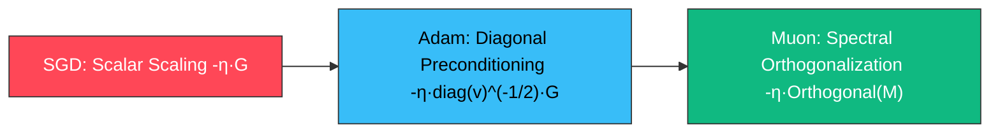

# ML Coding 10 · Modern Optimizer Panorama & Interview Guide: From SGD Momentum to Adam/AdamW & Muon

> **Overview**: Optimization algorithms serve as the physical engine of foundation model pretraining and industrial machine learning pipelines. While many practitioners treat optimizers as a one-line call to `optimizer.step()`, the underlying mathematical dynamics govern training stability, generalization, and compute efficiency in large-batch distributed pretraining, non-stationary recommender systems, and spectral matrix updates.
>
> This chapter provides an end-to-end evolutionary treatment: from **SGD**, **Momentum**, **AdaGrad**, and **RMSProp** to **Adam/AdamW** and the groundbreaking **Muon (Momentum Orthogonal Optimizer)** introduced in 2024. We dissect first and second moment dynamics, analytical bias correction, effective coordinate-wise step sizing, sparse embedding table hazards ($\epsilon$ and decay traps), and large-batch generalization collapse, concluding with production-grade PyTorch implementations and structured interview frameworks.

---

## 00. Interactive Optimization Trajectories: Dynamics in Ill-Conditioned Ravines

In deep neural networks and Transformer loss landscapes, curvature is severely anisotropic across different dimensions (the Hessian condition number $\kappa = \lambda_{\max}/\lambda_{\min} \gg 1$, forming narrow, steep-walled canyons). Distinct optimizers exhibit fundamentally divergent behavior within such ravines:

<div style="margin: 24px 0; border: 1px solid rgba(255,255,255,0.12); border-radius: 12px; overflow: hidden; background: #0b1120; font-family: ui-monospace, monospace;">
  <div style="padding: 12px 16px; border-bottom: 1px solid rgba(255,255,255,0.08); display: flex; justify-content: space-between; align-items: center; background: rgba(255,255,255,0.02);">
    <span style="font-weight: 700; font-size: 13px; color: #94a3b8; letter-spacing: 0.05em; text-transform: uppercase;">Optimization Dynamics in Ill-Conditioned Ravine</span>
    <div style="display: flex; gap: 14px; font-size: 12px;">
      <span style="color: #ff4757; display: flex; align-items: center; gap: 5px;"><span style="width: 8px; height: 8px; border-radius: 50%; background: #ff4757; display: inline-block;"></span>SGD (Oscillating)</span>
      <span style="color: #38bdf8; display: flex; align-items: center; gap: 5px;"><span style="width: 8px; height: 8px; border-radius: 50%; background: #38bdf8; display: inline-block;"></span>Adam (Diagonal Rescaling)</span>
      <span style="color: #10b981; display: flex; align-items: center; gap: 5px;"><span style="width: 8px; height: 8px; border-radius: 50%; background: #10b981; display: inline-block;"></span>Muon (Spectral Orthogonal)</span>
    </div>
  </div>
  <svg viewBox="0 0 800 360" width="100%" height="360" style="display: block;">
    <defs>
      <linearGradient id="bg-grad-10-en" x1="0%" y1="0%" x2="100%" y2="100%">
        <stop offset="0%" stop-color="#0b1120"/>
        <stop offset="100%" stop-color="#060913"/>
      </linearGradient>
      <linearGradient id="sgd-grad-10-en" x1="0%" y1="0%" x2="100%" y2="0%">
        <stop offset="0%" stop-color="#ff4757" stop-opacity="0.2"/>
        <stop offset="100%" stop-color="#ff4757"/>
      </linearGradient>
      <linearGradient id="adam-grad-10-en" x1="0%" y1="0%" x2="100%" y2="0%">
        <stop offset="0%" stop-color="#38bdf8" stop-opacity="0.2"/>
        <stop offset="100%" stop-color="#38bdf8"/>
      </linearGradient>
      <linearGradient id="muon-grad-10-en" x1="0%" y1="0%" x2="100%" y2="0%">
        <stop offset="0%" stop-color="#10b981" stop-opacity="0.2"/>
        <stop offset="100%" stop-color="#10b981"/>
      </linearGradient>
    </defs>
    <style>
      @keyframes drawSGD10En {
        0% { stroke-dashoffset: 1400; }
        100% { stroke-dashoffset: 0; }
      }
      @keyframes drawAdam10En {
        0% { stroke-dashoffset: 950; }
        100% { stroke-dashoffset: 0; }
      }
      @keyframes drawMuon10En {
        0% { stroke-dashoffset: 750; }
        100% { stroke-dashoffset: 0; }
      }
      @keyframes targetPulse10En {
        0%, 100% { r: 6; opacity: 1; }
        50% { r: 15; opacity: 0.3; }
      }
      .contour-10-en { stroke: rgba(148, 163, 184, 0.12); fill: none; stroke-width: 1.2; }
      .axis-10-en { stroke: rgba(148, 163, 184, 0.2); stroke-dasharray: 4 4; }
      .p-sgd-10-en {
        stroke: url(#sgd-grad-10-en); fill: none; stroke-width: 2.2;
        stroke-dasharray: 1400; stroke-dashoffset: 1400;
        animation: drawSGD10En 4.5s cubic-bezier(0.4, 0, 0.2, 1) infinite;
      }
      .p-adam-10-en {
        stroke: url(#adam-grad-10-en); fill: none; stroke-width: 2.6;
        stroke-dasharray: 950; stroke-dashoffset: 950;
        animation: drawAdam10En 4.5s cubic-bezier(0.25, 1, 0.5, 1) infinite;
      }
      .p-muon-10-en {
        stroke: url(#muon-grad-10-en); fill: none; stroke-width: 3.2;
        stroke-dasharray: 750; stroke-dashoffset: 750;
        animation: drawMuon10En 4.5s cubic-bezier(0.16, 1, 0.3, 1) infinite;
        filter: drop-shadow(0 0 5px rgba(16, 185, 129, 0.5));
      }
      .target-ring-10-en {
        animation: targetPulse10En 2s ease-in-out infinite;
      }
    </style>
    <rect width="800" height="360" fill="url(#bg-grad-10-en)"/>
    <!-- Contours for elongated bowl: f(x, y) = 0.5*(x^2 + 20*y^2) -->
    <ellipse cx="680" cy="180" rx="40" ry="14" class="contour-10-en" />
    <ellipse cx="680" cy="180" rx="90" ry="30" class="contour-10-en" />
    <ellipse cx="680" cy="180" rx="160" ry="52" class="contour-10-en" />
    <ellipse cx="680" cy="180" rx="250" ry="82" class="contour-10-en" />
    <ellipse cx="680" cy="180" rx="360" ry="118" class="contour-10-en" />
    <ellipse cx="680" cy="180" rx="490" ry="155" class="contour-10-en" />
    <!-- Axes -->
    <line x1="60" y1="180" x2="740" y2="180" class="axis-10-en" />
    <line x1="680" y1="20" x2="680" y2="340" class="axis-10-en" />
    <!-- Minimum marker -->
    <circle cx="680" cy="180" r="10" fill="none" stroke="#10b981" stroke-width="1.5" class="target-ring-10-en"/>
    <circle cx="680" cy="180" r="4" fill="#10b981"/>
    <text x="696" y="175" fill="#10b981" font-size="12" font-weight="700">Global Minimum θ*</text>
    <!-- Trajectories -->
    <circle cx="90" cy="55" r="5" fill="#f8fafc"/>
    <text x="75" y="40" fill="#94a3b8" font-size="11">Start θ0</text>
    <!-- SGD: severe zig-zagging in vertical dimension -->
    <path d="M 90 55 L 140 295 L 180 75 L 230 275 L 270 95 L 320 255 L 360 115 L 410 235 L 450 135 L 500 215 L 540 155 L 580 195 L 610 172" class="p-sgd-10-en" />
    <!-- Adam: suppresses y-dimension rapidly, curved path into ravine -->
    <path d="M 90 55 Q 160 205, 230 198 T 390 186 T 540 182 T 665 180" class="p-adam-10-en" />
    <!-- Muon: orthogonal matrix momentum, optimal direct trajectory -->
    <path d="M 90 55 Q 260 170, 680 180" class="p-muon-10-en" />
    <!-- Labels -->
    <text x="440" y="280" fill="#ff4757" font-size="11" font-weight="600">SGD: Severe Canyon Oscillations</text>
    <text x="330" y="165" fill="#38bdf8" font-size="11" font-weight="600">Adam: Coordinate Rescaling (1/√v)</text>
    <text x="290" y="105" fill="#10b981" font-size="11" font-weight="600">Muon: Orthogonal Spectral Step (σ ≡ 1)</text>
  </svg>
  <div style="padding: 10px 16px; background: rgba(0,0,0,0.25); border-top: 1px solid rgba(255,255,255,0.06); font-size: 11px; color: #64748b; display: flex; justify-content: space-between;">
    <span>Landscape: Ill-conditioned anisotropic quadratic bowl $f(x, y) = \frac{1}{2}(x^2 + 20y^2)$</span>
    <span>Condition Number: $\kappa = \lambda_{\max}/\lambda_{\min} = 20$</span>
  </div>
</div>

---

## 01. Foundations: From Vanilla SGD to Momentum SGD

### 1. Geometric Dilemma of Vanilla SGD

The standard stochastic gradient descent update is:

$$\theta_{t+1} = \theta_t - \eta g_t, \quad \text{where } g_t = \nabla_\theta \mathcal{L}_B(\theta_t)$$

- **Isotropic Step Assumption**: Vanilla SGD applies an identical scalar learning rate $\eta$ across all parameter coordinates.
- **Ill-Conditioned Ravine Trap**: Under local quadratic approximation $\mathcal{L}(\theta) \approx \frac{1}{2} \theta^\top H \theta$, the Hessian matrix exhibits a massive eigenvalue spread ($\kappa = \lambda_{\max} / \lambda_{\min} \gg 1$):
  - To prevent divergence along the high-curvature direction (steep canyon walls), the learning rate must be capped at $\eta < \frac{2}{\lambda_{\max}}$;
  - Along the low-curvature principal axis (flat valley floor), this tiny learning rate causes progress to crawl, resulting in aggressive cross-canyon oscillation while making negligible forward progress.

### 2. Polyak Heavy-Ball Momentum

Polyak Momentum simulates a physical point mass descending a friction-bearing slope by maintaining an exponential moving momentum buffer:

$$m_t = \beta m_{t-1} + g_t$$
$$\theta_{t+1} = \theta_t - \eta m_t$$

- **Frequency Filtering Effect**: Unrolling yields $m_t = \sum_{\tau=0}^{t-1} \beta^\tau g_{t-\tau}$.
  - Along high-frequency oscillating coordinates, alternating gradient signs cancel out;
  - Along the flat valley floor, consistent gradient signals accumulate constructively, multiplying effective forward velocity by $\frac{1}{1-\beta}$ ($\sim 10\times$ acceleration for $\beta=0.9$).

---

## 02. Deep Dive into Adam: Moments, Bias Correction & Step Sizing

Kingma & Ba (ICLR 2015) introduced **Adam (Adaptive Moment Estimation)**, unifying momentum tracking with coordinate-wise second-moment rescaling.

### 1. Physical and Statistical Interpretation of Moments

Adam maintains two running vectors:

$$m_t = \beta_1 m_{t-1} + (1 - \beta_1) g_t \quad \text{(First Moment: Directional Velocity)}$$
$$v_t = \beta_2 v_{t-1} + (1 - \beta_2) g_t^2 \quad \text{(Second Raw Moment: Energy / Variance Proxy)}$$

- **First Moment $m_t$**: Exponential moving average (EMA) of the gradient vector, capturing the principal **drift velocity**.
- **Second Raw Moment $v_t$**: Element-wise squared gradient EMA, serving as a **variance/power proxy**. Coordinates with high volatility yield large $v_t$, whereas quiescent coordinates yield $v_t \to 0$.

### 2. Analytical Derivation of Bias Correction

#### Why Bias Correction Is Mathematically Essential

At step $t=0$, momentum vectors are initialized to zero ($m_0 = \mathbf{0}, v_0 = \mathbf{0}$). During early iterations, raw EMA estimators remain heavily biased toward zero.

#### Expectation Unrolling

Unrolling the first moment recursion:

$$m_t = (1 - \beta_1) \sum_{i=1}^t \beta_1^{t-i} g_i$$

Taking expectations under local stationarity ($\mathbb{E}[g_i] \approx \mathbb{E}[g_t]$):

$$\mathbb{E}[m_t] \approx \mathbb{E}[g_t] (1 - \beta_1) \sum_{i=1}^t \beta_1^{t-i} = \mathbb{E}[g_t] (1 - \beta_1) \cdot \frac{1 - \beta_1^t}{1 - \beta_1} = \mathbb{E}[g_t] (1 - \beta_1^t)$$

Similarly for the second uncentered moment:

$$\mathbb{E}[v_t] \approx \mathbb{E}[g_t^2] (1 - \beta_2^t)$$

#### Why Second Moment Correction Is Critical

With typical default $\beta_2 = 0.999$, at iteration $t=1$:

$$1 - \beta_2^1 = 1 - 0.999 = 0.001$$

Without bias correction, $v_1$ is underestimated by a factor of **1,000**. Because $v_t$ resides in the denominator $\sqrt{v_t}$, the initial step size would be artificially amplified by $\sqrt{1000} \approx 31.6\times$, causing catastrophic parameter explosion and immediate NaNs!

Hence, the unbiased estimators are:

$$\hat{m}_t = \frac{m_t}{1 - \beta_1^t}, \quad \hat{v}_t = \frac{v_t}{1 - \beta_2^t}$$

### 3. Effective Per-Parameter Step Sizing & SignSGD Equivalence

The parameter update rule is:

$$\theta_{t+1} = \theta_t - \eta \cdot \frac{\hat{m}_t}{\sqrt{\hat{v}_t} + \epsilon}$$

#### SignSGD Equivalence in Stable Regimes

When gradient directions are consistent across recent steps ($g_1 \approx g_2 \approx \dots \approx g$):

$$\hat{m}_t \approx g, \quad \hat{v}_t \approx g^2 \implies \frac{\hat{m}_t}{\sqrt{\hat{v}_t}} \approx \frac{g}{\sqrt{g^2}} = \text{sign}(g)$$

In this regime, Adam operates as an adaptive coordinate-wise **SignSGD**:

$$\Delta \theta \approx -\eta \cdot \text{sign}(g)$$

- **Bounded Step Magnitude**: For each individual parameter, $|\Delta \theta| \lesssim \eta$, ensuring that sudden gradient spikes cannot displace parameters beyond $\eta$.
- **Scale Invariance**: Scaling the loss by constant $c$ ($\mathcal{L}' = c \mathcal{L}$) scales gradients by $c$. The factor $c$ in the numerator $m_t$ cancels against $c$ in $\sqrt{v_t}$, making Adam invariant to loss scaling.
- **Diagonal Preconditioning**: $\sqrt{v_t}$ acts as an empirical diagonal Hessian inverse approximation $\text{diag}(H^2)^{1/4} \approx H_{ii}^{1/2}$, compressing steep dimensions and expanding flat dimensions.

### 4. Typical Hyperparameter Regimes

| Hyperparameter | Classical Default (CV/NLP) | Modern LLM Pretraining (LLaMA/Mistral) | Engineering Rationale |
| :--- | :--- | :--- | :--- |
| **Learning Rate $\eta$** | $10^{-3}$ | $1.5 \times 10^{-4} \sim 3 \times 10^{-4}$ | Scaled down for deep Transformers to prevent attention logit saturation |
| **$\beta_1$** | $0.9$ | $0.9$ | Directional momentum smoothing window $\approx \frac{1}{1-\beta_1} = 10$ steps |
| **$\beta_2$** | $0.999$ | **$0.95 \sim 0.98$** | $0.999$ retains a 1,000-step historical memory. On rapidly shifting Transformer loss surfaces, smaller $\beta_2$ sheds stale curvature estimates faster |
| **$\epsilon$** | $10^{-8}$ (float32) | **$10^{-6} \sim 10^{-5}$ (bfloat16/float16)** | Must be increased in mixed precision to prevent subnormal floating point underflow to zero |

---

## 03. Fatal Industrial Pitfalls of Adam

### Pitfall 1: Hazards in Sparse Embedding Tables ($\epsilon$ and Decay Traps)

In large vocabulary embeddings (LLMs) and massive sparse entity tables (Recommender Systems):

#### 1. The $\epsilon$ Gradient Explosion

Consider a long-tail entity or rare vocabulary token unvisited for 100,000 steps. Its second moment decays to zero ($v_t \approx 0$).
When it is suddenly sampled and receives a tiny gradient $g = 10^{-4}$:

$$\Delta \theta = -\eta \cdot \frac{g}{\sqrt{0} + \epsilon} = -\eta \cdot \frac{10^{-4}}{10^{-8}} = -\eta \cdot 10^4$$

Because the denominator collapses to $\epsilon = 10^{-8}$, **the update is amplified by $10^8\times$**, blowing up the embedding vector and propagating NaNs through downstream attention Softmax layers.

- **Mitigation**: Place $\epsilon$ inside the square root ($\sqrt{v_t + \epsilon}$) with $\epsilon \ge 10^{-5}$, or employ `torch.optim.SparseAdam` to restrict updates strictly to active rows.

#### 2. The Unintended Decay Trap

Dense AdamW applies decoupled weight decay $\theta_{t+1} = \theta_t (1 - \eta \lambda)$ unconditionally across all parameters on every step. Inactive sparse embedding rows receive continuous shrinkage, decaying unvisited features to zero before they are ever trained.

---

### Pitfall 2: Large-Batch Generalization Collapse

When batch sizes scale to tens of thousands ($B \ge 32\text{k} \sim 64\text{k}$ tokens/sequences):
1. **Vanishing Stochastic Noise**: Gradient variance vanishes. Lacking stochastic noise to escape sharp saddles, Adam's $\text{sign}(g)$ updates converge into brittle, sharp local minima that degrade validation perplexity.
2. **Layer-wise Norm Disparities**: Gradient norms differ by orders of magnitude across early and late layers.
- **Mitigation**: Switch to **LAMB (Layer-wise Adaptive Moments for Batch Training)**, which modulates updates with an adaptive layer-wise Trust Ratio:

$$r_l = \frac{\|\theta_l\|_2}{\|u_l\|_2}, \quad \text{where } u_l = \frac{\hat{m}_l}{\sqrt{\hat{v}_l} + \epsilon} + \lambda \theta_l$$
$$\theta_{l, t+1} = \theta_{l, t} - \eta \cdot \phi(r_l) \cdot u_l$$

---

### Pitfall 3: Stale Memory in Non-Stationary Recommender Systems

In real-time streaming recommendation (CTR/CVR prediction), user preferences and viral content distributions drift constantly.
- **The Ghost Brake**: Adam's second-moment window $\beta_2=0.999$ enforces a 1,000-step memory. When a cold-start item suddenly trends viral, historical large $v_t$ acts as a ghost brake, suppressing learning on fresh positive clicks.
- **Industrial Solution**: Industrial CTR systems overwhelmingly favor **FTRL-Proximal (Follow-The-Regularized-Leader)** or AdaGrad, which combine coordinate-wise cumulative gradients with exact $L_1$ sparsity pruning.

---

## 04. Theoretical Leap: From Coordinate Rescaling to Muon Spectral Orthogonalization

The evolution of optimization algorithms reflects a progression in **preconditioner geometry**:

| Optimizer | Preconditioner Structure | Matrix Geometry Meaning | State Memory Footprint | Scope & Trade-offs |
| :--- | :--- | :--- | :--- | :--- |
| **SGD** | Scalar: $P = \frac{1}{\eta} I$ | **Isotropic sphere** | 0 extra states | Severe ravine oscillation |
| **Adam / AdamW** | Diagonal matrix: $P = \text{diag}(\sqrt{v})$ | **Axis-aligned ellipsoid** | $2\times$ parameter states ($m, v$) | Treats 2D weight matrices as 1D arrays |
| **Muon (2024)** | **Matrix spectral projection**: $\mathcal{O}(M) = U V^\top$ | **Isometric orthogonal transformation** | Only $1\times$ parameter state ($M$) | **Tailored for 2D hidden layer matrices**, yields $1.5\times\sim 2\times$ faster convergence |



### 1. Mathematics of Muon (Momentum Orthogonal Optimizer)

Introduced by Keller Jordan in late 2024, **Muon** targets 2D linear weight matrices ($W \in \mathbb{R}^{m \times n}$) that account for $>95\%$ of Transformer FLOPs (Attention projections, FFN gates/projections).

#### Polar Decomposition & Unit Singular Values

For any real matrix $M = U \Sigma V^\top$, its polar orthogonal factor is:

$$\mathcal{O}(M) = U V^\top$$

- **Exact Isometry**: Every singular value $\sigma_i$ of $\mathcal{O}(M)$ is **identically equal to 1.0**!
- **Uniform Energy Propagation**: Unlike Adam, which independently distorts coordinate axes, Muon ensures uniform energy flow along every orthogonal spectral direction, eliminating directional vanishing or explosion.

### 2. High-Throughput GEMMs via Quintic Newton-Schulz Iteration

Exact SVD has $O(n^3)$ cubic complexity. Muon avoids SVD entirely by using a **5-step quintic Newton-Schulz polynomial iteration**, computing polar factors purely through GEMM matrix multiplications on GPU Tensor Cores:

$$X_0 = \frac{M}{\|M\|_F + \epsilon}$$
$$A = X_k X_k^\top, \quad B = b A + c A^2, \quad X_{k+1} = a X_k + B X_k$$

with coefficients $(a, b, c) = (3.4445, -4.7750, 2.0315)$.
Finally, updates are scaled by the aspect ratio factor $\sqrt{\max(1, m/n)}$.

---

## 05. Production Implementation: Hybrid Muon + AdamW Pipeline

```python
import torch
import torch.nn as nn
from typing import List, Dict

def zeropower_via_newtonschulz5(G: torch.Tensor, steps: int = 5, eps: float = 1e-7) -> torch.Tensor:
    """
    Computes the polar orthogonal factor U * V^T using quintic Newton-Schulz iteration.
    Runs entirely via Tensor Core GEMM operations.
    """
    assert G.ndim == 2, "Muon strictly operates on 2D weight matrices"
    a, b, c = (3.4445, -4.7750, 2.0315)
    
    X = G.bfloat16() if G.dtype == torch.bfloat16 else G.float()
    X = X / (X.norm() + eps)
    
    transposed = False
    if X.size(0) > X.size(1):
        X = X.T
        transposed = True
        
    for _ in range(steps):
        A = X @ X.T
        B = b * A + c * (A @ A)
        X = a * X + B @ X
        
    if transposed:
        X = X.T
        
    return X.to(G.dtype)

class Muon(torch.optim.Optimizer):
    """
    Muon (Momentum Orthogonal Optimizer) PyTorch implementation.
    """
    def __init__(self, params, lr: float = 0.02, momentum: float = 0.95, nesterov: bool = True, ns_steps: int = 5):
        defaults = dict(lr=lr, momentum=momentum, nesterov=nesterov, ns_steps=ns_steps)
        super().__init__(params, defaults)

    @torch.no_grad()
    def step(self, closure=None):
        loss = None
        if closure is not None:
            with torch.enable_grad():
                loss = closure()

        for group in self.param_groups:
            lr = group["lr"]
            momentum = group["momentum"]
            nesterov = group["nesterov"]
            ns_steps = group["ns_steps"]

            for p in group["params"]:
                if p.grad is None:
                    continue
                g = p.grad
                state = self.state[p]

                if "momentum_buffer" not in state:
                    state["momentum_buffer"] = torch.zeros_like(g)
                    
                buf = state["momentum_buffer"]
                buf.mul_(momentum).add_(g)
                
                update_grad = g.add(buf, alpha=momentum) if nesterov else buf
                ortho_update = zeropower_via_newtonschulz5(update_grad, steps=ns_steps)
                
                scale = max(1.0, p.size(0) / p.size(1)) ** 0.5
                p.data.add_(ortho_update, alpha=-lr * scale)

        return loss

def setup_hybrid_optimizers(model: nn.Module, lr_muon: float = 0.02, lr_adam: float = 3e-4, weight_decay: float = 0.01):
    """
    Industrial hybrid assignment:
    - 2D internal linear weights -> Muon
    - 1D vectors and Embedding tables -> AdamW
    """
    muon_params: List[nn.Parameter] = []
    adam_decay_params: List[nn.Parameter] = []
    adam_no_decay_params: List[nn.Parameter] = []

    for name, p in model.named_parameters():
        if not p.requires_grad:
            continue
        if p.ndim == 2 and "token_embedding" not in name and "lm_head" not in name:
            muon_params.append(p)
        elif p.ndim >= 2:
            adam_decay_params.append(p)
        else:
            adam_no_decay_params.append(p)

    opt_muon = Muon(muon_params, lr=lr_muon, momentum=0.95)
    opt_adam = torch.optim.AdamW([
        {"params": adam_decay_params, "weight_decay": weight_decay},
        {"params": adam_no_decay_params, "weight_decay": 0.0},
    ], lr=lr_adam, betas=(0.9, 0.95))

    return opt_muon, opt_adam
```

---

## 06. Structured Interview Takeaways

### Q1: What do the first and second moments in Adam represent, and why is bias correction mandatory?
- **Core Takeaway**:
  1. **First Moment $m_t$**: EMA of gradients, representing directional velocity while dampening stochastic noise.
  2. **Second Moment $v_t$**: EMA of element-wise squared gradients, representing energy and curvature variance for diagonal preconditioning.
  3. **Bias Correction**: Due to zero-initialization, unrolling yields $\mathbb{E}[m_t] = \mathbb{E}[g_t](1 - \beta_1^t)$ and $\mathbb{E}[v_t] = \mathbb{E}[g_t^2](1 - \beta_2^t)$. For $\beta_2=0.999$, step $1$ yields $1 - \beta_2^1 = 0.001$. Without correction, $v_1$ is underestimated $1,000\times$, blowing up the initial step size by $\sqrt{1000} \approx 31.6\times$ and inducing immediate NaNs.

---

### Q2: Why does Adam degenerate toward SignSGD under consistent gradients?
- **Core Takeaway**:
  When gradient directions are stable across steps, $\hat{m}_t \approx g$ and $\hat{v}_t \approx g^2$, simplifying $\frac{\hat{m}_t}{\sqrt{\hat{v}_t}} \to \text{sign}(g)$. Each parameter moves by bounded step $|\Delta \theta| \le \eta$, providing scale invariance to loss multipliers. However, in large batches, jumping along hypercube vertices without noise risks trapping the model in sharp, poorly generalizing local minima.

---

### Q3: Why does Adam cause instability in sparse embedding tables?
- **Core Takeaway**:
  1. **$\epsilon$ Hazard**: Stale long-tail tokens have $v_t \to 0$. When updated with small gradient $g$, the step becomes $g / \epsilon = 10^8 g$, causing catastrophic parameter blowups.
  2. **Decay Hazard**: Dense AdamW applies continuous weight decay to unvisited rows on every step, decaying inactive vocabulary items to zero.
  3. **Fix**: Use `SparseAdam` to restrict moment updates and decay strictly to rows present in the active batch, and place $\epsilon$ inside the square root ($\sqrt{v_t + \epsilon}$).

---

### Q4: Why can't we simply scale up Adam's learning rate linearly in ultra-large batches?
- **Core Takeaway**:
  Large batches eliminate stochastic gradient noise, causing Adam to converge into sharp minima. Furthermore, gradient norms vary by orders of magnitude across layers. LAMB introduces a layer-wise trust ratio $r_l = \frac{\|\theta_l\|_2}{\|u_l\|_2}$ to normalize updates relative to parameter norms, enabling stable pretraining at batch sizes exceeding 64k sequences.

---

### Q5: Why do streaming recommender systems prefer FTRL over Adam?
- **Core Takeaway**:
  Streaming CTR data is non-stationary. Adam's $\beta_2 = 0.999$ creates a 1,000-step historical memory that acts as a ghost brake on sudden viral items and causes lagging oscillations when items cool down. FTRL-Proximal computes coordinate-wise cumulative bounds and applies exact $L_1$ proximal shrinkage, producing $>90\%$ sparse models tailored for low-latency production inference.

---

### Q6: Why is weight decay decoupled in AdamW, and why must 1D parameters be excluded?
- **Core Takeaway**:
  In standard Adam, $L_2$ regularization $\lambda \theta$ is scaled down by $1/\sqrt{v_t}$, penalizing frequently updated weights less than quiescent weights. AdamW decouples decay to $\theta \leftarrow \theta(1 - \eta \lambda)$. 1D scale parameters ($\gamma$ in LayerNorm/RMSNorm) must be excluded from decay because shrinking $\gamma \to 0$ collapses the residual signal amplitude in deep networks.

---

### Q7: Why does Muon outperform AdamW by $1.5\times \sim 2\times$ on 2D weight matrices?
- **Core Takeaway**:
  Adam flattens 2D matrices into 1D coordinate vectors, ignoring matrix spectral structure. Muon computes the polar orthogonal factor $\mathcal{O}(M) = U V^\top$, where all singular values are normalized to 1.0. This ensures perfectly isotropic energy transmission across all orthogonal spectral directions. Using a 5-step quintic Newton-Schulz polynomial iteration, Muon runs at near-peak Tensor Core GEMM throughput.
