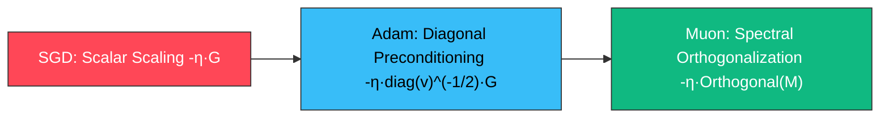

# 10 · Modern Optimizers: From SGD/AdamW to Muon

> **Overview**: Optimization algorithms serve as the physical engine of foundation model pretraining and industrial machine learning pipelines. While many practitioners treat optimizers as a one-line call to `optimizer.step()`, the underlying mathematical dynamics govern training stability, generalization, and compute efficiency in large-batch distributed pretraining, non-stationary recommender systems, and spectral matrix updates.
>
> This chapter provides an end-to-end evolutionary treatment: from **SGD**, **Momentum**, **AdaGrad**, and **RMSProp** to **Adam/AdamW** and the groundbreaking **Muon (Momentum Orthogonal Optimizer)** introduced in 2024. We dissect first and second moment dynamics, analytical bias correction, effective coordinate-wise step sizing, sparse embedding table hazards ($\epsilon$ and decay traps), and large-batch generalization collapse, concluding with production-grade PyTorch implementations and structured interview frameworks.

---

## 00. Interactive Optimization Trajectories: Dynamics in Ill-Conditioned Ravines

In deep neural networks and Transformer loss landscapes, curvature is severely anisotropic across different dimensions (the Hessian condition number $\kappa = \lambda_{\max}/\lambda_{\min} \gg 1$, forming narrow, steep-walled canyons). Distinct optimizers exhibit fundamentally divergent behavior within such ravines:

```optimizer-trajectory-demo
```

---

## 01. Foundations: From Vanilla SGD to Momentum SGD

### 1. Geometric Dilemma of Vanilla SGD

The standard stochastic gradient descent update is:

$$\theta_{t+1} = \theta_t - \eta g_t, \quad \text{where } g_t = \nabla_\theta \mathcal{L}_B(\theta_t)$$

- **Isotropic Step Assumption**: Vanilla SGD applies an identical scalar learning rate $\eta$ across all parameter coordinates.
- **Ill-Conditioned Ravine Trap**: Under local quadratic approximation $\mathcal{L}(\theta) \approx \frac{1}{2} \theta^\top H \theta$, the Hessian matrix exhibits a massive eigenvalue spread ($\kappa = \lambda_{\max} / \lambda_{\min} \gg 1$):
  - To prevent divergence along the high-curvature direction (steep canyon walls), the learning rate must be capped at $\eta < \frac{2}{\lambda_{\max}}$;
  - Along the low-curvature principal axis (flat valley floor), this tiny learning rate causes progress to crawl, resulting in aggressive cross-canyon oscillation while making negligible forward progress.

### 2. Polyak Heavy-Ball Momentum

Polyak Momentum simulates a physical point mass descending a friction-bearing slope by maintaining an exponential moving momentum buffer:

$$m_t = \beta m_{t-1} + g_t$$
$$\theta_{t+1} = \theta_t - \eta m_t$$

- **Frequency Filtering Effect**: Unrolling yields $m_t = \sum_{\tau=0}^{t-1} \beta^\tau g_{t-\tau}$.
  - Along high-frequency oscillating coordinates, alternating gradient signs cancel out;
  - Along the flat valley floor, consistent gradient signals accumulate constructively, multiplying effective forward velocity by $\frac{1}{1-\beta}$ ($\sim 10\times$ acceleration for $\beta=0.9$).

<details>
<summary><strong>Deep Derivation: Why is the Ideal Step Size 1/λᵢ? Second-Order Decoupling, Rank Deficiency & Fundamental Physical Limits</strong></summary>

### Core Mathematical Derivation: Why is the Ideal Step Size $1/\lambda_i$?

Consider the local quadratic approximation of the loss function around a local minimum $\theta^*$ (shifting coordinates so that $\theta^* = \mathbf{0}$ and $f(\theta^*) = 0$):

$$f(\theta) = \frac{1}{2} \theta^\top H \theta$$

where $H \in \mathbb{R}^{d \times d}$ is the symmetric positive definite (SPD) Hessian matrix. The gradient is $g(\theta) = \nabla f(\theta) = H \theta$.

---

#### 1. Eigendecomposition and Geometric Decoupling

By the Spectral Theorem, the real symmetric matrix $H$ admits an orthogonal eigendecomposition:

$$H = Q \Lambda Q^\top = \sum_{i=1}^d \lambda_i v_i v_i^\top$$

* $Q = [v_1, v_2, \dots, v_d]$ is the orthogonal matrix of eigenvectors ($Q^\top Q = I$), forming an orthonormal basis;
* $\Lambda = \text{diag}(\lambda_1, \dots, \lambda_d)$ contains the positive eigenvalues $\lambda_i > 0$, representing the **principal curvatures** (second directional derivatives) along each eigenvector $v_i$.

Applying the orthogonal coordinate transformation $z = Q^\top \theta$ (projecting parameters into the eigenbasis of the Hessian), the objective function completely decouples into a sum of $d$ independent 1D quadratic functions:

$$f(\theta) = \frac{1}{2} (Q z)^\top H (Q z) = \frac{1}{2} z^\top (Q^\top H Q) z = \frac{1}{2} z^\top \Lambda z = \sum_{i=1}^d \frac{1}{2} \lambda_i z_i^2$$

The gradient projected onto each eigen-axis is:

$$g_z = \nabla_z f(z) = \Lambda z \implies g_z^{(i)} = \lambda_i z_i$$

---

#### 2. Dynamics Along 1D Coordinates & Exact One-Step Cancellation

If we allow an independent step size $\eta_i$ along each eigen-direction $v_i$, the single-step gradient update is:

$$z_{t+1}^{(i)} = z_t^{(i)} - \eta_i g_z^{(i)} = z_t^{(i)} - \eta_i \lambda_i z_t^{(i)} = (1 - \eta_i \lambda_i) z_t^{(i)}$$

The per-step contraction factor is:

$$\rho_i(\eta_i) = |1 - \eta_i \lambda_i|$$

* **Instantaneous Zeroing (One-Step Convergence):**
  To annihilate the error along direction $v_i$ in a single iteration ($z_{t+1}^{(i)} = 0$), we set $1 - \eta_i \lambda_i = 0$, yielding:
  $$\eta_i^* = \frac{1}{\lambda_i}$$
  In exactly one step, the parameter reaches the exact minimum of the 1D parabolic slice along $v_i$.
* **Boundary for Stable Descent:**
  Convergence without divergence strictly requires contraction magnitude strictly less than 1:
  $$|1 - \eta_i \lambda_i| < 1 \iff -1 < 1 - \eta_i \lambda_i < 1 \iff 0 < \eta_i < \frac{2}{\lambda_i}$$

---

### Perspective from 1D Line Search

Suppose the current position is $\theta$, and we move along eigenvector $v_i$ with step length $\alpha$:

$$\phi(\alpha) = f(\theta - \alpha v_i)$$

Using Taylor's expansion (which is exact for quadratic functions):

$$\phi(\alpha) = f(\theta) - \alpha \nabla f(\theta)^\top v_i + \frac{1}{2} \alpha^2 v_i^\top H v_i$$

Noting that $H v_i = \lambda_i v_i$ and $v_i^\top v_i = 1$, the expansion simplifies to a 1D convex quadratic function of scalar $\alpha$:

$$\phi(\alpha) = f(\theta) - \alpha (\nabla f(\theta)^\top v_i) + \frac{1}{2} \alpha^2 \lambda_i$$

Setting the derivative with respect to $\alpha$ to zero:

$$\phi'(\alpha) = - (\nabla f(\theta)^\top v_i) + \alpha \lambda_i = 0 \implies \alpha^* = \frac{\nabla f(\theta)^\top v_i}{\lambda_i}$$

Formulating this as a gradient step $\Delta \theta = -\eta_i (\nabla f(\theta)^\top v_i) v_i$, the optimal scalar scaling factor is precisely:

$$\eta_i^* = \frac{1}{\lambda_i}$$

**Physical Intuition:**
* **High Curvature ($\lambda_i$ very large):** Steep canyon walls. Although the gradient is massive, the valley floor is nearby. A large step will overshoot onto the opposite cliff, requiring microscopic steps ($\eta_i \sim \frac{1}{\lambda_i} \ll 1$).
* **Low Curvature ($\lambda_i$ very small):** Flat valley plains. The gradient is tiny, but the true minimum lies far away. Without an expansive step size ($\eta_i \sim \frac{1}{\lambda_i} \gg 1$), progress along the valley crawls indefinitely.

---

### Context and Theoretical Extensions

#### 1. Geometric Essence of Newton's Method
Why does second-order Newton's method converge in a single step on quadratic functions? The Newton update is:

$$\Delta \theta_{\text{Newton}} = - H^{-1} \nabla f(\theta)$$

Expanding $H^{-1}$ in the eigenbasis $v_i$:

$$H^{-1} = Q \Lambda^{-1} Q^\top = \sum_{i=1}^d \frac{1}{\lambda_i} v_i v_i^\top$$

Substituting the gradient:

$$\Delta \theta_{\text{Newton}} = - \sum_{i=1}^d \frac{1}{\lambda_i} v_i (v_i^\top \nabla f(\theta))$$

Newton's method automatically assigns the ideal step size $\frac{1}{\lambda_i}$ across every orthogonal eigen-direction $v_i$.

#### 2. Vanilla SGD's "Isotropic Torture" and Condition Number Trap
Vanilla SGD applies a single scalar learning rate $\eta$ across all dimensions:
* The **stability ceiling** is bounded by the steepest cliff: to prevent divergence, $\eta < \frac{2}{\lambda_{\max}}$;
* Along the flat principal axis (curvature $\lambda_{\min}$), the contraction factor degrades to:
  $$1 - \eta \lambda_{\min} \approx 1 - \frac{2 \lambda_{\min}}{\lambda_{\max}} = 1 - \frac{2}{\kappa}$$
  where $\kappa = \frac{\lambda_{\max}}{\lambda_{\min}}$ is the condition number.
* When $\kappa = 10^4$, each step eliminates only $0.02\%$ of residual error, causing violent cross-canyon oscillations while forward motion stalls.

#### 3. Evolution of Modern Deep Learning Optimizers
* **Polyak Momentum:** Preserves step size, but uses the complex-conjugate root dynamics of second-order recurrences to cancel alternating cross-canyon oscillations and coherently accumulate forward velocity, accelerating contraction steps from $\mathcal{O}(\kappa)$ to $\mathcal{O}(\sqrt{\kappa})$.
* **Adam / RMSProp (Diagonal Preconditioning):** Computes coordinate-wise second moments $v_t \approx g^2$ as an empirical proxy for diagonal Hessian entries $\text{diag}(H)$, scaling coordinates by $1/\sqrt{v_t}$ to approximate $H_{ii}^{-1}$.
* **Muon (Spectral Orthogonalization):** Abandons coordinate-wise diagonal rescaling. Projects 2D matrix momentum onto the orthogonal manifold $UV^\top$ via quintic Newton-Schulz iterations, normalizing all singular values to 1.0 and reducing the matrix spectral condition number to 1.0.

---

### Four Fundamental Barriers Preventing Direct Computation of Optimal Step Sizes

High dimensionality is an insurmountable physical barrier. Even with unlimited compute, computing per-direction optimal step sizes directly is fundamentally invalid in deep learning due to non-convex geometry and stochastic training:

#### 1. Dimensionality Wall: Cubic Compute & Quadratic Memory Explosion
Assigning exact optimal step sizes $\eta_i = \frac{1}{\lambda_i}$ is mathematically equivalent to computing the Newton step $\Delta \theta = -H^{-1} g$ or full eigendecomposition of $H$.
* **Memory Explosion ($\mathcal{O}(d^2)$):**
  For a modest 7B parameter language model ($d \approx 7 \times 10^9$):
  $$H \in \mathbb{R}^{d \times d} \implies (7 \times 10^9)^2 \approx 4.9 \times 10^{19} \text{ elements}$$
  Storing this single matrix in float32 requires nearly **200 Exabytes (EB)** of VRAM. An 8x H100 node provides only 640 GB total.
* **Compute Explosion ($\mathcal{O}(d^3)$):**
  Inverting or decomposing a $d \times d$ matrix scales as $\mathcal{O}(d^3)$, requiring months of global supercomputer cluster compute for a single step.

#### 2. Stochastic Noise & "Rank Deficiency"
Deep learning relies on Mini-batch training. The true population Hessian is an expectation over the dataset:
$$H = \mathbb{E}_{x \sim \mathcal{D}} [\nabla^2 \ell(x; \theta)]$$
In practice, single-step curvature is approximated by the empirical Fisher / Gauss-Newton matrix:
$$\hat{H} = \frac{1}{B} \sum_{k=1}^B g_k g_k^\top$$
* Batch size $B \sim 10^2 \sim 10^4$ is dwarfed by parameter count $d \sim 10^7 \sim 10^{11}$ ($B \ll d$).
* A sum of $B$ rank-1 outer products has **algebraic rank at most $B$**.
* Over $99.99\%$ of the eigenvalues are strictly zero (severely singular). In this zero-curvature null space, the "ideal step size" $\frac{1}{\lambda_i} = \frac{1}{0}$ crashes into division-by-zero, rendering it mathematically undefined.

#### 3. Non-Convex Geometry: Negative Curvature & Saddle Point Traps
Quadratic models assume globally convex bowls ($H \succ 0, \lambda_i > 0$). In deep neural network loss surfaces:
* **Negative Eigenvalues ($\lambda_i < 0$):** High-dimensional loss landscapes abound with saddle points and local maxima where Hessian eigenvalues are negative.
* **Accelerating Towards Maxima:** If $\eta_i = \frac{1}{\lambda_i}$ is applied when $\lambda_i < 0$, the step sign flips:
  $$\Delta z^{(i)} = - \left(\frac{1}{\lambda_i}\right) (\lambda_i z^{(i)}) = -z^{(i)}$$
  The update shoots directly up towards the saddle ridge or local maximum rather than descending. Resolving this requires complex damping (Levenberg-Marquardt) or trust-region truncation, inflating compute costs further.

#### 4. Why 1D Line Search Also Fails in Deep Learning
If full matrix inversion is intractable, why not fix the gradient direction $p = -\nabla f(\theta)$ and perform exact 1D line search to find scalar $\eta^*$?
1. **Excessive Evaluation Overhead:** 1D line search (backtracking, bisection, quadratic interpolation) requires 3~5 loss evaluations (forward passes) per step. Forward and backward passes dominate training time; those evaluations are better spent taking multiple SGD steps.
2. **Batch Noise Invalidates Line Search:** An optimal step $\eta^*$ tuned on Mini-batch $B_t$ becomes completely invalid on the next Mini-batch $B_{t+1}$ due to data distribution shifts between random samples.

---

### Production Tradeoffs: How Modern Optimizers Bypass Physical Limits

Since exact global second-order computation is impossible, production optimization has evolved along three structured approximation paths:
* **Adam / RMSProp (Diagonal Approximation):**
  Discards all off-diagonal cross-terms ($H_{ij} = 0$), maintaining coordinate-wise second moments $v_t \approx \text{diag}(g^2)$ as per-axis curvature proxies, reducing complexity to linear $\mathcal{O}(d)$.
* **K-FAC / Shampoo (Kronecker Factored Curvature):**
  Exploits linear and convolutional tensor product structures, approximating massive layer gradients as Kronecker products $H \approx A \otimes B$. Inversion decouples into two compact matrix inverses $(A \otimes B)^{-1} = A^{-1} \otimes B^{-1}$。
* **Muon (Matrix Manifold Spectral Orthogonalization):**
  Directly applies quintic Newton-Schulz polynomial iterations to 2D weight matrices to project momentum onto the polar orthogonal group $UV^\top$. Normalizes all singular values to 1.0 via 5 rapid Tensor Core GEMM operations, eliminating intra-layer spectral ill-conditioning without computing SVDs or matrix inverses.

</details>

---

## 01B. Convergence Proofs via Telescoping Sums: Smoothness, Convex Bounds & Condition Numbers

Analyzing the formal theoretical convergence properties of first-order gradient methods and momentum variants is a hallmark of machine learning research and interview assessments. This section provides self-contained mathematical derivations using **telescoping cancellation sums**, followed by an exact eigenvalue contraction analysis of condition number $\kappa$ bottlenecks on anisotropic quadratics.

### 1. $L$-Smooth Descent Lemma & Telescoping Gradient Norm Bound ($O(1/T)$ Stationary Point)

Assume the objective $f: \mathbb{R}^d \to \mathbb{R}$ is continuously differentiable and has $L$-Lipschitz continuous gradient ($L$-smoothness):

$$\|\nabla f(x) - \nabla f(y)\| \le L \|x - y\|, \quad \forall x, y \in \mathbb{R}^d$$

#### Derivation of the Descent Lemma

By the Fundamental Theorem of Calculus along the line segment from $x$ to $y$:

$$f(y) - f(x) = \int_0^1 \langle \nabla f(x + \tau(y - x)), y - x \rangle d\tau$$

Adding and subtracting $\nabla f(x)$ inside the integral:

$$f(y) - f(x) = \langle \nabla f(x), y - x \rangle + \int_0^1 \langle \nabla f(x + \tau(y - x)) - \nabla f(x), y - x \rangle d\tau$$

Applying the Cauchy-Schwarz inequality and $L$-Lipschitz continuity:

$$|f(y) - f(x) - \langle \nabla f(x), y - x \rangle| \le \int_0^1 \|\nabla f(x + \tau(y - x)) - \nabla f(x)\| \|y - x\| d\tau$$
$$\le \int_0^1 L \tau \|y - x\|^2 d\tau = \frac{L}{2} \|y - x\|^2$$

Rearranging gives the **Descent Lemma**:

$$f(y) \le f(x) + \langle \nabla f(x), y - x \rangle + \frac{L}{2} \|y - x\|^2$$

#### Sufficient Descent Per Step

Substituting the gradient descent step $\theta_{t+1} = \theta_t - \eta \nabla f(\theta_t)$ (with $x = \theta_t, y = \theta_{t+1}, y - x = -\eta \nabla f(\theta_t)$):

$$f(\theta_{t+1}) \le f(\theta_t) - \eta \|\nabla f(\theta_t)\|^2 + \frac{L \eta^2}{2} \|\nabla f(\theta_t)\|^2 = f(\theta_t) - \eta \left(1 - \frac{L\eta}{2}\right) \|\nabla f(\theta_t)\|^2$$

Choosing step size $\eta \le \frac{1}{L}$ (with optimal choice $\eta = \frac{1}{L}$):

$$f(\theta_{t+1}) \le f(\theta_t) - \frac{1}{2L} \|\nabla f(\theta_t)\|^2 \iff \|\nabla f(\theta_t)\|^2 \le 2L [f(\theta_t) - f(\theta_{t+1})]$$

#### Telescoping Cancellation Sum

Summing over iterations $t = 0, 1, \dots, T-1$:

$$\sum_{t=0}^{T-1} \|\nabla f(\theta_t)\|^2 \le 2L \sum_{t=0}^{T-1} [f(\theta_t) - f(\theta_{t+1})]$$

Expanding the right-hand sum reveals an exact **telescoping cancellation**:

$$\sum_{t=0}^{T-1} [f(\theta_t) - f(\theta_{t+1})] = [f(\theta_0) - f(\theta_1)] + [f(\theta_1) - f(\theta_2)] + \dots + [f(\theta_{T-1}) - f(\theta_T)] = f(\theta_0) - f(\theta_T)$$

Since $f$ is bounded below by $f^*$ ($f(\theta_T) \ge f^*$):

$$\sum_{t=0}^{T-1} \|\nabla f(\theta_t)\|^2 \le 2L [f(\theta_0) - f^*]$$

Dividing by $T$ and bounding the minimum squared gradient norm:

$$\min_{0 \le t < T} \|\nabla f(\theta_t)\|^2 \le \frac{1}{T} \sum_{t=0}^{T-1} \|\nabla f(\theta_t)\|^2 \le \frac{2L (f(\theta_0) - f^*)}{T} = O\left(\frac{1}{T}\right)$$

> **Core Takeaway**: For any $L$-smooth function (even non-convex neural networks), gradient descent with constant step size guarantees that squared gradient norms converge at an $O(1/T)$ rate, requiring at most $T = O(1/\epsilon^2)$ steps to find an $\epsilon$-stationary point ($\|\nabla f(\theta)\| \le \epsilon$).

---

### 2. Convex Distance Potential Telescoping & SGD $O(1/\sqrt{T})$ Minimax Bound

Under convexity, constructing an Euclidean distance Lyapunov potential $\Phi_t = \frac{1}{2} \|\theta_t - \theta^*\|^2$ yields an $O(1/\sqrt{T})$ convergence rate for the objective gap $f(\theta) - f^*$.

#### Potential Expansion

Assume $f$ is convex with bounded gradients (or subgradients) $\|g_t\| \le G$. Expanding the squared distance to optimum $\theta^*$:

$$\|\theta_{t+1} - \theta^*\|^2 = \|\theta_t - \eta g_t - \theta^*\|^2 = \|\theta_t - \theta^*\|^2 - 2\eta \langle g_t, \theta_t - \theta^* \rangle + \eta^2 \|g_t\|^2$$

By the first-order convexity inequality $\langle g_t, \theta_t - \theta^* \rangle \ge f(\theta_t) - f^*$:

$$\|\theta_{t+1} - \theta^*\|^2 \le \|\theta_t - \theta^*\|^2 - 2\eta (f(\theta_t) - f^*) + \eta^2 G^2$$

Rearranging for the suboptimality gap:

$$f(\theta_t) - f^* \le \frac{1}{2\eta} \left( \|\theta_t - \theta^*\|^2 - \|\theta_{t+1} - \theta^*\|^2 \right) + \frac{\eta}{2} G^2$$

#### Telescoping Cancellation Sum

Summing from $t = 0$ to $T-1$:

$$\sum_{t=0}^{T-1} (f(\theta_t) - f^*) \le \frac{1}{2\eta} \sum_{t=0}^{T-1} \left( \|\theta_t - \theta^*\|^2 - \|\theta_{t+1} - \theta^*\|^2 \right) + \frac{\eta}{2} \sum_{t=0}^{T-1} G^2$$

The intermediate squared distance terms telescope to the endpoints:

$$\sum_{t=0}^{T-1} \left( \|\theta_t - \theta^*\|^2 - \|\theta_{t+1} - \theta^*\|^2 \right) = \|\theta_0 - \theta^*\|^2 - \|\theta_T - \theta^*\|^2 \le \|\theta_0 - \theta^*\|^2$$

Letting $R = \|\theta_0 - \theta^*\|$:

$$\sum_{t=0}^{T-1} (f(\theta_t) - f^*) \le \frac{R^2}{2\eta} + \frac{\eta T G^2}{2}$$

#### Jensen's Inequality and Optimal Step Size

Defining the ergodic average iterate $\bar{\theta}_T = \frac{1}{T} \sum_{t=0}^{T-1} \theta_t$, Jensen's inequality guarantees:

$$f(\bar{\theta}_T) - f^* \le \frac{1}{T} \sum_{t=0}^{T-1} (f(\theta_t) - f^*) \le \frac{R^2}{2\eta T} + \frac{\eta G^2}{2}$$

Minimizing this convex upper bound with respect to $\eta$ by setting the derivative to zero:

$$\frac{\partial}{\partial \eta} \left( \frac{R^2}{2\eta T} + \frac{\eta G^2}{2} \right) = -\frac{R^2}{2\eta^2 T} + \frac{G^2}{2} = 0 \implies \eta^* = \frac{R}{G \sqrt{T}}$$

Substituting $\eta^*$ back into the bound:

$$f(\bar{\theta}_T) - f^* \le \frac{R^2}{2 \left(\frac{R}{G\sqrt{T}}\right) T} + \frac{\left(\frac{R}{G\sqrt{T}}\right) G^2}{2} = \frac{R G}{\sqrt{T}} = O\left(\frac{1}{\sqrt{T}}\right)$$

> **Core Takeaway**: For stochastic first-order convex optimization, SGD achieves the information-theoretic minimax lower bound of $O(1/\sqrt{T})$, requiring $T = O(1/\epsilon^2)$ iterations to reach an $\epsilon$-optimal solution.

---

### 3. Strongly Convex Quadratics & Condition Number Contraction ($\kappa$ Bottleneck)

Near local minima in deep networks, the loss is dominated by a local quadratic form:

$$\mathcal{L}(\theta) = \frac{1}{2} \theta^\top H \theta$$

where Hessian $H \succ 0$ with eigenvalues $\mu = \lambda_{\min} \le \dots \le \lambda_{\max} = L$, yielding condition number $\kappa = \frac{L}{\mu}$.

#### Coordinate Decoupling & Contraction Factor

With $\theta^* = \mathbf{0}$, vanilla SGD updates via $\theta_{t+1} = (I - \eta H) \theta_t$. Under orthogonal eigendecomposition $H = Q \Lambda Q^\top$, coordinates decouple completely:

$$\theta_{t+1}^{(i)} = (1 - \eta \lambda_i) \theta_t^{(i)}$$

Stability requires spectral radius $< 1$ for all dimensions:

$$|1 - \eta \lambda_{\max}| < 1 \implies \eta < \frac{2}{\lambda_{\max}} = \frac{2}{L}$$

The system contraction rate is dictated by the extreme eigenvalues:

$$\rho(\eta) = \max_{\lambda \in [\mu, L]} |1 - \eta \lambda| = \max(|1 - \eta \mu|, |1 - \eta L|)$$

Equating both boundary rates yields the optimal step size:

$$1 - \eta^* \mu = \eta^* L - 1 \implies \eta^* = \frac{2}{L + \mu}$$

Substituting $\eta^*$ yields the optimal contraction factor for vanilla SGD:

$$\rho_{\text{SGD}}^* = \frac{L - \mu}{L + \mu} = \frac{\kappa - 1}{\kappa + 1} = 1 - \frac{2}{\kappa + 1} \approx 1 - \frac{2}{\kappa}$$

#### Iteration Complexity

To achieve error reduction $\|\theta_T - \theta^*\| \le \epsilon \|\theta_0 - \theta^*\|$:

$$\left(1 - \frac{2}{\kappa}\right)^T \le \epsilon \implies T \ge \frac{\kappa}{2} \ln\left(\frac{1}{\epsilon}\right) = O\left(\kappa \log \frac{1}{\epsilon}\right)$$

> **Physical Dilemma**: If $\kappa = 10,000$, $\rho^* = 0.9998$. Each step eliminates only $0.02\%$ of residual error, stalling progress along the flat canyon axis.

---

### 4. Polyak Heavy-Ball Momentum: Accelerating from $\kappa$ to $\sqrt{\kappa}$

Polyak momentum updates $m_t = \beta m_{t-1} + H \theta_t$, $\theta_{t+1} = \theta_t - \eta m_t$. Eliminating $m_t$ produces a second-order recurrence:

$$\theta_{t+1} = (1 + \beta - \eta H) \theta_t - \beta \theta_{t-1}$$

#### Augmented State Transfer Matrix & Characteristic Roots

In augmented state-space form:

$$\begin{bmatrix} \theta_{t+1} \\ \theta_t \end{bmatrix} = \begin{bmatrix} (1 + \beta)I - \eta H & -\beta I \\ I & 0 \end{bmatrix} \begin{bmatrix} \theta_t \\ \theta_{t-1} \end{bmatrix}$$

For any eigenvalue $\lambda \in [\mu, L]$, the characteristic polynomial is:

$$\det \begin{bmatrix} (1 + \beta - \eta \lambda) - \rho & -\beta \\ 1 & -\rho \end{bmatrix} = \rho^2 - (1 + \beta - \eta \lambda) \rho + \beta = 0$$

with discriminant $\Delta(\lambda) = (1 + \beta - \eta \lambda)^2 - 4\beta$.

#### Complex Conjugate Roots and Curvature-Independent Decay

When parameters enforce $\Delta(\lambda) \le 0$ across the entire spectrum $\lambda \in [\mu, L]$, the roots form a complex conjugate pair:

$$\rho_{1, 2} = \frac{(1 + \beta - \eta \lambda) \pm i \sqrt{4\beta - (1 + \beta - \eta \lambda)^2}}{2}$$

The modulus of the roots is strictly independent of $\lambda$:

$$|\rho| = \sqrt{\rho_1 \rho_2} = \sqrt{\beta}$$

> **Algebraic Miracle**: Within the complex root regime, the spectral radius of the transition matrix is **strictly decoupled from curvature $\lambda$**! All eigenspaces contract at the uniform rate $\sqrt{\beta}$.

Matching the boundary roots at $\mu$ and $L$:

$$1 + \beta - \eta \mu = 2\sqrt{\beta}, \quad 1 + \beta - \eta L = -2\sqrt{\beta}$$

Solving this system yields optimal hyperparameters:

$$\beta^* = \left( \frac{\sqrt{L} - \sqrt{\mu}}{\sqrt{L} + \sqrt{\mu}} \right)^2 = \left( \frac{\sqrt{\kappa} - 1}{\sqrt{\kappa} + 1} \right)^2$$
$$\eta^* = \frac{4}{(\sqrt{L} + \sqrt{\mu})^2}$$

#### Accelerated Contraction Rate

$$\rho_{\text{Mom}}^* = \sqrt{\beta^*} = \frac{\sqrt{\kappa} - 1}{\sqrt{\kappa} + 1} \approx 1 - \frac{2}{\sqrt{\kappa}}$$

Iteration complexity drops to:

$$T_{\text{Mom}} = O\left(\sqrt{\kappa} \log \frac{1}{\epsilon}\right)$$

| Optimizer | Contraction Factor $\rho^*$ | Contraction at $\kappa = 10,000$ | Relative Steps |
| :--- | :--- | :--- | :--- |
| **Vanilla SGD** | $\frac{\kappa - 1}{\kappa + 1} \approx 1 - \frac{2}{\kappa}$ | $0.9998$ | $O(\kappa \log(1/\epsilon)) \approx 10,000$ steps |
| **Polyak Momentum** | $\frac{\sqrt{\kappa} - 1}{\sqrt{\kappa} + 1} \approx 1 - \frac{2}{\sqrt{\kappa}}$ | $0.9802$ | $O(\sqrt{\kappa} \log(1/\epsilon)) \approx 100$ steps (**$100\times$ faster**) |

---

### 5. Coordinate Preconditioning (Adam) vs. Spectral Orthogonalization (Muon) on Rotated Manifolds

#### Diagonal Preconditioning (Adam) and Coordinate Bias

Adam approximates curvature via diagonal second moments $v_t \approx \text{diag}(g_t^2)$:

$$\Delta \theta = -P_{\text{Adam}}^{-1} g_t, \quad P_{\text{Adam}} = \text{diag}(\sqrt{v_t} + \epsilon)$$

- **Axis-Aligned Ravines**: When Hessian $H$ is diagonal, $P_{\text{Adam}} \approx \text{diag}(H)^{1/2}$ scales coordinates independently, reshaping elongated ellipses into isotropic spheres ($\kappa_{\text{eff}} \approx 1.0$).
- **Rotated Ravines (Cross-Coupling)**: When $H = R_\phi \Lambda R_\phi^\top$ has off-diagonal entries, a diagonal preconditioner cannot rotate the coordinate axes. Updates degenerate into diamond-shaped ($L_\infty$-norm) trajectories, overshooting along coupled sub-axes.

#### Muon Spectral Polar Projection and Unitary Invariance

For 2D weight matrices $W \in \mathbb{R}^{m \times n}$ dominant in Transformers, Muon computes the polar orthogonal factor of momentum:

$$\mathcal{O}(M) = U V^\top = M (M^\top M)^{-1/2}$$

- **Strict Unitary Invariance**: For any orthogonal matrices $Q_1, Q_2$, $\mathcal{O}(Q_1 M Q_2) = Q_1 \mathcal{O}(M) Q_2$. Muon's optimization geometry is coordinate-free.
- **Singular Value Equalization**: SVD unrolling $M = \sum \sigma_i u_i v_i^\top \implies \mathcal{O}(M) = \sum 1.0 \cdot u_i v_i^\top$. Every orthogonal spectral direction receives unit gain, resolving matrix ill-conditioning.

---

## 02. Deep Dive into Adam: Moments, Bias Correction & Step Sizing

Kingma & Ba (ICLR 2015) introduced **Adam (Adaptive Moment Estimation)**, unifying momentum tracking with coordinate-wise second-moment rescaling.

### 1. Physical and Statistical Interpretation of Moments

Adam maintains two running vectors:

$$m_t = \beta_1 m_{t-1} + (1 - \beta_1) g_t \quad \text{(First Moment: Directional Velocity)}$$
$$v_t = \beta_2 v_{t-1} + (1 - \beta_2) g_t^2 \quad \text{(Second Raw Moment: Energy / Variance Proxy)}$$

- **First Moment $m_t$**: Exponential moving average (EMA) of the gradient vector, capturing the principal **drift velocity**.
- **Second Raw Moment $v_t$**: Element-wise squared gradient EMA, serving as a **variance/power proxy**. Coordinates with high volatility yield large $v_t$, whereas quiescent coordinates yield $v_t \to 0$.

### 2. Analytical Derivation of Bias Correction

#### Why Bias Correction Is Mathematically Essential

At step $t=0$, momentum vectors are initialized to zero ($m_0 = \mathbf{0}, v_0 = \mathbf{0}$). During early iterations, raw EMA estimators remain heavily biased toward zero.

#### Expectation Unrolling

Unrolling the first moment recursion:

$$m_t = (1 - \beta_1) \sum_{i=1}^t \beta_1^{t-i} g_i$$

Taking expectations under local stationarity ($\mathbb{E}[g_i] \approx \mathbb{E}[g_t]$):

$$\mathbb{E}[m_t] \approx \mathbb{E}[g_t] (1 - \beta_1) \sum_{i=1}^t \beta_1^{t-i} = \mathbb{E}[g_t] (1 - \beta_1) \cdot \frac{1 - \beta_1^t}{1 - \beta_1} = \mathbb{E}[g_t] (1 - \beta_1^t)$$

Similarly for the second uncentered moment:

$$\mathbb{E}[v_t] \approx \mathbb{E}[g_t^2] (1 - \beta_2^t)$$

#### Why Second Moment Correction Is Critical

With typical default $\beta_2 = 0.999$, at iteration $t=1$:

$$1 - \beta_2^1 = 1 - 0.999 = 0.001$$

Without bias correction, $v_1$ is underestimated by a factor of **1,000**. Because $v_t$ resides in the denominator $\sqrt{v_t}$, the initial step size would be artificially amplified by $\sqrt{1000} \approx 31.6\times$, causing catastrophic parameter explosion and immediate NaNs!

Hence, the unbiased estimators are:

$$\hat{m}_t = \frac{m_t}{1 - \beta_1^t}, \quad \hat{v}_t = \frac{v_t}{1 - \beta_2^t}$$

### 3. Effective Per-Parameter Step Sizing & SignSGD Equivalence

The parameter update rule is:

$$\theta_{t+1} = \theta_t - \eta \cdot \frac{\hat{m}_t}{\sqrt{\hat{v}_t} + \epsilon}$$

#### SignSGD Equivalence in Stable Regimes

When gradient directions are consistent across recent steps ($g_1 \approx g_2 \approx \dots \approx g$):

$$\hat{m}_t \approx g, \quad \hat{v}_t \approx g^2 \implies \frac{\hat{m}_t}{\sqrt{\hat{v}_t}} \approx \frac{g}{\sqrt{g^2}} = \text{sign}(g)$$

In this regime, Adam operates as an adaptive coordinate-wise **SignSGD**:

$$\Delta \theta \approx -\eta \cdot \text{sign}(g)$$

- **Bounded Step Magnitude**: For each individual parameter, $|\Delta \theta| \lesssim \eta$, ensuring that sudden gradient spikes cannot displace parameters beyond $\eta$.
- **Scale Invariance**: Scaling the loss by constant $c$ ($\mathcal{L}' = c \mathcal{L}$) scales gradients by $c$. The factor $c$ in the numerator $m_t$ cancels against $c$ in $\sqrt{v_t}$, making Adam invariant to loss scaling.
- **Diagonal Preconditioning**: $\sqrt{v_t}$ acts as an empirical diagonal Hessian inverse approximation $\text{diag}(H^2)^{1/4} \approx H_{ii}^{1/2}$, compressing steep dimensions and expanding flat dimensions.

### 4. Typical Hyperparameter Regimes

| Hyperparameter | Classical Default (CV/NLP) | Modern LLM Pretraining (LLaMA/Mistral) | Engineering Rationale |
| :--- | :--- | :--- | :--- |
| **Learning Rate $\eta$** | $10^{-3}$ | $1.5 \times 10^{-4} \sim 3 \times 10^{-4}$ | Scaled down for deep Transformers to prevent attention logit saturation |
| **$\beta_1$** | $0.9$ | $0.9$ | Directional momentum smoothing window $\approx \frac{1}{1-\beta_1} = 10$ steps |
| **$\beta_2$** | $0.999$ | **$0.95 \sim 0.98$** | $0.999$ retains a 1,000-step historical memory. On rapidly shifting Transformer loss surfaces, smaller $\beta_2$ sheds stale curvature estimates faster |
| **$\epsilon$** | $10^{-8}$ (float32) | **$10^{-6} \sim 10^{-5}$ (bfloat16/float16)** | Must be increased in mixed precision to prevent subnormal floating point underflow to zero |

---

## 03. Fatal Industrial Pitfalls of Adam

### Pitfall 1: Hazards in Sparse Embedding Tables ($\epsilon$ and Decay Traps)

In large vocabulary embeddings (LLMs) and massive sparse entity tables (Recommender Systems):

#### 1. The $\epsilon$ Gradient Explosion

Consider a long-tail entity or rare vocabulary token unvisited for 100,000 steps. Its second moment decays to zero ($v_t \approx 0$).
When it is suddenly sampled and receives a tiny gradient $g = 10^{-4}$:

$$\Delta \theta = -\eta \cdot \frac{g}{\sqrt{0} + \epsilon} = -\eta \cdot \frac{10^{-4}}{10^{-8}} = -\eta \cdot 10^4$$

Because the denominator collapses to $\epsilon = 10^{-8}$, **the update is amplified by $10^8\times$**, blowing up the embedding vector and propagating NaNs through downstream attention Softmax layers.

- **Mitigation**: Place $\epsilon$ inside the square root ($\sqrt{v_t + \epsilon}$) with $\epsilon \ge 10^{-5}$, or employ `torch.optim.SparseAdam` to restrict updates strictly to active rows.

#### 2. The Unintended Decay Trap

Dense AdamW applies decoupled weight decay $\theta_{t+1} = \theta_t (1 - \eta \lambda)$ unconditionally across all parameters on every step. Inactive sparse embedding rows receive continuous shrinkage, decaying unvisited features to zero before they are ever trained.

---

### Pitfall 2: Large-Batch Generalization Collapse

When batch sizes scale to tens of thousands ($B \ge 32\text{k} \sim 64\text{k}$ tokens/sequences):
1. **Vanishing Stochastic Noise**: Gradient variance vanishes. Lacking stochastic noise to escape sharp saddles, Adam's $\text{sign}(g)$ updates converge into brittle, sharp local minima that degrade validation perplexity.
2. **Layer-wise Norm Disparities**: Gradient norms differ by orders of magnitude across early and late layers.
- **Mitigation**: Switch to **LAMB (Layer-wise Adaptive Moments for Batch Training)**, which modulates updates with an adaptive layer-wise Trust Ratio:

$$r_l = \frac{\|\theta_l\|_2}{\|u_l\|_2}, \quad \text{where } u_l = \frac{\hat{m}_l}{\sqrt{\hat{v}_l} + \epsilon} + \lambda \theta_l$$
$$\theta_{l, t+1} = \theta_{l, t} - \eta \cdot \phi(r_l) \cdot u_l$$

---

### Pitfall 3: Stale Memory in Non-Stationary Recommender Systems

In real-time streaming recommendation (CTR/CVR prediction), user preferences and viral content distributions drift constantly.
- **The Ghost Brake**: Adam's second-moment window $\beta_2=0.999$ enforces a 1,000-step memory. When a cold-start item suddenly trends viral, historical large $v_t$ acts as a ghost brake, suppressing learning on fresh positive clicks.
- **Industrial Solution**: Industrial CTR systems overwhelmingly favor **FTRL-Proximal (Follow-The-Regularized-Leader)** or AdaGrad, which combine coordinate-wise cumulative gradients with exact $L_1$ sparsity pruning.

---

## 04. Theoretical Leap: From Coordinate Rescaling to Muon Spectral Orthogonalization

The evolution of optimization algorithms reflects a progression in **preconditioner geometry**:

| Optimizer | Preconditioner Structure | Matrix Geometry Meaning | State Memory Footprint | Scope & Trade-offs |
| :--- | :--- | :--- | :--- | :--- |
| **SGD** | Scalar: $P = \frac{1}{\eta} I$ | **Isotropic sphere** | 0 extra states | Severe ravine oscillation |
| **Adam / AdamW** | Diagonal matrix: $P = \text{diag}(\sqrt{v})$ | **Axis-aligned ellipsoid** | $2\times$ parameter states ($m, v$) | Treats 2D weight matrices as 1D arrays |
| **Muon (2024)** | **Matrix spectral projection**: $\mathcal{O}(M) = U V^\top$ | **Isometric orthogonal transformation** | Only $1\times$ parameter state ($M$) | **Tailored for 2D hidden layer matrices**, yields $1.5\times\sim 2\times$ faster convergence |



### 1. Mathematics of Muon (Momentum Orthogonal Optimizer)

Introduced by Keller Jordan in late 2024, **Muon** targets 2D linear weight matrices ($W \in \mathbb{R}^{m \times n}$) that account for $>95\%$ of Transformer FLOPs (Attention projections, FFN gates/projections).

#### Polar Decomposition & Unit Singular Values

For any real matrix $M = U \Sigma V^\top$, its polar orthogonal factor is:

$$\mathcal{O}(M) = U V^\top$$

- **Exact Isometry**: Every singular value $\sigma_i$ of $\mathcal{O}(M)$ is **identically equal to 1.0**!
- **Uniform Energy Propagation**: Unlike Adam, which independently distorts coordinate axes, Muon ensures uniform energy flow along every orthogonal spectral direction, eliminating directional vanishing or explosion.

### 2. High-Throughput GEMMs via Quintic Newton-Schulz Iteration

Exact SVD has $O(n^3)$ cubic complexity. Muon avoids SVD entirely by using a **5-step quintic Newton-Schulz polynomial iteration**, computing polar factors purely through GEMM matrix multiplications on GPU Tensor Cores:

$$X_0 = \frac{M}{\|M\|_F + \epsilon}$$
$$A = X_k X_k^\top, \quad B = b A + c A^2, \quad X_{k+1} = a X_k + B X_k$$

with coefficients $(a, b, c) = (3.4445, -4.7750, 2.0315)$.
Finally, updates are scaled by the aspect ratio factor $\sqrt{\max(1, m/n)}$.

---

## 05. Production Implementation: Hybrid Muon + AdamW Pipeline

```python
import torch
import torch.nn as nn
from typing import List, Dict

def zeropower_via_newtonschulz5(G: torch.Tensor, steps: int = 5, eps: float = 1e-7) -> torch.Tensor:
    """
    Computes the polar orthogonal factor U * V^T using quintic Newton-Schulz iteration.
    Runs entirely via Tensor Core GEMM operations.
    """
    assert G.ndim == 2, "Muon strictly operates on 2D weight matrices"
    a, b, c = (3.4445, -4.7750, 2.0315)
    
    X = G.bfloat16() if G.dtype == torch.bfloat16 else G.float()
    X = X / (X.norm() + eps)
    
    transposed = False
    if X.size(0) > X.size(1):
        X = X.T
        transposed = True
        
    for _ in range(steps):
        A = X @ X.T
        B = b * A + c * (A @ A)
        X = a * X + B @ X
        
    if transposed:
        X = X.T
        
    return X.to(G.dtype)

class Muon(torch.optim.Optimizer):
    """
    Muon (Momentum Orthogonal Optimizer) PyTorch implementation.
    """
    def __init__(self, params, lr: float = 0.02, momentum: float = 0.95, nesterov: bool = True, ns_steps: int = 5):
        defaults = dict(lr=lr, momentum=momentum, nesterov=nesterov, ns_steps=ns_steps)
        super().__init__(params, defaults)

    @torch.no_grad()
    def step(self, closure=None):
        loss = None
        if closure is not None:
            with torch.enable_grad():
                loss = closure()

        for group in self.param_groups:
            lr = group["lr"]
            momentum = group["momentum"]
            nesterov = group["nesterov"]
            ns_steps = group["ns_steps"]

            for p in group["params"]:
                if p.grad is None:
                    continue
                g = p.grad
                state = self.state[p]

                if "momentum_buffer" not in state:
                    state["momentum_buffer"] = torch.zeros_like(g)
                    
                buf = state["momentum_buffer"]
                buf.mul_(momentum).add_(g)
                
                update_grad = g.add(buf, alpha=momentum) if nesterov else buf
                ortho_update = zeropower_via_newtonschulz5(update_grad, steps=ns_steps)
                
                scale = max(1.0, p.size(0) / p.size(1)) ** 0.5
                p.data.add_(ortho_update, alpha=-lr * scale)

        return loss

def setup_hybrid_optimizers(model: nn.Module, lr_muon: float = 0.02, lr_adam: float = 3e-4, weight_decay: float = 0.01):
    """
    Industrial hybrid assignment:
    - 2D internal linear weights -> Muon
    - 1D vectors and Embedding tables -> AdamW
    """
    muon_params: List[nn.Parameter] = []
    adam_decay_params: List[nn.Parameter] = []
    adam_no_decay_params: List[nn.Parameter] = []

    for name, p in model.named_parameters():
        if not p.requires_grad:
            continue
        if p.ndim == 2 and "token_embedding" not in name and "lm_head" not in name:
            muon_params.append(p)
        elif p.ndim >= 2:
            adam_decay_params.append(p)
        else:
            adam_no_decay_params.append(p)

    opt_muon = Muon(muon_params, lr=lr_muon, momentum=0.95)
    opt_adam = torch.optim.AdamW([
        {"params": adam_decay_params, "weight_decay": weight_decay},
        {"params": adam_no_decay_params, "weight_decay": 0.0},
    ], lr=lr_adam, betas=(0.9, 0.95))

    return opt_muon, opt_adam
```

---

## 06. Structured Interview Takeaways

### Q1: What do the first and second moments in Adam represent, and why is bias correction mandatory?
- **Core Takeaway**:
  1. **First Moment $m_t$**: EMA of gradients, representing directional velocity while dampening stochastic noise.
  2. **Second Moment $v_t$**: EMA of element-wise squared gradients, representing energy and curvature variance for diagonal preconditioning.
  3. **Bias Correction**: Due to zero-initialization, unrolling yields $\mathbb{E}[m_t] = \mathbb{E}[g_t](1 - \beta_1^t)$ and $\mathbb{E}[v_t] = \mathbb{E}[g_t^2](1 - \beta_2^t)$. For $\beta_2=0.999$, step $1$ yields $1 - \beta_2^1 = 0.001$. Without correction, $v_1$ is underestimated $1,000\times$, blowing up the initial step size by $\sqrt{1000} \approx 31.6\times$ and inducing immediate NaNs.

---

### Q2: Why does Adam degenerate toward SignSGD under consistent gradients?
- **Core Takeaway**:
  When gradient directions are stable across steps, $\hat{m}_t \approx g$ and $\hat{v}_t \approx g^2$, simplifying $\frac{\hat{m}_t}{\sqrt{\hat{v}_t}} \to \text{sign}(g)$. Each parameter moves by bounded step $|\Delta \theta| \le \eta$, providing scale invariance to loss multipliers. However, in large batches, jumping along hypercube vertices without noise risks trapping the model in sharp, poorly generalizing local minima.

---

### Q3: Why does Adam cause instability in sparse embedding tables?
- **Core Takeaway**:
  1. **$\epsilon$ Hazard**: Stale long-tail tokens have $v_t \to 0$. When updated with small gradient $g$, the step becomes $g / \epsilon = 10^8 g$, causing catastrophic parameter blowups.
  2. **Decay Hazard**: Dense AdamW applies continuous weight decay to unvisited rows on every step, decaying inactive vocabulary items to zero.
  3. **Fix**: Use `SparseAdam` to restrict moment updates and decay strictly to rows present in the active batch, and place $\epsilon$ inside the square root ($\sqrt{v_t + \epsilon}$).

---

### Q4: Why can't we simply scale up Adam's learning rate linearly in ultra-large batches?
- **Core Takeaway**:
  Large batches eliminate stochastic gradient noise, causing Adam to converge into sharp minima. Furthermore, gradient norms vary by orders of magnitude across layers. LAMB introduces a layer-wise trust ratio $r_l = \frac{\|\theta_l\|_2}{\|u_l\|_2}$ to normalize updates relative to parameter norms, enabling stable pretraining at batch sizes exceeding 64k sequences.

---

### Q5: Why do streaming recommender systems prefer FTRL over Adam?
- **Core Takeaway**:
  Streaming CTR data is non-stationary. Adam's $\beta_2 = 0.999$ creates a 1,000-step historical memory that acts as a ghost brake on sudden viral items and causes lagging oscillations when items cool down. FTRL-Proximal computes coordinate-wise cumulative bounds and applies exact $L_1$ proximal shrinkage, producing $>90\%$ sparse models tailored for low-latency production inference.

---

### Q6: Why is weight decay decoupled in AdamW, and why must 1D parameters be excluded?
- **Core Takeaway**:
  In standard Adam, $L_2$ regularization $\lambda \theta$ is scaled down by $1/\sqrt{v_t}$, penalizing frequently updated weights less than quiescent weights. AdamW decouples decay to $\theta \leftarrow \theta(1 - \eta \lambda)$. 1D scale parameters ($\gamma$ in LayerNorm/RMSNorm) must be excluded from decay because shrinking $\gamma \to 0$ collapses the residual signal amplitude in deep networks.

---

### Q7: Why does Muon outperform AdamW by $1.5\times \sim 2\times$ on 2D weight matrices?
- **Core Takeaway**:
  Adam flattens 2D matrices into 1D coordinate vectors, ignoring matrix spectral structure. Muon computes the polar orthogonal factor $\mathcal{O}(M) = U V^\top$, where all singular values are normalized to 1.0. This ensures perfectly isotropic energy transmission across all orthogonal spectral directions. Using a 5-step quintic Newton-Schulz polynomial iteration, Muon runs at near-peak Tensor Core GEMM throughput.
---

### Q8: How are the O(1/T) and O(1/√T) convergence bounds derived using telescoping sums?
- **Core Takeaway**:
  1. **Smooth Descent Lemma**: Integrating $L$-Lipschitz gradients gives $f(\theta_{t+1}) \le f(\theta_t) - \frac{1}{2L} \|\nabla f(\theta_t)\|^2 \implies \|\nabla f(\theta_t)\|^2 \le 2L[f(\theta_t) - f(\theta_{t+1})]$.
  2. **Gradient Norm Telescoping**: Summing over $t = 0 \dots T-1$ causes intermediate terms $[f(\theta_0) - f(\theta_1)] + \dots + [f(\theta_{T-1}) - f(\theta_T)]$ to telescope down to $f(\theta_0) - f^*$. Dividing by $T$ yields $\min_t \|\nabla f(\theta_t)\|^2 \le \frac{2L(f(\theta_0) - f^*)}{T} = O(1/T)$.
  3. **Convex Distance Potential Telescoping**: Expanding $\|\theta_{t+1} - \theta^*\|^2 \le \|\theta_t - \theta^*\|^2 - 2\eta (f(\theta_t) - f^*) + \eta^2 G^2$. Telescoping distance terms over $T$ steps produces $\sum (f(\theta_t) - f^*) \le \frac{R^2}{2\eta} + \frac{\eta T G^2}{2}$. Minimizing over $\eta$ yields optimal step size $\eta^* = \frac{R}{G\sqrt{T}}$, resulting in $f(\bar{\theta}_T) - f^* \le \frac{RG}{\sqrt{T}} = O(1/\sqrt{T})$.

---

### Q9: Why does Polyak momentum accelerate convergence from O(κ) to O(√κ), and why does Adam degrade on rotated ravines?
- **Core Takeaway**:
  1. **SGD Condition Number Trap**: Quadratic updates $\theta_{t+1} = (I - \eta H)\theta_t$ yield contraction factor $\rho = \frac{\kappa-1}{\kappa+1} \approx 1 - \frac{2}{\kappa}$, needing $O(\kappa \log(1/\epsilon))$ steps.
  2. **Momentum Complex Conjugate Roots**: Augmented state matrix characteristic roots satisfy $\rho^2 - (1+\beta-\eta\lambda)\rho + \beta = 0$. When $\Delta \le 0$, roots are complex conjugates with constant magnitude $|\rho| = \sqrt{\beta}$, decoupling contraction from curvature $\lambda$. Optimal tuning yields $\beta^* = (\frac{\sqrt{\kappa}-1}{\sqrt{\kappa}+1})^2$ and contraction $1 - \frac{2}{\sqrt{\kappa}}$, achieving $O(\sqrt{\kappa} \log(1/\epsilon))$ complexity.
  3. **Adam's Diagonal Defect**: Adam scales coordinates independently via $\text{diag}(\sqrt{v})^{-1}$. On rotated ravines ($H = R_\phi \Lambda R_\phi^\top$), diagonal matrices cannot rotate axes, causing stair-step overshooting. Muon computes polar decomposition $\mathcal{O}(M) = U V^\top$, which is unitarily invariant and normalizes all singular values to 1.0, preserving peak convergence regardless of rotation.
