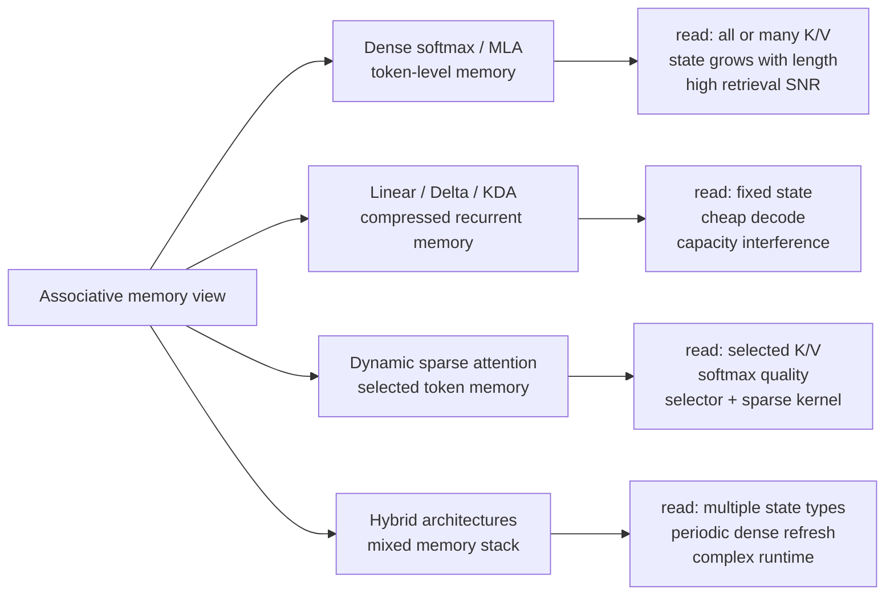
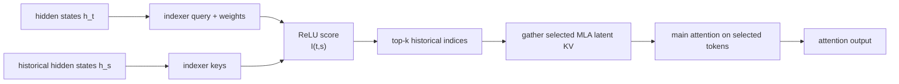
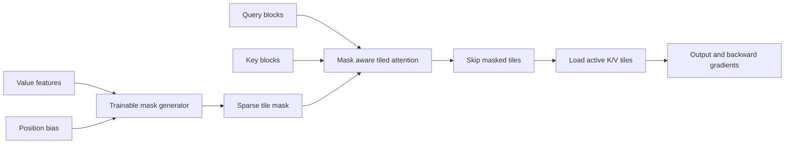
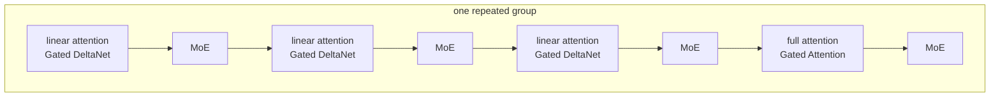
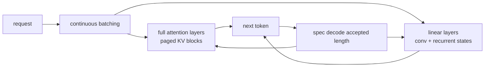
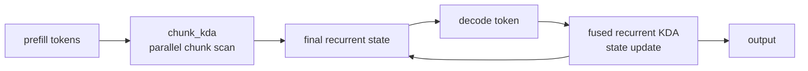
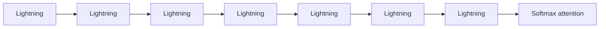

# 04 · Efficient Attention Evolution & Long-Context Operators: FA1/2/3, Ring Attention & MLA

The Self-Attention mechanism is the foundational operator of Transformer models, but standard implementations suffer from $O(N^2)$ time and memory complexity. Starting from the mathematical derivation of Online Softmax, this chapter deconstructs FlashAttention-1/2/3 tiling, Triton kernel programming, backward pass derivations, and Hopper WGMMA/TMA hardware optimizations, before exploring modern long-context paradigms: Ring Attention, Striped Attention, DeepSeek Multi-Head Latent Attention (MLA), Sliding Window Attention, and Sequence Parallel Cross-Entropy loss.

---

## Part 1: Online Softmax Algorithm Principles & Tiled Mathematical Proofs

### 5.1 Principles of the Online Softmax Algorithm

#### 5.1.1 Standard Softmax (3-Pass Algorithm)

Given an input vector $\mathbf{x} = [x_1, x_2, \dots, x_N]$:

**First pass (Pass 1) — compute the maximum:**
$$m = \max_{i=1}^{N} x_i$$
**Second pass (Pass 2) — compute the sum of exponentials:**
$$\ell = \sum_{i=1}^{N} \exp(x_i - m)$$
**Third pass (Pass 3) — normalize the output:**
$$y_i = \frac{\exp(x_i - m)}{\ell}$$
Subtracting the maximum value $m$ ensures numerical stability by preventing $\exp(x_i)$ from overflowing.

**Problem**: Each of the three passes must traverse the entire row of data, for a total of $3N$ elements loaded from HBM. On GPUs, global memory bandwidth is the most expensive resource.

#### 5.1.2 Online Softmax (1-Pass Statistics Computation)

The core idea of Online Softmax is: **maintain the running max and running exp-sum simultaneously in a single pass, and when a new maximum appears, rescale the previous partial sum with a correction factor.**

Initialization: $m_0 = -\infty$, $\ell_0 = 0$

When processing the $j$-th element $x_j$:
$$m_j = \max(m_{j-1}, x_j)$$
$$\ell_j = \ell_{j-1} \times \exp(m_{j-1} - m_j) + \exp(x_j - m_j)$$
**Correctness derivation**: After processing the first $j-1$ elements, $\ell_{j-1} = \sum_{i=1}^{j-1} \exp(x_i - m_{j-1})$. When the new element arrives, the new maximum becomes $m_j = \max(m_{j-1}, x_j)$, and we need:
$$\ell_j = \sum_{i=1}^{j} \exp(x_i - m_j)$$
Expanding this gives:
$$= \underbrace{\sum_{i=1}^{j-1} \exp(x_i - m_{j-1})}_{\ell_{j-1}} \cdot \underbrace{\exp(m_{j-1} - m_j)}_{\text{correction factor}} + \exp(x_j - m_j)$$
Note that when $m_j = m_{j-1}$, the correction factor is $1$, which degenerates to a simple accumulation.

After all elements have been processed, a second pass is still needed to compute $y_i = \exp(x_i - m_N) / \ell_N$. **In summary: 3-pass → 2-pass, and memory traffic drops from $3N$ to $2N$.**

#### 5.1.3 Block-wise Online Softmax (the Core of Flash Attention)

On GPUs, data is processed block by block. Suppose the current global statistics are $(m, \ell)$, and we process a new block $B_j$:

**Step 1: local statistics within the block**
$$m_j^{\text{local}} = \max_{x \in B_j} x, \quad \ell_j^{\text{local}} = \sum_{x \in B_j} \exp(x - m_j^{\text{local}})$$
**Step 2: update the global statistics**
$$m^{\text{new}} = \max(m, m_j^{\text{local}})$$
$$\ell^{\text{new}} = \ell \cdot \exp(m - m^{\text{new}}) + \ell_j^{\text{local}} \cdot \exp(m_j^{\text{local}} - m^{\text{new}})$$
**Step 3: correct the previous output** (the accumulated $O$ matrix in Flash Attention)
$$O^{\text{new}} = O \cdot \frac{\ell \cdot \exp(m - m^{\text{new}})}{\ell^{\text{new}}} + \frac{\exp(m_j^{\text{local}} - m^{\text{new}})}{\ell^{\text{new}}} \cdot P_j \cdot V_j$$
This formula is the core of Flash Attention: **there is no need to materialize the full attention matrix**. Instead, K/V blocks are processed incrementally in SRAM while normalization is maintained via online softmax.

---

---

## Part 2: FlashAttention-2 / 3 Architecture & Full Triton Implementation

## 6. Flash Attention

### 6.1 Motivation

Standard self-attention, $\text{Attention}(Q, K, V) = \text{softmax}(QK^T / \sqrt{d}) \times V$, requires materializing an $N \times N$ attention matrix (with $Q, K, V \in \mathbb{R}^{N \times d}$), which costs $O(N^2)$ memory and enormous bandwidth.

The core ideas of Flash Attention are:

1. **Never materialize the $N \times N$ matrix**: compute it block by block in SRAM via tiling
2. **Process incrementally with block-wise online softmax** (the principle was detailed in Section 5)
3. **Keep intermediate results in SRAM**: GPU SRAM bandwidth is roughly 19 TB/s versus 2 TB/s for HBM
4. **Reduce memory from $O(N^2)$ to $O(N)$**: store only the output $O$ and a small set of softmax statistics $(m, \ell)$

---

### 6.2 The Flash Attention 2 Algorithm

**Input**: Q, K, V $\in \mathbb{R}^{N \times d}$, **output**: O = softmax(QK^T / √d) × V

**Blocking**: Q is split into $T_r$ blocks (each with $B_r$ rows), while K/V are split into $T_c$ blocks (each with $B_c$ rows).

```
Input: Q_i ∈ R^{B_r × d}
Initialize: O_i = 0, m_i = -∞, l_i = 0

For each K,V block j = 1, ..., T_c:
    S_ij = Q_i × K_j^T / √d              // computed in SRAM
    m_ij = rowmax(S_ij)                   // row-wise maximum of the current block
    m_new = max(m_i, m_ij)               // update the global maximum

    // Correct the previous results (block-wise online softmax, see 5.1.3)
    l_i = l_i × exp(m_i - m_new)
    O_i = O_i × exp(m_i - m_new)

    P_ij = exp(S_ij - m_new)             // softmax numerator
    l_i = l_i + rowsum(P_ij)
    O_i = O_i + P_ij × V_j              // GEMM-II

    m_i = m_new

O_i = O_i / l_i                          // final normalization
```

**Correctness**: The correction factor $\exp(m_{\text{old}} - m_{\text{new}})$ converts previously computed exponentials relative to $m_{\text{old}}$ into values relative to $m_{\text{new}}$: $\exp(x - m_{\text{old}}) \times \exp(m_{\text{old}} - m_{\text{new}}) = \exp(x - m_{\text{new}})$. Expanding the formula shows it is exactly equivalent to the standard definition.

**Memory**: HBM only needs to store Q, K, V ($3Nd$), O ($Nd$), and the statistics m, l ($2N$). SRAM temporarily stores $O(B_r d + B_c d + B_r B_c)$, which does not grow with $N$.

### 6.3 Triton Implementation of Flash Attention

**Stride and address computation**: Q has shape `(batch, heads, seq_len, d_model)`, and `stride` gives the number of elements to skip when moving by one step along each dimension. For a contiguous row-major tensor (`batch=2, heads=8, seq_len=512, d_model=64`):

| stride | Corresponding dimension | Value | Meaning |
|---|---|---|---|
| `stride_qb` | batch | $8 \times 512 \times 64 = 262144$ | jump to the next batch |
| `stride_qh` | heads | $512 \times 64 = 32768$ | jump to the next head |
| `stride_qm` | seq_len | $64$ | jump to the next row (token) |
| `stride_qk` | d_model | $1$ | jump to the next column (innermost contiguous dimension) |

The address of `Q[b, h, m, k]` is: `Q_ptr + b*stride_qb + h*stride_qh + m*stride_qm + k*stride_qk`.

In the code, `off_hz = tl.program_id(1)` is the flattened `batch × heads` index, and the base address uses `off_hz * stride_qh` instead of explicitly decomposing it. This works because under a contiguous layout, `stride_qb = heads × stride_qh`, so `b * stride_qb + h * stride_qh = (b * heads + h) * stride_qh = off_hz * stride_qh`. One multiplication is enough. If the tensor is non-contiguous (for example after a `transpose`), then it must be decomposed as `off_hz // heads * stride_qb + off_hz % heads * stride_qh`.

**Constructing the pointer matrix for a Q block**: `q_ptrs = Q_ptr + q_offset + offs_m[:, None] * stride_qm + offs_d[None, :] * stride_qk` constructs a `[BLOCK_M, BLOCK_DMODEL]` pointer matrix. Conceptually, it manually flattens the multidimensional index `Q[b,h,m,d]` into linear addresses. It has three parts:

```
Q_ptr + q_offset                → locate the starting address of the (batch, head) block
+ offs_m[:, None] * stride_qm   → row offsets, [BLOCK_M, 1] column vector
+ offs_d[None, :] * stride_qk   → column offsets, [1, BLOCK_DMODEL] row vector
```

Broadcasting adds the two offsets to form the full 2D pointer matrix (assuming `start_m=1`, `stride_qm=64`, `stride_qk=1`):

```
Row offsets (×64)     Column offsets (×1)      Result (relative offsets)
┌──────┐              ┌──────────────┐         ┌─────────────────────┐
│ 8192 │              │ 0  1  ... 63 │         │ 8192  8193  ... 8255│ ← Q[128, 0:64]
│ 8256 │       +      │ 0  1  ... 63 │    =    │ 8256  8257  ... 8319│ ← Q[129, 0:64]
│  ... │              │     ...      │         │         ...         │
│16320 │              │ 0  1  ... 63 │         │16320 16321  ...16383│ ← Q[255, 0:64]
└──────┘              └──────────────┘         └─────────────────────┘
[128,1] broadcast     [1,64] broadcast         [128,64] pointer matrix
```

Each cell is a memory address, and `tl.load(q_ptrs)` loads the entire `[BLOCK_M, BLOCK_DMODEL]` Q block into SRAM in one shot. Since Triton does not have native multidimensional array support, 2D block loads must be simulated through pointer arithmetic plus broadcasting.

```python
import triton
import triton.language as tl
import torch


@triton.jit
def flash_attention_forward_kernel(
    Q_ptr, K_ptr, V_ptr, O_ptr,
    stride_qb, stride_qh, stride_qm, stride_qk,
    stride_kb, stride_kh, stride_kn, stride_kk,
    stride_vb, stride_vh, stride_vn, stride_vk,
    stride_ob, stride_oh, stride_om, stride_ok,
    N_CTX, sm_scale,
    BLOCK_M: tl.constexpr,
    BLOCK_N: tl.constexpr,
    BLOCK_DMODEL: tl.constexpr,
):
    """
    Flash Attention 2 Forward — Triton implementation.
    Each program processes one Q block (BLOCK_M rows) for one (batch, head).
    """
    start_m = tl.program_id(0)
    off_hz = tl.program_id(1)

    # Base address offsets
    q_offset = off_hz * stride_qh
    k_offset = off_hz * stride_kh
    v_offset = off_hz * stride_vh
    o_offset = off_hz * stride_oh

    offs_m = start_m * BLOCK_M + tl.arange(0, BLOCK_M)
    offs_n = tl.arange(0, BLOCK_N)
    offs_d = tl.arange(0, BLOCK_DMODEL)

    # Load the Q block (resides in SRAM throughout the computation)
    q_ptrs = Q_ptr + q_offset + offs_m[:, None] * stride_qm + offs_d[None, :] * stride_qk
    q = tl.load(q_ptrs, mask=offs_m[:, None] < N_CTX, other=0.0)

    # Initialize online softmax state
    m_i = tl.zeros([BLOCK_M], dtype=tl.float32) - float('inf')
    l_i = tl.zeros([BLOCK_M], dtype=tl.float32)
    acc = tl.zeros([BLOCK_M, BLOCK_DMODEL], dtype=tl.float32)

    # Main loop: traverse K/V blocks
    for start_n in range(0, N_CTX, BLOCK_N):
        start_n = tl.multiple_of(start_n, BLOCK_N)

        # Load K block
        k_ptrs = K_ptr + k_offset + (start_n + offs_n)[:, None] * stride_kn + offs_d[None, :] * stride_kk
        k = tl.load(k_ptrs, mask=(start_n + offs_n)[:, None] < N_CTX, other=0.0)

        # S = Q @ K^T * scale
        s = tl.zeros([BLOCK_M, BLOCK_N], dtype=tl.float32)
        s += tl.dot(q, tl.trans(k))
        s *= sm_scale
        s = tl.where(offs_m[:, None] < N_CTX, s, float('-inf'))
        s = tl.where((start_n + offs_n)[None, :] < N_CTX, s, float('-inf'))

        # Online softmax update (core: block-wise version, see 5.1.3)
        m_ij = tl.max(s, axis=1)
        m_new = tl.maximum(m_i, m_ij)
        alpha = tl.exp(m_i - m_new)          # correction factor
        p = tl.exp(s - m_new[:, None])       # softmax numerator
        l_i = l_i * alpha + tl.sum(p, axis=1)
        acc = acc * alpha[:, None]            # correct the previous output

        # Load the V block and accumulate
        v_ptrs = V_ptr + v_offset + (start_n + offs_n)[:, None] * stride_vn + offs_d[None, :] * stride_vk
        v = tl.load(v_ptrs, mask=(start_n + offs_n)[:, None] < N_CTX, other=0.0)
        acc += tl.dot(p.to(tl.float16), v)

        m_i = m_new

    # Final normalization
    acc = acc / l_i[:, None]

    # Write back
    o_ptrs = O_ptr + o_offset + offs_m[:, None] * stride_om + offs_d[None, :] * stride_ok
    tl.store(o_ptrs, acc.to(tl.float16), mask=offs_m[:, None] < N_CTX)


def flash_attention_triton(q, k, v):
    """
    Flash Attention forward. q, k, v: (batch, heads, seq_len, d_model) fp16.
    """
    BLOCK_M, BLOCK_N = 128, 64
    batch, heads, seq_len, d_model = q.shape
    o = torch.empty_like(q)
    sm_scale = 1.0 / (d_model ** 0.5)
    grid = (triton.cdiv(seq_len, BLOCK_M), batch * heads)

    flash_attention_forward_kernel[grid](
        q, k, v, o,
        q.stride(0), q.stride(1), q.stride(2), q.stride(3),
        k.stride(0), k.stride(1), k.stride(2), k.stride(3),
        v.stride(0), v.stride(1), v.stride(2), v.stride(3),
        o.stride(0), o.stride(1), o.stride(2), o.stride(3),
        seq_len, sm_scale,
        BLOCK_M=BLOCK_M, BLOCK_N=BLOCK_N, BLOCK_DMODEL=d_model,
    )
    return o
```


### 6.4 Backpropagation

Backpropagation for Flash Attention is more complex than the forward pass because the attention matrix must be recomputed (the forward pass stores only $O$, $m$, and $\ell$, not $P$).

#### 6.4.1 Backpropagation Mathematics

Let $P = \text{softmax}(S/\sqrt{d})$, $S = QK^T$, and $O = PV$. Given the upstream gradient $dO$:

**Step 1**: compute the auxiliary quantity $D_i = \sum_j dO_{ij} \cdot O_{ij}$ (row-wise dot product)

**Step 2**: for each pair of (Q block $i$, KV block $j$):
- Recompute $S_{ij} = Q_i K_j^T / \sqrt{d}$
- Recompute $P_{ij} = \exp(S_{ij} - m_i) / \ell_i$ (using the forward-saved $m$, $\ell$)
- $dV_j \mathrel{+}= P_{ij}^T \cdot dO_i$
- $dP_{ij} = dO_i \cdot V_j^T$
- $dS_{ij} = P_{ij} \odot (dP_{ij} - D_i)$ (elementwise, the softmax backward formula)
- $dQ_i \mathrel{+}= dS_{ij} \cdot K_j / \sqrt{d}$
- $dK_j \mathrel{+}= dS_{ij}^T \cdot Q_i / \sqrt{d}$

#### 6.4.2 Triton Backpropagation (Approximate Version)

The following is a conceptual Triton implementation of the backward pass. Production code typically splits it into two kernels (one for dQ and one for dK/dV); here they are combined to highlight the core logic. **Note: this version is a simplified teaching implementation and may have limitations in boundary handling and performance.**

```python
@triton.jit
def flash_attention_backward_kernel(
    Q_ptr, K_ptr, V_ptr, O_ptr, dO_ptr,
    dQ_ptr, dK_ptr, dV_ptr,
    L_ptr, M_ptr,             # forward-saved log-sum-exp (l) and max (m)
    stride_qb, stride_qh, stride_qm, stride_qk,
    stride_kb, stride_kh, stride_kn, stride_kk,
    stride_vb, stride_vh, stride_vn, stride_vk,
    stride_ob, stride_oh, stride_om, stride_ok,
    N_CTX, sm_scale,
    BLOCK_M: tl.constexpr,
    BLOCK_N: tl.constexpr,
    BLOCK_DMODEL: tl.constexpr,
):
    """
    Flash Attention backward pass — simplified version.
    Each program processes one Q block and traverses all K/V blocks to compute dQ.
    dK and dV are accumulated via atomic_add (production code should use dedicated kernels to avoid atomics).
    """
    start_m = tl.program_id(0)
    off_hz = tl.program_id(1)

    q_offset = off_hz * stride_qh
    k_offset = off_hz * stride_kh
    v_offset = off_hz * stride_vh
    o_offset = off_hz * stride_oh

    offs_m = start_m * BLOCK_M + tl.arange(0, BLOCK_M)
    offs_d = tl.arange(0, BLOCK_DMODEL)

    # Load Q block, O block, and dO block
    q_ptrs = Q_ptr + q_offset + offs_m[:, None] * stride_qm + offs_d[None, :] * stride_qk
    q = tl.load(q_ptrs, mask=offs_m[:, None] < N_CTX, other=0.0)

    o_ptrs = O_ptr + o_offset + offs_m[:, None] * stride_om + offs_d[None, :] * stride_ok
    o = tl.load(o_ptrs, mask=offs_m[:, None] < N_CTX, other=0.0)

    do_ptrs = dO_ptr + o_offset + offs_m[:, None] * stride_om + offs_d[None, :] * stride_ok
    do = tl.load(do_ptrs, mask=offs_m[:, None] < N_CTX, other=0.0)

    # Load the softmax statistics saved during the forward pass
    m_ptrs = M_ptr + off_hz * N_CTX + offs_m
    l_ptrs = L_ptr + off_hz * N_CTX + offs_m
    m_i = tl.load(m_ptrs, mask=offs_m < N_CTX, other=0.0)
    l_i = tl.load(l_ptrs, mask=offs_m < N_CTX, other=1.0)

    # Step 1: D_i = rowsum(dO * O)
    D_i = tl.sum(do.to(tl.float32) * o.to(tl.float32), axis=1)  # (BLOCK_M,)

    # Initialize the dQ accumulator
    dq = tl.zeros([BLOCK_M, BLOCK_DMODEL], dtype=tl.float32)

    offs_n = tl.arange(0, BLOCK_N)

    # Step 2: traverse K/V blocks
    for start_n in range(0, N_CTX, BLOCK_N):
        # Load K and V blocks
        k_ptrs = K_ptr + k_offset + (start_n + offs_n)[:, None] * stride_kn + offs_d[None, :] * stride_kk
        v_ptrs = V_ptr + v_offset + (start_n + offs_n)[:, None] * stride_vn + offs_d[None, :] * stride_vk
        k = tl.load(k_ptrs, mask=(start_n + offs_n)[:, None] < N_CTX, other=0.0)
        v = tl.load(v_ptrs, mask=(start_n + offs_n)[:, None] < N_CTX, other=0.0)

        # Recompute S and P
        s = tl.dot(q, tl.trans(k)) * sm_scale                    # (BLOCK_M, BLOCK_N)
        p = tl.exp(s - m_i[:, None]) / l_i[:, None]              # recompute softmax
        p = tl.where((start_n + offs_n)[None, :] < N_CTX, p, 0.0)

        # dP = dO @ V^T
        dp = tl.dot(do, tl.trans(v))                              # (BLOCK_M, BLOCK_N)

        # dS = P * (dP - D_i)  — softmax backward formula
        ds = p * (dp - D_i[:, None]) * sm_scale                  # (BLOCK_M, BLOCK_N)

        # dQ += dS @ K
        dq += tl.dot(ds.to(tl.float16), k)

        # dV += P^T @ dO (simplified: atomic_add, production code should avoid this)
        # dK += dS^T @ Q (simplified: atomic_add)
        # The atomic accumulation for dV/dK is omitted here; a real implementation needs dedicated handling

    # Write back dQ
    dq_ptrs = dQ_ptr + q_offset + offs_m[:, None] * stride_qm + offs_d[None, :] * stride_qk
    tl.store(dq_ptrs, dq.to(tl.float16), mask=offs_m[:, None] < N_CTX)
```

**Known issues in the simplified version above**:
1. **Forward statistics were not saved**: the backward pass expects to load $m$ and $\ell$ from `M_ptr`/`L_ptr`, but the forward kernel does not write them back to HBM. A complete implementation must add `tl.store` before the final normalization in the forward pass to save `m_i` and `l_i`.
2. **dK/dV are completely missing**: the code computes only dQ; dK and dV accumulation are mentioned in comments but not implemented.
3. **Precision loss**: `ds.to(tl.float16)` truncates the gradient to FP16 before `tl.dot`. In backpropagation, gradients may be very small, and FP16 truncation can introduce significant numerical error. It should remain in FP32 or use BF16.
4. **Missing compiler hints**: the forward pass includes `tl.multiple_of(start_n, BLOCK_N)` to help optimization, but the backward pass omits it.

**Implementation challenges in the backward pass**:
1. **Accumulating dK/dV**: multiple Q blocks need to contribute gradients to the same K/V block. Production implementations usually use a dedicated kernel (outer loop over K/V blocks, inner loop over Q blocks) to avoid atomics.
2. **The cost of recomputation**: the backward pass must recompute $S$ and $P$, making it about 2.5× as expensive as the forward pass. But compared with storing the full $N \times N$ matrix $P$, recomputation is still the better trade-off.
3. **Numerical consistency**: the recomputed $\exp(S_{ij} - m_i) / \ell_i$ in the backward pass must exactly match the forward computation, including identical max and sum values.

---

### 6.5 Flash Attention 3: Hopper-Specific Optimizations

FA2 reaches about 70% utilization on A100, but only about 35% on H100. The reason is that Hopper introduces entirely new hardware capabilities (asynchronous Tensor Cores, TMA, FP8), and FA2’s synchronous design cannot exploit them. FA3 is a complete rewrite tailored for Hopper.

#### 6.5.1 Three Core Improvements

**1. Warp specialization**

In FA2, all warps perform homogeneous work—they both load data and compute. FA3 divides warps into two roles:

```
┌─────────────────── CTA (Thread Block) ───────────────────┐
│                                                           │
│  Producer Warps              Consumer Warps               │
│  ┌──────────────┐           ┌──────────────────────────┐  │
│  │ TMA load K_j │──SMEM──→ │ WGMMA: S = Q @ K^T       │  │
│  │ TMA load V_j │──SMEM──→ │ Softmax: P = softmax(S)  │  │
│  │ (ring buffer)   │           │ WGMMA: O += P @ V        │  │
│  └──────────────┘           └──────────────────────────┘  │
│  fewer registers ← setmaxnreg → more registers (GEMM accumulators) │
└───────────────────────────────────────────────────────────┘
```

- **Producer**: uses TMA (Tensor Memory Accelerator) exclusively to asynchronously load data from HBM into a shared-memory ring buffer
- **Consumer**: uses WGMMA (warpgroup-level matrix multiply) exclusively for computation
- **`setmaxnreg`**: a new Hopper instruction that dynamically reallocates registers—producer warps release registers to consumer warps, giving GEMM accumulators more register space

**2. Two-stage pipeline: overlap GEMM and softmax**

The bottleneck in FA2 is that the two GEMMs ($S = QK^T$ and $O = PV$) are separated by softmax and therefore execute strictly serially. FA3 breaks this dependency using WGMMA’s asynchronous semantics:

```
Time →
──────────────────────────────────────────────────
Iteration j:   [GEMM0: S_j=QK_j^T]  [softmax(S_j)]  [GEMM1: O+=P_j·V_j]
Iteration j+1:                       [GEMM0: S_{j+1}] [softmax(S_{j+1})]  [GEMM1]

↓ After overlap:

Iteration j:   [GEMM0_j] [softmax_j + GEMM0_{j+1}] [GEMM1_j]
                     ↑ softmax uses scalar units (MUFU)
                     ↑ GEMM0 uses Tensor Cores
                     → the two can execute simultaneously!
```

The key is: after launching `GEMM0_{j+1}`, FA3 does not wait for it to finish (`commit_group` but not `wait_group`), and immediately runs `softmax_j` on MUFU. The two use different hardware units, so they truly execute in parallel.

**3. Pingpong scheduling (alternating dual warpgroup execution)**

Even with the two-stage pipeline, MUFU throughput for softmax (~3.9 TFLOPS) is still about 256× lower than Tensor Core throughput for GEMM (~989 TFLOPS FP16), so softmax can still consume a noticeable number of cycles. Pingpong scheduling hides it using two warpgroups:

```
Time →
WarpGroup 0: [GEMM] [softmax] [GEMM] [softmax] ...
WarpGroup 1:        [GEMM] [softmax] [GEMM] [softmax] ...
                     ↑ while WG1 does GEMM, WG0 does softmax
                            → softmax is fully hidden
```

The two warpgroups alternate through the `bar.sync` hardware barrier, so the softmax latency is fully hidden under the other group’s GEMM execution time.

#### 6.5.2 FP8 Support: Incoherent Processing

The issue with FP8 is that Q/K in transformers often contain a small number of “outlier” dimensions with very large values, and FP8’s dynamic range cannot represent both large and small values well at the same time.

**Solution**: multiply by a random orthogonal matrix $M$ (Hadamard + random sign flips) to “spread out” the outliers:
$$\text{Attention}(Q, K, V) = \text{softmax}\left(\frac{(QM)(KM)^T}{\sqrt{d}} \right) V$$
Because $MM^T = I$, the math is unchanged: $(QM)(KM)^T = QMM^TK^T = QK^T$. But after multiplying by $M$, the magnitudes across dimensions become more uniform, reducing FP8 quantization error by 2.6×. Applying $M$ can be implemented with the Fast Walsh-Hadamard Transform at complexity $O(d \log d)$, and it can be fused with RoPE at effectively zero additional cost.

#### 6.5.3 Feasibility and Limitations in Triton

| FA3 technique | Feasibility in Triton | Notes |
|---|---|---|
| Warp specialization | **Not feasible** | Triton’s abstraction hides warp-level control, so producer/consumer roles cannot be assigned explicitly |
| `setmaxnreg` | **Not feasible** | Triton does not expose register allocation instructions |
| TMA | **Partially feasible** | Triton 3.0+ supports TMA primitives such as `tl.async_copy`, but with less flexibility than CUDA |
| WGMMA asynchronous semantics | **Not feasible** | Triton’s `tl.dot` is synchronous and cannot implement a commit-without-wait pipeline |
| Pingpong scheduling | **Not feasible** | It requires warpgroup-level barrier control, which Triton does not expose |
| Two-stage GEMM-softmax pipeline | **Limited** | The Triton compiler may perform some instruction reordering automatically, but explicit control is unavailable |
| FP8 + block quantization | **Feasible** | Triton supports FP8 types and FP8 operands for `tl.dot` |
| Incoherent processing | **Feasible** | The Hadamard transform is elementwise + butterfly structure, which Triton can implement |
| Basic online-softmax tiling | **Feasible** | This is the core of FA2, and Triton already supports it well (as in the implementation above) |

**Conclusion**: FA3’s main advantages (warp specialization, asynchronous pipelining, pingpong scheduling) depend deeply on Hopper’s low-level hardware primitives and therefore must be implemented in CUDA/CUTLASS. What Triton can deliver is FA2-style tiling + online softmax + FP8 quantization, corresponding to roughly 50–60% of FA3 performance. This also explains why FA3 is written in CUDA (based on CUTLASS 3.x) rather than Triton.

---

---

## Part 3: Modern Long-Context Architectures & Sequence Parallelism

## I. Unified Understanding via Associative Memory

The paper "Understanding Transformer from the Perspective of Associative Memory" provides a highly useful perspective: both attention and FFN in Transformers can be viewed as associative memory. Associative memory stores many `(key, value)` relationships; given a query, the system retrieves the corresponding value based on the similarity between the query and the keys.

This perspective is particularly well-suited for understanding efficient attention post-2025, as new methods essentially address three problems:

| Problem | Dense Softmax Answer | Linear / Delta / KDA Answer | Dynamic Sparse Answer |
|---|---|---|---|
| Where is memory stored | Each history token keeps a K/V | History is compressed into a fixed-size recurrent state | K/V is still kept, but only a small portion is read per step |
| How to read memory | Query performs softmax over all history keys | Query reads the compressed state matrix | Query selects candidate tokens first, then performs softmax |
| Primary cost | KV cache and HBM read traffic grow with length | Multiple memories in one state interfere with each other | Complexity of selector, top-k, gather, and sparse kernels |

Let's first define the simplest linear associative memory. Each token writes an outer product: the key is responsible for "when it should be read," and the value is responsible for "what to return when read."

The most basic linear memory can be written as:

$$
S_t = \sum_{i \le t} \phi(k_i)v_i^T,\qquad o_t = S_t^T\phi(q_t)
$$

Here, `S_t` is the key-to-value state after compressing historical information. It adds the outer product of all historical tokens into the same matrix. During decoding, one only needs to maintain `S_t` without keeping the K/V for every token. The formulas for DeltaNet and KDA below follow this direction; if you write the state as value-to-key, the entire formula is simply transposed.

The pros and cons of this formula are direct:

- **Pros:** For every incoming token, only a fixed-size `S_t` is updated; during decoding, only this state is read, so the state size does not grow linearly with context length.
- **Cons:** Many memories are added to the same matrix. When reading `S_t`, the target value emerges, but noise is introduced when other keys have non-zero similarity to the query.

Dense softmax attention does not compress in this way. It retains all historical keys/values:

$$
o_t = \sum_{i \le t} \text{softmax}(q_t k_i^T)_i v_i
$$

This leads to two system consequences:

| Scheme | Memory Form | Decode State | Pros | Cost |
|---|---|---|---|---|
| Dense softmax / MLA | One KV record per token | Grows with context | Strong retrieval, clear positions | High HBM read traffic and KV cache |
| Linear / Delta / KDA | Fixed-size recurrent state | Virtually constant | Saves VRAM and bandwidth | Memories interfere with each other |
| Dynamic sparse | Selects few tokens, then softmax | KV kept, but read partially | Retains softmax retrieval | Requires selector and sparse kernel |
| Hybrid | Mixed memory per layer | Mixed state | More stable in engineering | Complex runtime |

The most important takeaway from this paper is not the "attention is like memory" analogy, but its definition of memory capacity as the retrieval signal-to-noise ratio (SNR). When reading a memory, the target value is the signal, and other values read simultaneously are noise. In linear memory, noise comes from the residual inner products of other keys with the query; the more that is stored and the less orthogonal the keys, the greater the noise.

The advantage of softmax comes from the exponential kernel: weights of similar keys are exponentially amplified, while weights of dissimilar keys are suppressed. This is not without cost; it trades "retaining token-level KV + reading more history per step" for sharper retrieval. The advantage of linear/delta/KDA is the opposite: it uses a fixed state to reduce decoding costs but must accept the constraints of state capacity and interference.

This trade-off can be summarized in one sentence:

```text
softmax attention: expensive but high-SNR retrieval
linear / delta memory: cheap decode but compressed, interference-prone retrieval
dynamic sparse: keep softmax retrieval, reduce how much history each query reads
hybrid: use cheap memory for most layers, keep dense/sparse retrieval as refresh path
```

This is also why "infinite context" does not equal "infinite intelligence." If history is merely compressed into a fixed-size state, increasing length does not automatically increase the capacity for reliable retrieval; if all history is kept as KV, capacity is stronger, but the system pays the costs of KV cache, HBM bandwidth, scheduling, and kernels.

DeltaNet's update can be understood as "erasing parts that conflict with the current key from the old state before writing new memory":

$$
S_t = (I - \beta_t k_t k_t^T)S_{t-1} + \beta_t k_t v_t^T
$$

This formula adds an "erasure" step compared to simple linear accumulation: `(I - β_t k_t k_t^T)S_{t-1}` clears potentially conflicting content in the old state along the current key direction before writing the new `k_t v_t^T`. Thus, DeltaNet is not just accumulating history, but performing an online memory update.

Gated DeltaNet adds a decay gate, allowing old memories to be forgotten channel-by-channel. Kimi Delta Attention further refines this gate, moving beyond a single scalar to decay the entire state. You can view these methods as answering the same question: since fixed-size states become crowded, how should we overwrite, erase, and retain old memories during writing?

The overall structure can be visualized as:



System evaluation revolves around three state-related questions:

1. In what data structure is historical information stored?
2. How much historical state must each decode token read?
3. Can this state be correctly managed by paged KV, continuous batching, and speculative decoding?

When interviewing or reading papers, use the following table to probe deeper rather than just memorizing method names:

| Question | Why it matters |
|---|---|
| Is memory token-level KV, compressed state, or a mix? | Determines what the cache manager must save |
| Is retrieval high-SNR softmax or from a compressed state? | Determines long-context fact-checking capability |
| Does the update include erase / gate / decay? | Determines how fixed states handle conflicting memories |
| How much HBM is read/written per decode step? | Determines long-output serving and RL rollout throughput |
| Can the state be recovered during spec decode rollback? | Determines if it can integrate into modern inference stacks |

---

## II. Three Paths for Long-Context Attention

The design pressure for long-context attention primarily comes from two ends:

```text
1. Longer prompts: 1M context, code repositories, agent trajectories, RAG history.
2. Longer outputs: Reasoning models and RL rollouts generate tens of thousands of tokens or more.
```

If a model reads the full KV cache at every decode step, long outputs will bottleneck serving on memory bandwidth. Consequently, new schemes generally follow three paths:

| Path | Representative | Approach |
|---|---|---|
| Select History | DeepSeek DSA, DMA | Retains token-level history, but each query reads only selected parts |
| Prefill Sparse Routing | DHSA | Attaches hierarchical chunk/token routing to a frozen backbone, mainly reducing long-context prefill costs |
| Compress History | Qwen3-Next Gated DeltaNet, Kimi KDA, MiniMax Lightning Attention | Writes history to a fixed state; decode reads only the state |
| Hybrid Layers | Qwen3-Next, Kimi Linear, MiniMax-M1 | Most layers use cheap memory, few layers use dense attention as a fallback |

This is not a case of "who replaces whom." A more realistic design is:

```text
cheap recurrent layers handle long-range, low-cost state propagation
periodic dense / MLA layers handle high-precision token retrieval
sparse selectors reduce invalid reads within massive history
```

### 2.1 2025+ Method Map

Associative Memory theory is not a method path here, but a coordinate system for reading these methods: it explains why softmax retrieval and compressed recurrent memory have different capabilities. The table below lists only specific architectures or system paths.

| Work / Path | Core Problem | State Form | System Bottleneck | Question to Ask |
|---|---|---|---|---|
| DeepSeek DSA | Don't want to read full MLA cache per step at 1M context | KV kept, query selects top-k | indexer + top-k + sparse MLA kernel | Is selector cost less than saved KV read traffic? |
| DMA / DHSA | Reduce attention work via dynamic mask / routing | mask / hierarchy indices | mask training, block sparse kernel | Can sparse patterns actually speed up on GPU? |
| Qwen3-Next | Long-context throughput + high-sparsity MoE | recurrent state + periodic full attention | mixed cache manager | How to submit/rollback state for spec decode and continuous batching? |
| Kimi Linear | Strengthen recurrent memory with KDA | chunk state + recurrent state | chunk kernel / recurrent kernel | How does the 3:1 hybrid ratio balance retrieval and bandwidth? |
| MiniMax-M1 | Long-output reasoning / RL rollout | Lightning state + periodic softmax | long decode bandwidth + MoE dispatch | How does the scheduler control KV/state at 80K tokens? |

A practical judgment is to categorize methods first, then look at the true system bottleneck:

| Method Type | Typical Example | Focus | Common Pitfalls |
|---|---|---|---|
| **Full KV, read less** | DeepSeek DSA, dynamic mask sparse attention | Selector cost, top-k/gather overhead, sparse kernel speed | FLOPs drop, but HBM access is non-contiguous; latency may not drop |
| **History to recurrent state** | DeltaNet, KDA, Lightning Attention | State capacity, erase/gate/decay mechanisms, state lifecycle | Decode saves bandwidth, but fixed state may lose precise retrieval |
| **Hybrid** | Qwen3-Next, Kimi Linear, MiniMax-M1 | Paged KV, recurrent state, conv state, spec draft state management | Model structure is stable, but runtime complexity increases significantly |

The core of the first type of method is not "storing less," but "reading less." For example, DSA still retains historical KV / MLA latent cache, but each query uses a lightweight indexer to select top-k historical tokens first. When reading papers, ask: does the selector itself need to scan the entire history? Can top-k and gather be batched? Is sparse kernel memory access contiguous? If these are not handled well, theoretical FLOPs reduction will not equate to online latency reduction.

The second type of method compresses history into a recurrent state, suitable for long-output decoding, RL rollouts, and agent loops. The common benefit of KDA, Lightning, and Gated DeltaNet is not reading the full token KV per step; however, fixed states have finite capacity. The key is whether there are erase, gate, or decay mechanisms during writing to avoid old and new memory pollution. System-wise, one must ask when the state is created, updated, copied, rolled back, and released.

The third type, hybrid, is a more common compromise in current large models: most layers use cheap recurrent memory to reduce bandwidth, while a few dense / MLA / softmax layers perform retrieval refresh. The difficulty has shifted from individual attention kernels to runtime: a single request might simultaneously have paged KV, recurrent state, and conv state; when speculative decoding fails, these states for draft tokens must all be rolled back; when continuous batching swaps slots, they must be correctly migrated alongside the request ID.

---

## III. DeepSeek Dynamic Sparse Attention

DeepSeek-V3.2 places Dynamic Sparse Attention (DSA) under the MLA framework. It is neither simple sliding window nor fixed block sparse. Each query first passes through a lightweight indexer to select the most valuable historical KV, then performs attention on these selected KV.

<details class="exercise">
<summary><span class="q-label">Review</span> <span class="q-text">What is MLA? Why does DSA attach to MLA latent KV?</span></summary>

MLA (Multi-head Latent Attention) can be understood as a **KV cache-compressed version of dense attention**. Standard MHA / GQA saves keys and values for every historical token during decoding; MLA does not cache full per-head K/V directly, but compresses K/V into lower-dimensional latent representations, recovering the parts needed for attention during decoding.

A simplified perspective:

```text
Standard KV cache:
  token_i -> K_i, V_i
  decode reads many full K/V per step

MLA latent cache:
  token_i -> c_i^{KV}
  decode reads compressed latent, then projects/recovers for attention
```

Therefore, MLA solves **storing each token more efficiently**, not "looking at fewer tokens per step." If the context has 1M tokens, MLA might still need to perform retrieval from a large number of historical latent entries, but each entry is smaller than a full KV.

The significance of DSA attaching to MLA is:

- MLA first reduces the cache volume of each historical record;
- DSA then reduces the number of historical records each query actually reads;
- Combined, the goal is to simultaneously reduce KV/cache footprint and decode HBM read traffic.

Thus, DSA's `top-k` does not select full per-head KV, but selects historical MLA latent entries, allowing the main attention to complete softmax retrieval on these selected latent entries.

</details>

The data flow can be visualized as:



The indexer score in the DeepSeek report takes the form:

$$
I_{t,s} = \sum_j w^I_{t,j}\,\text{ReLU}(q^I_{t,j}\cdot k^I_s)
$$

Several implementation details are more important than the formula:

- The indexer head is small and uses ReLU instead of softmax scores for selection, aiming for higher selector throughput.
- The indexer can run in FP8 because it only handles sorting/selection and does not directly generate the final attention output.
- DSA is placed on MLA's latent KV, typically sharing selected latent entries in an MQA style to avoid each query head performing its own large selection.
- The main attention remains softmax retrieval, but the input changes from "all historical tokens" to "top-k tokens." The sparse setting in the DeepSeek-V3.2 report uses 2048 KV tokens per query; this is not a small window, but content-driven large-budget sparse retrieval.

### 3.1 Why split training into two stages?

The difficulty with DSA is that the selector is unreliable at the start. If trained sparsely from the beginning, the main model will learn unstably because it cannot see the necessary historical tokens. DeepSeek's approach is to warm up the indexer first:

```text
stage 1: dense warm-up
  dense attention runs normally
  freeze main model parameters
  train only the indexer
  match indexer distribution to dense attention's aggregation distribution
  report uses 128K long sequences for warm-up, letting the selector learn long-context retrieval first

stage 2: sparse training
  enable top-k token selection
  train main model and indexer together
  indexer input is detached to prevent the main model from changing hidden states for indexer loss
  indexer alignment loss is calculated only on the selected top-k token set
```

This design shows that DSA is not purely a runtime trick. It changes the model training distribution, requiring the model to continue adapting under sparse retrieval.

### 3.2 What really happens in the kernel?

The inner loop of traditional decode attention is roughly:

```text
for each query:
  for each KV block in full context:
    load K/V
    update softmax statistics
```

DSA changes this to:

```text
for each query:
  run indexer or reuse selected indices
  gather selected KV block / token indices
  only load selected K/V
  run sparse softmax attention
```

Thus, a new type of state appears in the system: `top-k indices`. GLM-5.2's IndexShare / IndexCache optimizes at this level: reusing indexer results between MTP steps to reduce redundant sparse index calculations.

DSA is suitable for scenarios where:

- Context is very long, but each query truly needs sparse information.
- The model has been trained or fine-tuned in sparse mode.
- The runtime can handle irregular gathers, top-k index buffers, and sparse attention kernels.

It is unsuitable for:

- Short contexts, where selector overhead outweighs savings.
- Scenarios requiring fine-grained global comparison at every step, where top-k cannot stably cover target tokens.
- Serving systems that only support dense paged KV and cannot efficiently manage sparse indices.

---

## IV. Dynamic Mask Attention and Hierarchical Sparse Routing

DeepSeek DSA follows the "calculate indexer score, then top-k tokens" path. Trainable Dynamic Mask Sparse Attention takes another route: using value representations to generate content-aware masks, then allowing sparse attention kernels to skip masked-out tiles.

DMA can be understood as:

```text
value features -> dynamic mask -> sparse weights -> FlashAttention-style tiled kernel
```

The mask in the paper is not a fixed pattern. It generates a position-aware sparse pattern from value representations and learnable parameters, retaining top-w and writing `-inf` to other positions. A simplified reading is:

$$
\delta = \exp(\tau(v \cdot \Delta) \cdot A)
$$

Here, `v` provides content features, while `\Delta` and `A` provide position-related parameterized biases. `top-w` determines the sparse connections each query truly retains. The key point is that it puts both "content" and "position" into the mask generator, rather than relying solely on local windows.

A more intuitive comparison is writing both as "decide where to look, then perform attention":

| Method | Selection Signal | Selection Result | Main Attention Calculation |
|---|---|---|---|
| **DeepSeek DSA** | indexer query/key scoring: $I_{t,s}=\sum_j w^I_{t,j}\operatorname{ReLU}(q^I_{t,j}\cdot k^I_s)$ | Each query selects token set: $\mathcal{T}_t=\operatorname{TopK}_s(I_{t,s})$ | Softmax only on selected tokens: $o_t=\sum_{s\in\mathcal{T}_t}\operatorname{softmax}_{s\in\mathcal{T}_t}(q_tk_s^T)v_s$ |
| **DMA** | value features + position params generate mask score: $m_{b_q,b_k}=g(V_{b_k}, \Delta_{b_q,b_k})$ | Each query block / tile gets binary or sparse mask: $M_{b_q,b_k}\in\{0,1\}$ | Mask applied to QK score / tile: $\operatorname{softmax}(QK^T/\sqrt d + (1-M)(-\infty))V$ |

Therefore, the trainable mask/gate in DMA **is not multiplied directly by V**. V provides content features to generate a mask of "which key/value tiles are worth retaining"; when sparse attention is executed, this mask acts on QK scores or block/tile scheduling: masked-out positions are equivalent to attention scores of `-inf`, and the kernel can skip loading the corresponding K/V tiles. Retained tiles still perform attention output using normal QK scores and V.

The main differences:

- **DSA is token-level retrieval**: Finds top-k tokens / latent entries from full history, then performs softmax on this set. It is more like "content retriever + sparse MLA attention."
- **DMA is mask-level sparsification**: Generates a trainable content-aware sparse mask, then lets tiled attention kernels skip invalid regions. It is more like "learnable sparse pattern + block sparse kernel."
- **DSA's difficulty lies in whether the selector picks the right tokens**, and whether top-k/gather is cheaper than the saved KV reads.
- **DMA's difficulty lies in whether the mask is trainable and hardware-friendly**, because if irregular masks cannot be converted into contiguous tile skips, the theoretical sparsity rate may not translate into actual acceleration.

There are three key points in implementation:

1. The mask is trainable, with gradient paths preserved in both forward and backward passes, not just hand-written rules for inference.
2. The kernel performs block-level skipping. If a Q/K tile is entirely masked out, the K/V for that tile is not loaded, and no score calculation is performed.
3. Forward and backward passes reuse the same skip logic, so training does not materialize the full attention matrix, maintaining the FlashAttention-style `O(n)` workflow.



Differences from DSA:

| Dimension | DeepSeek DSA | DMA |
|---|---|---|
| Selection Granularity | token / latent entry top-k | mask / sparse tile |
| Selector Input | hidden state indexer | value-based mask generator |
| Main Attention | softmax on selected KV | masked sparse attention |
| Kernel Pressure | gather indices + sparse attention | mask-aware tile skipping |

DHSA further makes selection hierarchical. It primarily optimizes prefill in experimental results, while decoding still uses standard dense attention; sparse decoding is a direction yet to be fully realized. It is not an online selector like DSA where every decode query performs top-k.

Its implementation is not as simple as "averaging blocks," but rather:

```text
boundary predictor:
  takes a local window around candidate boundaries
  uses a standalone self-attention encoder to read key features
  MLP predicts whether a chunk boundary should be cut here

chunk routing:
  uses variable-length chunks to represent key memory
  performs length-normalized pooling on chunk representations
  query block ranks key chunks
  expands token indices within chunks based on budget
  sorts indices to make sparse attention memory access more contiguous
```

This direction is more like attaching a sparse routing module to a frozen backbone, suitable for long-context prefill retrofitting:

```text
query block
  -> boundary-aware chunk routing
  -> expand selected chunks into token indices
  -> sort / compact indices for memory locality
  -> sparse attention
```

The engineering trade-offs here are clear: hierarchical routing reduces the token-level search scope but introduces boundary prediction, chunk representation, candidate chunk ranking, and index compaction.

DSA, DMA, and DHSA can be distinguished by "where the selector is trained and when it acts": DSA integrates the indexer into the model and continues training, aiming to reduce KV reads for both decode and prefill; DMA trains the mask as a differentiable module and pushes sparsity into the kernel; DHSA is more like a routing plugin for a frozen LLM, focusing first on solving long-context prefill.

---

## V. Qwen3-Next: Gated DeltaNet and Periodic Full Attention

Qwen3-Next is not a pure linear attention model. In its configuration and implementation, it adopts a periodic hybrid layout:

```text
repeat 12 times:
  Gated DeltaNet -> MoE
  Gated DeltaNet -> MoE
  Gated DeltaNet -> MoE
  Gated Attention -> MoE
```

That is, 1 out of every 4 layers in the 48-layer stack is full attention, while the other 3 use Gated DeltaNet.

The system implication of this layout is: attention costs are reduced by the hybrid / recurrent path, but the FFN following each layer remains a high-sparsity MoE. Qwen3-Next-80B-A3B optimizes long-context efficiency along two lines simultaneously:

| Position | Design | System Impact |
|---|---|---|
| Attention | Gated DeltaNet + periodic Gated Attention | Cache must manage conv/recurrent states, not just KV |
| FFN | high-sparsity MoE | Active FLOPs decrease, but expert dispatch / all-to-all / grouped GEMM become bottlenecks |
| Training / inference auxiliary | MTP | Provides extra pretraining signal and leaves interfaces for speculative decoding |

Therefore, analyzing Qwen3-Next requires looking beyond just the attention kernel. Long-context throughput comes from the combined effects of attention state, MoE active ratio, MTP, and the serving scheduler.



`Qwen3NextGatedDeltaNet` in Transformers can be read in four parts:

| Code Structure | Function |
|---|---|
| `in_proj_qkvz` | Projects q/k/v/z in one pass |
| `in_proj_ba` | Projects beta and gate parameters |
| depthwise causal `Conv1d` | Adds local convolutional context to q/k/v, kernel size typically 4 |
| `conv_states` + `recurrent_states` | Cache stores convolutional states and recurrent states, not just KV |

Configuration is also specific: Qwen3-Next's linear attention has independent `linear_key_head_dim`, `linear_value_head_dim`, `linear_num_key_heads`, and `linear_num_value_heads`, separate from the full attention's `num_attention_heads` and `num_key_value_heads`. This indicates it is not just swapping the dense attention kernel, but designing a head layout specifically for linear states.

Long prompt prefill and single-token decode follow different paths:

```text
prefill / chunk:
  causal conv over sequence
  chunk_gated_delta_rule(...)
  return final recurrent state

decode seq_len == 1:
  causal_conv1d_update(...)
  recurrent_gated_delta_rule(...)
  update cache state
```

The core gating is roughly:

```python
beta = sigmoid(b)
g = -exp(A_log) * softplus(a + dt_bias)
```

This indicates that each step has both a write intensity `beta` and a forget gate `g`. Unlike dense KV cache, the cache for linear attention layers is not a "list of historical tokens," but the "final convolutional state + recurrent matrix/state."

### 5.1 Why runtime is troublesome

Hybrid models complicate serving runtime:



Runtime systems like vLLM need to allocate different cache groups for different attention types. Full attention layers require block tables; linear attention layers require state maintenance. When performing speculative decoding, the accepted length affects both paths: which draft KV blocks for full attention can be submitted or released, and which draft recurrent states for linear attention can be shifted into official states.

Thus, the value of Qwen3-Next lies not only in model structure but in forcing runtime support for hybrid caches.

<details class="exercise">
<summary><span class="q-label">Review</span> <span class="q-text">How does inference runtime support hybrid cache and speculative decoding?</span></summary>

This point is easily underestimated in system design: full attention cache can submit or release draft tokens via block tables; linear attention state is the result of recurrence and cannot be arbitrarily truncated in the middle of a rejected draft token. In spec decode, the accepted length varies, requiring the runtime to simultaneously handle paged KV lifecycles and recurrent state lifecycles.

Each request's cache can be split into two groups:

| Cache Group | Corresponding Layer | State Form | Handling during Speculative Decode |
|---|---|---|---|
| `full_attention` | Periodic Gated Attention / MLA layers | paged KV block table | Draft tokens generate draft KV; accepted tokens correspond to submitted blocks; rejected tokens correspond to blocks released or recycled |
| `linear_attention` | Gated DeltaNet layers | conv state + recurrent state | Draft tokens update temporary state; accepted length determines if the prefix of the temporary state becomes official; rejected tokens require rollback to the last accepted state |

A simplified runtime flow:

```text
1. prefill
   full layers: build paged KV block table
   linear layers: run chunk_gated_delta_rule, get initial recurrent state

2. draft decode
   full layers: append draft KV blocks for draft tokens
   linear layers: copy official state to draft state, perform token-by-token recurrent update

3. verify
   verifier gets accepted length a

4. commit / rollback
   full layers:
     commit draft KV[0:a]
     free draft KV[a:]

   linear layers:
     if a == draft_len:
       draft final state -> official state
     else:
       rollback to checkpoint at accepted prefix
       or replay accepted tokens from last official state

5. continuous batching
   when request swaps slots, paged KV handle and recurrent state handle must migrate together
```

The difficulties for full attention and linear attention differ. KV blocks are append-only token lists, naturally suited for truncation by accepted length; recurrent states are compressed results, and if only the final state is saved, the state before a rejected token is unknown. Therefore, runtime usually needs to checkpoint accepted-prefix states, save draft state chains, or replay accepted tokens after rejection. Which method is better depends on draft length, state size, and replay cost.

This is a new requirement for runtimes like vLLM / SGLang: the cache manager must understand not just paged KV, but also state ownership for different layer types, dual-state (draft/official) management, and consistent mapping of request-id to state-handle in batch schedulers.

</details>

---

## VI. Kimi Linear: KDA, Chunk Kernels, and Recurrent Decode

The core of Kimi Linear is Kimi Delta Attention. It starts from Gated DeltaNet and refines the decay gate into a more granular channel-wise gate, paired with a specialized chunkwise algorithm.

The state update for KDA can be written as:

$$
S_t = (I - \beta_t k_t k_t^T)\,\text{Diag}(\alpha_t)S_{t-1} + \beta_t k_t v_t^T
$$

Here, `Diag(alpha_t)` is channel-wise decay, not a global scalar. This makes the model more flexible but makes the kernel harder to write.

Kimi Linear is not entirely KDA. The model reported in the paper adopts a 3:1 ratio of KDA to global attention, and periodically inserts MLA/full attention layers within an MoE architecture. This design is similar to the intuition behind Qwen3-Next: most layers save cache, while a few layers retain strong retrieval.

### 6.1 How to read the KDA kernel in FLA

The KDA implementation in `flash-linear-attention` roughly follows two paths:

```text
chunk_kda:
  used for prefill / training
  inputs q, k, v, gate, beta
  parallel scan by chunks
  returns final recurrent state

fused_recurrent_kda:
  used for decode
  reads state from previous time step
  updates state
  outputs current token
```

<details class="exercise">
<summary><span class="q-label">Review</span> <span class="q-text">How do FlashAttention and Flash Linear Attention achieve O(n) from a hardware perspective?</span></summary>

First, distinguish between two different "O(n)"s:

| Name | Problem Solved | What O(n) refers to | What remains expensive |
|---|---|---|---|
| **FlashAttention** | Dense softmax attention consumes too much HBM / activation memory | Does not materialize $N \times N$ attention matrix; activation memory grows roughly linearly with sequence length | Prefill FLOPs remain $O(N^2)$ because every query still looks at all keys |
| **Flash Linear Attention / KDA** | Recurrent / linear attention needs efficient training and decoding | If state size is fixed, read/write and decode costs in the sequence direction grow linearly with $N$ | State update matrix shape, gates, scans, and layout determine Tensor Core / SRAM utilization |

### 1. FlashAttention: Dense attention, but does not write attention matrix to HBM

Naive implementations of standard attention perform:

```text
S = Q K^T          # [N, N]
P = softmax(S)     # [N, N]
O = P V            # [N, D]
```

The problem is not just FLOPs, but that intermediate `S` and `P` are too large. If the `[N, N]` attention matrix is written back to HBM during training, long sequences will be bottlenecked by HBM bandwidth and activation memory.

FlashAttention's approach is tiled attention:

```text
for Q tile:
  keep output accumulator O_tile in registers / SRAM
  keep online softmax stats m, l
  for K/V tile:
    load K_tile, V_tile from HBM to SRAM
    compute Q_tile @ K_tile^T
    update online softmax m, l
    update O_tile
  write final O_tile once
```

Key points:

- `Q/K/V` are loaded into SRAM / shared memory in tiles to maximize reuse.
- Softmax cannot wait for all scores to be calculated before normalization, so online softmax is used to maintain the maximum `m` and normalization denominator `l` for each row.
- Attention score tiles are discarded after use, avoiding writing the full `N x N` score / probability matrix back to HBM.
- Backward passes can recompute local score tiles instead of saving the full attention matrix.

Thus, FlashAttention is essentially **IO-aware exact attention**: mathematically it remains dense softmax attention; hardware-wise, it keeps intermediate matrices in on-chip memory, trading recomputation for HBM read/writes. It reduces activation memory from nearly $O(N^2)$ to $O(N)$, but prefill FLOPs remain $O(N^2D)$.

### 2. Flash Linear Attention: No QK full connection, maintain recurrent state

The computational graph for linear / delta attention is different. It does not require every query to score against all historical keys, but maintains a state:

```text
state S_t stores compressed history
for token t:
  read S_{t-1}
  compute output o_t
  write S_t
```

KDA's state update is more complex, involving gates, beta, and delta-rule erase/write:

```text
S_t = update(S_{t-1}, k_t, v_t, gate_t, beta_t)
o_t = read(S_t, q_t)
```

If run serially token-by-token, prefill training will be very slow due to dependencies in the sequence direction. FLA's `chunk_kda` performs chunkwise parallel scan:

```text
split sequence into chunks

inside each chunk:
  use Triton/CUDA tiles to calculate local recurrence
  produce outputs within chunk
  produce chunk final_state

across chunks:
  perform prefix scan / state carry on chunk final_states
  propagate prefix states back to each chunk
  correct outputs within chunks or continue calculation
```

The commonality with FlashAttention is maximizing hot data in SRAM / registers to reduce HBM round-trips. The differences are:

- FlashAttention tiles are `Q tile x K/V tile`, aiming to avoid writing `N x N` attention matrices.
- Flash Linear Attention tiles are `sequence chunk x recurrent state`, aiming to turn serial recurrence into parallelizable scans.
- FlashAttention still reads token-level K/V history; KDA decode reads only the recurrent state from the previous time step.

### 3. Which hot paths do `chunk_kda` and `fused_recurrent_kda` serve?

`chunk_kda` targets prefill / training:

```text
Input: q, k, v, gate, beta
Work: parallel chunk scan
Output: token outputs + final recurrent state
```

It cares about:

- Whether chunk size allows SRAM to hold state tiles;
- Whether state layout allows coalesced reads/writes;
- Whether gate / beta / qk norm can be fused into the same kernel to reduce extra launches;
- Whether backward passes can reuse chunk states to avoid saving all intermediate states.

`fused_recurrent_kda` targets decode:

```text
Input: current token q/k/v/gate/beta + previous state
Work: single-step read state -> output -> update state
Output: current token output + new state
```

It cares about:

- Whether each request's state handle can be located quickly;
- Whether state indices remain correct after continuous batching slot swaps;
- How state commits / rollbacks work under spec decoding with different accepted draft lengths;
- Whether state read/write is cheaper than reading full history from KV cache.

### 4. One-sentence comparison

```text
FlashAttention:
  I still perform dense softmax attention,
  but use tiling + online softmax to avoid materializing N^2 attention matrices.

Flash Linear Attention / KDA:
  I change the form of the attention state,
  using recurrent state + chunk scan to avoid reading full history per query.
```

Both are called "Flash," but the objects being flashed differ: FlashAttention flashes the IO of dense attention's intermediate matrices; FLA/KDA flashes the serial scan and state read/write bottlenecks of linear/recurrent attention.

</details>



The source code contains several engineering switches:

| Switch | Meaning |
|---|---|
| `use_qk_l2norm_in_kernel` | Performs q/k normalization inside the kernel, saving an external kernel launch |
| `use_gate_in_kernel` | Calculates decay from raw gate inside the kernel |
| `use_beta_sigmoid_in_kernel` | Performs beta sigmoid inside the kernel |
| `return_intermediate_states` | Returns intermediate states during inference for continuous batching or debugging |
| `state_v_first` | Adjusts state layout to match backend kernel read/write |

`fused_recurrent_kda` must also handle continuous batching and speculative decoding. In the source code, you will see branches like `IS_CONTINUOUS_BATCHING`, `IS_SPEC_DECODING`, `num_accepted_tokens`, and `ssm_state_indices`. These are not decorative parameters; they inform the kernel that request states in the same batch may be reordered, and the number of accepted draft tokens varies per request after spec decoding.

FlashKDA-like backends usually have hard constraints, such as bf16, fixed K/V dimensions, lack of support for partial GVA scenarios, and lack of support for context parallelism. The accurate system description is:

```text
KDA replaces token-level KV cache with recurrent state,
but runtime must still manage state layout, chunk/prefill kernels, decode recurrent kernels,
continuous batching, and state alignment under spec decoding.
```

---

## VII. MiniMax-M1: Long-Output Systems with Lightning Attention

MiniMax-M1 uses hybrid MoE and Lightning Attention, aiming to extend test-time compute to very long outputs. Its attention structure is:

```text
Every 7 Lightning Attention / TransNormer blocks
followed by 1 softmax attention block
```

This is still a hybrid approach: most layers use cheap state propagation, while periodic softmax attention blocks provide the model with stronger token retrieval.

MiniMax-M1's system figures provide the scale for long-output scenarios: a ~456B total, ~45.9B activated hybrid MoE, supporting 1M input context, with the M1-80k version supporting a maximum output of 80K tokens. Its selling point is not "new attention names," but using fewer FLOPs for long reasoning rollouts at 100K-level generation lengths.

Lightning Attention can be understood as an IO-aware version of linear attention. Standard dense attention at decode step `t` reads `K[0:t]` and `V[0:t]`; Lightning/TransNormer-style layers write history into a fixed recurrent state, and decoding primarily reads this state. Prefill cannot simply scan tokens serially, or training throughput would be poor, so implementations split sequences into chunks: local contributions are calculated in parallel within chunks, and states are passed between chunks using prefix-scan / recurrent carry. System benefits come from two places:

```text
decode:
  no longer scans full KV history per step
  HBM traffic grows much slower during long outputs

prefill / training:
  uses IO-aware chunk algorithms to avoid materializing n x n attention matrices
  keeps training costs for long context and RL rollouts controllable
```

Why still insert softmax attention every 7 layers? The reason is similar to Qwen/Kimi: Lightning layers provide cheap compressed memory, while softmax layers perform explicit token retrieval periodically. The design focus of MiniMax-M1 is placing these into a large MoE reasoning model and proving that long-output RL can still be trained stably.



MiniMax-M1's system experience is also critical. During long-output RL training, numerical precision inconsistencies between training and inference kernels amplify into rollout quality issues; only after increasing LM output head precision to FP32 did the correlation between training and inference logprobs recover. This shows that efficient attention is not an isolated layer choice; numerical consistency between training and inference kernels also affects RL.

---

## VIII. How to Choose a Scheme: Judging by Workload

Ignoring names and looking only at workload, the judgment criteria are:

| Scenario | More Suitable Attention | Reason |
|---|---|---|
| Short/medium prompt, high-precision retrieval | Dense softmax / MLA | KV cost is acceptable, retrieval is most stable |
| 1M prompt, only small evidence needed per step | DSA / DMA | Selecting history is cheaper than reading full KV during decode |
| Very long output, RL rollout, agent loop | DeltaNet / KDA / Lightning | Decode state is small, saves bandwidth during long outputs |
| General-purpose large model | Hybrid | Single attention struggles to satisfy both retrieval and cost |
| Retrofitting existing dense models | DHSA-style external routing or sparse attention fine-tuning | No need to pretrain from scratch |

### 8.1 One-sentence comparison

```text
DSA: I still store KV, but select which tokens are worth looking at per query.
DMA: I let trainable masks decide which tiles can be skipped.
DHSA: I mainly optimize prefill, dynamically cutting key chunks and expanding token indices by budget.
Qwen3-Next: I use Gated DeltaNet for most layers, with periodic full attention to refresh retrieval.
Kimi Linear: I use stronger KDA recurrent states with specialized chunk/recurrent kernels.
MiniMax-M1: I use Lightning Attention to support long outputs, with periodic softmax attention insertion.
```

### 8.2 System implementation checklist

When implementing or evaluating an efficient attention scheme, paper complexity is just the starting point. You must also check:

1. Does prefill have high-throughput chunk kernels?
2. Does decode have only single-token recurrent kernels, or does it still read large amounts of historical KV?
3. Can the cache manager manage both paged KV and recurrent states?
4. Can states be reordered per request under continuous batching?
5. How are draft token states rolled back or submitted under spec decoding?
6. Are the numerical paths for training and inference kernels consistent?
7. Is the overhead of the sparse selector's top-k / mask truly less than the saved attention overhead?

### 8.3 Where do KV eviction strategies like Streaming/H2O fit?

StreamingLLM, H2O, SnapKV, and PyramidKV are not new token mixers; they generally do not change the mathematical form of the attention layer, but change the KV cache retention policy. They should be understood within the KV cache system (Lesson 16):

```text
efficient attention architecture:
  changes how model layers mix historical information

KV eviction / compression:
  model layers remain largely unchanged, changes runtime retention policy for KV
```

This distinction is important. DSA / KDA / Lightning require model structure or kernel support; H2O / StreamingLLM are more like serving runtime cache policies. The former changes "how attention is calculated," while the latter changes "what history attention can see."

---

## IX. Exercises

<details class="exercise">
<summary><span class="q-label">Q1</span> <span class="q-text">Why can't linear / delta attention be simply understood as "free infinite context"?</span></summary>

It compresses history into a fixed-size recurrent state, which indeed lowers VRAM and bandwidth costs for decoding, but multiple key-value memories are superimposed in the same state. Softmax attention retains token-level KV, allowing for sharper retrieval signals; compressed memory has limited capacity, and long-range fact retrieval may be interfered with by other memories.

</details>

<details class="exercise">
<summary><span class="q-label">Q2</span> <span class="q-text">What is the core difference between DSA and KV eviction?</span></summary>

DSA still retains KV in the cache; each query uses an indexer to select top-k historical tokens to read, then performs sparse attention. KV eviction removes or offloads parts of the KV. DSA primarily reduces read traffic per step, while eviction primarily reduces storage pressure.

</details>

<details class="exercise">
<summary><span class="q-label">Q3</span> <span class="q-text">Why do Qwen3-Next / Kimi Linear / MiniMax-M1 favor hybrid approaches rather than pure linear attention?</span></summary>

Full recurrent state decoding has the lowest cost, but precise token retrieval is inferior to softmax KV. Hybrid approaches allow most layers to handle low-cost state propagation, while periodic dense / MLA / softmax attention layers perform global retrieval refreshes. This balances long-output costs with retrieval quality.

</details>

<details class="exercise">
<summary><span class="q-label">Q4</span> <span class="q-text">What must the cache manager manage when implementing hybrid attention runtime?</span></summary>

Standard dense attention only manages paged KV blocks. Hybrid runtime must also manage recurrent states, conv states, state tables for different layer types, and the submission/rollback of draft tokens under spec decoding. When continuous batching reorders requests, these states must be aligned with request IDs.

</details>

<details class="exercise">
<summary><span class="q-label">Q5</span> <span class="q-text">Why does FLOPs reduction in sparse attention papers not necessarily equal online latency reduction?</span></summary>

Online latency also depends on the selector, top-k, gather, sparse kernels, memory coalescing, and scheduling. If sparse patterns lead to non-contiguous reads, increased kernel launches, or fragmented batch shapes, the saved matmul FLOPs may be consumed by HBM reads and scheduling overhead.

</details>

<details class="exercise">
<summary><span class="q-label">Q6</span> <span class="q-text">Which attention design is more suitable for long-output RL rollouts?</span></summary>

Focus on the state read/write cost per decode step. KDA, Lightning, and Gated DeltaNet-style recurrent / hybrid attention can reduce token-level KV read traffic during long outputs; however, if the task requires frequent lookups of precise evidence in the prompt, periodic dense / MLA layers or DSA-style sparse retrieval are still needed as a fallback.

</details>

<details class="exercise">
<summary><span class="q-label">Q7</span> <span class="q-text">Single Choice: From the Associative Memory perspective, what is the core advantage of softmax attention over linear memory?</span></summary>

**Options**:

- A. Softmax attention does not need to save historical states
- B. Softmax's exponential kernel sharpens weights for similar keys, typically providing a better retrieval signal-to-noise ratio
- C. Softmax attention's decode VRAM is always smaller than DeltaNet
- D. Softmax attention does not need values, only keys

**Answer: B**

**Analysis**: The key judgment in the Associative Memory paper is retrieval SNR. Softmax uses an exponential kernel to amplify similar keys and suppress unrelated ones, making the target memory signal more prominent; linear memory compresses many `(key, value)` outer products into the same state, making it easier for residuals from other memories to mix in during reading.

</details>

<details class="exercise">
<summary><span class="q-label">Q8</span> <span class="q-text">Single Choice: What problem does DeltaNet's "delta update" primarily aim to solve?</span></summary>

**Options**:

- A. Erasing conflicting parts of the old state along the current key direction before writing new memory, reducing interference in fixed states
- B. Saving all historical token KV completely, avoiding any compression
- C. Using a top-k selector to choose a few historical tokens, then performing softmax attention
- D. Reducing only prefill FLOPs, without affecting decode state

**Answer: A**

**Analysis**: Standard linear memory accumulates outer products, causing old memories to interfere with each other in a fixed state. DeltaNet's update term can be understood as erasing before writing: it clears old content conflicting with the current key before writing the new key-value relationship. Gated DeltaNet and KDA further strengthen the control over "which old memories to forget and which to retain."

</details>

---

---

## Part 4: Practice Exercises & Review Self-Checks

## IX. Exercises

<details class="exercise">
<summary><span class="q-label">Q1</span> <span class="q-text">Why can't linear / delta attention be simply understood as "free infinite context"?</span></summary>

It compresses history into a fixed-size recurrent state, which indeed lowers VRAM and bandwidth costs for decoding, but multiple key-value memories are superimposed in the same state. Softmax attention retains token-level KV, allowing for sharper retrieval signals; compressed memory has limited capacity, and long-range fact retrieval may be interfered with by other memories.

</details>

<details class="exercise">
<summary><span class="q-label">Q2</span> <span class="q-text">What is the core difference between DSA and KV eviction?</span></summary>

DSA still retains KV in the cache; each query uses an indexer to select top-k historical tokens to read, then performs sparse attention. KV eviction removes or offloads parts of the KV. DSA primarily reduces read traffic per step, while eviction primarily reduces storage pressure.

</details>

<details class="exercise">
<summary><span class="q-label">Q3</span> <span class="q-text">Why do Qwen3-Next / Kimi Linear / MiniMax-M1 favor hybrid approaches rather than pure linear attention?</span></summary>

Full recurrent state decoding has the lowest cost, but precise token retrieval is inferior to softmax KV. Hybrid approaches allow most layers to handle low-cost state propagation, while periodic dense / MLA / softmax attention layers perform global retrieval refreshes. This balances long-output costs with retrieval quality.

</details>

<details class="exercise">
<summary><span class="q-label">Q4</span> <span class="q-text">What must the cache manager manage when implementing hybrid attention runtime?</span></summary>

Standard dense attention only manages paged KV blocks. Hybrid runtime must also manage recurrent states, conv states, state tables for different layer types, and the submission/rollback of draft tokens under spec decoding. When continuous batching reorders requests, these states must be aligned with request IDs.

</details>

<details class="exercise">
<summary><span class="q-label">Q5</span> <span class="q-text">Why does FLOPs reduction in sparse attention papers not necessarily equal online latency reduction?</span></summary>

Online latency also depends on the selector, top-k, gather, sparse kernels, memory coalescing, and scheduling. If sparse patterns lead to non-contiguous reads, increased kernel launches, or fragmented batch shapes, the saved matmul FLOPs may be consumed by HBM reads and scheduling overhead.

</details>

<details class="exercise">
<summary><span class="q-label">Q6</span> <span class="q-text">Which attention design is more suitable for long-output RL rollouts?</span></summary>

Focus on the state read/write cost per decode step. KDA, Lightning, and Gated DeltaNet-style recurrent / hybrid attention can reduce token-level KV read traffic during long outputs; however, if the task requires frequent lookups of precise evidence in the prompt, periodic dense / MLA layers or DSA-style sparse retrieval are still needed as a fallback.

</details>

<details class="exercise">
<summary><span class="q-label">Q7</span> <span class="q-text">Single Choice: From the Associative Memory perspective, what is the core advantage of softmax attention over linear memory?</span></summary>

**Options**:

- A. Softmax attention does not need to save historical states
- B. Softmax's exponential kernel sharpens weights for similar keys, typically providing a better retrieval signal-to-noise ratio
- C. Softmax attention's decode VRAM is always smaller than DeltaNet
- D. Softmax attention does not need values, only keys

**Answer: B**

**Analysis**: The key judgment in the Associative Memory paper is retrieval SNR. Softmax uses an exponential kernel to amplify similar keys and suppress unrelated ones, making the target memory signal more prominent; linear memory compresses many `(key, value)` outer products into the same state, making it easier for residuals from other memories to mix in during reading.

</details>

<details class="exercise">
<summary><span class="q-label">Q8</span> <span class="q-text">Single Choice: What problem does DeltaNet's "delta update" primarily aim to solve?</span></summary>

**Options**:

- A. Erasing conflicting parts of the old state along the current key direction before writing new memory, reducing interference in fixed states
- B. Saving all historical token KV completely, avoiding any compression
- C. Using a top-k selector to choose a few historical tokens, then performing softmax attention
- D. Reducing only prefill FLOPs, without affecting decode state

**Answer: A**

**Analysis**: Standard linear memory accumulates outer products, causing old memories to interfere with each other in a fixed state. DeltaNet's update term can be understood as erasing before writing: it clears old content conflicting with the current key before writing the new key-value relationship. Gated DeltaNet and KDA further strengthen the control over "which old memories to forget and which to retain."

</details>

---
