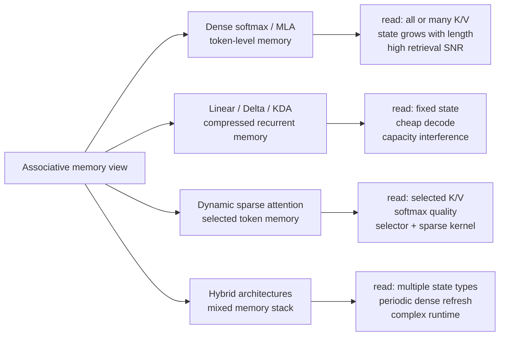
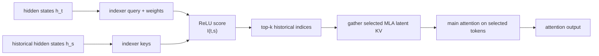
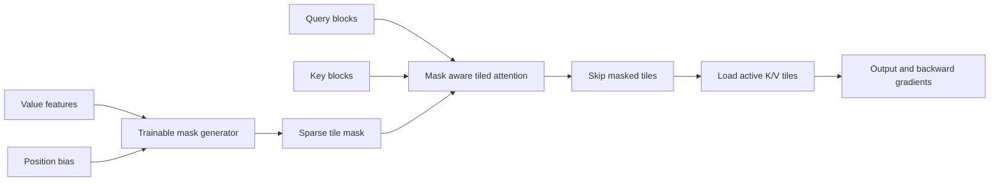
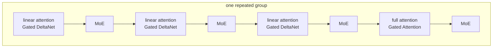
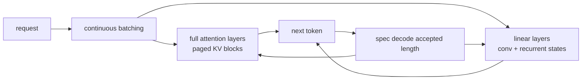
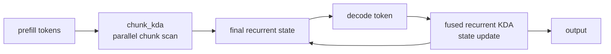
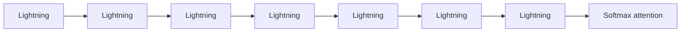

# 04 · FlashAttention 演进与长上下文算子

注意力机制（Self-Attention）是 Transformer 的核心算子，但标准实现受限于 $O(N^2)$ 的时间与显存复杂度。本章从 Online Softmax 的数学推导出发，彻底拆解 FlashAttention-1/2/3 的分块计算、Triton 核函数手写、反向传播推导与 Hopper WGMMA/TMA 架构优化，并进一步探索长上下文与序列并行前沿范式（Ring Attention、Striped Attention、DeepSeek Multi-Head Latent Attention MLA、Sliding Window 与序列切分 Cross-Entropy）。

---

## 第一部分：Online Softmax 算法原理与分块数学推导

### 5.1 Online Softmax 算法原理

#### 5.1.1 标准 Softmax（3-pass 算法）

给定输入向量 $\mathbf{x} = [x_1, x_2, \dots, x_N]$：

**第一遍（Pass 1）—— 求最大值：**
$$m = \max_{i=1}^{N} x_i$$
**第二遍（Pass 2）—— 求指数和：**
$$\ell = \sum_{i=1}^{N} \exp(x_i - m)$$
**第三遍（Pass 3）—— 归一化输出：**
$$y_i = \frac{\exp(x_i - m)}{\ell}$$
减去最大值 $m$ 是为了数值稳定性：避免 $\exp(x_i)$ 溢出。

**问题**：三遍各需完整遍历整行数据，总共从 HBM 加载 $3N$ 个元素。GPU 上全局内存带宽是最昂贵的资源。

#### 5.1.2 Online Softmax（1-pass 统计量计算）

Online Softmax 的核心思想：**在单次遍历中同时维护 running max 和 running exp sum，遇到新最大值时通过校正因子修正之前的部分和。**

初始化：$m_0 = -\infty$，$\ell_0 = 0$

处理第 $j$ 个元素 $x_j$ 时：
$$m_j = \max(m_{j-1}, x_j)$$
$$\ell_j = \ell_{j-1} \times \exp(m_{j-1} - m_j) + \exp(x_j - m_j)$$
**正确性推导**：处理完前 $j-1$ 个元素后，$\ell_{j-1} = \sum_{i=1}^{j-1} \exp(x_i - m_{j-1})$。新元素到来后，新最大值 $m_j = \max(m_{j-1}, x_j)$，我们需要：
$$\ell_j = \sum_{i=1}^{j} \exp(x_i - m_j)$$
拆开：
$$= \underbrace{\sum_{i=1}^{j-1} \exp(x_i - m_{j-1})}_{\ell_{j-1}} \cdot \underbrace{\exp(m_{j-1} - m_j)}_{\text{校正因子}} + \exp(x_j - m_j)$$
注意当 $m_j = m_{j-1}$ 时，校正因子 $= 1$，退化为简单累加。

处理完所有元素后仍需第二遍计算 $y_i = \exp(x_i - m_N) / \ell_N$。**总结：3-pass → 2-pass，内存流量 $3N → 2N$。**

#### 5.1.3 Block-wise Online Softmax（Flash Attention 的核心）

GPU 上以 block 为单位处理数据。设当前全局统计量 $(m, \ell)$，处理新 block $B_j$：

**Step 1：block 内局部统计量**
$$m_j^{\text{local}} = \max_{x \in B_j} x, \quad \ell_j^{\text{local}} = \sum_{x \in B_j} \exp(x - m_j^{\text{local}})$$
**Step 2：更新全局统计量**
$$m^{\text{new}} = \max(m, m_j^{\text{local}})$$
$$\ell^{\text{new}} = \ell \cdot \exp(m - m^{\text{new}}) + \ell_j^{\text{local}} \cdot \exp(m_j^{\text{local}} - m^{\text{new}})$$
**Step 3：校正之前的输出**（Flash Attention 中累积的 $O$ 矩阵）
$$O^{\text{new}} = O \cdot \frac{\ell \cdot \exp(m - m^{\text{new}})}{\ell^{\text{new}}} + \frac{\exp(m_j^{\text{local}} - m^{\text{new}})}{\ell^{\text{new}}} \cdot P_j \cdot V_j$$
这个公式就是 Flash Attention 的核心：**不需要物化完整的注意力矩阵**，只需在 SRAM 中逐 block 处理 K/V 并用 online softmax 维护归一化。

---

---

## 第二部分：FlashAttention-2 / 3 算法架构与 Triton 完整实现

## 6. Flash Attention

### 6.1 动机

标准自注意力 $\text{Attention}(Q, K, V) = \text{softmax}(QK^T / \sqrt{d}) \times V$ 需要物化 $N \times N$ 的注意力矩阵（$Q, K, V \in \mathbb{R}^{N \times d}$），内存 $O(N^2)$，带宽开销巨大。

Flash Attention 的核心思路：
1. **永远不物化 $N \times N$ 矩阵**：通过 tiling 在 SRAM 中逐块计算
2. **用 block-wise online softmax 增量式处理**（第 5 章已详述原理）
3. **中间结果保持在 SRAM**：GPU SRAM 带宽约 19 TB/s vs HBM 2 TB/s
4. **内存 $O(N^2) \to O(N)$**：只存输出 $O$ 和少量 softmax 统计量 $(m, \ell)$

---

### 6.2 Flash Attention 2 算法

**输入**：Q, K, V $\in \mathbb{R}^{N \times d}$，**输出**：O = softmax(QK^T / √d) × V

**分块**：Q 分为 $T_r$ 块（每块 $B_r$ 行），K/V 分为 $T_c$ 块（每块 $B_c$ 行）。

```
输入: Q_i ∈ R^{B_r × d}
初始化: O_i = 0, m_i = -∞, l_i = 0

对每个 K,V 块 j = 1, ..., T_c:
    S_ij = Q_i × K_j^T / √d              // 在 SRAM 中计算
    m_ij = rowmax(S_ij)                   // 当前块的行最大值
    m_new = max(m_i, m_ij)               // 更新全局最大值

    // 校正之前的结果（block-wise online softmax，见 5.1.3）
    l_i = l_i × exp(m_i - m_new)
    O_i = O_i × exp(m_i - m_new)

    P_ij = exp(S_ij - m_new)             // softmax 分子
    l_i = l_i + rowsum(P_ij)
    O_i = O_i + P_ij × V_j              // GEMM-II

    m_i = m_new

O_i = O_i / l_i                          // 最终归一化
```

**正确性**：修正因子 $\exp(m_{\text{old}} - m_{\text{new}})$ 将之前相对于 $m_{\text{old}}$ 计算的指数值转换为相对于 $m_{\text{new}}$ 的值：$\exp(x - m_{\text{old}}) \times \exp(m_{\text{old}} - m_{\text{new}}) = \exp(x - m_{\text{new}})$。展开后与标准公式完全一致。

**内存**：HBM 只需存储 Q, K, V（$3Nd$）、O（$Nd$）、统计量 m, l（$2N$）。SRAM 中临时存储 $O(B_r d + B_c d + B_r B_c)$，不随 $N$ 增长。

### 6.3 Triton Flash Attention 实现

**Stride 与地址计算**：Q 的 shape 是 `(batch, heads, seq_len, d_model)`，`stride` 是沿每个维度移动一个元素需要跳过的元素数。对行优先连续张量（`batch=2, heads=8, seq_len=512, d_model=64`）：

| stride | 对应维度 | 值 | 含义 |
|---|---|---|---|
| `stride_qb` | batch | $8 \times 512 \times 64 = 262144$ | 跳到下一个 batch |
| `stride_qh` | heads | $512 \times 64 = 32768$ | 跳到下一个 head |
| `stride_qm` | seq_len | $64$ | 跳到下一行（token） |
| `stride_qk` | d_model | $1$ | 跳到下一列（最内层连续） |

访问 `Q[b, h, m, k]` 的地址：`Q_ptr + b*stride_qb + h*stride_qh + m*stride_qm + k*stride_qk`。

代码中 `off_hz = tl.program_id(1)` 是 `batch × heads` 压扁后的索引，基地址用 `off_hz * stride_qh` 而非拆开算。这成立是因为连续 layout 下 `stride_qb = heads × stride_qh`，所以 `b * stride_qb + h * stride_qh = (b * heads + h) * stride_qh = off_hz * stride_qh`，一次乘法搞定。若 tensor 不连续（如做过 `transpose`），则需拆成 `off_hz // heads * stride_qb + off_hz % heads * stride_qh`。

**Q block 的指针矩阵构造**：`q_ptrs = Q_ptr + q_offset + offs_m[:, None] * stride_qm + offs_d[None, :] * stride_qk` 构造了一个 `[BLOCK_M, BLOCK_DMODEL]` 的指针矩阵，本质是把多维索引 `Q[b,h,m,d]` 手动展开为一维地址。分三部分：

```
Q_ptr + q_offset                → 定位到 (batch, head) 块的起始地址
+ offs_m[:, None] * stride_qm   → 行偏移，[BLOCK_M, 1] 列向量
+ offs_d[None, :] * stride_qk   → 列偏移，[1, BLOCK_DMODEL] 行向量
```

两个偏移通过广播相加得到完整的 2D 指针矩阵（假设 `start_m=1`, `stride_qm=64`, `stride_qk=1`）：

```
行偏移 (×64)          列偏移 (×1)              结果（相对偏移）
┌──────┐              ┌──────────────┐         ┌─────────────────────┐
│ 8192 │              │ 0  1  ... 63 │         │ 8192  8193  ... 8255│ ← Q[128, 0:64]
│ 8256 │       +      │ 0  1  ... 63 │    =    │ 8256  8257  ... 8319│ ← Q[129, 0:64]
│  ... │              │     ...      │         │         ...         │
│16320 │              │ 0  1  ... 63 │         │16320 16321  ...16383│ ← Q[255, 0:64]
└──────┘              └──────────────┘         └─────────────────────┘
[128,1] 广播           [1,64] 广播              [128,64] 指针矩阵
```

每个格子是一个内存地址，`tl.load(q_ptrs)` 一次将整个 `[BLOCK_M, BLOCK_DMODEL]` 的 Q block 加载到 SRAM。Triton 没有多维数组原生支持，所以必须用指针算术 + 广播来模拟 2D 块加载。

```python
import triton
import triton.language as tl
import torch


@triton.jit
def flash_attention_forward_kernel(
    Q_ptr, K_ptr, V_ptr, O_ptr,
    stride_qb, stride_qh, stride_qm, stride_qk,
    stride_kb, stride_kh, stride_kn, stride_kk,
    stride_vb, stride_vh, stride_vn, stride_vk,
    stride_ob, stride_oh, stride_om, stride_ok,
    N_CTX, sm_scale,
    BLOCK_M: tl.constexpr,
    BLOCK_N: tl.constexpr,
    BLOCK_DMODEL: tl.constexpr,
):
    """
    Flash Attention 2 Forward — Triton 实现。
    每个 program 处理一个 Q block (BLOCK_M 行) 在一个 (batch, head) 上。
    """
    start_m = tl.program_id(0)
    off_hz = tl.program_id(1)

    # 基地址偏移
    q_offset = off_hz * stride_qh
    k_offset = off_hz * stride_kh
    v_offset = off_hz * stride_vh
    o_offset = off_hz * stride_oh

    offs_m = start_m * BLOCK_M + tl.arange(0, BLOCK_M)
    offs_n = tl.arange(0, BLOCK_N)
    offs_d = tl.arange(0, BLOCK_DMODEL)

    # 加载 Q block（整个计算过程中驻留 SRAM）
    q_ptrs = Q_ptr + q_offset + offs_m[:, None] * stride_qm + offs_d[None, :] * stride_qk
    q = tl.load(q_ptrs, mask=offs_m[:, None] < N_CTX, other=0.0)

    # 初始化 online softmax 状态
    m_i = tl.zeros([BLOCK_M], dtype=tl.float32) - float('inf')
    l_i = tl.zeros([BLOCK_M], dtype=tl.float32)
    acc = tl.zeros([BLOCK_M, BLOCK_DMODEL], dtype=tl.float32)

    # 主循环：遍历 K/V blocks
    for start_n in range(0, N_CTX, BLOCK_N):
        start_n = tl.multiple_of(start_n, BLOCK_N)

        # 加载 K block
        k_ptrs = K_ptr + k_offset + (start_n + offs_n)[:, None] * stride_kn + offs_d[None, :] * stride_kk
        k = tl.load(k_ptrs, mask=(start_n + offs_n)[:, None] < N_CTX, other=0.0)

        # S = Q @ K^T * scale
        s = tl.zeros([BLOCK_M, BLOCK_N], dtype=tl.float32)
        s += tl.dot(q, tl.trans(k))
        s *= sm_scale
        s = tl.where(offs_m[:, None] < N_CTX, s, float('-inf'))
        s = tl.where((start_n + offs_n)[None, :] < N_CTX, s, float('-inf'))

        # Online softmax 更新（核心：block-wise 版本，见 5.1.3）
        m_ij = tl.max(s, axis=1)
        m_new = tl.maximum(m_i, m_ij)
        alpha = tl.exp(m_i - m_new)          # 校正因子
        p = tl.exp(s - m_new[:, None])       # softmax 分子
        l_i = l_i * alpha + tl.sum(p, axis=1)
        acc = acc * alpha[:, None]            # 校正之前的输出

        # 加载 V block 并累加
        v_ptrs = V_ptr + v_offset + (start_n + offs_n)[:, None] * stride_vn + offs_d[None, :] * stride_vk
        v = tl.load(v_ptrs, mask=(start_n + offs_n)[:, None] < N_CTX, other=0.0)
        acc += tl.dot(p.to(tl.float16), v)

        m_i = m_new

    # 最终归一化
    acc = acc / l_i[:, None]

    # 写回
    o_ptrs = O_ptr + o_offset + offs_m[:, None] * stride_om + offs_d[None, :] * stride_ok
    tl.store(o_ptrs, acc.to(tl.float16), mask=offs_m[:, None] < N_CTX)


def flash_attention_triton(q, k, v):
    """
    Flash Attention forward. q, k, v: (batch, heads, seq_len, d_model) fp16.
    """
    BLOCK_M, BLOCK_N = 128, 64
    batch, heads, seq_len, d_model = q.shape
    o = torch.empty_like(q)
    sm_scale = 1.0 / (d_model ** 0.5)
    grid = (triton.cdiv(seq_len, BLOCK_M), batch * heads)

    flash_attention_forward_kernel[grid](
        q, k, v, o,
        q.stride(0), q.stride(1), q.stride(2), q.stride(3),
        k.stride(0), k.stride(1), k.stride(2), k.stride(3),
        v.stride(0), v.stride(1), v.stride(2), v.stride(3),
        o.stride(0), o.stride(1), o.stride(2), o.stride(3),
        seq_len, sm_scale,
        BLOCK_M=BLOCK_M, BLOCK_N=BLOCK_N, BLOCK_DMODEL=d_model,
    )
    return o
```


### 6.4 反向传播

Flash Attention 的反向传播比前向更复杂，因为需要重新计算注意力矩阵（前向只存了 $O$, $m$, $\ell$，不存 $P$）。

#### 6.4.1 反向传播的数学

设 $P = \text{softmax}(S/\sqrt{d})$，$S = QK^T$，$O = PV$。给定上游梯度 $dO$：

**Step 1**：计算辅助量 $D_i = \sum_j dO_{ij} \cdot O_{ij}$（逐行点积）

**Step 2**：对每对 (Q block $i$, KV block $j$)：
- 重新计算 $S_{ij} = Q_i K_j^T / \sqrt{d}$
- 重新计算 $P_{ij} = \exp(S_{ij} - m_i) / \ell_i$（使用前向保存的 $m$, $\ell$）
- $dV_j \mathrel{+}= P_{ij}^T \cdot dO_i$
- $dP_{ij} = dO_i \cdot V_j^T$
- $dS_{ij} = P_{ij} \odot (dP_{ij} - D_i)$（逐元素，softmax 反传公式）
- $dQ_i \mathrel{+}= dS_{ij} \cdot K_j / \sqrt{d}$
- $dK_j \mathrel{+}= dS_{ij}^T \cdot Q_i / \sqrt{d}$

#### 6.4.2 Triton 反向传播（近似版本）

以下是反向传播的概念性 Triton 实现。实际生产代码通常分为两个 kernel（分别计算 dQ 和 dK/dV），此处合并展示核心逻辑。**注意：此版本为教学目的的简化版，可能存在边界处理和性能上的不足。**

```python
@triton.jit
def flash_attention_backward_kernel(
    Q_ptr, K_ptr, V_ptr, O_ptr, dO_ptr,
    dQ_ptr, dK_ptr, dV_ptr,
    L_ptr, M_ptr,             # 前向保存的 log-sum-exp (l) 和 max (m)
    stride_qb, stride_qh, stride_qm, stride_qk,
    stride_kb, stride_kh, stride_kn, stride_kk,
    stride_vb, stride_vh, stride_vn, stride_vk,
    stride_ob, stride_oh, stride_om, stride_ok,
    N_CTX, sm_scale,
    BLOCK_M: tl.constexpr,
    BLOCK_N: tl.constexpr,
    BLOCK_DMODEL: tl.constexpr,
):
    """
    Flash Attention 反向传播 — 简化版。
    每个 program 处理一个 Q block，遍历所有 K/V block 计算 dQ。
    dK 和 dV 通过 atomic_add 累加（生产代码应使用专门的 kernel 避免 atomic）。
    """
    start_m = tl.program_id(0)
    off_hz = tl.program_id(1)

    q_offset = off_hz * stride_qh
    k_offset = off_hz * stride_kh
    v_offset = off_hz * stride_vh
    o_offset = off_hz * stride_oh

    offs_m = start_m * BLOCK_M + tl.arange(0, BLOCK_M)
    offs_d = tl.arange(0, BLOCK_DMODEL)

    # 加载 Q block, O block, dO block
    q_ptrs = Q_ptr + q_offset + offs_m[:, None] * stride_qm + offs_d[None, :] * stride_qk
    q = tl.load(q_ptrs, mask=offs_m[:, None] < N_CTX, other=0.0)

    o_ptrs = O_ptr + o_offset + offs_m[:, None] * stride_om + offs_d[None, :] * stride_ok
    o = tl.load(o_ptrs, mask=offs_m[:, None] < N_CTX, other=0.0)

    do_ptrs = dO_ptr + o_offset + offs_m[:, None] * stride_om + offs_d[None, :] * stride_ok
    do = tl.load(do_ptrs, mask=offs_m[:, None] < N_CTX, other=0.0)

    # 加载前向保存的 softmax 统计量
    m_ptrs = M_ptr + off_hz * N_CTX + offs_m
    l_ptrs = L_ptr + off_hz * N_CTX + offs_m
    m_i = tl.load(m_ptrs, mask=offs_m < N_CTX, other=0.0)
    l_i = tl.load(l_ptrs, mask=offs_m < N_CTX, other=1.0)

    # Step 1: D_i = rowsum(dO * O)
    D_i = tl.sum(do.to(tl.float32) * o.to(tl.float32), axis=1)  # (BLOCK_M,)

    # 初始化 dQ 累加器
    dq = tl.zeros([BLOCK_M, BLOCK_DMODEL], dtype=tl.float32)

    offs_n = tl.arange(0, BLOCK_N)

    # Step 2: 遍历 K/V blocks
    for start_n in range(0, N_CTX, BLOCK_N):
        # 加载 K, V blocks
        k_ptrs = K_ptr + k_offset + (start_n + offs_n)[:, None] * stride_kn + offs_d[None, :] * stride_kk
        v_ptrs = V_ptr + v_offset + (start_n + offs_n)[:, None] * stride_vn + offs_d[None, :] * stride_vk
        k = tl.load(k_ptrs, mask=(start_n + offs_n)[:, None] < N_CTX, other=0.0)
        v = tl.load(v_ptrs, mask=(start_n + offs_n)[:, None] < N_CTX, other=0.0)

        # 重新计算 S 和 P
        s = tl.dot(q, tl.trans(k)) * sm_scale                    # (BLOCK_M, BLOCK_N)
        p = tl.exp(s - m_i[:, None]) / l_i[:, None]              # 重新计算 softmax
        p = tl.where((start_n + offs_n)[None, :] < N_CTX, p, 0.0)

        # dP = dO @ V^T
        dp = tl.dot(do, tl.trans(v))                              # (BLOCK_M, BLOCK_N)

        # dS = P * (dP - D_i)  — softmax 反传公式
        ds = p * (dp - D_i[:, None]) * sm_scale                  # (BLOCK_M, BLOCK_N)

        # dQ += dS @ K
        dq += tl.dot(ds.to(tl.float16), k)

        # dV += P^T @ dO (简化: atomic_add，生产代码应避免)
        # dK += dS^T @ Q (简化: atomic_add)
        # 这里省略 dV/dK 的原子累加，实际实现需要专门处理

    # 写回 dQ
    dq_ptrs = dQ_ptr + q_offset + offs_m[:, None] * stride_qm + offs_d[None, :] * stride_qk
    tl.store(dq_ptrs, dq.to(tl.float16), mask=offs_m[:, None] < N_CTX)
```

**上述简化版的已知问题**：
1. **前向未保存统计量**：反向期望从 `M_ptr`/`L_ptr` 加载 $m$ 和 $\ell$，但前向 kernel 没有将它们写回 HBM。完整实现需要在前向最终归一化前增加 `tl.store` 写出 `m_i` 和 `l_i`。
2. **dK/dV 完全缺失**：代码只计算了 dQ，dK 和 dV 的累加在注释中提及但未实现。
3. **精度损失**：`ds.to(tl.float16)` 在 `tl.dot` 前将梯度截断为 FP16。反向传播中梯度值可能很小，FP16 截断会导致明显的数值误差。应保持 FP32 或使用 BF16。
4. **缺少编译器提示**：前向有 `tl.multiple_of(start_n, BLOCK_N)` 帮助编译器优化，反向遗漏了。

**反向传播的实现难点**：
1. **dK/dV 的累加**：多个 Q block 需要对同一个 K/V block 的梯度求和，生产代码通常使用专门的 kernel（外层循环遍历 K/V block，内层遍历 Q block）以避免 atomic 操作。
2. **重计算的代价**：反向需要重新计算 $S$ 和 $P$，计算量约为前向的 2.5 倍。但相比存储 $N \times N$ 的 $P$ 矩阵，重计算更划算。
3. **数值精度**：反向中 $\exp(S_{ij} - m_i) / \ell_i$ 的重计算必须与前向一致，包括相同的 max 和 sum 值。

---

### 6.5 Flash Attention 3：Hopper 架构优化

FA2 在 A100 上能达到 ~70% 利用率，但在 H100 上仅 ~35%。原因是 Hopper 引入了全新的硬件能力（异步 Tensor Core、TMA、FP8），FA2 的同步设计无法利用。FA3 是针对 Hopper 的完全重写。

#### 6.5.1 三大核心改进

**1. Warp 特化（Warp Specialization）**

FA2 中所有 warp 同质化工作——既做数据加载又做计算。FA3 将 warp 分为两类角色：

```
┌─────────────────── CTA (Thread Block) ───────────────────┐
│                                                           │
│  Producer Warps              Consumer Warps               │
│  ┌──────────────┐           ┌──────────────────────────┐  │
│  │ TMA load K_j │──SMEM──→ │ WGMMA: S = Q @ K^T       │  │
│  │ TMA load V_j │──SMEM──→ │ Softmax: P = softmax(S)  │  │
│  │ (环形缓冲)    │           │ WGMMA: O += P @ V        │  │
│  └──────────────┘           └──────────────────────────┘  │
│  寄存器少 ← setmaxnreg → 寄存器多（GEMM 累加器）           │
└───────────────────────────────────────────────────────────┘
```

- **Producer**：专门用 TMA（Tensor Memory Accelerator）从 HBM 异步加载数据到 shared memory 的环形缓冲区
- **Consumer**：专门用 WGMMA（warpgroup 级矩阵乘）做计算
- **`setmaxnreg`**：Hopper 新指令，动态重分配寄存器——producer 释放寄存器给 consumer，让 GEMM 累加器有更多空间

**2. 两级流水线：GEMM-Softmax 交叠**

FA2 的瓶颈：两个 GEMM（$S = QK^T$ 和 $O = PV$）之间隔着 softmax，严格串行。FA3 利用 WGMMA 的异步语义打破这个依赖：

```
时间 →
──────────────────────────────────────────────────
迭代 j:   [GEMM0: S_j=QK_j^T]  [softmax(S_j)]  [GEMM1: O+=P_j·V_j]
迭代 j+1:                       [GEMM0: S_{j+1}] [softmax(S_{j+1})]  [GEMM1]

↓ 交叠后：

迭代 j:   [GEMM0_j] [softmax_j + GEMM0_{j+1}] [GEMM1_j]
                     ↑ softmax 用标量单元(MUFU)
                     ↑ GEMM0 用 Tensor Core
                     → 两者可以同时执行！
```

核心：发射 `GEMM0_{j+1}` 后不等待完成（`commit_group` 但不 `wait_group`），立刻用 MUFU 做 `softmax_j`。两者使用不同的硬件单元，真正并行。

**3. Pingpong 调度（双 Warpgroup 交替）**

即使有了两级流水线，softmax 的 MUFU 吞吐量（~3.9 TFLOPS）比 GEMM 的 Tensor Core（~989 TFLOPS FP16）低 ~256 倍，仍可能占据可观的时钟周期。Pingpong 用两个 warpgroup 互相掩盖：

```
时间 →
WarpGroup 0: [GEMM] [softmax] [GEMM] [softmax] ...
WarpGroup 1:        [GEMM] [softmax] [GEMM] [softmax] ...
                     ↑ WG1 做 GEMM 时 WG0 做 softmax
                            → softmax 完全被隐藏
```

两个 warpgroup 通过 `bar.sync` 硬件屏障交替执行，softmax 延迟完全藏在对方的 GEMM 执行时间内。

#### 6.5.2 FP8 支持：Incoherent Processing

FP8 的问题：transformer 中 Q/K 常有少量"outlier"维度值特别大，FP8 的动态范围无法同时表示大值和小值。

**解决方案**：乘以随机正交矩阵 $M$（Hadamard + 随机符号翻转）"打散"outlier：
$$\text{Attention}(Q, K, V) = \text{softmax}\left(\frac{(QM)(KM)^T}{\sqrt{d}} \right) V$$
因为 $MM^T = I$，数学结果不变：$(QM)(KM)^T = QMM^TK^T = QK^T$。但乘以 $M$ 后各维度幅值趋于均匀，FP8 量化误差降低 2.6 倍。$M$ 的应用通过 Fast Walsh-Hadamard Transform 实现，复杂度 $O(d \log d)$，可与 RoPE 融合零额外开销。

#### 6.5.3 Triton 实现的可行性与局限

| FA3 技术 | Triton 可行性 | 说明 |
|---|---|---|
| Warp 特化 | **不可行** | Triton 抽象层隐藏了 warp 级控制，无法指定 producer/consumer 角色 |
| `setmaxnreg` | **不可行** | Triton 不暴露寄存器分配指令 |
| TMA | **部分可行** | Triton 3.0+ 开始支持 `tl.async_copy` 等 TMA 原语，但不如 CUDA 灵活 |
| WGMMA 异步语义 | **不可行** | Triton 的 `tl.dot` 是同步的，无法做 commit-without-wait 式流水线 |
| Pingpong 调度 | **不可行** | 需要 warpgroup 级屏障控制，Triton 无此抽象 |
| 两级 GEMM-softmax 流水线 | **有限** | Triton 编译器可能自动做一些指令级重排，但无法显式控制 |
| FP8 + block 量化 | **可行** | Triton 支持 FP8 类型和 `tl.dot` 的 FP8 操作数 |
| Incoherent processing | **可行** | Hadamard 变换是逐元素 + butterfly 操作，可用 Triton 实现 |
| 基本的 online softmax tiling | **可行** | 这是 FA2 的核心，Triton 已能良好支持（如前文实现） |

**结论**：FA3 的核心优势（warp 特化、异步流水线、pingpong）深度依赖 Hopper 的底层硬件原语，必须用 CUDA/CUTLASS 实现。Triton 能做的是 FA2 级别的 tiling + online softmax + FP8 量化，大约对应 FA3 性能的 50-60%。这也解释了为什么 FA3 是用 CUDA（基于 CUTLASS 3.x）而非 Triton 编写的。

---

---

## 第三部分：现代长上下文架构与序列并行系统范式

## 一、先用 Associative Memory 统一理解

论文《Understanding Transformer from the Perspective of Associative Memory》给了一个很好用的视角：Transformer 里的 attention 和 FFN 都可以看成 associative memory。所谓 associative memory，就是把很多 `(key, value)` 关系存起来；给一个 query，系统根据 query 和 key 的相似度取回对应 value。

这个视角特别适合理解 2025 年之后的 efficient attention，因为新方法本质上都在改三个问题：

| 问题 | Dense softmax 的回答 | Linear / Delta / KDA 的回答 | Dynamic sparse 的回答 |
|---|---|---|---|
| 记忆存在哪里 | 每个历史 token 都保留一条 K/V | 历史被压进固定大小 recurrent state | K/V 仍保留，但每步只读一小部分 |
| 怎么读记忆 | query 对所有历史 key 做 softmax | query 读压缩后的状态矩阵 | query 先选候选 token，再 softmax |
| 主要代价 | KV cache 和 HBM 读流量随长度增长 | 多条记忆压在同一个 state 里会互相干扰 | selector、top-k、gather 和 sparse kernel 复杂 |

先把最简单的线性 associative memory 写清楚。每个 token 写入一个外积：key 负责“什么时候应该被读到”，value 负责“读到后返回什么”。

最朴素的线性记忆可以写成：

$$
S_t = \sum_{i \le t} \phi(k_i)v_i^T,\qquad o_t = S_t^T\phi(q_t)
$$

这里 `S_t` 是历史信息压缩后的 key-to-value 状态。它把所有历史 token 的外积加进同一张矩阵里。decode 的时候只要维护 `S_t`，不需要保留每个 token 的 K/V。下面 DeltaNet 和 KDA 的公式也沿用这个方向；如果你把 state 写成 value-to-key，所有公式整体转置即可。

这个公式的好处和问题都很直接：

- 好处：每来一个 token，只更新固定大小的 `S_t`；decode 时也只读这个状态，状态大小不随上下文长度线性增长。
- 问题：很多记忆被加到同一个矩阵里。读 `S_t` 时，目标 value 会出来，但其他 key 与 query 有非零相似度时，也会带来噪声。

Dense softmax attention 不这么压缩。它保留所有历史 key/value：

$$
o_t = \sum_{i \le t} \text{softmax}(q_t k_i^T)_i v_i
$$

这带来两个系统后果：

| 方案 | 记忆形态 | Decode 状态 | 优点 | 代价 |
|---|---|---|---|---|
| Dense softmax / MLA | 每个 token 一条 KV 记录 | 随上下文增长 | retrieval 强，位置清楚 | HBM 读流量和 KV cache 大 |
| Linear / Delta / KDA | 固定大小 recurrent state | 基本不随上下文增长 | decode 省显存和带宽 | 多个记忆会互相干扰 |
| Dynamic sparse | 先选少量历史 token，再 softmax | KV 仍在，但每步只读一部分 | 保留 softmax retrieval | 需要选择器和 sparse kernel |
| Hybrid | 不同层使用不同记忆 | 混合状态 | 工程上更稳 | runtime 更复杂 |

这篇论文最值得记的不是“attention 像 memory”这个类比，而是它把 memory capacity 说成 retrieval signal-to-noise ratio。读某条记忆时，目标 value 是 signal，其他被一起读出来的 value 是 noise。线性记忆里，噪声来自其他 key 与 query 的残余内积；存得越多、key 越不正交，noise 越大。

softmax 的优势来自 exponential kernel：相似 key 的权重会被指数放大，不相似 key 的权重会被压得很小。它不是没有代价，而是用“保留 token-level KV + 每步读更多历史”换来了更尖锐的 retrieval。线性 / delta / KDA 的优势则是相反的：用固定状态降低 decode 成本，但必须接受 state capacity 和 interference 的约束。

可以把这个 trade-off 记成一句话：

```text
softmax attention: expensive but high-SNR retrieval
linear / delta memory: cheap decode but compressed, interference-prone retrieval
dynamic sparse: keep softmax retrieval, reduce how much history each query reads
hybrid: use cheap memory for most layers, keep dense/sparse retrieval as refresh path
```

这也是为什么“无限 context”不等于“无限智能”。如果历史只是被压到固定大小 state 里，长度增加并不会自动增加可可靠读取的容量；如果历史全部保留成 KV，容量更强，但系统要支付 KV cache、HBM bandwidth、scheduler 和 kernel 的成本。

DeltaNet 的更新可以理解成“写入新记忆前，先从旧状态里消掉和当前 key 冲突的部分”：

$$
S_t = (I - \beta_t k_t k_t^T)S_{t-1} + \beta_t k_t v_t^T
$$

这个式子比普通线性累加多了一步“擦除”：`(I - β_t k_t k_t^T)S_{t-1}` 先沿当前 key 方向清掉旧状态里可能冲突的内容，再写入新的 `k_t v_t^T`。所以 DeltaNet 不是单纯累加历史，而是在做一种 online memory update。

Gated DeltaNet 再加衰减门，让旧记忆可以逐通道忘掉。Kimi Delta Attention 继续把这个门做得更细，不再只用一个标量衰减整条状态。你可以把这些方法理解成在回答同一个问题：固定大小 state 既然会拥挤，那写入时应该怎样覆盖、擦除、保留旧记忆？

整体结构可以画成：



系统评估围绕三个状态问题展开：

1. 历史信息保存在什么数据结构里？
2. 每个 decode token 要读多少历史状态？
3. 这个状态能不能被 paged KV、continuous batching、spec decode 正确管理？

面试或读论文时可以按下面这张表追问，不要只背方法名：

| 追问 | 为什么重要 |
|---|---|
| memory 是 token-level KV、compressed state，还是二者混合？ | 决定 cache manager 要保存什么 |
| retrieval 是 high-SNR softmax，还是从压缩 state 里读？ | 决定长上下文事实回看能力 |
| update 有没有 erase / gate / decay？ | 决定固定 state 如何处理冲突记忆 |
| decode 每步读写多少 HBM？ | 决定长输出 serving 和 RL rollout 吞吐 |
| spec decode 回滚时 state 能否恢复？ | 决定工程上能不能接入现代推理栈 |

---

## 二、长上下文 Attention 的三条路线

长上下文 attention 的设计压力主要来自两端：

```text
1. prompt 变长：1M context、代码仓库、agent 轨迹、RAG 历史。
2. output 变长：reasoning model 和 RL rollout 会生成几万甚至更多 token。
```

如果模型每步 decode 都读完整 KV cache，长输出会把 serving 卡在 memory bandwidth 上。于是新方案基本沿三条路走：

| 路线 | 代表 | 做法 |
|---|---|---|
| 选择历史 | DeepSeek DSA、DMA | 保留 token 级历史，但每个 query 只读被选中的部分 |
| Prefill sparse routing | DHSA | frozen backbone 外接层次化 chunk/token routing，主要减少长上下文 prefill 成本 |
| 压缩历史 | Qwen3-Next Gated DeltaNet、Kimi KDA、MiniMax Lightning Attention | 把历史写入固定状态，decode 只读 state |
| 混合层 | Qwen3-Next、Kimi Linear、MiniMax-M1 | 大多数层用便宜记忆，少数层用 dense attention 兜底 |

这不是“谁替代谁”。更现实的设计是：

```text
cheap recurrent layers 负责长程、低成本状态传播
periodic dense / MLA layers 负责高精度 token retrieval
sparse selector 负责在巨大历史里减少无效读取
```

### 2.1 2025+ 方法地图

Associative Memory theory 在这里不是一条方法路线，而是读这些方法的坐标系：它解释为什么 softmax retrieval 和 compressed recurrent memory 的能力不同。下面这张表只列具体架构或系统路线。

| 工作 / 路线 | 核心问题 | 状态形态 | 系统瓶颈 | 读论文时要追问 |
|---|---|---|---|---|
| DeepSeek DSA | 1M context 下不想每步读完整 MLA cache | KV 仍在，query 选 top-k | indexer + top-k + sparse MLA kernel | selector 成本是否小于省下的 KV 读流量 |
| DMA / DHSA | 用动态 mask / routing 减少 attention work | mask / hierarchy indices | mask 训练、block 稀疏 kernel | 稀疏模式能否在 GPU 上真的变快 |
| Qwen3-Next | 长上下文吞吐 + high-sparsity MoE | recurrent state + periodic full attention | mixed cache manager | spec decode 和 continuous batching 如何提交/回滚 state |
| Kimi Linear | 用 KDA 强化 recurrent memory | chunk state + recurrent state | chunk kernel / recurrent kernel | 3:1 hybrid ratio 如何平衡 retrieval 和 bandwidth |
| MiniMax-M1 | 长输出 reasoning / RL rollout | Lightning state + periodic softmax | 长 decode bandwidth + MoE dispatch | 输出 80K token 时 scheduler 怎么控 KV/state |

一个实用判断是把方法先分成三类，再看真正的系统瓶颈：

| 方法类型 | 典型例子 | 重点看什么 | 容易踩的坑 |
|---|---|---|---|
| **完整 KV，但少读** | DeepSeek DSA、动态 mask sparse attention | selector 成本、top-k/gather 开销、sparse attention kernel 是否真的快 | FLOPs 降了但 HBM 访问不连续，线上 latency 不一定降 |
| **历史写进 recurrent state** | DeltaNet、KDA、Lightning Attention | state 容量、erase/gate/decay 机制、state lifecycle | decode 省带宽，但固定 state 可能丢精确事实检索能力 |
| **Hybrid** | Qwen3-Next、Kimi Linear、MiniMax-M1 | paged KV、recurrent state、conv state、spec draft state 能否一起管理 | 模型结构稳了，但 runtime 复杂度明显上升 |

第一类方法的核心不是“少存”，而是“少读”。例如 DSA 仍然保留历史 KV / MLA latent cache，只是每个 query 先用 lightweight indexer 选 top-k 历史 token。读论文时要追问：selector 本身要不要扫全历史？top-k 和 gather 是否能 batch 化？稀疏 kernel 的访存是否连续？如果这些问题处理不好，理论 FLOPs 下降不会等价于线上 latency 下降。

第二类方法把历史压进 recurrent state，适合长输出 decode、RL rollout 和 agent loop。KDA、Lightning、Gated DeltaNet 的共同收益是每步不再读完整 token KV；但固定 state 不是无限容量，关键要看写入时有没有 erase、gate、decay，能不能避免旧 memory 和新 memory 互相污染。系统上还要问 state 什么时候创建、更新、复制、回滚和释放。

第三类 hybrid 是当前大模型更常见的折中：多数层用便宜 recurrent memory 降低带宽，少数 dense / MLA / softmax 层做 retrieval refresh。它的难点已经从单个 attention kernel 变成 runtime：同一个 request 可能同时有 paged KV、recurrent state、conv state；spec decode 失败时 draft token 的这些状态都要回滚；continuous batching 换 slot 时也必须跟着 request id 正确迁移。

---

## 三、DeepSeek Dynamic Sparse Attention

DeepSeek-V3.2 把 Dynamic Sparse Attention 放在 MLA 框架下面。它不是简单 sliding window，也不是固定 block sparse。每个 query 会先经过一个 lightweight indexer，选出最值得看的历史 KV，再对这些选中的 KV 做 attention。

<details class="exercise">
<summary><span class="q-label">Review</span> <span class="q-text">MLA 是什么？为什么 DSA 要接在 MLA latent KV 上？</span></summary>

MLA（Multi-head Latent Attention）可以理解成一种 **KV cache 压缩版 dense attention**。普通 MHA / GQA 在 decode 时为每个历史 token 保存 key 和 value；MLA 不直接缓存完整 per-head K/V，而是把 K/V 压到更低维的 latent 表示里，decode 时再从 latent 恢复出 attention 需要的部分。

一个简化视角：

```text
普通 KV cache:
  token_i -> K_i, V_i
  decode 每步读很多完整 K/V

MLA latent cache:
  token_i -> c_i^{KV}
  decode 每步读压缩 latent，再投影/恢复给 attention 使用
```

所以 MLA 解决的是 **每个 token 存得更省**，不是“每步少看 token”。如果上下文有 1M token，MLA 仍然可能要从大量历史 latent entry 里做 retrieval，只是每条 entry 比完整 KV 小。

DSA 接在 MLA 下面的意义是：

- MLA 先降低每条历史记录的 cache 体积；
- DSA 再减少每个 query 实际读取的历史记录数量；
- 两者叠加后，目标是同时降低 KV/cache footprint 和 decode HBM 读流量。

因此 DSA 的 `top-k` 不是去选完整 per-head KV，而是选择历史的 MLA latent entry，再让主 attention 在这些选中的 latent entry 上完成 softmax retrieval。

</details>

数据流可以画成这样：



DeepSeek report 里的 indexer score 形如：

$$
I_{t,s} = \sum_j w^I_{t,j}\,\text{ReLU}(q^I_{t,j}\cdot k^I_s)
$$

几个实现点比公式更重要：

- indexer head 很小，并且使用 ReLU，不用 softmax score 做选择，目的是让选择器吞吐更高。
- indexer 可以用 FP8 跑，因为它只负责排序选择，不直接生成最终 attention output。
- DSA 放在 MLA 的 latent KV 上，通常按 MQA 风格共享被选中的 latent entry，避免每个 query head 各自做一套大选择。
- 主 attention 仍然是 softmax retrieval，只是输入从“所有历史 token”变成“top-k token”。DeepSeek-V3.2 report 里的 sparse setting 使用每个 query 选择 2048 个 KV token；这不是小窗口，而是内容驱动的大预算稀疏检索。

### 3.1 训练为什么要分两段

DSA 的难点是：一开始 selector 不可靠。如果直接 sparse 训练，主模型会因为看不到该看的历史 token 而学习不稳定。DeepSeek 的做法是先 warm up indexer：

```text
stage 1: dense warm-up
  dense attention 正常跑
  冻结主模型参数
  只训练 indexer
  让 indexer 分布去匹配 dense attention 的聚合分布
  report 中使用 128K 长序列 warm-up，让 selector 先学长上下文检索

stage 2: sparse training
  打开 top-k token selection
  主模型和 indexer 一起训练
  indexer 输入 detach，避免主模型为了 indexer loss 改 hidden state
  indexer alignment loss 只在 selected top-k token set 上计算
```

这个设计说明 DSA 不是一个纯 runtime trick。它改变了模型训练分布，需要模型在 sparse retrieval 下继续适配。

### 3.2 Kernel 里真正发生什么

传统 decode attention 的内层循环大概是：

```text
for each query:
  for each KV block in full context:
    load K/V
    update softmax statistics
```

DSA 改成：

```text
for each query:
  run indexer or reuse selected indices
  gather selected KV block / token indices
  only load selected K/V
  run sparse softmax attention
```

所以系统里会多出一类状态：`top-k indices`。GLM-5.2 的 IndexShare / IndexCache 正是在这个层面优化：MTP step 之间复用 indexer 选择结果，减少重复 sparse index 计算。

DSA 适合的场景：

- 上下文很长，但每个 query 真正需要的信息很稀疏。
- 模型已经在 sparse 模式下训练或继续训练过。
- runtime 能处理不规则 gather、top-k index buffer 和 sparse attention kernel。

不适合的场景：

- 短上下文，selector 开销盖过节省。
- 每步都需要全局精细比较，top-k 很难稳定覆盖目标 token。
- serving 系统只支持 dense paged KV，无法高效管理 sparse index。

---

## 四、Dynamic Mask Attention 和层次化 sparse routing

DeepSeek DSA 是“先算 indexer score，再 top-k token”。Trainable Dynamic Mask Sparse Attention 走的是另一路：用 value 表征生成 content-aware mask，再让 sparse attention kernel 跳过被 mask 掉的 tile。

可以把 DMA 理解成：

```text
value features -> dynamic mask -> sparse weights -> FlashAttention-style tiled kernel
```

论文里的 mask 不是固定模式。它从 value 表征和可学习参数生成一个 position-aware sparse pattern，保留 top-w，其余位置写成 `-inf`。一个简化读法是：

$$
\delta = \exp(\tau(v \cdot \Delta) \cdot A)
$$

这里 `v` 提供内容特征，`\Delta` 和 `A` 提供位置相关的参数化偏置，`top-w` 决定每个 query 真正保留的稀疏连接。关键点是它把“内容”和“位置”同时放进 mask 生成器，而不是只靠局部窗口。

更直观的对比是把两者都写成“先决定看哪里，再做 attention”：

| 方法 | 选择信号 | 选择结果 | 主 attention 怎么算 |
|---|---|---|---|
| **DeepSeek DSA** | indexer query/key 打分：$I_{t,s}=\sum_j w^I_{t,j}\operatorname{ReLU}(q^I_{t,j}\cdot k^I_s)$ | 每个 query 选 token set：$\mathcal{T}_t=\operatorname{TopK}_s(I_{t,s})$ | 只在选中的 token 上做 softmax：$o_t=\sum_{s\in\mathcal{T}_t}\operatorname{softmax}_{s\in\mathcal{T}_t}(q_tk_s^T)v_s$ |
| **DMA** | value 表征 + 位置参数生成 mask score：$m_{b_q,b_k}=g(V_{b_k}, \Delta_{b_q,b_k})$ | 每个 query block / tile 得到 binary 或 sparse mask：$M_{b_q,b_k}\in\{0,1\}$ | mask 加到 QK score / tile 上：$\operatorname{softmax}(QK^T/\sqrt d + (1-M)(-\infty))V$ |

所以 DMA 里的可训练 mask/gate **不是直接乘在 V 上**。V 提供内容特征，用来生成“哪些 key/value tile 值得保留”的 mask；真正执行 sparse attention 时，这个 mask 作用在 QK score 或 block/tile 调度上：被 mask 掉的位置相当于 attention score 加 `-inf`，kernel 也可以直接跳过对应 tile 的 K/V 加载。保留下来的 tile 仍然用正常的 QK score 和 V 做 attention output。

两者的主要区别：

- **DSA 是 token-level retrieval**：先从完整历史里找 top-k token / latent entry，再在这个集合上做 softmax。它更像“内容检索器 + sparse MLA attention”。
- **DMA 是 mask-level sparsification**：先生成可训练的 content-aware sparse mask，再让 tiled attention kernel 按 mask 跳过无效区域。它更像“可学习稀疏模式 + block sparse kernel”。
- **DSA 的难点在 selector 是否选对 token**，以及 top-k/gather 是否比省下的 KV 读取更便宜。
- **DMA 的难点在 mask 是否可训练且硬件友好**，因为不规则 mask 如果不能变成连续 tile skip，理论稀疏率也不一定变成实际加速。

实现上有三个关键点：

1. mask 是可训练的，前向和反向都保留梯度路径，不只是推理时手写规则。
2. kernel 做 block-level skip。如果某个 Q/K tile 全部被 mask 掉，就不加载这个 tile 的 K/V，也不做 score 计算。
3. forward 和 backward 复用同一套 skip 逻辑，所以训练时不会 materialize 完整 attention matrix，内存仍然是 FlashAttention 风格的 `O(n)` 工作流。



和 DSA 的差别：

| 维度 | DeepSeek DSA | DMA |
|---|---|---|
| 选择粒度 | token / latent entry top-k | mask / sparse tile |
| 选择器输入 | hidden state indexer | value-based mask generator |
| 主 attention | selected KV 上的 softmax | masked sparse attention |
| kernel 压力 | gather indices + sparse attention | mask-aware tile skipping |

DHSA 继续把选择做成层次化。它在论文实验里主要优化 prefill，decode 仍使用普通 dense attention；decode sparse 化属于尚未落地的方向。它不是 DSA 那种每个 decode query 都先 top-k 的在线选择器。

它的实现不是“平均切块”这么简单，而是：

```text
boundary predictor:
  在候选边界左右各取一个 local window
  用 standalone self-attention encoder 读 key features
  MLP 预测这里是否应该切出 chunk boundary

chunk routing:
  用 variable-length chunks 表示 key memory
  对 chunk 表征做 length-normalized pooling
  query block 先 ranking key chunks
  按预算展开 chunk 里的 token indices
  排序 indices，让 sparse attention 读内存更连续
```

这个方向更像给 frozen backbone 外接一个 sparse routing 模块，适合做 long-context prefill retrofit：

```text
query block
  -> boundary-aware chunk routing
  -> expand selected chunks into token indices
  -> sort / compact indices for memory locality
  -> sparse attention
```

这里的工程取舍很清楚：层次化 routing 降低 token-level 搜索范围，但会引入边界预测、chunk representation、候选 chunk 排序和 index compaction。

DSA、DMA、DHSA 可以按“选择器训练位置和作用阶段”区分：DSA 把 indexer 做进模型并继续训练，目标是 decode/prefill 都能少读 KV；DMA 把 mask 作为可微模块训练，并把稀疏性压进 kernel；DHSA 更像 frozen LLM 外挂 routing，重点先解决 long-context prefill。

---

## 五、Qwen3-Next：Gated DeltaNet 和周期性 full attention

Qwen3-Next 不是纯 linear attention 模型。配置和实现里，它采用周期性 hybrid layout：

```text
repeat 12 times:
  Gated DeltaNet -> MoE
  Gated DeltaNet -> MoE
  Gated DeltaNet -> MoE
  Gated Attention -> MoE
```

也就是 48 层里每 4 层有 1 层 full attention，其余 3 层用 Gated DeltaNet。

这个 layout 的系统含义是：attention cost 被 hybrid / recurrent path 压下来，但每层后面的 FFN 仍然是 high-sparsity MoE。Qwen3-Next-80B-A3B 把长上下文效率拆成两条线同时优化：

| 位置 | 设计 | 系统影响 |
|---|---|---|
| Attention | Gated DeltaNet + 周期性 Gated Attention | cache 不再只有 KV，还要管理 conv/recurrent states |
| FFN | high-sparsity MoE | active FLOPs 降低，但 expert dispatch / all-to-all / grouped GEMM 成为瓶颈 |
| Training / inference auxiliary | MTP | 提供额外 pretraining signal，并为 speculative decoding 留接口 |

因此分析 Qwen3-Next 不能只看 attention kernel。长上下文吞吐来自 attention state、MoE active ratio、MTP 和 serving scheduler 的共同作用。



Transformers 里的 `Qwen3NextGatedDeltaNet` 可以按四块读：

| 代码结构 | 作用 |
|---|---|
| `in_proj_qkvz` | 一次投影出 q/k/v/z |
| `in_proj_ba` | 投影出 beta 和 gate 参数 |
| depthwise causal `Conv1d` | 给 q/k/v 加局部卷积上下文，kernel size 通常是 4 |
| `conv_states` + `recurrent_states` | cache 里不再只是 KV，还要保存卷积状态和 recurrent state |

配置层面也很具体：Qwen3-Next 的 linear attention 默认有独立的 `linear_key_head_dim`、`linear_value_head_dim`、`linear_num_key_heads`、`linear_num_value_heads`，和 full attention 的 `num_attention_heads`、`num_key_value_heads` 分开。这说明它不是把 dense attention 换一个 kernel 名字，而是给 linear state 单独设计 head layout。

长 prompt prefill 和单 token decode 走不同路径：

```text
prefill / chunk:
  causal conv over sequence
  chunk_gated_delta_rule(...)
  return final recurrent state

decode seq_len == 1:
  causal_conv1d_update(...)
  recurrent_gated_delta_rule(...)
  update cache state
```

核心门控大概是：

```python
beta = sigmoid(b)
g = -exp(A_log) * softplus(a + dt_bias)
```

这表示每个 step 既有写入强度 `beta`，也有遗忘门 `g`。和 dense KV cache 不同，linear attention 层的 cache 不是“历史 token 列表”，而是“最后的卷积状态 + recurrent matrix/state”。

### 5.1 runtime 为什么麻烦

Hybrid 模型让 serving runtime 变复杂：



vLLM 这类 runtime 需要给不同 attention type 分配不同 cache group。full attention 层要 block table；linear attention 层要维护 state。做 speculative decoding 时，accepted length 同时影响两条路径：full attention 的 draft KV block 哪些可以提交、哪些要释放；linear attention 的 draft recurrent state 哪些可以 shift 成正式状态。

所以 Qwen3-Next 的价值不只在模型结构，也在它逼迫 runtime 支持 hybrid cache。

<details class="exercise">
<summary><span class="q-label">Review</span> <span class="q-text">Inference runtime 怎么支持 hybrid cache 和 speculative decoding？</span></summary>

这个点在系统设计里很容易被低估：full attention 的 cache 可以按 block table 提交或释放 draft token；linear attention 的 state 是递推结果，不能随便从中间切掉一个 rejected draft token。spec decode 里每次 accepted length 不同，runtime 必须同时维护 paged KV lifecycle 和 recurrent state lifecycle。

可以把每个 request 的 cache 拆成两组：

| cache group | 对应层 | 状态形态 | speculative decode 时怎么处理 |
|---|---|---|---|
| `full_attention` | 周期性 Gated Attention / MLA 层 | paged KV block table | draft token 产生 draft KV；accepted token 对应 block 提交；rejected token 对应 block 释放或回收到 free list |
| `linear_attention` | Gated DeltaNet 层 | conv state + recurrent state | draft token 更新临时 state；accepted length 决定临时 state 的前缀能否成为正式 state；rejected 后必须回滚到最后 accepted state |

一个简化的 runtime 流程：

```text
1. prefill
   full layers: 建 paged KV block table
   linear layers: 跑 chunk_gated_delta_rule，得到初始 recurrent state

2. draft decode
   full layers: 给 draft tokens 追加 draft KV blocks
   linear layers: 从正式 state 复制一份 draft state，逐 token recurrent update

3. verify
   verifier 得到 accepted length a

4. commit / rollback
   full layers:
     commit draft KV[0:a]
     free draft KV[a:]

   linear layers:
     if a == draft_len:
       draft final state -> official state
     else:
       rollback to checkpoint at accepted prefix
       or replay accepted tokens from last official state

5. continuous batching
   request 换 slot 时，paged KV handle 和 recurrent state handle 必须一起迁移
```

这里 full attention 和 linear attention 的难点不同。KV block 是 append-only 的 token 列表，天然适合按 accepted length 做截断；recurrent state 是递推压缩后的结果，如果只保存最后 state，就不知道中间某个 rejected token 之前的 state。因此 runtime 通常需要 checkpoint accepted-prefix state、保存 draft state chain，或者在 reject 后 replay accepted token。哪种方式更好取决于 draft length、state 大小和 replay 成本。

这也是 hybrid attention 对 vLLM / SGLang 这类 runtime 的新要求：cache manager 不能只懂 paged KV，还要懂不同 layer type 的 state ownership、draft/official 双状态，以及 batch scheduler 中 request-id 到 state-handle 的一致映射。

</details>

---

## 六、Kimi Linear：KDA、chunk kernel 与 recurrent decode

Kimi Linear 的核心是 Kimi Delta Attention。它从 Gated DeltaNet 出发，把衰减门做成更细粒度的通道门，并配合专门的 chunkwise algorithm。

KDA 的状态更新可以写成：

$$
S_t = (I - \beta_t k_t k_t^T)\,\text{Diag}(\alpha_t)S_{t-1} + \beta_t k_t v_t^T
$$

这里 `Diag(alpha_t)` 是逐通道衰减，不是一个全局标量。这让模型更灵活，但 kernel 也更难写。

Kimi Linear 不是全 KDA。论文报告的模型采用 3:1 的 KDA 到 global attention 比例，并在 MoE 架构里周期性插入 MLA/full attention 层。这个设计和 Qwen3-Next 的直觉类似：多数层省 cache，少数层保留强 retrieval。

### 6.1 FLA 里的 KDA kernel 怎么读

`flash-linear-attention` 里的 KDA 实现大致分两条路径：

```text
chunk_kda:
  用于 prefill / training
  输入 q, k, v, gate, beta
  分 chunk 并行扫描
  可以返回最终 recurrent state

fused_recurrent_kda:
  用于 decode
  每次读上一时刻 state
  更新 state
  输出当前 token
```

<details class="exercise">
<summary><span class="q-label">Review</span> <span class="q-text">FlashAttention 和 Flash Linear Attention 分别怎么从硬件角度做到 O(n)？</span></summary>

先区分两个不同的 “O(n)”：

| 名字 | 解决的问题 | O(n) 指什么 | 仍然贵在哪里 |
|---|---|---|---|
| **FlashAttention** | dense softmax attention 太吃 HBM / activation memory | 不 materialize $N \times N$ attention matrix，activation memory 近似随 sequence length 线性增长 | prefill 计算量仍是 $O(N^2)$，因为每个 query 还是要看所有 key |
| **Flash Linear Attention / KDA** | recurrent / linear attention 要高效训练和 decode | 如果 state size 固定，序列方向的读写和 decode 成本随 $N$ 线性增长 | state update 的矩阵形状、gate、scan、layout 会决定 Tensor Core / SRAM 利用率 |

### 1. FlashAttention：dense attention，但不把 attention matrix 落到 HBM

普通 attention 的朴素实现会做：

```text
S = Q K^T          # [N, N]
P = softmax(S)     # [N, N]
O = P V            # [N, D]
```

问题不是只有 FLOPs，而是中间的 `S` 和 `P` 太大。训练时如果把 `[N, N]` attention matrix 写回 HBM，长序列会被 HBM bandwidth 和 activation memory 卡死。

FlashAttention 的思路是 tiled attention：

```text
for Q tile:
  keep output accumulator O_tile in registers / SRAM
  keep online softmax stats m, l
  for K/V tile:
    load K_tile, V_tile from HBM to SRAM
    compute Q_tile @ K_tile^T
    update online softmax m, l
    update O_tile
  write final O_tile once
```

关键点：

- `Q/K/V` 分 tile 搬进 SRAM / shared memory，尽量复用。
- softmax 不能等所有 score 都算完再归一化，所以用 online softmax 维护每行的最大值 `m` 和归一化分母 `l`。
- attention score tile 用完就丢，不把完整 `N x N` score / probability matrix 写回 HBM。
- backward 可以重算局部 score tile，而不是保存完整 attention matrix。

所以 FlashAttention 的本质是 **IO-aware exact attention**：数学上还是 dense softmax attention，结果不变；硬件上把中间矩阵留在片上 memory，用重算换 HBM 写读。它让 activation memory 从接近 $O(N^2)$ 降到 $O(N)$，但 prefill FLOPs 仍然是 $O(N^2D)$。

### 2. Flash Linear Attention：不做 QK 全连接，而是维护 recurrent state

线性 / delta attention 的计算图不同。它不需要每个 query 和所有历史 key 两两打分，而是维护一个状态：

```text
state S_t stores compressed history
for token t:
  read S_{t-1}
  compute output o_t
  write S_t
```

KDA 的状态更新更复杂，有 gate、beta 和 delta-rule erase/write：

```text
S_t = update(S_{t-1}, k_t, v_t, gate_t, beta_t)
o_t = read(S_t, q_t)
```

如果逐 token 串行跑，训练 prefill 会很慢，因为 sequence 方向有依赖。FLA 的 `chunk_kda` 做的是 chunkwise parallel scan：

```text
split sequence into chunks

inside each chunk:
  用 Triton/CUDA tile 计算局部 recurrence
  产出 chunk 内 outputs
  产出 chunk final_state

across chunks:
  对 chunk final_state 做 prefix scan / state carry
  把前缀 state 传回每个 chunk
  修正 chunk 内 outputs 或继续计算
```

这和 FlashAttention 的共同点是：都尽量让热数据留在 SRAM / registers，减少 HBM 往返。不同点是：

- FlashAttention 的 tile 是 `Q tile x K/V tile`，目标是避免写 `N x N` attention matrix。
- Flash Linear Attention 的 tile 是 `sequence chunk x recurrent state`，目标是把串行 recurrence 变成可并行 scan。
- FlashAttention 仍读 token-level K/V 历史；KDA decode 只读上一时刻 recurrent state。

### 3. `chunk_kda` 和 `fused_recurrent_kda` 分别服务哪个热路径？

`chunk_kda` 面向 prefill / training：

```text
输入: q, k, v, gate, beta
工作: 分 chunk 做并行 scan
输出: token outputs + final recurrent state
```

它要关心的是：

- chunk size 是否能让 SRAM 容纳 state tile；
- state layout 是否让读写 coalesced；
- gate / beta / qk norm 是否能 fuse 进同一个 kernel，减少额外 launch；
- backward 是否能复用 chunk states，避免保存所有中间 state。

`fused_recurrent_kda` 面向 decode：

```text
输入: 当前 token q/k/v/gate/beta + 上一步 state
工作: 单步 read state -> output -> update state
输出: 当前 token output + 新 state
```

它要关心的是：

- 每个 request 的 state handle 是否能快速定位；
- continuous batching 换 slot 后 state index 是否仍然正确；
- spec decoding 接受不同 draft length 后，state 如何 commit / rollback；
- state read/write 是否比 full KV cache 读全历史更便宜。

### 4. 一句话对比

```text
FlashAttention:
  我仍然做 dense softmax attention，
  但用 tiling + online softmax 避免 materialize N^2 attention matrix。

Flash Linear Attention / KDA:
  我改变 attention 的状态形式，
  用 recurrent state + chunk scan 避免每个 query 读完整历史。
```

所以二者都叫 “Flash”，但 flash 的对象不同：FlashAttention flash 掉的是 dense attention 的中间矩阵 IO；FLA/KDA flash 掉的是 linear/recurrent attention 的串行 scan 和 state 读写瓶颈。

</details>



源码里还有几类工程开关：

| 开关 | 含义 |
|---|---|
| `use_qk_l2norm_in_kernel` | 在 kernel 内做 q/k normalization，少一次外部 kernel |
| `use_gate_in_kernel` | 在 kernel 内从 raw gate 计算 decay |
| `use_beta_sigmoid_in_kernel` | 在 kernel 内做 beta sigmoid |
| `return_intermediate_states` | 推理时返回中间 state，便于 continuous batching 或调试 |
| `state_v_first` | 调整 state layout，匹配后端 kernel 读写 |

`fused_recurrent_kda` 还要处理 continuous batching 和 spec decoding。源码里会看到类似 `IS_CONTINUOUS_BATCHING`、`IS_SPEC_DECODING`、`num_accepted_tokens`、`ssm_state_indices` 的分支。这些不是装饰参数，而是在告诉 kernel：同一个 batch 里的 request state 可能被重排，spec decode 之后每条 request 接受的 draft token 数也不同。

FlashKDA 这类后端通常会有硬约束，例如 bf16、固定 K/V 维度、不支持部分 GVA 场景、不支持 context parallel。准确的系统描述是：

```text
KDA 把 token 级 KV cache 换成 recurrent state，
但 runtime 仍然要管理 state layout、chunk/prefill kernel、decode recurrent kernel、
continuous batching 和 spec decode 下的 state 对齐。
```

---

## 七、MiniMax-M1：Lightning Attention 的长输出系统

MiniMax-M1 使用 hybrid MoE 和 Lightning Attention，目标是把 test-time compute 扩展到很长的输出。它的 attention 结构是：

```text
每 7 个 Lightning Attention / TransNormer blocks
后面接 1 个 softmax attention block
```

这仍然是 hybrid 思路：大多数层用便宜状态传播，周期性 softmax 层给模型更强的 token retrieval。

MiniMax-M1 的系统数字给出了长输出场景的量级：456B total、约 45.9B activated 的 hybrid MoE，支持 1M input context，M1-80k 版本最大输出 80K token。它的卖点不是“attention 名字更新”，而是在 100K 级生成长度下用更少 FLOPs 做 long reasoning rollout。

Lightning Attention 可以按 linear attention 的 IO-aware 版本理解。普通 dense attention 在 decode step `t` 要读 `K[0:t]` 和 `V[0:t]`；Lightning/TransNormer 风格的层把历史写进固定 recurrent state，decode 主要读这个 state。prefill 时不能简单串行扫 token，否则训练吞吐会很差，所以实现会把序列切成 chunk：chunk 内并行算局部贡献，chunk 间用 prefix-scan / recurrent carry 传递状态。系统收益来自两个地方：

```text
decode:
  不再每步扫描完整 KV history
  长输出时 HBM traffic 增长慢很多

prefill / training:
  用 IO-aware chunk algorithm 避免 materialize n x n attention matrix
  让长 context 和 RL rollout 的训练成本可控
```

为什么还要每 7 层接 1 层 softmax attention？原因和 Qwen/Kimi 类似：Lightning 层提供便宜的压缩记忆，softmax 层定期做显式 token retrieval。MiniMax-M1 的设计重点是把这两个东西放到大 MoE reasoning model 里，并证明长输出 RL 还能稳定训练。



MiniMax-M1 的系统经验也很关键。长输出 RL 训练时，training kernel 和 inference kernel 的数值精度不一致会放大成 rollout 质量问题；提高 LM output head 精度到 FP32 后，训练和推理 logprob 的相关性才恢复。这说明 efficient attention 不是 isolated layer choice，训练和推理 kernel 的数值一致性也会影响 RL。

---

## 八、怎么选方案：按 workload 判断

把名字拿掉，只看 workload，判断方式如下：

| 场景 | 更合适的 attention | 原因 |
|---|---|---|
| 中短 prompt、高精度 retrieval | Dense softmax / MLA | KV 成本还能接受，retrieval 最稳 |
| 1M prompt、每步只需要少量证据 | DSA / DMA | decode 时选历史比读全量 KV 更划算 |
| 很长 output、RL rollout、agent loop | DeltaNet / KDA / Lightning | decode state 小，长输出省 bandwidth |
| 通用大模型 | Hybrid | 单一 attention 很难同时满足 retrieval 和成本 |
| 已有 dense 模型 retrofit | DHSA 类外接 routing 或 sparse attention fine-tune | 不一定要从头预训练 |

### 8.1 一句话比较

```text
DSA: 我仍然存 KV，但每步先选哪些 token 值得看。
DMA: 我让可训练 mask 决定哪些 tile 可以跳过。
DHSA: 我主要优化 prefill，先动态切 key chunks，再按预算展开 token indices。
Qwen3-Next: 我让大多数层用 Gated DeltaNet，周期性 full attention 刷新 retrieval。
Kimi Linear: 我用更强的 KDA recurrent state，并配专门 chunk/recurrent kernel。
MiniMax-M1: 我用 Lightning Attention 支撑长输出，再周期性插入 softmax attention。
```

### 8.2 系统实现 checklist

实现或评估一个 efficient attention 方案时，论文复杂度只是起点，还需要检查：

1. Prefill 有没有高吞吐 chunk kernel？
2. Decode 是否只有单 token recurrent kernel，还是仍然会读大量历史 KV？
3. Cache manager 能否同时管理 paged KV 和 recurrent state？
4. Continuous batching 下，state 能否按 request 重排？
5. Spec decode 下，draft token 的 state 怎么回滚或提交？
6. 训练和推理 kernel 的数值路径是否一致？
7. Sparse selector 的 top-k / mask 开销是否真的小于省下的 attention 开销？

### 8.3 Streaming/H2O 这类 KV eviction 放在哪里？

StreamingLLM、H2O、SnapKV、PyramidKV 不是新的 token mixer，它们通常不改变 attention layer 的数学形式，而是改变 KV cache 保留策略。它们应该放在第 16 课的 KV cache 体系里理解：

```text
efficient attention architecture:
  改模型层怎么混合历史信息

KV eviction / compression:
  模型层基本不变，改 runtime 保留哪些 KV
```

这一区分很重要。DSA / KDA / Lightning 需要模型结构或 kernel 配合；H2O / StreamingLLM 更像 serving runtime 的 cache policy。前者改变“attention 怎么算”，后者改变“attention 能看到哪些历史”。

---

## 九、练习题

<details class="exercise">
<summary><span class="q-label">Q1</span> <span class="q-text">为什么 linear / delta attention 不能简单理解成“无限长上下文免费”？</span></summary>

它把历史压成固定大小 recurrent state，decode 的显存和带宽成本确实更低，但多个 key-value 记忆会叠加在同一个状态里。softmax attention 保留 token-level KV，retrieval signal 可以更尖；compressed memory 容量有限，远距离事实检索可能被其他记忆干扰。

</details>

<details class="exercise">
<summary><span class="q-label">Q2</span> <span class="q-text">DSA 和 KV eviction 的核心区别是什么？</span></summary>

DSA 的 KV 仍然保留在 cache 里，每个 query 先用 indexer 选择要读的 top-k 历史 token，再做 sparse attention；KV eviction 是把部分 KV 不再保留或迁出。DSA 主要减少每步读流量，eviction 主要减少存储压力。

</details>

<details class="exercise">
<summary><span class="q-label">Q3</span> <span class="q-text">为什么 Qwen3-Next / Kimi Linear / MiniMax-M1 都偏向 hybrid，而不是全 linear attention？</span></summary>

全 recurrent state 的 decode 成本最低，但精确 token retrieval 不如 softmax KV。Hybrid 让多数层承担低成本状态传播，周期性 dense / MLA / softmax attention 做全局检索刷新。这样能同时控制长输出成本和 retrieval 质量。

</details>

<details class="exercise">
<summary><span class="q-label">Q4</span> <span class="q-text">实现 hybrid attention runtime 时，cache manager 要多管理什么？</span></summary>

普通 dense attention 只管理 paged KV block。Hybrid runtime 还要管理 recurrent state、conv state、不同 layer type 的 state table，以及 spec decode 下 draft token 的提交/回滚。continuous batching 重排 request 时，这些 state 都要和 request id 对齐。

</details>

<details class="exercise">
<summary><span class="q-label">Q5</span> <span class="q-text">为什么 sparse attention 论文里的 FLOPs 降低不一定等于线上 latency 降低？</span></summary>

线上 latency 还取决于 selector、top-k、gather、sparse kernel、memory coalescing 和 scheduler。若稀疏模式导致非连续读、kernel launch 增多或 batch shape 更碎，节省的 matmul FLOPs 可能被 HBM 读和调度开销吃掉。

</details>

<details class="exercise">
<summary><span class="q-label">Q6</span> <span class="q-text">长输出 RL rollout 更适合关注哪类 attention 设计？</span></summary>

重点关注 decode 每步状态读写成本。KDA、Lightning、Gated DeltaNet 这类 recurrent / hybrid attention 在长输出下能减少 token-level KV 读流量；但如果任务需要频繁回看 prompt 中的精确证据，还需要周期性 dense / MLA 层或 DSA 式 sparse retrieval 兜底。

</details>

<details class="exercise">
<summary><span class="q-label">Q7</span> <span class="q-text">单选：Associative Memory 视角下，softmax attention 相比线性记忆的核心优势是什么？</span></summary>

**选项**：

- A. softmax attention 不需要保存历史状态
- B. softmax 的 exponential kernel 能把相似 key 的权重拉尖，通常有更好的 retrieval signal-to-noise ratio
- C. softmax attention 的 decode 显存一定比 DeltaNet 更小
- D. softmax attention 不需要 value，只需要 key

**答案：B**

**解析**：Associative Memory 论文的关键判断是 retrieval SNR。softmax 用 exponential kernel 放大相似 key、压低无关 key，所以目标 memory 的 signal 更突出；线性记忆把很多 `(key, value)` 外积压进同一个 state，读的时候更容易混入其他 memory 的残差。

</details>

<details class="exercise">
<summary><span class="q-label">Q8</span> <span class="q-text">单选：DeltaNet 的“delta update”主要想解决什么问题？</span></summary>

**选项**：

- A. 在写入新 memory 前，沿当前 key 方向擦掉旧 state 中冲突的部分，降低固定 state 的干扰
- B. 把所有历史 token 的 KV 完整保存下来，避免任何压缩
- C. 用 top-k selector 选择少量历史 token，再做 softmax attention
- D. 只减少 prefill FLOPs，不影响 decode state

**答案：A**

**解析**：普通线性记忆是累加外积，旧记忆会在固定 state 中互相干扰。DeltaNet 的更新项可以理解成先 erase 再 write：先消掉和当前 key 冲突的旧内容，再写入新的 key-value 关系。Gated DeltaNet 和 KDA 继续加强的是“哪些旧记忆该忘、哪些该保留”的控制能力。

</details>

---

---

## 第四部分：课后练习题与自测问答

## 九、练习题

<details class="exercise">
<summary><span class="q-label">Q1</span> <span class="q-text">为什么 linear / delta attention 不能简单理解成“无限长上下文免费”？</span></summary>

它把历史压成固定大小 recurrent state，decode 的显存和带宽成本确实更低，但多个 key-value 记忆会叠加在同一个状态里。softmax attention 保留 token-level KV，retrieval signal 可以更尖；compressed memory 容量有限，远距离事实检索可能被其他记忆干扰。

</details>

<details class="exercise">
<summary><span class="q-label">Q2</span> <span class="q-text">DSA 和 KV eviction 的核心区别是什么？</span></summary>

DSA 的 KV 仍然保留在 cache 里，每个 query 先用 indexer 选择要读的 top-k 历史 token，再做 sparse attention；KV eviction 是把部分 KV 不再保留或迁出。DSA 主要减少每步读流量，eviction 主要减少存储压力。

</details>

<details class="exercise">
<summary><span class="q-label">Q3</span> <span class="q-text">为什么 Qwen3-Next / Kimi Linear / MiniMax-M1 都偏向 hybrid，而不是全 linear attention？</span></summary>

全 recurrent state 的 decode 成本最低，但精确 token retrieval 不如 softmax KV。Hybrid 让多数层承担低成本状态传播，周期性 dense / MLA / softmax attention 做全局检索刷新。这样能同时控制长输出成本和 retrieval 质量。

</details>

<details class="exercise">
<summary><span class="q-label">Q4</span> <span class="q-text">实现 hybrid attention runtime 时，cache manager 要多管理什么？</span></summary>

普通 dense attention 只管理 paged KV block。Hybrid runtime 还要管理 recurrent state、conv state、不同 layer type 的 state table，以及 spec decode 下 draft token 的提交/回滚。continuous batching 重排 request 时，这些 state 都要和 request id 对齐。

</details>

<details class="exercise">
<summary><span class="q-label">Q5</span> <span class="q-text">为什么 sparse attention 论文里的 FLOPs 降低不一定等于线上 latency 降低？</span></summary>

线上 latency 还取决于 selector、top-k、gather、sparse kernel、memory coalescing 和 scheduler。若稀疏模式导致非连续读、kernel launch 增多或 batch shape 更碎，节省的 matmul FLOPs 可能被 HBM 读和调度开销吃掉。

</details>

<details class="exercise">
<summary><span class="q-label">Q6</span> <span class="q-text">长输出 RL rollout 更适合关注哪类 attention 设计？</span></summary>

重点关注 decode 每步状态读写成本。KDA、Lightning、Gated DeltaNet 这类 recurrent / hybrid attention 在长输出下能减少 token-level KV 读流量；但如果任务需要频繁回看 prompt 中的精确证据，还需要周期性 dense / MLA 层或 DSA 式 sparse retrieval 兜底。

</details>

<details class="exercise">
<summary><span class="q-label">Q7</span> <span class="q-text">单选：Associative Memory 视角下，softmax attention 相比线性记忆的核心优势是什么？</span></summary>

**选项**：

- A. softmax attention 不需要保存历史状态
- B. softmax 的 exponential kernel 能把相似 key 的权重拉尖，通常有更好的 retrieval signal-to-noise ratio
- C. softmax attention 的 decode 显存一定比 DeltaNet 更小
- D. softmax attention 不需要 value，只需要 key

**答案：B**

**解析**：Associative Memory 论文的关键判断是 retrieval SNR。softmax 用 exponential kernel 放大相似 key、压低无关 key，所以目标 memory 的 signal 更突出；线性记忆把很多 `(key, value)` 外积压进同一个 state，读的时候更容易混入其他 memory 的残差。

</details>

<details class="exercise">
<summary><span class="q-label">Q8</span> <span class="q-text">单选：DeltaNet 的“delta update”主要想解决什么问题？</span></summary>

**选项**：

- A. 在写入新 memory 前，沿当前 key 方向擦掉旧 state 中冲突的部分，降低固定 state 的干扰
- B. 把所有历史 token 的 KV 完整保存下来，避免任何压缩
- C. 用 top-k selector 选择少量历史 token，再做 softmax attention
- D. 只减少 prefill FLOPs，不影响 decode state

**答案：A**

**解析**：普通线性记忆是累加外积，旧记忆会在固定 state 中互相干扰。DeltaNet 的更新项可以理解成先 erase 再 write：先消掉和当前 key 冲突的旧内容，再写入新的 key-value 关系。Gated DeltaNet 和 KDA 继续加强的是“哪些旧记忆该忘、哪些该保留”的控制能力。

</details>

---
