# 09 · MoE 稀疏系统与后训练强化学习集群架构

大模型前沿已全面迈向万亿参数稀疏激活（MoE）与强化学习自我演进（RLHF / RLVR / GRPO）阶段。本章系统解构大规模分布式集群系统中最前沿的两大基石：**稀疏专家混合模型（MoE）体系**（Top-K 门控、DeepSeekMoE 细粒度专家、Expert Parallelism 与 All-to-All 通信优化、Grouped GEMM 与 SonicMoE 异步重叠）与**后训练强化学习基础设施（Post-Training Infra）**（从单机 TRL 到分布式集群 Forge / Ray、Rollout 与 Training 异构资源解耦、PPO / GRPO 系统工程权衡与动态显存弹性回收）。

---

## 第一部分：稀疏混合专家（MoE）架构、并行通信与算子加速

## 一、MoE 到底替换了 Transformer 的哪一部分

标准 Transformer block 可以粗略写成：

```text
x -> Attention -> residual -> FFN/MLP -> residual
```

MoE 通常替换的是 FFN/MLP：

```text
Dense FFN:
  y = W2 * activation(W1 * x)

MoE FFN:
  expert_id, weight = router(x)
  y = sum_k weight_k * Expert_k(x)
```

每个 expert 本质上仍然是一个 FFN：

```python
class Expert(nn.Module):
    def __init__(self, hidden, intermediate):
        self.w1 = nn.Linear(hidden, intermediate, bias=False)
        self.w2 = nn.Linear(intermediate, hidden, bias=False)

    def forward(self, x):
        return self.w2(F.silu(self.w1(x)))
```

MoE 的关键不是有很多 FFN，而是每个 token 只激活少数几个 expert：

```text
total experts = 128
top-k experts per token = 8

total parameters: all 128 experts
active parameters per token: only 8 experts
```

这就是 MoE 能扩 model capacity 的原因：

| 模型类型 | 每个 token 经过的参数 | 总参数 |
|---|---|---|
| Dense | 全部 FFN 参数 | 全部参数 |
| Sparse MoE | top-k experts | 所有 experts |

所以 Mixtral、DeepSeek-V3、Kimi K2、Qwen3-Next 这类模型经常写：

```text
total parameters 很大
active parameters per token 明显更小
```

active parameters 不等于真实 latency。真实 latency 还取决于 routing、dispatch、all-to-all、kernel padding、load balance 和并发。

---

## 二、router、top-k、capacity 与 load balance

### 2.1 Router 的数学形式

对每个 token hidden state `x`，router 输出每个 expert 的 score：

$$
s = x W_r
$$

再取 top-k：

```python
scores = x @ router_weight
probs = torch.softmax(scores, dim=-1)
topk_weight, topk_expert = torch.topk(probs, k=top_k, dim=-1)
topk_weight = topk_weight / topk_weight.sum(dim=-1, keepdim=True)
```

如果 `top_k=2`，一个 token 可能路由到：

```text
token 17 -> expert 3 with weight 0.62
         -> expert 9 with weight 0.38
```

输出是加权和：

$$
y = 0.62 \cdot E_3(x) + 0.38 \cdot E_9(x)
$$

### 2.2 Capacity factor

如果所有 token 都跑到同一个 expert，系统会崩。早期 MoE 常用 capacity 限制每个 expert 最多接多少 token：

```text
capacity_per_expert = ceil(capacity_factor * num_tokens * top_k / num_experts)
```

超过 capacity 的 token 可能被 drop、走 residual、或者用别的策略处理。

capacity 是算法和系统之间的硬接口：

| capacity 太小 | capacity 太大 |
|---|---|
| token drop 多，质量下降 | padding 多，算力浪费 |
| load 更均衡 | expert batch 变长，内存和 latency 上升 |
| kernel 更规整 | 热 expert 仍然可能拖尾 |

### 2.3 Load balancing loss

为了避免 router 把所有 token 都送去少数 experts，训练时常加 auxiliary loss。简化写法：

$$
\mathcal{L}_{balance} = E \sum_i f_i p_i
$$

其中：

```text
E = expert 数
f_i = 实际分到 expert i 的 token 比例
p_i = router 给 expert i 的平均概率
```

这类 loss 的目标是让 token count 和 probability mass 都更均匀。但 modern MoE 也在探索 auxiliary-loss-free load balancing，因为强行均衡可能牺牲 specialization。

---

## 三、从 GShard / Switch 到 DeepSeekMoE

MoE 的演进可以按四个问题来记：

```text
1. 怎么把专家并行扩到多设备？
2. 怎么让 routing 稳定训练？
3. 怎么减少每个 token 激活的专家数？
4. 怎么在 fine-grained expert 下把 kernel 跑满？
```

| 阶段 | 代表 | 重点 |
|---|---|---|
| GShard | top-2 MoE + sharding | 大规模 expert parallel 和 automatic sharding |
| Switch Transformer | top-1 routing | 简化 routing，降低通信和计算 |
| ST-MoE | stable training | router z-loss、稳定性和迁移 |
| Mixtral | decoder-only sparse MoE | top-2 experts，开源 LLM MoE 代表 |
| DeepSeekMoE | fine-grained experts + shared experts | 专家切得更细，保留 shared expert |
| DeepSeek-V3 / Kimi K2 / Qwen3-Next | frontier sparse MoE | 超大 total params，较小 active params，训练/推理系统压力更高 |

### 3.1 GShard：把 MoE 从“算法层”推进到“自动分片系统”

GShard 的重要性不只是 top-2 routing。它真正解决的问题是：Transformer 的 attention、embedding、非 MoE FFN 可以复制到每个设备上，但 expert 参数太大，必须按 expert 维度切到不同设备；同一个 block 里同时存在 replicated dense compute 和 sharded expert compute，编译器要自动插入跨设备通信。

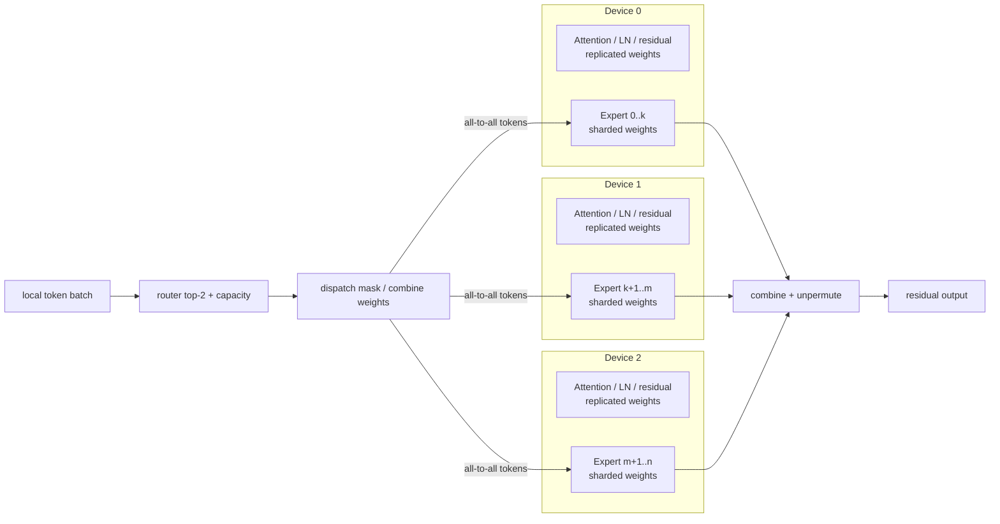

GShard 的 Transformer 改法是隔一层替换 FFN：

```text
standard encoder layer:
  self-attention -> dense FFN

GShard MoE encoder layer:
  self-attention -> MoE FFN

placement:
  attention / layernorm / residual: replicated
  experts: sharded by expert dimension
```

GShard 的 routing 不是对全 batch 做一个全局顺序分配，而是把 token 分成多个 group，每个 group 独立做 top-2 gating，并给每个 expert 一个固定 capacity。这样做的原因很系统：TPU/XLA 需要静态 shape，expert 输入 buffer 不能因为 router 动态选择而无限变长。

```python
def gshard_group_top2(tokens, router_w, num_experts, capacity):
    # tokens: [S, d], one group with S tokens
    # capacity: per-expert buffer slots inside this group
    gates = softmax(tokens @ router_w)          # [S, E]
    mean_gate = gates.mean(dim=0)               # differentiable proxy for load
    count = zeros(num_experts)                  # non-differentiable real load
    combine = zeros(S, num_experts, capacity)   # weighted combine tensor
    dispatch = zeros(S, num_experts, capacity)  # binary token dispatch tensor

    # first expert is deterministic top-1, subject to capacity
    for s in range(S):
        e1, e2 = top2_indices(gates[s])
        g1, g2 = gates[s, e1], gates[s, e2]
        g1 = g1 / (g1 + g2)

        slot = count[e1]
        if slot < capacity:
            dispatch[s, e1, slot] = 1
            combine[s, e1, slot] = g1
        count[e1] += 1

    # auxiliary loss pushes differentiable router mass toward real token load
    aux_loss = num_experts * sum((count / S) * mean_gate)

    # second expert is stochastic: weak second choices may be dropped
    for s in range(S):
        e1, e2 = top2_indices(gates[s])
        g1, g2 = gates[s, e1], gates[s, e2]
        g2 = g2 / (g1 + g2)

        slot = count[e2]
        if slot < capacity and uniform(0, 1) < 2 * g2:
            dispatch[s, e2, slot] = 1
            combine[s, e2, slot] = g2
        count[e2] += 1

    return dispatch, combine, aux_loss
```

MoE forward 可以写成四个张量操作。GShard 论文里用 `G,S,E,C,M,H` 表示 group、group 内 token、expert、expert capacity、model dim、hidden dim：

```text
gates = softmax(einsum("GSM,ME->GSE", inputs, router_w))
combine, dispatch = Top2Gating(gates)

expert_inputs  = einsum("GSEC,GSM->EGCM", dispatch, inputs)
expert_hidden  = relu(einsum("EGCM,EMH->EGCH", expert_inputs, w_in))
expert_outputs = einsum("EGCH,EHM->GECM", expert_hidden, w_out)
outputs        = einsum("GSEC,GECM->GSM", combine, expert_outputs)
```

这段写法的核心是把动态 routing 降成静态 tensor shape：

| 张量 | 作用 | 系统含义 |
|---|---|---|
| `dispatch[G,S,E,C]` | token 是否进入某个 expert slot | 决定 all-to-all 发送什么 |
| `combine[G,S,E,C]` | expert 输出按多少 gate weight 加回原 token | 决定 unpermute / reduce |
| `capacity C` | 每个 group 内每个 expert 的最大 token 数 | 控制静态 buffer 与 dropped token |
| `aux_loss` | 惩罚 router mass 和真实 token load 偏离 | 避免少数 expert 爆满 |

所以 GShard 的系统抽象是：模型代码仍然像单机线性代数，sharding annotation 告诉编译器哪些维度要切，SPMD compiler 再把 dispatch/combine 变成跨设备 all-to-all。后来的 MoE runtime 仍然在重复这件事，只是把 `einsum + static buffer` 换成了更手写的 token sort、expert map、grouped GEMM 和 NCCL all-to-all。

### 3.2 Switch Transformer：把 top-2 改成 top-1，牺牲一点表达换系统简单性

Switch Transformer 的核心选择是 top-1 routing：

```text
router(x) = argmax softmax(x W_router)
y = Expert_router(x)(x)
```

相对 GShard top-2，它少了一次 expert FFN、少了一份 token dispatch，也少了 combine 两个 expert 输出的逻辑。capacity 仍然存在：

```text
expert_capacity = tokens_per_batch / num_experts * capacity_factor
```

如果某个 expert 收到太多 token，超过 capacity 的 token 会被 drop，并通过 residual path 继续往后走。这个设计把问题变成一个更直接的 trade-off：

| capacity factor | dropped token | padding / memory | 通信量 | 质量风险 |
|---|---:|---:|---:|---|
| 小 | 多 | 低 | 低 | token 没有经过 FFN |
| 大 | 少 | 高 | 高 | 浪费 empty slots |

Switch 的意义是证明 top-1 并不会天然训练失败。router 仍然可训练，因为被选中的 gate probability 会乘到 expert output 或进入 auxiliary load balancing loss；系统上则明显更规整，尤其适合当 expert 数继续增大时控制通信和 buffer。

### 3.3 ST-MoE：把“能训起来”变成一等设计目标

ST-MoE 关心的问题不是再把 expert 数堆大，而是 sparse model 的训练稳定性和 downstream transfer。稀疏模型常见的不稳定来自 router logits：softmax 前的 logit scale 变大后，少数 expert 概率尖峰会放大 load imbalance，训练 loss 可能突然 spike。

ST-MoE 的 router z-loss 可以理解为约束 router logits 的 log-partition：

```text
z = logsumexp(router_logits)
L_z = mean(z^2)
```

它和 load-balancing loss 的区别：

| loss | 约束对象 | 解决的问题 |
|---|---|---|
| load balancing loss | token 分到各 expert 的比例 | 防止 expert collapse / idle |
| router z-loss | router logits 的尺度 | 防止 routing 分布过尖、训练不稳定 |

ST-MoE 的经验教训是：MoE 的质量不只取决于 FLOPs 和参数量。很多稳定化手段，比如更强 dropout、更小学习率、更紧 clipping，可以让 loss 不炸，但可能牺牲预训练质量。router z-loss 的价值在于用很小的额外计算约束 router，而不是粗暴降低整个模型的学习能力。

### 3.4 Mixtral：decoder-only LLM MoE 的标准形态

Mixtral 把 MoE 放进 decoder-only Transformer，每层 FFN 都替换成 MoE。每个 MoE layer 有 8 个 experts，每个 token 选 2 个：

```text
g = Softmax(Top2(x W_router))
y = g_1 * SwiGLU_expert_1(x) + g_2 * SwiGLU_expert_2(x)
```

它和 GShard 的差异很关键：

| 维度 | GShard | Mixtral |
|---|---|---|
| 模型形态 | encoder-decoder MT scale-up | decoder-only LLM |
| MoE 位置 | 隔层替换 FFN | 每层 FFN 都是 MoE |
| expert function | ReLU FFN | SwiGLU FFN |
| routing | top-2 with more elaborate second expert handling | top-2 softmax over selected experts |
| 系统重点 | automatic sharding / TPU SPMD | single/multi-GPU inference、EP、grouped GEMM |

Mixtral 之后，工程问题从“编译器能不能自动切 expert”进一步变成“serving runtime 能不能在小 batch、decode-heavy、专家负载不均衡的情况下跑满”。这就是为什么 vLLM/SGLang/Triton MoE kernel 会强调 token align、expert sorting、quantized experts 和 fused grouped GEMM。

### 3.5 DeepSeekMoE：专家更细，通用知识走 shared expert

DeepSeekMoE 批评传统 MoE 的两个问题：

```text
knowledge hybridity:
  expert 太粗，一个 expert 被迫学习很多不相干知识

knowledge redundancy:
  多个 routed experts 都要重复保存通用知识
```

它的两个关键设计是 fine-grained expert segmentation 和 shared expert isolation：

```text
fine-grained expert segmentation:
  把一个大 expert 的 FFN intermediate dimension 切成 m 份
  expert 数从 N 变成 mN
  为保持计算量相近，top-K 也从 K 变成 mK

shared expert isolation:
  固定激活 Ks 个 shared experts
  routed experts 只负责更专门的知识
  为保持计算量，routed top-K 相应减少
```

这让 MoE 更像：

```text
shared dense path + many small sparse routed paths
```

而不是早期那种“几个很大的专家二选一”。

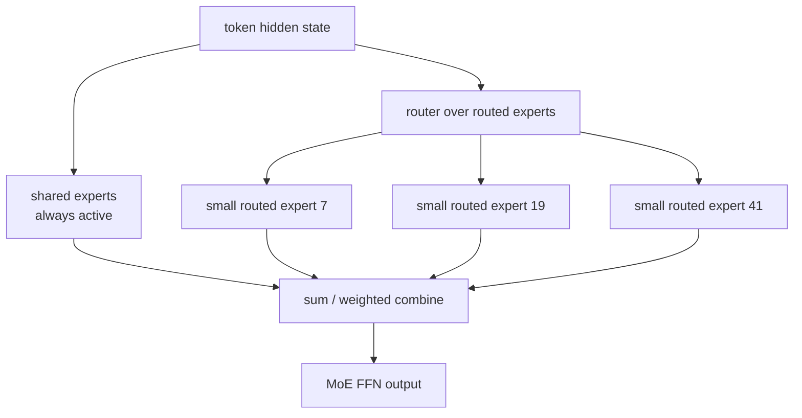

这个设计会改善 specialization，但系统压力也更大：expert 数更多以后，每个 expert 拿到的 token 更碎；top-k 更大以后 dispatch/combine 也更重；shared expert 虽然稳定了通用知识，但它是每个 token 都跑的 dense-ish 路径，kernel 不能只优化 routed expert。

### 3.6 Frontier MoE：DeepSeek-V3 / Kimi K2 / Qwen3-Next 的共同压力

Frontier MoE 不再只是“top-k 选几个 FFN”。它们同时改变 attention、routing、load balance、training objective 和 serving runtime。

DeepSeek-V3 延续 DeepSeekMoE，并把 load balancing 从纯 auxiliary loss 推向 auxiliary-loss-free bias update：

```python
for each training_step:
    # bias only changes routing decision, not the gate value used to weight FFN output
    route_score = affinity_score + expert_bias
    selected = topk(route_score, k=routed_k)
    gate = normalize(affinity_score[selected])

    run_selected_experts(selected, gate)

    for expert in experts:
        if load[expert] > target_load:
            expert_bias[expert] -= gamma
        else:
            expert_bias[expert] += gamma
```

这和传统 load-balance loss 的差别是：传统方法把“均衡”直接写进 loss，可能和 language modeling objective 冲突；bias update 把均衡更多放到 routing 控制面，gate value 仍来自原 affinity score。

Kimi K2、Qwen3-Next 这类模型把 sparse MoE 和长上下文 attention 一起设计。系统侧最难的是组合爆炸：

| 组件 | 省下的东西 | 新问题 |
|---|---|---|
| high-sparsity MoE | active FFN FLOPs | expert microbatch 更碎、all-to-all tail 更明显 |
| MLA / hybrid / recurrent attention | KV cache 或 attention FLOPs | cache manager 不再只有标准 KV block |
| MTP / speculative decoding | decode token 数 | draft/verify 与 expert route、KV provenance 对齐 |
| auxiliary-loss-free / sequence-wise balance | 减少 load-balance loss 对质量的干扰 | router control loop 需要监控全局 load |

所以 frontier MoE 的系统设计重点从单层 MoE kernel 扩展为全链路调度：prefill/decode disaggregation、EP/TP/PP 混合并行、expert placement、KV/cache placement、speculative decoding 回滚，以及 RL/post-training 时 old-policy routing 的可复现性。

### 3.7 Qwen3-Next：high-sparsity MoE 与 hybrid attention 绑在一起设计

Qwen3-Next-80B-A3B 是一个很适合用来理解 frontier MoE 的例子：名字里的 `80B-A3B` 表示 total parameters 约 80B，而每个 token 激活的参数规模约 3B。这个设计不是单独把 dense FFN 换成 MoE，而是和长上下文架构一起重做：

```text
Qwen3-Next block:
  hybrid attention:
    Gated DeltaNet + Gated Attention
  sparse FFN:
    high-sparsity MoE, very low activation ratio
  stability:
    zero-centered + weight-decayed LayerNorm
  inference/training auxiliary:
    Multi-Token Prediction
```

这组选择体现了一个更一般的系统趋势：

| 设计 | 省什么 | 带来的系统问题 |
|---|---|---|
| Gated DeltaNet / recurrent path | 长上下文 attention 的 quadratic cost | cache layout 不再只是标准 KV cache |
| 周期性 full / gated attention | 保留全局信息混合能力 | layer 类型混合，scheduler 和 kernel dispatch 更复杂 |
| high-sparsity MoE | 每 token active FLOPs | expert token batch 更碎，EP all-to-all 更敏感 |
| MTP | pretraining signal 与 spec decode 能力 | 训练/推理里多 token head 的一致性和 KV 来源要对齐 |

Qwen3-Next 的公开指标给出两个量级判断：Base 版相对 Qwen3-32B-Base 在 downstream tasks 上用约 10% total training cost 达到更强效果，并在 32K 以上上下文获得约 10x inference throughput；Instruct 版在部分 benchmark 上接近 Qwen3-235B-A22B-Instruct-2507，同时支持 256K 长上下文任务。这些数字说明 MoE 的价值不只是“总参数更大”，而是把训练成本、长上下文吞吐和模型容量放到同一个效率目标里。

### 3.8 Modern MoE research map

MoE 系统可以按三层读：

| 层次 | 代表 | 解决什么 | 失败信号 |
|---|---|---|---|
| routing algorithm | Switch、ST-MoE、DeepSeekMoE、Qwen3-Next | top-k、load balance、shared/routed experts、high sparsity | expert collapse、dead expert、router jitter |
| training kernel | MegaBlocks、SonicMoE | sparse training、activation caching、grouped GEMM、padding waste | tensor core 利用率低、activation HBM 峰值高 |
| serving runtime | vLLM fused MoE、SGLang align/sort、TritonMoE | token align/sort、expert map、quantized experts、EP all-to-all | p95 latency 长尾、small GEMM、all-to-all idle |
| RL correctness | Routing Replay、Keep Sampling Mask、GSPO | old/new policy logprob 对齐、router mismatch | importance ratio 噪声、训练发散、reward 上升但 eval 掉 |

这张表能避免把所有问题都归为“MoE 通信贵”。训练侧最怕 activation 和 backward memory；serving 侧最怕 bursty routing 和 p95；RL 侧最怕 old policy 生成 token 时的 expert choice 在 training recompute 中被改掉。

---

## 四、modern MoE 的系统瓶颈

一个 MoE forward 不是简单 `for expert in experts`。真实 pipeline 是：

```text
hidden states
  -> router top-k
  -> token dispatch / permutation
  -> expert computation
  -> combine / unpermute
  -> residual
```

分布式时还要：

```text
local tokens
  -> all-to-all send tokens to expert owner GPU
  -> local grouped GEMM over owned experts
  -> all-to-all send expert outputs back
  -> combine top-k outputs
```

### 4.1 Token dispatch

token 原本按 batch/sequence 连续存放：

```text
[t0, t1, t2, t3, t4, t5]
```

routing 后要按 expert 重排：

```text
expert 0: [t1, t4]
expert 1: [t0, t5]
expert 2: [t2]
expert 3: [t3]
```

这一步会产生 gather/scatter、prefix sum、index map、临时 buffer。小 batch 或专家很细时，这些非 GEMM 开销会非常明显。

### 4.2 Grouped GEMM

每个 expert 是一个小 GEMM：

```text
X_e [tokens_for_e, hidden] @ W_e [hidden, intermediate]
```

把很多 expert GEMM 合在一起，就是 grouped GEMM。

问题是每个 expert 的 token 数不同：

```text
expert 0: 128 tokens
expert 1: 17 tokens
expert 2: 3 tokens
expert 3: 240 tokens
```

GPU 喜欢规则大矩阵，不喜欢很多不均匀小矩阵。为了让 kernel 规整，系统经常需要 padding / rounding：

```text
17 -> round to 32
3  -> round to 32
```

这就是 padding waste。

### 4.3 All-to-all 通信

Expert parallel 下，每张 GPU 只持有部分 experts。token 要被发送到拥有对应 expert 的 GPU：

```text
GPU0 token routes to expert on GPU3
  -> send hidden state to GPU3
  -> GPU3 compute expert output
  -> send output back to GPU0
```

瓶颈可能从 compute 变成 communication：

| 问题 | 表现 |
|---|---|
| hot expert | 某张 GPU 收到太多 token，拖慢全局 |
| small message | all-to-all 启动开销高 |
| routing skew | 不同 microbatch 通信量波动大 |
| overlap 不好 | 通信和 expert compute 串行 |

---

## 五、fine-grained sparse MoE 为什么更难

Tri Dao 在 SonicMoE 相关文章里用两个量描述 modern MoE：

```text
granularity G = d / n
  d: FFN intermediate dimension
  n: expert 分割数

sparsity rho = K / E
  K: 每个 token 激活 experts
  E: 总 experts
```

趋势是：

```text
experts 越来越多
每个 expert 越来越小
每个 token 激活比例越来越低
```

这对模型容量很好，但对 kernel 很难：

| 模型趋势 | 系统后果 |
|---|---|
| expert 更细 | 每个 expert 的 GEMM 更小 |
| expert 更多 | routing/dispatch metadata 更多 |
| top-k 仍然不小 | 一个 token 复制到多个 experts，activation memory 上升 |
| sparse 更强 | load imbalance 更明显 |

如果用朴素实现，MoE 会出现“理论 FLOPs 少，但实际不快”的尴尬：

```text
GEMM 太小 -> tensor core 利用率差
padding 太多 -> 做了无效计算
activation cache 太大 -> HBM IO 成瓶颈
dispatch/combination 多 -> 非 GEMM 开销吃掉收益
```

这就是 SonicMoE 的切入点。

---

## 六、SonicMoE 解决了什么

SonicMoE 是 Dao-AILab 开源的高性能 MoE implementation，目标硬件包括 Hopper SM90、Blackwell datacenter SM100 和 Blackwell consumer SM120。它基于 CuTeDSL、Triton，以及 QuACK/CUTLASS grouped GEMM 思路。

它主要解决三个问题：

```text
1. fine-grained MoE activation memory 太大
2. sparse MoE grouped GEMM padding waste 太多
3. token dispatch / activation IO 和 expert compute 没有充分 overlap
```

### 6.1 Minimal activation caching

MoE 训练时反向传播需要保存 activation。top-k 越大、expert 越多，直接缓存每个 expert 输入会很贵：

```text
tokens duplicated by top-k
  -> expert input activations
  -> intermediate activations
  -> routing metadata
```

SonicMoE 的论文强调 minimal activation caching：尽量不把可以重算或可以更紧凑保存的 activation 全部落 HBM。这样做的目标是：

```text
减少 activation memory footprint
减少 HBM read/write
让更大的 batch / sequence / expert config 放得下
```

SonicMoE 在 fine-grained 7B MoE 上报告了约 45% 的 activation memory reduction。

### 6.2 Overlap memory IO with compute

MoE 的非 GEMM 部分很多：

```text
load token hidden
read routing indices
gather / scatter
write expert input
read expert output
combine top-k
```

如果这些都和 GEMM 串行，GPU 会在 HBM IO 和 compute 之间反复等待。

SonicMoE 的思路是把 IO 和 compute 管线化：

```text
tile 0: load / dispatch
tile 1: GEMM compute
tile 2: write / combine
```

理想状态：

```text
while tensor cores compute current tile:
    memory pipeline prepares next tile
```

这和 FlashAttention 的精神类似：不是只减少 FLOPs，而是减少 HBM 往返，并把不可避免的 IO 藏到 compute 后面。

### 6.3 Tile-aware token rounding

传统 grouped GEMM 为了对齐 kernel tile，会把每个 expert 的 token count round 到固定粒度：

```text
tokens_for_expert = 33
round_to_64 -> compute 64 rows
31 rows are padding
```

fine-grained expert 下，很多 expert token count 都很小，padding 比例会爆炸。

SonicMoE 的 tile-aware token rounding 不是盲目 round，而是让 routing / rounding 更贴合 kernel tile 使用。相比 vanilla top-k，这个策略在保持类似模型效果的同时带来额外 kernel speedup。

理解方式：

```text
算法 router 看到的是 expert 概率
kernel 看到的是 tile occupancy

SonicMoE 试图让二者对齐：
  route quality 不明显下降
  grouped GEMM tile 更饱满
```

### 6.4 SonicMoE 的定位

SonicMoE 不是一个完整训练框架，而是 MoE kernel / layer implementation。它回答的是：

```text
给定 routed tokens 和 expert weights，怎样把 MoE layer 在 Hopper/Blackwell 上跑快？
```

它和 Megatron、DeepSpeed、vLLM、SGLang 这类系统的关系更像：

```text
training/serving framework
  -> calls MoE layer implementation
  -> MoE layer calls optimized grouped GEMM / dispatch kernels
```

---

## 七、代码层面怎么理解 MoE forward

### 7.1 朴素 PyTorch 版本

先写一个慢但清楚的版本：

```python
def naive_moe_forward(x, router, experts, top_k):
    # x: [num_tokens, hidden]
    scores = x @ router.weight.T
    probs = torch.softmax(scores, dim=-1)
    topk_weight, topk_expert = torch.topk(probs, top_k, dim=-1)
    topk_weight = topk_weight / topk_weight.sum(dim=-1, keepdim=True)

    out = torch.zeros_like(x)

    for expert_id, expert in enumerate(experts):
        # token_mask: [num_tokens, top_k]
        token_mask = topk_expert == expert_id
        if not token_mask.any():
            continue

        token_idx, route_idx = token_mask.nonzero(as_tuple=True)
        expert_input = x[token_idx]
        expert_output = expert(expert_input)
        out[token_idx] += expert_output * topk_weight[token_idx, route_idx].unsqueeze(-1)

    return out
```

这段代码正确但很慢，因为：

- Python loop over experts
- 每个 expert 做一个小 GEMM
- gather/scatter 不连续
- 没有 grouped GEMM
- top-k duplicate tokens 带来很多 index 操作

### 7.2 高性能实现的结构

优化实现会把上面逻辑拆成几个 kernel：

```text
router_topk_kernel
  -> topk_expert, topk_weight

dispatch_kernel
  -> sorted_token_ids
  -> expert_offsets
  -> packed_expert_inputs

grouped_gemm_kernel
  -> expert outputs

combine_kernel
  -> unpermute outputs
  -> apply topk weights
```

可视化：

```text
original token order:
  t0 t1 t2 t3 t4

routed:
  t0 -> e2
  t1 -> e0
  t2 -> e2
  t3 -> e1
  t4 -> e0

packed by expert:
  e0: t1 t4
  e1: t3
  e2: t0 t2

grouped GEMM:
  [e0 GEMM] [e1 GEMM] [e2 GEMM]

combine:
  output back to t0 t1 t2 t3 t4 order
```

### 7.3 SonicMoE usage 直觉

SonicMoE 的 public API 暴露为一个 MoE module，使用方式类似：

```python
from sonicmoe import MoE
from sonicmoe.enums import ActivationType

moe = MoE(
    num_experts=128,
    num_experts_per_tok=8,
    hidden_size=4096,
    intermediate_size=1536,
    activation_function=ActivationType.SWIGLU,
    add_bias=False,
)

y = moe(x, router_logits)
```

模型代码只看到 module 边界；系统实现真正要解决的是内部张量布局问题：

```text
input hidden states are token-major
expert weights are expert-major
grouped GEMM wants tile-friendly packed layout
output must return to original token order
```

### 7.4 vLLM / SGLang fused MoE 的实现映射

vLLM fused MoE 路径里的关键变量：

```text
hidden_states:      [num_tokens, hidden]
topk_ids:           [num_tokens, top_k]
topk_weights:       [num_tokens, top_k]
sorted_token_ids:   routed tokens sorted/grouped by expert
expert_ids:         each block should use which expert weight
num_tokens_post_padded:
                    routed token count after padding to BLOCK_SIZE_M
w1 / w2:            expert weights
```

这组变量正好对应 MoE kernel 的核心问题：

```text
router output 是 token-major:
  token -> top-k experts

grouped GEMM 想要 expert-major:
  expert -> contiguous tokens
```

所以 fused MoE 不是一个 GEMM kernel，而是一条 pipeline：

```text
topk_ids/topk_weights
  -> align_and_sort
  -> sorted_token_ids + expert_ids + padded_count
  -> grouped GEMM for gate/up projection
  -> activation (SwiGLU/SiLU)
  -> grouped GEMM for down projection
  -> weighted combine + unpermute
```

SGLang fused MoE 也有类似的 align/sort 预处理。它的实现讨论里特别强调：在 MoE kernel launch 之前，先把 token 按 expert 对齐和排序；早期 Triton 路线会拆成多阶段，后来 CUDA 路线把部分阶段合并，减少小 workload 下的 launch 和寄存器/缓存浪费。

### 7.5 一个简化 Triton grouped GEMM kernel

Simplified illustrative kernel；production vLLM/SGLang/PyTorch kernels 还要处理 quantization、stride、split-K、FP8、expert map、all2all、persistent scheduling 等细节。

```python
import triton
import triton.language as tl


@triton.jit
def grouped_gemm_moe_kernel(
    X, W, Y,
    sorted_token_ids, expert_ids,
    M_per_expert_offsets,
    H: tl.constexpr, I: tl.constexpr,
    BLOCK_M: tl.constexpr, BLOCK_N: tl.constexpr, BLOCK_K: tl.constexpr,
):
    pid = tl.program_id(0)

    # Each program owns one output tile. In real kernels, pid -> (expert, m_tile, n_tile)
    # mapping is built from a flattened tile schedule.
    expert = tl.load(expert_ids + pid)
    m_start = tl.load(M_per_expert_offsets + expert)
    token_block = tl.load(sorted_token_ids + pid * BLOCK_M + tl.arange(0, BLOCK_M))

    offs_m = tl.arange(0, BLOCK_M)
    offs_n = tl.arange(0, BLOCK_N)
    offs_k = tl.arange(0, BLOCK_K)

    acc = tl.zeros((BLOCK_M, BLOCK_N), tl.float32)

    for k0 in range(0, H, BLOCK_K):
        x = tl.load(
            X + token_block[:, None] * H + (k0 + offs_k[None, :]),
            mask=token_block[:, None] >= 0,
            other=0.0,
        )
        w = tl.load(
            W + expert * H * I + (k0 + offs_k[:, None]) * I + offs_n[None, :],
            mask=(k0 + offs_k[:, None] < H) & (offs_n[None, :] < I),
            other=0.0,
        )
        acc += tl.dot(x, w)

    tl.store(
        Y + (m_start + offs_m[:, None]) * I + offs_n[None, :],
        acc.to(tl.float16),
        mask=offs_n[None, :] < I,
    )
```

这个 skeleton 里最关键的是三件事：

| 代码变量 | 系统含义 |
|---|---|
| `sorted_token_ids` | dispatch 后的 token 顺序，不再等于原始 batch 顺序 |
| `expert_ids` | 每个 tile 绑定哪个 expert weight |
| `M_per_expert_offsets` | 每个 expert 在 packed buffer 里的起点 |

如果 expert token count 很不均匀，某些 expert 的 tile 很少，某些 expert 的 tile 很多。朴素 CTA 分配会导致 SM 工作不均。PyTorch 2025 的 Triton grouped GEMM 优化用 persistent kernel 思路：让一批 program 常驻 SM，按 `tile_id += NUM_SMS` 动态取活，而不是每个 tile 启一个完全独立的 wave。

### 7.6 为什么 fused gate/up 很重要

现代 FFN 常用 SwiGLU：

```text
up   = X @ W_up
gate = X @ W_gate
hidden = silu(gate) * up
out = hidden @ W_down
```

朴素实现会把 `up` 和 `gate` 都写回 HBM：

```text
read X
compute gate -> write HBM
compute up   -> write HBM
read gate/up
compute silu(gate) * up
write hidden
read hidden
compute down
```

fused gate/up 的目标是：

```text
一次读 X
同时算 gate/up
silu 和 multiply 在 register 里完成
尽量少把 intermediate 写回 HBM
```

TritonMoE 把 router、token permutation、expert GEMM、weighted combine 尽量融合，并通过 fused gate+up projection 减少全局内存流量。这个方向对 inference batch size 特别重要，因为 batch 小时 HBM/launch overhead 的占比比大 batch training 更高。

### 7.7 SonicMoE 与 grouped GEMM kernel 的关系

可以把几类工作放在同一张图里：

| 工作 | 关注点 | 典型问题 |
|---|---|---|
| vLLM/SGLang fused MoE | serving runtime 内的 fused experts | token align/sort、padding、quant、EP all2all |
| PyTorch Triton grouped GEMM | grouped GEMM kernel 本身 | persistent scheduling、L2 locality、SM 利用率 |
| TritonMoE | portable fused dispatch | 不写 CUDA，融合 router/dispatch/expert/combiner |
| SonicMoE | fine-grained MoE training layer | minimal activation caching、IO/compute overlap、tile-aware rounding |

SonicMoE 更偏训练和 fine-grained expert。它关心的不只是 forward 快不快，还包括 backward 要不要保存大量 activation：

```text
save everything:
  simple backward
  huge activation memory

minimal activation caching:
  save compact metadata
  backward recompute selected tensors
  lower HBM footprint
```

所以 SonicMoE 的贡献不能只说“MoE kernel 更快”。更准确是：

```text
它把 MoE layer 当成 IO-bound + irregular grouped GEMM + backward activation memory
三者耦合的问题来解，而不是只优化 forward grouped GEMM。
```

---

## 八、系统调度层：MoE 不是单卡 kernel 问题

### 8.1 EP All-to-All 的调度问题

Expert Parallelism 下，token 要先被送到 expert 所在 GPU，再把输出送回来：

```text
local hidden states
  -> local router top-k
  -> all-to-all dispatch hidden states
  -> local expert grouped GEMM
  -> all-to-all combine expert outputs
  -> restore original token order
```

系统调度要回答：

```text
每张 GPU 放哪些 experts？
top-k 后每张 GPU 会收到多少 routed tokens？
all-to-all 和 local expert compute 能不能 overlap？
hot expert 会不会让某一张 GPU 成为 straggler？
```

如果 batch 很小，EP 往往不划算，因为 all-to-all 的固定延迟压过了 expert 参数分片的收益。经验上要看：

```text
tokens_per_expert_per_step
all_to_all_time / moe_layer_time
expert_gemm_utilization
p95 expert token count / mean expert token count
```

### 8.2 Serving 里的 MoE 调度比训练更难预测

训练 batch 通常更规则：

```text
固定 global batch
固定 sequence packing
较稳定的 token count
```

Serving batch 是动态的：

```text
短请求和长请求混在一起
prefill 和 decode 混在一起
不同用户 prompt 导致 routing 分布不同
continuous batching 每轮 batch 都变
```

所以 MoE serving 的瓶颈经常在 p95/p99，而不是平均 tokens/s：

| 现象 | 可能原因 |
|---|---|
| 平均吞吐还行，p99 latency 很差 | 少数 hot experts 拖尾 |
| batch 越大反而没线性提升 | all-to-all 或 grouped GEMM padding 增长 |
| prefix cache 命中高但 latency 仍高 | attention 省了，MoE layer 仍要 route/dispatch/compute |
| spec decode 收益不稳定 | target/draft MoE router 分布不同，verify batch 形状抖动 |

### 8.3 MoE + Speculative Decoding 的特殊坑

Dense target + dense draft 已经有 acceptance ratio 问题。MoE target 再多一层 routing：

```text
draft proposes token d
target verifies token d
target MoE router chooses experts per layer
```

如果 target 的 routing 在不同 batch shape、不同 precision、不同 runtime 下不稳定，训练/推理一致性会受影响。对 RL 来说更麻烦，因为 rollout logprob 和 training logprob 都要重算：

```text
rollout side:
  vLLM/SGLang computes logprob with one MoE routing implementation

training side:
  Megatron/FSDP computes logprob with another MoE routing implementation
```

这就是第 14 课里提到 `rollout_expert_indices` / router replay 的意义。MoE 不只是 serving 性能问题，也会变成 RL correctness 问题。

### 8.4 该怎么 profile 一个 MoE layer

不要只看总 step time。至少拆成：

```text
router_topk_time
align_sort_time
all_to_all_dispatch_time
grouped_gemm_w1_time
activation_time
grouped_gemm_w2_time
combine_unpermute_time
all_to_all_combine_time
padding_waste_ratio
expert_load_cv
```

其中两个指标最有诊断价值：

| 指标 | 解释 |
|---|---|
| `padding_waste_ratio` | rounded tokens / real tokens，判断 kernel tile 浪费 |
| `expert_load_cv` | expert token count 的 coefficient of variation，判断 routing skew |

优化顺序通常是：

```text
先看 load balance
再看 all-to-all
再看 grouped GEMM utilization
最后再抠单 kernel micro-optimization
```

---

## 九、训练和 serving 里的工程 checklist

### 9.1 训练侧

| 检查项 | 为什么重要 |
|---|---|
| router entropy | 太低说明 expert collapse |
| expert token histogram | 看 hot expert / dead expert |
| auxiliary loss scale | 太大损伤 specialization，太小负载不稳 |
| dropped token rate | capacity 太小会掉质量 |
| all-to-all time | 判断是否通信瓶颈 |
| grouped GEMM utilization | 判断 expert batch 是否太碎 |
| activation memory | 决定 batch/sequence 能开多大 |

MoE 训练最常见的问题不是 loss 立刻 NaN，而是：

```text
少数 experts 过热
大量 experts 学不到东西
all-to-all p95 长尾拖慢 step time
aux loss 降了主任务质量
```

MoE pretraining 还多出三类 dense model 没有的耦合：

| 训练问题 | 系统表现 | 处理思路 |
|---|---|---|
| router collapse | 少数 expert 被持续打满，其他 expert 梯度稀疏 | router entropy / aux loss / z-loss / expert bias / capacity schedule |
| expert batch fragmentation | 每个 expert 只拿到很少 token，grouped GEMM tile 不饱满 | 更大的 global batch、expert parallel 重排、token packing、tile-aware rounding |
| stability vs specialization | load balance 太强会削弱 expert specialization，太弱会热专家拖尾 | 监控 per-expert token histogram、per-expert loss、all-to-all p95，而不是只看 global loss |

Qwen3-Next 这类 high-sparsity MoE 更强调稳定性工程：zero-centered / weight-decayed LayerNorm 用来降低长训练中的激活漂移，MTP 给 pretraining 提供更强的未来 token 监督，同时也为推理侧 speculative decoding 留接口。这里的关键不是某个 trick 单独生效，而是 sparse MoE、hybrid attention、long context 和 MTP 同时改变了 batch shape、activation range、cache layout 和 loss signal。

### 9.2 Serving 侧

推理时常见配置：

```text
TP: tensor parallel
EP: expert parallel
DP: data parallel / replica
ETP: expert tensor parallel
```

serving 的难点：

| 难点 | 说明 |
|---|---|
| decode batch 小 | 每步 token 数少，expert GEMM 更碎 |
| routing skew 动态变化 | 不同请求混 batch 后 expert 负载变 |
| KV cache 与 expert weights 抢显存 | MoE total params 大，显存压力高 |
| prefix cache 和 routing 无关 | 命中 prefix cache 不等于 MoE layer 免费 |
| speculative decoding + MoE | draft/target router mismatch 需要额外观测 |

### 9.3 MoE + RL 的特殊问题

RL rollout 和 training 可能不在同一套 inference engine 上。MoE 下要额外问：

```text
rollout 时 token 路由到了哪些 experts？
training 重新 forward 时 router 是否一致？
如果不一致，logprob 是否还是同一个 action distribution？
```

所以 RL infra 里记录 `rollout_expert_indices` 是有意义的。更强的系统可以做 router replay：

```text
rollout:
  save expert_indices per token/layer

training:
  force same expert routes when computing logprob
```

这能减少 train-inference mismatch，但会增加 framework 和 MoE kernel 的接口复杂度。

MoE RL 的困难比 dense RL 多一层：policy 不只由权重 $\theta$ 决定，还由 router 的离散 expert choice 决定。GRPO/PPO 的 importance ratio 默认比较的是同一条 token trajectory 在 old/new policy 下的概率；如果训练侧重新 forward 时 expert route 变了，token-level logprob 的差异里会混入 router implementation、precision、batch shape 和 expert load 的噪声。

```text
dense model:
  old policy token -> recompute logprob under new weights

MoE model:
  old policy token + old expert route
      -> recompute may choose a different expert route
      -> importance ratio no longer isolates policy update
```

GSPO 的序列级 ratio 缓解了这个问题：它对整段 response 的 normalized sequence likelihood 做 clipping，而不是强依赖每个 token 的 likelihood 都稳定。GRPO 在 MoE RL 中往往需要 Routing Replay 才能稳定收敛；GSPO 把 ratio 从 token level 移到 sequence level，减少了对这类重型 workaround 的依赖。系统含义是：

| 方法 | 需要记录什么 | 成本 | 适用判断 |
|---|---|---|---|
| Routing Replay | 每层每 token 的 expert ids | metadata + 通信 + kernel 接口复杂 | token-level PPO/GRPO 仍需要严格 logprob 对齐 |
| Keep Sampling Mask | top-p/top-k sampling mask | vocab mask 存储或重建 | 采样策略也可能导致 train/rollout mismatch |
| GSPO / sequence-level ratio | response-level likelihood ratio | 算法目标改变 | 更适合高稀疏 MoE 与 disaggregated RL infra |

---

---

---

## 第二部分：后训练强化学习（Post-Training RL）集群架构演进

## 一、引言：为什么 RL Infra 是独立的系统问题

### 1.1 Post-training 全景

一个 LLM 从预训练到上线，通常经历如下阶段：

```
Pre-training → SFT → RM 训练 → RLHF/RLVR → (Agentic RL)
```

每个阶段的**系统负载形态截然不同**。预训练是静态数据 + 大批次前向/反向传播，工程问题收敛于「吞吐量最大化」。RL 训练则引入了一个根本性的新约束：

> **训练数据由当前策略（policy）在线生产，而不是预先存储在磁盘上。**

这意味着每一个训练步，都必须先用当前模型做一批推理（rollout），把生成的结果当作训练样本，再做反向传播更新模型权重，然后同步更新推理侧的权重，再进行下一轮 rollout。这个「生成 → 训练 → 同步」的环，是 RL Infra 所有复杂性的根源。

### 1.2 RL 训练的独特负载形态

**生成是主要瓶颈。** 来自 16 个开源框架的实测数据表明，80–90% 的训练墙钟时间消耗在 rollout 生成上，而非反向传播。一个直观的数字：

| 配置 | 生成时间（每批 512 rollouts） |
|------|-------------------------------|
| 7B 模型 @ 6300 tok/s，输出 2K token | ~3 分钟 |
| 32B 模型 @ 1200 tok/s，输出 8K token | ~56 分钟 |
| **32B 模型 @ 1200 tok/s，输出 32K token（长推理）** | **~3.7 小时** |

这个数字直接说明：对于 GRPO 训练 DeepSeek-R1 这类长推理模型，**同步等待生成完成再做训练是不可接受的**。异步化不是优化，是必需。

**生成和训练的计算特征完全相反。** 推理引擎（vLLM/SGLang）围绕 decode 优化：paged KV cache、continuous batching、speculative decoding；训练引擎（Megatron/FSDP）围绕大批次前向反向：算子融合、gradient checkpointing、ZeRO 分片。两套系统不能用同一套内核和内存管理方式。这是「为什么不能用训练引擎直接做 rollout」的根本原因。

### 1.3 三难困境（贯穿全文的主线）

RL Infra 的设计本质上是在三个维度之间权衡：

```
       吞吐量 (Throughput)
            ▲
           / \
          /   \
         /     \
On-policyness ─── 灵活性 (Agentic/Env)
```

- **吞吐量**：让 GPU 尽可能忙，rollout 和 train 不互相等待
- **On-policyness**：训练样本来自当前策略，staleness（过时度）低，算法收敛好
- **灵活性**：支持复杂的 agentic 场景（工具调用、多轮对话、自定义 reward 函数）

没有框架能三者全得。这三维的取舍决定了每个框架的基本架构选择。

---

## 二、全景图：先看地图，再进森林

在进入细节之前，先建立整体坐标系。

### 2.1 框架版图（2025 年）

```
─────────────────────────────────────────────────────────
                    同步 (Synchronous)
─────────────────────────────────────────────────────────
   TRL (HuggingFace)  ──  OpenRLHF  ──  veRL (同步模式)
─────────────────────────────────────────────────────────
                       ↓ 异步化
─────────────────────────────────────────────────────────
  veRL (异步)  ──  slime (sync/async 双模式)  ──  ROLL
─────────────────────────────────────────────────────────
                       ↓ 完全异步
─────────────────────────────────────────────────────────
         AReaL (fully async)   ──   Forge (agent-native)
─────────────────────────────────────────────────────────
```

### 2.2 六条设计轴（分析任何框架的坐标系）

这六条轴不是分类标签，而是读任何 RL infra 框架时的坐标系。一个框架为什么快、为什么难用、为什么只适合某种模型规模，通常都能沿着这几条轴解释。

| 轴 | 一端 | 另一端 | 核心 Trade-off |
|----|------|--------|----------------|
| **控制流** | Single-controller：一个中心进程编排 rollout、reward、advantage、training | Multi-controller：rollout / training / reward worker 各自有本地控制器 | Single-controller 更容易写复杂算法和调试数据流；Multi-controller 更容易扩到大集群，但全局状态更难维护 |
| **资源放置** | Colocated：rollout 和 training 共用同一批 GPU，按阶段时分复用 | Disaggregated：rollout GPU、training GPU、reward GPU 分池部署 | Colocated 显存利用紧凑、部署简单，但阶段切换和权重同步会产生 idle；Disaggregated 吞吐更高，但需要持续传权重、传 rollout 数据、做跨池调度 |
| **权重同步** | NCCL broadcast：trainer 直接把新权重广播到 rollout worker | Filesystem / Object Store / RDMA：先落盘或走远端传输，再由 rollout 侧加载 | NCCL 快、路径短，但要求 GPU 拓扑和进程组更稳定；文件/RDMA 更松耦合，适合异构资源池，但工程复杂度和尾延迟更高 |
| **同步性** | Strictly on-policy：rollout 用的权重和训练更新严格对齐 | Fully async：rollout 可以用滞后的 policy，trainer 持续消费数据 | On-policy 算法干净、收敛分析简单，但 GPU 容易互相等待；async 吞吐高，但必须处理 staleness、importance ratio、policy drift 和样本丢弃 |
| **训练后端** | Megatron-Core：TP / PP / EP / CP 比较完整 | FSDP2 / DeepSpeed ZeRO：参数分片和易用性优先 | Megatron 更适合大 MoE、pipeline、expert parallel；FSDP2/ZeRO 更容易接入 PyTorch 生态，但超大 MoE 和 PP 控制力弱一些 |
| **Rollout 引擎** | vLLM：PagedAttention、continuous batching、生态成熟 | SGLang：RadixAttention、结构化程序、agent / tool call 表达更自然 | vLLM 更像高吞吐通用 serving engine；SGLang 更适合大量共享前缀、树状展开和复杂 agent program |

**控制流**决定框架的可理解性。这里的 controller 不是“上下文”这种抽象概念，工程里通常就是一个长期运行的 Python 进程、Ray Actor、asyncio service 或 driver object。它手里拿着 worker handle、队列引用、policy version、step counter、pending request 表和失败重试状态，然后在一个调度循环里决定下一步谁该 rollout、谁该 reward、谁该 train、什么时候同步权重。Single-controller 的典型写法是一个 Python driver 按顺序调用 `generate -> reward -> advantage -> update`，所以新算法、新 reward pipeline、新 sandbox 逻辑都容易塞进去。问题是当 worker 数变多，中心 driver 要维护所有状态、收发大量对象、处理异常和重试，本身可能变成瓶颈。Multi-controller 把控制权下放给各 worker group，本地可以更高效地调度 GPU，但调试时要跨多个进程看状态，出错也更难复现。

**资源放置**决定 GPU 是按阶段复用，还是按流水线并行。这里说的“同一批 GPU”不是物理位置本身，而是 rollout engine 和 trainer 是否共享同一个 GPU 资源池。rollout 是推理形态：需要 KV cache、continuous batching、sampling、可能还要 tool/sandbox 等待；training 是训练形态：需要保存激活、反向传播、optimizer state、gradient all-reduce / reduce-scatter。两者的内存布局、并行方式和调度节奏都不同。

Colocated 系统让同一组 GPU 先跑 rollout，再切换到 training。好处是机器少、网络路径短、环境简单；坏处是 rollout 阶段 trainer 没活干，training 阶段 rollout engine 没活干，中间还要把权重从训练布局转换成推理布局，或从推理布局切回训练布局。Disaggregated 系统把 rollout GPU 和 training GPU 拆成两个池：rollout 池持续生成，training 池持续更新，吞吐更像流水线；代价是每次 policy update 都要把新权重推到 rollout 池，并且 trainer 不能无限消费旧 policy 生成的数据，否则 on-policy 假设会被破坏。

**权重同步**是 RL infra 最容易被低估的成本。小模型上同步几十毫秒，大家会觉得它只是实现细节；模型到 200B、1T 参数后，同步本身就是主瓶颈。NCCL broadcast 的优势是直接、带宽高，适合同构 GPU 池；filesystem / object store / RDMA 的优势是解耦 trainer 和 rollout engine，适合 disaggregated 架构，但要额外处理版本号、加载时机、失败重试、旧权重清理和多副本一致性。

**同步性**决定算法和系统能不能分开优化。严格 on-policy 最省心：每批 rollout 都对应当前 policy，PPO/GRPO 的 ratio 和 clip 更好解释。异步系统会让 rollout 数据带着旧 policy 的 logprob 进入 trainer，因此必须记录生成时的 policy version、old logprob、token mask，并用 importance ratio 或 staleness-aware clipping 控制偏差。AReaL、CISPO 这类工作之所以重要，是因为它们把系统异步和算法修正放在一起设计。

**训练后端**决定模型上限。FSDP2 / ZeRO 适合快速搭系统，尤其是 dense model、单机或中小规模多机；Megatron-Core 更适合模型已经大到需要 TP、PP、EP、CP 一起上场的场景。MoE RL 尤其依赖训练后端，因为 expert parallel 不只是省显存，还影响 token dispatch、load balancing、optimizer state placement 和 checkpoint layout。

**Rollout 引擎**决定生成阶段的形态。vLLM 的强项是成熟 serving 能力：paged KV、continuous batching、prefix cache、OpenAI-compatible server。SGLang 的强项是把生成过程表达成 program：共享 system prompt、分支采样、工具调用、regex/JSON 约束、tree expansion。GRPO 这种同 prompt 多 completion 的训练，天然吃 prefix sharing；agent RL 则更看重 program-level scheduling 和 tool boundary。

### 2.3 关键量级

- 权重广播延迟：Qwen3-235B 在 8xH800 上约 **6.75 秒**；Kimi-K2（~1T 参数）在 256xH20 上约 **21.5 秒**
- slime 对 Qwen3-30B-A3B 在 8xH100 上权重传输约 **7 秒**（分桶 NCCL）
- veRL 分桶传输（packed=True）可将广播时间从 ~500ms 压缩到 **~20ms**（适用于较小模型）
- AReaL 相比同步系统在相同 GPU 数量下实现 **2.77× 吞吐提升**

这些数字的价值不在于精确小数，而在于建立量级感。RL post-training 的 step time 往往由三段组成：

```text
rollout time + weight sync time + training update time
```

如果权重同步是 20ms，它只是普通 overhead；如果同步是 7 秒，它已经足以吞掉一次短 rollout 的收益；如果同步到 20 秒级，系统就必须考虑异步、partial rollout、权重版本滞后和跨池调度。模型越大，RL infra 越需要把 weight movement 纳入算法闭环。

Qwen3-235B 和 Kimi-K2 的广播延迟说明了同一个问题：参数量扩大后，policy update 不再是 trainer 内部事件，而是整个 serving pool 的状态切换。同步式系统会在切换期间让 rollout worker 等新权重；异步式系统则允许 rollout worker 继续用旧权重生成，但 trainer 必须知道这些样本来自哪个 policy version。

slime 的 Qwen3-30B-A3B 例子说明，即使是 30B 级别的 MoE active-parameter 模型，权重传输也可能到秒级。分桶 NCCL 可以把大权重切成多个 bucket 传输，减少一次性同步造成的长阻塞，但它不能消除“权重必须从 trainer 到 rollout”的事实。

veRL 的 packed=True 数字说明小模型或较小权重切片下，工程实现会决定同步是否成为瓶颈。把小 tensor 合并成大 bucket，减少 Python/RPC 调度和 NCCL 小包开销，可以把几百毫秒级同步压到几十毫秒。这个优化在小模型上非常有效，但不能直接外推到 200B 或 1T 模型。

AReaL 的 2.77× 吞吐提升代表 fully async 的上限收益来自减少等待：rollout 不必等 trainer 完成，trainer 也不必等所有 rollout 都回来。代价是训练数据更旧，系统要用 staleness-aware clip、interruptible rollout、re-prefill 等机制控制偏差和资源浪费。

---

## 三、最小算法背景：PPO 与 GRPO

> 本章只讲够用的算法，重心在「算法选择如何决定系统形态」。

### 3.1 PPO 一页纸

PPO 的训练循环有四个模型角色：

| 角色 | 功能 | 显存占用 |
|------|------|----------|
| **Actor** | 当前被训练的策略 | 参数 + 梯度 + 优化器状态 |
| **Reference** | 初始策略（frozen），用于计算 KL 惩罚 | 参数（推理模式） |
| **Critic（Value Model）** | 估计状态价值 $V(s)$，用于计算 advantage | 参数 + 梯度 + 优化器状态 |
| **Reward Model** | 给生成结果打分 | 参数（推理模式） |

PPO 目标函数（裁剪版）：

$$
\mathcal{L}_{\text{PPO}} = \mathbb{E}_t\left[ \min\left(r_t(\theta)\hat{A}_t,\ \text{clip}(r_t(\theta), 1-\epsilon, 1+\epsilon)\hat{A}_t \right) \right] - \beta \cdot \text{KL}[\pi_\theta || \pi_{\text{ref}}]
$$

其中 $r_t(\theta) = \frac{\pi_\theta(a_t|s_t)}{\pi_{\theta_{\text{old}}}(a_t|s_t)}$ 是重要性采样比率，$\hat{A}_t$ 是 GAE 估计的 advantage，$\epsilon$ 是裁剪阈值（通常 0.2）。

**Advantage 计算（GAE）：** $\hat{A}_t = \sum_{l=0}^{\infty}(\gamma\lambda)^l \delta_{t+l}$，其中 $\delta_t = r_t + \gamma V(s_{t+1}) - V(s_t)$。这需要 critic 模型对每个状态做推理，是 PPO 系统复杂性的来源之一。

### 3.2 GRPO 一页纸

GRPO（Group Relative Policy Optimization）的核心创新是**去掉 critic 模型**，用 group 内相对比较代替绝对价值估计。

对同一个 prompt $q$，采样 $G$ 个 completion $\{o_1, o_2, ..., o_G\}$，advantage 计算变为：

$$
\hat{A}_i = \frac{r_i - \text{mean}(\mathbf{r})}{\text{std}(\mathbf{r})}
$$

其中 $\mathbf{r} = [r_1, ..., r_G]$ 是同组的 reward。这是简单的 z-score 归一化，**不需要任何神经网络**来估计价值。

> [!important] GRPO 对系统形态的关键影响
> 1. **砍掉 critic**：从 4 个模型变成 3 个（actor + ref + reward），节省约 25% 显存，但失去了精细的步骤级 advantage 估计
> 2. **Group sampling**：同一 prompt 生成 G 个输出（通常 G=4~32），天然形成 prefix sharing 机会——G 个序列共享同一个 prefill，KV cache 可复用
> 3. **KL 的位置**：GRPO 的 KL 可以放在 reward 内（$r' = r - \beta \text{KL}$）或 loss 外（显式正则项），两种位置有不同的数值特性

### 3.3 算法选择如何决定系统形态

| 算法特性 | 系统影响 |
|----------|----------|
| PPO 需要 4 份模型 | 显存压力大，更倾向 colocate + ZeRO / 更复杂的 placement 策略 |
| GRPO 砍掉 critic | 多余显存可用于更大 batch size 或更长 context |
| GRPO 的 group sampling | Prefix-sharing → SGLang 的 RadixAttention 直接受益 |
| clip + IS ratio 的存在 | **这是异步化的算法基础**：$r_t(\theta) = \pi_\theta / \pi_{\text{old}}$ 可以修正 off-policy 误差，允许适度 staleness |
| GRPO 大 group size | 更快的 policy drift → 更频繁需要权重同步 |

**GRPO 变体的系统含义**：

| 方法 | 相比 GRPO 改了什么 | 系统侧影响 |
|------|---------------------|------------|
| DAPO | 去掉 KL 约束，改 clip lower bound | 可能更激进漂移 |
| GSPO | KL 基于序列级而非 token 级 | reward 计算变化 |
| Dr.GRPO | 对 degenerate group 做特殊处理 | 额外 filter 逻辑 |
| CISPO | IS 修正以容忍更大 staleness | **直接服务于异步架构** |

这些变体可以按“改算法目标”还是“改系统容忍度”来理解。DAPO、GSPO、Dr.GRPO 更偏训练目标和 reward shaping：它们改变 token / sequence 的约束方式，或者处理 group 内 reward 没有区分度时的退化情况。系统侧通常要增加一些 mask、filter、统计量和 reward 后处理，但不一定要求重写调度器。

CISPO 更偏系统友好型算法。异步 rollout 的核心问题是 sample staleness：生成样本时的 policy 和训练更新时的 policy 已经不是同一个。CISPO 这类方法把 importance sampling 和 clipping 设计得更能容忍 stale sample，因此它直接影响 AReaL 这类 async framework 能把 rollout worker 和 trainer 解耦到什么程度。

---

## 四、解剖 RL 训练系统：通用组件与设计轴

### 4.1 三大组件

任何 RL 训练系统都由三个核心组件构成：

```
┌─────────────────────────────────────────────────────┐
│                    Orchestrator                     │
│      (Ray / asyncio / 单控制器 / HTTP gateway)       │
└──────┬─────────────────────────────────────┬────────┘
       │ rollout 数据                         │ 权重更新
       ▼                                     ▼
┌─────────────┐                    ┌──────────────────┐
│   Rollout   │◄── weight sync ────│   Training       │
│   Engine    │                    │   Engine         │
│ vLLM/SGLang │                    │ Megatron / FSDP  │
└─────────────┘                    └──────────────────┘
```

这张图里最容易误解的是 Orchestrator。它不是模型训练后端，也不是 serving engine；它负责把 RL 训练的长链路串起来：发 prompt、启动 rollout、收 completion、跑 reward、算 advantage、触发 training step、同步新权重、处理失败重试和状态记录。

**Ray 的作用**主要是做分布式控制面。RL infra 里的对象很杂：有 GPU worker、CPU reward worker、sandbox worker、vLLM/SGLang server、trainer actor、数据队列和 checkpoint manager。Ray actor / task 给这些组件一个统一的生命周期管理和 RPC 抽象：

| Ray 负责什么 | 在 RL 系统里的含义 |
|---|---|
| Actor placement | 把 rollout worker、trainer、reward worker 放到指定 GPU/CPU 节点 |
| Remote call | Orchestrator 用 RPC 调 `generate()`、`compute_reward()`、`train_step()` |
| Object store | 临时存 prompt、completion、logprob、reward、advantage 等中间数据 |
| Fault handling | worker 挂掉后重启，失败任务重试，避免整轮训练直接崩 |
| Resource label | 区分 H100/H800/H20、CPU sandbox、reward model GPU、rollout GPU |

Ray 解决的是“怎么把分布式 Python 系统跑起来”，但不会自动解决模型并行、显存分片、KV cache、权重同步和 staleness。真正的性能仍然取决于 rollout engine 和 training engine。

Orchestrator 也不一定必须用 Ray。小系统可以用单进程 asyncio 管多个 HTTP server；agent-native 系统也可能把 rollout 暴露成 OpenAI-compatible endpoint，由 HTTP gateway 做 admission control 和流量治理。Ray 的优势是把复杂 worker 拓扑放进一个 Python 编排模型里；劣势是对象拷贝、序列化、调度延迟和调试复杂度会随着规模上升。

**Rollout Engine** 的核心能力：
- **Paged KV Cache**：将 KV cache 分页管理，避免内存碎片，支持可变长度序列
- **Continuous Batching**：不等待整批完成，新请求随时插入，提升 GPU 利用率
- **Prefix Sharing**（SGLang RadixAttention）：相同前缀的请求共享 KV cache，GRPO 的 group sampling 直接受益

**Training Engine** 的核心能力：
- Megatron-Core：TP × PP × EP × CP 全套并行；pipeline bubble 优化；MoE EP 正确实现
- FSDP2（PyTorch 原生）：ZeRO-3 风格参数分片，易用但缺少 PP 和 EP 支持
- DeepSpeed ZeRO-3：ZeRO offload，适合资源受限场景，MoE EP 支持弱

Training Engine 的核心设计不是“调用一次 backward”这么简单，而是决定训练态模型如何切分、如何通信、如何保存 optimizer state、如何导出给 rollout engine。对 RL 来说，它还要额外处理 rollout logprob、old logprob、mask、advantage 和 policy version。

| 设计点 | Training Engine 要解决什么 |
|---|---|
| 参数切分 | 权重、梯度、optimizer state 放在哪些 GPU 上 |
| 并行维度 | TP、PP、DP、EP、CP 怎么组合，哪些通信走 intra-node，哪些走 inter-node |
| Microbatch schedule | pipeline bubble 如何压低，gradient accumulation 怎么和 rollout batch 对齐 |
| MoE dispatch | token 到 expert 的路由、负载均衡、expert parallel 通信 |
| Checkpoint / export | training layout 如何转成 rollout layout，是否需要 reshard |
| Logprob recompute | PPO/GRPO 更新时是否重新 forward，如何和 rollout 时的 old logprob 对齐 |

Megatron-Core 和 FSDP2 的差别可以简单理解成：Megatron 是模型并行优先，FSDP 是参数分片优先。

| 后端 | 核心思想 | 更适合 | 主要短板 |
|---|---|---|---|
| Megatron-Core | 把 transformer 层内部、层之间、expert、sequence 都显式切开 | 100B+ dense、MoE、大规模多机、需要 TP/PP/EP/CP 的训练 | 配置复杂，模型代码和并行策略绑定更深 |
| FSDP2 | 每个 rank 只持有一片参数，需要时 all-gather，用完再释放 | 中小规模 dense model、PyTorch 原生训练、快速接入新模型 | PP/EP 能力弱，超大模型下通信和调度控制不如 Megatron 精细 |
| DeepSpeed ZeRO-3 | 参数、梯度、optimizer state ZeRO 分片，可配合 offload | 显存紧张、需要 CPU/NVMe offload 的训练 | offload 容易牺牲吞吐，MoE/PP 大规模组合复杂 |

大规模 Megatron 通常更快，原因不是“代码更底层”这么简单，而是它把通信模式设计进了模型结构。TP 把大矩阵乘切到多个 GPU 上，PP 把层切到不同 stage，EP 把 MoE expert 分布到不同 GPU，CP 把长序列 attention 的上下文维度切开。每个维度都有固定通信模式，Megatron 可以为它们安排 overlap、microbatch pipeline 和 fused kernels。

FSDP 的抽象更通用：每层 forward 前 all-gather 参数，backward 后 reduce-scatter 梯度。这个模式很适合减少显存，也很容易接入 PyTorch 模型；但当模型已经需要 TP + PP + EP 时，单靠 FSDP 的参数分片会遇到三个问题：

1. 单层矩阵本身太大，必须 tensor parallel，否则单卡 matmul 放不下或效率低。
2. 层数太多，只做 data parallel 会让每个 rank 都经过完整网络，激活和通信压力都高。
3. MoE expert 需要 token dispatch 和 expert parallel，普通 FSDP 不知道 expert routing 的系统结构。

因此选择训练后端时可以用一句话判断：如果目标是快速把 7B/14B/32B dense model 跑起来，FSDP2 往往更省工程成本；如果目标是 100B+、MoE、长上下文、多机大规模吞吐，Megatron-Core 的并行控制力通常更重要。

### 4.2 设计轴 1：控制流（Single vs Multi-controller）

先把 controller 具体化。它通常不是 GPU worker 本身，也不是模型 forward 代码，而是“管事的进程”：

```python
class Controller:
    def __init__(self, rollout_workers, reward_workers, trainer):
        self.rollout_workers = rollout_workers
        self.reward_workers = reward_workers
        self.trainer = trainer
        self.policy_version = 0
        self.pending = {}
        self.replay_or_rollout_queue = Queue()

    def step(self):
        prompts = self.sample_prompts()
        refs = self.dispatch_rollout(prompts, version=self.policy_version)
        scored = self.dispatch_reward(refs)
        batch = self.build_train_batch(scored)
        metrics = self.trainer.update(batch)
        self.policy_version += 1
        self.sync_weights(self.policy_version)
        return metrics
```

如果用 Ray，它可能是一个 `@ray.remote` actor；如果用纯 Python，它可能就是 main process 里的 driver class；如果是服务化架构，它可能是一个常驻 HTTP/gRPC/asyncio scheduler。它的本质是：持有状态，发 RPC/任务，收结果，维护版本和队列。

**Single-controller**：一个中央 controller 编排所有数据流，把任务发到各 worker 执行。
- 优势：数据流逻辑集中在一处，易于理解、调试
- 劣势：控制器本身成为瓶颈；控制器到 worker 的 RPC 开销

**Multi-controller**：每个 worker 组（rollout workers / training workers / reward workers）都有自己的本地 controller，组间通过消息队列、object store 或 RPC 协作。
- 优势：更好的扩展性，控制器不成为瓶颈
- 劣势：数据流逻辑分散，难以全局优化

single-controller 的全局状态天然在一个进程里；multi-controller 的全局状态被拆散到多个本地调度器里。后者扩展性更好，但必须显式设计 version、queue、lease、ack、timeout 和 retry，否则某个 rollout 是否已经被 reward、某个 batch 是否还能用于当前 policy、某个 worker 失败后任务该不该重放都会变得不清楚。

| controller 形态 | 代码里像什么 | 保存什么状态 | 常见瓶颈 |
|---|---|---|---|
| Python driver | 一个主进程里的训练循环 | 当前 step、policy version、worker refs、metrics | 主进程串行、对象搬运多 |
| Ray Actor | `@ray.remote class Controller` | Ray object refs、placement group、任务状态 | actor mailbox、object store 压力 |
| asyncio service | 常驻 event loop + RPC client | queues、in-flight requests、版本水位 | backpressure、timeout、异常恢复 |
| local worker-group controller | rollout/training/reward 各自一个调度器 | 本组 GPU batch、local queue、cache 状态 | 跨组一致性和全局调试 |

控制流里流动的不只是“任务命令”。一个 RL step 至少有四类东西在系统里移动：

| 流动对象 | 典型内容 | 谁生产 | 谁消费 |
|---|---|---|---|
| Control message | start rollout、stop、resume、train step、sync weights、checkpoint | Orchestrator / local controller | rollout worker、trainer、reward worker |
| Rollout payload | prompt ids、response ids、attention mask、logprob、finish reason、tool trace | rollout engine | reward worker、advantage calculator、trainer |
| Training metadata | reward、advantage、old logprob、token mask、policy version、sample weight | reward / advantage stage | trainer |
| Weight update | actor weights、optimizer step id、weight version、reshard metadata | trainer | rollout engine |

Single-controller 把这些对象都汇聚到一个中央 driver 里：

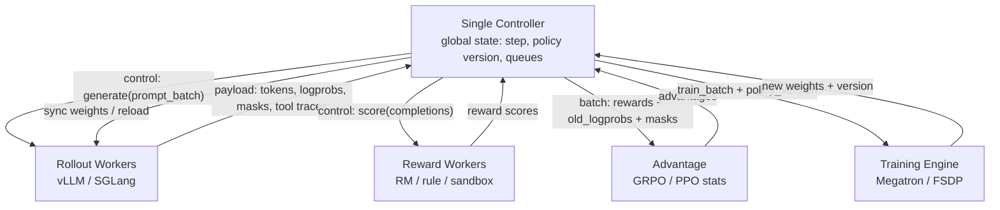

这种模式的好处是全局状态非常清楚：某个 sample 来自哪个 policy version、reward 有没有算完、是否已经进入 train batch，都能在中央 driver 里查到。坏处是 rollout payload 很大时，所有 tokens/logprobs/masks 都要经过 controller 或 object store，中心节点会被序列化、网络和对象引用管理拖慢。

Multi-controller 把大对象尽量留在本地，只在组件之间交换状态和引用：

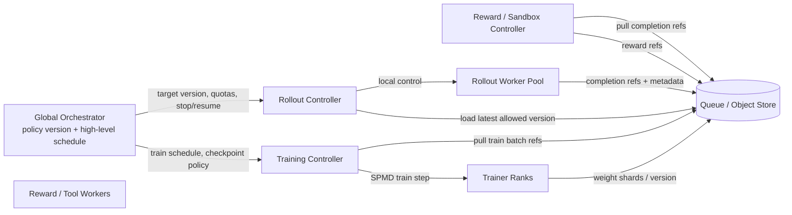

这里的关键变化是：全局 Orchestrator 不再亲自搬所有 token tensor，而是维护 policy version、quota、队列水位、失败重试和高层 schedule。Rollout Controller 本地决定怎样 batch、怎样 abort、怎样 resume；Training Controller 本地决定 microbatch、pipeline schedule、gradient accumulation；Reward/Sandbox Controller 本地处理工具调用和规则评分。系统吞吐更好，但一致性更难：如果某个 sample 的 reward 已经算完，而对应 policy version 已被淘汰，trainer 要决定是丢弃、降权还是用 staleness correction。

veRL 的 **HybridFlow** 是这两种模式的混合：用 single-controller 表达高层数据流（「先 rollout，再 compute advantages，再 train」），用 multi-controller（每个 worker 组的 SPMD 进程）执行实际的算子计算。

### 4.3 设计轴 2：资源放置（Colocated vs Disaggregated）

这条设计轴真正问的是：同一张 GPU 在一个 RL step 里到底扮演一种角色，还是要在“推理服务器”和“训练 worker”之间来回切换。

**Colocated（共置）**：rollout 和 training 共享同一个 GPU 池，所以通常按阶段时分复用。

```
time ─────────────────────────────────────────────────────────>
GPU 0-7:  rollout / sampling / KV cache
          ──────────────────────────┐
                                    ├─ reshape / reload / reshard
GPU 0-7:                            training / backward / optimizer
                                    ───────────────────────────┐
                                                               ├─ sync back to inference layout
GPU 0-7:                                                       rollout ...
```

同一批 GPU 不是不能同时开两个进程，而是同时开通常不划算：推理侧想把显存留给 KV cache 和大 batch decode，训练侧想把显存留给 activation、gradient、optimizer state；推理侧常用 serving-friendly layout，训练侧常用 TP/PP/FSDP/ZeRO layout。两边强行共存会互相挤显存、抢 compute stream、抢 NCCL 通信，最后经常不如阶段化运行稳定。

Colocated 的优势：

- 硬件池小，适合 GPU 不够多的团队。
- 权重同步路径短，可以在同一个 Ray placement group / 同一个节点组里完成。
- 权限、镜像、文件系统和 checkpoint 路径更简单。

Colocated 的代价：

- rollout 阶段 trainer GPU 逻辑上 idle；training 阶段 rollout engine 逻辑上 idle。
- 推理布局和训练布局不同，阶段切换需要 reload / reshard / rebuild inference engine。
- 如果 agent rollout 很慢，training 会等生成；如果训练 step 很慢，rollout 会等新 policy。

**Disaggregated（分离）**：rollout 和 training 在不同 GPU 上同时运行。

```
time ─────────────────────────────────────────────────────────>
Rollout GPUs:   generate v10 ── generate v10/v11 ── generate v11 ...
                         │              ▲                  ▲
                         │ rollout data │ weight update    │
                         ▼              │                  │
Training GPUs:  train on v10 data ── update to v11 ── train on v11 data ...
```

Disaggregated 的优势是 pipeline：rollout 池不必等 trainer 释放 GPU，trainer 也不必等 rollout engine 卸载显存。它尤其适合 rollout 很慢的场景，比如长 chain-of-thought、多 completion、agent tool call、sandbox 执行、reward model 也很重。

Disaggregated 的代价来自跨池边界：

- trainer 更新出的新权重要传到 rollout 池，模型越大、更新越频繁，同步越贵。
- rollout 数据要带上 policy version、old logprob、token mask、reward metadata，否则 trainer 不知道这些样本来自哪一版 policy。
- rollout 可能持续用旧权重生成。旧得太多会提高吞吐，但会伤害 on-policy 算法，需要 staleness limit、样本丢弃、importance ratio 或异步算法修正。

一句话判断：GPU 少、模型中小、想快速跑通时 colocated 更省事；GPU 多、rollout 慢、agent/reward pipeline 重、希望训练和生成持续并行时 disaggregated 更有价值。

### 4.4 设计轴 3：权重同步

训练更新完 actor 权重后，必须把新权重同步给 rollout 引擎，否则 rollout 用的是旧权重。

**挑战**：训练和推理的并行布局往往不同。训练可能用 TP=8, PP=4，推理可能用 TP=8, PP=1。权重从训练布局 reshard 到推理布局，需要做 AllGather + 切分。

**主流同步方案**：

| 方案 | 延迟 | 代表框架 | 说明 |
|------|------|----------|------|
| NCCL Broadcast（朴素） | 100–500ms | OpenRLHF | 每层分别广播 |
| NCCL + Bucketing | ~20ms | veRL | 把多层参数打包成 1GB 块一次广播 |
| CUDA IPC | <1ms | NeMo-RL, MILES | 同机 GPU 共享内存，无需网络 |
| Filesystem + reload | 秒级 | PRIME-RL, AReaL | 写磁盘，推理侧 reload；适合跨机异步 |
| RDMA P2P（Mooncake） | 超大模型下优于 NCCL | 部分框架 | 1T 参数下 ~16-17s |

**MoE 的额外挑战**：Expert Parallelism 下，每个 GPU 只持有部分 expert。广播前需要先 AllGather 所有 expert 的参数到一处，再广播给推理侧。这个 $O(N_{\text{experts}} \times E_{\text{size}})$ 的开销在密集模型里不存在。

### 4.5 设计轴 4：同步性谱系

```
严格 On-policy                                   完全 Async
     │                                               │
 Batch 0 生成              Buffer 队列             永不停止的
 → 等待完成                存 1-K 步旧数据           rollout workers
 → Training               → Training               → Training（随时）
 → 同步权重               → 同步权重                → 权重异步推送
     │                                               │
  TRL/基础 veRL           veRL async/ROLL/slime      AReaL/Forge
```

**Staleness**（过时度）的定义：生成样本时使用的 policy 版本，距离当前训练的 policy 版本有多少步差距。

- 纯同步：staleness = 0（严格 on-policy）
- Buffer depth = K：staleness ∈ [0, K]
- 完全异步（AReaL）：staleness 通常控制在 8 步以内（实验显示 ≤8 步不影响最终性能）

**CISPO / IS 修正**：$r_t(\theta) = \pi_{\theta}(a_t|s_t) / \pi_{\text{old}}(a_t|s_t)$ 本质上是 importance sampling 比率，可以修正 off-policy 误差。这是允许适度 staleness 的算法保证。

---

## 五、框架巡礼：两次范式转移

> **第一次转移**：「训练脚本」→「混合推理+训练引擎」（TRL → veRL）
> **第二次转移**：「同步批次」→「持续异步流」（veRL → AReaL/Forge）

### 5.1 TRL（HuggingFace）—— RLHF 的 Hello World

**定位**：最易上手的 RLHF 框架，研究原型首选。

**架构**：`accelerate` + 单控制器；`PPOTrainer` / `GRPOTrainer` 直接调用。支持 vLLM 作为 colocated 引擎（同进程）或独立 server。

**优势**：集成 HuggingFace 生态，10 行代码跑通 GRPO；适合单机实验；LoRA 支持完善。

**天花板**：
- 单机思维：多节点扩展困难
- Rollout 和 Training 串行：80-90% 时间浪费在等待生成
- 缺乏 Megatron 后端：无 PP/EP，难以支持超大模型

**适用场景**：≤70B 模型，单节点，快速验证 idea。

### 5.2 OpenRLHF —— Ray 分离架构的先驱

**定位**：第一个系统性地用 Ray 把 rollout 和 training 解耦的框架。

**架构**：vLLM 作为独立 rollout service，training 用 DeepSpeed ZeRO。通过 Ray Actor 协调各角色（actor/critic/ref/reward）。

**历史意义**：证明了 rollout service 化的可行性；启发了后来所有框架的分离式设计。

**局限**：缺乏 Megatron 后端（无 TP/PP），大模型支持不足；生态相对 veRL 小。

### 5.3 veRL（ByteDance）—— 混合引擎时代的标志

**定位**：通用 LLM post-training / RLHF 的强底座。它适合把 PPO/GRPO/DAPO 这类训练流程写成可编程数据流，并把训练后端、rollout 后端和 reward/verifier 组合起来。更稳妥的判断是：veRL 在开源研究和平台团队里很常见，生态活跃；大厂生产系统则通常会在 veRL、OpenRLHF、slime、NeMo RL 或自研框架上做大量改造，很少直接等同于某个开源框架原版。

**核心创新：HybridFlow**

veRL 的关键不是“又接了一个 vLLM”，而是把 RL post-training 表达成一个可编程的数据流图。高层由单个 Python controller 写算法逻辑，底层由 FSDP/Megatron/vLLM/SGLang 这些分布式 worker group 执行重计算。

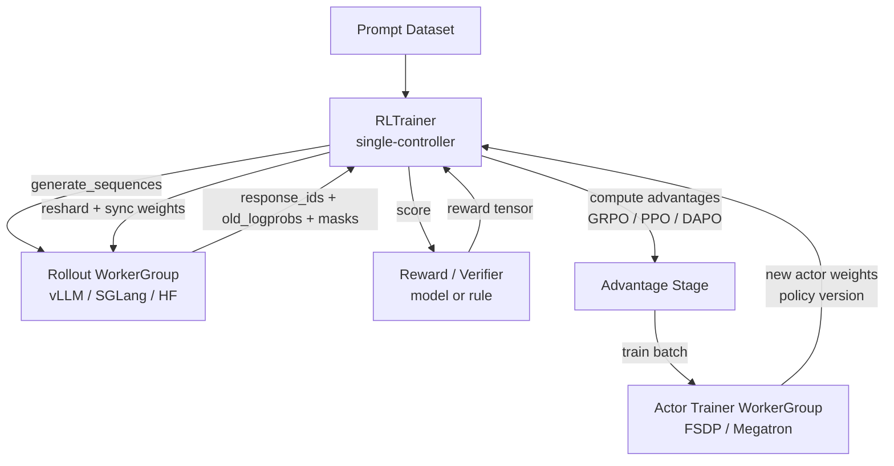

这张图里，`RLTrainer` 关心的是算法语义：哪些 prompt 进入 rollout、reward 怎么算、advantage 怎么归一化、什么时候训练、什么时候同步权重。`WorkerGroup` 关心的是分布式执行：FSDP rank 怎么 all-gather，Megatron TP/PP rank 怎么通信，vLLM/SGLang server 怎么 batch decode。

veRL 的抽象可以拆成三层：

| 层 | 负责什么 | 常见对象 |
|---|---|---|
| Algorithm layer | PPO/GRPO/DAPO 的数据流，reward、advantage、KL、clip | `RayPPOTrainer` / `RLTrainer` |
| Role layer | actor、critic、ref、reward、rollout 各自是什么 worker group | actor rollout、actor train、critic、ref policy |
| Engine layer | 真正跑模型的后端 | FSDP、Megatron、vLLM、SGLang、HF rollout |

veRL 风格的 GRPO loop：

```python
def verl_grpo_step(batch_prompts):
    # 1. rollout worker group 生成 G 个 completion
    rollout_batch = actor_rollout.generate_sequences(
        prompts=batch_prompts,
        n_samples_per_prompt=G,
        policy_version=current_version,
    )

    # rollout_batch 里必须保留训练所需的 token 级信息
    # response_ids, attention_mask, position_ids, old_logprobs, eos_mask

    # 2. reward 可以是模型、规则、sandbox 或 verifier
    rewards = reward_fn(rollout_batch)

    # 3. GRPO 按 prompt group 做相对 advantage
    advantages = group_normalize(
        rewards=rewards,
        group_ids=rollout_batch.prompt_ids,
    )

    train_batch = {
        "input_ids": rollout_batch.full_token_ids,
        "loss_mask": rollout_batch.response_mask,
        "old_logprobs": rollout_batch.old_logprobs,
        "advantages": advantages,
        "policy_version": rollout_batch.policy_version,
    }

    # 4. trainer worker group 执行 SPMD 训练
    metrics = actor_trainer.update_actor(train_batch)

    # 5. 把训练态权重同步回 rollout engine
    new_version = metrics["policy_version"]
    sync_actor_weights(actor_trainer, actor_rollout, version=new_version)
```

这段伪代码的重点是：controller 写起来像普通 Python，但每一行背后都是分布式 worker group。`generate_sequences` 可能是多个 vLLM/SGLang server；`update_actor` 可能是 Megatron 的 TP/PP/DP rank；`sync_actor_weights` 可能需要从 ZeRO/FSDP/Megatron 分片布局转换到推理布局。

**3D-HybridEngine** 解决 colocated 场景下的“同一批 GPU 一会儿训练、一会儿推理”的布局切换问题。训练态和推理态通常不是同一个并行方式：

```text
training layout:
  FSDP / ZeRO shards, or Megatron TP x PP x DP

rollout layout:
  inference TP, paged KV cache, continuous batching
```

Colocated 时，一个 step 里会反复发生：

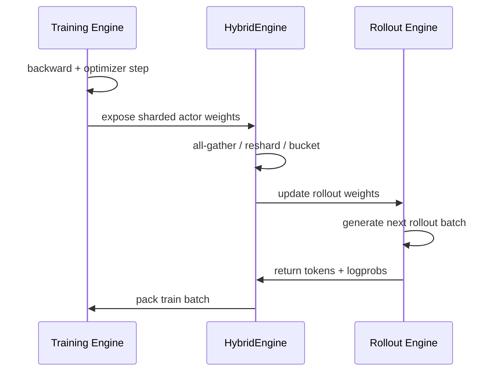

权重 reshard 流程：

1. 训练结束 → AllGather 参数（从 ZeRO/TP 分片还原）
2. 按推理的 TP 切分 → 广播给推理侧进程
3. 推理引擎加载新权重（reload 或 in-place update）

**双训练后端与多 rollout 后端**：veRL 同时支持 FSDP / Megatron 训练后端，也可以接 vLLM / SGLang / HF rollout。这个设计适合研究和平台团队：同一套 PPO/GRPO 数据流可以换训练后端和 rollout 后端。

| 组合 | 适用场景 |
|---|---|
| FSDP + vLLM | 中小 dense model，快速跑通，生态成熟 |
| FSDP + SGLang | 需要 prefix sharing / structured generation，但模型还没大到必须 Megatron |
| Megatron + vLLM | 大模型训练需要 TP/PP，rollout 侧走成熟 vLLM |
| Megatron + SGLang | 大模型训练 + 复杂前缀共享或 agent-style rollout |

**异步模式**：veRL 也支持 disaggregated + buffer 异步。异步时，controller 不再等当前 rollout 全部完成后才 train，而是从 buffer 中取已经完成的 samples；每条 sample 记录 policy version 和 old logprob，trainer 用 PPO/GRPO ratio 修正 staleness。

**生态**：DAPO、PRIME、SkyRL、AceMath 等众多工作都基于 veRL fork 实现。

veRL 的长处是通用和可组合：算法层容易改，后端也能换。代价是抽象层更多，debug 时要同时看 controller、Ray worker、training backend、rollout server 和 weight sync。

**agentic RL 的短板**：veRL 已经提供 Agent Loop 接口，但它更像“让用户自定义 multi-turn rollout loop 的通用入口”，不是完整 agent runtime。官方文档把 Agent Loop 标成 alpha，并明确 tool 如何定义、如何调用不是它的目标。因此复杂 agent 训练里，工程团队还要自己补很多东西：

| 缺口 | 具体表现 |
|---|---|
| tool/runtime 管理 | web search、code sandbox、database、browser、terminal 的生命周期和权限不由 veRL 自动解决 |
| heterogeneous scheduling | LLM 生成在 GPU，tool/sandbox 在 CPU 或远端服务，长尾延迟和资源隔离需要额外调度 |
| agent state | 多轮 memory、context compaction、tool trace、environment state 需要任务侧自己定义 |
| trajectory provenance | 每一步 action / observation / logprob / mask / reward / policy version 都要能追踪，否则训练样本难以复现 |
| failure recovery | tool timeout、sandbox crash、partial trajectory、worker retry 需要显式协议 |

这也是 SkyRL-Agent、VerlTool、AgentRL、Rollout-as-a-Service 这类工作的动机：它们不是简单替代 veRL，而是在 agent loop、tool abstraction、异步 rollout dispatch、sandbox/runtime 管理和训练后端互操作上补一层。SkyRL-Agent 的公开设计就把 tool-centric agent loop、fine-grained heterogeneous scheduling、backend bridge 作为核心组件，并说明可接 VeRL 这类训练系统。

MoE 训练时，veRL 的优势是把算法数据流和训练后端分开：中小模型可以用 FSDP 快速迭代，超大 MoE 可以切到 Megatron 后端，让 TP/PP/EP/CP 接管并行策略。它本身不把 MoE router correctness 自动变简单；系统仍然需要在 rollout batch 里保存足够 metadata，例如 policy version、old logprobs、loss mask，以及需要时的 expert routing 信息。

### 5.4 slime（THUDM/智谱）—— 做减法的哲学

**定位**：「我们只做 SGLang 和 Megatron 之间的数据流胶水」。最终实际生产 GLM-4.5/4.6/4.7/GLM-5/GLM-5.1 的 RL 训练后端。

**架构：Megatron + SGLang + Data Buffer**

slime 的选择更窄：训练侧默认 Megatron，rollout 侧默认 SGLang，中间用 Data Buffer 连接。它不试图抽象所有训练后端和推理后端，而是把复杂度压到两个成熟系统里：Megatron 负责大规模训练并行，SGLang 负责高吞吐 rollout、prefix cache、abort、weight update。

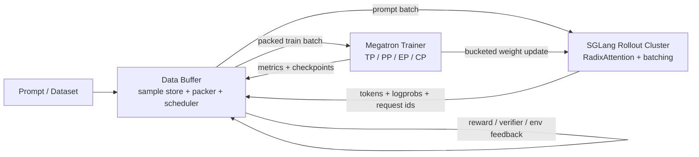

Data Buffer 是 slime 的核心。它不是简单队列，而是 RL 数据的边界层：rollout 完成前它知道哪些 request 还在飞；reward 完成后它知道哪些 samples 可训练；training 之前它把变长样本 pack 成 Megatron 能吃的 batch；异步模式下它还要控制 policy version 和 staleness。

slime 对 MoE 更友好的地方在于边界更窄：训练侧固定围绕 Megatron，rollout 侧固定围绕 SGLang。Megatron 管 TP/PP/EP/CP 和 optimizer state，SGLang 管 prefix sharing、continuous batching 和 weight update。两个系统的组合减少了“任意 backend 两两适配”的复杂度，但也要求 Data Buffer 明确维护 rollout 产生的 token、logprob、reward、policy version、request id 和必要的 routing metadata。

**数据流详解**：

1. Rollout Engine（SGLang）生成 completion，附带 logprobs
2. Data Buffer 收集 rollout 数据，做 reward 计算（可并行调用 reward server）
3. Data Buffer 把数据 pack 成 Megatron 接受的格式，dispatch 给 training workers
4. Megatron 做 forward/backward，loss = PPO/GRPO clip loss，含 IS 修正权重
5. Megatron 更新权重后，通过分桶 NCCL 广播给 SGLang 集群
6. SGLang 集群更新权重（`update_weights` API），继续下一批 rollout

slime 的同步模式可以写成：

```python
def slime_sync_loop(prompts):
    batch = data_buffer.sample_prompts(prompts)

    rollout = sglang.generate(
        batch,
        return_logprobs=True,
        policy_version=current_version,
    )

    scored = data_buffer.attach_rewards(rollout)
    train_batch = data_buffer.pack_for_megatron(scored)

    metrics = megatron.train_step(train_batch)

    # 训练态权重 -> 推理态权重，分桶后推给 SGLang
    buckets = megatron.export_weight_buckets()
    sglang.update_weights(buckets, version=metrics["policy_version"])
```

异步模式里，Data Buffer 变成持续生产/消费的队列：

```python
async def slime_async_loop():
    while True:
        # rollout side: SGLang 持续生成
        if data_buffer.need_more_samples():
            launch_rollout_task(
                prompts=data_buffer.next_prompts(),
                policy_version=rollout_policy_version,
            )

        # reward side: verifier / sandbox / reward model 持续回填
        for sample in finished_rollouts():
            data_buffer.add(sample)

        # training side: Megatron 持续消费 ready samples
        if data_buffer.ready_tokens() >= train_token_budget:
            train_batch = data_buffer.pack_for_megatron(
                max_staleness=allowed_staleness,
            )
            metrics = megatron.train_step(train_batch)
            maybe_sync_weights(metrics["policy_version"])
```

同步和异步的差别不是 API 名字，而是 Data Buffer 的语义：

| 模式 | Data Buffer 行为 | 算法风险 | 系统收益 |
|---|---|---|---|
| 同步 | 一个 batch 完成后整体训练，staleness 约为 0 | 最接近 on-policy | 简单稳定，但 rollout/training 容易互等 |
| 异步 | rollout、reward、train 并行推进，trainer 从 ready queue 取样本 | 样本可能来自旧 policy，需要 IS / clip / staleness bound | 减少 idle，隐藏 weight sync 和长尾 rollout |

**关键设计选择**：
- 不自己实现并行策略，完全使用 Megatron 的 TP/PP/EP/CP
- 不包装 SGLang，直接暴露 SGLang 的所有参数（`--sglang-xxx` 前缀）
- `OPSM masking`（Optimal Policy Sampling Mask）：只对最优行为的 token 计算梯度，对应 GRPO 里 group 内最高 reward 的序列

slime 的参数设计也体现了这个思路：资源分配先决定训练 GPU 和 rollout GPU，然后分别加载 Megatron 和 SGLang，再配置 RL 超参。典型参数会包含：

```bash
--actor-num-nodes ...
--actor-num-gpus-per-node ...
--rollout-num-gpus ...
--rollout-num-gpus-per-engine ...
--train-backend megatron
--colocate                 # 可选：训练和 rollout 共置
--sglang-...               # 直接透传给 SGLang
```

**权重更新路径**是 slime 最核心的性能点之一。RL 和普通 serving 不同，policy 会频繁更新；如果每次都完整 reload checkpoint，rollout 集群会长期停顿。slime/SGLang 路线把参数更新做成在线 update：

```text
Megatron shards
  -> gather / reorder by inference layout
  -> bucket parameters
  -> NCCL / in-place update to SGLang workers
  -> mark rollout policy_version = k + 1
```

MoE 下还要处理 expert parallel：训练时每个 rank 只持有部分 experts，推理时 SGLang 的 expert layout 可能不同。这里不能只同步 dense layer；router、shared experts、routed experts、scale/quant metadata 都必须和推理侧 layout 对齐。

**slime 和 veRL 的差别**

| 维度 | veRL | slime |
|---|---|---|
| 框架目标 | 通用 RL dataflow，后端可替换 | Megatron + SGLang native，少抽象层 |
| 控制方式 | Hybrid-controller，controller 负责算法图 | Ray 管资源和异步执行，Data Buffer 管样本生命周期 |
| 训练后端 | FSDP / Megatron / 其他生态后端 | Megatron 优先 |
| Rollout 后端 | vLLM / SGLang / HF 等 | SGLang 优先 |
| 适合场景 | 算法研究、平台化、多后端组合 | 大 MoE、SGLang-native rollout、自定义数据生成 |
| 主要代价 | 抽象层多，debug 跨组件 | 后端选择窄，对 Megatron/SGLang 栈依赖更深 |

### 5.5 AReaL（蚂蚁 & 清华 IIIS）—— 完全异步的代表

**论文**：*AReaL: A Large-Scale Asynchronous RL System for Language Reasoning*（arxiv 2505.24298）

**核心思想**：rollout workers 永远不应该停。一旦 training 需要权重同步，naive 做法会让所有 rollout worker 空等。AReaL 的解法是：**让 rollout 继续跑，收集到的旧数据用 staleness-aware PPO 来修正**。

**关键设计**：

1. **Interruptible Rollout**：rollout worker 的每个序列都可以被中途打断（cancel），不需要等到 EOS。当 training 需要新权重时，可以中断进行中的序列，用新权重重新推理（re-prefill）。

2. **Decoupled PPO clip**：将 PPO 的 clip 范围根据 staleness 动态调整：
   $$\epsilon(s) = \epsilon_0 \cdot e^{-\lambda s}$$
   staleness $s$ 越大，clip 越紧，防止过时数据带来的大梯度更新。

3. **Staleness 控制**：实验表明 staleness ≤ 8 步时，最终性能不受影响；实践中 AReaL 控制 staleness 均值在 2–4 步。

4. **Dynamic batching**：变长输出的动态批处理，GPU 利用率持续 ≥95%。

**性能**：同等 GPU 数量下，相比同步系统实现 **2.77× 吞吐提升**。

**AReaL vs slime 对 rollout 瓶颈的理解**：
- slime：rollout 慢是因为生成时间本身长（token-by-token decode），解法是更好的推理引擎（SGLang）+ 分桶权重传输减少 dead time
- AReaL：rollout 慢还因为 **long-tail 序列**拖慢了整批（最慢的一个序列决定批次延迟），解法是 interruptible rollout，让慢序列不阻塞整体

### 5.6 ROLL（阿里巴巴）—— 平台型框架

**定位**：覆盖更多训练场景（RLHF/RLVR/Agentic）的平台型框架，支持五种角色抽象。

**五角色**：actor / critic / reference / reward / **env（环境）**。最后一个是 ROLL 的特色——把 agentic RL 的环境交互做成一等公民，而非事后补丁。

**ROLL Flash**（异步扩展）：在基础 ROLL 之上叠加异步 rollout 能力，支持 agentic 场景下的多轮长序列。

**IS 支持**：内置 TIS（Token-level IS）、TOPR（Top-P Rejection sampling）、CISPO 等多种 off-policy 修正方案。

**后端**：DeepSpeed / Megatron / FSDP2 三选一；vLLM 或 SGLang 做推理。

### 5.7 Forge（MiniMax）—— Agent-Native 时代

**论文/博客**：*Forge: Scalable Agent RL Framework and Algorithm*（Hugging Face Blog by MiniMax-AI）

**核心问题**：如何在训练框架和 agentic scaffold 完全解耦的情况下做 RL？

传统框架的问题：agentic 场景下，agent 的内部结构（记忆压缩、历史改写、multi-agent 协调、工具调用）与训练框架深度耦合，改一个 agent 就要改训练代码。

**Forge 的解法**：引入 **RL Service Gateway**，作为 agent 和训练引擎之间的抽象层：

```
Agent Scaffold                    RL Service Gateway
(任意内部结构) ──► HTTP/RPC ──► Gateway ──► Training Engine
                                   │
                                   ├── 处理 token 级 credit 归属
                                   ├── 支持 context 操纵（memory 压缩等）
                                   └── 统一 reward 归因
```

Agent 不需要知道训练框架的任何细节，只需要把生成的 trajectory 和结果通过 Gateway 上报。Gateway 负责 credit assignment（哪些 token 获得哪些 reward）。

**规模**：用于训练 MiniMax-M2.5，支持 200K token context、十万种以上 agent scaffold、日均百万级样本。

**配套算法 CISPO**（Clipped IS Policy Optimization）：在 IS 修正的基础上加 clip，专门为 Forge 的异步特性设计。

### 5.8 大对比表

| 框架 | 控制流 | 资源放置 | 训练后端 | Rollout 引擎 | 异步支持 | Agentic | 代表模型 |
|------|--------|----------|----------|-------------|----------|---------|---------|
| **TRL** | Single | Colocated | HF Trainer | vLLM/内置 | ✗ | 弱 | 各类小模型 |
| **OpenRLHF** | Ray | Disaggregated | DeepSpeed | vLLM | 弱 | ✗ | — |
| **veRL** | Hybrid | 两者均支持 | Megatron/FSDP | vLLM/SGLang | 双模式 | 弱 | DAPO/SkyRL |
| **slime** | Ray | Disaggregated | Megatron | SGLang | 双模式 | ✗ | GLM-4.5~5.1 |
| **AReaL** | asyncio+Ray | Disaggregated | FSDP2/Megatron | vLLM/SGLang | 完全异步 | 弱 | — |
| **ROLL** | Ray | 两者均支持 | DS/Megatron/FSDP2 | vLLM/SGLang | 双模式 | ✓ | — |
| **Forge** | HTTP Gateway | Disaggregated | 内部 | 内部 | 完全异步 | **原生** | MiniMax-M2.5 |

---

## 六、专题深入

### 6.1 长尾 Rollout 与对策


**长尾问题**：在一批请求里，99% 的序列在 2K tokens 内完成，但 1% 的「超长序列」可能跑到 32K tokens 才结束。在同步系统里，整批数据必须等最慢的序列完成，导致大量 GPU 空转。

**量化**：设 batch = 64 prompts，平均输出 8K tokens，但最长的序列需要 32K tokens。最慢的序列会使整批时间多出 4×，等效 GPU 利用率降至 25%。

**对策**：

| 方法 | 原理 | 框架实现 | 适用场景 |
|------|------|---------|----------|
| **Partial Rollout（中断续采）** | 超时后中断序列，保留 prefix / token provenance，下一轮从断点继续 | AReaL（re-prefill）、SkyRL（prefix-resume）、slime | 最适合 agent、多轮工具调用、长推理链和长上下文任务。它不强行丢掉慢样本，能保留困难样本的训练信号；代价是系统必须记录 prefix、policy version、reward 状态和恢复位置，工程复杂度最高。 |
| **Length-aware scheduling** | 按预估输出长度、prompt 长度或历史 completion 长度分桶排队，避免短序列被长序列阻塞 | SGLang 内置，vLLM 部分支持 | 适合在线 rollout 服务、prompt 长度差异大但任务形态相对稳定的场景。它对训练目标最少侵入，不改变采样分布；缺点是只能缓解排队和批内阻塞，不能解决单条序列本身过长的问题。 |
| **Over-sampling + 截断** | 对同一 prompt 生成 G' > G 个 completion，优先取最先完成的 G 个进入 group advantage | DAPO、部分 GRPO 实现 | 适合需要稳定 step time 的大规模 GRPO 训练，尤其是数学、代码这类 completion 长度方差很大的任务。它能把慢样本从 critical path 移走；风险是 earliest-finished 样本可能偏短，必须配合长度惩罚、重要性修正或质量过滤，避免训练偏向短答案。 |
| **Rejection sampling** | 设置最大长度、格式约束或 reward 约束，超出规则的样本直接丢弃或给零分 | 最简单，几乎所有框架都能实现 | 适合早期实验、数据清洗、格式严格的任务，或者只想快速避免 runaway generation。它实现成本最低；缺点是浪费 rollout 算力，并且如果拒绝规则和答案质量相关，会改变训练分布。 |

**GRPO 的特殊挑战**：同一 prompt 的 G 个 completion 需要一起计算 group advantage，意味着它们必须全部完成才能开始训练。这使得 GRPO 对长尾问题特别敏感。

### 6.2 Continuous Batching 在 RL 里的新问题

**Continuous batching 的基本原理**：传统 batching 等一批请求都完成才出结果；continuous batching 让完成的序列立刻释放 slot，新请求马上插入。这在推理服务中效果极好。

**在 RL 里引入的新问题**：

1. **序列边界对齐**：RL training 需要完整的 episode（从 BOS 到 EOS），中间不能断。Continuous batching 可能导致同一 episode 的 token 散落在不同 batch 里，需要额外对齐逻辑。

2. **Reward 归因时序**：Reward 通常在序列完成后才能计算（terminal reward）。但 process reward（步骤奖励）需要在序列中途触发。Continuous batching 使序列中途的状态难以捕获。

3. **KV cache 压力**：RL rollout 产生的序列比推理服务的序列平均更长，paged KV cache 的页面换出（eviction）更频繁，影响 throughput。

**vLLM vs SGLang 的关键差异**：

| 特性 | vLLM | SGLang |
|------|------|--------|
| KV cache 管理 | PagedAttention，固定页大小 | RadixAttention，基于前缀树共享 |
| Prefix 共享 | 需手动启用 | **原生支持**（GRPO 直接受益） |
| Server 接口 | OpenAI 兼容 | OpenAI 兼容 + 更多扩展 |
| RL 专属优化 | update_weights API | update_weights + abort + prefix-resume |
| 生态 | 更大，文档更全 | 更新，SGLang-native 框架（slime）加持 |

**衡量利用率**：
- vLLM：`vllm_metrics`，关注 `gpu_cache_usage_perc`（KV 利用率）和 `num_running_seqs`
- SGLang：`/get_server_info` 接口，关注 `cache_hit_rate`（前缀命中率）和 queue depth
- RL 场景下，KV cache 利用率低（<50%）通常意味着 prompt 差异大，prefix 共享失效

### 6.3 异步 RL 的设计空间

**为什么要异步？** 同步系统的时序：

```
[Rollout]────────────────┐
                         ▼
                   [Training]────┐
                                 ▼
                         [Weight Sync]──┐
                                        ▼
                                   [Rollout]...
```

每个 `[Weight Sync]` 和等待 rollout 完成的时间都是纯 idle。异步系统把这些阶段流水线化：

```
Rollout workers: [Gen]──[Gen]──[Gen]──[Gen]──[Gen]──...
Training:           [Train]──[Train]──[Train]──...
Weight sync:              [Sync]──────[Sync]──────...
```

**主流异步框架及其解法**：

| 框架 | 解决的核心瓶颈 | 机制 |
|------|---------------|------|
| AReaL | 长尾阻塞 + weight sync idle | Interruptible rollout + re-prefill + staleness-aware PPO |
| slime（async 模式） | weight sync dead time | 分桶 NCCL + abort-in-flight + buffer 队列 |
| ROLL Flash | agentic 场景的多轮等待 | 异步 reward server + episode-level buffer |
| PipelineRL | weight sync overhead | 逐 forward pass 更新权重（per-forward-pass swap） |
| PRIME-RL | 跨提供商的大 staleness | 版本跟踪 + depth bound + IS 修正三合一 |

**AReaL vs slime 的根本分歧**：

- **slime 视角**：rollout 的主要瓶颈是「权重同步期间的 dead time」和「推理引擎本身的效率」。解法是更快的权重传输（分桶 NCCL）+ 更好的推理引擎（SGLang）。不需要 interruptible rollout 这种复杂机制。

- **AReaL 视角**：rollout 的主要瓶颈是「长尾序列拖慢整批」。只提升权重传输速度解决不了本质问题——1% 的超长序列依然会让 99% 的 GPU 空等。Interruptible rollout + re-prefill 才是根本解法。

两种视角都对，针对不同的业务场景：slime 更适合平均长度适中的 RLVR 任务；AReaL 更适合长 CoT 推理和 agentic 任务。

**Staleness 实践**：
- AReaL 论文中，staleness ≤ 8 步时性能不受影响
- 实践中，大多数异步框架控制均值 staleness 在 1–4 步
- 完全不加控制的 staleness 会导致算法发散（相当于把 IS ratio clip 失效化）
- 常见控制手段：buffer depth bound + 超时丢弃 + IS weight clip（$r_t$ clip 到 [0.1, 10]）

**Partial rollout 下的 KV cache 问题**：

AReaL 选择 **re-prefill**：中断序列，用新权重重新做 prefill，重建 KV cache，再继续 decode。不保留旧 policy 的 KV cache（会引入 KV 和权重的不一致）。

这比「保留 KV cache + 继续 decode」更正确，因为旧 KV 是用旧 policy 的注意力参数算出来的，与新权重不匹配。代价是 prefill 的额外计算开销（通常可忽略，prefill 比 decode 快得多）。

### 6.4 Train–Inference Mismatch

**什么是 mismatch？** 同一个 token 序列，训练侧（Megatron）计算的 logprob 与推理侧（vLLM/SGLang）生成时计算的 logprob 不一致。不一致会导致 IS ratio 出现虚假的大值，训练不稳定。

**来源一：算子实现差异**
- attention 实现：FlashAttention2 vs FlashAttention3 vs cuDNN，对 softmax 的精度处理略有差异
- layernorm 顺序、dropout 位置等细节

**来源二：精度差异**
- 推理侧可能用 FP8，训练侧用 BF16；量化引入的舍入误差累积

**来源三：Batch Invariance 问题**

**Batch invariance** 指：给定相同的输入 token，无论 batch size 是多少，logprob 应该完全相同。这在正确实现下是成立的，但有几种情况会破坏它：

1. **Atomic Add 问题**：在 GPU 上，`atomicAdd` 不保证浮点数的加法顺序，导致结果随并发线程的调度而变化。这会导致 LayerNorm、Attention softmax 等操作在不同 batch size 下产生细微差异。

2. **MoE 路由不一致**（最严重的 mismatch 来源）：推理时（vLLM）和训练时（Megatron）各自独立实现了 MoE 的 router（top-k gating）。浮点精度差异可能导致边界情况下 expert 选择不同，等于训练的是另一个 sequence 的 logprob。

**解法**：
- 「Keep Routing」：推理侧记录每个 token 的 expert routing 决策，训练侧重放（replay），强制使用相同的 routing。它把 MoE router 从隐式算子状态变成 trajectory metadata。
- 「Keep Sampling Mask」：推理侧记录 top-p/top-k 的截断 mask，训练侧对完整词表 logit 施加同样的 mask 再计算 logprob。它处理的是 sampling distribution mismatch，而不是 router mismatch。
- 「Sequence-level objective」：GSPO 用 response-level likelihood ratio 做 clipping，降低单 token logprob 抖动对更新的影响。在 hybrid attention + high-sparsity MoE 的 RL 训练里，它把 token-level router jitter 对更新的影响降到 sequence level。

router replay、sampling mask 和 sequence-level ratio 分别对应三类工程挑战：专家选择一致性、采样分布一致性、以及 token-level ratio 噪声。

### 6.5 精度专题：INT8 vs FP8


| 精度 | 比特数 | 硬件支持 | 典型场景 | 精度损失 |
|------|--------|----------|----------|---------|
| FP32 | 32 | 全部 | Adam 状态，主参数（mixed precision 主参） | 无 |
| BF16 | 16 | H100/A100+ | 参数存储、KV cache、激活值 | 极小 |
| **FP8（E4M3/E5M2）** | 8 | H100+ | **推荐用于 training（matmul）** | 小，需 scaling |
| **INT8** | 8 | 全系列 | **推荐用于 inference（weight-only quant）** | 中，需 calibration |
| INT4 | 4 | 部分 | 极端内存受限推理 | 较大 |

**Training 推荐 FP8**：
- H100 的 FP8 FLOPS 是 BF16 的 2×，可直接提升矩阵乘法速度
- FP8 分两种：E4M3（更高精度，forward pass）和 E5M2（更大范围，backward pass），混合使用
- 需要 per-tensor 或 per-block scaling factor，实现复杂但收益明显

**Inference 推荐 INT8 Weight-Only**：
- 权重 INT8，激活 FP16/BF16，无需 calibration（直接量化，不损失精度）
- 省显存（权重体积减半），且 decode 阶段通常是 memory-bound，INT8 权重减少 HBM 带宽压力
- vLLM/SGLang 均内置 INT8 weight-only 量化

**RL 训练的特殊考量**：rollout 侧用 INT8 inference，training 侧用 FP8 training；两侧精度不同是 mismatch 的来源之一。有些框架（ROLL）提供了统一精度配置来减少这种差异。

参考：[FP8-RL: A Practical and Stable Low-Precision Stack for LLM RL](https://arxiv.org/abs/2601.18150)

### 6.6 MoE × RL

**Expert Parallelism（EP）对吞吐的影响**：

EP 把不同的 expert 分布在不同 GPU 上，每个 GPU 只保留 $N_{\text{experts}} / N_{\text{EP}}$ 个 expert。Forward pass 需要做 AllToAll 通信（token 路由到持有目标 expert 的 GPU）。

吞吐影响：
- 好处：每 GPU 的 expert 参数更少，HBM 压力降低；稀疏激活意味着更少的 FLOPs
- 坏处：AllToAll 是一个 latency 很高的通信原语（所有 GPU 同步），在小 batch 下延迟显著
- 经验规则：EP 在 batch size 足够大（每个 expert 至少 8-16 个 token）时才有收益

**长上下文的 Compute-Communication Overlap**：

长序列（CP，Context Parallelism）下，Attention 跨多 GPU 切分（Sequence Parallelism）。关键是把 all-gather / reduce-scatter 通信与矩阵乘法重叠：

- **Megatron 方案**：pipeline bubble 化 + 显式 async AllReduce，可实现 ≥90% overlap
- **FSDP2 方案**：parameter prefetch 在 backward 时提前 AllGather 下一层的参数；SP 需要额外集成（不原生支持）

Megatron 在 PP + TP + CP + EP 完整组合下比 FSDP2 灵活得多，这是大规模 MoE RL 训练几乎都选 Megatron 的根本原因。

**MoE RL 的额外困难**：

| 层次 | Dense RL | MoE RL |
|---|---|---|
| policy state | 权重版本 + sampling config | 权重版本 + sampling config + router/expert choice |
| rollout logprob | 训练侧重新 forward 通常可复现 | router 精度、batch shape、backend 实现差异可能改变 expert |
| batch shape | token 数决定 attention / MLP | token 数还决定每个 expert 的 grouped GEMM occupancy |
| 并行策略 | TP/PP/DP/FSDP 已够用 | 通常还需要 EP/ETP，AllToAll 进入 critical path |
| 异步训练 | 控制 policy lag | 同时控制 policy lag 和 router drift |

Qwen3-Next-Thinking 暴露了一个重要方向：高稀疏 MoE + hybrid attention 下，RL 不一定只靠更强的 infra workaround。GSPO 把 token-level ratio 改成 sequence-level ratio，弱化单 token route 抖动对更新的影响；Routing Replay 则是系统侧强行复现 old policy 的 expert choice。两者的取舍是：

```text
Routing Replay:
  保留 token-level PPO/GRPO 语义
  增加 expert id metadata、通信和 kernel 接口复杂度

GSPO:
  改变优化目标到 sequence-level
  降低对 token-level routing replay 的依赖
  更适合 disaggregated / partial rollout / multi-turn RL
```

不同框架的处理方式也不同：

| 框架 | 解决路径 |
|---|---|
| veRL | 用统一 PPO/GRPO 数据流承载 MoE metadata；大 MoE 切 Megatron 后端，rollout 可接 vLLM/SGLang |
| slime | 固定 Megatron + SGLang，减少 backend 组合复杂度；Data Buffer 负责样本、版本、reward 和 weight update 边界 |
| SkyRL | 用 `GeneratorOutput` / trajectory contract 保存 token provenance、loss mask、reward 与可选 expert routing 信息 |
| AReaL | 把长尾 rollout 和 policy lag 作为一等问题；MoE 下仍要额外处理 router consistency |
| GSPO-style algorithm | 从算法上减少 token-level ratio 对 router mismatch 的敏感性 |

**多节点 backpropagation**：

大规模训练的反向传播跨越多个节点：
- 梯度通过 `AllReduce`（DDP）或 `ReduceScatter + AllGather`（ZeRO/FSDP）聚合
- 流水线并行（PP）下，梯度通过 P2P send/recv 在 pipeline stage 间传递
- 1F1B 调度（Megatron）：1 次 forward + 1 次 backward 交替，最小化 pipeline bubble
- Interleaved 1F1B：进一步减少 bubble，代价是更多的通信

---

## 七、系统级框架精读：slime、SkyRL 与 Sandbox

前面讲的是抽象设计轴：同步/异步、colocate/disaggregate、训练后端、rollout 后端、权重同步。这里把 slime 和 SkyRL 放到同一张系统图里看：二者都要解决 trajectory 生成、token provenance、reward/环境交互、训练 batch 构造、权重同步和 staleness 控制，但切分边界完全不同。

### 7.1 系统总图：四个平面

Agentic RL infra 可以拆成四个平面：

| 平面 | 负责什么 | 典型状态 |
|---|---|---|
| Control plane | 调度 rollout、reward、train、weight sync、checkpoint | policy version、queue depth、staleness、worker health |
| Data plane | 真正移动 prompt、tokens、logprobs、reward、loss mask | trajectory、sample、rollout group、train batch |
| Weight plane | 把 trainer 的 actor 权重同步到 inference engine | weight shards、bucket、checkpoint、delta、version |
| Environment plane | 管 tool、retriever、terminal、sandbox、verifier | env state、tool observation、test result、reward evidence |

slime 和 SkyRL 的主要区别是系统边界：

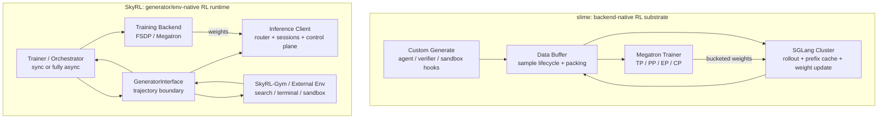

slime 的核心是“后端原生”：不把 Megatron 和 SGLang 包成最低公分母接口，而是直接利用它们各自的强项。SkyRL 的核心是“trajectory 原生”：把 generator 和 environment 做成明确边界，让 SearchR1、terminal agent、Harbor、Mini-SWE 这类多轮任务都能返回统一的训练数据结构。

用一句系统判断来区分：

| 框架 | 系统重心 | 适合的复杂度 |
|---|---|---|
| slime | 大模型训练/rollout 后端如何高效耦合 | Megatron + SGLang，大 MoE，大规模 RLVR，自定义 generation |
| SkyRL | 多轮环境如何稳定地产生可训练 trajectory | search、terminal、agent、fully async、外部 sandbox |

### 7.2 slime 的设计：Megatron + SGLang + Data Buffer

slime 的路线很明确：它不是一个“大而全”的 agent 框架，而是把 Megatron 训练、SGLang rollout、Data Buffer 和自定义 generation/reward hook 串成一个高性能 RL substrate。

核心路径：

```text
Prompt data
  -> Data Buffer
  -> SGLang rollout / custom_generate
  -> reward / verifier / env feedback
  -> Data Buffer stores Sample
  -> Megatron computes logprob / advantage / loss
  -> weight sync back to SGLang
```

slime 的关键工程判断是：

| 设计点 | slime 的选择 | 为什么 |
|---|---|---|
| 训练后端 | Megatron | 大模型、MoE、TP/PP/CP/EP 组合更成熟 |
| rollout 后端 | SGLang | 专注一个 backend，直接吃 SGLang router、prefix cache、PD disaggregation、spec decoding 等能力 |
| 扩展点 | function path hooks | agent/RAG/sandbox 不改训练核，只改生成和奖励 |
| 数据单位 | `Sample` / rollout group | 便于把一条 agent trajectory 拆成多个 trainable segments |
| 权重同步 | NCCL / disk full / disk delta | colocated、跨集群、跨硬件都有对应路径 |

最重要的不是“slime 支持 agent”，而是它把 agent 放在 `custom_generate` 这个边界外面：

```python
async def custom_generate(args, sample, sampling_params):
    # 1. Run agent loop / tool calls / sandbox
    # 2. Capture token ids, loss mask, reward
    # 3. Return one Sample or multiple Samples
    return sample_or_segments
```

这意味着 slime 的核心训练代码不需要理解 SWE-Bench、Search-R1、Tau-Bench 或 browser task。它只要求你最后交回可训练的 token 轨迹：

```text
tokens
loss_mask
rollout_logprobs
reward
rollout_id / session_id
metadata
```

这就是 slime 能支持很多 agentic 形态的原因：复杂性被放在 generation adapter / sandbox / verifier，而不是塞进 Megatron 训练 loop。

### 7.3 slime 的 Agentic RL：custom_generate 不是“文本生成函数”

slime 文档里 `--custom-generate-function-path` 的签名看起来很简单：

```python
async def custom_generate(args, sample, sampling_params):
    ...
```

但在 agentic RL 里，它实际上是一整个 rollout orchestrator。以 coding-agent RL 示例为例，真实流程是：

```text
base_sample
  -> boot sandbox
  -> prepare workspace
  -> start agent harness (Claude Code / Codex / custom CLI)
  -> agent calls model through adapter
  -> adapter records exact token ids and logprobs from SGLang
  -> agent edits repo / runs commands
  -> capture git diff
  -> evaluate diff in a fresh sandbox
  -> adapter.finish_session(...)
  -> return one or more trainable Samples
```

注意这里的两个 sandbox：

```text
Sandbox A: agent writes code, may run exploratory commands
Sandbox B: clean grading environment, applies diff and runs tests
```

这解决了一个很实际的问题：如果 agent 在同一个环境里先看测试、改测试、留下缓存，再被同一个环境评测，reward 就不可信。干净评测 sandbox 是防止 test cheating 和环境污染的基础设计。

slime 的 coding-agent 示例把这条链路拆成三层：

| 层 | 责任 |
|---|---|
| `sandbox` | `exec / write_file / read_file / close`，隐藏 E2B/Docker/VM 差异 |
| `harness` | 安装和运行 agent CLI，比如 Claude Code、Codex、OpenCode |
| `adapter` | 把 agent 的 Anthropic/OpenAI 请求转成 SGLang generate，并记录 token 级 provenance |

这三个层次非常重要，因为 agentic RL 最容易犯的错是把“字符串对话记录”当成训练目标。正确做法是：

```text
string/message history is only an interface
sampled token ids are the training target
```

也就是说，训练时不能把最终 conversation string 重新 tokenize 当作 response。必须使用 rollout 时模型实际采样出来的 `output_ids`，并且只有这些 token 的 `loss_mask=1`。

### 7.4 String-in, Token-out：agent 轨迹为什么难训

工具调用 agent 的输入输出天然是字符串：

```text
assistant: use tool
tool: stdout / file diff / browser result
assistant: next action
tool: next observation
...
```

但 RL loss 是 token 级的：

$$
\mathcal{L} = -\sum_t \hat{A}_t \log \pi_\theta(a_t | s_t)
$$

所以每个 token 必须回答两个问题：

```text
1. 这个 token 是模型采样出来的吗？
2. 这个 token 对应的 rollout logprob 是多少？
```

工具 observation、系统模板、用户消息、环境反馈都不是模型动作，不能训练：

| token 来源 | loss mask |
|---|---|
| model output / action | 1 |
| user prompt | 0 |
| tool observation | 0 |
| sandbox stdout/stderr | 0 |
| chat template token | 0 |
| compacted context / re-rendered prefix | 0，除非能证明 token provenance |

slime coding-agent 示例里有一个关键 guard：如果后续 prompt 和之前保存的 sampled output 在 token 层面对不上，就保留上下文用于继续 agent，但不对无法证明 provenance 的 token 回传梯度。这是 agentic RL 的 correctness 核心。

Agent 轨迹可以是 string-in，但训练目标必须是 token-out。任何从字符串重新 tokenize 恢复出来的“模型输出”都不可靠，因为 tokenizer、chat template、tool observation、compaction 都可能改变 token 边界。

### 7.5 SkyRL 的设计：GeneratorInterface 是系统边界

SkyRL 走的是另一条路线：它把环境抽象做得更显式。`GeneratorInterface` 不是普通 SDK 接口，而是 trainer 和 rollout runtime 之间的系统边界：

```python
class GeneratorInterface:
    async def generate(self, input_batch) -> GeneratorOutput:
        ...
```

`GeneratorOutput` 里不只是 response：

```python
{
    "prompt_token_ids": ...,
    "response_ids": ...,
    "rewards": ...,
    "loss_masks": ...,
    "rollout_logprobs": ...,
    "trajectory_ids": ...,
    "trajectory_generation_times": ...,
    "rollout_expert_indices": ...,
}
```

这说明 SkyRL 的训练 loop 不关心你是单轮 GSM8K、多轮 SQL、LiveCodeBench，还是一个复杂 agent。只要 generator 最后返回这些字段，trainer 就能做 PPO/GRPO/DAPO 等算法。

MoE 场景下，`rollout_expert_indices` 不是普通 debug log。它回答的是“old policy 生成这个 token 时到底走了哪些 experts”。如果训练侧要做 Routing Replay，或者至少要诊断 router drift，这个字段就是 rollout runtime 和 trainer 之间的 correctness contract：

```text
token provenance:
  response_ids + loss_masks

policy provenance:
  rollout_logprobs + policy version

router provenance:
  rollout_expert_indices
```

这也是 SkyRL 这类 generator boundary 的价值：复杂 agent、search、terminal、MoE routing 都可以被压缩成 trainer 可验证的 trajectory schema，而不是让 trainer 猜字符串背后的执行历史。

更高层看，SkyRL 把“生成 trajectory”从 trainer 里拆出来：

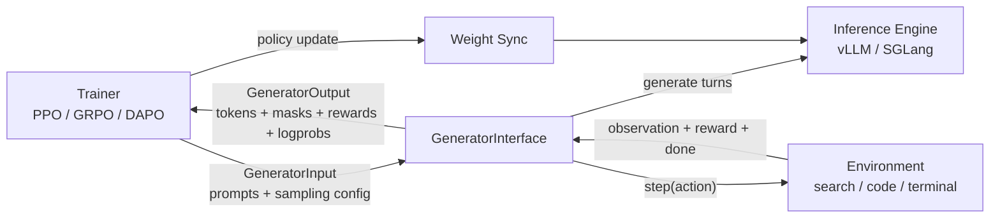

对应的 trainer 数据流是：

```text
RayPPOTrainer
  -> prepare_generator_input(...)
  -> generator.generate(...)
  -> validate_generator_output(...)
  -> fwd_logprobs_values_reward(...)
  -> train_critic_and_policy(...)
  -> dispatch.save_weights_for_sampler()
```

其中最值得讲透的是 `SkyRLGymGenerator.agent_loop()`。

### 7.6 SkyRLGymGenerator.agent_loop：一条 trajectory 怎么生成

SkyRL-Gym 约定每个 environment 有三个基本方法：

```python
env.init(prompt) -> first_observation
env.step(action) -> {observations, reward, done, metadata}
env.close()
```

`SkyRLGymGenerator.agent_loop()` 的主循环可以简化成：

```python
while not done:
    engine_input = {
        "prompt_token_ids": [current_input_ids],
        "session_ids": [trajectory_id],
        "sampling_params": sampling_params,
    }
    engine_output = await inference_engine_client.generate(engine_input)

    action_text = engine_output["responses"][0]
    action_ids = engine_output["response_ids"][0]
    action_logprobs = engine_output.get("response_logprobs")

    step_output = env.step(action_text)
    observation_ids = tokenize_observation(step_output["observations"])

    append action_ids with loss_mask=1
    append observation_ids with loss_mask=0
    append reward at turn boundary
```

这段代码把 agentic RL 最核心的 token accounting 讲清楚了：

```text
input_ids_next = input_ids_prev + model_action_tokens + env_observation_tokens
loss_mask_next = loss_mask_prev + [1 ... 1]       + [0 ... 0]
reward_next    = reward placed at response boundary
```

如果是 step-wise training，SkyRL 会把每个 turn 作为一个 `TrajectoryOutput`，方便做更细粒度的 credit assignment。否则，它会把整条多轮 trajectory 合成一个 response 序列，reward 可以是最后一个 token 的 outcome reward，也可以是 per-step reward list。

这就是为什么 SkyRL 的 env 抽象比“写一个 reward function”强：环境不仅给 reward，还决定 observation 如何回到下一轮 prompt，最终影响 loss mask 和 credit assignment。

### 7.7 SkyRL 的 inference 架构：data plane / control plane 分离

SkyRL 新 inference path 把请求分成两类：

```text
Data plane:
  /v1/chat/completions
  /v1/completions
  generate / tokenize / detokenize
  -> 走 router / proxy_url

Control plane:
  pause / resume
  sleep / wake_up
  start_weight_update / update_weights / finish_weight_update
  -> fan-out 到每个 backend server
```

系统图：

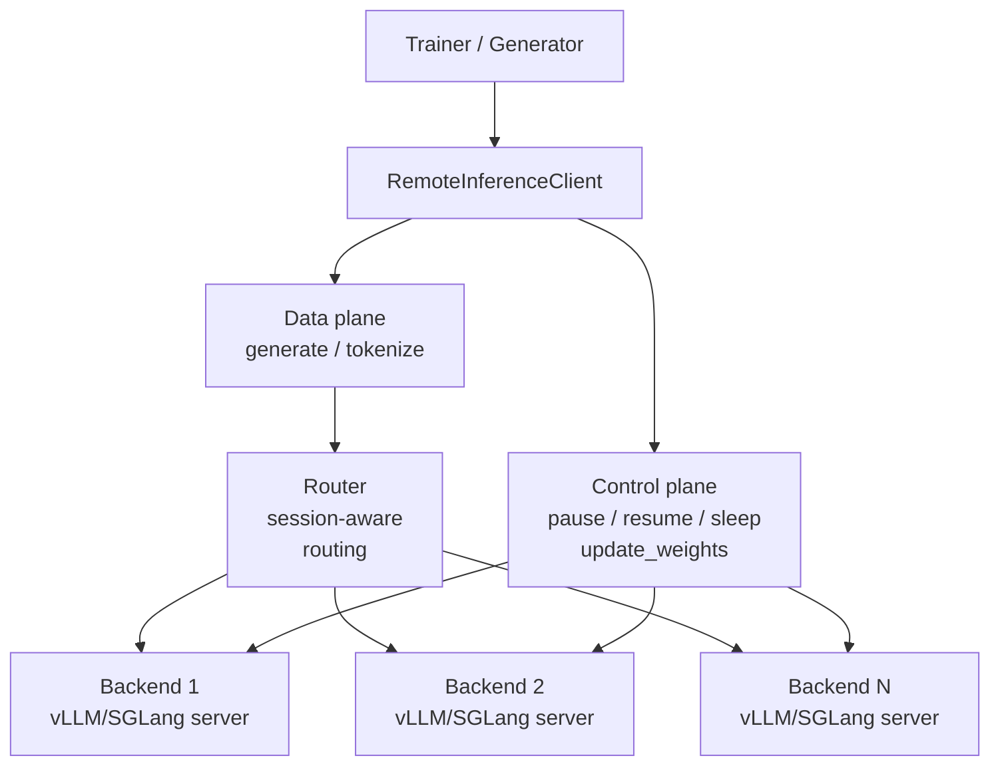

这个拆分背后的理由很具体：

| 请求 | 为什么这样走 |
|---|---|
| generation | 需要 load balancing，且多轮 trajectory 需要 session stickiness |
| pause/resume | 必须让所有 backend 一起停/起 |
| weight sync | 必须 fan-out 更新每个 replica |
| sleep/wake_up | colocated 模式要释放/恢复显存 |

SkyRL generator 会给每条 trajectory 一个稳定 `session_id`。vLLM router 使用 consistent hash，把同一个 session 的多轮请求固定到同一个 backend。这样做的收益是 prefix cache：

```text
turn 1: prompt + action + observation
turn 2: same prefix + new action
turn 3: same prefix + more observation
```

如果每个 turn 被随机路由到不同 backend，prefix cache 命中率会掉，agentic rollout 的吞吐会很差。这个点是 agent serving 和普通 single-turn serving 的关键区别。

### 7.8 SkyRL fully async：五个控制组件

SkyRL 的 fully async trainer 是 `FullyAsyncRayPPOTrainer`，继承同步的 `RayPPOTrainer`。它不是“开一个 async flag”这么简单，而是新增了五个控制组件：

| 组件 | 源码角色 | 责任 |
|---|---|---|
| `GenerationWorker` | `asyncio.Task` | 从 dataloader 拿一个 prompt group，调用 `generator.generate()` |
| `TrainingWorker` | trainer 主线程 | 从 buffer 取 mini-batch，训练 policy，触发 weight sync |
| `GenerationOutputGroupBuffer` | `asyncio.Queue` | 存已经完成的 rollout group |
| `AsyncDataloader` | `_AsyncDataloader` | 多 worker 并发取样、记录 consumed UID、支持 checkpoint resume |
| `AsyncStalenessManager` | `_AsyncStalenessManager` | 控制 generation 不要跑得比 training 太超前 |

真实 loop 可以压缩成：

```python
for epoch in epochs:
    buffer = asyncio.Queue(maxsize=B * (S + 1))

    generator_tasks = [
        create_task(run_generate_loop(buffer))
        for _ in range(num_parallel_generation_workers)
    ]

    for step in training_steps:
        groups = await collect_B_groups(buffer)
        training_input = convert(groups)
        status = await run_training(training_input)
        mark_consumed(groups)

        await dispatch.save_weights_for_sampler()
        await staleness_manager.notify_capacity_change(global_step + 1)
```

这里 `B = policy_mini_batch_size`，`S = max_staleness_steps`。

最关键的是 staleness capacity：

$$
\text{capacity} = (S + \text{current\_global\_step}) \times B
$$

生成侧要满足：

$$
\text{accepted} + \text{running} \le \text{capacity}
$$

含义是：

- `accepted`：已经生成完、可能还没训练的 group
- `running`：正在生成的 group
- `current_global_step`：当前训练到的模型版本
- `S`：允许 generation 最多领先 training 多少步

生成 worker 在开始一个新 group 前调用 `acquire_submission_slot()`；如果 buffer 和 running 已经太多，就阻塞。训练 step 完成后，`notify_capacity_change()` 增加容量，释放被阻塞的 generation worker。

这不是严格的 per-sample staleness 保证。极端长尾 trajectory 可能跑了很久才结束，实际版本差超过 `S`。SkyRL 当前选择接受它并记录 warning，而不是直接丢弃。这是一个很现实的系统取舍：

```text
drop stale sample -> 更 on-policy，但浪费长尾 rollout 成本
keep stale sample -> 吞吐更高，但需要 IS / clip 控制 off-policy bias
```

### 7.9 SkyRL 的 in-flight weight update

fully async 的关键不是“训练和生成并行”，而是训练后如何更新还在生成中的 inference engines。

SkyRL 在每个 training step 后调用：

```python
await self.dispatch.save_weights_for_sampler()
```

底层分两种情况：

**Non-colocated：NCCL broadcast**

```text
trainer step done
  -> client.pause(mode="keep")
  -> NCCL broadcast weights to vLLM workers
  -> client.resume()
  -> frozen requests continue
```

`pause(mode="keep")` 的意义是：不 abort 正在 decode 的请求，而是把它们冻结在 scheduler 里，KV cache 保留，resume 后继续跑。这个设计吞吐好，但要承担一个细节：继续 decode 的 trajectory 前半段来自旧权重，后半段来自新权重，所以训练必须记录 policy version / rollout logprobs / staleness，否则算法上说不清。

**Colocated：CUDA IPC**

```text
trainer and inference share GPUs
  -> inference sleep / release memory
  -> training runs
  -> pack updated weights into CUDA buffers
  -> send CUDA IPC handles
  -> inference wake_up and load weights
```

CUDA IPC 适合同机/同 GPU colocate；NCCL broadcast 适合 training 和 inference 分开的 GPU group。

### 7.10 SearchR1 与 terminal agent：同一个抽象，两种环境压力

SearchR1 和 terminal agent 都不是“普通 prompt completion”。它们把 rollout 变成多轮 transition：

```text
state/context -> model action tokens -> environment observation -> next state
```

区别在于 environment 的代价和风险不同：

| 维度 | SearchR1 | Terminal / SWE agent |
|---|---|---|
| action | `<search>query</search>` 或 `<answer>...</answer>` | shell command、edit、test、submit patch |
| observation | retrieval snippets | stdout/stderr、diff、file content、test log |
| state | chat history + retrieved docs | chat history + filesystem + dependency state |
| reward | final answer exact match / verifier | clean sandbox 里 patch 是否通过 |
| 主要长尾 | retriever latency、observation 过长 | sandbox boot、install、pytest、timeout |
| correctness 风险 | observation token 被错误训练 | reward hacking、环境污染、secret/network 泄漏 |

系统上可以统一成一张图：

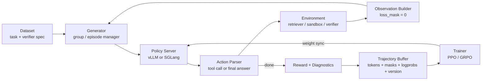

这张图里最容易出错的是 buffer schema。一个 agent trajectory 不能只保存最终字符串，至少要保存：

| 字段 | 作用 |
|---|---|
| `prompt_token_ids` / `response_ids` | 训练时复现 action token |
| `loss_mask` | 区分模型 action 和 environment observation |
| `old_logprobs` | PPO/GRPO ratio 的分母 |
| `policy_version` / `staleness` | 异步训练时判断 off-policy 程度 |
| `reward` / `reward_breakdown` | 区分格式错、工具错、答案错、环境错 |
| `stop_reason` / `tool_trace` | 定位循环、超时、截断和 verifier failure |

### 7.11 Sandbox 设计：dirty execution 与 clean verification

Terminal agent 的 sandbox 要同时满足隔离、复现、观测和扩展：

| 层次 | 设计要求 |
|---|---|
| isolation | untrusted commands 不能访问 host、其他样本或 secret |
| reproducibility | 同一任务的初始 repo、依赖、测试命令固定 |
| observability | stdout/stderr、diff、退出码、资源使用、超时都要记录 |
| scalability | sandbox boot、image pull、dependency install 不能拖垮 GPU rollout |

推荐把执行环境拆成两段：

```text
dirty sandbox:
  agent 探索、编辑、运行命令、产生缓存

clean verifier sandbox:
  只应用最终 diff，重新运行 tests / verifier
```

这个拆分能防止三类 reward hacking：修改测试、利用 dirty workspace 残留状态、从环境或网络里读取答案。真正的 agent RL 系统还需要两级限流：

```text
trainer capacity:
  控制 rollout 领先 training 的 staleness

environment capacity:
  控制 retriever / sandbox / verifier 的并发压力
```

### 7.12 slime vs SkyRL：不同边界，不同优化目标

| 维度 | slime | SkyRL |
|---|---|---|
| 核心路线 | Megatron + SGLang native post-training | modular trainer / generator / environment stack |
| 训练后端 | Megatron 路线更固定，适合大 MoE 和高吞吐 | FSDP、vLLM HTTP、Tinker、Gym 等模块可替换 |
| rollout 表达 | `custom_generate` / `rollout_function` | `GeneratorInterface` / `SkyRLGymGenerator` |
| 权重同步 | SGLang-native update，NCCL / disk / delta 路径 | broadcast / CUDA IPC / data-control plane |
| agent 任务 | 适合把 generation 逻辑深度接入 SGLang | 适合 search、terminal、browser、多环境研究迭代 |

slime 的工程哲学是收窄边界，把 Megatron 和 SGLang 这两套系统吃深；SkyRL 的工程哲学是把 trainer、policy server、environment、dispatcher 明确拆开。前者更像高性能 post-training runtime，后者更像 agent RL operating system。

---

---

## 第三部分：课后练习题与自测问答

### 模块 A：MoE 体系与 Expert Parallelism
## 十、练习题

<details class="exercise">
<summary><span class="q-label">Q1</span> <span class="q-text">MoE 为什么不是简单 ensemble？</span></summary>

Ensemble 通常多个完整模型都参与预测，然后平均或投票。MoE 是在一个模型内部，用 router 给每个 token 选择少数 experts，通常替换 FFN 层，输出仍在同一个 Transformer block 内。

</details>

<details class="exercise">
<summary><span class="q-label">Q2</span> <span class="q-text">top-1 和 top-2 routing 怎么选？</span></summary>

top-1 更便宜、通信少、实现简单；top-2/top-k 表达力更强、训练更稳定，但 token duplication、activation memory、all-to-all 和 combine 成本更高。

</details>

<details class="exercise">
<summary><span class="q-label">Q3</span> <span class="q-text">为什么 MoE 总参数大但 active 参数小，不一定 latency 更低？</span></summary>

因为 latency 还包括 routing、dispatch、all-to-all、grouped GEMM padding、load imbalance、activation IO。active FLOPs 只是其中一项。

</details>

<details class="exercise">
<summary><span class="q-label">Q4</span> <span class="q-text">fine-grained MoE 为什么对 kernel 更难？</span></summary>

expert 更多更小，每个 expert 的 token batch 变碎。小 GEMM 和 padding waste 会拉低 tensor core 利用率，dispatch metadata 和 activation IO 占比也会上升。

</details>

<details class="exercise">
<summary><span class="q-label">Q5</span> <span class="q-text">SonicMoE 的一句话贡献是什么？</span></summary>

SonicMoE 面向 fine-grained sparse MoE，把 activation caching、memory IO overlap、tile-aware token rounding 和高性能 grouped GEMM 结合起来，减少 HBM 压力和 padding waste，让 Hopper/Blackwell 上的 MoE layer 更接近理论效率。

</details>

<details class="exercise">
<summary><span class="q-label">Q6</span> <span class="q-text">MoE 系统面试最该画哪张图？</span></summary>

画这张：

```text
tokens
  -> router top-k
  -> pack by expert
  -> all-to-all to expert owners
  -> grouped GEMM
  -> all-to-all outputs back
  -> weighted combine
  -> original token order
```

然后逐个讲瓶颈：routing skew、dispatch overhead、all-to-all、small GEMM、padding、activation memory。

</details>

<details class="exercise">
<summary><span class="q-label">Q7</span> <span class="q-text">高稀疏 MoE 在 pretraining 时和 dense model 最大的不同是什么？</span></summary>

Dense model 的每个 token 都更新同一套 FFN 参数；MoE 每个 token 只更新被 router 选中的少数 experts。训练稳定性因此取决于两件事：全局 loss 是否下降，以及每个 expert 是否都获得足够、足够多样的 token。只看 global loss 会漏掉 hot expert、dead expert、routing collapse、all-to-all p95 长尾这些问题。

高质量回答要同时提到 algorithm 和 system：

```text
algorithm:
  router entropy / load balance / z-loss / expert specialization

system:
  expert token histogram / grouped GEMM occupancy / EP all-to-all / activation memory
```

</details>

<details class="exercise">
<summary><span class="q-label">Q8</span> <span class="q-text">MoE 做 RL 时为什么 GRPO/PPO 比 dense model 更容易不稳定？</span></summary>

PPO/GRPO 训练依赖 old policy 和 new policy 的 logprob ratio。MoE 下，logprob 不只受权重变化影响，还受 router 离散选择影响。如果 rollout engine 和 training engine 的 router 实现、精度、batch shape 不完全一致，训练时重新 forward 可能选择不同 expert，importance ratio 就混入了 router mismatch 噪声。

常见系统解法：

| 解法 | 核心思想 |
|---|---|
| Routing Replay | rollout 记录 expert ids，training 计算 logprob 时强制使用同一路由 |
| Keep Sampling Mask | rollout 记录采样 mask，training 侧复现同一截断分布 |
| Sequence-level objective | 用整段 response 的 likelihood ratio 降低 token-level router 抖动影响 |

</details>

<details class="exercise">
<summary><span class="q-label">Q9</span> <span class="q-text">为什么 MegaBlocks 这类 sparse training kernel 重要？</span></summary>

朴素 MoE 会把不同 expert 的 token 分散成很多小 GEMM，padding 和 launch overhead 很高。MegaBlocks 的核心价值是把 sparse MoE 训练表达成 block-sparse computation，让容量不均衡时也能减少 padding waste，并提升训练阶段的硬件利用率。

</details>

<details class="exercise">
<summary><span class="q-label">Q10</span> <span class="q-text">训练侧 MoE kernel 和 serving 侧 fused MoE kernel 关注点有什么不同？</span></summary>

训练侧还要处理 backward、activation 保存/重算、optimizer state 和 gradient communication，因此 activation memory 是核心问题。Serving 侧通常没有 backward，但请求长度和 routing 分布更不稳定，更关注 align/sort、quantized expert GEMM、EP all-to-all、p95 latency 和 continuous batching。

</details>

<details class="exercise">
<summary><span class="q-label">Q11</span> <span class="q-text">为什么 high-sparsity MoE 对 load balance 更敏感？</span></summary>

每个 token 激活的 expert 数越少，router 的离散选择越决定实际计算路径。如果大量 token 进入少数 experts，会同时造成训练梯度不均、serving all-to-all 长尾、grouped GEMM batch skew。high sparsity 省 FLOPs，但把 router 质量和系统调度推到更核心的位置。

</details>

<details class="exercise">
<summary><span class="q-label">Q12</span> <span class="q-text">为什么 MoE + speculative decoding 的收益可能不稳定？</span></summary>

Spec decode 的 verify batch 形状取决于 accepted length；MoE 的 expert batch 又取决于 router。两者叠加后，同一轮 verify 可能产生很不均匀的 expert token histogram，导致某些 experts 变成长尾。若 draft 和 target 的 token 分布不同，target MoE router 的负载也会更抖。

</details>

<details class="exercise">
<summary><span class="q-label">Q13</span> <span class="q-text">MoE serving 里为什么 p95 比平均 tokens/s 更重要？</span></summary>

平均 tokens/s 可能被大量短请求掩盖。MoE 的真实问题常出现在少数请求路由到 hot experts、all-to-all 等慢 rank、small GEMM padding waste 或 expert cache miss。线上用户感知的是 tail latency，所以要看 per-expert token histogram、all-to-all p95、kernel occupancy 和 request-level p95/p99。

</details>

<details class="exercise">
<summary><span class="q-label">Q14</span> <span class="q-text">MoE RL 里 Routing Replay 和 GSPO 分别解决哪一层问题？</span></summary>

Routing Replay 是系统侧解法：rollout 记录 old policy 的 expert ids，training recompute 时强制使用同一路由，尽量保留 token-level PPO/GRPO 语义。GSPO 是算法侧解法：把 ratio 从 token level 移到 sequence level，降低单 token router 抖动对训练目标的影响。

</details>

---

### 模块 B：Post-Training RL 集群基础设施
## 八、练习题

<details class="exercise">
<summary><span class="q-label">Q1</span> <span class="q-text">单选：为什么 GRPO 的 group sampling 会把系统长尾变成算法问题？</span></summary>

**选项**：

- A. 因为 GRPO 不需要 reward model，所以所有 completion 都必须等同长度
- B. 因为同一 prompt 的多条 completion 要一起形成 group statistics，慢 completion 会阻塞 advantage 计算
- C. 因为 GRPO 只能同步训练，不能使用异步 rollout
- D. 因为 group sampling 会让 optimizer state 变大，所以训练 step 变慢

**答案：B**

**解析**：GRPO 的 advantage 是按同一 prompt 的 group 做相对归一化。只要 group 里有一条 completion 很慢，整个 group 的 reward 均值、方差和 advantage 都不能 finalize。timeout、截断、drop stale sample 不只是系统策略，也会改变进入训练的 reward 分布。

</details>

<details class="exercise">
<summary><span class="q-label">Q2</span> <span class="q-text">单选：agent RL 的 rollout buffer 最不能缺少哪类信息？</span></summary>

**选项**：

- A. 最终 transcript 字符串即可，训练时重新 tokenize
- B. token ids、loss mask、old logprobs、reward、policy version、stop reason、environment diagnostics
- C. 只保存 prompt 和最终 reward，其他都能从模型重新算
- D. 只保存 tool trace，因为 agent RL 的主要难点是工具调用

**答案：B**

**解析**：agent trajectory 里同时混有模型 action、用户输入、system prompt、tool observation 和 verifier log。trainer 必须知道哪些 token 该算 loss，哪些 token 只是环境返回；异步训练还必须知道 old logprob 和 policy version。只存 transcript 会丢掉 token provenance。

</details>

<details class="exercise">
<summary><span class="q-label">Q3</span> <span class="q-text">单选：terminal agent 为什么要区分 dirty sandbox 和 clean verifier sandbox？</span></summary>

**选项**：

- A. dirty sandbox 用 CPU，clean sandbox 用 GPU，所以可以减少 GPU 成本
- B. dirty sandbox 负责训练，clean sandbox 负责推理，所以两者必须分开
- C. dirty sandbox 允许模型探索和修改环境；clean verifier sandbox 只验证最终 patch，避免状态污染和 reward hacking
- D. clean sandbox 只用于保存日志，不参与 reward 计算

**答案：C**

**解析**：terminal agent 会执行命令、安装依赖、改文件、甚至误改测试。最终 reward 不能在这个被污染过的环境里算。更稳的做法是：dirty sandbox 允许探索，clean verifier sandbox 从干净 workspace 开始，只应用最终 patch，再运行评测。

</details>

<details class="exercise">
<summary><span class="q-label">Q4</span> <span class="q-text">单选：slime 和 SkyRL 的系统边界差异是什么？</span></summary>

**选项**：

- A. slime 更像 Megatron + SGLang 的高吞吐 post-training substrate；SkyRL 更强调 trainer / generator / environment 的模块边界
- B. slime 只支持单机 LoRA；SkyRL 只支持 supervised fine-tuning
- C. slime 和 SkyRL 的区别主要是一个用 Python，一个用 C++
- D. slime 负责 reward model，SkyRL 负责 optimizer

**答案：A**

**解析**：slime 的设计是收窄后端组合，把 Megatron 训练和 SGLang rollout 吃深，中间用 Data Buffer 维护样本生命周期。SkyRL 更强调 generator/env-native runtime，把 trainer、policy server、environment、dispatcher 拆开，适合 search、terminal、sandbox 等多环境 agent RL。

</details>

<details class="exercise">
<summary><span class="q-label">Q5</span> <span class="q-text">单选：异步 RL 里为什么必须记录 policy version？</span></summary>

**选项**：

- A. 为了让日志更容易排序，和训练正确性无关
- B. 为了判断 rollout 样本来自哪个版本的 actor，从而估计 staleness 并解释 ratio / clip fraction
- C. 为了让 reference model 和 reward model 使用同一个随机种子
- D. 为了减少 KV cache 占用

**答案：B**

**解析**：异步 rollout 生成的样本可能来自旧权重。没有 policy version，就不知道样本和当前 trainer 相差多少步，也无法解释 importance ratio、clip fraction 和 stale sample 对梯度的影响。queue depth 是系统表象，policy lag 才是算法变量。

</details>

<details class="exercise">
<summary><span class="q-label">Q6</span> <span class="q-text">单选：SkyRL inference 里为什么要区分 data plane 和 control plane？</span></summary>

**选项**：

- A. data plane 处理 generate / tokenize 这类高频请求，需要 router 和 session stickiness；control plane 处理 pause、resume、sleep、weight update，通常要 fan-out 到 backend
- B. data plane 只负责保存 checkpoint，control plane 只负责读取数据集
- C. data plane 是训练侧概念，control plane 是推理侧概念，两者不会同时出现
- D. data plane 负责 reward model，control plane 负责 advantage normalization

**答案：A**

**解析**：生成请求是高频、长连接、需要负载均衡和 session-aware routing 的数据流；pause/resume/sleep/update_weights 是低频但影响全局状态的控制流。把两者拆开，可以让 inference cluster 同时支持高吞吐 rollout 和可靠的权重/生命周期控制。

</details>

---
