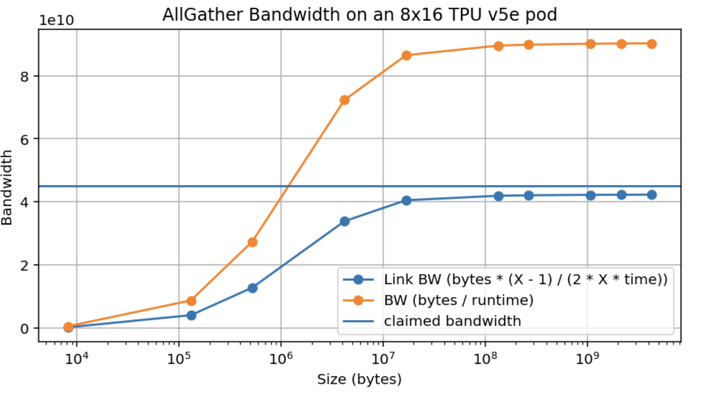
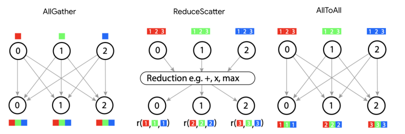
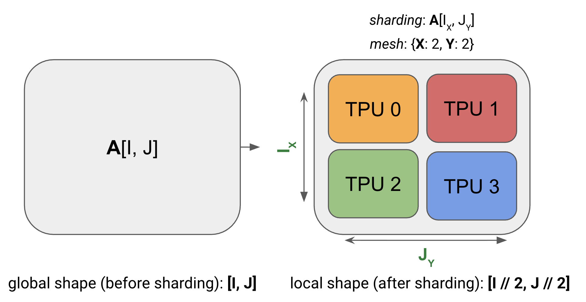

# MLSYS10 · 分布式训练并行范式

> [!info] 概述
> 本教程详细介绍深度学习中常见的并行训练范式，包括数据并行（Data Parallelism）、全分片数据并行（FSDP）、张量并行（Tensor Parallelism）和流水线并行（Pipeline Parallelism）。内容基于 Google DeepMind 的 Scaling Book 改编，并结合 GPU 硬件特性和 Hugging Face Picotron 框架的实际实现进行讲解。

---

## 目录

1. [[#一、引言与背景]]
2. [[#二、GPU 硬件基础与通信原语]]
3. [[#三、分片矩阵与矩阵乘法]]
4. [[#四、数据并行（Data Parallelism）]]
5. [[#五、全分片数据并行（FSDP/ZeRO）]]
6. [[#六、张量并行（Tensor Parallelism）]]
7. [[#七、流水线并行（Pipeline Parallelism）]]
8. [[#八、混合并行策略]]
8½. [[#八½、N-D 并行全景：从单 GPU 视角理解 Transformer 的并行分解]]
9. [[#九、Picotron 设计解析]]
10. [[#十、总结与最佳实践]]
11. [[#十一、练习题]]
12. [[#十二、参考文献与拓展阅读]]

---

## 一、引言与背景

### 1.1 为什么需要分布式训练？

当我们训练大型语言模型（LLM）时，面临以下核心挑战：

> [!important] 核心挑战
> 1. **内存限制**：模型参数、优化器状态和激活值无法装入单个 GPU 的显存
> 2. **计算瓶颈**：单 GPU 的算力无法在合理时间内完成训练
> 3. **通信开销**：多 GPU 之间的数据传输可能成为性能瓶颈

例如，一个 70B 参数的模型：
- 参数本身（bf16）：$70 \times 10^9 \times 2 = 140\text{GB}$
- Adam 优化器状态（fp32）：$70 \times 10^9 \times 8 = 560\text{GB}$
- 总计约 700GB，远超单个 H100（80GB）的显存

### 1.2 符号约定

本教程使用以下符号表示：

| 符号 | 含义 |
|------|------|
| $D$ | `d_model`（隐藏层维度/残差流维度）|
| $F$ | `d_ff`（前馈网络维度）|
| $B$ | Batch size（批次中的 token 总数）|
| $T$ | 序列长度 |
| $L$ | 模型层数 |
| $C$ | 每芯片 FLOPs/s |
| $W$ | 网络带宽（双向）|
| $X, Y, Z$ | 各网格轴上的芯片数量 |

### 1.3 简化的 Transformer 层

为简化分析，我们将 Transformer 层简化为 MLP 块的堆叠：

```
输入: In[B, D]
    ↓
    ├─→ Win[D, F] → Tmp[B, F] (上投影)
    ↓
    └─→ Wout[F, D] → Out[B, D] (下投影)
```

> [!note] 注意
> 对于大模型，Attention 只占约 1/3 的 FLOPs，MLP 占 2/3。因此这种简化是合理的近似。

---

## 二、GPU 硬件基础与通信原语

> **为什么要先了解硬件？** 所有并行策略的本质都是在**计算**和**通信**之间权衡。"这个策略值不值得用"取决于通信耗时是否能被计算隐藏——而这个比较，离不开 GPU 的算力（FLOPs/s）与互连带宽的具体数值。本节建立的硬件直觉，是整个并行分析框架的"单位换算基础"。

### 2.1 NVIDIA H100 硬件规格

在深入并行策略之前，我们需要了解 GPU 的关键硬件参数：

| 规格 | H100 SXM | H100 PCIe | A100 |
|------|----------|-----------|------|
| 显存容量 | 80 GB HBM3 | 80 GB HBM2e | 80 GB HBM2e |
| 显存带宽 | 3.35 TB/s | 2.0 TB/s | 2.0 TB/s |
| FP16 算力 | 989 TFLOPS | 756 TFLOPS | 312 TFLOPS |
| BF16 算力 | 989 TFLOPS | 756 TFLOPS | 312 TFLOPS |
| FP8 算力 | 1,979 TFLOPS | 1,513 TFLOPS | - |
| NVLink 带宽 | 900 GB/s | 600 GB/s (NVL) | 600 GB/s |

> [!tip] 关键比值：算术强度
> **算术强度** = $C / W_{mem}$ 表示每传输一个字节需要多少 FLOPs 才能"隐藏"传输延迟
> 
> 对于 H100 SXM：
> - 内存算术强度：$989 \times 10^{12} / 3.35 \times 10^{12} \approx 295$ (bf16)
> - NVLink 算术强度：$989 \times 10^{12} / 9 \times 10^{11} \approx 1100$ (bf16)

### 2.2 GPU 拓扑结构

现代数据中心 GPU 通常采用以下连接方式：

```
┌─────────────────────────────────────────────────────┐
│                    DGX H100 Node                     │
│  ┌─────┐  NVSwitch  ┌─────┐  NVSwitch  ┌─────┐      │
│  │ GPU0├────────────┤ GPU1├────────────┤ GPU2│...   │
│  └─────┘   900GB/s  └─────┘   900GB/s  └─────┘      │
│     ↓                  ↓                  ↓          │
│           PCIe / NVLink Switch System               │
└─────────────────────────────────────────────────────┘
                           ↓
                    InfiniBand / RoCE
                    (200-400 Gb/s per node)
                           ↓
┌─────────────────────────────────────────────────────┐
│                   Other Nodes                        │
└─────────────────────────────────────────────────────┘
```

**三层带宽层次**：
1. **节点内 NVLink**：~900 GB/s（H100 SXM）
2. **节点间 InfiniBand**：~50-100 GB/s
3. **数据中心网络**：~25 GB/s

### 2.3 核心通信原语（Collective Operations）

在分布式深度学习中，各个计算设备（GPU 或 TPU）分别持有模型参数、梯度、优化器状态或激活张量的局部切片（Shard）。为了完成端到端的训练与推理，硬件之间必须协同交换数据。现代深度学习系统通过一组被称为**集合通信原语（Collective Operations）**的基础算子实现高效数据同步。

在系统架构与性能建模中，评估分布式策略可行性与瓶颈的关键在于：**准确建立每个通信原语在具体物理拓扑下的耗时模型，并与计算时间（GEMM/Attention）对比，判断系统是否处于通信受限（Communication-bound）状态**。

以下集合通信耗时分析均基于大规模集群中最常用的**逻辑环拓扑（Logical Ring Topology / Torus）**建模（该模型由 Baidu Ring-AllReduce 与 Google DeepMind 的 *How to Scale Your Model* 系统化推导建立，也是 NVIDIA NCCL 底层 Ring 算法的核心物理依据）。

#### 2.3.1 AllGather

**功能**：所有设备各自持有一个张量分片，通信结束后，每个设备都拥有拼接恢复后的全局完整张量。

```
设备 0: [A0]     →   设备 0: [A0, A1, A2, A3]
设备 1: [A1]     →   设备 1: [A0, A1, A2, A3]
设备 2: [A2]     →   设备 2: [A0, A1, A2, A3]
设备 3: [A3]     →   设备 3: [A0, A1, A2, A3]
```

**符号表示**：$\text{AllGather}_X([A_X, B]) \rightarrow [A, B]$（沿设备网格轴 $X$ 收集分片维度 $A$）。

**典型应用场景**：
1. **FSDP / ZeRO-3**：前向传播计算某一 Transformer Block 之前，临时将沿数据并行（DP）维度分片的权重参数 Gather 成完整权重矩阵；计算完毕后立即释放。
2. **张量并行（TP）**：Megatron 序列并行（Sequence Parallelism）在 LayerNorm / Dropout 之后将 Sequence 维度的分片收集为完整序列以供计算。

**通信耗时模型与完整推导**：

设参与通信的设备数为 $N$，收集后的全局完整张量总大小为 $V$（字节）。通信开始前，每个设备持有的局部数据量为 $V/N$。

1. **单向环（Uni-directional Ring）推导**：
   $N$ 个设备排列为一个逻辑单向环。在每一步（Hop）中，每个设备将手头持有的某个数据分块（大小为 $V/N$）发送给顺时针相邻设备，同时从逆时针相邻设备接收一个新分块。
   为了使所有 $N$ 个设备集齐全部 $N$ 个分块，总共需要经历 $N-1$ 步传输。
   若单向链路物理带宽为 $W_\text{uni}$，每步传输耗时为 $\frac{V/N}{W_\text{uni}}$。当 $N$ 较大时取 $N-1 \approx N$：
   $$T_\text{uni} = (N - 1) \cdot \frac{V/N}{W_\text{uni}} \approx N \cdot \frac{V/N}{W_\text{uni}} = \frac{V}{W_\text{uni}}$$

2. **双向环（Bidirectional Ring / Torus）推导**：
   现代加速卡互联（如 NVIDIA NVLink、Google TPU ICI、PCIe 全双工）均支持全双工双向并发传输。为了跑满物理链路总双向带宽 $W_\text{bidir}$（每个方向链路带宽为 $W_\text{bidir}/2$），通信库将每个设备的局部数据块对半切分（每半大小为 $\frac{V}{2N}$），一半沿顺时针传播，另一半沿逆时针传播。
   顺时针与逆时针各只需走 $(N-1)/2 \approx N/2$ 步即可覆盖全环。每步向两个方向同时发出数据：
   $$T_\text{hop} = \frac{V / (2N)}{W_\text{bidir} / 2} = \frac{2V}{N \cdot W_\text{bidir}}$$
   总传输步数为 $N/2$，因此总通信耗时为：
   $$T_\text{total} = \frac{N}{2} \cdot T_\text{hop} = \frac{N}{2} \cdot \frac{2V}{N \cdot W_\text{bidir}} = \frac{V}{W_\text{bidir}}$$

> [!important] 核心结论：带宽受限模式下通信耗时与卡数无关
> 在物理带宽打满（Bandwidth-bound）时，$N$ 在公式中严格约销！**AllGather 的总通信耗时仅取决于全局张量体积 $V$ 和单设备互联带宽 $W$，与参与通信的设备数 $N$ 无关**。
> 随着设备数 $N$ 增加，通信步数虽然线性增加，但每张卡持有的数据量 $V/N$ 按比例减少，每步的数据量成比例缩减，二者完全相消。

3. **延迟受限修正（Latency-bound Correction）**：
   上述“时间与 $N$ 无关”的结论建立在“每步纯传输时间远大于硬件起步延迟”的前提下。在物理网络中，每一次跨卡传输都有不可避免的软件栈开销与硬件握手延迟 $T_\text{min}$（NVLink 约为 $0.5 \sim 1\,\mu\text{s}$，InfiniBand 约为 $1.5 \sim 3\,\mu\text{s}$，TPU ICI 约为 $1\,\mu\text{s}$）。
   当传输张量总大小 $V$ 较小，或者卡数 $N$ 极大导致每跳传输数据量 $\frac{2V}{N}$ 极小甚至只有数千字节时，每跳耗时无法跑满带宽，而是被固定握手延迟 $T_\text{min}$ 截断：
   $$T_\text{hop} = \max\!\left[ T_\text{min},\ \frac{2V}{N \cdot W} \right] \quad \Rightarrow \quad T_\text{total} = \max\!\left[ \frac{T_\text{min} \cdot N}{2},\ \frac{V}{W} \right]$$
   - **带宽-延迟临界阈值**：令 $\frac{T_\text{min} \cdot N}{2} = \frac{V}{W}$，可得临界每设备分片大小为 $\frac{V}{N} = \frac{T_\text{min} \cdot W}{2}$。
   - **硬件实例对比**：
     - **TPU v5e**（$W = 4.5 \times 10^{10}\text{ B/s},\ T_\text{min} \approx 1\,\mu\text{s}$）：临界阈值约为 $22.5 \sim 45\text{ kB}$。单卡分片小于此大小的张量通信将跌入延迟受限区。
     - **NVIDIA H100 SXM5**（$W = 900\text{ GB/s},\ T_\text{min} \approx 0.8\,\mu\text{s}$）：临界阈值约为 $360\text{ kB}$。
     - **工程实践原则**：切忌对小张量（如单个标量、LayerNorm 参数）频繁触发独立 AllGather；必须通过张量拼接（Bucket Fusion）将数据打包至数十 MB 以上再触发通信，强制算子运行在带宽受限区。

4. **多轴并发 AllGather（Multi-axis Parallel AllGather）**：
   在 2D/3D Torus 或节点内+节点间两级拓扑中，设备网格拥有多个物理正交的坐标轴 $\{X_1, X_2, \ldots\}$。若张量同时沿多个网格轴进行分片并执行 AllGather，各个轴可以同时利用物理上独立的通信链路并发收发：
   $$T_\text{total} = \max\!\left[ \frac{T_\text{min} \cdot \sum |X_i|}{2},\ \frac{V}{W \cdot N_\text{axes}} \right]$$
   通信耗时随并发网格轴数 $N_\text{axes}$ 成比例缩短。



> [!example] AllGather 时间估算实例
>
> 网格设定：TPU v5e，`{'X': 8, 'Y': 4}`，ICI 双向带宽 $W = 4.5 \times 10^{10}\text{ B/s}$。
>
> **(a) 场景一（带宽受限）**：`AllGather_Y([E_Y, F])`，$E = 2048$，$F = 8192$，bfloat16。
> - 每卡持有 `bf16[512, 8192]` = 8.4 MB，总张量大小 $V = 33.6\text{ MB}$。
> - 理论传输耗时（带宽受限）：$T = 33.6\text{ MB} / (4.5 \times 10^{10}\text{ B/s}) \approx 747\,\mu\text{s}$（真实硬件跑满实测含协议栈开销约 680 μs）。
>
> **(b) 场景二（延迟受限）**：同样网络设置，张量形状缩小至 $E = 256$，$F = 256$。
> - 每设备持有 `bf16[64, 256]` = 32 kB < 45 kB 临界阈值 → **跌入延迟受限区**。
> - 理论耗时：$T \approx T_\text{min} \times (Y/2) = 1\,\mu\text{s} \times 2 = 2\,\mu\text{s}$（实测受软件调度开销主导约为 8 μs）。

#### 2.3.2 ReduceScatter

**功能**：所有设备持有形状相同的局部张量（如反向传播算出的局部梯度），通信将对应位置元素规约求和（Reduce），并将求和结果均匀切片分发（Scatter）到各个设备，通信结束后每个设备只保留全局规约张量的一个分片。

```
设备 0: [A0, B0, C0, D0]   →   设备 0: [A0+A1+A2+A3]
设备 1: [A1, B1, C1, D1]   →   设备 1: [B0+B1+B2+B3]
设备 2: [A2, B2, C2, D2]   →   设备 2: [C0+C1+C2+C3]
设备 3: [A3, B3, C3, D3]   →   设备 3: [D0+D1+D2+D3]
```

**符号表示**：$\text{ReduceScatter}_{X,K}([A, K]\{U_X\}) \rightarrow [A, K_X]$（对在设备轴 $X$ 上未规约的维度 $K$ 求和，并将结果沿 $X$ 轴分片为 $K_X$）。

**耗时与推导**：
ReduceScatter 在环形算法上的每步操作与 AllGather 完全对称——设备在发送自身数据的同时接收相邻设备数据并进行本地加法运算。因此双向环耗时与 AllGather 完全一致：
$$T = \frac{V}{W_\text{bidir}}$$

> [!note] ReduceScatter 与 AllGather 的数学对偶关系（Kronecker 积视角）
> 定义广播算子 $\text{broadcast} = \mathbf{u} \otimes I_n$，规约算子 $\text{reduce} = \mathbf{u}^T \otimes I_n$（$\mathbf{u} = (1,\ldots,1)^T$），则：
> - $\text{AllGather} = \text{broadcast} \otimes I_p$
> - $\text{ReduceScatter} = \text{reduce} \otimes I_p$
>
> 由于 $(\mathbf{u} \otimes I_n)^T = \mathbf{u}^T \otimes I_n$，有 $\text{AllGather}^T = \text{ReduceScatter}$。
>
> **物理意义**：**反向传播中 AllGather 的伴随导数操作严格为 ReduceScatter**，反之亦然。在 FSDP 中，前向 AllGather 参数，反向时便自然对偶为 ReduceScatter 梯度。

#### 2.3.3 AllReduce

**功能**：对所有设备上的数据求和，并将最终求和后的完整张量保留在每一个设备上。

```
设备 0: [A0]   →   设备 0: [A0+A1+A2+A3]
设备 1: [A1]   →   设备 1: [A0+A1+A2+A3]
设备 2: [A2]   →   设备 2: [A0+A1+A2+A3]
设备 3: [A3]   →   设备 3: [A0+A1+A2+A3]
```

**符号表示**：$\text{AllReduce}_{X}([A_X, B]\{U_Y\}) \rightarrow [A_X, B]$

> [!important] 经典两阶段环形分解
> 环形 AllReduce 在工程实现上并非单阶段完成，而是严格分解为两阶段：
> $$\text{AllReduce} = \text{ReduceScatter} + \text{AllGather}$$
> 1. **阶段一（ReduceScatter）**：各设备分块归约并分散，耗时 $T_1 = \frac{V}{W_\text{bidir}}$。
> 2. **阶段二（AllGather）**：将归约后的分片收集并广播至所有卡，耗时 $T_2 = \frac{V}{W_\text{bidir}}$。
> 
> 因此 AllReduce 的总耗时是 AllGather 的 2 倍：
> $$T_\text{AllReduce} = \frac{2V}{W_\text{bidir}}$$

#### 2.3.4 AllToAll

**功能**：置换切分维度（维度转置）。每个设备持有的数据块被切分成 $N$ 份，分别发送给对应的 $N$ 个目标设备。

```
设备 0: [A0, B0]   →   设备 0: [A0, A1]
设备 1: [A1, B1]   →   设备 1: [B0, B1]
```

**符号表示**：$\text{AllToAll}_{X, J}([A, B_X]) \rightarrow [A_X, B]$

**典型应用场景**：
1. **MoE（Mixture-of-Experts）专家并行**：各 rank 上的 Router 将分配给不同专家的 token 通过 AllToAll 派发给拥有该专家的 GPU；计算完毕后再次调用 AllToAll 将结果送回原始 rank。
2. **混合并行维度切换**：在分布式注意力中，将序列并行（按序列维分片）转换为头并行（按注意力头维度分片）。

**耗时分析（双向环）**：
- 在 AllGather 中，每个分片必须传遍所有 $N-1$ 个其他设备，数据必须走满整个环，单向环链路总传输量 $\propto V(1 - 1/N)$。
- 在 AllToAll 中，设备 $i$ 的数据块只需定向发送给设备 $j$。在双向环上，每个数据块沿着顺时针或逆时针的最短路径传输，平均跳步距离约为 $N/4$（仅为全环 $N/2$ 的一半）。
- 结合双向并发传输，总链路通信耗时仅为 AllGather 的 1/4：
  $$T_\text{AllToAll} = \frac{T_\text{AllGather}}{4} = \frac{V}{4W_\text{bidir}}$$

#### 2.3.5 通信操作总结

| 操作 | 核心功能 | 符号表述 | 双向环理论耗时 | 典型应用范式 |
|:---|:---|:---|:---|:---|
| **AllGather** | 收集分片，还原完整张量 | $[A_X, B] \rightarrow [A, B]$ | $\frac{V}{W_\text{bidir}}$ | FSDP 权重前向重建、SP 序列聚合 |
| **ReduceScatter** | 对应规约，分散保留分片 | $[A, B]\{U_X\} \rightarrow [A_X, B]$ | $\frac{V}{W_\text{bidir}}$ | FSDP 梯度反向规约、TP 列-行连接 |
| **AllReduce** | 全局规约，全员保留结果 | $[A, B]\{U_X\} \rightarrow [A, B]$ | $\frac{2V}{W_\text{bidir}}$ | DDP 梯度同步、Megatron TP 输出合并 |
| **AllToAll** | 转置分片维度 | $[A, B_X] \rightarrow [A_X, B]$ | $\frac{V}{4W_\text{bidir}}$ | MoE 专家 Token 路由、2D 并行转换 |



---

## 三、分片矩阵与矩阵乘法

> **为什么从分片矩阵乘法入手？** LLM 的绝大部分计算量（约 90%）来自矩阵乘法（QKV 投影、MLP 层等）。一旦掌握了"如何高效乘以分片矩阵"，就能系统地推导出所有并行策略——数据并行、张量并行、FSDP 本质上都是矩阵乘法分片的不同选择，对应不同的通信-计算权衡。原始教材在此给出了完整的分片理论：[Sharded Matrices and How to Multiply Them](https://jax-ml.github.io/scaling-book/sharding/)。

### 3.1 分片符号系统

我们使用**命名轴符号**来描述张量如何在设备网格上分片：



- **设备网格（Device Mesh）**：定义物理设备的组织方式
  ```python
  mesh = DeviceMesh("cuda", (4, 2))  # 4×2 的设备网格
  mesh = DeviceMesh("cuda", (4, 2), mesh_dim_names=("X", "Y"))
  ```

- **分片规范（Sharding Spec）**：描述张量各维度如何映射到网格轴

  > **符号直觉**：I、J、K… 是张量的**逻辑维度名**；X、Y、Z… 是设备网格的**物理轴名**。下标把两者绑定在一起：
  > ```
  > A  [  I_X  ,  J_Y  ]
  > ↑     ↑  ↑    ↑  ↑
  > 数组  维度 物理轴 维度 物理轴
  >      (行) (沿X切) (列) (沿Y切)
  > ```
  > 没有下标（如 `J`）= 该维度**不切**，每台设备上完整复制。

  ```
  A[I_X, J_Y]  # I 维度沿 X 轴分片，J 维度沿 Y 轴分片
  A[I_XY, J]   # I 维度沿 X 和 Y 轴展平后分片
  A[I, J]      # 完全复制（无分片）
  ```

> [!example] 分片示例
>
> 对于形状为 `[1024, 4096]` 的张量，网格为 `{'X': 8, 'Y': 2}`：
>
> | 分片规范 | 每设备形状 | 总内存倍数 |
> |----------|-----------|-----------|
> | $A[I, J]$ | [1024, 4096] | 16× |
> | $A[I_X, J]$ | [128, 4096] | 2× |
> | $A[I_X, J_Y]$ | [128, 2048] | 1× |
> | $A[I_{XY}, J]$ | [64, 4096] | 1× |
>
> **总内存倍数 = 没有被分片的网格轴的设备数之积**（即数据被复制的份数）。用到的轴做分片（不复制），没用到的轴在每个设备上存完整数据（复制）：
> - $A[I, J]$：X 和 Y 都没用 → 复制 8×2 = **16 份**
> - $A[I_X, J]$：X 用于分片 I，Y 没用 → 复制 1×2 = **2 份**
> - $A[I_X, J_Y]$：X、Y 都用于分片 → 复制 1×1 = **1 份**
> - $A[I_{XY}, J]$：X 和 Y 都用于分片 I → 复制 1×1 = **1 份**

**JAX 代码示例**：

```python
import jax
import jax.numpy as jnp

# 创建 4×2 设备网格（需要 8 个设备）
assert len(jax.devices()) == 8
mesh = jax.make_mesh(axis_shapes=(4, 2), axis_names=('X', 'Y'))

# 定义分片规范工具函数
def P(*args):
    return jax.NamedSharding(mesh, jax.sharding.PartitionSpec(*args))

# 创建分片数组（JAX 自动处理通信，对用户透明）
A = jnp.zeros((8, 2048), dtype=jnp.bfloat16, device=P('X', 'Y'))   # A[I_X, J_Y]
B = jnp.zeros((2048, 8192), dtype=jnp.bfloat16, device=P(None, 'Y'))  # B[J, K_Y]

# 分片矩阵乘法（JAX 编译器自动插入必要的集合通信）
y = jax.jit(
    lambda A, B: jnp.einsum('BD,DF->BF', A, B),
    out_shardings=P('X', 'Y')
)(A, B)
```

> [!note] JAX 的分片透明性
> 分片数组与普通数组行为完全相同——可以做任意运算，JAX 编译器自动推断并插入通信原语。

**PyTorch 等价实现**（`DTensor`，PyTorch 2.0+）：

```python
import torch
import torch.distributed as dist
from torch.distributed.device_mesh import init_device_mesh
from torch.distributed.tensor import distribute_tensor, Shard, Replicate

# 初始化进程组（需要 8 个进程）
dist.init_process_group(backend="nccl")

# 创建 4×2 设备网格
mesh = init_device_mesh("cuda", (4, 2), mesh_dim_names=("X", "Y"))

# A[I_X, J_Y]：第 0 维沿 X 分片，第 1 维沿 Y 分片
A = distribute_tensor(
    torch.zeros(8, 2048, dtype=torch.bfloat16),
    mesh,
    placements=[Shard(0), Shard(1)]
)

# B[J, K_Y]：第 0 维在 X 上复制，第 1 维沿 Y 分片
B = distribute_tensor(
    torch.zeros(2048, 8192, dtype=torch.bfloat16),
    mesh,
    placements=[Replicate(), Shard(1)]
)

# 分片矩阵乘法（DTensor 自动推断通信并插入）
y = torch.einsum('BD,DF->BF', A, B)  # y 的分片自动为 [Shard(0), Shard(1)]
```

> [!note] JAX ↔ PyTorch DTensor 对应关系
> | JAX `PartitionSpec` | PyTorch `placements` |
> |---------------------|----------------------|
> | `P('X', 'Y')` | `[Shard(0), Shard(1)]` |
> | `P(None, 'Y')` | `[Replicate(), Shard(1)]` |
> | `P(None, None)` | `[Replicate(), Replicate()]` |
> | `{U_X}`（部分和） | `[Partial(), ...]` |

> [!example] Pop Quiz 1：2D 分片内存计算
>
> 数组 `fp32[1024, 4096]`，分片规范 $A[I_{XY}, J]$，网格 `{'X': 8, 'Y': 2}`
>
> - 每设备本地形状：`fp32[64, 4096]`（$1024 / (8 \times 2) = 64$）
> - 每设备内存：$64 \times 4096 \times 4 = 1\text{ MiB}$
> - H100 加载时间（3.35 TB/s）：$10^6 / 3.35 \times 10^{12} \approx 0.3\,\mu\text{s}$（实际含开销更长）

> [!example] Pop Quiz 2：复制分片的总内存
>
> 数组 `int8[128, 2048]`，分片规范 $A[I_{XY}, J]$，网格 `{'X': 2, 'Y': 8, 'Z': 2}`（共 32 设备）
>
> - 分片仅作用于 X 和 Y 轴（共 16 个设备），**Z 轴（2 个设备）完全复制**
> - 每设备本地形状：`int8[8, 2048]`（$128 / (2 \times 8) = 8$）
> - 每设备内存：$8 \times 2048 \times 1 = 16\text{ KiB}$
> - **总内存**：$16\text{ KiB} \times 32\text{ 设备} = 512\text{ KiB}$（原始 256 KiB 的 2 倍，因 Z 轴复制了一份）

### 3.2 分片矩阵乘法的四种情况

当执行分片矩阵乘法 $C = A \cdot B$ 时，通信需求取决于分片方式：

#### 情况 1：收缩维度均未分片

$$A[I_X, J] \cdot B[J, K_Y] \rightarrow C[I_X, K_Y]$$

**无需通信**！每个设备可以独立完成本地乘法。

```python
# PyTorch 示例
# A: [batch/X, d_model], B: [d_model, d_ff/Y] → C: [batch/X, d_ff/Y]
local_C = torch.matmul(local_A, local_B)
```

#### 情况 2：一个输入的收缩维度被分片

$$A[I, J_X] \cdot B[J, K] \rightarrow C[I, K]$$

**需要 AllGather**：先收集 A，再本地乘法

```python
# 先 AllGather A
full_A = all_gather(local_A, dim=1)  # [I, J_X] → [I, J]
# 再本地乘法
local_C = torch.matmul(full_A, local_B)
```

#### 情况 3：两个输入的收缩维度沿同一轴分片

$$A[I, J_X] \cdot B[J_X, K] \rightarrow C[I, K]\{U_X\}$$

**本地乘法产生部分和，需要 AllReduce**：

```python
# 本地乘法（部分和）
partial_C = torch.matmul(local_A, local_B)  # 每设备得到部分结果
# AllReduce 求和
full_C = all_reduce(partial_C, op=SUM)
```

> [!note] 优化：用 ReduceScatter 代替 AllReduce
> 如果后续需要分片结果，可以用 ReduceScatter：
> $$C[I, K]\{U_X\} \xrightarrow{\text{ReduceScatter}} C[I, K_X]$$
> 这样节省了一半的通信量。

#### 情况 4：两个非收缩维度沿同一轴分片（非法）

$$A[I_X, J] \cdot B[J, K_X] \rightarrow C[I_X, K_X] \quad \text{(维度冲突，非法)}$$

**必须先 AllGather 其中一个输入**：

```python
# 选项 1：AllGather A
full_A = all_gather(local_A, dim=0)
local_C = torch.matmul(full_A, local_B)  # C[I, K_X]

# 选项 2：AllGather B
full_B = all_gather(local_B, dim=1)
local_C = torch.matmul(local_A, full_B)  # C[I_X, K]
```

### 3.3 通信-计算重叠（Collective Matmul）

关键优化：**在通信进行时执行计算**

```
时间线：
├── AllGather 块 0 ──┬── AllGather 块 1 ──┬── AllGather 块 2 ──┤
                     │                    │                    │
                     └── MatMul 块 0 ─────┴── MatMul 块 1 ─────┴── MatMul 块 2
```

在 PyTorch 中，这通过 CUDA 流实现：

```python
import torch
import torch.distributed as dist

# 创建专用的通信流
comm_stream = torch.cuda.Stream()
comp_stream = torch.cuda.current_stream()

# 将张量分块
chunks = tensor.chunk(num_chunks, dim=0)

for i, chunk in enumerate(chunks):
    # 在通信流上启动 AllGather
    with torch.cuda.stream(comm_stream):
        gathered_chunk = all_gather_async(chunk)
    
    # 同时在计算流上处理上一块
    if i > 0:
        result_chunks[i-1] = compute(gathered_chunks[i-1])
    
    # 等待当前块的 AllGather 完成
    comp_stream.wait_stream(comm_stream)
    gathered_chunks[i] = gathered_chunk
```

---

## 四、数据并行（Data Parallelism）

> **Motivation**：数据并行是最自然的并行方式——把数据集分割，每个 GPU 持有完整模型、独立完成前向和反向传播，最后通过 AllReduce 同步梯度。优点是实现简单（PyTorch DDP 只需一行包装），前向传播完全零通信。核心问题是：梯度 AllReduce 的通信开销何时成为瓶颈？答案取决于每 GPU 的 batch size 与硬件算力/带宽比值的关系。

> [!note] 与第二、三章的关系
> 第二章给了**词汇**（AllGather、AllReduce 等原语及其开销），第三章给了**语法**（给定一种分片，判断需要哪个原语）。从第四章开始，我们把这套工具用于具体问题：为 Transformer 选择一种分片方案 → 用第三章规则推导需要什么通信 → 用第二章公式算通信耗时 → 与计算耗时比较。**这就是每一种并行策略的统一分析框架，后续各章都沿用它。**

数据并行的分片选择：**B（batch）沿 X 分片，权重完全复制**。

| | 前向传播 | 反向传播 |
|--|---------|---------|
| 分片形式 | $\text{In}[B_X, D] \cdot W[D, F]$ | 梯度 $\nabla W[D,F]\ \{U_X\}$ |
| 对应第三章情况 | 情况 1（收缩维度 D 均未分片）→ **无需通信** | 部分和需归约 → **AllReduce** |
| 通信开销 | 0 | $4DF / W$ |

后续章节（FSDP、TP）本质上只是换了一种分片选择，通信原语随之变化，框架完全相同。

### 4.1 基本原理

**数据并行**是最简单的并行策略：

$$\text{In}[B_X, D] \cdot_D W_\text{in}[D, F] \cdot_F W_\text{out}[F, D] \rightarrow \text{Out}[B_X, D]$$

```
┌──────────────────────────────────────────────────────────┐
│                    数据并行示意图                          │
├──────────────────────────────────────────────────────────┤
│                                                          │
│   GPU 0              GPU 1              GPU 2            │
│  ┌───────┐          ┌───────┐          ┌───────┐         │
│  │Batch 0│          │Batch 1│          │Batch 2│         │
│  │(B/3)  │          │(B/3)  │          │(B/3)  │         │
│  └───┬───┘          └───┬───┘          └───┬───┘         │
│      ↓                  ↓                  ↓              │
│  ┌───────┐          ┌───────┐          ┌───────┐         │
│  │ 完整  │          │ 完整  │          │ 完整  │         │
│  │ 权重  │          │ 权重  │          │ 权重  │         │
│  │ (W)   │          │ (W)   │          │ (W)   │         │
│  └───────┘          └───────┘          └───────┘         │
│      ↓                  ↓                  ↓              │
│  ┌───────┐          ┌───────┐          ┌───────┐         │
│  │梯度 0 │←─────────┼──AllReduce──────→│梯度 2 │         │
│  └───────┘          └───────┘          └───────┘         │
│                                                          │
└──────────────────────────────────────────────────────────┘
```

### 4.2 算法详解

**前向传播**（无通信）：

```python
def forward_pass(input_shard, W_in, W_out):
    # input_shard: [B/X, D]
    # W_in, W_out: 完整复制
    tmp = input_shard @ W_in       # [B/X, F]
    output = tmp @ W_out           # [B/X, D]
    return output
```

**反向传播**（需要 AllReduce）：

```python
def backward_pass(dL_dOutput, input_shard, tmp, W_in, W_out):
    # 计算局部梯度
    dL_dW_out_local = tmp.T @ dL_dOutput        # [F, D] 部分和
    dL_dTmp = dL_dOutput @ W_out.T              # [B/X, F]
    dL_dW_in_local = input_shard.T @ dL_dTmp    # [D, F] 部分和
    dL_dInput = dL_dTmp @ W_in.T                # [B/X, D]
    
    # AllReduce 梯度（可与下一层计算重叠）
    dL_dW_out = all_reduce(dL_dW_out_local)     # [F, D] 完整梯度
    dL_dW_in = all_reduce(dL_dW_in_local)       # [D, F] 完整梯度
    
    return dL_dInput, dL_dW_in, dL_dW_out
```

### 4.3 通信分析

每层需要 2 次 AllReduce：

$$T_\text{comms} = \frac{2 \times 2 \times 2 \times D \times F}{W_\text{NVLink}} = \frac{8DF}{W}$$

计算时间：

$$T_\text{math} = \frac{8 \times B \times D \times F}{X \times C}$$

> [!important] 计算瓶颈条件
> 当 $T_\text{math} > T_\text{comms}$ 时，我们是**计算受限**的（理想状态）：
> 
> $$\frac{B}{X} > \frac{C}{W}$$
> 
> 对于 H100 SXM：$C/W \approx 989 \times 10^{12} / 9 \times 10^{11} \approx 1100$
> 
> 即**每 GPU 的 batch size 需要大于 ~1100 tokens** 才能高效利用计算资源。

### 4.4 PyTorch DDP 实现

```python
import torch
import torch.distributed as dist
from torch.nn.parallel import DistributedDataParallel as DDP

# 初始化进程组
dist.init_process_group(backend="nccl")
local_rank = int(os.environ["LOCAL_RANK"])
torch.cuda.set_device(local_rank)

# 包装模型
model = MyModel().cuda()
model = DDP(model, device_ids=[local_rank])

# 训练循环 - DDP 自动处理梯度同步
for batch in dataloader:
    optimizer.zero_grad()
    loss = model(batch).loss
    loss.backward()  # DDP 在这里自动 AllReduce 梯度
    optimizer.step()
```

---

## 五、全分片数据并行（FSDP/ZeRO）

### 5.1 动机与原理

**FSDP**（Fully Sharded Data Parallel）也称为 **ZeRO-3**，解决了纯数据并行的内存限制：

$$\text{In}[B_X, D] \cdot_D W_\text{in}[D_X, F] \cdot_F W_\text{out}[F, D_X] \rightarrow \text{Out}[B_X, D]$$

核心思想：**参数、梯度和优化器状态都沿数据并行维度分片**

```
┌──────────────────────────────────────────────────────────┐
│                    FSDP 示意图                            │
├──────────────────────────────────────────────────────────┤
│                                                          │
│   GPU 0              GPU 1              GPU 2            │
│  ┌───────┐          ┌───────┐          ┌───────┐         │
│  │Batch 0│          │Batch 1│          │Batch 2│         │
│  └───┬───┘          └───┬───┘          └───┬───┘         │
│      │                  │                  │              │
│  ┌───┴───┐          ┌───┴───┐          ┌───┴───┐         │
│  │W 分片0│          │W 分片1│          │W 分片2│         │
│  │ (1/3) │          │ (1/3) │          │ (1/3) │         │
│  └───────┘          └───────┘          └───────┘         │
│      │                  │                  │              │
│      ├──────────AllGather────────────────┤              │
│      ↓                  ↓                  ↓              │
│  ┌───────┐          ┌───────┐          ┌───────┐         │
│  │完整 W │          │完整 W │          │完整 W │         │
│  │(临时) │          │(临时) │          │(临时) │         │
│  └───┬───┘          └───┬───┘          └───┬───┘         │
│      ↓ 前向计算          ↓                  ↓              │
│      ↓ 丢弃完整 W        ↓                  ↓              │
│                                                          │
└──────────────────────────────────────────────────────────┘
```

### 5.2 ZeRO 的三个阶段：精确内存分析

混合精度训练下，每个参数的内存占用（16 bytes/param）：

```
每个参数的内存拆解：

  bf16 参数    fp32 梯度    fp32 master   fp32 m      fp32 v
  ┌─────────┐ ┌─────────┐  ┌─────────┐  ┌─────────┐ ┌─────────┐
  │  2 bytes│ │  4 bytes│  │  4 bytes│  │  4 bytes│ │  4 bytes│
  └─────────┘ └─────────┘  └──────────────────────────────────┘
   参数本身     梯度         ←─────── Adam 优化器状态：12 bytes ────────→
```

以 **7B 参数模型，N=8 GPU** 为例（纯 DDP 需 112 GB/GPU）：

```
                    参数(2B)    梯度(4B)    优化器(12B)   每GPU总计
─────────────────────────────────────────────────────────────────
DDP（不分片）     14 GB       28 GB       84 GB         126 GB  ❌
ZeRO-1（分片OS） 14 GB       28 GB       84/8=10.5 GB  52.5 GB
ZeRO-2（分片G+OS）14 GB      28/8=3.5 GB 84/8=10.5 GB  28  GB
ZeRO-3/FSDP      14/8=1.75GB 28/8=3.5 GB 84/8=10.5 GB  15.75GB ✓
─────────────────────────────────────────────────────────────────
注意：激活值所有阶段都不分片（需要单独用激活重计算节省）
```

| 阶段 | 分片内容 | 通信增加 | 推荐场景 |
|------|----------|----------|----------|
| ZeRO-1 | 优化器状态 | 无额外通信 | OS 是瓶颈 |
| ZeRO-2 | + 梯度 | 无额外通信 | 梯度也撑不下 |
| ZeRO-3 (FSDP) | + 参数 | 前向多 2×AllGather | 参数都放不下 |

### 5.4 通信分析

与纯数据并行相比：

| 操作 | 数据并行 | FSDP |
|------|----------|------|
| 前向通信 | 0 | 2 × AllGather(W) |
| 反向通信 | 2 × AllReduce(∇W) | 2 × AllGather(W) + 2 × ReduceScatter(∇W) |
| 总通信量 | $4 \times 2DF$ | $4 \times 2DF$ |

> [!important] 关键洞察
> FSDP 的总通信量与纯数据并行**相同**！
> 
> 因为 AllReduce = AllGather + ReduceScatter
> 
> 但 FSDP 大幅减少了内存使用。

### 5.5 PyTorch FSDP 实现

```python
from torch.distributed.fsdp import FullyShardedDataParallel as FSDP
from torch.distributed.fsdp import ShardingStrategy, MixedPrecision
from torch.distributed.fsdp.wrap import transformer_auto_wrap_policy
import functools

# 定义包装策略
auto_wrap_policy = functools.partial(
    transformer_auto_wrap_policy,
    transformer_layer_cls={TransformerBlock}
)

# 混合精度配置
mp_policy = MixedPrecision(
    param_dtype=torch.bfloat16,
    reduce_dtype=torch.float32,
    buffer_dtype=torch.bfloat16
)

# 包装模型
model = FSDP(
    model,
    sharding_strategy=ShardingStrategy.FULL_SHARD,  # ZeRO-3
    auto_wrap_policy=auto_wrap_policy,
    mixed_precision=mp_policy,
    device_id=torch.cuda.current_device(),
)

# 训练循环
for batch in dataloader:
    optimizer.zero_grad()
    loss = model(batch).loss
    loss.backward()
    optimizer.step()
```

### 5.6 FSDP 通信时间线

FSDP 把通信均摊到整个前反向过程，而 DDP 只在反向结束后一次性通信：

```
DDP（朴素）：
前向 ──────────────────────────────────────────── 反向 ──────────── AllReduce ──▶

FSDP：
前向：[AG W1][compute][free W1][AG W2][compute][free W2]...
反向：[AG W_L][compute][RS ∇W_L][free][AG W_{L-1}][compute][RS ∇W_{L-1}]...

AG = AllGather（重建权重）  RS = ReduceScatter（归约+分片梯度）
free = 立即释放完整权重（这是内存节省的关键）
```

**FSDP 通信量 = DDP 通信量**，但分散在更多时间点上，更容易与计算重叠。

### 5.7 ZeRO++：通信量再减半

ZeRO-3 的通信瓶颈在跨节点 AllGather（节点间带宽只有节点内的 1/10）。ZeRO++ 的三个优化：

```
ZeRO++ 优化 1：量化 AllGather（qG）
  bf16 权重 → int8 量化 → 跨节点 AllGather（数据量减半）→ 反量化
  代价：精度轻微损失

ZeRO++ 优化 2：分层 AllGather（hpZ）
  先节点内 AllGather（NVLink，快）→ 每节点各自完成本节点的计算
  代价：节点内显存多用 tp× 的权重

ZeRO++ 优化 3：量化 ReduceScatter（qRS）
  梯度量化后传输 → 反量化后存储
  代价：梯度精度损失（一般影响不大）
```

### 5.8 面试常见问题

<details class="exercise">
<summary><span class="q-label">Q</span> <span class="q-text">FSDP 省不了激活值的内存，怎么办？</span></summary>

激活值（每个 batch 的中间结果）在所有 ZeRO 阶段都不分片，仍然是 per-GPU 的完整值。需要单独应用**激活重计算（gradient checkpointing）**：前向时不保存激活，反向时重新计算。代价是额外 33% 的计算量，换来大量激活内存。

</details>

<details class="exercise">
<summary><span class="q-label">Q</span> <span class="q-text">什么时候选 FSDP，什么时候选 TP？</span></summary>

- FSDP：解决内存问题，通信在反向传播（大 batch 时高效）
- TP：解决小 batch 时的计算效率，通信在每个 matmul（需 NVLink）
- 实践：先用 FSDP，如果每 GPU batch size < 1000 tokens，再加 TP

</details>

### 5.9 何时使用 FSDP

> [!tip] FSDP 适用场景
> - 模型大小超过单 GPU 显存
> - 每 GPU batch size 足够大（$B/X > C/W$）
> - 需要在不修改模型代码的情况下扩展

> [!warning] FSDP 的限制
> - 计算瓶颈条件与数据并行相同
> - 对于 H100：每 GPU batch size > 1100 tokens
> - 如需更小的 batch size，需要结合张量并行

---

## 六、张量并行（Tensor Parallelism）

> **Motivation**：FSDP 的效率条件是每 GPU batch size > $C/W \approx 1100$ tokens。在推理场景（$B=1$）或 batch 很小时，这个条件很难满足，FSDP 变成通信受限。张量并行换了一个思路：**不切数据，切权重**——把 FFN 的宽度维度 $F$ 或注意力头数沿设备分片。这样效率条件变为 $F > Y \times C/W$，即使 $B=1$ 也能高效利用算力。代价是每个矩阵乘法都需要通信，因此 TP 必须放在高带宽的节点内 NVLink 上。

### 6.1 基本原理

**张量并行**（也称为 Megatron 分片）将模型的维度分片：

$$\text{In}[B, D_Y] \cdot_D W_\text{in}[D, F_Y] \cdot_F W_\text{out}[F_Y, D] \rightarrow \text{Out}[B, D_Y]$$

核心思想：**分片模型维度而非数据维度**

```
┌──────────────────────────────────────────────────────────┐
│                   张量并行示意图                          │
├──────────────────────────────────────────────────────────┤
│                                                          │
│        Input [B, D]                                      │
│            │                                             │
│            ├──AllGather──┐                               │
│            ↓              ↓                               │
│   GPU 0: In[B,D]   GPU 1: In[B,D]                        │
│            │              │                               │
│            ↓              ↓                               │
│   ┌────────────┐  ┌────────────┐                         │
│   │W_in[D,F/2] │  │W_in[D,F/2] │   (列并行)              │
│   └──────┬─────┘  └─────┬──────┘                         │
│          ↓              ↓                                 │
│   Tmp[B, F/2]    Tmp[B, F/2]                             │
│          │              │                                 │
│          ↓              ↓                                 │
│   ┌────────────┐  ┌────────────┐                         │
│   │W_out[F/2,D]│  │W_out[F/2,D]│   (行并行)              │
│   └──────┬─────┘  └─────┬──────┘                         │
│          │              │                                 │
│          └──ReduceScatter──┐                             │
│                    ↓                                      │
│            Out[B, D/2] (分片)                            │
│                                                          │
└──────────────────────────────────────────────────────────┘
```

### 6.2 ReduceScatter 在 TP 中的具体过程

行并行乘法后，每个 GPU 持有**部分和**（partial sum），需要合并。以 tp=2、输出维度 D=4 为例：

```
行并行矩阵乘完成后，每个 GPU 各自算了一部分：

GPU 0 的 partial: Tmp0[B, F/2] @ W0[F/2, D] = C0[B, D=4]
GPU 1 的 partial: Tmp1[B, F/2] @ W1[F/2, D] = C1[B, D=4]

                C0          C1          真正的 Out = C0 + C1
GPU 0 持有: [1, 2, 3, 4]              → [1+5, 2+6, 3+7, 4+8] = [6, 8, 10, 12]
GPU 1 持有:             [5, 6, 7, 8]    (每个位置都是两个 GPU 的贡献之和)
```

**AllReduce 做法**（Megatron 原版）：每个 GPU 把自己的 partial 广播给对方，然后各自相加 → 两个 GPU 都得到完整的 [6,8,10,12]，内存浪费一倍。

**ReduceScatter 做法**（SP 版本）：把输出 D 维度切开，每个 GPU 只负责求和自己那段：

```
步骤 1：交换数据
  GPU 0 把 C0 的后半 [3,4] 发给 GPU 1
  GPU 1 把 C1 的前半 [5,6] 发给 GPU 0

步骤 2：各自在本地相加负责的那段
  GPU 0 的前半：[1,2] + [5,6] = [6, 8]       ← 前 D/2 的正确答案
  GPU 1 的后半：[3,4] + [7,8] = [10, 12]      ← 后 D/2 的正确答案

结果：
  GPU 0 持有 Out[B, :D/2] = [6, 8]    （SP 状态：按 D 分片）
  GPU 1 持有 Out[B, D/2:] = [10, 12]
```

**关键**：ReduceScatter 同时完成了两件事：① 把部分和加起来（Reduce），② 把结果按 D 维分片存储（Scatter）。这正好对应了进入下一层 LayerNorm 所需的 SP 状态，一步操作、两个目的、零额外通信。

### 6.3 列并行与行并行

#### 列并行（Column Parallel）

将权重矩阵沿列分割：

$$W = [W_0 | W_1 | ... | W_{n-1}]$$

- 输入：复制到所有 GPU
- 输出：每 GPU 持有输出的一部分
- 无需通信（直到需要完整输出）

#### 行并行（Row Parallel）

将权重矩阵沿行分割：

$$W = \begin{bmatrix} W_0 \\ W_1 \\ \vdots \\ W_{n-1} \end{bmatrix}$$

- 输入：必须已分片
- 输出：需要 AllReduce 或 ReduceScatter 汇总

### 6.3 MLP 层的张量并行

Transformer 的 MLP 完美适配列并行 + 行并行的组合：

```
┌─────────────────────────────────────────────────┐
│              MLP 张量并行                        │
├─────────────────────────────────────────────────┤
│                                                 │
│   Input [B, D]                                  │
│       │                                         │
│       │ (复制)                                   │
│       ↓                                         │
│   ┌───────────┐     ┌───────────┐              │
│   │ W_up      │     │ W_gate    │  (列并行)     │
│   │ [D, F/Y]  │     │ [D, F/Y]  │              │
│   └─────┬─────┘     └─────┬─────┘              │
│         │                 │                     │
│         ↓                 ↓                     │
│   hidden [B, F/Y]   gate [B, F/Y]              │
│         │                 │                     │
│         └────── × ────────┘  (逐元素)           │
│                 │                               │
│                 ↓                               │
│         ┌─────────────┐                        │
│         │ W_down      │  (行并行)               │
│         │ [F/Y, D]    │                        │
│         └──────┬──────┘                        │
│                │                               │
│                ↓                               │
│         partial [B, D]                         │
│                │                               │
│         AllReduce / ReduceScatter              │
│                │                               │
│                ↓                               │
│         Output [B, D] 或 [B, D_Y]               │
│                                                 │
└─────────────────────────────────────────────────┘
```

### 6.4 注意力层的张量并行

```
┌─────────────────────────────────────────────────┐
│           Attention 张量并行                     │
├─────────────────────────────────────────────────┤
│                                                 │
│   Input [B, S, D]                               │
│       │                                         │
│       │ (复制)                                   │
│       ↓                                         │
│   ┌─────┐  ┌─────┐  ┌─────┐                    │
│   │ W_Q │  │ W_K │  │ W_V │   (列并行)          │
│   │[D,H]│  │[D,H]│  │[D,H]│   H = n_heads/Y    │
│   └──┬──┘  └──┬──┘  └──┬──┘                    │
│      │        │        │                        │
│      ↓        ↓        ↓                        │
│  Q[B,S,H]  K[B,S,H]  V[B,S,H]                  │
│      │        │        │                        │
│      └────Attention────┘                        │
│              │                                  │
│              ↓                                  │
│        Attn_out [B, S, H]                       │
│              │                                  │
│          ┌───┴───┐                             │
│          │ W_O   │  (行并行)                    │
│          │[H, D] │                             │
│          └───┬───┘                             │
│              │                                  │
│         AllReduce                               │
│              │                                  │
│              ↓                                  │
│        Output [B, S, D]                         │
│                                                 │
└─────────────────────────────────────────────────┘
```

### 6.5 算法详解

```python
def tensor_parallel_forward(input_shard, W_in, W_out):
    """
    input_shard: [B, D/Y] - 沿 D 维度分片
    W_in: [D, F/Y] - 列并行
    W_out: [F/Y, D] - 行并行
    """
    # AllGather 输入
    input_full = all_gather(input_shard, dim=-1)  # [B, D]
    
    # 列并行矩阵乘法（无通信）
    tmp = input_full @ W_in  # [B, F/Y]
    
    # 行并行矩阵乘法（产生部分和）
    output_partial = tmp @ W_out  # [B, D] {U_Y}
    
    # ReduceScatter
    output_shard = reduce_scatter(output_partial, dim=-1)  # [B, D/Y]
    
    return output_shard
```

### 6.6 通信分析

$$T_\text{math} = \frac{4BDF}{Y \cdot C}$$

$$T_\text{comms} = \frac{4BD}{W}$$

> [!important] 计算瓶颈条件
> $$\frac{F}{Y \cdot C} > \frac{1}{W} \Rightarrow F > Y \cdot \frac{C}{W}$$
> 
> 对于 H100 SXM：$C/W \approx 1100$
> 
> 因此 $Y < F / 1100$
> 
> 对于 LLaMA-70B（$F \approx 28672$）：$Y_\text{max} \approx 26$

> [!tip] 关键区别
> - **数据并行**：batch size 受限
> - **张量并行**：模型维度受限，与 batch size 无关

### 6.7 残差连接的处理

TP 中最微妙的设计点：**残差路径（x + sublayer(x)）如何保持正确**。

```
标准 Transformer 层（TP=2）：

x [B,S,D]（复制）
│
├──────────────────────────────────────┐  ← 残差分支（不动）
│                                      │
▼                                      │
LayerNorm（本地，无通信）               │
│                                      │
▼ AllGather(SP) → [B, S/cp, D]        │
│                                      │
├── Q_proj[D, D/2] → Q[B,S,D/2]      │  ← ColumnParallel：本地矩阵乘，无通信
├── K_proj[D, D/2] → K[B,S,D/2]      │
└── V_proj[D, D/2] → V[B,S,D/2]      │
         │                             │
     Attention（本地，各 GPU 算 D/2 的头）│
         │                             │
     O_proj[D/2, D]（行并行）          │
         │                             │
     ReduceScatter → [B, S/(cp·sp), D]│  ← 求和部分积，同时进入 SP
         │                             │
         └──────────── + ─────────────┘  ← 残差相加（均在 SP 状态，形状匹配）
                       │
                  [B, S/(cp·sp), D]

关键：RowParallel 的 ReduceScatter 输出形状与残差完全一致，直接相加，无需额外通信
```

### 6.8 为什么 TP 必须在节点内

TP 每个 Transformer 层产生 **2 次** 集合通信（Attention 和 MLP 各一次），32 层模型每次前向传播有 **64 次** 通信轮次。

```
通信延迟估算（每次 AllGather，数据 [B,S,D] = 128×4096×8192×2 = 8MB）：

NVLink  (900 GB/s)：8MB / 900GB/s ≈ 9μs   ← 可接受
InfiniBand (25 GB/s)：8MB / 25GB/s ≈ 320μs ← 每层 640μs，32层 = 20ms
单层计算时间（H100）：~2ms（B=128 时）
→ 跨节点 TP：通信时间 >> 计算时间，完全不可行
```

### 6.9 面试常见问题

<details class="exercise">
<summary><span class="q-label">Q</span> <span class="q-text">列并行和行并行的通信模式有什么区别？</span></summary>

- **列并行**（按输出维度切）：输入复制，本地矩阵乘，输出天然分片 → **前向无通信**
- **行并行**（按输入维度切）：输入已分片（来自上一列并行），本地矩阵乘产生部分和 → **前向需 ReduceScatter**
- 反向传播中两者互换：列并行反向需 AllReduce，行并行反向需 AllGather

</details>

<details class="exercise">
<summary><span class="q-label">Q</span> <span class="q-text">TP 的上限是多少？不能无限增加 TP 度吗？</span></summary>

效率条件：$F > Y \times C/W$，即 $Y < F / (C/W)$。H100 上 $C/W \approx 1100$，LLaMA-70B 的 $F = 28672$，所以理论上限 $Y \approx 26$，实践中通常最多用到 8（一个节点内的 GPU 数）。超过这个值，通信时间 > 计算时间。

</details>

<details class="exercise">
<summary><span class="q-label">Q</span> <span class="q-text">TP 如何处理 Embedding 层？</span></summary>

Embedding 表 $[V, D]$ 很大（LLaMA-3：128K × 8K ≈ 2GB）。Vocab Parallel 让每个 GPU 持有 $[V/\text{tp}, D]$。前向时每个 GPU 查自己的词表段（不在自己段的 token 查到 0），然后 AllReduce 得到完整 embedding。LM Head 与 Embedding 共享权重（transposed），可以直接重用分片，无需额外通信。

</details>

<details class="exercise">
<summary><span class="q-label">Q</span> <span class="q-text">TP 和 FSDP 能同时用吗？如何组合？</span></summary>

可以，这是最常见的组合。设 TP=t，FSDP=d，总 GPU 数 = t×d。
每个 FSDP 组内的 t 个 GPU 做 TP（节点内 NVLink），d 个 FSDP 组之间做 DP（跨节点 InfiniBand）。
FSDP 看到的"权重"是 TP 已经分片后的 1/t，再在 d 个设备上分片存储，总每 GPU 权重 = 1/(t×d)。

</details>

---

## 七、流水线并行（Pipeline Parallelism）

> **Motivation**：TP 和 FSDP 都需要高带宽连接（节点内 NVLink ~900 GB/s），不适合跨节点通信（节点间 InfiniBand ~200 Gb/s，慢约 10-100 倍）。当模型规模需要跨多个节点时，流水线并行是更好的选择：**按层将模型切段分配到不同节点，只在段边界传输激活值**（数据量远小于权重），将对跨节点带宽的需求降到最低。代价是引入"流水线气泡"（GPU 等待时间），需通过微批次调度来缓解。

### 7.1 基本原理

**流水线并行**将模型的层分配到不同设备：

```
┌──────────────────────────────────────────────────────────┐
│                  流水线并行示意图                         │
├──────────────────────────────────────────────────────────┤
│                                                          │
│   GPU 0         GPU 1         GPU 2         GPU 3       │
│  ┌──────┐      ┌──────┐      ┌──────┐      ┌──────┐     │
│  │Layers│ ───→ │Layers│ ───→ │Layers│ ───→ │Layers│     │
│  │ 0-7  │      │ 8-15 │      │16-23 │      │24-31 │     │
│  └──────┘      └──────┘      └──────┘      └──────┘     │
│     ↑                                          │         │
│     │               反向传播                    │         │
│     └──────────────────────────────────────────┘         │
│                                                          │
└──────────────────────────────────────────────────────────┘
```

### 7.2 流水线气泡：根本原因

**气泡（bubble）= GPU 因等待上下游数据而空闲的时间**。

以 P=4 个阶段，单个 batch 为例：

```
时间轴（每格 = 1 个前向或反向的时间单位）：

         1    2    3    4    5    6    7    8
GPU 0: [ F0 ]                         [ B0 ]
GPU 1:        [ F0 ]              [ B0 ]
GPU 2:               [ F0 ]  [ B0 ]
GPU 3:                    [ F0 ][ B0 ]
             ←──── 气泡 ────→
             GPU 0 做完 F0 后
             必须等 GPU 3 算完才能反向

气泡来源：
  - 热身阶段：GPU 0 把数据交给 GPU 1，然后只能等
  - 冷却阶段：GPU 3 把梯度传回 GPU 2，GPU 2 传给 GPU 1...
  - GPU 0 等到梯度传回才能做 B0，期间完全空闲
```

**气泡比例（单 batch 时最严重）** = $(P-1)$ 个空闲单元 / $2P$ 个总单元 = $(P-1)/2P \approx 50\%$

---

### 7.3 解法：微批次（Microbatch）+ 调度策略

把一个 batch 拆成 $M$ 个微批次（microbatch），让流水线在热身/冷却期间保持忙碌：

#### GPipe / AFAB（All-Forward-All-Backward）

```
P=4 个阶段，M=4 个微批次，每格代表一个 F 或 B：

         1    2    3    4    5    6    7    8    9   10   11
GPU 0: [ F0 ][ F1 ][ F2 ][ F3 ]  .    .    . [ B3 ][ B2 ][ B1 ][ B0 ]
GPU 1:        [ F0 ][ F1 ][ F2 ][ F3 ]  .    .    . [ B3 ][ B2 ][ B1 ][ B0 ]
GPU 2:               [ F0 ][ F1 ][ F2 ][ F3 ]  .    .    . [ B3 ][ B2 ][ B1 ][ B0 ]
GPU 3:                     [ F0 ][ F1 ][ F2 ][ F3 ][ B3 ][ B2 ][ B1 ][ B0 ]
                                               ↑
                                           GPU 3 最后一个 F 完成
                                           立刻开始 B（无气泡！）

气泡（.）只在 GPU 0 的 F3 结束后到 B3 开始前 = P-1 = 3 单元
总时间 = M + (P-1) + M = 2M + (P-1) = 11 单元
理想时间 = 2M = 8 单元
气泡比例 = (P-1)/(2M+P-1) ≈ P/(2M)    → M=4,P=4 时 ≈ 27%

⚠️ 内存问题：GPU 0 在做 B 之前，M=4 个微批次的激活值全部堆在显存里
→ 激活内存 ∝ M × layer_size（随 M 线性增长）
```

#### 1F1B（One-Forward-One-Backward）

**核心思路：一旦能做 B 就立刻做 B，不等所有 F 做完。**

```
P=4，M=8（微批次），每格 = 1 个 F 或 B：

         热身期          稳态（1F1B 交替）            冷却期
         ←──P-1──→   ←──────── M=8 ────────→   ←──P-1──→
GPU 0: [F0][F1][F2][F3][B0][F4][B1][F5][B2][F6][B3][F7][B4][B5][B6][B7]
GPU 1:     [F0][F1][F2][B0][F3][B1][F4][B2][F5][B3][F6][B4][B5][B6][B7]
GPU 2:         [F0][F1][B0][F2][B1][F3][B2][F4][B3][F5][B4][B5][B6][B7]
GPU 3:             [F0][B0][F1][B1][F2][B2][F3][B3][F4][B4][B5][B6][B7]
                                                              ↑
                                                      稳态中 GPU 0 始终在工作
气泡 = 热身期 GPU 3 等待 + 冷却期 GPU 0 等待 ≈ (P-1) 单元（前后各一半）

气泡比例 = (P-1)/(M+P-1) ≈ P/M（与 M 成反比，M 越大越好）

内存优势：任意时刻，每个 GPU 最多只有 P 个微批次的激活值在显存中
→ 激活内存 ∝ P × layer_size（与 M 无关！）
```

**GPipe vs 1F1B 对比：**

```
                   气泡比例          激活内存
GPipe（AFAB）     (P-1)/(2M+P-1)   M × 层激活
1F1B              (P-1)/(M+P-1)    P × 层激活  ← 内存大幅节省
```

> 1F1B 气泡略大，但激活内存从 $O(M)$ 降到 $O(P)$，**在大模型训练中 $M \gg P$，内存节省远比气泡重要**。

---

### 7.4 Interleaved 1F1B（虚拟阶段）

**问题**：即使有 M 个微批次，气泡比例 $(P-1)/M$ 在 P 大时仍明显（如 P=16，M=32，气泡 ≈ 47%）。

**解法**：每个 GPU 承担 $V$ 个**不连续的虚拟阶段**（interleaved chunks），等效把 P 分成更细的流水线：

```
标准 1F1B（P=4，每 GPU 1 段连续层）：
GPU 0: Layer 0-7    GPU 1: Layer 8-15   GPU 2: Layer 16-23  GPU 3: Layer 24-31

Interleaved 1F1B（P=4，V=2，每 GPU 2 段不连续层）：
GPU 0: Layer 0-3 和 Layer 16-19
GPU 1: Layer 4-7 和 Layer 20-23
GPU 2: Layer 8-11 和 Layer 24-27
GPU 3: Layer 12-15 和 Layer 28-31

→ 等效流水线深度变为 P×V=8，气泡比例缩小 V 倍：
  气泡 = (P-1)/(V×M+P-1) ≈ P/(V×M)
```

**代价**：每个微批次要经过 $V$ 次额外的阶段切换 → **P2P 通信次数增加 $V$ 倍**。

```
权衡：
  V=1（标准）：气泡 P/M，通信 2×P次/microbatch
  V=2：气泡 P/(2M)，通信 4×P次/microbatch
  V=4：气泡 P/(4M)，通信 8×P次/microbatch

实践：通常 V=2 或 V=4，更大的 V 通信开销过重。
```

---

### 7.5 面试常见问题

<details class="exercise">
<summary><span class="q-label">Q</span> <span class="q-text">气泡的本质是什么？如何量化？</span></summary>

气泡是流水线热身/冷却期间的 GPU 空闲。标准 1F1B 的气泡比例 = $(P-1)/(M+P-1)$。要使气泡 < 5%，需要 $M > 20(P-1) \approx 20P$。例如 PP=8 时，需要 160 个微批次。

</details>

<details class="exercise">
<summary><span class="q-label">Q</span> <span class="q-text">1F1B 相比 GPipe 的核心优势是什么？</span></summary>

**不是气泡（两者相近），而是激活内存**。GPipe 需要同时保存 M 个微批次的激活值（$O(M)$ 内存），1F1B 稳态时只有 P 个激活值在飞行中（$O(P)$ 内存）。大模型训练中通常 $M \gg P$，节省激活内存至关重要。

</details>

<details class="exercise">
<summary><span class="q-label">Q</span> <span class="q-text">PP 的阶段间传递什么数据？大小是多少？</span></summary>

前向：激活值 $[B/\text{dp}, S/\text{cp}, D]$，大小 $= B \cdot S \cdot D \cdot 2$ 字节（bf16）。反向：同形状的梯度。相比权重大小（几 GB），这通常只有几 MB，这就是为什么 PP 可以用低带宽的跨节点互连。

</details>

<details class="exercise">
<summary><span class="q-label">Q</span> <span class="q-text">怎么选择 M（微批次数量）和 P（流水线阶段数）？</span></summary>

- 增大 M：减少气泡，但每个微批次 batch size 变小（可能影响统计效率）
- 增大 P：可以训练更大的模型，但气泡增大，需要同步增大 M
- 经验法则：$M \geq 4P$（使气泡 < 25%），通常 $M = 8P$ 到 $M = 16P$

</details>

<details class="exercise">
<summary><span class="q-label">Q</span> <span class="q-text">Interleaved 1F1B 的气泡公式和代价？</span></summary>

气泡比例 $(P-1)/(V \cdot M + P-1) \approx P/(VM)$，缩小 $V$ 倍。代价：每个微批次的 P2P 通信次数增加 $V$ 倍（更多阶段边界）。实践中 $V = 2$ 是常见选择，平衡气泡与通信开销。

</details>

### 7.6 1F1B 调度伪代码

```
# 每个 stage 的调度逻辑（伪代码）

warmup_steps = P - my_rank - 1   # rank 越小，热身越长

# 热身阶段：只做前向，填充流水线
for i in 0..warmup_steps:
    x = recv_forward() if not first_stage else microbatch[i]
    y = forward(x)
    send_forward(y) if not last_stage
    save(x, y)                   # 保存激活用于反向

# 稳态阶段：1F1B 交替
for i in warmup_steps..M:
    x = recv_forward() if not first_stage else microbatch[i]
    y = forward(x)
    send_forward(y) if not last_stage

    dy = recv_backward() if not last_stage else loss_grad
    dx = backward(saved_x, saved_y, dy)
    send_backward(dx) if not first_stage

# 冷却阶段：只做反向，排空流水线
for i in 0..warmup_steps:
    dy = recv_backward() if not last_stage else loss_grad
    dx = backward(saved_x, saved_y, dy)
    send_backward(dx) if not first_stage

optimizer.step()

# 注意：first_stage/last_stage 直接从数据集/loss 获取梯度
# 其余阶段只做 recv/send，对数据来源无感知（模块化设计）
```

---

## 八、混合并行策略

### 8.1 3D 并行

实际训练大模型时，通常组合多种并行策略：

```
┌──────────────────────────────────────────────────────────────┐
│                     3D 并行示意图                             │
├──────────────────────────────────────────────────────────────┤
│                                                              │
│                    ┌─────────────────────────────────────┐   │
│                    │         Pipeline Parallel            │   │
│                    │  Stage 0        Stage 1              │   │
│                    │  ┌──────┐       ┌──────┐             │   │
│    Data Parallel   │  │      │──────→│      │             │   │
│    Replica 0       │  │      │       │      │             │   │
│                    │  └──────┘       └──────┘             │   │
│                    │  ↕ TP ↕         ↕ TP ↕               │   │
│                    │  ┌──────┐       ┌──────┐             │   │
│                    │  │      │       │      │             │   │
│                    │  └──────┘       └──────┘             │   │
│                    └─────────────────────────────────────┘   │
│                                                              │
│                    ┌─────────────────────────────────────┐   │
│                    │         Pipeline Parallel            │   │
│                    │  Stage 0        Stage 1              │   │
│                    │  ┌──────┐       ┌──────┐             │   │
│    Data Parallel   │  │      │──────→│      │             │   │
│    Replica 1       │  │      │       │      │             │   │
│                    │  └──────┘       └──────┘             │   │
│                    │  ↕ TP ↕         ↕ TP ↕               │   │
│                    │  ┌──────┐       ┌──────┐             │   │
│                    │  │      │       │      │             │   │
│                    │  └──────┘       └──────┘             │   │
│                    └─────────────────────────────────────┘   │
│                                                              │
│  总 GPU 数 = DP × PP × TP = 2 × 2 × 2 = 8                    │
│                                                              │
└──────────────────────────────────────────────────────────────┘
```

### 8.2 FSDP + TP 组合

最常用的组合是 FSDP（数据并行）+ 张量并行：

$$\text{In}[B_X, D_Y] \cdot_D W_\text{in}[D_X, F_Y] \cdot_F W_\text{out}[F_Y, D_X] \rightarrow \text{Out}[B_X, D_Y]$$

**优势**：

- FSDP 移动权重，TP 移动激活值
- 随着 TP 增加，FSDP 的 AllGather 变小（因为激活值被分片）
- 随着 FSDP 增加，TP 的 AllGather 变小（因为 batch 被分片）

### 8.3 最优配置

**目标**：最小化通信时间，保持计算瓶颈

$$T_\text{FSDP comms} = \frac{4DF}{Y \cdot W \cdot M_X}$$

$$T_\text{TP comms} = \frac{4BD}{X \cdot W \cdot M_Y}$$

**最优 FSDP 规模**：

$$X_\text{opt} = \sqrt{\frac{B}{F} \cdot \frac{M_X}{M_Y} \cdot N}$$

其中 $N$ 是总 GPU 数。

> [!example] 配置示例
> 对于 LLaMA-70B（$F \approx 28672$），$B = 2M$ tokens，$N = 64$ GPUs：
> 
> $$X_\text{opt} = \sqrt{\frac{2 \times 10^6}{28672} \cdot 1 \cdot 64} \approx 67$$
> 
> 选择 $X = 64$（FSDP），$Y = 1$（无 TP）

### 8.4 Picotron 中的进程组管理

Picotron 使用 `ProcessGroupManager` 统一管理 4D 并行的进程组分配。设备排列顺序为 `DP → CP → TP → PP`，每个 rank 的坐标可由整除取模直接算出；各维度的通信组通过枚举其他维度的所有组合来创建。具体设计细节见 [[#九、Picotron 实战：从零构建分布式训练框架]] §9.2。

---

## 八½、N-D 并行全景：从单 GPU 视角理解 Transformer 的并行分解

> 单个 GPU 内部视角：前面各节分别讲 DP、FSDP、TP、PP，但实际训练大模型时，一个 Transformer 前向传播中会同时交织 5-6 种并行策略。本节把它们统一到本地张量形状和通信需求上。

### 8½.1 "本地形状"思维：站在单 GPU 内部看世界

理解并行的核心分析方法：从单 GPU 局部视角出发，明确当前卡所持有的张量分片规格以及所需的通信操作：
- 我手上的数据是什么形状？
- 要完成我的计算，我缺什么？需要和谁通信？

**本地激活形状公式**：

$$\text{local shape} = \left[ \frac{B}{\text{dp}}, \; \frac{S}{\text{cp} \times \text{sp}}, \; D \right]$$

- $B / \text{dp}$：数据并行分了 batch
- $S / (\text{cp} \times \text{sp})$：Context Parallel 和 Sequence Parallel 共同分了序列
- $D$：隐藏维度保持完整（TP 分的是权重的 F 维度，不是 D）

每种并行策略切分的维度不同，这就是它们可以正交组合的原因：

| 符号 | 并行策略 | 分片什么？ | 作用于哪些层？ |
|------|---------|-----------|-------------|
| dp | Data Parallel | Batch ($B$) | 所有层 |
| tp | Tensor Parallel | 权重的 FFN/Head 维度 ($F$, $n\_heads$) | Attention, MLP |
| sp | Sequence Parallel | 激活值的序列维度 ($S$)，**仅在 element-wise 操作中** | LayerNorm, Dropout, 残差连接 |
| cp | Context Parallel | 序列维度 ($S$)，**在 Attention QKV 计算中** | Attention |
| ep | Expert Parallel | 专家数量 ($E$) | MoE 层 |
| vp | Vocab Parallel | 词表维度 ($V$) | Embedding, Loss |

### 8½.2 Sequence Parallel (SP)：TP 的天然搭档

**问题**：张量并行（TP）只能分片矩阵乘法操作（因为矩阵乘可以按维度拆分）。但 Transformer 中还有大量 **element-wise 操作**（LayerNorm, Dropout, 残差连接, 激活函数），这些操作的权重很小甚至没有权重，不值得做 TP。在纯 TP 中，这些操作只能在**完整的、未分片的激活值**上执行——浪费了显存。

**SP 的解决方案**：在 element-wise 操作中，**沿序列维度分片激活值**。

关键洞察：element-wise 操作是逐元素独立的（每个位置的计算不依赖其他位置），所以每个 GPU 只处理自己那一段序列即可，不需要通信。

```
TP 区域（矩阵乘法）          SP 区域（element-wise）
┌────────────────┐          ┌────────────────┐
│ 每 GPU 持有完整 S │          │ 每 GPU 持有 S/sp │
│ 权重按 F 分片     │   ←→    │ 激活按 S 分片     │
│ AllGather(sp)   │  转换    │ ReduceScatter   │
└────────────────┘          └────────────────┘
```

**SP 和 TP 之间的转换**：
- **进入 TP 区域**（如 Attention, MLP 的矩阵乘）：需要 `AllGather(sp)` 把序列拼回完整
- **离开 TP 区域**（回到 LayerNorm 等）：用 `ReduceScatter` 把 TP 的部分和求和，同时沿序列维度分散

巧妙之处：TP 的行并行层本身就需要 `ReduceScatter`（求和部分积），SP 只是让这个 ReduceScatter **同时完成了序列分片**——一个通信操作，两个目的，零额外开销。

### 8½.3 Context Parallel (CP)：长序列的救星

**问题**：Self-Attention 的计算和内存复杂度是 $O(S^2)$。当序列很长（如 128K tokens）时，即使其他维度都分了，Attention 的 $S \times S$ 矩阵依然巨大。SP 只能在 element-wise 操作中分序列，Attention 中**每个位置需要看到所有其他位置**，不能简单按 S 切分。

**CP 的解决方案**：在 Attention 计算中也按序列分片，但使用 **Ring Attention** 机制——每个 GPU 持有 $S/\text{cp}$ 段 Query，通过**环形传递 KV 块**逐步完成完整的注意力计算。

```
GPU 0: Q[0:S/4]     GPU 1: Q[S/4:S/2]    GPU 2: Q[S/2:3S/4]   GPU 3: Q[3S/4:S]
      │                    │                     │                    │
      └── Ring: 传递 KV ──→ ──→ ──→ ──→ ──→ ──→ ──→ ──→ ──→ ──→ ──→─┘
```

每一步，每个 GPU 用自己的 Q 和当前收到的 KV 块计算局部注意力，然后把 KV 传给环中下一个 GPU。经过 cp 轮传递后，每个 GPU 就看到了完整的 KV，注意力计算完成。

**CP vs SP 的区别**：
- **SP**：分序列维度，用于 element-wise 操作（LayerNorm, Dropout），不需要跨位置通信
- **CP**：分序列维度，用于 Attention 计算，通过 Ring Attention 实现跨位置的 KV 共享

两者分的都是 $S$ 维度，所以在本地形状公式中它们相乘：$S / (\text{cp} \times \text{sp})$。

### 8½.4 Expert Parallel (EP)：MoE 的专属并行

**Mixture of Experts (MoE)** 模型中，MLP 层被替换为多个 "专家"（每个专家是一个独立的 MLP），每个 token 只激活其中 top-k 个专家。

**EP 的做法**：将不同的专家放在不同的 GPU 上。

```
Token 路由（Router）决定每个 token 去哪个专家
         │
    AllToAll(ep)         ← 把 token 发给对应的专家所在的 GPU
         │
    各 GPU 独立计算      ← 每个 GPU 上的专家处理分配到的 token
    （可内部用 TP）
         │
    AllToAll(ep)         ← 把计算结果发回 token 原来所在的 GPU
         │
    继续后续计算
```

**核心通信**：两次 `AllToAll`——一次发 token 给专家，一次取回结果。AllToAll 是一种"转置"操作：输入按 token 分片，输出按 expert 分片（或反过来）。

**EP 的瓶颈**：AllToAll 需要**所有 GPU 之间两两通信**（不像 AllGather/ReduceScatter 可以用 Ring 优化），网络互连是主要瓶颈。这就是为什么 MoE 模型虽然参数量大（激活参数少），但通信成本可能反而更高。

### 8½.5 Vocab Parallel (VP)：Embedding 和 Loss 的分片

LLM 的词表通常很大（LLaMA 3: 128K），Embedding 表的大小为 $V \times D$（128K × 8K ≈ 1GB bf16），完全复制到每个 GPU 不划算。

**VP 的做法**：每个 GPU 只持有词表的一段 $[V/\text{vp}]$。

**Embedding 前向**：
```
Input token IDs: [B, S]
         │
    每个 GPU 查自己的 Embedding 分片（不属于自己的 token 得到 0）
         │
    ReduceScatter         ← 求和得到完整 embedding，同时切换到 SP 分片
         │
    Output: [B, S/sp, D]  ← 进入 SP 状态
```

**Loss 计算**（Cross-Entropy with VP）：

Cross-Entropy 需要对整个词表做 softmax，但每个 GPU 只有 $V/\text{vp}$ 个 logits。需要额外通信来计算全局的 softmax 分母：

```
local logits: [B, S, V/vp]
         │
    AllReduce(max)        ← 找到全局最大值（数值稳定性）
    AllReduce(sum)        ← 计算全局 exp-sum（softmax 分母）
         │
    本地计算 log-softmax   ← 用全局统计量在本地完成
         │
    AllReduce(sum)        ← 汇总 loss
```

完整 Transformer 并行全景图可以把 DP/TP/SP/CP/EP/VP 的通信模式放到同一张图里：



## 九、Picotron 设计解析

[Picotron](https://github.com/huggingface/picotron) 是 HuggingFace 的教育用 4D 并行框架，核心设计哲学：**每种并行策略是独立正交的维度，通过进程组组合，互不干扰**。

---

### 9.1 核心抽象：4D 设备网格

所有进程排列在一个 4D 网格上，每个进程有唯一的坐标 `(dp, tp, pp, cp)`：

```
                    PP Stage 0          PP Stage 1
                ┌───────────────┐   ┌───────────────┐
                │  TP=0  TP=1   │   │  TP=0  TP=1   │
    DP replica 0│  GPU0  GPU1   │──▶│  GPU4  GPU5   │
                │               │   │               │
    DP replica 1│  GPU2  GPU3   │──▶│  GPU6  GPU7   │
                └───────────────┘   └───────────────┘
                      Node 0              Node 1
```

**每种并行对应网格的一个切面：**

```
TP 组  = 同一行 (相同 dp, pp, cp，不同 tp) → 节点内高带宽
DP 组  = 同一列 (相同 tp, pp, cp，不同 dp) → 跨节点
PP 组  = 深度方向 (相同 dp, tp, cp，不同 pp) → 点对点
```

**rank 映射公式**（Picotron 约定顺序：dp → cp → tp → pp）：

```
global_rank = dp * (cp*tp*pp) + cp * (tp*pp) + tp * pp + pp_rank
```
### 9.2 进程组管理器（ProcessGroupManager）

每个进程启动时，根据自己的 `global_rank` 计算出 4 个坐标，并加入对应的通信子组：

```
# 伪代码
class ProcessGroupManager:
    def __init__(dp, tp, pp, cp):
        rank = dist.get_rank()

        # 解算坐标
        self.dp_rank = rank // (cp*tp*pp)
        self.cp_rank = (rank // (tp*pp)) % cp
        self.tp_rank = (rank // pp) % tp
        self.pp_rank = rank % pp

        # 为每个维度创建子通信组
        self.dp_group = new_group([所有相同(tp,pp,cp)位置的rank])
        self.tp_group = new_group([所有相同(dp,pp,cp)位置的rank])
        self.pp_group = new_group([所有相同(dp,tp,cp)位置的rank])
```

进程之后只需调用 `pgm.tp_group`、`pgm.dp_group` 等，不需要知道全局 rank。
### 9.3 TP 设计：模型手术

TP 不修改训练循环，而是**替换模型的线性层**，让每层天然支持分片计算：

```
原始模型                          TP 改造后
─────────────────────────────────────────────────────────
Linear(D → F)          →    ColumnParallelLinear(D → F/tp)
                                  （无通信，输出天然分片）

Linear(F → D)          →    RowParallelLinear(F/tp → D)
                                  （ReduceScatter 求和）
─────────────────────────────────────────────────────────
```

**前向传播数据流（tp=4 为例）：**

```
输入 x[B, D]  ──────────────────────────────────────────
              ↓ 复制到 4 个 GPU（或 AllGather 自 SP）
  GPU0: x[B,D]   GPU1: x[B,D]   GPU2: x[B,D]   GPU3: x[B,D]
      │               │               │               │
      ▼ W_in[D,F/4]   ▼               ▼               ▼
  [B, F/4]        [B, F/4]        [B, F/4]        [B, F/4]
      │               │               │               │
      ▼ W_out[F/4,D]  ▼               ▼               ▼
  [B, D]{U}       [B, D]{U}       [B, D]{U}       [B, D]{U}
      └───────────────┴───────────────┴───────────────┘
                          ReduceScatter
                              ↓
                      [B, D/4]（继续 SP 状态）
```

**层替换伪代码：**
```
# 遍历模型所有层，就地替换
for layer in model.layers:
    layer.mlp.gate_proj  = ColumnParallel(原层)   # 列并行
    layer.mlp.up_proj    = ColumnParallel(原层)
    layer.mlp.down_proj  = RowParallel(原层)       # 行并行
    layer.attn.q/k/v     = ColumnParallel(原层)
    layer.attn.o_proj    = RowParallel(原层)
```
### 9.4 DP 设计：桶式梯度 AllReduce

朴素做法：等所有层反向结束，一次 AllReduce 全部梯度 → 通信和计算完全串行。

Picotron 的做法：**把参数按大小分成 Bucket，反向时某个 Bucket 的梯度一凑齐就立刻异步 AllReduce**，与后续层的反向计算重叠：

```
反向传播顺序（从后往前）：

时间 ──────────────────────────────────────────────────────────────▶

Layer N 反向: ████████
              └──▶ Bucket 3 AllReduce: ░░░░░░░░░░░░
Layer N-1 反向:         ████████
                        └──▶ Bucket 2 AllReduce: ░░░░░░░░░░░░
Layer N-2 反向:                     ████████
                                    └──▶ Bucket 1 AllReduce: ░░░░░░
                                                     ↑
                                              ████ = 计算
                                              ░░░░ = 通信（异步）
```

**关键设计：按反向顺序分桶**（最后一层的参数放第一个 Bucket），确保梯度一产生就能立刻触发通信。

```
# 伪代码
params_reversed = reversed(model.parameters())  # 反向传播顺序
for param in params_reversed:
    当前桶.add(param)
    if 当前桶.size > BUCKET_SIZE:
        新建下一个桶

# 注册钩子：梯度就绪时触发
for param in bucket:
    param.register_hook(lambda:
        if bucket完整: async AllReduce(bucket.grads)
    )
```

---

### 9.5 PP 设计：阶段切分 + 1F1B 调度

**阶段切分**：把模型的 L 层均匀分配给 pp 个阶段，每个进程只存 L/pp 层：

```
32 层模型，pp=4：

Stage 0 (GPU0): Layer  0-7   ──send_fwd──▶
Stage 1 (GPU1): Layer  8-15             ──send_fwd──▶
Stage 2 (GPU2): Layer 16-23                         ──send_fwd──▶
Stage 3 (GPU3): Layer 24-31  (计算 loss)
                                         ◀──send_bwd──
                             ◀──send_bwd──
                 ◀──send_bwd──
```

进程间只传激活值（前向）和梯度（反向），数据量 = `[B/dp, S/cp, D]`，远小于权重。

**1F1B 调度**（见第七章 §7.3）：核心思路是让每个 stage 在稳态时交替做前向和反向，最小化 GPU 空闲气泡。Picotron 直接实现了这个调度器，PP 的使用者只需提供 `forward_step` 和 `loss_fn`。

---

### 9.6 四种并行的正交性总结

```
┌─────────────┬──────────────┬────────────────┬──────────────────┐
│             │  切分什么    │  通信在哪里     │  通信频率        │
├─────────────┼──────────────┼────────────────┼──────────────────┤
│ DP          │  Batch (B)   │  DP 组内        │  每步一次        │
│             │              │  AllReduce ∇W   │  （反向结束后）   │
├─────────────┼──────────────┼────────────────┼──────────────────┤
│ TP          │  权重维度    │  TP 组内         │  每层两次        │
│             │  (F, heads)  │  AllGather/RS   │  （每个矩阵乘）   │
├─────────────┼──────────────┼────────────────┼──────────────────┤
│ PP          │  模型层数    │  相邻 Stage 间  │  每个微批次       │
│             │              │  点对点 Send/Recv│                 │
├─────────────┼──────────────┼────────────────┼──────────────────┤
│ CP          │  序列长度(S) │  CP 组内        │  每层 Attention  │
│             │              │  Ring KV传递    │  一次            │
└─────────────┴──────────────┴────────────────┴──────────────────┘

放置原则：
  TP → 节点内（通信最频繁，需要 NVLink 高带宽）
  PP → 节点间（通信量最少，InfiniBand 够用）
  DP → 任意（AllReduce 可与反向重叠）
  CP → 节点内优先（Ring Attention 延迟敏感）
```

---

## 十、总结与最佳实践

### 10.1 并行策略选型决策树

```
┌───────────────────────────────────────────────────────────────┐
│                    并行策略决策树                              │
├───────────────────────────────────────────────────────────────┤
│                                                               │
│  模型能装入单 GPU？                                            │
│       │                                                       │
│       ├── 是 → 使用数据并行 (DDP)                              │
│       │                                                       │
│       └── 否 → 模型参数 + 优化器 > 单 GPU 显存？                │
│                    │                                          │
│                    ├── 是 → 使用 FSDP (ZeRO-3)                 │
│                    │        │                                 │
│                    │        └── 每 GPU batch size > C/W?      │
│                    │                  │                       │
│                    │                  ├── 是 → 纯 FSDP        │
│                    │                  │                       │
│                    │                  └── 否 → FSDP + TP      │
│                    │                                          │
│                    └── 否 → 使用张量并行 (TP)                   │
│                                                               │
│  跨节点训练？                                                  │
│       │                                                       │
│       └── 考虑添加流水线并行 (PP)                               │
│           - PP 放在节点间（低带宽）                             │
│           - TP 放在节点内（高带宽 NVLink）                      │
│                                                               │
└───────────────────────────────────────────────────────────────┘
```

---

## 十一、练习题

<details class="exercise">
<summary><span class="q-label">Q1</span> <span class="q-text">70B 模型为什么单卡放不下？</span></summary>

70B 参数用 BF16 存权重约 140GB，已经超过单张 80GB H100 显存上限。在混合精度训练时，Adam 优化器还需要 FP32 master weight（4 字节/参数）、一阶动量 $m$（4 字节/参数）、二阶动量 $v$（4 字节/参数）共计 12 字节/参数；再加上 BF16 梯度（2 字节/参数）或 FP32 梯度（4 字节/参数），模型状态常驻显存即达 $16 \sim 18\text{ bytes/param} \times 70\text{B} \approx 1.12 \sim 1.26\text{ TB}$。此外还需容纳前向激活值（Activation）与通信缓存，远超单卡物理容量。因此必须引入 FSDP/ZeRO-3、张量并行（TP）、流水线并行（PP）或混合并行。

</details>

<details class="exercise">
<summary><span class="q-label">Q2</span> <span class="q-text">TP 为什么适合节点内？</span></summary>

Tensor Parallel（张量并行）会将单个 Transformer 层内部的矩阵乘法（GEMM）拆解到多张卡上。在单层的每一次前向（Forward）与反向（Backward）传播中，都必须执行至少一次集合通信（如 AllReduce 或 ReduceScatter + AllGather）。其通信调用频率极高（每个 Transformer block 包含多次跨卡交互），对通信延迟极度敏感。
只有节点内的 NVLink / NVSwitch（提供 900 GB/s 甚至 1.8 TB/s 双向带宽与亚微秒级延迟）能够承受如此高频的同步；若将 TP 跨节点放置在 InfiniBand 或以太网上，网络延迟（通常数微秒）和相对较低的跨节点带宽（50~100 GB/s）会导致 GPU 大量时间处于空闲等待状态，算力利用率暴跌。

</details>

<details class="exercise">
<summary><span class="q-label">Q3</span> <span class="q-text">ZeRO 三阶段到底分片了什么？</span></summary>

ZeRO 系列算法的核心差异在于沿数据并行（DP）维度对模型训练状态的分片粒度：
- **ZeRO-1**：仅对**优化器状态（Optimizer States）**进行分片。参数与梯度在每张卡上依然保留完整副本。
- **ZeRO-2**：在 ZeRO-1 基础上，进一步对**梯度（Gradients）**进行分片。每张卡仅保留自己负责更新的那部分参数所对应的梯度。
- **ZeRO-3（FSDP）**：在 ZeRO-2 基础上，进一步将**模型参数（Model Parameters）**也进行分片。各卡平时仅保存参数 Shard，仅在计算某一层前向或反向时通过 AllGather 临时重建成完整权重，计算完毕后立即释放。

| 阶段 | 模型参数 (P) | 梯度 (G) | 优化器状态 (OS) | 通信开销对比 | 核心显存节省 |
|:---|:---|:---|:---|:---|:---|
| **DDP** | Replicated | Replicated | Replicated | 基准通信量（反向一次 AllReduce） | 无分片节省 |
| **ZeRO-1** | Replicated | Replicated | Sharded | 通信量与 DDP 相同（ReduceScatter + AllGather） | 节省约 4× 参数量显存 |
| **ZeRO-2** | Replicated | Sharded | Sharded | 通信量与 DDP 相同（反向仅做 ReduceScatter） | 节省梯度与优化器状态显存 |
| **ZeRO-3 / FSDP** | Sharded | Sharded | Sharded | 通信量约为 DDP 的 1.5×（前向 AllGather + 反向 AllGather & ReduceScatter） | 参数、梯度、优化器全部分片（近线性显存降低） |

</details>

<details class="exercise">
<summary><span class="q-label">Q4</span> <span class="q-text">7B 模型在 8 卡上的 ZeRO 内存账</span></summary>

假设采用混合精度 AdamW（BF16 参数 2 bytes，FP32 梯度 4 bytes，FP32 Master Weight + $m$ + $v$ 共 12 bytes）。7B（70 亿）参数模型的模型状态（Model States）基准为：

```text
参数 (BF16):   7B * 2  = 14 GB
梯度 (FP32):   7B * 4  = 28 GB
优化器状态:    7B * 12 = 84 GB
DDP 单卡常驻总计:        126 GB
```

当使用 8 卡（DP=8）进行 ZeRO 训练时，各阶段显存常驻开销为：
- **ZeRO-1**：优化器状态切 8 份（84 / 8 = 10.5 GB），参数 14 GB，梯度 28 GB。单卡常驻 = 14 + 28 + 10.5 = **52.5 GB**。
- **ZeRO-2**：梯度与优化器切 8 份（梯度 28 / 8 = 3.5 GB，优化器 10.5 GB），参数 14 GB。单卡常驻 = 14 + 3.5 + 10.5 = **28 GB**。
- **ZeRO-3**：三者均切 8 份：参数 14 / 8 = 1.75 GB，梯度 3.5 GB，优化器 10.5 GB。单卡常驻 = 1.75 + 3.5 + 10.5 = **15.75 GB**。

注：上述计算为静态常驻模型状态。实际运行还需加上层级前向激活值（Activation）、AllGather 临时缓冲区、CUDA Workspace 以及通信临时缓冲。

</details>

<details class="exercise">
<summary><span class="q-label">Q5</span> <span class="q-text">FSDP 为什么还要 AllGather？</span></summary>

一层 Linear 或 Attention 层的核心计算是矩阵乘法（GEMM）。在标准数据并行中，每个 rank 持有全局 batch 的一个切片（Local Batch），但需要与**完整的层权重矩阵**相乘才能产出正确的本卡激活值。
在 FSDP 中，权重参数在常驻显存中被均分切片（每张卡只有 $1/N$ 的层参数）。为了在当前 GPU 上执行该层的标准 GEMM，必须在算子启动前通过 AllGather 将所有 rank 上的切片收集并拼接为完整的层权重矩阵。计算完成后，FSDP 立即将临时权重缓冲区释放（Free），显存恢复为仅持有局部 Shard。
因此，FSDP 降低显存峰值的核心机制是**按需物化（Just-in-Time Materialization）**：显存中同一时刻仅存在当前计算层（及预取层）的完整权重，而非全模型的完整权重。

</details>

<details class="exercise">
<summary><span class="q-label">Q6</span> <span class="q-text">FSDP 和 DDP 通信量为什么可以差不多？</span></summary>

在传统 DDP 中，反向传播结束后对完整梯度执行 Ring-AllReduce。由于 $\text{AllReduce} = \text{ReduceScatter} + \text{AllGather}$，其通信量为：
$$\text{Comm}_\text{DDP} = 2 \cdot V_\text{grad}$$

在 FSDP（ZeRO-3）中：
1. 前向传播（Forward）：每层前向需 AllGather 参数权重，通信量为 $V_\text{param}$。
2. 反向传播（Backward）：计算该层反向前需重新 AllGather 参数权重以计算输入激活梯度，通信量为 $V_\text{param}$。
3. 梯度同步：计算出本层梯度后，直接执行 ReduceScatter 将梯度归约并分散给负责更新该 Shard 的 rank，通信量为 $V_\text{grad}$。

在参数和梯度均以相同精度（如 16-bit）表示时，$V_\text{param} = V_\text{grad} = V$：
$$\text{Comm}_\text{FSDP} = V + V + V = 3V = 1.5 \cdot \text{Comm}_\text{DDP}$$
FSDP 的总通信量仅为 DDP 的 1.5 倍（而非数倍）。更为关键的是，FSDP 的通信被拆分为细粒度的每层 AllGather 与 ReduceScatter，能够极其自然地与前一层/后一层的 GEMM 计算流水线重叠（Overlap/Prefetch），因此在带宽充足的集群上，其实际吞吐表现与 DDP 极为接近。

</details>

<details class="exercise">
<summary><span class="q-label">Q7</span> <span class="q-text">FSDP 的 wrap 粒度怎么选？</span></summary>

FSDP 的 wrap 粒度直接决定了显存节省与通信调度的平衡点：
- **若粒度过粗（如对整个模型只做一层 wrap）**：模型在前向开始时会一次性 AllGather 收集全模型的完整参数，显存峰值瞬间拉满至 DDP 水平，完全丧失了 FSDP 节省显存的意义。
- **若粒度过细（如对每个单独的 Linear 层分别 wrap）**：虽然单次 AllGather 的内存占用极小，但会触发成千上万次独立的集合通信 API 调用。每次通信都会受到硬件与 CUDA 内核启动开销 $T_\text{min}$ 的限制，算子陷入延迟受限区（Latency-bound），通信调度开销急剧上升。
- **最佳实践（按 Transformer Block Wrap）**：通常以一个完整的 Transformer Decoder Layer（包含 Attention 与 MLP）为一个 FSDP 单元。单个 Block 的参数量（通常数十 MB 至数百 MB）足以跑满物理链路带宽，同时单层显存峰值极小；配合 Stream Prefetching（在计算当前 Block 时异步 AllGather 下一个 Block 的权重），可实现近乎完美的通信计算重叠。

</details>

<details class="exercise">
<summary><span class="q-label">Q8</span> <span class="q-text">FSDP 和 activation checkpointing 解决的是同一个问题吗？</span></summary>

不是，它们解决的是显存占用中两个完全不同维度的瓶颈：
- **FSDP（ZeRO-3）**：优化的是**模型静态状态（Model States）**，即模型参数、梯度、AdamW 优化器状态的常驻显存。其显存随模型参数量 $P$ 线性增长，与 Batch Size / Sequence Length 无关。
- **Activation Checkpointing（重计算）**：优化的是**前向计算产生的中间激活值（Activations）**。在反向传播前，通常需要保存每一层的中间激活以供链式法则求导；随着批次大小 $B$ 和上下文长度 $S$ 增加，激活值显存往往会超过模型参数显存。Activation Checkpointing 通过在前向时不保存大部分中间结果、在反向时就地重算来消除这一峰值，代价是增加约 30%~33% 的计算量。

在大模型训练中，二者是正交且通常结合使用的：FSDP 确保百亿/千亿参数模型状态能被集群容纳，Activation Checkpointing 确保大序列长度和批次下的激活值不爆显存。

</details>

<details class="exercise">
<summary><span class="q-label">Q9</span> <span class="q-text">FSDP 和 Tensor Parallel 的边界</span></summary>

必须引入张量并行（TP）的典型边界信号包括：
1. **单个算子（GEMM）单卡无法容纳或运行**：FSDP 是粗粒度（层级）的数据分片，在计算具体某一层的前向时，仍要求单卡必须临时容纳该层的完整权重和本地 Batch 的完整 GEMM 计算。如果单层参数（如极宽的 Hidden 维或超大 Vocab 词表投影）大到单卡显存无法容纳，FSDP 无法工作。
2. **Batch Size 极小（如低延迟推理或 RLHF 生成）**：FSDP 的计算-通信重叠效率依赖于单卡 Batch 大小满足 $B > C/W$。当 $B=1$ 时，FSDP 严重通信受限，GPU 算力利用率极低；而 TP 切分权重维度，哪怕 $B=1$ 也能由多卡并行分担 GEMM。
3. **单层 GEMM 耗时过长**：为了降低端到端首 Token 延迟（TTFT）或单步训练步长，需要将单层矩阵乘拆分成多卡同时执行。

工业界经典组合为：节点内（8 卡 NVLink）采用 TP，节点间采用 FSDP/DP。

</details>

<details class="exercise">
<summary><span class="q-label">Q10</span> <span class="q-text">FSDP checkpoint 为什么麻烦？</span></summary>

因为在 FSDP 训练期间，各 GPU 本地保存的参数均是离散切分的局部分片（Sharded State）。在持久化 Checkpoint 时面临两难抉择：
1. **Full State Dict 方案**：在保存前将所有分片 AllGather 到 Rank 0（或 CPU 内存），写出标准的单权重文件（如 PyTorch `.pt` 或 Safetensors）。
   - **优点**：通用性强，下游评估、转换单卡推理非常方便。
   - **缺点**：Rank 0 极易发生 OOM；所有卡等待 Rank 0 串行落盘，保存耗时漫长，集群停顿严重。
2. **Sharded State Dict 方案**：每张卡直接将本地持有的 Parameter Shard 与 Optimizer Shard 异步并行写入磁盘（如 PyTorch Distributed Checkpoint `torch.distributed.checkpoint`）。
   - **优点**：写入完全并行，耗时极短，支持异步保存。
   - **缺点**：恢复时强依赖拓扑元数据；若下次训练调整了 GPU 节点数或并行策略，必须编写重分片（Resharding）转换脚本重新切分数据。

</details>

<details class="exercise">
<summary><span class="q-label">Q11</span> <span class="q-text">四种分片到底切了哪一维？</span></summary>

区分不同分布式并行范式的根本方法是明确其在 Transformer 计算图中所切分的张量维度：

| 并行范式 | 切分的维度 | 核心通信原语 | 解决的核心物理瓶颈 |
|:---|:---|:---|:---|
| **TP（张量并行）** | 权重与激活矩阵的通道/隐藏维度（$H$ 或 $4H$） | AllReduce / ReduceScatter + AllGather | 单层矩阵过大或单层算力受限 |
| **PP（流水线并行）** | 模型的深度维度（按层数 $L$ 切分为 Stage） | P2P Send / Recv（仅在 Stage 边界） | 超深超大模型跨节点显存承载 |
| **EP（专家并行）** | MoE 架构中的专家集合维度（Expert ID $E$） | AllToAll（Token 动态派发与聚合） | 稀疏大模型海量专家参数扩展 |
| **CP（上下文并行）** | 序列与上下文长度维度（Sequence Length $S$） | Ring-Attention P2P 或 AllGather | 超长序列（128k+）注意力显存与计算 |

</details>

<details class="exercise">
<summary><span class="q-label">Q12</span> <span class="q-text">Tensor Parallel 的 column split 和 row split</span></summary>

在 Transformer MLP 层中：
$$Y = \text{GELU}(X \cdot W_\text{in}) \cdot W_\text{out}$$
其中 $W_\text{in} \in \mathbb{R}^{H \times 4H}$，$W_\text{out} \in \mathbb{R}^{4H \times H}$。Megatron 采用“第一层列并行（Column-Parallel）、第二层行并行（Row-Parallel）”的经典级联设计：
1. **第一层列切分**：将 $W_\text{in}$ 按列切分为 $[W_{\text{in}, 1}, W_{\text{in}, 2}]$。输入 $X$ 广播给各卡，各卡分别计算本地输出：$Z_i = \text{GELU}(X \cdot W_{\text{in}, i}) \in \mathbb{R}^{B \times \frac{4H}{N}}$。由于 GELU 是逐元素非线性激活函数，各卡直接在本地独立计算激活，**全程无需任何跨卡通信**。
2. **第二层行切分**：将 $W_\text{out}$ 按行切分为 $[W_{\text{out}, 1}^T, W_{\text{out}, 2}^T]^T$。各卡使用本地激活计算部分贡献：$Y_i = Z_i \cdot W_{\text{out}, i} \in \mathbb{R}^{B \times H}$。
3. **输出聚合**：最终结果为各卡贡献之和：$Y = \sum Y_i$。只需在第二层输出处执行一次 **AllReduce**。

这种级联设计巧妙地将列并行输出的通信推迟并与行并行的累加合二为一，避免了在 MLP 激活值最大的中间维度（$4H$）进行通信，将通信量压缩到了最小。

</details>

<details class="exercise">
<summary><span class="q-label">Q13</span> <span class="q-text">Pipeline Parallel 为什么会有 bubble？</span></summary>

在流水线并行（PP）中，模型按层切分为 $P$ 个 Stage（阶段），数据以微批次（Microbatch, $M$）形式顺次前向推进与反向传播。
气泡（Bubble）产生的物理根本原因在于**数据因果依赖性（Data Dependency）**：
- 当第 1 个 Microbatch 进入 Stage 0 时，后序的 Stage 1、Stage 2 等设备必须等待前序 Stage 完成计算并发送激活值，处于强制空载（Idle）。
- 在反向传播末期，前序 Stage 必须等待最终 Stage 计算 Loss 并逐步回传梯度，提前陷入空转。

对于经典 GPipe（AFAB 调度），气泡时间占比为：
$$F_\text{bubble} = \frac{P - 1}{M + P - 1}$$
要降低气泡率，系统设计主要采取两种途径：
1. **增加 Microbatch 数量 $M$**：当 $M \gg P$ 时，$F_\text{bubble} \to 0$；但 $M$ 过大会导致前向激活值在显存中大量堆积。
2. **优化调度策略（1F1B 与 Interleaved 1F1B）**：前向与反向交错执行（One Forward, One Backward），使每个 Stage 尽早释放激活值，显存常驻上限被严格限制在 $P$ 个 Microbatch 级别；结合虚拟阶段（Virtual Stages），可进一步将气泡率压缩数倍。

</details>

<details class="exercise">
<summary><span class="q-label">Q14</span> <span class="q-text">Expert Parallel 和 Tensor Parallel 的区别</span></summary>

二者虽同为模型层面的并行，但计算图切分逻辑与通信机制完全不同：
- **切分逻辑**：
  - **TP** 切分的是**稠密算子内部的统一维度**。对于每一个 token，所有 TP 卡必须协同完成同一个 GEMM 矩阵乘法。
  - **EP** 切分的是**稀疏专家库（Expert Pool）**。模型中存在数百个互不相同的专家网络（FFN），每个 GPU 仅持有几个特定专家；对于某个具体 token，Router 依据门控分数将其路由至 Top-$k$ 个专家。
- **通信拓扑与模式**：
  - **TP** 的通信伴随矩阵乘前后，模式为确定性的密集集合通信（AllReduce / ReduceScatter / AllGather），通信步数固定，延迟极敏感。
  - **EP** 的通信是**按 Token 动态路由的 AllToAll 派发与聚合**：本地提取 Token $\to$ Router 判定 $\to$ AllToAll 发送给拥有对应专家的 GPU $\to$ 专家本地计算 $\to$ AllToAll 将输出传回原始 Rank $\to$ 加权合并。
  - EP 的主要工程挑战在于负载不均衡（Token 偏向热门专家导致尾延迟）、动态分发开销以及跨节点 AllToAll 带宽瓶颈。

</details>

<details class="exercise">
<summary><span class="q-label">Q15</span> <span class="q-text">Context Parallel 为什么不是普通 sequence parallel？</span></summary>

Megatron-LM 中的传统序列并行（Sequence Parallelism, SP）**不能**切分 Attention 核心计算：
- 在 Megatron SP 中，序列维度仅在 LayerNorm 和 Dropout 层被切开；一到 Self-Attention 和 MLP 矩阵乘前，系统会立即通过 AllGather 将序列重组成完整的 $[S, B, H]$。因此传统 SP 无法打破单卡对完整序列上下文长度 $S$ 的注意力显存限制。
- **Context Parallel（CP）** 是真正的**长上下文切分方案**：它将超长文本序列沿时间步直接切分至多个 GPU（例如 1M tokens 切分到 8 张卡，每卡 128k）。
- 在 Attention 计算中，第 2 段的 Query 必须 attend 到第 1 段的 Key/Value。CP 通过 **Ring Attention** 算法实现：每张卡在计算本地 Attention 的同时，异步将自己的 KV 块以逻辑环方式沿着卡间传递（P2P 流水）。每张卡依次与流经的所有 KV 块做局部注意力累加，最终得到全局自注意力。
- CP 彻底打破了 Attention 矩阵随序列长度二次方增长（$O(S^2)$）的单卡显存与算力壁垒。

</details>

<details class="exercise">
<summary><span class="q-label">Q16</span> <span class="q-text">64 GPU 训练时怎么摆 TP / PP / DP？</span></summary>

在典型 64 卡集群（8 节点 × 8 卡 H100，节点内 NVLink 900 GB/s，节点间 400G InfiniBand 50 GB/s）中，维度的经典分配设计原则是：**通信频率最高、延迟最敏感的并行维度必须紧贴物理层最高带宽的拓扑**。

标准切分范式：
```text
节点内 (8 GPUs):      TP = 8   (跑满单机 8 卡全连接 NVLink / NVSwitch)
跨节点维度 1:        PP = 4   (将模型切分为 4 个流水线 Stage，跨 4 组节点)
跨节点维度 2:        DP = 2   (复制 2 组完整流水线，做数据并行同步)
总 GPU 数量:         TP * PP * DP = 8 * 4 * 2 = 64 GPUs
```

**设计依据**：
1. **TP=8 限制在单机内**：TP 每个 Transformer 层都有高频通信，必须使用 NVLink 900 GB/s 的超大带宽与亚微秒延迟；跨节点做 TP 会导致吞吐急剧恶化。
2. **PP 放在节点间**：PP 仅在相邻 Stage 边界传输前向激活值与反向梯度，通信频率低（仅依赖 Microbatch 步长），能够很好地隐藏在 InfiniBand 的网络延迟中。
3. **DP / FSDP 放在最外层**：DP 梯度通信可通过 Bucket 与后向计算完全流水重叠，适合跨节点通信。

</details>

<details class="exercise">
<summary><span class="q-label">Q17</span> <span class="q-text">为什么不能只用一种并行？</span></summary>

任何单一并行范式在扩展至大规模集群时，都会触及物理瓶颈与阿姆达尔定律极限：
- **若只用 DP / FSDP**：单层 GEMM 无法横向扩展；当模型参数单层极大或 Batch Size 极小时，单卡算力利用率极低；超大模型参数单层重建物化显存可能突破单卡物理上限。
- **若只用 TP**：TP 的通信频率与 Transformer 层数成正比，通信开销随 TP 维度线性甚至超线性增长；超过单机 8 卡跨出 NVLink 边界后，网络通信延迟将压垮整个系统。
- **若只用 PP**：流水线 Stage 数量过多会导致气泡率 $F_\text{bubble} = \frac{P-1}{M+P-1}$ 剧烈上升；为稀释气泡必须大幅增加 Microbatch 数量 $M$，引发严重的激活值显存爆炸。
- **若只用 EP**：仅对 MoE 稀疏层有效，Attention 与 LayerNorm 仍然是稠密结构。
- **若只用 CP**：仅解决长上下文，不解决海量权重参数本身的常驻显存。

因此，现代前沿超大模型（千亿至万亿参数）必须采用融合 TP、PP、DP/FSDP、SP/CP、EP 的高维混合并行架构。

</details>

<details class="exercise">
<summary><span class="q-label">Q18</span> <span class="q-text">看到一个并行方案，先问哪四个问题？</span></summary>

在系统架构评估与技术面试中，诊断一个分布式方案是否工程可行，必须遵循以下四个核心物理维度问询清单：

1. **切分了计算图的哪一个维度？**
   明确当前切分的是 Batch（DP）、权重隐藏通道（TP）、模型深度层数（PP）、稀疏专家集合（EP），还是上下文时间步（CP）。
2. **通信发生的时机与调用频率如何？**
   通信是每个 GEMM 算子级别触发（如 TP），每个 Transformer Block 级别触发（如 FSDP），每个 Microbatch 触发（如 PP 边界），还是整个 Step 结束时触发一次（如 DDP）？
3. **通信映射到了哪一层物理互联拓扑？**
   该通信流是走节点内高带宽低延迟 NVLink/NVSwitch，还是走跨节点 InfiniBand/RoCE 网卡，抑或是数据中心跨交换机网络？是否将最密集的通信放错了物理拓扑？
4. **节省的是哪一类显存？增加了什么计算与通信代价？**
   该方案降低的是静态参数、梯度、优化器状态，还是动态激活值？其换取显存降低所付出的额外代价是重计算开销（FLOPs）、网络带宽占用（Bytes），还是通信时延等待（Latency Bubble）？

</details>

---

## 十二、参考文献与拓展阅读

### 核心论著与分片理论
- **Google DeepMind Scaling Book**: Austin, J., Douglas, S., Frostig, R., et al. (2025). [How to Scale Your Model](https://jax-ml.github.io/scaling-book/). 本教程第 2、3 章核心参考，系统推导了分片矩阵乘法符号体系、集合通信时延模型及并行维度约束。
- **Ring AllReduce 原理**: Gibiansky, A. (2017). [Bringing HPC Techniques to Deep Learning](https://andrew.gibiansky.com/blog/machine-learning/baidu-allreduce/). Baidu Silicon Valley AI Lab. Ring-based 集合通信算法推导与时延分析。

### 数据并行与内存分片（DP / FSDP / ZeRO）
- **ZeRO 系列**: Rajbhandari, S., Rasley, J., Ruwase, O., & He, Y. (2020). [ZeRO: Memory Optimizations Toward Training Trillion Parameter Models](https://arxiv.org/abs/1910.02054). SC20. ZeRO-1/2/3 内存账目分析与分片策略（第 5 章核心参考）。
- **PyTorch FSDP**: Zhao, Y., Gu, A., Varma, R., et al. (2023). [PyTorch FSDP: Experiences on Scaling Fully Sharded Data Parallel](https://arxiv.org/abs/2304.11277). VLDB 2023. PyTorch FSDP 工业级实现细节与重叠优化。

### 张量并行与序列并行（TP / SP）
- **Megatron-LM**: Shoeybi, M., Patwary, M., Puri, R., et al. (2019). [Megatron-LM: Training Multi-Billion Parameter Language Models Using Model Parallelism](https://arxiv.org/abs/1909.08053). 列并行与行并行切分方案（第 6 章核心参考）。
- **Sequence Parallelism**: Korthikanti, V., Casper, J., Dey, S., et al. (2022). [Reducing Activation Recomputation in Large Transformer Models](https://arxiv.org/abs/2205.05198). Sequence Parallel (SP) 与 TP 的结合（第 8½ 章参考）。

### 流水线并行（PP）
- **GPipe**: Huang, Y., Cheng, Y., Bapna, A., et al. (2019). [GPipe: Efficient Training of Giant Neural Networks using Pipeline Parallelism](https://arxiv.org/abs/1811.06965). NeurIPS 2019. GPipe / AFAB 调度方案。
- **1F1B 调度**: Narayanan, D., Shoeybi, M., Zheng, C., et al. (2021). [Memory-Efficient Pipeline-Parallel DNN Training](https://arxiv.org/abs/2104.04473). ICML 2021. 1F1B 与 Interleaved 1F1B 调度。

### 长上下文与稀疏专家并行（CP / EP）
- **Context Parallelism / Ring Attention**: Liu, H., Yan, M., Zaharia, M., & Abbeel, P. (2023). [Ring Attention with Blockwise Transformers for Near-Infinite Context](https://arxiv.org/abs/2310.01889). ICLR 2024.
- **Switch Transformers / MoE**: Fedus, W., Zoph, B., & Shazeer, N. (2022). [Switch Transformers: Scaling to Trillion Parameter Models with Simple and Efficient Sparsity](https://arxiv.org/abs/2101.03961). JMLR 2022.

### 通信计算重叠与全景图示
- **Collective Matmul**: Wang, Y., et al. (2022). [Overlap Communication with Dependent Computation via Decomposition in Large Deep Learning Models](https://dl.acm.org/doi/10.1145/3567955.3567959). ASPLOS 2023.
- **Transformer 并行可视化**: Zhang, A. (2024). [Visualizing Parallelism in Transformer](https://ailzhang.github.io/posts/distributed-compute-in-transformer/). Meta PyTorch. 第 8½ 章全景分解参考。

### 开源工程实现
- [Picotron (Hugging Face)](https://github.com/huggingface/picotron) — 教学级 4D 混合并行最小可运行框架
- [Megatron-LM (NVIDIA)](https://github.com/NVIDIA/Megatron-LM) — NVIDIA 工业级 TP/PP/SP 官方实现
- [DeepSpeed (Microsoft)](https://github.com/microsoft/DeepSpeed) — ZeRO-1/2/3 与 ZeRO-Offload 官方实现
- [PyTorch DTensor](https://pytorch.org/docs/stable/distributed.tensor.html) — PyTorch 分布式分片张量 API
- [Mosaic GPU Collective Matmul](https://docs.jax.dev/en/latest/pallas/gpu/collective_matmul.html) — JAX Pallas collective matmul 实现
