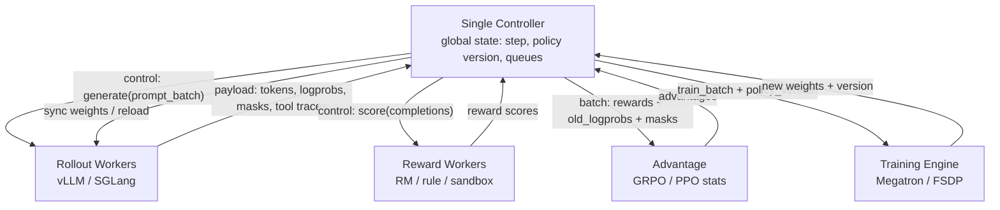
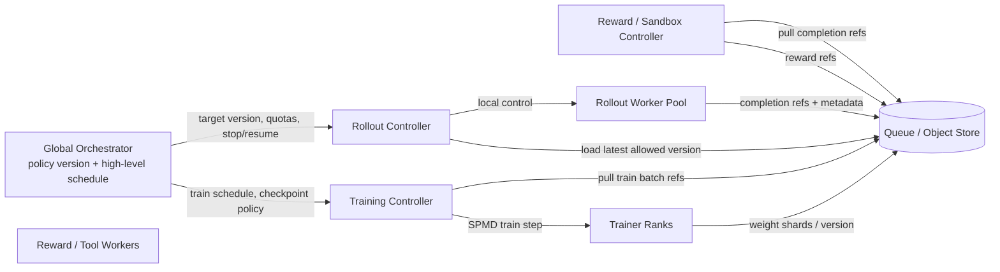
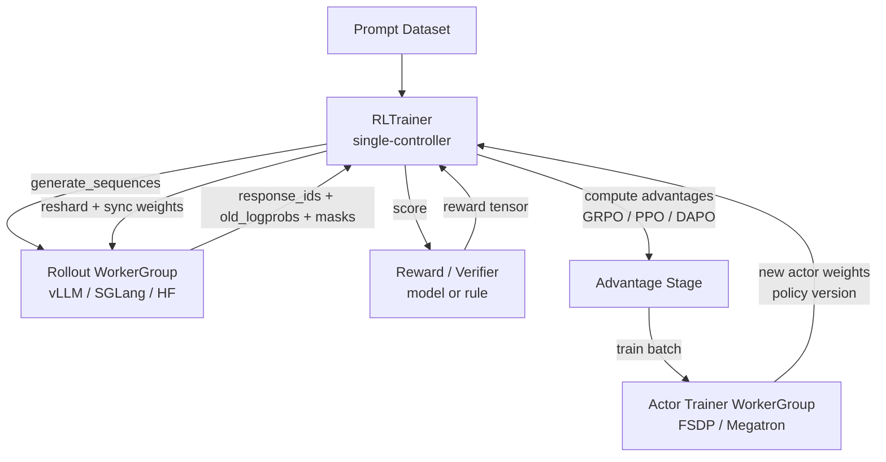
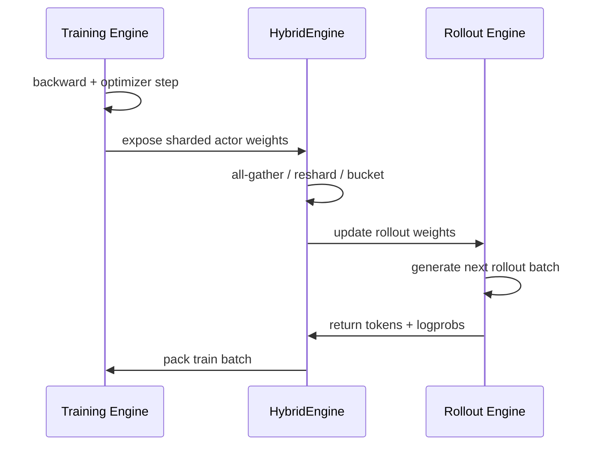
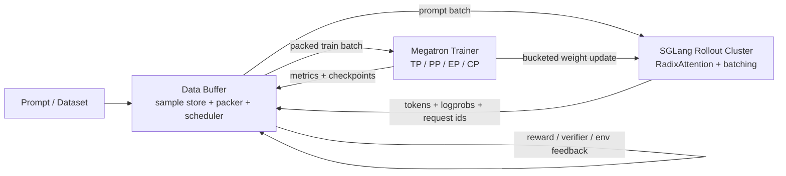
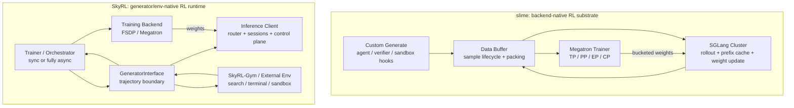
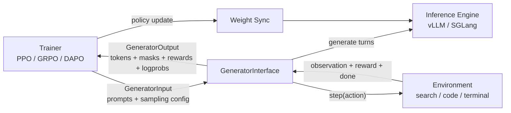
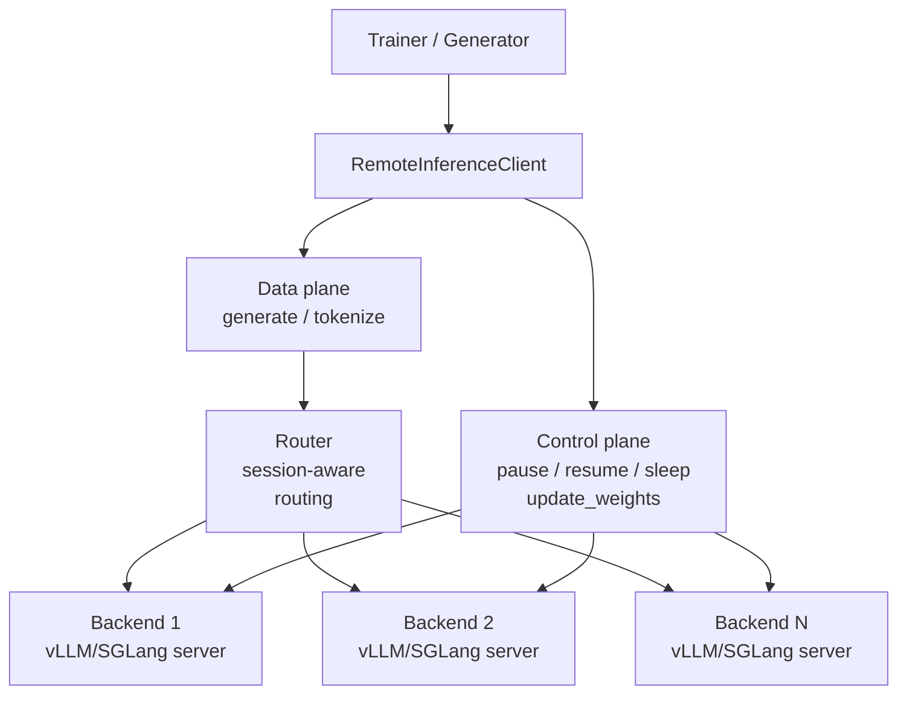
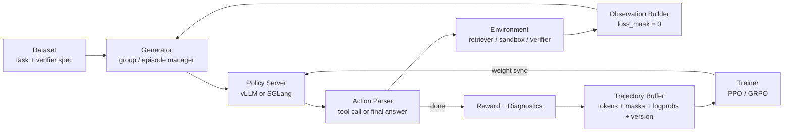

# MLSYS14 · Post-Training Infra: From TRL to Forge

> [!info] Overview
> This tutorial analyzes the reinforcement learning (RL) infrastructure for LLM post-training from a **systems engineering perspective**, covering mainstream frameworks such as TRL, veRL, slime, AReaL, ROLL, and Forge. The algorithmic section focuses solely on the key design decisions of PPO and GRPO, emphasizing "how they dictate system architecture." For accompanying exercises, see [[MLSYS15 RL Infra 自测 35 问]].

---

## Table of Contents

1. [[#I. Introduction: Why RL Infra is an Independent Systems Problem]]
2. [[#II. Panorama: Look at the Map Before Entering the Forest]]
3. [[#III. Minimal Algorithmic Background: PPO and GRPO]]
4. [[#IV. Dissecting RL Training Systems: Common Components and Design Axes]]
5. [[#V. Framework Tour: Two Paradigm Shifts]]
6. [[#VI. Deep Dives]]
7. [[#VII. System-Level Framework Deep Reading: slime, SkyRL, and Sandbox]]
8. [[#VIII. Exercises]]

---

## I. Introduction: Why RL Infra is an Independent Systems Problem

### 1.1 Post-training Panorama

An LLM typically undergoes the following stages from pre-training to deployment:

```
Pre-training → SFT → RM Training → RLHF/RLVR → (Agentic RL)
```

The **system load profile differs significantly** at each stage. Pre-training involves static data with large-batch forward/backward passes, where engineering efforts converge on "maximizing throughput." RL training, however, introduces a fundamental new constraint:

> **Training data is generated online by the current policy, rather than being pre-stored on disk.**

This means that for every training step, one must first perform a batch of inference (rollout) using the current model, treat the generated results as training samples, perform backpropagation to update model weights, synchronize the weights on the inference side, and then proceed to the next round of rollout. This "Generation → Training → Synchronization" loop is the root of all complexity in RL Infra.

### 1.2 The Unique Load Profile of RL Training

**Generation is the primary bottleneck.** Empirical data from 16 open-source frameworks shows that 80–90% of training wall-clock time is consumed by rollout generation, not backpropagation. An intuitive figure:

| Configuration | Generation Time (per batch of 512 rollouts) |
|---------------|--------------------------------------------|
| 7B Model @ 6300 tok/s, 2K token output | ~3 minutes |
| 32B Model @ 1200 tok/s, 8K token output | ~56 minutes |
| **32B Model @ 1200 tok/s, 32K token output (long inference)** | **~3.7 hours** |

This figure clearly demonstrates: for GRPO training of long-inference models like DeepSeek-R1, **synchronously waiting for generation to complete before training is unacceptable.** Asynchrony is not an optimization; it is a necessity.

**The computational characteristics of generation and training are diametrically opposed.** Inference engines (vLLM/SGLang) are optimized for decoding: paged KV cache, continuous batching, speculative decoding; training engines (Megatron/FSDP) are optimized for large-batch forward/backward passes: operator fusion, gradient checkpointing, ZeRO sharding. The two systems cannot share the same kernel and memory management strategies. This is the fundamental reason "why you cannot use a training engine directly for rollouts."

### 1.3 The Trilemma (The Main Thread Throughout)

The design of RL Infra is essentially a trade-off between three dimensions:

```
       Throughput
            ▲
           / \
          /   \
         /     \
On-policyness ─── Flexibility (Agentic/Env)
```

- **Throughput**: Keep GPUs as busy as possible; rollout and training should not wait for each other.
- **On-policyness**: Training samples come from the current policy; staleness is low, leading to better algorithmic convergence.
- **Flexibility**: Support complex agentic scenarios (tool calls, multi-turn dialogues, custom reward functions).

No framework can achieve all three. The trade-offs among these three dimensions dictate the fundamental architectural choices of each framework.

---

## II. Panorama: Look at the Map Before Entering the Forest

Before diving into details, let's establish a global coordinate system.

### 2.1 Framework Landscape (2025)

```
─────────────────────────────────────────────────────────
                    Synchronous
─────────────────────────────────────────────────────────
   TRL (HuggingFace)  ──  OpenRLHF  ──  veRL (sync mode)
─────────────────────────────────────────────────────────
                       ↓ Asynchronization
─────────────────────────────────────────────────────────
  veRL (async)  ──  slime (sync/async dual mode)  ──  ROLL
─────────────────────────────────────────────────────────
                       ↓ Fully Asynchronous
─────────────────────────────────────────────────────────
         AReaL (fully async)   ──   Forge (agent-native)
─────────────────────────────────────────────────────────
```

### 2.2 Six Design Axes (Coordinate System for Analyzing Any Framework)

These six axes are not just classification labels; they are the coordinate system for reading any RL infra framework. Why a framework is fast, why it is difficult to use, or why it is only suitable for certain model scales can usually be explained along these axes.

| Axis | One End | The Other End | Core Trade-off |
|------|---------|---------------|----------------|
| **Control Flow** | Single-controller: One central process orchestrates rollout, reward, advantage, and training | Multi-controller: Rollout/training/reward workers have their own local controllers | Single-controller is easier for complex algorithms and debugging data flow; Multi-controller scales better to large clusters but global state is harder to maintain |
| **Resource Placement** | Colocated: Rollout and training share the same GPUs, time-multiplexed by stage | Disaggregated: Rollout GPUs, training GPUs, and reward GPUs are deployed in separate pools | Colocated has compact memory usage and simple deployment but suffers from idle time during stage switching; Disaggregated has higher throughput but requires continuous weight/data transfer and cross-pool scheduling |
| **Weight Sync** | NCCL broadcast: Trainer broadcasts new weights directly to rollout workers | Filesystem / Object Store / RDMA: Write to disk/remote storage, then loaded by rollout side | NCCL is fast with short paths but requires stable GPU topology; Filesystem/RDMA is loosely coupled, suitable for heterogeneous pools, but has higher engineering complexity and tail latency |
| **Synchronicity** | Strictly on-policy: Weights used for rollout are strictly aligned with training updates | Fully async: Rollout can use stale policies; trainer continuously consumes data | On-policy algorithms are clean with simple convergence analysis but GPUs often wait for each other; Async has high throughput but must handle staleness, importance ratios, policy drift, and sample dropping |
| **Training Backend** | Megatron-Core: Comprehensive TP/PP/EP/CP support | FSDP2 / DeepSpeed ZeRO: Prioritizes parameter sharding and ease of use | Megatron is better for large MoE, pipeline, and expert parallel; FSDP2/ZeRO integrates more easily with the PyTorch ecosystem but has weaker control over massive MoE and PP |
| **Rollout Engine** | vLLM: PagedAttention, continuous batching, mature ecosystem | SGLang: RadixAttention, structured programs, more natural expression of agent/tool calls | vLLM is more like a high-throughput general-purpose serving engine; SGLang is better for massive shared prefixes, tree-based expansion, and complex agent programs |

**Control Flow** determines the framework's comprehensibility. The "controller" here is not an abstract concept like "context"; in engineering, it is usually a long-running Python process, Ray Actor, asyncio service, or driver object. It holds worker handles, queue references, policy versions, step counters, pending request tables, and failure retry states, deciding in a scheduling loop who should perform rollout, reward, training, or weight synchronization next. A typical single-controller implementation is a Python driver that sequentially calls `generate -> reward -> advantage -> update`, making it easy to plug in new algorithms, reward pipelines, or sandbox logic. The problem arises when the number of workers increases: the central driver, responsible for maintaining all states, sending/receiving large objects, and handling exceptions/retries, can become a bottleneck. Multi-controller delegates control to individual worker groups, allowing for more efficient local GPU scheduling, but debugging requires inspecting states across multiple processes, and errors are harder to reproduce.

**Resource Placement** determines whether GPUs are reused by stage or parallelized by pipeline. "Same batch of GPUs" here refers not to physical location, but to whether the rollout engine and trainer share the same GPU resource pool. Rollout is an inference workload: it needs KV cache, continuous batching, sampling, and potentially tool/sandbox waiting; training is a training workload: it needs to save activations, perform backpropagation, maintain optimizer states, and execute gradient all-reduce/reduce-scatter. Their memory layouts, parallelization methods, and scheduling rhythms differ.

Colocated systems let the same group of GPUs run rollouts first, then switch to training. The benefit is fewer machines, shorter network paths, and a simpler environment; the downside is that the trainer is idle during the rollout stage, the rollout engine is idle during the training stage, and weights must be converted between training and inference layouts. Disaggregated systems split rollout GPUs and training GPUs into two pools: the rollout pool generates continuously, and the training pool updates continuously, resulting in throughput more akin to a pipeline; the cost is that new weights must be pushed to the rollout pool after every policy update, and the trainer cannot consume data generated by old policies indefinitely, or the on-policy assumption will be violated.

**Weight Sync** is the most underestimated cost in RL Infra. On small models, a sync delay of tens of milliseconds is just an implementation detail; once models reach 200B or 1T parameters, synchronization itself becomes the primary bottleneck. The advantage of NCCL broadcast is its directness and high bandwidth, suitable for homogeneous GPU pools; the advantage of filesystem/object store/RDMA is the decoupling of the trainer and rollout engine, suitable for disaggregated architectures, though it requires extra handling of versioning, loading timing, failure retries, old weight cleanup, and multi-replica consistency.

**Synchronicity** determines whether algorithms and systems can be optimized separately. Strictly on-policy is the most worry-free: every batch of rollouts corresponds to the current policy, making PPO/GRPO ratios and clipping easier to interpret. Asynchronous systems allow rollout data to enter the trainer with the logprobs of old policies, necessitating the recording of policy versions, old logprobs, and token masks at generation time, and using importance ratios or staleness-aware clipping to control bias. Works like AReaL and CISPO are important because they design system asynchrony and algorithmic correction together.

**Training Backend** determines the model's upper limit. FSDP2/ZeRO is suitable for quickly building systems, especially for dense models, single-node, or small-to-medium multi-node setups; Megatron-Core is better for scenarios where models are already large enough to require TP, PP, EP, and CP. MoE RL is particularly dependent on the training backend because expert parallel is not just about saving memory; it also affects token dispatch, load balancing, optimizer state placement, and checkpoint layout.

**Rollout Engine** determines the shape of the generation stage. vLLM's strength lies in mature serving capabilities: paged KV, continuous batching, prefix cache, and OpenAI-compatible servers. SGLang's strength lies in expressing the generation process as a program: shared system prompts, branch sampling, tool calls, regex/JSON constraints, and tree expansion. GRPO-style training with multiple completions per prompt naturally benefits from prefix sharing; agent RL values program-level scheduling and tool boundaries more.

### 2.3 Key Magnitudes

- Weight broadcast latency: Qwen3-235B on 8xH800 is ~**6.75 seconds**; Kimi-K2 (~1T parameters) on 256xH20 is ~**21.5 seconds**.
- slime weight transfer for Qwen3-30B-A3B on 8xH100 is ~**7 seconds** (bucketed NCCL).
- veRL bucketed transfer (packed=True) can compress broadcast time from ~500ms to ~**20ms** (suitable for smaller models).
- AReaL achieves a **2.77× throughput increase** compared to synchronous systems with the same number of GPUs.

The value of these numbers lies not in their precision, but in establishing a sense of magnitude. RL post-training step time is often composed of three segments:

```text
rollout time + weight sync time + training update time
```

If weight sync is 20ms, it is a common overhead; if sync is 7 seconds, it is enough to swallow the gains of a short rollout; if sync reaches the 20-second level, the system must consider asynchrony, partial rollouts, weight version lag, and cross-pool scheduling. The larger the model, the more RL infra needs to incorporate weight movement into the algorithmic closed loop.

The broadcast latency of Qwen3-235B and Kimi-K2 illustrates the same problem: as parameter counts grow, policy updates are no longer internal trainer events, but state switches for the entire serving pool. Synchronous systems force rollout workers to wait for new weights during the switch; asynchronous systems allow rollout workers to continue generating with old weights, but the trainer must know which policy version these samples originated from.

The slime Qwen3-30B-A3B example shows that even for 30B-level MoE active-parameter models, weight transfer can reach the second level. Bucketed NCCL can split large weights into multiple buckets for transmission, reducing long blocking caused by monolithic synchronization, but it cannot eliminate the fact that "weights must travel from trainer to rollout."

The veRL packed=True figure shows that for small models or smaller weight slices, engineering implementation determines whether synchronization becomes a bottleneck. Merging small tensors into large buckets, reducing Python/RPC scheduling and NCCL small-packet overhead, can compress sub-second synchronization to tens of milliseconds. This optimization is highly effective for small models but cannot be directly extrapolated to 200B or 1T models.

The 2.77× throughput increase of AReaL represents the upper-bound gain of fully async by reducing waiting: rollouts don't have to wait for the trainer to finish, and the trainer doesn't have to wait for all rollouts to return. The cost is that training data is older, and the system must use staleness-aware clipping, interruptible rollouts, re-prefill, and other mechanisms to control bias and resource waste.

---

## III. Minimal Algorithmic Background: PPO and GRPO

> This chapter covers only the necessary algorithms, focusing on "how algorithmic choices dictate system architecture."

### 3.1 PPO in One Page

The PPO training loop involves four model roles:

| Role | Function | Memory Footprint |
|------|----------|------------------|
| **Actor** | Policy being trained | Parameters + Gradients + Optimizer States |
| **Reference** | Initial policy (frozen), used for KL penalty | Parameters (inference mode) |
| **Critic (Value Model)** | Estimates state value $V(s)$, used for advantage | Parameters + Gradients + Optimizer States |
| **Reward Model** | Scores generated results | Parameters (inference mode) |

PPO objective function (clipped version):

$$
\mathcal{L}_{\text{PPO}} = \mathbb{E}_t\left[\min\left(r_t(\theta)\hat{A}_t,\ \text{clip}(r_t(\theta), 1-\epsilon, 1+\epsilon)\hat{A}_t\right)\right] - \beta \cdot \text{KL}[\pi_\theta || \pi_{\text{ref}}]
$$

Where $r_t(\theta) = \frac{\pi_\theta(a_t|s_t)}{\pi_{\theta_{\text{old}}}(a_t|s_t)}$ is the importance sampling ratio, $\hat{A}_t$ is the advantage estimated by GAE, and $\epsilon$ is the clipping threshold (usually 0.2).

**Advantage Calculation (GAE):** $\hat{A}_t = \sum_{l=0}^{\infty}(\gamma\lambda)^l \delta_{t+l}$, where $\delta_t = r_t + \gamma V(s_{t+1}) - V(s_t)$. This requires the critic model to perform inference for every state, which is one of the sources of PPO system complexity.

### 3.2 GRPO in One Page

The core innovation of GRPO (Group Relative Policy Optimization) is **removing the critic model** and using relative comparisons within a group instead of absolute value estimation.

For the same prompt $q$, sample $G$ completions $\{o_1, o_2, ..., o_G\}$; the advantage calculation becomes:

$$
\hat{A}_i = \frac{r_i - \text{mean}(\mathbf{r})}{\text{std}(\mathbf{r})}
$$

Where $\mathbf{r} = [r_1, ..., r_G]$ are the rewards of the same group. This is simple z-score normalization and **requires no neural network** to estimate values.

> [!important] Key Impact of GRPO on System Architecture
> 1. **Cut the critic**: Reduces from 4 models to 3 (actor + ref + reward), saving ~25% memory, but loses fine-grained step-level advantage estimation.
> 2. **Group sampling**: Generates G outputs for the same prompt (usually G=4~32), naturally creating prefix sharing opportunities—G sequences share the same prefill, and KV cache can be reused.
> 3. **KL location**: GRPO's KL can be placed inside the reward ($r' = r - \beta \text{KL}$) or outside the loss (explicit regularization term); the two positions have different numerical properties.

### 3.3 How Algorithmic Choices Dictate System Architecture

| Algorithmic Feature | System Impact |
|---------------------|---------------|
| PPO requires 4 models | High memory pressure, favors colocation + ZeRO / more complex placement strategies |
| GRPO cuts the critic | Excess memory can be used for larger batch sizes or longer contexts |
| GRPO's group sampling | Prefix-sharing → SGLang's RadixAttention benefits directly |
| Existence of clip + IS ratio | **This is the algorithmic foundation for asynchrony**: $r_t(\theta) = \pi_\theta / \pi_{\text{old}}$ can correct off-policy errors, allowing for moderate staleness |
| GRPO large group size | Faster policy drift → more frequent weight synchronization required |

**System Implications of GRPO Variants**:

| Method | Change from GRPO | System-side Impact |
|--------|------------------|--------------------|
| DAPO | Removes KL constraint, changes clip lower bound | Potential for more aggressive drift |
| GSPO | KL based on sequence-level rather than token-level | Reward calculation changes |
| Dr.GRPO | Special handling for degenerate groups | Additional filter logic |
| CISPO | IS correction to tolerate larger staleness | **Directly serves asynchronous architectures** |

These variants can be understood as either "changing the algorithmic objective" or "changing system tolerance." DAPO, GSPO, and Dr.GRPO lean more towards training objectives and reward shaping: they change the way tokens/sequences are constrained or handle degradation when rewards within a group lack discrimination. The system side usually needs to add masks, filters, statistics, and reward post-processing, but does not necessarily require rewriting the scheduler.

CISPO is more system-friendly. The core problem of asynchronous rollout is sample staleness: the policy used when generating samples and the policy used during training updates are no longer the same. Methods like CISPO design importance sampling and clipping to be more tolerant of stale samples, directly affecting the extent to which asynchronous frameworks like AReaL can decouple rollout workers from the trainer.

---

## IV. Dissecting RL Training Systems: Common Components and Design Axes

### 4.1 Three Major Components

Any RL training system consists of three core components:

```
┌─────────────────────────────────────────────────────┐
│                    Orchestrator                     │
│      (Ray / asyncio / Single-controller / HTTP gateway)       │
└──────┬─────────────────────────────────────┬────────┘
       │ rollout data                         │ weight update
       ▼                                     ▼
┌─────────────┐                    ┌──────────────────┐
│   Rollout   │◄── weight sync ────│   Training       │
│   Engine    │                    │   Engine         │
│ vLLM/SGLang │                    │ Megatron / FSDP  │
└─────────────┘                    └──────────────────┘
```

The most misunderstood part of this diagram is the Orchestrator. It is neither the model training backend nor the serving engine; it is responsible for stringing together the long RL training chain: sending prompts, starting rollouts, receiving completions, running rewards, calculating advantages, triggering training steps, synchronizing new weights, and handling failure retries and state recording.

**The role of Ray** is primarily to provide a distributed control plane. Objects in RL Infra are diverse: GPU workers, CPU reward workers, sandbox workers, vLLM/SGLang servers, trainer actors, data queues, and checkpoint managers. Ray actors/tasks provide a unified lifecycle management and RPC abstraction for these components:

| What Ray is responsible for | Meaning in an RL system |
|-----------------------------|--------------------------|
| Actor placement | Placing rollout workers, trainers, and reward workers on specified GPU/CPU nodes |
| Remote call | Orchestrator uses RPC to call `generate()`, `compute_reward()`, `train_step()` |
| Object store | Temporarily storing prompts, completions, logprobs, rewards, advantages, and other intermediate data |
| Fault handling | Restarting workers after crashes, retrying failed tasks, preventing the entire training round from collapsing |
| Resource label | Distinguishing H100/H800/H20, CPU sandbox, reward model GPU, rollout GPU |

Ray solves "how to get a distributed Python system running," but it does not automatically solve model parallelism, memory sharding, KV cache, weight synchronization, or staleness. True performance still depends on the rollout engine and training engine.

The Orchestrator does not necessarily have to use Ray. Small systems can use a single-process asyncio to manage multiple HTTP servers; agent-native systems might expose rollouts as OpenAI-compatible endpoints, with an HTTP gateway handling admission control and traffic management. Ray's advantage is putting complex worker topologies into a single Python orchestration model; its disadvantage is that object copying, serialization, scheduling latency, and debugging complexity increase with scale.

**Core capabilities of the Rollout Engine**:
- **Paged KV Cache**: Manages KV cache in pages to avoid memory fragmentation and support variable-length sequences.
- **Continuous Batching**: Does not wait for the entire batch to complete; new requests are inserted at any time, improving GPU utilization.
- **Prefix Sharing** (SGLang RadixAttention): Requests with the same prefix share KV cache, directly benefiting GRPO's group sampling.

**Core capabilities of the Training Engine**:
- Megatron-Core: Full suite of TP × PP × EP × CP parallelism; pipeline bubble optimization; correct MoE EP implementation.
- FSDP2 (PyTorch native): ZeRO-3 style parameter sharding, easy to use but lacks PP and EP support.
- DeepSpeed ZeRO-3: ZeRO offload, suitable for resource-constrained scenarios, weak MoE EP support.

The core design of a Training Engine is not as simple as "calling backward once"; it determines how the training-state model is partitioned, how it communicates, how it saves optimizer states, and how it exports to the rollout engine. For RL, it must additionally handle rollout logprobs, old logprobs, masks, advantages, and policy versions.

| Design Point | What the Training Engine must solve |
|--------------|--------------------------------------|
| Parameter sharding | Which GPUs hold weights, gradients, and optimizer states |
| Parallel dimensions | How TP, PP, DP, EP, and CP are combined; which communication goes intra-node vs inter-node |
| Microbatch schedule | How to lower pipeline bubbles; how to align gradient accumulation with rollout batches |
| MoE dispatch | Token-to-expert routing, load balancing, expert parallel communication |
| Checkpoint / export | How to convert training layout to rollout layout; whether resharding is needed |
| Logprob recompute | Whether to re-forward during PPO/GRPO updates; how to align with old logprobs from rollout |

The difference between Megatron-Core and FSDP2 can be simply understood as: Megatron prioritizes model parallelism, while FSDP prioritizes parameter sharding.

| Backend | Core Philosophy | Better Suited For | Main Shortcomings |
|---------|-----------------|-------------------|-------------------|
| Megatron-Core | Explicitly partitions transformer layers, inter-layer, experts, and sequences | 100B+ dense, MoE, large-scale multi-node, training requiring TP/PP/EP/CP | Complex configuration; model code is more deeply bound to parallel strategies |
| FSDP2 | Each rank holds only one slice of parameters, all-gathers when needed, releases after use | Small-to-medium dense models, PyTorch native training, quick integration of new models | Weak PP/EP capabilities; communication and scheduling control are less fine-grained than Megatron for massive MoE |
| DeepSpeed ZeRO-3 | ZeRO sharding of parameters, gradients, and optimizer states; supports offload | Memory-constrained scenarios, training requiring CPU/NVMe offload | Offload sacrifices throughput; complex MoE/PP combinations |

Large-scale Megatron is usually faster, not just because the "code is lower-level," but because it designs communication patterns into the model structure. TP partitions large matrix multiplications across multiple GPUs, PP partitions layers into different stages, EP distributes MoE experts across different GPUs, and CP partitions the context dimension of long-sequence attention. Each dimension has fixed communication patterns, allowing Megatron to arrange overlaps, microbatch pipelines, and fused kernels for them.

FSDP's abstraction is more general: all-gather parameters before each layer's forward pass, reduce-scatter gradients after backward. This pattern is great for reducing memory and easy to integrate with PyTorch models; but when a model already requires TP + PP + EP, FSDP's parameter sharding faces three problems:

1. The single-layer matrix itself is too large and must be tensor-parallelized, otherwise single-card matmul won't fit or will be inefficient.
2. There are too many layers; doing only data parallel forces every rank to pass through the entire network, increasing activation and communication pressure.
3. MoE experts require token dispatch and expert parallel; standard FSDP is unaware of the expert routing system structure.

Therefore, when choosing a training backend, you can use this rule of thumb: if the goal is to quickly get a 7B/14B/32B dense model running, FSDP2 often has lower engineering costs; if the goal is 100B+, MoE, long context, or large-scale multi-node throughput, Megatron-Core's parallel control is usually more important.

### 4.2 Design Axis 1: Control Flow (Single vs Multi-controller)

Let's concretize the controller. It is usually not the GPU worker itself, nor the model forward code, but the "managing process":

```python
class Controller:
    def __init__(self, rollout_workers, reward_workers, trainer):
        self.rollout_workers = rollout_workers
        self.reward_workers = reward_workers
        self.trainer = trainer
        self.policy_version = 0
        self.pending = {}
        self.replay_or_rollout_queue = Queue()

    def step(self):
        prompts = self.sample_prompts()
        refs = self.dispatch_rollout(prompts, version=self.policy_version)
        scored = self.dispatch_reward(refs)
        batch = self.build_train_batch(scored)
        metrics = self.trainer.update(batch)
        self.policy_version += 1
        self.sync_weights(self.policy_version)
        return metrics
```

If using Ray, it might be a `@ray.remote` actor; if using pure Python, it might be a driver class in the main process; if using a service-oriented architecture, it might be a resident HTTP/gRPC/asyncio scheduler. Its essence is: holding state, sending RPCs/tasks, receiving results, and maintaining versions and queues.

**Single-controller**: A central controller orchestrates all data flows, dispatching tasks to workers.
- Pros: Data flow logic is centralized, easy to understand and debug.
- Cons: The controller itself becomes a bottleneck; RPC overhead from controller to workers.

**Multi-controller**: Each worker group (rollout workers / training workers / reward workers) has its own local controller, collaborating via message queues, object stores, or RPCs.
- Pros: Better scalability, controller does not become a bottleneck.
- Cons: Data flow logic is dispersed, making global optimization difficult.

Single-controller keeps global state naturally in one process; multi-controller scatters global state across multiple local schedulers. The latter scales better but requires explicit design of versions, queues, leases, acks, timeouts, and retries; otherwise, it becomes unclear whether a rollout has been rewarded, whether a batch is still valid for the current policy, or whether a task should be replayed after a worker failure.

| Controller Form | What it looks like in code | State saved | Common bottleneck |
|-----------------|----------------------------|--------------|-------------------|
| Python driver | Training loop in a main process | Current step, policy version, worker refs, metrics | Main process serialization, object movement |
| Ray Actor | `@ray.remote class Controller` | Ray object refs, placement groups, task states | Actor mailbox, object store pressure |
| asyncio service | Resident event loop + RPC client | Queues, in-flight requests, version watermarks | Backpressure, timeout, exception recovery |
| local worker-group controller | One scheduler per rollout/training/reward group | Local GPU batch, local queue, cache state | Cross-group consistency and global debugging |

What flows in the control flow is not just "task commands." An RL step has at least four types of things moving through the system:

| Flowing Object | Typical Content | Producer | Consumer |
|----------------|-----------------|----------|----------|
| Control message | start rollout, stop, resume, train step, sync weights, checkpoint | Orchestrator / local controller | rollout worker, trainer, reward worker |
| Rollout payload | prompt ids, response ids, attention mask, logprob, finish reason, tool trace | rollout engine | reward worker, advantage calculator, trainer |
| Training metadata | reward, advantage, old logprob, token mask, policy version, sample weight | reward / advantage stage | trainer |
| Weight update | actor weights, optimizer step id, weight version, reshard metadata | trainer | rollout engine |

Single-controller aggregates these objects into a central driver:



The benefit of this mode is that global state is very clear: which policy version a sample came from, whether the reward is finished, and whether it has entered the training batch can all be checked in the central driver. The downside is that when rollout payloads are large, all tokens/logprobs/masks must pass through the controller or object store, slowing down the central node due to serialization, networking, and object reference management.

Multi-controller keeps large objects local as much as possible, exchanging only states and references between components:



The key change here is: the global Orchestrator no longer personally moves all token tensors, but maintains policy versions, quotas, queue watermarks, failure retries, and high-level schedules. The Rollout Controller decides locally how to batch, abort, and resume; the Training Controller decides locally on microbatches, pipeline schedules, and gradient accumulation; the Reward/Sandbox Controller handles tool calls and rule scoring locally. System throughput is better, but consistency is harder: if a sample's reward is finished but its policy version has been deprecated, the trainer must decide whether to discard it, down-weight it, or use staleness correction.

veRL's **HybridFlow** is a hybrid of these two modes: it uses a single-controller to express high-level data flow ("first rollout, then compute advantages, then train"), and multi-controller (SPMD processes for each worker group) to execute actual operator calculations.

### 4.3 Design Axis 2: Resource Placement (Colocated vs Disaggregated)

This design axis asks: does the same GPU play one role in an RL step, or does it switch back and forth between an "inference server" and a "training worker"?

**Colocated**: Rollout and training share the same GPU pool, usually time-multiplexed by stage.

```
time ─────────────────────────────────────────────────────────>
GPU 0-7:  rollout / sampling / KV cache
          ──────────────────────────┐
                                    ├─ reshape / reload / reshard
GPU 0-7:                            training / backward / optimizer
                                    ───────────────────────────┐
                                                               ├─ sync back to inference layout
GPU 0-7:                                                       rollout ...
```

It's not that the same batch of GPUs cannot open two processes simultaneously, but it's usually not cost-effective: the inference side wants to reserve memory for KV cache and large batch decoding, while the training side wants to reserve memory for activations, gradients, and optimizer states; the inference side uses serving-friendly layouts, while the training side uses TP/PP/FSDP/ZeRO layouts. Forcing them to coexist often leads to memory contention, compute stream contention, and NCCL communication contention, which is often less stable than running in stages.

Pros of Colocated:

- Smaller hardware pool, suitable for teams without many GPUs.
- Shorter weight sync paths, can be completed within the same Ray placement group / node group.
- Simpler permissions, images, filesystems, and checkpoint paths.

Cons of Colocated:

- Trainer GPUs are logically idle during the rollout stage; rollout engines are logically idle during the training stage.
- Inference and training layouts differ, requiring reload/reshard/rebuild of the inference engine during stage switching.
- If agent rollouts are slow, training waits for generation; if training steps are slow, rollouts wait for new policies.

**Disaggregated**: Rollout and training run simultaneously on different GPUs.

```
time ─────────────────────────────────────────────────────────>
Rollout GPUs:   generate v10 ── generate v10/v11 ── generate v11 ...
                         │              ▲                  ▲
                         │ rollout data │ weight update    │
                         ▼              │                  │
Training GPUs:  train on v10 data ── update to v11 ── train on v11 data ...
```

The advantage of Disaggregated is pipelining: the rollout pool doesn't have to wait for the trainer to release GPUs, and the trainer doesn't have to wait for the rollout engine to unload memory. It is particularly suitable for slow rollouts, such as long chains-of-thought, multiple completions, agent tool calls, sandbox execution, and heavy reward models.

The cost of Disaggregated comes from the cross-pool boundary:

- New weights updated by the trainer must be transmitted to the rollout pool; the larger the model and the more frequent the updates, the more expensive the sync.
- Rollout data must carry policy versions, old logprobs, token masks, and reward metadata; otherwise, the trainer won't know which policy version these samples came from.
- Rollouts may continue to use old weights. Too much staleness increases throughput but harms on-policy algorithms, requiring staleness limits, sample dropping, importance ratios, or asynchronous algorithmic corrections.

Rule of thumb: If you have few GPUs, small models, and want to get running quickly, Colocated is easier; if you have many GPUs, slow rollouts, heavy agent/reward pipelines, and want continuous parallelism between training and generation, Disaggregated is more valuable.

### 4.4 Design Axis 3: Weight Synchronization

After the training update completes, actor weights must be synchronized to the rollout engine; otherwise, rollouts will use old weights.

**Challenge**: The parallel layouts of training and inference often differ. Training might use TP=8, PP=4, while inference might use TP=8, PP=1. Resharding weights from training layout to inference layout requires AllGather + partitioning.

**Mainstream Synchronization Schemes**:

| Scheme | Latency | Representative Framework | Note |
|--------|---------|--------------------------|------|
| NCCL Broadcast (Naive) | 100–500ms | OpenRLHF | Broadcasts layer by layer |
| NCCL + Bucketing | ~20ms | veRL | Packs multi-layer parameters into 1GB chunks for broadcast |
| CUDA IPC | <1ms | NeMo-RL, MILES | Shared memory between GPUs on the same node, no network needed |
| Filesystem + reload | Seconds | PRIME-RL, AReaL | Write to disk, inference side reloads; suitable for cross-node async |
| RDMA P2P (Mooncake) | Better than NCCL for massive models | Some frameworks | ~16-17s for 1T parameters |

**Additional MoE Challenge**: Under Expert Parallelism, each GPU holds only a subset of experts. Before broadcasting, all expert parameters must be AllGathered to one location and then broadcast to the inference side. This $O(N_{\text{experts}} \times E_{\text{size}})$ overhead does not exist in dense models.

### 4.5 Design Axis 4: Synchronicity Spectrum

```
Strictly On-policy                                   Fully Async
     │                                               │
 Batch 0 generation          Buffer queue            Never-stopping
 → Wait for completion       Stores 1-K steps        rollout workers
 → Training                  of old data             → Training (anytime)
 → Sync weights              → Training              → Weight async push
     │                       → Sync weights          │
  TRL/Basic veRL           veRL async/ROLL/slime      AReaL/Forge
```

**Staleness** definition: The number of steps between the policy version used to generate samples and the policy version used for training updates.

- Purely synchronous: staleness = 0 (strictly on-policy)
- Buffer depth = K: staleness ∈ [0, K]
- Fully asynchronous (AReaL): staleness is usually controlled within 8 steps (experiments show ≤8 steps does not affect final performance).

**CISPO / IS Correction**: $r_t(\theta) = \pi_{\theta}(a_t|s_t) / \pi_{\text{old}}(a_t|s_t)$ is essentially an importance sampling ratio, which can correct off-policy errors. This is the algorithmic guarantee that allows for moderate staleness.

---

## V. Framework Tour: Two Paradigm Shifts

> **First Shift**: "Training Script" → "Hybrid Inference + Training Engine" (TRL → veRL)
> **Second Shift**: "Synchronous Batch" → "Continuous Asynchronous Stream" (veRL → AReaL/Forge)

### 5.1 TRL (HuggingFace) — The Hello World of RLHF

**Positioning**: The easiest RLHF framework to get started with, the first choice for research prototypes.

**Architecture**: `accelerate` + single-controller; `PPOTrainer` / `GRPOTrainer` called directly. Supports vLLM as a colocated engine (same process) or an independent server.

**Pros**: Integrated with the HuggingFace ecosystem, GRPO running in 10 lines of code; suitable for single-node experiments; mature LoRA support.

**Ceiling**:
- Single-node mindset: Difficult to scale to multiple nodes.
- Rollout and Training are serial: 80-90% of time wasted waiting for generation.
- Lacks Megatron backend: No PP/EP, difficult to support ultra-large models.

**Suitable Scenarios**: ≤70B models, single node, quick idea validation.

### 5.2 OpenRLHF — Pioneer of Ray Disaggregated Architecture

**Positioning**: The first framework to systematically decouple rollout and training using Ray.

**Architecture**: vLLM as an independent rollout service, training uses DeepSpeed ZeRO. Coordinates roles (actor/critic/ref/reward) via Ray Actors.

**Historical Significance**: Proved the feasibility of rollout service-ization; inspired the disaggregated designs of all subsequent frameworks.

**Limitations**: Lacks Megatron backend (no TP/PP), insufficient support for large models; ecosystem is relatively smaller than veRL's.

### 5.3 veRL (ByteDance) — Flagship of the Hybrid Engine Era

**Positioning**: A strong foundation for general LLM post-training / RLHF. It is suitable for writing RL training flows (PPO/GRPO/DAPO) as programmable data flows and combining training backends, rollout backends, and reward/verifiers. A safer assessment: veRL is common in open-source research and platform teams, with an active ecosystem; large-scale production systems usually undergo massive modifications on top of veRL, OpenRLHF, slime, NeMo RL, or self-developed frameworks, rarely remaining identical to the original open-source version.

**Core Innovation: HybridFlow**

The key to veRL is not "adding another vLLM," but expressing RL post-training as a programmable data flow graph. The high level is written by a single Python controller for algorithmic logic, while the low level is executed by distributed worker groups (FSDP/Megatron/vLLM/SGLang).



In this diagram, `RLTrainer` cares about algorithmic semantics: which prompts enter rollout, how rewards are calculated, how advantages are normalized, when to train, and when to sync weights. `WorkerGroup` cares about distributed execution: how FSDP ranks all-gather, how Megatron TP/PP ranks communicate, and how vLLM/SGLang servers batch decode.

veRL's abstraction can be split into three layers:

| Layer | Responsibility | Typical Objects |
|-------|----------------|-----------------|
| Algorithm layer | Data flow for PPO/GRPO/DAPO, rewards, advantages, KL, clip | `RayPPOTrainer` / `RLTrainer` |
| Role layer | What each worker group is (actor, critic, ref, reward, rollout) | actor rollout, actor train, critic, ref policy |
| Engine layer | The backend that actually runs the models | FSDP, Megatron, vLLM, SGLang, HF rollout |

veRL-style GRPO loop:

```python
def verl_grpo_step(batch_prompts):
    # 1. Rollout worker group generates G completions
    rollout_batch = actor_rollout.generate_sequences(
        prompts=batch_prompts,
        n_samples_per_prompt=G,
        policy_version=current_version,
    )

    # rollout_batch must retain token-level info needed for training
    # response_ids, attention_mask, position_ids, old_logprobs, eos_mask

    # 2. Reward can be a model, rule, sandbox, or verifier
    rewards = reward_fn(rollout_batch)

    # 3. GRPO performs relative advantage per prompt group
    advantages = group_normalize(
        rewards=rewards,
        group_ids=rollout_batch.prompt_ids,
    )

    train_batch = {
        "input_ids": rollout_batch.full_token_ids,
        "loss_mask": rollout_batch.response_mask,
        "old_logprobs": rollout_batch.old_logprobs,
        "advantages": advantages,
        "policy_version": rollout_batch.policy_version,
    }

    # 4. Trainer worker group executes SPMD training
    metrics = actor_trainer.update_actor(train_batch)

    # 5. Sync training-state weights back to rollout engine
    new_version = metrics["policy_version"]
    sync_actor_weights(actor_trainer, actor_rollout, version=new_version)
```

The point of this pseudocode is: the controller looks like ordinary Python, but every line represents a distributed worker group. `generate_sequences` might be multiple vLLM/SGLang servers; `update_actor` might be Megatron TP/PP/DP ranks; `sync_actor_weights` might require converting from ZeRO/FSDP/Megatron sharded layouts to inference layouts.

**3D-HybridEngine** solves the layout switching problem in colocated scenarios where "the same batch of GPUs trains for a while, then infers for a while." Training states and inference states are usually not the same parallelization method:

```text
training layout:
  FSDP / ZeRO shards, or Megatron TP x PP x DP

rollout layout:
  inference TP, paged KV cache, continuous batching
```

In colocated mode, the following happens repeatedly in one step:



Weight resharding process:

1. Training ends → AllGather parameters (restore from ZeRO/TP shards)
2. Partition according to inference TP → Broadcast to inference-side processes
3. Inference engine loads new weights (reload or in-place update)

**Dual Training Backends and Multiple Rollout Backends**: veRL supports FSDP/Megatron training backends simultaneously and can connect to vLLM/SGLang/HF rollouts. This design is suitable for research and platform teams: the same PPO/GRPO data flow can swap training and rollout backends.

| Combination | Suitable Scenarios |
|-------------|--------------------|
| FSDP + vLLM | Small-to-medium dense models, quick to run, mature ecosystem |
| FSDP + SGLang | Needs prefix sharing / structured generation, but model isn't large enough to require Megatron |
| Megatron + vLLM | Large model training requiring TP/PP, rollout side uses mature vLLM |
| Megatron + SGLang | Large model training + complex prefix sharing or agent-style rollout |

**Asynchronous Mode**: veRL also supports disaggregated + buffer asynchrony. In async mode, the controller no longer waits for the current rollout to finish before training, but takes samples from a buffer; each sample records the policy version and old logprob, and the trainer corrects staleness using PPO/GRPO ratios.

**Ecosystem**: Numerous works like DAPO, PRIME, SkyRL, and AceMath are implemented based on veRL forks.

veRL's strength is generality and composability: the algorithm layer is easy to modify, and backends can be swapped. The cost is more abstraction layers, requiring simultaneous monitoring of the controller, Ray workers, training backend, rollout server, and weight sync during debugging.

**Shortcomings in Agentic RL**: veRL provides an Agent Loop interface, but it's more like a "general entry point for users to customize multi-turn rollout loops" rather than a complete agent runtime. The official documentation marks the Agent Loop as alpha and explicitly states that defining tools and how they are called is not its goal. Therefore, in complex agent training, engineering teams often have to fill in many gaps:

| Gap | Specific Manifestation |
|-----|------------------------|
| Tool/runtime management | Lifecycle and permissions for web search, code sandbox, database, browser, terminal are not automatically solved |
| Heterogeneous scheduling | LLM generation on GPU, tools/sandbox on CPU or remote services; long-tail latency and resource isolation require extra scheduling |
| Agent state | Multi-turn memory, context compaction, tool traces, environment states need to be defined by the task side |
| Trajectory provenance | Every step's action/observation/logprob/mask/reward/policy version must be traceable, otherwise training samples are hard to reproduce |
| Failure recovery | Tool timeouts, sandbox crashes, partial trajectories, worker retries require explicit protocols |

These are the motivations for works like SkyRL-Agent, VerlTool, AgentRL, and Rollout-as-a-Service: they don't simply replace veRL, but add a layer for agent loops, tool abstraction, asynchronous rollout dispatch, sandbox/runtime management, and training backend interoperability. The public design of SkyRL-Agent lists tool-centric agent loops, fine-grained heterogeneous scheduling, and backend bridges as core components, and explains how they can connect to training systems like veRL.

For MoE training, veRL's advantage is separating the algorithmic data flow from the training backend: small-to-medium models can use FSDP for rapid iteration, while ultra-large MoEs can switch to the Megatron backend, letting TP/PP/EP/CP take over parallel strategies. It doesn't automatically simplify MoE router correctness; the system must still save enough metadata in the rollout batch, such as policy versions, old logprobs, loss masks, and expert routing information when needed.

### 5.4 slime (THUDM) — The Philosophy of Subtraction

**Positioning**: "We only act as the data flow glue between SGLang and Megatron." The actual training backend used for GLM-4.5/4.6/4.7/GLM-5/GLM-5.1.

**Architecture: Megatron + SGLang + Data Buffer**

slime's choice is narrower: training side defaults to Megatron, rollout side defaults to SGLang, connected by a Data Buffer. It doesn't attempt to abstract all training and inference backends, but compresses complexity into two mature systems: Megatron handles large-scale training parallelism, while SGLang handles high-throughput rollout, prefix cache, aborts, and weight updates.



The Data Buffer is the core of slime. It is not a simple queue, but the boundary layer for RL data: it knows which requests are still in flight before rollout completes; it knows which samples are trainable after rewards complete; it packs variable-length samples into batches Megatron can consume before training; in async mode, it also controls policy versions and staleness.

slime is more MoE-friendly because the boundaries are narrower: the training side is fixed around Megatron, and the rollout side is fixed around SGLang. Megatron handles TP/PP/EP/CP and optimizer states, while SGLang handles prefix sharing, continuous batching, and weight updates. This combination reduces the complexity of "adapting any backend to any other," but also requires the Data Buffer to explicitly maintain tokens, logprobs, rewards, policy versions, request IDs, and necessary routing metadata generated by rollouts.

**Data Flow Details**:

1. Rollout Engine (SGLang) generates completions, attached with logprobs.
2. Data Buffer collects rollout data and performs reward calculation (can call reward servers in parallel).
3. Data Buffer packs data into a format Megatron accepts and dispatches to training workers.
4. Megatron performs forward/backward, loss = PPO/GRPO clip loss, including IS-corrected weights.
5. After Megatron updates weights, it broadcasts to the SGLang cluster via bucketed NCCL.
6. SGLang cluster updates weights (`update_weights` API) and continues to the next batch of rollouts.

slime's synchronous mode can be written as:

```python
def slime_sync_loop(prompts):
    batch = data_buffer.sample_prompts(prompts)

    rollout = sglang.generate(
        batch,
        return_logprobs=True,
        policy_version=current_version,
    )

    scored = data_buffer.attach_rewards(rollout)
    train_batch = data_buffer.pack_for_megatron(scored)

    metrics = megatron.train_step(train_batch)

    # Training-state weights -> Inference-state weights, pushed to SGLang after bucketing
    buckets = megatron.export_weight_buckets()
    sglang.update_weights(buckets, version=metrics["policy_version"])
```

In asynchronous mode, the Data Buffer becomes a queue that continuously produces/consumes:

```python
async def slime_async_loop():
    while True:
        # rollout side: SGLang generates continuously
        if data_buffer.need_more_samples():
            launch_rollout_task(
                prompts=data_buffer.next_prompts(),
                policy_version=rollout_policy_version,
            )

        # reward side: verifier / sandbox / reward model backfills continuously
        for sample in finished_rollouts():
            data_buffer.add(sample)

        # training side: Megatron consumes ready samples continuously
        if data_buffer.ready_tokens() >= train_token_budget:
            train_batch = data_buffer.pack_for_megatron(
                max_staleness=allowed_staleness,
            )
            metrics = megatron.train_step(train_batch)
            maybe_sync_weights(metrics["policy_version"])
```

The difference between synchronous and asynchronous is not the API name, but the semantics of the Data Buffer:

| Mode | Data Buffer Behavior | Algorithmic Risk | System Gain |
|------|----------------------|--------------------|-------------|
| Sync | Trains as a whole after a batch completes, staleness ≈ 0 | Closest to on-policy | Simple and stable, but rollout/training often wait for each other |
| Async | Rollout, reward, and train advance in parallel; trainer takes samples from ready queue | Samples may come from old policies, requires IS / clip / staleness bound | Reduces idle time, hides weight sync and long-tail rollouts |

**Key Design Choices**:
- Does not implement parallel strategies itself, fully utilizes Megatron's TP/PP/EP/CP.
- Does not wrap SGLang, directly exposes all SGLang parameters (`--sglang-xxx` prefix).
- `OPSM masking` (Optimal Policy Sampling Mask): Calculates gradients only for tokens of optimal behavior, corresponding to the sequence with the highest reward within a group in GRPO.

slime's parameter design also reflects this: resource allocation first determines training GPUs and rollout GPUs, then loads Megatron and SGLang respectively, and finally configures RL hyperparameters. Typical parameters include:

```bash
--actor-num-nodes ...
--actor-num-gpus-per-node ...
--rollout-num-gpus ...
--rollout-num-gpus-per-engine ...
--train-backend megatron
--colocate                 # Optional: training and rollout colocated
--sglang-...               # Directly passed to SGLang
```

**Weight update path** is one of slime's core performance points. RL differs from ordinary serving in that policies update frequently; if every update requires a full checkpoint reload, the rollout cluster will experience long-term stalls. The slime/SGLang route makes parameter updates online:

```text
Megatron shards
  -> gather / reorder by inference layout
  -> bucket parameters
  -> NCCL / in-place update to SGLang workers
  -> mark rollout policy_version = k + 1
```

MoE also requires handling expert parallelism: during training, each rank holds only a subset of experts, while during inference, SGLang's expert layout might differ. One cannot just sync dense layers; routers, shared experts, routed experts, and scale/quant metadata must all be aligned with the inference-side layout.

**Differences between slime and veRL**

| Dimension | veRL | slime |
|-----------|------|-------|
| Framework Goal | General RL dataflow, swappable backends | Megatron + SGLang native, fewer abstraction layers |
| Control Method | Hybrid-controller, controller responsible for algorithmic graph | Ray manages resources and async execution, Data Buffer manages sample lifecycle |
| Training Backend | FSDP / Megatron / other ecosystem backends | Megatron prioritized |
| Rollout Backend | vLLM / SGLang / HF, etc. | SGLang prioritized |
| Suitable Scenarios | Algorithmic research, platformization, multi-backend combinations | Large MoE, SGLang-native rollout, custom data generation |
| Main Cost | Many abstraction layers, cross-component debugging | Narrow backend choices, deeper dependency on Megatron/SGLang stack |

### 5.5 AReaL (Ant Group & Tsinghua IIIS) — Representative of Fully Asynchronous

**Paper**: *AReaL: A Large-Scale Asynchronous RL System for Language Reasoning* (arxiv 2505.24298)

**Core Idea**: Rollout workers should never stop. Once training requires weight synchronization, the naive approach makes all rollout workers wait idly. AReaL's solution: **Let rollouts continue, and correct collected old data using staleness-aware PPO.**

**Key Design**:

1. **Interruptible Rollout**: Every sequence of a rollout worker can be interrupted (canceled) midway, without waiting for EOS. When training requires new weights, ongoing sequences can be interrupted and re-inferred with new weights (re-prefill).

2. **Decoupled PPO clip**: Dynamically adjust the PPO clip range based on staleness:
   $$\epsilon(s) = \epsilon_0 \cdot e^{-\lambda s}$$
   The larger the staleness $s$, the tighter the clip, preventing large gradient updates from stale data.

3. **Staleness Control**: Experiments show that final performance is unaffected when staleness ≤ 8 steps; in practice, AReaL controls mean staleness to 2–4 steps.

4. **Dynamic batching**: Dynamic batching for variable-length outputs, maintaining GPU utilization ≥95%.

**Performance**: Achieves a **2.77× throughput increase** compared to synchronous systems with the same number of GPUs.

**AReaL vs slime on understanding rollout bottlenecks**:
- slime: Rollout is slow because generation time itself is long (token-by-token decode); the solution is a better inference engine (SGLang) + bucketed weight transfer to reduce dead time.
- AReaL: Rollout is also slow because **long-tail sequences** drag down the entire batch (the slowest sequence determines batch latency); the solution is interruptible rollout, preventing slow sequences from blocking the whole.

### 5.6 ROLL (Alibaba) — Platform-Oriented Framework

**Positioning**: A platform-oriented framework covering more training scenarios (RLHF/RLVR/Agentic), supporting five role abstractions.

**Five Roles**: actor / critic / reference / reward / **env (environment)**. The last one is ROLL's specialty—making environment interaction in agentic RL a first-class citizen, rather than an afterthought.

**ROLL Flash** (Asynchronous Extension): Adds asynchronous rollout capabilities on top of the base ROLL, supporting multi-turn long sequences in agentic scenarios.

**IS Support**: Built-in support for TIS (Token-level IS), TOPR (Top-P Rejection sampling), CISPO, and other off-policy correction schemes.

**Backend**: DeepSpeed / Megatron / FSDP2 (choose one); vLLM or SGLang for inference.

### 5.7 Forge (MiniMax) — The Agent-Native Era

**Paper/Blog**: *Forge: Scalable Agent RL Framework and Algorithm* (Hugging Face Blog by MiniMax-AI)

**Core Problem**: How to perform RL when the training framework and agentic scaffold are completely decoupled?

Problems with traditional frameworks: In agentic scenarios, the agent's internal structure (memory compression, history rewriting, multi-agent coordination, tool calls) is deeply coupled with the training framework; changing one agent requires changing training code.

**Forge's Solution**: Introduces **RL Service Gateway** as an abstraction layer between the agent and the training engine:

```
Agent Scaffold                    RL Service Gateway
(Any internal structure) ──► HTTP/RPC ──► Gateway ──► Training Engine
                                   │
                                   ├── Handles token-level credit attribution
                                   ├── Supports context manipulation (memory compression, etc.)
                                   └── Unified reward attribution
```

The agent doesn't need to know any details of the training framework; it only needs to report generated trajectories and results through the Gateway. The Gateway is responsible for credit assignment (which tokens receive which rewards).

**Scale**: Used to train MiniMax-M2.5, supporting 200K token context, over 100,000 types of agent scaffolds, and millions of samples per day.

**Supporting Algorithm CISPO** (Clipped IS Policy Optimization): Designed specifically for Forge's asynchronous characteristics, adding clipping on top of IS correction.

### 5.8 Comparison Table

| Framework | Control Flow | Resource Placement | Training Backend | Rollout Engine | Async Support | Agentic | Representative Model |
|-----------|--------------|--------------------|------------------|----------------|---------------|---------|----------------------|
| **TRL** | Single | Colocated | HF Trainer | vLLM/Built-in | ✗ | Weak | Various small models |
| **OpenRLHF** | Ray | Disaggregated | DeepSpeed | vLLM | Weak | ✗ | — |
| **veRL** | Hybrid | Both supported | Megatron/FSDP | vLLM/SGLang | Dual mode | Weak | DAPO/SkyRL |
| **slime** | Ray | Disaggregated | Megatron | SGLang | Dual mode | ✗ | GLM-4.5~5.1 |
| **AReaL** | asyncio+Ray | Disaggregated | FSDP2/Megatron | vLLM/SGLang | Fully async | Weak | — |
| **ROLL** | Ray | Both supported | DS/Megatron/FSDP2 | vLLM/SGLang | Dual mode | ✓ | — |
| **Forge** | HTTP Gateway | Disaggregated | Internal | Internal | Fully async | **Native** | MiniMax-M2.5 |

---

## VI. Deep Dives

### 6.1 Long-tail Rollouts and Countermeasures


**Long-tail problem**: In a batch of requests, 99% of sequences complete within 2K tokens, but 1% of "ultra-long sequences" might run to 32K tokens. In a synchronous system, the entire batch must wait for the slowest sequence, causing massive GPU idle time.

**Quantification**: Let batch = 64 prompts, average output 8K tokens, but the longest sequence requires 32K tokens. The slowest sequence makes the batch time 4× longer, reducing effective GPU utilization to 25%.

**Countermeasures**:

| Method | Principle | Framework Implementation | Suitable Scenarios |
|--------|-----------|--------------------------|--------------------|
| **Partial Rollout** | Interrupt sequence after timeout, retain prefix/token provenance, resume from breakpoint in next round | AReaL (re-prefill), SkyRL (prefix-resume), slime | Best for agents, multi-turn tool calls, long reasoning chains, and long-context tasks. It doesn't force-discard slow samples, retaining training signals; cost is system complexity in recording prefixes, policy versions, reward states, and recovery positions. |
| **Length-aware scheduling** | Queue by estimated output length, prompt length, or historical completion length to avoid short sequences being blocked by long ones | Built-in to SGLang, partially supported by vLLM | Suitable for online rollout services, scenarios with varying prompt lengths but relatively stable task shapes. It only mitigates queuing and intra-batch blocking, not the length of single sequences. |
| **Over-sampling + Truncation** | Generate G' > G completions for the same prompt, prioritize taking the first G that complete into group advantage | DAPO, some GRPO implementations | Suitable for large-scale GRPO training requiring stable step times, especially for math/code tasks with high completion length variance. It moves slow samples off the critical path; risk is that earliest-finished samples might be biased short, requiring length penalties, importance correction, or quality filtering. |
| **Rejection sampling** | Set max length, format constraints, or reward constraints; samples exceeding rules are discarded or given zero reward | Simplest, implementable by almost all frameworks | Suitable for early experiments, data cleaning, tasks with strict formats, or quickly avoiding runaway generation. Lowest implementation cost; downside is wasted rollout compute, and if rejection rules correlate with answer quality, it changes the training distribution. |

**GRPO's Special Challenge**: The G completions for the same prompt must be calculated together for group advantage, meaning they must all complete before training can start. This makes GRPO particularly sensitive to long-tail problems.

### 6.2 New Problems of Continuous Batching in RL

**Basic principle of Continuous Batching**: Traditional batching waits for an entire batch to complete; continuous batching allows new requests to be inserted as soon as slots are freed by completed sequences. This works extremely well in inference services.

**New problems introduced in RL**:

1. **Sequence boundary alignment**: RL training requires complete episodes (from BOS to EOS) without interruption. Continuous batching might cause tokens of the same episode to be scattered across different batches, requiring extra alignment logic.

2. **Reward attribution timing**: Rewards are usually calculated after a sequence completes (terminal reward). But process rewards (step rewards) need to be triggered midway. Continuous batching makes it difficult to capture states midway through a sequence.

3. **KV cache pressure**: RL rollouts produce longer sequences than inference services, leading to more frequent page eviction in paged KV cache, affecting throughput.

**Key differences between vLLM and SGLang**:

| Feature | vLLM | SGLang |
|---------|------|--------|
| KV cache management | PagedAttention, fixed page size | RadixAttention, based on prefix tree |
| Prefix sharing | Manual enablement required | **Native support** (GRPO benefits directly) |
| Server interface | OpenAI compatible | OpenAI compatible + more extensions |
| RL-specific optimization | update_weights API | update_weights + abort + prefix-resume |
| Ecosystem | Larger, more comprehensive docs | Newer, supported by SGLang-native frameworks (slime) |

**Measuring utilization**:
- vLLM: `vllm_metrics`, focus on `gpu_cache_usage_perc` (KV utilization) and `num_running_seqs`.
- SGLang: `/get_server_info` interface, focus on `cache_hit_rate` (prefix hit rate) and queue depth.
- In RL scenarios, low KV cache utilization (<50%) usually means prompt diversity is high and prefix sharing is failing.

### 6.3 Design Space of Asynchronous RL

**Why Asynchronous?** Timing of synchronous systems:

```
[Rollout]────────────────┐
                         ▼
                   [Training]────┐
                                 ▼
                         [Weight Sync]──┐
                                        ▼
                                   [Rollout]...
```

Every `[Weight Sync]` and the time spent waiting for rollouts to complete are pure idle time. Asynchronous systems pipeline these stages:

```
Rollout workers: [Gen]──[Gen]──[Gen]──[Gen]──[Gen]──...
Training:           [Train]──[Train]──[Train]──...
Weight sync:              [Sync]──────[Sync]──────...
```

**Mainstream asynchronous frameworks and their solutions**:

| Framework | Core Bottleneck Solved | Mechanism |
|-----------|------------------------|-----------|
| AReaL | Long-tail blocking + weight sync idle | Interruptible rollout + re-prefill + staleness-aware PPO |
| slime (async mode) | weight sync dead time | Bucketed NCCL + abort-in-flight + buffer queue |
| ROLL Flash | Multi-turn waiting in agentic scenarios | Asynchronous reward server + episode-level buffer |
| PipelineRL | weight sync overhead | Update weights per forward pass |
| PRIME-RL | Large staleness across providers | Version tracking + depth bound + IS correction |

**Fundamental divergence between AReaL and slime**:

- **slime perspective**: The main bottleneck of rollout is "dead time during weight sync" and "the efficiency of the inference engine itself." The solution is faster weight transfer (bucketed NCCL) + a better inference engine (SGLang). No need for complex mechanisms like interruptible rollout.

- **AReaL perspective**: The main bottleneck of rollout is "long-tail sequences dragging down the batch." Just improving weight transfer speed doesn't solve the root problem—1% of ultra-long sequences still make 99% of GPUs wait. Interruptible rollout + re-prefill is the fundamental solution.

Both perspectives are correct, targeting different business scenarios: slime is more suitable for RLVR tasks with moderate average lengths; AReaL is more suitable for long CoT reasoning and agentic tasks.

**Staleness practice**:
- In the AReaL paper, performance is unaffected when staleness ≤ 8 steps.
- In practice, most asynchronous frameworks control mean staleness to 1–4 steps.
- Uncontrolled staleness leads to algorithmic divergence (effectively invalidating IS ratio clipping).
- Common control means: buffer depth bound + timeout dropping + IS weight clip ($r_t$ clipped to [0.1, 10]).

**KV cache issues under Partial Rollout**:

AReaL chooses **re-prefill**: interrupt the sequence, perform prefill again with new weights, rebuild the KV cache, and continue decoding. It does not retain the KV cache of the old policy (which would introduce inconsistency between KV and weights).

This is more correct than "retaining KV cache + continuing decoding," because the old KV was calculated using the attention parameters of the old policy and does not match the new weights. The cost is the extra computational overhead of prefill (usually negligible, as prefill is much faster than decoding).

### 6.4 Train–Inference Mismatch

**What is mismatch?** The logprob calculated by the training side (Megatron) for the same token sequence is inconsistent with the logprob calculated by the inference side (vLLM/SGLang) during generation. Inconsistency leads to falsely large values in the IS ratio, causing training instability.

**Source 1: Operator implementation differences**
- Attention implementation: FlashAttention2 vs FlashAttention3 vs cuDNN, slight differences in softmax precision handling.
- Layernorm order, dropout position, etc.

**Source 2: Precision differences**
- Inference side might use FP8, training side uses BF16; rounding errors introduced by quantization accumulate.

**Source 3: Batch Invariance issues**

**Batch invariance** means: given the same input tokens, the logprob should be identical regardless of batch size. This holds true under correct implementation, but several situations break it:

1. **Atomic Add issue**: On GPUs, `atomicAdd` does not guarantee the order of floating-point additions, causing results to vary with concurrent thread scheduling. This leads to subtle differences in LayerNorm, Attention softmax, etc., across different batch sizes.

2. **MoE routing inconsistency** (the most severe source of mismatch): During inference (vLLM) and training (Megatron), each independently implements the MoE router (top-k gating). Floating-point precision differences can cause experts to be chosen differently in boundary cases, effectively training on the logprob of a different sequence.

**Solution**:
- "Keep Routing": Inference side records the expert routing decision for each token; training side replays it, forcing the use of the same routing. It turns the MoE router from an implicit operator state into trajectory metadata.
- "Keep Sampling Mask": Inference side records the truncation mask of top-p/top-k; training side applies the same mask to the full-vocabulary logit before calculating logprobs. It handles sampling distribution mismatch, not router mismatch.
- "Sequence-level objective": GSPO uses response-level likelihood ratios for clipping, reducing the impact of single-token logprob jitter on updates. In RL training with hybrid attention + high-sparsity MoE, it reduces the impact of token-level router jitter on updates to the sequence level.

Router replay, sampling masks, and sequence-level ratios correspond to three types of engineering challenges: expert selection consistency, sampling distribution consistency, and token-level ratio noise.

### 6.5 Precision Topic: INT8 vs FP8


| Precision | Bits | Hardware Support | Typical Scenario | Precision Loss |
|-----------|------|------------------|------------------|----------------|
| FP32 | 32 | All | Adam states, main parameters (mixed precision) | None |
| BF16 | 16 | H100/A100+ | Parameter storage, KV cache, activations | Minimal |
| **FP8 (E4M3/E5M2)** | 8 | H100+ | **Recommended for training (matmul)** | Small, requires scaling |
| **INT8** | 8 | All series | **Recommended for inference (weight-only quant)** | Medium, requires calibration |
| INT4 | 4 | Partial | Extreme memory-constrained inference | Significant |

**Training recommends FP8**:
- H100 FP8 FLOPS is 2× BF16, directly improving matrix multiplication speed.
- FP8 comes in two types: E4M3 (higher precision, forward pass) and E5M2 (larger range, backward pass), used in combination.
- Requires per-tensor or per-block scaling factors; implementation is complex but gains are significant.

**Inference recommends INT8 Weight-Only**:
- INT8 weights, FP16/BF16 activations, no calibration needed (direct quantization, no precision loss).
- Saves memory (weight volume halved), and decoding is usually memory-bound, so INT8 weights reduce HBM bandwidth pressure.
- vLLM/SGLang both have built-in INT8 weight-only quantization.

**Special considerations for RL training**: Rollout side uses INT8 inference, training side uses FP8 training; different precision on both sides is one source of mismatch. Some frameworks (ROLL) provide unified precision configurations to reduce this difference.

Reference: [FP8-RL: A Practical and Stable Low-Precision Stack for LLM RL](https://arxiv.org/abs/2601.18150)

### 6.6 MoE × RL

**Expert Parallelism (EP) impact on throughput**:

EP distributes different experts across different GPUs, with each GPU retaining only $N_{\text{experts}} / N_{\text{EP}}$ experts. Forward pass requires AllToAll communication (tokens routed to the GPU holding the target expert).

Throughput impact:
- Pros: Fewer expert parameters per GPU, reducing HBM pressure; sparse activation means fewer FLOPs.
- Cons: AllToAll is a high-latency communication primitive (synchronizing all GPUs), significant delay with small batches.
- Rule of thumb: EP only yields gains when batch size is sufficient (at least 8-16 tokens per expert).

**Compute-Communication Overlap for Long Context**:

Under long sequences (CP, Context Parallelism), attention is partitioned across multiple GPUs (Sequence Parallelism). The key is overlapping all-gather / reduce-scatter communication with matrix multiplication:

- **Megatron scheme**: Pipeline bubble + explicit async AllReduce, achieving ≥90% overlap.
- **FSDP2 scheme**: Parameter prefetch all-gathers parameters of the next layer ahead of time during backward; SP requires additional integration (not natively supported).

Megatron is far more flexible than FSDP2 in full combinations of PP + TP + CP + EP, which is the fundamental reason why almost all large-scale MoE RL training chooses Megatron.

**Additional difficulties of MoE RL**:

| Layer | Dense RL | MoE RL |
|-------|----------|--------|
| policy state | Weight version + sampling config | Weight version + sampling config + router/expert choice |
| rollout logprob | Re-forwarding on training side is usually reproducible | Router precision, batch shape, backend implementation differences might change experts |
| batch shape | Token count determines attention / MLP | Token count also determines grouped GEMM occupancy per expert |
| parallel strategy | TP/PP/DP/FSDP sufficient | Usually requires EP/ETP, AllToAll enters critical path |
| async training | Control policy lag | Control policy lag and router drift simultaneously |

Qwen3-Next-Thinking exposes an important direction: under high-sparsity MoE + hybrid attention, RL doesn't necessarily rely only on stronger infra workarounds. GSPO changes token-level ratios to sequence-level ratios, weakening the impact of single-token route jitter on updates; Routing Replay forcibly reproduces the expert choices of the old policy. The trade-off between them is:

```text
Routing Replay:
  Retains token-level PPO/GRPO semantics
  Increases expert ID metadata, communication, and kernel interface complexity

GSPO:
  Changes optimization objective to sequence-level
  Reduces dependency on token-level routing replay
  Better suited for disaggregated / partial rollout / multi-turn RL
```

Different frameworks handle this differently:

| Framework | Solution Path |
|-----------|--------------|
| veRL | Carries MoE metadata via unified PPO/GRPO data flow; large MoE switches to Megatron backend, rollout can connect to vLLM/SGLang |
| slime | Fixes Megatron + SGLang, reduces backend combination complexity; Data Buffer manages sample, version, reward, and weight update boundaries |
| SkyRL | Uses `GeneratorOutput` / trajectory contract to save token provenance, loss mask, reward, and optional expert routing info |
| AReaL | Treats long-tail rollout and policy lag as first-class problems; still needs to handle router consistency for MoE |
| GSPO-style algorithm | Reduces sensitivity of updates to token-level routing mismatch from the algorithmic side |

**Multi-node backpropagation**:

Backpropagation in large-scale training spans multiple nodes:
- Gradients are aggregated via `AllReduce` (DDP) or `ReduceScatter + AllGather` (ZeRO/FSDP).
- Under pipeline parallelism (PP), gradients are passed between pipeline stages via P2P send/recv.
- 1F1B scheduling (Megatron): 1 forward + 1 backward pass interleaved, minimizing pipeline bubbles.
- Interleaved 1F1B: Further reduces bubbles at the cost of more communication.

---

## VII. System-Level Framework Deep Reading: slime, SkyRL, and Sandbox

Earlier we discussed abstract design axes: sync/async, colocate/disaggregate, training backend, rollout backend, weight sync. Here, let's look at slime and SkyRL in the same system diagram: both must solve trajectory generation, token provenance, reward/environment interaction, training batch construction, weight sync, and staleness control, but their boundaries are completely different.

### 7.1 System Total Diagram: Four Planes

Agentic RL infra can be broken down into four planes:

| Plane | Responsibility | Typical State |
|-------|----------------|---------------|
| Control plane | Scheduling rollout, reward, train, weight sync, checkpoint | policy version, queue depth, staleness, worker health |
| Data plane | Moving prompts, tokens, logprobs, rewards, loss masks | trajectory, sample, rollout group, train batch |
| Weight plane | Syncing trainer actor weights to inference engine | weight shards, bucket, checkpoint, delta, version |
| Environment plane | Managing tools, retrievers, terminals, sandboxes, verifiers | env state, tool observation, test result, reward evidence |

The main difference between slime and SkyRL is the system boundary:



slime's core is "backend-native": it doesn't wrap Megatron and SGLang into a lowest-common-denominator interface, but directly utilizes their respective strengths. SkyRL's core is "trajectory-native": it makes generators and environments explicit boundaries, allowing multi-turn tasks like SearchR1, terminal agents, Harbor, and Mini-SWE to return a unified training data structure.

Distinguishing them with a single system judgment:

| Framework | System Focus | Suitable Complexity |
|-----------|--------------|---------------------|
| slime | How to efficiently couple training/rollout backends | Megatron + SGLang, large MoE, large-scale RLVR, custom generation |
| SkyRL | How to stably generate trainable trajectories from multi-turn environments | search, terminal, agent, fully async, external sandbox |

### 7.2 slime's Design: Megatron + SGLang + Data Buffer

slime's route is very clear: it is not an "all-encompassing" agent framework, but a high-performance RL substrate that strings together Megatron training, SGLang rollout, Data Buffer, and custom generation/reward hooks.

Core path:

```text
Prompt data
  -> Data Buffer
  -> SGLang rollout / custom_generate
  -> reward / verifier / env feedback
  -> Data Buffer stores Sample
  -> Megatron computes logprob / advantage / loss
  -> weight sync back to SGLang
```

slime's key engineering judgment is:

| Design Point | slime's Choice | Why |
|--------------|----------------|-----|
| Training Backend | Megatron | More mature for large models, MoE, TP/PP/CP/EP combinations |
| Rollout Backend | SGLang | Focus on one backend, directly consumes SGLang router, prefix cache, PD disaggregation, spec decoding, etc. |
| Extension Point | function path hooks | Agent/RAG/sandbox doesn't change training core, only generation and rewards |
| Data Unit | `Sample` / rollout group | Convenient for splitting agent trajectories into trainable segments |
| Weight Sync | NCCL / disk full / disk delta | Corresponding paths for colocated, cross-cluster, and cross-hardware |

The most important thing is not "slime supports agents," but that it places agents outside the `custom_generate` boundary:

```python
async def custom_generate(args, sample, sampling_params):
    # 1. Run agent loop / tool calls / sandbox
    # 2. Capture token ids, loss mask, reward
    # 3. Return one Sample or multiple Samples
    return sample_or_segments
```

This means slime's core training code doesn't need to understand SWE-Bench, Search-R1, Tau-Bench, or browser tasks. It only requires you to return trainable token trajectories:

```text
tokens
loss_mask
rollout_logprobs
reward
rollout_id / session_id
metadata
```

This is why slime can support many agentic forms: complexity is placed in generation adapters / sandboxes / verifiers, not stuffed into the Megatron training loop.

### 7.3 slime's Agentic RL: custom_generate is not a "text generation function"

The signature of `--custom-generate-function-path` in slime documentation looks simple:

```python
async def custom_generate(args, sample, sampling_params):
    ...
```

But in agentic RL, it is actually an entire rollout orchestrator. Taking the coding-agent RL example, the real flow is:

```text
base_sample
  -> boot sandbox
  -> prepare workspace
  -> start agent harness (Claude Code / Codex / custom CLI)
  -> agent calls model through adapter
  -> adapter records exact token ids and logprobs from SGLang
  -> agent edits repo / runs commands
  -> capture git diff
  -> evaluate diff in a fresh sandbox
  -> adapter.finish_session(...)
  -> return one or more trainable Samples
```

Note the two sandboxes:

```text
Sandbox A: agent writes code, may run exploratory commands
Sandbox B: clean grading environment, applies diff and runs tests
```

This solves a very practical problem: if an agent looks at tests, modifies tests, and leaves caches in the same environment, then is evaluated by the same environment, the reward is untrustworthy. A clean evaluation sandbox is the foundation for preventing test cheating and environment pollution.

The coding-agent example in slime splits this chain into three layers:

| Layer | Responsibility |
|-------|----------------|
| `sandbox` | `exec / write_file / read_file / close`, hides E2B/Docker/VM differences |
| `harness` | Installs and runs agent CLI, e.g., Claude Code, Codex, OpenCode |
| `adapter` | Converts Anthropic/OpenAI requests to SGLang generate, records token-level provenance |

These three layers are crucial because the easiest mistake in agentic RL is treating "string conversation logs" as training targets. The correct approach is:

```text
string/message history is only an interface
sampled token ids are the training target
```

That is, during training, you cannot re-tokenize the final conversation string as a response. You must use the `output_ids` actually sampled by the model during rollout, and only these tokens have `loss_mask=1`.

### 7.4 String-in, Token-out: Why Agent Trajectories are Hard to Train

The inputs and outputs of tool-calling agents are naturally strings:

```text
assistant: use tool
tool: stdout / file diff / browser result
assistant: next action
tool: next observation
...
```

But RL loss is token-level:

$$
\mathcal{L} = -\sum_t \hat{A}_t \log \pi_\theta(a_t | s_t)
$$

So every token must answer two questions:

```text
1. Was this token sampled by the model?
2. What is the rollout logprob corresponding to this token?
```

Tool observations, system templates, user messages, and environment feedback are not model actions and cannot be trained:

| Token Source | Loss Mask |
|--------------|-----------|
| model output / action | 1 |
| user prompt | 0 |
| tool observation | 0 |
| sandbox stdout/stderr | 0 |
| chat template token | 0 |
| compacted context / re-rendered prefix | 0, unless token provenance can be proven |

The slime coding-agent example has a key guard: if subsequent prompts and previously saved sampled outputs don't match at the token level, the context is retained for continuing the agent, but gradients are not backpropagated for tokens whose provenance cannot be proven. This is the core of correctness in agentic RL.

Agent trajectories can be string-in, but training targets must be token-out. Any "model output" recovered by re-tokenizing strings is unreliable because tokenizers, chat templates, tool observations, and compaction can all change token boundaries.

### 7.5 SkyRL's Design: GeneratorInterface is the System Boundary

SkyRL takes another route: it makes environment abstractions explicit. `GeneratorInterface` is not an ordinary SDK interface, but a system boundary between the trainer and rollout runtime:

```python
class GeneratorInterface:
    async def generate(self, input_batch) -> GeneratorOutput:
        ...
```

`GeneratorOutput` contains more than just responses:

```python
{
    "prompt_token_ids": ...,
    "response_ids": ...,
    "rewards": ...,
    "loss_masks": ...,
    "rollout_logprobs": ...,
    "trajectory_ids": ...,
    "trajectory_generation_times": ...,
    "rollout_expert_indices": ...,
}
```

This shows that SkyRL's training loop doesn't care if you are doing single-turn GSM8K, multi-turn SQL, LiveCodeBench, or a complex agent. As long as the generator returns these fields, the trainer can perform PPO/GRPO/DAPO and other algorithms.

In MoE scenarios, `rollout_expert_indices` is not just a debug log. It answers "which experts were actually traversed when the old policy generated this token." If the training side wants to perform Routing Replay, or at least diagnose router drift, this field is the correctness contract between the rollout runtime and the trainer:

```text
token provenance:
  response_ids + loss_masks

policy provenance:
  rollout_logprobs + policy version

router provenance:
  rollout_expert_indices
```

This is the value of generator boundaries like SkyRL's: complex agents, search, terminals, and MoE routing can all be compressed into a trajectory schema verifiable by the trainer, rather than making the trainer guess the execution history behind strings.

At a higher level, SkyRL decouples "generating trajectories" from the trainer:



The corresponding trainer data flow is:

```text
RayPPOTrainer
  -> prepare_generator_input(...)
  -> generator.generate(...)
  -> validate_generator_output(...)
  -> fwd_logprobs_values_reward(...)
  -> train_critic_and_policy(...)
  -> dispatch.save_weights_for_sampler()
```

The most worth-explaining part is `SkyRLGymGenerator.agent_loop()`.

### 7.6 SkyRLGymGenerator.agent_loop: How a Trajectory is Generated

SkyRL-Gym agrees that every environment has three basic methods:

```python
env.init(prompt) -> first_observation
env.step(action) -> {observations, reward, done, metadata}
env.close()
```

The main loop of `SkyRLGymGenerator.agent_loop()` can be simplified to:

```python
while not done:
    engine_input = {
        "prompt_token_ids": [current_input_ids],
        "session_ids": [trajectory_id],
        "sampling_params": sampling_params,
    }
    engine_output = await inference_engine_client.generate(engine_input)

    action_text = engine_output["responses"][0]
    action_ids = engine_output["response_ids"][0]
    action_logprobs = engine_output.get("response_logprobs")

    step_output = env.step(action_text)
    observation_ids = tokenize_observation(step_output["observations"])

    append action_ids with loss_mask=1
    append observation_ids with loss_mask=0
    append reward at turn boundary
```

This code explains the core token accounting of agentic RL:

```text
input_ids_next = input_ids_prev + model_action_tokens + env_observation_tokens
loss_mask_next = loss_mask_prev + [1 ... 1]       + [0 ... 0]
reward_next    = reward placed at response boundary
```

If it's step-wise training, SkyRL treats each turn as a `TrajectoryOutput`, facilitating finer-grained credit assignment. Otherwise, it synthesizes the entire multi-turn trajectory into a response sequence, where the reward can be an outcome reward for the final token or a per-step reward list.

This is why SkyRL's env abstraction is stronger than "writing a reward function": the environment not only gives rewards but also determines how observations return to the next prompt, ultimately affecting loss masks and credit assignment.

### 7.7 SkyRL's Inference Architecture: Data Plane / Control Plane Separation

SkyRL's new inference path splits requests into two categories:

```text
Data plane:
  /v1/chat/completions
  /v1/completions
  generate / tokenize / detokenize
  -> goes through router / proxy_url

Control plane:
  pause / resume
  sleep / wake_up
  start_weight_update / update_weights / finish_weight_update
  -> fan-out to each backend server
```

System diagram:



The reasoning behind this split is concrete:

| Request | Why it goes this way |
|---------|----------------------|
| generation | Requires load balancing, and multi-turn trajectories require session stickiness |
| pause/resume | Must stop/start all backends together |
| weight sync | Must fan-out updates to every replica |
| sleep/wake_up | Colocated mode must release/restore memory |

The SkyRL generator assigns a stable `session_id` to every trajectory. The vLLM router uses consistent hashing to pin multi-turn requests of the same session to the same backend. The benefit is prefix cache:

```text
turn 1: prompt + action + observation
turn 2: same prefix + new action
turn 3: same prefix + more observation
```

If every turn were randomly routed to a different backend, prefix cache hit rates would drop, and agentic rollout throughput would be poor. This point is the key difference between agent serving and ordinary single-turn serving.

### 7.8 SkyRL fully async: Five Control Components

SkyRL's fully async trainer is `FullyAsyncRayPPOTrainer`, inheriting from the synchronous `RayPPOTrainer`. It's not as simple as "turning on an async flag," but involves five new control components:

| Component | Source Role | Responsibility |
|-----------|-------------|----------------|
| `GenerationWorker` | `asyncio.Task` | Takes a prompt group from the dataloader, calls `generator.generate()` |
| `TrainingWorker` | trainer main thread | Takes mini-batches from the buffer, trains policy, triggers weight sync |
| `GenerationOutputGroupBuffer` | `asyncio.Queue` | Stores completed rollout groups |
| `AsyncDataloader` | `_AsyncDataloader` | Concurrent sampling, records consumed UIDs, supports checkpoint resume |
| `AsyncStalenessManager` | `_AsyncStalenessManager` | Controls generation from getting too far ahead of training |

The real loop can be compressed into:

```python
for epoch in epochs:
    buffer = asyncio.Queue(maxsize=B * (S + 1))

    generator_tasks = [
        create_task(run_generate_loop(buffer))
        for _ in range(num_parallel_generation_workers)
    ]

    for step in training_steps:
        groups = await collect_B_groups(buffer)
        training_input = convert(groups)
        status = await run_training(training_input)
        mark_consumed(groups)

        await dispatch.save_weights_for_sampler()
        await staleness_manager.notify_capacity_change(global_step + 1)
```

Here `B = policy_mini_batch_size`, `S = max_staleness_steps`.

The most critical part is staleness capacity:

$$
\text{capacity} = (S + \text{current\_global\_step}) \times B
$$

Generation side must satisfy:

$$
\text{accepted} + \text{running} \le \text{capacity}
$$

Meaning:

- `accepted`: groups generated but not yet trained.
- `running`: groups currently being generated.
- `current_global_step`: current model version being trained.
- `S`: allowed generation lead over training.

Generation workers call `acquire_submission_slot()` before starting a new group; if the buffer and running count are too high, they block. After a training step completes, `notify_capacity_change()` increases capacity, releasing blocked generation workers.

This is not a strict per-sample staleness guarantee. Extremely long-tail trajectories might run for a long time before finishing, with actual version differences exceeding `S`. SkyRL currently chooses to accept this and log a warning, rather than dropping them. This is a realistic system trade-off:

```text
drop stale sample -> more on-policy, but wastes long-tail rollout costs
keep stale sample -> higher throughput, but requires IS / clip to control off-policy bias
```

### 7.9 SkyRL's in-flight weight update

The key to fully async is not "parallel training and generation," but how to update inference engines that are still generating after training.

SkyRL calls the following after every training step:

```python
await self.dispatch.save_weights_for_sampler()
```

There are two cases:

**Non-colocated: NCCL broadcast**

```text
trainer step done
  -> client.pause(mode="keep")
  -> NCCL broadcast weights to vLLM workers
  -> client.resume()
  -> frozen requests continue
```

`pause(mode="keep")` means: do not abort requests currently decoding, but freeze them in the scheduler, retain KV cache, and continue after resume. This design has good throughput, but carries a detail: the first half of the trajectory continuing to decode comes from old weights, and the second half from new weights, so training must record policy versions / rollout logprobs / staleness, otherwise the algorithm is ill-defined.

**Colocated: CUDA IPC**

```text
trainer and inference share GPUs
  -> inference sleep / release memory
  -> training runs
  -> pack updated weights into CUDA buffers
  -> send CUDA IPC handles
  -> inference wake_up and load weights
```

CUDA IPC is suitable for colocation on the same node/GPU; NCCL broadcast is suitable for GPU groups where training and inference are separated.

### 7.10 SearchR1 and terminal agents: Same abstraction, different environmental pressures

Neither SearchR1 nor terminal agents are "ordinary prompt completions." They turn rollouts into multi-turn transitions:

```text
state/context -> model action tokens -> environment observation -> next state
```

The difference lies in the cost and risk of the environment:

| Dimension | SearchR1 | Terminal / SWE agent |
|-----------|----------|----------------------|
| action | `<search>query</search>` or `<answer>...</answer>` | shell command, edit, test, submit patch |
| observation | retrieval snippets | stdout/stderr, diff, file content, test log |
| state | chat history + retrieved docs | chat history + filesystem + dependency state |
| reward | final answer exact match / verifier | clean sandbox patch pass |
| Main long-tail | retriever latency, observation length | sandbox boot, install, pytest, timeout |
| correctness risk | observation tokens incorrectly trained | reward hacking, secret/network leakage |

System-wise, they can be unified into one diagram:



The easiest place to make mistakes in this diagram is the buffer schema. An agent trajectory cannot just save the final string; it must save at least:

| Field | Role |
|-------|------|
| `prompt_token_ids` / `response_ids` | Reproduce action tokens during training |
| `loss_mask` | Distinguish model actions from environment observations |
| `old_logprobs` | Denominator for PPO/GRPO ratios |
| `policy_version` / `staleness` | Determine off-policy degree during async training |
| `reward` / `reward_breakdown` | Distinguish format errors, tool errors, answer errors, environment errors |
| `stop_reason` / `tool_trace` | Locate loops, timeouts, truncations, and verifier failures |

### 7.11 Sandbox Design: dirty execution vs clean verification

Terminal agent sandboxes must satisfy isolation, reproducibility, observability, and scalability:

| Layer | Design Requirement |
|-------|--------------------|
| isolation | Untrusted commands cannot access host, other samples, or secrets |
| reproducibility | Initial repo, dependencies, and test commands for the same task are fixed |
| observability | stdout/stderr, diffs, exit codes, resource usage, timeouts must be recorded |
| scalability | Sandbox boot, image pull, dependency install must not drag down GPU rollouts |

It is recommended to split the execution environment into two stages:

```text
dirty sandbox:
  agent explores, edits, runs commands, generates caches

clean verifier sandbox:
  applies only the final diff, re-runs tests / verifier
```

This split prevents three types of reward hacking: modifying tests, utilizing dirty workspace residual states, and reading answers from the environment or network. A true agent RL system also needs two levels of throttling:

```text
trainer capacity:
  controls staleness of rollout lead over training

environment capacity:
  controls pressure on retriever / sandbox / verifier
```

### 7.12 slime vs SkyRL: Different boundaries, different optimization goals

| Dimension | slime | SkyRL |
|-----------|-------|-------|
| Core Route | Megatron + SGLang native post-training | modular trainer / generator / environment stack |
| Training Backend | Megatron route is fixed, suitable for large MoE and high throughput | FSDP, vLLM HTTP, Tinker, Gym, etc., modules swappable |
| Rollout Expression | `custom_generate` / `rollout_function` | `GeneratorInterface` / `SkyRLGymGenerator` |
| Weight Sync | SGLang-native update, NCCL / disk / delta paths | broadcast / CUDA IPC / data-control plane |
| Agent Tasks | Suitable for deep integration of generation logic into SGLang | Suitable for search, terminal, browser, multi-environment research iteration |

slime's engineering philosophy is to narrow boundaries and master Megatron and SGLang; SkyRL's engineering philosophy is to explicitly decouple the trainer, policy server, environment, and dispatcher. The former is more like a high-performance post-training runtime, while the latter is more like an agent RL operating system.

---

## VIII. Exercises

<details class="exercise">
<summary><span class="q-label">Q1</span> <span class="q-text">Single Choice: Why does GRPO's group sampling turn system long-tail into an algorithmic problem?</span></summary>

**Options**:

- A. Because GRPO doesn't need a reward model, all completions must be of equal length.
- B. Because multiple completions for the same prompt must form group statistics together, slow completions block advantage calculation.
- C. Because GRPO can only be trained synchronously and cannot use asynchronous rollouts.
- D. Because group sampling increases optimizer state size, slowing down training steps.

**Answer: B**

**Analysis**: GRPO's advantage is relative normalization within the same prompt group. As long as one completion in the group is slow, the reward mean, variance, and advantage for the entire group cannot be finalized. Timeout, truncation, and dropping stale samples are not just system strategies; they also change the reward distribution entering training.

</details>

<details class="exercise">
<summary><span class="q-label">Q2</span> <span class="q-text">Single Choice: What information is most indispensable for an agent RL rollout buffer?</span></summary>

**Options**:

- A. Final transcript string is enough; re-tokenize during training.
- B. Token ids, loss mask, old logprobs, reward, policy version, stop reason, environment diagnostics.
- C. Only save prompt and final reward; everything else can be recalculated from the model.
- D. Only save tool traces, as the main difficulty of agent RL is tool calling.

**Answer: B**

**Analysis**: Agent trajectories mix model actions, user input, system prompts, tool observations, and verifier logs. The trainer must know which tokens to calculate loss for and which are environment returns; asynchronous training also requires old logprobs and policy versions. Saving only transcripts loses token provenance.

</details>

<details class="exercise">
<summary><span class="q-label">Q3</span> <span class="q-text">Single Choice: Why do terminal agents distinguish between dirty sandboxes and clean verifier sandboxes?</span></summary>

**Options**:

- A. Dirty sandboxes use CPU, clean sandboxes use GPU, reducing GPU costs.
- B. Dirty sandboxes are for training, clean sandboxes are for inference, so they must be separate.
- C. Dirty sandboxes allow the model to explore and modify the environment; clean verifier sandboxes only verify the final patch, avoiding state pollution and reward hacking.
- D. Clean sandboxes are only used for saving logs and do not participate in reward calculation.

**Answer: C**

**Analysis**: Terminal agents execute commands, install dependencies, modify files, and even accidentally modify tests. The final reward cannot be calculated in this polluted environment. A safer approach is: dirty sandboxes allow exploration, while clean verifier sandboxes start from a clean workspace, apply only the final patch, and run evaluations.

</details>

<details class="exercise">
<summary><span class="q-label">Q4</span> <span class="q-text">Single Choice: What is the system boundary difference between slime and SkyRL?</span></summary>

**Options**:

- A. slime is more like a high-throughput post-training substrate for Megatron + SGLang; SkyRL emphasizes modular boundaries between trainer / generator / environment.
- B. slime only supports single-node LoRA; SkyRL only supports supervised fine-tuning.
- C. The difference is mainly that one uses Python and the other uses C++.
- D. slime is responsible for the reward model, SkyRL is responsible for the optimizer.

**Answer: A**

**Analysis**: slime's design narrows backend combinations, mastering Megatron training and SGLang rollout, with a Data Buffer managing sample lifecycles. SkyRL emphasizes generator/env-native runtimes, decoupling the trainer, policy server, environment, and dispatcher, making it suitable for multi-environment research iterations like search, terminals, and sandboxes.

</details>

<details class="exercise">
<summary><span class="q-label">Q5</span> <span class="q-text">Single Choice: Why must policy versions be recorded in asynchronous RL?</span></summary>

**Options**:

- A. To make logs easier to sort, unrelated to training correctness.
- B. To determine which version of the actor generated the rollout sample, thereby estimating staleness and explaining ratio / clip fractions.
- C. To ensure the reference model and reward model use the same random seed.
- D. To reduce KV cache usage.

**Answer: B**

**Analysis**: Samples generated by asynchronous rollouts may come from old weights. Without policy versions, one cannot know how many steps the sample is from the current trainer, nor explain the impact of importance ratios, clip fractions, and stale samples on gradients. Queue depth is a system symptom; policy lag is the algorithmic variable.

</details>

<details class="exercise">
<summary><span class="q-label">Q6</span> <span class="q-text">Single Choice: Why does SkyRL inference distinguish between data plane and control plane?</span></summary>

**Options**:

- A. Data plane handles high-frequency requests like generate/tokenize, requiring routers and session stickiness; control plane handles pause, resume, sleep, weight updates, usually requiring fan-out to backends.
- B. Data plane is only responsible for saving checkpoints, control plane is only responsible for reading datasets.
- C. Data plane is a training-side concept, control plane is an inference-side concept; they never appear together.
- D. Data plane is responsible for the reward model, control plane is responsible for advantage normalization.

**Answer: A**

**Analysis**: Generation requests are high-frequency, long-lived, and require load balancing and session-aware routing; pause/resume/sleep/update_weights are low-frequency but affect global state. Separating them allows the inference cluster to support both high-throughput rollouts and reliable weight/lifecycle control.

</details>

---

## References

- [HybridFlow: veRL Paper](https://arxiv.org/abs/2409.19256)
- [veRL GitHub](https://github.com/verl-project/verl)
- [veRL HybridFlow Programming Guide](https://verl.readthedocs.io/en/latest/hybrid_flow.html)
- [veRL Agent Loop docs](https://verl.readthedocs.io/en/latest/sglang_multiturn/agent_loop.html)
- [veRL 0.7 release blog](https://verl.readthedocs.io/en/latest/blog/v0.7.html)
- [AReaL Paper](https://arxiv.org/abs/2505.24298)
- [slime Documentation](https://thudm.github.io/slime/) (LMSYS Blog: [slime: An SGLang-Native Post-Training Framework](https://www.lmsys.org/blog/2025-07-09-slime/))
- [slime GitHub](https://github.com/THUDM/slime)
- [slime Usage Guide](https://github.com/THUDM/slime/blob/main/docs/en/get_started/usage.md)
- [SkyRL GitHub](https://github.com/novasky-ai/skyrl)
- [SkyRL-Agent paper](https://arxiv.org/abs/2511.16108)
- [SkyRL SearchR1 example](https://docs.skyrl.ai/docs/examples/search)
- [SkyRL SearchR1 recipe](https://docs.skyrl.ai/docs/recipes/searchr1)
- [SkyRL fully async training docs](https://docs.skyrl.ai/docs/tutorials/fully_async)
- [SkyRL inference architecture docs](https://docs.skyrl.ai/docs/getting-started/inference_architecture)
- [SkyRL-Agent project page](https://sky.cs.berkeley.edu/project/skyrl/)
- [VerlTool: Towards Holistic Agentic Reinforcement Learning with Tool Use](https://arxiv.org/abs/2603.23176)
- [AgentRL: Training LLM Agents for Long-Horizon Decision Making](https://arxiv.org/abs/2509.10543)
- [Search-R1 paper](https://arxiv.org/abs/2503.09516)
- [SkyRL Harbor integration](https://docs.skyrl.ai/docs/harbor)
- [ProRL Agent: Rollout-as-a-Service for RL Training of Multi-Turn LLM Agents](https://arxiv.org/html/2603.18815v1)
- [Forge: MiniMax RL Framework](https://huggingface.co/blog/MiniMax-AI/forge-scalable-agent-rl-framework-and-algorithm)
- [MiniMax-M2 Series Technical Report](https://arxiv.org/abs/2605.26494)
- [MiniMax Forge official post](https://www.minimax.io/blog/forge-scalable-agent-rl-en-1779896141)
- [Keep the Tokens Flowing: Comparison of 16 Open-Source RL Frameworks](https://huggingface.co/blog/async-rl-training-landscape)
- [Anatomy of RL Frameworks](https://www.hanifleo.com/anatomy-of-rl-frameworks/)
- [FP8-RL: Low-Precision RL Training](https://arxiv.org/abs/2601.18150)
- Accompanying Exercises: [[MLSYS15 RL Infra 自测 35 问|Reinforcement Learning Exercises]]
