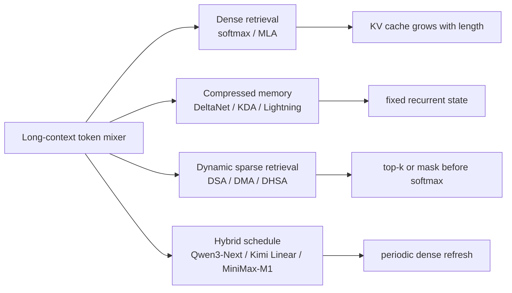
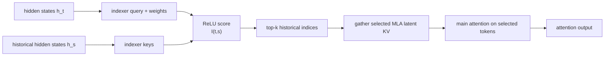
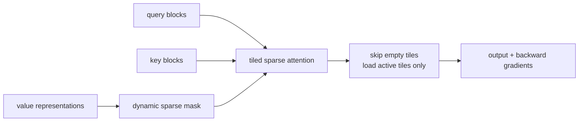
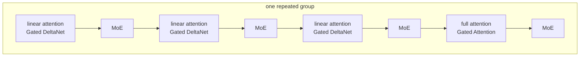
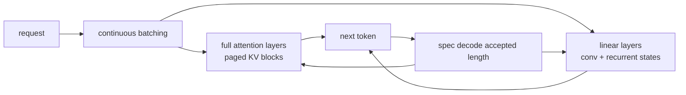
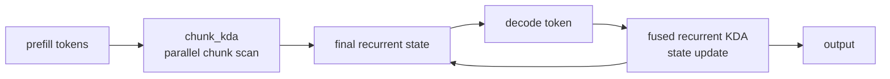
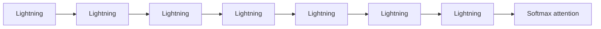

# MLSYS15 · Efficient Attention：现代长上下文架构

长上下文系统里的 attention 设计已经不只是模型结构问题，而是 cache、kernel、scheduler 和训练稳定性的共同约束。2025 年之后的主线可以用四类 token mixer 来理解：

```text
dense softmax attention 很会找信息，但 KV cache 随上下文线性增长。
linear / delta attention 把历史压进固定状态，decode 省很多显存和带宽，但会有记忆干扰。
sparse attention 仍然做 softmax retrieval，只是不让每个 query 读完整历史。
hybrid attention 把上面几类放在同一个模型里，让不同层负责不同的记忆任务。
```

分析一个新的 attention 方案时，核心问题是：

```text
一个新 attention 方案到底省了什么？
省的是 KV cache、attention FLOPs、HBM 读流量，还是训练时的激活？
它的选择器、状态更新和 kernel 怎么落地？
为什么大模型很少只用一种 attention？
```

## 目录

1. [[#一、先用 Associative Memory 统一理解]]
2. [[#二、2025 之后的主线]]
3. [[#三、DeepSeek Dynamic Sparse Attention]]
4. [[#四、Dynamic Mask Attention 和层次化 sparse routing]]
5. [[#五、Qwen3-Next：Gated DeltaNet 和周期性 full attention]]
6. [[#六、Kimi Linear：KDA、chunk kernel 与 recurrent decode]]
7. [[#七、MiniMax-M1：Lightning Attention 的长输出系统]]
8. [[#八、怎么选方案：按 workload 判断]]
9. [[#九、系统设计追问]]
10. [[#十、练习题]]
11. [[#参考资料]]

---

## 一、先用 Associative Memory 统一理解

论文《Understanding Transformer from the Perspective of Associative Memory》给了一个很好用的视角：attention 和 FFN 都可以看成 associative memory。输入 query，系统从一堆 key-value 记忆里取回 value。

最朴素的线性记忆可以写成：

$$
S_t = \sum_{i \le t} \phi(k_i)v_i^T,\qquad o_t = S_t^T\phi(q_t)
$$

这里 `S_t` 是历史信息压缩后的 key-to-value 状态。decode 的时候只要维护 `S_t`，不需要保留每个 token 的 K/V。下面 DeltaNet 和 KDA 的公式也沿用这个方向；如果你把 state 写成 value-to-key，所有公式整体转置即可。

Dense softmax attention 不这么压缩。它保留所有历史 key/value：

$$
o_t = \sum_{i \le t} \text{softmax}(q_t k_i^T)_i v_i
$$

这带来两个系统后果：

| 方案 | 记忆形态 | Decode 状态 | 优点 | 代价 |
|---|---|---|---|---|
| Dense softmax / MLA | 每个 token 一条 KV 记录 | 随上下文增长 | retrieval 强，位置清楚 | HBM 读流量和 KV cache 大 |
| Linear / Delta / KDA | 固定大小 recurrent state | 基本不随上下文增长 | decode 省显存和带宽 | 多个记忆会互相干扰 |
| Dynamic sparse | 先选少量历史 token，再 softmax | KV 仍在，但每步只读一部分 | 保留 softmax retrieval | 需要选择器和 sparse kernel |
| Hybrid | 不同层使用不同记忆 | 混合状态 | 工程上更稳 | runtime 更复杂 |

Associative Memory 的理论分析给出一个关键结论：softmax 的 exponential kernel 通常有更好的 retrieval signal-to-noise ratio。直觉上，softmax 可以把少数相似 key 的权重拉得很尖；线性记忆把很多 `(key, value)` 外积加进同一个 `S_t`，读的时候更容易混入其他记忆的残差。也就是说，linear/delta attention 的优势主要是状态大小和 decode 成本，不是免费获得无限容量。

DeltaNet 的更新可以理解成“写入新记忆前，先从旧状态里消掉和当前 key 冲突的部分”：

$$
S_t = (I - \beta_t k_t k_t^T)S_{t-1} + \beta_t k_t v_t^T
$$

Gated DeltaNet 再加衰减门，让旧记忆可以逐通道忘掉。Kimi Delta Attention 继续把这个门做得更细，不再只用一个标量衰减整条状态。

整体结构可以画成：



系统评估围绕三个状态问题展开：

1. 历史信息保存在什么数据结构里？
2. 每个 decode token 要读多少历史状态？
3. 这个状态能不能被 paged KV、continuous batching、spec decode 正确管理？

---

## 二、2025 之后的主线

2025 之后的变化主要来自两个压力：

```text
1. prompt 变长：1M context、代码仓库、agent 轨迹、RAG 历史。
2. output 变长：reasoning model 和 RL rollout 会生成几万甚至更多 token。
```

如果模型每步 decode 都读完整 KV cache，长输出会把 serving 卡在 memory bandwidth 上。于是新方案基本沿三条路走：

| 路线 | 代表 | 做法 |
|---|---|---|
| 选择历史 | DeepSeek DSA、DMA | 保留 token 级历史，但每个 query 只读被选中的部分 |
| Prefill sparse routing | DHSA | frozen backbone 外接层次化 chunk/token routing，主要减少长上下文 prefill 成本 |
| 压缩历史 | Qwen3-Next Gated DeltaNet、Kimi KDA、MiniMax Lightning Attention | 把历史写入固定状态，decode 只读 state |
| 混合层 | Qwen3-Next、Kimi Linear、MiniMax-M1 | 大多数层用便宜记忆，少数层用 dense attention 兜底 |

这不是“谁替代谁”。更现实的设计是：

```text
cheap recurrent layers 负责长程、低成本状态传播
periodic dense / MLA layers 负责高精度 token retrieval
sparse selector 负责在巨大历史里减少无效读取
```

### 2.1 2025+ 方法地图

| 工作 / 路线 | 核心问题 | 状态形态 | 系统瓶颈 | 读论文时要追问 |
|---|---|---|---|---|
| Associative Memory theory | 为什么 softmax retrieval 和线性记忆能力不同 | token KV vs compressed state | retrieval SNR vs state size | 压缩状态会混入多少无关 memory |
| DeepSeek DSA | 1M context 下不想每步读完整 MLA cache | KV 仍在，query 选 top-k | indexer + top-k + sparse MLA kernel | selector 成本是否小于省下的 KV 读流量 |
| DMA / DHSA | 用动态 mask / routing 减少 attention work | mask / hierarchy indices | mask 训练、block 稀疏 kernel | 稀疏模式能否在 GPU 上真的变快 |
| Qwen3-Next | 长上下文吞吐 + high-sparsity MoE | recurrent state + periodic full attention | mixed cache manager | spec decode 和 continuous batching 如何提交/回滚 state |
| Kimi Linear | 用 KDA 强化 recurrent memory | chunk state + recurrent state | chunk kernel / recurrent kernel | 3:1 hybrid ratio 如何平衡 retrieval 和 bandwidth |
| MiniMax-M1 | 长输出 reasoning / RL rollout | Lightning state + periodic softmax | 长 decode bandwidth + MoE dispatch | 输出 80K token 时 scheduler 怎么控 KV/state |

一个实用判断是：

```text
如果方法仍然需要完整 KV，只是少读:
  重点看 sparse selector 和 sparse attention kernel。

如果方法把历史写进 recurrent state:
  重点看 state 容量、遗忘机制、state lifecycle。

如果方法是 hybrid:
  重点看 runtime 能否同时管理 paged KV、recurrent state、spec draft state。
```

---

## 三、DeepSeek Dynamic Sparse Attention

DeepSeek-V3.2 把 Dynamic Sparse Attention 放在 MLA 框架下面。它不是简单 sliding window，也不是固定 block sparse。每个 query 会先经过一个 lightweight indexer，选出最值得看的历史 KV，再对这些选中的 KV 做 attention。

数据流可以画成这样：



DeepSeek report 里的 indexer score 形如：

$$
I_{t,s} = \sum_j w^I_{t,j}\,\text{ReLU}(q^I_{t,j}\cdot k^I_s)
$$

几个实现点比公式更重要：

- indexer head 很小，并且使用 ReLU，不用 softmax score 做选择，目的是让选择器吞吐更高。
- indexer 可以用 FP8 跑，因为它只负责排序选择，不直接生成最终 attention output。
- DSA 放在 MLA 的 latent KV 上，通常按 MQA 风格共享被选中的 latent entry，避免每个 query head 各自做一套大选择。
- 主 attention 仍然是 softmax retrieval，只是输入从“所有历史 token”变成“top-k token”。DeepSeek-V3.2 report 里的 sparse setting 使用每个 query 选择 2048 个 KV token；这不是小窗口，而是内容驱动的大预算稀疏检索。

### 3.1 训练为什么要分两段

DSA 的难点是：一开始 selector 不可靠。如果直接 sparse 训练，主模型会因为看不到该看的历史 token 而学习不稳定。DeepSeek 的做法是先 warm up indexer：

```text
stage 1: dense warm-up
  dense attention 正常跑
  冻结主模型参数
  只训练 indexer
  让 indexer 分布去匹配 dense attention 的聚合分布
  report 中使用 128K 长序列 warm-up，让 selector 先学长上下文检索

stage 2: sparse training
  打开 top-k token selection
  主模型和 indexer 一起训练
  indexer 输入 detach，避免主模型为了 indexer loss 改 hidden state
  indexer alignment loss 只在 selected top-k token set 上计算
```

这个设计说明 DSA 不是一个纯 runtime trick。它改变了模型训练分布，需要模型在 sparse retrieval 下继续适配。

### 3.2 Kernel 里真正发生什么

传统 decode attention 的内层循环大概是：

```text
for each query:
  for each KV block in full context:
    load K/V
    update softmax statistics
```

DSA 改成：

```text
for each query:
  run indexer or reuse selected indices
  gather selected KV block / token indices
  only load selected K/V
  run sparse softmax attention
```

所以系统里会多出一类状态：`top-k indices`。GLM-5.2 的 IndexShare / IndexCache 正是在这个层面优化：MTP step 之间复用 indexer 选择结果，减少重复 sparse index 计算。

DSA 适合的场景：

- 上下文很长，但每个 query 真正需要的信息很稀疏。
- 模型已经在 sparse 模式下训练或继续训练过。
- runtime 能处理不规则 gather、top-k index buffer 和 sparse attention kernel。

不适合的场景：

- 短上下文，selector 开销盖过节省。
- 每步都需要全局精细比较，top-k 很难稳定覆盖目标 token。
- serving 系统只支持 dense paged KV，无法高效管理 sparse index。

---

## 四、Dynamic Mask Attention 和层次化 sparse routing

DeepSeek DSA 是“先算 indexer score，再 top-k token”。Trainable Dynamic Mask Sparse Attention 走的是另一路：用 value 表征生成 content-aware mask，再让 sparse attention kernel 跳过被 mask 掉的 tile。

可以把 DMA 理解成：

```text
value features -> dynamic mask -> sparse weights -> FlashAttention-style tiled kernel
```

论文里的 mask 不是固定模式。它从 value 表征和可学习参数生成一个 position-aware sparse pattern，保留 top-w，其余位置写成 `-inf`。一个简化读法是：

$$
\delta = \exp(\tau(v \cdot \Delta) \cdot A)
$$

这里 `v` 提供内容特征，`\Delta` 和 `A` 提供位置相关的参数化偏置，`top-w` 决定每个 query 真正保留的稀疏连接。关键点是它把“内容”和“位置”同时放进 mask 生成器，而不是只靠局部窗口。

实现上有三个关键点：

1. mask 是可训练的，前向和反向都保留梯度路径，不只是推理时手写规则。
2. kernel 做 block-level skip。如果某个 Q/K tile 全部被 mask 掉，就不加载这个 tile 的 K/V，也不做 score 计算。
3. forward 和 backward 复用同一套 skip 逻辑，所以训练时不会 materialize 完整 attention matrix，内存仍然是 FlashAttention 风格的 `O(n)` 工作流。



和 DSA 的差别：

| 维度 | DeepSeek DSA | DMA |
|---|---|---|
| 选择粒度 | token / latent entry top-k | mask / sparse tile |
| 选择器输入 | hidden state indexer | value-based mask generator |
| 主 attention | selected KV 上的 softmax | masked sparse attention |
| kernel 压力 | gather indices + sparse attention | mask-aware tile skipping |

DHSA 继续把选择做成层次化。它在论文实验里主要优化 prefill，decode 仍使用普通 dense attention；decode sparse 化属于尚未落地的方向。它不是 DSA 那种每个 decode query 都先 top-k 的在线选择器。

它的实现不是“平均切块”这么简单，而是：

```text
boundary predictor:
  在候选边界左右各取一个 local window
  用 standalone self-attention encoder 读 key features
  MLP 预测这里是否应该切出 chunk boundary

chunk routing:
  用 variable-length chunks 表示 key memory
  对 chunk 表征做 length-normalized pooling
  query block 先 ranking key chunks
  按预算展开 chunk 里的 token indices
  排序 indices，让 sparse attention 读内存更连续
```

这个方向更像给 frozen backbone 外接一个 sparse routing 模块，适合做 long-context prefill retrofit：

```text
query block
  -> boundary-aware chunk routing
  -> expand selected chunks into token indices
  -> sort / compact indices for memory locality
  -> sparse attention
```

这里的工程取舍很清楚：层次化 routing 降低 token-level 搜索范围，但会引入边界预测、chunk representation、候选 chunk 排序和 index compaction。

DSA、DMA、DHSA 可以按“选择器训练位置和作用阶段”区分：DSA 把 indexer 做进模型并继续训练，目标是 decode/prefill 都能少读 KV；DMA 把 mask 作为可微模块训练，并把稀疏性压进 kernel；DHSA 更像 frozen LLM 外挂 routing，重点先解决 long-context prefill。

---

## 五、Qwen3-Next：Gated DeltaNet 和周期性 full attention

Qwen3-Next 不是纯 linear attention 模型。配置和实现里，它采用周期性 hybrid layout：

```text
repeat 12 times:
  Gated DeltaNet -> MoE
  Gated DeltaNet -> MoE
  Gated DeltaNet -> MoE
  Gated Attention -> MoE
```

也就是 48 层里每 4 层有 1 层 full attention，其余 3 层用 Gated DeltaNet。

这个 layout 的系统含义是：attention cost 被 hybrid / recurrent path 压下来，但每层后面的 FFN 仍然是 high-sparsity MoE。Qwen3-Next-80B-A3B 把长上下文效率拆成两条线同时优化：

| 位置 | 设计 | 系统影响 |
|---|---|---|
| Attention | Gated DeltaNet + 周期性 Gated Attention | cache 不再只有 KV，还要管理 conv/recurrent states |
| FFN | high-sparsity MoE | active FLOPs 降低，但 expert dispatch / all-to-all / grouped GEMM 成为瓶颈 |
| Training / inference auxiliary | MTP | 提供额外 pretraining signal，并为 speculative decoding 留接口 |

因此分析 Qwen3-Next 不能只看 attention kernel。长上下文吞吐来自 attention state、MoE active ratio、MTP 和 serving scheduler 的共同作用。



Transformers 里的 `Qwen3NextGatedDeltaNet` 可以按四块读：

| 代码结构 | 作用 |
|---|---|
| `in_proj_qkvz` | 一次投影出 q/k/v/z |
| `in_proj_ba` | 投影出 beta 和 gate 参数 |
| depthwise causal `Conv1d` | 给 q/k/v 加局部卷积上下文，kernel size 通常是 4 |
| `conv_states` + `recurrent_states` | cache 里不再只是 KV，还要保存卷积状态和 recurrent state |

配置层面也很具体：Qwen3-Next 的 linear attention 默认有独立的 `linear_key_head_dim`、`linear_value_head_dim`、`linear_num_key_heads`、`linear_num_value_heads`，和 full attention 的 `num_attention_heads`、`num_key_value_heads` 分开。这说明它不是把 dense attention 换一个 kernel 名字，而是给 linear state 单独设计 head layout。

长 prompt prefill 和单 token decode 走不同路径：

```text
prefill / chunk:
  causal conv over sequence
  chunk_gated_delta_rule(...)
  return final recurrent state

decode seq_len == 1:
  causal_conv1d_update(...)
  recurrent_gated_delta_rule(...)
  update cache state
```

核心门控大概是：

```python
beta = sigmoid(b)
g = -exp(A_log) * softplus(a + dt_bias)
```

这表示每个 step 既有写入强度 `beta`，也有遗忘门 `g`。和 dense KV cache 不同，linear attention 层的 cache 不是“历史 token 列表”，而是“最后的卷积状态 + recurrent matrix/state”。

### 5.1 runtime 为什么麻烦

Hybrid 模型让 serving runtime 变复杂：



vLLM 这类 runtime 需要给不同 attention type 分配不同 cache group。full attention 层要 block table；linear attention 层要维护 state。做 speculative decoding 时，accepted length 同时影响两条路径：full attention 的 draft KV block 哪些可以提交、哪些要释放；linear attention 的 draft recurrent state 哪些可以 shift 成正式状态。

所以 Qwen3-Next 的价值不只在模型结构，也在它逼迫 runtime 支持 hybrid cache。

这个点在系统设计里很容易被低估：full attention 的 cache 可以按 block table 提交或释放 draft token；linear attention 的 state 是递推结果，不能随便从中间切掉一个 rejected draft token。spec decode 里每次 accepted length 不同，runtime 必须同时维护 paged KV lifecycle 和 recurrent state lifecycle。

---

## 六、Kimi Linear：KDA、chunk kernel 与 recurrent decode

Kimi Linear 的核心是 Kimi Delta Attention。它从 Gated DeltaNet 出发，把衰减门做成更细粒度的通道门，并配合专门的 chunkwise algorithm。

KDA 的状态更新可以写成：

$$
S_t = (I - \beta_t k_t k_t^T)\,\text{Diag}(\alpha_t)S_{t-1} + \beta_t k_t v_t^T
$$

这里 `Diag(alpha_t)` 是逐通道衰减，不是一个全局标量。这让模型更灵活，但 kernel 也更难写。

Kimi Linear 不是全 KDA。论文报告的模型采用 3:1 的 KDA 到 global attention 比例，并在 MoE 架构里周期性插入 MLA/full attention 层。这个设计和 Qwen3-Next 的直觉类似：多数层省 cache，少数层保留强 retrieval。

### 6.1 FLA 里的 KDA kernel 怎么读

`flash-linear-attention` 里的 KDA 实现大致分两条路径：

```text
chunk_kda:
  用于 prefill / training
  输入 q, k, v, gate, beta
  分 chunk 并行扫描
  可以返回最终 recurrent state

fused_recurrent_kda:
  用于 decode
  每次读上一时刻 state
  更新 state
  输出当前 token
```



源码里还有几类工程开关：

| 开关 | 含义 |
|---|---|
| `use_qk_l2norm_in_kernel` | 在 kernel 内做 q/k normalization，少一次外部 kernel |
| `use_gate_in_kernel` | 在 kernel 内从 raw gate 计算 decay |
| `use_beta_sigmoid_in_kernel` | 在 kernel 内做 beta sigmoid |
| `return_intermediate_states` | 推理时返回中间 state，便于 continuous batching 或调试 |
| `state_v_first` | 调整 state layout，匹配后端 kernel 读写 |

`fused_recurrent_kda` 还要处理 continuous batching 和 spec decoding。源码里会看到类似 `IS_CONTINUOUS_BATCHING`、`IS_SPEC_DECODING`、`num_accepted_tokens`、`ssm_state_indices` 的分支。这些不是装饰参数，而是在告诉 kernel：同一个 batch 里的 request state 可能被重排，spec decode 之后每条 request 接受的 draft token 数也不同。

FlashKDA 这类后端通常会有硬约束，例如 bf16、固定 K/V 维度、不支持部分 GVA 场景、不支持 context parallel。准确的系统描述是：

```text
KDA 把 token 级 KV cache 换成 recurrent state，
但 runtime 仍然要管理 state layout、chunk/prefill kernel、decode recurrent kernel、
continuous batching 和 spec decode 下的 state 对齐。
```

---

## 七、MiniMax-M1：Lightning Attention 的长输出系统

MiniMax-M1 使用 hybrid MoE 和 Lightning Attention，目标是把 test-time compute 扩展到很长的输出。它的 attention 结构是：

```text
每 7 个 Lightning Attention / TransNormer blocks
后面接 1 个 softmax attention block
```

这仍然是 hybrid 思路：大多数层用便宜状态传播，周期性 softmax 层给模型更强的 token retrieval。

MiniMax-M1 的系统数字给出了长输出场景的量级：456B total、约 45.9B activated 的 hybrid MoE，支持 1M input context，M1-80k 版本最大输出 80K token。它的卖点不是“attention 名字更新”，而是在 100K 级生成长度下用更少 FLOPs 做 long reasoning rollout。

Lightning Attention 可以按 linear attention 的 IO-aware 版本理解。普通 dense attention 在 decode step `t` 要读 `K[0:t]` 和 `V[0:t]`；Lightning/TransNormer 风格的层把历史写进固定 recurrent state，decode 主要读这个 state。prefill 时不能简单串行扫 token，否则训练吞吐会很差，所以实现会把序列切成 chunk：chunk 内并行算局部贡献，chunk 间用 prefix-scan / recurrent carry 传递状态。系统收益来自两个地方：

```text
decode:
  不再每步扫描完整 KV history
  长输出时 HBM traffic 增长慢很多

prefill / training:
  用 IO-aware chunk algorithm 避免 materialize n x n attention matrix
  让长 context 和 RL rollout 的训练成本可控
```

为什么还要每 7 层接 1 层 softmax attention？原因和 Qwen/Kimi 类似：Lightning 层提供便宜的压缩记忆，softmax 层定期做显式 token retrieval。MiniMax-M1 的设计重点是把这两个东西放到大 MoE reasoning model 里，并证明长输出 RL 还能稳定训练。



MiniMax-M1 的系统经验也很关键。长输出 RL 训练时，training kernel 和 inference kernel 的数值精度不一致会放大成 rollout 质量问题；提高 LM output head 精度到 FP32 后，训练和推理 logprob 的相关性才恢复。这说明 efficient attention 不是 isolated layer choice，训练和推理 kernel 的数值一致性也会影响 RL。

---

## 八、怎么选方案：按 workload 判断

把名字拿掉，只看 workload，判断方式如下：

| 场景 | 更合适的 attention | 原因 |
|---|---|---|
| 中短 prompt、高精度 retrieval | Dense softmax / MLA | KV 成本还能接受，retrieval 最稳 |
| 1M prompt、每步只需要少量证据 | DSA / DMA | decode 时选历史比读全量 KV 更划算 |
| 很长 output、RL rollout、agent loop | DeltaNet / KDA / Lightning | decode state 小，长输出省 bandwidth |
| 通用大模型 | Hybrid | 单一 attention 很难同时满足 retrieval 和成本 |
| 已有 dense 模型 retrofit | DHSA 类外接 routing 或 sparse attention fine-tune | 不一定要从头预训练 |

### 8.1 一句话比较

```text
DSA: 我仍然存 KV，但每步先选哪些 token 值得看。
DMA: 我让可训练 mask 决定哪些 tile 可以跳过。
DHSA: 我主要优化 prefill，先动态切 key chunks，再按预算展开 token indices。
Qwen3-Next: 我让大多数层用 Gated DeltaNet，周期性 full attention 刷新 retrieval。
Kimi Linear: 我用更强的 KDA recurrent state，并配专门 chunk/recurrent kernel。
MiniMax-M1: 我用 Lightning Attention 支撑长输出，再周期性插入 softmax attention。
```

### 8.2 系统实现 checklist

实现或评估一个 efficient attention 方案时，论文复杂度只是起点，还需要检查：

1. Prefill 有没有高吞吐 chunk kernel？
2. Decode 是否只有单 token recurrent kernel，还是仍然会读大量历史 KV？
3. Cache manager 能否同时管理 paged KV 和 recurrent state？
4. Continuous batching 下，state 能否按 request 重排？
5. Spec decode 下，draft token 的 state 怎么回滚或提交？
6. 训练和推理 kernel 的数值路径是否一致？
7. Sparse selector 的 top-k / mask 开销是否真的小于省下的 attention 开销？

### 8.3 Streaming/H2O 这类 KV eviction 放在哪里？

StreamingLLM、H2O、SnapKV、PyramidKV 不是新的 token mixer，它们通常不改变 attention layer 的数学形式，而是改变 KV cache 保留策略。它们应该放在第 16 课的 KV cache 体系里理解：

```text
efficient attention architecture:
  改模型层怎么混合历史信息

KV eviction / compression:
  模型层基本不变，改 runtime 保留哪些 KV
```

这一区分很重要。DSA / KDA / Lightning 需要模型结构或 kernel 配合；H2O / StreamingLLM 更像 serving runtime 的 cache policy。前者改变“attention 怎么算”，后者改变“attention 能看到哪些历史”。

---

## 九、系统设计追问

### 9.1 设计 70B LLM serving：tail latency 低，吞吐还要高

问：设计一个 70B 级模型的生产推理服务，要求高 QPS 和低 P95 latency。

```text
prefill/decode 拆分
continuous batching
paged KV cache
KV cache capacity planning
tensor parallel / pipeline parallel
spec decode 是否值得开
长上下文请求如何隔离，避免拖慢短请求
```

系统层回答：

```text
普通 dense attention 层:
  decode 每步读 paged KV blocks，长上下文受 HBM bandwidth 限制

hybrid / linear attention 层:
  runtime 需要同时管理 paged KV 和 recurrent state
  continuous batching 重排 request 时，两类 state 都要跟着移动

dynamic sparse attention:
  除了 KV cache，还要管理 top-k indices / sparse mask
  只有 selector 开销小于省下的 KV 读取，端到端才划算
```

### 9.2 KV cache 如何在多轮对话和重复 prompt 间复用？

问：KV cache 如何在多轮对话和重复 prompt 间复用？

```text
单请求内:
  decode step t 只计算新 token 的 K/V
  历史 K/V 通过 block table 读取

跨请求:
  system prompt / shared prefix 可以做 prefix cache
  cache key 需要包含 tokenizer ids、model version、sampling 无关前缀

淘汰:
  显存紧张时按 prefix 命中率、长度、最近使用时间淘汰
  如果有 KV quantization / offload，要说明额外 latency

efficient attention 关联:
  DSA 还会多出 top-k index cache
  KDA/Qwen3-Next 这类层不是 KV list，而是 recurrent state
```

### 9.3 为什么推理阶段 cache KV，不 cache Q？

问：为什么推理阶段 cache KV，不 cache Q？

```text
K/V:
  历史 token 的 K/V 下一步还会被当前 query 访问
  所以缓存后可以重复使用

Q:
  每一步只需要当前 token 的 query
  历史 query 不会再参与未来 token 的 attention 计算
  所以缓存 Q 没有收益
```

如果要拉到系统层：

```text
KV cache 不是让 decode 变成 O(1)
它只是避免重复 K/V projection
attention score 仍然要读历史 K/V，除非使用 sparse / recurrent / hybrid attention
```

### 9.4 动态 batching 和 continuous batching 怎么做，长 prompt 会不会拖慢短 prompt？

问：动态 batching 和 continuous batching 怎么做，长 prompt 会不会拖慢短 prompt？

```text
prefill:
  prompt length 差异大，适合按长度 bucket 或单独 prefill queue

decode:
  每个 request 每轮通常只产 1 个 token
  continuous batching 可以把不同请求的 decode step 拼成大 batch

状态管理:
  dense attention 需要 block table 和 free list
  hybrid attention 需要额外 recurrent state table
  DSA/DMA 需要 sparse indices/mask buffer

风险:
  长上下文 request 会占大量 KV blocks
  如果 scheduler 只追求 batch size，短请求 tail latency 会变差
```

### 9.5 Speculative decoding 什么时候不一定有收益？

问：Speculative decoding 什么时候不一定有收益？

```text
收益来自:
  target model 一次验证多个 token
  平均接受长度 a 足够高

成本来自:
  draft model forward
  target verification
  rejected token 的浪费
  两套 KV cache 或 recurrent state 的管理

hybrid attention 额外问题:
  full attention draft KV block 要提交/释放
  linear attention draft state 要按 accepted length shift
```

### 9.6 GPU 显存放不下 KV cache，怎么 offload？

问：GPU 显存放不下 KV cache，怎么 offload？

```text
先算账:
  KV bytes = layers * tokens * kv_heads * head_dim * 2(K,V) * dtype_bytes

优先级:
  先做 GQA/MQA/MLA 或 KV quantization
  再做 paged KV + prefix cache 提高利用率
  最后才考虑 CPU/NVMe offload

offload 策略:
  冷 prefix 或低优先级 request 可以迁出
  decode 热路径尽量别跨 PCIe 同步读
  如果 offload，必须 overlap transfer with compute

efficient attention 关联:
  recurrent attention 减少 token-level KV
  sparse attention 减少每步读流量，但不一定减少存储
```

---

## 十、练习题

<details class="exercise">
<summary><span class="q-label">Q1</span> <span class="q-text">为什么 linear / delta attention 不能简单理解成“无限长上下文免费”？</span></summary>

它把历史压成固定大小 recurrent state，decode 的显存和带宽成本确实更低，但多个 key-value 记忆会叠加在同一个状态里。softmax attention 保留 token-level KV，retrieval signal 可以更尖；compressed memory 容量有限，远距离事实检索可能被其他记忆干扰。

</details>

<details class="exercise">
<summary><span class="q-label">Q2</span> <span class="q-text">DSA 和 KV eviction 的核心区别是什么？</span></summary>

DSA 的 KV 仍然保留在 cache 里，每个 query 先用 indexer 选择要读的 top-k 历史 token，再做 sparse attention；KV eviction 是把部分 KV 不再保留或迁出。DSA 主要减少每步读流量，eviction 主要减少存储压力。

</details>

<details class="exercise">
<summary><span class="q-label">Q3</span> <span class="q-text">为什么 Qwen3-Next / Kimi Linear / MiniMax-M1 都偏向 hybrid，而不是全 linear attention？</span></summary>

全 recurrent state 的 decode 成本最低，但精确 token retrieval 不如 softmax KV。Hybrid 让多数层承担低成本状态传播，周期性 dense / MLA / softmax attention 做全局检索刷新。这样能同时控制长输出成本和 retrieval 质量。

</details>

<details class="exercise">
<summary><span class="q-label">Q4</span> <span class="q-text">实现 hybrid attention runtime 时，cache manager 要多管理什么？</span></summary>

普通 dense attention 只管理 paged KV block。Hybrid runtime 还要管理 recurrent state、conv state、不同 layer type 的 state table，以及 spec decode 下 draft token 的提交/回滚。continuous batching 重排 request 时，这些 state 都要和 request id 对齐。

</details>

<details class="exercise">
<summary><span class="q-label">Q5</span> <span class="q-text">为什么 sparse attention 论文里的 FLOPs 降低不一定等于线上 latency 降低？</span></summary>

线上 latency 还取决于 selector、top-k、gather、sparse kernel、memory coalescing 和 scheduler。若稀疏模式导致非连续读、kernel launch 增多或 batch shape 更碎，节省的 matmul FLOPs 可能被 HBM 读和调度开销吃掉。

</details>

<details class="exercise">
<summary><span class="q-label">Q6</span> <span class="q-text">长输出 RL rollout 更适合关注哪类 attention 设计？</span></summary>

重点关注 decode 每步状态读写成本。KDA、Lightning、Gated DeltaNet 这类 recurrent / hybrid attention 在长输出下能减少 token-level KV 读流量；但如果任务需要频繁回看 prompt 中的精确证据，还需要周期性 dense / MLA 层或 DSA 式 sparse retrieval 兜底。

</details>

---

## 参考资料

- [Understanding Transformer from the Perspective of Associative Memory](https://arxiv.org/abs/2505.19488v1)
- [MiniMax-M1: Scaling Test-Time Compute Efficiently with Lightning Attention](https://arxiv.org/abs/2506.13585)
- [Kimi Linear: An Expressive, Efficient Attention Architecture](https://arxiv.org/abs/2510.26692)
- [DeepSeek-V3.2 technical report](https://arxiv.org/pdf/2512.02556)
- [Trainable Dynamic Mask Sparse Attention](https://arxiv.org/abs/2508.02124)
- [Dynamic Hierarchical Sparse Attention](https://arxiv.org/html/2510.24606v1)
- [Qwen3-Next model card](https://huggingface.co/Qwen/Qwen3-Next-80B-A3B-Instruct)
- [Qwen3-Next introduction](https://qwen.ai/blog?from=research.latest-advancements-list&id=4074cca80393150c248e508aa62983f9cb7d27cd)
- [vLLM Qwen3-Next support notes](https://vllm.ai/blog/2025-09-11-qwen3-next)
- [flash-linear-attention KDA implementation](https://github.com/fla-org/flash-linear-attention/tree/main/fla/ops/kda)
- [Reddit: Interview experience for LLM inference systems position](https://www.reddit.com/r/LLMDevs/comments/1r5vona/interview_experience_for_llm_inference_systems/)
- [牛客：大厂大模型算法岗推理类面试题总结](https://www.nowcoder.com/feed/main/detail/68262da0086c49dfad1848931306b17d)
- [阿里云开发者社区：AI 大模型面试宝典九，推理部署篇](https://developer.aliyun.com/article/1704743)
- [53AI：阿里大模型面试原题，LLM 推理为什么用 KV Cache](https://www.53ai.com/news/LargeLanguageModel/2024083039674.html)
- [Prachub: LLM Inference Optimization And KV Cache](https://prachub.com/concepts/llm-inference-optimization-and-kv-cache)
- [GitHub: machine-learning-interview-questions](https://github.com/amitshekhariitbhu/machine-learning-interview-questions/blob/main/README.md)
