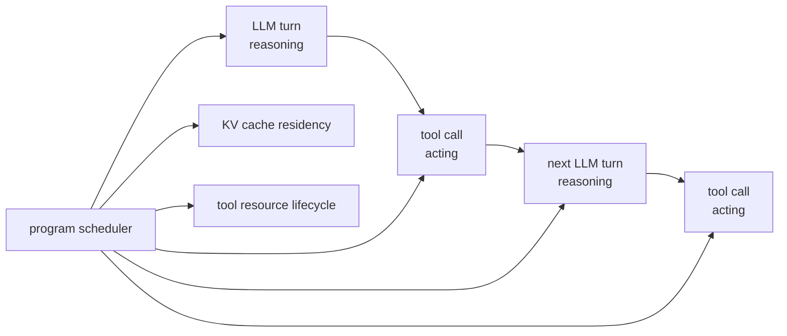

# MLSYS16 · KV Cache: Memory Management, Prefix Reuse, and GLM-5.2 IndexShare

KV cache is the most frequently questioned layer in inference systems: it determines the VRAM footprint of long-context decoding, the benefit boundaries of prefix reuse, and what exactly GLM-5.2 IndexShare is sharing.

First, the conclusion:

```text
KV cache saves redundant computation.
PagedAttention solves dynamic memory management for KV cache.
Prefix cache solves common prefix reuse across different requests.
IndexShare / IndexCache solves the cost of repeatedly selecting top-k indices in DSA sparse attention.
The KV cache problem in Agent scenarios centers on the cache lifecycle across multi-turn LLM calls and tool calls.
```

These are not the same problem, but a real runtime will place them all in the same decode path.

## Table of Contents

1. [[#I. Why decode must have KV cache]]
2. [[#II. What exactly is stored in KV cache]]
3. [[#III. PagedAttention: Managing KV cache like VRAM page tables]]
4. [[#IV. Prefix cache: Do not repeatedly prefill the same prompt]]
5. [[#V. The KV cache capacity ledger]]
6. [[#VI. Kernel perspective: How paged decode attention reads cache]]
7. [[#VII. KV cache compression, eviction, and transmission]]
8. [[#VIII. DSA sparse attention: Select tokens first, then perform attention]]
9. [[#IX. Deep dive into GLM-5.2 IndexShare / IndexCache source code]]
10. [[#X. KV cache and MTP / speculative decoding]]
11. [[#XI. KV cache in Agent scenarios: From prefix cache to ThunderAgent]]
12. [[#XII. Exercises]]
13. [[#References]]

---

## I. Why decode must have KV cache

The core of Transformer layer `l` attention is:

$$
Q_l = X_l W_Q,\quad K_l = X_l W_K,\quad V_l = X_l W_V
$$

Autoregressive decoding at step `t` adds only one token. Without KV cache, every step would require re-projecting tokens from `0` to `t` into K/V:

```text
step 1: recompute K/V for token 0
step 2: recompute K/V for token 0..1
step 3: recompute K/V for token 0..2
...
```

This would repeat the K/V projection for historical tokens many times. The KV cache approach is:

```text
prefill:
  Compute K/V for all prompt tokens at once, write to cache

decode step t:
  Compute K/V only for the new token
  Append new K/V to cache
  Current query reads historical K/V to perform attention
```

Thus, decoding attention becomes:

```text
q_t attends to cached K[0:t] and V[0:t]
```

Note that this optimization does not make attention "free" regarding history length. For every generated token, the query still reads an increasingly long K/V sequence. KV cache merely avoids redundant generation of historical K/V.

Visualization:

```text
without KV cache

step t:
  X[0:t] -> K[0:t], V[0:t]  # repeat projection
  q_t    -> attention

with KV cache

prefill:
  X[0:p] -> KV cache

decode step t:
  x_t -> k_t, v_t -> append
  q_t -> read KV cache[0:t]
```

## II. What exactly is stored in KV cache

The cache for each layer in standard MHA can be roughly written as:

```text
K cache: [num_tokens, num_kv_heads, head_dim]
V cache: [num_tokens, num_kv_heads, head_dim]
```

If there are multiple requests in a batch, the runtime usually does not store them as a regular `[batch, max_seq, ...]` matrix because each request has a different length and requests enter/exit dynamically.

### Differences between MHA / GQA / MQA

| Architecture | KV heads | Cache volume | Typical impact |
|---|---:|---:|---|
| MHA | Equal to query heads | Maximum | Most complete attention expression, but highest cache pressure |
| GQA | Fewer than query heads | Medium | Common in Llama series, significantly reduced cache |
| MQA | 1 KV head | Minimum | Most cache-efficient, but stricter model structure constraints |

Single-layer KV cache size approximation:

$$
2 \times T \times H_{kv} \times D \times \text{bytes}
$$

Multiply by the number of layers `L` for the full model. `2` accounts for K and V.

Example:

```text
layers = 80
seq_len = 128K
kv_heads = 8
head_dim = 128
dtype = bf16 = 2 bytes

KV size ~= 2 * 80 * 128K * 8 * 128 * 2
        ~= 40 GB
```

This is for a single request, excluding overheads like allocator fragmentation, block tables, prefix cache, speculative decoding candidate tokens, and concurrent batching.

### MLA cache format

MLA structures like DeepSeek-V2/V3 and GLM-5 do not cache full K/V heads directly; instead, they cache low-rank latent KV and RoPE components. Taking the GLM path in ATOM as an example, the main MLA cache stores:

```text
kv_lora_rank + qk_rope_head_dim
```

During decoding, the query is combined with the cached latent via matrix absorption or projection. This significantly reduces KV cache volume, but kernels are more complex.

## III. PagedAttention: Managing KV cache like VRAM page tables

vLLM's PagedAttention borrows from OS virtual memory. The logical token sequence of each request is sliced into fixed-size blocks:

```text
request A logical tokens:

[0..15] [16..31] [32..47] [48..]
  blk0    blk1     blk2    blk3

block table:
logical blk0 -> physical block 91
logical blk1 -> physical block 18
logical blk2 -> physical block 37
logical blk3 -> physical block 44
```

This solves three problems:

1. Request length grows dynamically; no need to pre-allocate maximum length.
2. Blocks are released after a request finishes, allowing VRAM reuse by other requests.
3. When multiple requests share a prefix, the block table can point to the same physical blocks, managed via reference counting.

The cost is that the attention kernel can no longer assume K/V is contiguous in memory. When the kernel reads the `j`-th historical token, it must find the physical address via the block table:

```text
logical_token_id -> logical_block_id, offset_in_block
logical_block_id -> physical_block_id
physical_block_id, offset_in_block -> K/V address
```

### Trade-offs: PagedAttention vs. contiguous cache

| Scheme | Pros | Cons |
|---|---|---|
| contiguous cache | Simple kernel, direct contiguous reads | Prone to waste and fragmentation under dynamic lengths |
| PagedAttention | Flexible allocation, suitable for continuous batching | Kernel requires an extra block table indirect lookup |
| vAttention | Keeps virtual addresses contiguous, physical pages allocated on demand | Depends on CUDA virtual memory management, complex at system level |

PagedAttention does not change the mathematics of attention; it changes the memory layout and access pattern of K/V.

## IV. Prefix cache: Do not repeatedly prefill the same prompt

Many online requests share the same prefix:

```text
system prompt
tool definitions
few-shot examples
repo context header
```

If every request re-prefills these tokens, TTFT (Time To First Token) is wasted. The prefix cache approach retains already-computed KV blocks and reuses them when a new request hits the same token prefix.

SGLang's RadixAttention uses a radix tree to manage these prefixes:

```text
root
 └── system prompt
      ├── user A history
      └── user B history
```

When a request arrives:

```text
1. Tokenize to get token ids
2. Find the longest common prefix in the radix tree
3. Increment reference counts for hit KV blocks
4. Prefill only the missing suffix
```

Prefix cache correctness requirements are strict:

```text
Token-level prefix must be exactly identical.
Even if the text is the same, different tokenizer results prevent KV reuse.
```

It also changes the scheduler. High-hit-rate requests should be routed to workers that already have the cache; otherwise, if the cache is on another worker, you still have to re-prefill or transmit KV across machines.

## V. The KV cache capacity ledger

Inference systems often appear to be compute-bound, but end up bottlenecked by KV capacity.

A practical estimate:

```text
KV bytes = 2 * layers * tokens * kv_heads * head_dim * bytes_per_element
```

A more engineering-oriented concurrency ledger can be written as:

```text
bytes_per_token = 2 * layers * kv_heads * head_dim * bytes_per_element
kv_cache_per_session = bytes_per_token * cached_tokens

max_sessions ~= (gpu_memory - model_weights - runtime_overhead)
                / kv_cache_per_session
```

This `max_sessions` is only an upper bound. Real serving must also subtract activations, workspace, communication buffers, allocator reserves, PagedAttention metadata, sampler/logits buffers, tokenizer/runtime overhead, and safety margins.

For MLA, this can be replaced with:

```text
MLA KV bytes = layers * tokens * (kv_lora_rank + qk_rope_head_dim) * bytes_per_element
```

There is no `2` multiplier here because the cache format already combines latent KV and RoPE components. Different implementations have padding, scaling, and block metadata; check the specific runtime.

### Why KV cache is more troublesome than weights for long context

Weight size is fixed:

```text
model weights: fixed
```

KV cache grows with concurrency and context length:

```text
KV cache ~= active_requests * sequence_length
```

Therefore, the batch size a single card can run is often determined by KV cache, not weights.

The benefits of GQA/MQA should also be understood via this formula: they don't make attention stop reading history, but they reduce `kv_heads`. For example, if query heads remain 32 but KV heads drop from 32 to 8, the single-token KV cache drops to one-quarter; if context is simultaneously increased from 4K to 8K, the cache may still be smaller than the original MHA 4K.

## VI. Kernel perspective: How paged decode attention reads cache

A simplified paged decode attention kernel can be understood as:

```python
def paged_decode_attention(q, block_table, k_cache, v_cache, seq_len):
    scores = []
    for token_id in range(seq_len):
        logical_block = token_id // BLOCK_SIZE
        offset = token_id % BLOCK_SIZE
        physical_block = block_table[logical_block]

        k = k_cache[physical_block, offset]
        score = dot(q, k)
        scores.append(score)

    probs = softmax(scores)

    out = 0
    for token_id in range(seq_len):
        logical_block = token_id // BLOCK_SIZE
        offset = token_id % BLOCK_SIZE
        physical_block = block_table[logical_block]
        v = v_cache[physical_block, offset]
        out += probs[token_id] * v

    return out
```

Real kernels implement these optimizations:

- One CTA handles one or more query heads.
- K/V is read via vectorized loads, kept as coalesced as possible.
- Online softmax is performed on long-context chunks to avoid storing the full score vector.
- Block table, sequence length, and slot mapping come from runtime metadata.
- CUDA graphs require stable batch shapes, so runtimes often pad requests to a fixed capture size.

This explains why FlashAttention, FlashInfer, and vLLM paged kernels are not simple replacements for each other. They all handle attention, but their input layouts, metadata, and batch dynamics differ.

### 6.1 Triton sketch: paged KV gather

The following kernel is not a full attention implementation; it only demonstrates the layer most prone to errors in paged KV cache: logical token positions must first be looked up in the block table, then mapped to a physical KV block.

```python
import triton
import triton.language as tl


@triton.jit
def paged_k_gather_kernel(
    q_ptr,              # [num_heads, head_dim]
    k_cache_ptr,        # [num_blocks, block_size, num_kv_heads, head_dim]
    block_table_ptr,    # [max_blocks_per_seq]
    out_scores_ptr,     # [seq_len]
    seq_len: tl.constexpr,
    block_size: tl.constexpr,
    head_dim: tl.constexpr,
    kv_heads: tl.constexpr,
    BLOCK_M: tl.constexpr,
    BLOCK_D: tl.constexpr,
):
    pid_m = tl.program_id(0)
    offs_m = pid_m * BLOCK_M + tl.arange(0, BLOCK_M)
    offs_d = tl.arange(0, BLOCK_D)

    logical_block = offs_m // block_size
    block_offset = offs_m % block_size
    physical_block = tl.load(block_table_ptr + logical_block, mask=offs_m < seq_len, other=0)

    # This only writes for single query head -> single kv head; GQA requires additional head mapping.
    k_offsets = (
        ((physical_block * block_size + block_offset) * kv_heads * head_dim)
        + offs_d[None, :]
    )
    q = tl.load(q_ptr + offs_d, mask=offs_d < head_dim, other=0.0)
    k = tl.load(k_cache_ptr + k_offsets, mask=(offs_m[:, None] < seq_len) & (offs_d[None, :] < head_dim), other=0.0)

    score = tl.sum(k * q[None, :], axis=1)
    tl.store(out_scores_ptr + offs_m, score, mask=offs_m < seq_len)
```

Production kernels fuse this gather, online softmax, and V aggregation. It is broken down here to clearly see the core cost of PagedAttention: one extra `block_table` indirect lookup per tile.

### 6.2 Triton sketch: DSA sparse indices gather

Sparse decoding in DSA / IndexShare adds another layer of `paged_kv_indices`. It does not scan history in `0..seq_len` order, but reads K/V according to the top-k paged indices selected by the indexer.

```python
@triton.jit
def sparse_k_gather_kernel(
    q_ptr,                 # [head_dim]
    k_cache_ptr,           # paged KV cache storage
    paged_kv_indices_ptr,  # [topk]
    out_scores_ptr,        # [topk]
    topk: tl.constexpr,
    head_dim: tl.constexpr,
    BLOCK_K: tl.constexpr,
    BLOCK_D: tl.constexpr,
):
    pid_k = tl.program_id(0)
    offs_k = pid_k * BLOCK_K + tl.arange(0, BLOCK_K)
    offs_d = tl.arange(0, BLOCK_D)

    kv_index = tl.load(paged_kv_indices_ptr + offs_k, mask=offs_k < topk, other=0)
    k_offsets = kv_index[:, None] * head_dim + offs_d[None, :]

    q = tl.load(q_ptr + offs_d, mask=offs_d < head_dim, other=0.0)
    k = tl.load(k_cache_ptr + k_offsets, mask=(offs_k[:, None] < topk) & (offs_d[None, :] < head_dim), other=0.0)

    score = tl.sum(k * q[None, :], axis=1)
    tl.store(out_scores_ptr + offs_k, score, mask=offs_k < topk)
```

This sketch corresponds to the `paged_kv_indices` buffer in the ATOM/vLLM path. The full layer writes new indices; the shared layer skips the indexer and continues reading the same batch of indices. Actual implementations must handle batch indptr, last page length, head mapping, FP8 scale, causal mask, and online softmax.

## VII. KV cache compression, eviction, and transmission

First, distinguish between two types of problems:

```text
exact memory management:
  Does not change the KV content seen by the model, only changes VRAM allocation, reuse, and movement.

approximate cache reduction:
  Stores less, reads less, or compresses part of the KV, usually introducing precision/recall risks.
```

PagedAttention, prefix cache, and vAttention are closer to the first category; StreamingLLM, H2O, SnapKV, PyramidKV, Quest, and DuoAttention are closer to the second. Both methods can be combined, but system risks differ entirely: exact methods primarily fear fragmentation, concurrency, and scheduling; approximate methods must prove that task accuracy does not collapse.

### 1. Smaller structures

GQA, MQA, and MLA directly reduce the vector dimensions that need to be cached per token.

### 2. Low-precision KV

FP8 KV cache can halve VRAM usage, but requires handling scale, quantization error, and kernel support. For long contexts, K errors affect attention scores, and V errors affect value aggregation.

### 3. Eviction or sparse retention

Methods like StreamingLLM, H2O, and SnapKV all answer the same question:

```text
If the cache budget is insufficient, which historical tokens are most worth keeping?
```

Key differences lie in how "importance" is defined:

| Method | Retention Strategy | Granularity | Training Required | Suitable Scenario | Main Risk |
|---|---|---|---|---|---|
| Scissorhands | Historically important tokens remain important; sample/retain by persistence | token | No | General KV compression with fixed budget | Early misjudgment affects subsequent steps |
| H2O | heavy hitter tokens + recent tokens | token | No | Dynamic KV eviction during decoding | Historical attention score statistics may not match future query needs |
| StreamingLLM | attention sinks + sliding window | token | No | Infinite streaming / long-dialogue generation | Unsuitable for tasks requiring precise long-distance retrieval |
| SnapKV | Estimate important positions per head using observation window after prefill | head × token | No | Long prompt prefill followed by decoding | Prompt second-half estimation may not cover subsequent queries |
| PyramidKV | Retain more KV in lower layers, less in higher layers | layer × token | No | Long-context models with clear inter-layer aggregation | Layer budget needs calibration; not all models adapt equally |
| Quest | Estimate important KV pages using current query, load only top pages | page | No | Main bottleneck is HBM bandwidth for reading KV during decode | Requires page-level min/max metadata and sparse page kernel |
| DuoAttention | Retrieval heads retain full KV, streaming heads use short cache | head | Light calibration | Models with clear retrieval/streaming head division | Requires identifying head types; model migration requires recalibration |

Core judgment of this table:

```text
StreamingLLM / H2O / SnapKV / PyramidKV:
  Reduce "how much KV to store"

Quest:
  KV may remain, but reduce "how many KV pages to read per step"

DuoAttention:
  Turn "which heads need full KV" into a calibration problem
```

These methods save VRAM or HBM read traffic, but are usually no longer strictly equivalent inference. When answering system design questions, separate exact and approximate methods:

```text
PagedAttention / prefix cache are exact memory management.
KV eviction / compression are usually approximate methods, unless they are lossless encoding or pure dtype rewriting.
```

### 3.1 StreamingLLM vs H2O: Why they are not the same eviction

The key observation of StreamingLLM is the attention sink: even in very long sequences, the model consistently assigns a portion of attention to the first few tokens. Its cache structure is usually:

```text
[sink tokens] + [recent sliding window]
```

It is suitable for "continuous dialogue/streaming generation," aiming to prevent model collapse when exceeding training or service lengths. H2O's core is the heavy hitter oracle: tokens with high cumulative contribution in historical attention are more likely to remain important, so it retains heavy hitters plus recent tokens. It is more like an online cache eviction policy.

| Dimension | StreamingLLM | H2O |
|---|---|---|
| Retained objects | attention sink + recent window | heavy hitters + recent window |
| Importance source | sink phenomenon + recency | accumulated attention contribution |
| Resembles | streaming stability policy | online KV eviction policy |
| Long-distance retrieval | Weak, unless answer is in sink/recent | Depends on whether heavy hitter captures relevant tokens |

### 3.2 SnapKV / PyramidKV / Quest: From token to layer/page

The commonality of SnapKV, PyramidKV, and Quest is making "retaining important tokens" more structured:

```text
SnapKV:
  per-head observation window -> select compressed KV positions

PyramidKV:
  lower layers need wider information flow
  higher layers can use smaller cache budget

Quest:
  store page metadata
  current query estimates top-K critical KV pages
  sparse attention only loads selected pages
```

These three correspond to three system granularities:

| Granularity | Representative | System Implication |
|---|---|---|
| head × token | SnapKV | Important tokens differ per head |
| layer × token | PyramidKV | Cache budget should not be uniform across layers |
| page × query | Quest | The most expensive part of decoding is reading KV pages from HBM |

### 4. Cross-machine transmission and persistence

Works like CacheGen and LMCache do not directly decide "which tokens to retain," but treat KV cache as a system resource across requests, nodes, and sessions. They focus on:

```text
Prefill is expensive, but KV is also large.
Whether reusing KV is more cost-effective than recomputing depends on network bandwidth, compression ratio, loading timing, and hit rate.
```

Common decision order in real systems:

1. Use prefix cache / routing to improve local hits first.
2. If local VRAM is insufficient, consider CPU/NVMe/off-node KV tiers.
3. Only transmit KV across nodes if compressed KV is cheaper than recomputing.
4. For multi-turn agent sessions, session-aware routing is often more stable than blind remote cache pulling.

## VIII. DSA sparse attention: Select tokens first, then perform attention

DeepSeek Sparse Attention and GLM-5's DSA no longer perform full attention on all historical tokens for every layer. They add a lightweight indexer:

```text
hidden/query -> indexer -> top-k token indices
top-k token indices -> sparse MLA attention
```

Standard DSA does this for every layer:

```text
for layer in layers:
  indices = indexer_l(query_l, cached_keys_l)
  output = sparse_attention_l(query_l, KV_l, indices)
```

The indexer is cheaper than the main attention, but it still scores long contexts and performs top-k. When context reaches 200K or 1M, this cost is not negligible.

The observation of the IndexCache paper is:

```text
The top-k tokens selected by adjacent layers are very similar.
If a group of layers is looking at roughly the same historical tokens, there is no need to re-run the indexer for every layer.
```

Thus, layers are divided into two types:

```text
F = Full layer: Runs its own indexer, produces new top-k indices
S = Shared layer: Does not run indexer, reuses top-k indices from the previous F layer
```

Visualization:

```text
standard DSA

L0: indexer -> indices0 -> sparse attention
L1: indexer -> indices1 -> sparse attention
L2: indexer -> indices2 -> sparse attention
L3: indexer -> indices3 -> sparse attention

IndexShare / IndexCache

L0: indexer -> indices0 -> sparse attention
L1: reuse indices0 -> sparse attention
L2: reuse indices0 -> sparse attention
L3: reuse indices0 -> sparse attention
L4: indexer -> indices4 -> sparse attention
```

Important distinction:

```text
What is shared are the selected token indices, not the main KV cache of each layer.
Each attention layer still has its own hidden state, projection, MLP, and residual.
```

## IX. Deep dive into GLM-5.2 IndexShare / IndexCache source code

IndexShare shares a lightweight indexer every 4 sparse attention layers, reducing per-token FLOPs by 2.9x under 1M context. The paper title is IndexCache, and the method emphasizes cross-layer index reuse.

### 1. Transformers reference path

The `glm_moe_dsa` config in Hugging Face Transformers directly exposes the per-layer schedule:

```python
indexer_types = ["full", "shared", "shared", "shared", ...]
```

Core logic:

```python
self.skip_topk = config.indexer_types[layer_idx] == "shared"
self.indexer = None if self.skip_topk else GlmMoeDsaIndexer(config, layer_idx)
```

During forward:

```python
if self.indexer is not None:
    topk_indices = self.indexer(...)
else:
    topk_indices = prev_topk_indices
```

The model main loop maintains a `topk_indices` variable:

```python
topk_indices = None
for decoder_layer in self.layers:
    hidden_states, topk_indices = decoder_layer(
        hidden_states,
        prev_topk_indices=topk_indices,
    )
```

Therefore, `shared` layers do not have their own indexer weights and do not produce new indices. They take the results from the previous Full indexer to perform sparse attention.

### 2. ATOM / vLLM serving path

The ATOM GLM-5.2 recipe explicitly states:

```text
"full" attention layers compute DSA indexer.
"shared" layers reuse previous full layer.
shared layers carry no indexer weights.
```

There are three key points in the corresponding source code.

First, `_should_skip_index_topk` decides whether to skip top-k based on config:

```python
if indexer_types[layer_id] == "shared":
    return True
```

It also handles MTP layers:

```python
if layer_id >= num_hidden_layers and index_share_for_mtp_iteration:
    return True
```

Second, `_indexer_weights_shared` ensures shared layers do not construct indexer parameters:

```python
if indexer_types[layer_id] == "shared":
    self.indexer = None
```

Third, the vLLM plugin registers the indexer cache, allowing the vLLM KV cache allocator to allocate VRAM for the indexer cache:

```python
AttentionLayerBase.register(DeepseekV32IndexerCache)
vllm_sfc[prefix] = module
```

This is a system detail easily missed: besides the main MLA KV cache, DSA also requires an indexer key cache. The ATOM recipe also recommends GLM-5.2 use `--kv_cache_dtype bf16` and set `--gpu-memory-utilization` to around `0.8` to leave space for the DSA index cache.

### 3. How the indexer passes top-k to the sparse MLA kernel

The ATOM/vLLM sparse MLA metadata builder allocates a buffer:

```python
self.paged_kv_indices = torch.zeros(
    [max_num_batched_tokens * topk_tokens],
    dtype=torch.int32,
    device=device,
)
```

Then it binds the same buffer to both the indexer and sparse attention:

```python
indexer.sparse_kv_indices_buffer = self.paged_kv_indices
sparse_attn.sparse_kv_indices_buffer = self.paged_kv_indices
```

The indexer forward does three things:

```text
1. Write the current token's indexer K into the indexer cache
2. Perform FP8 MQA logits on historical indexer K
3. Convert request-local indices to paged global indices after top-k
```

Finally, it writes to:

```text
sparse_kv_indices_buffer / paged_kv_indices
```

The sparse MLA decode kernel then reads:

```python
mla_decode_fwd(
    q,
    kv_buffer,
    output,
    qo_indptr,
    paged_kv_indptr,
    paged_kv_indices,
    paged_kv_last_page_len,
    ...
)
```

In other words, the real data flow of IndexShare in serving is:

```text
Full layer:
  hidden -> indexer -> top-k local indices
  local indices -> paged global indices
  write paged_kv_indices
  sparse MLA reads paged_kv_indices

Shared layer:
  skip indexer
  sparse MLA reads reused paged_kv_indices
```

### 4. Why "fixed sharing every 4 layers" isn't the end of the story

The IndexCache paper provides two versions:

| Version | Approach | Suitable Scenario |
|---|---|---|
| training-free | Freeze model, use calibration set LM loss to greedily search which layers retain indexer | Rapid modification of existing DSA models |
| training-aware | Retained indexer uses multi-layer distillation to serve multiple layers simultaneously | Let indexer adapt to sharing during training |

GLM-5.2 introduces IndexShare during training, starting from 128K sequence length in mid-training. This is more stable than hard-coding the schedule after the fact.

Key negative result:

```text
Looking only at top-k overlap or attention output similarity is insufficient to find the optimal sharing pattern.
Final quality must be evaluated via end-to-end LM loss or downstream tasks.
```

The reason is that if a shared layer misses a few key tokens, the error propagates through subsequent layers. Early layers are particularly sensitive.

## X. KV cache and MTP / speculative decoding

Speculative decoding allows one target verification to accept multiple tokens. The runtime must therefore handle:

```text
decode query length > 1
temporary KV for candidate tokens
KV commit for accepted tokens
rollback for rejected suffixes
```

GLM-5.2's MTP also applies IndexShare to MTP layers. The key point is:

```text
MTP step 1 runs the indexer.
Subsequent MTP steps reuse the top-k indices from step 1.
KV cache only retains kv1:4 from target model hidden states.
During training, reuse the KV cache and top-k indices from step 1.
```

This serves two purposes:

1. Lower MTP draft cost.
2. Reduce inconsistency between training and inference. Otherwise, the KV of subsequent MTP steps would mix with hidden states generated by MTP itself.

The handling of multi-token decoding can also be seen in ATOM's indexer metadata: if `max_decode_len > 1`, it flattens the multi-token decode request into multiple single-token batch entries, then constructs the corresponding `seq_lens` and `block_table`. This allows the underlying paged MQA logits / top-k kernel to run via a unified interface.

## XI. KV cache in Agent scenarios: From prefix cache to ThunderAgent

In standard chat serving, a request is roughly:

```text
prefill prompt -> decode answer -> finish
```

Agent serving is not like this. A coding agent / browser agent / scientific workflow is usually:

```text
LLM turn 1 -> tool call -> LLM turn 2 -> tool call -> LLM turn 3 -> ...
```

Every LLM turn carries an increasingly long trajectory:

```text
system prompt
task description
previous reasoning
tool command
tool output
new instruction
```

This turns the KV cache from an "acceleration structure for a single request" into the "state of the entire agent program." If the runtime only schedules by request, it only sees independent LLM calls, not that these calls belong to the same agent workflow.

### 11.1 Why agents easily blow up the KV cache

Agent workloads have three characteristics:

| Characteristic | Impact on KV cache |
|---|---|
| Multi-turn calls | Every turn wants to reuse the KV of the previous trajectory |
| Tool call intervals | KV blocks on GPU might be waiting for `pytest`, `docker exec`, or `curl` without producing tokens |
| Rapid context growth | Every tool output increases the cache footprint for subsequent prefill/decode |

This creates a contradiction:

```text
Retain KV:
  Next LLM turn hits cache, avoiding re-prefill
  But KV occupies HBM during tool execution without producing tokens

Release KV:
  HBM available for other active requests
  But must re-prefill the entire trajectory after tool returns
```

In agent scenarios, KV cache hit rate is not the only goal. A program running tools for a long time might leave a large amount of HBM idle even with a high hit rate, reducing overall throughput.

### 11.2 Prefix cache only solves part of the problem

Prefix cache is useful for agents, but its boundaries are clear:

```text
Can solve:
  Multiple agents sharing system prompt / repo summary / task prefix
  Same agent reusing the complete trajectory prefix from the previous turn

Cannot solve:
  Whether KV continues to occupy HBM during tool calls
  Memory imbalance of multiple agent workflows across different GPU nodes
  Lifecycle of tool resources like Docker sandboxes, network ports, and workspace disks
```

Therefore, agent infra needs an abstraction one level higher than prefix cache: scheduling a sequence of LLM turns and tool calls as a single program.

### 11.3 ThunderAgent's program abstraction

ThunderAgent abstracts agentic workflows as LLM Programs. A program is not a single HTTP request, but a scheduling unit spanning multiple model invocations and tool executions.

Programs need to track:

```text
program_id
phase: reasoning / acting
status: active / paused
total tokens / context length
KV cache footprint
tool resources: docker sandbox, disk state, network ports
```

The data flow can be drawn as:



This abstraction allows the scheduler to make judgments that request-level routers cannot:

```text
This program is currently reasoning and needs the GPU immediately.
That program is currently acting and might be waiting for tests to finish.
If HBM is tight, prioritize pausing the acting program to release its KV.
If the tool returns quickly, retaining KV might be more cost-effective.
If the tool has been waiting for a long time, continuing to pin KV might just be wasting HBM.
```

### 11.4 ThunderAgent's scheduling logic

The core of ThunderAgent is the program-aware scheduler. It does not simply "always retain agent KV," but weighs caching costs against recomputation costs.

```text
Restore:
  Return paused program to active execution
  Select a backend with capacity

Pause:
  Pause active program
  Unbind backend
  Allow release or reconstruction of its KV cache
```

When the program KV demand of a DP backend exceeds capacity, the scheduler triggers thrashing detection:

```text
if sum(active_program_kv_tokens) > backend_token_capacity:
  pause some programs
```

It prioritizes pausing acting programs at tool boundaries because there are no tokens being decoded at that moment, avoiding interruption of a forward pass. The Dynamo ThunderAgent router documentation also addresses this point directly: agent workloads consist of many short LLM calls interspersed with non-GPU work like `docker exec`, `pytest`, and `curl`; request-level routers cannot see that these turns belong to the same agent, so they cannot apply backpressure at natural pause points.

ThunderAgent also uses time-decay intuition:

```text
Tool just started:
  Might return quickly; retain KV to avoid re-prefill

Tool waiting for a long time:
  KV occupies HBM for a long time without producing tokens
  Lower the cache priority of this program
```

This is more reasonable than a fixed TTL. Fixed TTL only looks at time thresholds and ignores program context length, phase, and backend memory pressure.

### 11.5 Cross-node memory imbalance

In multi-GPU / multi-node serving, a common strategy for KV-aware routing is:

```text
Try to return to the previous GPU for the same session
Because that GPU might still have its KV cache
```

This improves locality, but another problem arises in agent scenarios: some workflow contexts grow very quickly; after fixing them to the same GPU, one node becomes full while others have space.

ThunderAgent handles this with a global program-aware waiting queue:

```text
active program:
  Retain locality, minimize recomputation

paused program:
  KV has been released or is reconstructible
  Can be placed on any backend with capacity upon restore
```

This judgment is important: once a program is paused, the value of its KV locality decreases, and the scheduling goal should shift toward memory balance and throughput.

### 11.6 Tool resources are also part of the cache lifecycle

Agent state is more than just KV cache. A coding agent might hold:

```text
Docker container
workspace directory
pytest process
local server port
browser session
temporary files
```

If you only optimize KV cache and do not manage tool resources, long-term rollouts will lead to disk leaks, port leaks, and sandbox accumulation. ThunderAgent incorporates tool resources into the program lifecycle: reclaim immediately after program termination; prepare the environment asynchronously during LLM reasoning when the next tool environment is needed.

This is important for RL rollouts. In agentic RL, rollouts usually account for the bulk of wall-clock time; sandbox and tool preparation outside the GPU will directly affect sample throughput.

### 11.7 Relationship with LMCache / KV offload

ThunderAgent does not replace LMCache, PagedAttention, or prefix cache. It acts more like an upper-level scheduler:

| Layer | Problem Solved |
|---|---|
| PagedAttention | KV block allocation within a single engine |
| Prefix cache | KV reuse for identical token prefixes |
| LMCache / CacheGen | KV movement and persistence across engines, CPUs, storage, and networks |
| ThunderAgent | Agent program-level decisions on when to retain, pause, restore, and migrate KV and tool resources |

Understanding the hierarchy:

```text
PagedAttention is the page table.
LMCache is the KV storage and transmission layer.
ThunderAgent is the scheduling layer aware of agent workflows.
```

A complete agent serving stack combines them:

```text
program scheduler
  -> decide active / paused / migrated programs

KV cache layer
  -> store, lookup, move, evict KV blocks

LLM engine
  -> prefill / decode / verify

tool manager
  -> prepare, reuse, garbage collect sandboxes and ports
```

### 11.8 Agent KV cache framework

Q: Why is KV cache harder to manage in agent workloads than in standard chat?

```text
Standard chat:
  Request occupies GPU continuously, releases after finish

Agent:
  LLM turns and tool calls alternate
  KV occupies HBM during tool calls without producing tokens
  Next turn hopes to reuse KV to avoid re-prefilling the entire trajectory
```

Q: Why is KV-aware routing alone insufficient?

```text
KV-aware routing pursues locality.
Agent context length grows unevenly; fixing to the same node causes memory imbalance.
Once a program is paused, KV locality is no longer the highest priority; restoration should consider global capacity.
```

Q: What is the core abstraction of ThunderAgent?

```text
LLM Program.
It schedules multiple LLM requests, tool calls, KV footprints, and tool resources within the same lifecycle.
```

## XII. Exercises

<details class="exercise">
<summary><span class="q-label">Q1</span> <span class="q-text">What complexity does KV cache reduce?</span></summary>

It avoids redundant computation of historical token K/V projections. Decoding still requires the current query to read historical K/V at each step, so attention read traffic still grows with sequence length.

</details>

<details class="exercise">
<summary><span class="q-label">Q2</span> <span class="q-text">Why does PagedAttention improve throughput?</span></summary>

It reduces KV cache memory waste, allowing more active requests to fit in the same VRAM. Throughput improvement primarily comes from larger effective batches and less fragmentation, not faster attention mathematics.

</details>

<details class="exercise">
<summary><span class="q-label">Q3</span> <span class="q-text">What is the difference between prefix cache and PagedAttention?</span></summary>

PagedAttention manages KV block allocation for single or multiple requests. Prefix cache determines if different requests share the same token prefix and reuses already-computed KV blocks.

</details>

<details class="exercise">
<summary><span class="q-label">Q4</span> <span class="q-text">Why must prefix cache match by token?</span></summary>

The model sees token ids and positions. Text looking the same does not mean tokenization is the same; differences in position, RoPE offset, and chat templates also make KV non-reusable.

</details>

<details class="exercise">
<summary><span class="q-label">Q5</span> <span class="q-text">Why do GQA/MQA save KV cache?</span></summary>

They reduce KV heads. Query heads can be numerous, while KV heads can be few, with multiple query heads sharing the same set of K/V.

</details>

<details class="exercise">
<summary><span class="q-label">Q6</span> <span class="q-text">Difference between MLA cache and standard KV cache?</span></summary>

Standard cache stores K/V for every KV head. MLA stores low-rank latent KV and RoPE slices, recovering the computation needed for attention during decoding via absorption or projection.

</details>

<details class="exercise">
<summary><span class="q-label">Q7</span> <span class="q-text">Does IndexShare share the KV cache?</span></summary>

No. It shares the top-k token indices selected by the DSA indexer. The main MLA KV cache is still maintained per layer; the shared layer simply skips its own indexer forward.

</details>

<details class="exercise">
<summary><span class="q-label">Q8</span> <span class="q-text">Why is IndexShare particularly useful for 1M context?</span></summary>

The DSA indexer still needs to score and top-k long contexts. The longer the context, the more significant the indexer cost. After cross-layer index reuse, most layers can skip this cost.

</details>

<details class="exercise">
<summary><span class="q-label">Q9</span> <span class="q-text">What is the risk of IndexShare?</span></summary>

Some layers may indeed require different tokens. Simple uniform sharing might hurt quality, so the IndexCache paper uses calibration set loss to search for patterns or uses multi-layer distillation during training to let the retained indexer serve multiple layers.

</details>

<details class="exercise">
<summary><span class="q-label">Q10</span> <span class="q-text">Why is KV cache quantization not always a free gain?</span></summary>

Low precision affects attention scores or value aggregation and requires scale storage and kernels supporting the corresponding dtype. Long-context and retrieval tasks are more sensitive to errors.

</details>

<details class="exercise">
<summary><span class="q-label">Q11</span> <span class="q-text">Why does speculative decoding make KV cache management more complex?</span></summary>

Candidate tokens might be rejected. The runtime needs to distinguish between temporary KV, accepted KV, and KV requiring rollback, and must support multi-token queries in verify forward.

</details>

<details class="exercise">
<summary><span class="q-label">Q12</span> <span class="q-text">How to explain GLM-5.2 IndexShare in one sentence?</span></summary>

GLM-5.2 allows a group of consecutive layers in DSA sparse attention to reuse the top-k sparse indices from a single Full layer, so shared layers no longer run their own indexers, reducing the redundant cost of indexer dot products and top-k selection under long context.

</details>

<details class="exercise">
<summary><span class="q-label">Q13</span> <span class="q-text">Difference between StreamingLLM and H2O?</span></summary>

StreamingLLM fixedly retains attention sinks and recent windows, aiming for stable long streaming generation; H2O retains heavy hitter tokens and recent tokens based on cumulative historical attention contribution, resembling online KV eviction. The former emphasizes the sink phenomenon, the latter emphasizes heavy-hitter persistence.

</details>

<details class="exercise">
<summary><span class="q-label">Q14</span> <span class="q-text">Why is Quest a page-level method rather than standard token eviction?</span></summary>

Quest's goal is to reduce traffic from reading KV from HBM during decoding. It maintains metadata for KV pages, estimates which pages are important using the current query, and loads only top pages for attention. KV can still exist; what is saved is the bandwidth of reading full KV pages at every step.

</details>

<details class="exercise">
<summary><span class="q-label">Q15</span> <span class="q-text">Why does DuoAttention split full cache and streaming cache by head?</span></summary>

Because different attention heads have different functions. Retrieval heads are responsible for long-distance information retrieval and require full KV; streaming heads mainly look at attention sinks and recent tokens and can use constant-length caches. This is more granular than applying the same eviction to all heads.

</details>

## References

- [Attention Is All You Need](https://arxiv.org/abs/1706.03762)
- [Efficient Memory Management for Large Language Model Serving with PagedAttention](https://arxiv.org/abs/2309.06180)
- [vLLM PagedAttention design doc](https://docs.vllm.ai/en/latest/design/paged_attention/)
- [Orca: A Distributed Serving System for Transformer-Based Generative Models](https://www.usenix.org/conference/osdi22/presentation/yu)
- [Sarathi-Serve: Taming Throughput-Latency Tradeoff in LLM Inference](https://www.usenix.org/conference/osdi24/presentation/agrawal)
- [DistServe: Disaggregating Prefill and Decoding](https://www.usenix.org/conference/osdi24/presentation/zhong-yinmin)
- [SGLang: Efficient Execution of Structured Language Model Programs](https://arxiv.org/abs/2312.07104)
- [FlashInfer: Efficient and Customizable Attention Engine for LLM Inference Serving](https://arxiv.org/abs/2501.01005)
- [vAttention: Dynamic Memory Management for Serving LLMs without PagedAttention](https://arxiv.org/abs/2405.04437)
- [H2O: Heavy-Hitter Oracle for Efficient Generative Inference](https://arxiv.org/abs/2306.14048)
- [StreamingLLM: Efficient Streaming Language Models with Attention Sinks](https://arxiv.org/abs/2309.17453)
- [Scissorhands: Exploiting the Persistence of Importance Hypothesis for LLM KV Cache Compression](https://arxiv.org/abs/2305.17118)
- [SnapKV: LLM Knows What You are Looking for Before Generation](https://arxiv.org/abs/2404.14469)
- [PyramidKV: Dynamic KV Cache Compression based on Pyramidal Information Funneling](https://arxiv.org/abs/2406.02069)
- [Quest: Query-Aware Sparsity for Efficient Long-Context LLM Inference](https://arxiv.org/abs/2406.10774)
- [DuoAttention: Efficient Long-Context LLM Inference with Retrieval and Streaming Heads](https://arxiv.org/abs/2410.10819)
- [CacheGen: KV Cache Compression and Streaming for Fast LLM Serving](https://arxiv.org/abs/2310.07240)
- [IndexCache: Accelerating Sparse Attention via Cross-Layer Index Reuse](https://arxiv.org/abs/2603.12201)
- [GLM-5.2 official blog](https://huggingface.co/blog/zai-org/glm-52-blog)
- [GLM-5 official repository](https://github.com/zai-org/GLM-5)
- [ATOM GLM-5 recipe](https://github.com/ROCm/ATOM/blob/main/recipes/GLM-5.md)
- [ThunderAgent: A Simple, Fast and Program-Aware Agentic Inference System](https://arxiv.org/abs/2602.13692)
- [ThunderAgent Program Scheduler in NVIDIA Dynamo](https://docs.nvidia.com/dynamo/dev/user-guides/agents/thunder-agent-program-scheduler)
- [ThunderAgent GitHub repository](https://github.com/ThunderAgent-org/ThunderAgent)
- [LMCache: An Efficient KV Cache Layer for Enterprise-Scale LLM Inference](https://arxiv.org/abs/2510.09665)
