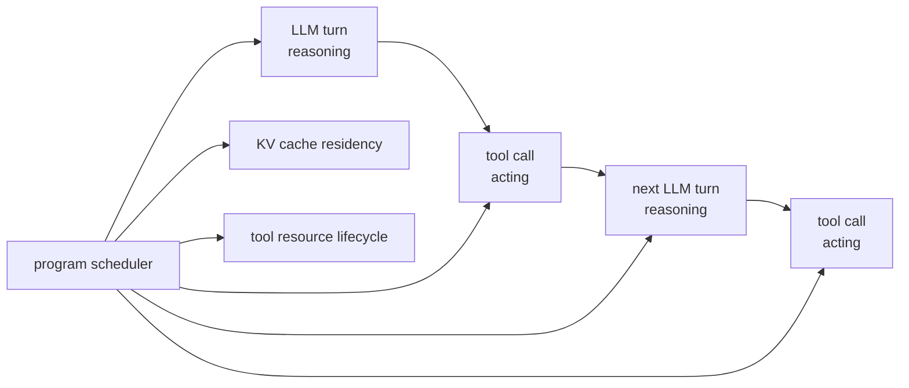

# MLSYS16 · KV Cache：内存管理、前缀复用与 GLM-5.2 IndexShare

KV cache 是推理系统里最常被追问的一层：它决定长上下文 decode 的显存占用、prefix reuse 的收益边界，以及 GLM-5.2 IndexShare 到底共享了什么。

先给结论：

```text
KV cache 省的是重复计算。
PagedAttention 解决的是 KV cache 动态内存管理。
Prefix cache 解决的是不同请求之间的公共前缀复用。
IndexShare / IndexCache 解决的是 DSA sparse attention 里 indexer 重复选 top-k 的成本。
Agent 场景里的 KV cache 问题，核心是多轮 LLM 调用和 tool call 之间的缓存生命周期。
```

它们不是同一个问题，但真实 runtime 会把它们放在同一条 decode 路径里。

## 目录

1. [[#一、为什么 decode 必须有 KV cache]]
2. [[#二、KV cache 里具体存什么]]
3. [[#三、PagedAttention：把 KV cache 当显存页表管理]]
4. [[#四、Prefix cache：同一段 prompt 不要反复 prefill]]
5. [[#五、KV cache 的容量账]]
6. [[#六、Kernel 视角：paged decode attention 怎么读 cache]]
7. [[#七、KV cache 压缩、淘汰与传输]]
8. [[#八、DSA sparse attention：先选 token，再做 attention]]
9. [[#九、GLM-5.2 IndexShare / IndexCache 源码精读]]
10. [[#十、KV cache 与 MTP / speculative decoding]]
11. [[#十一、Agent 场景里的 KV cache：从 prefix cache 到 ThunderAgent]]
12. [[#十二、练习题]]
13. [[#参考资料]]

---

## 一、为什么 decode 必须有 KV cache

Transformer 第 `l` 层 attention 的核心是：

$$
Q_l = X_l W_Q,\quad K_l = X_l W_K,\quad V_l = X_l W_V
$$

自回归 decode 第 `t` 步只新增一个 token。如果没有 KV cache，每一步都要把从 `0` 到 `t` 的 token 重新投影成 K/V：

```text
step 1: recompute K/V for token 0
step 2: recompute K/V for token 0..1
step 3: recompute K/V for token 0..2
...
```

这会把历史 token 的 K/V projection 重复做很多遍。KV cache 的做法是：

```text
prefill:
  一次性算 prompt 所有 token 的 K/V，写入 cache

decode step t:
  只为新 token 算 K/V
  把新 K/V append 到 cache
  当前 query 读取历史 K/V 做 attention
```

所以 decode 的 attention 变成：

```text
q_t attends to cached K[0:t] and V[0:t]
```

注意这个优化没有让 attention 对历史长度免费。每生成一个 token，query 仍然要读越来越长的 K/V。KV cache 只是避免重复生成历史 K/V。

可视化：

```text
without KV cache

step t:
  X[0:t] -> K[0:t], V[0:t]  # repeat projection
  q_t    -> attention

with KV cache

prefill:
  X[0:p] -> KV cache

decode step t:
  x_t -> k_t, v_t -> append
  q_t -> read KV cache[0:t]
```

## 二、KV cache 里具体存什么

普通 MHA 的每层 cache 可以粗略写成：

```text
K cache: [num_tokens, num_kv_heads, head_dim]
V cache: [num_tokens, num_kv_heads, head_dim]
```

如果 batch 里有多个请求，runtime 通常不会真的存成一个规整的 `[batch, max_seq, ...]` 大矩阵，因为每个请求长度不同，而且请求会不断进出。

### MHA / GQA / MQA 的区别

| 结构 | KV heads | cache 体积 | 典型影响 |
|---|---:|---:|---|
| MHA | 等于 query heads | 最大 | attention 表达最完整，但 cache 压力最大 |
| GQA | 少于 query heads | 中等 | Llama 系列常见，cache 大幅下降 |
| MQA | 1 个 KV head | 最小 | cache 最省，但模型结构约束更强 |

单层 KV cache 大小近似：

$$
2 \times T \times H_{kv} \times D \times \text{bytes}
$$

全模型再乘以层数 `L`。`2` 是 K 和 V。

举例：

```text
layers = 80
seq_len = 128K
kv_heads = 8
head_dim = 128
dtype = bf16 = 2 bytes

KV size ~= 2 * 80 * 128K * 8 * 128 * 2
        ~= 40 GB
```

这只是单请求，不含 allocator 碎片、block table、prefix cache、spec decode 候选 token、并发 batch 等额外开销。

### MLA 的 cache 形态

DeepSeek-V2/V3、GLM-5 这类 MLA 结构不直接缓存完整 K/V head，而是缓存低秩 latent KV 和 RoPE 部分。以 ATOM 的 GLM path 为例，主 MLA cache 存的是：

```text
kv_lora_rank + qk_rope_head_dim
```

decode 时再通过矩阵吸收或投影把 query 与 cached latent 结合。这样可以显著降低 KV cache 体积，但 kernel 更复杂。

## 三、PagedAttention：把 KV cache 当显存页表管理

vLLM 的 PagedAttention 借鉴 OS virtual memory。每个请求的逻辑 token 序列被切成固定大小的 block：

```text
request A logical tokens:

[0..15] [16..31] [32..47] [48..]
  blk0    blk1     blk2    blk3

block table:
logical blk0 -> physical block 91
logical blk1 -> physical block 18
logical blk2 -> physical block 37
logical blk3 -> physical block 44
```

这样做解决三个问题：

1. 请求长度动态增长，不需要预分配最大长度。
2. 请求结束后释放 block，显存可以被其他请求复用。
3. 多个请求共享前缀时，可以让 block table 指向同一批 physical blocks，并用引用计数管理。

它的代价是 attention kernel 不能再假设 K/V 在内存里连续。kernel 读第 `j` 个历史 token 时，需要通过 block table 找到物理地址：

```text
logical_token_id -> logical_block_id, offset_in_block
logical_block_id -> physical_block_id
physical_block_id, offset_in_block -> K/V address
```

### PagedAttention 与 contiguous cache 的取舍

| 方案 | 优点 | 代价 |
|---|---|---|
| contiguous cache | kernel 简单，连续读更直接 | 动态长度下容易浪费和碎片化 |
| PagedAttention | 分配灵活，适合 continuous batching | kernel 多一次 block table 间接寻址 |
| vAttention | 保持虚拟地址连续，物理页按需分配 | 依赖 CUDA virtual memory 管理，系统层复杂 |

PagedAttention 不是 attention 数学变了，而是 K/V 的内存布局和访问方式变了。

## 四、Prefix cache：同一段 prompt 不要反复 prefill

很多线上请求有相同前缀：

```text
system prompt
tool definitions
few-shot examples
repo context header
```

如果每个请求都重新 prefill 这些 token，TTFT 会被浪费掉。prefix cache 的做法是把已经算好的 KV block 保留下来，下次新请求命中同样 token 前缀时直接复用。

SGLang 的 RadixAttention 用 radix tree 管理这些前缀：

```text
root
 └── system prompt
      ├── user A history
      └── user B history
```

一个请求进来时：

```text
1. tokenizer 后得到 token ids
2. 在 radix tree 中找最长公共前缀
3. 命中的 KV blocks 增加引用计数
4. 未命中的 suffix 才需要 prefill
```

prefix cache 的正确性要求很严格：

```text
必须是 token-level prefix 完全一致。
同一句文本只要 tokenizer 结果不同，就不能复用同一段 KV。
```

它也会改变 scheduler。高命中率请求应该尽量被路由到已有 cache 的 worker；否则 cache 在另一个 worker 上，仍然要重新 prefill 或跨机传输 KV。

## 五、KV cache 的容量账

推理系统经常看起来是算力问题，最后却卡在 KV 容量上。

一个实用估算：

```text
KV bytes = 2 * layers * tokens * kv_heads * head_dim * bytes_per_element
```

更工程化的并发账可以写成：

```text
bytes_per_token = 2 * layers * kv_heads * head_dim * bytes_per_element
kv_cache_per_session = bytes_per_token * cached_tokens

max_sessions ~= (gpu_memory - model_weights - runtime_overhead)
                / kv_cache_per_session
```

这个 `max_sessions` 只能当上限。真实 serving 还要扣掉 activations、workspace、communication buffer、allocator reserve、PagedAttention metadata、sampler/logits buffer、tokenizer/runtime 开销和安全余量。

对 MLA，可以换成：

```text
MLA KV bytes = layers * tokens * (kv_lora_rank + qk_rope_head_dim) * bytes_per_element
```

这里没有乘 `2`，因为 cache 形态已经把 latent KV 和 RoPE 部分合在一起。不同实现会有 padding、scale、block metadata，需要看具体 runtime。

### 为什么长上下文下 KV cache 比权重更麻烦

权重大小是固定的：

```text
model weights: fixed
```

KV cache 随并发和上下文长度增长：

```text
KV cache ~= active_requests * sequence_length
```

所以同一张卡上能跑多大 batch，常常由 KV cache 决定，而不是由权重决定。

GQA/MQA 的收益也应该按这个公式理解：它们不是让 attention 不读历史，而是把 `kv_heads` 变小。比如 query heads 仍然是 32，但 KV heads 从 32 降到 8，单 token KV cache 就直接降到四分之一；如果同时把 context 从 4K 拉到 8K，cache 仍可能比原来的 MHA 4K 更小。

## 六、Kernel 视角：paged decode attention 怎么读 cache

一个简化的 paged decode attention kernel 可以理解成：

```python
def paged_decode_attention(q, block_table, k_cache, v_cache, seq_len):
    scores = []
    for token_id in range(seq_len):
        logical_block = token_id // BLOCK_SIZE
        offset = token_id % BLOCK_SIZE
        physical_block = block_table[logical_block]

        k = k_cache[physical_block, offset]
        score = dot(q, k)
        scores.append(score)

    probs = softmax(scores)

    out = 0
    for token_id in range(seq_len):
        logical_block = token_id // BLOCK_SIZE
        offset = token_id % BLOCK_SIZE
        physical_block = block_table[logical_block]
        v = v_cache[physical_block, offset]
        out += probs[token_id] * v

    return out
```

真实 kernel 会做这些优化：

- 一个 CTA 处理一个或多个 query head。
- K/V 以 vectorized load 读取，尽量 coalesced。
- 对长上下文分块做 online softmax，避免保存完整 score 向量。
- block table、sequence length、slot mapping 都来自 runtime metadata。
- CUDA graph 要求 batch shape 稳定，因此 runtime 常把请求 padding 到固定 capture size。

这解释了为什么 FlashAttention、FlashInfer、vLLM paged kernel 不是简单替换关系。它们都在处理 attention，但输入布局、metadata、batch 动态性不同。

### 6.1 Triton sketch：paged KV gather

下面这个 kernel 不是完整 attention，只展示 paged KV cache 最容易写错的一层：logical token position 需要先查 block table，再映射到 physical KV block。

```python
import triton
import triton.language as tl


@triton.jit
def paged_k_gather_kernel(
    q_ptr,              # [num_heads, head_dim]
    k_cache_ptr,        # [num_blocks, block_size, num_kv_heads, head_dim]
    block_table_ptr,    # [max_blocks_per_seq]
    out_scores_ptr,     # [seq_len]
    seq_len: tl.constexpr,
    block_size: tl.constexpr,
    head_dim: tl.constexpr,
    kv_heads: tl.constexpr,
    BLOCK_M: tl.constexpr,
    BLOCK_D: tl.constexpr,
):
    pid_m = tl.program_id(0)
    offs_m = pid_m * BLOCK_M + tl.arange(0, BLOCK_M)
    offs_d = tl.arange(0, BLOCK_D)

    logical_block = offs_m // block_size
    block_offset = offs_m % block_size
    physical_block = tl.load(block_table_ptr + logical_block, mask=offs_m < seq_len, other=0)

    # 这里只写单 query head -> 单 kv head 的情况，GQA 需要额外做 head mapping。
    k_offsets = (
        ((physical_block * block_size + block_offset) * kv_heads * head_dim)
        + offs_d[None, :]
    )
    q = tl.load(q_ptr + offs_d, mask=offs_d < head_dim, other=0.0)
    k = tl.load(k_cache_ptr + k_offsets, mask=(offs_m[:, None] < seq_len) & (offs_d[None, :] < head_dim), other=0.0)

    score = tl.sum(k * q[None, :], axis=1)
    tl.store(out_scores_ptr + offs_m, score, mask=offs_m < seq_len)
```

生产 kernel 会把这个 gather、online softmax、V aggregation 融在一起。这里拆开写，是为了看清楚 PagedAttention 的核心代价：每个 tile 多一次 `block_table` 间接寻址。

### 6.2 Triton sketch：DSA sparse indices gather

DSA / IndexShare 的 sparse decode 还会多一层 `paged_kv_indices`。它不是按 `0..seq_len` 顺序扫历史，而是按 indexer 选出的 top-k paged indices 读 K/V。

```python
@triton.jit
def sparse_k_gather_kernel(
    q_ptr,                 # [head_dim]
    k_cache_ptr,           # paged KV cache storage
    paged_kv_indices_ptr,  # [topk]
    out_scores_ptr,        # [topk]
    topk: tl.constexpr,
    head_dim: tl.constexpr,
    BLOCK_K: tl.constexpr,
    BLOCK_D: tl.constexpr,
):
    pid_k = tl.program_id(0)
    offs_k = pid_k * BLOCK_K + tl.arange(0, BLOCK_K)
    offs_d = tl.arange(0, BLOCK_D)

    kv_index = tl.load(paged_kv_indices_ptr + offs_k, mask=offs_k < topk, other=0)
    k_offsets = kv_index[:, None] * head_dim + offs_d[None, :]

    q = tl.load(q_ptr + offs_d, mask=offs_d < head_dim, other=0.0)
    k = tl.load(k_cache_ptr + k_offsets, mask=(offs_k[:, None] < topk) & (offs_d[None, :] < head_dim), other=0.0)

    score = tl.sum(k * q[None, :], axis=1)
    tl.store(out_scores_ptr + offs_k, score, mask=offs_k < topk)
```

这个 sketch 对应 ATOM/vLLM 路径里的 `paged_kv_indices` buffer。Full layer 写入新的 indices；shared layer 跳过 indexer，继续读同一批 indices。实际实现还要处理 batch indptr、last page length、head mapping、FP8 scale、causal mask 和 online softmax。

## 七、KV cache 压缩、淘汰与传输

先区分两类问题：

```text
exact memory management:
  不改变模型看到的 KV 内容，只改变显存分配、复用、搬运方式

approximate cache reduction:
  少存、少读或压缩部分 KV，通常会引入精度/召回风险
```

PagedAttention、prefix cache、vAttention 更接近第一类；StreamingLLM、H2O、SnapKV、PyramidKV、Quest、DuoAttention 更接近第二类。两类方法可以叠加，但系统风险完全不同：exact 方法主要怕碎片、并发和调度；approximate 方法还要证明任务精度不崩。

### 1. 更小的结构

GQA、MQA、MLA 直接减少每个 token 需要缓存的向量维度。

### 2. 低精度 KV

FP8 KV cache 可以减半显存，但要处理 scale、quantization error、kernel 支持。对长上下文，K 的误差会影响 attention score，V 的误差会影响 value aggregation。

### 3. 淘汰或稀疏保留

StreamingLLM、H2O、SnapKV 这类方法都在回答同一个问题：

```text
如果 cache budget 不够，哪些历史 token 最值得留下？
```

关键差异在于“重要性”怎么定义：

| 方法 | 保留策略 | 粒度 | 是否训练 | 适合场景 | 主要风险 |
|---|---|---|---|---|---|
| Scissorhands | 历史上重要的 token 未来仍重要，按 persistence 采样/保留 | token | 否 | 固定 budget 的通用 KV 压缩 | 早期误判会持续影响后续 |
| H2O | heavy hitter token + recent token | token | 否 | decode 过程中动态淘汰 KV | attention score 历史统计不一定等于未来 query 需要 |
| StreamingLLM | attention sinks + sliding window | token | 否 | 无限 streaming / 长对话持续生成 | 不适合需要任意远距离精确 retrieval 的任务 |
| SnapKV | prefill 后用 observation window 估计每个 head 的重要 positions | head × token | 否 | 长 prompt prefill 后进入 decode | prompt 后半段估计可能不覆盖后续 query |
| PyramidKV | lower layers 保留更多 KV，higher layers 保留更少 KV | layer × token | 否 | 层间信息聚合明显的长上下文模型 | layer budget 需要校准，不是所有模型都同样适配 |
| Quest | 用当前 query 估计哪些 KV page 重要，只加载 top pages | page | 否 | 主要瓶颈是 decode 读 KV 的 HBM bandwidth | 需要 page-level min/max metadata 和 sparse page kernel |
| DuoAttention | retrieval heads 保留 full KV，streaming heads 用短 cache | head | 轻量校准 | 有明显 retrieval/streaming head 分工的模型 | 需要识别 head 类型，模型迁移要重新校准 |

这个表的核心判断：

```text
StreamingLLM / H2O / SnapKV / PyramidKV:
  减少“存多少 KV”

Quest:
  KV 可以还在，但减少“每步读多少 KV page”

DuoAttention:
  把“哪些 head 需要 full KV”变成校准问题
```

这些方法能省显存或 HBM 读流量，但通常不再是严格等价推理。回答系统设计题时要把 exact 和 approximate 分开：

```text
PagedAttention / prefix cache 是 exact memory management。
KV eviction / compression 通常是近似方法，除非只是无损编码或纯 dtype 改写。
```

### 3.1 StreamingLLM vs H2O：为什么不是同一种淘汰

StreamingLLM 的关键观察是 attention sink：模型即使在很长序列里，也会持续把一部分 attention 分给开头几个 token。它的 cache 结构通常是：

```text
[sink tokens] + [recent sliding window]
```

它适合“持续对话/流式生成”，目标是让模型在超过训练长度或服务长度时不崩。H2O 的核心是 heavy hitter oracle：历史 attention 里累计贡献大的 token 更可能继续重要，因此保留 heavy hitters 加最近 token。它更像在线 cache eviction policy。

| 维度 | StreamingLLM | H2O |
|---|---|---|
| 保留对象 | attention sink + recent window | heavy hitters + recent window |
| 重要性来源 | sink phenomenon + recency | accumulated attention contribution |
| 更像什么 | streaming stability policy | online KV eviction policy |
| 长距离检索 | 弱，除非答案在 sink/recent | 取决于 heavy hitter 是否捕捉到相关 token |

### 3.2 SnapKV / PyramidKV / Quest：从 token 到 layer/page

SnapKV、PyramidKV、Quest 的共同点是把“保留重要 token”做得更结构化：

```text
SnapKV:
  per-head observation window -> select compressed KV positions

PyramidKV:
  lower layers need wider information flow
  higher layers can use smaller cache budget

Quest:
  store page metadata
  current query estimates top-K critical KV pages
  sparse attention only loads selected pages
```

这三者对应三个系统粒度：

| 粒度 | 代表 | 系统含义 |
|---|---|---|
| head × token | SnapKV | 不同 head 的重要 token 不同 |
| layer × token | PyramidKV | 不同层的 cache budget 不该一样 |
| page × query | Quest | decode 时最贵的是从 HBM 读 KV page |

### 4. 跨机传输和持久化

CacheGen、LMCache 这类工作不直接决定“保留哪个 token”，而是把 KV cache 当成跨请求、跨节点、跨会话的系统资源。它们关注的问题是：

```text
prefill 很贵，但 KV 也很大。
复用 KV 是否比重算更划算，取决于网络带宽、压缩率、加载时机和命中率。
```

实际系统常用的判断顺序：

1. 先用 prefix cache / routing 提高本地命中。
2. 本地显存不够时，考虑 CPU/NVMe/off-node KV tier。
3. 只有当传输压缩后的 KV 比重算便宜，才跨节点拉 KV。
4. 对 agent 多轮会话，session-aware routing 往往比盲目远程拉 cache 更稳。

## 八、DSA sparse attention：先选 token，再做 attention

DeepSeek Sparse Attention 和 GLM-5 的 DSA 不再让每层 attention 对所有历史 token 做完整 attention。它加了一个轻量 indexer：

```text
hidden/query -> indexer -> top-k token indices
top-k token indices -> sparse MLA attention
```

标准 DSA 每层都做：

```text
for layer in layers:
  indices = indexer_l(query_l, cached_keys_l)
  output = sparse_attention_l(query_l, KV_l, indices)
```

indexer 比主 attention 便宜，但它仍然要对长上下文打分并做 top-k。上下文到 200K、1M 后，这个成本不可忽略。

IndexCache 论文的观察是：

```text
相邻层选出来的 top-k token 很像。
如果一组层都在看差不多的历史 token，就没必要每层都重新跑 indexer。
```

于是把层分成两类：

```text
F = Full layer：运行自己的 indexer，产生新的 top-k indices
S = Shared layer：不运行 indexer，复用前一个 F layer 的 top-k indices
```

可视化：

```text
standard DSA

L0: indexer -> indices0 -> sparse attention
L1: indexer -> indices1 -> sparse attention
L2: indexer -> indices2 -> sparse attention
L3: indexer -> indices3 -> sparse attention

IndexShare / IndexCache

L0: indexer -> indices0 -> sparse attention
L1: reuse indices0 -> sparse attention
L2: reuse indices0 -> sparse attention
L3: reuse indices0 -> sparse attention
L4: indexer -> indices4 -> sparse attention
```

重要区别：

```text
共享的是 selected token indices，不是共享每层的主 KV cache。
每层 attention 仍然有自己的 hidden state、projection、MLP、residual。
```

## 九、GLM-5.2 IndexShare / IndexCache 源码精读

IndexShare 每 4 个 sparse attention layer 共享一个轻量 indexer，1M context 下 per-token FLOPs 降低 2.9 倍。论文名是 IndexCache，方法名强调 cross-layer index reuse。

### 1. Transformers reference path

Hugging Face Transformers 里的 `glm_moe_dsa` config 直接暴露 per-layer schedule：

```python
indexer_types = ["full", "shared", "shared", "shared", ...]
```

核心逻辑：

```python
self.skip_topk = config.indexer_types[layer_idx] == "shared"
self.indexer = None if self.skip_topk else GlmMoeDsaIndexer(config, layer_idx)
```

forward 时：

```python
if self.indexer is not None:
    topk_indices = self.indexer(...)
else:
    topk_indices = prev_topk_indices
```

模型主循环维护一个 `topk_indices` 变量：

```python
topk_indices = None
for decoder_layer in self.layers:
    hidden_states, topk_indices = decoder_layer(
        hidden_states,
        prev_topk_indices=topk_indices,
    )
```

所以 `shared` 层没有自己的 indexer 权重，也不会产生新的 indices。它拿上一层 Full indexer 的结果继续跑 sparse attention。

### 2. ATOM / vLLM serving path

ATOM 的 GLM-5.2 recipe 明确写了：

```text
"full" attention layers compute DSA indexer.
"shared" layers reuse previous full layer.
shared layers carry no indexer weights.
```

对应源码有三个关键点。

第一，`_should_skip_index_topk` 根据 config 决定是否跳过 top-k：

```python
if indexer_types[layer_id] == "shared":
    return True
```

它还处理 MTP layer：

```python
if layer_id >= num_hidden_layers and index_share_for_mtp_iteration:
    return True
```

第二，`_indexer_weights_shared` 让 shared 层不构建 indexer 参数：

```python
if indexer_types[layer_id] == "shared":
    self.indexer = None
```

第三，vLLM plugin 会注册 indexer cache，让 vLLM 的 KV cache allocator 给 indexer cache 分配显存：

```python
AttentionLayerBase.register(DeepseekV32IndexerCache)
vllm_sfc[prefix] = module
```

这是容易漏掉的系统细节：DSA 除了主 MLA KV cache，还需要 indexer 的 key cache。ATOM recipe 也建议 GLM-5.2 用 `--kv_cache_dtype bf16`，并把 `--gpu-memory-utilization` 设到 `0.8` 左右，给 DSA index cache 留空间。

### 3. indexer 怎么把 top-k 交给 sparse MLA kernel

ATOM/vLLM sparse MLA metadata builder 会分配一块 buffer：

```python
self.paged_kv_indices = torch.zeros(
    [max_num_batched_tokens * topk_tokens],
    dtype=torch.int32,
    device=device,
)
```

然后把同一块 buffer 绑定给 indexer 和 sparse attention：

```python
indexer.sparse_kv_indices_buffer = self.paged_kv_indices
sparse_attn.sparse_kv_indices_buffer = self.paged_kv_indices
```

indexer forward 做三件事：

```text
1. 把当前 token 的 indexer K 写进 indexer cache
2. 对历史 indexer K 做 FP8 MQA logits
3. top-k 后把 request-local indices 转成 paged global indices
```

最后写入：

```text
sparse_kv_indices_buffer / paged_kv_indices
```

sparse MLA decode kernel 再读：

```python
mla_decode_fwd(
    q,
    kv_buffer,
    output,
    qo_indptr,
    paged_kv_indptr,
    paged_kv_indices,
    paged_kv_last_page_len,
    ...
)
```

也就是说，IndexShare 在 serving 里的真实数据流是：

```text
Full layer:
  hidden -> indexer -> top-k local indices
  local indices -> paged global indices
  write paged_kv_indices
  sparse MLA reads paged_kv_indices

Shared layer:
  skip indexer
  sparse MLA reads reused paged_kv_indices
```

### 4. 为什么不能简单“每 4 层固定共享”就完事

IndexCache 论文给了两个版本：

| 版本 | 做法 | 适用场景 |
|---|---|---|
| training-free | 冻结模型，用校准集 LM loss 贪心搜索哪些层保留 indexer | 已有 DSA 模型快速改造 |
| training-aware | retained indexer 用 multi-layer distillation 同时服务多层 | 从训练中就让 indexer 适应共享 |

GLM-5.2 是训练中引入 IndexShare，并从 mid-training 的 128K sequence length 开始训练。这比事后硬改 schedule 更稳。

关键负结果：

```text
只看 top-k overlap 或 attention output similarity，不足以找到最优 sharing pattern。
最终质量要看 end-to-end LM loss 或下游任务。
```

原因是 shared 层如果漏掉少量关键 token，误差会沿后续层传播。早期层尤其敏感。

## 十、KV cache 与 MTP / speculative decoding

speculative decoding 会让一次 target verify 接受多个 token。runtime 因此要处理：

```text
decode query length > 1
candidate tokens 的 temporary KV
accepted token 的 KV commit
rejected suffix 的 rollback
```

GLM-5.2 的 MTP 还把 IndexShare 用到 MTP layer。关键点是：

```text
MTP 第一步运行 indexer。
后续 MTP step 复用第一步的 top-k indices。
KV cache 只保留来自 target model hidden states 的 kv1:4。
训练时复用第一步的 KV cache 和 top-k indices。
```

这样做有两个目的：

1. MTP draft 成本更低。
2. 减少训练和推理不一致。否则后续 MTP step 的 KV 会混入 MTP 自己生成的 hidden states。

ATOM 的 indexer metadata 里也能看到多 token decode 的处理：如果 `max_decode_len > 1`，它会把 multi-token decode request 展平成多个 single-token batch entry，再构造对应的 seq_lens 和 block table。这样底层 paged MQA logits / top-k kernel 仍然能按统一接口跑。

## 十一、Agent 场景里的 KV cache：从 prefix cache 到 ThunderAgent

普通 chat serving 里，一个 request 大致是：

```text
prefill prompt -> decode answer -> finish
```

Agent serving 不是这样。一个 coding agent / browser agent / scientific workflow 通常是：

```text
LLM turn 1 -> tool call -> LLM turn 2 -> tool call -> LLM turn 3 -> ...
```

每次 LLM turn 都会带上越来越长的 trajectory：

```text
system prompt
task description
previous reasoning
tool command
tool output
new instruction
```

这让 KV cache 从“单次请求的加速结构”变成“整个 agent program 的状态”。如果 runtime 只按 request 调度，它只能看到一段段独立 LLM call，看不到这些 call 属于同一个 agent workflow。

### 11.1 Agent 为什么容易把 KV cache 打爆

Agent workload 有三个特点：

| 特点 | 对 KV cache 的影响 |
|---|---|
| 多轮调用 | 每一轮都想复用前面 trajectory 的 KV |
| tool call 间隔 | GPU 上的 KV blocks 可能在等 `pytest`、`docker exec`、`curl`，不产生 token |
| context 快速增长 | 每次工具输出都会增加后续 prefill/decode 的 cache footprint |

这会产生一个矛盾：

```text
保留 KV:
  下一轮 LLM turn 命中 cache，少做 re-prefill
  但 tool execution 期间 KV 占着 HBM 不产出 token

释放 KV:
  HBM 给别的 active request 用
  但 tool 返回后要重新 prefill 整段 trajectory
```

在 agent 场景里，KV cache hit rate 本身不是唯一目标。一个长时间跑工具的 program 即使命中率很高，也可能把大量 HBM 闲置住，降低整体 throughput。

### 11.2 Prefix cache 只能解决一部分问题

Prefix cache 对 agent 有用，但边界很清楚：

```text
能解决:
  多个 agent 共享 system prompt / repo summary / task prefix
  同一个 agent 下一轮复用上一轮完整 trajectory prefix

解决不了:
  tool call 期间 KV 是否继续占 HBM
  多个 agent workflow 在不同 GPU 节点上的 memory imbalance
  Docker sandbox、network port、workspace disk 这些 tool resource 的生命周期
```

因此 agent infra 需要比 prefix cache 更高一层的抽象：把一串 LLM turns 和 tool calls 当成一个 program 来调度。

### 11.3 ThunderAgent 的 program abstraction

ThunderAgent 把 agentic workflow 抽象成 LLM Program。一个 program 不是单次 HTTP request，而是跨多次 model invocation 和 tool execution 的调度单元。

Program 需要跟踪：

```text
program_id
phase: reasoning / acting
status: active / paused
total tokens / context length
KV cache footprint
tool resources: docker sandbox, disk state, network ports
```

数据流可以画成：



这个抽象让 scheduler 能做 request-level router 做不到的判断：

```text
这个 program 当前在 reasoning，马上需要 GPU。
那个 program 当前在 acting，可能在等测试跑完。
如果 HBM 紧张，优先暂停 acting program，释放它的 KV。
如果 tool 很快返回，保留 KV 可能更划算。
如果 tool 已经等很久，继续 pin KV 可能只是浪费 HBM。
```

### 11.4 ThunderAgent 的调度逻辑

ThunderAgent 的核心是 program-aware scheduler。它不是简单“永远保留 agent KV”，而是在 caching cost 和 recomputation cost 之间做权衡。

```text
Restore:
  把 paused program 放回 active execution
  选择有容量的 backend

Pause:
  把 active program 暂停
  解绑 backend
  允许释放或重建它的 KV cache
```

当某个 DP backend 的 program KV demand 超过 capacity 时，scheduler 触发 thrashing detection：

```text
if sum(active_program_kv_tokens) > backend_token_capacity:
  pause some programs
```

它优先在 tool boundary 暂停 acting programs，因为这时候没有正在 decode 的 token，不需要打断一次 forward。Dynamo 的 ThunderAgent router 文档也把这个点讲得很直接：agent workload 是很多短 LLM call，中间夹 `docker exec`、`pytest`、`curl` 等非 GPU 工作；request-level router 看不到这些 turn 属于同一个 agent，所以无法在自然 pause point 做 backpressure。

ThunderAgent 还用了 time-decay 直觉：

```text
tool 刚开始:
  可能很快返回，保留 KV 以避免 re-prefill

tool 等很久:
  KV 长时间占 HBM 不产 token
  降低这个 program 的 cache priority
```

这比固定 TTL 更合理。固定 TTL 只看时间阈值，不知道 program 的 context length、phase 和 backend memory pressure。

### 11.5 跨节点 memory imbalance

多 GPU / 多节点 serving 里，KV-aware routing 常见策略是：

```text
同一个 session 尽量回到之前的 GPU
因为那台 GPU 上可能还有它的 KV cache
```

这能提高 locality，但 agent 场景里会出现另一种问题：某些 workflow context 长得很快，固定回同一台 GPU 后，一个节点满了，其他节点还有空。

ThunderAgent 的处理是 global program-aware waiting queue：

```text
active program:
  保留 locality，尽量少重算

paused program:
  KV 已经被释放或可重建
  restore 时可以放到任何有容量的 backend
```

这里的判断很重要：一旦 program 已经 paused，它的 KV locality 价值下降，调度目标应该转向 memory balance 和吞吐。

### 11.6 Tool resource 也是 cache lifecycle 的一部分

Agent 的状态不止 KV cache。一个 coding agent 可能持有：

```text
Docker container
workspace directory
pytest process
local server port
browser session
temporary files
```

如果只优化 KV cache，不管理 tool resource，长时间 rollout 会出现 disk leak、port leak、sandbox 堆积。ThunderAgent 把 tool resources 放进 program lifecycle：program terminate 后立即回收；下一步需要 tool 环境时，可以在 LLM reasoning 期间异步准备环境。

这对 RL rollout 很重要。agentic RL 里 rollout 通常占 wall-clock 的大头，GPU 之外的 sandbox 和工具准备会直接影响样本吞吐。

### 11.7 和 LMCache / KV offload 的关系

ThunderAgent 不是替代 LMCache、PagedAttention、prefix cache。它更像上层 scheduler：

| 层 | 解决的问题 |
|---|---|
| PagedAttention | 单个 engine 内的 KV block 分配 |
| Prefix cache | 相同 token prefix 的 KV 复用 |
| LMCache / CacheGen | 跨 engine、CPU、存储、网络的 KV 移动和持久化 |
| ThunderAgent | agent program 级别决定何时保留、暂停、恢复、迁移 KV 和 tool resources |

理解方式：

```text
PagedAttention 是页表。
LMCache 是 KV 的存储和传输层。
ThunderAgent 是知道 agent workflow 的调度层。
```

一个比较完整的 agent serving stack 会把它们组合起来：

```text
program scheduler
  -> decide active / paused / migrated programs

KV cache layer
  -> store, lookup, move, evict KV blocks

LLM engine
  -> prefill / decode / verify

tool manager
  -> prepare, reuse, garbage collect sandboxes and ports
```

### 11.8 Agent KV cache 的回答框架

问：agent workload 里 KV cache 为什么比普通 chat 更难管理？

```text
普通 chat:
  request 连续占用 GPU，结束后释放

agent:
  LLM turns 和 tool calls 交替
  tool call 期间 KV 占 HBM 但不产 token
  下一轮又希望复用 KV，避免整段 trajectory re-prefill
```

问：为什么只做 KV-aware routing 不够？

```text
KV-aware routing 追求 locality。
agent context 长度增长不均匀，固定回同一节点会造成 memory imbalance。
当 program paused 后，KV locality 已经不再是最高优先级，restore 应该考虑全局容量。
```

问：ThunderAgent 的核心抽象是什么？

```text
LLM Program。
它把多次 LLM request、tool call、KV footprint 和 tool resources 放进同一个生命周期里调度。
```

## 十二、练习题

<details class="exercise">
<summary><span class="q-label">Q1</span> <span class="q-text">KV cache 降低了什么复杂度？</span></summary>

它避免重复计算历史 token 的 K/V projection。decode 每步仍然要让当前 query 读历史 K/V，所以 attention 的历史读流量仍随 sequence length 增长。

</details>

<details class="exercise">
<summary><span class="q-label">Q2</span> <span class="q-text">为什么 PagedAttention 能提高吞吐？</span></summary>

它减少 KV cache 内存浪费，让同样显存容纳更多活跃请求。吞吐提升主要来自更大 effective batch 和更少碎片，不是 attention 数学更快。

</details>

<details class="exercise">
<summary><span class="q-label">Q3</span> <span class="q-text">Prefix cache 和 PagedAttention 有什么区别？</span></summary>

PagedAttention 管理单个或多个请求的 KV block 分配。prefix cache 判断不同请求是否有相同 token 前缀，并复用已经算好的 KV blocks。

</details>

<details class="exercise">
<summary><span class="q-label">Q4</span> <span class="q-text">为什么 prefix cache 必须按 token 匹配？</span></summary>

模型看到的是 token ids 和 positions。文本看起来一样不代表 tokenization 一样；position、RoPE offset、chat template 差异也会让 KV 不可复用。

</details>

<details class="exercise">
<summary><span class="q-label">Q5</span> <span class="q-text">GQA/MQA 为什么能省 KV cache？</span></summary>

它减少 KV heads。query heads 可以多，KV heads 可以少，多个 query heads 共享同一组 K/V。

</details>

<details class="exercise">
<summary><span class="q-label">Q6</span> <span class="q-text">MLA cache 和普通 KV cache 的差别？</span></summary>

普通 cache 存每个 KV head 的 K/V。MLA 存低秩 latent KV 和 RoPE slice，decode 时通过吸收或投影恢复 attention 所需计算。

</details>

<details class="exercise">
<summary><span class="q-label">Q7</span> <span class="q-text">IndexShare 共享的是 KV cache 吗？</span></summary>

不是。它共享 DSA indexer 选出的 top-k token indices。主 MLA KV cache 仍按层维护；shared 层只是跳过自己的 indexer forward。

</details>

<details class="exercise">
<summary><span class="q-label">Q8</span> <span class="q-text">IndexShare 为什么对 1M context 特别有用？</span></summary>

DSA indexer 仍要对长上下文打分并 top-k。context 越长，indexer 成本越明显。跨层复用 indices 后，多数层可以跳过这段成本。

</details>

<details class="exercise">
<summary><span class="q-label">Q9</span> <span class="q-text">IndexShare 的风险是什么？</span></summary>

某些层可能确实需要不同 token。简单均匀共享可能伤质量，所以 IndexCache 论文用校准集 loss 搜索 pattern，或者在训练中用 multi-layer distillation 让 retained indexer 服务多层。

</details>

<details class="exercise">
<summary><span class="q-label">Q10</span> <span class="q-text">KV cache 量化为什么不总是免费收益？</span></summary>

低精度会影响 attention score 或 value aggregation，还需要 scale 存储和支持对应 dtype 的 kernel。长上下文和 retrieval 任务对误差更敏感。

</details>

<details class="exercise">
<summary><span class="q-label">Q11</span> <span class="q-text">spec decode 为什么会让 KV cache 管理更复杂？</span></summary>

候选 token 可能被拒绝。runtime 需要区分临时 KV、已接受 KV 和需要回滚的 KV，还要让 verify forward 支持多 token query。

</details>

<details class="exercise">
<summary><span class="q-label">Q12</span> <span class="q-text">如何一句话解释 GLM-5.2 IndexShare？</span></summary>

GLM-5.2 在 DSA sparse attention 中让一组连续层复用同一个 Full layer 的 top-k sparse indices，shared 层不再运行自己的 indexer，从而降低长上下文下 indexer dot product 和 top-k 的重复成本。

</details>

<details class="exercise">
<summary><span class="q-label">Q13</span> <span class="q-text">StreamingLLM 和 H2O 的区别是什么？</span></summary>

StreamingLLM 固定保留 attention sinks 和最近窗口，目标是让长流式生成稳定；H2O 根据历史 attention 累计贡献保留 heavy hitter token 和最近 token，更像在线 KV eviction。前者强调 sink phenomenon，后者强调 heavy-hitter persistence。

</details>

<details class="exercise">
<summary><span class="q-label">Q14</span> <span class="q-text">Quest 为什么是 page-level 方法，而不是普通 token eviction？</span></summary>

Quest 的目标是减少 decode 时从 HBM 读取 KV 的流量。它给 KV page 维护 metadata，用当前 query 估计哪些 pages 重要，只加载 top pages 做 attention。KV 可以仍然存在，省的是每步读全量 KV page 的带宽。

</details>

<details class="exercise">
<summary><span class="q-label">Q15</span> <span class="q-text">DuoAttention 为什么按 head 分 full cache 和 streaming cache？</span></summary>

因为不同 attention head 的功能不同。retrieval heads 负责远距离信息检索，需要 full KV；streaming heads 主要看 attention sinks 和最近 token，可以用常数长度 cache。这样比对所有 head 做同一种 eviction 更细。

</details>

## 参考资料

- [Attention Is All You Need](https://arxiv.org/abs/1706.03762)
- [Efficient Memory Management for Large Language Model Serving with PagedAttention](https://arxiv.org/abs/2309.06180)
- [vLLM PagedAttention design doc](https://docs.vllm.ai/en/latest/design/paged_attention/)
- [Orca: A Distributed Serving System for Transformer-Based Generative Models](https://www.usenix.org/conference/osdi22/presentation/yu)
- [Sarathi-Serve: Taming Throughput-Latency Tradeoff in LLM Inference](https://www.usenix.org/conference/osdi24/presentation/agrawal)
- [DistServe: Disaggregating Prefill and Decoding](https://www.usenix.org/conference/osdi24/presentation/zhong-yinmin)
- [SGLang: Efficient Execution of Structured Language Model Programs](https://arxiv.org/abs/2312.07104)
- [FlashInfer: Efficient and Customizable Attention Engine for LLM Inference Serving](https://arxiv.org/abs/2501.01005)
- [vAttention: Dynamic Memory Management for Serving LLMs without PagedAttention](https://arxiv.org/abs/2405.04437)
- [H2O: Heavy-Hitter Oracle for Efficient Generative Inference](https://arxiv.org/abs/2306.14048)
- [StreamingLLM: Efficient Streaming Language Models with Attention Sinks](https://arxiv.org/abs/2309.17453)
- [Scissorhands: Exploiting the Persistence of Importance Hypothesis for LLM KV Cache Compression](https://arxiv.org/abs/2305.17118)
- [SnapKV: LLM Knows What You are Looking for Before Generation](https://arxiv.org/abs/2404.14469)
- [PyramidKV: Dynamic KV Cache Compression based on Pyramidal Information Funneling](https://arxiv.org/abs/2406.02069)
- [Quest: Query-Aware Sparsity for Efficient Long-Context LLM Inference](https://arxiv.org/abs/2406.10774)
- [DuoAttention: Efficient Long-Context LLM Inference with Retrieval and Streaming Heads](https://arxiv.org/abs/2410.10819)
- [CacheGen: KV Cache Compression and Streaming for Fast LLM Serving](https://arxiv.org/abs/2310.07240)
- [IndexCache: Accelerating Sparse Attention via Cross-Layer Index Reuse](https://arxiv.org/abs/2603.12201)
- [GLM-5.2 official blog](https://huggingface.co/blog/zai-org/glm-52-blog)
- [GLM-5 official repository](https://github.com/zai-org/GLM-5)
- [ATOM GLM-5 recipe](https://github.com/ROCm/ATOM/blob/main/recipes/GLM-5.md)
- [ThunderAgent: A Simple, Fast and Program-Aware Agentic Inference System](https://arxiv.org/abs/2602.13692)
- [ThunderAgent Program Scheduler in NVIDIA Dynamo](https://docs.nvidia.com/dynamo/dev/user-guides/agents/thunder-agent-program-scheduler)
- [ThunderAgent GitHub repository](https://github.com/ThunderAgent-org/ThunderAgent)
- [LMCache: An Efficient KV Cache Layer for Enterprise-Scale LLM Inference](https://arxiv.org/abs/2510.09665)
