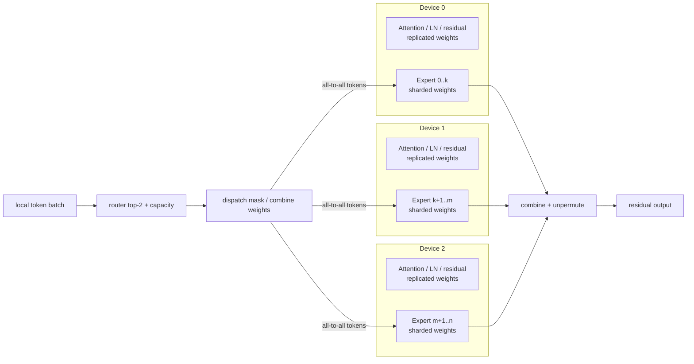
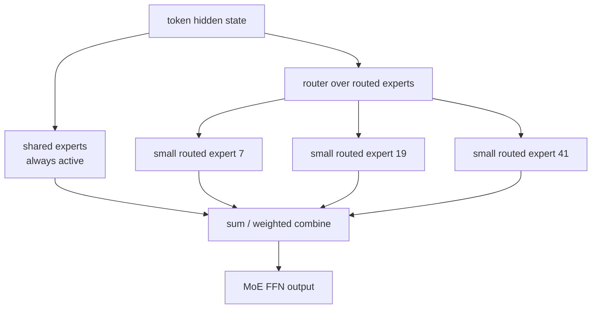

# MLSYS18 · MoE Systems: Routing, Communication, and Kernels

The core capability of modern LLM MoE is not simply "having many parameters," but rather using sparse activation to decouple the scheduling of capacity, FLOPs, communication, and kernel utilization. Learning objectives:

```text
Why can MoE scale parameter counts without scaling FLOPs at the same ratio?
What problems do router / capacity / load balance actually introduce in a system?
Why are fine-grained sparse MoEs like DeepSeekMoE, Kimi K2, and Qwen3-Next difficult to train and run?
What kernel bottleneck does SonicMoE solve?
```

Core conclusion:

> The essence of MoE is replacing dense FFNs with sparse activated experts. Algorithmically, this is top-k routing; systemically, it is a comprehensive optimization problem involving token dispatch, expert parallel all-to-all, grouped GEMM, activation memory, load imbalance, and padding waste.

---

## Table of Contents

1. [[#I. What part of the Transformer does MoE actually replace]]
2. [[#II. Router, top-k, capacity, and load balance]]
3. [[#III. From GShard / Switch to DeepSeekMoE]]
4. [[#IV. System bottlenecks of modern MoE]]
5. [[#V. Why fine-grained sparse MoE is more difficult]]
6. [[#VI. What SonicMoE solves]]
7. [[#VII. Understanding MoE forward at the code level]]
8. [[#VIII. System scheduling layer: MoE is not just a single-GPU kernel problem]]
9. [[#IX. Engineering checklist for training and serving]]
10. [[#X. Exercises]]
11. [[#References]]

---

## I. What part of the Transformer does MoE actually replace

A standard Transformer block can be roughly written as:

```text
x -> Attention -> residual -> FFN/MLP -> residual
```

MoE typically replaces the FFN/MLP:

```text
Dense FFN:
  y = W2 * activation(W1 * x)

MoE FFN:
  expert_id, weight = router(x)
  y = sum_k weight_k * Expert_k(x)
```

Each expert is essentially still an FFN:

```python
class Expert(nn.Module):
    def __init__(self, hidden, intermediate):
        self.w1 = nn.Linear(hidden, intermediate, bias=False)
        self.w2 = nn.Linear(intermediate, hidden, bias=False)

    def forward(self, x):
        return self.w2(F.silu(self.w1(x)))
```

The key to MoE is not having many FFNs, but that each token only activates a small number of experts:

```text
total experts = 128
top-k experts per token = 8

total parameters: all 128 experts
active parameters per token: only 8 experts
```

This is why MoE can expand model capacity:

| Model Type | Parameters per Token | Total Parameters |
|---|---|---|
| Dense | All FFN parameters | All parameters |
| Sparse MoE | top-k experts | All experts |

Therefore, models like Mixtral, DeepSeek-V3, Kimi K2, and Qwen3-Next often state:

```text
total parameters are very large
active parameters per token are significantly smaller
```

Active parameters do not equal real latency. Real latency also depends on routing, dispatch, all-to-all, kernel padding, load balance, and concurrency.

---

## II. Router, top-k, capacity, and load balance

### 2.1 Mathematical form of the Router

For each token hidden state `x`, the router outputs a score for each expert:

$$
s = x W_r
$$

Then take the top-k:

```python
scores = x @ router_weight
probs = torch.softmax(scores, dim=-1)
topk_weight, topk_expert = torch.topk(probs, k=top_k, dim=-1)
topk_weight = topk_weight / topk_weight.sum(dim=-1, keepdim=True)
```

If `top_k=2`, a token might be routed to:

```text
token 17 -> expert 3 with weight 0.62
         -> expert 9 with weight 0.38
```

The output is a weighted sum:

$$
y = 0.62 \cdot E_3(x) + 0.38 \cdot E_9(x)
$$

### 2.2 Capacity factor

If all tokens go to the same expert, the system will crash. Early MoE often used capacity to limit how many tokens each expert can receive:

```text
capacity_per_expert = ceil(capacity_factor * num_tokens * top_k / num_experts)
```

Tokens exceeding capacity might be dropped, routed via residual, or handled by other strategies.

Capacity is the hard interface between algorithms and systems:

| Capacity too small | Capacity too large |
|---|---|
| High token drop, quality degradation | High padding, wasted compute |
| Better load balance | Longer expert batches, increased memory and latency |
| More regular kernels | Hot experts may still cause tail latency |

### 2.3 Load balancing loss

To prevent the router from sending all tokens to a few experts, an auxiliary loss is often added during training. Simplified notation:

$$
\mathcal{L}_{balance} = E \sum_i f_i p_i
$$

Where:

```text
E = number of experts
f_i = actual proportion of tokens assigned to expert i
p_i = average probability assigned to expert i by the router
```

The goal of this loss is to make both token counts and probability mass more uniform. However, modern MoE is also exploring auxiliary-loss-free load balancing, as forced uniformity may sacrifice specialization.

---

## III. From GShard / Switch to DeepSeekMoE

The evolution of MoE can be remembered through four questions:

```text
1. How to scale expert parallelism to multiple devices?
2. How to make routing training stable?
3. How to reduce the number of experts activated per token?
4. How to saturate kernels under fine-grained experts?
```

| Stage | Representative | Focus |
|---|---|---|
| GShard | top-2 MoE + sharding | Large-scale expert parallel and automatic sharding |
| Switch Transformer | top-1 routing | Simplified routing, reduced communication and compute |
| ST-MoE | stable training | Router z-loss, stability, and transfer |
| Mixtral | decoder-only sparse MoE | top-2 experts, representative open-source LLM MoE |
| DeepSeekMoE | fine-grained experts + shared experts | Finer expert segmentation, retained shared experts |
| DeepSeek-V3 / Kimi K2 / Qwen3-Next | frontier sparse MoE | Massive total params, smaller active params, higher training/inference system pressure |

### 3.1 GShard: Advancing MoE from "Algorithm" to "Automatic Sharding System"

The importance of GShard is not just top-2 routing. It truly solves the problem that while Transformer attention, embedding, and non-MoE FFNs can be replicated on every device, expert parameters are too large and must be sharded across devices by the expert dimension. In the same block, replicated dense compute and sharded expert compute coexist, and the compiler must automatically insert cross-device communication.



GShard's Transformer modification replaces FFNs every other layer:

```text
standard encoder layer:
  self-attention -> dense FFN

GShard MoE encoder layer:
  self-attention -> MoE FFN

placement:
  attention / layernorm / residual: replicated
  experts: sharded by expert dimension
```

GShard's routing does not perform a global sequential allocation for the entire batch; instead, it divides tokens into multiple groups, performs top-2 gating independently for each group, and assigns a fixed capacity to each expert. The reason is systemic: TPU/XLA requires static shapes, and expert input buffers cannot grow infinitely due to dynamic router choices.

```python
def gshard_group_top2(tokens, router_w, num_experts, capacity):
    # tokens: [S, d], one group with S tokens
    # capacity: per-expert buffer slots inside this group
    gates = softmax(tokens @ router_w)          # [S, E]
    mean_gate = gates.mean(dim=0)               # differentiable proxy for load
    count = zeros(num_experts)                  # non-differentiable real load
    combine = zeros(S, num_experts, capacity)   # weighted combine tensor
    dispatch = zeros(S, num_experts, capacity)  # binary token dispatch tensor

    # first expert is deterministic top-1, subject to capacity
    for s in range(S):
        e1, e2 = top2_indices(gates[s])
        g1, g2 = gates[s, e1], gates[s, e2]
        g1 = g1 / (g1 + g2)

        slot = count[e1]
        if slot < capacity:
            dispatch[s, e1, slot] = 1
            combine[s, e1, slot] = g1
        count[e1] += 1

    # auxiliary loss pushes differentiable router mass toward real token load
    aux_loss = num_experts * sum((count / S) * mean_gate)

    # second expert is stochastic: weak second choices may be dropped
    for s in range(S):
        e1, e2 = top2_indices(gates[s])
        g1, g2 = gates[s, e1], gates[s, e2]
        g2 = g2 / (g1 + g2)

        slot = count[e2]
        if slot < capacity and uniform(0, 1) < 2 * g2:
            dispatch[s, e2, slot] = 1
            combine[s, e2, slot] = g2
        count[e2] += 1

    return dispatch, combine, aux_loss
```

MoE forward can be written as four tensor operations. The GShard paper uses `G,S,E,C,M,H` to represent group, tokens within group, expert, expert capacity, model dim, and hidden dim:

```text
gates = softmax(einsum("GSM,ME->GSE", inputs, router_w))
combine, dispatch = Top2Gating(gates)

expert_inputs  = einsum("GSEC,GSM->EGCM", dispatch, inputs)
expert_hidden  = relu(einsum("EGCM,EMH->EGCH", expert_inputs, w_in))
expert_outputs = einsum("EGCH,EHM->GECM", expert_hidden, w_out)
outputs        = einsum("GSEC,GECM->GSM", combine, expert_outputs)
```

The core of this notation is reducing dynamic routing to static tensor shapes:

| Tensor | Role | System Meaning |
|---|---|---|
| `dispatch[G,S,E,C]` | Whether a token enters an expert slot | Determines what to send in all-to-all |
| `combine[G,S,E,C]` | How much gate weight to add back to the original token | Determines unpermute / reduce |
| `capacity C` | Max tokens per expert per group | Controls static buffer vs. dropped tokens |
| `aux_loss` | Penalizes deviation between router mass and real token load | Prevents expert saturation |

Thus, GShard's system abstraction is: model code remains like single-machine linear algebra, sharding annotations tell the compiler which dimensions to split, and the SPMD compiler turns dispatch/combine into cross-device all-to-all. Later MoE runtimes repeat this, just replacing `einsum + static buffer` with more manual token sorting, expert maps, grouped GEMM, and NCCL all-to-all.

### 3.2 Switch Transformer: Changing top-2 to top-1, sacrificing expression for system simplicity

The core choice of Switch Transformer is top-1 routing:

```text
router(x) = argmax softmax(x W_router)
y = Expert_router(x)(x)
```

Compared to GShard top-2, it saves one expert FFN, one token dispatch, and the logic to combine two expert outputs. Capacity still exists:

```text
expert_capacity = tokens_per_batch / num_experts * capacity_factor
```

If an expert receives too many tokens, those exceeding capacity are dropped and continue through the residual path. This design turns the problem into a more direct trade-off:

| Capacity factor | Dropped tokens | Padding / Memory | Communication | Quality risk |
|---|---:|---:|---:|---|
| Small | Many | Low | Low | Tokens skip FFN |
| Large | Few | High | High | Wasted empty slots |

The significance of Switch is proving that top-1 does not naturally fail training. The router remains trainable because the selected gate probability is multiplied into the expert output or enters the auxiliary load balancing loss; systemically, it is significantly more regular, especially suitable for controlling communication and buffers as the number of experts increases.

### 3.3 ST-MoE: Making "trainability" a first-class design goal

ST-MoE is not concerned with stacking more experts, but with the training stability and downstream transfer of sparse models. Common instability in sparse models comes from router logits: after the logit scale before softmax increases, probability spikes in a few experts amplify load imbalance, potentially causing training loss spikes.

ST-MoE's router z-loss can be understood as constraining the log-partition of router logits:

```text
z = logsumexp(router_logits)
L_z = mean(z^2)
```

Difference from load-balancing loss:

| Loss | Constraint Object | Problem Solved |
|---|---|---|
| Load balancing loss | Proportion of tokens per expert | Prevents expert collapse / idle |
| Router z-loss | Scale of router logits | Prevents overly sharp routing distributions, training instability |

The lesson from ST-MoE is: MoE quality depends on more than just FLOPs and parameter counts. Many stabilization methods, such as stronger dropout, smaller learning rates, and tighter clipping, can prevent loss explosions but may sacrifice pretraining quality. The value of router z-loss lies in constraining the router with minimal extra computation, rather than crudely reducing the model's learning capacity.

### 3.4 Mixtral: The standard form of decoder-only LLM MoE

Mixtral integrates MoE into a decoder-only Transformer, replacing every FFN layer with MoE. Each MoE layer has 8 experts, and each token selects 2:

```text
g = Softmax(Top2(x W_router))
y = g_1 * SwiGLU_expert_1(x) + g_2 * SwiGLU_expert_2(x)
```

The difference from GShard is critical:

| Dimension | GShard | Mixtral |
|---|---|---|
| Model form | encoder-decoder MT scale-up | decoder-only LLM |
| MoE position | FFN replaced every other layer | Every FFN layer is MoE |
| Expert function | ReLU FFN | SwiGLU FFN |
| Routing | top-2 with more elaborate second expert handling | top-2 softmax over selected experts |
| System focus | automatic sharding / TPU SPMD | single/multi-GPU inference, EP, grouped GEMM |

After Mixtral, engineering problems shifted from "can the compiler automatically shard experts" to "can the serving runtime saturate hardware under small batches, decode-heavy workloads, and expert load imbalance." This is why vLLM/SGLang/Triton MoE kernels emphasize token alignment, expert sorting, quantized experts, and fused grouped GEMM.

### 3.5 DeepSeekMoE: Finer experts, general knowledge via shared experts

DeepSeekMoE criticizes two problems of traditional MoE:

```text
knowledge hybridity:
  experts are too coarse, forcing one expert to learn many unrelated concepts

knowledge redundancy:
  multiple routed experts must repeatedly store general knowledge
```

Its two key designs are fine-grained expert segmentation and shared expert isolation:

```text
fine-grained expert segmentation:
  split the FFN intermediate dimension of a large expert into m parts
  number of experts increases from N to mN
  to maintain similar compute, top-K also increases from K to mK

shared expert isolation:
  fix Ks shared experts to be always active
  routed experts only handle specialized knowledge
  to maintain compute, routed top-K is reduced accordingly
```

This makes MoE look more like:

```text
shared dense path + many small sparse routed paths
```

Rather than the early "pick one of two large experts" approach.



This design improves specialization, but system pressure is higher: with more experts, tokens received by each expert are more fragmented; with larger top-k, dispatch/combine is heavier; although shared experts stabilize general knowledge, they are dense-ish paths run by every token, so kernels cannot only optimize routed experts.

### 3.6 Frontier MoE: Shared pressures of DeepSeek-V3 / Kimi K2 / Qwen3-Next

Frontier MoE is no longer just "top-k selecting a few FFNs." They simultaneously change attention, routing, load balance, training objectives, and serving runtimes.

DeepSeek-V3 continues DeepSeekMoE and pushes load balancing from pure auxiliary loss to auxiliary-loss-free bias updates:

```python
for each training_step:
    # bias only changes routing decision, not the gate value used to weight FFN output
    route_score = affinity_score + expert_bias
    selected = topk(route_score, k=routed_k)
    gate = normalize(affinity_score[selected])

    run_selected_experts(selected, gate)

    for expert in experts:
        if load[expert] > target_load:
            expert_bias[expert] -= gamma
        else:
            expert_bias[expert] += gamma
```

The difference from traditional load-balance loss is: traditional methods write "balance" directly into the loss, potentially conflicting with the language modeling objective; bias updates put balance more on the routing control plane, while gate values still come from the original affinity score.

Models like Kimi K2 and Qwen3-Next design sparse MoE alongside long-context attention. The hardest part on the system side is combinatorial explosion:

| Component | Savings | New Problems |
|---|---|---|
| high-sparsity MoE | active FFN FLOPs | expert microbatches more fragmented, all-to-all tail more obvious |
| MLA / hybrid / recurrent attention | KV cache or attention FLOPs | cache manager no longer just standard KV blocks |
| MTP / speculative decoding | decode token count | draft/verify alignment with expert route, KV provenance |
| auxiliary-loss-free / sequence-wise balance | reduced interference of load-balance loss on quality | router control loop needs global load monitoring |

Therefore, the system design focus of frontier MoE has expanded from single-layer MoE kernels to full-link scheduling: prefill/decode disaggregation, mixed EP/TP/PP parallelism, expert placement, KV/cache placement, speculative decoding rollbacks, and reproducibility of old-policy routing during RL/post-training.

### 3.7 Qwen3-Next: High-sparsity MoE designed with hybrid attention

Qwen3-Next-80B-A3B is an excellent example for understanding frontier MoE: the `80B-A3B` in the name indicates total parameters of ~80B, while the active parameter scale per token is ~3B. This design does not simply replace dense FFNs with MoE, but redoes it alongside long-context architecture:

```text
Qwen3-Next block:
  hybrid attention:
    Gated DeltaNet + Gated Attention
  sparse FFN:
    high-sparsity MoE, very low activation ratio
  stability:
    zero-centered + weight-decayed LayerNorm
  inference/training auxiliary:
    Multi-Token Prediction
```

This set of choices reflects a more general system trend:

| Design | Savings | System Problems Introduced |
|---|---|---|
| Gated DeltaNet / recurrent path | Quadratic cost of long-context attention | Cache layout no longer just standard KV cache |
| Periodic full / gated attention | Retains global information mixing capability | Mixed layer types, more complex scheduler and kernel dispatch |
| high-sparsity MoE | Active FLOPs per token | Expert token batches more fragmented, EP all-to-all more sensitive |
| MTP | Pretraining signal and spec decode capability | Consistency of multi-token heads and KV source alignment |

Qwen3-Next's public metrics provide two magnitude judgments: the Base version achieves stronger results on downstream tasks with ~10% of the total training cost compared to Qwen3-32B-Base, and achieves ~10x inference throughput for contexts above 32K; the Instruct version approaches Qwen3-235B-A22B-Instruct-2507 on some benchmarks while supporting 256K long-context tasks. These numbers show that the value of MoE is not just "larger total parameters," but putting training costs, long-context throughput, and model capacity into the same efficiency target.

### 3.8 Modern MoE research map

MoE systems can be read in three layers:

| Layer | Representative | Solves what | Failure signals |
|---|---|---|---|
| routing algorithm | Switch, ST-MoE, DeepSeekMoE, Qwen3-Next | top-k, load balance, shared/routed experts, high sparsity | expert collapse, dead expert, router jitter |
| training kernel | MegaBlocks, SonicMoE | sparse training, activation caching, grouped GEMM, padding waste | low tensor core utilization, high activation HBM peak |
| serving runtime | vLLM fused MoE, SGLang align/sort, TritonMoE | token align/sort, expert map, quantized experts, EP all-to-all | p95 latency tail, small GEMM, all-to-all idle |
| RL correctness | Routing Replay, Keep Sampling Mask, GSPO | old/new policy logprob alignment, router mismatch | importance ratio noise, training divergence, reward rise but eval drop |

This table helps avoid attributing all problems to "MoE communication is expensive." Training sides fear activation and backward memory; serving sides fear bursty routing and p95; RL sides fear expert choices made during old-policy token generation being changed during training recompute.

---

## IV. System bottlenecks of modern MoE

An MoE forward is not a simple `for expert in experts`. The real pipeline is:

```text
hidden states
  -> router top-k
  -> token dispatch / permutation
  -> expert computation
  -> combine / unpermute
  -> residual
```

When distributed, it also requires:

```text
local tokens
  -> all-to-all send tokens to expert owner GPU
  -> local grouped GEMM over owned experts
  -> all-to-all send expert outputs back
  -> combine top-k outputs
```

### 4.1 Token dispatch

Tokens are originally stored continuously by batch/sequence:

```text
[t0, t1, t2, t3, t4, t5]
```

After routing, they must be reordered by expert:

```text
expert 0: [t1, t4]
expert 1: [t0, t5]
expert 2: [t2]
expert 3: [t3]
```

This step generates gather/scatter, prefix sums, index maps, and temporary buffers. With small batches or fine-grained experts, these non-GEMM overheads become very significant.

### 4.2 Grouped GEMM

Each expert is a small GEMM:

```text
X_e [tokens_for_e, hidden] @ W_e [hidden, intermediate]
```

Combining many expert GEMMs is grouped GEMM.

The problem is that each expert has a different number of tokens:

```text
expert 0: 128 tokens
expert 1: 17 tokens
expert 2: 3 tokens
expert 3: 240 tokens
```

GPUs prefer regular large matrices, not many uneven small matrices. To make kernels regular, systems often require padding / rounding:

```text
17 -> round to 32
3  -> round to 32
```

This is padding waste.

### 4.3 All-to-all communication

Under expert parallelism, each GPU only holds a subset of experts. Tokens must be sent to the GPU owning the corresponding expert:

```text
GPU0 token routes to expert on GPU3
  -> send hidden state to GPU3
  -> GPU3 compute expert output
  -> send output back to GPU0
```

Bottlenecks can shift from compute to communication:

| Problem | Manifestation |
|---|---|
| hot expert | One GPU receives too many tokens, slowing down the global system |
| small message | High all-to-all startup overhead |
| routing skew | Large fluctuations in communication volume across microbatches |
| poor overlap | Communication and expert compute are serialized |

---

## V. Why fine-grained sparse MoE is more difficult

Tri Dao uses two quantities to describe modern MoE in SonicMoE-related articles:

```text
granularity G = d / n
  d: FFN intermediate dimension
  n: expert split count

sparsity rho = K / E
  K: experts activated per token
  E: total experts
```

The trend is:

```text
more and more experts
each expert is smaller and smaller
lower and lower activation ratio per token
```

This is great for model capacity, but difficult for kernels:

| Model Trend | System Consequence |
|---|---|
| finer experts | GEMM for each expert is smaller |
| more experts | More routing/dispatch metadata |
| top-k remains significant | Token duplicated to multiple experts, activation memory increases |
| higher sparsity | Load imbalance is more obvious |

If implemented naively, MoE suffers from the embarrassment of "low theoretical FLOPs, but not fast in practice":

```text
GEMM too small -> poor tensor core utilization
too much padding -> invalid computation performed
activation cache too large -> HBM IO becomes bottleneck
too much dispatch/combination -> non-GEMM overhead eats gains
```

This is the entry point for SonicMoE.

---

## VI. What SonicMoE solves

SonicMoE is a high-performance MoE implementation open-sourced by Dao-AILab, targeting hardware including Hopper SM90, Blackwell datacenter SM100, and Blackwell consumer SM120. It is based on CuTeDSL, Triton, and QuACK/CUTLASS grouped GEMM ideas.

It mainly solves three problems:

```text
1. fine-grained MoE activation memory is too large
2. sparse MoE grouped GEMM padding waste is too high
3. token dispatch / activation IO and expert compute are not sufficiently overlapped
```

### 6.1 Minimal activation caching

Backpropagation during MoE training requires saving activations. With larger top-k and more experts, directly caching the input for every expert is expensive:

```text
tokens duplicated by top-k
  -> expert input activations
  -> intermediate activations
  -> routing metadata
```

SonicMoE's paper emphasizes minimal activation caching: avoiding dumping activations that can be recomputed or saved more compactly into HBM. The goal is:

```text
reduce activation memory footprint
reduce HBM read/write
allow larger batch / sequence / expert configs to fit
```

SonicMoE reports ~45% activation memory reduction on fine-grained 7B MoE.

### 6.2 Overlap memory IO with compute

MoE has many non-GEMM parts:

```text
load token hidden
read routing indices
gather / scatter
write expert input
read expert output
combine top-k
```

If these are serialized with GEMM, the GPU will repeatedly wait between HBM IO and compute.

SonicMoE's approach is to pipeline IO and compute:

```text
tile 0: load / dispatch
tile 1: GEMM compute
tile 2: write / combine
```

Ideal state:

```text
while tensor cores compute current tile:
    memory pipeline prepares next tile
```

This is similar to the spirit of FlashAttention: not just reducing FLOPs, but reducing HBM round-trips and hiding unavoidable IO behind compute.

### 6.3 Tile-aware token rounding

Traditional grouped GEMM rounds the token count of each expert to a fixed granularity to align kernel tiles:

```text
tokens_for_expert = 33
round_to_64 -> compute 64 rows
31 rows are padding
```

With fine-grained experts, many expert token counts are very small, and the padding ratio explodes.

SonicMoE's tile-aware token rounding does not round blindly, but makes routing / rounding more aligned with kernel tile usage. Compared to vanilla top-k, this strategy brings additional kernel speedup while maintaining similar model performance.

Intuition:

```text
algorithm router sees expert probability
kernel sees tile occupancy

SonicMoE tries to align the two:
  route quality does not drop significantly
  grouped GEMM tiles are fuller
```

### 6.4 Positioning of SonicMoE

SonicMoE is not a complete training framework, but an MoE kernel / layer implementation. It answers:

```text
Given routed tokens and expert weights, how to make the MoE layer run fast on Hopper/Blackwell?
```

Its relationship with systems like Megatron, DeepSpeed, vLLM, and SGLang is more like:

```text
training/serving framework
  -> calls MoE layer implementation
  -> MoE layer calls optimized grouped GEMM / dispatch kernels
```

---

## VII. Understanding MoE forward at the code level

### 7.1 Naive PyTorch version

First, write a slow but clear version:

```python
def naive_moe_forward(x, router, experts, top_k):
    # x: [num_tokens, hidden]
    scores = x @ router.weight.T
    probs = torch.softmax(scores, dim=-1)
    topk_weight, topk_expert = torch.topk(probs, top_k, dim=-1)
    topk_weight = topk_weight / topk_weight.sum(dim=-1, keepdim=True)

    out = torch.zeros_like(x)

    for expert_id, expert in enumerate(experts):
        # token_mask: [num_tokens, top_k]
        token_mask = topk_expert == expert_id
        if not token_mask.any():
            continue

        token_idx, route_idx = token_mask.nonzero(as_tuple=True)
        expert_input = x[token_idx]
        expert_output = expert(expert_input)
        out[token_idx] += expert_output * topk_weight[token_idx, route_idx].unsqueeze(-1)

    return out
```

This code is correct but slow because:

- Python loop over experts
- Each expert performs a small GEMM
- Gather/scatter is non-contiguous
- No grouped GEMM
- Top-k duplicate tokens lead to many index operations

### 7.2 Structure of high-performance implementations

Optimized implementations split the logic above into several kernels:

```text
router_topk_kernel
  -> topk_expert, topk_weight

dispatch_kernel
  -> sorted_token_ids
  -> expert_offsets
  -> packed_expert_inputs

grouped_gemm_kernel
  -> expert outputs

combine_kernel
  -> unpermute outputs
  -> apply topk weights
```

Visualization:

```text
original token order:
  t0 t1 t2 t3 t4

routed:
  t0 -> e2
  t1 -> e0
  t2 -> e2
  t3 -> e1
  t4 -> e0

packed by expert:
  e0: t1 t4
  e1: t3
  e2: t0 t2

grouped GEMM:
  [e0 GEMM] [e1 GEMM] [e2 GEMM]

combine:
  output back to t0 t1 t2 t3 t4 order
```

### 7.3 SonicMoE usage intuition

SonicMoE's public API is exposed as an MoE module, used similarly to:

```python
from sonicmoe import MoE
from sonicmoe.enums import ActivationType

moe = MoE(
    num_experts=128,
    num_experts_per_tok=8,
    hidden_size=4096,
    intermediate_size=1536,
    activation_function=ActivationType.SWIGLU,
    add_bias=False,
)

y = moe(x, router_logits)
```

Model code only sees the module boundary; the system implementation must solve internal tensor layout problems:

```text
input hidden states are token-major
expert weights are expert-major
grouped GEMM wants tile-friendly packed layout
output must return to original token order
```

### 7.4 Mapping to vLLM / SGLang fused MoE implementations

Key variables in the vLLM fused MoE path:

```text
hidden_states:      [num_tokens, hidden]
topk_ids:           [num_tokens, top_k]
topk_weights:       [num_tokens, top_k]
sorted_token_ids:   routed tokens sorted/grouped by expert
expert_ids:         each block should use which expert weight
num_tokens_post_padded:
                    routed token count after padding to BLOCK_SIZE_M
w1 / w2:            expert weights
```

This set of variables corresponds exactly to the core problems of MoE kernels:

```text
router output is token-major:
  token -> top-k experts

grouped GEMM wants expert-major:
  expert -> contiguous tokens
```

Therefore, fused MoE is not a single GEMM kernel, but a pipeline:

```text
topk_ids/topk_weights
  -> align_and_sort
  -> sorted_token_ids + expert_ids + padded_count
  -> grouped GEMM for gate/up projection
  -> activation (SwiGLU/SiLU)
  -> grouped GEMM for down projection
  -> weighted combine + unpermute
```

SGLang fused MoE also has similar align/sort preprocessing. Its implementation discussion emphasizes: before the MoE kernel launch, tokens are aligned and sorted by expert; early Triton routes split into multiple stages, while later CUDA routes merge some stages to reduce launch and register/cache waste under small workloads.

### 7.5 A simplified Triton grouped GEMM kernel

Simplified illustrative kernel; production vLLM/SGLang/PyTorch kernels must handle quantization, strides, split-K, FP8, expert maps, all2all, persistent scheduling, etc.

```python
import triton
import triton.language as tl


@triton.jit
def grouped_gemm_moe_kernel(
    X, W, Y,
    sorted_token_ids, expert_ids,
    M_per_expert_offsets,
    H: tl.constexpr, I: tl.constexpr,
    BLOCK_M: tl.constexpr, BLOCK_N: tl.constexpr, BLOCK_K: tl.constexpr,
):
    pid = tl.program_id(0)

    # Each program owns one output tile. In real kernels, pid -> (expert, m_tile, n_tile)
    # mapping is built from a flattened tile schedule.
    expert = tl.load(expert_ids + pid)
    m_start = tl.load(M_per_expert_offsets + expert)
    token_block = tl.load(sorted_token_ids + pid * BLOCK_M + tl.arange(0, BLOCK_M))

    offs_m = tl.arange(0, BLOCK_M)
    offs_n = tl.arange(0, BLOCK_N)
    offs_k = tl.arange(0, BLOCK_K)

    acc = tl.zeros((BLOCK_M, BLOCK_N), tl.float32)

    for k0 in range(0, H, BLOCK_K):
        x = tl.load(
            X + token_block[:, None] * H + (k0 + offs_k[None, :]),
            mask=token_block[:, None] >= 0,
            other=0.0,
        )
        w = tl.load(
            W + expert * H * I + (k0 + offs_k[:, None]) * I + offs_n[None, :],
            mask=(k0 + offs_k[:, None] < H) & (offs_n[None, :] < I),
            other=0.0,
        )
        acc += tl.dot(x, w)

    tl.store(
        Y + (m_start + offs_m[:, None]) * I + offs_n[None, :],
        acc.to(tl.float16),
        mask=offs_n[None, :] < I,
    )
```

Three things are most critical in this skeleton:

| Code Variable | System Meaning |
|---|---|
| `sorted_token_ids` | Token order after dispatch, no longer equal to original batch order |
| `expert_ids` | Which expert weight each tile is bound to |
| `M_per_expert_offsets` | Starting point of each expert in the packed buffer |

If expert token counts are uneven, some experts have few tiles, others have many. Naive CTA allocation leads to uneven SM work. PyTorch 2025's Triton grouped GEMM optimization uses a persistent kernel approach: let a batch of programs reside on SMs, dynamically taking work via `tile_id += NUM_SMS`, rather than launching a completely independent wave for every tile.

### 7.6 Why fused gate/up is important

Modern FFNs often use SwiGLU:

```text
up   = X @ W_up
gate = X @ W_gate
hidden = silu(gate) * up
out = hidden @ W_down
```

Naive implementations write both `up` and `gate` back to HBM:

```text
read X
compute gate -> write HBM
compute up   -> write HBM
read gate/up
compute silu(gate) * up
write hidden
read hidden
compute down
```

The goal of fused gate/up is:

```text
read X once
compute gate/up simultaneously
silu and multiply completed in registers
minimize intermediate writes back to HBM
```

TritonMoE fuses routers, token permutation, expert GEMMs, and weighted combines as much as possible, reducing global memory traffic through fused gate+up projections. This direction is especially important for inference batch sizes, as the proportion of HBM/launch overhead is higher than in large-batch training.

### 7.7 Relationship between SonicMoE and grouped GEMM kernels

Several types of work can be placed in the same diagram:

| Work | Focus | Typical Problem |
|---|---|---|
| vLLM/SGLang fused MoE | Fused experts within serving runtime | token align/sort, padding, quant, EP all2all |
| PyTorch Triton grouped GEMM | Grouped GEMM kernel itself | persistent scheduling, L2 locality, SM utilization |
| TritonMoE | Portable fused dispatch | No CUDA, fusing router/dispatch/expert/combiner |
| SonicMoE | Fine-grained MoE training layer | minimal activation caching, IO/compute overlap, tile-aware rounding |

SonicMoE is more focused on training and fine-grained experts. It cares not only about forward speed, but also whether backward requires saving massive activations:

```text
save everything:
  simple backward
  huge activation memory

minimal activation caching:
  save compact metadata
  backward recompute selected tensors
  lower HBM footprint
```

Therefore, SonicMoE's contribution cannot be summarized as just "MoE kernels are faster." More accurately:

```text
It solves MoE layers as a coupled problem of IO-bound + irregular grouped GEMM + backward activation memory, rather than just optimizing forward grouped GEMM.
```

---

## VIII. System scheduling layer: MoE is not just a single-GPU kernel problem

### 8.1 Scheduling problems of EP All-to-All

Under Expert Parallelism, tokens must first be sent to the GPU where the expert resides, and then the output must be sent back:

```text
local hidden states
  -> local router top-k
  -> all-to-all dispatch hidden states
  -> local expert grouped GEMM
  -> all-to-all combine expert outputs
  -> restore original token order
```

System scheduling must answer:

```text
Which experts are placed on which GPU?
How many routed tokens will each GPU receive after top-k?
Can all-to-all and local expert compute overlap?
Will a hot expert make a specific GPU a straggler?
```

If the batch is small, EP is often not worth it because the fixed latency of all-to-all outweighs the benefits of expert parameter sharding. Empirically, one must look at:

```text
tokens_per_expert_per_step
all_to_all_time / moe_layer_time
expert_gemm_utilization
p95 expert token count / mean expert token count
```

### 8.2 MoE scheduling in serving is harder to predict than training

Training batches are usually more regular:

```text
fixed global batch
fixed sequence packing
relatively stable token counts
```

Serving batches are dynamic:

```text
short and long requests mixed
prefill and decode mixed
different user prompts lead to different routing distributions
continuous batching changes the batch every round
```

Therefore, MoE serving bottlenecks are often at p95/p99, not average tokens/s:

| Phenomenon | Possible Cause |
|---|---|
| Average throughput okay, p99 latency poor | Tail latency from a few hot experts |
| Batch size increase doesn't yield linear improvement | Growth in all-to-all or grouped GEMM padding |
| Prefix cache hit high but latency still high | Attention saved, but MoE layer still needs route/dispatch/compute |
| Spec decode gains unstable | Target/draft MoE router distributions differ, verify batch shape jitter |

### 8.3 Special pitfalls of MoE + Speculative Decoding

Dense target + dense draft already has acceptance ratio issues. MoE target adds another layer of routing:

```text
draft proposes token d
target verifies token d
target MoE router chooses experts per layer
```

If target routing is unstable across different batch shapes, precisions, or runtimes, training/inference consistency will be affected. This is even more troublesome for RL, as both rollout logprobs and training logprobs must be recomputed:

```text
rollout side:
  vLLM/SGLang computes logprob with one MoE routing implementation

training side:
  Megatron/FSDP computes logprob with another MoE routing implementation
```

This is the significance of `rollout_expert_indices` / router replay mentioned in Lesson 14. MoE is not just a serving performance problem, but also an RL correctness problem.

### 8.4 How to profile an MoE layer

Do not just look at total step time. At least break it down into:

```text
router_topk_time
align_sort_time
all_to_all_dispatch_time
grouped_gemm_w1_time
activation_time
grouped_gemm_w2_time
combine_unpermute_time
all_to_all_combine_time
padding_waste_ratio
expert_load_cv
```

Two metrics have the most diagnostic value:

| Metric | Interpretation |
|---|---|
| `padding_waste_ratio` | rounded tokens / real tokens, determines kernel tile waste |
| `expert_load_cv` | coefficient of variation of expert token counts, determines routing skew |

Optimization order is usually:

```text
Check load balance first
Then all-to-all
Then grouped GEMM utilization
Finally, micro-optimization of single kernels
```

---

## IX. Engineering checklist for training and serving

### 9.1 Training side

| Check Item | Why it's important |
|---|---|
| router entropy | Too low indicates expert collapse |
| expert token histogram | Check for hot experts / dead experts |
| auxiliary loss scale | Too high damages specialization, too low leads to load instability |
| dropped token rate | Capacity too small degrades quality |
| all-to-all time | Determine if communication is the bottleneck |
| grouped GEMM utilization | Determine if expert batches are too fragmented |
| activation memory | Determines how large batch/sequence can be |

The most common problem in MoE training is not immediate NaN loss, but:

```text
a few experts overheating
many experts learning nothing
all-to-all p95 tail slowing down step time
aux loss reducing main task quality
```

MoE pretraining also introduces three types of coupling not present in dense models:

| Training Problem | System Manifestation | Handling Strategy |
|---|---|---|
| router collapse | A few experts are continuously saturated, gradients for others are sparse | router entropy / aux loss / z-loss / expert bias / capacity schedule |
| expert batch fragmentation | Each expert receives very few tokens, grouped GEMM tiles not full | Larger global batch, expert parallel reordering, token packing, tile-aware rounding |
| stability vs specialization | Load balance too strong weakens expert specialization, too weak leads to hot expert tail | Monitor per-expert token histogram, per-expert loss, all-to-all p95, rather than just global loss |

High-sparsity MoEs like Qwen3-Next emphasize stability engineering: zero-centered / weight-decayed LayerNorm is used to reduce activation drift during long training, MTP provides stronger future token supervision for pretraining, and also provides interfaces for speculative decoding on the inference side. The key here is not that one trick works alone, but that sparse MoE, hybrid attention, long context, and MTP simultaneously change batch shapes, activation ranges, cache layouts, and loss signals.

### 9.2 Serving side

Common inference configurations:

```text
TP: tensor parallel
EP: expert parallel
DP: data parallel / replica
ETP: expert tensor parallel
```

Serving difficulties:

| Difficulty | Explanation |
|---|---|
| decode batch small | Few tokens per step, expert GEMM more fragmented |
| routing skew dynamic | Expert load changes after mixing requests in a batch |
| KV cache vs expert weights memory contention | MoE total params are large, high memory pressure |
| prefix cache unrelated to routing | Prefix cache hit does not mean MoE layer is free |
| speculative decoding + MoE | Draft/target router mismatch requires extra observation |

### 9.3 Special problems of MoE + RL

RL rollout and training may not be on the same inference engine. For MoE, one must additionally ask:

```text
Which experts were routed to during rollout?
Does the router choose the same experts during training re-forward?
If not, is the logprob still from the same action distribution?
```

Therefore, recording `rollout_expert_indices` in RL infra is meaningful. Stronger systems can perform router replay:

```text
rollout:
  save expert_indices per token/layer

training:
  force same expert routes when computing logprob
```

This reduces train-inference mismatch but increases the complexity of the framework and MoE kernel interfaces.

MoE RL is harder than dense RL because the policy is determined not only by weights $\theta$, but also by the router's discrete expert choices. GRPO/PPO importance ratios compare the probability of the same token trajectory under old and new policies; if the expert route changes during training re-forward, the token-level logprob difference will be contaminated by noise from router implementation, precision, batch shape, and expert load.

```text
dense model:
  old policy token -> recompute logprob under new weights

MoE model:
  old policy token + old expert route
      -> recompute may choose a different expert route
      -> importance ratio no longer isolates policy update
```

GSPO's sequence-level ratio mitigates this: it clips the normalized sequence likelihood of the entire response, rather than relying strictly on the stability of every token's likelihood. GRPO in MoE RL often requires Routing Replay to converge stably; GSPO moves the ratio from token level to sequence level, reducing reliance on such heavy workarounds. System implications:

| Method | What needs recording | Cost | Applicability |
|---|---|---|---|
| Routing Replay | expert ids per token/layer | metadata + communication + kernel interface complexity | token-level PPO/GRPO still needs strict logprob alignment |
| Keep Sampling Mask | top-p/top-k sampling mask | vocab mask storage or reconstruction | sampling strategy may also cause train/rollout mismatch |
| GSPO / sequence-level ratio | response-level likelihood ratio | algorithm objective change | better suited for high-sparsity MoE and disaggregated RL infra |

---

---

## X. Exercises

<details class="exercise">
<summary><span class="q-label">Q1</span> <span class="q-text">Why is MoE not simply an ensemble?</span></summary>

Ensembles usually involve multiple complete models participating in prediction, then averaging or voting. MoE uses a router within a single model to select a few experts for each token, typically replacing FFN layers, with the output remaining within the same Transformer block.

</details>

<details class="exercise">
<summary><span class="q-label">Q2</span> <span class="q-text">How to choose between top-1 and top-2 routing?</span></summary>

Top-1 is cheaper, requires less communication, and is simpler to implement; top-2/top-k has stronger expressive power and more stable training, but incurs higher costs in token duplication, activation memory, all-to-all, and combination.

</details>

<details class="exercise">
<summary><span class="q-label">Q3</span> <span class="q-text">Why does MoE have large total parameters but small active parameters, yet not necessarily lower latency?</span></summary>

Because latency also includes routing, dispatch, all-to-all, grouped GEMM padding, load imbalance, and activation IO. Active FLOPs are only one component.

</details>

<details class="exercise">
<summary><span class="q-label">Q4</span> <span class="q-text">Why is fine-grained MoE harder for kernels?</span></summary>

There are more, smaller experts, making the token batch for each expert more fragmented. Small GEMMs and padding waste lower tensor core utilization, and the proportion of dispatch metadata and activation IO increases.

</details>

<details class="exercise">
<summary><span class="q-label">Q5</span> <span class="q-text">What is the one-sentence contribution of SonicMoE?</span></summary>

SonicMoE targets fine-grained sparse MoE by combining activation caching, memory IO overlap, tile-aware token rounding, and high-performance grouped GEMM to reduce HBM pressure and padding waste, bringing MoE layers on Hopper/Blackwell closer to theoretical efficiency.

</details>

<details class="exercise">
<summary><span class="q-label">Q6</span> <span class="q-text">What is the most important diagram to draw in an MoE system interview?</span></summary>

Draw this:

```text
tokens
  -> router top-k
  -> pack by expert
  -> all-to-all to expert owners
  -> grouped GEMM
  -> all-to-all outputs back
  -> weighted combine
  -> original token order
```

Then discuss the bottlenecks one by one: routing skew, dispatch overhead, all-to-all, small GEMM, padding, activation memory.

</details>

<details class="exercise">
<summary><span class="q-label">Q7</span> <span class="q-text">What is the biggest difference between high-sparsity MoE and dense models during pretraining?</span></summary>

In dense models, every token updates the same set of FFN parameters; in MoE, each token only updates the few experts selected by the router. Training stability therefore depends on two things: whether the global loss decreases, and whether each expert receives enough diverse tokens. Looking only at global loss misses problems like hot experts, dead experts, routing collapse, and all-to-all p95 tails.

High-quality answers should mention both algorithms and systems:

```text
algorithm:
  router entropy / load balance / z-loss / expert specialization

system:
  expert token histogram / grouped GEMM occupancy / EP all-to-all / activation memory
```

</details>

<details class="exercise">
<summary><span class="q-label">Q8</span> <span class="q-text">Why is GRPO/PPO more prone to instability in MoE RL than in dense models?</span></summary>

PPO/GRPO training relies on the logprob ratio between old and new policies. In MoE, logprobs are affected not only by weight changes but also by the router's discrete choices. If the rollout engine and training engine have inconsistent router implementations, precisions, or batch shapes, re-forwarding during training might choose different experts, injecting noise from router mismatch into the importance ratio.

Common system solutions:

| Solution | Core Idea |
|---|---|
| Routing Replay | Rollout records expert ids, training recompute forces the same routing to preserve token-level PPO/GRPO semantics |
| Keep Sampling Mask | Rollout records sampling mask, training side reproduces the same truncated distribution |
| Sequence-level objective | Use the likelihood ratio of the entire response to reduce the impact of token-level router jitter |

</details>

<details class="exercise">
<summary><span class="q-label">Q9</span> <span class="q-text">Why are sparse training kernels like MegaBlocks important?</span></summary>

Naive MoE scatters tokens for different experts into many small GEMMs, resulting in high padding and launch overhead. The core value of MegaBlocks is expressing sparse MoE training as block-sparse computation, reducing padding waste even when capacity is unbalanced, and improving hardware utilization during training.

</details>

<details class="exercise">
<summary><span class="q-label">Q10</span> <span class="q-text">What are the different focuses of MoE kernels on the training side versus the serving side?</span></summary>

Training side must handle backward passes, activation saving/recomputation, optimizer states, and gradient communication, making activation memory a core problem. Serving side usually lacks backward passes, but request lengths and routing distributions are more unstable, focusing more on align/sort, quantized expert GEMMs, EP all-to-all, p95 latency, and continuous batching.

</details>

<details class="exercise">
<summary><span class="q-label">Q11</span> <span class="q-text">Why is high-sparsity MoE more sensitive to load balance?</span></summary>

The fewer experts activated per token, the more the router's discrete choices determine the actual computation path. If a large number of tokens enter a few experts, it simultaneously causes uneven training gradients, serving all-to-all tails, and grouped GEMM batch skew. High sparsity saves FLOPs but pushes router quality and system scheduling to the center stage.

</details>

<details class="exercise">
<summary><span class="q-label">Q12</span> <span class="q-text">Why might the gains of MoE + speculative decoding be unstable?</span></summary>

The verify batch shape of spec decode depends on the accepted length; the expert batch of MoE depends on the router. When combined, a single verify round can produce a very uneven expert token histogram, causing some experts to become long-tail. If the token distributions of draft and target differ, the load on the target MoE router will also be more jittery.

</details>

<details class="exercise">
<summary><span class="q-label">Q13</span> <span class="q-text">Why is p95 more important than average tokens/s in MoE serving?</span></summary>

Average tokens/s can be masked by a large number of short requests. Real MoE problems often appear when a few requests are routed to hot experts, all-to-all slow ranks, small GEMM padding waste, or expert cache misses. Online users perceive tail latency, so one must look at per-expert token histograms, all-to-all p95, kernel occupancy, and request-level p95/p99.

</details>

<details class="exercise">
<summary><span class="q-label">Q14</span> <span class="q-text">What layer of problems do Routing Replay and GSPO solve in MoE RL?</span></summary>

Routing Replay is a system-side solution: rollout records old-policy expert ids, and training recompute forces the same routing to preserve token-level PPO/GRPO semantics. GSPO is an algorithm-side solution: it moves the ratio from token level to sequence level, reducing the impact of single-token router jitter on training objectives.

</details>

---

## References

- [GShard: Scaling Giant Models with Conditional Computation and Automatic Sharding](https://arxiv.org/abs/2006.16668)
- [Switch Transformers: Scaling to Trillion Parameter Models with Simple and Efficient Sparsity](https://arxiv.org/abs/2101.03961)
- [ST-MoE: Designing Stable and Transferable Sparse Expert Models](https://arxiv.org/abs/2202.08906)
- [MegaBlocks: Efficient Sparse Training with Mixture-of-Experts](https://arxiv.org/abs/2211.15841)
- [Mixtral of Experts](https://arxiv.org/abs/2401.04088)
- [DeepSeekMoE: Towards Ultimate Expert Specialization in Mixture-of-Experts Language Models](https://arxiv.org/abs/2401.06066)
- [DeepSeek-V3 Technical Report](https://arxiv.org/abs/2412.19437)
- [Kimi K2: Open Agentic Intelligence](https://arxiv.org/abs/2507.20534)
- [SonicMoE: Minimal Activation Caching for Fine-Grained MoE Training](https://arxiv.org/abs/2512.14080)
- [Dao-AILab SonicMoE GitHub](https://github.com/Dao-AILab/sonic-moe)
- [Tri Dao: SonicMoE on Blackwell GPUs](https://tridao.me/blog/2026/sonicmoe-blackwell/)
- [Cross-Platform Fused MoE Dispatch in Triton](https://arxiv.org/abs/2605.23911)
- [vLLM fused MoE implementation](https://github.com/vllm-project/vllm/blob/main/vllm/model_executor/layers/fused_moe/fused_moe.py)
- [vLLM fused MoE kernel feature guide](https://docs.vllm.ai/en/latest/design/moe_kernel_features.html)
- [SGLang Efficient MoE Align & Sort](https://huggingface.co/blog/yiakwy-xpu-team/efficient-moe-align-sort-design-for-sglang)
- [PyTorch: Triton Persistent Cache-Aware Grouped GEMM for MoE](https://pytorch.org/blog/accelerating-moes-with-a-triton-persistent-cache-aware-grouped-gemm-kernel/)
- [NVIDIA: Applying Mixture of Experts in LLM Architectures](https://developer.nvidia.com/blog/applying-mixture-of-experts-in-llm-architectures/)
- [Qwen3-Next-80B-A3B-Instruct Model Card](https://huggingface.co/Qwen/Qwen3-Next-80B-A3B-Instruct)
- [Qwen3-Next-80B-A3B-Thinking Model Card](https://huggingface.co/Qwen/Qwen3-Next-80B-A3B-Thinking)
- [Qwen: GSPO: Towards Scalable Reinforcement Learning for Language Models](https://qwenlm.github.io/blog/gspo/)
- [Nowcoder: Tencent Algorithm Intern LLM Interview Experience (Round 1)](https://www.nowcoder.com/feed/main/detail/3b01b0ab798f430391771d06d048e21b)
- [PracHub: Meta ML System Design Questions](https://prachub.com/companies/meta/positions/machine-learning-engineer/categories/ml-system-design)
