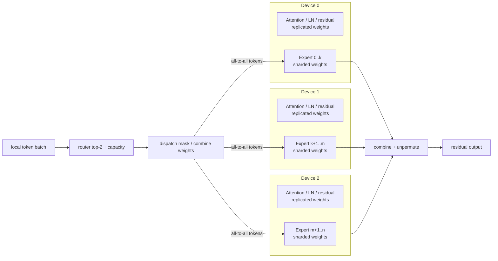
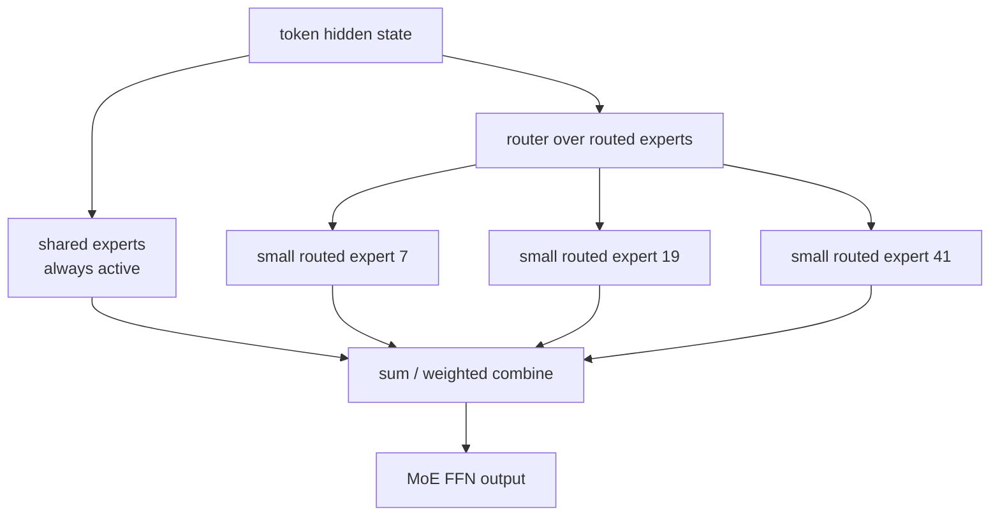

# MLSYS18 · MoE Systems：路由、通信与 Kernel

Modern LLM MoE 的核心能力不是“参数很多”，而是用稀疏激活把 capacity、FLOPs、通信和 kernel utilization 分开调度。学习目标：

```text
为什么 MoE 可以扩大参数量但不同比例扩大 FLOPs？
router / capacity / load balance 到底在系统里带来什么问题？
DeepSeekMoE、Kimi K2、Qwen3-Next 这类 fine-grained sparse MoE 为什么难训难跑？
SonicMoE 解决的 kernel 瓶颈是什么？
```

核心结论：

> MoE 的本质是把 dense FFN 替换成 sparse activated experts。算法上看是 top-k routing；系统上看是 token dispatch、expert parallel all-to-all、grouped GEMM、activation memory、load imbalance 和 padding waste 的综合优化问题。

---

## 目录

1. [[#一、MoE 到底替换了 Transformer 的哪一部分]]
2. [[#二、router、top-k、capacity 与 load balance]]
3. [[#三、从 GShard / Switch 到 DeepSeekMoE]]
4. [[#四、modern MoE 的系统瓶颈]]
5. [[#五、fine-grained sparse MoE 为什么更难]]
6. [[#六、SonicMoE 解决了什么]]
7. [[#七、代码层面怎么理解 MoE forward]]
8. [[#八、系统调度层：MoE 不是单卡 kernel 问题]]
9. [[#九、训练和 serving 里的工程 checklist]]
10. [[#十、练习题]]
11. [[#参考资料]]

---

## 一、MoE 到底替换了 Transformer 的哪一部分

标准 Transformer block 可以粗略写成：

```text
x -> Attention -> residual -> FFN/MLP -> residual
```

MoE 通常替换的是 FFN/MLP：

```text
Dense FFN:
  y = W2 * activation(W1 * x)

MoE FFN:
  expert_id, weight = router(x)
  y = sum_k weight_k * Expert_k(x)
```

每个 expert 本质上仍然是一个 FFN：

```python
class Expert(nn.Module):
    def __init__(self, hidden, intermediate):
        self.w1 = nn.Linear(hidden, intermediate, bias=False)
        self.w2 = nn.Linear(intermediate, hidden, bias=False)

    def forward(self, x):
        return self.w2(F.silu(self.w1(x)))
```

MoE 的关键不是有很多 FFN，而是每个 token 只激活少数几个 expert：

```text
total experts = 128
top-k experts per token = 8

total parameters: all 128 experts
active parameters per token: only 8 experts
```

这就是 MoE 能扩 model capacity 的原因：

| 模型类型 | 每个 token 经过的参数 | 总参数 |
|---|---|---|
| Dense | 全部 FFN 参数 | 全部参数 |
| Sparse MoE | top-k experts | 所有 experts |

所以 Mixtral、DeepSeek-V3、Kimi K2、Qwen3-Next 这类模型经常写：

```text
total parameters 很大
active parameters per token 明显更小
```

active parameters 不等于真实 latency。真实 latency 还取决于 routing、dispatch、all-to-all、kernel padding、load balance 和并发。

---

## 二、router、top-k、capacity 与 load balance

### 2.1 Router 的数学形式

对每个 token hidden state `x`，router 输出每个 expert 的 score：

$$
s = x W_r
$$

再取 top-k：

```python
scores = x @ router_weight
probs = torch.softmax(scores, dim=-1)
topk_weight, topk_expert = torch.topk(probs, k=top_k, dim=-1)
topk_weight = topk_weight / topk_weight.sum(dim=-1, keepdim=True)
```

如果 `top_k=2`，一个 token 可能路由到：

```text
token 17 -> expert 3 with weight 0.62
         -> expert 9 with weight 0.38
```

输出是加权和：

$$
y = 0.62 \cdot E_3(x) + 0.38 \cdot E_9(x)
$$

### 2.2 Capacity factor

如果所有 token 都跑到同一个 expert，系统会崩。早期 MoE 常用 capacity 限制每个 expert 最多接多少 token：

```text
capacity_per_expert = ceil(capacity_factor * num_tokens * top_k / num_experts)
```

超过 capacity 的 token 可能被 drop、走 residual、或者用别的策略处理。

capacity 是算法和系统之间的硬接口：

| capacity 太小 | capacity 太大 |
|---|---|
| token drop 多，质量下降 | padding 多，算力浪费 |
| load 更均衡 | expert batch 变长，内存和 latency 上升 |
| kernel 更规整 | 热 expert 仍然可能拖尾 |

### 2.3 Load balancing loss

为了避免 router 把所有 token 都送去少数 experts，训练时常加 auxiliary loss。简化写法：

$$
\mathcal{L}_{balance} = E \sum_i f_i p_i
$$

其中：

```text
E = expert 数
f_i = 实际分到 expert i 的 token 比例
p_i = router 给 expert i 的平均概率
```

这类 loss 的目标是让 token count 和 probability mass 都更均匀。但 modern MoE 也在探索 auxiliary-loss-free load balancing，因为强行均衡可能牺牲 specialization。

---

## 三、从 GShard / Switch 到 DeepSeekMoE

MoE 的演进可以按四个问题来记：

```text
1. 怎么把专家并行扩到多设备？
2. 怎么让 routing 稳定训练？
3. 怎么减少每个 token 激活的专家数？
4. 怎么在 fine-grained expert 下把 kernel 跑满？
```

| 阶段 | 代表 | 重点 |
|---|---|---|
| GShard | top-2 MoE + sharding | 大规模 expert parallel 和 automatic sharding |
| Switch Transformer | top-1 routing | 简化 routing，降低通信和计算 |
| ST-MoE | stable training | router z-loss、稳定性和迁移 |
| Mixtral | decoder-only sparse MoE | top-2 experts，开源 LLM MoE 代表 |
| DeepSeekMoE | fine-grained experts + shared experts | 专家切得更细，保留 shared expert |
| DeepSeek-V3 / Kimi K2 / Qwen3-Next | frontier sparse MoE | 超大 total params，较小 active params，训练/推理系统压力更高 |

### 3.1 GShard：把 MoE 从“算法层”推进到“自动分片系统”

GShard 的重要性不只是 top-2 routing。它真正解决的问题是：Transformer 的 attention、embedding、非 MoE FFN 可以复制到每个设备上，但 expert 参数太大，必须按 expert 维度切到不同设备；同一个 block 里同时存在 replicated dense compute 和 sharded expert compute，编译器要自动插入跨设备通信。



GShard 的 Transformer 改法是隔一层替换 FFN：

```text
standard encoder layer:
  self-attention -> dense FFN

GShard MoE encoder layer:
  self-attention -> MoE FFN

placement:
  attention / layernorm / residual: replicated
  experts: sharded by expert dimension
```

GShard 的 routing 不是对全 batch 做一个全局顺序分配，而是把 token 分成多个 group，每个 group 独立做 top-2 gating，并给每个 expert 一个固定 capacity。这样做的原因很系统：TPU/XLA 需要静态 shape，expert 输入 buffer 不能因为 router 动态选择而无限变长。

```python
def gshard_group_top2(tokens, router_w, num_experts, capacity):
    # tokens: [S, d], one group with S tokens
    # capacity: per-expert buffer slots inside this group
    gates = softmax(tokens @ router_w)          # [S, E]
    mean_gate = gates.mean(dim=0)               # differentiable proxy for load
    count = zeros(num_experts)                  # non-differentiable real load
    combine = zeros(S, num_experts, capacity)   # weighted combine tensor
    dispatch = zeros(S, num_experts, capacity)  # binary token dispatch tensor

    # first expert is deterministic top-1, subject to capacity
    for s in range(S):
        e1, e2 = top2_indices(gates[s])
        g1, g2 = gates[s, e1], gates[s, e2]
        g1 = g1 / (g1 + g2)

        slot = count[e1]
        if slot < capacity:
            dispatch[s, e1, slot] = 1
            combine[s, e1, slot] = g1
        count[e1] += 1

    # auxiliary loss pushes differentiable router mass toward real token load
    aux_loss = num_experts * sum((count / S) * mean_gate)

    # second expert is stochastic: weak second choices may be dropped
    for s in range(S):
        e1, e2 = top2_indices(gates[s])
        g1, g2 = gates[s, e1], gates[s, e2]
        g2 = g2 / (g1 + g2)

        slot = count[e2]
        if slot < capacity and uniform(0, 1) < 2 * g2:
            dispatch[s, e2, slot] = 1
            combine[s, e2, slot] = g2
        count[e2] += 1

    return dispatch, combine, aux_loss
```

MoE forward 可以写成四个张量操作。GShard 论文里用 `G,S,E,C,M,H` 表示 group、group 内 token、expert、expert capacity、model dim、hidden dim：

```text
gates = softmax(einsum("GSM,ME->GSE", inputs, router_w))
combine, dispatch = Top2Gating(gates)

expert_inputs  = einsum("GSEC,GSM->EGCM", dispatch, inputs)
expert_hidden  = relu(einsum("EGCM,EMH->EGCH", expert_inputs, w_in))
expert_outputs = einsum("EGCH,EHM->GECM", expert_hidden, w_out)
outputs        = einsum("GSEC,GECM->GSM", combine, expert_outputs)
```

这段写法的核心是把动态 routing 降成静态 tensor shape：

| 张量 | 作用 | 系统含义 |
|---|---|---|
| `dispatch[G,S,E,C]` | token 是否进入某个 expert slot | 决定 all-to-all 发送什么 |
| `combine[G,S,E,C]` | expert 输出按多少 gate weight 加回原 token | 决定 unpermute / reduce |
| `capacity C` | 每个 group 内每个 expert 的最大 token 数 | 控制静态 buffer 与 dropped token |
| `aux_loss` | 惩罚 router mass 和真实 token load 偏离 | 避免少数 expert 爆满 |

所以 GShard 的系统抽象是：模型代码仍然像单机线性代数，sharding annotation 告诉编译器哪些维度要切，SPMD compiler 再把 dispatch/combine 变成跨设备 all-to-all。后来的 MoE runtime 仍然在重复这件事，只是把 `einsum + static buffer` 换成了更手写的 token sort、expert map、grouped GEMM 和 NCCL all-to-all。

### 3.2 Switch Transformer：把 top-2 改成 top-1，牺牲一点表达换系统简单性

Switch Transformer 的核心选择是 top-1 routing：

```text
router(x) = argmax softmax(x W_router)
y = Expert_router(x)(x)
```

相对 GShard top-2，它少了一次 expert FFN、少了一份 token dispatch，也少了 combine 两个 expert 输出的逻辑。capacity 仍然存在：

```text
expert_capacity = tokens_per_batch / num_experts * capacity_factor
```

如果某个 expert 收到太多 token，超过 capacity 的 token 会被 drop，并通过 residual path 继续往后走。这个设计把问题变成一个更直接的 trade-off：

| capacity factor | dropped token | padding / memory | 通信量 | 质量风险 |
|---|---:|---:|---:|---|
| 小 | 多 | 低 | 低 | token 没有经过 FFN |
| 大 | 少 | 高 | 高 | 浪费 empty slots |

Switch 的意义是证明 top-1 并不会天然训练失败。router 仍然可训练，因为被选中的 gate probability 会乘到 expert output 或进入 auxiliary load balancing loss；系统上则明显更规整，尤其适合当 expert 数继续增大时控制通信和 buffer。

### 3.3 ST-MoE：把“能训起来”变成一等设计目标

ST-MoE 关心的问题不是再把 expert 数堆大，而是 sparse model 的训练稳定性和 downstream transfer。稀疏模型常见的不稳定来自 router logits：softmax 前的 logit scale 变大后，少数 expert 概率尖峰会放大 load imbalance，训练 loss 可能突然 spike。

ST-MoE 的 router z-loss 可以理解为约束 router logits 的 log-partition：

```text
z = logsumexp(router_logits)
L_z = mean(z^2)
```

它和 load-balancing loss 的区别：

| loss | 约束对象 | 解决的问题 |
|---|---|---|
| load balancing loss | token 分到各 expert 的比例 | 防止 expert collapse / idle |
| router z-loss | router logits 的尺度 | 防止 routing 分布过尖、训练不稳定 |

ST-MoE 的经验教训是：MoE 的质量不只取决于 FLOPs 和参数量。很多稳定化手段，比如更强 dropout、更小学习率、更紧 clipping，可以让 loss 不炸，但可能牺牲预训练质量。router z-loss 的价值在于用很小的额外计算约束 router，而不是粗暴降低整个模型的学习能力。

### 3.4 Mixtral：decoder-only LLM MoE 的标准形态

Mixtral 把 MoE 放进 decoder-only Transformer，每层 FFN 都替换成 MoE。每个 MoE layer 有 8 个 experts，每个 token 选 2 个：

```text
g = Softmax(Top2(x W_router))
y = g_1 * SwiGLU_expert_1(x) + g_2 * SwiGLU_expert_2(x)
```

它和 GShard 的差异很关键：

| 维度 | GShard | Mixtral |
|---|---|---|
| 模型形态 | encoder-decoder MT scale-up | decoder-only LLM |
| MoE 位置 | 隔层替换 FFN | 每层 FFN 都是 MoE |
| expert function | ReLU FFN | SwiGLU FFN |
| routing | top-2 with more elaborate second expert handling | top-2 softmax over selected experts |
| 系统重点 | automatic sharding / TPU SPMD | single/multi-GPU inference、EP、grouped GEMM |

Mixtral 之后，工程问题从“编译器能不能自动切 expert”进一步变成“serving runtime 能不能在小 batch、decode-heavy、专家负载不均衡的情况下跑满”。这就是为什么 vLLM/SGLang/Triton MoE kernel 会强调 token align、expert sorting、quantized experts 和 fused grouped GEMM。

### 3.5 DeepSeekMoE：专家更细，通用知识走 shared expert

DeepSeekMoE 批评传统 MoE 的两个问题：

```text
knowledge hybridity:
  expert 太粗，一个 expert 被迫学习很多不相干知识

knowledge redundancy:
  多个 routed experts 都要重复保存通用知识
```

它的两个关键设计是 fine-grained expert segmentation 和 shared expert isolation：

```text
fine-grained expert segmentation:
  把一个大 expert 的 FFN intermediate dimension 切成 m 份
  expert 数从 N 变成 mN
  为保持计算量相近，top-K 也从 K 变成 mK

shared expert isolation:
  固定激活 Ks 个 shared experts
  routed experts 只负责更专门的知识
  为保持计算量，routed top-K 相应减少
```

这让 MoE 更像：

```text
shared dense path + many small sparse routed paths
```

而不是早期那种“几个很大的专家二选一”。



这个设计会改善 specialization，但系统压力也更大：expert 数更多以后，每个 expert 拿到的 token 更碎；top-k 更大以后 dispatch/combine 也更重；shared expert 虽然稳定了通用知识，但它是每个 token 都跑的 dense-ish 路径，kernel 不能只优化 routed expert。

### 3.6 Frontier MoE：DeepSeek-V3 / Kimi K2 / Qwen3-Next 的共同压力

Frontier MoE 不再只是“top-k 选几个 FFN”。它们同时改变 attention、routing、load balance、training objective 和 serving runtime。

DeepSeek-V3 延续 DeepSeekMoE，并把 load balancing 从纯 auxiliary loss 推向 auxiliary-loss-free bias update：

```python
for each training_step:
    # bias only changes routing decision, not the gate value used to weight FFN output
    route_score = affinity_score + expert_bias
    selected = topk(route_score, k=routed_k)
    gate = normalize(affinity_score[selected])

    run_selected_experts(selected, gate)

    for expert in experts:
        if load[expert] > target_load:
            expert_bias[expert] -= gamma
        else:
            expert_bias[expert] += gamma
```

这和传统 load-balance loss 的差别是：传统方法把“均衡”直接写进 loss，可能和 language modeling objective 冲突；bias update 把均衡更多放到 routing 控制面，gate value 仍来自原 affinity score。

Kimi K2、Qwen3-Next 这类模型把 sparse MoE 和长上下文 attention 一起设计。系统侧最难的是组合爆炸：

| 组件 | 省下的东西 | 新问题 |
|---|---|---|
| high-sparsity MoE | active FFN FLOPs | expert microbatch 更碎、all-to-all tail 更明显 |
| MLA / hybrid / recurrent attention | KV cache 或 attention FLOPs | cache manager 不再只有标准 KV block |
| MTP / speculative decoding | decode token 数 | draft/verify 与 expert route、KV provenance 对齐 |
| auxiliary-loss-free / sequence-wise balance | 减少 load-balance loss 对质量的干扰 | router control loop 需要监控全局 load |

所以 frontier MoE 的系统设计重点从单层 MoE kernel 扩展为全链路调度：prefill/decode disaggregation、EP/TP/PP 混合并行、expert placement、KV/cache placement、speculative decoding 回滚，以及 RL/post-training 时 old-policy routing 的可复现性。

### 3.7 Qwen3-Next：high-sparsity MoE 与 hybrid attention 绑在一起设计

Qwen3-Next-80B-A3B 是一个很适合用来理解 frontier MoE 的例子：名字里的 `80B-A3B` 表示 total parameters 约 80B，而每个 token 激活的参数规模约 3B。这个设计不是单独把 dense FFN 换成 MoE，而是和长上下文架构一起重做：

```text
Qwen3-Next block:
  hybrid attention:
    Gated DeltaNet + Gated Attention
  sparse FFN:
    high-sparsity MoE, very low activation ratio
  stability:
    zero-centered + weight-decayed LayerNorm
  inference/training auxiliary:
    Multi-Token Prediction
```

这组选择体现了一个更一般的系统趋势：

| 设计 | 省什么 | 带来的系统问题 |
|---|---|---|
| Gated DeltaNet / recurrent path | 长上下文 attention 的 quadratic cost | cache layout 不再只是标准 KV cache |
| 周期性 full / gated attention | 保留全局信息混合能力 | layer 类型混合，scheduler 和 kernel dispatch 更复杂 |
| high-sparsity MoE | 每 token active FLOPs | expert token batch 更碎，EP all-to-all 更敏感 |
| MTP | pretraining signal 与 spec decode 能力 | 训练/推理里多 token head 的一致性和 KV 来源要对齐 |

Qwen3-Next 的公开指标给出两个量级判断：Base 版相对 Qwen3-32B-Base 在 downstream tasks 上用约 10% total training cost 达到更强效果，并在 32K 以上上下文获得约 10x inference throughput；Instruct 版在部分 benchmark 上接近 Qwen3-235B-A22B-Instruct-2507，同时支持 256K 长上下文任务。这些数字说明 MoE 的价值不只是“总参数更大”，而是把训练成本、长上下文吞吐和模型容量放到同一个效率目标里。

### 3.8 Modern MoE research map

MoE 系统可以按三层读：

| 层次 | 代表 | 解决什么 | 失败信号 |
|---|---|---|---|
| routing algorithm | Switch、ST-MoE、DeepSeekMoE、Qwen3-Next | top-k、load balance、shared/routed experts、high sparsity | expert collapse、dead expert、router jitter |
| training kernel | MegaBlocks、SonicMoE | sparse training、activation caching、grouped GEMM、padding waste | tensor core 利用率低、activation HBM 峰值高 |
| serving runtime | vLLM fused MoE、SGLang align/sort、TritonMoE | token align/sort、expert map、quantized experts、EP all-to-all | p95 latency 长尾、small GEMM、all-to-all idle |
| RL correctness | Routing Replay、Keep Sampling Mask、GSPO | old/new policy logprob 对齐、router mismatch | importance ratio 噪声、训练发散、reward 上升但 eval 掉 |

这张表能避免把所有问题都归为“MoE 通信贵”。训练侧最怕 activation 和 backward memory；serving 侧最怕 bursty routing 和 p95；RL 侧最怕 old policy 生成 token 时的 expert choice 在 training recompute 中被改掉。

---

## 四、modern MoE 的系统瓶颈

一个 MoE forward 不是简单 `for expert in experts`。真实 pipeline 是：

```text
hidden states
  -> router top-k
  -> token dispatch / permutation
  -> expert computation
  -> combine / unpermute
  -> residual
```

分布式时还要：

```text
local tokens
  -> all-to-all send tokens to expert owner GPU
  -> local grouped GEMM over owned experts
  -> all-to-all send expert outputs back
  -> combine top-k outputs
```

### 4.1 Token dispatch

token 原本按 batch/sequence 连续存放：

```text
[t0, t1, t2, t3, t4, t5]
```

routing 后要按 expert 重排：

```text
expert 0: [t1, t4]
expert 1: [t0, t5]
expert 2: [t2]
expert 3: [t3]
```

这一步会产生 gather/scatter、prefix sum、index map、临时 buffer。小 batch 或专家很细时，这些非 GEMM 开销会非常明显。

### 4.2 Grouped GEMM

每个 expert 是一个小 GEMM：

```text
X_e [tokens_for_e, hidden] @ W_e [hidden, intermediate]
```

把很多 expert GEMM 合在一起，就是 grouped GEMM。

问题是每个 expert 的 token 数不同：

```text
expert 0: 128 tokens
expert 1: 17 tokens
expert 2: 3 tokens
expert 3: 240 tokens
```

GPU 喜欢规则大矩阵，不喜欢很多不均匀小矩阵。为了让 kernel 规整，系统经常需要 padding / rounding：

```text
17 -> round to 32
3  -> round to 32
```

这就是 padding waste。

### 4.3 All-to-all 通信

Expert parallel 下，每张 GPU 只持有部分 experts。token 要被发送到拥有对应 expert 的 GPU：

```text
GPU0 token routes to expert on GPU3
  -> send hidden state to GPU3
  -> GPU3 compute expert output
  -> send output back to GPU0
```

瓶颈可能从 compute 变成 communication：

| 问题 | 表现 |
|---|---|
| hot expert | 某张 GPU 收到太多 token，拖慢全局 |
| small message | all-to-all 启动开销高 |
| routing skew | 不同 microbatch 通信量波动大 |
| overlap 不好 | 通信和 expert compute 串行 |

---

## 五、fine-grained sparse MoE 为什么更难

Tri Dao 在 SonicMoE 相关文章里用两个量描述 modern MoE：

```text
granularity G = d / n
  d: FFN intermediate dimension
  n: expert 分割数

sparsity rho = K / E
  K: 每个 token 激活 experts
  E: 总 experts
```

趋势是：

```text
experts 越来越多
每个 expert 越来越小
每个 token 激活比例越来越低
```

这对模型容量很好，但对 kernel 很难：

| 模型趋势 | 系统后果 |
|---|---|
| expert 更细 | 每个 expert 的 GEMM 更小 |
| expert 更多 | routing/dispatch metadata 更多 |
| top-k 仍然不小 | 一个 token 复制到多个 experts，activation memory 上升 |
| sparse 更强 | load imbalance 更明显 |

如果用朴素实现，MoE 会出现“理论 FLOPs 少，但实际不快”的尴尬：

```text
GEMM 太小 -> tensor core 利用率差
padding 太多 -> 做了无效计算
activation cache 太大 -> HBM IO 成瓶颈
dispatch/combination 多 -> 非 GEMM 开销吃掉收益
```

这就是 SonicMoE 的切入点。

---

## 六、SonicMoE 解决了什么

SonicMoE 是 Dao-AILab 开源的高性能 MoE implementation，目标硬件包括 Hopper SM90、Blackwell datacenter SM100 和 Blackwell consumer SM120。它基于 CuTeDSL、Triton，以及 QuACK/CUTLASS grouped GEMM 思路。

它主要解决三个问题：

```text
1. fine-grained MoE activation memory 太大
2. sparse MoE grouped GEMM padding waste 太多
3. token dispatch / activation IO 和 expert compute 没有充分 overlap
```

### 6.1 Minimal activation caching

MoE 训练时反向传播需要保存 activation。top-k 越大、expert 越多，直接缓存每个 expert 输入会很贵：

```text
tokens duplicated by top-k
  -> expert input activations
  -> intermediate activations
  -> routing metadata
```

SonicMoE 的论文强调 minimal activation caching：尽量不把可以重算或可以更紧凑保存的 activation 全部落 HBM。这样做的目标是：

```text
减少 activation memory footprint
减少 HBM read/write
让更大的 batch / sequence / expert config 放得下
```

SonicMoE 在 fine-grained 7B MoE 上报告了约 45% 的 activation memory reduction。

### 6.2 Overlap memory IO with compute

MoE 的非 GEMM 部分很多：

```text
load token hidden
read routing indices
gather / scatter
write expert input
read expert output
combine top-k
```

如果这些都和 GEMM 串行，GPU 会在 HBM IO 和 compute 之间反复等待。

SonicMoE 的思路是把 IO 和 compute 管线化：

```text
tile 0: load / dispatch
tile 1: GEMM compute
tile 2: write / combine
```

理想状态：

```text
while tensor cores compute current tile:
    memory pipeline prepares next tile
```

这和 FlashAttention 的精神类似：不是只减少 FLOPs，而是减少 HBM 往返，并把不可避免的 IO 藏到 compute 后面。

### 6.3 Tile-aware token rounding

传统 grouped GEMM 为了对齐 kernel tile，会把每个 expert 的 token count round 到固定粒度：

```text
tokens_for_expert = 33
round_to_64 -> compute 64 rows
31 rows are padding
```

fine-grained expert 下，很多 expert token count 都很小，padding 比例会爆炸。

SonicMoE 的 tile-aware token rounding 不是盲目 round，而是让 routing / rounding 更贴合 kernel tile 使用。相比 vanilla top-k，这个策略在保持类似模型效果的同时带来额外 kernel speedup。

理解方式：

```text
算法 router 看到的是 expert 概率
kernel 看到的是 tile occupancy

SonicMoE 试图让二者对齐：
  route quality 不明显下降
  grouped GEMM tile 更饱满
```

### 6.4 SonicMoE 的定位

SonicMoE 不是一个完整训练框架，而是 MoE kernel / layer implementation。它回答的是：

```text
给定 routed tokens 和 expert weights，怎样把 MoE layer 在 Hopper/Blackwell 上跑快？
```

它和 Megatron、DeepSpeed、vLLM、SGLang 这类系统的关系更像：

```text
training/serving framework
  -> calls MoE layer implementation
  -> MoE layer calls optimized grouped GEMM / dispatch kernels
```

---

## 七、代码层面怎么理解 MoE forward

### 7.1 朴素 PyTorch 版本

先写一个慢但清楚的版本：

```python
def naive_moe_forward(x, router, experts, top_k):
    # x: [num_tokens, hidden]
    scores = x @ router.weight.T
    probs = torch.softmax(scores, dim=-1)
    topk_weight, topk_expert = torch.topk(probs, top_k, dim=-1)
    topk_weight = topk_weight / topk_weight.sum(dim=-1, keepdim=True)

    out = torch.zeros_like(x)

    for expert_id, expert in enumerate(experts):
        # token_mask: [num_tokens, top_k]
        token_mask = topk_expert == expert_id
        if not token_mask.any():
            continue

        token_idx, route_idx = token_mask.nonzero(as_tuple=True)
        expert_input = x[token_idx]
        expert_output = expert(expert_input)
        out[token_idx] += expert_output * topk_weight[token_idx, route_idx].unsqueeze(-1)

    return out
```

这段代码正确但很慢，因为：

- Python loop over experts
- 每个 expert 做一个小 GEMM
- gather/scatter 不连续
- 没有 grouped GEMM
- top-k duplicate tokens 带来很多 index 操作

### 7.2 高性能实现的结构

优化实现会把上面逻辑拆成几个 kernel：

```text
router_topk_kernel
  -> topk_expert, topk_weight

dispatch_kernel
  -> sorted_token_ids
  -> expert_offsets
  -> packed_expert_inputs

grouped_gemm_kernel
  -> expert outputs

combine_kernel
  -> unpermute outputs
  -> apply topk weights
```

可视化：

```text
original token order:
  t0 t1 t2 t3 t4

routed:
  t0 -> e2
  t1 -> e0
  t2 -> e2
  t3 -> e1
  t4 -> e0

packed by expert:
  e0: t1 t4
  e1: t3
  e2: t0 t2

grouped GEMM:
  [e0 GEMM] [e1 GEMM] [e2 GEMM]

combine:
  output back to t0 t1 t2 t3 t4 order
```

### 7.3 SonicMoE usage 直觉

SonicMoE 的 public API 暴露为一个 MoE module，使用方式类似：

```python
from sonicmoe import MoE
from sonicmoe.enums import ActivationType

moe = MoE(
    num_experts=128,
    num_experts_per_tok=8,
    hidden_size=4096,
    intermediate_size=1536,
    activation_function=ActivationType.SWIGLU,
    add_bias=False,
)

y = moe(x, router_logits)
```

模型代码只看到 module 边界；系统实现真正要解决的是内部张量布局问题：

```text
input hidden states are token-major
expert weights are expert-major
grouped GEMM wants tile-friendly packed layout
output must return to original token order
```

### 7.4 vLLM / SGLang fused MoE 的实现映射

vLLM fused MoE 路径里的关键变量：

```text
hidden_states:      [num_tokens, hidden]
topk_ids:           [num_tokens, top_k]
topk_weights:       [num_tokens, top_k]
sorted_token_ids:   routed tokens sorted/grouped by expert
expert_ids:         each block should use which expert weight
num_tokens_post_padded:
                    routed token count after padding to BLOCK_SIZE_M
w1 / w2:            expert weights
```

这组变量正好对应 MoE kernel 的核心问题：

```text
router output 是 token-major:
  token -> top-k experts

grouped GEMM 想要 expert-major:
  expert -> contiguous tokens
```

所以 fused MoE 不是一个 GEMM kernel，而是一条 pipeline：

```text
topk_ids/topk_weights
  -> align_and_sort
  -> sorted_token_ids + expert_ids + padded_count
  -> grouped GEMM for gate/up projection
  -> activation (SwiGLU/SiLU)
  -> grouped GEMM for down projection
  -> weighted combine + unpermute
```

SGLang fused MoE 也有类似的 align/sort 预处理。它的实现讨论里特别强调：在 MoE kernel launch 之前，先把 token 按 expert 对齐和排序；早期 Triton 路线会拆成多阶段，后来 CUDA 路线把部分阶段合并，减少小 workload 下的 launch 和寄存器/缓存浪费。

### 7.5 一个简化 Triton grouped GEMM kernel

Simplified illustrative kernel；production vLLM/SGLang/PyTorch kernels 还要处理 quantization、stride、split-K、FP8、expert map、all2all、persistent scheduling 等细节。

```python
import triton
import triton.language as tl


@triton.jit
def grouped_gemm_moe_kernel(
    X, W, Y,
    sorted_token_ids, expert_ids,
    M_per_expert_offsets,
    H: tl.constexpr, I: tl.constexpr,
    BLOCK_M: tl.constexpr, BLOCK_N: tl.constexpr, BLOCK_K: tl.constexpr,
):
    pid = tl.program_id(0)

    # Each program owns one output tile. In real kernels, pid -> (expert, m_tile, n_tile)
    # mapping is built from a flattened tile schedule.
    expert = tl.load(expert_ids + pid)
    m_start = tl.load(M_per_expert_offsets + expert)
    token_block = tl.load(sorted_token_ids + pid * BLOCK_M + tl.arange(0, BLOCK_M))

    offs_m = tl.arange(0, BLOCK_M)
    offs_n = tl.arange(0, BLOCK_N)
    offs_k = tl.arange(0, BLOCK_K)

    acc = tl.zeros((BLOCK_M, BLOCK_N), tl.float32)

    for k0 in range(0, H, BLOCK_K):
        x = tl.load(
            X + token_block[:, None] * H + (k0 + offs_k[None, :]),
            mask=token_block[:, None] >= 0,
            other=0.0,
        )
        w = tl.load(
            W + expert * H * I + (k0 + offs_k[:, None]) * I + offs_n[None, :],
            mask=(k0 + offs_k[:, None] < H) & (offs_n[None, :] < I),
            other=0.0,
        )
        acc += tl.dot(x, w)

    tl.store(
        Y + (m_start + offs_m[:, None]) * I + offs_n[None, :],
        acc.to(tl.float16),
        mask=offs_n[None, :] < I,
    )
```

这个 skeleton 里最关键的是三件事：

| 代码变量 | 系统含义 |
|---|---|
| `sorted_token_ids` | dispatch 后的 token 顺序，不再等于原始 batch 顺序 |
| `expert_ids` | 每个 tile 绑定哪个 expert weight |
| `M_per_expert_offsets` | 每个 expert 在 packed buffer 里的起点 |

如果 expert token count 很不均匀，某些 expert 的 tile 很少，某些 expert 的 tile 很多。朴素 CTA 分配会导致 SM 工作不均。PyTorch 2025 的 Triton grouped GEMM 优化用 persistent kernel 思路：让一批 program 常驻 SM，按 `tile_id += NUM_SMS` 动态取活，而不是每个 tile 启一个完全独立的 wave。

### 7.6 为什么 fused gate/up 很重要

现代 FFN 常用 SwiGLU：

```text
up   = X @ W_up
gate = X @ W_gate
hidden = silu(gate) * up
out = hidden @ W_down
```

朴素实现会把 `up` 和 `gate` 都写回 HBM：

```text
read X
compute gate -> write HBM
compute up   -> write HBM
read gate/up
compute silu(gate) * up
write hidden
read hidden
compute down
```

fused gate/up 的目标是：

```text
一次读 X
同时算 gate/up
silu 和 multiply 在 register 里完成
尽量少把 intermediate 写回 HBM
```

TritonMoE 把 router、token permutation、expert GEMM、weighted combine 尽量融合，并通过 fused gate+up projection 减少全局内存流量。这个方向对 inference batch size 特别重要，因为 batch 小时 HBM/launch overhead 的占比比大 batch training 更高。

### 7.7 SonicMoE 与 grouped GEMM kernel 的关系

可以把几类工作放在同一张图里：

| 工作 | 关注点 | 典型问题 |
|---|---|---|
| vLLM/SGLang fused MoE | serving runtime 内的 fused experts | token align/sort、padding、quant、EP all2all |
| PyTorch Triton grouped GEMM | grouped GEMM kernel 本身 | persistent scheduling、L2 locality、SM 利用率 |
| TritonMoE | portable fused dispatch | 不写 CUDA，融合 router/dispatch/expert/combiner |
| SonicMoE | fine-grained MoE training layer | minimal activation caching、IO/compute overlap、tile-aware rounding |

SonicMoE 更偏训练和 fine-grained expert。它关心的不只是 forward 快不快，还包括 backward 要不要保存大量 activation：

```text
save everything:
  simple backward
  huge activation memory

minimal activation caching:
  save compact metadata
  backward recompute selected tensors
  lower HBM footprint
```

所以 SonicMoE 的贡献不能只说“MoE kernel 更快”。更准确是：

```text
它把 MoE layer 当成 IO-bound + irregular grouped GEMM + backward activation memory
三者耦合的问题来解，而不是只优化 forward grouped GEMM。
```

---

## 八、系统调度层：MoE 不是单卡 kernel 问题

### 8.1 EP All-to-All 的调度问题

Expert Parallelism 下，token 要先被送到 expert 所在 GPU，再把输出送回来：

```text
local hidden states
  -> local router top-k
  -> all-to-all dispatch hidden states
  -> local expert grouped GEMM
  -> all-to-all combine expert outputs
  -> restore original token order
```

系统调度要回答：

```text
每张 GPU 放哪些 experts？
top-k 后每张 GPU 会收到多少 routed tokens？
all-to-all 和 local expert compute 能不能 overlap？
hot expert 会不会让某一张 GPU 成为 straggler？
```

如果 batch 很小，EP 往往不划算，因为 all-to-all 的固定延迟压过了 expert 参数分片的收益。经验上要看：

```text
tokens_per_expert_per_step
all_to_all_time / moe_layer_time
expert_gemm_utilization
p95 expert token count / mean expert token count
```

### 8.2 Serving 里的 MoE 调度比训练更难预测

训练 batch 通常更规则：

```text
固定 global batch
固定 sequence packing
较稳定的 token count
```

Serving batch 是动态的：

```text
短请求和长请求混在一起
prefill 和 decode 混在一起
不同用户 prompt 导致 routing 分布不同
continuous batching 每轮 batch 都变
```

所以 MoE serving 的瓶颈经常在 p95/p99，而不是平均 tokens/s：

| 现象 | 可能原因 |
|---|---|
| 平均吞吐还行，p99 latency 很差 | 少数 hot experts 拖尾 |
| batch 越大反而没线性提升 | all-to-all 或 grouped GEMM padding 增长 |
| prefix cache 命中高但 latency 仍高 | attention 省了，MoE layer 仍要 route/dispatch/compute |
| spec decode 收益不稳定 | target/draft MoE router 分布不同，verify batch 形状抖动 |

### 8.3 MoE + Speculative Decoding 的特殊坑

Dense target + dense draft 已经有 acceptance ratio 问题。MoE target 再多一层 routing：

```text
draft proposes token d
target verifies token d
target MoE router chooses experts per layer
```

如果 target 的 routing 在不同 batch shape、不同 precision、不同 runtime 下不稳定，训练/推理一致性会受影响。对 RL 来说更麻烦，因为 rollout logprob 和 training logprob 都要重算：

```text
rollout side:
  vLLM/SGLang computes logprob with one MoE routing implementation

training side:
  Megatron/FSDP computes logprob with another MoE routing implementation
```

这就是第 14 课里提到 `rollout_expert_indices` / router replay 的意义。MoE 不只是 serving 性能问题，也会变成 RL correctness 问题。

### 8.4 该怎么 profile 一个 MoE layer

不要只看总 step time。至少拆成：

```text
router_topk_time
align_sort_time
all_to_all_dispatch_time
grouped_gemm_w1_time
activation_time
grouped_gemm_w2_time
combine_unpermute_time
all_to_all_combine_time
padding_waste_ratio
expert_load_cv
```

其中两个指标最有诊断价值：

| 指标 | 解释 |
|---|---|
| `padding_waste_ratio` | rounded tokens / real tokens，判断 kernel tile 浪费 |
| `expert_load_cv` | expert token count 的 coefficient of variation，判断 routing skew |

优化顺序通常是：

```text
先看 load balance
再看 all-to-all
再看 grouped GEMM utilization
最后再抠单 kernel micro-optimization
```

---

## 九、训练和 serving 里的工程 checklist

### 9.1 训练侧

| 检查项 | 为什么重要 |
|---|---|
| router entropy | 太低说明 expert collapse |
| expert token histogram | 看 hot expert / dead expert |
| auxiliary loss scale | 太大损伤 specialization，太小负载不稳 |
| dropped token rate | capacity 太小会掉质量 |
| all-to-all time | 判断是否通信瓶颈 |
| grouped GEMM utilization | 判断 expert batch 是否太碎 |
| activation memory | 决定 batch/sequence 能开多大 |

MoE 训练最常见的问题不是 loss 立刻 NaN，而是：

```text
少数 experts 过热
大量 experts 学不到东西
all-to-all p95 长尾拖慢 step time
aux loss 降了主任务质量
```

MoE pretraining 还多出三类 dense model 没有的耦合：

| 训练问题 | 系统表现 | 处理思路 |
|---|---|---|
| router collapse | 少数 expert 被持续打满，其他 expert 梯度稀疏 | router entropy / aux loss / z-loss / expert bias / capacity schedule |
| expert batch fragmentation | 每个 expert 只拿到很少 token，grouped GEMM tile 不饱满 | 更大的 global batch、expert parallel 重排、token packing、tile-aware rounding |
| stability vs specialization | load balance 太强会削弱 expert specialization，太弱会热专家拖尾 | 监控 per-expert token histogram、per-expert loss、all-to-all p95，而不是只看 global loss |

Qwen3-Next 这类 high-sparsity MoE 更强调稳定性工程：zero-centered / weight-decayed LayerNorm 用来降低长训练中的激活漂移，MTP 给 pretraining 提供更强的未来 token 监督，同时也为推理侧 speculative decoding 留接口。这里的关键不是某个 trick 单独生效，而是 sparse MoE、hybrid attention、long context 和 MTP 同时改变了 batch shape、activation range、cache layout 和 loss signal。

### 9.2 Serving 侧

推理时常见配置：

```text
TP: tensor parallel
EP: expert parallel
DP: data parallel / replica
ETP: expert tensor parallel
```

serving 的难点：

| 难点 | 说明 |
|---|---|
| decode batch 小 | 每步 token 数少，expert GEMM 更碎 |
| routing skew 动态变化 | 不同请求混 batch 后 expert 负载变 |
| KV cache 与 expert weights 抢显存 | MoE total params 大，显存压力高 |
| prefix cache 和 routing 无关 | 命中 prefix cache 不等于 MoE layer 免费 |
| speculative decoding + MoE | draft/target router mismatch 需要额外观测 |

### 9.3 MoE + RL 的特殊问题

RL rollout 和 training 可能不在同一套 inference engine 上。MoE 下要额外问：

```text
rollout 时 token 路由到了哪些 experts？
training 重新 forward 时 router 是否一致？
如果不一致，logprob 是否还是同一个 action distribution？
```

所以 RL infra 里记录 `rollout_expert_indices` 是有意义的。更强的系统可以做 router replay：

```text
rollout:
  save expert_indices per token/layer

training:
  force same expert routes when computing logprob
```

这能减少 train-inference mismatch，但会增加 framework 和 MoE kernel 的接口复杂度。

MoE RL 的困难比 dense RL 多一层：policy 不只由权重 $\theta$ 决定，还由 router 的离散 expert choice 决定。GRPO/PPO 的 importance ratio 默认比较的是同一条 token trajectory 在 old/new policy 下的概率；如果训练侧重新 forward 时 expert route 变了，token-level logprob 的差异里会混入 router implementation、precision、batch shape 和 expert load 的噪声。

```text
dense model:
  old policy token -> recompute logprob under new weights

MoE model:
  old policy token + old expert route
      -> recompute may choose a different expert route
      -> importance ratio no longer isolates policy update
```

GSPO 的序列级 ratio 缓解了这个问题：它对整段 response 的 normalized sequence likelihood 做 clipping，而不是强依赖每个 token 的 likelihood 都稳定。GRPO 在 MoE RL 中往往需要 Routing Replay 才能稳定收敛；GSPO 把 ratio 从 token level 移到 sequence level，减少了对这类重型 workaround 的依赖。系统含义是：

| 方法 | 需要记录什么 | 成本 | 适用判断 |
|---|---|---|---|
| Routing Replay | 每层每 token 的 expert ids | metadata + 通信 + kernel 接口复杂 | token-level PPO/GRPO 仍需要严格 logprob 对齐 |
| Keep Sampling Mask | top-p/top-k sampling mask | vocab mask 存储或重建 | 采样策略也可能导致 train/rollout mismatch |
| GSPO / sequence-level ratio | response-level likelihood ratio | 算法目标改变 | 更适合高稀疏 MoE 与 disaggregated RL infra |

---

---

## 十、练习题

<details class="exercise">
<summary><span class="q-label">Q1</span> <span class="q-text">MoE 为什么不是简单 ensemble？</span></summary>

Ensemble 通常多个完整模型都参与预测，然后平均或投票。MoE 是在一个模型内部，用 router 给每个 token 选择少数 experts，通常替换 FFN 层，输出仍在同一个 Transformer block 内。

</details>

<details class="exercise">
<summary><span class="q-label">Q2</span> <span class="q-text">top-1 和 top-2 routing 怎么选？</span></summary>

top-1 更便宜、通信少、实现简单；top-2/top-k 表达力更强、训练更稳定，但 token duplication、activation memory、all-to-all 和 combine 成本更高。

</details>

<details class="exercise">
<summary><span class="q-label">Q3</span> <span class="q-text">为什么 MoE 总参数大但 active 参数小，不一定 latency 更低？</span></summary>

因为 latency 还包括 routing、dispatch、all-to-all、grouped GEMM padding、load imbalance、activation IO。active FLOPs 只是其中一项。

</details>

<details class="exercise">
<summary><span class="q-label">Q4</span> <span class="q-text">fine-grained MoE 为什么对 kernel 更难？</span></summary>

expert 更多更小，每个 expert 的 token batch 变碎。小 GEMM 和 padding waste 会拉低 tensor core 利用率，dispatch metadata 和 activation IO 占比也会上升。

</details>

<details class="exercise">
<summary><span class="q-label">Q5</span> <span class="q-text">SonicMoE 的一句话贡献是什么？</span></summary>

SonicMoE 面向 fine-grained sparse MoE，把 activation caching、memory IO overlap、tile-aware token rounding 和高性能 grouped GEMM 结合起来，减少 HBM 压力和 padding waste，让 Hopper/Blackwell 上的 MoE layer 更接近理论效率。

</details>

<details class="exercise">
<summary><span class="q-label">Q6</span> <span class="q-text">MoE 系统面试最该画哪张图？</span></summary>

画这张：

```text
tokens
  -> router top-k
  -> pack by expert
  -> all-to-all to expert owners
  -> grouped GEMM
  -> all-to-all outputs back
  -> weighted combine
  -> original token order
```

然后逐个讲瓶颈：routing skew、dispatch overhead、all-to-all、small GEMM、padding、activation memory。

</details>

<details class="exercise">
<summary><span class="q-label">Q7</span> <span class="q-text">高稀疏 MoE 在 pretraining 时和 dense model 最大的不同是什么？</span></summary>

Dense model 的每个 token 都更新同一套 FFN 参数；MoE 每个 token 只更新被 router 选中的少数 experts。训练稳定性因此取决于两件事：全局 loss 是否下降，以及每个 expert 是否都获得足够、足够多样的 token。只看 global loss 会漏掉 hot expert、dead expert、routing collapse、all-to-all p95 长尾这些问题。

高质量回答要同时提到 algorithm 和 system：

```text
algorithm:
  router entropy / load balance / z-loss / expert specialization

system:
  expert token histogram / grouped GEMM occupancy / EP all-to-all / activation memory
```

</details>

<details class="exercise">
<summary><span class="q-label">Q8</span> <span class="q-text">MoE 做 RL 时为什么 GRPO/PPO 比 dense model 更容易不稳定？</span></summary>

PPO/GRPO 训练依赖 old policy 和 new policy 的 logprob ratio。MoE 下，logprob 不只受权重变化影响，还受 router 离散选择影响。如果 rollout engine 和 training engine 的 router 实现、精度、batch shape 不完全一致，训练时重新 forward 可能选择不同 expert，importance ratio 就混入了 router mismatch 噪声。

常见系统解法：

| 解法 | 核心思想 |
|---|---|
| Routing Replay | rollout 记录 expert ids，training 计算 logprob 时强制使用同一路由 |
| Keep Sampling Mask | rollout 记录采样 mask，training 侧复现同一截断分布 |
| Sequence-level objective | 用整段 response 的 likelihood ratio 降低 token-level router 抖动影响 |

</details>

<details class="exercise">
<summary><span class="q-label">Q9</span> <span class="q-text">为什么 MegaBlocks 这类 sparse training kernel 重要？</span></summary>

朴素 MoE 会把不同 expert 的 token 分散成很多小 GEMM，padding 和 launch overhead 很高。MegaBlocks 的核心价值是把 sparse MoE 训练表达成 block-sparse computation，让容量不均衡时也能减少 padding waste，并提升训练阶段的硬件利用率。

</details>

<details class="exercise">
<summary><span class="q-label">Q10</span> <span class="q-text">训练侧 MoE kernel 和 serving 侧 fused MoE kernel 关注点有什么不同？</span></summary>

训练侧还要处理 backward、activation 保存/重算、optimizer state 和 gradient communication，因此 activation memory 是核心问题。Serving 侧通常没有 backward，但请求长度和 routing 分布更不稳定，更关注 align/sort、quantized expert GEMM、EP all-to-all、p95 latency 和 continuous batching。

</details>

<details class="exercise">
<summary><span class="q-label">Q11</span> <span class="q-text">为什么 high-sparsity MoE 对 load balance 更敏感？</span></summary>

每个 token 激活的 expert 数越少，router 的离散选择越决定实际计算路径。如果大量 token 进入少数 experts，会同时造成训练梯度不均、serving all-to-all 长尾、grouped GEMM batch skew。high sparsity 省 FLOPs，但把 router 质量和系统调度推到更核心的位置。

</details>

<details class="exercise">
<summary><span class="q-label">Q12</span> <span class="q-text">为什么 MoE + speculative decoding 的收益可能不稳定？</span></summary>

Spec decode 的 verify batch 形状取决于 accepted length；MoE 的 expert batch 又取决于 router。两者叠加后，同一轮 verify 可能产生很不均匀的 expert token histogram，导致某些 experts 变成长尾。若 draft 和 target 的 token 分布不同，target MoE router 的负载也会更抖。

</details>

<details class="exercise">
<summary><span class="q-label">Q13</span> <span class="q-text">MoE serving 里为什么 p95 比平均 tokens/s 更重要？</span></summary>

平均 tokens/s 可能被大量短请求掩盖。MoE 的真实问题常出现在少数请求路由到 hot experts、all-to-all 等慢 rank、small GEMM padding waste 或 expert cache miss。线上用户感知的是 tail latency，所以要看 per-expert token histogram、all-to-all p95、kernel occupancy 和 request-level p95/p99。

</details>

<details class="exercise">
<summary><span class="q-label">Q14</span> <span class="q-text">MoE RL 里 Routing Replay 和 GSPO 分别解决哪一层问题？</span></summary>

Routing Replay 是系统侧解法：rollout 记录 old policy 的 expert ids，training recompute 时强制使用同一路由，尽量保留 token-level PPO/GRPO 语义。GSPO 是算法侧解法：把 ratio 从 token level 移到 sequence level，降低单 token router 抖动对训练目标的影响。

</details>

---

## 参考资料

- [GShard: Scaling Giant Models with Conditional Computation and Automatic Sharding](https://arxiv.org/abs/2006.16668)
- [Switch Transformers: Scaling to Trillion Parameter Models with Simple and Efficient Sparsity](https://arxiv.org/abs/2101.03961)
- [ST-MoE: Designing Stable and Transferable Sparse Expert Models](https://arxiv.org/abs/2202.08906)
- [MegaBlocks: Efficient Sparse Training with Mixture-of-Experts](https://arxiv.org/abs/2211.15841)
- [Mixtral of Experts](https://arxiv.org/abs/2401.04088)
- [DeepSeekMoE: Towards Ultimate Expert Specialization in Mixture-of-Experts Language Models](https://arxiv.org/abs/2401.06066)
- [DeepSeek-V3 Technical Report](https://arxiv.org/abs/2412.19437)
- [Kimi K2: Open Agentic Intelligence](https://arxiv.org/abs/2507.20534)
- [SonicMoE: Minimal Activation Caching for Fine-Grained MoE Training](https://arxiv.org/abs/2512.14080)
- [Dao-AILab SonicMoE GitHub](https://github.com/Dao-AILab/sonic-moe)
- [Tri Dao: SonicMoE on Blackwell GPUs](https://tridao.me/blog/2026/sonicmoe-blackwell/)
- [Cross-Platform Fused MoE Dispatch in Triton](https://arxiv.org/abs/2605.23911)
- [vLLM fused MoE implementation](https://github.com/vllm-project/vllm/blob/main/vllm/model_executor/layers/fused_moe/fused_moe.py)
- [vLLM fused MoE kernel feature guide](https://docs.vllm.ai/en/latest/design/moe_kernel_features.html)
- [SGLang Efficient MoE Align & Sort](https://huggingface.co/blog/yiakwy-xpu-team/efficient-moe-align-sort-design-for-sglang)
- [PyTorch: Triton Persistent Cache-Aware Grouped GEMM for MoE](https://pytorch.org/blog/accelerating-moes-with-a-triton-persistent-cache-aware-grouped-gemm-kernel/)
- [NVIDIA: Applying Mixture of Experts in LLM Architectures](https://developer.nvidia.com/blog/applying-mixture-of-experts-in-llm-architectures/)
- [Qwen3-Next-80B-A3B-Instruct Model Card](https://huggingface.co/Qwen/Qwen3-Next-80B-A3B-Instruct)
- [Qwen3-Next-80B-A3B-Thinking Model Card](https://huggingface.co/Qwen/Qwen3-Next-80B-A3B-Thinking)
- [Qwen: GSPO: Towards Scalable Reinforcement Learning for Language Models](https://qwenlm.github.io/blog/gspo/)
- [牛客：腾讯算法实习大模型面经（一面）](https://www.nowcoder.com/feed/main/detail/3b01b0ab798f430391771d06d048e21b)
- [PracHub: Meta ML System Design Questions](https://prachub.com/companies/meta/positions/machine-learning-engineer/categories/ml-system-design)
