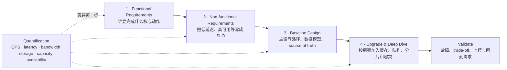
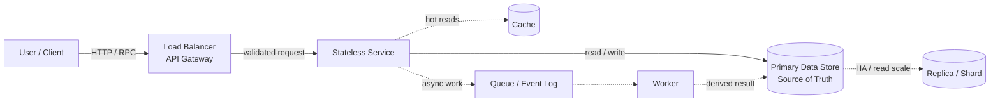

# System Design Overview · 从需求到可扩展架构

System Design 不是背一张“标准架构图”，而是把需求逐步翻译成架构决策：

> 先画出能工作的最小闭环，再让 non-functional requirements 拉着系统有理由地变复杂；每次升级都要说明它解决的瓶颈、需要的数量级和引入的代价。

---

## 一张图记住一般流程



最终回答应该形成一条可以追溯的因果链：

```text
Requirement
  -> 数量级与 SLO
  -> 当前瓶颈
  -> 设计选择
  -> trade-off
  -> 如何验证
```

如果无法说清一个组件在满足哪条需求，它很可能暂时不应该出现在图里。

---

## Step 1 · Functional Requirements

Functional requirements 回答：**系统必须实现什么基本功能？**

不要一开始把整个产品都设计出来。先确认用户和最重要的 2～4 条 use case：

```text
Actor：谁在使用？
Action：用户要执行什么动作？
Object：动作作用在哪个核心对象上？
Input / Output：系统接收什么，返回什么？
Scope：这次明确做什么、不做什么？
```

通用写法：

```text
Must have
1. 用户可以创建核心对象。
2. 用户可以按 ID 或条件读取核心对象。
3. 用户可以更新或删除自己有权限的对象。

Out of scope
- 推荐、广告、复杂分析等非核心能力暂不展开。
- 管理后台只保留与主链路直接相关的能力。
```

### 为什么必须先缩小范围

不同功能会产生完全不同的主路径：

```text
上传内容：write path、对象存储、异步处理更重要
搜索内容：索引、召回、读延迟更重要
消息投递：顺序、fan-out、离线用户与重试更重要
支付交易：一致性、幂等、审计与正确性更重要
```

如果功能边界没有确定，后面的 QPS、数据模型和架构都没有计算对象。

### 这一步的输出

- 2～4 条核心用户故事
- 明确的 API 行为或输入输出
- 核心数据对象
- out-of-scope 列表
- 哪条是最重要的 read path，哪条是最重要的 write path

---

## Step 2 · Non-functional Requirements

Non-functional requirements 回答：**系统不仅要能工作，还要工作得怎么样？**

“低延迟”“高可用”“可扩展”只是方向，必须尽量翻译成数字。

| 性质 | 应该追问什么 | 可量化表达示例 |
|---|---|---|
| Latency | 哪个操作、哪个 percentile？ | read p99 < 200 ms |
| Availability | 允许多久不可用？ | monthly availability 99.99% |
| Throughput | 平均与峰值负载？ | average 2.3K QPS，peak 12K QPS |
| Scalability | 未来增长多少？ | 一年内流量和数据增长 10 倍 |
| Durability | 数据能否丢失？ | object durability 99.999999999% |
| Consistency | 哪些读必须看到最新写入？ | payment 强一致，feed 可最终一致 |
| Fault tolerance | 哪些故障必须自动恢复？ | 单实例、单 AZ 故障不影响服务 |
| Recovery | 能丢多少数据、多久恢复？ | RPO < 5 min，RTO < 30 min |
| Security / Privacy | 有什么访问与合规边界？ | encryption、RBAC、audit、retention |

### 容易混淆的概念

```text
Availability：现在能不能提供服务
Durability：已经确认保存的数据会不会永久丢失
Fault tolerance：某个组件坏掉时，系统能否继续工作
Scalability：负载增长时，能否通过加资源继续承载
```

它们互相关联，但不是同一个目标。例如多副本可能同时改善 availability 和 durability，却会增加成本，并让一致性协议更复杂。

### NFR 之间通常存在冲突

```text
更强一致性       <-> 更低延迟、更高可用
同步复制更多副本 <-> 更高写延迟
缓存更多数据     <-> 更难保证新鲜度
自动重试         <-> 故障时可能放大流量
跨区域容灾       <-> 成本、复制延迟、数据主权
```

好的设计不是让每个指标都无限好，而是明确本题优先保护什么。

### 这一步的输出

一份很短但带数字的 design target：

```text
Traffic: peak 12K QPS，read : write = 9 : 1
Latency: read p99 < 200 ms，write p99 < 500 ms
Availability: 99.99%
Consistency: read-your-writes；其他读取允许秒级最终一致
Recovery: RPO < 5 min，RTO < 30 min
Growth: 预留 30% headroom，可水平扩展到当前负载的 10 倍
```

---

## Step 3 · 先画最小可工作的功能图

不要从 Kafka、Redis、微服务和跨区域复制开始。先画出一个请求如何完成核心功能：



[在线预览并编辑架构图（diagrams.net）](https://app.diagrams.net/?chrome=0&lightbox=1&edit=_blank&layers=1&pages=1&dark=auto#Uhttps%3A%2F%2Fraw.githubusercontent.com%2FCurryTang%2Fmlphdinterview%2Fmain%2Fpublic%2Fdiagrams%2Fsystem-design-overview.drawio) · [下载 `.drawio` 源文件](/diagrams/system-design-overview.drawio)

图里的实线是最小同步闭环，虚线组件只有在需求能够证明其必要性时才加入。

### 常见 block 分别负责什么

| Block | 核心职责 | 这一层先不要塞什么 |
|---|---|---|
| User / Client | 发起请求、展示结果、必要的客户端缓存 | 服务端 source of truth |
| DNS / Load Balancer | 找到健康入口、分发连接 | 复杂业务逻辑 |
| API Gateway | auth、rate limit、routing、request validation | 重计算和长事务 |
| Stateless Service | 核心业务规则和 orchestration | 只存在本机、无法恢复的会话状态 |
| Data Store | 保存 source of truth、索引、事务边界 | 所有派生数据都塞进同一个模型 |
| Cache | 加速热点读取、吸收重复请求 | 唯一可信副本 |
| Queue / Event Log | 解耦、削峰、重试、事件传播 | 默认提供 exactly-once |
| Worker | 异步计算、批处理、外部调用 | 无限重试且没有幂等保护 |
| Object Store | 大对象、图片、视频、模型与文件 | 高频小事务查询 |

### 画图时必须讲清楚四件事

#### 1. Read path

```text
请求从哪里进入？
先查 cache 还是直接查 database？
cache miss 后谁回填？
返回的数据允许多旧？
```

#### 2. Write path

```text
谁是 source of truth？
什么时候向用户确认成功？
哪些动作必须同步完成？
哪些副作用可以写入 queue 后异步完成？
```

#### 3. Data model

至少列出：

```text
核心 entity
primary key / partition key
主要 query pattern 与 index
单条记录大约多大
retention policy
source of truth、cache 和 derived view 的区别
```

#### 4. Trust boundary

说明 authentication、authorization、encryption、PII 和 audit 分别在哪一层处理。安全不应该在最后一句“再加 encryption”里一笔带过。

### 基础图的检查标准

- 每条核心 use case 都能沿着箭头走完
- read path 和 write path 清晰
- source of truth 唯一且明确
- 每个 stateful block 都知道保存什么
- 每个同步调用都进入 latency budget
- 暂时没有无法由需求解释的组件

---

## Step 4 · 根据 NFR 升级系统

升级时使用同一个句式：

```text
因为 [某条带数字的 NFR]
当前 [某个 block / link] 会成为瓶颈或单点
所以加入 [某种机制]
代价是 [成本、一致性、复杂度或延迟]
并通过 [指标、压测、故障演练] 验证
```

### 从要求到设计选择

| NFR / 风险 | 可能的瓶颈 | 常见升级 | 必须说明的代价 |
|---|---|---|---|
| read p99 太高 | database random read | index、cache、read replica、CDN | stale data、cache invalidation |
| peak QPS 增长 | 单个 service instance | stateless service + load balancing + autoscaling | cold start、capacity lag |
| write QPS 增长 | 单主库、热点 partition | batching、partition / shard、log-based ingestion | 跨 shard 查询与事务 |
| 突发流量 | downstream 处理不过来 | queue、backpressure、rate limit、load shedding | 延迟增加、可能返回降级结果 |
| 99.99% availability | 单实例、单 AZ、单数据库 | redundant instances、multi-AZ、health check、failover | 成本、故障切换复杂度 |
| 数据不能丢 | 磁盘或区域故障 | replicated log、backup、cross-region copy | 写延迟、恢复演练成本 |
| 全局低延迟 | 用户离主 region 太远 | CDN、edge cache、geo replication | 一致性与数据驻留 |
| hot key | 单 partition 超载 | key salting、二级分片、local aggregation | read fan-out、重组结果 |
| 下游故障 | timeout 与 retry storm | timeout、bounded retry、jitter、circuit breaker | 部分失败与降级语义 |

### 一个典型的升级顺序

这个顺序不是固定答案，但能防止“一上来堆组件”：

```text
Baseline
  User -> Gateway -> Service -> Primary Store

读延迟或读流量不够
  + index / cache / read replica / CDN

写入突发或异步副作用拖慢请求
  + queue / worker / backpressure / idempotency

单机容量不够
  + partition / shard / distributed index

可用性与容灾不够
  + redundancy / multi-AZ / backup / failover

全球访问或 region 级故障
  + geo routing / cross-region replication
```

每升级一次，都重新回答：

```text
新的 source of truth 是谁？
一致性语义变了吗？
失败时会发生什么？
容量提高了多少？
新的瓶颈移到了哪里？
```

### Deep dive 应该选哪里

不要平均介绍所有框。优先深入最能决定系统成败的 1～2 个地方：

- 最大的 scale bottleneck
- 最难满足的 latency / consistency target
- 最危险的 hot key 或 fan-out
- 最复杂的 failure recovery
- 最关键的数据模型与 partition key

设计重点由题目的 NFR 决定，而不是由组件是否“高级”决定。

---

## 冗余基础：什么时候需要 replica

冗余的目标不是“多放几台机器看起来更高级”，而是让某个 failure domain 消失后，系统仍满足明确的 SLO。

### 什么时候必须考虑冗余

出现下面任意一项，就应该讨论冗余：

```text
Availability SLO 无法接受人工修复时间
某个实例、磁盘、机架、AZ 或 region 是 SPOF
单机故障后剩余容量无法承载 peak traffic
状态数据不能接受单副本永久丢失
部署、升级和维护期间仍需持续服务
RTO / RPO 要求无法只靠 backup restore 达成
```

最基础的判断：

| 组件 | 常见最低冗余起点 | 主要解决什么 |
|---|---|---|
| Stateless service | 不同 failure domain 的至少 2 个实例 + Load Balancer | 单进程 / 单机故障、滚动发布 |
| Cache | replica / cluster，或明确 cache loss 后的降级 | cache 节点故障与 hot key |
| Database | primary + standby / replicas + tested failover | 数据可用性、读扩展、故障切换 |
| Queue / Event log | replicated partitions | broker / disk 故障后不丢已确认事件 |
| Object storage | 多设备 / 多 AZ 冗余 + version / lifecycle | 媒体或文件持久性 |
| Region | warm / hot standby 或 active-active | region 级灾难恢复 |

### 先确定 failure domain

“有两个副本”不代表真正冗余：

```text
同一进程的两个 worker       -> 不能防进程故障
同一台机器的两个进程       -> 不能防机器故障
同一机架的两台机器         -> 不能防机架网络 / 电源故障
同一 AZ 的多个实例         -> 不能防 AZ 故障
同一 region 的多个 AZ      -> 不能防 region 故障
```

副本必须跨越你希望容忍的 failure domain，同时考虑跨域通信带来的 latency、bandwidth 和 cost。

### 冗余前先算 N-1 capacity

副本存在不等于故障后还能处理流量。假设共有 $N$ 个实例，失去一个 failure domain 后，剩余安全吞吐必须满足：

$$
remaining\ safe\ capacity\ge peak\ load\times headroom.
$$

例如两个 AZ 各承载 50% 流量，任一 AZ 故障后，另一个 AZ 会瞬间接收 100%。如果平时每个 AZ 已经运行在 70%，它无法在故障后直接接管全部流量。

常见选择：

```text
2 AZ：每个 AZ 预留接管另一侧的容量，成本较高
3 AZ：正常约各承载 1/3，失去一个后剩余两个各升到约 1/2
N+1：额外保留一份故障容量
autoscaling：只能补充后续容量，不能替代故障瞬间的 headroom
```

---

## 主从 / Primary-Replica

“主从”“leader-follower”“primary-replica”通常描述同一类单写入口复制拓扑：

```text
                 replicate
Primary / Leader ----------> Replica A
        |
        +-------------------> Replica B

writes -> Primary
reads  -> Primary 或允许 stale read 的 Replicas
```

### 工作方式

1. Primary 接受写入并确定顺序。
2. Replicas 从 WAL / replication log 重放变更。
3. Read traffic 可以部分转移到 replicas。
4. Primary 故障时，通过 election 或控制面提升一个 replica。
5. 客户端、proxy 或 service discovery 把写流量切到新 primary。

### 它可能解决三类不同问题

| 目标 | 需要的设计 |
|---|---|
| Read scale | replicas 可以服务允许 stale 的读取 |
| High availability | health check、leader election、promotion 和 client reroute |
| Durability | 同步 / quorum replication，确保已确认写入存在于多个 failure domains |

有 read replica 不自动等于高可用。如果没有 promotion、fencing 和流量切换流程，primary 挂掉后仍然只能人工修复。

### 同步与异步复制

```text
同步复制：写成功前等待 replica / quorum
  优点：更小 RPO，更不容易丢已确认写入
  代价：写 latency 增加，慢副本可能拖累写入

异步复制：primary 先确认，replica 后续追赶
  优点：写 latency 低，吞吐较高
  代价：有 replication lag，failover 可能丢最近写入
```

异步 replica 读会出现 stale read。常见缓解：

- read-your-writes 在一段时间内路由 primary
- 使用 session / log position 等待 replica 追到某个版本
- 对权限、余额、库存等关键读取强制走一致路径
- UI 对允许最终一致的数据做 optimistic update

详细的一致性与 replication lag 示例见：[[SystemDesign02 Database Paradigms|数据库副本、强一致与最终一致]]。

---

## 主主 / Active-Active

主主表示两个或多个节点、AZ 或 region **同时接受业务流量和写入**：

```text
Region A accepts reads + writes
          <---- replicate / reconcile ---->
Region B accepts reads + writes
```

它适合：

- 全球用户需要本地写入低延迟
- 单 region 故障时希望接近零流量切换时间
- 工作负载可以按 user / tenant / key 划分 ownership
- 业务能够定义冲突解决或使用跨节点共识

### 主主的难点是并发写冲突

必须回答：

```text
两个 region 同时更新同一个 key，谁赢？
使用 last-write-wins、version vector、CRDT，还是业务 merge？
ID 如何全局唯一？
唯一约束如何跨 region 保证？
网络分区时继续接收写入还是停止一侧？
region 恢复后如何 replay、deduplicate 和 reconcile？
```

常见降低复杂度的方法是“物理主主、逻辑单主”：

```text
每个 user / tenant / partition 只有一个 home region 接受它的写
多个 region 同时 active，但同一个 key 不做多主并发写
```

如果业务要求跨 region 强一致事务，写路径往往要跨 region quorum / consensus，全球写延迟会上升。不要为了“更高可用”轻易把简单主从升级成真正 multi-writer。

---

## 双机热备 / Active-Passive

“双机热备”通常指 active-passive，而不是主主：

```text
              state replication
Active node ----------------------> Hot standby
     |
     +-> serves production traffic

Active fails
  -> fence old active
  -> promote standby
  -> VIP / LB / DNS reroutes traffic
```

备用节点已经启动、数据持续同步、依赖已连接，因此故障时可以较快接管，但平时通常不承载主要业务写流量。

### Cold、Warm、Hot standby

| 模式 | 备用侧状态 | 故障切换 | 成本 |
|---|---|---|---|
| Cold standby | 只有 backup / image，需要临时启动并恢复 | 分钟到小时 | 最低 |
| Warm standby | 服务已运行但容量较小，数据持续复制 | 分钟级，需要扩容或切流 | 中等 |
| Hot standby | 完整运行、数据接近实时、容量可立即接管 | 秒到分钟 | 较高 |

这里的“hot”描述的是**接管准备程度**，不代表两边都可以同时写。

### 双机热备的关键保护

#### Heartbeat 与 health check

Heartbeat 需要区分服务真正不可用和监控链路短暂丢包。

#### Fencing

提升 standby 前必须确保旧 active 不能继续写，否则两台都以为自己是主节点，形成 split brain。常见 fencing 包括 lease、quorum、存储锁或控制面强制隔离。

#### Failover routing

通过 VIP、Load Balancer、service discovery 或 DNS 把流量切到新 active。DNS TTL 太长会让部分客户端继续访问旧地址。

#### Failback

原节点恢复后不能直接抢回 primary。需要先追数据、验证状态，再执行受控切换。

#### 定期演练

没有被演练过的热备只是一个假设。需要测真实 RTO、数据差异、连接恢复与客户端 retry 行为。

---

## 四种拓扑怎么选

| 场景 | 推荐起点 | 原因 |
|---|---|---|
| Stateless API 高可用 | 多 active replicas + Load Balancer | 无共享本地状态，天然 active-active |
| 数据库读多写少 | Primary + read replicas | 单一写顺序，读水平扩展 |
| 数据库要求自动故障切换 | Primary + hot standby / replicas | 拓扑简单，冲突较少 |
| 单 region 高可用 | multi-AZ primary-replica / quorum | 容忍实例或 AZ 故障 |
| 全球读低延迟 | 单写 region + cross-region read replicas / cache | 避免多写冲突 |
| 全球写低延迟 | partitioned ownership 或 active-active | 接受冲突、共识与运维复杂度 |
| RTO 可以是小时、成本敏感 | backup + cold / warm standby | 不为极低 RTO 支付持续资源成本 |

### Replica 不等于 backup

```text
Replica：快速复制当前状态，主要用于 availability / scale
Backup：保留历史恢复点，主要用于误删、逻辑损坏、勒索与审计恢复
```

如果应用误删一行数据，replication 会迅速把误删同步到所有 replicas。必须另外设计 point-in-time recovery、versioning、retention 和 restore test。

### 推荐的渐进升级路径

```text
单实例
  -> 多个 stateless replicas + LB
  -> stateful primary + replica / standby
  -> 跨 AZ + automatic failover
  -> 跨 region warm / hot standby
  -> 只有业务明确需要时才做 active-active multi-writer
```

相关笔记：

- [[SystemDesign01 Stateless Service|无状态服务、Load Balancer 与横向复制]]
- [[SystemDesign02 Database Paradigms|数据库复制、一致性与 stale read]]
- [[SystemDesign99 Glossary|高可用、复制、RPO / RTO 高频术语表]]

---

## 异步与 Queue：把慢工作从请求链路里拿出来

Queue 最直观的用途是异步执行，但它更重要的作用是切断两个组件的生命周期绑定。

同步调用中，A 是否成功取决于 B 此刻是否在线、是否够快：

```text
Client -> Service A -> Service B -> Service C
```

只要 B 或 C 超时，整条请求就失败。改成 queue 后，A 只负责把一项工作可靠地交出去：

```text
Client -> Producer -> Queue -> Consumer
                       |
                       +-> Consumer 可以稍后处理
```

Producer 与 Consumer 仍然共享一份消息契约，但它们可以独立扩容、部署和故障恢复。Consumer 暂时停机时，Producer 不必跟着停机，未处理的工作会变成可观察的 backlog。

### 逻辑解耦到底解开了什么

#### 时间解耦

Producer 不再等待完整业务链路结束。上传图片时，API 可以先确认 object 已经安全落盘，缩略图和内容审核随后处理。

#### 容量解耦

突发的 10K tasks/s 可以先进入 queue，Consumer 以较稳定的速率处理。这里的前提是 backlog 有上限，而且系统知道多久能清空。

#### 故障解耦

外部邮件服务宕机不会阻塞订单写入。Consumer 恢复后重试发送，订单主路径不需要承担第三方故障。

#### 部署解耦

Producer 和 Consumer 通过 versioned schema 通信，可以独立发布。若 Producer 的 payload 直接依赖 Consumer 的内部表结构，这种解耦只是表面上的。

### 什么工作适合异步

适合放入 queue 的工作通常有下面几个特点：

- 用户不需要在当前 response 中拿到最终结果
- 执行时间长或波动大，例如转码、图片处理、报表生成
- 下游可能暂时不可用，工作可以稍后重试
- 流量有明显 burst，需要保护数据库或第三方 API
- 同一个业务事件需要被多个独立系统消费
- 允许最终一致，并且应用能表达 `PENDING / PROCESSING / READY / FAILED`

常见例子：

```text
PostReady -> feed fan-out、search indexing、notification
OrderCreated -> email、analytics、warehouse sync
ObjectUploaded -> virus scan、thumbnail、transcode
UserDeleted -> 多个存储系统的异步清理
```

不适合直接异步化的部分：

- response 必须包含计算结果
- 同一事务内必须立即成立的业务不变量
- 排队等待时间已经超过用户可接受的 latency
- 失败后无法重试、补偿或人工处理
- Producer 返回成功后，系统却没有地方记录任务状态

以支付为例，“给用户发收据”可以异步；“是否成功扣款”能否异步，取决于 API 语义。如果 API 返回的是 `payment_pending`，后续异步处理是合理的。如果 API 已经返回 `paid`，扣款工作就不能只存在一条可能丢失的内存消息里。

---

## Queue 什么时候需要持久化

有一个很实用的判断题：

> Producer 已经向用户或上游返回成功。此刻进程立刻 crash，这项工作丢失能不能接受？

如果不能接受，消息必须在返回成功之前进入持久化、可恢复的介质。通常还需要副本或 quorum，否则 broker 磁盘故障仍会丢消息。

### 适合非持久化队列的情况

内存 queue、进程内 channel 或短生命周期 work buffer 适合：

```text
工作丢失没有业务后果
工作可以从 source of truth 重新扫描出来
只做 best-effort prefetch、cache refresh 或 metric sampling
Producer 与 Consumer 在同一进程，目标是并发调度而不是跨服务交付
极低 latency 比 crash recovery 更重要
```

例如 cache refresh job 丢了，下一次 cache miss 仍然可以重新触发刷新。为这种任务引入 replicated event log，收益可能抵不过延迟和运维成本。

### 适合持久化队列的情况

下面这些任务一旦被系统接受，通常不能悄悄消失：

```text
订单、支付、库存等业务命令
PostReady 后的 feed fan-out
已经确认上传成功的 media processing
必须送达的 notification 或 webhook
数据删除、合规导出和审计任务
需要 replay / backfill 的领域事件
```

持久化 queue 还适合 Consumer 可能长时间停机的场景。它把未完成工作保存下来，并允许新版本 Consumer 从旧 offset 继续处理。

### Queue durability 不是一个开关

判断消息是否“可靠”时，需要把整条确认链路说清楚：

```text
Producer 什么时候认为 publish 成功？
Broker 是写入内存、单盘，还是多个副本后才 ack？
Consumer 在执行副作用前还是之后 ack？
Consumer crash 后消息何时重新可见？
Broker 丢失一个节点时，已确认消息还在不在？
```

一种常见语义是：

```text
Producer ack：消息已写入 replicated log
Consumer ack：数据库写入或外部副作用已经完成
Consumer 提前 crash：visibility timeout 到期后重新投递
```

这通常是 at-least-once。Consumer 可能收到重复消息，所以副作用需要 idempotency key 或 dedup table。持久化可以减少消息丢失，不能自动提供端到端 exactly-once。

---

## Database 与 Queue 之间的双写问题

下面的代码有一个隐蔽故障窗口：

```text
1. 写入业务数据库成功
2. 发布消息前进程 crash
```

数据库里已经有订单或 post，但 Consumer 永远收不到事件。反过来，先发消息再写数据库，也可能让 Consumer 读到不存在的业务对象。

### Transactional outbox

把业务数据和待发布事件写进同一个数据库事务：

```text
BEGIN
  update business row
  insert outbox(event_id, aggregate_id, type, payload, status)
COMMIT
```

Outbox relay 持续扫描或通过 CDC 读取新事件，再发布到 queue。发布成功后记录 offset 或状态。Relay 可能重复发布，因此 `event_id` 仍然要用于 Consumer 去重。

Outbox 解决的是“数据库提交与事件产生不能一边成功一边丢失”。它没有消除重复投递，也没有替你处理 schema evolution。

如果数据库和消息系统本身支持同一个可靠事务，也可以使用原生事务，但跨系统 distributed transaction 的延迟和运维成本通常更高。

---

## Task Queue 与 Event Log 的区别

两者都能异步，但语义不同：

| 模型 | 更自然的用途 | 消费方式 | 保留方式 |
|---|---|---|---|
| Task queue | “请执行这项工作” | 同一 consumer group 中通常只需一个 worker 完成 | 完成后删除或短期保留 |
| Event log | “某件事已经发生” | 多个 consumer group 各自读取 | 按时间 / 大小保留，可 replay |

例如 `GenerateThumbnail(post_id)` 是 task；`PostReady(post_id)` 是 event。Feed、Search 和 Notification 可以各自消费 `PostReady`，互不共享消费进度。

不要让 event payload 变成某个 Consumer 的私有 RPC 参数。Event 应描述已经发生的业务事实，并带上稳定 ID、version、occurred_at 和必要的 routing key。

---

## Retention、TTL 与 DLQ

Queue 的 TTL 与 cache TTL 目的不同：

```text
cache TTL：控制数据能旧多久，以及何时释放 cache memory
queue retention：给故障恢复、重放和 backfill 留多少时间
```

Queue retention 至少要覆盖：

```text
允许的最长 Consumer outage
部署回滚与故障排查时间
最慢 backlog 的清空时间
业务是否需要 replay / backfill
审计或合规保留要求
```

如果 Consumer 最长可能停 12 小时，把 retention 设成 1 小时没有意义。反过来，所有原始事件永久保留会让存储成本、删除合规和 schema 演进越来越难。

### Poison message

某条消息可能因为数据损坏或代码 bug 一直失败。无限 retry 会阻塞同一 partition，并持续消耗资源。常见处理：

```text
限制 retry 次数
exponential backoff + jitter
超过阈值进入 DLQ
告警并保留失败原因
修复后人工或自动 replay
```

DLQ 不能只是消息坟场。需要 owner、报警、处理 SLA 和 replay 工具。

---

## Ordering 与 partition key

大多数系统不需要全局顺序，只需要同一个业务对象内有序：

```text
payment_id：同一支付的状态变化有序
order_id：同一订单的事件有序
user_id：同一用户的 profile 更新有序
post_id：同一 post 的 READY / DELETE 有序
```

把 routing key 映射到固定 partition，可以在 partition 内保序，同时让不同 key 并行处理。全局顺序会把吞吐收缩到一个协调点，除非业务真的依赖它，否则不要主动要求。

Consumer 仍然要检查 entity version。网络重试、跨 topic 操作和 replay 可能让旧事件晚到，单靠 broker 顺序不足以保护业务状态。

---

## Queue 不会凭空增加处理能力

Queue 能吸收短时 burst，也能让过载变得可观察。它不能修复长期容量不足。

如果到达速率是 $\lambda$，处理速率是 $\mu$：

$$
\mu>\lambda
$$

是长期稳定的基本条件。若 $\lambda$ 持续大于 $\mu$，backlog 只会增长，最终耗尽 retention 或违反 freshness SLO。

需要长期监控：

```text
arrival rate
processing rate
queue depth
oldest message age
consumer lag
retry / DLQ rate
end-to-end freshness
```

设计时还要给 queue 一个边界和过载策略：

- 扩容 Consumer
- 对低优先级任务降速或丢弃
- 合并可以 batch 的任务
- 对 Producer rate limit / backpressure
- 超过 freshness deadline 的任务直接过期
- 保护 source of truth，避免 Consumer 扩容反而打垮数据库

这也是 queue 的逻辑价值：系统可以明确选择“稍后做”“降级做”或“不再做”，而不是让所有请求一起超时。

---

## 异步设计的最小检查清单

```text
成功边界：Producer 在什么状态下可以返回成功？
持久化：进程 crash 后消息是否必须存在？
语义：task 还是 event？谁可以消费？
重复：Consumer 如何幂等？
顺序：需要 global order，还是 per-key order？
失败：retry、backoff、DLQ 和人工处理怎么做？
容量：peak arrival、service rate、backlog、drain time 是多少？
保留：retention 是否覆盖最长故障和 replay window？
一致性：业务数据库与 publish 之间是否需要 outbox？
观测：能否从业务动作追踪到最终 Consumer 完成？
```

详细术语可查：[[SystemDesign99 Glossary|消息交付、幂等、fan-out 与容灾术语表]]。

---

## 数值估算应该怎样贯穿每一步

Back-of-the-envelope estimation 的目的不是算出精确账单，而是排除数量级错误，并找出谁会先成为瓶颈。

| 设计阶段 | 需要估什么 | 数字如何影响下一步 |
|---|---|---|
| Functional requirements | 用户数、每用户操作数、对象大小、保留时间 | 决定流量和数据规模 |
| Non-functional requirements | peak QPS、p99、availability、RPO / RTO | 形成明确 SLO |
| Baseline diagram | 每条边的 QPS、payload、latency，每个 store 的增长 | 找出瓶颈与单点 |
| Upgrade | instances、partitions、replicas、cache、workers、headroom | 验证升级是否真的够用 |

### 估算的一般规则

1. 先写假设和单位，再代公式。
2. 平均负载用于长期存储和成本，峰值负载用于在线容量。
3. 保留一位有效数字通常足够，重点是数量级。
4. 给出范围或 peak factor，不伪装成精确预测。
5. 最后做 sanity check：这个数字是否符合现实世界常识？

---

## 1. QPS 与读写比例

如果已知 DAU 和每个用户每天的操作次数：

$$
QPS_{avg}=\frac{DAU\times actions\ per\ user\ per\ day}{86,400}.
$$

$$
QPS_{peak}=QPS_{avg}\times peak\ factor.
$$

常用 peak factor 可以先假设为 2～10，再说明实际系统应从监控数据获得。

如果读写比例为 $r:w$：

$$
read\ QPS=total\ QPS\times\frac{r}{r+w},
$$

$$
write\ QPS=total\ QPS\times\frac{w}{r+w}.
$$

### QPS 低或高时需要什么设计

QPS 只是第一维，不能看到一个数字就机械地“上 Redis”或“做分片”。同样是 1K QPS，下面几种负载完全不同：

```text
1K cache lookup/s：通常很轻
1K complex SQL join/s：可能很重
1K image upload/s：可能先打满网络
1K fan-out request/s × 500 downstream calls：内部变成 500K RPC/s
```

做架构判断时至少同时写出：

```text
peak QPS
read : write ratio
payload size
single-request CPU / I/O cost
p99 latency target
burst factor
fan-out factor
hot-key distribution
```

下面的分档只是面试起点，不是通用容量上限。真实边界必须通过目标硬件与真实 query 的 benchmark 获得。

| Peak QPS 粗略量级 | 可以从什么设计开始 | 什么时候升级 |
|---:|---|---|
| < 100 | 单体或少量 stateless instances + 一个关系数据库 + 正确索引 | p99、CPU、connection 或磁盘开始接近上限 |
| 100～5K | Load Balancer、多实例、connection pool、慢查询治理、备份与基本监控 | 热点读取压垮 DB，或突发流量使实例来不及扩容 |
| 5K～50K | distributed cache、read replica、异步 queue、rate limit、容量 headroom | 单 shard 写入、hot key、cache miss 或内部 fan-out 成为瓶颈 |
| > 50K | 多级 cache / CDN、预计算、partition / shard、event log、backpressure、热点隔离 | 根据真实瓶颈继续拆服务或做多 region，而不是按 QPS 自动拆分 |

#### 低 QPS 时

优先保证简单和正确：

```text
User -> Load Balancer -> Stateless Service -> Primary Database
```

通常先做好：

- 正确 schema 与 index
- connection pool
- query timeout
- backup / restore
- 多实例与 health check
- request metric、database metric 和 tracing

低 QPS 不代表可以没有 fault tolerance，但通常没有理由一开始引入 distributed cache、sharding 和复杂 event pipeline。

#### 中等 QPS 时

先找读写瓶颈：

```text
读多：index -> cache -> read replica -> precomputed view
写多：batch -> async queue -> partition -> shard
突发：rate limit -> queue -> backpressure -> load shedding
```

不要把 read replica 当成 cache。Replica 仍然执行数据库 query，只是分担 primary；cache 保存的是更便宜的派生结果，但会引入 stale data 与 invalidation。

#### 高 QPS 时

重点从“机器能否处理”转向“负载能否均匀分布”：

- partition key 是否均匀
- 单个 celebrity / tenant / object 是否形成 hot key
- cache miss 是否同时回源形成 stampede
- retry 是否在故障时放大流量
- fan-out 是否让内部 QPS 远大于入口 QPS
- queue backlog 是否可以在目标时间内清空
- 单 AZ 故障后剩余容量是否仍有 headroom

高 QPS 系统往往不是缺少组件，而是某个 key、partition 或 dependency 无法水平扩展。

### Cache 是否真的需要

加入 cache 前先回答：

```text
要保护谁？database、external API 还是昂贵计算？
cache key 是什么？
value 多大？
允许多旧？
miss 后谁回填？
更新或删除时如何失效？
cache 整体不可用时，origin 会不会被瞬间打垮？
```

最常见的 cache-aside read path：

```text
1. Service 读取 cache
2. hit：直接返回
3. miss：读取 source of truth
4. 写入 cache，并设置 TTL
5. 返回结果
```

写入通常先更新 source of truth，再删除或更新 cache。顺序与失败处理要根据一致性要求设计，不能把 cache 当成唯一可信数据。

### 用 hit rate 反推 cache 目标

假设 peak read QPS 是 $Q$，数据库安全吞吐为 $D$，忽略额外回填与重试时：

$$
DB\ QPS\approx Q\times(1-hit\ rate).
$$

因此理论最低 hit rate 为：

$$
hit\ rate\ge 1-\frac{D}{Q}.
$$

例如 peak read QPS 为 20K，而数据库在目标 p99 下只能安全承载 2K QPS：

```text
required hit rate >= 1 - 2K / 20K = 90%
```

实际目标必须更高，因为还要留出部署、故障、cache refill 与流量增长的 headroom。若目标设为 95%，正常回源约为：

```text
20K × (1 - 95%) = 1K QPS
```

### Cache 容量估算

$$
cache\ memory\approx hot\ objects\times value\ size\times overhead.
$$

再除以目标内存利用率，并乘副本数：

$$
provisioned\ memory\approx
\frac{working\ set\times overhead}{target\ utilization}
\times replicas.
$$

例如 5M 个热点对象，每个 value 2 KB，序列化与 key overhead 假设 1.4 倍，目标利用率 70%，两个副本：

```text
working set = 5M × 2 KB × 1.4 ≈ 14 GB
per replica provisioned ≈ 14 / 0.7 = 20 GB
two replicas ≈ 40 GB
```

这个估算还没有包括 rebalancing headroom、大 key、allocator fragmentation 和 replication buffer。

### TTL 应该怎么选

TTL 不是越长越好，也不是统一写 5 分钟。它主要由四件事决定：

```text
允许的数据陈旧时间
source data 的更新频率
一次回源或重算的成本
cache 容量与 eviction 压力
```

通用判断：

| 数据类型 | TTL 起点 | 备注 |
|---|---|---|
| immutable、带 version 的媒体或配置 | 很长，小时到天 | 新版本使用新 key，最容易缓存 |
| 热点 profile / post metadata | 数十秒到数分钟 | 配合 update event 主动失效 |
| feed page / aggregate result | 数秒到数十秒 | 低 latency，但允许短暂 stale |
| permission / block / account state | 很短或事件驱动失效 | 不能只靠长 TTL 保证安全 |
| not-found / negative cache | 1～10 秒 | 防穿透，但避免新数据长期不可见 |

一个保守起点是：

$$
TTL\le allowed\ staleness,
$$

但如果有可靠的 versioned key 或主动 invalidation，TTL 可以更长，作为清理与故障兜底，而不是主要新鲜度机制。

### TTL 到期会产生什么问题

如果大量 key 同时过期，cache miss 会集中回源，形成 cache stampede。常见保护：

```text
TTL jitter：在基础 TTL 上加入 ±10%～20% 随机量
singleflight / request coalescing：同一个 key 只允许一个请求回源
stale-while-revalidate：先返回短暂旧值，后台刷新
soft TTL + hard TTL：soft 到期异步刷新，hard 到期才禁止返回
refresh-ahead：热点 key 到期前主动刷新
origin rate limit：cache 故障时保护数据库
```

### Cache 的三个正确性原则

1. Cache miss 必须是正常路径，而不是异常。
2. Cache 全部丢失时系统应该降级，而不是立刻压垮 source of truth。
3. 权限、删除、支付状态等 correctness boundary 不能只等待 TTL 自然过期。

### 并发请求数

Little's Law 给出一个非常实用的近似：

$$
concurrency\approx throughput\times average\ latency.
$$

例如 12K QPS、平均请求耗时 100 ms：

$$
12,000\times0.1=1,200
$$

大约有 1,200 个请求同时处于系统中。连接池、线程池和 in-flight limit 至少要能解释这个量级。

---

## 2. Bandwidth

$$
bandwidth=QPS\times average\ payload\ size.
$$

分别估 ingress 和 egress，因为响应往往比请求大，而且云服务的 egress 成本可能更重要。

```text
12K response/s × 2 KB/response
≈ 24 MB/s
≈ 192 Mb/s
```

如果存在 fan-out，不能只算入口流量。一个请求查询 20 个 shard，会在内部制造更大的 east-west traffic。

---

## 3. Storage

先算逻辑数据，再加入物理放大：

$$
logical\ storage=write\ rate\times item\ size\times retention.
$$

$$
physical\ storage=logical\ storage\times replication\ factor\times overhead.
$$

overhead 至少考虑：

- index
- metadata
- tombstone / version
- compression ratio
- replication
- backup
- temporary compaction space

不要使用 peak write QPS 乘一整年来估长期存储；长期增长通常使用 average write rate，在线吞吐容量才使用 peak。

---

## 4. Service instances

先通过压测得到或合理假设单实例的安全吞吐，再加入 headroom：

$$
instances=\left\lceil\frac{peak\ QPS\times headroom}{safe\ QPS\ per\ instance}\right\rceil.
$$

安全吞吐应该是在目标 p99 latency 下测得的，而不是 CPU 100% 时的极限数字。

还要检查失去一个 AZ 或一部分实例后，剩余容量能否继续承载流量。正常状态 30% headroom 并不自动意味着能够容忍 50% 容量损失。

---

## 5. Queue 与 worker

队列稳定的基本条件是长期处理速率大于到达速率：

$$
\mu>\lambda.
$$

如果每个 task 平均需要 $T$ 秒，目标利用率是 $u$：

$$
workers\approx\frac{task\ rate\times T}{u}.
$$

还应该估计：

```text
backlog = arrival rate - processing rate
drain time = queued tasks / spare processing rate
```

仅仅说“加 Kafka 削峰”不够。队列只能把压力延后，worker 最终仍要有能力清空 backlog。

---

## 6. Availability 与 error budget

30 天内的近似 error budget：

| Availability | 每月允许不可用时间 |
|---:|---:|
| 99.9% | 43.2 min |
| 99.99% | 4.32 min |
| 99.999% | 25.9 sec |

串行依赖的整体 availability 近似为：

$$
A_{system}=A_1\times A_2\times\cdots\times A_n.
$$

因此同步依赖越多，主路径越脆弱。并行冗余可以改善可用性，但只有在故障相互独立时，理论收益才接近：

$$
A_{redundant}=1-(1-A)^k.
$$

同一配置错误、同一 region、同一个 dependency 会产生 correlated failure，不能把它们当成独立副本。

---

## 7. Latency budget

把端到端目标分给主路径上的组件：

```text
目标：read p99 < 200 ms

edge + gateway       20 ms
service compute      30 ms
cache / database     80 ms
downstream           40 ms
margin               30 ms
```

这是一份设计预算，不是严格的 p99 概率相加。分析 critical path 时：

```text
串行调用：latency 大致累加
并行调用：主要由最慢分支决定
大量 fan-out：tail latency 被放大
```

所以“并行调用 100 个 shard”即使平均值很好，也可能被最慢的那个 shard 拖累。

---

## 一个完整的数量级例子

假设：

```text
DAU = 10M
每用户每天 20 次操作
read : write = 9 : 1
peak factor = 5
平均响应 = 2 KB
每次写入 = 1 KB
replication factor = 3
index / metadata overhead = 30%
```

### Traffic

```text
每天操作数 = 10M × 20 = 200M
average QPS = 200M / 86,400 ≈ 2.3K
peak QPS = 2.3K × 5 ≈ 12K
peak read QPS ≈ 10.8K
peak write QPS ≈ 1.2K
```

### Bandwidth

```text
peak egress ≈ 12K × 2 KB
            ≈ 24 MB/s
            ≈ 192 Mb/s
```

### Storage growth

长期存储使用 average write volume：

```text
每天写入数 = 200M × 10% = 20M
raw growth = 20M × 1 KB ≈ 20 GB/day
physical growth ≈ 20 GB × 3 replicas × 1.3 overhead
                ≈ 78 GB/day
一年约 28.5 TB
```

### Service capacity

假设一个实例在目标 p99 下可以安全处理 800 QPS，并保留 30% headroom：

```text
instances = ceil(12K × 1.3 / 800)
          ≈ 20 instances
```

这些数字不会直接告诉你“应该用哪种数据库”，但会快速排除明显不合理的选择，并提示数据库吞吐、磁盘增长、网络和实例数分别处于什么量级。

---

## 估算时最常见的错误

### 1. 平均值和峰值混用

```text
在线 capacity：使用 peak
长期 storage：通常使用 average
```

### 2. 忘记单位换算

```text
Byte 与 bit 相差 8 倍
GB 与 GiB 不完全相同
ms 必须除以 1000 才是秒
```

### 3. 只算用户入口，不算内部放大

fan-out、replication、retry、index 和 compaction 都可能让内部负载远大于入口 QPS。

### 4. 只给结果，不写假设

估算最重要的是可审查。面试官可以不同意 peak factor，但必须看得见你为什么选择它。

### 5. 给出过度精确的数字

System Design 更关心 10K 还是 10M QPS，而不是 11,574.07 QPS。使用近似值，并说明需要用 production metrics 或 benchmark 校准。

---

## 面试中的推荐时间分配

以 45 分钟为例：

| 时间 | 任务 |
|---:|---|
| 0～5 min | 功能边界、用户、核心 use case |
| 5～10 min | NFR、SLO、读写比例、粗估 |
| 10～20 min | API、data model、baseline architecture |
| 20～35 min | 按 NFR 升级并 deep dive 1～2 个重点 |
| 35～42 min | failure、consistency、trade-off、observability |
| 42～45 min | 总结设计并回到原始需求 |

如果面试官对某个部分持续追问，就跟随信号深入，不必机械遵守时间表。

---

## 最终检查清单

### Requirements

- [ ] 核心功能不超过 2～4 条
- [ ] 明确了 out of scope
- [ ] NFR 已经转成 p99、QPS、availability、RPO / RTO 等数字

### Baseline

- [ ] 先画最小同步闭环
- [ ] read path 与 write path 都能走通
- [ ] source of truth、cache、derived data 已区分
- [ ] data model 服务于真实 query pattern

### Scale and reliability

- [ ] 每个新增组件都由某条 NFR 驱动
- [ ] 给出了容量、headroom、replication 或 partition 的数量级
- [ ] 分析了 timeout、retry、幂等、backpressure 与 failover
- [ ] 知道系统降级时保护什么、牺牲什么

### Communication

- [ ] 先讲 bottleneck，再讲技术名词
- [ ] 每个选择都包含 trade-off
- [ ] 重点深入 1～2 个难点，没有平均介绍所有框
- [ ] 最后回到 requirements，确认设计真正满足目标

---

## 一句话记忆

```text
先定功能边界，
再把性质写成数字，
先画 User -> Gateway -> Service -> Data Store 的最小闭环，
然后让 NFR 有理由地加入 cache、queue、shard 和 redundancy，
最后用 QPS、latency、storage、capacity 与 failure 验证整套设计。
```
