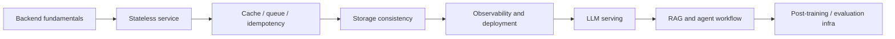

# System Design Overview · 面向 ML / LLM 岗位的系统设计笔记

> [!info] 定位
> 这个板块不是通用 system design 课程的搬运。通用基础会参考 Hello Interview 的 System Design in a Hurry 和 s09g 的系统设计材料；因为版权和学习效率问题，这里不重复原始资料的题解文本，而是把重点放在 ML / LLM 岗位更容易被追问的部分：LLM serving、RAG、agent workflow、post-training infra、GPU 资源调度、可观测性和可靠性。

---

## 一、怎么使用这组笔记

传统 system design 面试通常会围绕：

- API / 数据模型 / 存储选型
- 缓存、队列、限流、幂等、异步任务
- 负载均衡、可用性、容灾、部署
- 数据一致性和可观测性

这些基础仍然必须会。推荐先用两类材料建立通用框架：

- [Hello Interview · System Design in a Hurry](https://www.hellointerview.com/learn/system-design/in-a-hurry/introduction)：适合快速补齐面试结构、常见组件和 delivery framework。
- s09g 的 system design 系列公开视频 / 博客：适合练习把系统拆成请求路径、存储路径和异步处理路径。

本板块在这个基础上继续往下走，重点回答传统材料里通常讲得不深的问题：

- ChatGPT-like 服务为什么不是普通 CRUD 服务？
- KV cache、prefix cache、continuous batching 会怎样改变“无状态服务”的定义？
- RAG 和 agent 系统里的状态到底放在哪里？
- LLM serving 的 router、scheduler、GPU worker、object store、metadata DB 怎么分工？
- 训练 / 评测 / rollout worker 如何设计成可替换的计算单元？

---

## 二、学习路线



第一遍复习时，不要急着背组件名。每一题都按四个问题拆：

1. 请求进来以后走哪条路径？
2. 不可丢失的状态在哪里？
3. 哪些计算节点可以随时扩容、重启、替换？
4. 失败、重试、扩容、热点流量会改变哪些假设？

这四个问题比“用不用 Redis / Kafka / Kubernetes”更底层。

---

## 三、通用系统和 LLM 系统的差别

| 维度 | 传统 Web / 后端服务 | LLM / Agent 系统 |
|---|---|---|
| 主要成本 | DB 查询、网络、缓存 miss、异步任务 | GPU decode、prefill、KV cache、模型调用、工具调用 |
| 状态大小 | session、订单、文件 metadata，通常较小 | KV cache、conversation、retrieval context、tool trace、trajectory，可能很大 |
| 延迟形态 | 多数请求一次响应 | streaming token、长任务、multi-step agent loop |
| 扩容单元 | Web replica / worker | API replica / router / GPU worker / reward worker / rollout worker |
| 关键瓶颈 | DB、cache、queue、下游服务 | GPU memory、HBM bandwidth、batch scheduler、KV capacity、模型版本 |
| 失败处理 | retry、idempotency key、事务、DLQ | retry + token provenance、partial generation、cache eviction、sandbox cleanup |

LLM system design 不是把“调用模型”塞进普通后端图里就结束了。模型调用会把状态、成本和调度问题全部放大：一个请求可能占住 GPU 几秒到几分钟；一次长上下文 prefill 可能读写数 GB KV；一次 agent run 可能产生几十个工具调用和环境状态转移。

---

## 四、本板块目录

1. [[SystemDesign01 Stateless Service]]：无状态服务。先讲传统 Web 怎么落地，再讲 LLM serving / agent training 为什么只能做到 stateless-ish。

后续计划：

- Cache、TTL、cache invalidation 和 LLM prefix cache
- Queue、worker pool、幂等和长任务执行
- Rate limiting、quota、fair scheduling 和 GPU 资源隔离
- ChatGPT-like system design
- RAG system design
- Agent workflow / sandbox system design
- LLM evaluation platform
- Feature store / embedding pipeline / vector search

---

## 五、复习题

```quiz
title: System Design Overview · Check 1
question: 为什么 LLM system design 不能只按普通 Web CRUD 服务来回答？
answer: C
A. 因为 LLM 系统不需要数据库
B. 因为 LLM 系统一定不能使用缓存
C. 因为模型推理引入 GPU 调度、KV cache、streaming 和长任务状态，改变了请求路径和瓶颈
D. 因为所有 LLM 请求都必须同步执行
explanation: LLM 系统仍然需要传统后端组件，但 GPU worker、KV cache、batch scheduler、模型版本和工具调用会成为核心设计点。
```

```quiz
title: System Design Overview · Check 2
question: 设计任何系统时，最应该先问哪个问题？
answer: B
A. 用 Kafka 还是 Redis Stream
B. 不可丢失的状态在哪里，哪些计算节点可以随时替换
C. 前端用 React 还是 Vue
D. 是否所有接口都走 GraphQL
explanation: 组件选型要服务于状态归属、请求路径、失败恢复和扩展边界。
```
