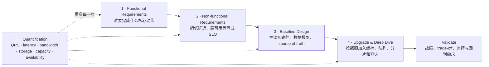
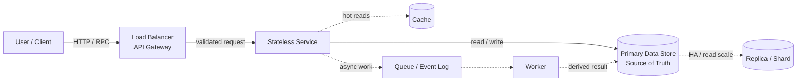

# System Design Overview · 从需求到可扩展架构

System Design 不是背一张“标准架构图”，而是把需求逐步翻译成架构决策：

> 先画出能工作的最小闭环，再让 non-functional requirements 拉着系统有理由地变复杂；每次升级都要说明它解决的瓶颈、需要的数量级和引入的代价。

---

## 一张图记住一般流程



最终回答应该形成一条可以追溯的因果链：

```text
Requirement
  -> 数量级与 SLO
  -> 当前瓶颈
  -> 设计选择
  -> trade-off
  -> 如何验证
```

如果无法说清一个组件在满足哪条需求，它很可能暂时不应该出现在图里。

---

## Step 1 · Functional Requirements

Functional requirements 回答：**系统必须实现什么基本功能？**

不要一开始把整个产品都设计出来。先确认用户和最重要的 2～4 条 use case：

```text
Actor：谁在使用？
Action：用户要执行什么动作？
Object：动作作用在哪个核心对象上？
Input / Output：系统接收什么，返回什么？
Scope：这次明确做什么、不做什么？
```

通用写法：

```text
Must have
1. 用户可以创建核心对象。
2. 用户可以按 ID 或条件读取核心对象。
3. 用户可以更新或删除自己有权限的对象。

Out of scope
- 推荐、广告、复杂分析等非核心能力暂不展开。
- 管理后台只保留与主链路直接相关的能力。
```

### 为什么必须先缩小范围

不同功能会产生完全不同的主路径：

```text
上传内容：write path、对象存储、异步处理更重要
搜索内容：索引、召回、读延迟更重要
消息投递：顺序、fan-out、离线用户与重试更重要
支付交易：一致性、幂等、审计与正确性更重要
```

如果功能边界没有确定，后面的 QPS、数据模型和架构都没有计算对象。

### 这一步的输出

- 2～4 条核心用户故事
- 明确的 API 行为或输入输出
- 核心数据对象
- out-of-scope 列表
- 哪条是最重要的 read path，哪条是最重要的 write path

---

## Step 2 · Non-functional Requirements

Non-functional requirements 回答：**系统不仅要能工作，还要工作得怎么样？**

“低延迟”“高可用”“可扩展”只是方向，必须尽量翻译成数字。

| 性质 | 应该追问什么 | 可量化表达示例 |
|---|---|---|
| Latency | 哪个操作、哪个 percentile？ | read p99 < 200 ms |
| Availability | 允许多久不可用？ | monthly availability 99.99% |
| Throughput | 平均与峰值负载？ | average 2.3K QPS，peak 12K QPS |
| Scalability | 未来增长多少？ | 一年内流量和数据增长 10 倍 |
| Durability | 数据能否丢失？ | object durability 99.999999999% |
| Consistency | 哪些读必须看到最新写入？ | payment 强一致，feed 可最终一致 |
| Fault tolerance | 哪些故障必须自动恢复？ | 单实例、单 AZ 故障不影响服务 |
| Recovery | 能丢多少数据、多久恢复？ | RPO < 5 min，RTO < 30 min |
| Security / Privacy | 有什么访问与合规边界？ | encryption、RBAC、audit、retention |

### 容易混淆的概念

```text
Availability：现在能不能提供服务
Durability：已经确认保存的数据会不会永久丢失
Fault tolerance：某个组件坏掉时，系统能否继续工作
Scalability：负载增长时，能否通过加资源继续承载
```

它们互相关联，但不是同一个目标。例如多副本可能同时改善 availability 和 durability，却会增加成本，并让一致性协议更复杂。

### NFR 之间通常存在冲突

```text
更强一致性       <-> 更低延迟、更高可用
同步复制更多副本 <-> 更高写延迟
缓存更多数据     <-> 更难保证新鲜度
自动重试         <-> 故障时可能放大流量
跨区域容灾       <-> 成本、复制延迟、数据主权
```

好的设计不是让每个指标都无限好，而是明确本题优先保护什么。

### 这一步的输出

一份很短但带数字的 design target：

```text
Traffic: peak 12K QPS，read : write = 9 : 1
Latency: read p99 < 200 ms，write p99 < 500 ms
Availability: 99.99%
Consistency: read-your-writes；其他读取允许秒级最终一致
Recovery: RPO < 5 min，RTO < 30 min
Growth: 预留 30% headroom，可水平扩展到当前负载的 10 倍
```

---

## Step 3 · 先画最小可工作的功能图

不要从 Kafka、Redis、微服务和跨区域复制开始。先画出一个请求如何完成核心功能：



[打开可编辑的 draw.io 架构源图](/diagrams/system-design-overview.drawio)

图里的实线是最小同步闭环，虚线组件只有在需求能够证明其必要性时才加入。

### 常见 block 分别负责什么

| Block | 核心职责 | 这一层先不要塞什么 |
|---|---|---|
| User / Client | 发起请求、展示结果、必要的客户端缓存 | 服务端 source of truth |
| DNS / Load Balancer | 找到健康入口、分发连接 | 复杂业务逻辑 |
| API Gateway | auth、rate limit、routing、request validation | 重计算和长事务 |
| Stateless Service | 核心业务规则和 orchestration | 只存在本机、无法恢复的会话状态 |
| Data Store | 保存 source of truth、索引、事务边界 | 所有派生数据都塞进同一个模型 |
| Cache | 加速热点读取、吸收重复请求 | 唯一可信副本 |
| Queue / Event Log | 解耦、削峰、重试、事件传播 | 默认提供 exactly-once |
| Worker | 异步计算、批处理、外部调用 | 无限重试且没有幂等保护 |
| Object Store | 大对象、图片、视频、模型与文件 | 高频小事务查询 |

### 画图时必须讲清楚四件事

#### 1. Read path

```text
请求从哪里进入？
先查 cache 还是直接查 database？
cache miss 后谁回填？
返回的数据允许多旧？
```

#### 2. Write path

```text
谁是 source of truth？
什么时候向用户确认成功？
哪些动作必须同步完成？
哪些副作用可以写入 queue 后异步完成？
```

#### 3. Data model

至少列出：

```text
核心 entity
primary key / partition key
主要 query pattern 与 index
单条记录大约多大
retention policy
source of truth、cache 和 derived view 的区别
```

#### 4. Trust boundary

说明 authentication、authorization、encryption、PII 和 audit 分别在哪一层处理。安全不应该在最后一句“再加 encryption”里一笔带过。

### 基础图的检查标准

- 每条核心 use case 都能沿着箭头走完
- read path 和 write path 清晰
- source of truth 唯一且明确
- 每个 stateful block 都知道保存什么
- 每个同步调用都进入 latency budget
- 暂时没有无法由需求解释的组件

---

## Step 4 · 根据 NFR 升级系统

升级时使用同一个句式：

```text
因为 [某条带数字的 NFR]
当前 [某个 block / link] 会成为瓶颈或单点
所以加入 [某种机制]
代价是 [成本、一致性、复杂度或延迟]
并通过 [指标、压测、故障演练] 验证
```

### 从要求到设计选择

| NFR / 风险 | 可能的瓶颈 | 常见升级 | 必须说明的代价 |
|---|---|---|---|
| read p99 太高 | database random read | index、cache、read replica、CDN | stale data、cache invalidation |
| peak QPS 增长 | 单个 service instance | stateless service + load balancing + autoscaling | cold start、capacity lag |
| write QPS 增长 | 单主库、热点 partition | batching、partition / shard、log-based ingestion | 跨 shard 查询与事务 |
| 突发流量 | downstream 处理不过来 | queue、backpressure、rate limit、load shedding | 延迟增加、可能返回降级结果 |
| 99.99% availability | 单实例、单 AZ、单数据库 | redundant instances、multi-AZ、health check、failover | 成本、故障切换复杂度 |
| 数据不能丢 | 磁盘或区域故障 | replicated log、backup、cross-region copy | 写延迟、恢复演练成本 |
| 全局低延迟 | 用户离主 region 太远 | CDN、edge cache、geo replication | 一致性与数据驻留 |
| hot key | 单 partition 超载 | key salting、二级分片、local aggregation | read fan-out、重组结果 |
| 下游故障 | timeout 与 retry storm | timeout、bounded retry、jitter、circuit breaker | 部分失败与降级语义 |

### 一个典型的升级顺序

这个顺序不是固定答案，但能防止“一上来堆组件”：

```text
Baseline
  User -> Gateway -> Service -> Primary Store

读延迟或读流量不够
  + index / cache / read replica / CDN

写入突发或异步副作用拖慢请求
  + queue / worker / backpressure / idempotency

单机容量不够
  + partition / shard / distributed index

可用性与容灾不够
  + redundancy / multi-AZ / backup / failover

全球访问或 region 级故障
  + geo routing / cross-region replication
```

每升级一次，都重新回答：

```text
新的 source of truth 是谁？
一致性语义变了吗？
失败时会发生什么？
容量提高了多少？
新的瓶颈移到了哪里？
```

### Deep dive 应该选哪里

不要平均介绍所有框。优先深入最能决定系统成败的 1～2 个地方：

- 最大的 scale bottleneck
- 最难满足的 latency / consistency target
- 最危险的 hot key 或 fan-out
- 最复杂的 failure recovery
- 最关键的数据模型与 partition key

设计重点由题目的 NFR 决定，而不是由组件是否“高级”决定。

---

## 数值估算应该怎样贯穿每一步

Back-of-the-envelope estimation 的目的不是算出精确账单，而是排除数量级错误，并找出谁会先成为瓶颈。

| 设计阶段 | 需要估什么 | 数字如何影响下一步 |
|---|---|---|
| Functional requirements | 用户数、每用户操作数、对象大小、保留时间 | 决定流量和数据规模 |
| Non-functional requirements | peak QPS、p99、availability、RPO / RTO | 形成明确 SLO |
| Baseline diagram | 每条边的 QPS、payload、latency，每个 store 的增长 | 找出瓶颈与单点 |
| Upgrade | instances、partitions、replicas、cache、workers、headroom | 验证升级是否真的够用 |

### 估算的一般规则

1. 先写假设和单位，再代公式。
2. 平均负载用于长期存储和成本，峰值负载用于在线容量。
3. 保留一位有效数字通常足够，重点是数量级。
4. 给出范围或 peak factor，不伪装成精确预测。
5. 最后做 sanity check：这个数字是否符合现实世界常识？

---

## 1. QPS 与读写比例

如果已知 DAU 和每个用户每天的操作次数：

$$
QPS_{avg}=\frac{DAU\times actions\ per\ user\ per\ day}{86,400}.
$$

$$
QPS_{peak}=QPS_{avg}\times peak\ factor.
$$

常用 peak factor 可以先假设为 2～10，再说明实际系统应从监控数据获得。

如果读写比例为 $r:w$：

$$
read\ QPS=total\ QPS\times\frac{r}{r+w},
$$

$$
write\ QPS=total\ QPS\times\frac{w}{r+w}.
$$

### 并发请求数

Little's Law 给出一个非常实用的近似：

$$
concurrency\approx throughput\times average\ latency.
$$

例如 12K QPS、平均请求耗时 100 ms：

$$
12,000\times0.1=1,200
$$

大约有 1,200 个请求同时处于系统中。连接池、线程池和 in-flight limit 至少要能解释这个量级。

---

## 2. Bandwidth

$$
bandwidth=QPS\times average\ payload\ size.
$$

分别估 ingress 和 egress，因为响应往往比请求大，而且云服务的 egress 成本可能更重要。

```text
12K response/s × 2 KB/response
≈ 24 MB/s
≈ 192 Mb/s
```

如果存在 fan-out，不能只算入口流量。一个请求查询 20 个 shard，会在内部制造更大的 east-west traffic。

---

## 3. Storage

先算逻辑数据，再加入物理放大：

$$
logical\ storage=write\ rate\times item\ size\times retention.
$$

$$
physical\ storage=logical\ storage\times replication\ factor\times overhead.
$$

overhead 至少考虑：

- index
- metadata
- tombstone / version
- compression ratio
- replication
- backup
- temporary compaction space

不要使用 peak write QPS 乘一整年来估长期存储；长期增长通常使用 average write rate，在线吞吐容量才使用 peak。

---

## 4. Service instances

先通过压测得到或合理假设单实例的安全吞吐，再加入 headroom：

$$
instances=\left\lceil\frac{peak\ QPS\times headroom}{safe\ QPS\ per\ instance}\right\rceil.
$$

安全吞吐应该是在目标 p99 latency 下测得的，而不是 CPU 100% 时的极限数字。

还要检查失去一个 AZ 或一部分实例后，剩余容量能否继续承载流量。正常状态 30% headroom 并不自动意味着能够容忍 50% 容量损失。

---

## 5. Queue 与 worker

队列稳定的基本条件是长期处理速率大于到达速率：

$$
\mu>\lambda.
$$

如果每个 task 平均需要 $T$ 秒，目标利用率是 $u$：

$$
workers\approx\frac{task\ rate\times T}{u}.
$$

还应该估计：

```text
backlog = arrival rate - processing rate
drain time = queued tasks / spare processing rate
```

仅仅说“加 Kafka 削峰”不够。队列只能把压力延后，worker 最终仍要有能力清空 backlog。

---

## 6. Availability 与 error budget

30 天内的近似 error budget：

| Availability | 每月允许不可用时间 |
|---:|---:|
| 99.9% | 43.2 min |
| 99.99% | 4.32 min |
| 99.999% | 25.9 sec |

串行依赖的整体 availability 近似为：

$$
A_{system}=A_1\times A_2\times\cdots\times A_n.
$$

因此同步依赖越多，主路径越脆弱。并行冗余可以改善可用性，但只有在故障相互独立时，理论收益才接近：

$$
A_{redundant}=1-(1-A)^k.
$$

同一配置错误、同一 region、同一个 dependency 会产生 correlated failure，不能把它们当成独立副本。

---

## 7. Latency budget

把端到端目标分给主路径上的组件：

```text
目标：read p99 < 200 ms

edge + gateway       20 ms
service compute      30 ms
cache / database     80 ms
downstream           40 ms
margin               30 ms
```

这是一份设计预算，不是严格的 p99 概率相加。分析 critical path 时：

```text
串行调用：latency 大致累加
并行调用：主要由最慢分支决定
大量 fan-out：tail latency 被放大
```

所以“并行调用 100 个 shard”即使平均值很好，也可能被最慢的那个 shard 拖累。

---

## 一个完整的数量级例子

假设：

```text
DAU = 10M
每用户每天 20 次操作
read : write = 9 : 1
peak factor = 5
平均响应 = 2 KB
每次写入 = 1 KB
replication factor = 3
index / metadata overhead = 30%
```

### Traffic

```text
每天操作数 = 10M × 20 = 200M
average QPS = 200M / 86,400 ≈ 2.3K
peak QPS = 2.3K × 5 ≈ 12K
peak read QPS ≈ 10.8K
peak write QPS ≈ 1.2K
```

### Bandwidth

```text
peak egress ≈ 12K × 2 KB
            ≈ 24 MB/s
            ≈ 192 Mb/s
```

### Storage growth

长期存储使用 average write volume：

```text
每天写入数 = 200M × 10% = 20M
raw growth = 20M × 1 KB ≈ 20 GB/day
physical growth ≈ 20 GB × 3 replicas × 1.3 overhead
                ≈ 78 GB/day
一年约 28.5 TB
```

### Service capacity

假设一个实例在目标 p99 下可以安全处理 800 QPS，并保留 30% headroom：

```text
instances = ceil(12K × 1.3 / 800)
          ≈ 20 instances
```

这些数字不会直接告诉你“应该用哪种数据库”，但会快速排除明显不合理的选择，并提示数据库吞吐、磁盘增长、网络和实例数分别处于什么量级。

---

## 估算时最常见的错误

### 1. 平均值和峰值混用

```text
在线 capacity：使用 peak
长期 storage：通常使用 average
```

### 2. 忘记单位换算

```text
Byte 与 bit 相差 8 倍
GB 与 GiB 不完全相同
ms 必须除以 1000 才是秒
```

### 3. 只算用户入口，不算内部放大

fan-out、replication、retry、index 和 compaction 都可能让内部负载远大于入口 QPS。

### 4. 只给结果，不写假设

估算最重要的是可审查。面试官可以不同意 peak factor，但必须看得见你为什么选择它。

### 5. 给出过度精确的数字

System Design 更关心 10K 还是 10M QPS，而不是 11,574.07 QPS。使用近似值，并说明需要用 production metrics 或 benchmark 校准。

---

## 面试中的推荐时间分配

以 45 分钟为例：

| 时间 | 任务 |
|---:|---|
| 0～5 min | 功能边界、用户、核心 use case |
| 5～10 min | NFR、SLO、读写比例、粗估 |
| 10～20 min | API、data model、baseline architecture |
| 20～35 min | 按 NFR 升级并 deep dive 1～2 个重点 |
| 35～42 min | failure、consistency、trade-off、observability |
| 42～45 min | 总结设计并回到原始需求 |

如果面试官对某个部分持续追问，就跟随信号深入，不必机械遵守时间表。

---

## 最终检查清单

### Requirements

- [ ] 核心功能不超过 2～4 条
- [ ] 明确了 out of scope
- [ ] NFR 已经转成 p99、QPS、availability、RPO / RTO 等数字

### Baseline

- [ ] 先画最小同步闭环
- [ ] read path 与 write path 都能走通
- [ ] source of truth、cache、derived data 已区分
- [ ] data model 服务于真实 query pattern

### Scale and reliability

- [ ] 每个新增组件都由某条 NFR 驱动
- [ ] 给出了容量、headroom、replication 或 partition 的数量级
- [ ] 分析了 timeout、retry、幂等、backpressure 与 failover
- [ ] 知道系统降级时保护什么、牺牲什么

### Communication

- [ ] 先讲 bottleneck，再讲技术名词
- [ ] 每个选择都包含 trade-off
- [ ] 重点深入 1～2 个难点，没有平均介绍所有框
- [ ] 最后回到 requirements，确认设计真正满足目标

---

## 一句话记忆

```text
先定功能边界，
再把性质写成数字，
先画 User -> Gateway -> Service -> Data Store 的最小闭环，
然后让 NFR 有理由地加入 cache、queue、shard 和 redundancy，
最后用 QPS、latency、storage、capacity 与 failure 验证整套设计。
```
