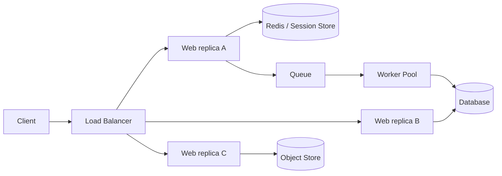
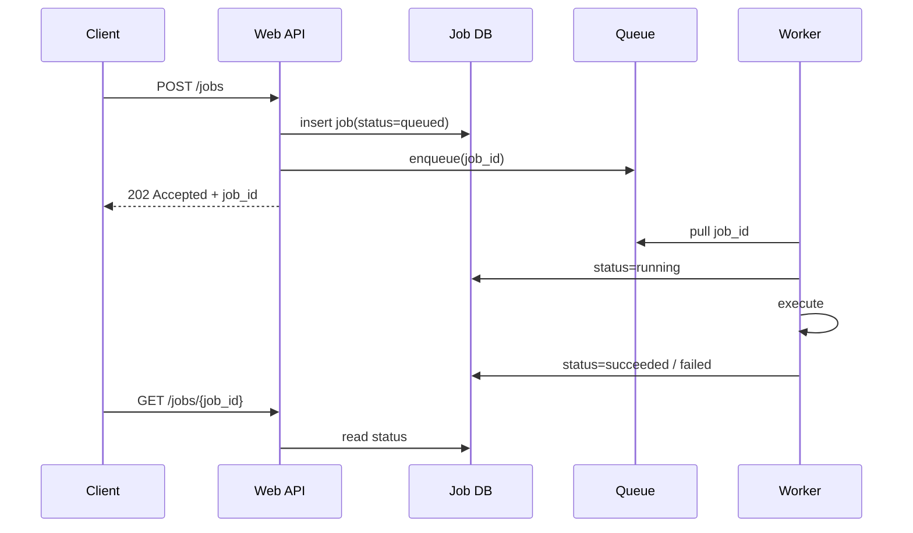
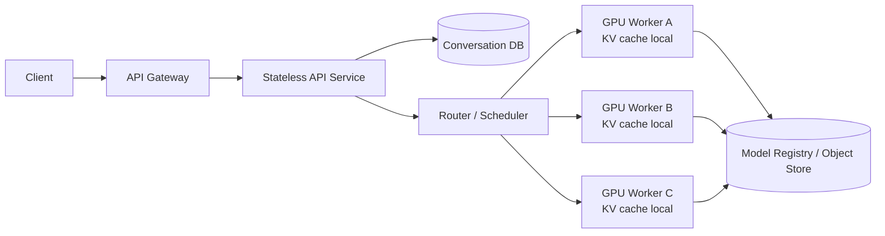
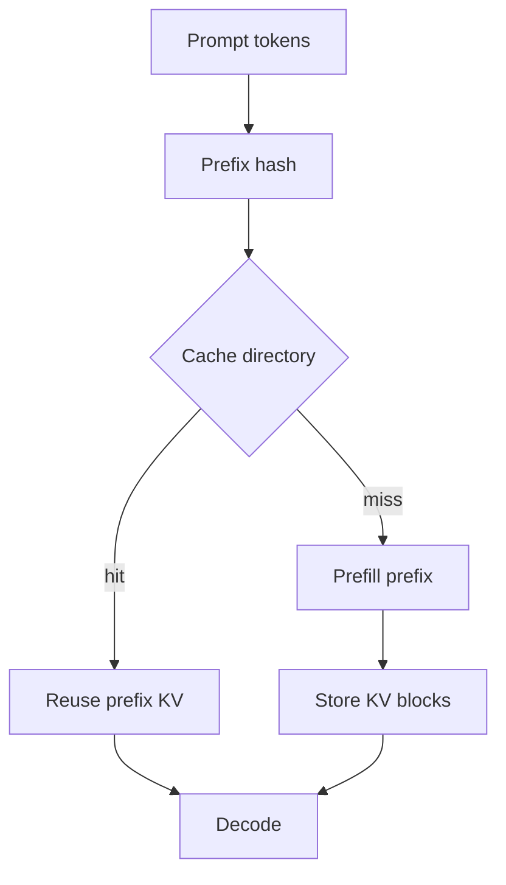
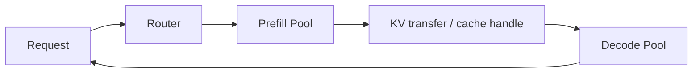

# System Design 01 · 无状态设计范式：把服务实例做成可替换计算单元

> [!info] 范式一句话
> **Stateless 不是“系统里没有状态”，而是“服务进程本身不拥有不可丢失的状态”。** 状态可以存在，而且一定会存在；关键是把不可丢失的状态放到外部系统里：DB、Redis、对象存储、消息队列、checkpoint store、feature store、model registry 等。服务实例只负责拿输入、查共享状态、计算、写回共享状态或返回结果。

---

## 目录

1. [[#一、为什么这是第一种设计范式]]
2. [[#二、范式定义：服务进程不拥有不可丢失状态]]
3. [[#三、传统 Web 里的落地方式]]
4. [[#四、开发实现：API、DB、Redis、Queue 的职责边界]]
5. [[#五、部署实现：LB、health check、graceful shutdown、autoscaling]]
6. [[#六、代价：状态没有消失，只是被移动了]]
7. [[#七、LLM serving：为什么它更难]]
8. [[#八、LLM 里的具体解决方案]]
9. [[#九、练习题]]

---

## 一、为什么这是第一种设计范式

无状态设计范式是 system design 里最先要掌握的一种范式。原因很简单：大部分在线系统最后都会变成“很多个 service replica 一起接流量”。一旦有多个 replica，就必须回答两个问题：

```text
下一个请求可以被任意一台机器处理吗？
如果这台机器现在被 kill 掉，系统会不会丢掉不可恢复的数据？
```

如果答案是“可以”，服务层就容易扩容、发布和恢复；如果答案是“不行”，系统就会被某台机器、某个进程、某块本地磁盘绑住。无状态设计的本质，就是把服务实例从“保存状态的机器”改造成“可替换的计算单元”。

这个范式最常出现在这些地方：

| 场景 | 为什么需要 stateless |
|---|---|
| Web API / backend service | 负载均衡器才能把请求发到任意 replica，扩容时只需要加机器 |
| 用户登录 / session | 用户下一次请求可能到另一台机器，所以登录状态不能只在本机内存 |
| 文件上传 / 下载 | 文件不能只在某个 pod 的本地磁盘，否则换机器后就找不到 |
| 异步任务 / worker pool | 任务跑很久，worker 挂了以后必须能重试或从 checkpoint 恢复 |
| 滚动部署 | 老实例可以安全下线，新实例可以接流量，不需要迁移本机私有状态 |
| 自动扩缩容 | replica 可以随时增加或减少，系统状态不绑定某个固定进程 |

它带来的好处可以拆成四类：

| 好处 | 具体含义 |
|---|---|
| 横向扩容 | 流量上来时复制更多 replica，负载均衡器直接分流 |
| 故障隔离 | 单个实例挂掉不会带走用户状态、任务状态或文件状态 |
| 滚动发布 | 新实例 ready 后接流量，老实例 drain 后下线，不需要停机迁移本机状态 |
| 运维简单 | autoscaling、health check、graceful shutdown、retry 才能真正工作 |

在 LLM 系统里，这个概念更重要，也更容易误解。API gateway、auth service、billing service、conversation metadata service 仍然可以按传统 Web stateless 来设计；但 GPU inference worker 会有 KV cache、batching queue、sampling state、streaming connection 等热状态，完全 stateless 往往不现实。

因此 LLM 里更准确的目标是：

```text
control plane 尽量 stateless
durable state 放到 DB / object store / model registry / event log
GPU data plane 可以 locally stateful，但这些状态要可丢弃、可重算、可迁移或可恢复
```

这也是本讲要建立的核心直觉：先理解传统 Web 怎么做无状态服务，再看 LLM serving 为什么常常只能做到“控制面无状态，数据面有状态但可恢复”。

---

## 二、范式定义：服务进程不拥有不可丢失状态

一个 stateless service replica 可以被这样理解：

```text
request
  -> read shared state
  -> compute
  -> write shared state / return response
```

服务进程本地可以有状态，但这些状态必须满足一个条件：

> 丢了不影响 correctness，只影响性能或短期可用性。

本地允许保留：

```text
代码
配置快照
连接池
临时内存 cache
token 验证公钥
本地日志 buffer
正在处理的 request stack
```

本地不能成为唯一来源：

```text
用户登录状态
购物车
订单状态
支付状态
文件状态
workflow 进度
job 运行状态
全局计数器
```

更精确的说法是：

```text
local state = disposable / reconstructable
shared state = durable / authoritative
```

这也是为什么很多工程师会说“stateless service”而不是“stateless system”。整个系统当然有状态；无状态的是可以横向复制的服务层。

---

## 三、传统 Web 里的落地方式

典型链路：



负载均衡器可以把请求发到任意 replica。要做到这一点，Web replica 不能依赖“上一个请求刚好也在我这里处理”。

### 3.1 Session 外置

错误做法：

```python
# 只存在某台机器的内存里
sessions[user_id] = {"logged_in": True, "cart_id": "cart_123"}
```

问题是下一次请求可能被发到另一台机器。

常见正确做法有两种。

**方案 A：Session store**

```text
Client cookie: session_id=abc123

Web service:
  1. 解析 cookie
  2. redis.get("session:abc123")
  3. 校验登录状态和权限
  4. 处理请求
```

伪代码：

```python
def auth_middleware(request):
    session_id = request.cookies.get("session_id")
    if not session_id:
        raise Unauthorized()

    session = redis.get_json(f"session:{session_id}")
    if not session or session["expires_at"] < now():
        raise Unauthorized()

    request.user_id = session["user_id"]
```

优点是撤销登录、刷新权限、强制下线都容易。缺点是每次请求多一次 Redis 依赖。

<details class="solution">
<summary>技术背景：Session store 到底保存什么？</summary>

Session store 通常保存的是“服务器认可的登录状态”，key 是一个随机 session id，value 是 user id、过期时间、权限版本、登录设备、风险标记等信息。

```text
session:abc123 -> {
  user_id: 42,
  expires_at: 2026-06-28T12:00:00Z,
  role_version: 17,
  device_id: "iphone-15",
  mfa_passed: true
}
```

它适合需要强控制的系统：可以随时删除 session 强制用户下线，也可以在权限变化后让旧 session 失效。代价是每次请求要查 Redis / DB，所以 session store 自己要做高可用、TTL、容量和降级策略。

</details>

**方案 B：JWT**

```text
Client Authorization: Bearer <jwt>

Web service:
  1. 本地验证签名
  2. 检查 exp / aud / issuer
  3. 从 claims 里拿 user_id / role
```

JWT 减少 session store 查询，但撤销、权限更新、密钥轮换会更复杂。很多生产系统会混合使用：JWT 做快速认证，Redis / DB 做撤销列表、权限版本或高风险操作二次检查。

<details class="solution">
<summary>技术背景：JWT 为什么适合 stateless API？</summary>

JWT 可以理解成“服务端签过名的用户声明”。它通常由三部分组成：

```text
header.payload.signature
```

payload 里会放：

```json
{
  "sub": "user_42",
  "exp": 1782680000,
  "aud": "api.example.com",
  "role": "admin"
}
```

API replica 只要有验证公钥或共享密钥，就可以本地验证 signature，不需要每次访问 session store。这让认证路径更无状态，也更适合多 region / 多 replica。

JWT 的缺点也来自这里：token 一旦发出去，在过期之前理论上都有效。要做强制登出、权限即时更新、封禁用户，通常需要额外设计 revoke list、token version、短过期时间 + refresh token，或者让高风险操作回查 DB。

</details>

### 3.2 文件外置到对象存储

错误做法：

```text
用户上传文件 -> web-03:/tmp/upload.csv
```

如果后续请求去了 `web-07`，文件就找不到；如果 pod 被替换，文件也没了。

正确做法：

```text
POST /files
  -> Web service 接收 upload
  -> 写入 S3 / GCS / Azure Blob / MinIO
  -> DB 只保存 file_id、object_key、owner、checksum、status
```

一个最小表结构：

```sql
CREATE TABLE files (
  file_id        BIGSERIAL PRIMARY KEY,
  owner_id       BIGINT NOT NULL,
  object_key     TEXT NOT NULL,
  content_type   TEXT,
  size_bytes     BIGINT NOT NULL,
  checksum_sha256 TEXT NOT NULL,
  status         TEXT NOT NULL,
  created_at     TIMESTAMP NOT NULL
);
```

服务返回：

```json
{
  "file_id": "123",
  "status": "uploaded"
}
```

之后任何 replica 都通过 `file_id -> object_key -> object store` 访问同一个文件。

### 3.3 长任务丢到队列

错误做法：

```text
POST /run-report
  -> Web process 直接跑 20 分钟
  -> HTTP request 一直挂着
```

风险：

- Web 进程重启，任务丢
- LB / client 超时
- 部署时无法安全下线
- 任务进度只在内存里

正确做法：



Web service 不需要记得任务。它只负责创建任务、查询任务、取消任务。任务状态在 DB，执行权在 worker，排队状态在 queue。

<details class="solution">
<summary>技术背景：消息队列在这里解决什么问题？</summary>

消息队列把“接收请求”和“执行耗时任务”解耦。Web API 只需要把任务写入 DB 并投递一个消息，然后立即返回 `job_id`；worker 可以按自己的速度消费任务。

队列主要提供四个能力：

| 能力 | 含义 |
|---|---|
| buffer | 流量突增时先排队，不让 Web 进程被长任务占满 |
| retry | worker 失败后消息可以重新投递 |
| backpressure | 队列长度反映下游处理不过来，可以限流或扩 worker |
| isolation | Web API 和 worker 可以独立扩容、独立部署 |

常见队列语义是 at-least-once：消息至少会投递一次，但可能重复投递。因此 worker 必须幂等，不能假设一个 job 只会执行一次。

</details>

---

## 四、开发实现：API、DB、Redis、Queue 的职责边界

这一节回答“具体怎么写系统”。

### 4.1 API 设计

以异步任务为例，一组比较干净的 API：

```text
POST   /jobs              创建任务，返回 job_id
GET    /jobs/{job_id}     查询状态
POST   /jobs/{job_id}/cancel  请求取消
GET    /jobs/{job_id}/result  读取结果或下载链接
```

创建任务最好支持 idempotency key：

```http
POST /jobs
Idempotency-Key: user_42:report:2026-06-28
```

服务端逻辑：

```python
def create_job(request):
    key = request.headers.get("Idempotency-Key")
    if key:
        existing = db.get_job_by_idempotency_key(request.user_id, key)
        if existing:
            return existing

    job = db.insert_job(
        user_id=request.user_id,
        status="queued",
        idempotency_key=key,
        payload=request.json,
    )
    queue.publish({"job_id": job.id})
    return {"job_id": job.id, "status": job.status}
```

这样 client 超时后重试，不会重复创建两个任务。

<details class="solution">
<summary>技术背景：Idempotency key 怎么避免重复写？</summary>

Idempotency key 是 client 给一次业务操作生成的唯一 key。服务端把 `(user_id, idempotency_key)` 做成唯一约束。相同 key 的重试请求不会重复创建资源，而是返回第一次请求的结果。

典型场景：

```text
支付扣款
创建订单
提交长任务
上传文件 finalize
触发模型训练 job
```

它解决的是“客户端不知道上一次请求到底成功还是失败”的问题。比如 client 超时了，但服务端其实已经创建了 job；如果没有 idempotency key，重试会创建第二个 job。

关键实现点：

```text
1. client 对同一次业务操作复用同一个 key
2. DB 上有唯一约束
3. 服务端保存第一次请求的结果或资源 id
4. retry 时返回已有结果，而不是重新执行副作用
```

</details>

### 4.2 DB 是 authoritative state

最小 `jobs` 表：

```sql
CREATE TABLE jobs (
  job_id             BIGSERIAL PRIMARY KEY,
  user_id            BIGINT NOT NULL,
  idempotency_key    TEXT,
  status             TEXT NOT NULL,
  payload_json       JSONB NOT NULL,
  result_object_key  TEXT,
  error_message      TEXT,
  attempt_count      INT NOT NULL DEFAULT 0,
  created_at         TIMESTAMP NOT NULL,
  updated_at         TIMESTAMP NOT NULL,
  UNIQUE(user_id, idempotency_key)
);
```

状态机：

```text
queued -> running -> succeeded
queued -> running -> failed
queued -> cancelled
running -> cancelling -> cancelled
running -> failed -> queued   (retry)
```

面试里不要只说“用 queue”。要说清楚状态谁说了算。通常 DB 是任务状态的最终来源，queue 只是触发 worker 执行的 delivery mechanism。

### 4.3 Worker 需要 lease，而不是永久拥有任务

如果 worker 从 queue 拿到任务后挂了，任务不能永久卡在 running。常见做法是 lease：

```sql
UPDATE jobs
SET status = 'running',
    leased_until = now() + interval '5 minutes',
    worker_id = :worker_id,
    attempt_count = attempt_count + 1
WHERE job_id = :job_id
  AND status IN ('queued', 'retryable')
RETURNING *;
```

worker 执行时定期 heartbeat：

```text
UPDATE jobs SET leased_until = now() + 5min WHERE job_id = ...
```

如果 `leased_until < now()`，scheduler 可以把任务重新入队。

这让 worker 变成可替换的计算节点：

```text
worker 挂了
  -> lease 过期
  -> job 重新进入 queue
  -> 另一个 worker 继续执行或从 checkpoint 恢复
```

### 4.4 Redis 适合快状态，不适合唯一真相

Redis 常用于：

```text
session
rate limit counter
short TTL cache
distributed lock
job progress cache
feature flag cache
```

但要小心：如果 Redis 里的数据丢了，系统应该知道怎么恢复。比如任务最终状态最好在 DB；Redis 里的 progress 可以是加速查询的 cache。

一个常见模式：

```text
Worker -> Redis: progress:job_id = 37%
Worker -> DB: status/result/checkpoint
API GET /jobs/{id}:
  先读 DB 的 authoritative status
  再读 Redis 的 best-effort progress
```

### 4.5 Cache 可以本地存在，但必须可重建

本地 cache 适合：

```text
权限规则
feature flag
配置文件
热点商品 metadata
token signing public keys
模型 tokenizer config
```

不适合：

```text
唯一 session
唯一订单状态
唯一 payment result
唯一 job progress
唯一 workflow state
```

判断标准：

```text
kill -9 这个 replica 后，系统是否还能给出正确答案？
```

如果答案是否定的，这个状态就不应该只在本地。

---

## 五、部署实现：LB、health check、graceful shutdown、autoscaling

Stateless 不是只靠代码结构，也依赖部署协议。

### 5.1 Readiness 和 liveness 分开

Kubernetes 里常见：

```yaml
readinessProbe:
  httpGet:
    path: /ready
    port: 8080

livenessProbe:
  httpGet:
    path: /healthz
    port: 8080
```

区别：

| Probe | 含义 | 失败后行为 |
|---|---|---|
| readiness | 我现在能不能接新流量 | 从 LB endpoints 移除 |
| liveness | 我是不是已经坏死 | 重启容器 |

不要把它们写成同一个检查。比如 DB 暂时抖动时，服务可以 not ready，先不接新流量；但不一定要立刻 kill。

<details class="solution">
<summary>技术背景：Readiness、liveness、startup probe 的区别</summary>

这三个 probe 的语义不同：

| Probe | 问的问题 | 典型动作 |
|---|---|---|
| startup | 服务是否完成启动 | 没启动完之前不要做 liveness 判断 |
| readiness | 现在能不能接新流量 | 失败时从负载均衡池移除 |
| liveness | 进程是不是已经坏死 | 失败时重启容器 |

常见错误是 liveness 检查依赖 DB。DB 短暂抖动时，如果所有 pod 都 liveness 失败，Kubernetes 会把它们一起重启，反而扩大事故。更合理的设计是：readiness 检查依赖关键下游，liveness 只检查进程是否还能工作。

</details>

### 5.2 Graceful shutdown

滚动更新的正确流程：

```text
1. 新 pod 启动
2. 新 pod readiness = true
3. LB 开始给新 pod 发请求
4. 老 pod 收到 SIGTERM
5. 老 pod readiness = false，不再接新请求
6. 老 pod 等 in-flight request 完成
7. 超过 grace period 后强制退出
```

服务代码里需要处理：

```python
is_draining = False

def readiness():
    if is_draining:
        return 503
    if not dependencies_healthy():
        return 503
    return 200

def on_sigterm():
    global is_draining
    is_draining = True
    stop_accepting_new_requests()
    wait_for_inflight_requests(timeout=30)
    close_connections()
```

### 5.3 Autoscaling 看什么指标

Web API 常见指标：

```text
CPU utilization
QPS
p95 / p99 latency
in-flight requests
error rate
```

Worker pool 更常看：

```text
queue length
oldest message age
job processing rate
retry rate
DLQ size
```

LLM serving 则会看：

```text
waiting requests
running requests
prefill queue time
decode tokens/sec
KV cache utilization
GPU memory utilization
time to first token
inter-token latency
```

这点很重要：stateless API replica 可以按 QPS 扩；GPU inference worker 不能只看 CPU，它的瓶颈通常是显存、KV cache 和 scheduler。

---

## 六、代价：状态没有消失，只是被移动了

无状态 Web 层很好扩展：

```text
5 replicas -> 50 replicas
LB 自动分流
```

但系统瓶颈会转移到 state layer：

```text
Redis
DB
Object Store
Queue
Metadata Store
Feature Store
```

常见问题：

| 问题 | 典型后果 | 设计补救 |
|---|---|---|
| Redis 挂了 | session / rate limit / cache miss 激增 | Redis cluster、fallback、短期 degraded mode |
| DB 成为瓶颈 | p95 latency 上升 | index、read replica、sharding、cache、异步化 |
| Queue 重复投递 | 任务重复执行 | idempotency key、dedup table、幂等写入 |
| Worker 挂了 | running job 卡住 | lease、heartbeat、retry、checkpoint |
| 对象存储延迟高 | 下载 / 上传慢 | multipart upload、CDN、presigned URL、local temp cache |
| 并发更新冲突 | 覆盖写、丢状态 | transaction、compare-and-swap、version column |

所以 stateless service 通常要和这些机制一起出现：

```text
idempotency key
retry with backoff
deduplication
lease / heartbeat
transaction
versioned update
event log
checkpoint
dead-letter queue
```

---

## 七、LLM serving：为什么它更难

普通 embedding / classification serving 很接近传统 stateless：

```text
request: input text
replica: load read-only model weights
response: embedding / class score
```

模型权重类似代码：

```text
read-only
每个 replica 都能加载
丢了可以从 model registry 重新拉
不是某个用户唯一的状态
```

但 ChatGPT-like serving 不一样。一条长生成请求会在 GPU worker 上产生大量热状态：

```text
KV cache
request scheduler state
sampling state
streaming connection state
prefix cache entries
tool-call intermediate state
```

这些状态有三个特点：

1. **大**：长上下文 KV cache 可以占很多 GB。
2. **热**：decode 每一步都要读历史 KV，不能像普通 session 一样随手丢到 Redis。
3. **短生命周期但影响延迟**：理论上可以从 conversation history 重算，实际重算会让 latency 和成本明显上升。

因此 LLM serving 通常不是 pure stateless，而是：

```text
stateless control plane
  + locally stateful GPU data plane
  + durable external conversation / metadata state
```



API service 本身可以很无状态；GPU worker 往往是 stateful-but-recoverable。

---

## 八、LLM 里的具体解决方案

### 8.1 方案一：每次带完整 conversation，任意 worker 重新 prefill

这是最接近 stateless 的方案。

```text
Client / API sends:
  system prompt
  previous user turns
  previous assistant turns
  current user turn

Any GPU worker:
  tokenize
  prefill full context
  decode new answer
```

优点：

```text
任意 worker 可处理
worker 挂了可以重试
conversation state 在 DB / client
实现简单
```

缺点：

```text
长对话 prefill 成本高
TTFT 变差
重复 prompt 浪费 GPU
用户越聊越贵
```

适合：

```text
早期产品
低 QPS 内部工具
短上下文 chat
对成本不敏感的 prototype
```

### 8.2 方案二：sticky routing，把同一个 session 路由到同一个 worker

```text
session_id = abc
hash(session_id) -> gpu-worker-3
```

GPU worker 保留这个 session 的 KV cache，下一轮继续使用。

优点：

```text
实现直观
KV cache 命中率高
少做重复 prefill
```

缺点：

```text
worker 挂了，KV cache 丢
热点 session 造成负载不均
扩缩容时 session remap 麻烦
不能很好利用全局空闲 GPU
```

这和传统 Web 早期 sticky session 很像。它能解决延迟，但牺牲了弹性。

适合：

```text
WebSocket 长连接
低并发但长会话
单租户部署
工程复杂度需要压低的场景
```

### 8.3 方案三：conversation durable，KV cache best-effort

更常见的生产折中是：

```text
Conversation history: DB / log store，authoritative
KV cache: GPU 本地，best-effort performance cache
Router: 尽量路由到有 cache 的 worker；不行就重算
```

链路：

```text
1. API 读 conversation DB
2. Router 查询 cache directory:
     prefix/session 是否在某个 worker 上
3. 如果 cache hit:
     路由到对应 worker 继续 decode
4. 如果 cache miss:
     任意 worker 重新 prefill
5. response 和 message metadata 写回 DB
```

这时 KV cache 的地位和传统 Web cache 很像：

```text
丢了不影响 correctness
丢了会影响 latency / cost
```

核心是不要让 KV cache 成为唯一真相。唯一真相应该是：

```text
messages
tokenized prompt version
model version
sampling config
request metadata
final response
```

### 8.4 方案四：prefix cache，把共享前缀当成可复用状态

很多 LLM 请求共享前缀：

```text
system prompt
developer instruction
RAG template
few-shot examples
long policy document
```

Prefix cache 把这段公共 prefix 的 KV 存下来，下次请求复用。



设计细节：

| 问题 | 设计 |
|---|---|
| cache key 包含什么 | tokenizer version、model version、LoRA / adapter id、prefix token ids |
| 如何判断可复用 | token-level exact prefix match，不能只按原始字符串 |
| 淘汰策略 | 按命中率、长度、租户优先级、KV blocks 占用淘汰 |
| 多租户隔离 | cache key 必须包含 tenant / policy boundary，避免数据泄漏 |

Prefix cache 不是 durable state。它是性能状态：miss 后可以重算。

### 8.5 方案五：paged KV cache，让 GPU 内存状态可管理

Paged KV cache 的思想类似虚拟内存：不要为每个 request 分配一整块连续 KV，而是把 KV 切成 block。

```text
request_id -> block table -> KV blocks in GPU memory
```

好处：

```text
减少碎片
支持 continuous batching
方便释放结束请求的 blocks
prefix sharing 更自然
```

它没有让服务变成 pure stateless，但让本地状态变得可调度、可回收、可统计。

面试里可以这样说：

> API 层保持 stateless；GPU worker 管理本地 paged KV cache。Router 维护 request 到 worker / block table 的 metadata。KV miss 时可以从 conversation history 重算；KV hit 时节省 prefill。

### 8.6 方案六：disaggregated prefill / decode

长 prompt 的 prefill 和逐 token decode 的硬件特征不同：

| 阶段 | 主要负载 | 瓶颈 |
|---|---|---|
| Prefill | 大矩阵计算，处理整段 prompt | compute / batching |
| Decode | 每步生成 1 token，反复读 KV | HBM bandwidth / KV capacity |

因此可以拆成两个池：



这种设计的状态问题更复杂：

```text
prefill 生成的 KV 如何交给 decode worker？
如果 decode worker 挂了，能否重新 prefill？
KV transfer 的成本是否超过拆分收益？
Router 如何记录 request phase？
```

它适合：

```text
长 prompt 多
TTFT 重要
prefill/decode 资源需求明显不同
有能力维护更复杂 scheduler 的团队
```

### 8.7 方案七：KV offload / migration

当 GPU 显存放不下 KV cache，可以考虑：

```text
GPU -> CPU memory
GPU -> NVMe
worker A -> worker B
```

但要谨慎。KV cache 是 decode 热路径状态，如果每步都跨 PCIe / network 读，收益可能消失。

更合理的策略：

```text
热 KV 留 GPU
冷 prefix 可 offload
低优先级请求可迁出
长时间 idle session 可只保留 conversation history，KV 丢弃
```

判断标准：

```text
offload / migration 成本 < 重新 prefill 成本
并且不会伤害在线 decode 的 p95 / p99
```

### 8.8 LLM 状态分层表

| 状态 | 放哪里 | 是否 authoritative | 丢失后怎么办 |
|---|---|---|---|
| user profile / auth | DB / auth service | 是 | 不能丢，走 DB 恢复 |
| conversation messages | DB / log store | 是 | 重新读取 |
| model weights | model registry + GPU replica | registry 是 | replica 重新加载 |
| tokenizer / prompt template | config store / image | 是 | 重新加载 |
| KV cache | GPU worker / cache manager | 否 | 重新 prefill 或迁移恢复 |
| prefix cache directory | router metadata / runtime | 否或软状态 | cache miss 后重算 |
| streaming connection | API gateway / serving process | 否，短期连接状态 | client reconnect / retry |

---

## 九、练习题

```quiz
title: 无状态设计范式 · Check 1
question: “stateless service”最准确的含义是什么？
answer: B
A. 系统中完全没有任何状态
B. 服务进程本身不拥有不可丢失的状态，不可丢失状态放在外部系统
C. 服务不能使用本地 cache
D. 服务不能连接数据库
explanation: 本地 cache、连接池、配置快照都可以有；关键是它们必须可丢弃、可重建。
```

```quiz
title: 无状态设计范式 · Check 2
question: 一个 20 分钟的报表任务应该如何设计？
answer: C
A. Web handler 里同步执行，直到完成
B. 存到某台 Web 机器的本地文件里，后续从本地读
C. Web API 创建 job，写 DB 和 queue，worker 执行，状态写回 DB
D. 只把进度存在 Web 进程内存里
explanation: 长任务需要 queue + worker + durable job state；Web API 不应该长期占住请求并保存唯一状态。
```

```quiz
title: 无状态设计范式 · Check 3
question: LLM serving 里 KV cache 最合理的定位是什么？
answer: D
A. 必须放 Redis，才能叫 stateless
B. 是 conversation 的唯一真相
C. 不能丢，丢了用户对话就永久损坏
D. 是 GPU 侧的热性能状态，最好可复用，但丢失后应能从 conversation history 重新 prefill
explanation: conversation/message log 才是 durable state；KV cache 是性能关键状态，不适合简单外置到普通 Redis。
```

```quiz
title: 无状态设计范式 · Check 4
question: 为什么 sticky routing 不是完整的 stateless 解法？
answer: A
A. 它让 session/KV affinity 绑定到某个 worker，worker 挂掉或扩缩容时状态处理更麻烦
B. 它完全不能提升 cache 命中率
C. 它不允许负载均衡器存在
D. 它要求所有请求都写入对象存储
explanation: Sticky routing 可以减少重复 prefill，但牺牲弹性和负载均衡，是一种 locally stateful 的折中。
```

<details class="solution">
<summary>面试追问：如果 Redis session store 挂了怎么办？</summary>

先区分 Redis 承载的是 authoritative session 还是 cache。若 Redis 是唯一 session store，需要 Redis cluster / replica、持久化策略、故障切换，并接受短时间登录态不可用或要求用户重新登录。若 Redis 只是 JWT revoke list 或权限 cache，则可以 degraded mode：短时间内只做 JWT 本地验证，对高风险操作强制查 DB。重点不是说“Redis 高可用”四个字，而是说明 session 的正确性来源、失败时的用户影响、恢复策略和安全边界。

</details>

<details class="solution">
<summary>面试追问：LLM worker 挂了，正在生成的请求怎么办？</summary>

如果是 streaming 请求，当前连接通常会失败。系统应保证 conversation history、request metadata、billing event 和 partial output 的处理规则是 durable 的。恢复方式有三种：让 client 重试并重新 prefill；router 找到同 prefix 的 cache 继续服务；或者在更复杂的系统中迁移 / 重建 KV。面试里要明确：KV cache 丢失不应损坏对话，只会增加重算成本；但 partial response 是否展示、是否计费、是否写入 history，需要产品和一致性规则定义清楚。

</details>
