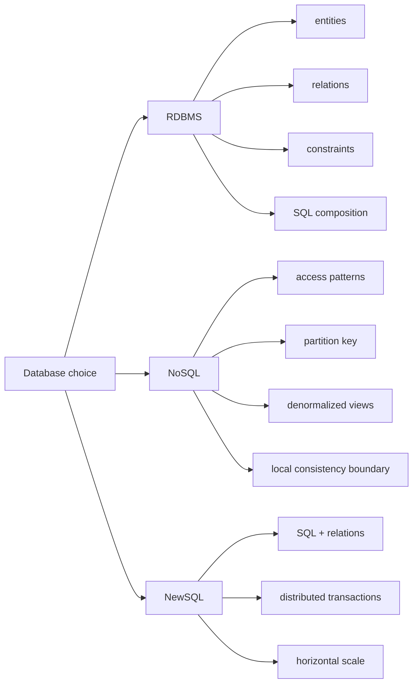
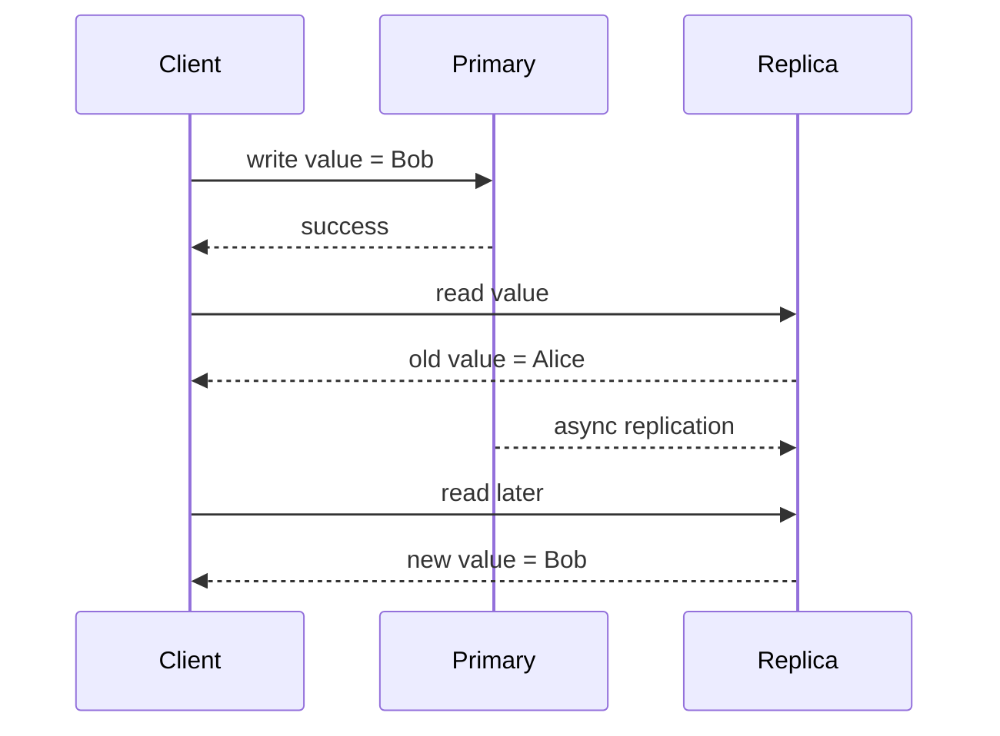

# System Design 02 · 数据库基本范式：RDBMS vs NoSQL

> [!info] 范式一句话
> RDBMS 的设计中心是 relation-first：先表达实体、关系和约束，再用 SQL 和查询优化器组合数据。NoSQL 的设计中心是 access-pattern-first：先确定系统怎么读、怎么写，再把数据组织成贴合这些访问路径的数据结构。

---

## 目录

1. [[#一、先问基本操作单元是什么]]
2. [[#二、事务不是一个 API 名字，而是不变量边界]]
3. [[#三、RDBMS：关系、约束和后验查询]]
4. [[#四、NoSQL：访问路径、分区和反范式化]]
5. [[#五、不要按 feature checklist 选数据库]]
6. [[#六、几个系统的设计中心]]
7. [[#七、选型时真正要问的问题]]
8. [[#八、具体场景怎么判断]]
9. [[#九、复习卡片]]

---

## 一、先问基本操作单元是什么

数据库选型经常被讲成一个功能对比：

```text
有没有 SQL？
有没有 JSON？
有没有事务？
有没有 join？
能不能水平扩展？
```

这种问法容易误导。更好的入口是：

```text
这个数据库把什么当成基本操作单元？
```

RDBMS 把 row、table、relation 和 constraint 放在中心。NoSQL 不是一个单一系统，而是一组范式：document DB、key-value store、wide-column store、graph DB。它们共同的倾向是把访问路径放在中心，而不是把关系组合放在中心。



### 1.1 RDBMS 的基本单位：row + relation

关系数据库里，最小数据单元是 row，也就是表里的一行。

```text
users
-----
id | name | email

orders
------
id | user_id | amount | status
```

但 RDBMS 的重点不是孤立的 row，而是 row 之间的 relation。

```text
orders.user_id -> users.id
```

这条关系表示订单属于某个用户。再往外扩展，一个电商系统会有：

```text
User
Order
OrderItem
Payment
Refund
Inventory
Shipment
Coupon
```

这些实体之间有外键、唯一约束、状态约束、join 和事务。RDBMS 的思路是：

```text
先把真实世界拆成实体、关系和约束。
查询时再用 SQL 把它们组合起来。
```

这就是为什么 RDBMS 适合复杂业务系统。它把“数据之间的关系”当成一等公民。

### 1.2 NoSQL 的基本单位：document、item、partition

NoSQL 不是一种数据库，而是一组不同系统的统称。

| 类型 | 典型系统 | 基本单位 | 更自然的问题 |
| --- | --- | --- | --- |
| Document DB | MongoDB | document | 这个业务对象能不能一次读写？ |
| Key-value store | DynamoDB / Redis | key -> item/value | 给定 key 能不能快速拿到结果？ |
| Wide-column store | Cassandra | partition + row | 查询是否落在一个 partition 内？ |
| Graph DB | Neo4j | node + edge | 是否频繁沿关系图遍历？ |

以 MongoDB 为例，一个用户 profile 可以直接放成一个 document：

```json
{
  "user_id": 123,
  "name": "Alice",
  "email": "alice@example.com",
  "addresses": [
    {"city": "Seattle", "type": "home"},
    {"city": "Philadelphia", "type": "work"}
  ]
}
```

如果应用最常见的访问路径是：

```text
getUserProfile(user_id)
updateUserProfile(user_id)
```

那把 profile 相关字段放在一个 document 里很自然。系统不需要每次 join `users`、`addresses`、`preferences`、`settings`。它一次按 key 读出一个 aggregate。

DynamoDB 和 Cassandra 的中心更接近 partition：

```text
getUserProfile(user_id)
getSession(session_id)
getEvents(device_id, timestamp_range)
```

这些访问路径通常要提前设计。partition key、sort key、clustering key 不是后期细节，而是数据模型本身。

### 1.3 一句话区分

```text
RDBMS:
  先建模实体、关系、约束。
  查询时灵活组合。

NoSQL:
  先确定读写路径。
  存储时就为这些路径组织数据。
```

这不是谁更先进的问题。它们把复杂性放在了不同地方。

---

## 二、事务不是一个 API 名字，而是不变量边界

数据库讨论事务时，很容易停在 ACID 定义上。但在 system design 里，事务真正回答的是：

```text
一个业务动作里，哪些数据必须一起变化？
```

银行转账是最经典的例子：

```text
A 账户 -100
B 账户 +100
```

这两个操作不能只成功一个。它们维护的是一个业务不变量：

```text
钱不能凭空消失，也不能凭空出现。
```

订单系统也一样：

```text
创建订单
扣库存
锁优惠券
创建支付记录
写订单明细
```

这些操作背后有不变量：

```text
库存不能卖成负数
优惠券不能重复使用
支付记录必须对应订单
订单金额必须和明细一致
状态流转必须合法
```

所以事务的重点不是“数据库有没有 transaction API”。重点是：

```text
数据库能不能帮助应用维护跨多条数据、跨多个对象的业务不变量？
```

### 2.1 ACID 里的四个词

| 字母 | 含义 | 工程含义 |
| --- | --- | --- |
| Atomicity | 原子性 | 一组操作要么都成功，要么都回滚 |
| Consistency | 一致性 | 事务前后都满足业务约束和数据库约束 |
| Isolation | 隔离性 | 并发事务不能看到不该看的中间状态 |
| Durability | 持久性 | commit 后机器故障也不应丢结果 |

这里的 Consistency 指的是业务约束一致性，不是 CAP 里讨论的副本一致性。

隔离性是面试里最容易被追问的部分。比如最后一件商品同时被两个人购买：

```text
stock = 1

User A reads stock = 1
User B reads stock = 1

A creates order
B creates order

stock becomes -1
```

数据库需要用锁、MVCC、时间戳、冲突检测或可串行化调度来避免这种错误。不同隔离级别的语义和成本不同：

```text
Read Committed
Repeatable Read
Snapshot Isolation
Serializable
Strict Serializable / External Consistency
```

面试里不要只背名字。要说清楚业务能不能接受 stale read、write skew、phantom read，以及冲突时是阻塞、重试，还是让应用补偿。

### 2.2 不是所有事务都一样

很多数据库都说自己支持事务，但事务能力的范围差别很大。正确的问题是：

```text
事务覆盖几个 row？
覆盖几个 document？
覆盖几个 partition？
覆盖几个 shard？
覆盖几个 region？
隔离级别是什么？
冲突时谁重试？
失败后怎么恢复？
```

可以把事务能力粗略排成一条线：

```text
single row / single document atomicity
  -> single partition conditional update
  -> single machine multi-row transaction
  -> single region multi-shard transaction
  -> cross-region strict serializable transaction
```

越往右，语义越强，应用越容易写正确，但系统成本越高。成本来自网络往返、日志写入、锁或时间戳管理、冲突检测、复制协议和恢复逻辑。

RDBMS 把事务当成核心能力。很多 NoSQL 系统也有事务，但通常是局部能力或补充能力。这两件事不一样。

### 2.3 事务边界和数据建模是同一个问题

NoSQL 最舒服的使用方式，是把不变量限制在单 document、单 item 或单 partition 内。

```text
update one profile document
put one session item
append one device event
conditional write on one username
```

如果你的业务不变量经常跨过这些边界，比如一次写入要改多个 collection、多个 partition、多个 shard，那你可能在逆着系统设计使用它。

---

## 三、RDBMS：关系、约束和后验查询

RDBMS 的全称是 Relational Database Management System。典型系统包括 PostgreSQL、MySQL、Oracle、SQL Server。

它的基本范式是：

```text
用 table 表达实体
用 foreign key 表达关系
用 schema 表达结构
用 constraint 表达约束
用 SQL 表达查询
用 transaction 维护跨实体不变量
```

### 3.1 Relation-first 的建模方式

电商系统通常会拆成这些表：

```text
users
orders
order_items
products
payments
refunds
shipments
inventory
```

这些表不是平铺的数据文件。它们描述业务关系：

```text
一个 user 有多个 order
一个 order 有多个 order_item
一个 order_item 对应一个 product
一个 order 对应一个 payment
一个 payment 可能对应 refund
一个 product 对应 inventory
```

RDBMS 适合这种场景，因为它能自然表达外键、唯一约束、事务、join、聚合、报表和 ad-hoc 查询。

### 3.2 RDBMS 的优势是查询多样性

关系数据库的一个实际优势是：你不需要在第一天知道所有未来查询。

今天系统只需要：

```sql
SELECT * FROM orders WHERE user_id = 123;
```

明天产品可能要问：

```sql
SELECT product_id, COUNT(*) AS refund_count
FROM refunds
WHERE created_at >= NOW() - INTERVAL '7 days'
GROUP BY product_id
ORDER BY refund_count DESC
LIMIT 10;
```

财务可能要查：

```sql
SELECT o.id
FROM orders o
JOIN payments p ON p.order_id = o.id
LEFT JOIN shipments s ON s.order_id = o.id
WHERE p.status = 'paid' AND s.id IS NULL;
```

这些查询可以通过 SQL、join、filter、group by 临时组合出来。这叫后验组合能力。NoSQL 也能做一些查询，但通常要求你提前建好访问路径、索引、materialized view，或者把数据同步到分析系统。

### 3.3 RDBMS 的代价

RDBMS 把很多正确性和组合能力放进数据库里，代价也在那里：

| 代价 | 说明 |
| --- | --- |
| schema 迁移更重 | 表结构、索引、约束变化需要计划 |
| 水平扩展更复杂 | 分库分表后 join、事务和 rebalancing 都更难 |
| 强事务有协调成本 | 隔离级别越强，锁、冲突和延迟越明显 |
| 超大写入吞吐更难 | 单主写入、索引维护、WAL 都可能成为瓶颈 |

RDBMS 适合把复杂性放在数据库里，换取应用层更直接的正确性模型。

---

## 四、NoSQL：访问路径、分区和反范式化

NoSQL 更准确的理解是：为特定访问模式优化的一组数据库范式。它通常牺牲一部分通用查询能力和关系建模能力，换取吞吐、延迟、水平扩展、可用性和 schema 灵活性。

### 4.1 Access-pattern-first 的建模方式

RDBMS 建模时先问：

```text
真实世界有哪些实体？
实体之间是什么关系？
有哪些约束？
```

NoSQL 建模时先问：

```text
我要怎么读？
我要怎么写？
最热的 query 是什么？
partition key 是什么？
哪些数据经常一起访问？
能不能避免跨 partition 操作？
```

常见访问路径是这种形态：

```text
getUserProfile(user_id)
getTimeline(user_id, cursor)
getProductPage(product_id)
getSession(session_id)
putEvent(device_id, timestamp, payload)
```

这些路径明确、固定、key-based。NoSQL 更像是为这些 hot path 定制数据结构。

### 4.2 NoSQL 经常依赖反范式化

RDBMS 通常鼓励 normalization，也就是把数据拆成多个表，减少重复。NoSQL 经常鼓励 denormalization，也就是把数据复制到多个地方，换取读取效率。

商品信息可能同时出现在：

```text
product document
order snapshot
search index
recommendation cache
user browsing history
```

好处是读取快，不需要 join。坏处也直接：

```text
数据重复
更新要同步多个副本
可能出现短暂不一致
应用层要处理重试、幂等、补偿和修复
```

NoSQL 的常见 tradeoff 是：

```text
hot path 更快
一致性和数据治理更靠应用层
```

### 4.3 NoSQL 不是没有一致性

一个常见误解是：

```text
NoSQL = 没有事务 = 没有一致性
```

这不准确。很多 NoSQL 系统提供局部一致性机制：

| 系统 | 一致性机制 | 更适合的边界 |
| --- | --- | --- |
| MongoDB | 单文档原子性，多文档事务 | 一个 aggregate 内优先 |
| DynamoDB | conditional write，transaction API | 少量 item 和表 |
| Cassandra | lightweight transaction | 小范围 CAS 和唯一性 |
| Redis | Lua script，MULTI/EXEC | 单实例或明确 slot 内 |

关键是这些能力是不是主路径。NoSQL 最自然的用法通常是：

```text
把一致性边界控制在单 document / item / partition 内。
跨对象一致性用幂等、重试、事件驱动、outbox、saga 或补偿处理。
```

### 4.4 强一致和最终一致到底差在哪里

这里的一致性说的是副本之间的可见性，不是 ACID 里那个“业务约束一致性”。

假设同一份数据有三个副本：

```text
Replica A
Replica B
Replica C
```

客户端写入：

```text
user:123.name = "Bob"
```

强一致性要求：写入返回成功以后，后面的读请求不管读到哪个副本，都应该看到新值，或者系统必须把读请求路由到能保证新值的路径上。

```text
write Bob -> success

read from A -> Bob
read from B -> Bob
read from C -> Bob
```

最终一致性弱在这里：写入可以先在一部分副本成功，然后后台慢慢传播到其他副本。系统保证的是“如果后面没有新的写入，所有副本最终会收敛到同一个值”，但不保证写成功后的下一次读一定看到新值。

```text
write Bob -> success

immediately:
  read from A -> Bob
  read from B -> Alice
  read from C -> Alice

after replication catches up:
  read from A -> Bob
  read from B -> Bob
  read from C -> Bob
```

这就是 stale read。用户刚更新头像，刷新页面却还看到旧头像；刚发了一条动态，自己马上刷新 feed 可能暂时看不到；刚写入一个事件，分析查询晚几秒才出现。这些都属于最终一致系统里常见的现象。



为什么系统要接受这种语义？因为强一致通常要在写入或读取路径上做协调。

| 语义 | 写入返回前通常要做什么 | 好处 | 代价 |
| --- | --- | --- | --- |
| 强一致 | 等 leader、quorum 或共识确认 | 读起来更像单机数据库，应用简单 | 写延迟更高，跨 region 更慢，故障时可用性更难 |
| 最终一致 | 先写局部副本，异步传播 | 低延迟、高可用、吞吐高 | 可能读到旧值，应用要处理冲突和补偿 |

所以最终一致不是“数据会错”。更准确地说，它允许系统在短时间内暴露旧状态，并把收敛、冲突解决、重试、幂等这些问题交给系统或应用一起处理。

不同业务对它的接受程度完全不同：

| 场景 | 能不能接受最终一致 | 原因 |
| --- | --- | --- |
| 用户头像、点赞数、浏览量 | 通常可以 | 短暂旧值不影响核心正确性 |
| Feed、推荐、日志写入 | 通常可以 | 更看重吞吐和可用性 |
| 库存扣减、支付、金融账本 | 通常不该依赖最终一致 | 旧读或重复写可能破坏业务不变量 |
| 权限撤销、封禁状态 | 要谨慎 | 旧权限继续生效会带来安全风险 |

NoSQL 常见的做法不是简单放弃一致性，而是把一致性缩小到更容易控制的边界：

```text
单 item 条件写:
  例如 version = 7 时才更新到 version = 8

单 partition 内原子更新:
  把需要一起变化的数据放到同一个 partition

read-your-writes:
  用户写完后，自己的读请求走 leader 或 session-aware route

异步修复:
  后台 job 根据 event log、outbox 或 CDC 修正 serving view
```

一句话记：

```text
强一致关心“写成功以后，马上读是不是新值”。
最终一致关心“系统最后会不会收敛到同一个值”。
```

---

## 五、不要按 feature checklist 选数据库

现代数据库互相吸收功能。PostgreSQL 支持 JSON、全文搜索、分区表、物化视图、向量索引。MongoDB 支持事务和聚合。DynamoDB 支持 transaction API。Cassandra 支持 LWT。

这些功能很有用，但它们不一定改变系统的设计中心。

```text
PostgreSQL 支持 JSON，不等于它变成 MongoDB。
MongoDB 支持事务，不等于它变成 PostgreSQL。
DynamoDB 支持事务，不等于它变成通用关系数据库。
Cassandra 支持 LWT，不等于它适合复杂 OLTP 事务。
```

更实用的判断是：

```text
这个功能如果偶尔用，通常没有问题。
这个功能如果变成主路径，要看它是否符合系统的设计中心。
```

例子：

```text
PostgreSQL 里偶尔存 JSON 字段很合理。
如果整个系统都是巨大嵌套 document，并且按 document aggregate 访问，MongoDB 可能更自然。

MongoDB 里偶尔用多文档事务很合理。
如果核心写路径每次都跨多个 collection 和 shard 做强事务，RDBMS 或 NewSQL 可能更自然。

DynamoDB 里偶尔用 TransactWriteItems 很合理。
如果系统核心是复杂 SQL 查询、join、报表和跨实体事务，DynamoDB 会让应用层承担大量复杂性。
```

一句话：

```text
feature 是补洞。
design center 决定成本曲线。
```

---

## 六、几个系统的设计中心

### 6.1 MongoDB：文档模型优先，事务是补充

MongoDB 的核心抽象是 document。它最自然的建模方式是把一个业务 aggregate 放进一个 document。

用户 profile 就是典型例子：

```json
{
  "user_id": 123,
  "name": "Alice",
  "emails": ["a@example.com", "alice@work.com"],
  "addresses": [
    {"type": "home", "city": "Seattle"},
    {"type": "work", "city": "Philadelphia"}
  ],
  "preferences": {
    "theme": "dark",
    "language": "en"
  }
}
```

如果应用经常一次读取整个 profile，这个模型很舒服。MongoDB 的优势是 schema 灵活、嵌套结构自然、单文档读写原子、开发迭代快。

MongoDB 也支持 multi-document transaction，甚至支持 sharded cluster 上的分布式事务。但它更自然的使用方式仍然是：

```text
把经常一起读取、一起变化的数据放进一个 document。
用单文档原子性覆盖多数一致性需求。
把多文档事务作为少数场景的补充。
```

如果你的业务经常需要复杂 join、强一致报表、高频跨实体事务、跨 shard 提交，那 MongoDB 的事务成本会逐渐变成主要问题。

### 6.2 Cassandra：partition-local 优先，LWT 只适合小范围 CAS

Cassandra 的目标是高可用、水平扩展、高写入吞吐、多副本容错和 partition-oriented 查询。它不是为复杂事务设计的。

时间序列是典型建模：

```text
partition key = device_id
clustering key = timestamp
```

它适合查询：

```text
某个 device 在某个时间范围内的事件
```

Cassandra 的 lightweight transaction 使用 Paxos 做线性一致的条件更新。典型用法：

```sql
INSERT INTO users (username, id)
VALUES ('alice', 123)
IF NOT EXISTS;
```

这可以防止两个请求同时创建同一个 username。但 LWT 比普通写入慢很多。它适合唯一性约束、关键路径 CAS、防止并发 overwrite，不适合高频跨 partition 事务。

Cassandra 的原则是：

```text
让读写落在明确 partition 内。
避免跨 partition 协调。
用数据建模换可扩展性。
```

### 6.3 DynamoDB：可扩展 KV / document store，事务有明确边界

DynamoDB 适合超大规模 key-value 访问、稳定低延迟、serverless 扩展、明确 partition key 的在线服务。

它支持：

```text
TransactWriteItems
TransactGetItems
conditional write
```

这些能力适合小规模多 item 一致性更新、条件写、防止并发冲突。它们有边界：item 数量、总大小、account、region、成本和延迟。

DynamoDB 的最佳使用方式仍然是：

```text
先列 access pattern。
再设计 partition key / sort key。
尽量让读写落在少数 item / partition 内。
把事务控制在小边界内。
```

### 6.4 Spanner / NewSQL：把分布式事务当成设计中心

Spanner、CockroachDB、TiDB 走的是 NewSQL 路线。目标是保留 SQL 和关系模型，同时支持水平扩展和分布式事务。

NoSQL 通常是：

```text
先牺牲一部分关系能力和强事务，换取扩展性。
再补充有限事务能力。
```

NewSQL 的目标是：

```text
从一开始就把 SQL、分布式事务和水平扩展放进设计中心。
```

Spanner 这类系统会支持跨行、跨表、跨 shard、跨 region 的事务，代价是系统复杂、基础设施要求高、跨 region 写延迟更高、成本更重。

NewSQL 适合这些场景：

```text
业务强依赖关系模型
需要水平扩展
需要强一致分布式事务
不能把最终一致的复杂性推给应用层
```

比如全球金融账本、强一致库存、大规模 SaaS core database。

---

## 七、选型时真正要问的问题

### 7.1 数据之间是否关系密集？

如果核心数据是：

```text
用户 - 订单 - 商品 - 支付 - 发票 - 退款 - 库存 - 权限
```

并且这些关系会被反复组合查询，RDBMS 更自然。

如果核心数据是：

```text
一个 user profile document
一个 session item
一个 device event partition
一个 product page cache
一个 timeline feed
```

并且访问路径固定，NoSQL 更自然。

判断句：

```text
关系是核心资产 -> RDBMS
访问路径是核心资产 -> NoSQL
```

### 7.2 查询是否多样且不可预期？

固定查询适合 NoSQL：

```text
by user_id
by order_id
by session_id
by device_id + timestamp
by partition key + range
```

不可预期查询适合 RDBMS 或分析系统：

```text
运营临时报表
财务对账
风控复杂筛选
产品漏斗分析
工程 debug 历史状态
BI 自由 join
```

RDBMS 的 SQL 和 optimizer 提供后验组合能力。NoSQL 通常要求提前知道访问路径。

### 7.3 业务不变量是否经常跨实体？

如果业务动作经常同时修改多个实体：

```text
创建订单
扣库存
写支付记录
生成发货任务
记录审计日志
更新优惠券状态
```

事务边界天然跨实体，RDBMS / NewSQL 更自然。

如果业务动作可以限制在单对象内：

```text
更新一个 profile document
写入一个 session item
追加一条 event
更新一个购物车 document
创建用户名时做 IF NOT EXISTS
```

NoSQL 更自然。

### 7.4 复杂性放在哪里？

选 RDBMS，是把复杂性更多放到数据库里：

```text
schema
constraint
foreign key
join
optimizer
transaction
isolation
migration
```

选 NoSQL，是把复杂性更多放到应用和数据建模里：

```text
denormalization
materialized view
idempotency
retry
saga
compensation
outbox pattern
eventual consistency
manual repair
```

这不是先进与落后的区别。它是在选择谁来承担复杂性。

---

## 八、具体场景怎么判断

### 8.1 电商核心订单系统

核心实体：

```text
users
orders
order_items
products
inventory
payments
refunds
shipments
coupons
```

核心操作：

```text
创建订单
扣库存
锁优惠券
创建支付记录
更新订单状态
处理退款
生成发货任务
```

这里的特点是关系密集、跨实体不变量多、查询多样、需要审计和报表、一致性要求高。RDBMS 或 NewSQL 更合适。

NoSQL 也能做，但需要大量应用层机制：

```text
幂等 token
outbox
事件补偿
库存 reservation
状态机修复
异步对账
```

如果一致性是核心要求，这些复杂性会越来越重。

### 8.2 用户 profile 系统

用户 profile 通常包含：

```text
user_id
name
avatar
bio
preferences
addresses
social_links
settings
```

访问模式通常是：

```text
getUserProfile(user_id)
updateUserProfile(user_id)
```

这类数据更像一个 aggregate。MongoDB 或 DynamoDB 很自然。字段结构可能变化，大部分字段也经常一起读取。

如果后续要分析城市分布、profile 完整度、用户增长趋势，通常把数据同步到分析系统，而不是让在线 NoSQL 承担所有报表。

### 8.3 日志 / 事件系统

设备日志通常是：

```text
device_id
timestamp
event_type
payload
```

典型查询：

```text
查询某个 device 在某个时间范围内的事件
按时间追加事件
高吞吐写入
数据量巨大
```

这类场景适合 Cassandra、DynamoDB 或 time-series database。访问模式固定：

```text
partition key = device_id
sort key = timestamp
```

核心需求是高写入吞吐、水平扩展、按 key 和时间范围读取、高可用。复杂事务和 join 不是主路径。

### 8.4 Feed / timeline 系统

社交 feed 是典型 access-pattern-first 场景。用户打开首页时，需要快速看到：

```text
关注的人最近发了什么
按 ranking 排序
支持 cursor pagination
```

小规模可以直接 join：

```sql
SELECT posts.*
FROM posts
JOIN follows ON posts.author_id = follows.followee_id
WHERE follows.follower_id = ?
ORDER BY posts.created_at DESC
LIMIT 100;
```

大规模时，这个查询通常太重。系统会维护：

```text
每个用户的 timeline item list
fanout cache
post metadata serving view
ranking feature cache
```

这里的关系仍然存在，但在线 hot path 必须为固定访问模式优化。

### 8.5 金融账本系统

金融账本通常包含：

```text
accounts
transactions
ledger_entries
balances
audit_logs
```

核心要求：

```text
不能丢钱
不能多钱
必须可审计
必须强一致
必须支持对账
必须支持历史追踪
```

账本更新维护的是金额守恒、借贷平衡、历史可追溯这类不变量。RDBMS / NewSQL 更自然。把最终一致和补偿作为主要 correctness 机制，会让系统风险很高。

### 8.6 商品详情页

商品详情页需要：

```text
商品标题
图片
价格
库存状态
描述
规格
评论摘要
推荐信息
```

用户打开页面时，希望一次读出大部分信息。系统可以维护一个 product page document：

```json
{
  "product_id": 123,
  "title": "Keyboard",
  "price": 99,
  "images": ["..."],
  "description": "...",
  "specs": {"switch": "linear"},
  "review_summary": {"avg": 4.7, "count": 1832}
}
```

这个 document 不一定是 source of truth。它可以是后台异步生成的 serving view，用来服务固定访问路径：

```text
getProductPage(product_id)
```

---

## 九、复习卡片

| 问题 | 更偏 RDBMS / NewSQL | 更偏 NoSQL |
| --- | --- | --- |
| 建模起点 | 实体、关系、约束 | 读写路径、partition key |
| 查询模式 | 多样、后期会变化 | 固定、key-based |
| 事务边界 | 经常跨实体、跨表 | 尽量局部在 document / item / partition |
| 数据形态 | 关系密集 | aggregate 清晰 |
| 读取方式 | join、filter、group by 组合 | 预先建好的 serving view |
| 正确性 | 数据库承担更多约束 | 应用承担更多幂等、重试、补偿 |
| 扩展方式 | 复制、分区、NewSQL、分库分表 | partition-first，水平扩展更自然 |

最短判断版：

```text
关系密集 + 查询多样 + 跨实体事务多
  -> RDBMS / NewSQL

访问模式固定 + partition-local + 高吞吐低延迟 + 可补偿一致性
  -> NoSQL

既要 SQL / 关系 / 强事务，又要水平扩展
  -> NewSQL，但系统复杂度和成本更高
```

最后的 tier-breaker：

```text
不要只问系统能不能做某个功能。
要问这个功能变成主路径以后，是否仍然符合系统的设计中心。
```
