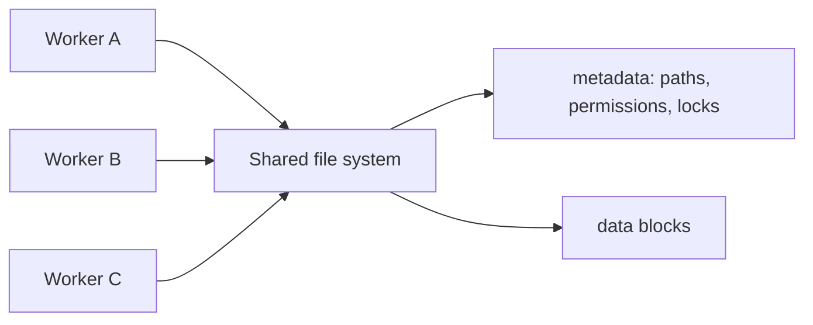
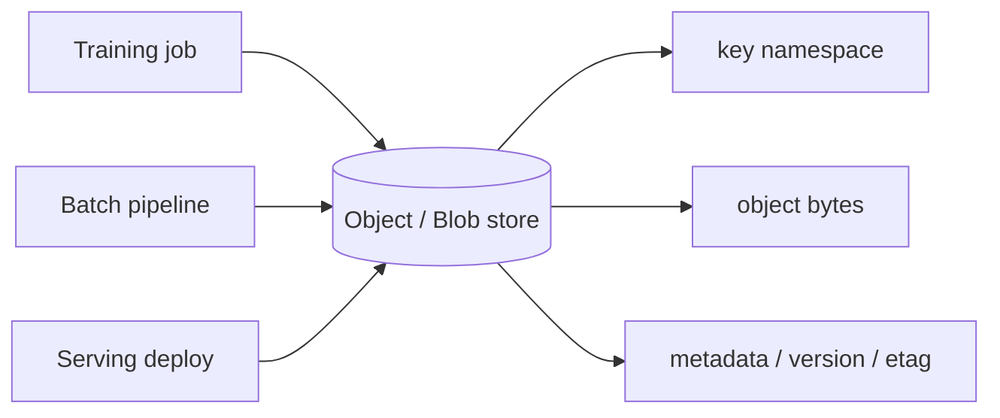
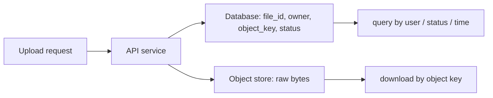
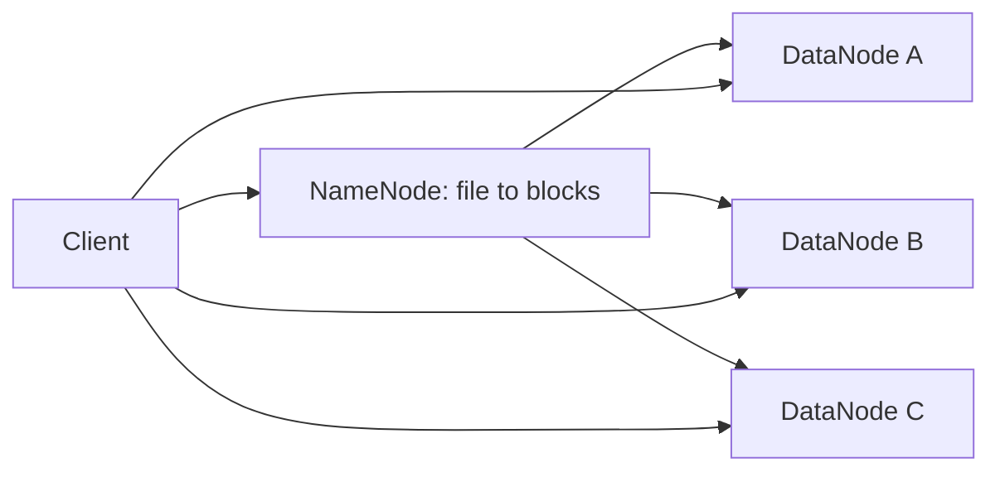

# System Design 04 · Storage Systems: File, Block, Object, Blob, and HDFS

Course Location: [[SystemDesign03 Database Scaling|03 Database Scaling]] → This Article → [[SystemDesign05 Reliability Replication|05 Reliability and Replication]]

> [!info] Core Question
> The differences between storage systems do not lie in "where the files are stored," but in access units, metadata location, read/write patterns, consistency semantics, and scalability. Determine how data is read and written first, then choose the storage format.

---

## Table of Contents

1. [[#I. Start with the Access Unit]]
2. [[#II. Block storage: Like a remote disk]]
3. [[#III. File storage: Shared file system]]
4. [[#IV. Object / Blob storage: Read/write by object]]
5. [[#V. HDFS: Designed for large file sequential I/O]]
6. [[#VI. Common choices]]
7. [[#VII. Review card]]

---

## I. Start with the Access Unit

When discussing storage, start by asking one question:

```text
What is the smallest logical unit of data read or written by the application?
```

Different answers will lead the system in completely different directions.

| Storage Format | Basic Access Unit | Common Systems | Best Suited For |
|---|---|---|---|
| Local disk | Local block / file | NVMe / SSD | Temporary files, local cache, low-latency scratch space |
| Block storage | Block device | AWS EBS / GCE Persistent Disk | Database volumes, single-node file systems, low-latency random IO |
| File storage | File + directory | NFS / SMB / EFS | Multi-machine shared directories, POSIX-ish file interfaces |
| Object storage | Object + key | S3 / GCS / MinIO | Images, logs, checkpoints, model weights, data lakes |
| Blob storage | Blob + container/key | Azure Blob / generic blob store | Large objects, unstructured binary data, archiving, and data lakes |
| HDFS | Large file block | Hadoop HDFS | Large file batch processing, data locality, sequential scanning |

Blob storage can be understood as a common product form of object storage, specifically called "Blob" in the Azure ecosystem. Here, we treat them uniformly under the "key -> bytes + metadata" model.

---

## II. Block storage: Like a remote disk

Block storage exposes raw block devices. The operating system can format a file system on top of them, such as ext4 or xfs, and then databases or applications use them just like a local disk.

```text
VM / database host
  -> mounted block volume
  -> filesystem
  -> database files / WAL / indexes
```

Its focus is on low-latency random read/write. Databases often use block storage because they need to manage their own pages, WAL, buffer pools, flushes, fsyncs, and crash recovery.

Suitable for:

```text
PostgreSQL / MySQL data files
WAL / redo log
Stateful services requiring fsync semantics
Persistent volumes for single-node services
```

The trade-off is also clear: a volume is usually mounted to a limited number of machines and is not suitable for many workers to use as a shared directory simultaneously. Capacity and IOPS can be scaled, but it remains more like "a disk for one machine" rather than a data lake.

---

## III. File storage: Shared file system

File storage provides directory, filename, permission, and path semantics. Applications see a familiar interface:

```text
/shared/jobs/123/input.csv
/shared/models/latest/config.json
/shared/checkpoints/run-7/step-1000.pt
```

It is suitable for multiple machines to share a set of files. Examples include training set preprocessing, browsing experimental artifacts, simple checkpoint sharing, and internal team tool directories.



Problems with file storage usually arise from metadata and small files. A large number of `list directory`, `stat`, and open/close operations on small files will overwhelm the metadata server. In many ML workloads, a "training set with millions of small files" is more likely to slow down a shared file system than "a few large shards."

Suitable for:

```text
Multi-machine shared configuration and medium-sized files
A small number of large checkpoints
Legacy workloads where POSIX interfaces are critical
```

Not suitable for:

```text
High-concurrency access to massive numbers of small files
Infinitely scalable data lakes
Strongly consistent, high-concurrency database storage
```

---

## IV. Object / Blob storage: Read/write by object

Object storage does not provide the random write interface of traditional file systems. It is more like a massive key-value store:

```text
key: datasets/webtext/shard-00017.jsonl.zst
value: bytes
metadata: content-type, etag, version, size
```

Common APIs are:

```text
PUT object
GET object
LIST prefix
DELETE object
```

Objects are usually written as a whole. You can perform a range read on a portion of an object, but you cannot arbitrarily overwrite a few bytes in the middle like a local file. When updating an object, you typically write a new version.

This is why object/blob storage is suitable for data lakes: it is cheap, high-capacity, highly available, and easy to access across machines. Model weights, training data shards, logs, images, offline features, and checkpoints are all well-suited for this.



Main trade-offs:

| Trade-off | Specific Manifestation |
|---|---|
| Higher latency than local disk | Each GET/PUT involves network and server-side scheduling |
| Slow with too many small objects | Request overhead and LIST overhead increase |
| Not a POSIX file system | rename, append, lock, and random write semantics differ |
| Consistency depends on the system | Visibility of new writes, overwrites, and LIST operations must be verified |

Object storage usage should generally favor large objects:

```text
Bad:
  10 million tiny json files

Better:
  10k compressed shards
  each shard 64MB - 1GB
```

In ML systems, this choice is very common. During training, you can pull shards from the object store and cache them locally; during deployment, you pull weights from the object store or model registry; offline pipelines continue to write outputs back to the object store.

### 4.1 Differences between Object storage and Database storage

Object storage and databases can both "store data," but they are not the same thing.

Object storage stores complete objects:

```text
key -> bytes + metadata
```

For example:

```text
images/user-123/avatar.png
datasets/run-7/shard-00012.parquet
models/qwen/checkpoint-4000/model.safetensors
logs/2026/07/08/app-0001.zst
```

Databases store queryable, updatable, and constrained records:

```text
table / collection / index -> rows / documents
```

For example:

```text
users(id, name, email)
orders(id, user_id, status, amount)
files(id, owner_id, object_key, size, created_at)
```

A common design is: store large files in object storage and store the business metadata of those files in a database.



The reason for this is simple: object storage excels at saving large chunks of bytes, while databases excel at querying records and maintaining business state.

| Dimension | Object / Blob storage | Database storage |
|---|---|---|
| Basic unit | An object, a segment of bytes | row, document, index entry |
| Access method | Read/write by key, full PUT/GET, supports range read | Query by primary key, index, conditions, transactional updates |
| Excels at | Large files, logs, images, model weights, dataset shards | Users, orders, permissions, state machines, indexes, and queries |
| Query capability | Weak, usually only by key / prefix / metadata | Strong, can filter, join, aggregate, and sort |
| Update method | Usually rewrite object or write new version | Can update rows, fields, indexes, and data within transaction boundaries |
| Consistency focus | Object visibility, version, etag, lifecycle | Transactions, isolation levels, constraints, replication lag |
| Cost curve | Capacity is cheap, suitable for massive cold/warm data | Query and transaction capabilities are stronger, but unit storage is more expensive |

Therefore, do not mix them up:

```text
Do not stuff large videos or large checkpoints directly into database rows.
The database will grow, backups will slow down, and indexes/caches will be polluted.

Also, do not just put the object_key in object storage without building database metadata.
Otherwise, it will be difficult to perform permissions, search, state management, auditing, and deletion workflows.
```

A more natural combination is:

```text
Object store:
  Saves the actual file content.

Database:
  Saves who uploaded it, which task it belongs to, current status, permissions, object_key, version, and checksum.

Background worker:
  Performs asynchronous transcoding, validation, cleanup, and lifecycle migration.
```

You can distinguish them with one sentence during design:

```text
Object storage is responsible for "putting things away."
Databases are responsible for "knowing what these things are and what their current state is."
```

---

## V. HDFS: Designed for large file sequential I/O

HDFS is the big data file system of the Hadoop era. Its design assumptions are clear:

```text
Files are very large.
Read-heavy, write-rare.
Sequential scanning after writing.
Compute should be as close to the data as possible.
```

HDFS splits files into large blocks and replicates them across multiple DataNodes. The NameNode stores the mapping of file paths to blocks.



HDFS's strength is large-file throughput, not low-latency random access. MapReduce, Hive, and early Spark worked well with HDFS because workers could be scheduled on machines close to the data blocks, reducing network reads.

Its problems also stem from the same design:

```text
The NameNode is a critical metadata component.
Small files increase pressure on the NameNode.
With the rise of cloud object storage ecosystems, HDFS operational costs appear heavier.
Data locality is not always guaranteed in the cloud.
```

Many cloud data lakes now use S3 / GCS / Azure Blob instead of HDFS, and let Spark, Presto, Trino, and Flink read from object storage. HDFS is still worth understanding because it clearly illustrates the structure of separating "metadata" from "data blocks."

---

## VI. Common choices

### 6.1 What to use for databases

Online databases usually use block storage or local NVMe. The reason is that databases require low-latency random IO, WAL, fsync, and fine-grained page management.

Object storage can be used for backups, snapshots, archiving, and cold data, but it is not suitable as the primary storage for OLTP databases.

### 6.2 What to use for images, videos, logs, and model weights

Object / Blob storage is more natural. It manages large objects by key, has high capacity, high availability, and mature CDN and permission systems.

```text
user-upload/avatar.png
logs/2026/07/02/app-0001.zst
models/qwen/run-42/checkpoint-8000/
datasets/pretrain/shard-00123.parquet
```

### 6.3 How to store training data

Training data should generally not be read directly from massive numbers of small files. A more common practice is:

```text
object store saves shards
worker caches shards locally
dataloader reads shards sequentially
```

This reduces metadata pressure and spreads network requests across larger objects.

### 6.4 How to store shared configurations and a small number of files

File storage is more convenient. Path, directory, and permission semantics are simple, and many tools can run without code changes.

However, when the number of files and throughput increase, you must re-evaluate the metadata server, cache, and small file issues.

### 6.5 How to store temporary intermediate results

If data is only used within a single worker, local NVMe is the fastest. Examples include shuffle temporary files, preprocessing scratch space, and local cache after model loading.

If data must be recovered after a worker crashes, it cannot be stored only on the local disk; it needs to be written to an object store, checkpoint store, or database.

---

## VII. Review card

| Question | Decision Criteria |
|---|---|
| Is low-latency random write required? | Prioritize block storage / local NVMe |
| Do multiple machines need to share paths? | File storage is convenient, but watch out for small files and metadata |
| Is the data large and primarily read/written as a whole? | Object / blob storage is more natural |
| Is it batch processing with large file sequential scanning? | HDFS or object store data lakes are both fine |
| Is POSIX rename / append / lock required? | Do not assume object storage can fully simulate this |
| Is it training data shards / checkpoints / model weights? | Usually store in object / blob storage, then cache locally |

Finally, condensed into one card:

```text
Block is like a disk, file is like a shared directory, object/blob is like a large key-value store, and HDFS is like a distributed file system geared toward large-file batch processing.
```
