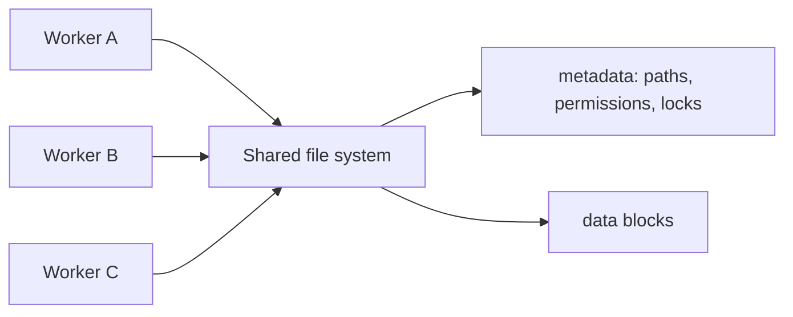
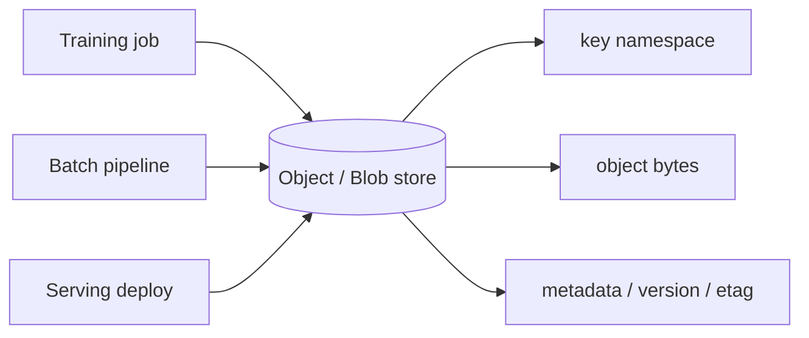
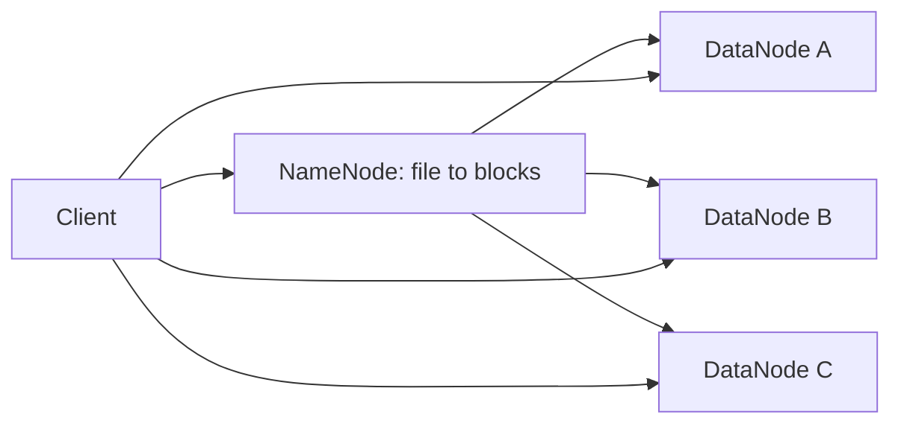

# System Design 04 · 存储系统：File、Block、Object、Blob 与 HDFS

> [!info] 核心问题
> 存储系统的差别不在“文件放在哪里”这一层，而在访问单位、元数据位置、读写模式、一致性语义和扩展方式。先判断数据怎么被读写，再选存储形态。

---

## 目录

1. [[#一、先看访问单位]]
2. [[#二、Block storage：像一块远程磁盘]]
3. [[#三、File storage：共享文件系统]]
4. [[#四、Object / Blob storage：按对象读写]]
5. [[#五、HDFS：为大文件顺序读写设计]]
6. [[#六、常见选择]]
7. [[#七、复习卡片]]

---

## 一、先看访问单位

讨论存储时，先问一个问题：

```text
应用每次读写的最小逻辑单位是什么？
```

不同答案会把系统带到完全不同的方向。

| 存储形态 | 基本访问单位 | 常见系统 | 更适合什么 |
|---|---|---|---|
| Local disk | 本机 block / file | NVMe / SSD | 临时文件、本机 cache、低延迟 scratch space |
| Block storage | block device | AWS EBS / GCE Persistent Disk | 数据库 volume、单机文件系统、需要低延迟随机 IO |
| File storage | file + directory | NFS / SMB / EFS | 多机器共享目录、POSIX-ish 文件接口 |
| Object storage | object + key | S3 / GCS / MinIO | 图片、日志、checkpoint、模型权重、数据湖 |
| Blob storage | blob + container/key | Azure Blob / generic blob store | 大对象、非结构化二进制数据、归档和数据湖 |
| HDFS | large file block | Hadoop HDFS | 大文件批处理、数据本地性、顺序扫描 |

Blob storage 可以理解成 object storage 的一种常见产品形态，尤其在 Azure 体系里叫 Blob。这里统一按“key -> bytes + metadata”的模型理解。

---

## 二、Block storage：像一块远程磁盘

Block storage 暴露的是一块块设备。操作系统可以在上面格式化文件系统，比如 ext4、xfs，然后数据库或应用像使用本地磁盘一样使用它。

```text
VM / database host
  -> mounted block volume
  -> filesystem
  -> database files / WAL / indexes
```

它的重点是低延迟随机读写。数据库常用 block storage，因为数据库需要自己管理 page、WAL、buffer pool、flush、fsync 和 crash recovery。

适合：

```text
PostgreSQL / MySQL 数据文件
WAL / redo log
需要 fsync 语义的状态服务
单机服务的持久 volume
```

代价也很清楚：一个 volume 通常挂到少数机器上，不适合很多 worker 同时当作共享目录使用。容量和 IOPS 可以扩，但它仍然更像“给一台机器用的磁盘”，不是数据湖。

---

## 三、File storage：共享文件系统

File storage 提供目录、文件名、权限和路径语义。应用看到的是熟悉的接口：

```text
/shared/jobs/123/input.csv
/shared/models/latest/config.json
/shared/checkpoints/run-7/step-1000.pt
```

它适合多台机器共享一批文件。比如训练集预处理、实验产物浏览、简单的 checkpoint 共享、团队内部工具目录。



File storage 的问题通常出在元数据和小文件上。大量 `list directory`、`stat`、打开关闭小文件，会把 metadata server 打满。很多 ML workload 里，“百万小文件训练集”比“几个大 shard”更容易把共享文件系统拖慢。

适合：

```text
多机器共享配置和中等规模文件
少量大 checkpoint
POSIX 接口很重要的 legacy workload
```

不适合：

```text
海量小文件高并发访问
无限扩展的数据湖
强一致高并发数据库存储
```

---

## 四、Object / Blob storage：按对象读写

Object storage 不提供传统文件系统的随机写接口。它更像一个很大的 key-value store：

```text
key: datasets/webtext/shard-00017.jsonl.zst
value: bytes
metadata: content-type, etag, version, size
```

常见 API 是：

```text
PUT object
GET object
LIST prefix
DELETE object
```

对象通常按整体写入。你可以 range read 一个对象的一部分，但不能像本地文件那样随意覆盖中间几个字节。更新一个对象时，通常是写一个新版本。

这就是 object/blob storage 适合数据湖的原因：它便宜、容量大、可用性高、跨机器访问简单。模型权重、训练数据 shard、日志、图片、离线 feature、checkpoint 都很适合放在这里。



主要代价：

| 代价 | 具体表现 |
|---|---|
| 延迟比本地磁盘高 | 单次 GET/PUT 走网络和服务端调度 |
| 小对象太多会慢 | 请求开销和 LIST 开销变大 |
| 不是 POSIX 文件系统 | rename、append、lock、随机写语义不同 |
| 一致性要看系统 | 新写入、覆盖、LIST 的可见性需要确认 |

Object storage 的写法一般要偏向大对象：

```text
差:
  10 million tiny json files

更好:
  10k compressed shards
  each shard 64MB - 1GB
```

在 ML 系统里，这个选择很常见。训练时可以从 object store 拉 shard，本地做 cache；部署时从 object store 或 model registry 拉权重；离线 pipeline 把输出继续写回 object store。

---

## 五、HDFS：为大文件顺序读写设计

HDFS 是 Hadoop 时代的大数据文件系统。它的设计假设很明确：

```text
文件很大。
读多写少。
写入后主要顺序扫描。
计算尽量靠近数据。
```

HDFS 把文件切成大 block，复制到多台 DataNode 上。NameNode 保存文件路径到 block 的映射。



HDFS 的强项是大文件吞吐，不是低延迟随机访问。MapReduce、Hive、Spark 早期和 HDFS 配合很好，因为 worker 可以调度到靠近数据 block 的机器上，减少网络读取。

它的问题也来自同一个设计：

```text
NameNode 是关键元数据组件。
小文件会增加 NameNode 压力。
跨云对象存储生态后，HDFS 运维成本显得更重。
数据本地性在云上不一定总能成立。
```

现在很多云上数据湖会用 S3 / GCS / Azure Blob 替代 HDFS，再让 Spark、Presto、Trino、Flink 去读对象存储。HDFS 仍然值得理解，因为它把“元数据”和“数据 block”拆开的结构讲得很清楚。

---

## 六、常见选择

### 6.1 数据库用什么

在线数据库通常用 block storage 或本地 NVMe。原因是数据库需要低延迟随机 IO、WAL、fsync 和细粒度 page 管理。

Object storage 可以做备份、snapshot、归档和冷数据，不适合直接当 OLTP 数据库的主存储。

### 6.2 图片、视频、日志、模型权重用什么

Object / Blob storage 更自然。它按 key 管理大对象，容量大，可用性高，CDN 和权限体系也成熟。

```text
user-upload/avatar.png
logs/2026/07/02/app-0001.zst
models/qwen/run-42/checkpoint-8000/
datasets/pretrain/shard-00123.parquet
```

### 6.3 训练数据怎么放

训练数据通常不要用海量小文件直读。更常见的做法是：

```text
object store 保存 shard
worker 本地缓存 shard
dataloader 顺序读取 shard
```

这样可以减少 metadata 压力，也能把网络请求摊到更大的对象上。

### 6.4 共享配置和少量文件怎么放

File storage 更方便。路径、目录和权限语义简单，很多工具不用改代码就能跑。

但当文件数量和吞吐上来后，要重新评估 metadata server、cache 和小文件问题。

### 6.5 临时中间结果怎么放

如果数据只在一个 worker 内使用，本地 NVMe 最快。比如 shuffle 临时文件、预处理 scratch、模型加载后的本地 cache。

如果 worker 挂掉后必须恢复，就不能只放本地磁盘，需要写到 object store、checkpoint store 或数据库。

---

## 七、复习卡片

| 问题 | 判断方式 |
|---|---|
| 需要低延迟随机写吗？ | 优先 block storage / local NVMe |
| 多台机器要共享路径吗？ | file storage 方便，但注意小文件和 metadata |
| 数据很大、主要整体读写吗？ | object / blob storage 更自然 |
| 批处理大文件顺序扫描吗？ | HDFS 或 object store 数据湖都可以 |
| 需要 POSIX rename / append / lock 吗？ | 不要默认 object storage 能完整模拟 |
| 是训练数据 shard / checkpoint / 模型权重吗？ | 通常放 object / blob storage，再做本地 cache |

最后压成一张卡片：

```text
block 像磁盘，file 像共享目录，object/blob 像大号 key-value store，HDFS 像面向大文件批处理的分布式文件系统。
```
