# System Design 06 · Asynchronous Processing, Messaging Systems, and Event Bus

Course Location: [[SystemDesign05 Reliability Replication|05 Reliability and Replication]] → This Article → [[SystemDesign07 Photo Sharing Feed|07 Photo Sharing and Feed]]

Asynchronous architecture rearranges the timing of responsibility transfer. It does not guarantee that the function itself runs faster.

In a synchronous request, the caller holds responsibility until the downstream returns a result. In an asynchronous request, the caller hands the task to a component capable of reliably storing it, after which the background continues processing. When designing, first ask:

> At what moment can the system be certain the task has been captured, such that even if the current process crashes immediately, the task will not disappear?

Message queues, persistent logs, database outboxes, and webhooks are all answering this question. They provide different answers, making them suitable for different scenarios.

```async-messaging-architecture-visual
```

---

## 1 · Distinguishing Three Types of "Asynchrony"

### 1.1 Language-Level Asynchrony

`async/await`, futures, promises, and event loops primarily solve how a single process can continue doing other work while waiting for I/O.

```text
A process
  -> Initiates network I/O
  -> Pauses current coroutine
  -> Event loop runs other coroutines
  -> Resumes after I/O completes
```

It improves concurrency utilization, but if the process crashes, the futures in memory also vanish. Language-level asynchrony is not equivalent to reliable system-level asynchrony.

### 1.2 System-Level Asynchrony

System-level asynchrony writes tasks to a persistent medium outside the process before confirming to the caller.

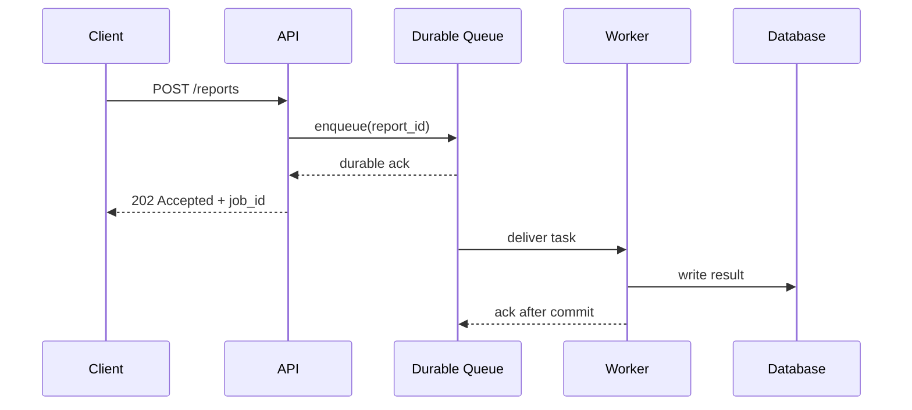

There are two different confirmations in the diagram:

- The Queue's confirmation to the API indicates the messaging system has taken over the task.
- The Worker's confirmation to the Queue indicates business processing is complete, and the message can be deleted or the consumption position advanced.

If the API returns success before the durable ack, the so-called "fire-and-forget" is actually "fire-and-hope."

### 1.3 Business-Level Asynchrony

Whether a user must see the final result immediately is a matter of product semantics, not code syntax.

| Operation | Suitable Response Method | Reason |
|---|---|---|
| Change Password | Synchronous confirmation of core write | User needs explicit success confirmation |
| Generate Monthly Report | `202 Accepted` + job ID | Task may run for several minutes |
| Send Welcome Email | Core registration synchronous, email asynchronous | Email failure should not roll back registration |
| Deduct Funds | Ledger write synchronous, notification asynchronous | Correctness boundary cannot be delegated to notification system |
| Video Transcoding | Asynchronous processing after upload confirmation | Heavy computation should not hold an HTTP connection |

Results after asynchronous completion can be returned via polling, webhooks, SSE, or WebSockets. The choice depends on who needs the result and whether the connection can be maintained long-term.

### 1.4 Common Messaging Scenarios: Look at Topology First, Then Interaction

"1-to-1," "Pub/Sub," "RPC," and "Chat Messages" are often discussed together, but they do not describe the same thing:

```text
Topology: Who sends to whom?              1 -> 1, 1 -> N, N -> 1, N -> N
Interaction: Does the sender wait?        notification, request/reply, stream
Semantics: What does the message represent? command, event, document
Payload: How are bytes encoded?           text, JSON, Protobuf, Avro
```

Therefore, `text` itself is not a message pattern. It might represent the business scenario of chat, or it might just be the encoding format of the payload. The same 1-to-1 chat message can be transmitted using JSON; the same type of RPC can also use Protobuf or JSON.

#### Classification by Connection Topology

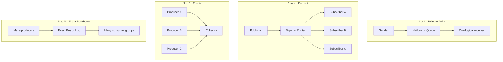

| Topology | Message Meaning | Common Scenarios | Common Implementations |
|---|---|---|---|
| 1 → 1 | Handed to one logical receiver | Private messages, email tasks, report generation | mailbox, work queue, one consumer group |
| 1 → N | Multiple downstreams observe one fact | `order.paid`, config changes, cache invalidation | Pub/Sub, exchange + multiple queues, multiple Kafka groups |
| N → 1 | Multiple sources flow into one processing plane | Log collection, metrics, audit, IoT telemetry | collector, ingestion topic, stream processor |
| N → N | Multiple producers and downstreams share an event backbone | Enterprise event platform, CDC, data integration | Event Bus, Kafka, Pulsar, etc. |

Here, `1` and `N` refer to **logical roles**, not necessarily the number of processes. For example, a "Notification subscriber" can have 50 workers behind it; it still counts as one logical subscriber in a Pub/Sub topology.

#### Classification by Interaction Method

| Pattern | Does sender wait for result? | What is usually in the message? | Suitable Scenarios |
|---|---|---|---|
| Notification | Does not wait for business result | `event_id`, type, payload | Cache invalidation, audit notifications, non-critical alerts |
| Task / Command | Usually gets job ID first | Task type, parameters, idempotency key | Transcoding, email, reports, async inference |
| Event | No response required from a specific receiver | Fact that has occurred, version, time | Order status, CDC, domain events |
| Request / Reply | Waits for corresponding reply, can be sync or async | `request_id`, `reply_to`, deadline | RPC, cross-service queries, device commands |
| Stream | Continuously receives multiple results | sequence, offset, event time | Logs, market data, model tokens, sensor data |

#### Three Common Meanings of 1-to-1

Even when written as 1-to-1, the underlying contract can be completely different:

```text
Direct message
  Alice -> Bob's mailbox
  Receiver specified by user_id, Bob can receive it later when online

Work item
  API -> image-processing queue -> any available worker
  Not specifying a machine, but any worker can complete it

Request / reply
  Service A -> request queue -> Service B
  Service B -> reply queue -> Service A
  A retrieves the corresponding response via correlation_id
```

The first is "specifying a logical receiver," the second is "specifying a worker set," and the third includes an additional reverse message. You cannot judge reliability, order, or synchronicity based solely on the number of arrows.

#### Text / Chat: A Business Scenario, Not Just a String

Private chat is usually 1-to-1, group chat is usually 1-to-N, but a real chat system must define:

- `conversation_id`: Which conversation the message belongs to.
- `message_id`: For deduplication and retry positioning.
- `sender_id` and recipient / membership snapshot: Who sent it to whom.
- `client_sequence` or server sequence: How to order within a conversation.
- `sent`, `delivered`, `read`: Three distinct states, cannot be combined into one "success."
- Offline mailbox, push notification, and multi-device synchronization: How to redeliver when the receiver is offline.

```text
Client A -> Chat API -> durable conversation log
                         |-> online gateway -> Client B
                         |-> offline mailbox
                         |-> push notification
                         +-> sync cursor for B's other devices
```

The body can be UTF-8 text, or an object reference for images or files. The encoding format does not change the delivery semantics of the chat.

#### RPC over messaging: Possible, but don't pretend it's naturally decoupled

The core of RPC is a request corresponding to a response. When implemented with a broker, the request needs at least:

```json
{
  "request_id": "req_123",
  "method": "risk.score",
  "reply_to": "risk-replies.service-a",
  "deadline": "2026-07-15T18:20:05Z",
  "payload": {"order_id": "order_918"}
}
```

The Responder puts the same `request_id` into the reply, and the caller uses this to match the pending request. It must also handle timeouts, late replies, duplicate replies, reply queue lifecycles, and cases where the caller has restarted.

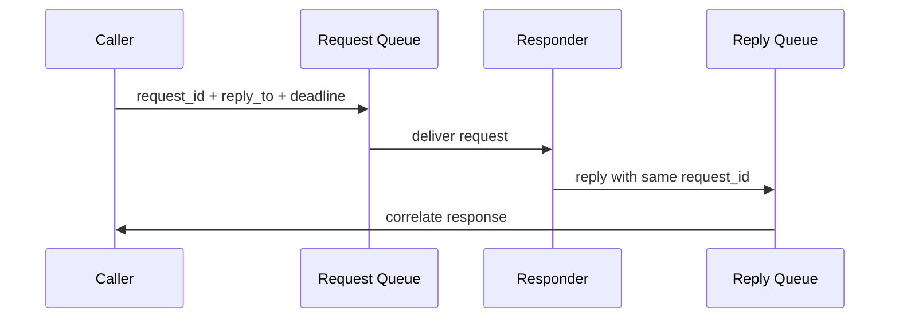

If the Caller remains blocked waiting for a reply after sending the message, it is still a synchronous RPC in business terms: if the Responder slows down, the Caller will still timeout. The broker improves buffering, delivery, and location decoupling, but it does not eliminate time dependencies.

True asynchronous request/reply usually involves: returning a `job_id` immediately, writing the result to a status table after background completion, and then having the caller poll or be notified via webhook / SSE. Do not hold an RPC wait slot for long tasks.

#### A Selection Table

```text
Just want to tell the other party "what happened"      -> Event / Notification
Hope a worker completes a piece of work                -> Task Queue
Multiple independent downstreams need to process       -> Pub/Sub
Must get a corresponding result, and it finishes fast  -> RPC / Request-Reply
Long duration, but result needed eventually            -> Async Job + status / callback
Continuously generated, need offset or replay          -> Stream / Partitioned Log
Person-to-person messaging                             -> Mailbox / Conversation Log
```

A business can combine multiple patterns. For example, "sending a chat image" might first use request/reply to get an upload address, then use a task queue to create a thumbnail, write to the conversation log, and finally synchronize to the receiver's multiple devices via Pub/Sub.

---

## 2 · What Exactly Does a Message Contain?

"Putting a JSON in a Queue" only describes the part the application sees. The Broker actually manages three layers of data:

```text
Application message: What this is, what the business parameters are
Broker record: Where the message is going, how it's serialized, where it's written
Delivery status: Currently available, in-flight, waiting for retry, or already in DLQ
```

Application messages usually consist of an envelope and a payload. The Broker serializes it into bytes and associates these bytes with routing, location, and delivery status. The actual format on disk is usually binary segments, pages, or record batches, not a JSON table that can be queried directly.

```message-queue-demo
```

### 2.1 Data Written by the Application

A maintainable message envelope needs at least:

```json
{
  "event_id": "evt_01J...",
  "event_type": "order.paid",
  "schema_version": 3,
  "occurred_at": "2026-07-15T18:20:00Z",
  "producer": "payment-service",
  "tenant_id": "tenant_42",
  "aggregate_id": "order_918",
  "traceparent": "00-...",
  "payload": {
    "order_id": "order_918",
    "amount_cents": 2599,
    "currency": "USD"
  }
}
```

The `payload` here is the business data. The outer envelope allows infrastructure and generic consumers to perform routing, tracing, version checking, and deduplication without parsing order fields.

Field responsibilities differ:

| Field | Purpose |
|---|---|
| `event_id` | Deduplication, audit, replay positioning |
| `event_type` | Routing and handler selection |
| `schema_version` | Compatibility for old consumers |
| `occurred_at` | Business occurrence time, not equivalent to consumption time |
| `tenant_id` | Isolation, billing, rate limiting |
| `aggregate_id` | Partition key, e.g., same order is locally ordered |
| `traceparent` | Continue tracing across HTTP and message links |

JSON is just a serialization choice. Brokers usually receive bytes; applications can also use Protobuf, Avro, or MessagePack. Consumers must know how to restore these bytes based on `content_type` or schema contract.

### 2.2 What Else Does the Broker Conceptually Maintain?

The following is a logical model for understanding, not the disk format of any specific product:

```json
{
  "message": {
    "message_id": "evt_01J...",
    "content_type": "application/json",
    "headers": {
      "event_type": "order.paid",
      "schema_version": "3",
      "traceparent": "00-..."
    },
    "body_bytes": "{...serialized payload...}"
  },
  "routing": {
    "destination": "billing.v1",
    "partition_key": "order_918",
    "priority": 0
  },
  "broker_state": {
    "position": 184233,
    "status": "READY",
    "delivery_count": 0,
    "available_at": "2026-07-15T18:20:00Z",
    "lease_until": null
  }
}
```

Ownership of these three parts differs:

| Data | Who sets it | Does it change during consumption? |
|---|---|---|
| `message_id`, headers, body | Producer | Usually no |
| destination, partition key | Producer or router | Usually no |
| position / offset | Broker | Assigned upon enqueue |
| delivery count | Broker | Increments after each failed delivery |
| receipt handle / delivery tag | Broker | May be regenerated each delivery |
| lease / visibility deadline | Broker | Changes upon receipt, renewal, timeout |
| status | Broker | READY, IN_FLIGHT, RETRY, DONE, or DEAD |

Therefore, "duplicate delivery" generally does not mean the broker copied a new business order. More commonly, the same message body receives a new delivery handle, the `delivery_count` increases, and it becomes available for receipt again.

### 2.3 What Indexes Does a Queue Need Internally?

After a message is written to disk, the broker must quickly answer several questions:

```text
Which is the next message that can be given to a consumer?
Which messages have been handed out but not yet acked?
Which leases have expired and need redelivery?
Which messages have reached available_at and can end their delay?
Which messages have exceeded the retry limit and need to enter the DLQ?
```

Therefore, these structures are logically common:

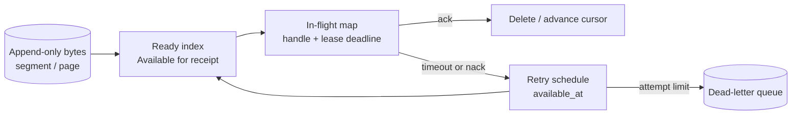

Implementations vary greatly between products. Queue brokers might maintain state for every delivery; partitioned logs prefer retaining immutable records, letting consumer groups use offsets to represent progress. They all "store messages," but the sources of read/write amplification differ.

### 2.4 What Does the Consumer Actually Get in Three Types of Products?

| System | Producer Provides | Broker Adds or Maintains | Consumer Confirmation Method |
|---|---|---|---|
| RabbitMQ / AMQP 0-9-1 | properties, headers, opaque body bytes, routing key | queue position, delivery tag, redelivered flag, exchange, etc. | Ack / nack using delivery tag of current channel |
| Kafka | key bytes, value bytes, headers, timestamp, optional partition | topic, partition, offset, record batch, replication status | Consumer group commits next consumption position |
| SQS-style queue | body, message attributes, optional group / dedup ID | message ID, receive count, receipt handle, visibility deadline | Delete message using receipt handle returned by this receive |

[RabbitMQ official documentation](https://www.rabbitmq.com/docs/publishers) separates AMQP 0-9-1 publisher properties from the delivery information generated by the broker upon delivery. The body is an opaque byte array to the broker. Kafka's [disk record format](https://kafka.apache.org/41/implementation/message-format/) directly includes key, value, headers, timestamp delta, and offset delta; multiple records are batched, compressed, and verified. SQS's [`ReceiveMessage`](https://docs.aws.amazon.com/AWSSimpleQueueService/latest/APIReference/API_ReceiveMessage.html) returns body, attributes, message ID, and receipt handle, and uses a visibility timeout to temporarily hide received messages.

### 2.5 What Should Go in the Body?

Three common types of payloads:

```json
// 1. Full business snapshot, consumer queries database less
{"order_id":"o_918","amount_cents":2599,"currency":"USD"}

// 2. Lightweight reference, consumer reads source of truth again
{"order_id":"o_918","version":7}

// 3. Large object reference, bytes stay in object storage
{"object_key":"exports/r_42.parquet","sha256":"...","size_bytes":8451021}
```

The choice depends on consistency and cost:

- Full snapshots are convenient for replay, but messages are larger and may contain sensitive fields that need deletion.
- Lightweight references are small, but consumers depend on database availability during processing, and they might read an updated state.
- Large object references are suitable for images, videos, and batch data; they must include checksum, size, and authorization boundaries.

Do not stuff large files directly into messages. Write to object storage first, then send the object reference, checksum, and content type. Otherwise, the broker's memory, replication traffic, and retry costs will all be amplified by the payload.

### Do Not Mix Events and Commands

```text
Command: SendInvoice
  Expresses "please perform an action"
  Usually has a clear owner, may be rejected

Event: InvoiceSent
  Expresses "something has already happened"
  Can have no subscribers, or be observed by multiple subscribers
```

Naming an event `ProcessOrder` leaves consumers unsure if they are receiving a fact or taking on a command. Commands use verbs; events use past-tense states, which is clearer.

---

## 3 · Distinguish Semantics, Data Models, and Products First

First, the most confusing question:

> **Kafka can behave as both a Queue and Pub/Sub.**
>
> Kafka is a data system based on partitioned logs; Queue and Pub/Sub describe who processes the messages, i.e., consumption semantics. Kafka's foundation remains a partitioned log; it doesn't become a different storage engine just because of different usage.

Do not compare these three layers in the same selection table:

| Layer | Question it answers | Examples |
|---|---|---|
| Consumption Semantics | Who should process a message? | Queue, Pub/Sub |
| Data Model | How does the broker save messages and progress? | Confirmable queue, partitioned log |
| Implementation System | What product carries the above semantics? | Kafka, RabbitMQ, SQS, EventBridge |

The same system may provide multiple semantics; the same semantics can be implemented by completely different systems. For example, a task queue can be placed in RabbitMQ, SQS, or Kafka, or implemented using a database table.

### 3.1 Queue Semantics: One Job Handled by One Worker

Multiple workers share the same pending tasks; whoever is capable takes it; for this set of workers, a task only needs to be executed successfully once. This is also called **competing consumers**.

```text
                         +--> Worker A
Producer --> Task Queue -+--> Worker B     Select one for each task
                         +--> Worker C
```

It is suitable for image processing, email sending, report generation, and offline model inference. Adding workers increases parallelism, but you still must handle redelivery after failure and business idempotency; "logically executed once" does not mean it is only delivered once at the underlying level.

### 3.2 Pub/Sub Semantics: Each Logical Subscriber Gets a Copy

An event can be observed by multiple independent downstreams simultaneously. After an order is paid, inventory, loyalty points, notifications, and data analysis should all receive it, rather than four systems competing for one message.

```text
                         +--> Inventory subscription
Publisher --> order.paid +--> Loyalty subscription
                         +--> Notification subscription
                         +--> Analytics subscription
```

Here, "one copy" is calculated per **logical subscriber**. A subscriber can still run many instances internally to distribute its own work. Therefore, Pub/Sub and worker scaling are not contradictory: subscriptions are broadcast, while internal subscription work can still be competing.

Decoupling relies on stable event contracts, not drawing an extra broker in the architecture diagram:

- Producers only publish stable event schemas.
- Each subscriber independently saves consumption progress and failure strategies.
- Adding a new subscriber does not require modifying the producer's business code.

### 3.3 Why Kafka Can Express Both Semantics

Kafka uses **consumer groups** to organize consumers. When judging semantics, the key is not seeing a `topic`, but how consumers are grouped.

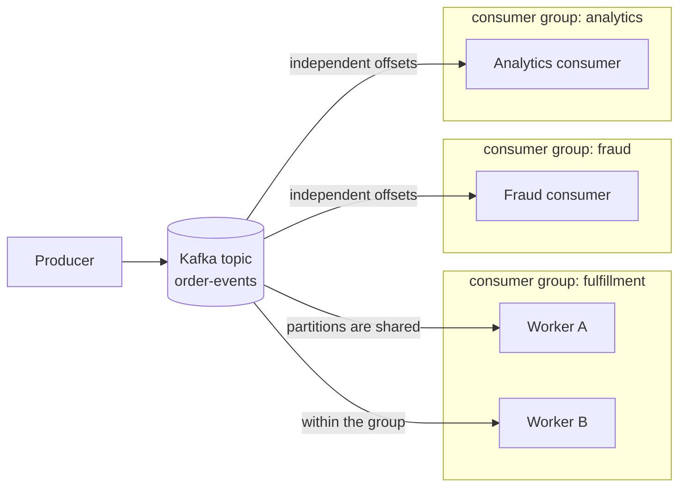

Traditional Kafka consumer group rules are:

- **Within the same group, it is Queue semantics.** Partitions are distributed among instances in the group; a record is processed by one instance in that group. `Worker A` and `Worker B` share fulfillment work and won't do it twice.
- **Between different groups, it is Pub/Sub semantics.** Each group has an independent offset. Fulfillment, fraud, and analytics can all read the same record without stealing messages from each other.

The shortest mnemonic is:

```text
Same group competition: share the work          -> Queue-like
Cross-group independence: each group gets a copy -> Pub/Sub-like
```

More accurately, a Kafka record is "processed once by each consumer group, and by one member within each group." If a failure occurs after successful processing but before the offset is committed, the same group might read it again, so the consumer still needs to be idempotent.

### 3.4 Kafka Can Be a Task Queue, But It's Not a Traditional One

By putting all task workers into the same consumer group, Kafka can carry Queue semantics. However, its operation remains log consumption:

- Consumption completion usually just means committing a partition offset; the record is not deleted from the log immediately upon ack, but retained according to retention.
- The effective parallelism of a traditional consumer group is limited by the number of partitions.
- Progress is primarily advanced by partition, unlike many queue brokers that naturally provide arbitrary single-message acks, visibility timeouts, or priorities.
- Poison records, delayed retries, and multi-level backoff usually require retry topics, DLQs, and application logic.

Therefore, Kafka is very suitable for high throughput, same-key ordering, and tasks that need retention and replay. When task duration varies greatly, or there is a special reliance on single-message acks, delayed delivery, priority, and fine-grained retries, queue brokers like RabbitMQ or SQS are often more convenient.

### 3.5 RabbitMQ Can Also Express Both Semantics

This is not unique to Kafka:

```text
Queue:
  Exchange -> one queue -> many competing consumers

Pub/Sub:
  Exchange -> subscription queue A -> consumer A
           -> subscription queue B -> consumer B
           -> subscription queue C -> consumer C
```

In RabbitMQ, multiple consumers reading the same queue behave as a Queue; an exchange routing the same message to multiple independent queues, where each subscription queue receives a copy, behaves as Pub/Sub. Again: products provide mechanisms, topology determines semantics.

### 3.6 What Are Partitioned Logs and Event Buses?

**Partitioned log is a data model.** Messages are appended to ordered partitions, consumers use offsets to represent progress; data is saved according to retention and can be replayed. Kafka centers on this model.

**Event Bus is a system role.** It receives events and sends them to multiple targets based on subscription rules, content filtering, and permissions. It usually provides Pub/Sub semantics, but Pub/Sub is only an abstraction of "who receives the event"; an Event Bus often includes schema, routing, transformation, retry, and delivery logs.

Therefore, you can think in the following order:

```text
First choose consumption semantics: Is this a job, or a fact observable by many?
                 Queue                    Pub/Sub

Then choose data model: Need single-task control, or retention, offset, and replay?
                 Queue state              Partitioned log

Finally choose implementation: DB table / RabbitMQ / SQS / Kafka / managed event bus
```

### The Real Difference Between Queue and Pub/Sub

| Question | Queue Semantics | Pub/Sub Semantics |
|---|---|---|
| Who gets a message | One worker set completes it once | Each logical subscriber processes it once |
| How to scale horizontally | Add competing workers to the same set | Each subscriber independently adds its own workers |
| Typical payload | Command / Task | Event |
| Typical use | Background execution, load leveling, scheduling | Business event broadcast, system integration |
| Can it replay | Depends on underlying implementation | Depends on underlying implementation |

The last line is important: **Replay capability is not naturally determined by Queue or Pub/Sub semantics, but by the storage model and product retention.**

---

## 4 · What Does Queue Decoupling Actually Decouple?

"Adding a queue decouples" is too abstract. It separates at least four types of dependencies.

### 4.1 Time Decoupling

Producers and consumers do not need to be online simultaneously. When the consumer is down, messages accumulate and are processed after recovery.

### 4.2 Speed Decoupling

When `lambda > mu` in the short term, the queue absorbs the burst. Here `lambda` is the arrival rate and `mu` is the processing rate.

Queues cannot create capacity. If `lambda >= mu` for a long time, the backlog will only grow.

```text
backlog growth per second = max(0, lambda - mu)

drain time = backlog / (mu - lambda)
Assuming mu > lambda
```

For example, production speed 1500 msg/s, consumption capacity 1000 msg/s, for 10 minutes:

```text
backlog = (1500 - 1000) * 600 = 300,000 messages
```

After traffic recovers to 600 msg/s, the extra net processing capacity is 400 msg/s:

```text
drain time = 300,000 / 400 = 750 s = 12.5 min
```

This is also why autoscaling cannot just look at CPU. Consumer CPU might not be high, but the oldest message age continues to rise, meaning the system is still lagging.

### 4.3 Fault Decoupling

Downstream failures do not need to hold up upstream threads. Retries can happen in the background, but there must be limits, backoff, and dead-letter handling, otherwise, failures will turn into a retry storm.

### 4.4 Publisher and Subscriber Decoupling

The event bus discovers subscribers based on rules. The producer does not maintain a list of downstream addresses, nor does it write a set of retry code for each downstream.

### Queues Also Bring New Coupling

- Everyone is still coupled on schema and semantics.
- The same partition key couples throughput and order.
- Shared queues allow tenants to affect each other through backlogs.
- Retention, retry, and DLQ strategies become platform contracts.

Therefore, messaging systems reduce runtime dependencies but do not automatically eliminate data contracts.

---

## 5 · When Is Persistence Needed?

Whether to persist depends on whether the message can be safely and cheaply reconstructed if lost. "The message is important" is not enough to determine the specific plan.

### Situations Where Short-Term In-Memory Storage Is Okay

- Telemetry that can be lost, where the business explicitly accepts sampling.
- Derived tasks that can be regenerated by re-scanning the source of truth.
- Coalescing signals with extremely short lifespans, e.g., "User 42's cache needs refreshing."

Even if loss is allowed, the loss budget and recovery method must be clearly defined.

### Situations Where Persistence Is Required

- The API has already confirmed receipt to the user.
- The task triggers billing, shipping, accounting, or compliance actions.
- Upstream events cannot be re-acquired.
- Consumption might be down for a long time, requiring backlog retention.
- Need for auditing, replaying, or recalculating historical data with new logic.

### Persistence Is Not a Boolean Value

You need to continue asking:

```text
Confirm after writing to single-node page cache, or after fsync?
How many replicas need to confirm?
Are replicas in the same rack, same AZ, or cross-region?
How long does the broker keep it after capturing?
What happens if it's still unconsumed after retention?
```

Stronger durability increases write latency and storage costs. The correct approach is to define the loss budget first, then decide on the confirmation point.

### Retention and TTL Are Not the Same Thing

```text
Queue TTL:
  Message is no longer processed after expiration
  Commonly used for outdated tasks, delay queues, and resource protection

Log retention:
  History can be replayed within a certain time or size window
  Successful consumption does not mean immediate deletion
```

Accounting events cannot be silently TTL'd just because the consumer is slow. Search index refresh tasks can be discarded after expiration and fixed by the next full synchronization.

---

## 6 · Delivery Semantics, Idempotency, and Ordering

### 6.1 Three Delivery Semantics

| Semantics | May Lose | May Duplicate | Common Implementation |
|---|---:|---:|---|
| At-most-once | Yes | No | Confirm position first, then process |
| At-least-once | No, if configured correctly | Yes | Ack only after successful processing |
| Exactly-once effect | Should not lose | Business result not duplicated | Broker semantics + transaction or idempotent sink |

"Exactly once" must specify the boundary. Kafka internal transactions, a stream processor's state update, and an external payment API are not naturally in the same transaction. A safer goal is: at least once delivery, plus idempotent business effects.

### 6.2 Idempotency Is Not Just Simple Deduplication

The billing consumer can use a business unique key:

```sql
BEGIN;

INSERT INTO processed_messages(consumer_name, event_id, processed_at)
VALUES ('billing', :event_id, now())
ON CONFLICT DO NOTHING;

-- Only execute business write when the above INSERT actually inserts
UPDATE invoices
SET status = 'PAID'
WHERE invoice_id = :invoice_id
  AND status = 'PENDING';

COMMIT;
```

Idempotency keys need to be bound to operation semantics. Using only the request body hash can easily misjudge two legitimate payments of the same amount as duplicates.

### 6.3 Ordering Is Usually Only Locally Guaranteed

Global ordering pushes all messages to a serial point. Actual systems generally guarantee local order by business key:

```text
partition_key = order_id

order_1: Created -> Paid -> Shipped
order_2: Created -> Cancelled

Two orders can be parallel, the same order enters the same partition.
```

Even if the broker guarantees partition order, consumer-side concurrency, retries, and external I/O can still disrupt completion order. You need to serialize by key, use version numbers, or let the state machine reject illegal transitions.

### 6.4 Poison Messages and DLQ

Permanently failed messages cannot be retried indefinitely:

```text
delivery
  -> transient failure: exponential backoff + jitter
  -> repeated failure: dead-letter queue
  -> inspect / repair / replay
```

A DLQ is not a trash can. Every dead-letter must retain the original event ID, failure stage, last error, attempt count, and the person responsible for the next step, and there must be alerts and replay tools.

---

## 7 · Database Queue, Outbox, and CDC

Low-to-medium scale systems do not necessarily need an independent broker. Relational databases already provide transactions, indexing, and persistence; you can start with a queue table.

### 7.1 Implementing a Work Queue with a Database

```sql
CREATE TABLE jobs (
  job_id           BIGSERIAL PRIMARY KEY,
  tenant_id        BIGINT NOT NULL,
  job_type         TEXT NOT NULL,
  payload          JSONB NOT NULL,
  status           TEXT NOT NULL DEFAULT 'READY',
  available_at     TIMESTAMPTZ NOT NULL DEFAULT now(),
  attempts         INT NOT NULL DEFAULT 0,
  lease_until      TIMESTAMPTZ,
  created_at       TIMESTAMPTZ NOT NULL DEFAULT now()
);

CREATE INDEX jobs_ready_idx
ON jobs (available_at, job_id)
WHERE status = 'READY';
```

Multiple workers can use `FOR UPDATE SKIP LOCKED` to grab different records. PostgreSQL documentation explicitly states that it is not suitable for general consistency queries, but is suitable for avoiding lock contention when multiple consumers access a queue-like table.

```sql
BEGIN;

SELECT job_id
FROM jobs
WHERE status = 'READY'
  AND available_at <= now()
ORDER BY available_at, job_id
FOR UPDATE SKIP LOCKED
LIMIT 100;

UPDATE jobs
SET status = 'RUNNING',
    lease_until = now() + interval '30 seconds',
    attempts = attempts + 1
WHERE job_id = ANY(:claimed_ids);

COMMIT;
```

After the lease expires, it can be reclaimed, so the consumer must be idempotent.

Database queues are suitable when:

- Daily throughput has not overwhelmed the primary database.
- The team wants to reduce the variety of infrastructure.
- Tasks and business data need a local transaction.
- Routing and replay requirements are simple.

Signals that you need to migrate to an independent messaging system include: queue polling continuously creating database I/O, the backlog table expanding rapidly, the number of subscribers increasing, the need for long-term replay, or message traffic starting to affect online transactions.

### 7.2 Why Dual Write Fails

The following code has an uneliminatable failure window:

```text
1. UPDATE orders SET status = 'PAID'
2. publish OrderPaid
```

- Step 1 succeeds, Step 2 fails: Database has new state, downstream never receives the event.
- Step 2 succeeds, Step 1 rolls back: Downstream receives something that didn't actually happen.

Simple retries cannot determine which step succeeded.

### 7.3 Transactional Outbox

Business records and outbox events are written in the same database transaction:

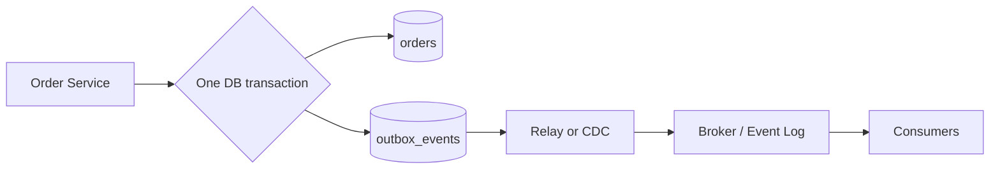

```sql
BEGIN;

UPDATE orders
SET status = 'PAID'
WHERE order_id = :order_id;

INSERT INTO outbox_events(event_id, aggregate_id, event_type, payload)
VALUES (:event_id, :order_id, 'order.paid', :payload);

COMMIT;
```

The Relay can poll the outbox or read the database change log via CDC. Debezium's outbox event router is a ready-made implementation of the latter. The Relay may still publish duplicates, so consumers still need to be idempotent.

### 7.4 Inbox Pattern

The consumer records the event ID in a local transaction before updating the business state, solving duplicate consumption caused by "business commit successful, but process crashes before ack."

```text
Producer side: business row + outbox
Consumer side: inbox dedup + business row
```

The Outbox ensures facts are not missed; the Inbox controls duplicate effects. Neither creates a global transaction across services, but puts the consistency boundary into their respective local databases.

---

## 8 · RabbitMQ: A Broker Oriented Toward Routing and Task Delivery

### 8.1 Historical Position

The RabbitMQ project began in 2006, with the first version released in February 2007. It was originally built around AMQP. AMQP originated from enterprise messaging work started at JPMorgan in 2003.

Version confusion is common here:

- The exchange, queue, and binding model most common in RabbitMQ for a long time belongs to AMQP 0-9-1.
- AMQP 1.0 was formed in 2011 and became an OASIS standard in 2012; the protocol model is significantly different from earlier versions.
- RabbitMQ 4.0 began supporting AMQP 1.0 as a native core protocol, but this does not mean the AMQP 0-9-1 model was simply renamed.

### 8.2 Data Path

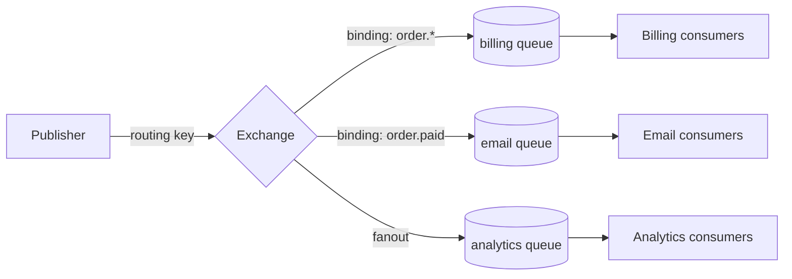

Producers usually send to an exchange, rather than directly deciding which consumer receives it. The exchange routes messages to one or more queues based on bindings.

| Exchange | Routing Method | Typical Use |
|---|---|---|
| Direct | routing key exact match | Distribution by task type |
| Topic | `order.*` pattern match | Business event subscription |
| Fanout | Ignores routing key, broadcast | Replication to multiple downstreams |
| Headers | Match based on header combinations | Complex but less used rules |

### 8.3 Two Directions of Reliability Confirmation

```text
Publisher -> Broker: publisher confirm
Broker -> Consumer -> Broker: consumer acknowledgement
```

Publisher confirm indicates the broker has taken over the message according to configuration. Consumers should ack after business results are written. When the connection breaks, unacked messages can be redelivered, so handlers must be idempotent.

`prefetch` limits how many unacked messages each consumer holds simultaneously. It is a local backpressure window:

- Too small limits throughput due to network round-trips.
- Too large lets slow consumers hoard messages, increasing memory and redelivery costs.
- When task duration varies greatly, a smaller prefetch is usually fairer.

### 8.4 Classic Queue and Quorum Queue

When replication and stronger data security are needed, RabbitMQ officially recommends prioritizing quorum queues. They use Raft to manage replicated queues and leader election. The cost is that every message requires more disk and network work; you must estimate replica counts, disk capacity, and re-replication traffic after node failures during deployment.

RabbitMQ is suitable for:

- Task distribution and per-message acknowledgement.
- Flexible routing and multiple independent queues.
- Delayed retries, DLQs, priorities, and other broker workflows.
- Single tasks that should be picked up by an idle worker as soon as possible.

Be wary of:

- Queue counts, binding counts, and connection counts all consume broker resources.
- Large, long-term backlogs are not the best workload for all queue types.
- Messages usually leave the main queue after consumption; historical replay is not its core abstraction.

---

## 9 · Kafka: Building a Messaging System on Partitioned Logs

### 9.1 Historical Position

Kafka was originally developed by LinkedIn for log collection and data pipelines. Kreps, Narkhede, and Rao described it in a 2011 NetDB paper: the goal was to collect and deliver high-throughput logs with low latency, while supporting both online and offline consumers.

Kafka replaced the broker's core abstraction with an append-only log that is retainable, locatable, and replayable. This influenced later data architectures more than simply increasing queue throughput.

### 9.2 Topic, Partition, and Offset

```text
Topic: order-events

Partition 0: [offset 0][1][2][3]...
Partition 1: [offset 0][1][2]...
Partition 2: [offset 0][1][2][3][4]...
```

- Producers choose partitions based on keys or partitioners.
- Partitions are ordered by append sequence; topics do not provide global order across partitions.
- Consumers save offsets for each partition.
- Retention is separated from whether it has been consumed, so offsets can be rolled back for replay.

### 9.3 Consumer Group

Within the same consumer group, partitions are distributed to consumer instances for collaborative processing. In traditional consumer groups, a partition is handled by only one consumer in the group at a time, therefore:

```text
Max effective parallel consumers <= number of partitions
```

Different consumer groups save their own offsets and can independently read the same topic. A fraud group and an analytics group won't steal data from each other.

Therefore, it behaves as Queue semantics within the same group, and Pub/Sub semantics between different groups. This refers to how consumers are organized; Kafka's underlying data model is always a partitioned log. See Section 3 for details.

### 9.4 Replication and Fault Recovery

Partitions have leaders and replicas. Producers and consumers work along the leader's log, and replicas replicate that partition. You must clearly define:

- replication factor
- producer `acks` strategy
- `min.insync.replicas`
- whether writes are still allowed when a broker or AZ fails

These parameters together determine which replicas must be caught up for a "successful write." Just saying Kafka has three replicas does not imply data won't be lost.

### 9.5 What Is Kafka Suitable For?

- CDC and cross-system data pipelines.
- Multiple consumer groups independently reading the same history.
- Needs for replay, backfill, and recalculation.
- High throughput, batch sequential I/O, and stream processing.
- Events with the same key need local ordering.

Be wary of:

- Partitions are parallelism and ordering boundaries; changing partition strategies affects key mapping.
- A poison record will block consumers that expect to advance strictly by offset.
- Independent acks for single tasks, arbitrary priorities, and complex routing are not strengths of traditional consumer groups.
- The longer the retention, the higher the disk, replication, and recovery costs.

---

## 10 · How to Choose Between RabbitMQ, Kafka, and Managed Queues

Do not start choosing from the brand. Write down the message lifecycle first.

| Design Question | RabbitMQ | Kafka | Managed Queue / Event Bus |
|---|---|---|---|
| Core Abstraction | exchange + queue | partitioned log | queue, topic, or rule router |
| Consumption Progress | single ack / requeue | partition offset | Product defined |
| Historical Replay | Weak | Strong | Product defined |
| Routing | exchange binding is flexible | Usually by topic, key, and consumer group | rule/filter common |
| Long Backlog | Evaluate by queue type | Common workload | Subject to quotas and cost models |
| Operations | Self-built cluster needs maintenance | Self-built cluster complexity high | Cloud vendor manages infrastructure |
| Typical Scenarios | Background tasks, complex routing | CDC, event stream, data platform | Small team, fast delivery desired |

A practical decision order:

```text
Need long-term retention and arbitrary replay?
  Yes -> Look at partitioned logs first

Need single-task ack, delayed retries, and flexible routing?
  Yes -> Look at queue brokers first

Scale is small, database is enough, transaction coupling is most important?
  Yes -> Look at DB queue / outbox first

Team doesn't want to operate brokers, cloud dependency is acceptable?
  Yes -> Evaluate managed queue / event bus
```

Real systems can mix them: Kafka saves business event history, RabbitMQ handles execution tasks requiring fine-grained retries, and the database saves control plane configuration. The premise of mixing is that each system has clear boundaries; otherwise, it just increases the failure surface.

---

## 11 · System Context from Research Papers

Modern messaging architecture comes from the convergence of several research lines, not invented by one product at once.

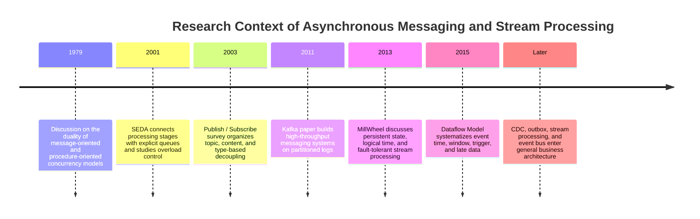

### 11.1 Message Passing and Publish / Subscribe

Lauer and Needham early discussed the duality between message-oriented and procedure-oriented systems. Later publish/subscribe research further decoupled both parties from address binding: publishers describe events, subscribers express interest, and the middle layer performs matching.

The 2003 [The Many Faces of Publish/Subscribe](https://doi.org/10.1145/857076.857078) is a good taxonomy entry point. It explains topic-based, content-based, and type-based subscriptions, and points out that spatial, temporal, and synchronization decoupling are the core of pub/sub.

### 11.2 SEDA: Explicit Queues Are Also Resource Control Points

[SEDA, SOSP 2001](https://www.mdw.la/papers/seda-sosp01.pdf) breaks services into stages connected by explicit queues. Queues don't just pass work; they expose the load of each stage, allowing the system to perform batching, rate limiting, thread pool adjustment, and load shedding.

This idea is still directly applicable today: adding a queue without monitoring queue depth, oldest age, service time, and rejection rate loses the most valuable part of explicit stages.

### 11.3 Kafka: Logs Become the Shared Data Backbone

[Kafka: a Distributed Messaging System for Log Processing, NetDB 2011](https://www.odbms.org/2011/01/kafka-a-distributed-messaging-system-for-log-processing/) targets activity logs and offline data loading, combining sequential append, partitioning, batch transfer, and consumption position into one system.

The log model changes data recovery. Consumers no longer depend on the broker to maintain complex state for every message, but describe where they have read via offsets. New consumers can start from old positions, and old consumers can backfill.

### 11.4 MillWheel and Dataflow: Time and State After Messages

Brokers solve "how data arrives," but stream processors must also solve: which window late events belong to, how state is recovered, and when results are output.

- [MillWheel, VLDB 2013](https://research.google/pubs/millwheel-fault-tolerant-stream-processing-at-internet-scale/) discusses persistent state, logical time, and fault tolerance in low-latency stream processing.
- [The Dataflow Model, VLDB 2015](https://research.google/pubs/the-dataflow-model-a-practical-approach-to-balancing-correctness-latency-and-cost-in-massive-scale-unbounded-out-of-order-data-processing/) breaks the problem into event time windows, processing-time triggers, and result update methods.

This explains why Kafka itself is not a complete stream computing engine. Saving events and calculating stateful windows are two different levels of problems.

### Four Design Habits Left by Research Context

1. Queue length is system state, not an internal implementation detail.
2. Ordering must be bound to keys or partitions; global ordering cannot be promised generally.
3. Message transmission, state updates, and external side effects must define consistency boundaries separately.
4. Event time is different from processing time; late data is normal input, not just an exception.

---

## 12 · What Exactly Is an Event Bus?

An Event Bus is a many-to-many router: it receives events from multiple sources and sends them to zero or more targets based on rules. It usually also handles schema, permissions, filtering, transformation, and delivery status.

An Event Bus often provides Pub/Sub semantics, but they are not synonyms: Pub/Sub only describes multiple logical subscribers each receiving events; an Event Bus is a complete system carrying routing, governance, and reliable delivery. Its targets can be queues, Kafka topics, functions, or webhooks.

```text
Producer cares: What facts I published
Event Bus cares: Which rules match, what deliveries should be generated
Subscriber cares: How I process and ack my delivery
```

An Event Bus is not necessarily an independent product. It can be implemented using a database, or built on RabbitMQ, Kafka, or managed services.

### 12.1 Control Plane and Data Plane

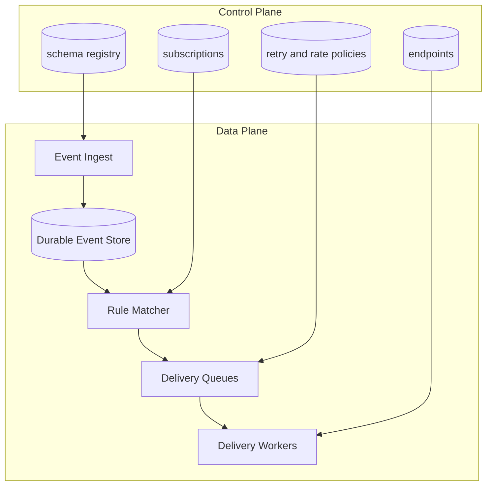

The control plane saves configuration; change frequency is low, but correctness requirements are high. The data plane carries large volumes of events, pursuing throughput, isolation, and recoverability. Mixing the two in the same hot path makes it easy for a slow configuration table query to drag down the entire event stream.

### 12.2 Database-Based Event Bus

Core tables can be:

```text
events
  event_id, tenant_id, type, payload, occurred_at

subscriptions
  subscription_id, tenant_id, event_pattern, endpoint_id, enabled

deliveries
  delivery_id, event_id, subscription_id, status,
  attempt_count, next_attempt_at, lease_until

endpoints
  endpoint_id, tenant_id, url, signing_key_id,
  timeout_ms, rate_limit_policy_id
```

The router scans new events, matches subscriptions, and generates a delivery row for each subscription. Workers then use `SKIP LOCKED` to claim deliveries.

The advantage is that transactions and debugging are simple, and all state can be checked with SQL. The disadvantage is that fan-out generates significant write amplification:

```text
delivery rows/s = event QPS * average matched subscriptions
```

1000 events/s, with an average of 20 subscriptions matched per event, generates 20K delivery inserts/s, not counting retries and indexes.

### 12.3 Messaging System-Based Event Bus

- RabbitMQ can use topic exchanges + durable queues for each logical subscription.
- Kafka can let each type of subscriber use an independent consumer group, or have the router generate dedicated delivery topics.
- Managed event buses can map targets directly using rule patterns.

After the broker takes on data plane backlogs, the database is still suitable for saving tenants, subscriptions, endpoints, secret references, and policies. This hybrid structure is usually easier to manage than "stuffing all configuration into Kafka topics."

---

## 13 · Complete Implementation of a Webhook Platform

A webhook is an HTTP target for an event bus. It reliably pushes internal events to URLs provided by customers.

### 13.1 Sending Link

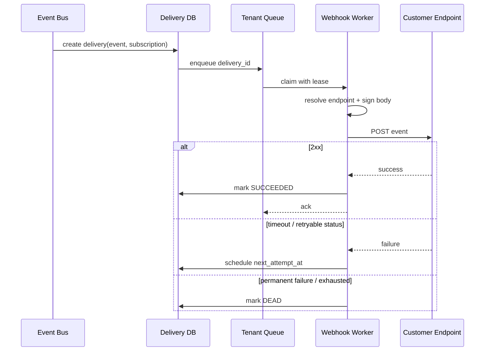

### 13.2 HTTP Contract

```http
POST /customer/webhooks HTTP/1.1
Content-Type: application/json
X-Event-Id: evt_01J...
X-Event-Type: order.paid
X-Webhook-Timestamp: 1784142000
X-Webhook-Signature: v1=hex_hmac
X-Delivery-Attempt: 3
```

Signatures usually cover the timestamp and the raw body:

```text
signed_payload = timestamp + "." + raw_request_body
signature = HMAC-SHA256(secret, signed_payload)
```

The receiver needs to:

1. Verify the signature using raw bytes; do not parse JSON and then re-serialize.
2. Use constant-time comparison to compare signatures.
3. Reject timestamps outside the time window to reduce replay attack risks.
4. Deduplicate using `event_id` or delivery ID.
5. Return 2xx as soon as possible, putting actual business processing into their own internal queue.

GitHub and Stripe's official webhook documentation emphasize secret verification, duplicate event handling, and asynchronous consumption. Their specific retry strategies differ, so your platform must write "which status codes will be retried" into a contract; you cannot assume there is only one behavior in the industry.

### 13.3 Retry Policy

A reasonable retry schedule:

```text
delay = min(max_delay, base * 2^attempt) + random_jitter
```

It is recommended to distinguish:

- `2xx`: Success.
- `408`, `429`, most `5xx`, timeout: Retryable.
- Most `4xx`: Configuration or request error, stop after a few retries.
- DNS, TLS, connection error: Retryable, but subject to total budget limits.

Do not let workers sleep in the process. Persist `next_attempt_at` and have a delay queue or scheduler re-enqueue it when the time comes. This way, deployment and crashes won't lose timing state.

### 13.4 Webhook SSRF Risks

Customers can configure target URLs, so delivery workers are potential internal network probes. At a minimum:

- Only allow HTTPS, with exceptions for development environments.
- After DNS resolution, reject loopback, link-local, private network, and cloud metadata addresses.
- Re-verify the actual IP during connection to prevent DNS rebinding.
- Limit redirect counts and re-check each Location.
- Limit response body, header size, connection, and read timeouts.
- Use egress proxies or independent network isolation for webhook workers.
- Truncate and desensitize response bodies in logs to avoid customers echoing secrets.

### 13.5 Operational Interface Needed by Users

The webhook platform must at least allow viewing by tenant:

```text
event_id / delivery_id
endpoint and event type
attempt count and next retry
HTTP status and latency
truncated response
signature key version
manual replay / disable endpoint
```

Without delivery logs and replay, customers can only tell you "one was missed yesterday," but the platform cannot prove whether the event was generated, matched, or sent.

---

## 14 · Multi-tenant Webhooks and Double Mapping

Multi-tenant platforms must prevent failure propagation. A large tenant could fill up shared workers, connection pools, and retry budgets, delaying other tenants.

### 14.1 What Is Double Mapping?

Splitting "who is interested in the event" and "how to send it out" into two lookups:

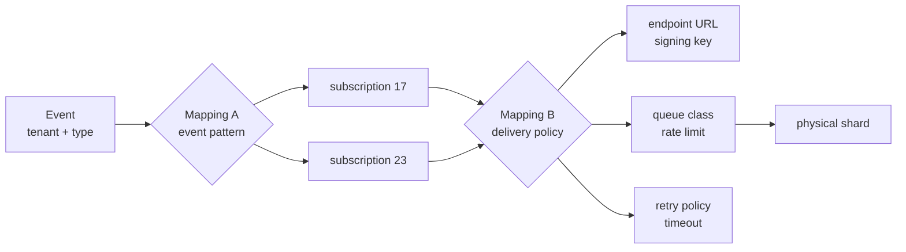

**Mapping A: event -> subscriptions**

```text
(tenant_id, event_type, event attributes)
  -> subscription_ids
```

It answers the business question: which customer configurations should receive this event?

**Mapping B: subscription -> delivery configuration**

```text
(tenant_id, subscription_id)
  -> endpoint_id
  -> signing_key_id
  -> queue_class
  -> rate_limit
  -> retry_policy
  -> physical shard
```

It answers the execution question: where should it be sent, and what security and resource policies should be used?

Splitting into two layers has three practical benefits:

- Changing URLs or rotating secrets does not require modifying event rules.
- Multiple subscriptions can reuse the same endpoint but have different event filters.
- Physical sharding and rate-limiting policies can be migrated without affecting the producer's event contract.

### 14.2 Tenant Isolation Strategy

You don't have to create physical queues for every tenant from the start. You can layer them:

```text
Free / small tenants
  -> shared queue
  -> per-tenant token bucket
  -> fair scheduler

Large tenants
  -> dedicated logical partition or queue
  -> independent concurrency cap

Regulated enterprise
  -> dedicated worker pool / region / encryption key
```

Each tenant needs at least:

- In-flight request limit
- Requests per second and burst budget
- Retry budget
- Backlog / storage quota
- Endpoint circuit breaker

Global rate limits alone do not provide fairness. One tenant's 1 million failed retries can still push another tenant's new messages far back.

### 14.3 Fair Scheduling

You can maintain active tenant queues and use round-robin or deficit weighted round-robin to claim them:

```text
tenant A: weight 5, backlog 100K
tenant B: weight 1, backlog 20
tenant C: weight 1, backlog 50

The scheduler gives quotas based on weight, but B and C still continuously receive service.
```

The most important monitoring is not just global queue depth, but also per-tenant oldest age, success rate, throttle count, and retry amplification.

### 14.4 Configuration Caching and Double Mapping Consistency

Subscription and endpoint configurations are suitable for caching, but secret rotation, endpoint disabling, and permission revocation cannot wait indefinitely for TTLs.

Common practice:

```text
Database = source of truth
Config cache = versioned read optimization
ConfigChanged event = active invalidation
Short TTL = fallback if invalidation events are missed
```

Delivery rows save the config version used. This allows a replay to choose to continue using the old payload semantics or explicitly upgrade to the new endpoint configuration.

---

## 15 · Observability and Capacity Estimation

### 15.1 Four Core Metric Categories

| Category | Metrics |
|---|---|
| Ingress | events/s, bytes/s, publish error, durable ack latency |
| Queue | depth, oldest message age, partition lag, redelivery rate |
| Consumer | service time, success rate, timeout, in-flight, throughput |
| Outcome | end-to-end latency, DLQ count, duplicate effect, per-tenant SLO |

Queue depth alone is not enough. 100,000 backlog items might clear quickly if each takes 1ms; 100 items might mean the system has already timed out if each takes 30 seconds. Oldest age is closer to the user's actual waiting time.

### 15.2 Basic Estimation

Assumptions:

```text
event ingress = 8K events/s
average fan-out = 4 subscriptions/event
delivery rate = 32K deliveries/s
average payload = 2 KB
peak factor = 5
retention = 7 days
```

Peak delivery rate:

```text
32K * 5 = 160K deliveries/s
```

7-day logical storage for payload only:

```text
8K * 2 KB * 86,400 * 7
  ~= 9.7 TB
```

You must also add envelopes, indexes, replicas, compression ratios, and delivery state. Webhook fan-out delivery metadata might be 4 times the number of original events.

If one HTTP delivery occupies a connection for 250ms on average, the theoretical average in-flight at peak 160K/s:

```text
concurrency ~= QPS * latency
            ~= 160K * 0.25
            ~= 40K connections
```

This directly drives connection pooling, asynchronous network I/O, multi-region workers, and tenant concurrency limit designs.

### 15.3 SLOs Must Be Split Along the Link

```text
publish acceptance latency
event-to-queue latency
queue wait time
consumer processing time
external endpoint latency
end-to-end completion latency
```

Monitoring only worker HTTP latency will miss queuing time. The latency users see is usually queue wait plus service time.

---

## 16 · Handling Additional Requirements in Interviews

### Require Strict Ordering

Ask about the ordering scope first. Usually, partition by `aggregate_id`, serialize by key on the consumer side, and add versions to state writes. Do not promise global ordering for the entire system.

### Require Replay Support

Original events must be retained independently, and handler versions must be traceable. Replay writes to a separate consumer group or replay queue, with rate limiting to avoid replay traffic overwhelming real-time traffic.

### Require Customer Payload Filtering

Put filters into Mapping A, and limit expression complexity, field whitelisting, and execution time. Rules are compiled and cached, and configuration updates are invalidated via versions.

### Require Webhook Payload Transformation

Save canonical events and run versioned transformers during delivery. Do not save only the transformed body, otherwise, you cannot replay from the original facts after fixing the template.

### Require Cross-Region Disaster Recovery

Define region ownership first. Active-passive is easier to avoid duplicate delivery; active-active requires global event IDs, tenant home regions, replication delay handling, and cross-region deduplication. Webhooks themselves can still duplicate, so customer contracts must maintain idempotency.

### Require Pausing an Endpoint

Stop the execution of new deliveries but retain the backlog, and record the pause timestamp. Support drain rate limits upon recovery, otherwise, the backlog will instantly overwhelm the customer's endpoint.

### Require Deleting Tenant Data

The control plane deletes subscriptions, endpoints, and secrets; the data plane needs to locate events, delivery logs, DLQs, and object references by tenant. In encryption isolation scenarios, you can delete tenant data keys to complete crypto-shredding, but the retention scope of audit records must be defined by compliance requirements first.

---

## 17 · Shortest Design Template

```text
1. Define business boundaries
   Which actions are synchronously confirmed, which side effects are asynchronous?

2. Define capture points
   When can success be returned? Is the message persisted and replicated?

3. Choose semantics first, then implementation
   Queue for a job, or Pub/Sub for a fact?
   Then choose DB queue, broker queue, partitioned log, or managed event bus.

4. Define correctness
   Delivery semantics, idempotency keys, ordering scope, outbox / inbox.

5. Define failure paths
   timeout, retry, backoff, DLQ, manual replay.

6. Perform capacity estimation
   ingress, fan-out, payload, retention, backlog, drain time, concurrency.

7. Perform isolation
   partition key, per-tenant quota, fair scheduling, circuit breaker.

8. Perform observability
   durable ack, oldest age, consumer lag, end-to-end latency, DLQ.
```

When reviewing, grasp four checkpoints:

```text
Has the message been reliably captured?
Will duplicate arrival produce duplicate business results?
How will the system degrade when consumption speed can't keep up?
Will a failure of a tenant or downstream drag others down?
```

---

## 18 · Primary Sources

- [RabbitMQ: Consumer Acknowledgements and Publisher Confirms](https://www.rabbitmq.com/docs/confirms)
- [RabbitMQ: Quorum Queues](https://www.rabbitmq.com/docs/quorum-queues)
- [RabbitMQ: Native AMQP 1.0 and AMQP history](https://www.rabbitmq.com/blog/2024/08/05/native-amqp)
- [OASIS AMQP 1.0 Standard](https://www.oasis-open.org/standard/amqp/)
- [Apache Kafka Documentation](https://kafka.apache.org/documentation/)
- [Kafka: a Distributed Messaging System for Log Processing, NetDB 2011](https://www.odbms.org/2011/01/kafka-a-distributed-messaging-system-for-log-processing/)
- [SEDA: An Architecture for Well-Conditioned, Scalable Internet Services, SOSP 2001](https://www.mdw.la/papers/seda-sosp01.pdf)
- [The Many Faces of Publish/Subscribe, ACM Computing Surveys 2003](https://doi.org/10.1145/857076.857078)
- [MillWheel: Fault-Tolerant Stream Processing at Internet Scale, VLDB 2013](https://research.google/pubs/millwheel-fault-tolerant-stream-processing-at-internet-scale/)
- [The Dataflow Model, VLDB 2015](https://research.google/pubs/the-dataflow-model-a-practical-approach-to-balancing-correctness-latency-and-cost-in-massive-scale-unbounded-out-of-order-data-processing/)
- [Debezium Outbox Event Router](https://debezium.io/documentation/reference/stable/transformations/outbox-event-router.html)
- [PostgreSQL SELECT: SKIP LOCKED](https://www.postgresql.org/docs/current/sql-select.html)
- [Amazon EventBridge: Event buses](https://docs.aws.amazon.com/eventbridge/latest/userguide/eb-event-bus.html)
- [GitHub webhook best practices](https://docs.github.com/en/webhooks/using-webhooks/best-practices-for-using-webhooks)
- [Stripe webhook best practices](https://docs.stripe.com/webhooks)
