# System Design 07 · 异步处理、消息系统与 Event Bus

异步架构重新安排责任转移的时间点。它不保证函数本身跑得更快。

同步请求中，调用方一直持有责任，直到下游返回结果。异步请求中，调用方先把任务交给一个能够可靠保管它的组件，之后由后台继续处理。设计时先问：

> 系统在哪一刻可以确定任务已经被接住，即使当前进程马上崩溃，任务也不会消失？

消息队列、持久化日志、数据库 outbox 和 webhook 都是在回答这个问题。它们提供的答案不同，所以适合的场景也不同。

```async-messaging-architecture-visual
```

---

## 1 · 先区分三种“异步”

### 1.1 语言级异步

`async/await`、future、promise 和 event loop 主要解决单个进程如何在等待 I/O 时继续做别的工作。

```text
一个进程
  -> 发起网络 I/O
  -> 暂停当前 coroutine
  -> event loop 运行其他 coroutine
  -> I/O 完成后恢复
```

它能提高并发利用率，但进程一旦崩溃，内存里的 future 也会消失。语言级异步不等于可靠的系统级异步。

### 1.2 系统级异步

系统级异步把任务写入进程外部的持久化介质，再向调用方确认。

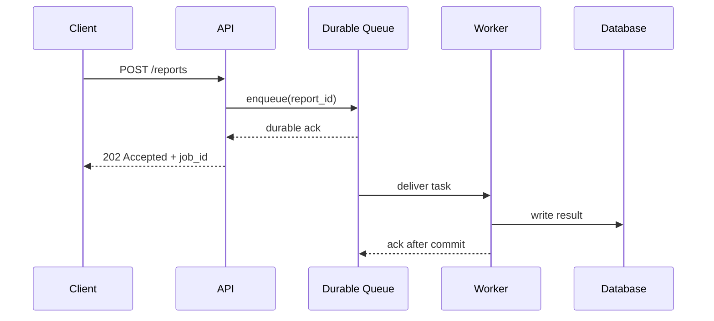

图里有两个不同的确认：

- Queue 对 API 的确认表示消息系统已经接管任务。
- Worker 对 Queue 的确认表示业务处理已经完成，可以删除或推进消费位置。

如果 API 在 durable ack 之前就返回成功，所谓的 fire-and-forget 其实是 fire-and-hope。

### 1.3 业务级异步

用户是否必须立即看到最终结果，是产品语义，不是代码语法。

| 操作 | 适合的响应方式 | 原因 |
|---|---|---|
| 修改密码 | 同步确认核心写入 | 用户需要明确知道是否成功 |
| 生成月度报表 | `202 Accepted` + job ID | 任务可能运行几分钟 |
| 发送欢迎邮件 | 核心注册同步，邮件异步 | 邮件失败不应回滚注册 |
| 扣款 | 账务写入同步，通知异步 | 正确性边界不能交给通知系统 |
| 视频转码 | 上传确认后异步处理 | 大计算不应占住 HTTP 连接 |

异步完成后的结果可以通过轮询、webhook、SSE 或 WebSocket 返回。选择取决于谁需要结果，以及连接能否长期保持。

### 1.4 常见消息场景：先看拓扑，再看交互

“1-to-1”“Pub/Sub”“RPC”“聊天消息”经常被放在一起说，其实它们描述的不是同一件事：

```text
拓扑：谁发给谁？              1 -> 1、1 -> N、N -> 1、N -> N
交互：发送方等不等结果？      notification、request/reply、stream
语义：消息代表什么？          command、event、document
载荷：bytes 怎么编码？         text、JSON、Protobuf、Avro
```

因此，`text` 本身不是一种消息模式。它可能表示聊天这个业务场景，也可能只是 payload 的编码格式。同一条 1-to-1 聊天消息可以用 JSON 传输；同一种 RPC 也可以用 Protobuf 或 JSON。

#### 按连接拓扑分类

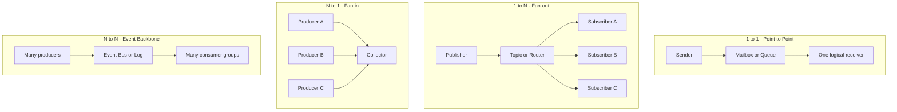

| 拓扑 | 消息含义 | 常见场景 | 常见实现 |
|---|---|---|---|
| 1 → 1 | 交给一个逻辑接收者 | 私信、发邮件任务、生成报表 | mailbox、work queue、一个 consumer group |
| 1 → N | 多个下游观察同一事实 | `order.paid`、配置变更、cache invalidation | Pub/Sub、exchange + 多个 queue、多个 Kafka group |
| N → 1 | 多个来源汇入一个处理面 | 日志采集、metrics、审计、IoT telemetry | collector、ingestion topic、stream processor |
| N → N | 多个生产者和下游共享事件骨干 | 企业事件平台、CDC、数据集成 | Event Bus、Kafka、Pulsar 等日志系统 |

这里的 `1` 和 `N` 指**逻辑角色**，不一定是进程数量。例如一个“Notification subscriber”背后可以有 50 个 worker；它在 Pub/Sub 拓扑里仍然算一个逻辑订阅者。

#### 按交互方式分类

| 模式 | 发送方是否等结果 | 消息里通常有什么 | 适合场景 |
|---|---|---|---|
| Notification | 不等业务结果 | `event_id`、type、payload | cache 失效、审计通知、非关键提醒 |
| Task / Command | 通常先拿 job ID | task type、参数、幂等键 | 转码、邮件、报表、异步推理 |
| Event | 不要求某个固定接收者响应 | 已发生的事实、版本、时间 | 订单状态、CDC、领域事件 |
| Request / Reply | 等待对应 reply，可同步也可异步 | `request_id`、`reply_to`、deadline | RPC、跨服务查询、设备命令 |
| Stream | 持续接收多条结果 | sequence、offset、event time | 日志、行情、模型 token、传感器数据 |

#### 1-to-1 的三种常见含义

同样写成 1-to-1，背后的契约可能完全不同：

```text
Direct message
  Alice -> Bob's mailbox
  接收者由 user_id 指定，Bob 可以晚点上线再收

Work item
  API -> image-processing queue -> any available worker
  不是指定某台机器，而是任意一个 worker 完成即可

Request / reply
  Service A -> request queue -> Service B
  Service B -> reply queue -> Service A
  A 通过 correlation_id 找回对应响应
```

第一个是“指定逻辑接收者”，第二个是“指定 worker 集合”，第三个还多了一条反向消息。不能只凭箭头数量判断可靠性、顺序或是否同步。

#### Text / Chat：业务场景，不只是一个字符串

私聊通常是 1-to-1，群聊通常是 1-to-N，但真正的聊天系统还要定义：

- `conversation_id`：消息属于哪个会话。
- `message_id`：去重和重试定位。
- `sender_id` 与 recipient / membership snapshot：谁发给谁。
- `client_sequence` 或 server sequence：会话内如何排序。
- `sent`、`delivered`、`read`：三个不同的状态，不能合成一个“成功”。
- 离线 mailbox、push notification 和多设备同步：接收者不在线时如何补发。

```text
Client A -> Chat API -> durable conversation log
                         |-> online gateway -> Client B
                         |-> offline mailbox
                         |-> push notification
                         +-> sync cursor for B's other devices
```

正文可以是 UTF-8 text，也可以是图片或文件的 object reference。编码格式不会改变聊天的投递语义。

#### RPC over messaging：能做，但不要假装它天然解耦

RPC 的核心是 request 对应一个 response。用 broker 实现时，request 至少需要：

```json
{
  "request_id": "req_123",
  "method": "risk.score",
  "reply_to": "risk-replies.service-a",
  "deadline": "2026-07-15T18:20:05Z",
  "payload": {"order_id": "order_918"}
}
```

Responder 把相同的 `request_id` 放进 reply，调用方据此匹配等待中的请求。还必须处理 timeout、late reply、重复 reply、reply queue 生命周期和 caller 已经重启的情况。

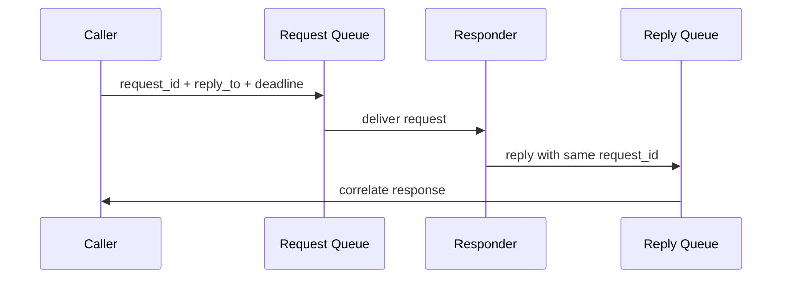

如果 Caller 发完消息后仍阻塞等待 reply，那么它在业务上依旧是同步 RPC：Responder 变慢，Caller 仍会 timeout。Broker 改善的是缓冲、投递和位置解耦，并没有消除时间依赖。

真正的异步 request/reply 通常是：立即返回 `job_id`，后台完成后把结果写入状态表，再由调用方轮询或由 webhook / SSE 通知。长任务不要占住一个 RPC 等待槽。

#### 一张选择表

```text
只想告诉对方“发生了什么”              -> Event / Notification
希望某个 worker 完成一份工作            -> Task Queue
多个独立下游都要处理                    -> Pub/Sub
必须拿到一个对应结果，且很快完成          -> RPC / Request-Reply
耗时长，但最终需要结果                    -> Async Job + status / callback
持续产生、需要 offset 或 replay           -> Stream / Partitioned Log
人与人发送消息                            -> Mailbox / Conversation Log
```

一个业务可以组合多种模式。比如“发送聊天图片”可能先用 request/reply 获取上传地址，再用 task queue 做缩略图，写入 conversation log，最后通过 Pub/Sub 同步到接收者的多台设备。

---

## 2 · 一条消息到底包含什么

“Queue 里放一条 JSON”只描述了应用看到的部分。Broker 真正管理的是三层数据：

```text
应用消息：这件事是什么，业务参数是什么
Broker record：消息要去哪里，如何序列化，写在什么位置
投递状态：现在可领取、处理中、等待重试，还是已经进入 DLQ
```

应用消息通常由 envelope 和 payload 组成。Broker 把它序列化成 bytes，再把 bytes 与路由、位置和投递状态关联起来。磁盘上的实际格式通常是二进制 segment、page 或 record batch，不是一张可以直接查询的 JSON 表。

```message-queue-demo
```

### 2.1 应用写进去的数据

一个可维护的 message envelope 至少需要：

```json
{
  "event_id": "evt_01J...",
  "event_type": "order.paid",
  "schema_version": 3,
  "occurred_at": "2026-07-15T18:20:00Z",
  "producer": "payment-service",
  "tenant_id": "tenant_42",
  "aggregate_id": "order_918",
  "traceparent": "00-...",
  "payload": {
    "order_id": "order_918",
    "amount_cents": 2599,
    "currency": "USD"
  }
}
```

这里的 `payload` 才是业务数据。外层 envelope 让基础设施和通用 consumer 不解析订单字段也能完成路由、追踪、版本检查和去重。

字段的职责不同：

| 字段 | 用途 |
|---|---|
| `event_id` | 去重、审计、重放定位 |
| `event_type` | 路由和 handler 选择 |
| `schema_version` | 兼容旧消费者 |
| `occurred_at` | 业务发生时间，不等同于消费时间 |
| `tenant_id` | 隔离、计费、限流 |
| `aggregate_id` | 分区键，例如同一个订单局部有序 |
| `traceparent` | 跨 HTTP 和消息链路继续 tracing |

JSON 只是序列化选择。Broker 通常接收 bytes，应用也可以使用 Protobuf、Avro 或 MessagePack。Consumer 必须根据 `content_type` 或 schema contract 知道如何还原这些 bytes。

### 2.2 Broker 概念上还会维护什么

下面是帮助理解的逻辑模型，不是某个产品公开的磁盘格式：

```json
{
  "message": {
    "message_id": "evt_01J...",
    "content_type": "application/json",
    "headers": {
      "event_type": "order.paid",
      "schema_version": "3",
      "traceparent": "00-..."
    },
    "body_bytes": "{...serialized payload...}"
  },
  "routing": {
    "destination": "billing.v1",
    "partition_key": "order_918",
    "priority": 0
  },
  "broker_state": {
    "position": 184233,
    "status": "READY",
    "delivery_count": 0,
    "available_at": "2026-07-15T18:20:00Z",
    "lease_until": null
  }
}
```

这三部分的所有权不同：

| 数据 | 谁设置 | 消费过程中是否变化 |
|---|---|---|
| `message_id`、headers、body | Producer | 通常不变 |
| destination、partition key | Producer 或 router | 通常不变 |
| position / offset | Broker | 入队时分配 |
| delivery count | Broker | 每次失败投递后增加 |
| receipt handle / delivery tag | Broker | 每次投递可能重新生成 |
| lease / visibility deadline | Broker | 领取、续租、超时都会变化 |
| status | Broker | READY、IN_FLIGHT、RETRY、DONE 或 DEAD |

所以“重复投递”一般不是 broker 复制了一份新的业务订单。更常见的情况是，同一条 message body 再次获得新的 delivery handle，`delivery_count` 增加，并重新变成可领取状态。

### 2.3 Queue 内部需要哪些索引

一条消息写入磁盘后，broker 还要快速回答几个问题：

```text
下一条可以交给 consumer 的消息是哪条？
哪些消息已经交出，但还没有 ack？
哪些 lease 已经过期，需要重新投递？
哪些消息到了 available_at，可以结束延迟等待？
哪些消息超过重试上限，需要进入 DLQ？
```

因此逻辑上常见这些结构：

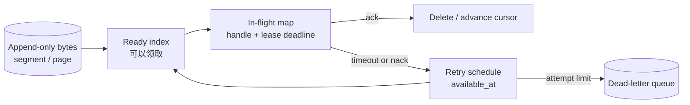

不同产品实现差异很大。Queue broker 可能为每条 delivery 维护状态；partitioned log 更倾向于保留不可变 record，让 consumer group 用 offset 表示进度。它们都“存消息”，但读写放大的来源不同。

### 2.4 三种产品里，consumer 实际拿到什么

| 系统 | Producer 提供 | Broker 增加或维护 | Consumer 确认方式 |
|---|---|---|---|
| RabbitMQ / AMQP 0-9-1 | properties、headers、opaque body bytes、routing key | queue 位置、delivery tag、redelivered flag、exchange 等投递信息 | 使用当前 channel 的 delivery tag ack / nack |
| Kafka | key bytes、value bytes、headers、timestamp，可选 partition | topic、partition、offset、record batch、复制状态 | consumer group 提交下一消费位置 |
| SQS 风格队列 | body、message attributes、可选 group / dedup ID | message ID、receive count、receipt handle、visibility deadline | 使用本次 receive 返回的 receipt handle 删除消息 |

[RabbitMQ 官方文档](https://www.rabbitmq.com/docs/publishers)把 AMQP 0-9-1 的 publisher properties 与 broker 在投递时生成的 delivery information 分开。Body 对 broker 是 opaque byte array。Kafka 的[磁盘 record 格式](https://kafka.apache.org/41/implementation/message-format/)则直接包含 key、value、headers、timestamp delta 和 offset delta，多条 record 组成 batch 后再压缩和校验。SQS 的 [`ReceiveMessage`](https://docs.aws.amazon.com/AWSSimpleQueueService/latest/APIReference/API_ReceiveMessage.html) 会返回 body、attributes、message ID 和 receipt handle，并用 visibility timeout 暂时隐藏已领取消息。

### 2.5 Body 里应该放什么

常见的三种 payload：

```json
// 1. 完整业务快照，consumer 少查一次数据库
{"order_id":"o_918","amount_cents":2599,"currency":"USD"}

// 2. 轻量引用，consumer 再读取 source of truth
{"order_id":"o_918","version":7}

// 3. 大对象引用，bytes 留在 object storage
{"object_key":"exports/r_42.parquet","sha256":"...","size_bytes":8451021}
```

选择取决于一致性和成本：

- 完整快照方便重放，但消息更大，也可能包含需要删除的敏感字段。
- 轻量引用体积小，但 consumer 处理时依赖数据库可用，而且读到的可能是更新后的状态。
- 大对象引用适合图片、视频和批量数据，必须带 checksum、size 和授权边界。

大文件不要直接塞进消息。先写 object storage，再发送对象引用、checksum 和 content type。否则 broker 的内存、复制流量和重试成本都会随 payload 放大。

### Event 和 Command 不要混写

```text
Command: SendInvoice
  表达“请执行某个动作”
  通常有明确负责者，也可能被拒绝

Event: InvoiceSent
  表达“某件事已经发生”
  可以没有订阅者，也可以被多个订阅者观察
```

把事件命名为 `ProcessOrder` 会让消费者不知道它是在接收事实，还是在承担命令。命令用动词，事件用已经发生的状态更清楚。

---

## 3 · 先分清语义、数据模型和产品

先给出最容易混淆的问题：

> **Kafka 既可以表现为 Queue，也可以表现为 Pub/Sub。**
>
> Kafka 是一个基于分区日志的数据系统；Queue 和 Pub/Sub 描述的是消息由谁处理，也就是消费语义。Kafka 的底层仍然是 partitioned log，不会因为用法不同就变成了另一种存储引擎。

这三个层次不要放在同一张选型表里比较：

| 层次 | 它回答的问题 | 例子 |
|---|---|---|
| 消费语义 | 一条消息应该由谁处理？ | Queue、Pub/Sub |
| 数据模型 | broker 怎样保存消息和消费进度？ | 可确认的队列、partitioned log |
| 实现系统 | 用什么产品承载上述语义？ | Kafka、RabbitMQ、SQS、EventBridge |

同一个系统可能提供多种语义；同一种语义也可以由完全不同的系统实现。比如任务队列既可以放在 RabbitMQ、SQS 或 Kafka 中，也可以先用数据库表实现。

### 3.1 Queue 语义：一份工作交给一个 worker

多个 worker 共享同一份待办任务，谁有能力谁领取；对这个 worker 集合来说，一条任务最终只需要成功执行一次。这也叫 **competing consumers**。

```text
                         +--> Worker A
Producer --> Task Queue -+--> Worker B     每条任务选其中一个
                         +--> Worker C
```

它适合图片处理、邮件发送、报表生成和模型离线推理。增加 worker 可以提升并行度，但仍要处理失败后的重新投递和业务幂等；“逻辑上只需执行一次”不代表底层一定只投递一次。

### 3.2 Pub/Sub 语义：每个逻辑订阅者都拿到一份

一个事件可以同时被多个相互独立的下游观察。订单付款后，库存、积分、通知和数据分析都应该收到，而不是四个系统争抢一份消息。

```text
                         +--> Inventory subscription
Publisher --> order.paid +--> Loyalty subscription
                         +--> Notification subscription
                         +--> Analytics subscription
```

这里的“一份”是按**逻辑订阅者**计算的。一个订阅者内部仍可运行许多实例来分摊自己的工作。因此，Pub/Sub 和 worker 扩容并不冲突：订阅之间是广播，订阅内部仍然可以竞争消费。

解耦依靠稳定的事件契约，而不是架构图里多画一个 broker：

- Producer 只发布稳定的 event schema。
- 每个订阅者独立保存消费进度和失败策略。
- 新增订阅者不要求修改 producer 的业务代码。

### 3.3 Kafka 为什么两种语义都能表达

Kafka 用 **consumer group** 组织消费者。判断语义时，关键不是看见了 `topic`，而是看消费者如何分组。

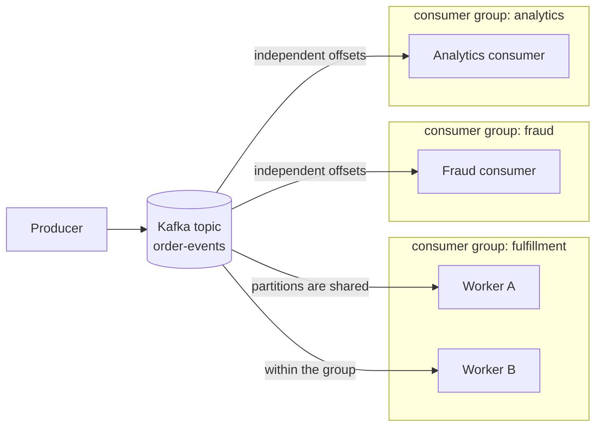

传统 Kafka consumer group 的规则是：

- **同一个 group 内是 Queue 语义。** Partition 在组内实例之间分配；一条 record 在该组中由其中一个实例处理。`Worker A` 和 `Worker B` 分摊 fulfillment 工作，不会各做一遍。
- **不同 group 之间是 Pub/Sub 语义。** 每个 group 有独立 offset。Fulfillment、fraud 和 analytics 都能读取同一条 record，互相不会抢走消息。

最短记法是：

```text
同组竞争：share the work          -> Queue-like
跨组独立：each group gets a copy  -> Pub/Sub-like
```

更准确地说，一条 Kafka record 是“**每个 consumer group 处理一遍，每个 group 内由一个成员处理**”。如果处理成功但 offset 尚未提交就发生故障，同一 group 仍可能再次读到它，所以 consumer 依旧需要幂等。

### 3.4 Kafka 能做任务队列，但不等于传统任务队列

把所有 task worker 放进同一个 consumer group，Kafka 就可以承载 Queue 语义。不过它的运行方式仍是日志消费：

- 消费完成通常只是提交 partition offset，record 不会因 ack 立即从日志删除，而是按 retention 保留。
- 传统 consumer group 的有效并行度受 partition 数量限制。
- 进度主要按 partition 推进，不像许多 queue broker 那样天然提供任意单条消息的 ack、visibility timeout 或优先级。
- Poison record、延迟重试和多级退避通常需要 retry topic、DLQ 与应用逻辑配合。

因此，高吞吐、同 key 有序、希望保留和重放的任务很适合 Kafka。任务耗时差异很大，或特别依赖单条 ack、延迟投递、优先级和精细重试时，RabbitMQ、SQS 一类 queue 往往更顺手。

### 3.5 RabbitMQ 也能同时表达两种语义

这件事并不是 Kafka 独有：

```text
Queue:
  Exchange -> one queue -> many competing consumers

Pub/Sub:
  Exchange -> subscription queue A -> consumer A
           -> subscription queue B -> consumer B
           -> subscription queue C -> consumer C
```

RabbitMQ 中，多个 consumer 读取同一个 queue，表现为 Queue；exchange 把同一消息路由到多个独立 queue，每个订阅 queue 都收到一份，表现为 Pub/Sub。再次说明：产品提供机制，拓扑决定语义。

### 3.6 Partitioned Log 和 Event Bus 又是什么

**Partitioned log 是数据模型。** 消息追加到有序 partition，消费者用 offset 表示进度；数据按 retention 保存，可以重放。Kafka 以这个模型为核心。

**Event Bus 是系统角色。** 它接收事件，根据订阅规则、内容过滤和权限把事件送到多个 target。它通常提供 Pub/Sub 语义，但 Pub/Sub 只是“谁收到事件”的抽象；Event Bus 往往还包含 schema、routing、transform、retry 和 delivery log。

所以可以按下面的顺序思考：

```text
先选消费语义：这是一份工作，还是一个可被多人观察的事实？
                 Queue                    Pub/Sub

再选数据模型：需要单条任务控制，还是需要保留、offset 和 replay？
                 Queue state              Partitioned log

最后选实现：DB table / RabbitMQ / SQS / Kafka / managed event bus
```

### Queue 与 Pub/Sub 的真正差别

| 问题 | Queue 语义 | Pub/Sub 语义 |
|---|---|---|
| 一条消息给谁 | 一个 worker 集合完成一次 | 每个逻辑订阅者各处理一次 |
| 如何横向扩容 | 同一集合增加 competing workers | 每个订阅者独立增加自己的 workers |
| 典型 payload | Command / Task | Event |
| 典型用途 | 后台执行、削峰、调度 | 业务事件广播、系统集成 |
| 能否重放 | 取决于底层实现 | 取决于底层实现 |

最后一行很重要：**重放能力不是 Queue 或 Pub/Sub 语义天然决定的，而是存储模型与产品 retention 决定的。**

---

## 4 · Queue 的解耦到底解了什么

“加队列可以解耦”太抽象。它至少拆开了四种依赖。

### 4.1 时间解耦

Producer 和 consumer 不需要同时在线。Consumer 停机时，消息先积压，恢复后继续处理。

### 4.2 速度解耦

短时间内 `lambda > mu` 时，队列吸收 burst。这里 `lambda` 是到达速率，`mu` 是处理速率。

队列不能创造容量。如果长期 `lambda >= mu`，积压只会不断增长。

```text
backlog growth per second = max(0, lambda - mu)

drain time = backlog / (mu - lambda)
前提是 mu > lambda
```

例如生产速度 1500 msg/s，消费能力 1000 msg/s，持续 10 分钟：

```text
backlog = (1500 - 1000) * 600 = 300,000 messages
```

流量恢复到 600 msg/s 后，额外净处理能力为 400 msg/s：

```text
drain time = 300,000 / 400 = 750 s = 12.5 min
```

这也是 autoscaling 不能只看 CPU 的原因。消费者 CPU 不高，但 oldest message age 持续上升，系统仍然已经落后。

### 4.3 故障解耦

下游失败不必占住上游线程。重试可以在后台发生，但必须有上限、退避和死信处理，否则故障会变成 retry storm。

### 4.4 发布者与订阅者解耦

事件总线根据规则发现订阅者。Producer 不维护下游地址列表，也不为每个下游编写一套重试代码。

### Queue 也会带来新的耦合

- 大家仍然耦合在 schema 和语义上。
- 同一个 partition key 会耦合吞吐与顺序。
- 共享 queue 会让租户通过 backlog 互相影响。
- retention、重试和 DLQ 策略会成为平台契约。

所以消息系统减少的是运行时依赖，不会自动消除数据契约。

---

## 5 · 什么时候需要持久化

是否持久化取决于消息丢失后能否安全、便宜地重新构造。“消息很重要”还不足以确定具体方案。

### 可以短暂放在内存中的情况

- 可丢的 telemetry，业务明确接受采样。
- 可以从 source of truth 重新扫描生成的派生任务。
- 极短生命周期的 coalescing signal，例如“用户 42 的缓存需要刷新”。

即使允许丢，也要写清丢失预算和恢复方式。

### 应该持久化的情况

- API 已经向用户确认接收。
- 任务触发计费、发货、账务或合规动作。
- 上游事件无法重新获取。
- 消费可能停机较久，需要保留 backlog。
- 需要审计、回放或用新逻辑重算历史数据。

### 持久化不是一个布尔值

需要继续问：

```text
写到单机 page cache 就确认，还是 fsync 后确认？
需要多少副本确认？
副本在同机架、同 AZ 还是跨区域？
broker 接住后保留多久？
超过 retention 仍未消费怎么办？
```

更强的 durability 会增加写延迟和存储成本。正确做法是先定义丢失预算，再决定确认点。

### Retention 和 TTL 不是一回事

```text
Queue TTL:
  消息过期后不再处理
  常用于过时任务、延迟队列和资源保护

Log retention:
  历史在一定时间或大小窗口内可重放
  消费成功不代表立即删除
```

账务事件不能因为消费者慢就静默 TTL。搜索索引刷新任务过期后可以丢弃，并由下一次全量同步修复。

---

## 6 · 投递语义、幂等与顺序

### 6.1 三种投递语义

| 语义 | 可能丢失 | 可能重复 | 常见实现 |
|---|---:|---:|---|
| At-most-once | 是 | 否 | 先确认位置，再处理 |
| At-least-once | 否，前提是系统正确配置 | 是 | 处理成功后才 ack |
| Exactly-once effect | 不应丢 | 业务结果不重复 | broker 语义 + 事务或幂等 sink |

“Exactly once” 必须说明边界。Kafka 内部事务、某个 stream processor 的状态更新和外部支付 API 并不天然处于同一个事务里。更稳妥的目标是：至少投递一次，加上幂等业务效果。

### 6.2 幂等不是简单的查重

扣款消费者可以使用业务唯一键：

```sql
BEGIN;

INSERT INTO processed_messages(consumer_name, event_id, processed_at)
VALUES ('billing', :event_id, now())
ON CONFLICT DO NOTHING;

-- 只有上面的 INSERT 真正插入时才执行业务写入
UPDATE invoices
SET status = 'PAID'
WHERE invoice_id = :invoice_id
  AND status = 'PENDING';

COMMIT;
```

幂等键需要绑定操作语义。只用 request body hash 容易把两次合法的相同金额付款误判为重复。

### 6.3 顺序通常只能局部保证

全局有序会把所有消息压到一个串行点。实际系统一般按业务 key 保证局部顺序：

```text
partition_key = order_id

order_1: Created -> Paid -> Shipped
order_2: Created -> Cancelled

两个订单可以并行，同一个订单进入同一 partition。
```

即使 broker 保证 partition 内顺序，consumer 内部并发、重试和外部 I/O 仍可能打乱完成顺序。需要按 key 串行、使用版本号，或者让状态机拒绝非法跃迁。

### 6.4 Poison message 和 DLQ

永久失败的消息不能无限重试：

```text
delivery
  -> transient failure: exponential backoff + jitter
  -> repeated failure: dead-letter queue
  -> inspect / repair / replay
```

DLQ 不是垃圾桶。每条死信要保留原始 event ID、失败阶段、最后错误、attempt count 和下一步负责人，并且要有告警和重放工具。

---

## 7 · Database Queue、Outbox 与 CDC

低到中等规模的系统不一定需要独立 broker。关系数据库已经提供事务、索引和持久化，可以先用 queue table。

### 7.1 用数据库实现 Work Queue

```sql
CREATE TABLE jobs (
  job_id           BIGSERIAL PRIMARY KEY,
  tenant_id        BIGINT NOT NULL,
  job_type         TEXT NOT NULL,
  payload          JSONB NOT NULL,
  status           TEXT NOT NULL DEFAULT 'READY',
  available_at     TIMESTAMPTZ NOT NULL DEFAULT now(),
  attempts         INT NOT NULL DEFAULT 0,
  lease_until      TIMESTAMPTZ,
  created_at       TIMESTAMPTZ NOT NULL DEFAULT now()
);

CREATE INDEX jobs_ready_idx
ON jobs (available_at, job_id)
WHERE status = 'READY';
```

多个 worker 可以用 `FOR UPDATE SKIP LOCKED` 抢不同记录。PostgreSQL 文档明确指出，它不适合一般一致性查询，但适合多个消费者访问 queue-like table 时避免锁竞争。

```sql
BEGIN;

SELECT job_id
FROM jobs
WHERE status = 'READY'
  AND available_at <= now()
ORDER BY available_at, job_id
FOR UPDATE SKIP LOCKED
LIMIT 100;

UPDATE jobs
SET status = 'RUNNING',
    lease_until = now() + interval '30 seconds',
    attempts = attempts + 1
WHERE job_id = ANY(:claimed_ids);

COMMIT;
```

租约到期后可以重新领取，consumer 因此必须幂等。

数据库队列适合：

- 日常吞吐还没有压垮主库。
- 团队希望减少基础设施种类。
- 任务和业务数据需要一个本地事务。
- 路由和重放要求简单。

需要迁移到独立消息系统的信号包括：queue polling 持续制造数据库 I/O、backlog 表快速膨胀、订阅者数量上升、需要长时间重放，或者消息流量开始影响在线事务。

### 7.2 Dual Write 为什么会出错

下面的代码存在无法消除的故障窗口：

```text
1. UPDATE orders SET status = 'PAID'
2. publish OrderPaid
```

- 第 1 步成功、第 2 步失败：数据库有新状态，下游永远收不到事件。
- 第 2 步成功、第 1 步回滚：下游收到一件实际上没发生的事。

简单重试不能判断到底是哪一步成功了。

### 7.3 Transactional Outbox

业务记录和 outbox event 写在同一个数据库事务中：

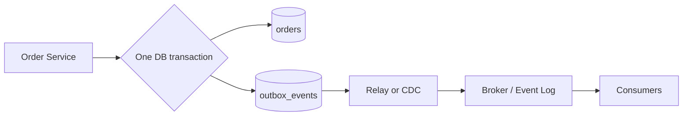

```sql
BEGIN;

UPDATE orders
SET status = 'PAID'
WHERE order_id = :order_id;

INSERT INTO outbox_events(event_id, aggregate_id, event_type, payload)
VALUES (:event_id, :order_id, 'order.paid', :payload);

COMMIT;
```

Relay 可以轮询 outbox，也可以由 CDC 读取数据库变更日志。Debezium 的 outbox event router 就是后者的现成实现。Relay 仍可能重复发布，所以消费者依然需要幂等。

### 7.4 Inbox Pattern

Consumer 在本地事务里先记录 event ID，再更新业务状态，解决“业务提交成功，但 ack 之前进程崩溃”导致的重复消费。

```text
Producer side: business row + outbox
Consumer side: inbox dedup + business row
```

Outbox 保证事实不会漏发，Inbox 控制重复效果。两者并没有制造跨服务的全局事务，而是把一致性边界放进各自的本地数据库。

---

## 8 · RabbitMQ：面向路由和任务交付的 Broker

### 8.1 历史位置

RabbitMQ 项目始于 2006 年，首个版本在 2007 年 2 月发布。它最初围绕 AMQP 构建。AMQP 又源于 JPMorgan 在 2003 年开始的企业消息协议工作。

这里容易出现版本混淆：

- RabbitMQ 长期最常见的 exchange、queue、binding 模型属于 AMQP 0-9-1。
- AMQP 1.0 在 2011 年形成，2012 年成为 OASIS 标准，协议模型与早期版本明显不同。
- RabbitMQ 4.0 开始把 AMQP 1.0 作为原生核心协议支持，但这不等于 AMQP 0-9-1 的模型被简单改名。

### 8.2 数据路径

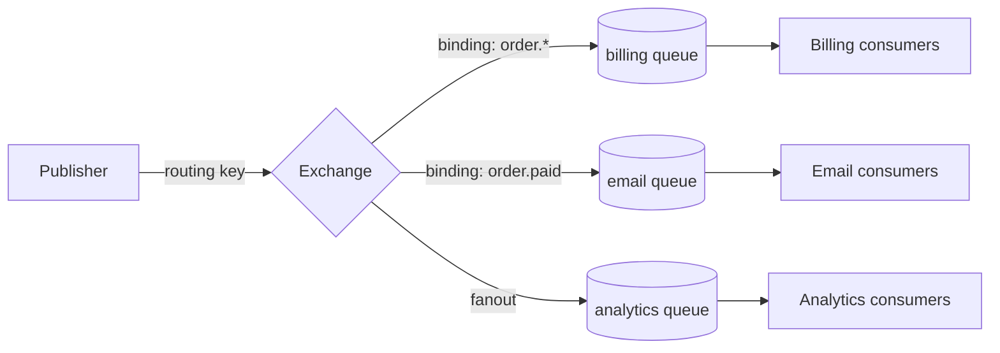

Producer 通常发给 exchange，而不是直接决定哪个 consumer 接收。Exchange 根据 binding 把消息路由到一个或多个 queue。

| Exchange | 路由方式 | 典型用途 |
|---|---|---|
| Direct | routing key 精确匹配 | 按任务类型分发 |
| Topic | `order.*` 这类模式匹配 | 业务事件订阅 |
| Fanout | 忽略 routing key，广播 | 多下游复制 |
| Headers | 根据 header 组合匹配 | 复杂但较少使用的规则 |

### 8.3 Reliability 的两个确认方向

```text
Publisher -> Broker: publisher confirm
Broker -> Consumer -> Broker: consumer acknowledgement
```

Publisher confirm 表示 broker 已经按配置接管消息。Consumer 应在业务结果写入后再 ack。连接断开时，未 ack 的消息可以重新投递，所以 handler 必须幂等。

`prefetch` 限制每个 consumer 同时持有多少条未 ack 消息。它是一个本地背压窗口：

- 太小会让网络往返限制吞吐。
- 太大会让慢 consumer 囤积消息，增加内存和重投成本。
- 任务耗时差异很大时，较小的 prefetch 通常更公平。

### 8.4 Classic Queue 和 Quorum Queue

需要复制和更强数据安全时，RabbitMQ 官方建议优先考虑 quorum queue。它使用 Raft 管理复制队列和 leader 选举。代价是每条消息需要更多磁盘和网络工作，部署时必须估算副本数、磁盘容量和节点故障后的重复制流量。

RabbitMQ 适合：

- 任务分发和 per-message acknowledgement。
- 灵活 routing 和多个独立 queue。
- 延迟重试、DLQ、优先级等 broker 工作流。
- 单条任务希望由空闲 worker 尽快领取。

需要警惕：

- queue 数量、binding 数量和连接数都会消耗 broker 资源。
- 大量长期 backlog 不是所有 queue 类型的最佳工作负载。
- 消费完成后消息通常离开主队列，历史回放不是它的核心抽象。

---

## 9 · Kafka：把消息系统建立在分区日志上

### 9.1 历史位置

Kafka 最初由 LinkedIn 为日志收集和数据管道开发。Kreps、Narkhede 和 Rao 在 NetDB 2011 论文中描述了它：目标是以低延迟收集和交付高吞吐日志，同时支持在线与离线消费者。

Kafka 把 broker 的核心抽象换成可保留、可定位、可重放的 append-only log。这比单纯提高队列吞吐更影响后来的数据架构。

### 9.2 Topic、Partition 和 Offset

```text
Topic: order-events

Partition 0: [offset 0][1][2][3]...
Partition 1: [offset 0][1][2]...
Partition 2: [offset 0][1][2][3][4]...
```

- Producer 根据 key 或 partitioner 选择 partition。
- Partition 内按追加顺序排列，topic 不提供跨 partition 的全局顺序。
- Consumer 保存每个 partition 的 offset。
- Retention 与是否已经消费分离，所以可以回退 offset 重放。

### 9.3 Consumer Group

同一个 consumer group 内，partition 被分给 consumer 实例协作处理。传统 consumer group 中，一个 partition 同时只由组内一个 consumer 负责，因此：

```text
最大有效并行 consumer 数 <= partition 数
```

不同 consumer group 各自保存 offset，可以独立读取同一个 topic。一个 fraud group 和一个 analytics group 不会抢走彼此的数据。

因此，同一个 group 内表现为 Queue 语义，不同 group 之间表现为 Pub/Sub 语义。这里说的是消费者的组织方式；Kafka 的底层数据模型始终是 partitioned log。详见第 3 节。

### 9.4 复制和故障恢复

Partition 有 leader 和 replicas。Producer 和 consumer 沿着 leader 的日志工作，副本复制该 partition。设计时要明确：

- replication factor
- producer `acks` 策略
- `min.insync.replicas`
- broker 或 AZ 故障时是否仍允许写入

这些参数共同决定“成功写入”到底需要哪些副本已经跟上。只说 Kafka 有三副本并不能推出不会丢数据。

### 9.5 Kafka 适合什么

- CDC 和跨系统数据管道。
- 多个 consumer group 独立读取同一历史。
- 需要 replay、backfill 和重新计算。
- 高吞吐、批量顺序 I/O 和流处理。
- 同一个 key 的事件需要局部有序。

需要警惕：

- partition 是并行度和顺序边界，改分区策略会影响 key 的映射。
- 一个 poison record 会卡住希望严格按 offset 前进的 consumer。
- 单条任务的独立 ack、任意优先级和复杂 routing 不是传统 consumer group 的强项。
- retention 越长，磁盘、复制与恢复成本越高。

---

## 10 · RabbitMQ、Kafka 与托管队列怎么选

不要从品牌开始选。先写消息的生命周期。

| 设计问题 | RabbitMQ | Kafka | 托管 Queue / Event Bus |
|---|---|---|---|
| 核心抽象 | exchange + queue | partitioned log | queue、topic 或 rule router |
| 消费进度 | 单条 ack / requeue | partition offset | 产品定义 |
| 历史重放 | 较弱 | 强 | 产品定义 |
| Routing | exchange binding 很灵活 | 通常按 topic、key 和 consumer group | rule/filter 常见 |
| 长 backlog | 需按 queue 类型评估 | 常见工作负载 | 受配额和费用模型影响 |
| 运维 | 自建集群需要维护 | 自建集群复杂度较高 | 云厂商管理基础设施 |
| 典型场景 | 后台任务、复杂路由 | CDC、event stream、数据平台 | 团队小、希望快速交付 |

一个实用判断顺序：

```text
需要长时间保留和任意重放吗？
  是 -> 先看 partitioned log

需要每条任务独立 ack、延迟重试和灵活路由吗？
  是 -> 先看 queue broker

规模还小，数据库已经足够，事务耦合最重要吗？
  是 -> 先看 DB queue / outbox

团队不想运维 broker，云依赖可以接受吗？
  是 -> 评估托管 queue / event bus
```

真实系统可以混用：Kafka 保存业务事件历史，RabbitMQ 承担需要精细重试的执行任务，数据库保存控制面配置。混用的前提是每种系统都有明确边界，否则只是增加故障面。

---

## 11 · 从论文看系统脉络

现代消息架构来自几条研究线汇合，不是由某个产品一次发明。

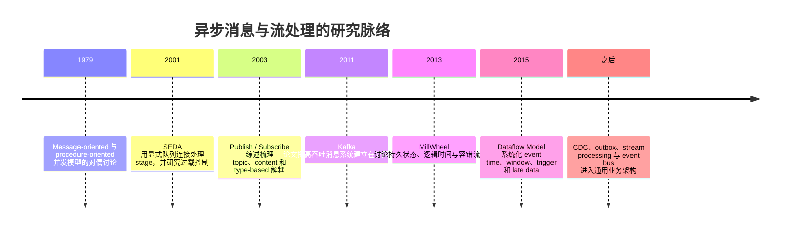

### 11.1 Message passing 与 Publish / Subscribe

Lauer 和 Needham 早期讨论 message-oriented 与 procedure-oriented 系统的对偶关系。后来的 publish/subscribe 研究进一步把通信双方从地址绑定中拆开：发布者描述事件，订阅者表达兴趣，中间层完成匹配。

2003 年的 [The Many Faces of Publish/Subscribe](https://doi.org/10.1145/857076.857078) 是很好的 taxonomy 入口。它解释了 topic-based、content-based 和 type-based 订阅，也指出空间、时间与同步解耦是 pub/sub 的核心。

### 11.2 SEDA：显式队列也是资源控制点

[SEDA, SOSP 2001](https://www.mdw.la/papers/seda-sosp01.pdf) 把服务拆成由显式队列连接的 stage。队列不只传递工作，还暴露每个 stage 的负载，使系统可以做 batching、限流、调整线程池和 load shedding。

这条思想今天仍然直接适用：只加 queue 而不监控 queue depth、oldest age、service time 和 rejection rate，就失去了显式 stage 最有价值的部分。

### 11.3 Kafka：日志成为共享数据骨干

[Kafka: a Distributed Messaging System for Log Processing, NetDB 2011](https://www.odbms.org/2011/01/kafka-a-distributed-messaging-system-for-log-processing/) 面向活动日志和离线数据加载，把顺序追加、分区、批量传输和消费位置组合成一个系统。

日志模型改变了数据恢复方式。Consumer 不再依赖 broker 为每个消息维护复杂状态，而是通过 offset 描述自己读到哪里。新消费者可以从旧位置启动，旧消费者也可以 backfill。

### 11.4 MillWheel 与 Dataflow：消息之后还有时间和状态

Broker 解决“数据如何到达”，stream processor 还要解决：迟到事件属于哪个窗口、状态怎么恢复、结果何时输出。

- [MillWheel, VLDB 2013](https://research.google/pubs/millwheel-fault-tolerant-stream-processing-at-internet-scale/) 讨论低延迟流处理中的持久状态、逻辑时间和容错。
- [The Dataflow Model, VLDB 2015](https://research.google/pubs/the-dataflow-model-a-practical-approach-to-balancing-correctness-latency-and-cost-in-massive-scale-unbounded-out-of-order-data-processing/) 把问题拆成 event time window、processing-time trigger 和结果更新方式。

这解释了为什么 Kafka 本身不是完整的流计算引擎。保存事件和计算带状态的窗口是两个不同层次的问题。

### 研究脉络留下的四个设计习惯

1. 队列长度是系统状态，不是内部实现细节。
2. 顺序必须绑定到 key 或 partition，不能笼统承诺全局有序。
3. 消息传输、状态更新和外部副作用要分别定义一致性边界。
4. event time 与 processing time 不同，迟到数据是正常输入，不只是异常。

---

## 12 · Event Bus 到底是什么

Event Bus 是一个 many-to-many router：接收多个来源的事件，根据规则把它们送到零个或多个 target。它通常还负责 schema、权限、过滤、变换和投递状态。

Event Bus 经常对外提供 Pub/Sub 语义，但两者不是同义词：Pub/Sub 只描述多个逻辑订阅者各自收到事件；Event Bus 是承载路由、治理和可靠投递的一整套系统。它的 target 可以是 queue、Kafka topic、函数或 webhook。

```text
Producer 关心：我发布了什么事实
Event Bus 关心：哪些规则匹配，应该生成哪些 delivery
Subscriber 关心：我如何处理和确认自己的 delivery
```

Event Bus 不一定是一个独立产品。它可以用数据库实现，也可以构建在 RabbitMQ、Kafka 或托管服务上。

### 12.1 控制面与数据面

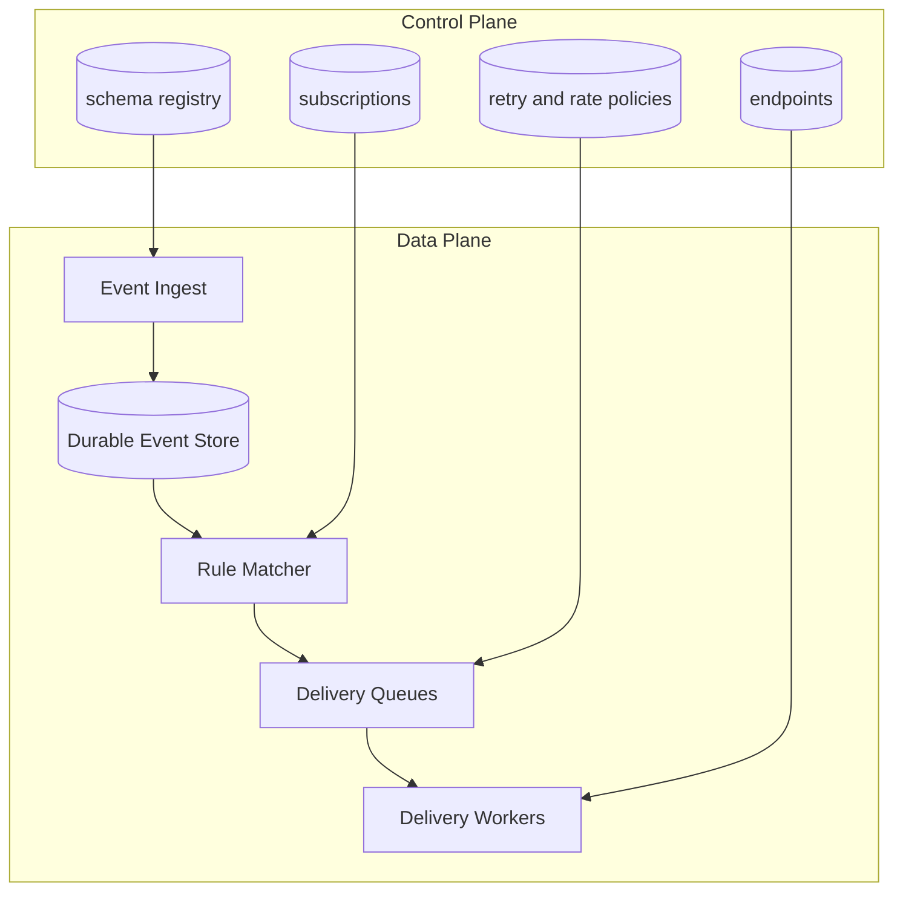

控制面保存配置，变化频率低但正确性要求高。数据面承载大量事件，追求吞吐、隔离和可恢复性。把二者混在同一个热路径中，容易让一次配置表慢查询拖住整个事件流。

### 12.2 数据库版 Event Bus

核心表可以是：

```text
events
  event_id, tenant_id, type, payload, occurred_at

subscriptions
  subscription_id, tenant_id, event_pattern, endpoint_id, enabled

deliveries
  delivery_id, event_id, subscription_id, status,
  attempt_count, next_attempt_at, lease_until

endpoints
  endpoint_id, tenant_id, url, signing_key_id,
  timeout_ms, rate_limit_policy_id
```

Router 扫描新 event，匹配 subscription，并为每个订阅生成 delivery row。Worker 再用 `SKIP LOCKED` 领取 delivery。

优点是事务和调试简单，所有状态可以用 SQL 检查。缺点是 fan-out 会产生大量写放大：

```text
delivery rows/s = event QPS * average matched subscriptions
```

1000 event/s，每个事件平均匹配 20 个订阅，就会产生 20K delivery inserts/s，还没有算 retry 和索引。

### 12.3 消息系统版 Event Bus

- RabbitMQ 可以用 topic exchange + 每个逻辑订阅的 durable queue。
- Kafka 可以让每类 subscriber 使用独立 consumer group，或者由 router 生成专用 delivery topic。
- 托管 event bus 可以用 rule pattern 直接映射 target。

Broker 承担数据面 backlog 后，数据库仍然适合保存 tenant、subscription、endpoint、secret reference 和 policy。这个 hybrid 结构通常比“所有配置也塞进 Kafka topic”更容易管理。

---

## 13 · Webhook 平台的完整实现

Webhook 是 event bus 的一种 HTTP target。它把内部事件可靠地推到客户提供的 URL。

### 13.1 发送链路

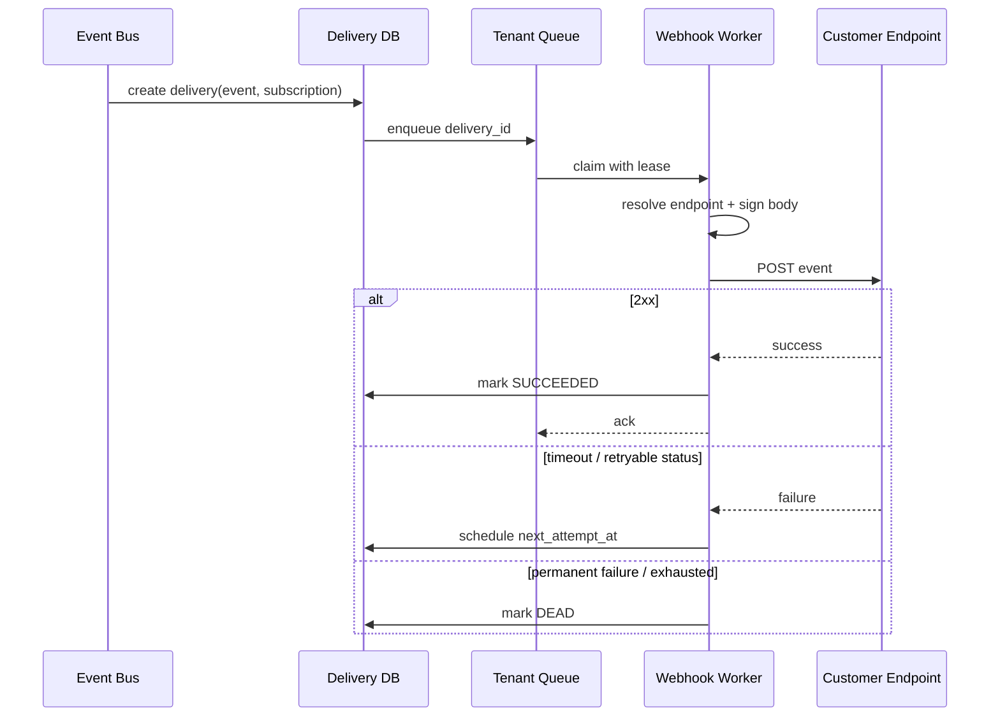

### 13.2 HTTP contract

```http
POST /customer/webhooks HTTP/1.1
Content-Type: application/json
X-Event-Id: evt_01J...
X-Event-Type: order.paid
X-Webhook-Timestamp: 1784142000
X-Webhook-Signature: v1=hex_hmac
X-Delivery-Attempt: 3
```

签名通常覆盖 timestamp 与原始 body：

```text
signed_payload = timestamp + "." + raw_request_body
signature = HMAC-SHA256(secret, signed_payload)
```

接收方需要：

1. 使用原始 bytes 验签，不要对 JSON parse 后再序列化。
2. 使用 constant-time compare 比较签名。
3. 拒绝超出时间窗口的 timestamp，降低 replay attack 风险。
4. 使用 `event_id` 或 delivery ID 去重。
5. 尽快返回 2xx，把真正业务处理放进自己的内部 queue。

GitHub 和 Stripe 的官方 webhook 文档都强调 secret 验证、重复事件处理和异步消费。它们的具体重试策略不同，所以自己的平台必须把“哪些状态码会重试”写成契约，不能假设行业里只有一种行为。

### 13.3 Retry policy

一个合理的重试调度：

```text
delay = min(max_delay, base * 2^attempt) + random_jitter
```

建议区分：

- `2xx`: 成功。
- `408`, `429`, 大多数 `5xx`, timeout: 可重试。
- 多数 `4xx`: 配置或请求错误，少量重试后停止。
- DNS、TLS、connection error: 可重试，但要受总预算限制。

不要让 worker 在进程里 sleep。把 `next_attempt_at` 持久化，再由 delay queue 或 scheduler 到时重新入队。这样部署和崩溃不会丢失计时状态。

### 13.4 Webhook 的 SSRF 风险

客户可以配置目标 URL，delivery worker 因此也是一个潜在的内网探测器。至少要做：

- 只允许 HTTPS，开发环境例外也要隔离。
- 解析 DNS 后拒绝 loopback、link-local、private network 和云 metadata 地址。
- 连接时再次校验实际 IP，防 DNS rebinding。
- 限制 redirect 次数，并重新检查每个 Location。
- 限制 response body、header size、连接与读取 timeout。
- egress proxy 或独立网络隔离 webhook worker。
- 日志中截断和脱敏 response body，避免客户回传 secret。

### 13.5 用户需要的运维界面

Webhook 平台至少要能按 tenant 查看：

```text
event_id / delivery_id
endpoint and event type
attempt count and next retry
HTTP status and latency
truncated response
signature key version
manual replay / disable endpoint
```

没有 delivery log 和 replay，客户只能告诉你“昨天漏了一条”，平台却无法证明事件有没有生成、有没有匹配、有没有发出。

---

## 14 · Multi-tenant Webhook 与双重映射

多租户平台必须防止故障扩散。一个大租户可能占满共享 worker、连接池和重试预算，使其他租户也延迟。

### 14.1 双重映射是什么

将“谁对事件感兴趣”和“如何把它送出去”拆成两次查找：

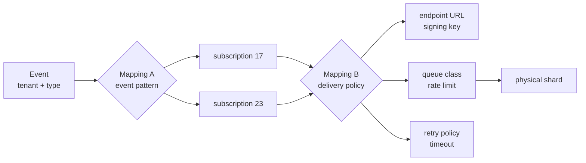

**Mapping A: event -> subscriptions**

```text
(tenant_id, event_type, event attributes)
  -> subscription_ids
```

它回答业务问题：哪些客户配置应该收到这条事件？

**Mapping B: subscription -> delivery configuration**

```text
(tenant_id, subscription_id)
  -> endpoint_id
  -> signing_key_id
  -> queue_class
  -> rate_limit
  -> retry_policy
  -> physical shard
```

它回答执行问题：应该发到哪里，使用什么安全和资源策略？

分成两层有三个实际好处：

- 改 URL 或轮换 secret 不需要修改 event rule。
- 多个 subscription 可以复用同一个 endpoint，但拥有不同 event filter。
- 物理分片和限流策略可以迁移，不影响 producer 的事件契约。

### 14.2 租户隔离策略

不必一开始为每个租户创建物理 queue。可以分层：

```text
Free / small tenants
  -> shared queue
  -> per-tenant token bucket
  -> fair scheduler

Large tenants
  -> dedicated logical partition or queue
  -> independent concurrency cap

Regulated enterprise
  -> dedicated worker pool / region / encryption key
```

每个租户至少需要：

- in-flight request 上限
- requests per second 和 burst budget
- retry budget
- backlog / storage quota
- endpoint circuit breaker

只做全局 rate limit 没有公平性。一个租户的 100 万条失败重试仍然可以把另一个租户的新消息排到很后面。

### 14.3 Fair scheduling

可以维护 active tenant queues，再用 round-robin 或 deficit weighted round-robin 领取：

```text
tenant A: weight 5, backlog 100K
tenant B: weight 1, backlog 20
tenant C: weight 1, backlog 50

调度器按权重给额度，但 B、C 仍持续获得服务。
```

最重要的监控不是只有 global queue depth，还包括 per-tenant oldest age、success rate、throttle count 和 retry amplification。

### 14.4 配置缓存和双重映射的一致性

Subscription 和 endpoint 配置适合缓存，但 secret rotation、endpoint disable 和权限撤销不能无限等待 TTL。

常见做法：

```text
Database = source of truth
Config cache = versioned read optimization
ConfigChanged event = 主动失效
Short TTL = 失效事件漏掉时的兜底
```

Delivery row 保存使用的 config version。这样一次重放可以选择沿用旧 payload 语义，或者显式升级到新 endpoint 配置。

---

## 15 · 可观测性与容量估算

### 15.1 四类核心指标

| 类别 | 指标 |
|---|---|
| Ingress | events/s、bytes/s、publish error、durable ack latency |
| Queue | depth、oldest message age、partition lag、redelivery rate |
| Consumer | service time、success rate、timeout、in-flight、throughput |
| Outcome | end-to-end latency、DLQ count、duplicate effect、per-tenant SLO |

Queue depth 单独看不够。10 万条积压如果每条 1ms，可能很快清空；100 条积压如果每条要 30 秒，可能已经严重超时。Oldest age 更接近用户实际等待时间。

### 15.2 基础估算

假设：

```text
event ingress = 8K events/s
average fan-out = 4 subscriptions/event
delivery rate = 32K deliveries/s
average payload = 2 KB
peak factor = 5
retention = 7 days
```

峰值 delivery rate：

```text
32K * 5 = 160K deliveries/s
```

只算 payload 的 7 天逻辑存储：

```text
8K * 2 KB * 86,400 * 7
  ~= 9.7 TB
```

还要加 envelope、索引、副本、压缩率和 delivery state。Webhook fan-out 后的 delivery metadata 可能比原始 event 数量大 4 倍。

如果一次 HTTP delivery 平均占用连接 250ms，峰值 160K/s 的理论平均 in-flight：

```text
concurrency ~= QPS * latency
            ~= 160K * 0.25
            ~= 40K connections
```

这会直接推动 connection pooling、异步网络 I/O、多地域 worker 和租户并发上限设计。

### 15.3 SLO 要沿链路拆开

```text
publish acceptance latency
event-to-queue latency
queue wait time
consumer processing time
external endpoint latency
end-to-end completion latency
```

只监控 worker HTTP latency 会漏掉排队时间。用户看到的延迟通常是 queue wait 加 service time。

---

## 16 · 面试中的追加需求怎么接

### 要求严格顺序

先追问顺序范围。通常按 `aggregate_id` 分区，在 consumer 侧按 key 串行，并给状态写入带 version。不要承诺整个系统全局有序。

### 要求支持 replay

原始 event 必须独立保留，handler 版本要可追踪。Replay 写入单独的 consumer group 或 replay queue，设置限速，避免回放流量压住实时流量。

### 要求客户筛选 payload

把 filter 放进 Mapping A，并限制表达式复杂度、字段白名单和执行时间。规则编译后缓存，配置更新通过 version 失效。

### 要求 webhook payload 可变换

保存 canonical event，delivery 时运行 versioned transformer。不要只保存变换后的 body，否则修复模板后无法从原始事实重放。

### 要求跨区域容灾

先定义 region ownership。Active-passive 更容易避免重复投递；active-active 需要全局 event ID、租户 home region、复制延迟处理和跨区 dedup。Webhook 本身仍可能重复，客户契约必须维持幂等。

### 要求暂停某个 endpoint

停止新 delivery 的执行，但保留 backlog，并记录 pause timestamp。恢复时要支持 drain rate limit，否则积压瞬间打爆客户 endpoint。

### 要求删除租户数据

控制面删除 subscription、endpoint 和 secret，数据面需要按 tenant 定位 event、delivery log、DLQ 和对象引用。加密隔离场景可以删除 tenant data key 来完成 crypto-shredding，但审计记录的保留范围要先由合规要求定义。

---

## 17 · 最短设计模板

```text
1. 定义业务边界
   哪些动作同步确认，哪些副作用异步？

2. 定义接管点
   什么时候可以返回成功？消息是否已经持久化并复制？

3. 先选语义，再选实现
   一份工作用 Queue，还是一个事实用 Pub/Sub？
   再选择 DB queue、broker queue、partitioned log 或 managed event bus。

4. 定义正确性
   投递语义、幂等键、顺序范围、outbox / inbox。

5. 定义失败路径
   timeout、retry、backoff、DLQ、人工 replay。

6. 做容量估算
   ingress、fan-out、payload、retention、backlog、drain time、concurrency。

7. 做隔离
   partition key、per-tenant quota、fair scheduling、circuit breaker。

8. 做观测
   durable ack、oldest age、consumer lag、end-to-end latency、DLQ。
```

复习时抓住四个检查点：

```text
消息有没有被可靠接住？
重复到达会不会产生重复业务结果？
消费速度跟不上时，系统会怎样退化？
某个租户或下游失败时，会不会拖住其他人？
```

---

## 18 · 一手资料

- [RabbitMQ: Consumer Acknowledgements and Publisher Confirms](https://www.rabbitmq.com/docs/confirms)
- [RabbitMQ: Quorum Queues](https://www.rabbitmq.com/docs/quorum-queues)
- [RabbitMQ: Native AMQP 1.0 and AMQP history](https://www.rabbitmq.com/blog/2024/08/05/native-amqp)
- [OASIS AMQP 1.0 Standard](https://www.oasis-open.org/standard/amqp/)
- [Apache Kafka Documentation](https://kafka.apache.org/documentation/)
- [Kafka: a Distributed Messaging System for Log Processing, NetDB 2011](https://www.odbms.org/2011/01/kafka-a-distributed-messaging-system-for-log-processing/)
- [SEDA: An Architecture for Well-Conditioned, Scalable Internet Services, SOSP 2001](https://www.mdw.la/papers/seda-sosp01.pdf)
- [The Many Faces of Publish/Subscribe, ACM Computing Surveys 2003](https://doi.org/10.1145/857076.857078)
- [MillWheel: Fault-Tolerant Stream Processing at Internet Scale, VLDB 2013](https://research.google/pubs/millwheel-fault-tolerant-stream-processing-at-internet-scale/)
- [The Dataflow Model, VLDB 2015](https://research.google/pubs/the-dataflow-model-a-practical-approach-to-balancing-correctness-latency-and-cost-in-massive-scale-unbounded-out-of-order-data-processing/)
- [Debezium Outbox Event Router](https://debezium.io/documentation/reference/stable/transformations/outbox-event-router.html)
- [PostgreSQL SELECT: SKIP LOCKED](https://www.postgresql.org/docs/current/sql-select.html)
- [Amazon EventBridge: Event buses](https://docs.aws.amazon.com/eventbridge/latest/userguide/eb-event-bus.html)
- [GitHub webhook best practices](https://docs.github.com/en/webhooks/using-webhooks/best-practices-for-using-webhooks)
- [Stripe webhook best practices](https://docs.stripe.com/webhooks)
