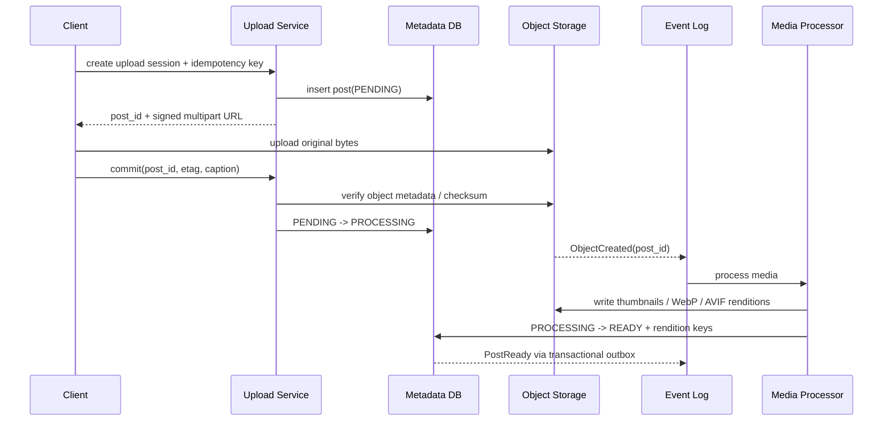
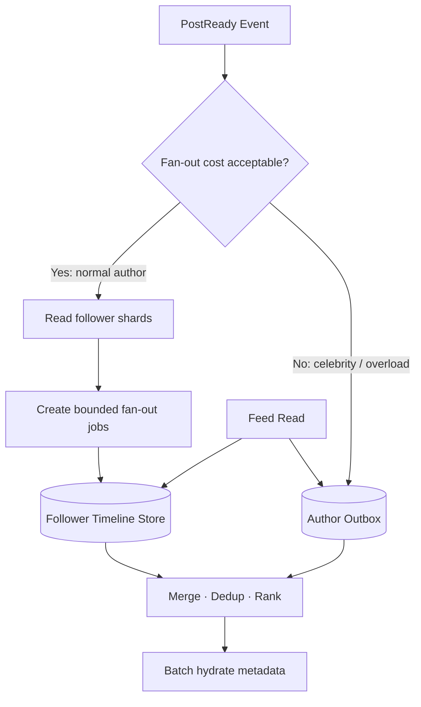

# System Design 07 · Designing Image Sharing and Home Feed

Course Location: [[SystemDesign06 Async Messaging Systems|06 Async Messaging Systems]] → This Article → [[SystemDesign08 LLM Async RL Platform|08 Async LLM RL Platform]]

This is an independent case study on "Designing an Instagram-like image sharing system." The traffic, capacity, and SLO figures in this document are hypothetical values used for interview derivation and do not represent internal data from any real-world system.

The true depth of this problem lies not in "which database to use," but in two completely distinct primary paths:

```text
Media path: How to reliably upload, process, and distribute large files.
Feed path: How to generate low-latency, sufficiently fresh timelines across a follow graph.
```

---

## 1 · Problem navigation

### Functional requirements

This round focuses on implementing only four core capabilities:

1. Users can upload an image and create a post with a caption.
2. Users can follow / unfollow other users.
3. Users can read their home feed with pagination.
4. Users can open a post and load images of appropriate sizes from a CDN.

Out of scope for now:

```text
Short videos / Reels
Stories
Direct messages
Search and discovery pages
Ads
Complex image editing
Live streaming
```

Features like Likes, comments, and notifications are treated as follow-up requirements from the interviewer at the end.

### Non-functional requirements

First, translate vague adjectives into design goals:

| Goal | Assumption for this problem |
|---|---|
| Feed latency | API metadata p99 < 200 ms; images loaded independently via CDN |
| Feed availability | 99.99% |
| Upload availability | 99.9%; failures can be safely retried |
| Media processing | 95% of images reach READY status within 10 seconds |
| Feed freshness | Posts from regular accounts visible within 5 seconds; celebrities allowed to merge on next refresh |
| Durability | Once an original image is confirmed READY, it must not be lost due to single-node or single-AZ failure |
| Consistency | Post owners require read-your-writes; home feed allows eventual consistency |
| Privacy | Unauthorized users cannot bypass permissions via old feed entries or CDN URLs |
| Growth | Design must support 10x current traffic via horizontal scaling |

### Key trade-offs

```text
Image upload success != post is ready to display
Feed low latency is usually more important than absolute real-time
Image bytes should not pass through standard API servers
Home feed allows brief inconsistencies, but permission checks cannot be eventually consistent to the point of data leakage
```

---

## 2 · BOE: Re-estimating orders of magnitude

The following numbers are interview assumptions; write down assumptions before calculating:

| Parameter | Assumed Value |
|---|---:|
| DAU | 50M |
| Feed opens per user/day | 40 |
| Images loaded per open | 8 |
| Average feed rendition size | 150 KB |
| Images posted per user/day | 0.08 |
| Original image size | 3 MB |
| Total rendition size per image | Additional 1.5 MB |
| Average followers | 200 |
| Peak factor | 6 |

### Feed read QPS

```text
feed sessions/day = 50M × 40 = 2B
average feed QPS  = 2B / 86,400 ≈ 23K
peak feed QPS     = 23K × 6 ≈ 140K
```

The Feed API returns metadata such as post IDs, captions, authors, and media URLs; do not stuff image binaries into JSON.

### Upload QPS

```text
uploads/day       = 50M × 0.08 = 4M
average upload QPS = 4M / 86,400 ≈ 46
peak upload QPS    = 46 × 6 ≈ 280
```

Upload request QPS is not high, but each object is large, so the bottleneck is bandwidth, object storage, and media processing, not API QPS.

### Media storage

Each image saves a 3 MB original and a total of ~1.5 MB in various renditions:

```text
logical growth/day = 4M × 4.5 MB
                   ≈ 18 TB/day

logical growth/year ≈ 6.6 PB/year
```

This is the logical object size. Actual physical redundancy is implemented by object storage and should not be multiplied by a replication factor without explanation; however, cross-region replication, versioning, deletion latency, and lifecycle policies must be factored into costs.

### CDN egress

```text
media/day = 2B feed sessions × 8 images × 150 KB
          ≈ 2.4 PB/day

average egress ≈ 28 GB/s ≈ 224 Gb/s
peak egress    ≈ 168 GB/s ≈ 1.34 Tb/s
```

This proves that the CDN is not just for show. If the CDN hit rate is 95%, the origin still bears:

```text
2.4 PB/day × 5% = 120 TB/day
```

Therefore, rendition keys, cache-control, immutable URLs, and hot-spot pre-warming all impact real costs.

### Push fan-out writes

If all posts are pushed to every follower:

```text
timeline inserts/day = 4M posts × 200 followers
                     = 800M/day

average inserts/s ≈ 9.3K
burst at 10×      ≈ 93K/s
```

The average seems manageable, but follower distribution is heavy-tailed. An account with 10M followers posting once would suddenly generate 10M timeline writes; this is exactly why you cannot look only at the average follower count.

### Timeline storage

Timeline entries only save lightweight references, e.g.:

```text
viewer_id + post_id + author_id + created_at + score/version
```

Assuming 48 B after encoding, 3 replicas, and considering 1.5x overhead for indexing and storage engine:

```text
physical bytes/entry ≈ 48 × 3 × 1.5 = 216 B
growth/day           ≈ 800M × 216 B ≈ 173 GB/day
30-day hot window    ≈ 5.2 TB
```

The timeline store should set a per-user entry limit or TTL; it is a reconstructible materialized view, not a permanent source of truth.

### Post metadata

Assuming an average post / media metadata size of 2 KB:

```text
raw metadata/day = 4M × 2 KB = 8 GB/day
```

Adding 3 replicas and ~2x overhead for indexing, MVCC, and storage engine:

```text
physical metadata/day ≈ 8 GB × 3 × 2 = 48 GB/day
physical metadata/year ≈ 17.5 TB/year
```

### Conclusions on orders of magnitude

```text
Feed: Read-heavy, peak ≈ 140K QPS
Upload API: Low QPS, but media writes ≈ 18 TB/day
Delivery: CDN peak ≈ 1.34 Tb/s
Fan-out: Average is manageable, celebrity bursts cannot be pushed directly
Timeline: Can be pre-calculated, but must have TTL / cap
```

These conclusions are sufficient to drive the subsequent CDN, direct upload, async pipeline, and hybrid fan-out designs.

---

## 3 · API and data entity

### API sketch

```http
POST /v1/upload-sessions
Idempotency-Key: ...

-> {
     "post_id": "p_123",
     "upload_url": "short-lived signed URL",
     "expires_at": "..."
   }
```

The client then uses the signed URL to perform a multipart upload directly to object storage.

```http
POST /v1/posts/{post_id}/commit
{
  "caption": "...",
  "upload_etag": "..."
}
```

```http
PUT    /v1/users/{target_id}/follow
DELETE /v1/users/{target_id}/follow
GET    /v1/feed?cursor=...&limit=20
GET    /v1/posts/{post_id}
DELETE /v1/posts/{post_id}
```

Feed uses an opaque cursor, not page numbers / offsets:

```text
cursor = encoded(last_score, last_created_at, last_post_id, timeline_version)
```

When multiple records have the same score or time, `post_id` provides a stable tie-breaker to avoid duplicates or omissions.

### Core entities

#### Post

```text
post_id          primary key, time-sortable ID
author_id
caption
status           PENDING | PROCESSING | READY | FAILED | DELETED
visibility       PUBLIC | FOLLOWERS | PRIVATE
created_at
ready_at
version
```

#### MediaAsset

```text
post_id
original_key
renditions       [{size, format, object_key, width, height}]
checksum
content_type
processing_status
```

The database saves the object key, not the image bytes.

#### FollowEdge

```text
follower_id
followee_id
created_at
state

primary access patterns:
1. list followees by follower_id
2. list followers by followee_id, sharded and paginated
```

#### TimelineEntry

```text
viewer_id        partition key
sort_key         score / created_at / post_id
post_id
author_id
source           PUSH | PULL
```

TimelineEntry is derived data. If lost, it can be reconstructed from the author outbox and post events.

---

## 4 · High-level architecture

The overall design can be broken down into four paths: upload, async processing, fan-out, and feed read:

```photo-sharing-architecture-visual
```

Compared to the common "client → upload service → object storage" direct upload API scheme, this approach lets image bytes go directly from the client to object storage, while standard API servers only handle authorization, metadata, and state transitions.

---

## 5 · Deep dive into upload and media processing

### Why not let images pass through the API server?

With 280 peak uploads/s and 3 MB per original image:

```text
API ingress ≈ 280 × 3 MB = 840 MB/s ≈ 6.7 Gb/s
```

This would turn stateless API instances into expensive data-moving layers and increase risks related to timeouts, memory, and retries. Signed URLs separate the control plane from the data plane:

```text
Control plane: Authentication, quotas, creating post_id, issuing short-lived URLs
Data plane: Client uploads bytes directly to object storage
```

### Upload sequence



### What problems does the state machine solve?

```text
PENDING: Signed URL obtained, but object integrity not yet confirmed
PROCESSING: Upload complete, currently validating and generating renditions
READY: All required display assets are available, can enter feed
FAILED: Retryable or notify client to re-upload
DELETED: Read path must hide immediately, physical deletion performed asynchronously in the background
```

Do not publish a feed event until displayable renditions are generated; otherwise, users will see broken images.

### Idempotency and duplicate events

Object events, queues, and workers are typically at-least-once:

```text
Upload API idempotency key -> Retries do not create duplicate posts
Processor job key = (post_id, media_version, rendition_type)
Object key deterministic -> Reruns overwrite the same version or use compare-and-swap
PostReady outbox -> Metadata READY and events do not succeed partially or get lost
```

We do not need to claim end-to-end exactly-once; making side effects idempotent is generally more reliable.

### Security and content processing

The media pipeline should also be responsible for:

- Validating MIME types against actual file formats; do not trust extensions
- Limiting pixel count, file size, and decompression ratios
- Stripping unnecessary EXIF / GPS metadata
- Malware scanning and content moderation hooks
- Generating unguessable, versioned object keys
- Using short-lived signed CDN URLs for private content

---

## 6 · Three feed generation modes

The feed problem is essentially about allocating work between two moments:

```text
How much work to do when a post is created?
How much work to do when a viewer opens the feed?
```

### Scheme A: Pull / fan-out on read

Write only to the author outbox upon posting:

```text
Author creates post
  -> Post DB
  -> Author Outbox[author_id]
```

When reading the feed:

```text
1. Query followees the viewer follows
2. Read recent post IDs from each followee
3. k-way merge
4. Rank / filter / deduplicate
5. Batch hydrate metadata
```

If following $F$ authors, each with $k$ candidate posts, the candidate scale is approximately:

$$
O(F\times k).
$$

The computational cost of merging sorted lists using a heap is approximately:

$$
O(F\times k\times\log F).
$$

#### Pros

- Post writes are essentially $O(1)$; celebrity posts do not create massive writes
- No need to replicate timeline entries for every follower
- Follow / unfollow semantics are natural; read path uses current follow relationships

#### Cons

- Read amplification: One feed read might query hundreds of author outboxes
- Latency easily dragged down by the slowest shard
- Redundant merging when many concurrent users refresh
- Celebrity outboxes become read hot keys

Pull is suitable for write-heavy systems with low read frequency or small follow sets; it is not suitable as the sole solution for 140K peak feed QPS.

### Scheme B: Push / fan-out on write

Read the follower list upon posting and write lightweight entries to every follower's home timeline:

```text
PostReady
  -> follower shards
  -> fan-out tasks
  -> Timeline[viewer_1]
  -> Timeline[viewer_2]
  -> ...
```

#### Pros

- Feed read is a single sequential read; p99 is easier to control
- Timeline can be cached directly
- Sorting, filtering, and partial ranking can be pre-calculated

#### Cons

- Write amplification is proportional to the number of followers
- Celebrity posts create massive fan-out jobs and queue backlogs
- Massive replication of timeline entries requires TTL / cap
- Unfollow, delete, and privacy changes require cleaning up old materialized views
- Pushing to cold users who never open their feed is wasteful

### Scheme C: Hybrid fan-out

This design chooses hybrid:

```text
Regular authors: Push to active followers' home timelines
Celebrity authors: Write only to author outbox; pull and merge when reading feed
Long-term inactive viewers: Skip or delay push; backfill upon login
```



### Thresholds should not just be "over 1M followers"

Static follower count is a starting point, but a more reasonable judgment is cost comparison:

$$
push\ cost\approx active\ followers\times timeline\ write\ cost,
$$

$$
pull\ cost\approx expected\ feed\ reads\times merge\ cost.
$$

Classifiers can also consider:

```text
active follower ratio
author post frequency
current queue lag
timeline store write capacity
viewer read frequency
freshness target
whether a hot event is occurring
```

When the system is overloaded, more authors can be temporarily switched to the pull path. This is a controlled degradation that prevents the fan-out queue from overwhelming all writes.

---

## 7 · Complete read/write path for hybrid feed

### Write path

1. Media Processor marks post as READY.
2. Transactional outbox publishes `PostReady(post_id, author_id, version)`.
3. Fan-out classifier determines push, pull, or delayed push.
4. Regular authors: Generate bounded tasks based on follower shards.
5. Workers write timeline entries only for active followers.
6. Celebrities: Append only to author outbox; do not write to every follower's timeline.
7. All writes use `(viewer_id, post_id)` as an idempotency key.

### Read path

1. Feed Service reads the viewer's precomputed timeline IDs.
2. Identify celebrity followees requiring pull from Social Graph cache.
3. Batch read new post IDs from these author outboxes.
4. Merge, deduplicate, privacy filter, block filter, and rank.
5. Batch hydrate post metadata to avoid N+1 queries.
6. Generate or retrieve versioned CDN URLs.
7. Return opaque cursor and next page.

### Why hydration must be batched

Assuming a page size of 20 and peak feed QPS of 140K:

```text
If querying metadata one by one: 140K × 20 = 2.8M point reads/s
If querying in batches by shard: Each feed request generates only a few batch RPCs
```

Storing only IDs in the timeline keeps entries small and easy to reconstruct; metadata cache and batch APIs prevent read amplification.

### Ranking fallback

Ranking / merging timeouts should not make the entire feed unavailable:

```text
Normal: precomputed candidates + pull candidates -> rank
Ranking timeout: Degrade to reverse chronological merge
Timeline unavailable: Temporarily pull a small group of recently active followees
Metadata miss: Skip individual corrupted items; do not block the entire page
```

This ensures 99.99% feed availability without relying on every auxiliary component working perfectly.

---

## 8 · Data store selection

Do not start with SQL or NoSQL; derive from access patterns.

| Data | Primary access pattern | Suitable logical model |
|---|---|---|
| Post metadata | by post_id, by author + time, status transactions | sharded relational / distributed SQL or wide-column |
| Follow graph | followers / followees adjacency list | partitioned KV / wide-column graph adjacency |
| Author outbox | by author_id, reverse chronological | sorted KV / wide-column |
| Home timeline | by viewer_id, reverse score/time | sorted KV / wide-column + cache |
| Media bytes | immutable large object by key | object storage + CDN |
| Events | ordered per key, replay, consumer groups | partitioned event log |

For queue persistence boundaries, ack, retention, and transactional outbox, see: [[SystemDesign06 Async Messaging Systems|06 Async Messaging Systems]].

### Partition keys

```text
Post metadata: hash(post_id)
Author outbox: author_id + time bucket
Follower list: followee_id + follower_shard
Followee list: follower_id + followee_shard
Timeline: viewer_id + time bucket
Event log: author_id or post_id, depending on required local ordering
```

Celebrity follower lists cannot all fall into one partition. `followee_id` needs a shard suffix; the fan-out coordinator reads shards in parallel but must limit concurrency to avoid saturating the graph store with a single post.

---

## 9 · Consistency and failure handling

### Source of truth vs. derived data

```text
Post DB + Object Storage: Source of truth
Follow Graph Store: Source of truth for follow relationships
Author Outbox: Reconstructible from PostReady event
Home Timeline: Reconstructible materialized view
Cache / CDN: Ephemeral derived layers
```

### Follow / unfollow

#### New follow

- Synchronously write FollowEdge.
- Asynchronously backfill the last N posts to the timeline.
- Before backfill completes, the read path can pull the new followee's author outbox.

#### Unfollow

- Synchronously update FollowEdge; new feed reads immediately validate during the hydration / filter stage.
- Asynchronously purge the author's old entries from the timeline.
- Cannot rely solely on asynchronous purge, or old entries will continue to leak content.

### Delete post

1. Post source of truth writes `DELETED` tombstone.
2. All reads / hydration filter this version immediately.
3. Publish `PostDeleted` event.
4. Asynchronously delete timeline entries, author outbox, cache, and search documents.
5. Purge CDN and delete all object renditions according to retention policy.
6. Monitor deletion SLA; retain audit logs but not the deleted content.

### Retry storm

Every synchronous dependency requires:

```text
timeout
bounded exponential backoff
jitter
retry budget
circuit breaker
idempotency
```

Infinite retries amplify a single failure into more traffic during outages.

### Queue backlog

Monitoring:

```text
consumer lag
oldest event age
processing error rate
DLQ size
fan-out completion p95 / p99
READY-to-visible freshness
```

When backlog increases:

- Prioritize active viewers
- Force celebrity switch to pull
- Lower priority for consumers like notifications
- Retain PostReady source events; replay after recovery

---

## 10 · Latency budget and capacity

### Feed p99 planning budget

```text
Gateway + auth                 15 ms
Timeline cache / store         35 ms
Celebrity outbox batch         35 ms
Merge + filter + rank          45 ms
Metadata batch hydrate         40 ms
Serialization + network        15 ms
Margin                         15 ms
------------------------------------
Target                        200 ms
```

These are planning budgets, not strictly additive p99 probabilities. Tracing is required to measure the critical path, with special attention to tail amplification in fan-out RPCs.

### Feed service instances

If load testing shows an instance can safely handle 1,000 QPS at the target p99, reserve 30% headroom:

```text
instances = ceil(140K × 1.3 / 1K)
          ≈ 182
```

Also ensure that if an AZ is lost, the remaining AZs do not exceed safe throughput.

### Media workers

Assuming each rendition job occupies 2 seconds of worker time, and each upload generates 4 jobs:

```text
peak jobs/s = 280 uploads/s × 4 = 1,120 jobs/s

worker concurrency at 70% utilization
= 1,120 × 2 / 0.7
≈ 3,200 concurrent worker slots
```

Real media pipelines are often limited by a combination of CPU, GPU, memory, and object-store bandwidth; you must benchmark by rendition type rather than treating all workers as identical machines.

---

## 11 · How to scale when the interviewer adds new features

Do not immediately draw boxes on the diagram. Every follow-up follows the same process:

```text
1. What is the new functional requirement?
2. What are the new NFR / consistency / privacy requirements?
3. Is it a new source of truth or a derived view?
4. How do the write path, read path, and events change?
5. How much do QPS, storage, fan-out, and hot keys increase?
6. How are failures, retries, backfills, and migrations handled?
```

### Follow-up A: Likes and comments

New components:

```text
Engagement Service
Like Store keyed by (post_id, user_id)
Comment Store partitioned by post_id + time bucket
Counter aggregation pipeline
```

Like writes must be idempotent; a unique key prevents duplicate likes. `like_count` is a derived counter; no need to scan all likes synchronously. Aggregate via events and update asynchronously, allowing brief inconsistencies.

Celebrity posts are counter hot keys; aggregate local counts by shard first, then merge periodically. Comments use cursor pagination and use tombstones for deleted or moderated comments.

### Follow-up B: Private accounts, blocking, and close friends

Changes:

- FollowEdge adds `PENDING / ACCEPTED / BLOCKED` states.
- Feed generation can pre-filter, but authorization must be re-verified during read / hydration.
- CDN URLs must be short-lived signed URLs; cannot use permanent public URLs.
- Privacy changes publish events; asynchronously clean up timelines and caches.
- Blocking is a security boundary; cannot rely solely on eventually consistent fan-out purges.

### Follow-up C: Stories / 24-hour content

Do not force into the permanent home timeline:

- Independent Story metadata and Story Tray.
- Object lifecycle automatically expires media.
- `expires_at` is a source-of-truth field; read path enforces checks.
- Tray can fan-out active author IDs rather than replicating all story items.
- Deletion and expiration events handle cache / CDN purges.

### Follow-up D: Video

Upload sessions remain reusable, but the media pipeline changes to:

```text
multipart upload
-> probe / validate
-> transcode ladder
-> segments + manifest
-> READY
-> CDN
```

Capacity estimation must switch to video duration, bitrate, transcoding multipliers, and playback minutes. Video processing is a long-running task requiring checkpoints, priority queues, and per-profile idempotency; playback uses adaptive bitrate rather than downloading a massive file.

### Follow-up E: Ranked feed

Insert a Ranking Service after hybrid candidate generation:

```text
Candidate generation
-> feature fetch
-> lightweight pre-rank
-> full rank
-> policy / diversity filter
```

Need separate latency budgets for feature fetching and inference, while retaining chronological fallback. Model versions, feature timestamps, and exposure logs must be traceable; otherwise, debugging or offline evaluation is impossible.

### Follow-up F: Hashtag / caption search

- PostReady events write to an inverted index via CDC / event log.
- Search index is a derived view, allowing eventual consistency.
- Delete / privacy events must propagate to the index with high priority.
- Popular hashtag results can be cached, but require rank versions and freshness windows.

### Follow-up G: Notifications

Reuse PostReady / Like / Comment events:

```text
Event Log
-> Notification Composer
-> preference / block filter
-> dedup + aggregation
-> Push Provider
```

Notifications must not block the primary write path for posts or likes. Push providers use bounded retries on failure; deduplicate multiple deliveries of the same event using notification IDs.

### Follow-up H: Multi-region

Ask if active-active is truly necessary:

- Media bytes distributed via CDN and cross-region object replication.
- User writes can be pinned to a home region to reduce cross-region conflicts.
- Follow graph and post metadata replicated according to consistency requirements.
- Feed materialized views can be reconstructed in each region; no need for global strong consistency.
- Region failover must define RPO, RTO, DNS / traffic shift, and duplicate event handling.

---

## Final Memory Aid

```text
Upload:
  create session -> signed direct upload -> async process -> READY event

Feed Write:
  normal author push active followers
  celebrity keep author outbox

Feed Read:
  precomputed timeline + celebrity pull
  -> merge / dedup / rank
  -> batch hydrate metadata
  -> CDN URLs

Consistency:
  Post / Follow are source of truth
  Timeline / Cache / Index are derived views

Follow-up features:
  requirement -> data -> write path -> read path -> estimate -> failure
```

One-sentence summary:

> The media path uses direct upload and async state machines to solve the "large object" problem; the feed path uses hybrid fan-out to resolve the contradiction where "read latency and celebrity write amplification cannot both be optimal."
