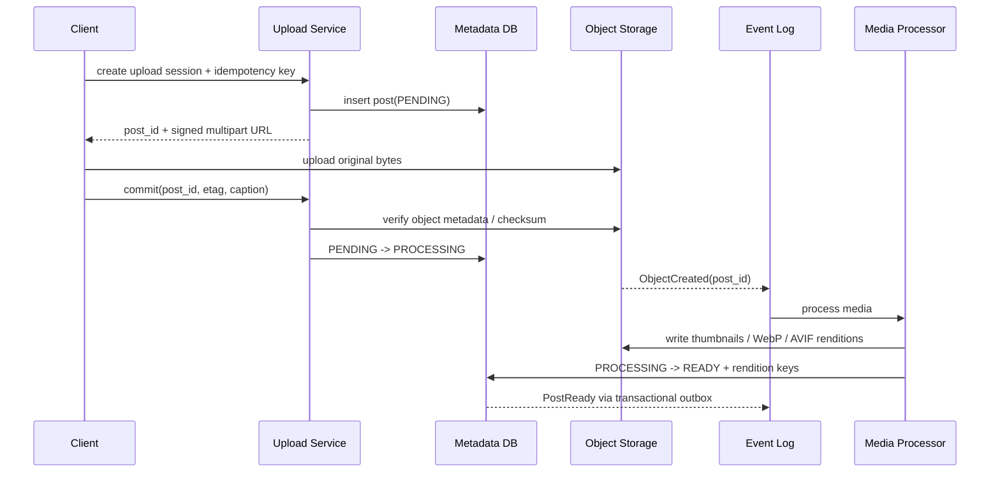
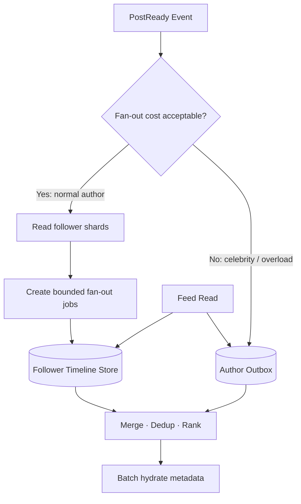

# System Design 07 · 设计图片分享与 Home Feed

课程位置：[[SystemDesign06 Async Messaging Systems|06 异步消息系统]] → 本篇 → [[SystemDesign08 LLM Async RL Platform|08 异步 LLM RL 平台]]

这是一道“设计 Instagram-like 图片分享系统”的独立案例。文中的流量、容量和 SLO 都是用于面试推导的假设值，不代表任何真实系统的内部数据。

本题真正值得深入的不是“用什么数据库”，而是两条完全不同的主链路：

```text
Media path：如何可靠地上传、处理并分发大文件
Feed path：如何在关注图上生成低延迟、足够新鲜的时间线
```

---

## 1 · Problem navigation

### Functional requirements

本轮只实现四项核心能力：

1. 用户可以上传一张图片并创建带 caption 的 post。
2. 用户可以 follow / unfollow 其他用户。
3. 用户可以分页读取自己的 home feed。
4. 用户可以打开 post，并从 CDN 加载合适尺寸的图片。

暂时不做：

```text
短视频 / Reels
Stories
私信
搜索与推荐发现页
广告
复杂图片编辑
直播
```

Likes、comments、notifications 等功能放在最后作为面试官追加需求处理。

### Non-functional requirements

先把模糊形容词变成设计目标：

| 目标 | 本题假设 |
|---|---|
| Feed latency | API metadata p99 < 200 ms；图片由 CDN 独立加载 |
| Feed availability | 99.99% |
| Upload availability | 99.9%；失败可以安全重试 |
| Media processing | 95% 的图片在 10 秒内进入 READY |
| Feed freshness | 普通账号 post 5 秒内可见；大 V 允许在下一次刷新时 merge |
| Durability | 已确认 READY 的原图不能因单机或单 AZ 故障丢失 |
| Consistency | post owner 需要 read-your-writes；home feed 允许最终一致 |
| Privacy | 未授权用户不能通过旧 feed entry 或 CDN URL 绕过权限 |
| Growth | 设计能够通过水平扩展承载当前流量的 10 倍 |

### 关键取舍

```text
图片上传成功 != post 已经可以展示
Feed 低延迟通常比绝对实时更重要
图片字节不应该经过普通 API server 中转
Home feed 允许短暂不一致，但权限检查不能最终一致到泄漏数据
```

---

## 2 · BOE：重新做数量级估算

以下数字是面试假设，先写假设再计算：

| 参数 | 假设值 |
|---|---:|
| DAU | 50M |
| 每用户每天打开 feed | 40 次 |
| 每次打开实际加载图片 | 8 张 |
| 每张 feed rendition 平均传输 | 150 KB |
| 每用户每天发布图片 | 0.08 张 |
| 每张原图 | 3 MB |
| 每张图全部 rendition | 额外 1.5 MB |
| 平均 follower 数 | 200 |
| peak factor | 6 |

### Feed read QPS

```text
feed sessions/day = 50M × 40 = 2B
average feed QPS  = 2B / 86,400 ≈ 23K
peak feed QPS     = 23K × 6 ≈ 140K
```

Feed API 返回的是 post IDs、caption、author 和 media URLs 等 metadata，不把图片二进制塞进 JSON。

### Upload QPS

```text
uploads/day       = 50M × 0.08 = 4M
average upload QPS = 4M / 86,400 ≈ 46
peak upload QPS    = 46 × 6 ≈ 280
```

Upload request QPS 不高，但每个对象很大，所以瓶颈是 bandwidth、object storage 和 media processing，而不是 API QPS。

### Media storage

每张图片保存 3 MB 原图和总计约 1.5 MB 的多个 rendition：

```text
logical growth/day = 4M × 4.5 MB
                   ≈ 18 TB/day

logical growth/year ≈ 6.6 PB/year
```

这是 logical object size。实际物理冗余由对象存储实现，不能再不加说明地乘一个 replication factor；但需要把跨区复制、版本、删除延迟和生命周期策略计入成本。

### CDN egress

```text
media/day = 2B feed sessions × 8 images × 150 KB
          ≈ 2.4 PB/day

average egress ≈ 28 GB/s ≈ 224 Gb/s
peak egress    ≈ 168 GB/s ≈ 1.34 Tb/s
```

这直接证明 CDN 不是装饰。如果 CDN hit rate 为 95%，origin 仍然可能承受：

```text
2.4 PB/day × 5% = 120 TB/day
```

所以 rendition key、cache-control、immutable URL 和热点预热都会影响真实成本。

### Push fan-out writes

如果所有 post 都 push 给每位 follower：

```text
timeline inserts/day = 4M posts × 200 followers
                     = 800M/day

average inserts/s ≈ 9.3K
burst at 10×      ≈ 93K/s
```

平均值看起来可控，但 follower 分布是重尾的。一个拥有 10M followers 的账号发布一次，就会突然产生 10M 次 timeline write；这正是不能只看平均 follower 数的原因。

### Timeline storage

Timeline entry 只保存轻量引用，例如：

```text
viewer_id + post_id + author_id + created_at + score/version
```

假设编码后 48 B，3 副本，并考虑 1.5 倍索引与存储引擎开销：

```text
physical bytes/entry ≈ 48 × 3 × 1.5 = 216 B
growth/day           ≈ 800M × 216 B ≈ 173 GB/day
30-day hot window    ≈ 5.2 TB
```

Timeline store 应设置每用户条数上限或 TTL；它是可重建的 materialized view，不是永久 source of truth。

### Post metadata

假设一条 post / media metadata 平均 2 KB：

```text
raw metadata/day = 4M × 2 KB = 8 GB/day
```

加上 3 副本与约 2 倍索引、MVCC 和存储引擎开销：

```text
physical metadata/day ≈ 8 GB × 3 × 2 = 48 GB/day
physical metadata/year ≈ 17.5 TB/year
```

### 数量级结论

```text
Feed：读密集，peak ≈ 140K QPS
Upload API：QPS 不高，但媒体写入 ≈ 18 TB/day
Delivery：CDN peak ≈ 1.34 Tb/s
Fan-out：平均可控，celebrity burst 不可直接 push
Timeline：可以预计算，但必须有 TTL / cap
```

这些结论已经足够驱动后面的 CDN、direct upload、async pipeline 和 hybrid fan-out。

---

## 3 · API 与 data entity

### API sketch

```http
POST /v1/upload-sessions
Idempotency-Key: ...

-> {
     "post_id": "p_123",
     "upload_url": "short-lived signed URL",
     "expires_at": "..."
   }
```

客户端随后使用 signed URL 直接 multipart upload 到 object storage。

```http
POST /v1/posts/{post_id}/commit
{
  "caption": "...",
  "upload_etag": "..."
}
```

```http
PUT    /v1/users/{target_id}/follow
DELETE /v1/users/{target_id}/follow
GET    /v1/feed?cursor=...&limit=20
GET    /v1/posts/{post_id}
DELETE /v1/posts/{post_id}
```

Feed 使用 opaque cursor，不使用 page number / offset：

```text
cursor = encoded(last_score, last_created_at, last_post_id, timeline_version)
```

当多条记录分数或时间相同时，`post_id` 提供稳定 tie-breaker，避免重复或漏项。

### Core entities

#### Post

```text
post_id          primary key, time-sortable ID
author_id
caption
status           PENDING | PROCESSING | READY | FAILED | DELETED
visibility       PUBLIC | FOLLOWERS | PRIVATE
created_at
ready_at
version
```

#### MediaAsset

```text
post_id
original_key
renditions       [{size, format, object_key, width, height}]
checksum
content_type
processing_status
```

数据库保存 object key，不保存图片 bytes。

#### FollowEdge

```text
follower_id
followee_id
created_at
state

primary access patterns:
1. list followees by follower_id
2. list followers by followee_id, sharded and paginated
```

#### TimelineEntry

```text
viewer_id        partition key
sort_key         score / created_at / post_id
post_id
author_id
source           PUSH | PULL
```

TimelineEntry 是派生数据。丢失后可以从 author outbox 和 post events 重建。

---

## 4 · High-level architecture

整体设计可以拆成 upload、async processing、fan-out 和 feed read 四条路径：

```photo-sharing-architecture-visual
```

与常见的“client → upload service → object storage”直传 API 方案相比，这里让图片 bytes 从 client 直接进入 object storage，普通 API server 只处理授权、metadata 和状态转换。

---

## 5 · Upload 与 media processing 深入

### 为什么不能让图片经过 API server

如果 280 peak uploads/s，每张原图 3 MB：

```text
API ingress ≈ 280 × 3 MB = 840 MB/s ≈ 6.7 Gb/s
```

这会让 stateless API instance 变成昂贵的数据搬运层，还会增加 timeout、内存和 retry 风险。Signed URL 让 control plane 和 data plane 分开：

```text
Control plane：鉴权、配额、创建 post_id、签发短期 URL
Data plane：client 直接上传 bytes 到 object storage
```

### Upload sequence



### 状态机解决什么问题

```text
PENDING：拿到 signed URL，但还未确认 object 完整
PROCESSING：上传完成，正在校验和生成 rendition
READY：所有必须的展示资产已经可用，可以进入 feed
FAILED：可重试或通知客户端重新上传
DELETED：读路径必须立即隐藏，后台异步物理删除
```

不要在图片还没生成可展示 rendition 时发布 feed event，否则用户会看到 broken image。

### Idempotency 与重复事件

Object event、queue 和 worker 通常是 at-least-once：

```text
Upload API idempotency key -> 重试不重复创建 post
Processor job key = (post_id, media_version, rendition_type)
Object key deterministic -> 重跑覆盖同一版本或 compare-and-swap
PostReady outbox -> metadata READY 与事件不会一边成功一边丢失
```

我们不需要声称端到端 exactly-once；让副作用幂等通常更可靠。

### 安全与内容处理

Media pipeline 还应负责：

- 验证 MIME 与真实文件格式，不信任扩展名
- 限制像素数、文件大小和解压缩比例
- 去除不需要的 EXIF / GPS metadata
- malware scan 与内容审核 hook
- 生成不可猜测、带版本的 object key
- 对私有内容使用短期 signed CDN URL

---

## 6 · Feed 的三种生成模式

Feed 问题本质上是在两个时刻之间分配工作：

```text
post 被创建时做多少工作？
viewer 打开 feed 时做多少工作？
```

### 方案 A：Pull / fan-out on read

发布时只写一次 author outbox：

```text
Author creates post
  -> Post DB
  -> Author Outbox[author_id]
```

读取 feed 时：

```text
1. 查询 viewer 关注的 followees
2. 读取每个 followee 最近的 post IDs
3. k-way merge
4. rank / filter / deduplicate
5. batch hydrate metadata
```

如果关注了 $F$ 个作者，每个作者取 $k$ 条候选，候选规模约为：

$$
O(F\times k).
$$

用 heap 合并有序列表的计算成本近似：

$$
O(F\times k\times\log F).
$$

#### 优点

- post write 基本是 $O(1)$，celebrity 发帖不会制造海量写入
- 不需要为每个 follower 复制 timeline entry
- follow / unfollow 的语义自然，读时使用当前关注关系

#### 缺点

- read amplification：一次 feed read 可能查询几百个 author outbox
- latency 容易被最慢 shard 拖累
- 大量并发用户刷新时重复做 merge
- celebrity outbox 会成为 read hot key

Pull 适合 write-heavy、读频率低，或关注集合很小的系统；不适合作为 140K peak feed QPS 的唯一方案。

### 方案 B：Push / fan-out on write

发布时读取 follower list，把轻量 entry 写入每位 follower 的 home timeline：

```text
PostReady
  -> follower shards
  -> fan-out tasks
  -> Timeline[viewer_1]
  -> Timeline[viewer_2]
  -> ...
```

#### 优点

- feed read 是一次顺序读取，p99 更容易控制
- timeline 可以直接 cache
- 排序、过滤和部分 ranking 可预计算

#### 缺点

- write amplification 与 follower 数成正比
- celebrity post 会形成巨型 fan-out job 和 queue backlog
- timeline entry 大量复制，需要 TTL / cap
- unfollow、delete、privacy change 需要清理旧 materialized view
- 给从不打开 feed 的冷用户做 push 是浪费

### 方案 C：Hybrid fan-out

本设计选择 hybrid：

```text
普通作者：push 到 active followers 的 home timeline
大 V 作者：只写 author outbox，读 feed 时 pull 并 merge
长期不活跃 viewer：跳过或延迟 push，登录时 backfill
```



### Threshold 不应只写“超过 1M followers”

静态 follower count 是一个起点，但更合理的判断是成本比较：

$$
push\ cost\approx active\ followers\times timeline\ write\ cost,
$$

$$
pull\ cost\approx expected\ feed\ reads\times merge\ cost.
$$

分类器还可以参考：

```text
active follower ratio
author post frequency
当前 queue lag
timeline store write capacity
viewer read frequency
freshness target
是否正在发生热点事件
```

当系统过载时，可以临时把更多作者切到 pull 路径。这是一种可控降级，不必让 fan-out queue 拖垮所有写入。

---

## 7 · Hybrid feed 的完整读写路径

### Write path

1. Media Processor 把 post 标为 READY。
2. Transactional outbox 发布 `PostReady(post_id, author_id, version)`。
3. Fan-out classifier 判断 push、pull 或 delayed push。
4. 普通作者：按 follower shard 生成 bounded task。
5. Worker 只对活跃 follower 写入 timeline entry。
6. 大 V：只追加 author outbox，不写入每位 follower timeline。
7. 所有写入使用 `(viewer_id, post_id)` 作为幂等键。

### Read path

1. Feed Service 读取 viewer 的 precomputed timeline IDs。
2. 从 Social Graph cache 找出需要 pull 的 celebrity followees。
3. 批量读取这些 author outbox 的新 post IDs。
4. Merge、deduplicate、privacy filter、block filter 和 rank。
5. 批量 hydrate Post metadata，避免 N+1 query。
6. 生成或取得 versioned CDN URLs。
7. 返回 opaque cursor 和下一页。

### 为什么 hydrate 必须 batch

假设 page size 为 20、peak feed QPS 为 140K：

```text
如果逐条查 metadata：140K × 20 = 2.8M point reads/s
如果按 shard 批量查：每个 feed request 只产生少量 batch RPC
```

Timeline 只存 IDs 能保持 entry 小且容易重建；metadata cache 与 batch API 负责避免读放大。

### Ranking 的 fallback

Merge / Rank 超时不能让整个 feed 不可用：

```text
正常：precomputed candidates + pull candidates -> rank
ranking timeout：退化为 reverse chronological merge
timeline unavailable：临时 pull 一小组最近活跃 followees
metadata miss：跳过单个损坏 item，不阻塞整页
```

这让 99.99% feed availability 不依赖每个辅助组件都完美工作。

---

## 8 · Data store 选择

不要先说 SQL 或 NoSQL；先从 access pattern 推导。

| 数据 | 主要 access pattern | 合适的逻辑模型 |
|---|---|---|
| Post metadata | by post_id、by author + time、状态事务 | sharded relational / distributed SQL 或 wide-column |
| Follow graph | followers / followees adjacency list | partitioned KV / wide-column graph adjacency |
| Author outbox | by author_id，按时间倒序 | sorted KV / wide-column |
| Home timeline | by viewer_id，按 score/time 倒序 | sorted KV / wide-column + cache |
| Media bytes | immutable large object by key | object storage + CDN |
| Events | ordered per key、replay、consumer groups | partitioned event log |

Queue 的持久化边界、ack、retention 和 transactional outbox 见：[[SystemDesign06 Async Messaging Systems|06 异步消息系统]]。

### Partition keys

```text
Post metadata: hash(post_id)
Author outbox: author_id + time bucket
Follower list: followee_id + follower_shard
Followee list: follower_id + followee_shard
Timeline: viewer_id + time bucket
Event log: author_id or post_id，取决于需要保持的局部顺序
```

Celebrity follower list 不能全部落在一个 partition。`followee_id` 后面还需要 shard suffix，fan-out coordinator 并行读取 shard，但要限制并发，避免一次 post 把 graph store 打满。

---

## 9 · Consistency 与 failure handling

### Source of truth 与派生数据

```text
Post DB + Object Storage：source of truth
Follow Graph Store：关注关系 source of truth
Author Outbox：可从 PostReady event 重建
Home Timeline：可重建 materialized view
Cache / CDN：可失效派生层
```

### Follow / unfollow

#### 新 follow

- 同步写 FollowEdge。
- 可异步 backfill 最近 N 条 post 到 timeline。
- 在 backfill 完成前，read path 可以 pull 新 followee 的 author outbox。

#### Unfollow

- 同步更新 FollowEdge，新的 feed read 立即在 hydration / filter 阶段校验。
- 异步 purge timeline 中该作者的旧 entry。
- 不能只依赖异步 purge，否则旧 entry 会继续泄漏内容。

### Delete post

1. Post source of truth 写 `DELETED` tombstone。
2. 所有 read / hydrate 立即过滤该 version。
3. 发布 `PostDeleted` event。
4. 异步删除 timeline entry、author outbox、cache 和 search document。
5. purge CDN，并按 retention policy 删除所有 object rendition。
6. 监控 deletion SLA，并保留审计记录但不保留被删除内容。

### Retry storm

每个同步 dependency 都需要：

```text
timeout
bounded exponential backoff
jitter
retry budget
circuit breaker
idempotency
```

无限 retry 会在故障时把一次失败放大成更多流量。

### Queue backlog

监控：

```text
consumer lag
oldest event age
processing error rate
DLQ size
fan-out completion p95 / p99
READY-to-visible freshness
```

当 backlog 上升时：

- 优先处理活跃 viewer
- celebrity 强制切换 pull
- 降低 notification 等低优先级 consumer
- 保留 PostReady source event，恢复后可以 replay

---

## 10 · Latency budget 与 capacity

### Feed p99 planning budget

```text
Gateway + auth                 15 ms
Timeline cache / store         35 ms
Celebrity outbox batch         35 ms
Merge + filter + rank          45 ms
Metadata batch hydrate         40 ms
Serialization + network        15 ms
Margin                         15 ms
------------------------------------
Target                        200 ms
```

这些是 planning budget，不是概率上严格相加的 p99。需要通过 tracing 测 critical path，并特别观察 fan-out RPC 的 tail amplification。

### Feed service instances

如果压测表明一个实例在目标 p99 下可安全处理 1,000 QPS，保留 30% headroom：

```text
instances = ceil(140K × 1.3 / 1K)
          ≈ 182
```

还要确保失去一个 AZ 后其余 AZ 不会超过安全吞吐。

### Media workers

假设每个 rendition job 平均占用 2 秒 worker time，每个 upload 产生 4 个 job：

```text
peak jobs/s = 280 uploads/s × 4 = 1,120 jobs/s

worker concurrency at 70% utilization
= 1,120 × 2 / 0.7
≈ 3,200 concurrent worker slots
```

真实 media pipeline 常受 CPU、GPU、memory 和 object-store bandwidth 的共同限制，必须按 rendition 类型分别 benchmark，而不是把所有 worker 当成相同机器。

---

## 11 · 面试官追加新功能时怎么扩展

不要立刻往图上加框。每个 follow-up 都走同一套流程：

```text
1. 新的 functional requirement 是什么？
2. 新的 NFR / consistency / privacy 要求是什么？
3. 新增 source of truth 还是 derived view？
4. write path、read path 和 event 分别怎么变？
5. QPS、storage、fan-out 与 hot key 增加多少？
6. failure、retry、backfill、migration 怎么处理？
```

### Follow-up A：Likes 与 comments

新增：

```text
Engagement Service
Like Store keyed by (post_id, user_id)
Comment Store partitioned by post_id + time bucket
Counter aggregation pipeline
```

Like 写入必须幂等，unique key 防止重复点赞。`like_count` 是派生计数，不需要每次同步扫描所有 like；通过 event 聚合后异步更新，并允许短暂不一致。

Celebrity post 是 counter hot key，可以先按 shard 聚合局部计数，再周期性合并。Comments 使用 cursor pagination，并对被删除或审核中的 comment 做 tombstone。

### Follow-up B：Private account、block 与 close friends

修改点：

- FollowEdge 增加 `PENDING / ACCEPTED / BLOCKED` 状态。
- Feed generation 可以预过滤，但 read / hydrate 时必须再次授权。
- CDN URL 必须短期签名，不能使用永久公开 URL。
- privacy change 发布事件，异步清理 timeline 与 cache。
- block 属于安全边界，不能只依赖最终一致的 fan-out purge。

### Follow-up C：Stories / 24 小时内容

不要硬塞进永久 home timeline：

- 独立 Story metadata 和 Story Tray。
- Object lifecycle 自动过期媒体。
- `expires_at` 是 source-of-truth 字段，read path 强制检查。
- Tray 可以 fan-out 活跃作者 ID，而不是复制所有 story item。
- 删除与过期事件负责 purge cache / CDN。

### Follow-up D：Video

Upload session 继续复用，但 media pipeline 改成：

```text
multipart upload
-> probe / validate
-> transcode ladder
-> segments + manifest
-> READY
-> CDN
```

容量估算必须改用视频时长、bitrate、转码倍率和播放分钟数。Video processing 是长任务，需要 checkpoint、优先级队列和 per-profile idempotency；播放使用 adaptive bitrate，而不是下载一个巨大文件。

### Follow-up E：Ranked feed

在 hybrid candidate generation 之后加入 Ranking Service：

```text
Candidate generation
-> feature fetch
-> lightweight pre-rank
-> full rank
-> policy / diversity filter
```

需要给 feature fetch 和 inference 单独分 latency budget，并保留 chronological fallback。模型版本、feature timestamp 和曝光日志必须可追踪，否则无法 debug 或离线评估。

### Follow-up F：Hashtag / caption search

- PostReady event 通过 CDC / event log 写入 inverted index。
- Search index 是 derived view，允许最终一致。
- Delete / privacy event 必须高优先级传播到 index。
- 热门 hashtag 结果可以 cache，但需要 rank version 与 freshness window。

### Follow-up G：Notifications

复用 PostReady / Like / Comment events：

```text
Event Log
-> Notification Composer
-> preference / block filter
-> dedup + aggregation
-> Push Provider
```

通知不能阻塞 post 或 like 的主写路径。Push provider 失败使用 bounded retry；同一事件的多次 delivery 通过 notification id 去重。

### Follow-up H：Multi-region

先问清 active-active 是否真的需要：

- Media bytes 通过 CDN 和跨区 object replication 分发。
- 用户写入可以固定 home region，减少跨区冲突。
- Follow graph 与 post metadata 按 consistency requirement 复制。
- Feed materialized view 可在每个 region 重建，不必全球强一致。
- Region failover 必须定义 RPO、RTO、DNS / traffic shift 和 duplicate event handling。

---

## 最终记忆版

```text
上传：
  create session -> signed direct upload -> async process -> READY event

Feed 写：
  normal author push active followers
  celebrity keep author outbox

Feed 读：
  precomputed timeline + celebrity pull
  -> merge / dedup / rank
  -> batch hydrate metadata
  -> CDN URLs

一致性：
  Post / Follow 是 source of truth
  Timeline / Cache / Index 都是 derived view

追问新功能：
  requirement -> data -> write path -> read path -> estimate -> failure
```

一句话总结：

> Media path 用 direct upload 和异步状态机解决“大对象”；Feed path 用 hybrid fan-out 解决“读延迟与 celebrity 写放大不能同时最优”的矛盾。
