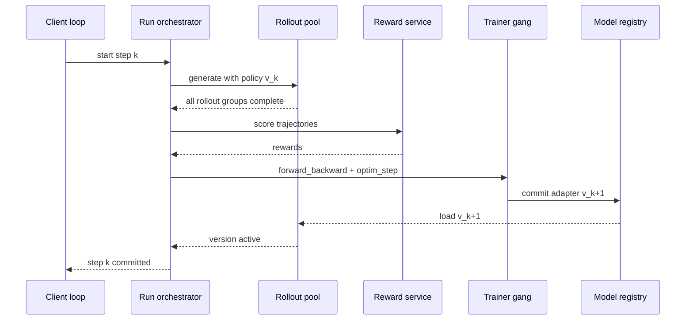
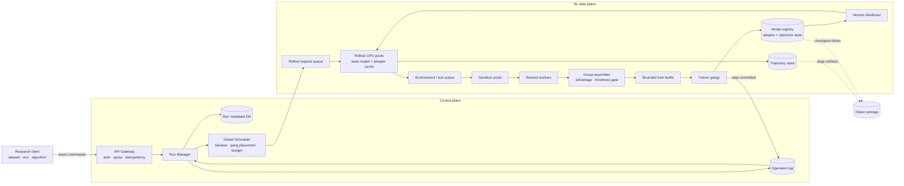
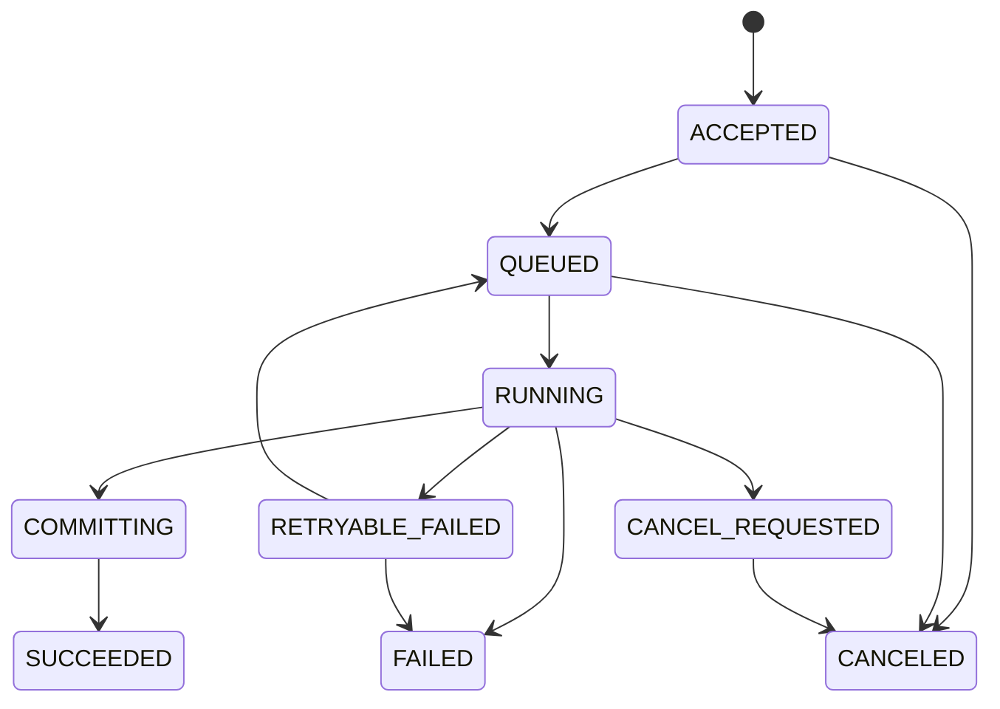
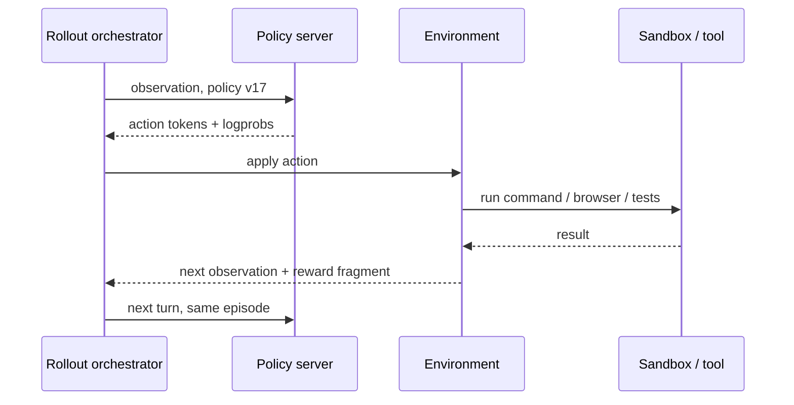

# System Design 08 · Asynchronous LLM RL Training Platform

Course Location: [[SystemDesign07 Photo Sharing Feed|07 Photo Sharing Feed]] → This Article → [[SystemDesign09 Consistent Hashing|09 Consistent Hashing]]

This is a System Design problem leaning towards ML Systems. While algorithms are not the primary focus, they cannot be ignored. Every layer of depth in the asynchronous queue potentially makes the rollout one version older; this system variable directly enters the data distribution of PPO/GRPO.

For background on the associated algorithms and frameworks, see [[MLSYS14 Post-Training Infra]]. This chapter focuses on one goal: designing a managed platform from scratch that allows researchers to run LLM reinforcement learning via API.

---

## 0 · Interview Question

> Design an LLM post-training platform for research teams. Users define datasets, RL environments, rewards, and training loops in their own Python programs; the platform provides capabilities for remote sampling, forward-backward passes, optimizer steps, and checkpointing. The system must support many concurrent experiments, long-running agent rollouts, GPU fault recovery, and usage-based billing. Please design a synchronous version first, then evolve the rollout and training into bounded asynchronous, and perform capacity estimation.

Think of this as a Tinker-like API, but the architecture below is derived from requirements, not a guess at any specific product's internal implementation.

### What this question tests

On the surface, this asks about a training platform, but it actually contains five checkpoints:

1. Do you understand that RL data is generated online by the policy and cannot be treated as a static training set?
2. Can you decouple the low-frequency control plane from the high-throughput data plane?
3. Do you know that QPS is insufficient to describe LLM workloads, and that tokens, GPU-seconds, and sandbox concurrency are more useful?
4. How do you set a hard boundary between throughput and on-policyness?
5. If a machine crashes halfway through an optimizer step, where exactly does the system recover to?

If you only have 45 minutes, I would allocate time as `5 + 5 + 10 + 15 + 10`: Requirements, Estimation, Baseline Diagram, Asynchronous Deep Dive, and Faults/Trade-offs.

---

## 1 · Narrowing the Requirements

### 1.1 Functional requirements

Focus on only six tasks for now:

1. Create a training run, selecting base model, LoRA rank, optimizer, and budget.
2. Concurrently generate rollouts using a specified policy version, returning tokens, sampling logprobs, and termination reasons.
3. Submit a batch of self-contained training data, executing `forward_backward` and `optimizer_step`.
4. Save, restore, and export adapter checkpoints.
5. Query operations, runs, usage, and failure reasons.
6. Support mathematical verifiers, reward models, and code/agent environments with sandboxes.

Out of scope for the first version:

- Base model pre-training.
- Arbitrary user CUDA kernels.
- Cross-region single distributed training.
- Low-latency serving SLOs for online inference products.

The last point is easily confused. The rollout engine also performs inference, but it prioritizes training throughput and traceability, not the time-to-first-token for chat products.

### 1.2 Non-functional requirements

Start with a set of interview assumptions; all subsequent numbers are calculated from these:

| Item | Goal |
|---|---|
| Control API | p99 admission latency < 300 ms, 99.9% monthly availability |
| Received operations | Operation records are not lost; support idempotent retries |
| Run recovery | Recovery within 15 minutes after a single GPU/worker group failure |
| Checkpoint | RPO 15 minutes; user-explicitly saved checkpoints are not lost |
| Async RL | Default `max_policy_lag <= 2` optimizer steps |
| Isolation | Tenant-level quota, budget, data isolation, and fair scheduling |
| Reproducibility | Record code/data/reward/policy versions and random seeds |

We intentionally do not promise that `sample()` completes within a few seconds. Output length, queuing, and tool latency will all affect completion time. The API's low-latency SLO only covers "the request has been validated and reliably taken over."

### 1.3 A non-negotiable semantic

When the platform returns `202 Accepted + operation_id`, it means the command has entered the durable operation log, not that the GPU has finished the computation.

```text
accepted != scheduled != running != committed
```

These four states must be separated. Otherwise, if the SDK retries after a timeout, the platform might silently perform an extra optimizer step.

---

## 2 · Understanding the Workload

A GRPO step can be written as:

```text
Read B prompts
  -> Sample G trajectories for each prompt
  -> verifier / reward
  -> Calculate advantage within the group
  -> Assemble token batch
  -> forward + backward
  -> optimizer step, policy version + 1
  -> Publish new adapter to rollout pool
```

Let:

- `B`: Number of prompts per step.
- `G`: Number of samples per prompt.
- `L_in`: Average prompt token count.
- `L_out`: Average completion token count.
- `N_r`: Number of rollout GPUs.
- `mu_r`: Effective output tokens/s per rollout GPU.
- `N_t`: Number of training GPUs.
- `mu_t`: Effective training tokens/s per training GPU.

Then:

```text
trajectories / step = B * G
output tokens / step = B * G * L_out
training tokens / step ~= B * G * (L_in + L_out)

rollout time ~= output tokens / (N_r * mu_r)
train time   ~= training tokens / (N_t * mu_t)
```

These are effective throughputs, not chip marketing numbers. You must account for continuous batching, padding, communication, KV cache misses, and long-tail latency.

---

## 3 · How to Estimate QPS

### 3.1 Break it down into three "rates"

If you only report one QPS for this problem, you will likely calculate it wrong.

| Rate | Purpose | Unit |
|---|---|---|
| API request rate | Gateway, Auth, Rate Limiting | request/s |
| Work item rate | Queue, Verifier, Sandbox | trajectory/s, task/s |
| Compute rate | GPU and Cost | input/output/train token/s, GPU-s |

A `sample(num_samples=64)` is only one API request, but it may generate hundreds of thousands of tokens. Conversely, an empty request polling for status every second consumes almost no GPU but can drive Gateway QPS very high.

### 3.2 A medium-sized RL run

The following are capacity planning assumptions, not benchmarks for a specific service:

```text
B = 512 prompts / step
G = 8 trajectories / prompt
L_in = 1,000 tokens
L_out = 2,000 tokens
N_r = 64 rollout GPUs
mu_r = 300 output tok/s/GPU
N_t = 32 training GPUs
mu_t = 1,500 train tok/s/GPU
```

Per step:

```text
trajectories = 512 * 8 = 4,096
output tokens = 4,096 * 2,000 = 8.192M
training tokens ~= 4,096 * 3,000 = 12.288M
```

Estimate the two stages:

```text
rollout capacity = 64 * 300 = 19,200 output tok/s
rollout time = 8.192M / 19,200 ~= 427 s

training capacity = 32 * 1,500 = 48,000 train tok/s
training time = 12.288M / 48,000 = 256 s
```

In synchronous execution, one step takes at least `427 + 256 = 683 s`, excluding reward and weight publication. After splitting pools and pipelining asynchronously, the steady-state step time is closer to the slower rollout stage, i.e., about 427 seconds. The training pool will have headroom, which can be used to reduce training GPUs or absorb longer sequences.

If the product requires a trainable batch every 5 minutes, you can back-calculate the GPUs:

```text
rollout GPUs >= 8.192M / (300 s * 300 tok/s/GPU) ~= 92
training GPUs >= 12.288M / (300 s * 1,500 tok/s/GPU) ~= 28
```

When deploying, leave headroom for failures, length fluctuations, and weight switching, e.g., allocate 120 and 36 GPUs respectively. Using target step time to back-calculate resources is more reliable than guessing "use 100 GPUs."

### 3.3 Sample API QPS

Assume the SDK submits a prompt group each time, with a single request containing 8 samples:

```text
sample requests per step = B = 512
sample request rate per run = 512 / 427 ~= 1.2 QPS
```

If the client crudely sends one request per trajectory:

```text
4,096 / 427 ~= 9.6 QPS per run
```

For the same token volume, Gateway QPS differs by 8x. This is why the API must support group/batch submission, and rate limiting must consider both request and token budgets.

Assuming 50 active runs:

```text
batched sample admission ~= 50 * 1.2 = 60 QPS
trajectory completion ~= 50 * 4,096 / 427 = 480 trajectories/s
output token rate ~= 50 * 19,200 = 960K tok/s
```

60 QPS looks small; 960K output tok/s is what drives the bill.

Don't forget status queries. If 50 runs poll every two seconds, that's an extra 25 QPS; opening multiple tabs in the Web console will amplify this further. Operation completion is best notified via SSE, webhooks, or long polling with backoff; fixed-frequency polling should only be kept as a compatibility path.

### 3.4 Reward and sandbox concurrency

Mathematical verifiers might finish in a few milliseconds. Code agent test environments might run for 20 seconds. If every trajectory requires independent verification, use Little's Law:

```text
required concurrency = arrival rate * average service time
                     = 480 trajectory/s * 20 s
                     = 9,600 sandboxes
```

Add 30% headroom, and you need about 12,500 concurrent sandbox slots. The bottleneck here may not be the GPU, but container startup, image distribution, file systems, and malicious code isolation.

Two tactics to reduce pressure:

- Reuse warmed-up sandboxes, but reset state for every episode.
- Perform cheap syntax/format filters first, then send passers to expensive full tests.

The second tactic changes the latency distribution of the reward pipeline; you need to write the version of each verifier level into the trajectory.

### 3.5 Trajectory data volume

Assume an average trajectory contains:

```text
3,000 token ids       * 4 bytes = 12 KB
2,000 old logprobs    * 2 bytes =  4 KB
loss/action mask + advantage     =  5 KB
reward, version, index, envelope =  3 KB
----------------------------------------
~ 24 KB / trajectory, excluding environment files
```

Thus:

```text
per step = 4,096 * 24 KB ~= 98 MB
50 runs steady-state ~= 11.5 MB/s trajectory ingress
retention 7 days ~= 7 TB
```

Environment screenshots, terminal logs, and repository diffs cannot be stuffed into a queue. They go into object storage; the trajectory only saves the URI, size, and checksum.

### 3.6 Weight synchronization

This is one of the biggest differences between LoRA services and full fine-tuning.

Assume a BF16 adapter has 64M parameters:

```text
adapter size = 64M * 2 bytes = 128 MB
```

Publishing to 64 rollout replicas:

```text
naive egress per version = 128 MB * 64 = 8 GB
average delivery rate = 8 GB / 427 s ~= 19 MB/s
```

19 MB/s average is not scary. The real trouble is the burst at the moment of switching, so you must use node-level fan-out, caching, or RDMA to avoid all replicas pulling the adapter from the same source simultaneously.

An 8B base model's BF16 full weights are about 16 GB. Copying 64 times is 1 TB/version. If the model is two orders of magnitude larger, frequent full-model synchronization is impossible. The design must leverage adapters, co-location of training/inference, sharded broadcasting, or reduced publication frequency.

---

## 4 · Drawing the Synchronous Version First

The synchronous version is not fast enough, but it is the correctness oracle. Without it, you have no control group when the asynchronous system fails.



It has three barriers:

1. Wait for all rollouts; the slowest completion determines the tail latency of this batch.
2. Wait for rewards; the slowest sandbox will block group advantage.
3. Wait for training and weight publication; during this time, the rollout pool has no new work.

The benefits of the synchronous version are tangible: all data comes from `v_k`, staleness is 0; failure recovery and experiment reproduction are easy to explain.

---

## 5 · Asynchronous Version Overview

Changing functions to `async def` won't solve the bubbles here. Useful asynchrony happens between stages: barriers are replaced by durable queues, and every piece of data must carry policy provenance.



### 5.1 Control plane

The control plane manages intent and state:

- Runs, operations, tenants, quotas, budgets.
- Which trainer gang belongs to which run.
- Current committed policy version.
- Checkpoint catalog and audit records.
- Which state to recover from after failure.

Its QPS is not high, but correctness is paramount. A relational database is suitable for the Metadata DB: transactions, unique keys, and conditional updates are more valuable than ultra-high write throughput.

### 5.2 Data plane

The data plane moves tokens and GPU work:

- Rollout requests and completed trajectories.
- Reward/verifier tasks.
- Packed training batches.
- Adapter shards, checkpoints, and optimizer states.

Throughput here can be very high, and payload sizes vary significantly. Queues only hold indices and small envelopes; token tensors, logs, and checkpoints go to object/blob storage, or use high-bandwidth object transport within the same data center.

### 5.3 Why the trainer is a gang

A tensor-parallel/data-parallel training step is not 32 small tasks that can be retried independently. All ranks must advance in the same collective. The scheduler must acquire the entire group of GPUs at once and provide this group of workers with a common execution epoch.

Rollout replicas can scale one by one, but trainer gangs usually cannot elastically change world size in the middle of a step.

---

## 6 · API: Asynchronous, but Order Matters

A streamlined API might look like this:

```http
POST /v1/runs
POST /v1/runs/{run_id}/sample
POST /v1/runs/{run_id}/train-batches
POST /v1/runs/{run_id}/optimizer-steps
POST /v1/runs/{run_id}/checkpoints
GET  /v1/operations/{operation_id}
GET  /v1/runs/{run_id}
DELETE /v1/runs/{run_id}
```

All state-changing requests carry:

```json
{
  "client_request_id": "01J...",
  "run_id": "run_42",
  "expected_policy_version": 17,
  "payload_ref": "blob://tenant-7/batches/b_918",
  "checksum": "sha256:..."
}
```

The Gateway enforces uniqueness on `(tenant_id, client_request_id)`. When retrying the same request, it returns the original `operation_id` and does not re-execute.

### 6.1 Operation state machine



`RUNNING` is not success; finishing the GPU kernel is not success. Only after the new policy version and necessary metadata are atomically committed can the optimizer operation enter `SUCCEEDED`.

### 6.2 Stateful commands must be serialized

Sampling can be highly concurrent for a single run. `forward_backward` and optimizer steps cannot: the former modifies the gradient accumulator, and the latter reads and clears it.

```text
forward_backward(batch 17)
  -> gradient step gs_18: OPEN
  -> append microbatch 0, 1, 2, 3
  -> seal gs_18

optim_step(gs_18, expected_version = 17) -> commits version 18
optim_step(gs_18, expected_version = 17) -> reject as duplicate/conflict
```

Each microbatch has a unique key `(gradient_step_id, microbatch_index)`. Retransmitting the same microbatch after an SDK timeout will not accumulate gradients twice. Only when all expected microbatches are complete can the gradient step move from `OPEN` to `SEALED`; the optimizer can only consume a `SEALED` step once.

The Run Manager maintains a monotonic `policy_version`, `step_sequence`, and `gradient_step_id` for each run. The database uses compare-and-swap to commit:

```sql
UPDATE runs
SET policy_version = 18, last_operation_id = :op
WHERE run_id = :run AND policy_version = 17;
```

Updating 0 rows means another step has already been committed, and the current execution cannot publish its results.

---

## 7 · What goes into the Queue?

This system requires at least four queues with different semantics; there is no need to force them into a single topic.

| Queue / Log | Consumption Pattern | Partition Key | Why it exists |
|---|---|---|---|
| Operation log | Each operation state machine | `run_id` | Audit, recovery, SDK query |
| Rollout queue | Competing workers | `base_model + resource_class` | Route prompts to available inference replicas |
| Reward queue | Competing workers | `verifier_type` | Isolate math, RM, code sandbox |
| Train buffer | Single run's trainer | `run_id + policy_version` | Group finalize, token packing, freshness gate |
| Weight event | Pub/Sub | `base_model + run_id` | Notify rollout replicas to load new adapter |

### 7.1 Rollout request

```json
{
  "rollout_id": "ro_918",
  "run_id": "run_42",
  "tenant_id": "tenant_7",
  "prompt_group_id": "pg_51",
  "sample_index": 3,
  "base_model": "model-family-8b",
  "policy_version": 17,
  "adapter_ref": "model://run_42/v17",
  "prompt_ref": "blob://tenant-7/prompts/p_51",
  "sampling": {"temperature": 1.0, "max_tokens": 4096},
  "deadline_at": "2026-07-16T02:10:00Z",
  "seed": 88421
}
```

`policy_version` cannot be read as "latest" when the worker starts executing. The request must know which policy version it belongs to from the moment it enters the queue.

### 7.2 Complete trajectory

```text
identity
  run_id, rollout_id, prompt_group_id, sample_index

provenance
  policy_version, adapter checksum, tokenizer version,
  sampling params, seed, environment image, verifier version

model data
  input_ids, output_ids, action/loss mask,
  old_logprobs, stop_reason

RL result
  scalar/per-token rewards, advantage, validation result

operations
  started_at, finished_at, retry_count, worker_id,
  artifact refs, error class
```

Natural language transcripts are only for viewing logs. The trainer must consume the token IDs actually sampled during rollout; you cannot re-tokenize text and pretend they are identical.

### 7.3 GRPO group is a small barrier

The entire system can be asynchronous, but that doesn't mean groups of the same prompt can be split arbitrarily.

```text
prompt_group pg_51
  sample 0 -> reward 1
  sample 1 -> reward 0
  sample 2 -> still running
  sample 3 -> reward 1

mean / std / advantage: cannot finalize yet
```

Define clear policies for groups:

- `wait_all`: Cleanest, most affected by long tails.
- `timeout_and_mask`: Timed-out samples are not trained, but the advantage distribution changes.
- `resample_missing`: Maintain group size, increase cost, prevent duplicates.
- `partial_group`: Use only when the algorithm explicitly allows it.

The system must not silently drop the slowest samples. Whether long answers are more likely to be correct depends on the task; silent truncation may introduce length bias into training data.

---

## 8 · How to Implement Bounded Asynchrony

### 8.1 Three modes

| Mode | Rollout vs. Trainer | Policy lag | Applicable Stage |
|---|---|---:|---|
| Synchronous | Global barrier per step | 0 | Correctness baseline, small experiments |
| Pipelined | Rollout leads by limited batch | 0～S | Default production mode |
| Fully async | Both advance independently | Unbounded if uncontrolled | Algorithm explicitly supports, massive scale |

The platform defaults to the second mode. It consumes most bubbles without turning training into an unbounded replay buffer.

### 8.2 Defining Staleness

For trajectory `x`:

```text
policy_lag(x) = current_trainer_version - x.rollout_policy_version
```

Looking at queue age is not enough. If two pieces of data have waited for five minutes, but one run has updated 0 times while the other has updated 8 times, their off-policy degrees are completely different.

### 8.3 Using buffer depth to cap lag

If each optimizer step consumes `B_train` trajectories and allows a maximum lag of `S` steps, a simple upper bound is:

```text
ready buffer capacity <= B_train * (S + 1)
```

Assuming `B_train = 4,096`, `S = 2`:

```text
capacity <= 12,288 trajectories
metadata size ~= 12,288 * 24 KB ~= 295 MB
```

Once the buffer is full, the Rollout Controller stops sending new prompts or only generates versions that the current trainer will still accept. The queue itself must have a `maxsize`; relying solely on autoscaling is not backpressure.

### 8.4 Freshness gate

The group assembler checks data before sending it to the trainer:

```python
lag = current_policy_version - trajectory.policy_version

if lag < 0:
    quarantine("future version: metadata corruption")
elif lag <= max_policy_lag:
    ready_queue.put(trajectory)
else:
    stale_store.put(trajectory)  # audit, optional off-policy research
```

The trainer prioritizes fresher data and records a lag histogram for each batch. Whether samples exceeding the threshold are discarded, down-weighted, or passed to off-policy loss is an algorithm configuration; the storage worker should not decide this.

### 8.5 Atomic switching of weight updates

Rollout replicas serve many sequences simultaneously. Overwriting an adapter currently in use creates an awkward state where half a trajectory uses v17 and half uses v18.

In an interview, I would choose the easiest-to-verify scheme:

```text
1. Download v18 to an inactive slot in the background
2. Verify checksum, complete GPU load
3. New requests start binding to v18
4. Already started v17 requests continue until completion
5. Reclaim v17 after refcount hits zero
```

This is equivalent to adapter double buffering. The cost is occupying an extra adapter's worth of VRAM during the update window.

Another route is to interrupt and re-prefill, or allow different tokens in a trajectory to come from different versions. The latter requires per-token behavior logprob/version provenance, making algorithms and debugging much harder. Unless throughput data proves it's worth it, don't choose this for the first version.

### 8.6 Asynchronous stability is not a unilateral promise

[AReaL](https://arxiv.org/abs/2505.24298) separates generation and training into pools and uses staleness control and a modified PPO objective to handle old data. The paper also reports that unbounded staleness degrades training; whether a moderate upper bound is safe depends on the algorithm and workload. You cannot treat numbers from a specific experiment as platform constants.

The system must at least expose the following to the algorithm layer:

- Rollout policy version and old logprob.
- Logprob recalculated under the current policy.
- Importance ratio, clip fraction, KL, and lag histogram.
- Accept/reweight/discard policy for stale samples.

Queue depth is already an algorithm hyperparameter here.

---

## 9 · Scheduling and Multi-tenancy

### 9.1 Why LoRA is suitable for shared pools

Base model weights are large, while adapters are much smaller. Rollout GPUs can keep the base model resident and load different tenants' adapters on demand:

```text
GPU replica
  base model: model-family-8b
  adapter slots:
    tenant A / run 12 / v8
    tenant B / run 91 / v3
    tenant C / run 07 / v21
```

This reduces base model reloads and allows small experiments to share continuous batching. Problems follow: adapter cache misses, tenant fairness, version switching, and VRAM fragmentation all become the scheduler's job.

### 9.2 Two-level scheduling

The Global Scheduler selects the resource pool, and the local scheduler fills the GPU batch:

```text
Global:
  tenant quota -> base model family -> GPU type -> region -> worker pool

Local rollout scheduler:
  adapter residency -> prefix affinity -> token budget -> deadline
```

You cannot round-robin solely by request count. A 64-token classification request and a 32K-token agent rollout are not the same cost.

Use deficit round-robin, with cost estimated as:

```text
estimated_cost = alpha * input_tokens
               + beta  * requested_output_tokens
               + gamma * expected_tool_seconds
```

Settle using actual tokens and sandbox time after execution. Underestimation does not block the current task, but it will be deducted from the tenant's subsequent credits.

### 9.3 Training pool clock

Trainer gangs advance in lock-step within a collective; small batches occupying a round alone waste compute. A feasible approach is to arrange multiple LoRA runs with the same base model and parallel layout into a shared training clock: receive forward-backward/optimizer work for several runs per round, then update their respective states based on adapter ownership.

The public [Tinker under-the-hood documentation](https://tinker-docs.thinkingmachines.ai/tinker/under-the-hood/) describes a similar user-visible model: multiple LoRA runs share the worker pool's clock cycles; clients should submit futures in advance and pipeline to avoid missing the next round. This explains why the API returns futures and why "low QPS per request" doesn't mean scheduling is simple.

Our design must also fill in the questions that product documentation won't answer for an interview:

- How many tokens can a tenant occupy per round?
- How long must a small run wait before it must be scheduled to avoid starvation?
- Can a malformed batch from one run drag down the entire gang?
- When a collective fails, which runs need to be retried together?

### 9.4 Admission control

Perform budget checks when creating a run, rather than discovering there are no GPUs after it's already in the queue:

```text
requested model / LoRA rank supported?
estimated adapter + optimizer memory fits?
tenant concurrent-run quota available?
monthly token / GPU budget remaining?
required sandbox image allowed?
deadline compatible with current capacity?
```

Accepted runs can enter `WAITING_FOR_CAPACITY`, but the platform must return a queue position or a coarse-grained start estimate. Do not let the SDK show `RUNNING` indefinitely.

---

## 10 · Fault Recovery

### 10.1 Don't chase "exactly-once" in one sentence

Correct semantics differ by operation:

| Operation | Allow repeated execution? | Handling |
|---|---|---|
| Sampling | Can count twice, cannot train twice | Deduplicate by `rollout_id`, first valid result wins |
| Reward | Usually can be recalculated | Verifier must be deterministic or record version/seed |
| Object upload | Can be retried | Content hash + conditional put |
| Optimizer step | Never submit twice | Idempotency + lease + fencing + version CAS |
| Weight publish | Can republish same version | No-op if version/checksum is identical |
| Checkpoint | Can be retried | Immutable blob + manifest atomic commit |

### 10.2 Trainer gang failure

Assume a step for version 17 is running:

```text
1. Scheduler grants lease(epoch=44, expected_version=17)
2. 32 ranks execute forward/backward/all-reduce
3. Rank 9 crashes, collective aborts
4. The entire gang terminates; cannot let the remaining 31 ranks continue
5. New gang recovers from v17 durable optimizer checkpoint
6. Retry using the same batch manifest and new epoch=45
7. DB only accepts commit with latest fencing epoch and expected_version=17
```

Even if the old gang "resurrects," it cannot overwrite the new result. Fencing tokens prevent split-brain, not just ordinary duplicate requests.

Saving the full optimizer state every step might be too expensive. Common compromises:

- Durable full checkpoint every N minutes.
- Save immutable batch manifest, seed, and operation journal between checkpoints.
- Replay uncommitted steps from the checkpoint after failure.

This requires kernels, sampling, and environments to be sufficiently reproducible. It's okay if it's not bitwise deterministic, but write the recovery semantics as "algorithmically equivalent recalculation," don't promise bit-level identity.

### 10.3 Rollout worker failure

Rollout requests have leases. After the worker heartbeat disappears, the request returns to the ready queue. A new worker retries using the same `rollout_id`, policy version, and seed.

If the environment has external side effects, replaying the prompt is not enough. Agent steps require environment snapshots or event logs; real side effects like payments or sending emails should not appear in training sandboxes.

### 10.4 Checkpoint two-phase publication

```text
upload shards to temporary prefix
  -> verify shard count and checksums
  -> write immutable manifest
  -> CAS model_registry.current_checkpoint = manifest_id
  -> emit checkpoint.committed event
```

Readers only trust committed manifests. Orphaned shards are cleaned up by background GC.

### 10.5 Region strategy

The control plane can be multi-AZ. A single training run is best fixed to a home region because cross-region collectives and frequent weight synchronization are both slow and brittle.

For disaster recovery, rebuild the run in a second region from the latest checkpoint. This is active-passive, not allowing two regions to write to the same optimizer state simultaneously.

---

## 11 · Agentic RL Amplifies Problems

Most single-turn math problems are `prompt -> completion -> verifier`. Agent rollouts will interleave multi-turn tool waits:



### 11.1 Session affinity

Subsequent turns of the same episode should ideally return to the same rollout replica to reuse the prefix KV cache. The router saves:

```text
(episode_id -> replica_id, policy_version, adapter_slot, lease_until)
```

If a replica crashes, it can re-prefill on another machine. Session affinity is a performance optimization; the trajectory store is the basis for recovery.

### 11.2 Don't occupy GPU batch slots during tool waits

After the model outputs a tool call, the episode might wait for the sandbox for seconds or even minutes. The rollout scheduler should move it out of the active decode batch, keeping only the recoverable session state; re-admit it after the tool returns.

Whether to keep the KV cache depends on wait time and memory pressure:

```text
short wait + plenty of cache -> keep
long wait or memory pressure -> evict and re-prefill later
```

### 11.3 Security boundaries

User environment code cannot enter the trainer process. Sandboxes require at least:

- Unprivileged containers/microVMs, read-only base images, temporary file systems.
- Network isolation by default, egress opened via allowlist.
- Limits on CPU, memory, disk, process count, and wall-time.
- Secret broker issues short-term credentials; do not inject platform tokens into the environment.
- Destroy or perform a trusted reset after the episode ends.

Sandbox failure is a first-class reward result, e.g., `ENV_TIMEOUT`, `TEST_FAILED`, `INFRA_ERROR`. The last one must not be treated as 0 reward by the model; otherwise, platform failures will pollute training signals.

---

## 12 · Observation: System and Algorithm Metrics Together

### 12.1 Control plane

- Operation admission latency, state transition age.
- Run scheduling delay, quota rejection, budget burn rate.
- Lease expiry, fencing conflict, checkpoint age.

### 12.2 Rollout

- Input/output token/s, time to first token, inter-token latency.
- Active sequences, KV cache occupancy/eviction, adapter cache hit.
- Rollout length p50/p95/p99, stop reason, tool wait time.
- Queue depth and oldest request age.

### 12.3 Training

- Train token/s, MFU, step time, collective time, OOM/restart.
- Sequence packing efficiency, padding ratio.
- Checkpoint and adapter publish latency.

### 12.4 RL correctness

- Policy lag histogram, not just the average.
- Importance ratio, clip fraction, KL, entropy.
- Reward distribution, group reward std, degenerate group ratio.
- Stale discard rate, duplicate rollout rate, infra-error rate.

A typical accident: GPU utilization looks higher, but rewards slowly drop. It turns out the rollout queue is backed up, lag drifted from 1 to 7, and the trainer has been consuming stale data. You won't find this causal chain by looking only at the infra dashboard.

### 12.5 Tracing

```text
trace_id
  run_id
    operation_id
      prompt_group_id
        rollout_id
          environment_step_id
      train_batch_id
        optimizer_step_id
          policy_version
```

Logs cannot just say `request failed`. You must be able to trace from an anomalous reward to the policy, tokens, environment, verifier, and training batch that generated it.

---

## 13 · Tinker's Inspiration

Tinker's public abstraction is restrained: researchers control data and algorithms, while the remote system provides primitives like `sample`, `forward_backward`, `optim_step`, and `save_state`. The [Quick Start](https://tinker-docs.thinkingmachines.ai/tinker/quickstart/) even defines an RL datum as a self-contained sample including tokens, loss mask, sampling logprobs, and advantage.

This API boundary has three benefits:

1. The Python research loop stays on the user side; changing reward and data logic doesn't require redeploying the distributed trainer.
2. The GPU service sees structured tensor work, enabling batching, queuing, and multi-tenant scheduling.
3. `APIFuture` separates submission from completion; clients can pipeline without blocking for every remote step.

But "the API is asynchronous" and "the RL algorithm allows stale rollouts" are two different things. The former can just hide queuing and network latency; the latter changes which policy version the training data comes from. Design documents must address them separately.

### Things you can derive, but shouldn't pretend to know

You can reasonably derive:

- The need for operation identity, future states, and idempotent handling.
- The need for clocks/batching, fairness, and isolation when sharing GPUs across tenants.
- That rollout and training have different resource shapes; the scheduler cannot look only at request counts.

You cannot derive:

- That it definitely uses Kafka, Ray, a specific database, or a specific network topology.
- The exact commit protocol for each optimizer step.
- The internal GPU count, utilization, or cost structure of a specific model.

In an interview, you can choose your own implementation, but say "I choose," not "the product internals are like this."

---

## 14 · Common Follow-ups

### If expanding from LoRA to full fine-tuning

The advantage of adapter caching disappears; optimizer state and weight sync are orders of magnitude larger. You need:

- Dedicated or long-term trainer gangs for the run.
- Co-location of training and rollout, or high-bandwidth sharded publication.
- Reduced policy publication frequency, accepting larger lag, or updating rollout replicas in batches.
- Re-estimating checkpoint bandwidth and recovery time.

This isn't just setting `rank=null` in the request.

### If the reward model is also updating

The trajectory records both `policy_version` and `reward_model_version`. Reward recalculation must know which RM version to use. When both models are drifting, experiment interpretation is difficult; usually, the reward version is fixed for a period before an explicit switch.

### If the user requires strict on-policy

Switch back to synchronous mode, or make the rollout pipeline perform only speculative work for `v_k`, discarding unused data after `v_k+1` is committed. The former is slow but saves samples; the latter trades GPU for wall-clock time.

### If some tenants use 32K context

Change quota from request count to token/KV-block budget; build a separate long-context pool to avoid crowding out short tasks. The scheduler admits based on actual KV occupancy and predicted decode length.

### If evaluation is required

Evaluation uses frozen checkpoints and an independent queue; it cannot read from the continuously updating `latest` adapter. Results record dataset version, prompt template, sampling seed, and evaluator version. Eval traffic must have an independent quota to avoid periodic evaluations slowing down training.

### If costs suddenly double

Check in this order:

```text
Did output length increase?
Did discarded rollouts due to stale/timeout/duplicate increase?
Did sandbox infra errors trigger massive retries?
Did adapter cache misses or weight publication time increase?
Did train packing efficiency decrease?
```

Even if GPU unit prices remain unchanged, costs can double because the system "generated a lot of data that wasn't eventually trained on."

---

## 15 · Interview Closing Template

Don't re-list component names in the last two minutes. Converge on four design decisions:

```text
1. Use durable operations + futures in the API to separate admission from completion.
2. Separate rollout, reward, and training into pools, using queues to decouple speed and fault dependencies.
3. Limit asynchronous depth with max_policy_lag and bounded buffers; do not allow unbounded stale data.
4. Commit optimizer steps using run versions, leases, and fencing; replay from checkpoints after GPU gang failures.
```

Add one more sentence on estimation: this example only has about 60 sample admission QPS, but requires nearly 1M output tok/s and about 10K sandbox concurrency. It reminds the interviewer that you are designing an ML system, not a generic CRUD API.

---

## 16 · Resources

- [Tinker: training API](https://thinkingmachines.ai/tinker/)
- [Tinker Quick Start: RL loop, Datum, and async API](https://tinker-docs.thinkingmachines.ai/tinker/quickstart/)
- [Tinker Under the Hood: multi-tenant clock cycle and pipelining](https://tinker-docs.thinkingmachines.ai/tinker/under-the-hood/)
- [Tinker RL Cookbook: environment, group rollout, and training loop](https://tinker-docs.thinkingmachines.ai/cookbook/rl/)
- [AReaL: A Large-Scale Asynchronous Reinforcement Learning System for Language Reasoning](https://arxiv.org/abs/2505.24298)
