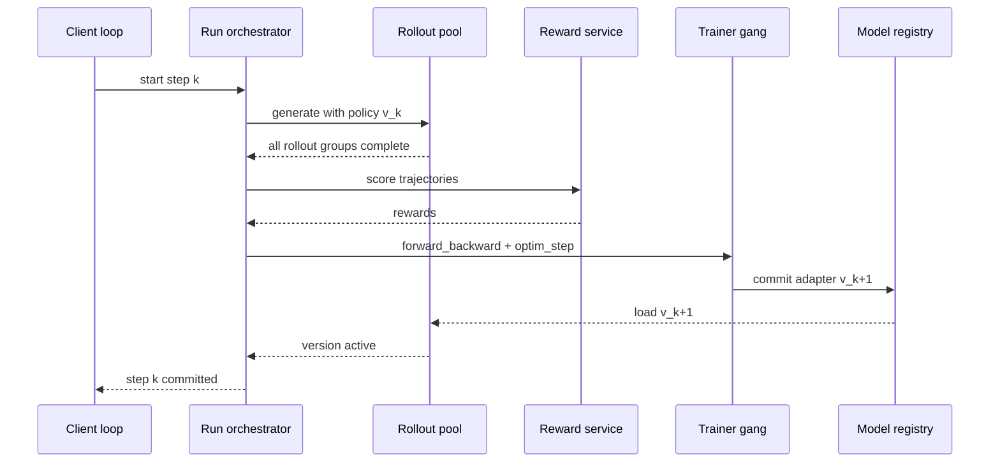
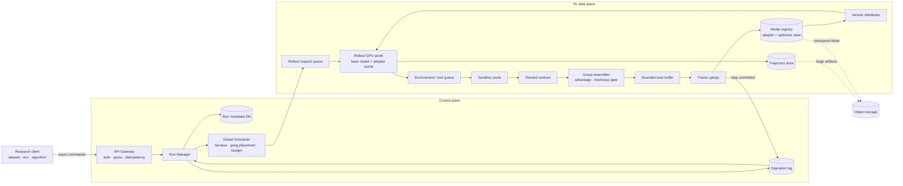
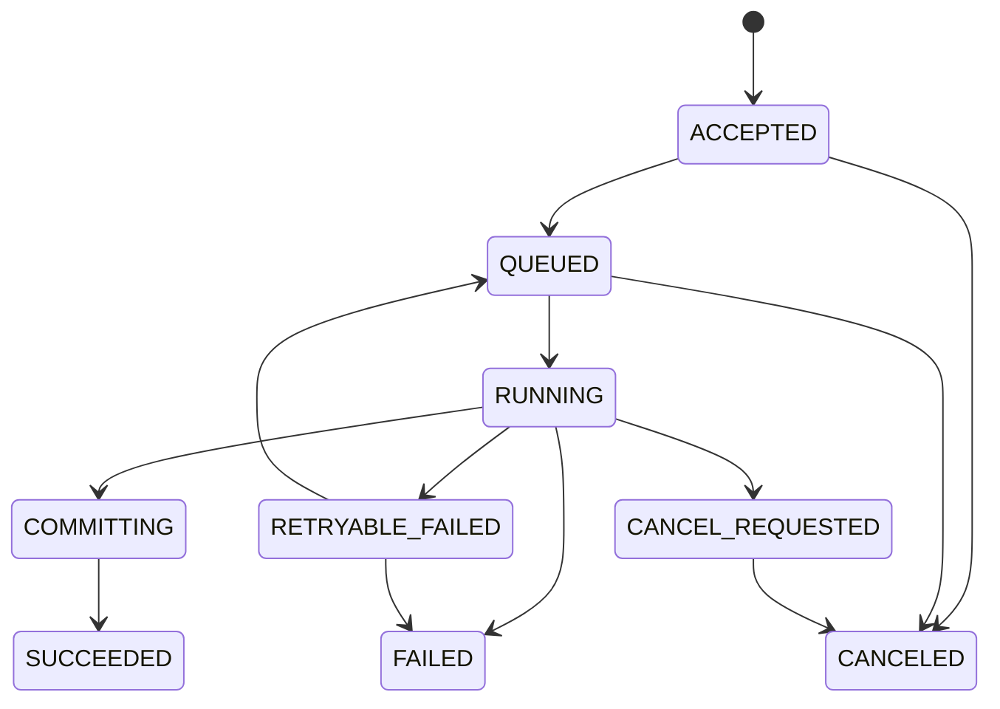
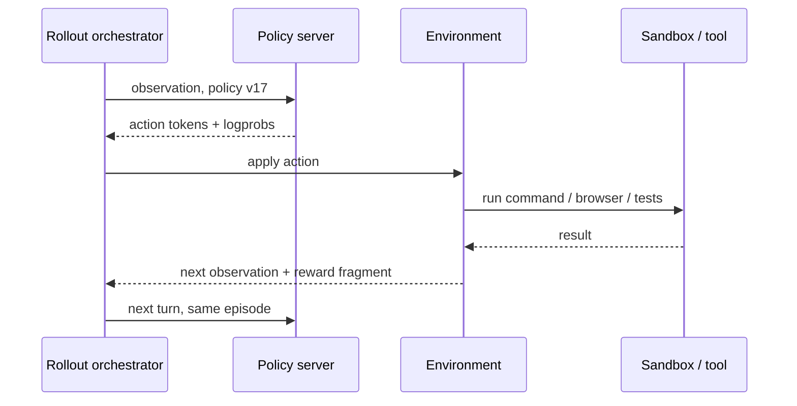

# System Design 08 · 异步 LLM RL 训练平台

这是一道偏 ML Systems 的 System Design 题。算法不是主角，但也不能装作算法不存在。异步队列每深一层，rollout 就可能旧一版；这个系统变量会直接进入 PPO / GRPO 的数据分布。

配套的算法与框架背景见 [[MLSYS14 Post-Training Infra]]。本章只做一件事：从零设计一个让研究者通过 API 运行 LLM 强化学习的托管平台。

---

## 0 · 面试题

> 设计一个面向研究团队的 LLM post-training 平台。用户在自己的 Python 程序里定义 dataset、RL environment、reward 和训练循环；平台提供远程 sampling、forward-backward、optimizer step、checkpoint 等能力。系统需要支持许多并发实验、长时间 agent rollout、GPU 故障恢复和按量计费。请先设计同步版本，再把 rollout 与 training 改成有界异步，并做容量估算。

可以把它想成一套 Tinker-like API，但下面的架构是从需求推出来的，不是对任何产品内部实现的猜测。

### 这题在考什么

这题表面上问训练平台，实际有五个检查点：

1. 你是否知道 RL 数据由 policy 在线生成，不能把它当静态训练集。
2. 你是否会把低频控制面和高吞吐数据面拆开。
3. 你是否知道 QPS 不足以描述 LLM 负载，token、GPU-second 和 sandbox concurrency 更有用。
4. 你如何在吞吐和 on-policyness 之间设一道硬边界。
5. 一个 optimizer step 执行到一半机器挂了，系统到底恢复到哪里。

如果时间只有 45 分钟，我会把篇幅分成 `5 + 5 + 10 + 15 + 10`：需求、估算、基础图、异步 deep dive、故障与取舍。

---

## 1 · 需求先收窄

### 1.1 Functional requirements

先只做六件事：

1. 创建 training run，选择 base model、LoRA rank、optimizer 和预算。
2. 用指定 policy version 并发生成 rollout，并返回 token、sampling logprob 和结束原因。
3. 提交一批自包含的 training datum，执行 `forward_backward` 和 `optimizer_step`。
4. 保存、恢复和导出 adapter checkpoint。
5. 查询 operation、run、用量和失败原因。
6. 支持数学 verifier、reward model，以及带 sandbox 的 code / agent environment。

第一版不做：

- Base model 预训练。
- 任意用户 CUDA kernel。
- 跨 region 的单次分布式训练。
- 在线推理产品的低延迟 serving SLO。

最后一条很容易混。Rollout engine 也做推理，但它追求训练吞吐和可追溯性，不是聊天产品的首 token 延迟。

### 1.2 Non-functional requirements

先给一组面试假设，后面所有数字都从这里算：

| 项目 | 目标 |
|---|---|
| Control API | p99 admission latency < 300 ms，月可用性 99.9% |
| 已接收操作 | operation record 不丢；支持幂等重试 |
| Run recovery | 单个 GPU / worker group 故障后 15 分钟内恢复 |
| Checkpoint | RPO 15 分钟；用户显式保存的 checkpoint 不丢 |
| Async RL | 默认 `max_policy_lag <= 2` 个 optimizer steps |
| Isolation | tenant 级 quota、预算、数据隔离和公平调度 |
| Reproducibility | 记录代码/数据/reward/policy 版本和随机种子 |

这里故意不承诺 `sample()` 在几秒内完成。输出长度、排队和 tool latency 都会改变完成时间。API 的低延迟 SLO 只管“请求被验证并可靠接管”。

### 1.3 一条不能含糊的语义

平台返回 `202 Accepted + operation_id` 时，表示命令已经进入 durable operation log，不表示 GPU 已经完成计算。

```text
accepted != scheduled != running != committed
```

这四个状态要分开。否则 SDK timeout 后重试一次，平台可能悄悄多做一个 optimizer step。

---

## 2 · 先理解工作负载

一个 GRPO step 可以写成：

```text
读取 B 个 prompts
  -> 每个 prompt 采样 G 条 trajectories
  -> verifier / reward
  -> group 内计算 advantage
  -> 组装 token batch
  -> forward + backward
  -> optimizer step，policy version + 1
  -> 把新 adapter 发布给 rollout pool
```

设：

- `B`：每步 prompt 数。
- `G`：每个 prompt 的采样数。
- `L_in`：平均 prompt token 数。
- `L_out`：平均 completion token 数。
- `N_r`：rollout GPU 数。
- `mu_r`：单张 rollout GPU 的有效输出 token/s。
- `N_t`：training GPU 数。
- `mu_t`：单张 training GPU 的有效训练 token/s。

那么：

```text
trajectories / step = B * G
output tokens / step = B * G * L_out
training tokens / step ~= B * G * (L_in + L_out)

rollout time ~= output tokens / (N_r * mu_r)
train time   ~= training tokens / (N_t * mu_t)
```

这些是有效吞吐，不是芯片宣传数字。要把 continuous batching、padding、通信、KV cache miss 和长尾都算进去。

---

## 3 · QPS 怎么估算

### 3.1 先拆成三种“速率”

这题只报一个 QPS，十有八九会算错。

| 速率 | 用途 | 单位 |
|---|---|---|
| API request rate | Gateway、鉴权、限流 | request/s |
| Work item rate | Queue、verifier、sandbox | trajectory/s、task/s |
| Compute rate | GPU 与成本 | input/output/train token/s、GPU-s |

一个 `sample(num_samples=64)` 只有一次 API 请求，却可能生成几十万 token。反过来，一个每秒轮询状态的空请求几乎不花 GPU，却能把 Gateway QPS 抬得很高。

### 3.2 一次中型 RL run

下面都是容量规划假设，不是某个服务的 benchmark：

```text
B = 512 prompts / step
G = 8 trajectories / prompt
L_in = 1,000 tokens
L_out = 2,000 tokens
N_r = 64 rollout GPUs
mu_r = 300 output tok/s/GPU
N_t = 32 training GPUs
mu_t = 1,500 train tok/s/GPU
```

每步有：

```text
trajectories = 512 * 8 = 4,096
output tokens = 4,096 * 2,000 = 8.192M
training tokens ~= 4,096 * 3,000 = 12.288M
```

估算两个 stage：

```text
rollout capacity = 64 * 300 = 19,200 output tok/s
rollout time = 8.192M / 19,200 ~= 427 s

training capacity = 32 * 1,500 = 48,000 train tok/s
training time = 12.288M / 48,000 = 256 s
```

同步执行时，一步至少约 `427 + 256 = 683 s`，还没算 reward 和权重发布。拆池并异步流水后，steady-state step time 更接近较慢的 rollout stage，也就是约 427 秒。Training pool 会有余量，可以减少训练 GPU，或用来吸收更长的 sequence。

如果产品要求 5 分钟产出一个可训练 batch，可以反推 GPU：

```text
rollout GPUs >= 8.192M / (300 s * 300 tok/s/GPU) ~= 92
training GPUs >= 12.288M / (300 s * 1,500 tok/s/GPU) ~= 28
```

部署时还要给故障、长度波动和权重切换留余量，例如分别配 120 和 36 张。先拿目标 step time 反推资源，比拍脑袋写“上 100 张 GPU”靠谱。

### 3.3 Sample API QPS

假设 SDK 每次提交一个 prompt group，单次请求包含 8 个 samples：

```text
sample requests per step = B = 512
sample request rate per run = 512 / 427 ~= 1.2 QPS
```

若客户端粗暴地每条 trajectory 发一个请求：

```text
4,096 / 427 ~= 9.6 QPS per run
```

同样的 token 量，Gateway QPS 相差 8 倍。这就是为什么 API 要支持 group/batch submission，限流也要同时看 request 和 token budget。

假设 50 个活跃 run：

```text
batched sample admission ~= 50 * 1.2 = 60 QPS
trajectory completion ~= 50 * 4,096 / 427 = 480 trajectories/s
output token rate ~= 50 * 19,200 = 960K tok/s
```

60 QPS 看起来很小，960K output tok/s 才是账单。

状态查询也别漏算。50 个 run 如果每两秒轮询一次，就是额外 25 QPS；Web 控制台再开几个标签页还会继续放大。Operation 完成适合用 SSE、webhook 或带退避的 long polling 通知，固定频率轮询只保留作兼容路径。

### 3.4 Reward 与 sandbox 并发

数学 verifier 可能在几毫秒内完成。Code agent 的测试环境可能跑 20 秒。若每条 trajectory 都要独立验证，用 Little's Law：

```text
required concurrency = arrival rate * average service time
                     = 480 trajectory/s * 20 s
                     = 9,600 sandboxes
```

再留 30% headroom，需要约 12,500 个并发 sandbox slot。此时瓶颈未必是 GPU，而是容器启动、镜像分发、文件系统和恶意代码隔离。

可以用两招降压：

- 复用预热 sandbox，但每个 episode 必须重置状态。
- 先做便宜的 syntax / format filter，再把通过者送进昂贵的完整测试。

第二招会改变 reward pipeline 的延迟分布，需要把每一级 verifier 的版本写进 trajectory。

### 3.5 Trajectory 数据量

假设一条 trajectory 平均包含：

```text
3,000 token ids       * 4 bytes = 12 KB
2,000 old logprobs    * 2 bytes =  4 KB
loss/action mask + advantage     =  5 KB
reward、版本、索引和 envelope     =  3 KB
----------------------------------------
约 24 KB / trajectory，不含环境文件
```

于是：

```text
per step = 4,096 * 24 KB ~= 98 MB
50 runs steady-state ~= 11.5 MB/s trajectory ingress
retention 7 days ~= 7 TB
```

环境截图、terminal log、repository diff 不能塞进 queue。它们进 object storage，trajectory 只保存 URI、size 和 checksum。

### 3.6 权重同步

这是 LoRA 服务和 full fine-tuning 差别最大的地方之一。

假设一个 BF16 adapter 有 64M parameters：

```text
adapter size = 64M * 2 bytes = 128 MB
```

发布到 64 个 rollout replica：

```text
naive egress per version = 128 MB * 64 = 8 GB
average delivery rate = 8 GB / 427 s ~= 19 MB/s
```

19 MB/s 的平均量不吓人。真正麻烦的是切换瞬间的 burst，所以还要用节点级 fan-out、缓存或 RDMA，避免所有 replica 同时从同一个源拉 adapter。

8B base model 的 BF16 full weights 约 16 GB。同样复制 64 份就是 1 TB/version。模型再大两个数量级，频繁整模同步根本不成立。设计必须利用 adapter、训练/推理共置、分片广播，或降低发布频率。

---

## 4 · 先画同步版本

同步版本不够快，但它是 correctness oracle。没有它，异步系统出问题时连对照组都找不到。



它有三个 barrier：

1. 等全部 rollout，最慢 completion 决定这一批的尾延迟。
2. 等 reward，最慢 sandbox 会卡住 group advantage。
3. 等训练和权重发布，期间 rollout pool 没有新活。

同步版的好处也很实在：所有数据都来自 `v_k`，staleness 为 0；失败恢复和实验复现都容易讲清楚。

---

## 5 · 异步版总图

把函数改成 `async def` 解决不了这里的空泡。有用的异步化发生在 stage 之间：barrier 被 durable queue 取代，每条数据也从此必须带上 policy provenance。



### 5.1 控制面

控制面管的是意图和状态：

- run、operation、tenant、quota、budget。
- 哪个 trainer gang 属于哪个 run。
- 当前 committed policy version。
- checkpoint catalog 和审计记录。
- 失败后从哪个 state 恢复。

它的 QPS 不高，正确性更重要。Metadata DB 适合关系数据库：事务、唯一键和条件更新比超高写吞吐更值钱。

### 5.2 数据面

数据面搬的是 token 和 GPU work：

- rollout request 和完成的 trajectory。
- reward / verifier task。
- packed training batch。
- adapter shard、checkpoint 和 optimizer state。

这里的吞吐可能很高，而且 payload 大小差异明显。Queue 只放索引和小 envelope；token tensor、日志与 checkpoint 放 object / blob storage，或在同一机房走高带宽 object transport。

### 5.3 为什么 trainer 是 gang

一个 tensor-parallel / data-parallel training step 不是 32 个可独立重试的小任务。所有 ranks 要在同一 collective 中前进。调度器必须一次拿到整组 GPU，并给这组 worker 一个共同的 execution epoch。

Rollout replica 可以逐台扩缩，trainer gang 通常不能在半个 step 中弹性改变 world size。

---

## 6 · API：异步，但顺序不能乱

一个精简 API 可以长这样：

```http
POST /v1/runs
POST /v1/runs/{run_id}/sample
POST /v1/runs/{run_id}/train-batches
POST /v1/runs/{run_id}/optimizer-steps
POST /v1/runs/{run_id}/checkpoints
GET  /v1/operations/{operation_id}
GET  /v1/runs/{run_id}
DELETE /v1/runs/{run_id}
```

所有改变状态的请求都带：

```json
{
  "client_request_id": "01J...",
  "run_id": "run_42",
  "expected_policy_version": 17,
  "payload_ref": "blob://tenant-7/batches/b_918",
  "checksum": "sha256:..."
}
```

Gateway 在 `(tenant_id, client_request_id)` 上做唯一约束。相同请求重试时返回原来的 `operation_id`，不能重新执行。

### 6.1 Operation state machine



`RUNNING` 不是成功，GPU kernel 跑完也不是成功。只有新 policy version 和必要 metadata 被原子提交后，optimizer operation 才能进入 `SUCCEEDED`。

### 6.2 Stateful command 要串行

Sampling 对一个 run 可以高度并发。`forward_backward` 和 optimizer step 不行：前者会修改 gradient accumulator，后者会读取并清空它。

```text
forward_backward(batch 17)
  -> gradient step gs_18: OPEN
  -> append microbatch 0, 1, 2, 3
  -> seal gs_18

optim_step(gs_18, expected_version = 17) -> commits version 18
optim_step(gs_18, expected_version = 17) -> reject as duplicate/conflict
```

每个 microbatch 都有 `(gradient_step_id, microbatch_index)` 唯一键。SDK timeout 后重传同一个 microbatch，不会把梯度累加两次。只有预计的 microbatch 全部完成，gradient step 才能从 `OPEN` 进入 `SEALED`；optimizer 只能消费一次 `SEALED` step。

Run Manager 为每个 run 维护单调 `policy_version`、`step_sequence` 和 `gradient_step_id`。数据库用 compare-and-swap 提交：

```sql
UPDATE runs
SET policy_version = 18, last_operation_id = :op
WHERE run_id = :run AND policy_version = 17;
```

更新 0 行说明另一个 step 已经提交，当前执行不能再发布结果。

---

## 7 · Queue 里到底放什么

这套系统至少需要四种不同语义的 queue，没必要硬塞进一个 topic。

| Queue / Log | 消费模式 | 分区键 | 为什么存在 |
|---|---|---|---|
| Operation log | 每个 operation 状态机 | `run_id` | 审计、恢复、SDK 查询 |
| Rollout queue | competing workers | `base_model + resource_class` | 把 prompt 派到可用 inference replica |
| Reward queue | competing workers | `verifier_type` | 隔离数学、RM、code sandbox |
| Train buffer | 单个 run 的 trainer 消费 | `run_id + policy_version` | group finalize、token packing、freshness gate |
| Weight event | Pub/Sub | `base_model + run_id` | 通知 rollout replicas 加载新 adapter |

### 7.1 Rollout request

```json
{
  "rollout_id": "ro_918",
  "run_id": "run_42",
  "tenant_id": "tenant_7",
  "prompt_group_id": "pg_51",
  "sample_index": 3,
  "base_model": "model-family-8b",
  "policy_version": 17,
  "adapter_ref": "model://run_42/v17",
  "prompt_ref": "blob://tenant-7/prompts/p_51",
  "sampling": {"temperature": 1.0, "max_tokens": 4096},
  "deadline_at": "2026-07-16T02:10:00Z",
  "seed": 88421
}
```

`policy_version` 不能等 worker 开始执行时再随便读取“最新版”。请求从入队那一刻就要知道自己属于哪一版 policy。

### 7.2 完整 trajectory

```text
identity
  run_id, rollout_id, prompt_group_id, sample_index

provenance
  policy_version, adapter checksum, tokenizer version,
  sampling params, seed, environment image, verifier version

model data
  input_ids, output_ids, action/loss mask,
  old_logprobs, stop_reason

RL result
  scalar/per-token rewards, advantage, validation result

operations
  started_at, finished_at, retry_count, worker_id,
  artifact refs, error class
```

自然语言 transcript 只适合看日志。Trainer 必须吃 rollout 时真正采样的 token ids，不能把文本重新 tokenize 后假装它们完全相同。

### 7.3 GRPO group 是一道小 barrier

整个系统可以异步，不代表同一个 prompt 的 group 可以随便拆。

```text
prompt_group pg_51
  sample 0 -> reward 1
  sample 1 -> reward 0
  sample 2 -> still running
  sample 3 -> reward 1

mean / std / advantage: 暂时不能 finalize
```

要为 group 定义明确策略：

- `wait_all`：最干净，受长尾影响最大。
- `timeout_and_mask`：超时样本不训练，但 advantage 分布变了。
- `resample_missing`：保持 group size，增加成本，也要防重复。
- `partial_group`：只有算法明确允许时使用。

系统不能偷偷 drop 最慢样本。长回答是否更容易正确与任务有关，静默截断可能给训练数据引入长度偏差。

---

## 8 · 有界异步怎么做

### 8.1 三种模式

| 模式 | Rollout 与 trainer | Policy lag | 适用阶段 |
|---|---|---:|---|
| 同步 | 每步有全局 barrier | 0 | correctness baseline、小实验 |
| Pipelined | rollout 领先有限 batch | 0～S | 默认生产模式 |
| Fully async | 两边独立推进 | 若不控制可无限 | 算法明确支持、超大规模 |

平台默认第二种。它能吃掉大部分空泡，又不会把训练变成一个无界 replay buffer。

### 8.2 Staleness 的定义

对 trajectory `x`：

```text
policy_lag(x) = current_trainer_version - x.rollout_policy_version
```

只看 queue age 不够。两条数据都等了五分钟，如果期间一个 run 更新了 0 次，另一个更新了 8 次，它们的 off-policy 程度完全不同。

### 8.3 用 buffer 深度把 lag 卡住

若每个 optimizer step 消费 `B_train` 条 trajectories，最多允许落后 `S` 步，一个简单上界是：

```text
ready buffer capacity <= B_train * (S + 1)
```

假设 `B_train = 4,096`，`S = 2`：

```text
capacity <= 12,288 trajectories
metadata size ~= 12,288 * 24 KB ~= 295 MB
```

Buffer 满后，Rollout Controller 停止发新 prompt，或者只生成当前 trainer 仍会接受的版本。Queue 本身要有 `maxsize`；只靠 autoscaling 不叫 backpressure。

### 8.4 Freshness gate

Group assembler 把完成数据送进 trainer 前检查：

```python
lag = current_policy_version - trajectory.policy_version

if lag < 0:
    quarantine("future version: metadata corruption")
elif lag <= max_policy_lag:
    ready_queue.put(trajectory)
else:
    stale_store.put(trajectory)  # audit, optional off-policy research
```

Trainer 优先取更新鲜的数据，并记录每个 batch 的 lag histogram。超过阈值的样本是丢弃、降权还是交给 off-policy loss，属于算法配置，不能让 storage worker 自己决定。

### 8.5 Weight update 的原子切换

Rollout replica 同时服务许多 sequence。直接覆盖正在使用的 adapter 会产生半条 trajectory 用 v17、半条用 v18 的尴尬状态。

面试里我会先选最容易验证的方案：

```text
1. 后台下载 v18 到 inactive slot
2. 验证 checksum，完成 GPU load
3. 新请求开始绑定 v18
4. 已经开始的 v17 请求继续到结束
5. v17 refcount 归零后回收
```

这相当于 adapter double buffering。代价是更新窗口内要多占一份 adapter 显存。

另一条路线是中断并 re-prefill，或者允许 trajectory 的不同 token 来自不同版本。后者需要 per-token behavior logprob / version provenance，算法和排错都更难。除非吞吐数据证明值得，否则不要在第一版上来就选它。

### 8.6 异步稳定性不是系统单方面的承诺

[AReaL](https://arxiv.org/abs/2505.24298) 把 generation 与 training 分池，并用 staleness 控制和改造后的 PPO 目标处理旧数据。论文也报告了不受限的 staleness 会损伤训练；适度上限是否安全取决于算法与 workload，不能把某个实验里的数字当平台常数。

系统至少要把下面几项交给算法层：

- rollout policy version 和 old logprob。
- 当前 policy 下重新计算的 logprob。
- importance ratio、clip fraction、KL 与 lag histogram。
- stale sample 的 accept / reweight / discard policy。

Queue depth 在这里已经是算法超参数。

---

## 9 · 调度与 multi-tenancy

### 9.1 为什么 LoRA 适合共享池

Base model weights 很大，adapter 小得多。Rollout GPU 可以常驻 base model，再按请求加载不同 tenant 的 adapter：

```text
GPU replica
  base model: model-family-8b
  adapter slots:
    tenant A / run 12 / v8
    tenant B / run 91 / v3
    tenant C / run 07 / v21
```

这减少 base model reload，也让小实验共享 continuous batch。问题随之而来：adapter cache miss、租户公平性、版本切换和显存碎片都变成 scheduler 的工作。

### 9.2 两级调度

Global Scheduler 先选资源池，本地 scheduler 再填 GPU batch：

```text
Global:
  tenant quota -> base model family -> GPU type -> region -> worker pool

Local rollout scheduler:
  adapter residency -> prefix affinity -> token budget -> deadline
```

不能只按 request 数 round-robin。一个 64-token 分类请求和一个 32K-token agent rollout 不是同样的成本。

可用 deficit round robin，成本估计为：

```text
estimated_cost = alpha * input_tokens
               + beta  * requested_output_tokens
               + gamma * expected_tool_seconds
```

运行后用实际 token 与 sandbox time 结算。低估不阻止本次任务完成，但会从 tenant 后续 credit 中扣回。

### 9.3 Training pool 的 clock

Training gang 在 collective 中 lock-step 前进，小 batch 单独占一轮会浪费算力。一个可行办法是把相同 base model 和 parallel layout 的多个 LoRA run 安排进共享 training clock：每轮接收若干 run 的 forward-backward / optimizer work，再按 adapter 归属更新各自状态。

公开的 [Tinker under-the-hood 文档](https://tinker-docs.thinkingmachines.ai/tinker/under-the-hood/) 描述了类似的用户可见模型：多个 LoRA run 共享 worker pool 的 clock cycle；客户端应提前提交 future 并做 pipeline，避免错过下一轮。这说明 API 为什么返回 future，也说明“单个请求 QPS 很低”不代表调度简单。

我们的设计还需要补上产品文档不会替面试回答的问题：

- 一个 tenant 每轮最多占多少 token。
- 小 run 等待多久后必须被调度，避免 starvation。
- 某个 run 的 malformed batch 能否拖垮整个 gang。
- 一个 collective 失败时，哪些 run 需要一起重试。

### 9.4 Admission control

创建 run 时先做预算检查，而不是排进队列后再发现永远没有 GPU：

```text
requested model / LoRA rank supported?
estimated adapter + optimizer memory fits?
tenant concurrent-run quota available?
monthly token / GPU budget remaining?
required sandbox image allowed?
deadline compatible with current capacity?
```

Accepted run 可以进入 `WAITING_FOR_CAPACITY`，但平台要返回队列位置或粗粒度 start estimate。不能让 SDK 一直显示 `RUNNING`。

---

## 10 · 故障恢复

### 10.1 不追求一句话的 exactly-once

不同操作的正确语义不同：

| 操作 | 允许重复执行吗 | 处理方式 |
|---|---|---|
| Sampling | 可以算两次，不能训练两份 | `rollout_id` 去重，首个合法结果胜出 |
| Reward | 通常可以重算 | verifier 必须确定性或记录版本/seed |
| Object upload | 可以重试 | content hash + conditional put |
| Optimizer step | 绝不能提交两次 | idempotency + lease + fencing + version CAS |
| Weight publish | 可以重复发布同版本 | version/checksum 相同即 no-op |
| Checkpoint | 可以重试 | immutable blob + manifest 原子提交 |

### 10.2 Trainer gang 故障

假设 version 17 的 step 正在跑：

```text
1. Scheduler 发放 lease(epoch=44, expected_version=17)
2. 32 个 ranks 执行 forward/backward/all-reduce
3. rank 9 崩溃，collective abort
4. 整个 gang 结束；不能让剩下 31 个 ranks 各自继续
5. 新 gang 从 v17 的 durable optimizer checkpoint 恢复
6. 使用同一 batch manifest 和新 epoch=45 重试
7. 提交时 DB 只接受最新 fencing epoch 且 expected_version=17
```

旧 gang 即使“复活”，也无法覆盖新结果。Fencing token 防的是 split brain，不只是普通重复请求。

每步都保存完整 optimizer state 可能太贵。常见折中是：

- 每 N 分钟做 durable full checkpoint。
- 两个 checkpoint 之间保存 immutable batch manifest、seed 和 operation journal。
- 故障后从 checkpoint 重放未提交 steps。

这要求 kernel、sampling 与 environment 足够可复现。做不到 bitwise deterministic 也没关系，但要把恢复语义写成“算法等价重算”，不要承诺位级相同。

### 10.3 Rollout worker 故障

Rollout request 有 lease。Worker 心跳消失后，request 回到 ready queue。新 worker 用相同 `rollout_id`、policy version 和 seed 重试。

如果 environment 有外部副作用，光重放 prompt 不够。Agent step 需要 environment snapshot 或 event log；支付、发邮件之类真实副作用不应该出现在训练 sandbox。

### 10.4 Checkpoint 两阶段发布

```text
upload shards to temporary prefix
  -> verify shard count and checksums
  -> write immutable manifest
  -> CAS model_registry.current_checkpoint = manifest_id
  -> emit checkpoint.committed event
```

Reader 只相信 committed manifest。孤儿 shard 由后台 GC 清理。

### 10.5 Region 策略

Control plane 可以多 AZ。单个 training run 最好固定 home region，因为跨 region collective 和频繁权重同步既慢又脆。

灾难恢复时，在第二 region 从最近 checkpoint 重建 run。这里是 active-passive，不是让两个 region 同时对同一 optimizer state 写入。

---

## 11 · Agentic RL 会把问题放大

单轮数学题大多是 `prompt -> completion -> verifier`。Agent rollout 会夹进多轮工具等待：



### 11.1 Session affinity

同一 episode 的后续 turn 应尽量回到同一 rollout replica，才能复用 prefix KV cache。Router 保存：

```text
(episode_id -> replica_id, policy_version, adapter_slot, lease_until)
```

Replica 挂掉后可以 re-prefill 到另一台机器。Session affinity 是性能优化，trajectory store 才是恢复依据。

### 11.2 Tool wait 时不要占 GPU batch slot

模型输出 tool call 后，episode 可能等 sandbox 几秒甚至几分钟。Rollout scheduler 应把它从 active decode batch 移出，只保留可恢复 session state；tool 返回后再重新 admission。

KV cache 是否保留取决于等待时间和显存压力：

```text
short wait + plenty of cache -> keep
long wait or memory pressure -> evict and re-prefill later
```

### 11.3 安全边界

用户 environment code 不能进入 trainer 进程。Sandbox 至少需要：

- 无特权容器 / microVM、只读基础镜像、临时文件系统。
- 默认断网，按 allowlist 开放 egress。
- CPU、内存、磁盘、进程数和 wall-time 限制。
- Secret broker 发短期凭证，不把平台 token 注入环境。
- Episode 结束后销毁或可信重置。

Sandbox failure 是一等 reward result，例如 `ENV_TIMEOUT`、`TEST_FAILED`、`INFRA_ERROR`。最后一种不能被模型当成 0 reward，否则平台故障会污染训练信号。

---

## 12 · 观测：系统指标和算法指标要放在一起

### 12.1 Control plane

- operation admission latency、state transition age。
- run scheduling delay、quota rejection、budget burn rate。
- lease expiry、fencing conflict、checkpoint age。

### 12.2 Rollout

- input/output token/s、time to first token、inter-token latency。
- active sequences、KV cache occupancy / eviction、adapter cache hit。
- rollout length p50/p95/p99、stop reason、tool wait time。
- queue depth 和 oldest request age。

### 12.3 Training

- train token/s、MFU、step time、collective time、OOM / restart。
- sequence packing efficiency、padding ratio。
- checkpoint 与 adapter publish latency。

### 12.4 RL correctness

- policy lag histogram，不只看平均值。
- importance ratio、clip fraction、KL、entropy。
- reward distribution、group reward std、degenerate group ratio。
- stale discard rate、duplicate rollout rate、infra-error rate。

一个很典型的事故是：GPU utilization 看起来更高，reward 却慢慢掉。最后发现 rollout queue 积压，lag 从 1 漂到 7，trainer 一直在吃旧数据。只看 infra dashboard 找不到这个因果链。

### 12.5 Trace 怎么串

```text
trace_id
  run_id
    operation_id
      prompt_group_id
        rollout_id
          environment_step_id
      train_batch_id
        optimizer_step_id
          policy_version
```

日志不能只写 `request failed`。至少要能从一个异常 reward 追到生成它的 policy、token、environment、verifier 和训练 batch。

---

## 13 · Tinker 给这道题的启发

Tinker 公开的抽象很克制：研究者控制数据和算法，远端系统提供 `sample`、`forward_backward`、`optim_step`、`save_state` 一类 primitive。[Quick Start](https://tinker-docs.thinkingmachines.ai/tinker/quickstart/) 还把 RL datum 定义成包含 token、loss mask、sampling logprob 和 advantage 的自包含样本。

这个 API 边界有三个好处：

1. Python 研究循环留在用户侧，改 reward 和数据逻辑不需要重新部署分布式 trainer。
2. GPU 服务看到的是结构化 tensor work，可以做 batching、排队和多租户调度。
3. `APIFuture` 把提交和完成分开，客户端可以 pipeline，不必为每个远程 step 阻塞。

但“API 是异步的”和“RL 算法允许 stale rollout”仍然是两回事。前者可以只是隐藏排队与网络延迟；后者改变训练数据来自哪一版 policy。设计文档必须分别写。

### 从 API 可以推导，不能假装知道的事

可以合理推导：

- 需要 operation identity、future 状态和幂等处理。
- 多租户共享 GPU 时需要 clock / batching、公平性和隔离。
- Sampling 与 training 的资源形态不同，调度器不能只看 request 数。

不能从公开 API 推导：

- 内部一定使用 Kafka、Ray、某种数据库或某种网络拓扑。
- 每个 optimizer step 的真实提交协议。
- 某个模型的内部 GPU 数、利用率或成本结构。

面试设计可以选自己的实现，但要说“我选择”，不要说“产品内部就是这样”。

---

## 14 · 常见追问

### 如果要从 LoRA 扩到 full fine-tuning

Adapter cache 的优势消失，optimizer state 和 weight sync 都大几个数量级。需要：

- Run 独占或长租 trainer gang。
- 训练与 rollout 共置，或使用高带宽分片发布。
- 降低 policy publish 频率，接受更大 lag，或者分批更新 rollout replicas。
- 重新估算 checkpoint 带宽和恢复时间。

这不是在请求里把 `rank=null` 就结束了。

### 如果 reward model 也在更新

Trajectory 同时记录 `policy_version` 和 `reward_model_version`。Reward 重算必须知道用哪一版 RM。两个模型都在漂移时，实验解释会很难，通常固定一段时间的 reward version，再做显式切换。

### 如果用户要求严格 on-policy

切回同步模式，或让 rollout pipeline 只做 v_k 的 speculative work，在 v_k+1 提交后丢弃未使用数据。前者慢但省样本；后者吃 GPU 换 wall-clock。

### 如果某些租户用 32K context

Quota 从 request 数改为 token / KV-block budget；单独建 long-context pool，避免挤掉短任务。Scheduler 用实际 KV occupancy 和预测 decode length admission。

### 如果要支持 eval

Eval 使用冻结 checkpoint 和独立 queue，不能从持续更新的 `latest` adapter 读取。结果记录 dataset version、prompt template、sampling seed 和 evaluator version。Eval 流量要有独立 quota，避免周期性评测拖慢训练。

### 如果成本突然翻倍

按下面顺序查：

```text
输出长度是否变长？
stale / timeout / duplicate 导致的废弃 rollout 是否增加？
sandbox infra error 是否触发大量重试？
adapter cache miss 或权重发布时间是否上升？
train packing efficiency 是否下降？
```

GPU 单价没变，系统也可能因为“生成了很多最后没训练的数据”而翻倍。

---

## 15 · 面试收尾模板

最后两分钟不要重新念组件名。收束到四条设计决定：

```text
1. API 用 durable operation + future，把 admission 和 completion 分开。
2. Rollout、reward、training 分池，用 queue 解开速度和故障依赖。
3. 异步深度由 max_policy_lag 和 bounded buffer 限制，不允许无界 stale data。
4. Optimizer step 用 run version、lease 和 fencing 提交；GPU gang 失败后从 checkpoint 重放。
```

再补一句估算结果：这个例子只有约 60 sample admission QPS，却需要接近 1M output tok/s 和约 10K sandbox concurrency。它提醒面试官，你设计的是 ML 系统，不是一套普通 CRUD API。

---

## 16 · 资料

- [Tinker: training API](https://thinkingmachines.ai/tinker/)
- [Tinker Quick Start：RL loop、Datum 与异步 API](https://tinker-docs.thinkingmachines.ai/tinker/quickstart/)
- [Tinker Under the Hood：multi-tenant clock cycle 与 pipelining](https://tinker-docs.thinkingmachines.ai/tinker/under-the-hood/)
- [Tinker RL Cookbook：environment、group rollout 与 training loop](https://tinker-docs.thinkingmachines.ai/cookbook/rl/)
- [AReaL: A Large-Scale Asynchronous Reinforcement Learning System for Language Reasoning](https://arxiv.org/abs/2505.24298)
