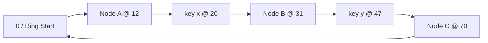

# System Design 09 · Consistent Hashing

Course Location: [[SystemDesign08 LLM Async RL Platform|08 Async LLM RL Platform]] → This Article → [[SystemDesign99 Glossary|99 High-Frequency Terms]]

> [!info] Key Takeaway
> Consistent hashing solves routing stability in dynamic clusters: when nodes are added or removed, only a small number of keys need to change their assigned nodes. It does not provide data consistency, nor does it automatically handle replication, migration, or failure recovery.

---

## Table of Contents

1. [[#I. What Problem Does It Solve]]
2. [[#II. How the Hash Ring Works]]
3. [[#III. Why Only a Small Amount of Data Moves During Scaling]]
4. [[#IV. Engineering Implementation Requires More Than Just a Ring]]
5. [[#V. Where Is It Used]]
6. [[#VI. What It Does Not Solve]]
7. [[#VII. How to Answer in an Interview]]
8. [[#VIII. Self-Test Questions]]

---

## I. What Problem Does It Solve

Suppose there are three cache servers. The most straightforward sharding method is:

```python
node_index = hash(key) % 3
```

Both queries and writes are fast, but the problem arises during scaling. After adding a fourth machine, the formula becomes:

```python
node_index = hash(key) % 4
```

The denominator has changed, so the results for a large number of keys will also change. For caches, this means widespread misses, potentially causing a surge of back-to-source traffic to the backend database; for stateful storage, it means a massive amount of data needs to be migrated.

Consistent hashing aims to control this disturbance:

```text
Small change in node set
        ↓
Minimal number of keys change ownership
```

In an ideally uniform scenario, when scaling from $N$ nodes to $N+1$ nodes, only about $1/(N+1)$ of the keys need to be moved to the new node. When a node is removed, about $1/N$ of the keys need to be handed over to other nodes.

"Consistency" here refers to the mapping from keys to nodes remaining as stable as possible before and after changes to the node set. It is not the same as the consistency found in strong consistency or eventual consistency.

## II. How the Hash Ring Works

By connecting the output space of the hash function end-to-end, it can be viewed as a ring. The system uses the same hash space for two types of entities:

```text
hash(node_id) -> Node position on the ring
hash(key)     -> Key position on the ring
```

A key is handled by the first node encountered moving clockwise. If the end of the hash space is reached without encountering a node, it wraps around to the beginning.



In this example:

```text
key x encounters Node B first clockwise, so it is assigned to B
key y encounters Node C first clockwise, so it is assigned to C
```

Actual implementations usually arrange all node positions into a sorted array. After querying `hash(key)`, a binary search is performed to find the first node position not less than the key's hash; if it exceeds the end of the array, it wraps back to index 0. If there are $V$ virtual nodes on the ring, the lookup complexity is $O(\log V)$.

```python
from bisect import bisect_left


def locate(key_hash, ring_tokens, owners):
    pos = bisect_left(ring_tokens, key_hash)
    if pos == len(ring_tokens):
        pos = 0
    return owners[pos]
```

## III. Why Only a Small Amount of Data Moves During Scaling

Suppose a new node D is inserted between A and B. Before insertion, the keys in this interval fall to B clockwise; after insertion, a small segment of these keys falls to D. Other intervals remain unchanged.

```text
Before scaling: A -------- key interval -------- B
                                               ↑ Handled by B

After scaling:  A ---- key sub-interval ---- D ---- B
                                            ↑
                                     Only this segment moves to D
```

Node removal is similar. Suppose B leaves; the interval originally belonging to B is handed over to the next node in the clockwise direction. The intervals already handled by other nodes like A and C do not need their ownership recalculated.

The difference between this and modulo sharding lies not in the hash function itself, but in the second step of the mapping:

| Method | How keys find nodes | Impact after node count changes |
|---|---|---|
| `hash(key) % N` | Modulo by node count | Denominator changes, massive mapping changes |
| Consistent Hashing | Find successor node in stable hash space | Only affects adjacent intervals |

## IV. Engineering Implementation Requires More Than Just a Ring

### 4.1 Virtual Nodes

If each physical machine only has one point on the ring, the load is often uneven. Some machines might be responsible for very long intervals, while others get very short ones. A common practice is to place multiple virtual nodes for each physical machine:

```text
Node A -> A#0, A#1, A#2, ...
Node B -> B#0, B#1, B#2, ...
```

Virtual nodes scatter the interval of a single machine to multiple positions on the ring. When machines have different capabilities, you can give larger machines more tokens or assign weights to virtual nodes.

The number of virtual nodes is not "the more, the better." More tokens usually lead to smoother distribution but increase the overhead of routing tables, membership changes, and migration planning.

### 4.2 Replication

Consistent hashing only determines the primary owner. When replicas are needed, you can search clockwise along the ring starting from the primary until you find enough distinct physical machines:

```text
key -> primary B -> replica C -> replica A
```

Production systems must also consider racks and availability zones. If three virtual nodes all belong to the same physical machine, they cannot count as three fault-independent replicas.

### 4.3 Membership Views and Migration

The client or routing layer must know which nodes are currently present, what their tokens are, and the version of this configuration. If different clients see different rings, the same key might be sent to different machines.

The ring only calculates the old and new owners. Actual scaling requires a migration protocol:

```text
Publish new member configuration
Copy affected intervals
Brief dual-read or dual-write on old and new nodes
Verify data
Switch owner
Clean up old replicas
```

If you change the routing before moving the data, reads might fail; if you move the data without incremental synchronization, you might read old versions during the switch. The system still requires versions, state machines, checksums, and rollbacks.

### 4.4 Other Alternatives

The consistent hashing ring is not the only solution:

| Method | Characteristics | Best Suited For |
|---|---|---|
| Ring + virtual nodes | Intuitive, easy to express intervals and replicas | Dynamo-style storage, client-side sharding |
| Rendezvous hashing | Scores all nodes for each key, picks the highest | Small number of nodes, simple implementation desired |
| Jump consistent hash | Almost no extra state, but buckets must be numbered sequentially | Storage scenarios where bucket count increases/decreases at the tail |
| Fixed hash slots | Keys go to fixed slots first, control plane assigns slots to nodes | Clusters where migration units are clear and easy to maintain |

Redis Cluster is a confusing example. It does not use the classic consistent hashing ring; instead, it maps keys to 16,384 fixed hash slots and then assigns those slots to nodes. It migrates slots during scaling.

## V. Where Is It Used

### 5.1 Distributed Caching

Clients choose cache nodes directly based on the key, bypassing a central proxy layer. When cache nodes are added or removed, only a portion of the keys change machines, preventing the entire cache from being invalidated.

This does not mean scaling is free. Keys migrated to new nodes are still "cold," so systems often gradually weight new nodes and limit back-to-source concurrency to avoid cache misses hitting the database simultaneously.

### 5.2 KV Storage and Object Sharding

The classic Amazon Dynamo design uses consistent hashing for partitioning and selects multiple nodes on the ring to store replicas. Similar ideas can be used for object metadata, blob sharding, and primary key KV storage.

The suitable access pattern is usually:

```text
Given a full key, find the responsible node
No requirement for range scans by key
Nodes will be added, removed, or fail
```

If the business frequently performs range scans, consistent hashing will disrupt the original key order. Range-based sharding or maintaining additional indexes is often more appropriate.

### 5.3 Request and Task Routing

Consistent hashing can also bind stable entities to specific workers:

```text
tenant_id  -> A specific service instance
session_id -> A specific stateful worker
model_id   -> A serving worker with the model loaded
stream_id  -> A specific consumer worker
```

When nodes change, most entities are still handled by the original worker, preserving local caches, connections, and model loading states. Be careful with "hot" entities here. Even if the number of keys is distributed evenly, a single super-popular tenant can overwhelm a single machine.

## VI. What It Does Not Solve

| Problem | Why Consistent Hashing Is Insufficient |
|---|---|
| Hot keys | It balances key ownership, not QPS per key |
| Data replication | It can select replica locations, but doesn't handle writes, ACKs, or re-replication |
| Strong consistency | Linearizability still requires leaders, quorums, or consensus protocols |
| Failure detection | Determining node failure and when to remove members requires separate design |
| Data migration | The ring only calculates target nodes; it doesn't automatically copy data or switch traffic |
| Range queries | Hashing destroys the original order of keys |
| Multi-key transactions | Related keys may fall on different nodes, requiring co-location strategies or distributed transactions |

If you only draw a ring in an interview, you are usually missing four things: virtual nodes, replication, membership, and migration.

## VII. How to Answer in an Interview

You can use the following as a two-minute version:

> Consistent hashing places nodes and keys in the same hash space, where a key is handled by the first node encountered clockwise. Its advantage over `hash(key) % N` is that when nodes are added or removed, it only affects adjacent intervals, so most keys do not need to change nodes. In engineering, virtual nodes are typically added to improve load distribution, supplemented by replication, membership configuration versions, failure detection, and data migration. It is suitable for distributed caching, KV sharding, and request routing that requires maintaining local state, but it does not solve hot keys, strong consistency, or replication issues on its own.

## VIII. Self-Test Questions

1. Why does `hash(key) % N` cause a large number of keys to change ownership during scaling?
2. When a ring node is added, which intervals of keys need to be migrated?
3. What problem do virtual nodes solve, and what overhead do they introduce?
4. Why can't consistent hashing guarantee strong consistency?
5. Why might a hot key overwhelm a node even when the number of keys is distributed evenly?
6. Why does Redis Cluster not belong to the classic consistent hashing ring?

## Further Reading

- David Karger et al., [Consistent Hashing and Random Trees](https://doi.org/10.1145/258533.258660), 1997.
- Giuseppe DeCandia et al., [Dynamo: Amazon's Highly Available Key-value Store](https://www.amazon.science/publications/dynamo-amazons-highly-available-key-value-store), SOSP 2007.
- John Lamping and Eric Veach, [A Fast, Minimal Memory, Consistent Hash Algorithm](https://arxiv.org/abs/1406.2294), 2014.
- Redis, [Scale with Redis Cluster](https://redis.io/docs/latest/operate/oss_and_stack/management/scaling/).
