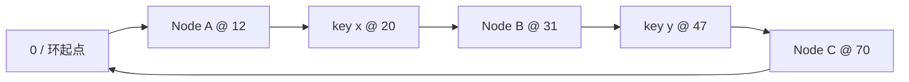
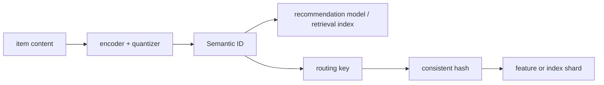

# System Design 09 · 一致性哈希

课程位置：[[SystemDesign08 LLM Async RL Platform|08 异步 LLM RL 平台]] → 本篇 → [[SystemDesign99 Glossary|99 高频术语]]

> [!info] 先记一句
> 一致性哈希解决的是动态集群里的路由稳定性：机器增加或退出时，只让少量 key 更换负责节点。它不提供数据一致性，也不会自动完成复制、迁移或故障恢复。

---

## 目录

1. [[#一、它在解决什么问题]]
2. [[#二、哈希环怎样工作]]
3. [[#三、扩容时为什么只搬少量数据]]
4. [[#四、工程实现不能只有一个环]]
5. [[#五、它用在哪里]]
6. [[#六、它没有解决什么]]
7. [[#七、和推荐系统的 Semantic ID 有什么关系]]
8. [[#八、面试时怎么回答]]
9. [[#九、自测题]]

---

## 一、它在解决什么问题

假设有三台 cache server。最直接的分片方法是：

```python
node_index = hash(key) % 3
```

查询和写入都很快，问题出在扩容。增加第四台机器后，公式变成：

```python
node_index = hash(key) % 4
```

分母变了，大量 key 的结果也会变。对于缓存，这意味着大面积 miss，后端数据库可能突然吃到一波回源流量；对于有状态存储，则意味着大量数据需要搬迁。

一致性哈希要控制的是这次扰动：

```text
节点集合小幅变化
        ↓
尽量少的 key 改变归属
```

在理想均匀的情况下，从 $N$ 个节点扩到 $N+1$ 个节点，大约只有 $1/(N+1)$ 的 key 需要移动到新节点。删除一个节点时，大约有 $1/N$ 的 key 需要交给其他节点。

这里的"一致性"指节点集合变化前后，key 到节点的映射尽量保持稳定。它不是 strong consistency、eventual consistency 里的 consistency。

## 二、哈希环怎样工作

把哈希函数的输出空间首尾相接，可以把它看成一个环。系统用同一个哈希空间放两类东西：

```text
hash(node_id) -> 节点在环上的位置
hash(key)     -> key 在环上的位置
```

一个 key 由顺时针遇到的第一个节点负责。如果走到哈希空间末尾还没有遇到节点，就绕回起点。



在这个例子里：

```text
key x 顺时针先遇到 Node B，所以交给 B
key y 顺时针先遇到 Node C，所以交给 C
```

实际实现通常把所有节点位置排成有序数组。查询 `hash(key)` 后做一次二分搜索，找到第一个不小于它的节点位置；越过数组末尾时回到下标 0。若环上共有 $V$ 个虚拟节点，查找复杂度是 $O(\log V)$。

```python
from bisect import bisect_left


def locate(key_hash, ring_tokens, owners):
    pos = bisect_left(ring_tokens, key_hash)
    if pos == len(ring_tokens):
        pos = 0
    return owners[pos]
```

## 三、扩容时为什么只搬少量数据

假设新节点 D 插入 A 和 B 之间。插入前，这段区间里的 key 顺时针落到 B；插入后，其中一小段改为落到 D。其他区间没有变化。

```text
扩容前：A -------- key 区间 -------- B
                                   ↑ 由 B 负责

扩容后：A ---- key 子区间 ---- D ---- B
                            ↑
                     只有这一段改归 D
```

节点退出也类似。假设 B 离开，原本属于 B 的区间交给它顺时针方向的下一个节点。A、C 等其他节点已经负责的区间不需要重新计算归属。

这和取模分片的差别不在哈希函数本身，而在映射的第二步：

| 方法 | key 怎样找到节点 | 节点数量变化后的影响 |
|---|---|---|
| `hash(key) % N` | 直接用节点数量取模 | 分母变化，大量映射改变 |
| 一致性哈希 | 在稳定哈希空间中找后继节点 | 只影响相邻区间 |

## 四、工程实现不能只有一个环

### 4.1 虚拟节点

每台物理机只在环上放一个点，负载往往不均匀。有的机器负责很长的区间，有的只分到很短的一段。常见做法是给每台物理机放多个虚拟节点：

```text
Node A -> A#0, A#1, A#2, ...
Node B -> B#0, B#1, B#2, ...
```

虚拟节点把一台机器的区间打散到环上多个位置。机器能力不同时，可以让大机器拥有更多 token，或者给虚拟节点设置权重。

虚拟节点数量也不是越多越好。更多 token 通常让分布更平滑，但会增加路由表、成员变更和迁移计划的开销。

### 4.2 复制

一致性哈希只决定 primary owner。需要副本时，可以从 primary 开始沿环顺时针寻找后续节点，直到找到足够多的不同物理机：

```text
key -> primary B -> replica C -> replica A
```

生产系统还要考虑机架和可用区。三个虚拟节点如果都属于同一台物理机，不能算三个故障独立的副本。

### 4.3 成员视图和迁移

客户端或路由层必须知道当前有哪些节点、它们的 token 是什么，以及这份配置的版本。如果不同客户端看到不同的环，同一个 key 可能被送到不同机器。

环只算出新旧 owner。真正扩容时还需要一套迁移协议：

```text
发布新成员配置
复制受影响区间
新旧节点短暂双读或双写
校验数据
切换 owner
清理旧副本
```

先改路由再搬数据，读取可能找不到；先搬数据但没有增量同步，切换时又可能读到旧版本。系统仍然需要版本、状态机、校验和回滚。

### 4.4 其他选择

一致性哈希环不是唯一方案：

| 方法 | 特点 | 更适合什么情况 |
|---|---|---|
| Ring + virtual nodes | 直观，容易表达区间和副本 | Dynamo 风格存储、客户端分片 |
| Rendezvous hashing | 对每个 key 给所有节点打分，选最高分 | 节点数不大，希望实现简单 |
| Jump consistent hash | 几乎不存额外状态，但 bucket 要连续编号 | bucket 数按尾部递增或减少的存储场景 |
| Fixed hash slots | key 先到固定 slot，再由控制面把 slot 分给节点 | 希望迁移单位明确、易于运维的集群 |

Redis Cluster 是一个容易混淆的例子。它不用经典一致性哈希环，而是把 key 映射到固定的 16384 个 hash slot，再把 slot 分配给节点。扩容时迁移 slot。

## 五、它用在哪里

### 5.1 分布式缓存

客户端根据 key 直接选择 cache node，可以少经过一层中心代理。增加或移除 cache node 时，只有部分 key 换机器，缓存不会整体失效。

这不等于扩容没有代价。迁移到新节点的 key 仍然是冷的，系统常给新节点逐步加权，并限制回源并发，避免 cache miss 同时打到数据库。

### 5.2 KV 存储和对象分片

Amazon Dynamo 的经典设计使用一致性哈希做 partitioning，并在环上选择多个节点保存副本。类似思路也可以用于对象元数据、blob 分片和主键 KV 存储。

适合的访问模式通常是：

```text
给定完整 key，找到负责节点
不要求按 key 范围扫描
节点会增加、退出或故障
```

如果业务经常做 range scan，一致性哈希会打乱原始 key 顺序。按范围分片或维护额外索引往往更合适。

### 5.3 请求和任务路由

一致性哈希也能把稳定实体绑定到某个 worker：

```text
tenant_id  -> 某个服务实例
session_id -> 某个 stateful worker
model_id   -> 已加载该模型的 serving worker
stream_id  -> 某个消费 worker
```

节点变化时，大多数实体仍由原 worker 处理，可以保留本地 cache、连接和模型加载状态。这里要小心热点实体。即使 key 数量分得均匀，一个超级热门 tenant 也可能压垮单机。

## 六、它没有解决什么

| 问题 | 为什么一致性哈希不够 |
|---|---|
| 热 key | 它均衡的是 key 的归属，不保证每个 key 的 QPS 相同 |
| 数据复制 | 它能选择副本位置，但不负责写入、确认和补副本 |
| 强一致读写 | 线性一致性仍需要 leader、quorum 或共识协议 |
| 故障检测 | 谁判断节点失效、何时移出成员列表，需要单独设计 |
| 数据迁移 | 环只计算目标节点，不会自动复制数据和切换流量 |
| 范围查询 | 哈希会破坏原始 key 的顺序 |
| 多 key 事务 | 相关 key 可能落在不同节点，需要共置策略或分布式事务 |

面试中如果只画一个环就结束，通常还差四件事：virtual nodes、replication、membership 和 migration。

## 七、和推荐系统的 Semantic ID 有什么关系

名字很像，问题不一样。两者没有直接的算法继承关系，但可以出现在同一条推荐链路中。它们都把一个对象映射到另一个空间，优化目标不同。

### 7.1 Semantic ID 在做什么

传统推荐常给每个 item 一个任意整数 ID。Semantic ID 则先从文本、图片或交互信息得到 embedding，再把连续向量量化为一串离散 code：

```text
item content
    -> encoder
    -> embedding
    -> vector quantizer / RQ-VAE
    -> Semantic ID = (c1, c2, c3, ...)
```

语义接近的 item 可能共享前缀或部分 code。像 TIGER 这样的生成式推荐模型，会把用户历史表示成 Semantic ID 序列，再自回归生成下一个 item 的 Semantic ID。

### 7.2 两者的目标不同

| 维度 | 一致性哈希 | Semantic ID |
|---|---|---|
| 输入 | cache key、user ID、item ID、tenant ID | item embedding 或多模态表示 |
| 输出 | 负责请求或数据的物理节点 | 有语义结构的离散 code 序列 |
| 希望相近对象靠近吗 | 通常不希望，哈希应尽量均匀打散 | 通常希望，语义相近 item 可共享 code 或前缀 |
| 节点扩缩容时要稳定吗 | 是，目标是少迁移 | 不是它的主要问题 |
| 主要用途 | 基础设施路由与分片 | 推荐模型的 item 表示和生成目标 |

因此，不应该说 Semantic ID 是一致性哈希，也不应该用普通 hash 直接生成 Semantic ID。普通 hash 会刻意打散相似 item，恰好破坏 Semantic ID 想保留的结构。

### 7.3 它们可以怎样配合

可以把 Semantic ID 当作逻辑层标识，再用一致性哈希决定物理存储位置：



这两层不要混成一个问题：

```text
Semantic ID 回答：这个 item 在模型的离散语义空间里叫什么？
一致性哈希回答：保存或处理这个 item 的机器是哪台？
```

是否对完整 Semantic ID 做 hash，要看访问模式。

如果主要按完整 ID 点查，希望各 shard 负载均匀，可以 hash 完整 ID。代价是语义相近的 item 会被打散。

如果查询依赖 Semantic ID 前缀，例如同一粗粒度语义簇需要放在一起，就不能直接 hash 整串 ID。常见思路是先按前缀路由到逻辑 semantic partition，再在 partition 内用一致性哈希分配副本或 worker：

```text
(c1, c2)          -> semantic partition
(c1, c2, item_id) -> partition 内的物理分片
```

这种设计保留了语义局部性，但也会引入数据倾斜。热门语义簇可能远大于其他簇，需要拆分热 partition、复制热门数据，或者在逻辑 partition 和物理节点之间加一层可调整的映射表。

## 八、面试时怎么回答

可以用下面这段作为两分钟版本：

> 一致性哈希把节点和 key 放到同一个哈希空间，key 由顺时针的第一个节点负责。它相对 `hash(key) % N` 的优势是节点增加或退出时只影响相邻区间，因此大多数 key 不用换节点。工程上通常要加入虚拟节点改善负载分布，再补上副本、成员配置版本、故障检测和数据迁移。它适合分布式缓存、KV 分片以及需要保持本地状态的请求路由，但不能单独解决热 key、强一致性和复制问题。Semantic ID 属于推荐模型的表示层，它保留语义结构；一致性哈希属于基础设施路由层，它追求均匀分散和扩缩容稳定。两者可以串起来使用，但不是同一种 ID。

## 九、自测题

1. 为什么 `hash(key) % N` 在扩容时会让大量 key 改变归属？
2. 增加一个环节点时，哪些区间的 key 需要迁移？
3. 虚拟节点解决了什么问题，又增加了什么开销？
4. 为什么一致性哈希不能保证 strong consistency？
5. 热 key 为什么可能在 key 数量均匀时仍然压垮一个节点？
6. Redis Cluster 为什么不属于经典的一致性哈希环？
7. 为什么直接 hash Semantic ID 会破坏语义局部性？
8. 什么访问模式适合先按 Semantic ID 前缀分区，再做物理分片？

## 延伸阅读

- David Karger et al., [Consistent Hashing and Random Trees](https://doi.org/10.1145/258533.258660), 1997.
- Giuseppe DeCandia et al., [Dynamo: Amazon's Highly Available Key-value Store](https://www.amazon.science/publications/dynamo-amazons-highly-available-key-value-store), SOSP 2007.
- John Lamping and Eric Veach, [A Fast, Minimal Memory, Consistent Hash Algorithm](https://arxiv.org/abs/1406.2294), 2014.
- Redis, [Scale with Redis Cluster](https://redis.io/docs/latest/operate/oss_and_stack/management/scaling/).
- Shashank Rajput et al., [Recommender Systems with Generative Retrieval](https://papers.neurips.cc/paper_files/paper/2023/file/20dcab0f14046a5c6b02b61da9f13229-Paper-Conference.pdf), NeurIPS 2023.
