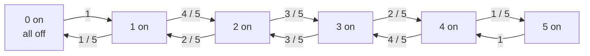

# Quant · Markov Chains：状态、期望时间与 Five Light Bulbs

Markov 题的核心是把随机过程压成有限个状态。只要下一步的分布只依赖当前状态，而不依赖更早的历史，就可以用 Markov chain 建模。

这类题常见于 quant / probability interview：

```text
当前状态是什么？
从当前状态到下一个状态的概率是多少？
要求的是 hitting time、return time，还是长期占比？
能不能用 first-step analysis 写方程？
有没有 stationary distribution 的捷径？
```

## 目录

1. [Markov Chain 基本概念](#markov-chain-基本概念)
2. [First-Step Analysis](#first-step-analysis)
3. [Stationary Distribution 和 Return Time](#stationary-distribution-和-return-time)
4. [例题一：Two-State Weather](#例题一two-state-weather)
5. [例题二：Gambler's Ruin](#例题二gamblers-ruin)
6. [例题三：Five Light Bulbs](#例题三five-light-bulbs)
7. [Five Light Bulbs 解法一：状态压缩 + 方程](#five-light-bulbs-解法一状态压缩--方程)
8. [Five Light Bulbs 解法二：Stationary Return Time](#five-light-bulbs-解法二stationary-return-time)
9. [常见坑](#常见坑)
10. [一句话记忆](#一句话记忆)

---

## Markov Chain 基本概念

一个离散时间 Markov chain 由两部分组成：

```text
state space: 所有可能状态
transition probability: 每一步从状态 i 到状态 j 的概率
```

Markov property 是：

$$
P(X_{t+1}=j \mid X_t=i, X_{t-1}, \ldots, X_0)
= P(X_{t+1}=j \mid X_t=i)
$$

也就是说，下一步只看当前状态。

如果状态有限，可以把转移概率写成矩阵：

$$
P_{ij} = P(X_{t+1}=j \mid X_t=i)
$$

例子：天气只有 Sunny / Rainy 两个状态。

```text
Sunny -> Sunny: 0.8
Sunny -> Rainy: 0.2
Rainy -> Sunny: 0.4
Rainy -> Rainy: 0.6
```

转移矩阵是：

$$
P =
\begin{bmatrix}
0.8 & 0.2 \\
0.4 & 0.6
\end{bmatrix}
$$

---

## First-Step Analysis

求期望时间时，最常用的工具是 first-step analysis。

设：

```text
E_i = 从状态 i 出发，到达目标状态所需的期望步数
```

如果 `i` 已经是目标状态：

$$
E_i = 0
$$

否则先走一步，消耗 1 秒，再根据下一步落到哪里继续：

$$
E_i = 1 + \sum_j P_{ij} E_j
$$

这个式子是 Markov 期望题的主力模板。

它的直觉很简单：

```text
总时间 = 先走一步 + 下一状态的剩余期望时间
```

---

## Stationary Distribution 和 Return Time

stationary distribution 是一个长期稳定分布 $\pi$，满足：

$$
\pi P = \pi,\qquad \sum_i \pi_i = 1
$$

如果链是有限、不可约、正常返回的，那么从状态 `i` 出发，第一次回到 `i` 的期望时间是：

$$
\mathbb{E}_i[T_i^+] = \frac{1}{\pi_i}
$$

这个公式叫 mean recurrence time。

它的含义是：

```text
长期看，系统有 pi_i 的时间待在状态 i。
所以状态 i 平均每 1 / pi_i 步出现一次。
```

这不是所有题都能直接用，但遇到“回到起点状态的期望时间”时非常有力。

---

## 例题一：Two-State Weather

题目：

```text
天气状态为 Sunny / Rainy。
Sunny 明天仍 Sunny 的概率是 0.8。
Rainy 明天变 Sunny 的概率是 0.4。
从 Sunny 出发，期望多少天后第一次下雨？
```

状态只需要两个：

```text
S = Sunny
R = Rainy
```

目标是第一次到达 `R`。

设：

```text
E_S = 从 Sunny 出发到 Rainy 的期望天数
E_R = 0
```

从 Sunny 出发：

$$
E_S = 1 + 0.8E_S + 0.2E_R
$$

因为 `E_R = 0`：

$$
E_S = 1 + 0.8E_S
$$

所以：

$$
0.2E_S = 1,\qquad E_S = 5
$$

答案是 `5` 天。

这个例子对应几何分布：每天有 `0.2` 概率第一次变雨，期望等待时间是 `1 / 0.2 = 5`。

---

## 例题二：Gambler's Ruin

题目：

```text
赌徒当前有 i 块钱。
每轮以概率 p 赢 1 块，以概率 q = 1 - p 输 1 块。
到达 0 或 N 时游戏结束。
求从 i 出发，最终到达 N 的概率。
```

设：

```text
h_i = 从 i 出发最终到达 N 的概率
```

边界条件：

$$
h_0 = 0,\qquad h_N = 1
$$

中间状态满足：

$$
h_i = p h_{i+1} + q h_{i-1}
$$

当 `p = q = 1/2` 时，解是线性的：

$$
h_i = \frac{i}{N}
$$

这个例子展示了 Markov chain 的第二种常见写法：不是求期望时间，而是求 hitting probability。模板仍然一样：

```text
当前状态的答案 = 下一状态答案的加权平均
```

---

## 例题三：Five Light Bulbs

题目：

```text
Five light bulbs are initially all off.
Every second, one bulb is chosen uniformly at random and flipped.
If it is on, it turns off; if it is off, it turns on.

What is the expected time until all five bulbs are off again?
```

初始时 5 个灯泡全灭。题目问“再次全灭”，所以时间不能是 0；必须至少翻一次灯泡之后再回到全灭状态。

### 状态压缩

不需要记录具体哪几个灯亮，只需要记录亮着的灯泡数量。

设状态：

```text
k = 当前亮着的灯泡数量
```

那么 `k` 的取值是：

```text
0, 1, 2, 3, 4, 5
```

如果当前有 `k` 个灯亮：

- 选到亮灯的概率是 `k / 5`，翻转后亮灯数变成 `k - 1`
- 选到灭灯的概率是 `(5 - k) / 5`，翻转后亮灯数变成 `k + 1`

所以这是一个 birth-death Markov chain：



从 `0` 出发，第一秒一定会翻亮一个灯：

```text
0 -> 1
```

因此答案是：

$$
1 + E_1
$$

其中 `E_k` 表示从 `k` 个灯亮出发，第一次到达 `0` 的期望时间。

---

## Five Light Bulbs 解法一：状态压缩 + 方程

边界条件：

$$
E_0 = 0
$$

对 `1 <= k <= 4`：

$$
E_k
= 1 + \frac{k}{5}E_{k-1} + \frac{5-k}{5}E_{k+1}
$$

对 `k = 5`：

$$
E_5 = 1 + E_4
$$

因为 5 个灯全亮时，下一次无论选哪个灯，都会变成 4 个灯亮。

把方程写出来：

$$
\begin{aligned}
E_1 &= 1 + \frac{1}{5}E_0 + \frac{4}{5}E_2 \\
E_2 &= 1 + \frac{2}{5}E_1 + \frac{3}{5}E_3 \\
E_3 &= 1 + \frac{3}{5}E_2 + \frac{2}{5}E_4 \\
E_4 &= 1 + \frac{4}{5}E_3 + \frac{1}{5}E_5 \\
E_5 &= 1 + E_4
\end{aligned}
$$

加上 `E_0 = 0`，解得：

```text
E_1 = 31
E_2 = 37.5
E_3 = 38.75
E_4 = 37.5
E_5 = 38.5
```

题目从全灭开始，但第一秒一定到 `1`：

$$
\mathbb{E}[\text{return to all off}]
= 1 + E_1
= 32
$$

答案：

```text
32 seconds
```

### 手算检查

从第一个方程：

$$
E_1 = 1 + \frac{4}{5}E_2
$$

如果 `E_2 = 37.5`：

$$
E_1 = 1 + 30 = 31
$$

再加上初始第一步：

$$
1 + E_1 = 32
$$

---

## Five Light Bulbs 解法二：Stationary Return Time

这题还有一个非常快的解法。

完整状态不是 `k = 0..5`，而是每个灯泡的开关配置：

```text
00000, 00001, 00010, ..., 11111
```

一共有：

$$
2^5 = 32
$$

个配置。

每一步选择一个 bit 翻转，所以状态图是 5 维 hypercube。这个随机游走是对称的，因此 stationary distribution 是均匀分布：

$$
\pi(x) = \frac{1}{32}
$$

全灭状态 `00000` 的 stationary probability 是：

$$
\pi(00000) = \frac{1}{32}
$$

根据 mean recurrence time：

$$
\mathbb{E}_{00000}[T_{00000}^+]
= \frac{1}{\pi(00000)}
= 32
$$

答案仍然是：

```text
32 seconds
```

这个解法的关键是把“再次全灭”理解成从 `00000` 出发的第一次正返回时间，而不是 hitting time 从别的状态到 `00000`。

---

## 常见坑

### 1. 把答案说成 0

初始时确实已经全灭，但题目问 all five bulbs are off again。这里的 return time 是：

```text
T_0^+ = min{t >= 1 : X_t = 0}
```

所以不能回答 0。

### 2. 直接用几何分布 `p = 1/32`

每一秒处在全灭状态的长期比例是 `1/32`，但每个时刻的事件并不是独立 Bernoulli trial。

这题能得到 32，是因为 Markov chain 的 return time theorem，不是因为每秒独立地以 `1/32` 概率全灭。

### 3. 只看亮灯数量时忘了第一步

在压缩链里，`E_1 = 31` 是从一个灯亮开始回到全灭的期望时间。

题目从全灭开始，第一步一定变成一个灯亮，所以总时间是：

```text
1 + E_1 = 32
```

### 4. 状态压缩要检查 Markov 性

这里可以只记录亮灯数量，因为下一步转移概率只由 `k` 决定：

```text
P(k -> k - 1) = k / 5
P(k -> k + 1) = (5 - k) / 5
```

如果下一步概率还依赖具体哪几个灯亮，就不能只用 `k` 压缩。

---

## 一句话记忆

```text
Markov 期望时间 = first-step equation。
回到起点的期望时间 = 1 / stationary probability。
Five Light Bulbs 的全状态有 2^5 = 32 个且均匀，
所以全灭状态的平均返回时间是 32 秒。
```
