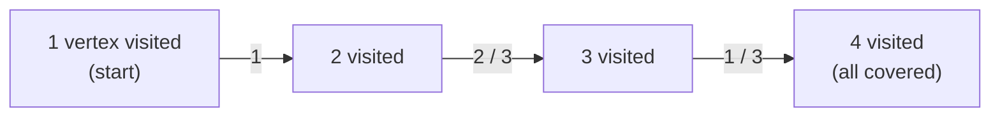
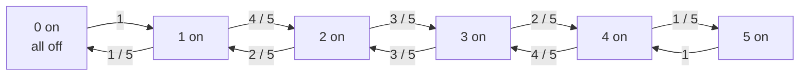

# Quant 2 · Markov Chains: State Compression and Expected Time

The core of a Markov problem is compressing a random process into a finite set of states. If the distribution of the next step depends only on the current state and not on earlier history, the process can be modeled as a Markov chain.

These problems often appear in quant and probability interviews:

```text
What is the current state?
What is the probability of moving from the current state to each next state?
Are we looking for a hitting time, return time, or long-run proportion?
Can we write equations using first-step analysis?
Is there a shortcut using the stationary distribution?
```

The representative problem in this note asks for the expected time until five randomly toggled light bulbs first return to the all-off state. It demonstrates two solutions:

```text
first-step equations:
  Write an expectation equation for each state.

stationary return time:
  First find the long-run distribution, then use return time = 1 / pi_i.
```

## Contents

1. [Markov chain basics](#markov-chain-basics)
2. [The Chapman-Kolmogorov equation](#the-chapman-kolmogorov-equation)
3. [State augmentation: building a Markov chain from a non-Markov process](#state-augmentation-building-a-markov-chain-from-a-non-markov-process)
4. [Lumpability: compressing a Markov chain into a coarser Markov chain](#lumpability-compressing-a-markov-chain-into-a-coarser-markov-chain)
5. [First-step analysis](#first-step-analysis)
6. [Absorbing states: absorption probability and expected time to absorption](#absorbing-states-absorption-probability-and-expected-time-to-absorption)
7. [Stationary distribution: steady-state behavior, first passage, and return time](#stationary-distribution-steady-state-behavior-first-passage-and-return-time)
8. [Example 1: Two-state weather](#example-1-two-state-weather)
9. [Example 2: Gambler's ruin](#example-2-gamblers-ruin)
10. [Random walks: common properties and simple examples](#random-walks-common-properties-and-simple-examples)
11. [Example 3: Five-light-bulb toggling](#example-3-five-light-bulb-toggling)
12. [Five-light-bulb solution 1: State compression and equations](#five-light-bulb-solution-1-state-compression-and-equations)
13. [Five-light-bulb solution 2: Stationary return time](#five-light-bulb-solution-2-stationary-return-time)
14. [Common pitfalls](#common-pitfalls)
15. [One-sentence summary](#one-sentence-summary)

---

## Markov chain basics

A discrete-time Markov chain consists of two parts:

```text
state space: all possible states
transition probability: the probability of moving from state i to state j in one step
```

The Markov property is:

$$
P(X_{t+1}=j \mid X_t=i, X_{t-1}, \ldots, X_0)
= P(X_{t+1}=j \mid X_t=i)
$$

In other words, the next step depends only on the current state.

For a finite state space, the transition probabilities can be written as a matrix:

$$
P_{ij} = P(X_{t+1}=j \mid X_t=i)
$$

Example: the weather has only two states, Sunny and Rainy.

```text
Sunny -> Sunny: 0.8
Sunny -> Rainy: 0.2
Rainy -> Sunny: 0.4
Rainy -> Rainy: 0.6
```

The transition matrix is:

$$
P =
\begin{bmatrix}
0.8 & 0.2 \\
0.4 & 0.6
\end{bmatrix}
$$

---

## The Chapman-Kolmogorov equation

The one-step transition probability is $P_{ij}$, but many problems need the probability of landing in some state after `n` steps:

$$
P_{ij}^{(n)} = P(X_{t+n} = j \mid X_t = i)
$$

The Chapman-Kolmogorov equation splits the `n`-step transition probability into two legs: take `m` steps to some intermediate state `k`, then take the remaining `n - m` steps from `k`:

$$
P_{ij}^{(m+n)} = \sum_k P_{ik}^{(m)} P_{kj}^{(n)}
$$

The derivation needs only the law of total probability plus one use of the Markov property:

$$
\begin{aligned}
P_{ij}^{(m+n)}
&= P(X_{t+m+n}=j \mid X_t=i) \\
&= \sum_k P(X_{t+m}=k,\, X_{t+m+n}=j \mid X_t=i) \\
&= \sum_k P(X_{t+m}=k \mid X_t=i)\, P(X_{t+m+n}=j \mid X_{t+m}=k,\, X_t=i) \\
&= \sum_k P(X_{t+m}=k \mid X_t=i)\, P(X_{t+m+n}=j \mid X_{t+m}=k) \\
&= \sum_k P_{ik}^{(m)} P_{kj}^{(n)}
\end{aligned}
$$

The third step expands over the intermediate state `k` using the law of total probability. The fourth step is where the Markov property does the work: once $X_{t+m}=k$ is known, the distribution of $X_{t+m+n}$ no longer depends on the earlier $X_t$.

In matrix form:

$$
P^{(m+n)} = P^{(m)} P^{(n)}
$$

Since $P^{(1)} = P$, applying this repeatedly gives: the `n`-step transition matrix is the `n`-th power of the transition matrix:

$$
P^{(n)} = P^n
$$

Verify this with the Sunny / Rainy transition matrix from above. The two-step transition matrix:

$$
P^2 =
\begin{bmatrix}
0.8 & 0.2 \\
0.4 & 0.6
\end{bmatrix}^2
=
\begin{bmatrix}
0.72 & 0.28 \\
0.56 & 0.44
\end{bmatrix}
$$

The three-step transition matrix can be computed directly as $P^3 = P \cdot P \cdot P$, or split via the Chapman-Kolmogorov equation into `1 + 2` steps:

$$
P^{(3)} = P^{(1)} P^{(2)} = P \cdot P^2
$$

Working out just the entry for staying Sunny after three steps:

$$
P_{SS}^{(3)} = P_{SS}^{(1)} P_{SS}^{(2)} + P_{SR}^{(1)} P_{RS}^{(2)} = 0.8 \times 0.72 + 0.2 \times 0.56 = 0.688
$$

Both routes give the same matrix:

$$
P^3 =
\begin{bmatrix}
0.688 & 0.312 \\
0.624 & 0.376
\end{bmatrix}
$$

```text
What the Chapman-Kolmogorov equation does:
Splits an m+n-step problem into "m steps, then n steps,"
summing over the intermediate state in between.
The matrix form is the easiest to remember:
the n-step transition matrix is the transition matrix raised to the n-th power.
```

---

## State augmentation: building a Markov chain from a non-Markov process

If the distribution of the next step depends not only on the current state but also on the state one step further back (or earlier still), the process does not satisfy the Markov property on the original state space. But as long as "how many past steps the future depends on" is finite and fixed, the state can be redefined as a combination of the most recent few steps, restoring the Markov property on the new state space.

The general principle: if the distribution of $Y_{t+1}$ depends on both $Y_t$ and $Y_{t-1}$, define a new state $X_t = (Y_{t-1}, Y_t)$. Since the distribution of $X_{t+1} = (Y_t, Y_{t+1})$ is determined entirely by $X_t = (Y_{t-1}, Y_t)$, with no need to look further back, $\{X_t\}$ is a first-order Markov chain on the new state space.

### An example that fails the Markov property

Suppose there are three cities, A, B, and C, and the next city depends not only on the current city but also on the previous one:

```text
Coming from A to B, the probability of going to C next is 0.5
Coming from C to B, the probability of going to C next is 0.3
```

In both "A to B" and "C to B," the current city is B, but the probability of going to C next differs (0.5 versus 0.3). If the state is just "current city," the next step's distribution still depends on the previous city, so the Markov property fails.

### State augmentation: redefining the state as an ordered pair

Redefine the state as the ordered pair "(previous city, current city)." The new state space is:

$$
\{AA, AB, AC, BA, BB, BC, CA, CB, CC\}
$$

where state $AB$ means "the previous city was A and the current city is B." The full transition rule needs to be specified: for every (previous city, current city) combination, the distribution of the next city.

| Previous, current | Next = A | Next = B | Next = C |
|---|---|---|---|
| A, A | 0.5 | 0.3 | 0.2 |
| A, B | 0.1 | 0.4 | 0.5 |
| A, C | 0.3 | 0.3 | 0.4 |
| B, A | 0.4 | 0.4 | 0.2 |
| B, B | 0.2 | 0.5 | 0.3 |
| B, C | 0.3 | 0.2 | 0.5 |
| C, A | 0.5 | 0.2 | 0.3 |
| C, B | 0.2 | 0.5 | 0.3 |
| C, C | 0.3 | 0.3 | 0.4 |

Each row sums to 1, so this is a valid table of conditional distributions.

On the new state space, the transition rule is: if the current state is $XY$ (previous city X, current city Y), the next city Z is drawn from the distribution in row (X, Y) of the table above, and the new state becomes $YZ$. For example, from state $AB$, if the next city is C, the new state is $BC$; this transition depends only on the current state $AB$, with no need to look further back, so the Markov property holds again on the new state space.

The new state space has 9 states, but from any given state, at most 3 next states are reachable: from $XY$, the only reachable states are $YA$, $YB$, and $YC$, since the new state's first character must equal the old state's second character. The transition matrix is sparse, which is a general feature of state augmentation: the augmented state space grows, but the number of outgoing edges per state does not.

### Verifying with one concrete calculation

Starting from state $AB$ (previous city A, current city B), what is the probability of landing in state $CC$ (the last two cities both C) after two more steps?

The first step, from $(A,B)$, goes to C with probability 0.5 (row A, B in the table); after this step the state becomes $BC$. The second step, from $(B,C)$, goes to C with probability 0.5 (row B, C in the table). Both steps must land exactly on "go to C" to reach state $CC$:

$$
P(X_2 = CC \mid X_0 = AB) = 0.5 \times 0.5 = 0.25
$$

This result can also be verified using the Chapman-Kolmogorov equation from the previous section, applied to the $9 \times 9$ transition matrix over the augmented state space: fill in the $9 \times 9$ transition matrix following the rule above, then compute the entry of its square at position $(AB, CC)$, which is again 0.25.

```text
Signal that a state fails the Markov property:
Under the same "current state," the transition probabilities differ
because of earlier history.

Fix:
Redefine the state as a combination of the most recent k steps.
As long as k is finite and fixed, the Markov property holds again
on the new state space, at the cost of the state count growing from
|S| to at most |S|^k.
```

---

## Lumpability: compressing a Markov chain into a coarser Markov chain

The previous section made the state space **bigger** to restore the Markov property. This section covers the opposite move: under the right condition, the state space doesn't need to grow at all; it can be **compressed** into coarser equivalence classes, and the compressed process is still a valid Markov chain. This condition is called **lumpability**, first given by Kemeny and Snell.

### The criterion: when states can be merged

Partition the original state space $S$ into disjoint equivalence classes $A_1, A_2, \ldots, A_k$. If for **any** two states $x, y$ in the same class $A_j$, their total transition probability into another class $A_l$ is equal:

$$
\sum_{z \in A_l} P(x, z) = \sum_{z \in A_l} P(y, z) \qquad \text{for all } j, l
$$

then tracking only "which class am I currently in" produces a process that is itself a Markov chain, with transition probabilities equal to that common value. Intuitively: if every detailed state within a class has exactly the same distribution over "which class comes next," then "which specific state within the class" is redundant information and can be discarded.

### Example: a random walk on a tetrahedron (the complete graph $K_4$)

**Problem**: An ant does a random walk on the 4 vertices of a regular tetrahedron: at each step it moves to one of the other 3 vertices, chosen uniformly. Starting from some vertex, what is the expected number of steps to visit all 4 vertices?

The tetrahedron's graph has a key structural fact: all 4 vertices are pairwise adjacent ($\binom{4}{2}=6$ edges, exactly the tetrahedron's 6 edges), so the graph is the complete graph $K_4$. This "every pair of vertices is adjacent" symmetry is the entire reason the state space can be drastically compressed later.

**Why the naive state definition is unwieldy**: if you define the state honestly as "current vertex + which subset has been visited," the state count is on the order of $4 \times 2^4$, and the probability of "stepping onto a new vertex" seems to depend on both "where you are now" and "exactly which vertices you've visited."

**Compressing with lumpability**: let $i$ be "the number of distinct vertices visited so far" (including the current one). Because the graph is complete, no matter which vertex you're currently standing on, it is adjacent to all 3 other vertices, so among the 3 next-step options, exactly $(i-1)$ are "other already-visited vertices" and $(4-i)$ are "never-visited new vertices." These two counts always sum to 3, and neither depends on exactly which vertices were visited or where you currently stand. In other words, every detailed state within the equivalence class "$i$ vertices visited" (regardless of which ones, regardless of current position) has exactly the same probability $(4-i)/3$ of transitioning to "$i+1$ vertices visited," and probability 0 of transitioning to any other class: this satisfies the Kemeny–Snell criterion above, so the merge is valid.

The compressed chain has only 4 states ($i=1,2,3,4$), a birth-death chain:


```mermaid
flowchart LR
  S1["1 vertex visited<br/>(start)"] -->|"1"| S2["2 visited"]
  S2 -->|"2 / 3"| S3["3 visited"]
  S3 -->|"1 / 3"| S4["4 visited<br/>(all covered)"]
```

Starting from $i=1$, the very first step is guaranteed to hit a new vertex (every one of the other 3 is unvisited), so $P(1\to2)=1$; $P(2\to3)=2/3$; $P(3\to4)=1/3$. Let $T_i$ be the number of steps to go from "$i$ visited" to "$i+1$ visited"; it's geometric with success probability $(4-i)/3$, so $\mathbb E[T_i] = 3/(4-i)$:

$$
\mathbb E[T] = \sum_{i=1}^{3} \frac{3}{4-i} = \frac{3}{3} + \frac{3}{2} + \frac{3}{1} = 1 + 1.5 + 3 = 5.5
$$

It takes an expected **5.5 steps** to visit all 4 vertices of the tetrahedron.

### The connection to the Coupon Collector Problem

If you've seen the Coupon Collector Problem before (there are $n$ types of coupons, each draw is uniform over all types, and the question is the expected number of draws to collect every type; the answer is $n H_n = n\sum_{k=1}^n \frac1k$), you'll notice "$i$ vertices visited so far" is exactly the same state definition as "$i$ types collected so far" in the coupon problem, and the reason both compress the same way is identical: every step is a uniform draw over the full set of candidates, so *which* ones you've collected doesn't matter, only *how many*.

Matching them up precisely: the tetrahedron's first step is guaranteed to hit a new vertex (the starting vertex itself is already counted in $i=1$), so from the second step onward the remaining process is exactly a coupon-collector problem with $n=3$ remaining types, with expected steps $3 H_3 = 3(1+\tfrac12+\tfrac13) = 3\times\tfrac{11}{6} = 5.5$, matching the direct sum above exactly. In general, a random walk on the complete graph $K_n$ has expected cover time:

$$
\mathbb E[T_{K_n}] = (n-1) H_{n-1}
$$

When you see "random walk on a graph, expected time to cover all vertices," first check whether the graph is complete (or whether any two unvisited vertices are dynamically equivalent). If so, you can usually just apply the coupon-collector result directly, without re-deriving it.

### Counterexample: why the same state definition fails on a cube

Compare this to a cube ($Q_3$, 8 vertices, each of degree 3) to see exactly how much is riding on "complete graph." The cube is not a complete graph: each vertex is adjacent to only 3 neighbors, and is not directly adjacent to the 3 vertices at distance 2 or the 1 antipodal vertex at distance 3. "Distance" has real structure on this graph, unlike $K_4$ where every pair of vertices is on equal footing.

This means "number of distinct vertices visited" is **not** lumpable on the cube: standing at the same vertex, having visited the same number of vertices, whether the next step hits a new vertex depends on the specific path taken (e.g., whether the 3 already-visited vertices happen to be neighbors of the current vertex); it's not something the visit count alone can summarize.

But there is another quantity on the cube that *is* lumpable: the current vertex's **graph distance from the starting vertex**, $d \in \{0,1,2,3\}$. Because the cube is vertex-transitive (the graph looks identical from any vertex's point of view), starting from any vertex at distance $d$, its 3 neighbors split into fixed counts at distances $d-1$, $d$, $d+1$ (on the cube, vertices within the same distance layer are never adjacent to each other, so it's exactly $d-1$ and $d+1$); this fixed count depends only on $d$, not on which specific vertex or which path was taken, so it satisfies the Kemeny–Snell criterion. Verifying layer by layer:

| Current distance $d$ | Split of the 3 neighbors | Transition probabilities |
|---|---|---|
| $d=0$ (start) | all 3 at $d=1$ | $P(0\to1)=1$ |
| $d=1$ | 1 back to $d=0$, 2 to $d=2$ | $P(1\to0)=\tfrac13,\ P(1\to2)=\tfrac23$ |
| $d=2$ | 2 back to $d=1$, 1 to $d=3$ | $P(2\to1)=\tfrac23,\ P(2\to3)=\tfrac13$ |
| $d=3$ (antipode) | all 3 at $d=2$ | $P(3\to2)=1$ |

This is the "graph distance" version of a birth-death chain, and its expected hitting time to the antipodal vertex can be solved directly with first-step analysis. Let $h_d$ be the expected number of steps from distance $d$ to $d=3$:

$$
h_3=0,\quad h_2 = 1+\tfrac23 h_1,\quad h_1 = 1+\tfrac13 h_0+\tfrac23 h_2,\quad h_0=1+h_1
$$

Solving gives $h_2=7,\ h_1=9,\ h_0=10$: starting at one vertex of a cube, it takes an expected **10 steps** to reach the opposite corner, which is the standard answer to this classic problem.

Comparing the two examples gives a general intuition: when you see "random walk on a graph," ask "how symmetric is this graph? Are any two unvisited vertices dynamically equivalent?" If the graph is complete (or vertex-transitive), you can often replace "exact identity" with a coarse count/equivalence class as the state, compressing the state space from exponential to linear. Whether that equivalence class should be "visit count" or "graph distance from some reference point" depends on whether the graph's symmetry makes "any two vertices" equivalent (complete graphs) or "any two vertices at the same distance" equivalent (distance-regular graphs like the cube); picking the wrong compression means the compressed process is no longer a Markov chain.

```text
Lumpability criterion (Kemeny-Snell):
Partition the states into equivalence classes. If every pair of states
within the same class has equal total transition probability into any
other class, the compressed coarse-grained process is still a Markov chain.

Tetrahedron (complete graph K4):
Classify by "number of vertices visited, i" -- works, equivalent to the
coupon collector problem, E[T] = (n-1)H_(n-1).

Cube (not a complete graph):
Classify by "number of vertices visited" -- fails, because which
neighbors are new depends on the specific path taken;
classify by "graph distance from the start, d" -- works, a standard
birth-death chain, E[start to antipode] = 10.
```

---

## First-step analysis

The most common tool for finding an expected time is first-step analysis.

Let:

```text
E_i = expected number of steps needed to reach the target state from state i
```

If `i` is already the target state:

$$
E_i = 0
$$

Otherwise, take one step at a cost of 1 second, then continue according to the state reached:

$$
E_i = 1 + \sum_j P_{ij} E_j
$$

This equation is the main template for Markov-chain expectation problems.

Its intuition is simple:

```text
total time = one initial step + expected remaining time from the next state
```

---

## Absorbing states: absorption probability and expected time to absorption

A state `i` is an absorbing state if, once entered, the process never leaves it:

$$
P_{ii} = 1
$$

If a Markov chain has one or more absorbing states, and from any non-absorbing state the process eventually enters some absorbing state with probability 1, the chain is called an absorbing chain.

Two kinds of questions are typically asked about absorbing chains:

```text
Absorption probability: starting from state i, what is the probability of
eventually being absorbed by each particular absorbing state?
Expected time to absorption: starting from state i, how many steps are
expected before absorption?
```

Both are solved with first-step analysis, and the two setups look almost identical, differing only in the boundary conditions and the recursive term:

$$
\begin{aligned}
\text{Absorption probability } h_i &: \quad h_i = \sum_j P_{ij} h_j,\qquad h_i = 1\ \text{(target absorbing state)},\ h_i = 0\ \text{(any other absorbing state)} \\
\text{Expected time to absorption } E_i &: \quad E_i = 1 + \sum_j P_{ij} E_j,\qquad E_i = 0\ \text{(any absorbing state)}
\end{aligned}
$$

The absorption-probability equation has no "+1" term, since absorption probability does not count steps, only which absorbing state is eventually reached. The expected-time equation has the extra "+1," since every step counts toward the time, matching the same $E_i = 1 + \sum_j P_{ij} E_j$ template from the first-step analysis section above.

The Gambler's Ruin example below has two absorbing states (`0` and `N`), and is used to demonstrate both kinds of questions.

---

## Stationary distribution: steady-state behavior, first passage, and return time

A stationary distribution is a long-run stable distribution $\pi$ satisfying:

$$
\pi P = \pi,\qquad \sum_i \pi_i = 1
$$

### Steady-state behavior: convergence of $P^n$

If the chain is finite, irreducible, and aperiodic (together called ergodic), then regardless of the starting state, the probability of landing in each state after `n` steps converges to the same $\pi$:

$$
\lim_{n\to\infty} P_{ij}^{(n)} = \pi_j,\qquad \text{for every starting state } i
$$

In other words, every row of $P^n$ converges to the same row vector $\pi$, independent of the starting state. This is the actual meaning of "steady state": not that transitions stop happening, but that the probability of landing in each state stops depending on time or the starting state.

Verify this concretely using the $P^n$ values for the Sunny / Rainy chain above. This chain's stationary distribution is:

$$
\pi_S = \frac23,\qquad \pi_R = \frac13
$$

$$
P^5 =
\begin{bmatrix}
0.6701 & 0.3299 \\
0.6598 & 0.3402
\end{bmatrix},
\qquad
P^{10} \approx
\begin{bmatrix}
0.66670 & 0.33330 \\
0.66660 & 0.33340
\end{bmatrix},
\qquad
P^{20} \approx
\begin{bmatrix}
0.66667 & 0.33333 \\
0.66667 & 0.33333
\end{bmatrix}
$$

The two rows get closer and closer, both converging to $(\pi_S,\pi_R)=(2/3,1/3)$, regardless of whether the chain started from Sunny or Rainy.

### Return time: mean recurrence time

If the chain is finite, irreducible, and positive recurrent, then the expected time to return to state `i` for the first time, starting from `i`, is:

$$
\mathbb{E}_i[T_i^+] = \frac{1}{\pi_i}
$$

This identity is called the mean recurrence time formula. Its meaning is:

```text
In the long run, the system spends a pi_i fraction of its time in state i.
Therefore, state i appears once every 1 / pi_i steps on average.
```

The formula does not apply directly to every problem, but it is very useful when asked for the expected time to return to a starting state.

### The difference between first passage time and return time

First passage time $T_{ij}$ is the number of steps until the process first reaches state `j`, starting from state `i` (with `j` allowed to differ from `i`). Return time $T_i^+$ is the special case of first passage time where the process starts at `i` and the target is `i` itself.

The two are computed differently:

```text
Return time E[T_i^+]: has the stationary-distribution shortcut, equal to 1 / pi_i.
First passage time E[T_ij] (i != j): generally has no such shortcut;
it requires first-step analysis: E_i = 1 + sum_k P_ik E_k, with boundary E_j = 0.
```

The value $E_S=5$ computed earlier in Example 1 (Two-State Weather) is a first passage time: the expected number of days from Sunny until the first day it rains, written $E_{S\to R}$. This is a different quantity from the return time "from Sunny back to Sunny":

$$
\mathbb E_S[T_S^+] = \frac{1}{\pi_S} = \frac{1}{2/3} = 1.5,\qquad E_{S\to R} = 5
$$

`1.5` days and `5` days answer two different questions: the first is "on average, how long until the state returns to Sunny," the second is "starting from Sunny, how long until it first rains." Both numbers are correct, but they cannot be substituted for each other.

---

## Example 1: Two-state weather

Problem:

```text
The weather state is Sunny or Rainy.
If today is Sunny, tomorrow is Sunny with probability 0.8.
If today is Rainy, tomorrow is Sunny with probability 0.4.
Starting from Sunny, how many days do we expect to wait until it rains for the first time?
```

Only two states are needed:

```text
S = Sunny
R = Rainy
```

The target is the first visit to `R`.

Let:

```text
E_S = expected number of days to reach Rainy from Sunny
E_R = 0
```

Starting from Sunny:

$$
E_S = 1 + 0.8E_S + 0.2E_R
$$

Since `E_R = 0`:

$$
E_S = 1 + 0.8E_S
$$

Therefore:

$$
0.2E_S = 1,\qquad E_S = 5
$$

The answer is `5` days.

This example is equivalent to a geometric distribution: each day has probability `0.2` of being the first rainy day, so the expected waiting time is `1 / 0.2 = 5`.

---

## Example 2: Gambler's ruin

Problem:

```text
A gambler currently has i dollars.
In each round, the gambler wins 1 dollar with probability p and loses 1 dollar with probability q = 1 - p.
The game ends upon reaching 0 or N.
Starting from i, find the probability of eventually reaching N.
```

Let:

```text
h_i = probability of eventually reaching N when starting from i
```

Boundary conditions:

$$
h_0 = 0,\qquad h_N = 1
$$

Intermediate states satisfy:

$$
h_i = p h_{i+1} + q h_{i-1}
$$

When `p = q = 1/2`, the solution is linear:

$$
h_i = \frac{i}{N}
$$

This example demonstrates another common use of a Markov chain: instead of finding an expected time, we find a hitting probability. The template is still the same:

```text
answer at the current state = weighted average of the answers at the next states
```

### The probability at the other absorbing state

Gambler's Ruin has two absorbing states: `0` (ruin) and `N` (reaching the target). The $h_i$ computed above is the probability of "absorption at `N`"; since there are only two absorbing states, the probability of "absorption at `0`" is:

$$
P(\text{absorbed at } 0 \mid \text{starting from } i) = 1 - h_i = \frac{N-i}{N}
$$

For example, with $N=8$, starting from $i=3$: the probability of absorption at `N` is `3/8 = 0.375`, and the probability of absorption at `0` is `5/8 = 0.625`; the two sum to `1`.

### Expected time to absorption

Let $E_i$ be the expected number of steps from `i` until absorption (at either `0` or `N`), with boundary conditions:

$$
E_0 = 0, \qquad E_N = 0
$$

In the symmetric case ($p=q=1/2$), the intermediate states satisfy:

$$
E_i = 1 + \frac12 E_{i+1} + \frac12 E_{i-1}
$$

Rearranged into a second-order linear recurrence:

$$
E_{i+1} - 2E_i + E_{i-1} = -2
$$

The general solution is a particular solution plus a homogeneous solution. The homogeneous equation $E_{i+1}-2E_i+E_{i-1}=0$ has the general solution $A+Bi$, an affine function of `i`. A particular solution can be guessed as $E_i^{(p)} = -i^2$ (since $(i+1)^2-2i^2+(i-1)^2=2$, and negating gives exactly `-2`). So the general solution is:

$$
E_i = -i^2 + A + Bi
$$

Substituting the boundary condition $E_0=0$ gives $A=0$; substituting $E_N=0$ gives $-N^2+BN=0 \Rightarrow B=N$. So:

$$
\boxed{E_i = i(N-i)}
$$

Verify with $N=6$: $E_1,\ldots,E_5 = 5, 8, 9, 8, 5$, which matches solving the linear system directly, and is symmetric about the midpoint $i=N/2$: the farther from both absorbing barriers, the longer the expected time to absorption.

The asymmetric case ($p \ne q$) is solved with the same first-step equation, except the recurrence becomes $E_i = 1+pE_{i+1}+qE_{i-1}$, and the homogeneous solution involves $(q/p)^i$. The result is:

$$
E_i = \frac{i}{q-p} - \frac{N}{q-p}\cdot\frac{1-(q/p)^i}{1-(q/p)^N}
$$

For example, with $p=0.6, q=0.4, N=6$: $E_1,\ldots,E_5 \approx 5.96, 8.27, 8.14, 6.39, 3.56$, which can be verified directly against the linear system. Because of the positive drift ($p>q$), starting from a larger `i` reaches absorption at `N` faster, so the expected time is no longer symmetric about the midpoint; it is longer on the side closer to `0`.

---

## Random walks: common properties and simple examples

A one-dimensional simple random walk is defined as $X_n = X_0 + \sum_{i=1}^n \xi_i$, where $\xi_1,\xi_2,\ldots$ are iid with $P(\xi_i=+1)=p$ and $P(\xi_i=-1)=q=1-p$. This is a special case of a Markov chain: the state is the current position, and the next step depends only on the current position (plus or minus one), not on earlier history. Gambler's Ruin is exactly this random walk with two absorbing barriers (`0` and `N`); removing the barriers so the state space becomes all integers changes the properties.

### Common properties

**Mean and variance grow linearly with the number of steps.** The mean and variance of a single step $\xi_i$:

$$
\mathbb E[\xi_i] = p - q, \qquad \mathrm{Var}(\xi_i) = 1-(p-q)^2 = 4pq
$$

(since $p+q=1$, $(p-q)^2=(2p-1)^2$, and expanding gives $1-(p-q)^2=4p-4p^2=4pq$). By the mean and variance formulas for a sum of iid terms:

$$
\mathbb E[X_n] = X_0 + n(p-q), \qquad \mathrm{Var}(X_n) = 4npq
$$

**Symmetric case is recurrent; asymmetric case is transient.** When $p=q=1/2$, the random walk returns to its starting point infinitely often with probability 1. But the expected time to return to the starting point is infinite, which is the essential difference between an infinite state space and the finite state space of Gambler's Ruin: a finite, irreducible chain's expected return time is always finite (`1/pi_i`), while an infinite state space may be recurrent without having this property. When $p \ne 1/2$, the random walk drifts almost surely to $+\infty$ (if $p>1/2$) or $-\infty$ (if $p<1/2$), and returns to the starting point only with some probability less than 1.

**Higher-dimensional generalization: Pólya's recurrence theorem.** Symmetric random walks in one and two dimensions are recurrent; symmetric random walks in three or more dimensions are transient: the particle drifts almost surely to infinity and never exactly returns to the origin.

### Example: direct computation of mean and variance

A random walk moves `+1` with probability $p=0.55$ and `-1` with probability $q=0.45$ at each step, starting from $X_0=0$. Find the mean and variance of the position after 20 steps.

Plugging directly into the formula:

$$
\mathbb E[X_{20}] = 20\times(0.55-0.45) = 2, \qquad \mathrm{Var}(X_{20}) = 4\times20\times0.55\times0.45 = 19.8
$$

### Example: a random walk with one reflecting and one absorbing barrier

Problem:

```text
The state space is {0, 1, 2, 3}.
From state 0, the next step always moves to state 1 (a reflecting barrier).
From states 1 and 2, the walk moves left or right with probability 1/2 each
(a symmetric random walk).
State 3 is absorbing.
Starting from state 0, how many steps are expected before absorption?
```

The difference from Gambler's Ruin is in the boundary condition: Gambler's Ruin has an absorbing barrier at both ends, while here one end is reflecting (the next step is deterministic) and the other is absorbing. The reflecting barrier only affects the equation for $E_0$; the equations for the interior states are identical to an ordinary symmetric random walk.

Let $E_i$ be the expected number of steps from state `i` until absorption, with $E_3=0$:

$$
\begin{aligned}
E_0 &= 1 + E_1 &&\text{(reflecting: always moves to 1)} \\
E_1 &= 1 + \frac12 E_0 + \frac12 E_2 \\
E_2 &= 1 + \frac12 E_1 + \frac12 E_3 = 1 + \frac12 E_1
\end{aligned}
$$

Substituting $E_0=1+E_1$ into the second equation:

$$
E_1 = 1 + \frac12(1+E_1) + \frac12 E_2 = \frac32 + \frac12 E_1 + \frac12 E_2 \quad\Longrightarrow\quad E_1 = 3 + E_2
$$

Substituting into the third equation:

$$
E_2 = 1 + \frac12(3+E_2) = \frac52 + \frac12 E_2 \quad\Longrightarrow\quad E_2 = 5
$$

Back-substituting:

$$
E_1 = 3+5=8, \qquad E_0 = 1+8=9
$$

Answer: starting from state `0`, the expected number of steps until absorption is `9`.

```text
The difference between a reflecting barrier and an absorbing barrier:
Reflecting barrier: the next step's distribution is deterministic (or
degenerate), pushing the particle back into the interior of the state space.
Absorbing barrier: once entered, the process never leaves, P_ii = 1.
The same first-step equation template handles both kinds of boundary;
only the transition rule at each state differs.
```

---

## Example 3: Five-light-bulb toggling

Problem:

```text
There are 5 lights, all initially off.
Each second, one light is chosen uniformly at random and toggled:
an on light is turned off, and an off light is turned on.

Starting from the all-off state, after at least one operation, what is the expected
waiting time until the system first returns to the "all 5 lights off" state?
```

Initially, all 5 bulbs are off. The question asks when they are all off "again," so the time cannot be 0. At least one bulb must be toggled before the system returns to the all-off state.

### State compression

We do not need to record exactly which bulbs are on. We only need the number of bulbs currently on.

Define the state:

```text
k = current number of bulbs that are on
```

Then `k` can take the values:

```text
0, 1, 2, 3, 4, 5
```

If `k` bulbs are currently on:

- an on bulb is chosen with probability `k / 5`, after which the number of on bulbs becomes `k - 1`
- an off bulb is chosen with probability `(5 - k) / 5`, after which the number of on bulbs becomes `k + 1`

This is therefore a birth-death Markov chain:


```mermaid
flowchart LR
  S0["0 on<br/>all off"] -->|"1"| S1["1 on"]
  S1 -->|"1 / 5"| S0
  S1 -->|"4 / 5"| S2["2 on"]
  S2 -->|"2 / 5"| S1
  S2 -->|"3 / 5"| S3["3 on"]
  S3 -->|"3 / 5"| S2
  S3 -->|"2 / 5"| S4["4 on"]
  S4 -->|"4 / 5"| S3
  S4 -->|"1 / 5"| S5["5 on"]
  S5 -->|"1"| S4
```

Starting from `0`, the first second must turn one bulb on:

```text
0 -> 1
```

Therefore, the answer is:

$$
1 + E_1
$$

where `E_k` is the expected time to first reach `0` when starting with `k` bulbs on.

---

## Five-light-bulb solution 1: State compression and equations

Boundary condition:

$$
E_0 = 0
$$

For `1 <= k <= 4`:

$$
E_k
= 1 + \frac{k}{5}E_{k-1} + \frac{5-k}{5}E_{k+1}
$$

For `k = 5`:

$$
E_5 = 1 + E_4
$$

When all 5 lights are on, toggling any one of them leaves 4 lights on.

Writing out the equations:

$$
\begin{aligned}
E_1 &= 1 + \frac{1}{5}E_0 + \frac{4}{5}E_2 \\
E_2 &= 1 + \frac{2}{5}E_1 + \frac{3}{5}E_3 \\
E_3 &= 1 + \frac{3}{5}E_2 + \frac{2}{5}E_4 \\
E_4 &= 1 + \frac{4}{5}E_3 + \frac{1}{5}E_5 \\
E_5 &= 1 + E_4
\end{aligned}
$$

Together with `E_0 = 0`, the solution is:

```text
E_1 = 31
E_2 = 37.5
E_3 = 38.75
E_4 = 37.5
E_5 = 38.5
```

The problem starts with all lights off, but the first second always moves to `1`:

$$
\mathbb{E}[\text{return to all off}]
= 1 + E_1
= 32
$$

Answer:

```text
32 seconds
```

### Manual check

From the first equation:

$$
E_1 = 1 + \frac{4}{5}E_2
$$

If `E_2 = 37.5`:

$$
E_1 = 1 + 30 = 31
$$

Adding the first step from the initial state:

$$
1 + E_1 = 32
$$

---

## Five-light-bulb solution 2: Stationary return time

This problem also has a much faster solution.

The full state is not `k = 0..5`, but the on/off configuration of every light:

```text
00000, 00001, 00010, ..., 11111
```

There are:

$$
2^5 = 32
$$

configurations.

Each step chooses one bit and flips it, so the state graph is a 5-dimensional hypercube. This random walk is symmetric, so its stationary distribution is uniform:

$$
\pi(x) = \frac{1}{32}
$$

The stationary probability of the all-off state `00000` is:

$$
\pi(00000) = \frac{1}{32}
$$

By the mean recurrence time formula:

$$
\mathbb{E}_{00000}[T_{00000}^+]
= \frac{1}{\pi(00000)}
= 32
$$

The answer is again:

```text
32 seconds
```

The key is to interpret "all off again" as the first positive return time starting from `00000`, rather than as a hitting time to `00000` from another state.

---

## Common pitfalls

### 1. Answering 0

All lights are indeed off initially, but the problem asks for the system to "return to all off." The return time here is:

```text
T_0^+ = min{t >= 1 : X_t = 0}
```

So the answer cannot be 0.

### 2. Directly using a geometric distribution with `p = 1/32`

The long-run fraction of time spent in the all-off state is `1/32`, but the events at different times are not independent Bernoulli trials.

The answer is 32 because of the Markov-chain return-time theorem, not because the lights are independently all off with probability `1/32` each second.

### 3. Forgetting the first step after compressing the state

In the compressed chain, `E_1 = 31` is the expected time to return to all off starting with one light on.

The problem starts with all lights off, and the first step must turn one light on, so the total time is:

```text
1 + E_1 = 32
```

### 4. Checking the Markov property after state compression

Here we can record only the number of lights on because the transition probabilities depend only on `k`:

```text
P(k -> k - 1) = k / 5
P(k -> k + 1) = (5 - k) / 5
```

If the next-step probabilities also depended on which particular lights were on, compression to `k` alone would not be valid; the fix is the state-augmentation approach described earlier: widen the state definition to include enough history, rather than forcing the Markov property onto an under-specified compressed state.

---

## One-sentence summary

```text
Expected time in a Markov chain = first-step equation.
Expected return time to a starting state = 1 / stationary probability.
The n-step transition matrix equals the transition matrix raised to the n-th
power; that is the matrix form of the Chapman-Kolmogorov equation.
When a state fails the Markov property, widening it to a combination of the
most recent k steps restores it.
The five-light-bulb problem has 2^5 = 32 equally likely full states,
so the mean return time to the all-off state is 32 seconds.
```
