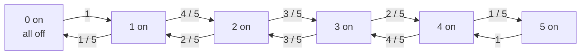

# Quant 2 · Markov Chains: State Compression and Expected Time

The core of a Markov problem is compressing a random process into a finite set of states. If the distribution of the next step depends only on the current state and not on earlier history, the process can be modeled as a Markov chain.

These problems often appear in quant and probability interviews:

```text
What is the current state?
What is the probability of moving from the current state to each next state?
Are we looking for a hitting time, return time, or long-run proportion?
Can we write equations using first-step analysis?
Is there a shortcut using the stationary distribution?
```

The representative problem in this note asks for the expected time until five randomly toggled light bulbs first return to the all-off state. It demonstrates two solutions:

```text
first-step equations:
  Write an expectation equation for each state.

stationary return time:
  First find the long-run distribution, then use return time = 1 / pi_i.
```

## Contents

1. [Markov chain basics](#markov-chain-basics)
2. [The Chapman-Kolmogorov equation](#the-chapman-kolmogorov-equation)
3. [State augmentation: building a Markov chain from a non-Markov process](#state-augmentation-building-a-markov-chain-from-a-non-markov-process)
4. [First-step analysis](#first-step-analysis)
5. [Stationary distribution and return time](#stationary-distribution-and-return-time)
6. [Example 1: Two-state weather](#example-1-two-state-weather)
7. [Example 2: Gambler's ruin](#example-2-gamblers-ruin)
8. [Example 3: Five-light-bulb toggling](#example-3-five-light-bulb-toggling)
9. [Five-light-bulb solution 1: State compression and equations](#five-light-bulb-solution-1-state-compression-and-equations)
10. [Five-light-bulb solution 2: Stationary return time](#five-light-bulb-solution-2-stationary-return-time)
11. [Common pitfalls](#common-pitfalls)
12. [One-sentence summary](#one-sentence-summary)

---

## Markov chain basics

A discrete-time Markov chain consists of two parts:

```text
state space: all possible states
transition probability: the probability of moving from state i to state j in one step
```

The Markov property is:

$$
P(X_{t+1}=j \mid X_t=i, X_{t-1}, \ldots, X_0)
= P(X_{t+1}=j \mid X_t=i)
$$

In other words, the next step depends only on the current state.

For a finite state space, the transition probabilities can be written as a matrix:

$$
P_{ij} = P(X_{t+1}=j \mid X_t=i)
$$

Example: the weather has only two states, Sunny and Rainy.

```text
Sunny -> Sunny: 0.8
Sunny -> Rainy: 0.2
Rainy -> Sunny: 0.4
Rainy -> Rainy: 0.6
```

The transition matrix is:

$$
P =
\begin{bmatrix}
0.8 & 0.2 \\
0.4 & 0.6
\end{bmatrix}
$$

---

## The Chapman-Kolmogorov equation

The one-step transition probability is $P_{ij}$, but many problems need the probability of landing in some state after `n` steps:

$$
P_{ij}^{(n)} = P(X_{t+n} = j \mid X_t = i)
$$

The Chapman-Kolmogorov equation splits the `n`-step transition probability into two legs: take `m` steps to some intermediate state `k`, then take the remaining `n - m` steps from `k`:

$$
P_{ij}^{(m+n)} = \sum_k P_{ik}^{(m)} P_{kj}^{(n)}
$$

The derivation needs only the law of total probability plus one use of the Markov property:

$$
\begin{aligned}
P_{ij}^{(m+n)}
&= P(X_{t+m+n}=j \mid X_t=i) \\
&= \sum_k P(X_{t+m}=k,\, X_{t+m+n}=j \mid X_t=i) \\
&= \sum_k P(X_{t+m}=k \mid X_t=i)\, P(X_{t+m+n}=j \mid X_{t+m}=k,\, X_t=i) \\
&= \sum_k P(X_{t+m}=k \mid X_t=i)\, P(X_{t+m+n}=j \mid X_{t+m}=k) \\
&= \sum_k P_{ik}^{(m)} P_{kj}^{(n)}
\end{aligned}
$$

The third step expands over the intermediate state `k` using the law of total probability. The fourth step is where the Markov property does the work: once $X_{t+m}=k$ is known, the distribution of $X_{t+m+n}$ no longer depends on the earlier $X_t$.

In matrix form:

$$
P^{(m+n)} = P^{(m)} P^{(n)}
$$

Since $P^{(1)} = P$, applying this repeatedly gives: the `n`-step transition matrix is the `n`-th power of the transition matrix:

$$
P^{(n)} = P^n
$$

Verify this with the Sunny / Rainy transition matrix from above. The two-step transition matrix:

$$
P^2 =
\begin{bmatrix}
0.8 & 0.2 \\
0.4 & 0.6
\end{bmatrix}^2
=
\begin{bmatrix}
0.72 & 0.28 \\
0.56 & 0.44
\end{bmatrix}
$$

The three-step transition matrix can be computed directly as $P^3 = P \cdot P \cdot P$, or split via the Chapman-Kolmogorov equation into `1 + 2` steps:

$$
P^{(3)} = P^{(1)} P^{(2)} = P \cdot P^2
$$

Working out just the entry for staying Sunny after three steps:

$$
P_{SS}^{(3)} = P_{SS}^{(1)} P_{SS}^{(2)} + P_{SR}^{(1)} P_{RS}^{(2)} = 0.8 \times 0.72 + 0.2 \times 0.56 = 0.688
$$

Both routes give the same matrix:

$$
P^3 =
\begin{bmatrix}
0.688 & 0.312 \\
0.624 & 0.376
\end{bmatrix}
$$

```text
What the Chapman-Kolmogorov equation does:
Splits an m+n-step problem into "m steps, then n steps,"
summing over the intermediate state in between.
The matrix form is the easiest to remember:
the n-step transition matrix is the transition matrix raised to the n-th power.
```

---

## State augmentation: building a Markov chain from a non-Markov process

If the distribution of the next step depends not only on the current state but also on the state one step further back (or earlier still), the process does not satisfy the Markov property on the original state space. But as long as "how many past steps the future depends on" is finite and fixed, the state can be redefined as a combination of the most recent few steps, restoring the Markov property on the new state space.

The general principle: if the distribution of $Y_{t+1}$ depends on both $Y_t$ and $Y_{t-1}$, define a new state $X_t = (Y_{t-1}, Y_t)$. Since the distribution of $X_{t+1} = (Y_t, Y_{t+1})$ is determined entirely by $X_t = (Y_{t-1}, Y_t)$, with no need to look further back, $\{X_t\}$ is a first-order Markov chain on the new state space.

### An example that fails the Markov property

Suppose there are three cities, A, B, and C, and the next city depends not only on the current city but also on the previous one:

```text
Coming from A to B, the probability of going to C next is 0.5
Coming from C to B, the probability of going to C next is 0.3
```

In both "A to B" and "C to B," the current city is B, but the probability of going to C next differs (0.5 versus 0.3). If the state is just "current city," the next step's distribution still depends on the previous city, so the Markov property fails.

### State augmentation: redefining the state as an ordered pair

Redefine the state as the ordered pair "(previous city, current city)." The new state space is:

$$
\{AA, AB, AC, BA, BB, BC, CA, CB, CC\}
$$

where state $AB$ means "the previous city was A and the current city is B." The full transition rule needs to be specified: for every (previous city, current city) combination, the distribution of the next city.

| Previous, current | Next = A | Next = B | Next = C |
|---|---|---|---|
| A, A | 0.5 | 0.3 | 0.2 |
| A, B | 0.1 | 0.4 | 0.5 |
| A, C | 0.3 | 0.3 | 0.4 |
| B, A | 0.4 | 0.4 | 0.2 |
| B, B | 0.2 | 0.5 | 0.3 |
| B, C | 0.3 | 0.2 | 0.5 |
| C, A | 0.5 | 0.2 | 0.3 |
| C, B | 0.2 | 0.5 | 0.3 |
| C, C | 0.3 | 0.3 | 0.4 |

Each row sums to 1, so this is a valid table of conditional distributions.

On the new state space, the transition rule is: if the current state is $XY$ (previous city X, current city Y), the next city Z is drawn from the distribution in row (X, Y) of the table above, and the new state becomes $YZ$. For example, from state $AB$, if the next city is C, the new state is $BC$; this transition depends only on the current state $AB$, with no need to look further back, so the Markov property holds again on the new state space.

The new state space has 9 states, but from any given state, at most 3 next states are reachable: from $XY$, the only reachable states are $YA$, $YB$, and $YC$, since the new state's first character must equal the old state's second character. The transition matrix is sparse, which is a general feature of state augmentation: the augmented state space grows, but the number of outgoing edges per state does not.

### Verifying with one concrete calculation

Starting from state $AB$ (previous city A, current city B), what is the probability of landing in state $CC$ (the last two cities both C) after two more steps?

The first step, from $(A,B)$, goes to C with probability 0.5 (row A, B in the table); after this step the state becomes $BC$. The second step, from $(B,C)$, goes to C with probability 0.5 (row B, C in the table). Both steps must land exactly on "go to C" to reach state $CC$:

$$
P(X_2 = CC \mid X_0 = AB) = 0.5 \times 0.5 = 0.25
$$

This result can also be verified using the Chapman-Kolmogorov equation from the previous section, applied to the $9 \times 9$ transition matrix over the augmented state space: fill in the $9 \times 9$ transition matrix following the rule above, then compute the entry of its square at position $(AB, CC)$, which is again 0.25.

```text
Signal that a state fails the Markov property:
Under the same "current state," the transition probabilities differ
because of earlier history.

Fix:
Redefine the state as a combination of the most recent k steps.
As long as k is finite and fixed, the Markov property holds again
on the new state space, at the cost of the state count growing from
|S| to at most |S|^k.
```

---

## First-step analysis

The most common tool for finding an expected time is first-step analysis.

Let:

```text
E_i = expected number of steps needed to reach the target state from state i
```

If `i` is already the target state:

$$
E_i = 0
$$

Otherwise, take one step at a cost of 1 second, then continue according to the state reached:

$$
E_i = 1 + \sum_j P_{ij} E_j
$$

This equation is the main template for Markov-chain expectation problems.

Its intuition is simple:

```text
total time = one initial step + expected remaining time from the next state
```

---

## Stationary distribution and return time

A stationary distribution is a long-run stable distribution $\pi$ satisfying:

$$
\pi P = \pi,\qquad \sum_i \pi_i = 1
$$

If the chain is finite, irreducible, and positive recurrent, then the expected time to return to state `i` for the first time, starting from `i`, is:

$$
\mathbb{E}_i[T_i^+] = \frac{1}{\pi_i}
$$

This identity is called the mean recurrence time formula.

Its meaning is:

```text
In the long run, the system spends a pi_i fraction of its time in state i.
Therefore, state i appears once every 1 / pi_i steps on average.
```

The formula does not apply directly to every problem, but it is very useful when asked for the expected time to return to a starting state.

---

## Example 1: Two-state weather

Problem:

```text
The weather state is Sunny or Rainy.
If today is Sunny, tomorrow is Sunny with probability 0.8.
If today is Rainy, tomorrow is Sunny with probability 0.4.
Starting from Sunny, how many days do we expect to wait until it rains for the first time?
```

Only two states are needed:

```text
S = Sunny
R = Rainy
```

The target is the first visit to `R`.

Let:

```text
E_S = expected number of days to reach Rainy from Sunny
E_R = 0
```

Starting from Sunny:

$$
E_S = 1 + 0.8E_S + 0.2E_R
$$

Since `E_R = 0`:

$$
E_S = 1 + 0.8E_S
$$

Therefore:

$$
0.2E_S = 1,\qquad E_S = 5
$$

The answer is `5` days.

This example is equivalent to a geometric distribution: each day has probability `0.2` of being the first rainy day, so the expected waiting time is `1 / 0.2 = 5`.

---

## Example 2: Gambler's ruin

Problem:

```text
A gambler currently has i dollars.
In each round, the gambler wins 1 dollar with probability p and loses 1 dollar with probability q = 1 - p.
The game ends upon reaching 0 or N.
Starting from i, find the probability of eventually reaching N.
```

Let:

```text
h_i = probability of eventually reaching N when starting from i
```

Boundary conditions:

$$
h_0 = 0,\qquad h_N = 1
$$

Intermediate states satisfy:

$$
h_i = p h_{i+1} + q h_{i-1}
$$

When `p = q = 1/2`, the solution is linear:

$$
h_i = \frac{i}{N}
$$

This example demonstrates another common use of a Markov chain: instead of finding an expected time, we find a hitting probability. The template is still the same:

```text
answer at the current state = weighted average of the answers at the next states
```

---

## Example 3: Five-light-bulb toggling

Problem:

```text
There are 5 lights, all initially off.
Each second, one light is chosen uniformly at random and toggled:
an on light is turned off, and an off light is turned on.

Starting from the all-off state, after at least one operation, what is the expected
waiting time until the system first returns to the "all 5 lights off" state?
```

Initially, all 5 bulbs are off. The question asks when they are all off "again," so the time cannot be 0. At least one bulb must be toggled before the system returns to the all-off state.

### State compression

We do not need to record exactly which bulbs are on. We only need the number of bulbs currently on.

Define the state:

```text
k = current number of bulbs that are on
```

Then `k` can take the values:

```text
0, 1, 2, 3, 4, 5
```

If `k` bulbs are currently on:

- an on bulb is chosen with probability `k / 5`, after which the number of on bulbs becomes `k - 1`
- an off bulb is chosen with probability `(5 - k) / 5`, after which the number of on bulbs becomes `k + 1`

This is therefore a birth-death Markov chain:


```mermaid
flowchart LR
  S0["0 on<br/>all off"] -->|"1"| S1["1 on"]
  S1 -->|"1 / 5"| S0
  S1 -->|"4 / 5"| S2["2 on"]
  S2 -->|"2 / 5"| S1
  S2 -->|"3 / 5"| S3["3 on"]
  S3 -->|"3 / 5"| S2
  S3 -->|"2 / 5"| S4["4 on"]
  S4 -->|"4 / 5"| S3
  S4 -->|"1 / 5"| S5["5 on"]
  S5 -->|"1"| S4
```

Starting from `0`, the first second must turn one bulb on:

```text
0 -> 1
```

Therefore, the answer is:

$$
1 + E_1
$$

where `E_k` is the expected time to first reach `0` when starting with `k` bulbs on.

---

## Five-light-bulb solution 1: State compression and equations

Boundary condition:

$$
E_0 = 0
$$

For `1 <= k <= 4`:

$$
E_k
= 1 + \frac{k}{5}E_{k-1} + \frac{5-k}{5}E_{k+1}
$$

For `k = 5`:

$$
E_5 = 1 + E_4
$$

When all 5 lights are on, toggling any one of them leaves 4 lights on.

Writing out the equations:

$$
\begin{aligned}
E_1 &= 1 + \frac{1}{5}E_0 + \frac{4}{5}E_2 \\
E_2 &= 1 + \frac{2}{5}E_1 + \frac{3}{5}E_3 \\
E_3 &= 1 + \frac{3}{5}E_2 + \frac{2}{5}E_4 \\
E_4 &= 1 + \frac{4}{5}E_3 + \frac{1}{5}E_5 \\
E_5 &= 1 + E_4
\end{aligned}
$$

Together with `E_0 = 0`, the solution is:

```text
E_1 = 31
E_2 = 37.5
E_3 = 38.75
E_4 = 37.5
E_5 = 38.5
```

The problem starts with all lights off, but the first second always moves to `1`:

$$
\mathbb{E}[\text{return to all off}]
= 1 + E_1
= 32
$$

Answer:

```text
32 seconds
```

### Manual check

From the first equation:

$$
E_1 = 1 + \frac{4}{5}E_2
$$

If `E_2 = 37.5`:

$$
E_1 = 1 + 30 = 31
$$

Adding the first step from the initial state:

$$
1 + E_1 = 32
$$

---

## Five-light-bulb solution 2: Stationary return time

This problem also has a much faster solution.

The full state is not `k = 0..5`, but the on/off configuration of every light:

```text
00000, 00001, 00010, ..., 11111
```

There are:

$$
2^5 = 32
$$

configurations.

Each step chooses one bit and flips it, so the state graph is a 5-dimensional hypercube. This random walk is symmetric, so its stationary distribution is uniform:

$$
\pi(x) = \frac{1}{32}
$$

The stationary probability of the all-off state `00000` is:

$$
\pi(00000) = \frac{1}{32}
$$

By the mean recurrence time formula:

$$
\mathbb{E}_{00000}[T_{00000}^+]
= \frac{1}{\pi(00000)}
= 32
$$

The answer is again:

```text
32 seconds
```

The key is to interpret "all off again" as the first positive return time starting from `00000`, rather than as a hitting time to `00000` from another state.

---

## Common pitfalls

### 1. Answering 0

All lights are indeed off initially, but the problem asks for the system to "return to all off." The return time here is:

```text
T_0^+ = min{t >= 1 : X_t = 0}
```

So the answer cannot be 0.

### 2. Directly using a geometric distribution with `p = 1/32`

The long-run fraction of time spent in the all-off state is `1/32`, but the events at different times are not independent Bernoulli trials.

The answer is 32 because of the Markov-chain return-time theorem, not because the lights are independently all off with probability `1/32` each second.

### 3. Forgetting the first step after compressing the state

In the compressed chain, `E_1 = 31` is the expected time to return to all off starting with one light on.

The problem starts with all lights off, and the first step must turn one light on, so the total time is:

```text
1 + E_1 = 32
```

### 4. Checking the Markov property after state compression

Here we can record only the number of lights on because the transition probabilities depend only on `k`:

```text
P(k -> k - 1) = k / 5
P(k -> k + 1) = (5 - k) / 5
```

If the next-step probabilities also depended on which particular lights were on, compression to `k` alone would not be valid; the fix is the state-augmentation approach described earlier: widen the state definition to include enough history, rather than forcing the Markov property onto an under-specified compressed state.

---

## One-sentence summary

```text
Expected time in a Markov chain = first-step equation.
Expected return time to a starting state = 1 / stationary probability.
The n-step transition matrix equals the transition matrix raised to the n-th
power; that is the matrix form of the Chapman-Kolmogorov equation.
When a state fails the Markov property, widening it to a combination of the
most recent k steps restores it.
The five-light-bulb problem has 2^5 = 32 equally likely full states,
so the mean return time to the all-off state is 32 seconds.
```
